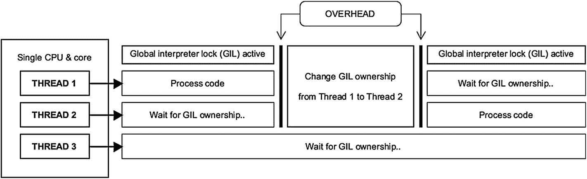
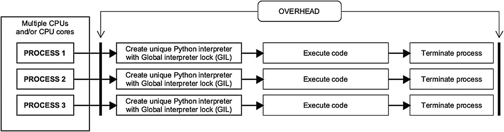

# 6.现在是完全不同的东西:高级 Python

在前一章中我们已经深入了解了 Java 的世界，现在是时候用 Python 做同样的事情了。我们将从文件操作开始，转到多线程和本章后面的其他更高级的主题。这里的目的是为您提供 Python 中一些更深层机制的坚实基础，以便您以后根据需要进行构建。

## Python 文件操作

为了在 Python 中打开文件，我们使用了名副其实的 *open( )* 函数。它使用以下语法:*【文件对象名=打开(文件名，访问模式，缓冲)*。最后两个属性是可选的。Python 的 open()函数的一个简单示例如下:

```java
happyfile = open("happytext.txt")

```

现在，Python 使用所谓的*访问模式*进行文件操作。不是所有的文件都需要写入或附加到文件中，有时你需要做的只是从一个文件中读取。Python 的文件访问模式列表见表 [6-1](#Tab1) 。

表 6-1

十二种 Python 文件访问模式

<colgroup><col class="tcol1 align-left"> <col class="tcol2 align-left"> <col class="tcol3 align-left"> <col class="tcol4 align-left"></colgroup> 
| r | 以只读模式打开文件。这是 Python 中的默认访问模式 | w+ | 以读/写模式打开文件；如果文件已经存在，则覆盖它 |
| 元素铷的符号 | 以只读二进制模式打开文件 | wb+ | 以读/写二进制模式打开文件；如果文件已经存在，则覆盖它 |
| r+ | 以读/写模式打开文件 | a | 打开要追加到的文件。如果文件不存在，则创建一个 |
| rb+ | 以读/写二进制模式打开文件 | 腹肌 | 打开一个二进制文件以追加到。如果文件不存在，则创建一个 |
| w | 以只写模式打开文件；如果文件已经存在，则覆盖它 | a+ | 打开文件进行追加和读取。如果文件不存在，则创建一个 |
| 世界银行 | 以只写二进制模式打开文件；如果文件已经存在，则覆盖它 | ab+ | 以二进制模式打开文件进行追加和读取。如果文件不存在，则创建一个 |

*缓冲*在 Python 的文件操作上下文中，指的是将文件的一部分存储在临时内存区域，直到文件被完全加载的过程。基本上，零(0)值关闭缓冲，而一(1)值启用缓冲，例如， *somefile = open("nobuffer.txt "，" r "，1)* 。如果没有给定值，Python 将使用系统的默认设置。通常保持缓冲是一个好主意，这样可以提高文件操作的速度。

## Python 中的文件属性

Python 中基本上有四个主要的文件属性(其中一个大部分是历史感兴趣的，即 *softspace* )。如果您的项目包含哪怕是最少量的文件操作，您可能会对它们都非常熟悉。参见表 [6-2](#Tab2) 了解 Python 中这些属性的概要。

表 6-2

四个 Python 文件对象属性

<colgroup><col class="tcol1 align-left"> <col class="tcol2 align-left"> <col class="tcol3 align-left"></colgroup> 
| 

属性

 | 

描述

 | 

例子

 |
| --- | --- | --- |
| 。名字 | 返回一个文件名 | happyfile = open（"happytext.txt"）打印(happyfile.name) |
| 。方式 | 返回文件访问模式 | another file = open(" whacky text . txt ")打印(另一个文件.模式) |
| 。关闭的 | 如果文件关闭，返回“真” | apess _ file = open(" super text . txt ")apress_file.close()如果打印(apress_file.closed):print("文件关闭！") |
| 。软空间 | 如果 print 语句要在第一项前插入一个空格字符，则返回“false”。历史:从 Python 3.0 开始过时 | file5 = open("jollyfile.txt ")print("软空间集？"文件 5 .软空间) |

## 实用文件存取

文件需要在 Python 中保持打开状态才能被操作；设置为关闭的文件无法写入或检查其属性。参见清单 [6-1](#PC2) 中关于文件访问以及如何用 Python 读取文件属性的演示。

```java
# Import a special module, time, for the sleep() method
import time
file1 = open("apress.txt", "wb") # Create/open file
print("File-name: ", file1.name) # Start reading file attributes
print("Opening mode: ", file1.mode)
print("Is file closed? ", file1.closed)
time.sleep(1) # Sleep/delay for one second, for the suspense
file1.close() # Close file
print("Now we closed the file..");
time.sleep(1.5) # Sleep/delay for 1.5 seconds
print("File is closed now? ", file1.closed)

Listing 6-1A listing in Python demonstrating some basic file operations

```

## Python 中的目录操作

目录或文件夹是任何操作系统的文件管理系统的重要组成部分；Python 也提供了处理它们的方法。接下来让我们看看一些目录操作(参见清单 [6-2](#PC3) )。

```java
import os # import the os module for directory operations
print("Current directory:", os.getcwd()) # Print current directory using getcwd()
print("List of files:", os.listdir()) # List files in directory using listdir()
os.chdir('C:\\') # Change to the (most common) Windows root-directory
print("New directory location:", os.getcwd()) # Print current directory again

print("Let's make a new directory and call it JollyDirectory")
os.mkdir('JollyDirectory') # Make a new directory using mkdir()
print("List of files in JollyDirectory:", os.listdir('JollyDirectory'))

Listing 6-2A listing in Python demonstrating directory operations

```

至于重命名目录，我们会使用 *os.rename("Somedirectory "，" Newname")* 。一旦一个目录不再需要，并且首先是空的文件，只需要*OS . rmdir(" some directory ")*就可以删除它。

## 文件名模式匹配

我们有办法在 Python 中找到匹配特定命名模式的文件。从清单 [6-3](#PC4) 中可以明显看出，这些实现起来相当简单。

```java
import os
import fnmatch

# Display all files in Windows root with .txt/.rtf extension
for filename in os.listdir('C:\\'):
     if filename.endswith('.txt') or filename.endswith('.rtf'):
         print(filename)
# Display all files with .txt extension starting with 'a'
for filename in os.listdir('C:\\'):
     if fnmatch.fnmatch(filename, 'a*.txt'):
        print(filename)

Listing 6-3A listing in Python demonstrating file name pattern matching

```

在清单 [6-3](#PC4) 中，我们引入了两个方便的函数来定位具有特定命名约定的文件，即 *endswith()* 和 *fnmatch()* 。后者提供了所谓的基于通配符的 Python 项目搜索(例如，*文件*)。txt* 还是*？？？？name.txt* )。

## 用 Glob 搜索文件？

术语 *globbing* 指的是在特定目录(或者 Python 的当前工作目录，如果没有指定的话)中执行高度精确的文件搜索。术语 *glob* ，是 *global* 的缩写，起源于基于 Unix 的操作系统世界。在清单 [6-4](#PC5) 中，您将看到这种方法得到了很好的应用。

```java
import glob
# Using * pattern
print("\nGlobbing with wildcard pattern * (*.py)")
for name in glob.glob("*.py"):
    print(name)
# Using ? pattern
print("\nGlobbing with wildcard ? and * (??????.*)")
for name in glob.glob("??????.*"):
    print(name)
# Using [0-9] pattern
print("\nGlobbing with wildcard range [0-9]")
for name in glob.glob("*[0-9].*"):
    print(name)
# Using [b-x] pattern
print("\nGlobbing with wildcard range [b-x]")
for name in glob.glob("*[b-x].*"):
    print(name)

Listing 6-4A listing in Python demonstrating file searches by globbing

```

## Python 中的日期

您可能还记得上一章中用 Java 显示时间和日历数据的强大工具。Python 在计时方面也提供了同样多的功能。这些功能驻留在 datetime 模块中(参见清单 [6-5](#PC6) )。

```java
import datetime
from datetime import timedelta

time1 = datetime.datetime.now() # Create a datetime-object for right now
print("The time is:", time1) # Display current time unformatted
# Display formatted day and month (%A for day of the week, %B for month)
print("In other words it's a", time1.strftime("%A in %B"))
# Reduce time1.year-variable by ten
print("Ten years ago it was", time1.year-10)
# Use timedelta to move thirty days into the future
futuredate = datetime.timedelta(days=30)
futuredate += time1 # Add the current date to futuredate
print("Thirty days into the future it'll be", futuredate.strftime("%B"))

Listing 6-5A listing demonstrating some time and calendar functions in Python

```

虽然清单 [6-5](#PC6) 相当简单，但我们应该更好地看看 Python 中的一些格式标记，以满足所有与日期相关的需求(见表 [6-3](#Tab3) )。

表 6-3

Python 中一些常见的日期格式标记

<colgroup><col class="tcol1 align-left"> <col class="tcol2 align-left"> <col class="tcol3 align-left"> <col class="tcol4 align-left"></colgroup> 
| %A | 一周中的一整天(例如，星期一) | %B | 月份的全名(例如，三月) |
| %a | 一周中较短的一天(例如，星期一) | %b | 月份的简称(例如，Mar) |
| %Z | 时区(例如，UTC) | %H | 24 小时制(例如，18) |
| %p | 上午/下午 | %I | 小时，12 小时制 |

## 正则表达式的威严

一个*正则表达式*，通常简称为 *RegEx* ，是一个字符序列，构成了字符串的搜索模式。导入一个简单的叫做 *re* 的代码模块允许我们在 Python 中执行正则表达式工作。您可以使用正则表达式来查找具有特定搜索模式的文件，以及在众多类型的文本文件中查找特定的术语。参见清单 [6-6](#PC7) 首次演示它们是如何工作的。

```java
import re
text1 = "Apress is the best publisher"
regex1 = re.findall("es", text1) # Create a RegEx-object with search-pattern
print("Looking for all instances of 'es'")
print("We found", len(regex1), "matches in", text1)

Listing 6-6A simple example of using regular expressions in Python

```

在清单 [6-6](#PC7) 中，我们调用 findall 方法在字符串变量 *text1* 中寻找“es”的实例。我们还使用 Python 的 len()方法对存储在 list *regex1* 中的实例进行计数。现在，是时候看看 RegEx 魔术的另一个演示了(见清单 [6-7](#PC8) )。

正则表达式实际上可以追溯到 1951 年，当时是由美国数学家*斯蒂芬·科尔·克莱尼(1909–1994)提出的。如今，正则表达式是许多流行的编程语言中的主要部分，包括 Perl、C#和 Java。后两种语言中的正则表达式实现将在本书的后面部分探讨。*

```java
import re
# Summon search-method from the regex module, re
match1 = re.search('Apress', 'Apress is the best')
if match1: # This is shorthand for "if match1 == True:"
    print(match1) # Display object contents if match found

happytext = "My name is Jimmy" # Create a string variable
match2 = re.search('Jimmy', happytext)
if match2:
    print(match2)

# Use fullmatch-method from re on string "happytext"
match3 = re.fullmatch('Jimmy', happytext)
if match3:
    print("Match found for 'Jimmy'!") # This message will not display
else:
    print("No Match for 'Jimmy'")

match3 = re.fullmatch('My name is Jimmy', happytext)
if match3:
    print(match3)

# Use match-method
match4 = re.match('the', 'Apress is the best')
if match4:
    print(match4) # This message will not display
    # match() only looks for patterns from the beginning of a string
else:
    print("No Match for 'the'")
match5 = re.match('Apress', 'Apress is the best')
if match5:
    print(match5) # This message will display

Listing 6-7A listing in Python demonstrating search( ) and fullmatch( ) RegEx methods in Python

```

在清单 [6-7](#PC8) 中，我们使用了 search()、match()和 fullmatch()。你可能会问它们之间有什么区别。search 方法遍历给定模式的整个字符串，而 fullmatch 仅在字符串完全反映模式时返回 true。match 方法只查找字符串开头的模式。

## 元字符

正则表达式最好与*元字符*一起使用。这些基本上是更高级的字符串相关搜索的构建块。参见表 [6-4](#Tab4) 中一些重要元字符的概要，以及清单 [6-8](#PC9) 中它们用法的一点演示。

表 6-4

一些重要的 Python 元字符

<colgroup><col class="tcol1 align-left"> <col class="tcol2 align-left"> <col class="tcol3 align-left"> <col class="tcol4 align-left"></colgroup> 
| \w | 任何消息。通常指字母数字 | \s | 空白 |
| \W | 任何非单词 | \S | 非空白 |
| \d | 任何数字 | 。 | 任何单个字符 |
| \D | 任何非数字 | * | 零个或多个字符 |

```java
import re
match1 = re.search('.....', 'Hello there!')
if match1: # This is shorthand for "if match1 == True:"
    print(match1) # Displays "Hello"

match2 = re.search('\d..', 'ABC123')
if match2:
    print(match2) # Displays "123"

match3 = re.search('\D*', 'My name is Reginald123456.')
if match3:
    print(match3) # Displays "My name is Reginald"

match4 = re.search('y *\w*', 'Hello. How are you?')
if match4:
    print(match4) # Displays "you"

match5 = re.search('\S+', 'Hello. Whats up?')
if match5:
    print(match5) # Displays "Hello."

Listing 6-8A listing in Python demonstrating the use of metacharacters in regular expressions

```

在清单 [6-8](#PC9) 中，对于 *match4* ，我们使用元字符 *\w* ，它指的是寻找任何完整单词的匹配。如果没有这个字符，我们会看到输出“y”而不是“you”

让我们学习更多关于 Python 中元字符的知识。参见表 [6-5](#Tab5) 中的八个更重要的正则表达式标记，以及清单 [6-9](#PC10) 中的第二个演示。

表 6-5

一些更重要的 Python 元字符

<colgroup><col class="tcol1 align-left"> <col class="tcol2 align-left"> <col class="tcol3 align-left"> <col class="tcol4 align-left"></colgroup> 
| \. | 文字点(例如，句号字符) | $ | 匹配行尾 |
| ？ | 零或一个字符 | { n } | 出现 n 次 |
| + | 一个或多个字符 | [a-z] | 字符集 |
| ^ | 匹配行首 | [0-9] | 数字字符集 |

```java
import re
string1 = 'Beezow Doo-doo Zopittybop-bop-bop'
patterns = [r'Do*', # D and zero or more o's (*)
            r'Be+', # B and one or more e's (+)
            r'Do?', # D and zero or one o's (?)
            r'it{2}', # i and two t's
            r'[BDZ]\w*', # Look for full words starting with B, D, or Z
            r'^Be\w*', # Look for a full word starting with "Be"
            r'...$' # Look for the three last digits in the string
            ]
def discover_patterns(patterns, string1): # Create our method
    for pattern in patterns:
        newpattern = re.compile(pattern) # Summon compile()
        print('Looking for {} in'.format(pattern), string1)
        print(re.findall(newpattern, string1)) # Summon findall()

discover_patterns(patterns, string1) # Execute our method

Listing 6-9Another listing in Python demonstrating the use of metacharacters in regular expressions

```

清单 [6-9](#PC10) 中的列表结构*模式*包含七个搜索，而*字符串 1* 存储我们的源材料。这两个数据结构将被输入到我们接下来创建的方法 *discover_patterns* 中。

在我们的这个新方法中，我们使用了 Python 的两个 RegEx 函数: *compile( )* 和 *findall( )* 。对于前者，我们将 RegEx 模式转换成模式对象，然后用于模式匹配。这种方法在重复使用搜索模式的情况下最为有效，比如数据库访问。

Findall 用于发现字符串中搜索模式的所有匹配项。清单中的 *r'* 让 Python 知道一个字符串被认为是“原始字符串”，这意味着其中的反斜杠将在没有特殊函数的情况下被解释。例如， *\n* 不会表示原始字符串中的换行符。

## 正则表达式带来更多欢乐

接下来让我们探索 RegEx 的更多高级特性。清单 [6-10](#PC11) 展示了两个新方法的使用: *group( )* 和 *sub( )* (为了方便起见，以粗体显示)。此外，我们将和我们的老朋友在 RegEx 中使用一项新技术 search()。

```java
import re
string1 = "Today's dessert: banana"
# Summon search() with four options for a match
choice1 = re.search(r"dessert.*(noni-fruit|banana|cake|toilet-paper)", string1)
if choice1:
    print("You'll be having this for", choice1.group(), "!")

string2 = "Have a great day"
string2 = re.sub('great', 'wonderful', string2)
print(string2) # Outputs: Have a wonderful day

string3 = 'what is going on?'
# Replace all letters between a and h with a capital X
string3 = re.sub('([a-h])s*', 'X', string3)
print(string3) # Outputs: wXXt is XoinX on?

Listing 6-10A listing in Python demonstrating the sub( ) method

```

清单 [6-10](#PC11) 中的搜索方法用于比较和定位现在作为方法参数列出的字符串。换句话说，在*字符串 1* 中一共搜索了四种水果。它们由逻辑 or 运算符分隔，用竖线字符表示(即|)。这个方法是用来寻找这些字符串/水果的，但是它们只应该出现在字符串“dessert”的旁边。如果 string1 和 choice1 中的一个条目匹配，程序就会显示出来。

## Python 中的并发和并行

*并行处理*是指同时执行一个以上的计算或指令。你可能还记得上一章中多线程的概念。像 Java 和 C#一样，Python 能够处理多个执行线程。然而，还是有一些主要的区别。Python 的多线程实际上并不是以并行的方式运行线程。相反，它伪并发地执行这些线程。这源于 Python 实现了一个*全局解释器锁(GIL)* 。该机制用于同步线程，并确保整个 Python 项目仅在单个 CPU 上执行；它只是没有利用多核处理器的全部魅力。

虽然*并发*和*并行*是相关的术语，但它们不是同一个术语。前者指的是同时运行独立任务的方法，而后者是将一个任务分成子任务，然后同时执行。

## 多重处理与多线程

Python 中线程的实际并行处理是通过使用多个进程实现的，所有进程都有自己的解释器和 GIL。这被称为*多重处理*。

Python 对并发性的理解可能有点复杂(比如说，与 Java 相比)。现在，Python 中的*进程*不同于*线程*。尽管两者都是独立的代码执行序列，但还是有一些不同之处。一个进程往往比一个线程使用更多的系统内存。流程的生命周期通常也更难管理；它的创建和删除需要更多的资源。螺纹和工艺对比见表 [6-6](#Tab6) 。

表 6-6

Python 中线程和进程的主要区别(例如，多重处理和多线程)

<colgroup><col class="tcol1 align-left"> <col class="tcol2 align-left"> <col class="tcol3 align-left"></colgroup> 
|   | 

过程

 | 

线

 |
| --- | --- | --- |
| 使用单个全局解释器锁(GIL) | 不 | 是 |
| 多个 CPU 内核和/或 CPU | 支持 | 不支持 |
| 代码复杂性 | 不太复杂 | 更复杂 |
| RAM 占用空间 | 巨大的 | 驳船 |
| 可以被打断/杀死 | 是 | 不 |
| 最适合 | CPU 密集型应用、3D 渲染、科学建模、数据挖掘、加密货币 | 用户界面、网络应用 |

Python 有三个用于同时处理的代码模块:多处理、异步和线程。对于 CPU 密集型任务，多处理模块工作得最好。

## 用 Python 实现多线程

正如本章前面所讨论的，Python 中的多线程与全局解释器锁(GIL)机制密切相关。这种方法利用了*互斥*的原理(见图 [6-1](#Fig1) )。由于 Python 多线程中的调度是由操作系统完成的，所以一些开销(即延迟)是不可避免的；这是多重处理通常不会遇到的问题。



图 6-1

使用三个线程的 Python 多线程的部分可视化

是时候实际一点了。让我们看看多线程是如何在 Python 中实现的(参见清单 [6-11](#PC12) )。

```java
import threading
def happy_multiply(num, num2):
    print("Multiply", num, "with", num2, "=", (num * num2))
def happy_divide(num, num2):
    print("Divide", num, "with", num2, "=", (num / num2))

if __name__ == "__main__":
    # Create two threads
    thread1 = threading.Thread(target=happy_multiply, args=(10,2))
    thread2 = threading.Thread(target=happy_divide, args=(10,2))
    # Start threads..
    thread1.start()
    thread1.join() # ..and make sure thread 1 is fully executed
    thread2.start() # before we start thread 2
    thread2.join()
    print("All done!")

Listing 6-11A listing in Python demonstrating elementary use of the threading module

```

我们在清单 [6-11](#PC12) 中创建了两个函数，分别是 *happy_multiply* 和 *happy_divide* 。每个都有两个参数。对于前者，我们用 *num* 乘以 *num2* ，而后者用 *num* 除以 *num2* 。然后结果被简单地打印在屏幕上。

现在，清单 [6-11](#PC12) 中有一个函数您应该密切关注；Python 的 *join( )* 方法确保线程在继续处理清单之前已经完全完成了处理。如果您删除了行 *thread1.join( )* ，清单 [6-4](#PC5) 的输出将会是一片混乱。

并发处理环境中的*竞争条件*是指两个或多个进程同时修改资源(如文件)的场景。最终结果取决于哪个进程先到达那里。这被认为是不理想的情况。

## 在 Python 中实现多重处理



图 6-2

使用三个进程的 Python 多重处理的部分可视化

尽管多处理方法通常会产生 CPU 效率高的代码，但仍然会出现一些小的开销问题。如果 Python 中的多处理项目有这些问题，它们通常发生在进程的初始化或终止期间(见图 [6-2](#Fig2) )。

现在，为了简单演示 Python 的多处理模块，请参见清单 [6-12](#PC13) 。

```java
import time
import multiprocessing

def counter(): # Define a function, counter()
    name = multiprocessing.current_process().name
    print (name, "appears!")

    for i in range(3):
        time.sleep(1) # Delay for one second for dramatic effect
        print (name, i+1,"/ 3")

if __name__ == '__main__': # Define this listing as "main", the one to execute
    counter1 = multiprocessing.Process(name='Counter A', target=counter)
    counter2 = multiprocessing.Process(name='Counter B', target=counter)
    counter3 = multiprocessing.Process(target=counter) # No name given..

    counter1.start()
    counter2.start()
    counter3.start() # This nameless counter simply outputs "Process-3"

Listing 6-12A listing in Python demonstrating elementary use of the multiprocessing module

```

Python 中的每个进程都有一个名称变量，如清单 [6-12](#PC13) 所示。如果没有定义，将自动分配一个通用标签*进程-[进程号]* 。

## 迭代器、生成器和协同程序

Python 中有三种重要的数据处理机制，它们有时会混淆: *iterables、生成器*和*协程*。**列表**(例如 *happyList[0，1，2]* )是简单的可迭代列表。它们可以根据需要随时阅读，不会出现任何问题。列表中的所有值都会保留，直到明确标记为删除。**生成器**是迭代器，只能被访问一次，因为它们不在内存中存储内容。生成器的创建类似于 Python 中的常用函数，只是它们用关键字 *yield* 代替了 *return。*

当读取大文件的属性时，比如它们的行数，生成器是很有用的。用于这种用途的生成器将产生不是最新的数据，因此不需要，从而避免内存错误并使 Python 程序更有效地运行。

协程是一种独特的函数类型，它可以将控制权让给调用函数，而无需结束它们在进程中的上下文；协程在后台平稳地维护它们的空闲状态。换句话说，它们被用于合作的多任务处理。

## 阿辛西奥:出类拔萃的那个？

Asyncio 是*异步输入/输出*的缩写，是 Python 中为编写并发运行代码而设计的模块。尽管与线程和多处理有相似之处，但它实际上代表了一种不同的方法，称为*协同多任务处理*。asyncio 模块使用在单线程中运行的单个进程提供了一种伪并发性。

在 Python 中使用异步代码意味着什么？用这种方法编写的代码可以安全地暂停，以便项目中的其他代码片段执行它们的任务。异步进程为其他进程提供停机时间来运行它们的进程；这就是如何使用 asyncio 模块实现一种类型的并发性。

## 异步事件循环

异步 Python 项目的主要组件是*事件循环；*我们从这个结构中运行我们的子流程。任务被安排在一个事件循环中，由一个线程管理。基本上，事件循环是为了协调任务，确保我们在使用 asyncio 模块时一切顺利。让我们用清单 [6-13](#PC14) 来看看如何实际实现 asyncio 模块。

```java
import asyncio

async def prime_number_checker(x): # Define a function which takes x as input
    # Go to sleep for one second, potentially letting other functions
    # do their thing while we're asleep
    await asyncio.sleep(1.0)
    message1 = "%d isn't a prime number.." % x # Set default message

    if x > 1:
        for i in range(2, x):
            # Apply the modulo-operator (%) on variable x.
            # If the ensuing remainder does not equal zero, update "message1"
            if (x % i) != 0:
                message1 = "%d is a prime number!" % x
                break # Break out of the loop
    return message1

async def print_result(y): # Define a function which takes y as input
    result = await prime_number_checker(y) # Await for other function to finish
    print(result) # Print results from function prime_number_checker()
happyloop = asyncio.get_event_loop()
# See if 2, 11, and 15 are prime numbers
happyloop.run_until_complete(print_result(2))
happyloop.run_until_complete(print_result(11))
happyloop.run_until_complete(print_result(15))
happyloop.close()

Listing 6-13A listing in Python demonstrating asynchronous chained coroutines and the use of an event loop

```

在清单 [6-13](#PC14) 中，我们寻找质数(即只有两个因子的数:它们本身和 1)。我们定义了两个异步函数/协程， *prime_number_checker(x)* 和 *print_result(y)* ，它们都带有关键字 *async def* ，因为这就是 asyncio 模块的工作方式。

现在，我们定义的第一个函数从行*开始，等待 asyncio.sleep(1.0)* 。与 Python 中常规的 sleep 方法相比，这种异步方法不会冻结程序；相反，它为其他任务在后台完成提供了一个指定的时间段。

第二个协程中的行*result = await prime _ number _ checker(y)*用于确保第一个函数已完成执行。在异步方法中, *Await* 确实是一个不言自明的关键关键词。

为了让我们的异步清单完全运行，我们需要使用事件循环。为此，我们创建了一个新的循环对象， *happyloop，*并调用了一个名为 *asyncio.get_event_loop()* 的函数。尽管事件循环管理有多种多样的函数，但为了清楚起见，我们在这个例子中只讨论前面提到的方法。

接下来，在清单 [6-13](#PC14) 中，函数 *run_until_complete* 实际上执行我们的 *print_result(y)* 函数，直到其各自的任务全部完成。最后，我们通过调用 close 方法来结束我们的事件循环。

## Python 中的并发性:概述

Python 提供的所有处理方法可能会让你感到困惑。因此，让我们回顾一下所涉及的一些核心概念来结束本章(见表 [6-7](#Tab7) )。

表 6-7

Python 中并发编程的主要方法

<colgroup><col class="tcol1 align-left"> <col class="tcol2 align-left"> <col class="tcol3 align-left"></colgroup> 
| **多重处理** | 同时运行多个进程；为每个进程创建一个单独的带全局解释器锁(GIL)的 Python 解释器 | 可以在一个系统中使用多个 CPU 和/或 CPU 内核 |
| **多线程** | 由操作系统确定优先级的计划任务执行。受限于单一的 GIL | 也叫*抢占式多任务处理。*在单个 CPU/内核上运行 |
| **异步处理** | 由任务决定的日程安排受限于单一的 GIL | 又称*协同多任务处理。*运行在单个 CPU/内核上。在 Python 版中引入 |

## Python Lambda 函数

把一个 *lambda 函数*想象成一个一次性函数。Lambda 函数是无名的，而且通常规模很小。它们的语法简单如下:

*   *λ(自变量):(表达式)*

下面是一个简单的 lambda 函数: *sum1 = lambda x，y : x + y* 。对于稍微复杂一点的例子，参见清单 [6-14](#PC15) 。

```java
def happymultiply(b):
  return lambda a : a * b

result1 = happymultiply(5)
result2 = happymultiply(10)
result3 = happymultiply(50)

print("Result 1:", result1(6))
print("Result 2:", result2(6))
print("Result 3:", result3(6))

Listing 6-14A listing demonstrating lambda functions in Python

```

现在，Python 中有三种方法可以很好地处理 lambda 函数: *map( )* 、 *filter( )* 和 *reduce( )* 。Filter()获取一个列表，并创建一个包含所有返回 true 的元素的新列表。Map()还从它处理的 iterables 中创建新的列表；可以把它想象成一个无循环的迭代器函数。最后，我们有 reduce()，它将一个函数应用于一个列表(或其他可迭代的对象)并返回一个值，这有时也将我们从循环中解放出来(参见清单 [6-15](#PC16) )。

```java
from functools import reduce # Import code module needed for reduce()

# Create a list containing seven values
middle_aged = [6, 120, 65, 40, 55, 57, 45]
# Display list before manipulations
print("Ages of all people in the study:", middle_aged)

# Filter list for ages between 40 and 59
middle_aged = list(filter(lambda age: age>=40 and age<60, middle_aged))
print("Middle aged people:", middle_aged)

# Summon map() and double the values in the list "middle_aged"
elderly = list(map(lambda x: x * 2, middle_aged))
print("They will live to:", elderly)

# Summon reduce() to add all elements in "middle_aged" together
total_years = reduce(lambda x, y: x + y, middle_aged)
print("Their combined time spent alive so far:", total_years, "years")

Listing 6-15A listing with a lambda function applied on a filtered list in Python

```

## 在 Python 中压缩

以著名的服装闭合机制拉链命名，Python 中的 *zip* 指的是一种将两个或多个可重复元素结合起来的方法。例如，在用 Python 创建字典数据结构时，压缩是一个很好的工具。不，这种 zip 与流行的归档文件格式 ZIP 没有任何关系，我们将在本章的后面回顾这种格式。

现在，Python 中的 zip 函数接受两个可迭代对象(例如列表)并返回一组元组(参见清单 [6-16](#PC17) )。

```java
# Define two lists
letters1 = ['z', 'a', 'r', 'd', 'o', 'z']
numbers1 = [1, 2, 3, 4, 5, 6]

# Create zip object, zip1, using "letters1" and "numbers1"
zip1 = zip(letters1, numbers1)

for i in zip1: # Display zip contents
    print(i)
# Define new list, "letters2"
letters2 = ['Z', 'A', 'R', 'D', 'O', 'Z']

# Create second zip object, zip2, using "letters1", "numbers1", and "letters2"
zip2 = zip(letters2, numbers1, letters1)

for i in zip2: # Display second zip contents
    print(i)

Listing 6-16A listing in Python demonstrating the zip function

```

## 关于拉链的更多信息

在很多情况下，基本的拉链都不够用。其中之一涉及具有不完整元组的拉链。幸运的是，我们有一个叫做 *zip_longest* 的方法。这个方法在代码模块 *itertools* 中找到，用您选择的占位符数据填充任何缺失的元素。参见清单 [6-17](#PC18) 进行演示。

```java
from itertools import zip_longest
letterlist = ['a', 'b', 'c']
numberlist = [1, 2, 3, 4]
maximum = range(5) # Define zip length and store it into "maximum"
# Summon zip_longest()
zipped1 = zip_longest(numberlist, letterlist, maximum, fillvalue='blank')
# Display zip contents
for i in zipped1:
    print(i)

Listing 6-17A listing in Python demonstrating the zip_longest method

```

你可能想知道 Python 里的一个拉链能不能拉开。答案是响亮的“是”(见清单 [6-18](#PC19) )。

```java
letters = ['A', 'B', 'C', 'D']
numbers = [1, 2, 3, 4]

zipped1 = zip(letters, numbers) # Zip the data
zipped_data = list(zipped1)
print("Here's the zip:", zipped_data)

a, b = zip(*zipped_data) # Unzip the data using the asterisk-operator
print("Next comes the data, unzipped!")
print('Letters:', a)
print('Numbers:', b)

Listing 6-18A listing in Python demonstrating unzipping.

```

## 使用另一个拉链

正如本章前面提到的， *zip* 是一个在计算环境中至少有两种流行含义的词。我们探讨了 Python 中的压缩(和解压缩)，涵盖了第一个含义。现在是时候在任何 Python IDE 中使用另一种 ZIP 文件了，这是一种流行的归档文件格式。

现在，用 ZIP 软件压缩的目录(及其子目录)最终成为一个文件，其大小也往往比未压缩的内容小得多。对于基于网络的文件传输，这显然是一个很好的解决方案。自然，有几种文件压缩解决方案可用，但截至 2021 年，ZIP 仍然是一种无处不在的文件存档格式，可用于所有流行的操作系统。

ZIP 是由菲利普·卡兹和 T2 的加里·康威在 1989 年创建的。ZIP 压缩技术最近被用作 *Java Archive (JAR)* 文件格式 **—** 和许多其他格式的基础。

Python 也喜欢它的 ZIP 文件。我们实际上可以在 Python IDE 中操作它们。有一个代码模块被恰当地称为 *zipfile* 。参见清单 [6-19](#PC20) 中关于如何创建 ZIP 文件以及如何在 Python 中显示其内容的演示。

```java
import os
from os.path import basename
from zipfile import ZipFile # Include ZipFile module

lookfor = "thread" # Create a variable for the string we plan to look for
# Define a new function, make_a_zip
def make_a_zip(dirName, zipFileName, filter):
   # Create a new ZipFile-object with attribute w for (over)writing
   with ZipFile(zipFileName, 'w') as zip_object1:
        # Start iteration of files in the directory specified
        for folderName, subfolders, filenames in os.walk(dirName):
            for file in filenames:
                if filter(file):
                    # Create full file-path
                    filePath = os.path.join(folderName, file)
                    # Add file to zip using write() method
                    zip_object1.write(filePath, basename(filePath))
# Summon make_a_zip() and give it the current directory to work with
# Also only look for filenames with the string "thread" in them
make_a_zip('..', 'happy.zip', lambda name: lookfor in name)
print("All files containing <<", lookfor, ">> in their name are now inside happy.zip!")
# Create a ZipFile Object and load happy.zip into it (using attribute r for reading)
with ZipFile('happy.zip', 'r') as zip_object2:
   # Summon namelist() and store contents in "file_in_zip" variable
   files_in_zip = zip_object2.namelist()
   # Iterate through files_in_zip and print each element
   print("\nThese files were stored in happy.zip:")
   for i in files_in_zip:
       print(i)

Listing 6-19A listing demonstrating the use of ZIP file archives from inside Python

```

在清单 [6-19](#PC20) 中，您将看到 Python 的 ZIP 支持的两个主要机制在起作用:创建一个新的文件归档(即 *happy.zip* )和检索存储在其中的文件名。该示例还向您展示了在将文件收集到归档文件时如何使用基于通配符的功能。在这种情况下，我们将只查找文件名中带有字符串“thread”的文件。

与 *ZipFile* 一起使用的 *with* 语句基本上是为了让我们的清单更加清晰。首先，它们让我们不用使用关闭方法(例如， *happyfile.close( )* )，这些方法通常在文件操作完成后才需要。

清单 [6-19](#PC20) 将在您当前的 Python 目录中执行，因此您的结果可能会有所不同。

我们将在本书的后面回到 Python 语言的复杂性。

## 最后

读完这一章，你将有望学到以下内容:

*   如何使用 Python 打开、创建和删除文件

*   Python 中的基本目录管理

*   正则表达式(RegEx)指什么

*   如何以及何时为正则表达式调用 match()、search()和 fullmatch()

*   如何在 Python 中实现多线程和多处理，它们的主要区别是什么

*   全局解释器锁(GIL)指的是什么

*   使用 *asyncio* 的 Python 异步编程基础

*   lambda 函数有什么用

*   Python 中压缩和使用 ZIP 文件归档的基础知识

第 7 章将会看到我们探索 C#语言更高级的一面。