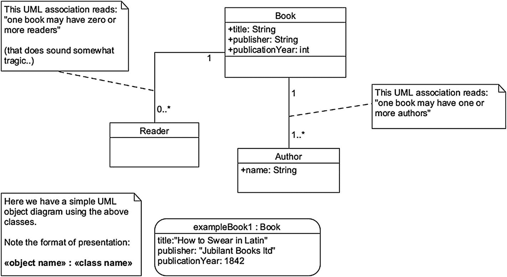
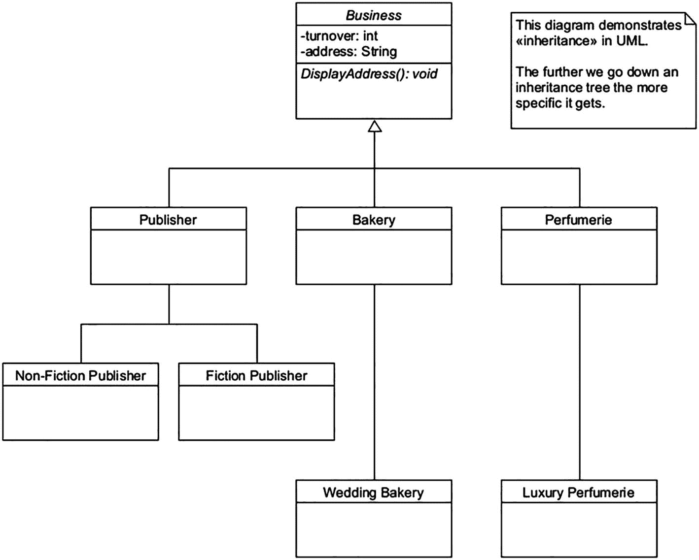
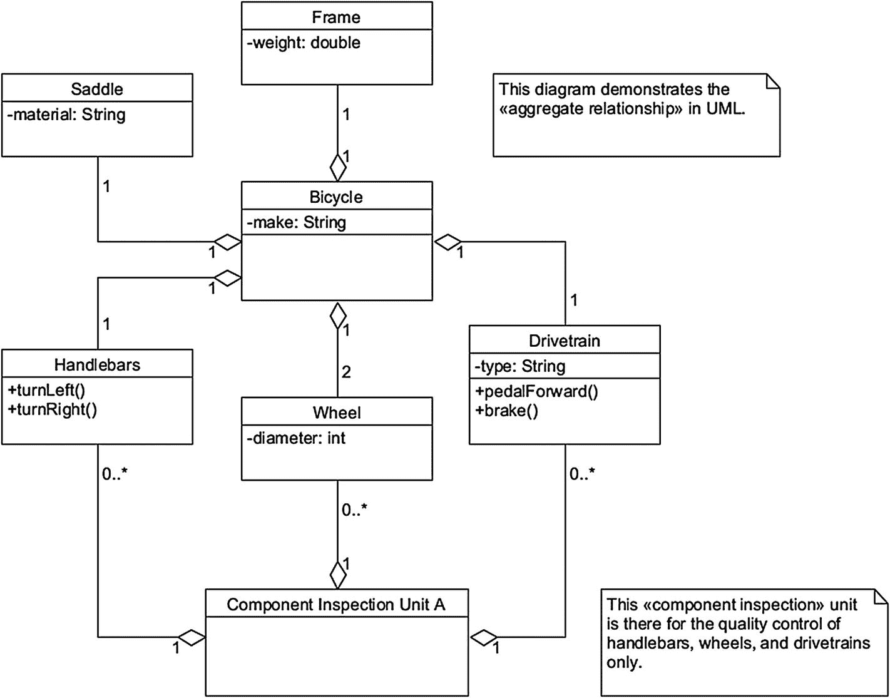
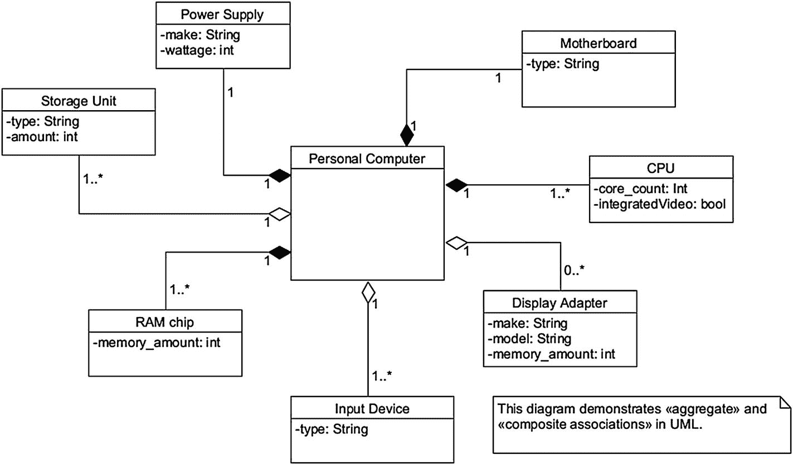
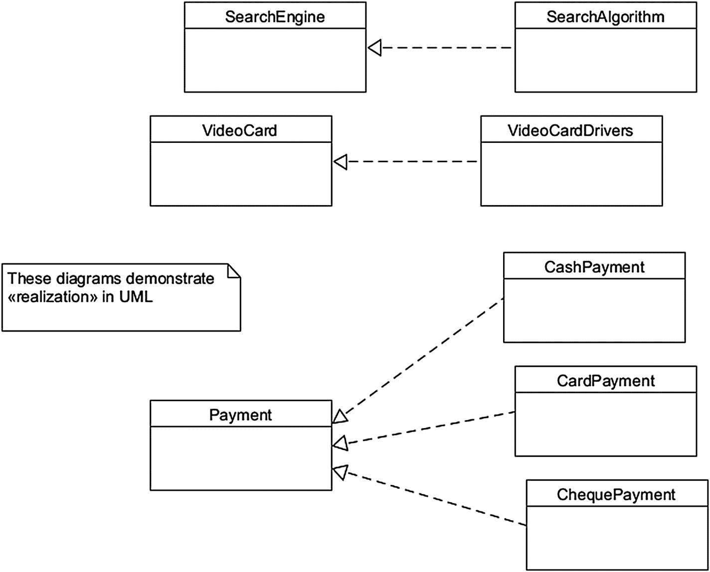
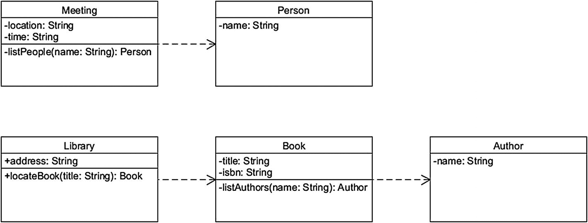
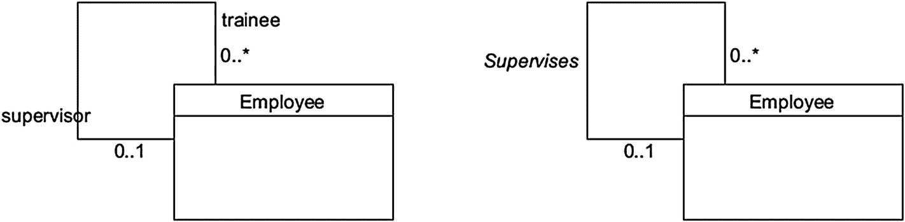
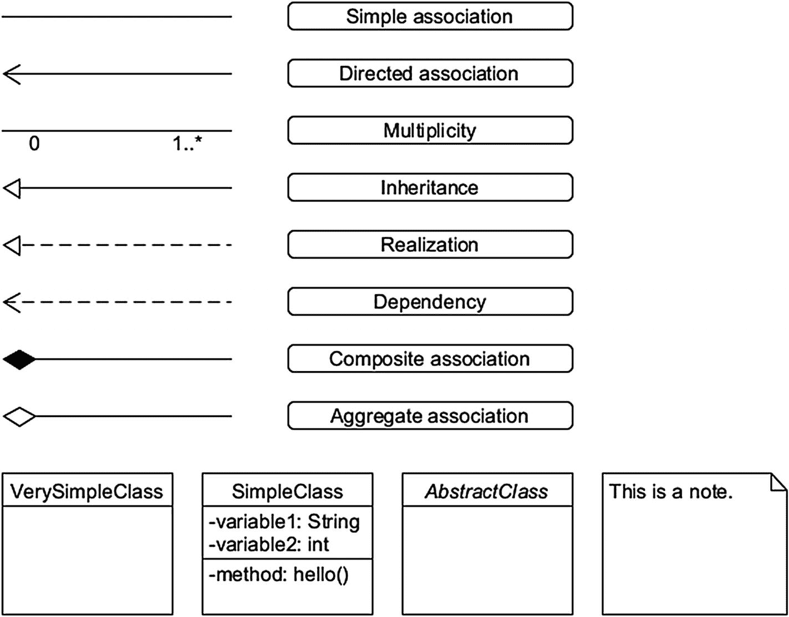
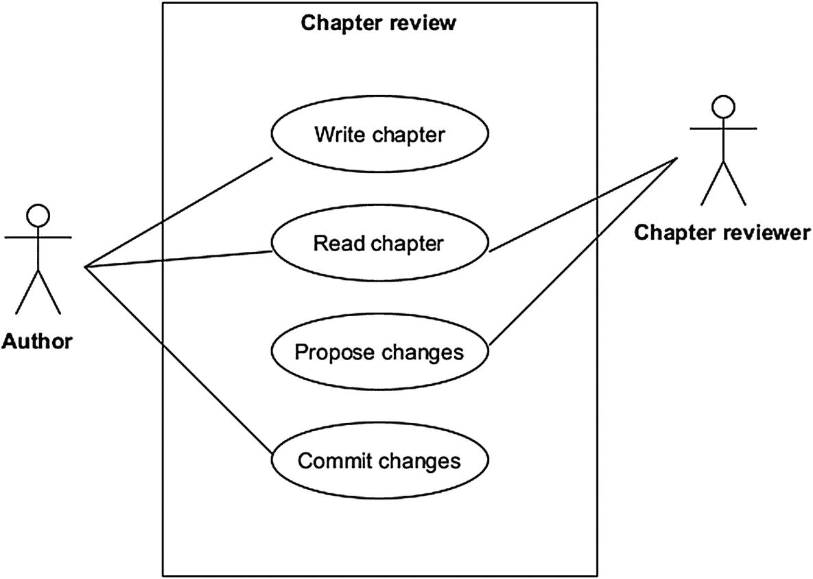
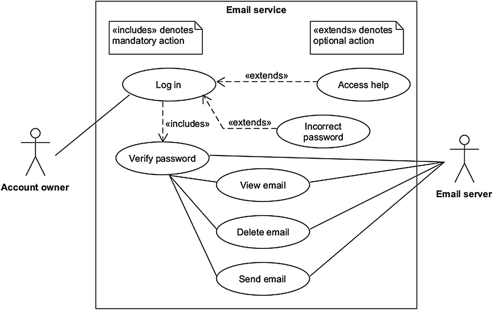

# 9.UML 类图

这一章致力于统一建模语言的奇迹，它是软件设计中一个相当普遍的工具——也当之无愧。在本书的前面，我们仅仅触及了 UML 的表面，现在我们将更深入地探索 UML 提供的更多可能性，因为它与类建模有关。

## 可视化面向对象的范例

我们在第 4 章中介绍了面向对象的范例。书中的大部分代码清单实际上都是这种范例，包括它们的类、对象和方法。将 UML 视为软件开发的预编码阶段的一个有价值的工具。你用它描绘出所有与 OOP 相关的机制，包括类和它们与其他类的关系。

通用建模语言有两个标准，即 UML 1.x(最初于 1996 年)和 UML 2.x(于 2005 年首次发布)。这两个标准都包含许多类型的图，几乎可以用于任何建模目的。

## UML 图的类别

UML 图类型的整个范围超出了本书的范围。然而，知道 UML 有哪些变种是很有用的。概括地说，它通常分为两个主要类别，然后再分为许多子类。许多较大的项目可能需要以下大部分(非详尽的)图表列表；它们是互相排斥的。

*   **行为图**:与结构图不同的是，行为图集中于描绘一个正在运行的系统。
    1.  **用例**:UML 中的参与者是与系统交互的一方。用例图描述了(人类)参与者和特定系统之间的交互。用例关注系统提供的特定功能。例如，一个人从 ATM 机取钱是用例图的一个潜在场景。

    2.  **序列图**:这些图关注的是对象发送消息的时间顺序。因此，当对象之间的交互被精确地建模时，我们使用 UML 序列图。

    3.  状态图:UML 中的状态意味着一个对象持有的不同种类的信息，而不是它们的行为。当对系统状态的变化建模时，使用状态图。

    4.  **活动图**:当我们需要可视化系统中的控制流时，这就是要使用的图的类型。基本上，活动图提供了一个系统在执行时如何工作的概念。

*   **结构图**:这些类型的图是用来模拟静态系统的本质的。
    1.  类图:这些可能是 UML 中最常用的图。在这一章中，我们将主要关注类图。正如您可能已经猜到的，它们处理的是类方面，这是面向对象编程(OOP)范例的基础。

    2.  **对象图**:明显与类图相关，对象图描述的是类的实例。在构建系统原型时，经常会用到这些类型的图。

    3.  组件图(Component diagrams):这些图关注的是系统中软件组件的类型以及它们之间的联系。这些组件通常被称为物理资产，尽管从技术上讲，它们倾向于完全驻留在数字层面。

    4.  **部署图**:这些用于可视化系统的完整布局，显示系统的物理和软件部分。部署图也可以称为系统组件的拓扑。

## 回到 UML:类图

如前所述，UML 可以用来建模几乎任何东西，一个*类图*可以帮助我们可视化一个面向对象的软件项目。让我们从简单的事情开始(见图 [9-1](#Fig1) )。



图 9-1

一个简单的 UML 类/对象图

图 [9-1](#Fig1) 展示了 UML 中的类，包括它们的变量和方法以及类间关系；它还具有一个单一的 UML 对象图。

图 [9-1](#Fig1) 中的主类叫做 Book。它有三个变量(即标题、出版商和出版年份)。如您所见，我们还需要在类中指定变量的类型(例如，String)。UML 中属性或方法前面的加号(+)表示公共访问修饰符。带有破折号(-)字符的类成员表示私有访问修饰符。

你可以像我们在图 [9-1](#Fig1) 中所做的那样，直接在 UML 图中添加有用的注释；这些将采取右上角折叠的矩形的形式。

现在，简单的线条标记了 UML 中类和其他实体之间的关联。图 [9-1](#Fig1) 中这些行旁边的数字和星号是 UML 中*多样性*的演示。这个概念用于指示一个类可以提供或被允许与之交互的实例(即对象)的数量。

转到图 9-1 的对象部分，我们有一个主类的实例，叫做 *exampleBook1* 。在 UML 中，对象可以被表示为尖边或圆边的盒子；为了多样化，我们选择了后者。

## UML 中基于树的继承

继承可以在 UML 中以简洁的方式表示。为此，我们可以使用基于*树的*方法(参见图 [9-2](#Fig2) )。



图 9-2

使用基于树的方法演示 UML 中的继承的图表

图 [9-2](#Fig2) 中的图表展示了三个专业化水平。首先，您有通用的业务类。接下来是三个专业类别，即出版商、面包店和香水店。最后，我们有两个不同类型的出版商类最专业的水平，一类是婚礼面包店和奢侈品香水店。

在 OOP 中，术语基类也被称为*父类*。子类通常被称为*子类。*

图 [9-2](#Fig2) 中的业务类定义为*摘要*；在 UML 中，斜体的类名表示这一点。这些类为子类提供了特定的继承方法。抽象类不能直接实例化。相反，您使用它们的非抽象(即具体)子类之一来创建对象。

## Java 中的图 [9-2](#Fig2)

如果将图 [9-2](#Fig2) 翻译成 Java 会是什么样子？看看清单 [9-1](#PC1) 中可能的解决方案。

在清单 [9-1](#PC1) 中，*业务*是基类。所有其他的类都被定义在它的文件 Business.java 中，以避免拥有多个源文件(例如，*，*等等)。).**

```java
// Define abstract base class
abstract class Business {
// Define class attributes/variables
public double turnover = 20000;
public String address = "none";
// Define method for displaying address attribute/variable
void DisplayAddress() {
 System.out.println(address);
}
   // Create main method
   public static void main(String[] args)
   {
   // Uncommenting the next line will throw an error
   // Business business1 = new Business();
   // Create new Bakery object, happybakery, and display its address
   Bakery happybakery = new Bakery();
   System.out.println("A new bakery is opened at " + happybakery.address);
   // Create new FictionPublisher object, jolly_books, and display its turnover
   FictionPublisher jolly_books = new FictionPublisher();
   System.out.println("Fiction publisher Jolly Books had an unfortunate turnover of £" + jolly_books.turnover + " in 2020");
   // Create new NonFictionPublisher object, silly_books, set and display its turnover
   NonFictionPublisher silly_books = new NonFictionPublisher();
   System.out.println(("Non-fiction publisher Silly Books had a great turnover of £" + (silly_books.turnover + " in 2020")));
   // Create new LuxuryPerfumerie object, exquisite_odors, set and display its address
   LuxuryPerfumerie exquisite_odors = new LuxuryPerfumerie();
   exquisite_odors.address = "10 Wacky Avenue";
   System.out.print("A wonderful luxury perfumerie is located at ");
   exquisite_odors.DisplayAddress(); // Summon method inherited from Business class
   }
}
// Define the rest of the classes
class Bakery extends Business { String address = "2 Happy Street"; }
class WeddingBakery extends Bakery { }
class Perfumerie extends Business { }
class LuxuryPerfumerie extends Perfumerie { }
class Publisher extends Business { }
class FictionPublisher extends Publisher { double turnover = 4.55; }
class NonFictionPublisher extends Publisher { /* turnover is inherited from Business class */ }

Listing 9-1A Java implementation

of Figure 9-2 demonstrating inheritance (filename Business.java)

```

## C#中的图 [9-2](#Fig2)

接下来让我们观察图 [9-2](#Fig2) 在 C#上的实现。您可能还记得本书前面的章节，Java 和 C#是非常相似的语言。

```java
using System;
abstract class Business {
    //  Define class attributes/variables
    public double turnover = 20000;
    public string address = "none";
    // Define method for displaying address attribute/variable
            void DisplayAddress() {
            Console.WriteLine(address);
            }
    // Create main method
    public static void Main() {
                // Uncommenting the next line will throw an error
                // Business business1 = new Business();
        //  Create new Bakery, happybakery, and display its address
        Bakery happybakery = new Bakery();
        Console.WriteLine("A new bakery is opened at " + happybakery.address);
        //  Create new FictionPublisher, jolly_books, and display its turnover
        FictionPublisher jolly_books = new FictionPublisher();
        Console.WriteLine("Jolly Books had an unfortunate turnover of £"
        + jolly_books.turnover + " in 2020");
               // Create NonFictionPublisher, silly_books, set and display its turnover
               NonFictionPublisher silly_books = new NonFictionPublisher();
               Console.WriteLine("Silly Books had a great turnover of £"
        + silly_books.turnover + " in 2020");
    // Create new LuxuryPerfumerie, exquisite_odors, set and display its address
        LuxuryPerfumerie exquisite_odors = new LuxuryPerfumerie();
        exquisite_odors.address = "10 Wacky Avenue";
        Console.Write("A wonderful luxury perfumerie is located at " );
exquisite_odors.DisplayAddress(); // Summon method inherited from Business class
    }
}
//  Create the rest of the classes
class Bakery : Business { new public string address = "2 Happy Street"; }
class WeddingBakery : Bakery { }
class Perfumerie : Business { }
class LuxuryPerfumerie : Perfumerie { }
class Publisher : Business { }
class FictionPublisher : Publisher { new public double turnover=4.55; }
class NonFictionPublisher : Publisher { /* turnover is inherited from Business class */ }

Listing 9-2A C# implementation

of Figure 9-2 demonstrating inheritance

```

列表 [9-1](#PC1) 和 [9-2](#PC2) 几乎相同。首先，在 Java 和 C#中，类的实现方式非常相似。自然，有一些差异(见表 [9-1](#Tab1) )。

表 9-1

清单 [9-1](#PC1) 和 [9-2](#PC2) 的主要区别

<colgroup><col class="tcol1 align-left"> <col class="tcol2 align-left"> <col class="tcol3 align-left"></colgroup> 
| 

元素

 | 

清单 [9-1](#PC1) (Java)

 | 

清单 [9-2](#PC2) (C#)

 |
| --- | --- | --- |
| 类继承 | *类发布者扩展业务{ }* | *类发布者:商业{ }* |
| 主要方法 | *public static void main(String[]args)* | *public static void Main( )* |
| 控制台输出 | *System.out.println( … )* | *控制台。WriteLine( … )* |
| 成员声明 | *双周转= 4.55；* | *新公双成交额= 4.55；* |

## Python 中的图 [9-2](#Fig2)

现在来点不同的。让我们看一看 Python 中的图 [9-2](#Fig2) 可能是什么样子(参见清单 [9-3](#PC3) )。为了在 Python 中使用抽象类，我们需要导入一个名为 *ABC* 的代码模块。然后，我们让我们的基类 Business 继承这个模块。行 *@abstractmethod* 是所谓的 Python decorator。你可能已经猜到了，它告诉我们一个方法应该被认为是抽象的。

```java
# import code module for working with abstract classes, ABC
from abc import ABC, abstractmethod
# define classes, starting with an abstract Business class
class Business(ABC):
    def __init__(self): # set class attribute default values
        self.address = "none"
        self.turnover = 20000

    @abstractmethod # define abstract method
    def Display_Address(self):
        pass

class Publisher(Business):
    def Display_Address(self):
        pass

class Bakery(Business):
    def Display_Address(self):
        pass
    def __init__(self):
        self.address = "2 Happy Street"

class Perfumerie(Business):
    def Display_Address(self):
        pass

class FictionPublisher(Publisher):
    def __init__(self):
        self.turnover = 4.55

class NonFictionPublisher(Publisher):
    pass

class WeddingBakery(Bakery):
    pass

class LuxuryPerfumerie(Perfumerie):
    def __init__(self):
        self.address = "10 Wacky Avenue"
    def Display_Address(self): # override abstract method
        print(self.address)

happybakery = Bakery() # Create new Bakery object
print("A new bakery is opened at", happybakery.address)
jolly_books = FictionPublisher() # Create new FictionPublisher object
print("Jolly Books had an unfortunate turnover of £", jolly_books.turnover, "in 2020")
silly_books = NonFictionPublisher() # Create new NonFictionPublisher object
print("Silly Books had a great turnover of £", silly_books.turnover, "in 2020")
exquisite_odors = LuxuryPerfumerie() # Create new LuxuryPerfumerie object
print("A wonderful luxury perfumerie is located at ", end = '')
exquisite_odors.Display_Address() # summon Display_Address-method

Listing 9-3A Python implementation

of Figure 9-2

```

## UML 自行车



图 9-3

用 UML 展示聚合关系的图表

接下来，让我们探索如何用 UML 建模一个基本的踏板驱动的车辆。图 [9-3](#Fig3) 中引入了新元素。这是由空心菱形符号描绘的*集合体*。

聚合关联意味着一个类可以没有其他类而存在。为了拥有一辆功能齐全的自行车，我们需要所有的部件。但是，即使我们移除了其他组件，它们仍然会存在。

## 蟒蛇皮自行车

坚持使用 Python，让我们对图 [9-3](#Fig3) 创建一个可能的编程解释(参见清单 [9-4](#PC4) )。

```java
class Frame:
            # class constructor
            def __init__(self):
             print('Frame ready.')
            weight = 10.5 # define a class variable

class Saddle:
            # class constructor
            def __init__(self):
            print('Saddle installed.')
            material = "rubber" # define a class variable

class Drivetrain:
            # class constructor
            def __init__(self):
            print('Drivetrain installed.')
            type = "one-speed" # define a class variable

            # define class methods
            def pedalForward(self):
            print("Pedaling forward!")

            def brake(self):
            print("Braking!")

class Wheels:
            diameter = 0
            # class constructor
            def __init__(self, diameter):
            print('Wheels installed.')
            self.diameter = diameter

class Handlebars:
            # class constructor
            def __init__(self):
            print("Handlebars installed.")

            # define class methods
            def turnLeft(self):
            print("Turning left..")

            def turnRight(self):
            print("Turning right..")

class Bicycle:
            # define a class variable
            make = "Helkama"
            # set up class constructor & composition
            def __init__(self):
            self.my_Frame = Frame()
            self.my_Saddle = Saddle()
            self.my_Drivetrain = Drivetrain()
            self.my_Wheels = Wheels(571) # pass a new diameter value
            self.my_Handlebars = Handlebars()

def main(): # create main method
            # create Bicycle-object, "your_bike"
            your_bike = Bicycle()
            print("The wheels in your " + your_bike.make + "-bike are " + str(your_bike.my_Wheels.diameter) + " mm in diameter. The frame weighs " + str(your_bike.my_Frame.weight)+" lbs.")
            print("This bike has a " + your_bike.my_Drivetrain.type + " drivetrain and the saddle is made of the finest " + your_bike.my_Saddle.material+".\n")
            # summon class methods
            your_bike.my_Drivetrain.pedalForward()
            your_bike.my_Handlebars.turnLeft()
            your_bike.my_Drivetrain.pedalForward()
            your_bike.my_Handlebars.turnRight()
            your_bike.my_Drivetrain.brake()
if __name__ == "__main__":
            main() # execute main method

Listing 9-4A Python implementation of Figure 9-3 (i.e., a UML diagram for a bicycle). The Component Inspection Unit A is not implemented here for the sake of brevity

```

问:你自己如何用 Java 和/或 C#解释图 9-3？

## UML 中的个人计算机

现在让我们用复合关联和聚合关联来建模。这是为了让你考虑你需要在 UML 中区分这两种类型的关联的场景。

图 [9-4](#Fig4) 代表一台典型的个人电脑。它旨在描述一个功能系统所需的所有主要组件。然而，使用复合关联(即，实心菱形符号)仅描绘了这些组件中的一些。这是因为，从理论上讲，一台个人电脑没有它们也能正常运行。这可能不是最有用的系统，但至少它可以打开并显示错误信息。



图 9-4

展示 UML 中组合关系的图表

图 [9-4](#Fig4) 中用复合关联描述的基本计算机组件:

*   电源、主板、CPU 和 RAM 芯片

用集合关联描述的不太重要的组件:

*   存储单元(例如，硬盘驱动器)、输入设备(例如，鼠标和/或键盘)和显示适配器/视频卡(集成视频芯片可以与 CPU 一起提供)

请参见表 [9-2](#Tab2) 了解聚合和复合关联之间的差异。

表 9-2

UML 中聚合关联和复合关联的主要区别

<colgroup><col class="tcol1 align-left"> <col class="tcol2 align-left"> <col class="tcol3 align-left"></colgroup> 
|   | 

总计

 | 

复合材料

 |
| --- | --- | --- |
| 关联强度 | 无力的 | 强烈的 |
| 关系 | "有一个" | “的一部分” |
| 属国 | 无论超类存在与否，子类都可以存在 | 子类需要一个超类才能存在 |
| 例子 | 即使一个班级的学生毕业了，T2 大学依然存在关闭单个*部门*不会终结整个*公司* | 没有了*的房子*，房间就毫无意义一个功能正常的心脏对于一个 T2 人来说是必须的 |

## UML 中的实现和依赖

实现指的是与两组元素的关系，其中一组代表一个*规范*，另一组代表它的*实现。*实现的实际工作取决于上下文，并没有在 UML 中严格定义(见图 [9-5](#Fig5) )。



图 9-5

UML 中简单实现关系的三个例子

在图 [9-5](#Fig5) 的图表中，你会看到 UML 实现关系的三个简单例子。在第一种情况下，搜索算法为在线搜索引擎提供功能。同样，显卡需要显卡驱动软件才能真正显示任何图像。最后，支付事件可以通过三种可用的支付方式实现:现金、卡或支票。

接下来，我们有*依赖*(见图 [9-6](#Fig6) )。这种类型的图表表示从属元素和独立元素之间的连接。用虚线和简单的箭头表示，依赖关系本质上是单向的。



图 9-6

UML 依赖的两个例子

## 自反联想

一个*自反关联*用来表示属于同一个类的实例。当一个类可以被分成许多责任时，我们可以使用这种类型的关联。

在图 [9-7](#Fig7) 中，我们有一个名为*雇员*的类，它与自己有一个关联，正如现在熟悉的简单线条*所描绘的。*Employee 类用来代表受人尊敬的主管和地位低下的学员；您会注意到 UML 多样性信息也被插入到这个图中。



图 9-7

UML 中自反关联的一个例子

现在，图 [9-7](#Fig7) 以两种不同的方式描绘了相同的设置。左图显示了基于*角色的*方法，因为我们展示了两种不同的角色(即主管和学员)。右图使用了一个*命名的关联。*

## UML 类图:基本元素

在这一点上，回顾一下我们到目前为止遇到的 UML 元素是一个好主意(见图 [9-8](#Fig8) )。



图 9-8

显示 UML 类图中使用的大多数基本元素的图表

## UML 用例

尽管一些 UML 图类型超出了本书的范围，但是还有一种类型您应该熟悉。这是*用例*，它以最简单的方式展示了用户与系统的交互。这些通常是包含很少技术细节的高级图表。

我们现在将引入一些新的 UML 元素。这些是*角色*、*系统*和*用例*。此外，用例图用熟悉的简单线条来描述关系。请看图 [9-9](#Fig9) 中的简单用例图。



图 9-9

一个描述书籍写作过程中章节回顾的 UML 用例

你会看到图 [9-9](#Fig9) 中的两个演员，由一些可爱的简笔画代表。保持演员在本质上的明确性通常是一个好主意，就像命名一个作者*作者*而不是*约翰*或*旋律羊毛索克斯*。在 UML 中，发起交互的参与者被称为*主要参与者*。次要角色*对主要角色的行为做出反应。*

*系统的第二个元素*在 UML 中用一个简单的矩形表示；在图 [9-9](#Fig9) 的情况下，称为*章审*。在系统内部，我们有内部的*用例*，用椭圆形表示。这些代表了完成特定用例所需的不同阶段。最后，我们用熟悉的简单线条来表示参与者和用例的不同关联。

现在，图 [9-9](#Fig9) 中的图表描绘了以下事件顺序:

*   **作者**，主要演员，写一章。

*   完成的章节由**作者**和**章节审阅者**(次要演员)共同阅读。这由两个参与者之间的共享关联来表示。

*   章节审阅者建议对章节进行修改。

*   最后，作者将更改提交到一个章节中，以结束该场景。

## 更多关于用例的信息

是时候看看一个稍微复杂一点的用例来引入两个新元素了:*扩展了*，*包含了*关系(见图 [9-10](#Fig10) )。正如 UML 类图的情况一样，我们也可以将那些有用的注释元素合并到 UML 用例中。



图 9-10

描述电子邮件服务基本功能的 UML 用例

图 [9-10](#Fig10) 描绘了一个简单的电子邮件用例场景。我们将*账户所有者*(即人类用户)作为主要参与者，将*电子邮件服务器*作为次要参与者。图 [9-10](#Fig10) 包含以下事件序列:

*   **账号拥有者**用密码登录。如果输入了错误的代码，则访问名为*错误密码*的可选用例；这个结果用箭头表示，关键字 *< <延伸> >* 。

*   帐户所有者也可能希望阅读一些帮助文件。这也是一个可选场景，因此分配了关键字<<extends>></extends>

*   用例*成功登录*的最终结果自动导致另一个用例*验证密码*，如关键字 *< <所示，包括> >* 。二级参与者*电子邮件服务器*参与到密码认证过程中，因此在图 [9-9](#Fig9) 中，在所述参与者和验证密码的用例之间存在一条关联线。

*   用例验证密码导致另外三个用例:*查看电子邮件*、*删除电子邮件*和*发送电子邮件*。自然，次要角色*电子邮件服务器*也参与了所有这些，尽管只是被动的角色；帐户所有人可以随意启动所有这三个操作。

    当描述用例中的关系时，注意你的箭头的方向。

## UML 工具

除了纸和笔，如果你想尝试在你的计算机上绘制 UML，有很多很棒的免费选项。我们现在将回顾这些工具的一些最好的例子。

## UMLet 和 UMLetino 由 UMLet 团队制作

一个免费且精彩的开源工具， *UMLet* 将让你用其直观的拖放式用户界面立刻绘制出时髦的类图。关联线很好地捕捉到类的边缘并保持在那里，使组织你的图变得轻而易举。

UMLet 的特点是为类图、用例、时序图和许多其他的可视化元素提供现成的选择。该计划出口到许多常见的图像文件格式，包括 PNG，GIF 和 SVG。对于那些需要一个漂亮、干净的 UML 设计工具的人来说，UMLet 绝对是必备的。本书中的所有图表都是用 UMLet 创建的。

在 UMLet 中发现的一个有趣的特性是它的半自动图表创建。通过导航到*文件* ➤ *从文件或目录*生成类元素，您可以设置您的 UML 图的初始阶段。不幸的是，当使用这个特性时，UMLet 在创建关联方面有一些问题。

UMLetino 是同一软件的基于浏览器的版本。它拥有离线版本的大部分功能。此外，UMLetino 还集成了 Dropbox，用于导入和导出图文件。但是，该软件仅支持 PNG 图像文件的输出。

*   从 [`www.umlet.com`](http://www.umlet.com) 为任何支持 Java 的操作系统下载 **UMLet**

*   在 [`www.umletino.com/umletino.html`](http://www.umletino.com/umletino.html) 的任何支持 Java 的浏览器中运行 **UMLetino**

## Diagrams.net 团队的 Diagrams.net

由专门的团队积极维护，*Diagrams.net*是一个通用的开源工具，有浏览器版和桌面版。后者不需要用户注册。Diagrams.net 既面向基本的 UML 工作，也面向高级用户，具有像层和“插件”这样的特性来增加功能。

以前被称为“draw.io ”,该软件在导出 UML 图(包括 Adobe PDF)时提供了强大的文件格式支持。不仅如此，通过选择*文件* ➤ *导出为* ➤ *高级*，你可以设置诸如 DPI(每英寸点数)和边框宽度等属性。

*   从 [`https://github.com/jgraph/drawio-desktop/releases`](https://github.com/jgraph/drawio-desktop/releases) 下载**Diagrams.net**的桌面 app

*   在 [`https://app.diagrams.net`](https://app.diagrams.net) 运行浏览器上的**Diagrams.net**

## 由 Paul Hensgen 和 Umbrello UML Modeler 作者编写

从 2001 年开始开发， *Umbrello* 对于任何类型的 UML 工作来说都是一个伟大的工具。该软件有一个直观的用户界面，以及从 UML 生成代码的选项。Umbrello 可以将你的图导出为(通常)函数式 Java、C#、Python 和许多其他编程语言；只需导航到*代码* ➤ *代码生成向导，*设置您的选项，然后单击*下一步。*该软件还提供了出色的格式化功能，包括让您正在处理的图表可以使用您的所有操作系统字体。

不要让花哨的默认配色方案欺骗了你——对于许多类型的图表工作来说，Umbrello 是一个非常有用的应用程序。

*   从 [`https://umbrello.kde.org`](https://umbrello.kde.org) 下载**翁贝罗**的桌面应用

## 最后

读完这一章，你已经获得了以下知识:

*   UML 类图和用例图的基本元素

*   如何将简单的 UML 图翻译成 Java、C#和 Python

## 编后记

所以我们到了这本书的结尾。过去你可能会觉得可怕的编程术语已经变得不那么可怕了。到目前为止，变量、类和对象对您来说至少已经有点熟悉了。您知道如何用 Java、C#和 Python 制作简单的基于文本的应用程序。或许你甚至可以在聚会上随口解释一下 Python 对缩进的严格要求。但是你的程序员之旅还远没有结束。了解了三种语言的编码基础，现在你可以开始在这个领域获得更多的经验。一个解决问题的世界在等着你。

编程可能会令人沮丧。但是，让一个讨厌的、不起作用的清单最终发挥作用有一种独特的满足感。无论你最终是否在专业环境中编码，编程在某些时候可能会成为一种建设性的嗜好。它也是治疗失眠和/或无聊的良方。

显化有意义的编码项目需要大量的意图和时间，无论它们是视频游戏还是由雇主定义的原子化编程任务。但是随着程序员的成长，没有一行是浪费的。即使是错误信息也能教会你最有价值的东西。

阿达·洛芙莱斯是*勋爵*和*拜伦女士*的私生子，被认为是世界上第一批程序员之一。她与她那个时代的几位杰出科学家一起工作，包括查尔斯·巴贝奇和迈克尔·法拉第，在某个时候，她编写了被认为是有史以来第一个计算机程序。我们让阿达来说最后一句话:

> *我可以把来自宇宙四分之一的光线投射到一个巨大的焦点上。我的路线是如此清晰明了，以至于想到它有多直就令人愉快。*
> 
> —阿达·洛芙莱斯(1815–1852)*