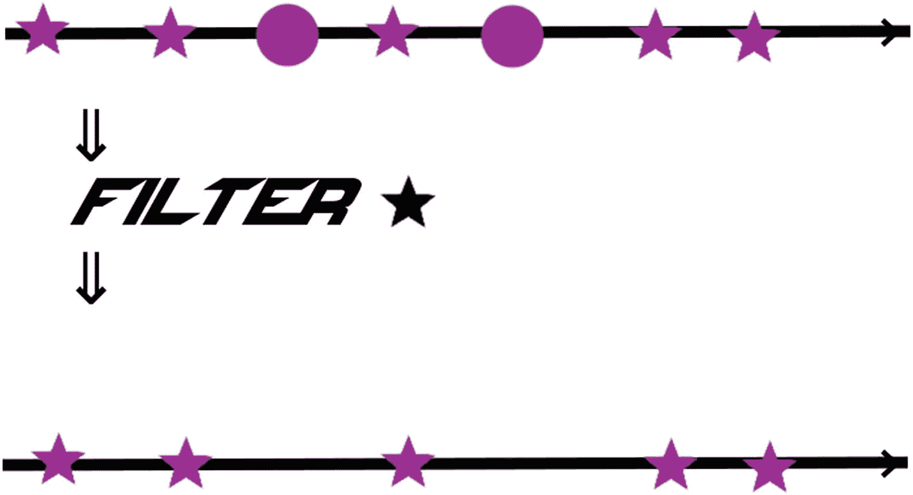
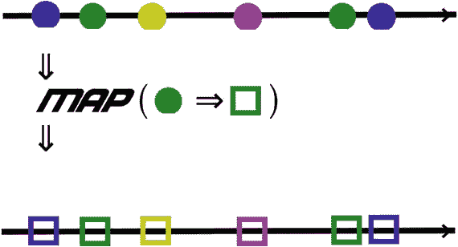
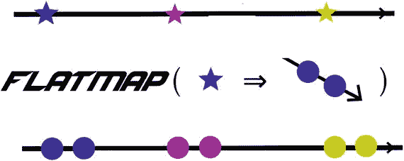
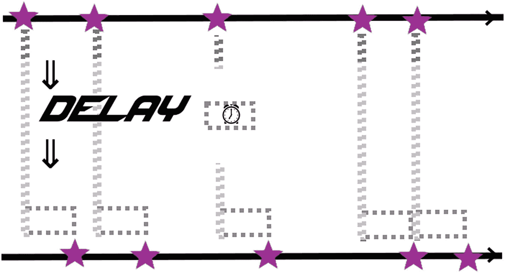
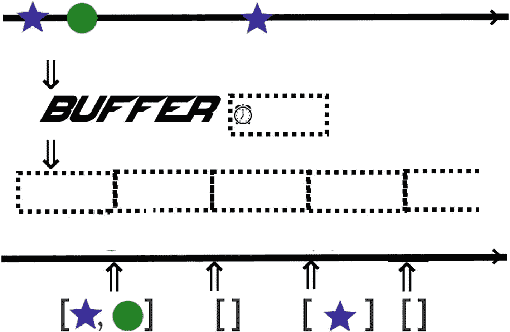
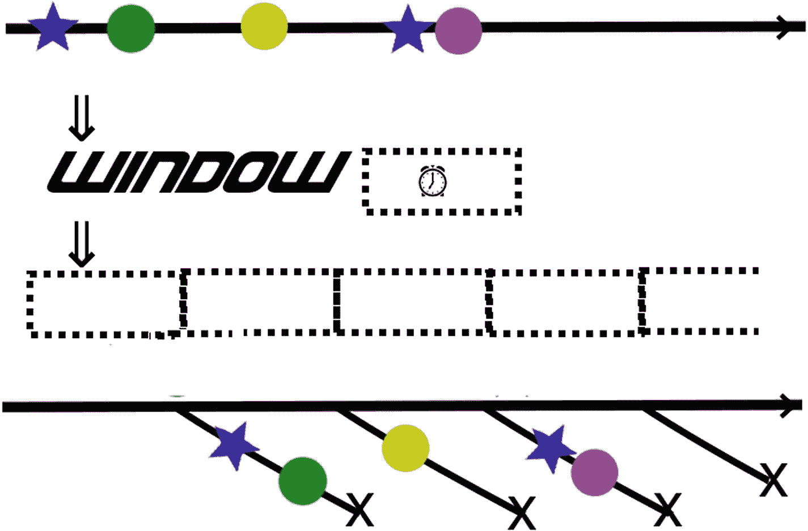
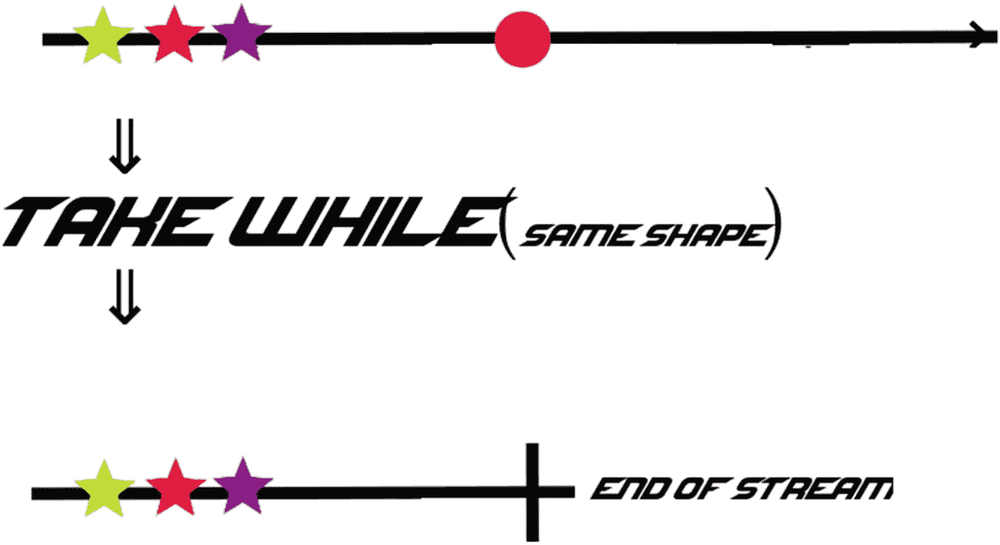
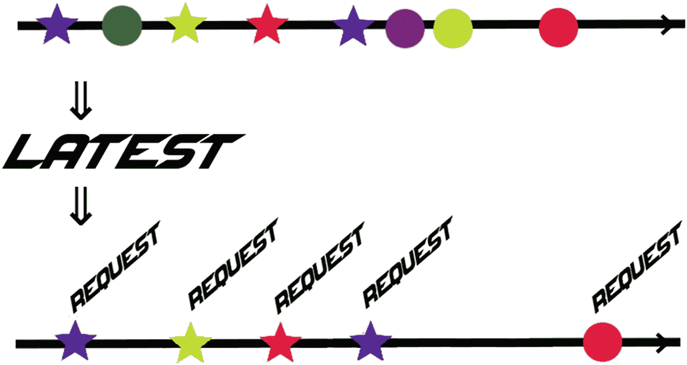
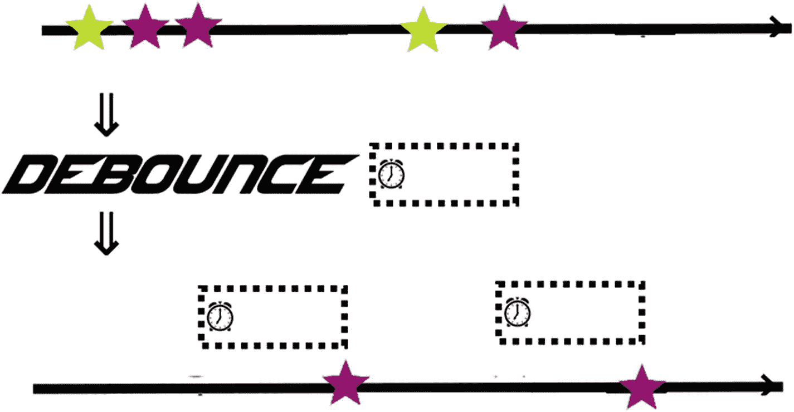
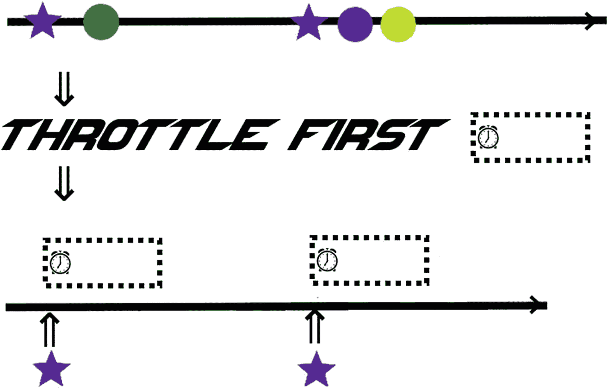

# 3.常见概念

每个反应流框架都使用共同的概念来构成反应流的主干。一旦了解了标准方法(如 filter、map、delay 和 buffer)的功能，就可以使用方法链以简单而简洁的语法执行复杂的流转换。

本章试图阐明这些概念中最重要的一个。它没有涵盖所有可用的方法。

## 流

单词*可观察的*用于表示反应数据流。虽然 Observable 在 RxJava 中是一种类型，但是这个和其他反应流库有其他类型，比如 Reactor 中的*通量*和 Akka 流中的*源*，它们代表*数据流*。反应流中的一切都是从流开始的。

## 冷热

当您开始使用反应流时，您需要掌握热可观测量与冷可观测量的概念。你正在处理的是哪种类型，它们之间的相互作用会导致问题，这并不总是显而易见的。

热可观测性是不可重复的。无论是否有订户，它都会立即开始创建数据。通常，它涉及到与外部世界的数据交互，比如鼠标输入、数据读取或 web 请求。

冷可观察是可以重复的，并且直到被订阅才开始。这可能是范围、文件数据或热观测数据的缓存记录。

热可观测量通常是使用背压流量控制策略(如节流、缓冲或窗口)的候选。

## 反压力

背压是指当流中的事件/数据太多，下游无法处理时发生的情况。打个比方，想想在一些城市的高峰时段，当交通陷入停滞时，或者当地铁列车满员时，会发生什么。当这种情况发生在您的应用程序中时，它会导致大问题，如`OutOfMemory`异常或线程饥饿和超时。背压策略帮助您主动处理这些问题，以避免这些问题。

有多种背压策略，但主要的是节流、窗口、缓冲和丢弃。最容易理解的是删除:您只需删除可以处理的项目(使用一些标准，如最早的或最新的)。本章还列出了其他策略(节流、窗口和缓冲区)。

## 过滤器

Filter 只接受那些与给定谓词匹配的元素。



## 任何/所有

*Any* 返回一个布尔值，如果流中的任何元素匹配给定的谓词，则该值为真。*如果所有元素都匹配，All* 返回 true。这两个只有在终止(非无限)流时才有意义。

## 地图

Map 将数据从一种形式转换成另一种形式。这对于数据元素的任何基本操作都很有用。

## FlatMap/ConcatMap

FlatMap 将数据从一个表单映射到其他表单的流中，然后将结果流组织在一起。当您希望根据子流的结果将一个数据流转换为新流时，这很有用。例如，您可能想要将一个运动队的流转换成这些队的所有运动员的流。

ConcatMap 非常类似，但是保留了传入流的顺序，而 flatMap 急切地订阅每个新流，并按照结果到达的顺序合并结果。



## 耽搁

此方法将数据延迟一段固定的时间。



## 缓冲器

Buffer 在一段时间内保存数据，并将其放在一个列表中，然后观察每个列表。



Buffer 也是一种反压力策略，如果生成的元素太多，订户无法处理，它会缓存流中的所有元素。在这种情况下，缓冲区保留在内存中，不会影响流的数据类型。如果使用了 buffer，您可以选择*删除*或者忽略任何超过缓冲区最大大小的元素。

## 窗户

窗口很像缓冲区，但它产生的是可观察对象而不是列表。



## 采取

当某个条件为真时，Take while (takeWhile)获取所有元素，当条件为假时，结束流。通常还有一个 take(n)方法，它在结束流之前获取一定数量的元素。



## 最近的

“Latest”是一种反压力策略，如果生成的元素太多，订户无法处理，则只从流中取出最后一个元素。



## 德本尼斯

当您只想要流安静一段时间后的元素时，去抖对于有噪声的流是有用的，例如，文本输入或其他用户输入。如果流在给定的持续时间内保持沉默，那么它只给出最后一个元素。



虽然反应器似乎没有“去抖”，但可以使用 *sampleTimeout* 进行近似计算。例如，以下内容相当于一秒钟的去抖:

```java
flux.sampleTimeout(x ->
        Mono.just(0).delayElement(
                Duration.of(1, ChronoUnit.SECONDS)))

```

## 先节流

Throttle first(rx Java 中的 throttle first)在给定的持续时间内从流中丢弃任何元素(在发出第一个元素之后)。Throttle last 非常类似，只是在该时间段内发出最后一个元素，而不是第一个元素。反应堆有类似的方法，*取样*和*先取样*。Akka Streams 有一个类似的方法叫做*节流*。

