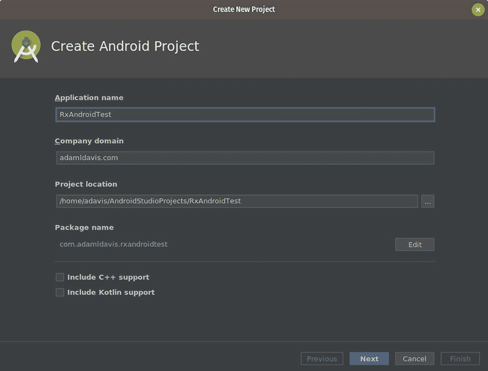
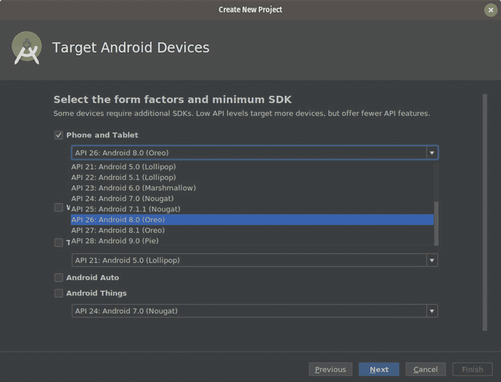
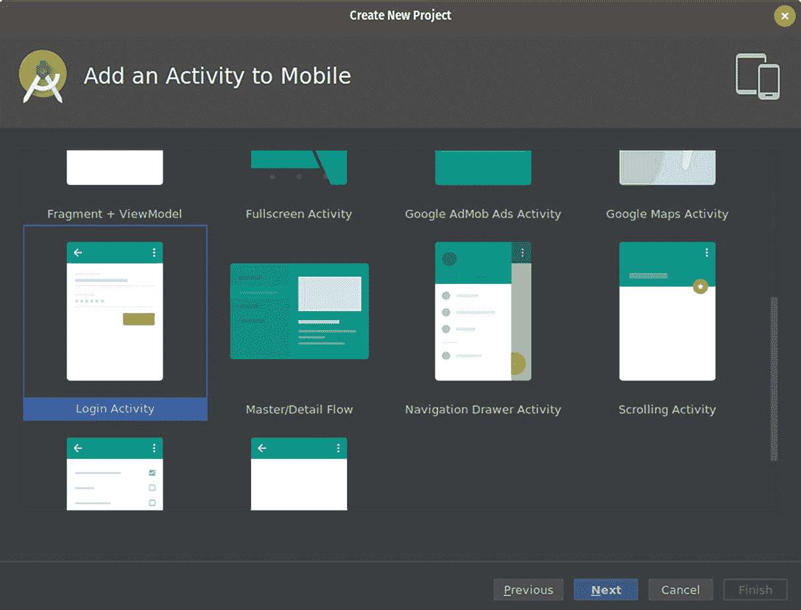
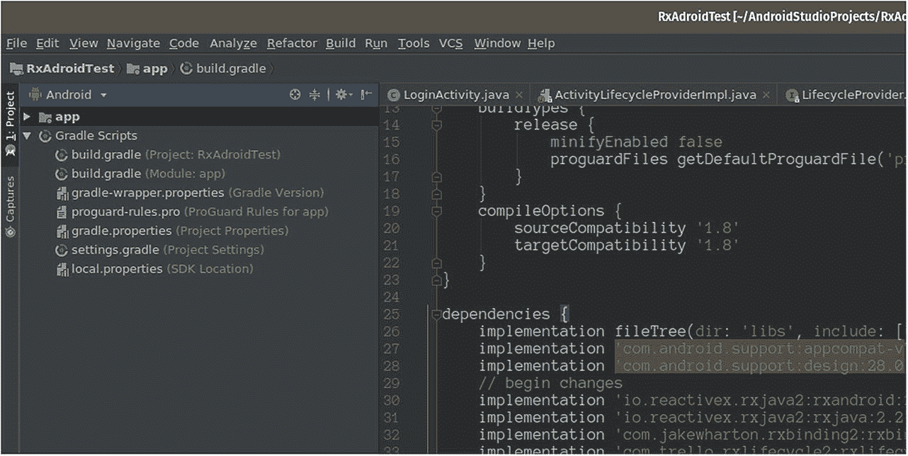
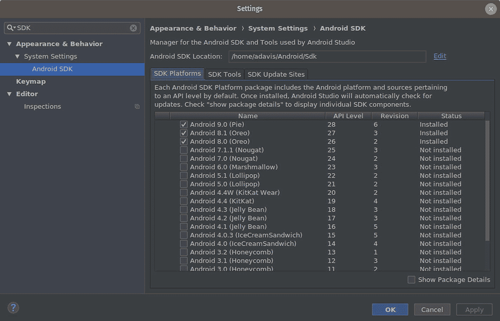
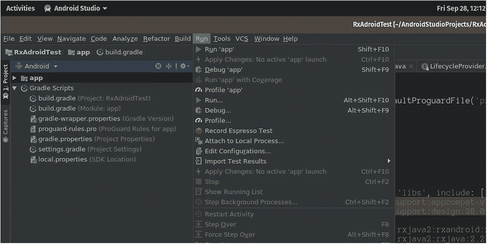

# 7.Android 和 RxJava

[RxAndroid](https://github.com/ReactiveX/RxAndroid) 、 [RxBinding](https://github.com/JakeWharton/RxBinding) 、 [RxLifecycle](https://github.com/trello/RxLifecycle) 为 Android 提供 RxJava 绑定。这使得在 Android 应用程序中使用 RxJava 变得更加容易。

自从 Android Studio 2.4 发布以来，它已经支持使用 Java 8 的 lambda 语法，我们可以在 RxJava 相关代码中大量使用该语法。

RxBinding 是一个开源的 Java 绑定 API 库，用于平台和支持库中的 Android UI 小部件。

在本章中，我们将使用 Android Studio 构建一个包含 RxAndroid、RxBinding、RxLifecycle 和 RxJava 的简单示例应用程序。该代码可在 [GitHub](https://github.com/adamldavis/RxAndroidTest) 上获得。

## 入门指南

如果你还没有，去下载你的操作系统最新的安卓工作室，安装并运行它。Android Studio 启动后，执行以下步骤开始:

1.  通过从菜单中选择文件➤新项目创建一个新项目，并给它一个名称(如 RxAndroidTest)。



1.  选择 8.0(奥利奥)作为目标版本。



1.  出现提示时，选择“登录活动”，当它说“添加一个活动到手机”。



1.  然后，单击左侧的模块名称(如“app”)，按下 F4，然后确保您的 Java 版本至少设置为 8(允许 lambdas)。



项目启动后，将所需的依赖项添加到构建文件(app/build.gradle)中:

```java
implementation
 'io.reactivex.rxjava2:rxandroid:2.1.0'
implementation
 'io.reactivex.rxjava2:rxjava:2.2.2'
implementation
 'com.jakewharton.rxbinding2:rxbinding:2.1.1'

```

因为 RxAndroid 版本很少，所以建议您也明确依赖 RxJava 的最新版本来获得错误修复和新功能(最新的 2.x 版本请参见 [RxJava GitHub](https://github.com/ReactiveX/RxJava/releases) )。

此外，要启用 Java 8 代码风格，您可能需要在 build.gradle 的“android”块下添加以下内容:

```java
compileOptions {
 sourceCompatibility '1.8'
 targetCompatibility '1.8'
}

```

### 安卓 SDK

在编译项目之前，您需要安装一个或多个版本的 Android 软件开发工具包(SDK)。

为此，请选择“文件”菜单，然后选择“设置...”然后在搜索框中输入“SDK”，选择“Android SDK”。确保至少安装一个 Android SDK 并接受许可。



## Android 调度程序

RxAndroid 提供了 AndroidSchedulers，让你可以在 Android 特有的线程上运行，比如主线程。例如:

```java
Observable.just("one", "two", "three", "four")
 .observeOn(AndroidSchedulers.mainThread())
 .subscribe(each ->
        System.out.println(each.toUpperCase()));

```

这将在 Android 的主线程上运行这个可观察对象的动作。这很有用，因为对 UI 的更新应该发生在主线程上。

要找出代码在哪个线程上执行，只需使用 Thread.currentThread()。getName()。例如，我们可以用下面的代码替换前面代码中的最后一行，以打印出当前线程的名称:

```java
System.out.println(
        Thread.currentThread().getName())

```

你也可以使用 AndroidSchedulers 来创建一个围绕任意 Looper 的调度器。例如:

```java
Looper looper = Looper.myLooper();
RxView.clicks(button)
  .observeOn(AndroidSchedulers.from(looper))
  .subscribe();

```

## rxbinding(外部参考)

使用 RxBinding，您可以轻松地将 Android UI 事件转换成 RxJava Observables。首先，将以下导入添加到 LoginActivity.java:

```java
import com.jakewharton.rxbinding2.view.*;
import com.jakewharton.rxbinding2.widget.*;
import io.reactivex.Observable;

```

例如，让我们用一个按钮来订阅点击事件。打开“LoginActivity.java”，找到以“Button mEmailSignInButton”开头的那一行。

查找并注释掉以下代码:

```java
Button mEmailSignInButton = (Button)
        findViewById(R.id.email_sign_in_button);
mEmailSignInButton.setOnClickListener(
        new OnClickListener() {
        @Override
        public void onClick(View view) {
         attemptLogin();
        }
});

```

这可以使用 RxAndroid 替换为以下内容:

```java
Button button = (Button) findViewById(R.id.email_sign_in_button);
RxView.clicks(button).subscribe(event -> {
        attemptLogin();
});

```

我们还可以观察编辑文本上的文本变化，例如:

```java
RxTextView.textChangeEvents(editText)
        .subscribe(e -> log(e.text().toString()));

```

使用这些绑定，我们可以以不同的方式将可观测量组合在一起，以实现我们的最终目标。例如，添加以下代码:

```java
Observable<TextViewTextChangeEvent>
        emailChangeObservable =
        RxTextView.textChangeEvents(mEmailView);
Observable<TextViewTextChangeEvent>
        passwordChangeObservable =
        RxTextView.textChangeEvents(mPasswordView);
// force-disable the button
button.setEnabled(false);
Disposable d = Observable.combineLatest(
        emailChangeObservable, passwordChangeObservable,
        (emailObservable, passwordObservable) -> {
        boolean emailCheck =
       emailObservable.text().length() >= 3;
        boolean passwordCheck =
       passwordObservable.text().length() >= 3;
        return emailCheck && passwordCheck;
}).subscribe(
        enabled -> button.setEnabled(enabled));

```

在这个例子中，只有当两个表单都超过三个字符时，提交按钮才是可点击的。

上面(d)的可处置实例保存了对视图的引用，因此我们必须取消订阅流或使其终止，以防止内存泄漏。这可以通过使用 RxLifecycle 库以一致的方式实现。

## 生命周期

[RxLifecycle](https://github.com/trello/RxLifecycleRxAndroid) 是一个开源库，用于绑定 Android 组件的生命周期事件。例如，这对于删除订阅和避免销毁/暂停事件时的内存泄漏非常有用。

要开始使用 RxLifecycle，请将以下依赖项添加到“build.gradle”文件中:

```java
implementation 'com.trello.rxlifecycle2:rxlifecycle:2.2.2'
implementation
'com.trello.rxlifecycle2:rxlifecycle-android:2.2.2'
implementation
'com.trello.rxlifecycle2:rxlifecycle-components:2.2.2'

```

接下来，将以下导入添加到您的活动中:

```java
import com.trello.rxlifecycle2.components.support\
        .RxAppCompatActivity;

```

然后更改 LoginActivity 以扩展“Rx”等效项(在本例中为 RxAppCompatActivity):

```java
public class LoginActivity extends RxAppCompatActivity implements LoaderCallbacks<Cursor> {

```

最后，您现在可以使用“compose”和 RxLifecycle 将序列绑定到生命周期事件。例如:

```java
@Override
public void onResume() {
super.onResume();
Observable<Long> mySequence = Observable.interval(200, TimeUnit.MILLISECONDS);
mySequence
 .doOnNext(x -> System.out.println(
        "poll the server"))
 .observeOn(AndroidSchedulers.mainThread())
 .compose(bindToLifecycle())
 .subscribe();
}

```

这里的“mySequence”可以是任何 RxJava 类型，比如 Observable、flow、Single 或 Maybe。在这种情况下，“Observable.interval”将每隔 200 毫秒发出一个值。

RxLifecycle 确定结束序列的合适时间，例如:如果在 START 期间订阅，将在 STOP 时终止；如果您在暂停后订阅，它将在下一个销毁事件时终止。

RxLifecycle 将在适当的时候终止序列，并根据原始序列的类型产生以下结果:

*   *可观察，可流动，可能*:未完成时发射()

*   *单一且可完成的*:发出一个错误(CancellationException)

在前面的示例中，通过将代码放在“onResume”中，这将导致我们的轮询在 Resume 之后发生，并在暂停事件时停止。

## 把它放在一起

让我们使用 RxLifecycle 和 RxAndroid 来改进之前的代码:

1.  我们使用和以前一样的“组合测试”来确保两个输入都至少有三个字符。

2.  我们使用 RxActivity 实例绑定到生命周期，以便我们的可观察对象在适当的时候停止。

3.  我们在 Android 主线程上观察。

4.  最后，我们订阅对流做我们想做的事情，在本例中是启用或禁用“登录”按钮。

```java
Observable.combineLatest(
        emailChangeObservable,
        passwordChangeObservable,
        (emailObservable, passwordObservable) -> {
        boolean emailCheck =
       emailObservable.text().length() >= 3;
        boolean passwordCheck =
       passwordObservable.text().length() >= 3;
        return emailCheck && passwordCheck; //1
})
.compose(bindToLifecycle()) //2
.observeOn(AndroidSchedulers.mainThread()) //3
.subscribe(
        enabled -> button.setEnabled(enabled)); //4

```

由于我们在“onCreate”方法中调用了“bindToLifecycle ”, rx life cycle 将导致序列在“相反的”动作上终止，在本例中为“onDestroy”。这将释放我们对电子邮件和密码视图的引用，防止内存泄漏。

## 使用 RxJava

使用基本的 RxJava 操作，我们可以改善“嘈杂的”数据输入，以防止像意外双击这样的事情导致一个动作发生两次。

使用“反跳”操作符，我们可以延迟一个事件动作，直到流在指定的时间内保持安静。例如，在按钮点击时，我们可以设置 500 毫秒(半秒)的去抖。这将在按钮被单击然后半秒钟没有被单击之后运行操作:

```java
RxView.clicks(button).debounce(500,
        TimeUnit.MILLISECONDS)

```

与延迟动作的反跳不同，“throttleFirst”操作符用于防止在第一个事件发出后的某个时间间隔内重复事件。ThrottleFirst 在防止按钮被重复单击时出现双重动作，但仍然在第一次单击时应用动作方面非常有用。例如，按如下方式使用 throttleFirst:

```java
RxView.clicks(button).throttleFirst(1,
        TimeUnit.SECONDS)

```

前面的代码通过过滤掉第一次点击后一秒内发生的任何点击，允许点击事件。

## 测试

为了全面测试我们的应用程序，我们应该运行一个虚拟系统。按" Shift+F10 "或单击"运行➤运行..."菜单并选择一种电话类型。如果您尚未下载系统映像，则需要通过单击“创建新虚拟设备”按钮并按照向导进行操作来下载。选择一个系统映像，然后单击“完成”。



关于创建 Android 应用程序的更多内容超出了本书的范围。

要了解更多，请查阅一本好书或阅读 Google 的在线[文档。](https://developer.android.com/docs/)