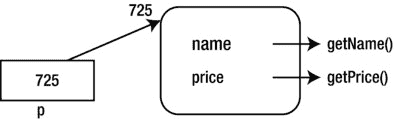
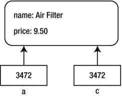
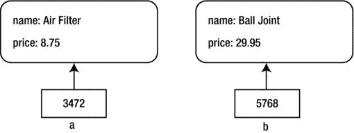
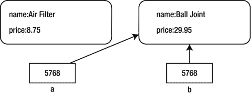
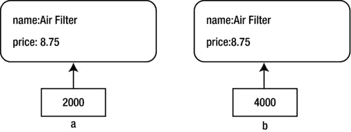
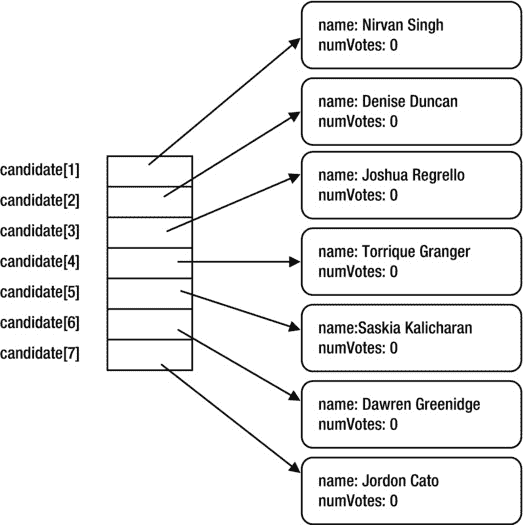

第二章


对象简介

在本章中，我们将解释以下内容:

*   什么是类、对象、字段和方法
*   对象变量不保存对象，而是保存一个指向对象实际位置的指针(或引用)
*   类变量(也称为静态变量)和实例变量(也称为非静态变量)之间的区别
*   类方法(也称为静态方法)和实例方法(也称为非静态方法)之间的区别
*   访问修饰符 public、private 和 protected 是什么意思
*   什么是信息隐藏
*   如何引用类和实例变量
*   如何初始化类和实例变量
*   什么是构造函数以及如何编写构造函数
*   超载是什么意思
*   什么是数据封装
*   如何编写访问器和赋值器方法
*   如何以各种方式打印对象的数据
*   为什么`tostring()`方法在 Java 中是特殊的
*   当我们将一个对象变量赋给另一个对象变量时会发生什么
*   将一个对象变量与另一个对象变量进行比较意味着什么
*   如何比较两个对象的内容
*   函数如何使用对象返回多个值

2.1 对象

Java 被认为是一种面向对象的编程语言(T2)。设计者创造它是为了让物体成为关注的焦点。Java 程序创建和操作对象，试图模拟现实世界是如何运作的。出于我们的目的，对象是一个拥有*状态*和*方法*来操作该状态的实体。对象的状态由其*属性*决定。

比如，我们可以把一个人想象成一个物体。一个人有姓名、年龄、性别、身高、头发颜色、眼睛颜色等属性。在一个程序中，每个属性都由一个适当的变量来表示；例如，`String`变量可以代表*的名字*，一个`int`变量可以代表*的年龄*，一个`char`变量可以代表*的性别*，一个`double`变量可以代表*的身高*，等等。

我们通常使用术语*字段名*(或者简单地说，*字段*)来指代这些变量。因此，对象的*状态*由其*字段*中的*值*定义。此外，我们将需要方法来设置和/或更改字段的值，以及检索它们的值。例如，如果我们对一个人的身高感兴趣，我们将需要一个方法来“观察”该对象并返回*高度*字段的值。

汽车是物体的另一个常见例子。它具有制造商、型号、座位容量、燃料容量、油箱中的实际燃料、里程、音乐设备的类型和速度等属性。book 对象具有诸如作者、标题、价格、页数、装订类型(精装、平装、螺旋)以及是否有货等属性。一个人、一辆车和一本书都是具体物体的例子。但是，请注意，一个对象也可以表示一个抽象的概念，例如公司的一个部门或大学的一个系。

在前面的例子中，我们没有提到某个特定的人。相反，我们谈到了一个总的范畴“人”，这个范畴中的每个人都具有所提到的属性。(类似的言论也适用于汽车和书籍。)在 Java 术语中，“人”是一个*类*。我们认为类是一个通用的类别(模板),从中我们可以创建特定的对象。

那么，一个对象就是一个类的*实例*；在这个例子中，`Person`对象指的是一个特定的人。为了处理两个`Person`对象，我们需要从`Person`的类定义中创建两个对象。每个对象都有自己的字段变量副本(也称为*实例*变量)；一个对象中的变量值可能与另一个对象中的变量值不同。

2.2 定义类和创建对象

最简单的 Java 程序只包含一个类。在类中，我们编写一个或多个方法/函数来执行一些任务。[程序 P2.1](#list1) 显示了一个例子。

***[程序 P2.1](#_list1)***

```java
        //prompt for two numbers and find their sum
        import java.util.*;
        public class Sum {
           public static void main(String[] args) {
              Scanner in = new Scanner(System.in);
              System.out.printf("Enter first number: ");
              int a = in.nextInt();
              System.out.printf("Enter second number: ");
              int b = in.nextInt();
              System.out.printf("%d + %d = %d\n", a, b, a + b);
           }
        } //end class Sum
```

程序由一个类(`ProgramP1_1`)和该类中的一个方法(`main`)组成。这个类只是用来作为编写程序逻辑的框架。我们现在将展示如何定义和使用一个类来创建(我们说*实例化*)对象。

在 Java 中，每个对象都属于某个类，并且只能从类定义中创建。考虑类`Book`的以下(部分)定义:

```java
        public class Book {
           private static double Discount = 0.25;   //class variable
           private static int MinBooks = 5;         //class variable

           private String author;   // instance variable
           private String title;    // instance variable
           private double price;    // instance variable
           private int pages;       // instance variable
           private char binding;    // instance variable
           private boolean inStock; // instance variable

           // methods to manipulate book data go here
        } //end class Book
```

类标题(第一行)由以下内容组成:

*   可选的*访问修饰符*；`public`在示例中使用，并且将用于我们的大多数类。本质上，这意味着该类可供任何其他类使用；也可以*扩展*创建子类。其他访问修饰符是`abstract`和`final`；我们不会在这本书里讨论这些。
*   关键词`class`。
*   类名的用户标识符；例中使用了`Book`。

大括号将类的主体括起来。一般而言，该机构将包括以下声明:

*   静态变量(类变量)；整个类将有一个副本，所有对象将共享这个副本。使用单词`static`声明一个类变量。如果我们省略`static`这个词，变量就是*实例*。
*   非静态变量(实例变量)；创建的每个对象都有自己的副本。组成对象数据的是实例变量。
*   静态方法(类方法)；这些在类加载时加载一次，无需创建任何对象即可使用。静态方法访问非静态变量(属于对象)是没有意义的，所以 Java 禁止。
*   非静态方法(实例方法)；这些只能通过从类中创建的对象使用。操纵对象中数据(非静态字段)的是非静态方法。
*   `String`类是在 Java 中预定义的。如果`word`是`String`(准确地说是一个`String`对象)并且我们编写了`word.toLowerCase()`，我们要求将`String`类的实例方法`toLowerCase`应用到`String`对象`word`。该方法将用于调用它的(`String`)对象中的大写字母转换成小写字母。
*   同样，如果`in`是一个`Scanner`对象(我们说`new Scanner...`时创建的)，表达式`in.nextInt()`将实例方法`nextInt`应用于对象`in`；这里，它从与`in`相关的输入流中读取下一个整数。

在`Book`类中，我们声明了两个类变量(`Discount`和`MinBooks`，用`static`声明)和六个实例变量；默认情况下它们是*实例*(省略了`static`这个词)。

2.2.1 访问类和实例变量

除了`static`，还可以使用可选的访问修饰符`private`、`public`或`protected`来声明一个字段。在`Book`类中，我们使用`private`声明了所有的实例变量。关键字`private`表示变量只在类中“已知”,并且只能由类中的方法直接操作*。换句话说，类外的任何方法都不能直接访问`private`变量。然而，我们很快就会看到，我们可以提供其他类可以用来设置和访问`private`变量的值的`public`方法。这样，我们确保了类数据只能由类中的方法来更改。*

声明一个变量`public`意味着可以从类外部直接访问它。因此，其他类可以用一个`public`变量“为所欲为”。例如，如果`Discount`被声明为`public`，那么任何其他类都可以使用`Book.Discount`来访问它，并以它喜欢的任何方式更改它。通常不鼓励这样做，因为这样类就会失去对其数据的控制。

在大多数情况下，我们将使用`private`声明一个类的字段。这样做是实现*信息隐藏*概念的第一步，这是面向对象编程哲学的一部分。其思想是对象的用户不能直接处理对象的数据；它们应该通过对象的方法来实现。

声明一个变量`protected`意味着它可以直接从类和它的任何子类中访问，也可以从同一个包中的其他类中访问。在这个介绍中，我们将不使用`protected`变量。

如果没有指定访问修饰符，那么这个变量只能被同一个包中的其他类直接访问。

一个类中的方法*可以简单地通过名字引用*类中的任何*变量(`static`或非`static`、`public`或`private`)。(一个例外是*静态*方法不能访问非静态变量。)如果一个*静态*变量在类之外是已知的(也就是说，不是`private`，那么通过用类名限定变量来引用它，就像在`Book.Discount`和`Book.MinBooks`中一样。*

在类的外部，一个非私有的*实例*变量只能通过它所属的对象来引用；下一节将对此进行说明。然而，如上所述，良好的编程实践表明，大多数情况下，我们的变量将被声明为`private`，因此不会出现从类外部直接访问的概念。

2.2.2 初始化类和实例变量

当`Book`类被加载时，存储立即被分配给类变量`Discount`和`MinBooks`；然后，它们分别被赋予初始值`0.25`和 5。这些变量背后的含义是，如果一本书售出五本或更多，那么就给予 25%的折扣。因为这些值适用于所有的书，把它们和每本书的数据存储在一起会浪费存储空间，因此把它们声明为`static`变量。所有 book 对象都可以访问这些变量的单个副本。(但是，请注意，如果我们想在不同的书中改变这些值，那么它们将成为特定书的属性，并且必须声明为非静态的。)

当第一次加载类时，没有存储空间分配给实例(非静态)变量。此时，我们只有实例变量的规范，但是实际上还没有。当从类中创建一个对象时，它们就存在了。对象的数据由实例变量决定。当一个对象被“创建”时，存储空间被分配给类中定义的所有实例变量；创建的每个对象都有自己的实例变量副本。要创建一个对象，我们使用关键字`new`，如下所示:

```java
        Book b;
        b = new Book();
```

第一条语句将`b`声明为`Book`类型的变量。由此，我们看到一个类名被认为是一种类型(类似于`int`或`char`)，可以用来声明变量。我们说`b`是一个`Book`类型的*对象变量*。

`b`的声明*不*创建对象；它只是创建一个变量，该变量的值最终将成为一个对象的*指针*。如图所示声明时，其值是未定义的。

第二条语句找到一些可以存储`Book`对象的可用内存，创建该对象，并将该对象的*地址*存储在`b`中。(把地址想象成对象占用的第一个内存位置。如果对象占据位置`2575`到`2599`，那么它的地址就是`2575`。)我们说`b`包含一个指向该对象的*引用*或*指针*。因此，对象变量的*值*是一个*内存地址*，而不是一个对象。如图 2-1 中的[所示。](#Fig1)


[图 2-1](#_Fig1) 。书籍对象的实例

作为一种快捷方式，我们可以在一条语句中声明`b`并创建一个 book 对象，如下所示:

```java
        Book b = new Book();
```

认为`Book`变量`b`可以容纳`Book`对象是一个常见的错误。它不能；它只能保存对一个`Book`对象的*引用*。(以类似的方式，我们应该熟悉这样的想法:一个`String`变量并不保存一个字符串，而是保存字符串存储位置的*地址*。)然而，在区别(对象和对对象的引用之间的区别)无关紧要的地方，我们将认为`b`持有一个`Book`对象。

一旦对象`b`被创建，我们可以像这样引用它的实例字段:

```java
        b.author       b.title        b.price
        b.pages        b.binding      b.inStock
```

然而，只有当字段被声明为`public`时，我们才能从类外的*中这样做。我们将在后面看到当字段被声明为`private`时如何间接访问它们。*

当创建一个对象时，除非我们另有说明，否则它的实例字段初始化如下:

*   数值字段被设置为`0`。
*   字符字段被设置为`'\0'`(准确地说是 Unicode `'\u0000'`)。
*   布尔字段被设置为`false`。
*   对象字段被设置为`null`。(值为`null`的变量意味着它不引用或指向任何东西。)

在我们的示例中，会发生以下情况:

*   `b.author`(类型`String`)设置为`null`；记住`String`是一个对象类型。
*   `b.title`(类型`String`)被设置为`null`。
*   `b.price`(类型`double`)被设置为`0.0`。
*   `b.pages`(类型`int`)被设置为`0`。
*   `b.binding`(类型`char`)被设置为`'\0'`。
*   `b.inStock`(类型`boolean`)被设置为`false`。

我们可以在声明一个实例变量时指定一个初始值。考虑以下代码:

```java
        public class Book {
           private static double Discount = 0.25;
           private static int MinBooks = 5;

           private String author = "No Author";
           private String title;
           private double price;
           private int pages;
           private char binding = 'P'; // for paperback
           private boolean inStock = true;
        }
```

现在，当创建一个对象时，`author`、`binding`和`inStock`将被设置为指定值，而`title`、`price`和`pages`将采用默认值。只有在没有明确赋值的情况下，变量才会被赋予默认值。假设我们用这个创建一个对象`b`:

```java
        Book b = new Book();
```

这些字段将被初始化如下:

*   `author`设置为`"No Author"`。//在声明中指定
*   `title`设置为`null`。//默认为(`String`)对象类型
*   `price`设置为`0.0`。//数值类型的默认值
*   `pages`设置为`0`。//数值类型的默认值
*   `binding`设置为`'P'`。//在声明中指定
*   `inStock`设置为`true`。//在声明中指定

2.3 构造函数

构造函数提供了更灵活的方法来初始化创建时的对象状态。在下面的陈述中，`Book()`被称为*构造器*:

```java
        Book b = new Book();
```

它类似于方法调用。但是，你可能会说，我们没有在类定义中编写任何这样的方法。没错，但在这种情况下，Java 提供了一个*默认构造函数*——一个没有参数的构造函数(也称为*无参数*构造函数)。默认的构造函数非常简单；它只是将实例变量的值设置为它们默认的初始值。稍后，我们可以为对象的字段分配更有意义的值，如下所示:

```java
        b.author = "Noel Kalicharan";
        b.title = "DigitalMath";
        b.price = 29.95;
        b.pages = 200;
        b.binding = 'P';  //for paperback
        b.inStock = true;  //stock is available
```

现在假设当我们创建一个 book 对象时，我们希望 Java 自动分配作者和标题。我们希望能够使用如下语句来创建新的 book 对象:

```java
        Book b = new Book("Noel Kalicharan", "DigitalMath");
```

我们可以这样做，但是我们必须首先编写一个适当的构造函数，一个用两个参数定义的构造函数。下面展示了如何实现这一点:

```java
        public Book(String a, String t) {
           author = a;
           title = t;
        }
```

以下是一些需要注意的要点:

*   一个类的构造函数和这个类有相同的名字。我们班叫`Book`；因此，必须调用构造函数`Book`。因为构造函数是要被其他类使用的，所以它被声明为`public`。
*   构造函数可以有零个或多个参数。调用时，必须为构造函数提供适当数量和类型的参数。在我们的例子中，构造函数是用两个参数`String`、`a`和`t`声明的。调用构造函数时，必须提供两个`String`参数。
*   构造函数的主体包含调用构造函数时要执行的代码。我们的示例将实例变量`author`设置为第一个参数，将`title`设置为第二个参数。一般来说，除了设置实例变量的值之外，我们还可以使用其他语句。例如，我们可以在将提供的值赋给字段之前验证它。我们将在下一节看到一个这样的例子。
*   构造函数没有返回类型，甚至没有`void`。
*   如果在声明中为实例变量提供了初始值，那么这些值将在调用构造函数之前存储。

例如，假设类`Book` 现在声明如下:

```java
        public class Book {
           private static double Discount = 0.25;
           private static int MinBooks = 5;

           private String author = "No Author";
           private String title;
           private double price;
           private int pages;
           private char binding = 'P'; // for paperback
           private boolean inStock = true;

           public Book(String a, String t) {
              author = a;
              title = t;
           }
        } //end class Book
```

该声明

```java
        Book b = new Book("Noel Kalicharan", "DigitalMath");
```

将按如下方式执行:

1.  为一个`Book`对象找到存储器，存储器的地址存储在 b 中。
2.  这些字段设置如下:

    ```java
    author is set to "No Author";   // specified in the declaration
    title is set to null;           // default for (String) object type
    price is set to 0.0;            // default for numeric type
    pages is set to 0;              // default for numeric type
    binding is set to 'P';          // specified in the declaration
    inStock is set to true.         // specified in the declaration
    ```

3.  用参数`"Noel Kalicharan"`和`"DigitalMath"`调用构造函数；这将`author`设置为`"Noel Kalicharan"`，将`title`设置为`"DigitalMath"`，其他字段保持不变。当构造函数完成时，这些字段将具有以下值:

    ```java
    author    "Noel Kalicharan"
    title     "DigitalMath"
    price      0.0
    pages      0
    binding   'P'
    inStock    true
    ```

2.3.1 重载构造函数

Java 允许我们有不止一个构造函数，假设每个构造函数都有不同的签名。当几个构造函数可以有相同的名字时，这被称为*重载构造函数。*假设我们希望能够使用无参数的构造函数以及带有作者和标题参数的构造函数。我们可以像这样在类声明中包含这两者:

```java
        public class Book {
           private static double Discount = 0.25;
           private static int MinBooks = 5;

           private String author = "No Author";
           private String title;
           private double price;
           private int pages;
           private char binding = 'P'; // for paperback
           private boolean inStock = true;

           public Book() { }

           public Book(String a, String t) {
              author = a;
              title = t;
           }
        } //end class Book
```

请注意，无参数构造函数的主体由一个空块组成。当执行下面的语句时，实例变量被设置为它们的初始值(指定值或默认值)，并且执行构造函数。在这种情况下，不会发生进一步的事情。

```java
        Book b = new Book();
```

请注意，当我们提供构造函数时，*默认的*无参数构造函数不再可用。如果我们也想使用无参数构造函数，我们必须显式地编写它，就像前面的例子一样。当然，我们可以自由地在正文中写任何我们想写的东西，包括什么都不写。

作为最后一个例子，我们提供了一个构造函数，让我们在创建对象时显式地设置所有字段。这是:

```java
        public Book(String a, String t, double p, int g, char b, boolean s) {
           author = a;
           title = t;
           price = p;
           pages = g;
           binding = b;
           inStock = s;
        }
```

如果`b`是类型为`Book`的变量，调用示例如下:

```java
       b = new Book("Noel Kalicharan", "DigitalMath", 29.95, 200, 'P', true);
```

这些字段将被赋予以下值:

```java
        author    "Noel Kalicharan"
        title     "DigitalMath"
        price      29.95
        pages      200
        binding   'P'
        inStock    true
```

2.4 数据封装、访问器和赋值器方法

我们将使用术语*用户类*来表示其方法需要访问另一个类的字段和方法的类。

当一个类的字段被声明为`public`时，任何其他的类都可以通过名字直接访问该字段。考虑以下类别:

```java
        public class Part {
           public static int NumParts = 0;   // class variable
           public String name;               // instance variable
           public double price;              // instance variable
        }
```

这里，我们将一个静态(或类)变量和两个实例变量定义为`public`。*任何*用户类都可以使用`Part.NumParts` 访问静态变量，并且可以包含如下语句:

```java
        Part.NumParts = 25;
```

这可能是不可取的。假设`NumParts`是为了计算从`Part`创建的对象的数量。任何外部类都可以将它设置为它喜欢的任何值，所以类`Part`的作者不能保证它总是反映所创建对象的数量。

和往常一样，实例变量只能通过对象来访问。当一个用户类创建一个类型为`Part`的对象`p`时，它可以使用`p.price`(或`p.name`)直接引用实例变量，如果需要的话，可以用一个简单的赋值语句来改变它。没有什么可以阻止用户类将变量设置为不合理的值。例如，假设所有价格都在 0.00 到 99.99 之间。用户类可以包含以下语句，这会损害价格数据的完整性:

```java
        p.price = 199.99;
```

要解决这些问题，我们必须使数据字段`private`；我们说我们必须*隐藏*数据。然后我们为其他人提供`public`方法来设置和检索字段中的值。私有数据和公共方法是*数据封装*的精髓。设置或更改字段值的方法称为 *mutator* 方法。检索字段中的值的方法称为*访问器*方法。

让我们展示一下如何解决提到的两个问题。首先，我们将字段重新定义为`private`:

```java
        public class Part {
           private static int NumParts = 0;   // class variable
           private String name;   // instance variable
           private double price;   // instance variable
        }
```

现在它们是`private`，没有其他的职业可以访问它们。如果我们想让`NumParts`反映从类中创建的对象的数量，我们需要在每次调用构造函数时递增它。例如，我们可以编写一个无参数构造函数，如下所示:

```java
        public Part() {
           name = "NO PART";
           price = -1.0;   // we use –1 since 0 might be a valid price
           NumParts++;
        }
```

每当用户类执行如下语句时，就会创建一个新的`Part`对象*并将* `1`添加到`NumParts`:

```java
        Part p = new Part();
```

因此，`NumParts`的值将总是所创建的`Part`个对象的数量。进一步说，这是*改变其值的唯一*方式；类`Part`的作者可以保证`NumParts`的值总是被创建的对象的数量。

当然，用户类可能需要在任何给定时间知道`NumParts`的值。既然它没有对`NumParts`的访问，我们必须提供一个*公共访问器方法* ( `GetNumParts`，比方说；我们使用大写的`G`作为静态访问器，因为它提供了一种快速区分静态和非静态的方法，后者返回值。方法如下:

```java
        public static int GetNumParts() {
           return NumParts;
        }
```

该方法被声明为`static`，因为它只对一个`static`变量进行操作，不需要调用一个对象。它可以用`Part.GetNumParts()`来称呼。如果`p`是一个`Part`对象，Java 允许你用`p.GetNumParts()`调用它。然而，这意味着`GetNumParts`是一个实例方法(通过对象调用并对实例变量进行操作的方法)，所以这可能会引起误解。我们建议通过类名调用类(静态)方法，而不是通过类中的对象。

作为一个练习，向`Book`类添加一个字段来计算创建的 book 对象的数量，并更新构造函数来增加这个字段。

2.4.1 改进的构造器

我们可以不使用无参数构造函数，而是采用更实际的方法，编写一个构造函数，让用户在创建对象时分配名称和价格，如下所示:

```java
        Part af = new Part("Air Filter", 8.75);
```

我们可以将构造函数写成:

```java
        public Part(String n, double p) {
           name = n;
           price = p;
           NumParts++;
        }
```

除了用户仍然可以为某个零件设置无效价格之外，这种方法是可行的。没有任何东西可以阻止用户编写这个语句:

```java
        Part af = new Part("Air Filter", 199.99);
```

构造函数会忠实地将`price`设置为无效值`199.99`。然而，我们可以在构造函数中做更多的事情，而不仅仅是给变量赋值。如果有必要，我们可以测试一个值并拒绝它。我们认为，如果提供了一个无效的价格，对象仍将被创建，但会打印一条消息，价格将被设置为`–1.0`。下面是构造函数的新版本:

```java
        public Part(String n, double p) {
           name = n;
           if (p < 0.0 || p > 99.99) {
              System.out.printf("Part: %s\n", name);
              System.out.printf("Invalid price: %3.2f. Set to -1.0.\n", p);
              price = -1.0;
           }
           else price = p;
           NumParts++;
        } //end constructor Part
```

作为一种良好的编程风格，我们应该将价格限制(`0.00`和`99.99`)和“空”价格(`-1.0`)声明为类常量。我们可以使用以下内容:

```java
        private static final double MinPrice = 0.0;
        private static final double MaxPrice = 99.99;
        private static final double NullPrice = -1.0;
```

这些标识符现在可以在构造函数中使用。

2.4.2 访问器方法

由于用户类可能需要知道一个商品的名称或价格，我们必须为`name`和`price`提供公共访问器方法。访问器方法只是返回特定字段中的值。按照惯例，我们在这些方法的名称前面加上`get`这个词。这些方法如下:

```java
        public String getName() {   // accessor
           return name;
        }

        public double getPrice() {  // accessor
           return price;
        }
```

请注意，访问器的返回类型与字段的类型相同。例如，`getName`的返回类型是`String`，因为`name`的类型是`String`。

因为访问器方法返回实例字段中的值，所以只在与特定对象相关时调用它是有意义的(因为每个对象都有自己的实例字段)。如果`p`是类型为`Part`的对象，那么`p.getName()`返回`p`的`name`字段中的值，而`p.getPrice()`返回`p`的`price`字段中的值。

作为练习，为`Book`类的所有字段编写访问器方法。

这些访问器是非静态或实例方法的例子(在它们的声明中没有使用单词`static`)。我们可以认为每个对象在一个类中都有自己的实例方法副本。然而实际上，这些方法仅仅是对一个对象可用的 T2。将有一个方法的副本，并且当在对象上调用该方法时，该方法将被*绑定到*一个特定的对象。

假设一个`Part`对象`p`存储在位置`725`，我们可以把这个对象描绘成如图 2-2 中的[所示。](#Fig2)



[图 2-2](#_Fig2) 。带有字段和访问器的部件对象

想象一下字段`name`和`price`被锁在一个盒子里，外界看到它们的唯一方式是通过方法`getName`和`getPrice`。

2.4.3 赋值函数方法

作为该类的作者，我们必须决定是否允许用户在对象创建后更改其名称或价格。有理由假设用户可能不想更改名称。然而，价格是变化的，所以我们应该提供一种(或多种)改变价格的方法。例如，我们编写了一个用户类可以调用的*公共赋值函数方法* ( `setPrice`)，如下所示:

```java
        p.setPrice(24.95);
```

这将`Part`对象`p`的价格设置为`24.95`。和以前一样，该方法不允许设置无效的价格。它将验证所提供的价格，并在必要时打印适当的消息。使用第 2.4.1 节中声明的常数，这里是`setPrice`:

```java
        public void setPrice(double p) {
           if (p < MinPrice || p > MaxPrice) {
              System.out.printf("Part: %s\n", name);
              System.out.printf("Invalid price: %3.2f; Set to %3.2f\n", p, NullPrice);
              price = NullPrice;
           }
           else price = p;
        } //end setPrice
```

有了这个加法，我们可以认为`Part p`如图[图 2-3](#Fig3) 。


[图 2-3](#_Fig3) 。添加了 setPrice()的零件对象

观察`setPrice`的箭头方向；一个值正从外部世界发送到对象的私有字段。

同样，我们强调声明字段`private`并为其提供赋值函数/访问函数方法的优越性，这与声明字段`public`并让用户类直接访问它相反。

我们还可以提供一些方法，以给定的数量或给定的百分比来提高或降低价格。这些都是作为练习留下的。

作为另一个练习，为`Book`类的`price`和`inStock`字段编写赋值函数方法。

2.5 打印对象的数据

为了验证我们的部件被赋予了正确的值，我们需要某种方法来打印对象字段中的值。

2.5.1 使用实例方法 (首选方式)

一种方法是编写一个实例方法(`printPart`)，当调用一个对象时，它将打印*那个*对象的数据。为了打印`Part p`的数据，我们将这样写:

```java
        p.printPart();
```

方法如下:

```java
        public void printPart() {
           System.out.printf("\nName of part: %s\n", name);
           System.out.printf("Price: $%3.2f\n", price);
        } //end printPart
```

假设我们用这个创建一个零件:

```java
        Part af = new Part("Air Filter", 8.75);
```

表达式`af.printPart()`将显示以下内容:

```java
        Name of part: Air Filter
        Price: $8.75
```

当通过`af`调用`printPart`时，`printPart`中对字段`name`和`price`的引用变成对`af`字段的引用。这在[图 2-4](#Fig4) 中进行了说明。


[图 2-4](#_Fig4) 。名称和价格指的是 af 字段

2.5.2 使用静态方法

如果我们愿意，我们可以将`printPart`写成一个`static`方法，这个方法将与`p`一起被调用，作为一个*参数*，以便打印它的字段。在这种情况下，我们将编写以下内容:

```java
        public static void printPart(Part p) {
           System.out.printf("\nName of part: %s\n", p.name);
           System.out.printf("Price: $%3.2f\n", p.price);
        }
```

字段名必须用对象变量`p`限定。如果没有`p`，我们会遇到静态方法引用非静态字段的情况，这是 Java 所禁止的。

如果`c`是在用户类中创建的一个`Part`对象，我们将不得不使用下面的代码来打印它的字段:

```java
        Part.printPart(c);
```

这比前面显示的使用实例方法稍微麻烦一些。相比之下，您可以使用`Character.isDigit(ch)`来访问标准 Java 类`Character`中的静态方法`isDigit`。

2.5.3 使用 toString()方法

`toString`方法返回一个`String`并且在 Java 中是特殊的。如果我们在需要字符串的上下文中使用一个对象变量，那么 Java 将试图从该对象所属的类中调用`toString`。例如，假设我们写下如下，其中`p`是一个`Part`变量:

```java
        System.out.printf("%s", p);
```

由于不清楚打印任意对象意味着什么，Java 将在类本身中寻找指导。据推测，这个类将知道如何打印它的对象。如果它提供了一个`toString`方法，Java 就会使用它。(如果没有，Java 将打印一些通用的东西，比如类名和十六进制的对象地址，例如:`Part@72e15c32`。)在我们的示例中，我们可以将以下内容添加到类`Part` :

```java
        public String toString() {
           return "\nName of part: " + name + "\nPrice: $" + price + "\n";
        }
```

如果`af`是空气过滤器部件，那么下面的语句将调用调用`af.toString()`:

```java
        System.out.printf("%s", af);
```

实际上，`printf`变成了这样:

```java
        System.out.printf("%s", af.toString());
```

`af.toString()`将返回此:

```java
        "\nName of part: Air Filter \nPrice: $8.75\n"
```

结果是`printf`将打印如下内容:

```java
        Name of part: Air Filter
        Price: $8.75
```

2.6类部分

将所有的更改放在一起，类`Part`现在看起来像这样:

```java
     public class Part {
        // class constants
        private static final double MinPrice = 0.0;
        private static final double MaxPrice = 99.99;
        private static final double NullPrice = -1.0;
        private static int NumParts = 0;   // class variable

        private String name;    // instance variable
        private double price;   // instance variable

        public Part(String n, double p) {   // constructor
           name = n;
           if (p < MinPrice || p > MaxPrice) {
              System.out.printf("Part: %s\n", name);
              System.out.printf("Invalid price: %3.2f; Set to %3.2f\n", p, NullPrice);
              price = NullPrice;
           }
           else price = p;
           NumParts++;
        } //end constructor Part

        public static int GetNumParts() {   // accessor
           return NumParts;
        }

        public String getName() {   // accessor
           return name;
        }

        public double getPrice() {   // accessor
           return price;
        }

        public void setPrice(double p) {   // mutator
           if (p < MinPrice || p > MaxPrice) {
              System.out.printf("Part: %s\n", name);
              System.out.printf("Invalid price: %3.2f; Set to %3.2f\n", p, NullPrice);
              price = NullPrice;
           }
           else price = p;
        } //end setPrice

        public void printPart() {
           System.out.printf("\nName of part: %s\n", name);
           System.out.printf("Price: $%3.2f\n", price);
        }

        public String toString() {
           return "\nName of part: " + name + "\nPrice: $" + price + "\n";
        }
     } // end class Part
```

2.6.1 测试类别部分

当我们编写一个类时，我们必须测试它以确保它正常工作。对于类`Part`，我们必须检查构造函数是否正常工作，换句话说，访问器方法是否返回正确的值，以及赋值器方法是否正确设置了(新的)价格。

我们还必须检查该类是否正确处理了无效价格。在[程序 P2.2](#list2) 中，我们创建三个零件对象(其中一个具有无效价格)并打印它们的名称/价格信息。然后，我们打印通过调用`GetNumParts`创建的零件数量。*在*我们运行测试程序之前，我们应该计算出预期的输出，这样我们就可以*预测*一个正确的程序应该输出什么。如果输出符合我们的预测，很好；如果不是，就有一个必须解决的问题。

***[程序 P2.2](#_list2)***

```java
        public class PartTest{
           // a program for testing the class Part

           public static void main(String[] args) {
              Part a, b, c; // declare 3 Part variables

              // create 3 Part objects
              a = new Part("Air Filter", 8.75);
              b = new Part("Ball Joint", 29.95);
              c = new Part("Headlamp", 199.99); // invalid price

              a.printPart(); // should print Air Filter, $8.75
              b.printPart(); // should print Ball Joint, $29.95
              c.printPart(); // should print Headlamp, $-1.0

              c.setPrice(36.99);
              c.printPart(); // should print Headlamp, $36.99

              // print the number of parts; should print 3
              System.out.printf("\nNumber of parts: %d\n", Part.GetNumParts());
           } //end main
        } // end class PartTest
```

当[程序 P2.2](#list2) 运行时，产生如下输出:

```java
Part: Headlamp
Invalid price: 199.99; Set to -1.0

Name of part: Air Filter
Price: $8.75

Name of part: Ball Joint
Price: $29.95

Name of part: Headlamp
Price: $-1.0

Name of part: Headlamp
Price: $36.99

Number of parts: 3
```

这是预期的输出，所以我们确信这个类会正常工作。

这里是关于`Part`类的最后一句话。如果出于某种奇怪的原因，类`Part`没有提供`printPart`或`toString`方法，用户类可以编写自己的方法来打印部件的字段。然而，它必须使用`Part`的访问器方法来获取对象的数据，因为它不能直接引用`private`字段。下面显示了如何做到这一点:

```java
        public static void printPart(Part p) {
        // a method in a user class
           System.out.printf("\nName of part: %s\n", p.getName());
           System.out.printf("Price: $%3.2f\n", p.getPrice());
        }
```

从用户类，我们可以这样写:

```java
        Part af = new Part("Air Filter", 8.75);
        printPart(af);
```

将打印以下内容:

```java
        Name of part: Air Filter
        Price: $8.75
```

2.7 如何命名 Java 文件

如果我们的程序由一个单独的`public`类组成，Java 要求我们将这样一个类存储在一个名为*的文件中。所以如果类是`Palindrome`，我们必须调用文件`Palindrome.java`。*

在`Part`示例中，我们必须将`Part`类存储在名为`Part.java`的文件中，并将`PartTest`类存储在名为`PartTest.java`的文件中。我们可以用以下命令编译这些类:

```java
        javac Part.java
        javac PartTest.java
```

然后，我们可以使用以下命令运行测试:

```java
        java PartTest
```

回想一下，这将从类`PartTest`中执行`main`。请注意，这样的尝试是没有意义的:

```java
        java Part
```

如果我们这样做，Java 会简单地抱怨在类`Part`中没有`main`方法。

如果我们愿意，我们可以将两个类放在一个文件中。但是，只能将其中一个类指定为`public`。因此，例如，我们可以让类`PartTest`保持原样，并简单地从`public class Part`中删除单词`public`。我们现在可以将这两个类放在一个文件中，其中的*必须被命名为`PartTest.java`，因为`PartTest`是`public`类。*

当我们编译`PartTest.java`时，Java 会产生两个文件——`PartTest.class`和`Part.class`。然后我们可以用这个来运行测试:

```java
        java PartTest
```

2.8 使用对象

到目前为止，我们已经看到了如何使用构造函数定义一个类并从该类创建对象。我们还看到了如何使用访问器方法从对象中检索数据，以及如何使用 mutator 方法更改对象中的数据。我们现在来看看在使用对象时出现的一些问题。

2.8.1 将一个对象变量分配给另一个

一个对象变量(`p`，比方说)使用一个类名(`Part`，比方说)来声明，如下所示:

```java
        Part p;
```

我们再次强调,`p`不能保存一个对象，而是一个指向对象的指针(或引用)。`p`的值是一个内存地址——存储一个`Part`对象的位置。请考虑以下几点:

```java
        Part a = new Part("Air Filter", 8.75);
        Part b = new Part("Ball Joint", 29.95);
```

假设空气过滤器对象存储在位置`3472`，球窝接头对象存储在位置`5768`。那么`a`的值将是`3472`，而`b`的值将是`5768`。创建两个对象后，我们会看到图 2-5 所示的情况。


[图 2-5](#_Fig5) 。创建两个零件对象后

假设我们将`a`赋值给`c`，就像这样:

```java
        Part c = a; // assign 3472 to c
```

这将值`3472`分配给`c`；实际上，`c`(以及`a`)现在指向空气过滤器对象。我们可以使用任何一个变量来访问对象。例如，下面将空气过滤器对象的价格设置为`9.50`:

```java
        c.setPrice(9.50);
```

我们有图 2-6 所示的[情况。](#Fig6)



[图 2-6](#_Fig6) 。将 a 赋值给 c 后

如果我们现在用以下内容检索对象`a`的价格，将返回空气过滤器的(新)价格:

```java
        a.getPrice(); // returns the price 9.50
```

假设我们写下这个语句:

```java
        c = b; // assign 5768 to c
```

`c`被赋值`5768`现在指向球关节对象。它不再指向空气过滤器。我们可以使用`b`或`c`来访问球节数据。如果我们有了一个对象的*地址*，我们就有了操作这个对象所需的所有信息。

2.8.2 失去对对象的访问

请考虑以下几点:

```java
        Part a = new Part("Air Filter", 8.75);
        Part b = new Part("Ball Joint", 29.95);
```

假设这些陈述产生了图 2-7 中[所示的情况。](#Fig7)



[图 2-7](#_Fig7) 。创建两个零件对象后

假设我们执行以下语句:

```java
        a = b;
```

情况变为图 2-8 中的[所示。](#Fig8)



[图 2-8](#_Fig8) 。将 b 分配给 a 后

现在，`a`和`b`具有相同的值`5768`。它们都指向球关节对象。实际上，当我们改变`a`的值时，我们失去了对空气过滤器对象的访问。当没有变量指向某个对象时，该对象不可访问，也不能使用。对象占用的存储将被系统垃圾收集，并返回到可用存储池。这是自动发生的，不需要程序的任何动作。

然而，假设我们这样写:

```java
        c = a;    // c holds 3472, address of "Air Filter"
        a = b;    // a, b hold 5768, address of "Ball Joint"
```

现在，我们仍然可以通过`c`访问空气过滤器。

比较对象变量

考虑以下创建两个相同但独立的对象并将它们的地址存储在`a`和`b`中的情况:

```java
        Part a = new Part("Air Filter", 8.75);
        Part b = new Part("Air Filter", 8.75);
```

假设这些陈述产生了图 2-9 中[所示的情况。](#Fig9)



[图 2-9](#_Fig9) 。创建两个相同的对象后

由于对象是相同的，所以下面的条件是`false`可能会令人惊讶:

```java
        a == b
```

但是，如果你记得`a`和`b`包含*地址*而不是对象，那么我们是在比较`a` ( `2000`)中的地址和`b` ( `4000`)中的地址。既然这些不一样，那就比较`false`。

只有当两个对象变量包含*相同的地址*时，它们才会比较相等(在这种情况下，它们指向同一个对象)。例如，当我们将一个对象变量赋给另一个对象变量时，就会发生这种情况。

当然，我们需要知道两个*物体*是否相同。也就是说，如果`a`和`b`指向两个对象，那么这些对象的*内容*是否相同？为此，我们必须编写自己的方法来逐个比较字段。

以类`Part`为例，我们编写了一个方法`equals`，如果一个对象与另一个对象相同，则返回`true`，否则返回`false`。比较`a`和`b`指向的`Part`对象的方法如下:

```java
        if (a.equals(b)) ...
```

该方法简单地检查两个对象的`name`字段和`price`字段是否相同。由于`name`字段是`String`对象，我们调用`String`类的`equals`方法来比较它们。 [<sup>1</sup>](#Fn1)

```java
        public boolean equals(Part p) {
           return name.equals(p.name) && (price == p.price);
        }
```

在该方法中，变量`name`和`price`(未被限定)指的是通过其调用该方法的对象的字段。假设我们使用了下面的表达式:

```java
        a.equals(b)
```

变量指的是字段`a.name`和`a.price`。当然，`p.name`和`p.price`指的是`equals`(例子中的`b`)的参数字段。实际上，`return`语句变成了这样:

```java
        return a.name.equals(b.name) && (a.price == b.price);
```

现在，假设我们有这些陈述:

```java
        Part a = new Part("Air Filter", 8.75);
        Part b = new Part("Air Filter", 8.75);
```

`(a == b)`是`false`(由于`a`和`b`持有不同的地址)，而`a.equals(b)`是`true`(由于它们指向的对象内容相同)。

2.9 空指针

对象变量的声明如下例所示:

```java
        Part p;
```

最初，它是未定义的(就像原始类型的变量一样)。给`p`赋值最常见的方法是创建一个`Part`对象，并使用`new`操作符将其地址存储在`p`中，如下所示:

```java
        p = new Part("Air Filter", 8.75);
```

Java 还提供了一个特殊的指针值，用`null`表示，可以赋给任何对象变量。我们可以编写下面的代码将`null`赋给`Part`变量`p`:

```java
        Part p = null;
```

实际上，这意味着`p`有一个定义好的值，但是它没有指向任何东西。如果`p`的值为`null`，则试图引用由`p`指向的对象是错误的。换句话说，如果`p`是`null`，谈论`p.name`或`p.price`是没有意义的，因为`p`没有指向任何东西。

如果两个对象变量`p`和`q`都是`null`，我们可以拿它们和`==`比较，结果会是`true`。另一方面，如果`p`指向某个对象，而`q`是`null`，那么，不出所料，比较的是`false`。

当我们需要初始化一列对象变量时，空指针是很有用的。当我们创建链表或二叉树等数据结构时，我们也会用到它们，我们需要一个特殊的值来表示一个列表的结束。我们将在下一章看到如何使用空指针。

2.10 将对象作为参数传递

对象变量保存一个地址——一个实际对象的地址。当我们使用对象变量作为方法的参数时，传递给方法的是一个地址。因为 Java 中的参数是“按值”传递的，所以实际传递的是包含变量值的临时位置。在第 2.6.1 节中，我们遇到了用于打印零件的类`Part`中的静态方法`printPart`。这是:

```java
        public static void printPart(Part p) {
           System.out.printf("\nName of part: %s\n", p.name);
           System.out.printf("Price: $%3.2f\n", p.price);
        }
```

此外，假设用户类包含以下语句:

```java
        Part af = new Part("Air Filter", 8.75);
        printPart(af);
```

假设第一条语句将地址`4000`分配给`af`。当调用`printPart`时，`4000`被复制到一个临时位置，这个位置被传递给`printPart`，在那里它被称为`p`，即形参的名字。由于`p`的值是`4000`，实际上它可以访问原始对象。在本例中，该方法只是打印实例变量的值。但如果它愿意，也可以改变它们。

考虑类`Part`中的以下方法，该方法将`amount`添加到零件的价格中:

```java
        public static void changePrice(Part p, double amount) {
           p.price += amount;
        }
```

用户类可以通过以下调用将`1.50`添加到空气过滤器的价格中:

```java
        Part.changePrice(af, 1.50);
```

如前所述，参数`p`可以访问原始对象。对由`p`指向的对象的任何改变实际上都是对原始对象的改变。

我们强调方法*不能*改变实参`af`的*值*(因为它没有访问它的权限)，但是它*可以*改变`af`指向的*对象。*

顺便说一下，注意我们使用这个例子主要是为了说明的目的。实际上，编写一个实例方法来改变一个`Part`对象的价格可能会更好。

2.11 对象的数组

在 Java 中，`String`是一个对象。因此，`String`的数组实际上是对象的数组。然而，`String`在 Java 中是一种特殊的对象，在某些方面与其他对象有所不同。首先，一个`String`是*不可变的*；我们不能改变它的价值。另一方面，我们认为`String`只有一个字段——字符串中的字符——而一个典型的对象会有几个字段。出于这些原因，我们来看看除了`String`之外的对象数组。

考虑之前定义的类`Part` 。该类包含两个实例变量，定义如下:

```java
        public class Part {
           private String name;   // instance variable
           private double price;  // instance variable

           // methods and static variables
        } //end class Part
```

回忆一下当我们如下声明一个`Part`变量`p`时会发生什么是很有帮助的:

```java
        Part p;
```

首先，记住`p`可以保存一个`Part`对象的*地址*，而不是一个对象本身。该声明只是为 p 分配了存储空间*,但是没有定义。我们可以将`null`值赋给`p`，如下所示:*

```java
        p = null;
```

我们还可以创建一个`Part`对象，并使用以下语句将其地址分配给`p`:

```java
        p = new Part("Air Filter", 8.75);
```

现在考虑下面的声明:

```java
        Part[] part = new Part[5];
```

这声明了一个名为`part`的数组，该数组包含`5`个元素。因为它们是对象变量，所以 Java 保证这些元素被设置为`null`。到目前为止，还没有创建任何`Part`对象。我们可以创建对象并将它们分别分配给`part`的每个元素，如下所示:

```java
        part[0] = new Part("Air Filter", 8.75);
        part[1] = new Part("Ball Joint", 29.95);
        part[2] = new Part("Headlamp", 36.99);
        part[3] = new Part("Spark Plug", 5.00);
        part[4] = new Part("Disc Pads", 24.95);
```

数组`part`现在可以如图[图 2-10](#Fig10) 所示。


[图 2-10](#_Fig10) 。零件对象的数组

`part`的每个元素都包含对应对象的地址。

请记住，一般来说，数组的每个元素都可以像数组类型的简单变量一样处理。例如，`part[2]`可以用与上述`p`相同的方式处理。而且就像我们可以写`p.setPrice(40.00)`一样，我们可以写`part[2].setPrice(40.00)`把头灯的价格改成`40.00`。

我们如何引用一个`Part`对象的字段？通常，这取决于代码是写在类`Part`内部还是外部。如果在内部，代码可以直接访问实例变量`name`和`price`，例如`part[2].name`。如果在外部，它必须使用 accessor 和 mutator 方法来获取和设置字段中的值，例如`part[2].getName()`。

如果我们必须处理数百个零件，最好将零件的数据存储在一个文件中(`parts.dat`)，并使用一个`for`或`while`循环将它们读入数组。假设上面的数据像这样存储在文件中(我们将部件名写成一个单词，这样就可以用`Scanner`类中的`next`来读取它):

```java
        AirFilter  8.75
        BallJoint  29.95
        Headlamp    36.99
        Spark Plug  5.00
        DiscPads   24.95
```

我们可以用下面的代码设置`part`数组:

```java
        Scanner in = new Scanner(new FileReader("parts.dat"));
        Part[] part = new Part[5];
        for (int h = 0; h < part.length; h++)
           part[h] = new Part(in.next(), in.nextDouble());
```

这段代码更好，也更灵活。要读取 1000 个零件，我们只需要改变`part`的声明，并提供文件中的数据。上面的代码保持不变。像往常一样，我们没有*有*用零件数据填充整个数组。我们可以读取数据，直到到达某个数据结束标记(`End`)为止。

如果我们需要打印零件的数据，我们可以使用以下内容:

```java
        for (int h = 0; h <  part.length; h++) part[h].printPart();
```

假设我们想要交换数组中的两个部分，例如，`part[2]`和`part[4]`。我们用同样的方法交换任何两个相同类型的变量的值，就像这样:

```java
        Part p = part[2];
        part[2] = part[4];
        part[4] = p;
```

值得注意的是，实际对象保留在它们最初存储的地方。我们在这里所做的只是交换存储在`part[2]`和`part[4]`中的地址。在[图 2-10](#Fig10) 中，认为箭头被互换了。

2.11.1 找到价格最低的零件

假设我们想找到价格最低的部分(从某种意义上说，我们想找到“最小”的对象)。假设我们在类`Part`之外编写这个代码，我们可以编写`getLowestPrice`来返回价格最低的部分的位置，如下所示:

```java
        public static int getLowestPrice(Part[]  part, int lo, int hi) {
        // return the position of the part with the lowest price
        // from  part[lo] to  part[hi], inclusive

           int small = lo;
           for (int h = lo + 1; h <= hi; h++)
              if (part[h].getPrice() <  part[small].getPrice()) small = h;
           return small;
        } //end getLowestPrice
```

如果我们在类`Part`内部编写，我们可以让方法保持原样。但是由于我们现在可以直接访问实例变量，我们可以用下面的语句替换`if`语句:

```java
        if (part[h].price < part[small].price) small = h;
```

要打印价格最低的零件的名称，我们可以这样写:

```java
        System.out.printf("\nPart with lowest price: %s\n",
            part[getLowestPrice(part, 0,  part.length-1)].getName());
```

作为练习，编写一个函数来返回价格最高的商品。

2.12 搜索一组对象

我们假设您知道如何在基元类型数组或字符串数组中搜索一个项目。这里，我们考虑如何搜索具有多个字段的对象数组(更准确地说，是对对象的引用)。例如，假设我们有一个由以下内容(部分)定义的`Person`类:

```java
        public class Person {
           String name;
           int age;
           char gender;

           // constructors, static fields and other methods
        } //end class Person
```

我们希望在包含类型为`Person`的对象的数组`person`中搜索一个具有给定名称`key`的对象。在搜索基本类型或字符串的情况下，搜索关键字的类型与数组中元素的类型相同。在搜索具有多个字段的对象数组的情况下，搜索关键字的类型与对象的字段中的*相同。*

我们的搜索方法必须将`key`与正确的字段进行比较。在这个例子中，我们比较了`key`和`person[h].name`。下面的方法在数组`Person`中搜索给定的名称。我们使用`equalsIgnoreCase`,这样键和数组的大小写差异就无关紧要了；`Mary`将与`mary`相同。

```java
        // search for key in the first n elements of the array person;
        // if found, return the position, else return -1
        public static int sequentialSearch(String key, Person[] person, int n) {
           for (int h = 0; h < n; h++)
              if (key.equalsIgnoreCase(person[h].name)) return h;
           return -1;
        }
```

如果我们想搜索给定了`age`的人，我们只需要将`key`声明为`int`，并将`if`语句改为:

```java
        if (key == person[h].age) return h;
```

注意，这将返回它找到的第一个具有给定年龄的人。我们编写[程序 P2.3](#list3) 来测试这个函数。

***[程序 P2.3](#_list3)***

```java
        import java.util.*;
        public class SearchTest {
           public static void main(String[] args) {
              // set up an array with 7 persons
              Person[] person = new Person[7];
              person[0] = new Person("Gary", 25, 'M');
              person[1] = new Person("Inga", 21, 'F');
              person[2] = new Person("Abel", 30, 'M');
              person[3] = new Person("Olga", 36, 'F');
              person[4] = new Person("Nora", 19, 'F');
              person[5] = new Person("Mary", 27, 'F');
              person[6] = new Person("Bert", 32, 'M');

              Scanner in = new Scanner(System.in);
              String s;
              System.out.printf("Enter names, one at a time, and I'll tell you\n");
              System.out.printf("their age and gender. To end, press Enter\n\n");
              while (!(s = in.nextLine()).equals("")) {
                 int n = sequentialSearch(s, person, person.length);
                 if (n >= 0)
                    System.out.printf("%d %c\n\n", person[n].age, person[n].gender);
                 else System.out.printf("Not found\n\n");
              }
           } // end main

           // search for key in the first n elements of the array person ;
           // if found, return the position, else return -1
           public static int sequentialSearch(String key, Person[] person, int n) {
              for (int h = 0; h < n; h++)
                 if (key.equalsIgnoreCase(person[h].name)) return h;
              return -1;
           } // end sequentialSearch

        } // end class SearchTest

        class Person {
           String name;
           int age;
           char gender;
           Person(String n, int a, char g) {
              name = n;
              age = a;
              gender = g;
           }
        } //end class Person
```

`main`方法建立了一个名为`person`的数组，包含七个人的数据。然后，它要求用户输入姓名。对于每一个名字，`sequentialSearch`被称为；比方说，它返回一个值`n`。如果找到(`n >= 0`，则打印出该人的年龄和性别。如果不是，则打印消息`Not found`。以下是运行示例:

```java
Enter names, one at a time, and I'll tell you
their age and gender. To end, press Enter

Olga
36  F

Bart
Not found

bert
32  M

INGA
21  F
```

注意我们是如何定义类`Person`的。我们省略了单词`public`，这样我们可以把它和`SearchTest`放在同一个文件中。为了多样化，我们在字段名— `name`、`age`、`gender`上不使用访问修饰符(`public`或`private`)。当我们这样做时，同一个*文件*中的其他类可以直接引用字段名；比如在`main`中，我们指的是`person[n].age`和`person[n].gender`。

我们还可以对一组对象使用二分搜索法，前提是这些对象是根据我们想要搜索的字段进行排序的。例如，如果对象按名称顺序排列，我们可以在`person`数组中查找名称。下面是函数:

```java
        // search for a person with name key in the first n elements of the
        // array person ; if found, return the position, else return -1
        public static int binarySearch(String key, Person[] person, int n) {
           int lo = 0, hi = n - 1;
           while (lo <= hi) {   // as long as more elements remain to consider
              int mid = (lo + hi) / 2;
              int cmp = key.compareToIgnoreCase(person[mid].name);
              if (cmp == 0) return mid;    // search succeeds
              if (cmp < 0) hi = mid - 1;   // key is ‘less than’ person[mid].name
              else lo = mid + 1;           // key is ‘greater than’ person[mid].name
           }
           return -1;         // key is not in the array
        } // end binarySearch
```

作为练习，编写一个类似于[程序 P2.3](#list3) 的程序来测试`binarySearch`。

2.13 排序一个对象数组

我们假设您知道如何使用选择和插入排序对字符串或基本类型的数组进行排序。下面显示了如何使用选择排序按升序通过`name`对*对象*数组`Person`进行排序:

```java
        public static void selectionSort(Person[] list, int lo, int hi) {
        // sort list[lo] to list[hi] using selection sort
           for (int h = lo; h <= hi; h++)
              swap(list, h, getSmallest(list, h, hi));
        } //end selectionSort

        public static int getSmallest(Person[] list, int lo, int hi) {
        // return the position of the ‘smallest’ name from list[lo] to list[hi]
           int small = lo;
           for (int h = lo + 1; h <= hi; h++)
              if (list[h].name.compareToIgnoreCase(list[small].name) < 0) small = h;
           return small;
        } //end getSmallest

        public static void swap(Person[] list, int h, int k) {
        // swaps list[h] with list[k]
           Person hold = list[h];
           list[h] = list[k];
           list[k] = hold;
        } //end swap
```

在`getSmallest`中，我们将一个数组元素的`name`字段与另一个数组元素的`name`字段进行比较。

我们可以通过下面的调用对来自程序 P2.1 的数组`person`进行排序:

```java
        selectionSort(person, 0, person.length - 1);
```

然后我们可以打印数组`person`,如下所示:

```java
        for (int h = 0; h < person.length; h++) person[h].printPerson();
```

其中`printPerson`在类别`Person`中定义如下:

```java
        void printPerson() {
           System.out.printf("%s %d %c\n", name, age, gender);
        }
```

对于[程序 P2.3](#list3) 中的数组，这将打印以下输出:

```java
Abel 30 M
Bert 32 M
Gary 25 M
Inga 21 F
Mary 27 F
Nora 19 F
Olga 36 F
```

我们还可以使用插入排序对一组`Person`对象进行排序，如下所示:

```java
        public static void insertionSort(Person[] list, int lo, int hi) {
        //sort list[lo] to list[hi] in ascending order by name
           for (int h = lo + 1; h <= hi; h++) {
              Person hold = list[h];
              int k = h - 1; //start comparing with previous item
              while (k >= 0 && hold.name.compareToIgnoreCase(list[k].name) < 0) {
                 list[k + 1] = list[k];
                 --k;
              }
              list[k + 1] = hold;
           } //end for
        } //end insertionSort
```

我们可以用下面的调用按名称对来自程序 P2.3 的数组`person`进行排序:

```java
        insertionSort(person, 0, person.length - 1);
```

在`while`条件下，我们将被处理的人的`name`字段(在`h`位置的人)与数组元素的`name`字段进行比较。

2.14 使用类对数据进行分组:词频计数

在 1.8 节中，我们编写了一个程序([程序 P1.7](01.html#list7) )来统计一篇文章中单词的频率。在这里，我们使用一个`String`数组(`wordlist`)来保存单词，使用一个`int`数组(`frequency`)来保存频率。代码是这样写的，`frequency[i]`保存了`wordlist[i]`中单词的计数。我们现在展示如何通过使用类以稍微不同的方式解决相同的问题。

我们可以把文章中的每个单词想象成一个具有两种属性的物体——单词中的字母和它出现的次数。我们将定义一个类`WordInfo`，从中我们将创建“word 对象”

```java
        class WordInfo {
            String word;
            int freq = 0;

           WordInfo(String w, int f) {
               word = w;
               freq = f;
            }

           void incrFreq() {
               freq++;
            }
        } //end class WordInfo
```

该类有两个字段:`word`和`freq`。它有一个构造函数将一个`WordInfo`对象初始化为给定的单词和频率。它还有一个方法，就是给一个词的频率加 1。假设`wo`是用这条语句创建的`WordInfo`对象:

```java
        WordInfo wo = new WordInfo(aWord, 1); //String aWord
```

`wo.word`指词，`wo.freq`是其频率。我们可以用`wo.incrFreq()`给它的频率加 1。

接下来，我们将定义一个`WordInfo`数组；每个元素将保存关于一个单词的信息。

```java
        WordInfo[] wordTable = new WordInfo[MaxWords + 1];
```

`MaxWords`表示满足的不同单词的最大数量。为了测试程序，我们使用了`50`作为这个值。如果文章中不同单词的数量超过了`MaxWords`(比如说 50)，那么第 50 个<sup>之后的所有单词都将被读取，但不会被存储，并且会打印一条大意如此的消息。然而，如果再次遇到，已经存储的单词的计数将增加。</sup>

这些想法的实现如[程序 P2.4](#list4) 所示。

***[程序 P2.4](#_list4)***

```java
        import java.io.*;
        import java.util.*;
        public class P2_4WordFrequency {
           final static int MaxWords = 50;

           public static void main(String[] args) throws IOException {
              WordInfo[] wordTable = new WordInfo[MaxWords];

              FileReader in = new FileReader("passage.txt");
              PrintWriter out = new PrintWriter(new FileWriter("output.txt"));

              for (int h = 0; h < MaxWords; h++) wordTable[h] = new WordInfo("", 0);
              int numWords = 0;

              String word = getWord(in).toLowerCase();
              while (!word.equals("")) {
                 int loc = binarySearch(word, wordTable, 0, numWords-1);
                 if (word.compareTo(wordTable[loc].word) == 0) wordTable[loc].incrFreq();
                 else //this is a new word
                    if (numWords < MaxWords) { //if table is not full
                       addToList(word, wordTable, loc, numWords-1);
                       ++numWords;
                    }
                    else out.printf("'%s' not added to table\n", word);
                 word = getWord(in).toLowerCase();
              }

              printResults(out, wordTable, numWords);
              in.close();
              out.close();
           } //end main

           public static int binarySearch(String key, WordInfo[] list, int lo, int hi) {
           //search for key from list[lo] to list[hi]
           //if found, return its location;
           //if not found, return the location in which it should be inserted
           //the calling program will check the location to determine if found
              while (lo <= hi) {
                 int mid = (lo + hi) / 2;
                 int cmp = key.compareTo(list[mid].word);
                 if (cmp == 0) return mid;   // search succeeds
                 if (cmp < 0) hi = mid -1;   // key is 'less than' list[mid].word
                 else lo = mid + 1;      // key is 'greater than' list[mid].word
              }
              return lo; //key must be inserted in location lo
           } //end binarySearch

           public static void addToList(String item, WordInfo[] list, int p, int n) {
           //sets list[p].word to item; sets list[p].freq to 1
           //shifts list[n] down to list[p] to the right
              for (int h = n; h >= p; h--) list[h + 1] = list[h];
              list[p] = new WordInfo(item, 1);
           } //end addToList

           public static void printResults(PrintWriter out, WordInfo[] list, int n) {
              out.printf("\nWords             Frequency\n\n");
              for (int h = 0; h < n; h++)
                 out.printf("%-20s %2d\n", list[h].word, list[h].freq);
           } //end printResults

           public static String getWord(FileReader in) throws IOException {
           //returns the next word found
              final int MaxLen = 255;
              int c, n = 0;
              char[] word = new char[MaxLen];
              // read over non-letters
              while (!Character.isLetter((char) (c = in.read())) && (c != -1)) ;
              //empty while body
              if (c == -1) return ""; //no letter found

              word[n++] = (char) c;
              while (Character.isLetter(c = in.read()))
                 if (n < MaxLen) word[n++] = (char) c;
              return new String(word, 0, n);
           } //end getWord

        } //end class P2_4WordFrequency

        class WordInfo {
           String word;
           int freq = 0;

          WordInfo(String w, int f) {
              word = w;
              freq = f;
           }

          void incrFreq() {
              freq++;
           }
        } //end class WordInfo
```

假设文件`passage.txt`包含以下数据:

```java
       Strive not to be a success, but rather to be of value.
       Whatever the mind can conceive and believe, it can achieve.
       There is only one way to avoid criticism: do nothing, say nothing,
       and be nothing.
```

运行时，[程序 P2.4](#list4) 将其输出存储在文件`output.txt`中。以下是输出:

```java
Words             Frequency

a                     1
achieve               1
and                   2
avoid                 1
be                    3
believe               1
but                   1
can                   2
conceive              1
criticism             1
do                    1
is                    1
it                    1
mind                  1
not                   1
nothing               3
of                    1
one                   1
only                  1
rather                1
say                   1
strive                1
success               1
the                   1
there                 1
to                    3
value                 1
way                   1
whatever              1
```

2.15 如何返回多个值:投票

这个例子将用来说明关于类和对象的使用的几个问题。我们将再次使用一个类来分组数据，我们将展示一个函数如何使用一个对象返回多个值。

*   **问题**:一次选举，有七个候选人。每个选民都被允许为他们选择的候选人投一票。投票记录为从`1`到`7`的数字。投票人的数量事先不得而知，但投票会因`0`的投票而终止。任何不是从`1`到`7`的数字的投票都是无效(作废)票。
*   一个文件，`votes.txt` ，包含了候选人的名字。第一个名字被视为候选人 1，第二个被视为候选人 2，依此类推。名字后面是投票。写一个程序来读取数据并评估选举的结果。将所有输出打印到文件`results.txt`。
*   您的输出应该指定总投票数、有效投票数和无效投票数。接下来是每位候选人和选举获胜者获得的票数。

给定`votes.txt`中的数据:

```java
Nirvan Singh
Denise Duncan
Avasa Tawari
Torrique Granger
Saskia Kalicharan
Dawren Greenidge
Jordon Cato

3 1 6 5 4 3 5 3 5 3 2 8 1 6 7 7 3 5
6 9 3 4 7 1 2 4 5 5 1 4 0
```

您的程序应该向`results.txt`发送以下输出:

```java
Invalid vote: 8
Invalid vote: 9

Number of voters: 30
Number of valid votes: 28
Number of spoilt votes: 2

Candidate          Score

Nirvan Singh         4
Denise Duncan        2
Avasa Tawari         6
Torrique Granger     4
Saskia Kalicharan    6
Dawren Greenidge     3
Jordon Cato          3

The winner(s)
Avasa Tawari
Saskia Kalicharan
```

我们将使用以下大纲来解决这个问题:

```java
        get the names and set the scores to 0
        process the votes
        print the results
```

我们需要存储七个候选人的名字和每个人得到的分数。我们*可以*使用一个`String`数组来表示名字，使用一个`int`数组来表示分数。但是如果我们需要存储候选人更多的属性呢？对于每个属性，我们需要添加另一个适当类型的数组。为了适应这种可能性并使我们的程序更加灵活，我们将创建一个类`Person`并使用一个数组`Person`。

这个`Person`类会是什么样子？对于我们的问题，它将有两个实例字段，`name`和`numVotes`。我们将其定义如下:

```java
        class Person {
           String name;
           int numVotes;

           Person(String s, int n) {
              name = s;
              numVotes = n;
           }
        } //end class Person
```

为了迎合七个候选对象，我们将符号常数`MaxCandidates`设置为`7`，并将`Person`数组`candidate`声明如下:

```java
        Person[] candidate = new Person[MaxCandidates+1];
```

我们将使用`candidate[h]`来存储候选人`h`、`h` = `1`、`7`的信息；我们不会用`candidate[0]`。这将使我们能够比使用`candidate[0]`更自然地处理投票。例如，如果有候选人 4 的投票，我们希望增加`candidate[4]`的投票数。如果我们使用`candidate[0]`存储第一个候选人的信息，我们将不得不增加`candidate[3]`的计数，假设投票数为 4。这可能会误导和令人不安。

假设`in`声明如下:

```java
        Scanner in = new Scanner(new FileReader("votes.txt"));
```

我们将读取姓名，并用以下代码将分数设置为 0:

```java
        for (int h = 1; h <= MaxCandidates; h++)
           candidate[h] = new Person(in.nextLine(), 0);
```

当执行这段代码时，我们可以描绘出如图[图 2-11](#Fig11) 所示的`candidate`。记住，我们没有使用`candidate[0]`。



[图 2-11](#_Fig11) 。读取名称并将分数设置为 0 后的候选数组

接下来，我们必须处理投票。我们将把它委托给函数`processVotes`。这将读取每张选票，并为合适的候选人增加 1 分。因此，如果投票数为 5，则候选人 5 的得分必须加 1。

该函数的另一个任务是统计有效和无效投票的数量，并将这些值返回给`main`。但是一个函数如何返回多个值呢？嗯，它可以返回*一个*值——一个对象——这个对象可以包含许多字段。

在这个例子中，我们可以声明一个带有两个字段和一个构造函数的类(`VoteCount`)，如下所示:

```java
        class VoteCount {
           int valid, spoilt;

           VoteCount(int v, int s) {
              valid = v;
              spoilt = s;
           }
        }
```

下面的语句将创建一个名为`votes`的对象，并将`votes.valid`和`votes.spoilt`设置为`0`。

```java
        VoteCount votes = new VoteCount(0, 0);
```

我们也可以省去构造函数，用下面的语句创建对象:

```java
        VoteCount votes = new VoteCount();
```

这个*将*将字段初始化为`0`，但是最好显式地这样做，就像这样:

```java
        votes.valid = votes.spoilt = 0;
```

当我们读到一个有效的投票时，`++votes.valid`给`votes.valid`加 1，当我们读到一个无效的投票时，`++votes.spoilt`给`votes.spoilt`加 1。最后，该函数将返回`votes`——一个包含两个计数的对象。

最后，我们必须编写`printResults`，它以前面指定的格式打印结果。首先，我们打印有效和无效投票的总票数。然后，使用一个`for`循环，我们打印个人得分。

接下来，它通过调用`getLargest`找到其`numVotes`字段最大的候选项来确定获胜分数。这是通过以下语句实现的:

```java
        int win = getLargest(list, 1, MaxCandidates);
        int winningVote = list[win].numVotes;
```

这里，`list`是`Person`数组。使用`winningVote`，它再次遍历数组，寻找具有这个分数的候选者。这确保了如果获胜者有平局，所有的都将被打印。[程序 P2.5](#list5) 是解决这个投票问题的完整解决方案。

***[程序 P2.5](#_list5)***

```java
  import java.util.*;
  import java.io.*;
  public class Voting {
     final static int MaxCandidates = 7;

     public static void main(String[] args) throws IOException {
        Scanner in = new Scanner(new FileReader("votes.txt"));
        PrintWriter out = new PrintWriter(new FileWriter("results.txt"));
        Person[] candidate = new Person[MaxCandidates+1];

        //get the names and set the scores to 0
        for (int h = 1; h <= MaxCandidates; h++)
           candidate[h] = new Person(in.nextLine(), 0);

        VoteCount count = processVotes(candidate, MaxCandidates, in, out);
        printResults(out, candidate, MaxCandidates, count);
        in.close();
        out.close();
     } //end main

     public static VoteCount processVotes(Person[] list, int max, Scanner in, PrintWriter out) {
        VoteCount votes = new VoteCount(0, 0); //set valid, spoilt counts to 0
        int v = in.nextInt();
        while (v != 0) {
           if (v < 1 || v > max) {
              out.printf("Invalid vote: %d\n", v);
              ++votes.spoilt;
           }
           else {
              ++list[v].numVotes;
              ++votes.valid;
           }
           v = in.nextInt();
        } //end while
        return votes;
     } //end processVotes

     public static void printResults(PrintWriter out, Person[] list, int max, VoteCount votes) {
        out.printf("\nNumber of voters: %d\n", votes.valid + votes.spoilt);
        out.printf("Number of valid votes: %d\n", votes.valid);
        out.printf("Number of spoilt votes: %d\n", votes.spoilt);
        out.printf("\nCandidate          Score\n\n");

        for (int h = 1; h <= MaxCandidates; h++)
           out.printf("%-18s %3d\n", list[h].name, list[h].numVotes);

        out.printf("\nThe winner(s)\n");
        int win = getLargest(list, 1, MaxCandidates);
        int winningVote = list[win].numVotes;
        for (int h = 1; h <= MaxCandidates; h++)
           if (list[h].numVotes == winningVote) out.printf("%s\n", list[h].name);
     } //end printResults

     public static int getLargest(Person[] list, int lo, int hi) {
        int big = lo;
        for (int h = lo + 1; h <= hi; h++)
           if (list[h].numVotes > list[big].numVotes) big = h;
        return big;
     } //end getLargest
  } //end class Voting

  class Person {
     String name;
     int numVotes;

     Person(String s, int n) {
        name = s;
        numVotes = n;
     }
  } //end class Person

  class VoteCount {
     int valid, spoilt;

     VoteCount(int v, int s) {
        valid = v;
        spoilt = s;
     }
  } //end class VoteCount
```

如果我们想按字母顺序打印结果，我们可以用下面的语句调用`selectionSort`(第 2.13 节):

```java
        selectionSort(candidate, 1, MaxCandidates);
```

我们可以通过像这样调用`insertionSort`(第 2.13 节)来获得相同的结果:

```java
        insertionSort(candidate, 1, MaxCandidates);
```

但是假设我们想按收到的票数从*到*的顺序打印候选人的名字，也就是说，首先打印获胜的候选人。为此，对象数组`candidate`必须使用`numVotes`字段控制排序，以降序排序。这可以通过下面的调用来完成，其中`sortByVote`使用插入排序(*任何*排序都可以)，并使用形参`list`来编写:

```java
        sortByVote(candidate, 1, MaxCandidates);
```

我们可以这样写`sortByVote`:

```java
        public static void sortByVote(Person[] list, int lo, int hi) {
        //sort list[lo] to list[hi] in descending order by numVotes
           for (int h = lo + 1; h <= hi; h++) {
              Person hold = list[h];
              int k = h - 1; //start comparing with previous item
              while (k >= lo && hold.numVotes > list[k].numVotes) {
                 list[k + 1] = list[k];
                 --k;
              }
              list[k + 1] = hold;
           } //end for
        } //end sortByVote
```

假设我们将`sortByVote`添加到[程序 P2.5](#list5) 中，我们插入以下语句:

```java
        sortByVote(candidate, 1, MaxCandidates);
```

就在这个之前:

```java
        printResults(out, candidate, MaxCandidates, count);
```

如果我们使用与之前相同的数据运行程序，它将产生以下输出。首先打印候选人的最高分，最后打印最低分。

```java
Invalid vote: 8
Invalid vote: 9

Number of voters: 30
Number of valid votes: 28
Number of spoilt votes: 2

Candidate          Score

Avasa Tawari         6
Saskia Kalicharan    6
Nirvan Singh         4
Torrique Granger     4
Dawren Greenidge     3
Jordon Cato          3
Denise Duncan        2

The winner(s)
Avasa Tawari
Saskia Kalicharan
```

**练习 2**

1.  对象的*状态*是什么意思？什么决定了一个物体的状态？
2.  区分类和对象。
3.  区分类变量和实例变量。
4.  区分类方法和实例方法。
5.  区分公共变量和私有变量。
6.  解释执行语句`String S = new String("Hi")`时会发生什么。
7.  创建对象时，实例字段初始化为什么值？
8.  什么是*无参数*构造函数？它是如何提供给一个班级的？
9.  你已经为一个类写了一个构造函数。使用无参数构造函数需要做什么？
10.  术语*数据封装*是什么意思？
11.  "对象变量不包含对象."解释一下。
12.  解释 Java 中`toString()`方法的作用。
13.  写一个程序将名字和电话号码读入一个对象数组。询问对方的姓名，并打印出他的电话号码。
14.  写一个程序，把英语单词和它们对应的西班牙语单词读入一个对象数组。要求用户键入几个英语单词。对于每一项，打印相应的西班牙语单词。选择合适的数据结束标记。使用二分搜索法搜索键入的单词。
15.  日期由日、月和年组成。编写一个类来创建日期对象和操作日期。例如，编写一个函数，给定两个日期`d1`和`d2`，如果`d1`在`d2`之前，则返回`-1`，如果`d1`与`d2`相同，则返回`0`，如果`d1`在`d2`之后，则返回`1`。此外，编写一个返回`d2`比`d1`早多少天的函数。如果`d2`在`d1`之前，返回一个负值。并编写一个方法以您选择的格式打印日期。
16.  24 小时制格式的时间由两个数字表示；例如，16 45 表示时间 16:45，即下午 4:45。使用一个对象表示时间，编写一个函数，给定两个时间对象`t1`和`t2`，返回从`t1`到`t2`的分钟数。例如，如果两个给定时间是`16 45`和`23 25`，你的函数应该返回`400`。
17.  考虑使用分数的问题，其中分数由两个整数值表示，一个表示分子，另一个表示分母。例如，5/9 由两个数字 5 和 9 表示。写一个处理分数的类。例如，编写加减乘除分数的方法。此外，写一个方法，以减少一个分数，以其最低的条款；你需要找到两个整数的 HCF。
18.  书商需要存储关于书籍的信息。对于每本书，他都希望存储作者、书名、价格和库存数量。他还需要随时知道已经创建了多少图书对象。根据以下内容为类`Book`编写 Java 代码:
    *   编写一个无参数构造函数，将作者设置为无作者，将标题设置为无标题，将价格和库存数量设置为 0。
    *   编写一个构造函数，给定四个参数——作者、标题、价格和数量——用给定的值创建一个`Book`对象。价格必须至少为 5 美元，数量不能为负。如果违反这些条件中的任何一个，价格和数量都被设置为 0。
    *   为 author 和 price 字段编写访问器方法。
    *   写一个方法，将一本书的价格设置为一个给定值。如果给定的价格不是至少 5 美元，价格应该保持不变。
    *   编写一个方法，将库存数量减少给定的数量。如果这样做会使数量为负，则应打印一条消息，数量保持不变。
    *   编写一个实例方法，打印书籍的数据，每行一个字段。
    *   编写一个`toString()`方法，返回一个字符串，如果打印，将打印一本书的数据，每行一个字段。
    *   编写一个`equals`方法，如果两个`Book`对象的*内容*相同，则返回 true，否则返回 false。
    *   编写一个`Test`类，创建您选择的三个`Book`对象，打印它们的数据，并打印所创建的`Book`对象的数量。
19.  A multiple-choice examination consists of 20 questions. Each question has five choices, labeled `A`, `B`, `C`, `D`, and `E`. The first line of data contains the correct answers to the 20 questions in the first 20 *consecutive* character positions. Here’s an example:

    BECDCBAADEBACBAEDDBE

    随后的每一行都包含候选人的答案。一行中的数据由一个候选数字(整数)组成，后面是一个或多个空格，再后面是候选人在接下来的 20 个*连续*字符位置给出的 20 个答案。如果候选人没有回答某个特定的问题，则使用`X`。您可以假设所有数据都是有效的，并存储在一个名为`exam.dat`的文件中。示例行如下:

    `4325   BECDCBAXDEBACCAEDXBE`

    最多有 100 名候选人。包含“候选编号”`0`的行仅表示数据的结束。

    一个问题的积分奖励如下:正确答案:4 分；回答错误:-1 分；没有回答:0 分。

    编写一个程序来处理数据，并打印一份报告，该报告由候选人编号和候选人获得的总分数组成，按候选人编号升序排列。(这个问题也在[第一章](01.html)中，但是这次你将使用对象来解决它)。

20.  一个数据文件包含六个课程的注册信息—CS20A、CS21A、CS29A、CS30A、CS35A 和 CS36A。每一行数据都由一个七位数的学生注册号后跟六个(有序)值组成，每个值都是`0`或`1`。值`1`表示学生注册了相应的课程；`0`表示学生不是。因此，`1 0 1 0 1 1`意味着学生注册了 CS20A、CS29A、CS35A 和 CS36A，但没有注册 CS21A 和 CS30A。你可以假设学生不超过 100 人，一个注册号`0`结束数据。编写一个程序来读取数据，并为每门课程生成一个课程表。每个列表都从一个新的页面开始，由参加该课程的学生的注册号组成。

[<sup>1</sup>](#_Fn1) 使用相同的名称`equals`来比较`Part` s 和`String` s 没有冲突，如果`equals`是通过`Part`对象调用的，那么就使用`Part`类中的`equals`方法。如果通过一个`String`对象调用`equals`，那么就使用来自`String`类的`equals`方法。