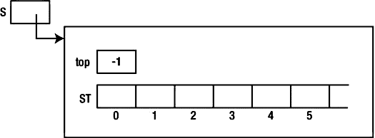
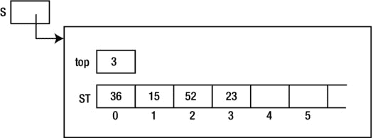
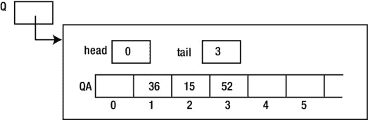
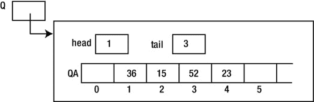
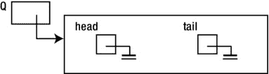

# 四、栈和队列

在本章中，我们将解释以下内容:

*   抽象数据类型的概念
*   什么是栈
*   如何使用数组实现栈
*   如何使用链表实现栈
*   如何创建供其他程序使用的头文件
*   如何实现通用数据类型的栈
*   如何将表达式从中缀转换成后缀
*   如何计算一个算术表达式
*   什么是队列
*   如何使用数组实现队列
*   如何使用链表实现队列

4.1 抽象数据类型

我们熟悉声明给定类型的变量(`double`)然后对这些变量执行操作(例如，加、乘和赋值)的概念，而不需要知道*这些变量是如何*存储在计算机中的。在这种情况下，编译器设计者可以改变一个`double`变量的存储方式，而程序员不必改变任何使用`double`变量的程序。这是一个抽象数据类型的例子。

*抽象数据类型*允许用户在不知道数据类型在计算机中如何表示的情况下操作数据类型。换句话说，就用户而言，他需要知道的只是可以对数据类型执行的操作。实现该数据类型的人可以自由地更改其实现，而不会影响用户。

在这一章中，我们将展示如何将栈和队列作为抽象数据类型来实现。

4.2 栈

一个*栈*作为一个线性列表，其中项目在一端被添加，从同一端被删除。这个想法是通过一叠叠放在桌子上的“盘子”来说明的。当需要一个盘子时，就从盘子堆的顶部拿走。当一个盘子被清洗时，它被添加到堆叠的顶部。注意，如果现在需要一个板，这个“最新的”板就是被取用的板。栈展示了“后进先出”的特性。

为了说明栈思想，我们将使用一个整数栈。我们的目标是定义一个名为`Stack` 的数据类型，这样用户就可以声明这种类型的变量，并以各种方式操纵它们。这些方法有哪些？

如前所述，我们需要向栈中添加一个项目；常用的说法是*推*。我们还需要从栈中取出一个项目；常用的术语是 *pop* 。

在我们尝试从栈中取出一些东西之前，最好确保栈上有一些东西，换句话说，它不是空的。我们将需要一个测试栈是否为空的操作。

给定这三个操作——*按下*、*弹出*和*清空*——让我们来说明如何使用它们来读取一些数字并以相反的顺序打印它们。例如，假设我们有这些数字:

```java
        36 15 52 23
```

假设我们想要打印以下内容:

```java
        23 52 15 36
```

我们可以通过将每个新数字添加到栈顶`S`来解决这个问题。将所有数字放入栈后，我们可以将栈描述如下:

```java
        23      (top of stack)
        52
        15
        36      (bottom of stack)
```

接下来，我们一次删除一个数字，并在删除时打印每个数字。

我们需要一种方法来判断所有的数字何时被读取。我们将使用`0`来结束数据。解决这个问题的逻辑可以表达为如下:

```java
        create an empty stack, S
        read(num)
        while (num != 0) {
           push num onto S
           read(num)
        }
        while (S is not empty) {
           pop S into num //store the number at the top of S in num
           print num
        }
```

我们现在展示如何实现整数栈及其操作。

4.2.1 使用数组 实现栈

为了简化基本原理的介绍，我们将使用整数栈。稍后，我们将看到如何实现一个通用数据类型的栈。

在(整数的)栈的数组实现中，我们使用一个整数数组(`ST`)来存储数字，使用一个整数变量(`top`)来包含栈顶项目的下标。

因为我们使用了一个数组，所以我们需要知道它的大小来声明它。我们需要一些关于这个问题的信息来确定阵列的合理大小。我们将使用符号常量`MaxStack`。如果我们试图将超过`MaxStack`个元素推入栈，将会报告一个*栈溢出*错误。

我们开始定义类`Stack`如下:

```java
        public class Stack {
           final static int MaxStack = 100;
           int top = -1;
           int[] ST = new int[MaxStack];

           //the rest of the class goes here
        } //end class Stack
```

`top`的有效值范围从`0`到`MaxStack-1`。当我们初始化一个栈时，我们将把`top`设置为无效的下标`-1`。

我们现在可以用下面的语句声明一个栈变量`S`:

```java
        Stack S = new Stack();
```

执行该语句时，内存中的情况可以用[图 4-1](#Fig1) 表示。



[图 4-1](#_Fig1) 。内存中栈的数组表示

这表示一个空栈。我们需要一个函数来告诉我们栈是否为空。我们可以将下面的实例方法添加到`Stack`类中:

```java
        public boolean empty() {
           return top == -1;
        }
```

这只是检查`top`是否具有值`-1`。

栈上的主要操作是*推*和*弹出*。要将项目`n`推入栈，我们必须将它存储在`ST`中，并更新`top`以指向它。基本想法如下:

```java
        add 1 to top
        set ST[top] to n
```

然而，当栈已经满了的时候，我们必须防止试图向栈中添加东西。当`top`的值为`MaxStack - 1`(最后一个元素的下标)时，栈已满。在这种情况下，我们将报告栈已满并暂停程序。下面是`Stack`类中的实例方法`push`:

```java
        public void push(int n) {
           if (top == MaxStack - 1) {
              System.out.printf("\nStack Overflow\n");
              System.exit(1);
           }
           ++top;
           ST[top] = n;
        } //end push
```

举例来说，在数字 36、15、52 和 23 被推送到`S`之后，我们在内存中的图像看起来像[图 4-2](#Fig2) 。



[图 4-2](#_Fig2) 。按下 36、15、52 和 23 后的栈视图

最后，为了从栈中弹出一个项目，我们返回位置`top`中的值，并将`top`减少`1`。基本想法如下:

```java
        set hold to ST[top]
        subtract 1 from top
        return hold
```

同样，我们必须防止试图从空栈中取出一些东西。栈为空，调用了`pop`怎么办？我们可以简单地报告一个错误并停止程序。然而，返回一些“流氓”值可能更好，表明栈是空的。我们在函数`pop`中采用后一种方法。下面是`Stack`类中的实例方法`pop`:

```java
        public int pop() {
           if (this.empty())return RogueValue; //a symbolic constant
           int hold = ST[top];
           --top;
           return hold;
        }
```

注意，即使我们已经编写了`pop`来做一些合理的事情，如果它被调用并且栈是空的，如果程序员在调用`pop`之前确定栈是*而不是*空的(使用`empty`函数)*会更好。*

给定类`Stack`，我们现在可以编写[程序 P4.1](#list1) ，它读取一些数字，以`0`终止，并以相反的顺序打印出来。注意，为了将整个程序存储在一个文件`StackTest.java`中，从类`Stack`中删除了单词`public`。

***[程序 P4.1](#_list1)***

```java
        import java.util.*;
        public class StackTest {
           public static void main(String[] args) {
              Scanner in = new Scanner(System.in);
              Stack S = new Stack();
              System.out.printf("Enter some integers ending with 0\n");
              int n = in.nextInt();
              while (n != 0) {
                 S.push(n);
                 n = in.nextInt();
              }
              System.out.printf("\nNumbers in reverse order\n");
              while (!S.empty())
                 System.out.printf("%d ", S.pop());
              System.out.printf("\n");
           } //end main
        } //end StackTest

        class Stack {
           final static int MaxStack = 100;
           final static int RogueValue = -999999;
           int top = -1;
           int[] ST = new int[MaxStack];

           public boolean empty() {
              return top == -1;
           }

           public void push(int n) {
              if (top == MaxStack - 1) {
                 System.out.printf("\nStack Overflow\n");
                 System.exit(1);
              }
              ++top;
              ST[top] = n;
           } //end push

           public int pop() {
              if (this.empty())return RogueValue; //a symbolic constant
              int hold = ST[top];
              --top;
              return hold;
           }

        } //end class Stack
```

以下显示了[程序 P4.1](#list1) 的运行示例:

```java
    Enter some integers ending with 0
    1 2 3 4 5 6 7 8 9 0

    Numbers in reverse order
    9 8 7 6 5 4 3 2 1
```

重要的是观察到`main`中使用栈的代码通过函数`push`、`pop`和`empty`这样做，并且*没有*假设*如何存储*栈元素。这是抽象数据类型的标志——用户不需要知道它是如何实现的就可以使用它。

接下来，我们将使用一个链表实现栈，但是`main`将保持不变，以解决逆序打印数字的问题。

4.2.2 使用链表 实现栈

栈的数组实现具有简单高效的优点。然而，一个主要的缺点是需要知道声明数组的大小。必须进行一些合理的猜测，但这可能会变得太小(程序不得不暂停)或太大(存储被浪费)。

为了克服这个缺点，可以使用链表。现在，我们将只在需要时为元素分配存储。

栈被实现为一个链表，在链表的头部添加新的条目。当我们需要弹出栈时，位于头部的项目将被移除。

同样，我们用一堆整数来说明这些原理。首先，我们需要定义一个用于为列表创建节点的`Node`类。我们将使用以下声明:

```java
        class Node {
           int data;
           Node next;

           public Node(int d) {
              data = d;
              next = null;
           }
        } //end class Node
```

接下来，我们将编写类`Stack`，开头如下:

```java
        class Stack {
           Node top = null;

           public boolean empty() {
              return top == null;
           }
           ...
```

有一个类型为`Node`的实例变量`top`。它被初始化为`null`来表示空栈。函数`empty`简单地检查`top`是否为`null`。空栈`S`如图[图 4-3](#Fig3) 所示。


[图 4-3](#_Fig3) 。空栈

方法`push` 只是在栈头添加一个项，可以写成如下:

```java
        public void push(int n) {
           Node p = new Node(n);
           p.next = top;
           top = p;
        } //end push
```

将`36`、`15`、`52`、`23`(按此顺序)压入栈`S`后，我们可以描绘出如图[图 4-4](#Fig4) 所示的画面。`S`是指向`top`的指针，T6 是指向栈元素链表的指针。


[图 4-4](#_Fig4) 。按下 36、15、52 和 23 后的栈视图

要从栈中弹出一个项目，我们首先检查栈是否为空。如果是，则返回一个错误值。如果不是，则返回列表头部的项目，并从列表中删除包含该项目的节点。这里是`pop`:

```java
        public int pop() {
           if (this.empty()) return RogueValue; //a symbolic constant
           int hold = top.data;
           top = top.next;
           return hold;
        } //end pop
```

我们将[程序 P4.1](#list1) 改写为[程序 P4.2](#list2) 。类别`StackTest`和以前一样，但是类别`Stack`使用了我们对`empty` 、`push`和`pop`的新定义。我们再次强调，即使栈的*实现*已经从使用数组变为使用链表，使用栈的代码(`main`)仍然保持不变。

***[程序 P4.2](#_list2)***

```java
        import java.util.*;
        public class StackTest {
           public static void main(String[] args) {
              Scanner in = new Scanner(System.in);
              Stack S = new Stack();
              System.out.printf("Enter some integers ending with 0\n");
              int n = in.nextInt();
              while (n != 0) {
                 S.push(n);
                 n = in.nextInt();
              }
              System.out.printf("\nNumbers in reverse order\n");
              while (!S.empty())
                 System.out.printf("%d ", S.pop());
              System.out.printf("\n");
           } //end main
        } //end StackTest

        class Node {
           int data;
           Node next;

           public Node(int d) {
              data = d;
              next = null;
           }
        } //end class Node

        class Stack {
           final static int RogueValue = -999999;
           Node top = null;

           public boolean empty() {
              return top == null;
           }

           public void push(int n) {
              Node p = new Node(n);
              p.next = top;
              top = p;
           } //end push

           public int pop() {
              if (this.empty()) return RogueValue; //a symbolic constant
              int hold = top.data;
              top = top.next;
              return hold;
           } //end pop

        } //end class Stack
```

以下显示了[程序 P4.2](#list2) 的运行示例。正如所料，其工作方式与[程序 P4.1](#list1) 相同。

```java
    Enter some integers ending with 0
    1 2 3 4 5 6 7 8 9 0

    Numbers in reverse order
    9 8 7 6 5 4 3 2 1
```

4.3 一般栈类型

为了简化我们的演示，我们使用了整数栈。我们提醒你那些与使用整数的决定相关的地方。

*   在`Node`的声明中，我们声明了一个叫做`num`的`int`。
*   在`push`中，我们传递一个`int`参数。
*   在`pop`中，我们返回一个`int`结果。

这意味着如果我们需要一堆字符，比方说，我们必须在所有这些地方将`int`改为`char`。其他类型的 也要做类似的改动。

如果在需要不同类型的栈时，我们能够最小化所需的更改，那就太好了。我们现在展示如何做到这一点。

首先，我们将`Node` 定义如下:

```java
        class Node {
           NodeData data;
           Node next;

           public Node(NodeData d) {
              data = d;
              next = null;
           }
        } //end class Node
```

节点上的数据由通用类型`NodeData`组成。当用户定义`NodeData`类时，他将决定什么样的项目将被存储在栈中。

`Stack`级和之前一样开始:

```java
        public class Stack {
           Node top = null;

           public boolean empty() {
              return top == null;
           }
           ...
```

但是现在，`push`需要一个`NodeData`参数，可以写成如下形式:

```java
        public void push(NodeData nd) {
           Node p = new Node(nd);
           p.next = top;
           top = p;
        } //end push
```

同样，我们把`pop`写成如下。由于只有`NodeData`应该知道被定义的数据类型，我们将让它告诉我们什么是流氓值。

```java
        public NodeData pop() {
           if (this.empty())return NodeData.getRogueValue();
           NodeData hold = top.data;
           top = top.next;
           return hold;
        } //end pop
```

细心的读者会注意到，到目前为止，我们所做的只是将`Node`、`push`和`pop`中的`int`改为`NodeData`。

如果我们想实现一个整数栈，我们可以如下定义`NodeData`类。除了增加了访问器`getData()` 之外，它和以前一样。

```java
        public class NodeData {
           int num;

           public NodeData(int n) {
              num = n;
           }

           public int getData() {return num;}

           public static NodeData getRogueValue() {return new NodeData(-999999);}

           public int compareTo(NodeData nd) {
              if (this.num == nd.num) return 0;
              if (this.num < nd.num) return -1;
              return 1;
           }

           public String toString() {
              return num + " ";
              //" " needed to convert num to a string; may also use "" (empty string)
           }

        } //end class NodeData
```

尽管对`Node`、`Stack`和`NodeData`进行了所有这些更改，但如果我们将`S.push(n)`更改为`S.push(new NodeData(n))`并将`S.pop()`更改为`S.pop().getData()`，程序 P4.1 和 P4.2 的类`StackTest`将像以前一样工作，如[程序 P4.3](#list3) 所示。注意，对于这个程序，我们不需要`NodeData`类中的`compareTo`和`toString`，所以省略了它们。像往常一样，我们从类头中省略了`public`(除了`StackTest`)，这样整个程序可以保存在一个文件中。

***[程序 P4.3](#_list3)***

```java
        import java.util.*;
        public class StackTest {
           public static void main(String[] args) {
              Scanner in = new Scanner(System.in);
              Stack S = new Stack();
              System.out.printf("Enter some integers ending with 0\n");
              int n = in.nextInt();
              while (n != 0) {
                 S.push(new NodeData(n));
                 n = in.nextInt();
              }
              System.out.printf("\nNumbers in reverse order\n");
              while (!S.empty())
                 System.out.printf("%d ", S.pop().getData());
              System.out.printf("\n");
           } //end main
        } //end StackTest

        class NodeData {
           int num;

           public NodeData(int n) {
              num = n;
           }

           public int getData() {return num;}

           public static NodeData getRogueValue() {return new NodeData(-999999);}

        } //end class NodeData

        class Node {
           NodeData data;
           Node next;

           public Node(NodeData d) {
              data = d;
              next = null;
           }
        } //end class Node

        class Stack {
           Node top = null;

           public boolean empty() {
              return top == null;
           }

           public void push(NodeData nd) {
              Node p = new Node(nd);
              p.next = top;
              top = p;
           } //end push

           public NodeData pop() {
              if (this.empty())return NodeData.getRogueValue();
              NodeData hold = top.data;
              top = top.next;
              return hold;
           } //end pop

        } //end class Stack
```

如果我们需要处理一堆字符，我们只需要将`NodeData`类改为如下:

```java
        public class NodeData {
           char ch;

           public NodeData(char c) {
              ch = c;
           }

           public char getData() {return ch;}

           public static NodeData getRogueValue() {return new NodeData('$');}

           public int compareTo(NodeData nd) {
              if (this.ch == nd.ch) return 0;
              if (this.ch < nd.ch) return -1;
              return 1;
           }

           public String toString() {
              return ch + "";
           }
        } //end class NodeData
```

4.3.1 示例:十进制转换为二进制T1】

考虑将正整数从十进制转换为二进制的问题。我们可以使用整数栈`S`，通过重复除以 2 并保存余数来实现这一点。算法是这样的:

```java
           initialize S to empty
           read the number, n
           while (n > 0) {
              push n % 2 onto S
              n = n / 2
           }
           while (S is not empty) print pop(S)
```

该算法在[程序 P4.4](#list4) 中实现。仅显示了类别`DecimalToBinary`。类别`NodeData`、`Node`和`Stack`与[程序 P4.3](#list3) 中的相同。

***[程序 P4.4](#_list4)***

```java
        import java.util.*;
        public class DecimalToBinary {
           public static void main(String[] args) {
              Scanner in = new Scanner(System.in);
              Stack S = new Stack();
              System.out.printf("Enter a positive integer: ");
              int n = in.nextInt();
              while (n > 0) {
                 S.push(new NodeData(n % 2));
                 n = n / 2;
              }
              System.out.printf("\nIts binary equivalent is ");
              while (!S.empty())
                 System.out.printf("%d", S.pop().getData());
              System.out.printf("\n");
           } //end main
        } //end class DecimalToBinary
```

以下是[程序 P4.4](#list4) 的运行示例:

```java
        Enter a positive integer: 99

        Its binary equivalent is 1100011
```

4.4 如何从中缀转换成后缀

栈的一个经典用途是对算术表达式求值。我们通常编写算术表达式(*中缀*形式)的方式的一个问题是，它不便于计算机求值。对于这样的评估，一种方法是首先将表达式转换为*后缀*形式。我们首先展示如何进行这种转换，然后解释如何计算表达式。

考虑一下表达式 7 + 3 * 4。它的价值是什么？在不知道应该先执行哪个操作的情况下，我们可能会从左到右计算出(7 + 3 = 10) * 4 = 40 的值。然而，普通的算术规则表明乘法*比加法*具有更高的优先级。这意味着，在类似 7 + 3 * 4 的表达式中，乘法(*)在加法(+)之前执行。知道了这个，值就是 7 + 12 = 19。

当然，我们可以通过使用括号强制先执行加法，如(7 + 3) * 4 所示。在这里，括号表示+首先完成。

这些是中缀表达的例子；运算符(+，*)放在其操作数之间。中缀表达式的一个缺点是需要使用括号来覆盖普通的*优先规则*。

表示表达式的另一种方式是使用*后缀*符号T3。这里，操作符出现在操作数的之后的*，不需要用括号来指定先执行哪个操作。例如，后缀形式的*

```java
         7 + 3 * 4  is  7 3 4 * +
```

和后缀形式的

```java
        (7 + 3) * 4  is  7 3 + 4 *
```

一个有用的观察是操作数在中缀和后缀形式中都以相同的顺序出现，但是它们在操作符的顺序和位置上有所不同。

后缀表示法为什么有用？如前所述，我们不需要括号来指定操作符的优先级。然而，更重要的是，它是计算表达式的一种方便形式。

给定表达式的后缀形式，它可以被评估如下:

```java
        initialize a stack, S, to empty
        while we have not reached the end of the expression
           get the next item, x, from the expression
           if x is an operand, push it onto S
           if x is an operator, pop its operands from S, apply the operator and
                    push the result onto S
        endwhile
        pop S; // this is the value of the expression
```

考虑后缀形式为`7 3 + 4 *`的表达式`(7 + 3) * 4`。通过从左到右遍历来评估。

1.  下一项是`7`；将`7`推到`S`上；`S`包含`7`。
2.  下一项是`3`；将`3`推到`S`上；`S`包含`7 3`(右上)。
3.  下一项是`+`；从`S`弹出`3`和`7`；将`+`应用到`7`和`3`，给出`10`；将`10`推到`S`上；`S`包含`10`。
4.  下一项是`4`；将`4`推到`S`上；`S`包含`10 4`。
5.  下一项是`*`；从`S`弹出`4`和`10`；将`*`应用到`10`和`4`，给出`40`；将`40`推到`S`上；`S`包含`40`。
6.  我们已经到达表达式的末尾；我们弹出`S`，得到`40`—表达式的结果。

注意，当操作数从栈中弹出时，第一个弹出的是第二个操作数，第二个弹出的是第一个操作数。这对加法和乘法无关紧要，但对减法和除法很重要。作为一个练习，将下面的代码转换成后缀形式，并使用上面的算法对其求值:`(7 – 3) * (9 – 8 / 4)`。

当然，最大的问题是我们如何让计算机将一个中缀表达式转换成后缀？在介绍该算法之前，我们注意到它将使用一个*操作符栈*。我们还需要一个*优先级表*，给出操作符的相对优先级。给定任意两个操作符，该表将告诉我们它们是否具有相同的优先级(比如`+`和`-`),如果不是，那么哪个优先级更高。

随着算法的进行，它将输出给定表达式的后缀形式。

下面是算法:

1.  初始化一堆操作符`S`，清空。
2.  从中缀表达式中获取下一项`x`；如果没有，转到第 8 步(`x`是操作数、左括号、右括号或运算符)。
3.  如果`x`是操作数，则输出`x`。
4.  如果`x`是左支架，将其推到`S`上。
5.  如果`x`是右括号，则弹出`S`项并输出弹出项，直到`S`上方出现一个左括号；弹出左支架并丢弃。
6.  如果`x`是一个操作符，那么执行以下操作:

    ```java
      while (S is not empty) and (a left bracket is not on top of S) and
            (an operator of equal or higher precedence than x is on top of S)
         pop S and output popped item
      push x onto S
    ```

7.  从步骤 2 开始重复。
8.  弹出`S`并输出弹出的项目，直到`S`为空。

建议您逐步完成以下表达式的算法:

```java
            3 + 5
            7 – 3 + 8
            7 + 3 * 4
            (7 + 3) * 4
            (7 + 3) / (8 – 2 * 3)
            (7 – 8 / 2 / 2) * ((7 – 2) * 3 – 6)
```

让我们写一个程序来读取一个简化的中缀表达式并输出它的后缀形式。我们假设一个操作数是一个单位整数。操作员可以是`+`、`–`、`*`或`/`中的一个。允许使用括号。通常运算符的优先级适用:`+`和`–`的优先级相同，低于`*`和`/`的优先级。左括号作为优先级很低的运算符处理，比`+`和`–`的优先级低。

我们将把它实现为一个函数`precedence` ，给定一个操作符，返回一个表示其优先级的整数。只要保持运算符的相对优先级，返回的实际值并不重要。我们将使用以下内容:

```java
        public static int precedence(char c) {
           if (c == '(') return 0;
           if (c == '+' || c == '-') return 3;
           if (c == '*' || c == '/') return 5;
           return -99; //error
        }
```

我们也可以使用如下的`switch`语句来编写`precedence`:

```java
        public static int precedence(char c) {
           switch (c) {
              case '(': return 0;
              case '+':
              case '-': return 3;
              case '*':
              case '/': return 5;
           }//end switch
        } //end precedence
```

实际值 0、3 和 5 并不重要。可以使用任何值，只要它们代表运算符的相对优先级。

我们需要一个函数来读取输入并返回下一个非空字符。如有必要，该函数将跳过零个或多个空格。行尾字符将指示表达式的结束。下面是函数(我们称之为`getToken` ):

```java
        public static char getToken() throws IOException {
           int n;
           while ((n = System.in.read()) == ' ') ; //read over blanks
           if (n == '\r' || n == '\n') return '\0';
                 //'\r' on Windows, MacOS and DOS; '\n' on Unix
           return (char) n;
        } //end getToken
```

操作符栈只是一个简单的字符栈，我们将使用 4.3 节末尾定义的`NodeData`类来实现。这显示在[程序 P4.5](#list5) 中。

算法的第 6 步要求我们比较栈顶操作符和当前操作符的优先级。如果我们可以“偷看”栈顶的元素而不用把它拿下来，这就很容易了。为此，我们编写下面的实例方法，`peek` ，并将其添加到`Stack`类中:

```java
          public NodeData peek() {
              if (!this.empty()) return top.data;
              return null;
           } //end peek
```

将所有这些放在一起，我们编写了[程序 P4.5](#list5) ，它实现了将中缀表达式转换为后缀的算法。类别`Node`与[程序 P4.3](#list3) 中的类别相同。类别`Stack`与[程序 P4.3](#list3) 中的类别相同，但增加了`peek()`。

***[程序 P4.5](#_list5)***

```java
        import java.io.*;
        public class InfixToPostfix {

           public static void main(String[] args) throws IOException {
              char[] post = new char[255];
              int n = readConvert(post);
              printPostfix(post, n);
           } //end main

           public static int readConvert(char[] post) throws IOException {
           //Read the expression and convert to postfix. Return the size of postfix.
              Stack S = new Stack();
              int h = 0;
              char c;
              System.out.printf("Type an infix expression and press Enter\n");
              char token = getToken();
              while (token != '\0') {
                 if (Character.isDigit(token)) post[h++] = token;
                 else if (token == '(') S.push(new NodeData('('));
                 else if (token == ')')
                    while ((c = S.pop().getData()) != '(') post[h++] = c;
                 else {
                    while (!S.empty() &&
                           precedence(S.peek().getData()) >= precedence(token))
                       post[h++] = S.pop().getData();
                    S.push(new NodeData(token));
                 }
                 token = getToken();
              }
              while (!S.empty()) post[h++] = S.pop().getData();
              return h;
           } //end readConvert

           public static void printPostfix(char[] post, int n) {
              System.out.printf("\nThe postfix form is \n");
              for (int h = 0; h < n; h++) System.out.printf("%c ", post[h]);
              System.out.printf("\n");
           } //end printPostfix

           public static char getToken() throws IOException {
              int n;
              while ((n = System.in.read()) == ' ') ; //read over blanks
              if (n == '\r') return '\0';
              return (char) n;
           } //end getToken

           public static int precedence(char c) {
           //Returns the precedence of the given operator
              if (c == '(') return 0;
              if (c == '+' || c == '-') return 3;
              if (c == '*' || c == '/') return 5;
              return -99; //error
           } //end precedence

        } //end class InfixToPostfix

        class NodeData {
           char ch;

           public NodeData(char c) {
              ch = c;
           }

           public char getData() {return ch;}

           public static NodeData getRogueValue() {return new NodeData('$');}

        } //end class NodeData
```

读取表达式并转换为后缀的工作委托给函数`readConvert` 。这将后缀形式输出到一个字符数组`post`。为了避免错误检查造成代码混乱，我们假设`post`足够大，可以容纳转换后的表达式。该函数返回后缀表达式中元素的数量。

函数`printPostfix`只是打印后缀表达式。

以下是[程序 P4.5](#list5) 的运行示例:

```java
        Type an infix expression and press Enter
         (7 – 8 / 2 / 2) * ((7 – 2) * 3 – 6)

        The postfix form is
        7 8 2 / 2 / - 7 2 – 3 * 6 - *
```

请注意，输入表达式时可以使用或不使用空格来分隔运算符和操作数。例如，如果样本运行中的表达式输入如下，将产生正确的后缀形式:

```java
         (7 – 8/2/ 2)*((7–2) *3 – 6)
```

[程序 P4.5](#list5) 假设给定的表达式是有效的。但是，可以很容易地对其进行修改，以识别某些类型的无效表达式。例如，如果一个右括号不见了，当我们到达表达式的末尾时，在栈上将会有一个左括号。(如果括号匹配，则没有。)类似地，如果一个左括号丢失了，当遇到一个右括号并且我们正在扫描栈寻找(丢失的)左括号时，我们将找不到它。

敦促您修改[程序 P4.5](#list5) 来捕捉带有不匹配括号的表达式。您还应该修改它来处理任何整数操作数，而不仅仅是个位数。另一个修改是处理其他操作，例如`%`、`sqrt`(平方根)、`sin`(正弦)、`cos`(余弦)、`tan`(正切)、`log`(对数)、`exp`(指数)，等等。

4.4.1 对算术表达式 求值

[程序 P4.5](#list5) 将表达式的后缀形式存储在字符数组`post`中。我们现在编写一个函数，给定`post`，计算表达式并返回其值。该函数使用 4.4 节开头的算法。

我们将需要一个*整数*栈来保存操作数和中间结果。回想一下，我们需要一个*字符*栈来存放操作符。如果我们将`NodeData`定义如下，我们可以灵活地处理这两种栈:

```java
        public class NodeData {
           char ch;
           int num;

           public NodeData(char c) {
              ch = c;
           }

           public NodeData(int n) {
              num = n;
           }
           public NodeData(char c, int n) {
              ch = c;
              num = n;
           }

           public char getCharData() {return ch;}

           public int getIntData() {return num;}

           public static NodeData getRogueValue() {
              return new NodeData('$', -999999); //the user will choose which one is needed
           }

        } //end class NodeData
```

我们将`char`字段用于操作符栈，将`int`字段用于操作数栈。注意用于设置和检索`ch`和`num`的三个构造函数和三个访问器。

使用`NodeData`、[的定义，如果我们简单地用`getCharData`替换所有出现的`getData`，程序 P4.5](#list5) 将工作良好。

函数`eval`对给定后缀形式的表达式求值，显示为[程序 P4.6](#list6) 的一部分。我们通过将以下语句作为`main`中的最后一条语句来测试`eval`:

```java
        System.out.printf("\nIts value is %d\n", eval(post, n));
```

[程序 P4.6](#list6) 中未显示类别`Node`和`Stack`。类别`Node`与[程序 P4.3](#list3) 中的类别相同。类别`Stack`与[程序 P4.3](#list3) 中的类别相同，但增加了`peek()`。

***[程序 P4.6](#_list6)***

```java
        import java.io.*;
        public class EvalExpression {
           public static void main(String[] args) throws IOException {
              char[] post = new char[255];
              int n = readConvert(post);
              printPostfix(post, n);
              System.out.printf("\nIts value is %d\n", eval(post, n));
           } //end main

           public static int readConvert(char[] post) throws IOException {
           //Read the expression and convert to postfix. Return the size of postfix.
              Stack S = new Stack();
              int h = 0;
              char c;
              System.out.printf("Type an infix expression and press Enter\n");
              char token = getToken();
              while (token != '\0') {
                 if (Character.isDigit(token)) post[h++] = token;
                 else if (token == '(') S.push(new NodeData('('));
                 else if (token == ')')
                    while ((c = S.pop().getCharData()) != '(') post[h++] = c;
                 else {
                    while (!S.empty() &&
                           precedence(S.peek().getCharData()) >= precedence(token))
                       post[h++] = S.pop().getCharData();
                    S.push(new NodeData(token));
                 }
                 token = getToken();
              }
              while (!S.empty()) post[h++] = S.pop().getCharData();
              return h;
           } //end readConvert

           public static void printPostfix(char[] post, int n) {
              System.out.printf("\nThe postfix form is \n");
              for (int h = 0; h < n; h++) System.out.printf("%c ", post[h]);
              System.out.printf("\n");
           } //end printPostfix

           public static char getToken() throws IOException {
              int n;
              while ((n = System.in.read()) == ' ') ; //read over blanks
              if (n == '\r') return '\0';
              return (char) n;
           } //end getToken

           public static int precedence(char c) {
           //Returns the precedence of the given operator
              if (c == '(') return 0;
              if (c == '+' || c == '-') return 3;
              if (c == '*' || c == '/') return 5;
              return -99; //error
           } //end precedence

           public static int eval(char[] post, int n) {
           //Given the postfix form of an expression, returns its value
              int a, b, c;
              Stack S = new Stack();
              for (int h = 0; h < n; h++) {
                 if (Character.isDigit(post[h]))
                    S.push(new NodeData(post[h] - '0'));
                 else {
                    b = S.pop().getIntData();
                    a = S.pop().getIntData();
                    if (post[h] == '+') c = a + b;
                    else if (post[h] == '-') c = a - b;
                    else if (post[h] == '*') c = a * b;
                    else c = a / b;
                    S.push(new NodeData(c));
                 } //end if
              } //end for
              return S.pop().getIntData();
           } //end eval

        } //end class EvalExpression

        class NodeData {
           char ch;
           int num;

           public NodeData(char c) {
              ch = c;
           }

           public NodeData(int n) {
              num = n;
           }

           public NodeData(char c, int n) {
              ch = c;
              num = n;
           }

           public char getCharData() {return ch;}

           public int getIntData() {return num;}

           public static NodeData getRogueValue() {
              return new NodeData('$', -999999);
           }

        } //end class NodeData
```

以下是[程序 P4.6](#list6) 的运行示例:

```java
        Type an infix expression and press Enter
         (7 – 8 / 2 / 2) * ((7 – 2) * 3 – 6)

        The postfix form is
        7 8 2 / 2 / - 7 2 – 3 * 6 - *

        Its value is 45
```

4.5 队列

一个*队列* 是一个线性列表，其中项目在一端被添加，在另一端被删除。常见的例子是在银行、超市、音乐会或体育赛事中排队。人们应该从后面排队，从前面离开。我们期望队列数据结构对于模拟这些真实的队列是有用的。

计算机内部也有队列。可能有几个等待执行的作业，它们被放在一个队列中。例如，几个人可能每个人都要求在网络打印机上打印一些东西。由于打印机一次只能处理一项工作，所以其他工作必须排队。

这些是我们想要在队列上执行的基本操作:

*   向队列中添加一个项目(我们称之为*入队*)
*   从队列中删除一个项目(我们称之为*出列*)
*   检查队列是否为空
*   检查队列最前面的物品

与栈一样，我们可以使用数组或链表轻松实现队列数据结构。出于说明的目的，我们将使用整数队列。

4.5.1 使用数组 实现队列

在(整数的)队列的数组实现中，我们使用一个整数数组(`QA`)来存储数字和两个整数变量(`head`和`tail`)，这两个变量分别表示队列头的项和队列尾的项。

因为我们使用了一个数组，所以我们需要知道它的大小来声明它。我们需要一些关于这个问题的信息来确定阵列的合理大小。我们将使用符号常量`MaxQ`。在我们的实现中，如果队列中有`MaxQ-1`个元素，并且我们试图添加另一个元素，那么队列将被声明为已满。

我们开始定义类`Queue`如下:

```java
        public class Queue {
           final static int MaxQ = 100;
           int head = 0, tail = 0;
           int[] QA = new int[MaxQ];
           ...
```

`head`和`tail`的有效值范围从`0`到`MaxQ-1`。当我们初始化一个队列时，我们会将`head`和`tail`设置为`0`；稍后，我们将看到为什么这是一个好的值。

像往常一样，我们可以用下面的代码创建一个空队列`Q`:

```java
        Queue Q = new Queue();
```

执行该语句时，内存中的情况可以表示为[图 4-5](#Fig5) 所示。


[图 4-5](#_Fig5) 。队列的数组表示

这表示空队列。在处理队列时，我们需要一个函数来告诉我们队列是否为空。我们可以使用以下方法:

```java
        public boolean empty() {
           return head == tail;
        }
```

简而言之，我们将看到，给定我们将实现*入队*和*出队*操作的方式，每当`head`和`tail`具有相同的值时，队列将为空。这个值不一定是`0`。其实可能是`0`到`MaxQ-1`的任意一个值，都是`QA`的有效下标。

考虑如何将一个项目添加到队列中。在真正的队列中，一个人排在最后。这里我们将做同样的事情，增加`tail`并将项目存储在由`tail`指示的位置。

例如，为了将`36`添加到队列中，我们将`tail`增加到`1`，并将`36`存储到`QA[1]`；`head`保持在`0`。

如果我们随后将`15`添加到队列中，它将被存储在`QA[2]`中，而`tail`将成为`2`。

如果我们现在将`52`添加到队列中，它将被存储在`QA[3]`中，`tail`将成为`3`。

我们在内存中的图片会看起来像[图 4-6](#Fig6) 。



[图 4-6](#_Fig6) 。添加 36、15 和 52 后的队列状态

请注意，`head`指向该项的“正前方”,它实际上位于队列的头部，而`tail`指向队列中的最后一项。

现在考虑从队列中删除一些东西。要取下的物品是头部的那个。要移除它，我们必须先用*递增`head`，然后返回`head`指向的值。*

 *比如我们去掉`36`，`head`就会变成`1`，它指向`15`的“正前方”，现在在头部的项目。注意，`36`仍然留在数组中，但是实际上，它不在队列中。

假设我们现在将`23`添加到队列中。它将被放置在位置`4`，其中`tail`为`4`，而`head`为`1`。

图片现在看起来像[图 4-7](#Fig7) 。



[图 4-7](#_Fig7) 。删除 36 和添加 23 后的队列状态

队列中有三个项目:`15`在头，`23`在尾。

考虑一下，如果我们不断地向队列中添加项目而不删除任何项目，会发生什么情况。`tail`的值将一直增加，直到达到`QA`的最后一个有效下标`MaxQ-1`。如果需要添加另一个项目，我们该怎么办？

我们*可以*说队列已满并停止程序。但是，有两个空闲位置，`0`和`1`。最好尝试使用其中的一种。这让我们想到了循环队列的概念。这里，我们认为数组中的位置排列成一个圆圈:位置`MaxQ-1`后面跟着位置`0`。

因此，如果`tail`具有值`MaxQ-1`，增加它将设置它为`0`。

假设我们没有从队列中取走任何项目。`head`的值仍然是`0`。现在，如果在尝试添加一个项目时，`tail`从`MaxQ-1`增加到`0`会怎么样？它现在具有与`head`相同的值。在这种情况下，我们声明队列已满。

即使位置`0`中没有存储任何内容，我们也要这样做，因此位置`0`可用于保存另一个项目。采用这种方法的原因是，它简化了我们检测队列何时为空、何时为满的代码。这也是我们最初将`head`和`tail`都设置为`0`的原因。如果连续插入项目，它使我们能够容易地检测到队列何时已满。

强调一下，*当队列被声明为满时，它包含* `MaxQ-1` *项*。

我们现在可以编写`enqueue`，一个实例方法来将一个项目添加到队列中。

```java
        public void enqueue(int n) {
           tail = (tail + 1) % MaxQ; //increment tail circularly
           if (tail == head) {
              System.out.printf("\nQueue is full\n");
              System.exit(1);
           }
           QA[tail] = n;
        } //end enqueue
```

我们先递增`tail`。如果通过这样做，它具有与`head`相同的值，我们声明队列已满。如果没有，我们将新的项目存储在位置`tail`。

考虑[图 4-7](#Fig7) 。如果我们删除`15`和`52`，则变为[图 4-8](#Fig8) 。


[图 4-8](#_Fig8) 。移除后的队列 15，52

现在，`head`具有值`3` , `tail`具有值`4`，并且在位置`4`的队列中有一个项目`23`。如果我们删除最后一项，`head`和`tail`的值都是`4`，队列将为空。这表明当`head`具有与`tail`相同的值时，我们有一个空的*队列。*

但是等等！刚才不是说当`head`和`tail`的值相同时，队列*已满*吗？是的，但是有区别。在任何时候，如果`head == tail`，队列就*空*。然而，如果在之后*增加`tail`以添加一个项目，它变得与`head`相同，则队列已满。*

我们现在可以编写`dequeue`，一个从队列中移除一个条目的方法。

```java
        public int dequeue() {
           if (this.empty()) {
              System.out.printf("\nAttempt to remove from an empty queue\n");
              System.exit(2);
           }
           head = (head + 1) % MaxQ; //increment head circularly
           return QA[head];
        } //end dequeue
```

如果队列为空，则会报告一个错误，并且程序会暂停。如果没有，我们递增`head`并返回位置`head`中的值。再次注意，如果`head`的值为`MaxQ -1`，递增它会将其设置为`0`。

为了测试我们的队列操作，我们编写了[程序 P4.7](#list7) ，它读取一个整数并以相反的顺序打印它的数字。例如，如果读取了`12345`，程序将打印`54321`。从右侧提取数字，并存储在队列中。队列中的项目被取出，一次一个，并被打印。

***[程序 P4.7](#_list7)***

```java
        import java.util.*;
        public class QueueTest {
           public static void main(String[] args) {
              Scanner in = new Scanner(System.in);
              Queue Q = new Queue();
              System.out.printf("Enter a positive integer: ");
              int n = in.nextInt();
              while (n > 0) {
                 Q.enqueue(n % 10);
                 n = n / 10;
              }
              System.out.printf("\nDigits in reverse order: ");
              while (!Q.empty())
                 System.out.printf("%d", Q.dequeue());
              System.out.printf("\n");
           } //end main

        } //end QueueTest

        class Queue {
           final static int MaxQ = 100;
           int head = 0, tail = 0;
           int[] QA = new int[MaxQ];

           public boolean empty() {
              return head == tail;
           }

           public void enqueue(int n) {
              tail = (tail + 1) % MaxQ; //increment tail circularly
              if (tail == head) {
                 System.out.printf("\nQueue is full\n");
                 System.exit(1);
              }
              QA[tail] = n;
           } //end enqueue

           public int dequeue() {
              if (this.empty()) {
                 System.out.printf("\nAttempt to remove from an empty queue\n");
                 System.exit(2);
              }
              head = (head + 1) % MaxQ; //increment head circularly
              return QA[head];
           } //end dequeue

        } //end class Queue
```

以下是[程序 P4.7](#list7) 的运行示例:

```java
        Enter a positive integer: 192837465

        Digits in reverse order: 564738291

```

4.5.2 使用链表 实现队列

与栈一样，我们可以使用链表来实现队列。这样做的好处是我们不必事先决定要供应多少食物。我们将使用两个指针，`head`和`tail`，分别指向队列中的第一项和最后一项。[图 4-9](#Fig9) 显示了四个项目(36、15、52 和 23)加入队列时的数据结构。


[图 4-9](#_Fig9) 。队列的链表表示

我们将实现队列，这样它就可以使用我们称之为`NodeData`的通用数据类型。队列中的每个节点都将从一个`Node`类中创建，我们定义如下:

```java
        class Node {
           NodeData data;
           Node next;

           public Node(NodeData d) {
              data = d;
              next = null;
           }
        } //end class Node
```

当用户定义`NodeData`类时，他将决定什么样的项目将被存储在队列中。

`Queue`类按如下方式开始:

```java
        public class Queue {
           Node head = null, tail = null;

           public boolean empty() {
              return head == null;
           }
           ...
```

我们可以用下面的语句创建一个空队列:

```java
        Queue Q = new Queue();
```

这将创建如图 4-10 所示的结构。



[图 4-10](#_Fig10) 。空队列(链表表示)

要将一个项目添加到队列中，我们必须将它添加到列表的末尾。这里是`enqueue`:

```java
        public void enqueue(NodeData nd) {
           Node p = new Node(nd);
           if (this.empty()) {
              head = p;
              tail = p;
           }
           else {
              tail.next = p;
              tail = p;
           }
        } //end enqueue
```

如果队列为空，则新项目成为队列中的唯一项目；`head`和`tail`设置为指向它。如果队列不为空，尾部的项被设置为指向新的项，更新`tail`指向新的项。

为了从队列中取出一个项目，我们首先检查队列是否为空。如果是，我们打印一条消息并结束程序。如果不是，则返回队列头部的项目，并删除包含该项目的节点。

如果通过删除一个项目，`head`变成了`null`，这意味着队列是空的。在这种情况下，`tail`也被设置为`null`。这里是`dequeue`:

```java
        public NodeData dequeue() {
           if (this.empty()) {
              System.out.printf("\nAttempt to remove from an empty queue\n");
              System.exit(1);
           }
           NodeData hold = head.data;
           head = head.next;
           if (head == null) tail = null;
           return hold;
        } //end dequeue
```

要使用`Queue`类，用户只需要声明他希望`NodeData`是什么。举例来说，假设他想要一个整数队列。他可以这样定义`NodeData`:

```java
        public class NodeData {
           int num;

           public NodeData(int n) {
              num = n;
           }

           public int getIntData() {return num;}

        } //end class NodeData
```

之前，我们编写了[程序 P4.7](#list7) ，它读取一个整数并以相反的顺序打印它的数字。我们现在使用新的`Node`、`Queue`和`NodeData`类将它重写为[程序 P4.8](#list8) 。

***[程序 P4.8](#_list8)***

```java
        import java.util.*;
        public class QueueTest {
           public static void main(String[] args) {
              Scanner in = new Scanner(System.in);
              Queue Q = new Queue();
              System.out.printf("Enter a positive integer: ");
              int n = in.nextInt();
              while (n > 0) {
                 Q.enqueue(new NodeData(n % 10));
                 n = n / 10;
              }
              System.out.printf("\nDigits in reverse order: ");
              while (!Q.empty())
                 System.out.printf("%d", Q.dequeue().getIntData());
              System.out.printf("\n");
           } //end main
        } //end QueueTest

        class NodeData {
           int num;

           public NodeData(int n) {
              num = n;
           }

           public int getIntData() {return num;}

        } //end class NodeData

        class Node {
           NodeData data;
           Node next;

           public Node(NodeData d) {
              data = d;
              next = null;
           }
        } //end class Node

        class Queue {
           Node head = null, tail = null;

           public boolean empty() {
              return head == null;
           }

           public void enqueue(NodeData nd) {
              Node p = new Node(nd);
              if (this.empty()) {
                 head = p;
                 tail = p;
              }
              else {
                 tail.next = p;
                 tail = p;
              }
           } //end enqueue

           public NodeData dequeue() {
              if (this.empty()) {
                 System.out.printf("\nAttempt to remove from an empty queue\n");
                 System.exit(1);
              }
              NodeData hold = head.data;
              head = head.next;
              if (head == null) tail = null;
              return hold;
           } //end dequeue

        } //end class Queue
```

以下是[程序 P4.8](#list8) 的运行示例:

```java
        Enter a positive integer: 192837465

        Digits in reverse order: 564738291
```

栈和队列对系统程序员和编译器编写者来说很重要。我们已经看到了栈是如何用于算术表达式的求值的。它们还用于实现函数的“调用”和“返回”机制。考虑函数`A`调用函数`C`的情况，函数`C`调用函数`B`，函数【】调用函数`D`。当一个函数返回时，计算机如何计算出返回到哪里？我们展示了如何使用栈来实现这一点。

假设我们有以下情况，其中一个数字，如`100`，代表*返回地址*，它是函数返回时要执行的下一条指令的地址:

```java
    function A    function B    function C    function D
        .             .             .             .
        C;            D;            B;            .
    100:          200:          300:
        .             .             .             .
```

当`A`调用`C`时，地址`100`被压入栈`S`。当`C`调用`B`时，`300`被推到`S`上。当`B`调用`D`时，`200`被推到`S`上。在此阶段，栈如下所示，控制在`D`中:

```java
    (bottom of stack) 100  300  200 (top of stack)
```

当`D`结束并准备返回时，弹出栈顶地址(`200`)，在此地址继续执行。请注意，这是呼叫`D`后的地址。

接下来，当`B`结束并准备返回时，弹出栈顶地址(`300`)，在此地址继续执行。请注意，这是呼叫`B`后的地址。

最后，当`C`结束并准备返回时，弹出栈顶地址(`100`)，在这个地址继续执行。请注意，这是呼叫`C`后的地址。

自然，队列数据结构用于模拟现实生活中的队列。它们也用于在计算机中实现队列。在多道程序环境中，几个作业可能必须排队等候某一特定资源，如处理器时间或打印机。

栈和队列也广泛用于处理更高级的数据结构，如树和图。我们将在第 8 章中讨论树。

**练习 4**

1.  什么是抽象数据类型？
2.  什么是栈？可以在栈上执行的基本操作是什么？
3.  什么是队列？可以对队列执行的基本操作是什么？
4.  修改[程序 P4.5](#list5) 识别括号不匹配的中缀表达式。
5.  [程序 P4.5](#list5) 处理个位数操作数。修改它以处理任何整数操作数。
6.  修改[程序 P4.5](#list5) 来处理带有`%`、平方根、正弦、余弦、正切、对数、指数等运算的表达式。
7.  编写声明/函数来实现一堆`double`值。
8.  编写声明/函数来实现一个`double`值队列。
9.  An integer array `post` is used to hold the postfix form of an arithmetic expression such that the following items are true:

    正数代表一个操作数

    -1 代表+

    -2 代表-

    -3 代表*

    -4 代表/

    0 表示表达式的结尾

    为表达式`(2 + 3) * (8 / 4) - 6`显示`post`的内容。

    写一个函数`eval`，给定`post`，返回表达式的值。

10.  输入行包含一个仅由小写字母组成的单词。解释如何使用栈来确定单词是否是回文。
11.  展示如何使用两个栈实现队列。
12.  展示如何使用两个队列实现栈。
13.  A priority queue is one in which items are added to the queue based on a priority number. Jobs with higher-priority numbers are closer to the head of the queue than those with lower-priority numbers. A job is added to the queue in front of all jobs of lower priority but after all jobs of greater or equal priority.

    编写类来实现优先级队列。队列中的每个项目都有一个作业号(整数)和一个优先级号。至少实现以下操作:(1)在队列中适当的位置添加一个作业，(2)删除队列头的作业，(3)给定一个作业号，从队列中删除该作业。

    确保无论队列状态如何，您的方法都能正常工作。

14.  一个栈，`S1`，包含一些任意顺序的数字。使用另一个栈`S2`作为临时存储，展示如何对`S1`中的数字进行排序，使得最小的在`S1`的顶部，最大的在底部。*