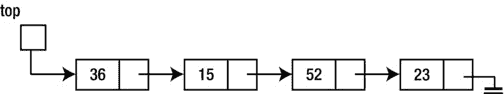
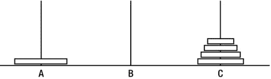
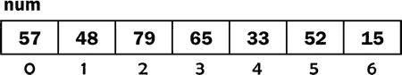
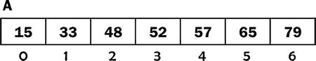

# 五、递归

在本章中，我们将解释以下内容:

*   什么是递归定义
*   如何用 Java 编写递归函数
*   如何从十进制转换成二进制
*   如何逆序打印链表
*   如何解决河内塔
*   如何写一个高效的幂函数
*   如何使用合并排序进行排序
*   如何使用递归来跟踪未决的子问题
*   如何通过在迷宫中寻找路径使用递归实现回溯

5.1 递归定义

*递归定义*是根据自身定义的定义。也许最常见的例子是*阶乘*函数。非负整数的阶乘， *n* (写成 *n* ！)，定义如下:

```java
        0! = 1
        *n*! =*n*(*n*- 1)!,*n*> 0
```

在这里， *n* ！是用( *n* - 1)来定义的！，但什么是( *n* - 1)！确实如此。为了找出答案，我们必须应用阶乘的定义！在这种情况下，我们有这个:

```java
         (*n*- 1)! = 1, if (*n*- 1) = 0
         (*n*- 1)! = (*n*- 1)(*n*- 2)! if (*n*- 1) > 0
```

什么是 3！现在吗？

*   因为 3 > 0，所以是 3×2！。
*   因为 2 > 0，2！就是 2×1！，和 3！变成了 3×2×1！。
*   因为 1 > 0，1！就是 1×0！，和 3！变成了 3×2×1×0！。从 0 开始！是 1，我们有 3！= 3×2×1×1 = 6.

不严谨地说，我们说 *n* ！是从 1 到 *n* 的所有整数的乘积。

让我们用编程符号重写定义；我们称之为`fact`。

```java
         fact(0) = 1
         fact(n) = n * fact(n - 1), n > 0
```

函数的递归定义由两部分组成。

*   基本情况，给出特定参数的函数值。这也被称为*锚*、*结束情况*或*终止情况*，它允许递归最终终止。
*   函数根据自身定义的递归(或一般)情况。

简而言之，我们将把`fact`写成一个 Java 函数。在此之前，我们给出一个递归定义的非数学例子。考虑如何定义*的祖先*。不严格地说，我们可以说祖先是一个人的父母、祖父母、曾祖父母等等。但是我们可以更精确地表述如下:

```java
         *a*is an ancestor of*b*if
            (1)*a*is a parent of*b*, or
            (2)*a*is an ancestor of*c*and*c*is a parent of*b*
```

`(1)`是基本情况，`(2)`是一般的递归情况，其中*祖先*是根据自身定义的。

一个不太严重的例子是首字母缩写词 LAME 的含义。它代表 LAME，另一个 MP3 编码器。扩展 LAME，我们得到 LAME，另一个 MP3 编码器，另一个 MP3 编码器，等等。我们可以说 LAME 是递归首字母缩略词。尽管这不是一个真正的递归定义，因为它没有基本情况。

5.2 用 Java 编写递归函数

我们见过很多函数调用其他函数的例子。我们没有看到的是一个调用自己的函数——一个*递归函数*。我们从`fact`开始。

```java
        public static int fact(int n) {
           if (n < 0) return 0;
           if (n == 0) return 1;
           return n * fact(n - 1);
        }
```

在函数的最后一个语句中，我们调用了函数`fact`，我们正在编写的函数。该函数调用自身。

请考虑以下几点:

```java
        int n = fact(3);
```

它按如下方式执行:

1.  `3`被复制到一个临时位置，这个位置被传递到`fact`，在这里它成为`n`的值。
2.  执行到达最后一条语句，`fact`试图返回`3 * fact(2)`。但是，`fact(2)`必须在返回值已知之前计算出来。把这看作是对带有参数`2`的函数`fact`的调用。
3.  像往常一样，`2`被复制到一个临时位置，这个位置被传递给`fact`，在这里它成为`n`的值。如果`fact`是不同的函数，就没有问题。但是既然是*同*函数，`n`的第一个值会怎么样呢？它必须被保存在某个地方，并在*这个*调用结束时恢复。
4.  该值保存在一个叫做*运行时栈*的东西上。每次函数调用自己时，在新的参数生效之前，它的参数(和局部变量，如果有的话)都存储在栈中。此外，对于每个调用，都会创建新的局部变量。因此，每个调用都有自己的参数和局部变量副本。
5.  当`n`为`2`时，执行到达最后一条语句，`fact`试图返回`2 * fact(1)`。但是，`fact(1)`必须在返回值已知之前计算出来。把这想象成一个带有参数`1`的函数`fact`的调用。
6.  该调用到达最后一条语句，`fact`试图返回`1 * fact(0)`。但是，`fact(0)`必须在返回值已知之前计算出来。把这看作是对带有参数`0`的函数`fact`的调用。
7.  此时，运行时栈包含参数`3`、`2`和`1`，其中`1`位于顶部。调用`fact(0)`到达第二条语句并返回值`1`。
8.  现在可以完成计算`1 * fact(0)`，返回`1`作为`fact(1)`的值。
9.  现在可以完成计算`2 * fact(1)`，返回`2`作为`fact(2)`的值。
10.  现在可以完成计算`3 * fact(2)`，返回`6`作为`fact(3)`的值。

我们应该强调的是，`fact`的递归版本仅仅是为了说明的目的。这不是计算阶乘的有效方法——想想所有的函数调用以及参数的堆叠和拆分，仅仅是为了将从`1`到`n`的数字相乘。更有效的函数如下:

```java
        public static int fact(int n) {
           int f = 1;
           while (n > 0) {
              f = f * n;
              --n;
           }
           return f;
        }
```

另一个可以递归定义的函数的例子是两个正整数`m`和`n`的最高公因数(HCF)。

```java
        hcf(m, n) is
           (1)   m, if n is 0
           (2)   hcf(n, m % n), if n > 0
```

如果`m` = `70`和`n` = `42`，我们有这个:

```java
        hcf(70, 42) = hcf(42, 70 % 42) = hcf(42, 28) = hcf(28, 42 % 28)
                    = hcf(28, 14) = hcf(14, 28 % 14) = hcf(14, 0) = 14
```

我们可以把`hcf`写成这样一个递归的 Java 函数:

```java
        public static int hcf(int m, int n) {
           if (n == 0) return m;
           return hcf(n, m % n);
        }
```

有趣的是，我们也可以使用欧几里德算法将`hcf`写成一个迭代(与递归相反)函数。这是:

```java
        public static int hcf(int m, int n) {
           int r;
           while (n > 0) {
              r = m % n;
              m = n;
              n = r;
           }
           return m;
        }
```

实际上，这个函数显式地做递归函数隐式地做的事情。

递归定义函数的另一个例子是斐波那契数。我们将前两个斐波那契数列定义为`1`和`1`。每个新数字都是通过将前两个数字相加得到的。因此，斐波纳契数列如下:

```java
        1, 1, 2, 3, 5, 8, 13, 21, and so on.
```

递归地，我们定义第 *n* 个斐波那契数`F(n)`，如下:

```java
        F(0) = F(1) = 1
        F(n) = F(n - 1) + F(n - 2), n > 1
```

这是一个返回第 *n* 个斐波那契数的 Java 函数:

```java
        public static int fib(int n) {
           if (n == 0 || n == 1) return 1;
           return fib(n - 1) + fib(n - 2);
        }
```

我们再次强调，尽管这个函数整洁、简洁、易于理解，但它并不高效。例如，考虑`F(5)`的计算:

```java
        F(5) = F(4) + F(3) = F(3) + F(2) + F(3) = F(2) + F(1) + F(2) + F(3)
        = F(1) + F(0) + F(1) + F(2) + F(3) = 1 + 1 + 1 + F(1) + F(0) + F(3)
        = 1 + 1 + 1 + 1 + 1 + F(2) + F(1) =  1 + 1 + 1 + 1 + 1 + F(1) + F(0) + F(1)
        = 1 + 1 + 1 + 1 + 1 + 1 + 1 + 1
        = 8
```

请注意必须进行的函数调用和加法的数量，而我们可以只使用四次加法直接计算出`F(5)`。我们敦促您编写一个高效的迭代函数来返回第 *n* 个斐波那契数。

5.3 使用递归将十进制数转换为二进制数

在 4.3.1 节中，我们使用栈将整数从十进制转换为二进制。我们现在将展示如何编写一个递归函数来执行相同的任务。

要了解需要做什么，假设`n`是`13`，在二进制中是`1101`。回想一下，`n % 2`给出了`n`的二进制等价物的最后*位。如果我们有办法打印除最后一位以外的所有位，那么我们可以打印除最后一位以外的所有位，后面跟着`n % 2`。但是“打印除最后一位以外的所有内容”与打印`n/2`的二进制等价物是一样的。*

比如`1101`就是`110`后面跟着`1`；`110`是`6`的二进制等价物，是`13/2`，`1`是`13 % 2`。因此，我们可以打印出`n`的二进制等价物，如下所示:

```java
        print binary of n / 2
        print n % 2
```

我们用同样的方法打印出`6`的二进制等价物。这是`6/2` = `3`的二进制等值，是`11`，后面是`6 % 2`，是`0`；这就给出了`110`。

我们用同样的方法打印出`3`的二进制等价物。这是`3/2` = `1`的二进制等值，是`1`，后面是`3 % 2`，是`1`；这就给出了`11`。

我们用同样的方法打印出`1`的二进制等价物。这是`1/2` = `0`后跟`1 % 2`的二进制等值，也就是`1`；如果我们对`0`什么都不做，这将给我们`1`。

当我们到达需要找到`0`的二进制等价物的阶段时，我们停下来。这就引出了下面的函数:

```java
        public static void decToBin(int n) {
           if (n > 0) {
              decToBin(n / 2);
              System.out.printf("%d", n % 2);
           }
        }
```

调用`decToBin(13)`将打印`1101`。

注意这比[程序 P4.4](04.html#list4) 要简洁得多。但是，它的效率并没有提高。在[程序 P4.4](04.html#list4) 中显式完成的堆叠/拆分是由函数调用自身时语言提供的递归机制完成的。为了说明这一点，让我们追踪这个调用`decToBin(13)`。

1.  在第一次调用时，n 假定值为 13。
2.  当调用 decToBin(13)正在执行时，调用 dec Tobin(6)；13 被推送到运行时栈上，n 假定值为 6。
3.  当调用 decToBin(6)正在执行时，调用 dec Tobin(3)；6 被推送到栈上，n 取值为 3。
4.  当调用 decToBin(3)正在执行时，调用 dec Tobin(1)；3 被推送到栈上，n 假定值为 1。
5.  当调用 decToBin(1)正在执行时，调用 dec Tobin(0)；1 被推送到栈上，n 假定值为 0。
6.  在这个阶段，栈包含 13，6，3，1。
7.  因为 n 是 0，所以这个函数的调用立即返回；到目前为止，什么都没印出来。
8.  当调用 decToBin(0)返回时，栈顶部的参数 1 恢复为 n 的值。
9.  控制转到 printf 语句，该语句打印 1 % 2，即 1。
10.  调用 decToBin(1)现在可以返回，栈顶部的参数 3 恢复为 n 的值。
11.  控制转到 printf 语句，该语句打印 3 % 2，即 1。
12.  调用 decToBin(3)现在可以返回，栈顶部的参数 6 恢复为 n 的值。
13.  控制转到 printf 语句，该语句打印 6 % 2，即 0。
14.  调用 decToBin(6)现在可以返回，栈顶部的参数 13 恢复为 n 的值。
15.  控制转到 printf 语句，该语句打印 13 % 2，即 1。
16.  呼叫 decToBin(13)现在可以返回，1101 已被打印。

我们可以将上面的描述总结如下:

```java
        decToBin(13)   →  decToBin(6)
                          print(13 % 2)
                       →  decToBin(3)
                          print(6 % 2)
                          print(13 % 2)
                       →  decToBin(1)
                          print(3 % 2)
                          print(6 % 2)
                          print(13 % 2)
                       →  decToBin(0) = do nothing
                          print(1 % 2) = 1
                          print(3 % 2) = 1
                          print(6 % 2) = 0
                          print(13 % 2) = 1
```

递归函数最重要的属性之一是，当函数调用自身时，当前参数(和局部变量，如果有的话)被推送到栈上。使用新的参数和新的局部变量执行函数。当执行完成时，从栈中弹出参数(和局部变量，如果有的话),并使用递归调用后的语句继续执行(使用*这些*弹出的值)。

考虑下面的函数片段和调用`test(4, 9)`:

```java
        public static void test(int m, int n) {
           char ch;
              .
           test(m + 1, n - 1);
           System.out.printf("%d %d", m, n);
              .
        }
```

该函数用`m` = `4`、`n` = `9`和局部变量`ch`执行。当进行递归调用时，会发生以下情况:

1.  将`m`、`n`和`ch`的值压入栈。
2.  `test`再次开始执行`m = 5`、`n = 8`和`ch`的新副本。
3.  每当对`test`的调用结束时(甚至可能在调用自己一次或多次并产生自己的输出后)，栈被弹出，程序用`printf`(递归调用后的语句)和弹出的值`m`、`n`和`ch`继续执行。在本例中，`4 9`将被打印。

5.4 逆序打印链表

考虑逆序打印链表的问题。



一种方法是遍历列表，当我们遇到条目时，将它们推到一个整数栈上。当我们到达列表的末尾时，最后一个数字会在栈的顶部，第一个数字会在底部。然后，我们从栈中弹出项目，并在弹出时打印每个项目。

正如我们现在所期望的，我们可以使用递归来执行堆叠/拆分。我们使用下面的想法:

```java
        to print a list in reverse order
           print the list, except the first item, in reverse order
           print the first item
```

使用上面的列表，以相反的顺序打印(`15 52 23`)，然后是`36`。

*   要以相反的顺序打印(`15 52 23`)，我们必须以相反的顺序打印(`52 23`)，然后是`15`。
*   要以相反的顺序打印(`52 23`)，我们必须以相反的顺序打印(`23`)，然后是`52`。
*   要以逆序打印(`23`)，我们必须以逆序后跟`23`不打印任何东西(当 23 被删除时列表的剩余部分)。

最后，我们会打印出这个:`23 52 15 36`。

对此的另一种看法如下:

```java
    reverse(36 15 52 23) →  reverse(15 52 23) 36
                         →  reverse(52 23) 15 36
                         →  reverse(23) 52 15 36
                         →  reverse() 23 52 15 36
                         →  23 52 15 36
```

下面是这个函数，假设指向列表头部的指针是类型`Node`，节点字段是`num`和`next`:

```java
        public static void reverse(Node top) {
           if (top != null) {
              reverse(top.next);
              System.out.printf("%d ", top.num);
           }
        }
```

解决一个问题的递归解决方案的关键是能够用解决方案本身来表达，但是是在一个“更小”的问题上。如果问题越来越小，最终它会小到我们可以直接解决它。

我们在“十进制到二进制”和“以逆序打印链表”的问题中都看到了这个原则。第一个问题中，`n`的换算用`n/2`来表示；这将依次用`n/4`等术语来表示，直到没有东西可转换为止。在第二个问题中，反向打印列表表示为反向打印一个较短的列表(原始列表减去第一个元素)。名单越来越短，直到没有什么可以逆转。

5.5 河内之塔

汉诺塔难题是一个可以用递归解决的经典问题。传说当世界被创造的时候，梵天神庙里的一些高级祭司被给予了三枚金别针。在其中一个别针上放了 64 个金色的圆盘。这些磁盘大小不一，最大的在底部，最小的在顶部，没有磁盘放在较小的磁盘上面。

他们需要根据以下规则将 64 个磁盘从给定的 pin 移动到另一个 pin:

*   一次移动一个磁盘；只能移动引脚顶部的磁盘，并且必须将其移动到另一个引脚的顶部。
*   不得将磁盘放在较小的磁盘之上。

当所有 64 个磁盘都被转移后，世界将走向末日。

这是一个问题的例子，这个问题可以通过递归很容易地解决，但是非递归的解决方案是非常困难的。让我们用 *A* 、 *B* 和 *C* 来表示插针，其中磁盘最初放置在 *A* 上，目的插针为 *B* 。销 *C* 用于临时放置磁盘。

假设有一个磁盘。可以直接从 *A* 移动到 *B* 。接下来，假设 *A* 上有五个磁盘，如图[图 5-1](#Fig1) 所示。


[图 5-1](#_Fig1) 。有五个圆盘的河内塔

假设我们知道如何使用 *B* 将前四名从 *A* 转移到 *C* 。完成后，我们就有了图 5-2 。



[图 5-2](#_Fig2) 。将四个磁盘从 A 移动到 C 后

我们现在可以将第五个圆盘从 *A* 移动到 *B* ，如图[图 5-3](#Fig3) 所示。


[图 5-3](#_Fig3) 。第五张盘放在 B 上

剩下的只是使用 *A* 将四个磁盘从 *C* 转移到 *B* ，我们假设我们知道如何做。如[图 5-4](#Fig4) 所示，工作完成。


[图 5-4](#_Fig4) 。将四个磁盘从 C 移动到 B 后

因此，我们将转移五个磁盘的问题简化为将四个磁盘从一个引脚转移到另一个引脚的问题。反过来，这可以归结为一个问题，移动三个磁盘从一个引脚到另一个，这可以减少到两个，然后到一个，我们知道如何做。 *n* 个磁盘的递归解如下:

1.  使用 b 将 *n* - 1 个磁盘从 A 转移到 C。
2.  将第*个磁盘从 A 移动到 b。*
3.  使用 a 将 *n* - 1 个磁盘从 C 转移到 B。

当然，我们可以使用相同的解决方案来传输 *n* - 1 个磁盘。

以下函数使用`workPin`将`n`磁盘从`startPin`转移到`endPin`:

```java
        public static void hanoi(int n, char startPin, char endPin, char workPin) {
           if (n > 0) {
              hanoi(n - 1, startPin, workPin, endPin);
              System.out.printf("Move disk from %c to %c\n", startPin, endPin);
              hanoi(n - 1, workPin, endPin, startPin);
           }
        }
```

当用语句调用时

```java
        hanoi(3, 'A', 'B', 'C');  //transfer 3 disks from A to B using C
```

该函数打印如下内容:

```java
        Move disk from A to B
        Move disk from A to C
        Move disk from B to C
        Move disk from A to B
        Move disk from C to A
        Move disk from C to B
        Move disk from A to B
```

转移 *n* 个磁盘需要多少步？

*   如果 n 为 1，则需要走一步:(1 = 2 <sup>1</sup> - 1)。
*   如果 n 为 2，则需要三招:(3 = 2 <sup>2</sup> - 1)。
*   如果 n 为 3，则需要 7 步棋(见前面所示):(7 = 2 <sup>3</sup> - 1)。

看来，对于 *n* 盘，移动次数是 2 <sup>*n*</sup> - 1。可以证明确实如此。

当 *n* 为 64 时，移动次数为

```java
        2`64`- 1 = 18,446,744,073,709,551,615
```

假设牧师们可以每秒钟移动一张光盘，从不出错，从不休息，他们将需要差不多 6000 亿年才能完成任务。请放心，世界不会很快结束！

5.6 编写幂函数

给定一个数， *x* ，和一个整数， *n* ≥ 0，我们如何计算 *x* 的 n 次幂*即 x <sup>*n*</sup> ？我们可以用 x <sup>*n*</sup> 是 *x* 乘以自身`n-1`倍的定义。这样，3 <sup>4</sup> 就是 3 × 3 × 3 × 3。下面是一个使用此方法的函数:*

```java
        public static double power(double x, int n) {
           double pow = 1.0;
           for (int h = 1; h <= n; h++) pow = pow * x;
           return pow;
        }
```

注意，如果 *n* 是`0`，`power`返回正确答案`1`。

如前所述，该函数执行 *n* 次乘法。然而，如果我们采用不同的方法，我们可以编写一个更快的函数。假设我们要计算 x <sup>16</sup> 。我们可以这样做:

*   如果我们知道`x8` = `x` <sup>`8`</sup> ，我们可以将`x8`乘以`x8`得到`x` <sup>`16`</sup> ，只需要再做一次乘法。
*   如果我们知道`x4` = `x` <sup>`4`</sup> ，我们可以将`x4`乘以`x4`得到`x8`，只需要再做一次乘法。
*   如果我们知道`x2` = `x` <sup>`2`</sup> ，我们可以将`x2`乘以`x2`得到`x4`，只需要再做一次乘法。

我们知道`x`；因此，我们可以用一次乘法求出`x2`。知道了`x2`，再用一次乘法就能找到`x4`。知道了`x4`，再用一次乘法就能找到`x8`。知道了`x8`，再用一次乘法就能求出 *x* <sup>16</sup> 。总之，我们只用四次乘法就能找到*x*T13】16。

如果`n`是`15`会怎么样？首先，我们会算出 *x* <sup>15/2</sup> ，即 *x* <sup>7</sup> (称此为`x7`)。然后我们将`x7`乘以`x7`得到*x*14。认识到`n`是奇数，然后我们将这个值乘以`x`以给出所需的答案。总结一下:

```java
        x`n`  =  x`n/2`.x`n/2`, if*n*is even and
               x.x`n/2`.x`n/2`, if*n*is odd
```

我们将此作为递归幂函数的基础，该函数计算*x*T2【n】比之前的函数更有效。

```java
        public static double power(double x, int n) {
           double y;
           if (n == 0) return 1.0;
           y = power(x, n/2);
           y = y * y;
           if (n % 2 == 0) return y;
           return x * y;
        }
```

作为练习，用`n` = `5`和`n` = `6`跟踪函数的执行。

5.7 合并排序

再次考虑按升序对一系列 *n* 项进行排序的问题。我们将用一个整数列表来说明我们的想法。在 1.9 节中，我们看到了如何通过遍历每个列表一次来合并两个排序列表。我们现在展示如何使用递归和合并来对列表进行排序。考虑以下算法:

```java
        sort list
           sort first half of list
           sort second half of list
           merge sorted halves into one sorted list
        end sort
```

如果我们可以对这两半排序，然后将它们合并，我们就已经对列表排序了。但是我们如何对这一半进行排序呢？我们用同样的方法！例如，为了“排序列表的前半部分”，我们执行以下操作:

```java
        sort (first half of list)
           sort first half of (first half of list)  //one quarter of the original list
           sort second half of (first half of list) //one quarter of the original list
           merge sorted halves into one sorted list
        end sort
```

等等。对于我们需要排序的每一块，我们把它分成两半，排序两半，然后合并它们。我们什么时候停止在一件作品上使用这种工艺？当该片仅由一个元素组成时；对一个元素进行排序没有任何作用。我们可以修改我们的算法如下:

```java
        sort a list
           if the list contains more than one element then
              sort first half of list
              sort second half of list
              merge sorted halves into one sorted list
           end if
        end sort
```

我们假设该列表存储在从`A[lo]`到`A[hi]`的数组`A`中。我们可以将算法编码为 Java 方法，如下所示:

```java
        public static void mergeSort(int[] A, int lo, int hi) {
           if (lo < hi) {                //list contains at least 2 elements
              int mid = (lo + hi) / 2;   //get the mid-point subscript
              mergeSort(A, lo, mid);     //sort first half
              mergeSort(A, mid + 1, hi); //sort second half
              merge(A, lo, mid, hi);     //merge sorted halves
           }
        } //end mergeSort
```

这假设`merge`可用，并且语句

```java
        merge(A, lo, mid, hi);
```

将合并`A[lo..mid]`和`A[mid+1..hi]`中已排序的块，以便对`A[lo..hi]`进行排序。我们将很快展示如何编写`merge`。

但是首先，我们展示了`mergeSort`如何对存储在数组中的下面的列表进行排序，`num`:



将通过以下方式调用该方法:

```java
        mergeSort(num, 0, 6);
```

在该方法中，`num`将称为`A`，`lo`将称为`0`，`hi`将称为`6`。从这些中，`mid`将被计算为`3`，产生以下两个调用:

```java
        mergeSort(A, 0, 3);
        mergeSort(A, 4, 6);
```

假设第一个将对`A[0..3]`进行排序，第二个将对`A[4..6]`进行排序，我们将得到以下结果:



`merge`将各部分合并产生以下内容:


这些调用中的每一个都将引起另外两个调用。第一个会产生这个:

```java
        mergeSort(A, 0, 1);
        mergeSort(A, 2, 3);
```

第二个会产生这个:

```java
        mergeSort(A, 4, 5);
        mergeSort(A, 6, 6);
```

只要`lo`小于`hi`，就会产生两个进一步的调用。如果`lo`等于`hi`，列表只包含一个元素，函数简单返回。下面显示了初始呼叫`mergeSort(num, 0, 6)`产生的所有呼叫，按照产生的顺序排列:

```java
        mergeSort(A, 0, 6)
           mergeSort(A, 0, 3)
              mergeSort(A, 0, 1);
                 mergeSort(A, 0, 0);
                 mergeSort(A, 1, 1);
              mergeSort(A, 2, 3);
                 mergeSort(A, 2, 2);
                 mergeSort(A, 3, 3);
           mergeSort(A, 4, 6);
              mergeSort(A, 4, 5);
                 mergeSort(A, 4, 4);
                 mergeSort(A, 5, 5);
              mergeSort(A, 6, 6);
```

为了完成这项工作，我们需要编写`merge`。我们可以对`merge`描述如下:

```java
        public static void merge(int[] A, int lo, int mid, int hi) {
        //A[lo..mid] and A[mid+1..hi] are sorted;
        //merge the pieces so that A[lo..hi] are sorted
```

注意必须做的事情:我们必须将`A`的两个相邻部分合并回*相同的*位置。这样做的问题是，当合并正在进行时，我们*不能*合并到相同的位置*，因为我们可能会在数字被使用之前覆盖它们。我们将不得不合并到另一个(临时)数组中，然后将合并后的元素复制回`A`中的原始位置。*

我们将使用一个名为`T`的临时数组；我们只需要确保它足够大，能够容纳合并后的元素。合并中的元素数量是`hi–lo+1`。我们将`T`声明如下:

```java
        int[] T = new int[hi - lo + 1];
```

这里是`merge`:

```java
        public static void merge(int[] A, int lo, int mid, int hi) {
        //A[lo..mid] and A[mid+1..hi] are sorted;
        //merge the pieces so that A[lo..hi] are sorted
           int[] T = new int[hi - lo + 1];
           int i = lo, j = mid + 1;
           int k = 0;
           while (i <= mid || j <= hi) {
              if (i > mid) T[k++] = A[j++];
              else if (j > hi) T[k++] = A[i++];
              else if (A[i] < A[j]) T[k++] = A[i++];
              else T[k++] = A[j++];
           }
           for (j = 0; j < hi-lo+1; j++) A[lo + j] = T[j];
        } //end merge
```

我们用`i`下标`A`的第一部分，`j`下标第二部分，`k`下标`T`。该方法将`A[lo..mid]`和`A[mid+1..hi]`合并为`T[0..hi-lo]`。

`while`循环表达了以下逻辑:只要我们还没有处理完*和*部分中的所有*元素，我们就进入循环。如果我们完成了第一部分(`i > mid`，从第二部分复制一个元素到`T`。如果我们完成了第二部分(`j > hi`，从第一部分复制一个元素到`T`。否则，我们将`A[i]`和`A[j]`中较小的一个复制到`T`。*

最后，我们将元素从`T`复制到位置`A[lo]`到`A[hi]`。

我们用[程序 P5.1](#list1) 测试`mergeSort`。

***[程序 P5.1](#_list1)***

```java
        public class MergeSortTest {
           public static void main(String[] args) {
              int[] num = {4,8,6,16,1,9,14,2,3,5,18,13,17,7,12,11,15,10};
              int n = 18;
              mergeSort(num, 0, n-1);
              for (int h = 0; h < n; h++) System.out.printf("%d ", num[h]);
              System.out.printf("\n");
           } // end main

           public static void mergeSort(int[] A, int lo, int hi) {
              if (lo < hi) { //list contains at least 2 elements
                 int mid = (lo + hi) / 2; //get the mid-point subscript
                 mergeSort(A, lo, mid); //sort first half
                 mergeSort(A, mid + 1, hi); //sort second half
                 merge(A, lo, mid, hi); //merge sorted halves
              }
           } //end mergeSort

           public static void merge(int[] A, int lo, int mid, int hi) {
           //A[lo..mid] and A[mid+1..hi] are sorted;
           //merge the pieces so that A[lo..hi] are sorted
              int[] T = new int[hi - lo + 1];
              int i = lo, j = mid + 1;
              int k = 0;
              while (i <= mid || j <= hi) {
                 if (i > mid) T[k++] = A[j++];
                 else if (j > hi) T[k++] = A[i++];
                 else if (A[i] < A[j]) T[k++] = A[i++];
                 else T[k++] = A[j++];
              }
              for (j = 0; j < hi-lo+1; j++) A[lo + j] = T[j];
           } //end merge

        } //end class MergeSortTest
```

运行时，该程序产生以下输出:

```java
        1 2 3 4 5 6 7 8 9 10 11 12 13 14 15 16 17 18
```

顺便说一下，我们注意到合并排序是一种比选择排序或插入排序更快的排序方法。

5.8 生物计数

考虑以下安排:

```java
        0  1  0  1  1  1  0
        0  0  1  1  0  0  0
        1  1  0  1  0  0  1
        1  0  1  0  0  1  1
        1  1  0  0  0  1  0
```

假设每个`1`代表一个生物体的一个细胞；`0`表示没有细胞。如果两个单元格在同一行或同一列中相邻，则它们是*连续的*。有机体的定义如下:

*   一个生物体至少包含一个`1`。
*   两个相邻的属于同一个有机体。

在图示的排列中有五种生物。数数他们！

给定细胞在网格中的排列，我们想写一个程序来计算存在的有机体的数量。

扫一眼网格就会发现，给定一个细胞(`1`)，生物体可以向四个方向中的任何一个方向延伸。对于这些中的每一个*，它可以向四个方向中的任何一个方向延伸，给出了 16 种可能性。其中的每一个都产生了另外四种可能性，以此类推。我们如何跟踪所有这些可能性，知道哪些已经被探索，哪些仍在等待探索？*

最简单的方法是让递归机制跟踪我们。

为了计算生物体的数量，我们需要一种方法来确定哪些细胞属于一个生物体。首先，我们必须找到一个`1`。接下来，我们必须找到与这个`1`相邻的所有`1`，然后是与之相邻的`1`，依此类推。

为了找到连续的`1` s，我们必须朝四个方向看——北、东、南、西(任何顺序)。当我们观察时，有四种可能性:

1.  我们在电网之外，没有什么事可做。
2.  我们看到一个 0，也没有办法。
3.  我们看到一个之前已经出现过的 1；没什么可做的。
4.  我们第一次看到 1。我们移动到那个位置，从那里向四个方向看。

第 3 步意味着，当我们第一次遇到一个`1`时，我们需要以某种方式标记它，以便如果我们以后遇到这个位置，我们将知道它以前遇到过，并且我们不会试图再次处理它。

我们能做的最简单的事情就是把值从`1`改成`0`；这确保了如果再次遇到这种情况，什么也不做。如果我们想做的只是*计算*生物体，这没问题。但是，如果我们还想确定哪些细胞构成了一个有机体，我们就必须对它进行不同的标记。

据推测，我们将需要一个变量来记录生物体的数量。姑且称之为`orgCount`。当第一次遇到一个`1`时，我们会把它改成`orgCount + 1`。因此，生物体 1 的细胞将被标记为`2`，生物体 2 的细胞将被标记为`3`，以此类推。

这是必要的，因为如果我们从 1 开始标记，我们将无法区分代表尚未满足的细胞的`1`和指示属于有机体 1 的细胞的`1`。

只有在我们处理网格时，这个“给标签加 1”才是必要的*。当我们打印它时，我们将从标签中减去`1`，这样在输出时，有机体 1 将被标记为`1`，有机体 2 将被标记为`2`，以此类推。*

在编写程序时，我们假设网格数据存储在数组`G`中，由`m`行和`n`列组成。我们将使用`MaxRow`和`MaxCol`分别表示`m`和`n`的最大值。程序数据由`m`和`n`的值组成，后跟按行顺序排列的单元格数据。例如，前一个网格的数据将按如下方式提供:

```java
        5 7
        0  1  0  1  1  1  0
        0  0  1  1  0  0  0
        1  1  0  1  0  0  1
        1  0  1  0  0  1  1
        1  1  0  0  0  1  0
```

我们假设将从文件`orgs.in`中读取数据，并将输出发送到文件`orgs.out`。

程序逻辑的要点如下:

```java
        scan the grid from left to right, top to bottom
        when we meet a 1, we have a new organism
        add 1 to orgCount
        call a function findOrg to mark all the cells of the organism
```

函数`findOrg`将实现前面概述的四种可能性。比方说，当它在网格位置(`i, j`)看到一个`1`时，它将对(`i, j`)的北、东、南、西的每个网格位置递归调用自己。所有细节见[程序 P5.2](#list2) 。

***[程序 P5.2](#_list2)***

```java
        import java.io.*;
        import java.util.*;
        public class Organisms {
           static int orgCount = 0;
           public static void main(String[] args) throws IOException {
              Scanner in = new Scanner(new FileReader("orgs.in"));
              PrintWriter out = new PrintWriter(new FileWriter("orgs.out"));
              int m = in.nextInt(), n = in.nextInt();
              int[][] G = new int[m][n];
              for (int i = 0; i < m; i++)
                 for (int j = 0; j < n; j++)
                    G[i][j] = in.nextInt();
              for (int i = 0; i < m; i++)
                 for (int j = 0; j < n; j++)
                    if (G[i][j] == 1) {
                       orgCount++;
                       findOrg(G, i, j, m, n);
                    }
              printOrg(out, G, m, n);
              in.close(); out.close();
           } // end main

           public static void findOrg(int[][] G, int i, int j, int m, int n) {
              if (i < 0 || i >= m || j < 0 || j >= n) return; //outside of grid
              if (G[i][j] == 0 || G[i][j] > 1) return; //no cell or cell already seen
              // else G[i][j] = 1;
              G[i][j]= orgCount + 1;       //so that this 1 is not considered again
              findOrg(G, i - 1, j, m, n);  //North
              findOrg(G, i, j + 1, m, n);  //East
              findOrg(G, i + 1, j, m, n);  //South
              findOrg(G, i, j - 1, m, n);  //West
           } //end findOrg

           public static void printOrg(PrintWriter out, int[][] G, int m, int n) {
              out.printf("\nNumber of organisms = %d\n", orgCount);
              out.printf("\nPosition of organisms are shown below\n\n");
              for (int i = 0; i < m; i++) {
                 for (int j = 0; j < n; j++)
                    if (G[i][j] > 1) out.printf("%2d ", G[i][j] - 1);
                       //organism labels are one more than they should be
                    else out.printf("%2d ", G[i][j]);
                 out.printf("\n");
              }
           } //end printOrg

        } //end class Organisms
```

如果文件`orgs.in`包含以下内容:

```java
        5 7
        0  1  0  1  1  1  0
        0  0  1  1  0  0  0
        1  1  0  1  0  0  1
        1  0  1  0  0  1  1
        1  1  0  0  0  1  0
```

然后[程序 P5.2](#list2) 在文件`orgs.out`中产生以下输出:

```java
        Number of organisms = 5

        Position of organisms are shown below

        0  1  0  2  2  2  0
        0  0  2  2  0  0  0
        3  3  0  2  0  0  4
        3  0  5  0  0  4  4
        3  3  0  0  0  4  0
```

考虑`findOrg`如何识别生物体`1`。在`main`中，当`i` = `0`和`j` = `1`时，`G[0][1]`为`1`，那么`findOrg(G, 0, 1, ...)`将与`G`进行如下调用:

```java
        0  1  0  1  1  1  0
        0  0  1  1  0  0  0
        1  1  0  1  0  0  1
        1  0  1  0  0  1  1
        1  1  0  0  0  1  0
```

在`findOrg`中，由于`G[0][1]`是`1`，它将被设置为`2`，对`findOrg`的四次调用将如下进行:

```java
        findOrg(G, -1, 1, ...); //immediate return since i < 0
        findOrg(G, 0, 2, ...);  //immediate return since G[0][2] is 0
        findOrg(G, 1, 1, ...);  //immediate return since G[1][1] is 0
        findOrg(G, 0, -1, ...); //immediate return since j < 0
```

所有这些调用都会立即返回，因此只有`G[0][1]`标有`2`。

接下来，考虑`findOrg`如何识别有机体 3。在`main`中，当`i` = `2`和`j` = `0`，`G[2][0]`为`1`时，那么`findOrg(G, 2, 0, ...)`将与`G`进行如下调用(生物体`2`将已经被标记为`3`):

```java
        0  2  0  3  3  3  0
        0  0  3  3  0  0  0
        1  1  0  3  0  0  1
        1  0  1  0  0  1  1
        1  1  0  0  0  1  0
```

(记住，在这个阶段，生物体的标签比生物体的数量多`1`。)对于这个例子，我们将使用符号 N、E、S 和 W(而不是下标)来分别表示北、东、南、西的网格位置。在这个阶段，`orgCount`是`3`，因此单元格将被标记为`4`。

以下是从最初的`findOrg(2, 0, ...)`到`findOrg`的调用(为了清楚起见，我们省略了第一个参数`G`):

```java
        findOrg(2, 0, ...)  //G[2][0] is labeled with 4
           findOrg(N...)    //returns immediately since G[N] is 0
           findOrg(E...)    //G[E] is 1, relabeled with 4, gives rise to 4 calls
              findOrg(N...) //returns immediately since G[N] is 0
              findOrg(E...) //returns immediately since G[E] is 0
              findOrg(S...) //returns immediately since G[S] is 0
              findOrg(W...) //returns immediately since G[W] is 4
           findOrg(S...)    //G[S] is 1, relabeled with 4, gives rise to 4 calls
              findOrg(N...) //returns immediately since G[N] is 4
              findOrg(E...) //returns immediately since G[E] is 0
              findOrg(S...) //G[S] is 1, relabeled with 4, gives rise to 4 calls
                 findOrg(N...) //returns immediately since G[N] is 4
                 findOrg(E...) //G[E] is 1, relabeled with 4, gives rise to 4 calls
                    findOrg(N...) //returns immediately since G[N] is 0
                    findOrg(E...) //returns immediately since G[E] is 0
                    findOrg(S...) //returns immediately since G[S] is outside grid
                    findOrg(W...) //returns immediately since G[W] is 4
                 findOrg(S...) //returns immediately since G[S] is outside grid
                 findOrg(W...) //returns immediately since G[W] is outside grid
              findOrg(W...) //returns immediately since G[W] is outside grid
           findOrg(W...)    //returns immediately since G[W] is outside grid
```

当调用`findOrg(2, 0, ...)`最终返回时，`G`将改为:

```java
        0  2  0  3  3  3  0
        0  0  3  3  0  0  0
        4  4  0  3  0  0  1
        4  0  1  0  0  1  1
        4  4  0  0  0  1  0
```

第三种生物(标记为`4`)已经被确认。请注意,*生物体内的每个*细胞都会对`findOrg`发出四次呼叫。

5.9 在迷宫中寻找路径

考虑下面代表迷宫的图表:

```java
        ##########
        # #   #  #
        # # # ## #
        #   #    #
        # ###### #
        # # #S##
        #     ## #
        ##########
```

**问题:**从`S`开始，沿着空旷的地方前进，试着找到一条走出迷宫的路。下面显示了如何用`x` s 标记路径:

```java
        ##########
        # #xxx#  #
        # #x#x## #
        #xxx#xxxx#
        #x######x#
        #x# #x##xx
        #xxxxx## #
        ##########
```

我们想写一个程序，给定一个迷宫，确定路径是否存在。如果存在，用`x` s 标记路径。

给定迷宫中的任何位置，都有四个可能的移动方向:北(N)、东(E)、南(S)和西(W)。如果你遇到一堵墙，你将不能向某个特定的方向移动。但是，如果有空地，你可以搬进去。

在编写程序时，我们将按照 N、E、S 和 w 的顺序尝试方向。我们将使用以下策略:

```java
        try N
        if there is a wall, try E
        else if there is a space, move to it and mark it with x
```

每当我们去一个开放的空间，我们重复这个策略。因此，举例来说，当我们向东走，如果有一个空间，我们标记它，并尝试从这个新位置的四个方向*。*

最终，我们会走出迷宫，或者我们会到达一个死胡同。例如，假设我们到达标记为 C 的位置:

```java
        ##########
        #C#   #  #
        #B# # ## #
        #A  #    #
        #x###### #
        #x# #x##
        #xxxxx## #
        ##########
```

除了我们来的南边，其他方向都有墙。在这种情况下，我们回到先前的位置，并从那里尝试下一种可能性。在这个例子中，我们回到 C 以南的位置(称之为 B)。

当我们在 B 点的时候，我们应该通过尝试北向到达 C 点。既然这次失败了，那么当我们回到 B 时，我们将尝试“下一个”可能性，也就是东。由于有一堵墙，这就失败了。所以，我们试着往南走。这个失败了，因为我们已经去过了。最后，我们尝试了西方，失败了，因为有一堵墙。

所以，从 B，我们回到(我们说*回溯*)我们移动到 B 的位置(称之为 A)。

当我们回溯到 A 时，“下一个”可能性是东方。有一个空间，所以我们搬进去，用`x`标记，从那里试第一个方向(北)。

当我们从一个失败的位置返回时，我们必须“取消标记”那个位置；也就是说，我们必须擦除`x`。这是必要的，因为失败的位置将不是解决方案路径的一部分。

我们如何回溯？递归机制将为我们解决这个问题，就像“计算有机体”问题一样。以下伪代码显示了如何操作:

```java
        boolean findPath(P) {
        //find a path from position P
           if P is outside the maze, at a wall or considered already, return false
           //if we get here, P is a space we can move into
           mark P with x
           if P is on the border of the maze, we are out of the maze; return true
           //try to extend the path to the North; if successful, return true
           if (findPath(N)) return true;
           //if North fails, try East, then South, then West
           if (findPath(E)) return true;
           if (findPath(S)) return true;
           if (findPath(W)) return true;
           //if all directions fail, we must unmark P and backtrack
           mark P with space
           return false; //we have failed to find a path from P
        } //end findPath
```

编写程序

首先，我们必须确定迷宫数据将如何提供。在刚才讨论的例子中，迷宫由八行十列组成。如果我们用 1 代表每面墙，用 0 代表每一个空间，迷宫就表示为:

```java
        1  1  1  1  1  1  1  1  1  1
        1  0  1  0  0  0  1  0  0  1
        1  0  1  0  1  0  1  1  0  1
        1  0  0  0  1  0  0  0  0  1
        1  0  1  1  1  1  1  1  0  1
        1  0  1  0  1  0  1  1  0  0
        1  0  0  0  0  0  1  1  0  1
        1  1  1  1  1  1  1  1  1  1
```

起始位置`S`位于第`6`行第`6`列。第一行数据将指定迷宫的行数和列数以及`S`的坐标。因此，第一行数据将是这样的:

```java
        8 10 6 6
```

接下来是上面的迷宫数据。

当我们需要用`x`标记一个位置时，我们将使用值`2`。

我们的程序将从文件`maze.in`中读取数据，并将输出发送到`maze.out`。完整的程序如[程序 P5.3](#list3) 所示。

***[程序 p 5.3](#_list3)*T5】**

```java
        import java.io.*;
        import java.util.*;
        public class Maze {
           static int[][]G;           //known to all methods
           static int m, n, sr, sc;   //known to all methods
           public static void main(String[] args) throws IOException {
              Scanner in = new Scanner(new FileReader("maze.in"));
              PrintWriter out = new PrintWriter(new FileWriter("maze.out"));
              getData(in);
              if (findPath(sr, sc)) printMaze(out);
              else out.printf("\nNo solution\n");
              in.close(); out.close();
           } // end main

           public static void getData(Scanner in) {
              m = in.nextInt();   n = in.nextInt();
              G = new int[m+1][n+1];
              sr = in.nextInt();   sc = in.nextInt();
              for (int r = 1; r <= m; r++)
                 for (int c = 1; c <= n; c++)
                    G[r][c] = in.nextInt();
           } //end getData

           public static boolean findPath(int r, int c) {
              if (r < 1 || r > m || c < 1 || c > n) return false;
              if (G[r][c] == 1) return false; //into a wall
              if (G[r][c] == 2) return false; //already considered
              // else G[r][c] = 0;
              G[r][c] = 2; //mark the path
              if (r == 1 || r == m || c == 1 || c == n) return true;
              //path found - space located on the border of the maze

              if (findPath(r-1, c)) return true;
              if (findPath(r, c+1)) return true;
              if (findPath(r+1, c)) return true;
              if (findPath(r, c-1)) return true;
              G[r][c] = 0; //no path found; unmark
              return false;
           } //end findPath

           public static void printMaze(PrintWriter out) {
              int r, c;
              for (r = 1; r <= m; r++) {
                 for (c = 1; c <= n; c++)
                    if (r == sr && c == sc) out.printf("S");
                    else if (G[r][c] == 0) out.printf(" ");
                    else if (G[r][c] == 1) out.printf("#");
                    else out.printf("x");
                 out.printf("\n");
              }
           } //end printMaze

        } //end class Maze
```

假设文件`maze.in`包含以下内容:

```java
        8 10 6 6
        1  1  1  1  1  1  1  1  1  1
        1  0  1  0  0  0  1  0  0  1
        1  0  1  0  1  0  1  1  0  1
        1  0  0  0  1  0  0  0  0  1
        1  0  1  1  1  1  1  1  0  1
        1  0  1  0  1  0  1  1  0  0
        1  0  0  0  0  0  1  1  0  1
        1  1  1  1  1  1  1  1  1  1
```

[程序 P5.3](#list3) 将把以下输出写到文件`maze.out`:

```java
        ##########
        # #xxx#  #
        # #x#x## #
        #xxx#xxxx#
        #x######x#
        #x# #S##xx
        #xxxxx## #
        ##########
```

**练习 5**

1.  写一个迭代函数返回第 *n* 个斐波那契数。
2.  打印整数，用逗号分隔千位。例如，给定 12058，打印 12058。
3.  `A`是包含 *n 个*整数的数组。写一个递归函数，找出给定整数`x`在`A`中出现的次数。
4.  写一个递归函数实现*选择排序*。
5.  写一个递归函数来返回一个整数数组中最大的元素。
6.  写一个递归函数在一个`int`数组中搜索一个给定的数字。
7.  编写一个递归函数，在一个*排序的* `int`数组中搜索一个给定的数字。
8.  调用下面的函数`W(0)`会产生什么输出？

    ```java
            public static void W(int n) {
               System.out.printf("%3d", n);
               if (n < 10) W(n + 3);
               System.out.printf("%3d", n);
            }
    ```

9.  调用下面的函数`S('C')`会产生什么输出？

    ```java
            public static void S(char ch) {
               if (ch < 'H') {
                  S(++ch);
                  System.out.printf("%c ", ch);
               }
            }
    ```

10.  在 9 中，如果互换`if`语句中的语句，会产生什么输出？
11.  在 9 中，如果`++ch`改成`ch++`会怎么样？
12.  写一个递归函数`length`，给定一个指向链表的指针，返回链表中节点的数目。
13.  写一个递归函数`sum`，给定一个指向整数链表的指针，返回链表节点值的和。
14.  编写一个递归函数，给定一个指向整数链表头部的指针，如果链表是升序的，则返回`true`，否则返回`false`。
15.  编写一个递归方法，该方法采用一个整数参数，并在每个数字后打印一个空格。例如，给定`7583`，它打印`7 5 8 3`。
16.  下面这个递归函数的调用`fun(18, 3)`打印出来的是什么？

    ```java
            public static void fun(int m, int n) {
               if (n > 0) {
                  fun(m-1, n-1);
                  System.out.printf("%d ", m);
                  fun(m+1, n-1);
               }
            }
    ```

17.  下面递归函数的调用`test(7, 2)`返回什么？

    ```java
            public static int test(int n, int r) {
               if (r == 0) return 1;
               if (r == 1) return n;
               if (r == n) return 1;
               return test(n-1, r-1) + test(n-1, r);
            }
    ```

18.  考虑通常笛卡尔坐标系中的点( *m* ， *n* )，其中 *m* 和 *n* 为正整数*。在从 A 点到 B 点的*东北*路径中，只能向上*和向右*移动*(不允许向下*或向左*移动*)。写一个函数，给定任意两点 A 和 B 的坐标，返回从 A 到 B 的东北路径的*号****
19.  The 8-queens problem can be stated as follows: place 8 queens on a chess board so that no two queens attack each other. Two queens attack each other if they are in the same row, same column or same diagonal. Clearly, any solution must have the queens in different rows and different columns.

    我们可以如下解决这个问题。将第一个女王放在第一行的第一列。接下来，放置第二个女王，这样它就不会攻击第一个了。如果这是不可能的，请返回并将第一个皇后放在下一列中，然后重试。

    前两个女王被放置后，放置第三个女王，这样它就不会攻击前两个。如果这是不可能的，请返回并将第二个皇后放在下一列中，然后重试。等等。

    在每一步，试着放置下一个皇后，这样就不会与已经放置的皇后冲突。如果你成功了，尝试放置下一个皇后。如果你失败了，你必须*回溯*到先前放置的皇后，并尝试下一个可能的列。如果已经尝试了所有列，您必须回溯到这个女王的*之前的女王，并尝试下一列的*那个*女王。*

    这个想法类似于在迷宫中寻找路径。写一个程序来解决 8 皇后问题。使用递归实现回溯。

20.  写一个程序读取 *n* ( < = 10)并打印出 *n* 项的每一种可能的组合。例如，如果`n` = `3`，则必须打印以下内容:

    ```java
               1
               1 2
               1 2 3
               1 3
               2
               2 3
               3
    ```