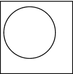
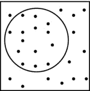
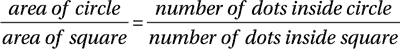
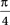
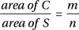
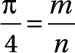

第六章


随机数、游戏和模拟

在本章中，我们将解释以下内容:

*   随机数
*   随机数和伪随机数的区别
*   如何在计算机上生成随机数
*   如何写一个玩猜谜游戏的程序
*   如何写一个程序来训练用户算术
*   如何写一个程序来扮演尼姆
*   如何模拟收集瓶盖拼出一个单词
*   如何在现实生活中模拟队列
*   如何使用随机数估计数值

6.1 随机数

如果你掷出一个六面骰子 100 次，每次写下显示的数字，你将会写下 100 个随机的整数**均匀分布在 1 到 6 的范围内*。*

 *如果你掷一枚硬币 144 次，每次都写下`0`(正面)或`1`(反面)，你将写出 144 个均匀分布在 0 到 1 之间的随机整数。

如果你站在路边，当车辆经过时，你注意到了车牌号的最后两位数(对于那些至少有两位数的车辆)，你会注意到均匀分布在 0 到 99 范围内的随机整数。

旋转轮盘(36 个数字)500 次。出现的 500 个数字是均匀分布在 1 到 36 范围内的随机整数。

*random* 这个词意味着任何结果都是完全独立于任何其他结果的。例如，如果一次掷骰子显示 5，那么这与下一次掷骰子显示什么没有关系。同样，轮盘赌上的 29 对下一个数字没有任何影响。

术语*均匀分布*是指所有值出现的可能性相等。在掷骰子的情况下，你有同样的机会掷出 1 或 6 或任何其他数字。而且，在大量的投掷中，每个数字出现的频率大致相同。

以一枚硬币为例，如果我们扔 144 次，我们会期望正面出现 72 次，反面出现 72 次。实际上，通常不会获得这些精确的值，但是如果硬币是公平的，那么这些值将足够接近预期值以通过某些统计测试。例如，75 个正面和 69 个反面的结果与期望值 72 非常接近，足以通过所需的测试。

随机数广泛用于模拟机会游戏(如涉及骰子、硬币或纸牌的游戏)，玩教育游戏(如在算术中产生问题)，以及在计算机上模拟现实生活中的情况。

例如，如果我们想玩一个*蛇与梯子*的游戏，掷骰子是由计算机生成一个从 1 到 6 的随机数来模拟的。假设我们想用从 1 到 9 的数字给一个孩子做附加题。对于每个问题，计算机可以生成 1 到 9 范围内的两个数字(例如，7 和 4 ),并将这些数字交给孩子进行加法运算。

但是假设我们想要模拟由交通灯控制的十字路口的交通模式。我们希望以这样一种方式安排灯的时间，使两个方向的等待时间尽可能短。为了在计算机上进行模拟，我们需要一些数据，比如车辆到达和离开十字路口的速度。为了使模拟尽可能有用，这必须通过观察来完成。

假设确定在方向 1 上行驶的随机数量的车辆(在 5 和 15 之间)每 30 秒到达交叉口。此外，每 30 秒钟就有 8 到 20 辆车朝方向 2 驶来。计算机可以如下模拟这种情况:

1.  生成一个 5 到 15 之间的随机数`r1`。
2.  生成一个 8 到 20 之间的随机数`r2`。

`r1`和`r2`为前 30 秒内每个方向到达路口的车辆数。该过程连续重复 30 秒。

6.2 随机数和伪随机数

掷出骰子时出现的数值对下一次掷出的数值没有影响。我们说抛出的结果是独立的，抛出的值是 1 到 6 范围内的随机整数。但是当一台计算机被用来在给定的时间间隔内生成一个随机数序列时，它使用了一种算法。

通常，序列中的下一个数字是以规定和预定的方式从前一个数字产生的。这意味着序列中的数字并不是相互独立的，就像我们掷骰子时那样。然而，生成的数字将通过通常的统计测试*随机性*，所以，实际上，它们是随机数。但是，因为它们是以一种非常可预测的方式生成的，所以它们通常被称为*伪随机数*。

在对许多类型的情况建模时，我们使用随机数还是伪随机数通常并不重要。事实上，在大多数应用中，伪随机数工作得相当令人满意。然而，考虑一个组织运行每周彩票，其中中奖号码是一个六位数。是否应该使用伪随机数发生器来提供一周到下一周的中奖号码？

由于生成器以完全预定的方式产生这些号码，因此有可能预测未来几周的中奖号码。显然，这是不可取的(除非*你*负责随机数发生器！).在这种情况下，需要一种真正随机的方法来产生中奖号码。

6.3 计算机生成随机数

在下文中，我们不区分随机数和伪随机数，因为在大多数实际应用中，没有必要进行区分。几乎所有的编程语言都提供了某种随机数生成器，但是它们的操作方式略有不同。

在 Java 中，我们可以使用`Math`类中预定义的`static`函数`random`来处理随机数；`random`产生随机分数(≥ 0.0 且< 1.0)。我们通过写`Math.random()`来使用它。

实际上，我们很少在提供的形式中使用`random`。这是因为，大多数时候，我们需要特定范围内的随机数(比如说从`1`到`6`)而不是随机分数。但是，我们可以轻松地编写一个函数，使用`random`来提供从`m`到`n`的随机整数，其中`m` < `n`。这是:

```java
        public static int random(int m, int n) {
        //returns a random integer from m to n, inclusive
           return (int) (Math.random() * (n - m + 1)) + m;
        }
```

例如，调用`random(1, 6)`将返回一个从 1 到 6 的随机整数，包括 1 和 6。如果`m` = 1，`n` = 6，那么`n-m+1`就是 6。当 6 乘以一个从 0.0 到 0.999 的分数时...，我们得到一个从 0.0 到 5.999 的数....当用`(int)`强制转换时，我们得到一个从 0 到 5 的随机整数。加 1 得到一个从 1 到 6 的随机整数。

再比如，假设`m` = `5`和`n` = `20`。在`5`到`20`范围内有`20`–`5`+`1`=`16`个数字。当 16 乘以一个从 0.0 到 0.999 的分数时...，我们得到一个从 0.0 到 15.999 的数....当用`(int)`强制转换时，我们得到一个从 0 到 15 的随机整数。加 5 得到一个从 5 到 20 的随机整数。

[程序 P6.1](#list1) 将生成并打印从 1 到 6 的 20 个随机数。每次调用`random`都会产生序列中的下一个数字。请注意，在另一台计算机上，或者在使用不同编译器的同一台计算机上，或者在不同时间运行，该顺序可能不同。

***[程序 P6.1](#_list1)***

```java
        import java.io.*;
        public class RandomTest {
           public static void main(String[] args) throws IOException {
              for (int j = 1; j <= 20; j++) System.out.printf("%2d", random(1, 6));
              System.out.printf("\n");
           } //end main

           public static int random(int m, int n) {
           //returns a random integer from m to n, inclusive
              return (int) (Math.random() * (n - m + 1)) + m;
           } //end random

        } //end class RandomTest
```

运行时，[程序 P6.1](#list1) 打印出以下数字序列:

```java
        4 1 5 1 3 3 1 3 1 3 6 2 3 6 5 1 3 1 1 1
```

当第二次运行时，它打印出以下序列:

```java
        6 3 5 6 6 5 6 3 5 1 5 2 4 1 4 1 1 5 5 5
```

每次运行时，都会生成不同的序列。

6.4 猜谜游戏

为了说明随机数的简单用法，让我们编写一个程序来玩一个猜谜游戏。程序会“思考”一个从 1 到 100 的数字。要求你尽可能少地猜测数字。以下是该程序的运行示例。带下划线的项目由用户键入:

```java
        I have thought of a number from 1 to 100.
        Try to guess what it is.

        Your guess? 50
        Too low
        Your guess? 75
        Too high
        Your guess? 62
        Too high
        Your guess? 56
        Too low
        Your guess? 59
        Too high
        Your guess? 57
        Congratulations, you've got it!
```

正如你所看到的，每次你猜的时候，程序会告诉你你的猜测是太高还是太低，并允许你再猜一次。

程序会通过调用`random(1, 100)`“想到”一个从 1 到 100 的数字。你会一直猜，直到你猜对了，或者直到你放弃。你放弃输入`0`作为你的猜测。[程序 P6.2](#list2) 包含所有细节。

***[程序 P6.2](#_list2)***

```java
        import java.util.*;
        public class GuessTheNumber {
           public static void main(String[] args) {
              Scanner in = new Scanner(System.in);
              System.out.printf("\nI have thought of a number from 1 to 100.\n");
              System.out.printf("Try to guess what it is.\n\n");
              int answer = random(1, 100);

              System.out.printf("Your guess? ");
              int guess = in.nextInt();
              while (guess != answer && guess != 0) {
                 if (guess < answer) System.out.printf("Too low\n");
                 else System.out.printf("Too high\n");
                 System.out.printf("Your guess? ");
                 guess = in.nextInt();
              }
              if (guess == 0) System.out.printf("Sorry, answer is %d\n", answer);
              else System.out.printf("Congratulations, you've got it!\n");
           } //end main

           public static int random(int m, int n) {
           //returns a random integer from m to n, inclusive
              return (int) (Math.random() * (n - m + 1)) + m;
           } //end random

        } //end class GuessTheNumber
```

*编程注意事项*:提醒用户可以选择放弃以及如何放弃是个好主意。为此，提示可以如下:

```java
        Your guess (0 to give up)?
```

6.5 附加演练

我们想写一个程序来训练用户简单的算术问题([程序 P6.3](#list3) )。更具体地说，我们想写一个程序来为用户解决附加问题。这些问题将涉及两个数的相加。但是这些数字从何而来呢？我们将让计算机“思考”这两个数字。到现在，你应该知道，为了做到这一点，计算机会生成两个随机数。

我们还需要决定在问题中使用多大的数字。在某种程度上，这将决定问题的难度。我们将使用两位数，即从 10 到 99 的数字。该程序可以很容易地修改，以处理不同范围内的数字。

该程序将首先询问用户他希望给出多少个问题。用户将键入所需的号码。然后他会被问及每个问题他想尝试多少次。他会输入这个号码。然后程序继续给他所要求的问题数量。

以下是该程序的运行示例。带下划线的项目由用户键入；其他的都是电脑打出来的。

```java
        Welcome to Problems in Addition

        How many problems would you like?3
        Maximum tries per problem?2

        Problem 1, Try 1 of 2
           80 + 75 =155
        Correct, well done!

        Problem 2, Try 1 of 2
           17 + 29 =36
        Incorrect, try again

        Problem 2, Try 2 of 2
           17 + 29 =46
        Correct, well done!

        Problem 3, Try 1 of 2
           83 + 87 =160
        Incorrect, try again

        Problem 3, Try 2 of 2
           83 + 87 =180
        Sorry, answer is 170

        Thank you for playing. Bye...
```

所有细节显示在[程序 P6.3](#list3) 中。为了简洁起见，我们没有验证用户提供的输入。然而，强烈建议*验证所有的*用户输入，以确保你的程序尽可能的健壮。

***[程序 P6.3](#_list3)***

```java
        import java.util.*;
        public class Arithmetic {
           public static void main(String[] args) {
              Scanner in = new Scanner(System.in);
              System.out.printf("\nWelcome to Problems in Addition\n\n");
              System.out.printf("How many problems would you like? ");
              int numProblems = in.nextInt();
              System.out.printf("Maximum tries per problem? ");
              int maxTries = in.nextInt();
              giveProblems(in, numProblems, maxTries);
              System.out.printf("\nThank you for playing. Bye...\n");
           } //end main

           public static void giveProblems(Scanner in, int amount, int maxTries) {
              int num1, num2, answer, response, tri; //'tri' since 'try' is a reserved word
              for (int h = 1; h <= amount; h++) {
                 num1 = random(10, 99);
                 num2 = random(10, 99);
                 answer = num1 + num2;
                 for (tri = 1; tri <= maxTries; tri ++) {
                    System.out.printf("\nProblem %d, Try %d of %d\n", h, tri, maxTries);
                    System.out.printf("%5d + %2d = ", num1, num2);
                    response = in.nextInt();
                    if (response == answer) {
                       System.out.printf("Correct, well done!\n");
                       break;
                    }
                    if (tri < maxTries) System.out.printf("Incorrect, try again\n");
                    else System.out.printf("Sorry, answer is %d\n", answer);
                 } //end for tri
              } //end for h
           } //end giveProblems

           public static int random(int m, int n) {
           //returns a random integer from m to n, inclusive
              return (int) (Math.random() * (n - m + 1)) + m;
           } //end random

        } //end class Arithmetic
```

6.6 之前

比如说，一个叫做 Nim 的游戏版本是在两个人 A 和 B 之间进行的。最初，桌子上有已知数量的火柴(`startAmount`)。每个玩家依次被允许选择任意数量的比赛，从 1 场到某个约定的最大值(比如说`maxPick`)。捡起最后一根火柴的玩家输掉游戏。

例如，如果`startAmount`是`20`，`maxPick`是`3`，游戏可能如下进行:

a 拿起 2，桌上剩下 18。

b 拿起 1，桌上剩下 17。

a 拿起 3，桌上剩下 14。

b 拿起 1，桌上剩下 13。

a 拿起 2，桌上剩下 11。

b 拿起 2，桌上剩下 9。

a 拿起 1，桌上剩下 8。

b 拿起 3，桌上剩下 5。

a 拿起 1，桌上剩下 4。

b 拿起 3，桌上剩下 1。

a 被迫捡起最后一根火柴，因此输掉了比赛。

玩这个游戏最好的方法是什么？显然，目标应该是让你的对手还剩一场比赛。姑且称此为*失位*。下一个要回答的问题是，你必须留下多少根火柴，这样无论他捡了多少根(在游戏规则范围内)，你都可以留给他一根？

在这个例子中，答案是 5。不管他拿了 1、2 还是 3，你都可以给他 1。如果他捡 1，你捡 3；如果他拿起 2，你拿起 2；如果他拿起 3，你拿起 1。因此，5 是下一个失败的位置。

下一个问题是，你必须留下多少场比赛，这样，无论他捡了多少场(在游戏规则范围内)，你都可以留给他 5 场？答案是 9。试试看！

等等。这样推理，我们发现 1，5，9，13，17，等等，都在亏损。换句话说，如果你能给你的对手留下这些数量的比赛，你就能迫使对手获胜。

在这个例子中，当 B 离开有 17 场比赛的 A 时，B 处于一个不会输的位置，除非他变得粗心大意。

一般来说，损失头寸是通过在`maxPick+1`的倍数上加 1 得到的。如果`maxPick`是`3`，4 的倍数就是 4、8、12、16 等等。加 1 得到失败的位置 5、9、13、17 等等。

我们将编写一个程序，让计算机尽可能玩最好的 Nim 游戏。如果它能迫使用户处于亏损状态，它就会这么做。如果用户已经迫使*它*进入一个失败的位置，它将随机挑选一些匹配，并希望用户出错。

如果`remain`是桌面上剩余的匹配数，计算机如何确定最好的走法？

如果`remain`小于或等于`maxPick`，计算机会选择`remain-1`匹配，给用户留下 1。否则，我们执行以下计算:

```java
        r = remain % (maxPick + 1)
```

如果`r`是`0`，`remain`是`maxPick+1`的倍数；电脑选择`maxPick`匹配，让用户处于失败的境地。在这个例子中，如果`remain`是 16(4 的倍数)，计算机拿起 3，留给用户 13——一个失败的位置。

如果`r`是`1`，则计算机处于输的位置，拾取随机数量的匹配。

否则，计算机会选择`r-1`匹配，让用户处于失败的境地。在这个例子中，如果`remain`是 18，`r`就是 2。电脑得到 1，留给用户 17，这是一个失败的位置。

这个策略是在函数`bestPick`中实现的，它是[程序 P6.4](#list4) 的一部分，在我们的 Nim 版本中，它让计算机与用户进行竞争。

***[程序 p 6.4](#_list4)*T5】**

```java
   import java.util.*;
   public class Nim {
      public static void main(String[] args) {
         Scanner in = new Scanner(System.in);
         System.out.printf("\nNumber of matches on the table? ");
         int remain = in.nextInt();
         System.out.printf("Maximum pickup per turn? ");
         int maxPick = in.nextInt();
         playGame(in, remain, maxPick);
      } //end main

      public static void playGame(Scanner in, int remain, int maxPick) {
         int userPick;
         System.out.printf("\nMatches remaining: %d\n", remain);
         while (true) { //do forever...well, until the game ends
            do {
               System.out.printf("Your turn: ");
               userPick = in.nextInt();
               if (userPick > remain)
                  System.out.printf("Cannot pick up more than %d\n", Math.min(remain, maxPick));
               else if (userPick < 1 || userPick > maxPick)
                  System.out.printf("Invalid: must be between 1 and %d\n", maxPick);
            } while (userPick > remain || userPick < 1 || userPick > maxPick);

            remain = remain - userPick;
            System.out.printf("Matches remaining: %d\n", remain);
            if (remain == 0) {
               System.out.printf("You lose!!\n");  return;
            }
            if (remain == 1) {
               System.out.printf("You win!!\n");  return;
            }
            int compPick = bestPick(remain, maxPick);
            System.out.printf("I pick up %d\n", compPick);
            remain = remain - compPick;
            System.out.printf("Matches remaining: %d\n", remain);
            if (remain == 0) {
               System.out.printf("You win!!\n");
               return;
            }
            if (remain == 1) {
               System.out.printf("I win!!\n");
               return;
            }
         } //end while (true)
      } //end playGame

      public static int bestPick(int remain, int maxPick) {
         if (remain <= maxPick) return remain - 1; //put user in losing position
         int r = remain % (maxPick + 1);
         if (r == 0) return maxPick;               //put user in losing position
         if (r == 1) return random(1, maxPick);    //computer in losing position
         return r - 1;                             //put user in losing position
      }                                            //end bestPick

      public static int random(int m, int n) {
      //returns a random integer from m to n, inclusive
         return (int) (Math.random() * (n - m + 1)) + m;
      } //end random

   } //end class Nim
```

注意使用了`do...while`语句来获取和验证用户的游戏。一般形式如下:

```java
    do <statement> while (<expression>);
```

像往常一样，`<statement>`可以是简单的(一行)也可以是复合的(用大括号括起来)。单词`do`和`while`以及括号和分号是必需的。程序员提供`<statement>`和`<expression>`。A `do...while`执行如下:

1.  `<statement>`被执行。
2.  然后对`<expression>`进行评估；如果是`true`，从步骤 1 开始重复。如果是`false`，则继续执行分号后的语句(如果有)。

只要`<expression>`是`true`，就会执行`<statement>`。值得注意的是，由于构造的性质，`<statement>`总是至少执行一次*。这在我们希望`<statement>`至少被执行一次的情况下特别有用。在这个例子中，我们需要至少提示用户一次他的游戏，这就是`do...while`的原因。*

 *以下是[程序 P6.4](#list4) 的运行示例:

```java
        Number of matches on the table?30
        Maximum pickup per turn?5

        Matches remaining: 30
        Your turn: 2
        Matches remaining: 28
        I pick up 3
        Matches remaining: 25
        Your turn: 3
        Matches remaining: 22
        I pick up 3
        Matches remaining: 19
        Your turn: 6
        Invalid: must be between 1 and 5
        Your turn: 1
        Matches remaining: 18
        I pick up 5
        Matches remaining: 13
        Your turn: 4
        Matches remaining: 9
        I pick up 2
        Matches remaining: 7
        Your turn: 9
        Cannot pick up more than 5
        Your turn: 2
        Matches remaining: 5
        I pick up 4
        Matches remaining: 1
        I win!!
```

我们注意到，顺便说一下，当游戏运行时，为它提供指令是有用的。

6.7 不均匀分布

到目前为止，我们生成的随机数在给定的范围内是均匀分布的。例如，当我们生成从 10 到 99 的数字时，该范围内的每个数字都有相同的机会被生成。类似地，调用`random(1, 6)`将以相等的概率生成数字 1 到 6。

现在假设我们想让计算机“扔”一个六面骰子。由于计算机不能物理投掷骰子，所以它必须模拟投掷的过程。扔骰子的目的是什么？简单来说就是想出一个从 1 到 6 的随机数。正如我们所看到的，计算机知道如何做到这一点。

如果骰子是公平的，那么每个面都有相同的机会出现。要模拟这样一个骰子的投掷，我们要做的就是生成均匀分布在 1 到 6 范围内的随机数。我们可以用`random(1, 6)`做到这一点。

同样，当我们掷一枚公平的硬币时，正面和反面都有相同的机会出现。要在计算机上模拟这样一枚硬币的投掷，我们所要做的就是生成均匀分布在`1`到`2`范围内的随机数。我们可以让`1`代表头`2`代表尾。

一般来说，如果一个事件所有可能发生的情况(比如掷出一个公平的骰子)发生的概率相等，我们可以用均匀分布的随机数来模拟这个事件。然而，如果所有事件发生的可能性不同，我们如何模拟这样的事件呢？

举个例子，考虑一个*偏向*的硬币，它出现正面的几率是反面的两倍。我们说正面的概率是 2/3，反面的概率是 1/3。为了模拟这样的硬币，我们生成均匀分布在范围`1`到`3`内的随机数。如果`1`或`2`发生，我们说人头被抛出；如果`3`发生，我们说尾巴被抛出。

因此，为了模拟具有非均匀分布的事件，我们将其转换为可以使用均匀分布随机数的事件。

再举一个例子，假设对于给定月份(比如说六月)的任何一天，我们知道以下情况，并且只有这些情况是可能的:

```java
        probability of sun = 4/9
        probability of rain = 3/9
        probability of overcast = 2/9
```

我们可以模拟六月的天气如下:

```java
        for each day in June
           r = random(1, 9)
           if (r <= 4) "the day is sunny"
           else if (r <= 7) "the day is rainy"
           else "the day is overcast"
        endfor
```

我们顺便注意到，我们可以将任意四个数字*指定为晴天，任意三个数字指定为雨天，剩下的两个数字指定为阴天。*

收集瓶盖

一种流行饮料的制造商正在举办一场比赛，你必须收集瓶盖才能拼出单词 *MANGO* 。已知每 100 个瓶盖中，有 40 个 *A* s，25 个 *O* s，15 个 *N* s，15 个 *M* s，5 个 *G* s，我们想写一个程序，对收集的瓶盖进行 20 次模拟，直到有足够的瓶盖拼出*芒果*为止。对于每个模拟，我们想知道收集了多少个 cap。我们还想知道每次模拟收集的瓶盖的平均数量。

瓶盖的收集是一个分布不均匀的事件。收集一个*一个*比收集一个 *G* 容易。为了模拟该事件，我们可以生成均匀分布在 1 到 100 范围内的随机数。要确定收集了哪封信，我们可以使用:

```java
        c = random(1, 100)
        if (c <= 40) we have an A
        else if (c <= 65) we have an O
        else if (c <= 80) we have an N
        else if (c <=95) we have an M
        else we have a G
```

在本例中，如果需要，我们可以将所有内容缩放 5 倍，并使用以下内容:

```java
        c = random(1, 20)
        if (c <= 8) we have an A
        else if (c <= 13) we have an O
        else if (c <= 16) we have an N
        else if (c <=19) we have an M
        else we have a G
```

两个版本都可以很好地解决这个问题。

解决这个问题的算法要点如下:

```java
        totalCaps = 0
        for sim = 1 to 20
           capsThisSim = perform one simulation
           print capsThisSim
           add capsThisSim to totalCaps
        endfor
        print totalCaps / 20
```

执行一次模拟的逻辑如下:

```java
        numCaps = 0
        while (word not spelt) {
           collect a cap and determine the letter
           mark the letter collected
           add 1 to numCaps
        }
        return numCaps
```

我们将使用一个数组`cap[5]`来保存每个字母的状态:`cap[0]`代表 *A* ，`cap[1]`代表 *O* ，`cap[2]`代表 *N* ，`cap[3]`代表 *M* ，`cap[4]`代表 *G* 。值`0`表示相应的字母没有被收集。当我们收集一个 *N* 时，比方说，我们将`cap[2]`设置为`1`；我们对其他字母也是如此。当`cap`的所有元素都是`1`时，我们已经收集了每个字母至少一次。

所有这些细节都包含在[程序 P6.5](#list5) 中。

***[程序 P6.5](#_list5)***

```java
        public class BottleCaps {
           static int MaxSim = 20;
           static int MaxLetters = 5;
           public static void main(String[] args) {
              int sim, capsThisSim, totalCaps = 0;
              System.out.printf("\nSimulation  Caps collected\n\n");
              for (sim = 1; sim <= MaxSim; sim++) {
                 capsThisSim = doOneSimulation();
                 System.out.printf("%6d %13d\n", sim, capsThisSim);
                 totalCaps += capsThisSim;
              }
              System.out.printf("\nAverage caps per simulation: %d\n", totalCaps/MaxSim);
           } //end main

           public static int doOneSimulation() {
              boolean[] cap = new boolean[MaxLetters];
              for (int j = 0; j < MaxLetters; j++) cap[j] = false;
              int numCaps = 0;
              while (!mango(cap)) {
                 int c = random(1, 20);
                 if (c <= 8) cap[0] = true;
                 else if (c <= 13) cap[1] = true;
                 else if (c <= 16) cap[2] = true;
                 else if (c <= 19) cap[3] = true;
                 else cap[4] = true;
                 numCaps++;
              } //end while
              return numCaps;
           } //end doOneSimulation

           public static boolean mango(boolean[] cap) {
             for (int j = 0; j < MaxLetters; j++)
                 if (cap[j] == false) return false;
              return true;
           } //end mango

           public static int random(int m, int n) {
           //returns a random integer from m to n, inclusive
              return (int) (Math.random() * (n - m + 1)) + m;
           } //end random

        } //end class BottleCaps
```

运行时，该程序产生以下输出:

```java
    Simulation  Caps collected

         1            10
         2            10
         3            22
         4            12
         5            36
         6             9
         7            15
         8             7
         9            11
        10            70
        11            17
        12            12
        13            27
        14            10
        15             6
        16            25
        17             8
        18             7
        19            39
        20            71

    Average caps per simulation: 21
```

结果从少至 6 个上限到多达 71 个上限不等。有时候你会走运，有时候不会。

程序每次运行，都会产生不同的结果。

6.8 现实问题的模拟

通过使用*模拟*，计算机可以用来回答关于许多现实生活情况的某些问题。模拟的过程允许我们考虑一个问题的不同解决方案。这使我们能够满怀信心地选择特定情况下的最佳替代方案。

然而，在计算机模拟完成之前，我们需要收集数据以使模拟尽可能真实。例如，如果我们想模拟在银行服务客户，我们需要知道(或至少估计)以下内容:

*   队列中顾客到达的时间间隔 *t1*
*   服务客户的时间 *t2*

当然， *t1* 可以变化很大。这将取决于，例如，一天的时间；在某些时候，顾客会比其他时候来得更频繁。此外，不同的客户有不同的需求，所以 *t2* 会因客户而异。然而，通过观察系统运行一段时间，我们通常可以做出如下假设:

*   *t1* 在一至五分钟之间随机变化。
*   *t2* 在三到十分钟之间随机变化。

使用这些假设，我们可以进行模拟，找出当有 2 个、3 个、4 个，...等等，服务柜台。我们假设有一个队列；排在队伍最前面的人去最先有空位的柜台。在实践中，银行通常在高峰期比淡季分配更多的柜台。在这种情况下，我们可以使用适用于每个时期的假设，分两部分进行模拟。

以下是类似模拟方法适用的其他情况:

*   超市或商店的收银台:我们通常对收银台的数量和平均排队长度之间的折衷感兴趣。我们的柜台越少，队伍就越长。然而，拥有更多的柜台意味着更多的机器和更多的员工。我们希望在运营成本和客户服务之间找到最佳平衡点。
*   加油站:多少台泵最能满足顾客的需求？
*   *红绿灯*:什么是最佳的红绿灯时间，使各个方向的平均排队长度保持最小？在这种情况下，我们需要收集如下数据:

*   How often do cars arrive from direction 1 and from direction 2? The answer to this might be something like this:

    1 号方向每分钟有 5 到 15 辆车到达。

    每分钟有 10 到 30 辆车从 2 号方向开来。

*   How fast can cars leave in direction 1 and in direction 2? The answer might be as follows:

    20 辆车可以在 30 秒内穿过方向 1 的十字路口。

    30 辆车可以在 30 秒内穿过方向 2 的十字路口。

我们假设，在这个简单的情况下，转弯是不允许的。

6.9 模拟队列

考虑一下银行或超市收银台的情况，顾客到达后必须排队等候服务。假设有一个队列，但有几个计数器。如果一个柜台是空的，排在队伍前面的人就去那里。如果所有柜台都忙，顾客必须等待；排在队伍最前面的人去第一个有空位的柜台。

举例来说，假设有两个计数器；我们用 C1 和 C2 来表示他们。为了进行模拟，我们需要知道顾客到达的频率和服务一个顾客需要的时间。根据观察和经验，我们可以说:

*   顾客到达的时间间隔从一分钟到五分钟不等。
*   为顾客服务的时间从三分钟到十分钟不等。

为了使模拟有意义，这些数据必须接近实际发生的情况。一般来说，模拟的好坏取决于它所基于的数据。

假设我们从上午 9 点开始。我们可以通过生成十个从 1 到 5 的随机数来模拟前十个客户的到来，如下所示:

```java
   3 1 2 4 2 5 1 3 2 4
```

这意味着第一个客户在 9:03 到达，第二个在 9:04，第三个在 9:06，第四个在 9:10，依此类推。我们可以通过生成十个从 3 到 10 的随机数来模拟这些客户的服务时间，如下所示:

```java
   5 8 7 6 9 4 7 4 9 6
```

这意味着第一个顾客在出纳员那里花了五分钟，第二个花了八分钟，第三个花了七分钟，等等。

表 6-1 显示了这十个客户的情况。

[表 6-1](#_Tab1) 。跟踪十个客户


*   第一个顾客在 9:03 到达，然后直接去了 C1。他的发球时间是五分钟，所以他将在 9:08 离开 C1。
*   第二个顾客在 9:04 到达，然后直接去了 C2。他的服务时间是 8 分钟，所以他将在 9:12 离开 C2。
*   第三个顾客在 9:06 到达。此时，C1 和 C2 都很忙，所以他必须等待。C1 将在 9:08 第一个获得自由。这位顾客将在 9:08 开始服务。他的服务时间是 7 分钟，所以他将在 9:15 离开 C1。这位顾客不得不排队等了两分钟。
*   第四个顾客在 9:10 到达。此时，C1 和 C2 都很忙，所以他必须等待。C2 将在 9:12 第一个获得自由。这位顾客将在 9:12 开始服务。他的发球时间是 6 分钟，所以他将在 9:18 离开 C2。这位顾客不得不排队等了两分钟。

等等。完成表格的其余部分，确保您理解这些值是如何获得的。

还要注意，一旦柜员开始服务，他们就没有空闲时间了。一个顾客刚走，另一个顾客就在等着接受服务。

6.9.1 编程模拟

我们现在展示如何编写一个程序来产生[表 6-1](#Tab1) 。首先，我们注意到为几个计数器编写程序并不比为两个计数器编写程序更困难。因此，我们将假设有`n` ( `n` < `10`)计数器。对于这个特殊的例子，我们将把`n`设置为 2。

我们将使用一个数组`depart[10]`，这样`depart[c]`将保存计数器`c`下一次空闲的时间。我们不会用`depart[0]`。如果我们需要处理九个以上的计数器，我们只需要增加`depart`的大小。

假设排在队伍最前面的顾客在`arriveTime`到达。他会去第一个免费柜台。如果最后一个顾客离开`c`柜台后到达，即`arriveTime`大于等于`depart[c]`，则`c`柜台空闲。如果没有空闲的柜台，他必须等待。他会先去那个会变成空闲的计数器，也就是数组`depart`中数值最低的那个；假设这是`depart[m]`。他将在`arriveTime`和`depart[m]`中较晚的一个时间开始服役。

该程序首先询问要模拟的柜台数量和顾客数量。模拟从时间`0`开始，所有时间都与此相关。详情见[程序 P6.6](#list6) 。

***[程序 P6.6](#_list6)***

```java
        import java.util.*;
        public class SimulateQueue {
           public static void main(String[] args) {
              Scanner in = new Scanner(System.in);
              System.out.printf("\nHow many counters? ");
              int numCounters = in.nextInt();
              System.out.printf("\nHow many customers? ");
              int numCustomers = in.nextInt();

              doSimulation(numCounters, numCustomers);
           } //end main

           public static void doSimulation(int counters, int customers) {
              int m, arriveTime, startServe, serveTime, waitTime;
              int[] depart = new int[counters + 1];
              for (int h = 1; h <= counters; h++) depart[h] = 0;
              System.out.printf("\n                  Start          Service         Wait\n");
              System.out.printf("Customer Arrives Service Counter  Time   Departs Time\n\n");
              arriveTime = 0;
              for (int h = 1; h <= customers; h++) {
                 arriveTime += random(1, 5);
                 m = smallest(depart, 1, counters);
                 startServe = Math.max(arriveTime, depart[m]);
                 serveTime = random(3, 10);
                 depart[m] = startServe + serveTime;
                 waitTime = startServe - arriveTime;
                 System.out.printf("%5d %8d %7d %6d %7d %8d %5d\n",
                    h, arriveTime, startServe, m, serveTime, depart[m], waitTime);
              } //end for h
           } //end doSimulation

           public static int smallest(int list[], int lo, int hi) {
           //returns the subscript of the smallest value from list[lo..hi]
              int h, k = lo;
              for (h = lo + 1; h <= hi; h++)
                 if (list[h] < list[k]) k = h;
              return k;
           }

           public static int random(int m, int n) {
           //returns a random integer from m to n, inclusive
              return (int) (Math.random() * (n - m + 1)) + m;
           } //end random

        } //end class SimulateQueue
```

这里显示了一个运行程序 P6.6 的示例:

```java
        How many counters? 2

        How many customers? 10

                          Start          Service         Wait
        Customer Arrives Service Counter  Time   Departs Time

            1        3       3      1       8       11     0
            2        7       7      2       9       16     0
            3       10      11      1       9       20     1
            4       11      16      2       4       20     5
            5       14      20      1       5       25     6
            6       19      20      2       9       29     1
            7       23      25      1       7       32     2
            8       26      29      2       8       37     3
            9       29      32      1       7       39     3
           10       33      37      2       6       43     4
```

如您所见，等待时间相当短。但是，如果您对 25 个客户运行模拟，您将会看到等待时间明显增加。如果我们再增加一个计数器呢？通过模拟，很容易测试这种效果，而不必实际购买另一台机器或雇用另一名员工。

在这种情况下，我们所要做的就是分别输入`3`和`25`作为柜台和顾客的数量。当我们这样做的时候，我们会发现等待的时间很少。我们建议你用不同的数据——柜台、顾客、到达时间和服务时间——进行实验，看看会发生什么。

6.10 使用随机数估计数值

我们已经看到了如何使用随机数来玩游戏和模拟现实生活中的情况。一个不太明显的用途是估计难以计算或计算起来很麻烦的数值。我们将展示如何使用随机数来估计一个数的平方根和π (pi)。

6.10.1 估算

我们使用随机数根据以下公式估算 5 的平方根:

*   它在两点和三点之间。
*   *x* 小于如果*x*T5】2 小于 5。
*   生成 2 到 3 之间的带分数的随机数。对那些小于的数字进行计数。
*   设`maxCount`为 2 到 3 之间产生的随机数总数。用户将提供`maxCount`。
*   设`amountLess`是小于的那些数的计数。
*   给出了的近似值

为了理解该方法背后的思想，考虑 2 和 3 之间的线段，让点`r`表示 5 的平方根。


如果我们想象 2 和 3 之间的线完全被点覆盖，我们会期望 2 和`r`之间的点的数量与该线段的长度成比例。一般来说，落在任何线段上的点数都与该线段的长度成正比，线段越长，落在其上的点数就越多。

现在，2 到 3 之间的每个随机数代表那条线上的一个点。我们期望使用的数字越多，2 和`r`之间的线的长度与落在上面的数字的数量成正比的说法就越准确，因此，我们的估计就越准确。

[程序 P6.7](#list7) 基于此方法计算出的估算值。记住`Math.random`生成一个随机分数。

当运行 1000 个数字时，这个程序给出 2.234 作为 5 的平方根。的值是 2.236 到小数点后三位。

***[程序 P6.7](#_list7)***

```java
        import java.util.*;
        public class Root5 {
           public static void main(String[] args) {
              Scanner in = new Scanner(System.in);
              System.out.printf("\nHow many numbers to use? ");
              int maxCount = in.nextInt();

              int amountLess = 0;
              for (int j = 1; j <= maxCount; j++) {
                 double r = 2 + Math.random();
                 if (r * r < 5) ++amountLess;
              }
              System.out.printf("\nThe square root of 5 is about %5.3f\n",
                             2 + (double) amountLess / maxCount);
           } //end main

        } //end class Root5
```

估算π

考虑[图 6-1](#Fig1) ，它显示了一个正方形内的一个圆。



[图 6-1](#_Fig1) 。在正方形内画圈

如果你闭上眼睛，继续用铅笔反复戳图，你可能会得到类似于[图 6-2](#Fig2) 的东西(只考虑落在图中的点)。



[图 6-2](#_Fig2) 。用铅笔戳后在正方形内画圈

请注意，有些圆点落在圆圈内，有些落在圆圈外。如果这些点是“随机”形成的，那么似乎有理由预计圆内的点数与圆的面积成正比——圆越大，落入其中的点就越多。

基于此，我们有以下近似值:



请注意，正方形内的点数也包括圆形内的点数。如果我们想象整个正方形充满了点，那么前面的近似将是相当准确的。我们现在展示如何使用这个想法来估计π。

考虑[图 6-3](#Fig3) 。


[图 6-3](#_Fig3) 。四分之一圆和一个正方形

*   c 是半径为 1 的四分之一圆；s 是边长为 1 的正方形。
*   面积 C = 面积 S = 1。
*   C 内的一点(x，y)满足 x <sup>2</sup> + y <sup>2</sup> ≤ 1，x ≥ 0，y ≥ 0。
*   S 内的点(x，y)满足 0 ≤ x ≤ 1，0 ≤ y ≤ 1。

假设我们生成两个随机分数，即 0 和 1 之间的两个值；称这些值为 *x* 和 *y* 。

由于 0 ≤ *x* ≤ 1，且 0 ≤ *y* ≤ 1，因此该点( *x* ， *y* )位于 s 内

如果 x <sup>2</sup> + y <sup>2</sup> ≤ 1，该点也将位于 C 内。

如果我们生成 *n* 对随机分数，我们实际上在 s 内生成了 *n* 个点。对于这些点中的每一个，我们可以确定该点是否位于 c 内。假设这些 *n* 个点中的 *m* 落在 c 内。从我们的讨论中，我们可以假设以下近似成立:



C 的面积为，S 的面积为 1。因此，以下成立:



因此:


基于此，我们编写[程序 P6.8](#list8) 估算π。

***[程序 P6.8](#_list8)***

```java
        import java.util.*;
        public class Pi {
           public static void main(String[] args) {
              Scanner in = new Scanner(System.in);
              int inC = 0;

              System.out.printf("\nHow many numbers to use? ");
              int inS = in.nextInt();

              for (int j = 1; j <= inS; j++) {
                 double x = Math.random();
                 double y = Math.random();
                 if (x * x + y * y <= 1) inC++;
              }
              System.out.printf("\nAn approximation to pi is %5.3f\n", 4.0 * inC/inS);
           } //end main

        } //end class Pi
```

π到小数点后 3 位的值是 3.142。当运行 1000 个数字时，这个程序给出 3.132 作为π的近似值。当运行 2000 个数字时，它给出的近似值为 3.140。

**练习 6**

1.  写一个程序请求两个数字， *m* 和 *n* ，打印从 *m* 到 *n* 的 25 个随机数。
2.  解释随机数和伪随机数的区别。
3.  修改[程序 P6.3](#list3) 给用户减法题。
4.  修改[程序 P6.3](#list3) 给用户出乘法题。
5.  修改[程序 P6.3](#list3) 以纳入评分系统。例如，对一个问题进行两次尝试，第一次尝试的正确答案可以给 2 分，第二次尝试的正确答案可以给 1 分。
6.  重写[程序 P6.3](#list3) ，让它为用户提供一个菜单，允许用户选择他得到的问题类型(加法、减法或乘法)。
7.  编写一个程序来模拟 1000 次掷骰子，并确定所显示的 1、2、3、4、5 和 6 的个数。写程序时(a)不使用数组,( b)使用数组。
8.  用 6.7 节中的概率写一个程序来模拟 60 天的天气。
9.  在电灯泡的制造中，灯泡有缺陷的概率是 0.01。模拟制造 5000 个灯泡，说明有多少是次品。
10.  骰子的权重是 1 和 5 出现的频率是其他数字的两倍。模拟 1000 次投掷，指出每个数字出现的频率。
11.  修改[程序 P6.6](#list6) 计算顾客平均等待时间和每个柜台的总空闲时间。
12.  One-Zero is a game that can be played among several players using a six-sided die. On his turn, a player can throw the die as many times as he wants. His score for that turn is the sum of the numbers he throws *provided he does not throw* a 1\. If he throws a 1, his score is 0\. Suppose a player decides to adopt the strategy of ending his turn after seven throws. (Of course, if he throws a 1 before the 7<sup>th</sup> throw, he must end his turn.) Write a program to play 10 turns using this strategy. For each turn, print the score obtained. Also, print the average score for the 10 turns.

    将程序一般化，以请求`numTurns`和`maxThrowsPerTurn`的值，并按照描述打印结果。

13.  Write a program to simulate the game of *Snakes and Ladders*. The board consists of 100 squares. Snakes and ladders are input as ordered pairs of numbers, *m* and *n*. For example, the pair `17 64` means that there is a ladder from 17 to 64, and the pair  `99 28` means that there is a snake from 99 to 28.

    模拟玩 20 个游戏，每个游戏持续最多 100 步。打印在 100 步中完成的游戏数以及已完成游戏的平均每局移动数。

14.  写一个程序玩一个修改过的 Nim 游戏(第 6.6 节)，游戏中有两堆火柴，一个玩家可以从其中选择一个。然而，在这种情况下，如果玩家*选择了最后一场比赛，他就赢了*。
15.  使用第 6.8 节中的交通灯数据，编写一个程序来模拟 30 分钟内交通灯的情况。每次信号灯改变时，打印每个队列中的汽车数量。
16.  写一个程序估计 59 的平方根。
17.  写程序读取正整数 *n* 并估计 *n* 的平方根。
18.  写程序读取正整数 *n* 并估计 *n* 的立方根。
19.  写个程序模拟收集瓶盖拼出*苹果*。在每 100 个 cap 中，A 和 E 各出现 40 次，P 出现 10 次，L 出现 10 次。进行 50 次模拟，并打印每次模拟的平均瓶盖数。
20.  彩票要求人们从数字 1 到 40 中选择 7 个数字。编写一个程序，随机生成并打印五组数字，每组七个(每行一组)。在任何集合中没有数字是重复的；也就是说，必须使用 40 个数字中的 35 个。如果产生了一个已经被使用的数( *p* )，则使用在 *p* 之后的第一个未使用的数。(假设 1 跟 40。)例如，如果生成了 15 但已经被使用，则尝试 16，但如果已经被使用，则尝试 17，依此类推，直到找到未使用的号码。
21.  为 0 ≤ *x* ≤ 1 定义一个函数 *f(x)* ，使得对于所有 0 ≤ *x* < 1，0 ≤ *f(x)* < 1。写个程序估计 *f(x)* 从 0 到 1 的积分。提示:通过生成点( *x* ， *y* )，0 ≤ *x* < 1，0 ≤ *y* < 1，估计曲线下的面积。
22.  一个赌徒支付 5 美元玩下面的游戏。他掷出两个六面骰子。如果掷出的两个数之和是偶数，他就输了。如果总数是奇数，他从标准的 52 张扑克牌中抽出一张。如果他抽到了一张 ace，3、5、7 或 9，他将得到该卡的价值加上 5 美元(ace 计为 1)。如果他抽任何一张牌，他就输了。编写一个程序来模拟玩 20 个游戏，并打印出游戏者每局的平均赢款。**