# 八、二叉树简介

在本章中，我们将解释以下内容:

*   树和二叉树的区别
*   如何执行二叉树的前序、有序和后序遍历
*   如何在计算机程序中表示二叉树
*   如何从给定的数据建立二叉树
*   什么是二叉查找树以及如何构建
*   如何编写一个程序来计算文章中单词的词频
*   如何使用数组作为二叉树表示
*   如何编写一些递归函数来获取关于二叉树的信息
*   如何从二叉查找树中删除节点

8.1 树木

*树*是一组有限的节点，以下两个条件都成立:

*   有一个特别指定的节点叫做树的根。
*   剩下的节点被分割成 *m* ≥ 0 个不相交的集合 T <sub>1</sub> ，T <sub>2</sub> ，…，T <sub>m</sub> ，这些集合中的每一个都是一棵树。

树 T <sub>1</sub> ，T <sub>2</sub> ，…，T <sub>m</sub> ，被称为根的*子树*。我们使用递归定义，因为递归是树结构的固有特性。[图 8-1](#Fig1) 说明了一棵树。按照惯例，根是画在顶端的，树是向下生长的。

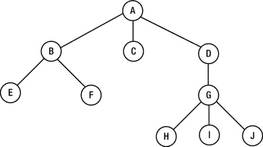

[图 8-1](#_Fig1) 。一棵树

根是`A`。有三个子树分别以`B`、`C`和`D`为根。根在`B`的树有两个子树，根在`C`的树没有子树，根在`D`的树有一个子树。树的每个节点都是子树的根。

节点的*度*是该节点的子树数。把它想象成离开节点的行数。例如，度(`A` ) = 3，度(`C` ) = 0，度(`D` ) = 1，度(`G` ) = 3。

我们使用术语*父*、*子*和*兄弟*来指代树的节点。比如父`A`有三个孩子，分别是`B`、`C`和`D`；父`B`有两个孩子，分别是`E`和`F`；并且父节点`D`有一个子节点`G`，它有三个子节点:`H`、`I`和`J`。请注意，一个节点可能是一个节点的子节点，但也可能是另一个节点的父节点。

兄弟节点是同一父节点的子节点。比如`B`、`C`、`D`是兄弟姐妹；`E`和`F`是亲兄妹；并且`H`、`I`和`J`是兄弟姐妹。

在树中，一个节点可以有几个子节点，但是除了根节点，只有一个父节点。根没有父级。换句话说，一个非根节点只有一行将*引入*。

*终端*节点(也称为*叶*)是度为 0 的节点。*分支*节点是非终端节点。在[图 8-1 的](#Fig1)、`C`、`E`、`F`、`H`、`I`、`J`为叶子，而`A`、`B`、`D`、`G`为分支节点。

树的*矩*是树中节点的个数。[图 8-1](#Fig1) 中的树有力矩 10。

一棵树的*重量*就是树上的叶子数。[图 8-1](#Fig1) 中的树权重为 6。

节点的*级别*(或*深度*)是从根到该节点的路径上必须经过的分支数。根的级别为 0。

在图 8-1 的[树中](#Fig1)、`B`、`C`、`D`为一级；`E`、`F`、`G`为二级；而`H`、`I`、`J`处于 3 级。节点的级别是树中节点深度的度量。

一棵树的*高度*是树中的层数。[图 8-1](#Fig1) 中的树高 4。注意树的高度比它的最高高度多一。

如果子树 T <sub>1</sub> ，T <sub>2</sub> ，…，T <sub>m</sub> 的相对顺序重要，那么该树就是一棵*有序* 树。如果顺序不重要，树是面向*的*。

一个*森林*是零个或多个不相交的树 的集合，如图[图 8-2](#Fig2) 所示。

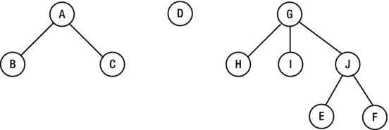

[图 8-2](#_Fig2) 。三棵不相交的树组成的森林

虽然人们对一般的树有些兴趣，但迄今为止最重要的树是二叉树。

8.2 二叉树

*二叉树*是非线性数据结构的经典例子——将其与线性列表进行比较，在该列表中，我们确定第一项、下一项和最后一项。二叉树是更一般的*树*数据结构的特例，但它是最有用和最广泛使用的一种树。使用以下递归定义可以最好地定义二叉树:

一棵*二叉树*

1.  is empty

    *或*

2.  由一个根树和两个子树(一左一右)组成，每个子树都是一棵二叉树

这个定义的结果是一个节点总是有两个子树，其中任何一个都可能是空的。另一个结果是，如果一个节点有*个*非空子树，区分它是在左边还是右边是很重要的。这里有一个例子:


第一个有一个空的右边子树，而第二个有一个空的左边子树。但是，作为*树*，它们是一样的。

下面是二叉树的例子。

这是一个只有一个节点的二叉树，根:


这里有两个节点的二叉树:

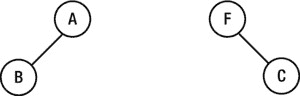

这里有三个节点的二叉树:


以下是所有左子树和右子树都为空的二叉树:


这是一棵二叉树，除了叶子，每个节点都有两个子树；这叫做*完全*二叉树T3:

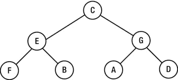

这里是一个通用的二叉树:


8.3 遍历二叉树

在许多应用中，我们希望以某种系统的方式访问二叉树的节点。现在，我们将认为“访问”只是在节点上打印信息。对于一棵有 *n* 个节点的树，有 *n* ！访问它们的方法，假设每个节点被访问一次。

例如，对于一个有三个节点 A、B 和 C 的树，我们可以按以下任何顺序访问它们:ABC、ACB、BCA、BAC、CAB 和 CBA。并非所有这些命令都有用。我们将定义三种有用的方式——预排序、按序排序和后排序。

这是*预购 t raversal* :

1.  访根。
2.  按照预先的顺序遍历左边的子树。
3.  按前序遍历右边的子树。

注意，遍历是递归定义的。在步骤 2 和 3 中，我们必须重新应用前序遍历的定义，即“访问根，等等”

这个树的*前序*遍历


是`A B C`。

这个树的*前序*遍历


是`C E F H B G A N J K`。

这是*按序遍历* :

1.  按顺序遍历左边的子树。
2.  访根。
3.  按顺序遍历右边的子树。

这里我们首先遍历左子树，然后是根，然后是右子树。

该树的*有序*遍历


是`B A C`。

该树的*有序*遍历


是`F H E B C A G J N K`

这是*后序遍历* :

1.  按后顺序遍历左边的子树。
2.  按后顺序遍历右边的子树。
3.  访根。

这里，在访问根之前，我们遍历左右子树*。*

这个树的*后序*遍历


是`B C A`。

这个树的*后序*遍历

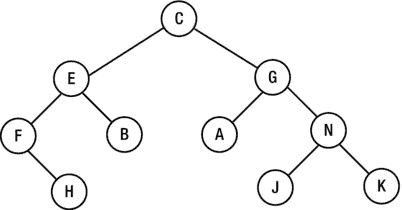

是`H F B E A J K N G C`。

请注意，遍历是从我们访问相对于左右子树的遍历的根的位置派生出它们的名称的。作为另一个例子，考虑可以表示以下算术表达式的二叉树:

```java
          (54 + 37) / (72 – 5 * 13)
```

这是树:


树的叶子包含操作数，分支节点包含操作符。给定一个包含运算符的节点，左子树表示第一个操作数，右子树表示第二个操作数。

前序遍历是:`/ + 54 37 – 72 * 5 13`

有序遍历是:`54 + 37 / 72 – 5 * 13`

后序遍历是:`54 37 + 72 5 13 * - /`

后序遍历可以与栈结合使用来计算表达式。算法如下:

```java
        initialize a stack, S, to empty
        while we have not reached the end of the traversal
           get the next item, x
           if x is an operand, push it onto S
           if x is an operator
              pop its operands from S,
              apply the operator
              push the result onto S
           endif
        endwhile
        pop S; // this is the value of the expression
```

考虑后序遍历:`54 37 + 72 5 13 * - /`。其评估如下:

1.  下一项是`54`；将`54`推到`S`上；`S`包含`54`。
2.  下一项是`37`；将`37`推到`S`上；`S`包含`54 37`(右上)。
3.  下一项是`+`；从`S`弹出`37`和`54`；将`+`应用到`54`和`37`，给出`91`；将`91`推到`S`上；`S`包含`91`。
4.  下一项是`72`；将`72`推到`S`上；`S`包含`91 72`。
5.  接下来的项目是`5`和`13`；这些都推给了`S`；`S`包含`91 72 5 13`。
6.  下一项是`*`；从`S`弹出`13`和`5`；将`*`应用到`5`和`13`，给出`65`；将`65`推到`S`上；`S`包含`91 72 65`。
7.  下一项是`–`；从`S`弹出`65`和`72`；将`–`应用到`72`和`65`，给出`7`；将`7`推到`S`上；`S`包含`91 7`。
8.  下一项是`/`；从`S`弹出`7`和`91`；将`/`应用到`91`和`7`，给出`13`；将`13`推到`S`上；`S`包含`13`。
9.  我们已经到达遍历的终点；我们弹出`S`，得到`13`—表达式的结果。

注意，当操作数从栈中弹出时，第一个弹出的是第二个操作数，第二个弹出的是第一个操作数。这对加法和乘法无关紧要，但对减法和除法很重要。

8.4 表示二叉树

二叉树的每个节点至少由三个字段组成:包含节点数据的字段、指向左子树的指针和指向右子树的指针。例如，假设存储在每个节点的数据是一个单词。我们可以从编写一个包含三个实例变量的类(`TreeNode`)和一个创建`TreeNode`对象的构造函数开始。

```java
        class TreeNode {
           NodeData data;
           TreeNode left, right;

           TreeNode(NodeData d) {
              data = d;
              left = right = null;
           }
        }
```

为了保持选项的开放性，我们用一种我们称之为`NodeData`的通用数据类型来定义`TreeNode`。任何想要使用`TreeNode`的程序都必须提供自己对`NodeData`的定义。

例如，如果一个节点上的数据是一个整数，`NodeData`可以定义如下:

```java
        class NodeData {
           int num;

           public NodeData(int n) {
              num = n;
           }
        } //end class NodeData
```

如果数据是字符，可以使用类似的定义。但是我们并不局限于单字段数据。可以使用任意数量的字段。稍后，我们将编写一个程序，对一篇文章中的单词进行频率统计。每个节点将包含一个单词及其频率计数。对于该计划，`NodeData`将包含以下内容:

```java
        class NodeData {
           String word;
           int freq;

           public NodeData(String w) {
              word = w;
              freq = 0;
           }
        } //end class NodeData
```

除了树的节点，我们还需要知道树的根。请记住，一旦我们知道了根，我们就可以通过左右指针访问树中的所有节点。因此，二叉树仅由其根来定义。我们将开发一个`BinaryTree`类来处理二叉树。唯一的实例变量将是`root`。课程将按如下方式开始:

```java
        class BinaryTree {
           TreeNode root;        // the only field in this class

           BinaryTree() {
              root = null;
           }
           //methods in the class
        } //end class BinaryTree
```

这个构造函数并不是真正必需的，因为当一个`BinaryTree`对象被创建时，Java 会将`root`设置为`null`。然而，我们包含它是为了强调，在空二叉树中，`root`是`null`。

如果你愿意，你可以把`TreeNode`类放在它自己的文件`TreeNode.java`中，并声明它为`public`。然而，在我们的程序中，我们将把`TreeNode`类和`BinaryTree`放在同一个文件中，因为它只被`BinaryTree`使用。为此，我们必须省略单词`public`并写成`class TreeNode`。

8.5 构建二叉树

让我们写一个构建二叉树的函数。假设我们想要构建一个由单个节点组成的树，如下所示:


数据将作为`A @ @`提供。每个@表示一个空指针的位置。

为了构建以下内容，我们将提供数据作为`A B @ @ C @ @`:

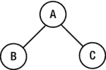

每个节点紧跟着它的左子树，然后是它的右子树。

相比之下，为了构建以下内容，我们将提供数据作为`A B @ C @ @ @`。

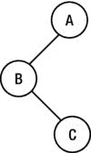

`C`后面的两个`@s`表示其左右子树(空)，最后一个`@`表示`A`的右子树(空)。

为了构建下面的内容，我们提供数据作为`C E F @ H @ @ B @ @ G A @ @ N J @ @ K @ @`。


给定这种格式的数据，下面的函数将构建树并返回指向其根的指针:

```java
        static TreeNode buildTree(Scanner in) {
           String str = in.next();
           if (str.equals("@")) return null;
           TreeNode p = new TreeNode(new NodeData(str));
           p.left = buildTree(in);
           p.right = buildTree(in);
           return p;
        } //end buildTree
```

该函数将从与`Scanner`、`in`相关的输入流中读取数据。它使用了`NodeData`的如下定义:

```java
        class NodeData {
           String word;

           public NodeData(String w) {
              word = w;
           }
        } //end class NodeData
```

我们将从下面的构造函数中调用`buildTree`:

```java
        public BinaryTree(Scanner in) {
           root = buildTree(in);
        }
```

假设一个用户类将其树数据存储在文件`btree.in`中。它可以用下面的代码创建一个二叉树`bt`:

```java
        Scanner in = new Scanner(new FileReader("btree.in"));
        BinaryTree bt = new BinaryTree(in);
```

构建了树之后，我们应该想要检查它是否被正确地构建了。一种方法是执行遍历。假设我们想按预先的顺序打印`bt`的节点。如果能使用这样的语句就好了:

```java
        bt.preOrder();
```

为此，我们需要在`BinaryTree`类中编写一个实例方法`preOrder`。该方法如下面的类列表所示。它还包括方法`inOrder`和`postOrder`。我们还保留了无参数构造函数，因此如果需要，用户可以从一个空的二叉树开始。

*二叉树类*

```java
        import java.util.*;
        public class BinaryTree {
           TreeNode root;

           public BinaryTree() {
              root = null;
           }
           public BinaryTree(Scanner in) {
              root = buildTree(in);
           }

           public static TreeNode buildTree(Scanner in) {
              String str = in.next();
              if (str.equals("@")) return null;
              TreeNode p = new TreeNode(new NodeData(str));
              p.left = buildTree(in);
              p.right = buildTree(in);
              return p;
           } //end buildTree

           public void preOrder() {
              preOrderTraversal(root);
           }

           public void preOrderTraversal(TreeNode node) {
              if (node!= null) {
                 node.data.visit();
                 preOrderTraversal(node.left);
                 preOrderTraversal(node.right);
              }
           } //end preOrderTraversal

           public void inOrder() {
              inOrderTraversal(root);
           }

           public void inOrderTraversal(TreeNode node) {
              if (node!= null) {
                 inOrderTraversal(node.left);
                 node.data.visit();
                 inOrderTraversal(node.right);
              }
           } //end inOrderTraversal

           public void postOrder() {
              postOrderTraversal(root);
           }

           public void postOrderTraversal(TreeNode node) {
              if (node!= null) {
                 postOrderTraversal(node.left);
                 postOrderTraversal(node.right);
                 node.data.visit();
              }
           } //end postOrderTraversal

        } //end class BinaryTree
```

遍历都使用语句`node.data.visit();`。因为`node.data`是一个`NodeData`对象，所以`NodeData`类应该包含方法`visit`。在这个例子中，我们只打印节点上的值，所以我们写`visit`如下:

```java
        public void visit() {
           System.out.printf("%s ", word);
        }
```

我们现在编写[程序 P8.1](#list1) ，它构建了一个二叉树，并按照前序、中序和后序打印节点。像往常一样，我们可以将类`BinaryTree`声明为`public`，并将其存储在自己的文件`BinaryTree.java`中。我们也可以将类`TreeNode`声明为`public`，并将其存储在自己的文件`TeeeNode.java`中。但是，如果您更喜欢将整个程序放在一个文件`BinaryTreeTest.java`中，您可以省略单词`public`并在[程序 P8.1](#list1) 中指示的位置包含类`TreeNode`和`BinaryTree`。

***[程序 P8.1](#_list1)***

```java
        import java.io.*;
        import java.util.*;
        public class BinaryTreeTest {

           public static void main(String[] args) throws IOException {
              Scanner in = new Scanner(new FileReader("btree.in"));
              BinaryTree bt = new BinaryTree(in);
              System.out.printf("\nThe pre-order traversal is: ");
              bt.preOrder();
              System.out.printf("\n\nThe in-order traversal is: ");
              bt.inOrder();
              System.out.printf("\n\nThe post-order traversal is: ");
              bt.postOrder();
              System.out.printf("\n\n");
              in.close();
           } // end main
        } //end class BinaryTreeTest

        class NodeData {
           String word;

           public NodeData(String w) {
              word = w;
           }

           public void visit() {
              System.out.printf("%s ", word);
           }
        } //end class NodeData

        // class TreeNode goes here

        // class BinaryTree goes here
```

如果`btree.in`包含`C E F @ H @ @ B @ @ G A @ @ N J @ @ K @ @`，那么[程序 P8.1](#list1) 构建如下树:

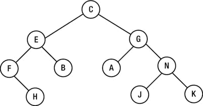

然后，它打印如下遍历:

```java
   The pre-order traversalis: C E F H B G A N J K

   The in-order traversalis: F H E B C A G J N K

   The post-order traversalis: H F B E A J K N G C
```

`buildTree`方法不限于单字符数据；可以使用任何字符串(不包含空格，因为我们使用`%s`来读取数据)。

例如，如果`btree.in`包含以下内容:

```java
   hat din bun @ @ fan @ @ rum kit @ @ win @ @
```

然后[程序 P8.1](#list1) 构建如下树:

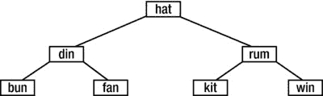

然后，它打印如下遍历:

```java
   The pre-order traversal is:  hat din bun fan rum kit win

   The in-order traversal is:   bun din fan hat kit rum win

   The post-order traversal is: bun fan din kit win rum hat
```

顺便说一下，注意二叉树的有序和前序遍历唯一地定义了该树。顺序内和顺序后都一样。然而，前序和后序并不唯一地定义树。换句话说，可能有两个*不同的*树 A 和 B，其中 A 的前序和后序遍历分别与 B 的前序和后序遍历相同。作为练习，举两个这样的树的例子。

8.6 二分搜索法树

考虑一个可能的二叉树，由图 8-3 所示的三个字母的单词组成。


[图 8-3](#_Fig3) 。二叉查找树和一些三个字母的单词

这是一种特殊的二叉树。它有这样的性质，给定任何一个节点，左子树中的单词比该节点上的单词“小”，右子树中的单词比该节点上的单词“大”。(此处，*较小*和*较大*指字母顺序。)

这样的树叫做*二叉查找树* (BST) 。它使用类似于数组二分搜索法的搜索方法来帮助搜索给定的键。

考虑对`ria`的搜索。从根开始，`ria`与`ode`相比较。由于`ria`比`ode`大(按字母顺序排列)，我们可以得出结论，如果它在树中，那么它一定在右边的子树中。一定是这样，因为左子树中的所有节点都小于`ode`。

跟随`ode`的右子树，我们接下来比较`ria`和`tee`。由于`ria`比`tee`小，我们沿着`tee`的左子树。然后我们比较`ria`和`ria`，搜索成功结束。

但是如果我们在搜索`fun`呢？

1.  `fun`比`ode`小，所以我们走左边。
2.  `fun`比`lea`小，所以我们再往左走。
3.  `fun`大于`era`，所以必须向右走。

但是由于`era`的右子树是空的，我们可以断定`fun`不在树中。如果有必要将`fun`添加到树中，注意我们也已经找到了必须添加的地方。必须添加为`era`的右子树，如图[图 8-4](#Fig4) 所示。


[图 8-4](#_Fig4) 。添加乐趣后的 BST

因此，二叉查找树不仅方便了搜索，而且如果没有找到某个项目，也可以很容易地将其插入。它结合了二分搜索法的速度优势和链表的简单插入。

图 8-3 中绘制的树是七个给定单词的最佳二叉查找树。这意味着它是这些单词的最佳可能的树，从这个意义上说，没有更浅的二叉树可以从这些单词中建立。在包含这些单词的线性数组中，它会给出与二分搜索法相同的比较次数来查找一个键。

但这并不是这些词唯一可能的搜索树。假设单词一次出现一个，当每个单词出现时，它被添加到树中，使得树保持二叉查找树。最终构建的树将取决于单词出现的顺序。例如，假设单词按以下顺序出现:

```java
        mac  tee  ode  era  ria  lea  vim
```

最初，树是空的。当`mac`进来的时候，就变成了树根。

*   接下来是`tee`，并与`mac`进行比较。由于`tee`比较大，所以作为`mac`的右子树插入。
*   `ode`接下来并且大于`mac`，所以我们向右走；`ode`比 tee 小，所以作为`tee`的左子树插入。
*   `era`是 next，比`mac`小，所以作为`mac`的左子树插入。

到目前为止构建的树如[图 8-5](#Fig5) 所示。

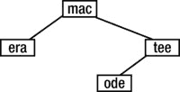

[图 8-5](#_Fig5) 。添加 mac、tee、ode、era 后的 BST

*   `ria`是 next 并且大于`mac`，所以我们向右走；它比`tee`小，所以我们走左边；它大于`ode`，所以作为`ode`的右子树插入。

按照这个过程，`lea`作为`era`的右子树插入，`vim`作为`tee`的右子树插入，得到如图[图 8-6](#Fig6) 所示的最终树。

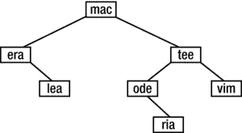

[图 8-6](#_Fig6) 。添加所有七个单词后的 BST

请注意，获得的树与最佳搜索树有很大不同。查找给定单词所需的比较次数也发生了变化。例如，`ria`现在需要四次比较；以前需要三个，`lea`现在需要三个，而以前需要两个。但也不全是坏消息；`era`现在需要两个，而以前需要三个。

可以证明，如果单词以随机顺序出现，那么给定单词的平均搜索时间大约是最佳搜索树的平均时间的 1.4 倍，即对于具有 *n* 个节点的树，1.4 log<sub>2</sub>T2】n。

但是最坏的情况呢？如果单词按字母顺序排列，那么构建的树将如图 8-7 所示。


[图 8-7](#_Fig7) 。退化的树

搜索这样的树被简化为链表的顺序搜索。这种树叫做*退化*树T3。某些单词的顺序会给一些非常不平衡的树。作为练习，按照下列单词顺序画出获得的树:

*   我是来喝茶的
*   我是来喝茶的麦克瑞德
*   我来的时候是莱娅·泰里尔·麦克·奥德 vim era lea tee ria mac ode
*   lea mac 我来喝茶是笑得 ode

8.7 建造一座二叉查找树

我们现在编写一个函数，在二叉查找树中查找或插入一个项目。假设前面定义了`TreeNode`和`BinaryTree`，我们编写函数`findOrInsert`，它是`BinaryTree`类中的一个实例方法。该函数在树中搜索一个`NodeData`项目`d`。如果找到了，它将返回一个指向该节点的指针。如果没有找到，该项将被插入到树中适当的位置，函数将返回一个指向新节点的指针。

```java
        public TreeNode findOrInsert(NodeData d) {
           if (root == null) return root = new TreeNode(d);
           TreeNode curr = root;
           int cmp;
           while ((cmp = d.compareTo(curr.data)) != 0) {
              if (cmp < 0) { //try left
                 if (curr.left == null) return   curr.left = new TreeNode(d);
                 curr = curr.left;
              }
              else { //try right
                 if (curr.right == null) return curr.right = new TreeNode(d);
                 curr = curr.right;
              }
           }
           //d is in the tree; return pointer to the node
           return curr;
        } //end findOrInsert
```

在`while`条件中，我们使用表达式`d.compareTo(curr.data)`。这表明我们需要在`NodeData`类中编写一个`compareTo`方法来比较两个`NodeData`对象。该方法如下所示:

```java
        public int compareTo(NodeData d) {
           return this.word.compareTo(d.word);
        }
```

它只是从`String`类中调用`compareTo`方法，因为`NodeData`只包含一个`String`对象。即使类中有其他字段，如果我们愿意，我们仍然可以决定基于`word`字段或任何其他字段来比较两个`NodeData`对象。

8.7.1 示例:词频统计

我们将通过编写一个程序来计算一篇文章中单词的出现频率，以此来说明目前为止所发展的思想。我们将把单词存储在二叉查找树中。在树中搜索每个输入的单词。如果没有找到这个单词，它将被添加到树中，并且它的频率计数被设置为 1。如果找到了这个词，那么它的频率计数就增加 1。在输入结束时，对树的有序遍历按字母顺序给出单词。

首先，我们必须定义`NodeData`类。这将包括两个字段(一个单词和它的频率)，一个构造函数，一个给频率加 1 的函数，`compareTo`和`visit`。这个类是这样的:

```java
        class NodeData {
           String word;
           int freq;

           public NodeData(String w) {
              word = w;
              freq = 0;
           }
           public void incrFreq() {
              ++freq;
           }

           public int compareTo(NodeData d) {
              return this.word.compareTo(d.word);
           }

           public void visit() {
              WordFrequencyBST.out.printf("%-15s %2d\n", word, freq);
           }
        } //end class NodeData
```

请注意将频率增加 1 的方法。在`visit`中，我们使用对象`WordFrequencyBST.out`在一个节点打印数据。我们将很快编写类`WordFrequencyBST`，但是现在，注意我们将让它决定输出应该去哪里，并且`out`指定输出流。如果您愿意，您可以使用`System.out.printf`将结果发送到标准输出流。

构建搜索树的算法要点如下:

```java
        create empty tree; set root to NULL
        while (there is another word) {
           get the word
           search for word in tree; insert if necessary and set frequency to 0
           add 1 to frequency //for an old word or a newly inserted one
        }
        print words and frequencies
```

对于我们的程序，我们将把一个单词定义为任何连续的大写或小写字母序列。换句话说，任何非字母都可以构成一个单词。特别是，空格和标点符号将分隔一个单词。如果`in`是一个`Scanner`对象，我们可以用这个语句指定这个信息:

```java
        in.useDelimiter("[^a-zA-Z]+");  // ^ means "not"
```

方括号内的部分表示“任何不是小写或大写字母的字符”，而+表示这些字符中的一个或多个。

通常，`Scanner`使用空白来分隔使用`next()`读取的标记。但是，我们可以改变这一点，并指定我们希望用作分隔符的任何字符。例如，要使用冒号作为分隔符，我们可以这样写:

```java
        in.useDelimiter(":");
```

当我们在程序中使用`in.next()`时，它将返回一个字符串，该字符串包含直到下一个冒号的字符，但不包括下一个冒号。要使用冒号或逗号作为分隔符，我们可以这样写:

```java
        in.useDelimiter("[:,]"); //make a set using [ and ]
```

方括号表示一组。要使用冒号、逗号、句号或问号，我们这样写:

```java
        in.useDelimiter("[:,\\.\\?]");
```

句号和问号是所谓的 *meta* 字符(用于特殊目的)，所以我们必须使用转义序列来指定每一个。还有\？。回想一下，在一个字符串中，\是由\指定的。

如果我们想指定一个定界符是任何一个小写字母*而不是*的字符，我们这样写:

```java
        in.useDelimiter("[^a-z]");  // ^ denotes negation, "not"
```

表达式`a-z`表示一个范围——从`a`到`z`。

如果我们在右方括号后添加`+`，它表示“一个或多个”非小写字符的序列。因此，因为我们希望分隔符是“一个或多个”非字母(既不是大写也不是小写)的序列，所以我们这样写:

```java
        in.useDelimiter("[^a-zA-Z]+");
```

我们现在编写[程序 P8.2](#list2) 来对文件`wordFreq.in`中的单词进行频数统计。它只是反映了我们之前概述的算法。

***[程序 P8.2](#_list2)***

```java
        import java.io.*;
        import java.util.*;
        public class WordFrequencyBST {
           static Scanner in;
           static PrintWriter out;

           public static void main(String[] args) throws IOException {
              in = new Scanner(new FileReader("wordFreq.in"));
              out = new PrintWriter(new FileWriter("wordFreq.out"));

              BinaryTree bst = new BinaryTree();

              in.useDelimiter("[^a-zA-Z]+");
              while (in.hasNext()) {
                 String word = in.next().toLowerCase();
                 TreeNode node = bst.findOrInsert(new NodeData(word));
                 node.data.incrFreq();
              }
              out.printf("\nWords        Frequency\n\n");
              bst.inOrder();
              in.close(); out.close();
           } // end main

        } //end class WordFrequencyBST

        class NodeData {
           String word;
           int freq;

           public NodeData(String w) {
              word = w;
              freq = 0;
           }
           public void incrFreq() {
              ++freq;
           }

           public int compareTo(NodeData d) {
              return this.word.compareTo(d.word);
           }

           public void visit() {
              WordFrequencyBST.out.printf("%-15s %2d\n", word, freq);
           }
        } //end class NodeData

        // class TreeNode goes here

        // class BinaryTree (with findOrInsert added) goes here
```

注意，`in`和`out`被声明为`static`类变量。这对于`in`是不必要的，它本可以在`main`申报，因为它只在那里使用。然而，`NodeData`类的`visit`方法需要知道将输出发送到哪里，所以它需要访问`out`。我们通过将`out`声明为类变量来授予它访问权限。

由于`findOrInsert`需要一个`NodeData`对象作为它的参数，我们必须从`word`创建一个`NodeData`对象，然后在这个语句中调用它:

```java
        TreeNode node = bst.findOrInsert(new NodeData(word));
```

搜索树的有序遍历按字母顺序产生单词。

假设文件`wordFreq.in`包含以下数据:

```java
        If you can trust yourself when all men doubt you;
        If you can dream - and not make dreams your master;
        If you can talk with crowds and keep your virtue;
        If all men count with you, but none too much;
        If neither foes nor loving friends can hurt you;
```

当[程序 P8.2](#list2) 运行时，它将其输出发送到文件`wordFreq.out`。以下是输出:

```java
Words        Frequency

all              2
and              2
but              1
can              4
count            1
crowds           1
doubt            1
dream            1
dreams           1
foes             1
friends          1
hurt             1
if               5
keep             1
loving           1
make             1
master           1
men              2
much             1
neither          1
none             1
nor              1
not              1
talk             1
too              1
trust            1
virtue           1
when             1
with             2
you              6
your             2
yourself         1
```

8.8 用父指针构建二叉树

我们已经看到了如何使用递归(使用栈实现)或显式栈来执行前序、按序和后序遍历。我们现在来看第三种可能性。首先，让我们构建树，使它包含“父”指针。

每个节点现在都包含一个附加字段—指向其父节点的指针。根的`parent`字段将是`null`。例如在[图 8-8](#Fig8) 所示的树中，`H`的父字段指向`F` , `A`的父字段指向`G`,`G`的父字段指向`C`。


[图 8-8](#_Fig8) 。带有一些父指针的二叉树

为了表示这样的树，我们现在声明`TreeNode`如下:

```java
        class TreeNode {
           NodeData data;
           TreeNode left, right, parent;

           public TreeNode(NodeData d) {
              data = d;
              left = right = parent = null;
           }
        } //end class TreeNode
```

我们现在可以将`buildTree`改写如下:

```java
        public static TreeNode buildTree(Scanner in) {
           String str = in.next();
           if (str.equals("@")) return null;
           TreeNode p = new TreeNode(new NodeData(str));
           p.left = buildTree(in);
           if (p.left != null) p.left.parent = p;
           p.right = buildTree(in);
           if (p.right != null) p.right.parent = p;
           return p;
        } //end buildTree
```

在我们构建了节点`p`的左子树之后，我们检查它是否是`null`。如果是，那就没什么可进一步做的了。如果不是，并且`q`是它的根，我们将`q.parent`设置为`p`。类似的评论也适用于右边的子树。

有了父字段，我们可以在没有递归的情况下进行遍历，也没有递归所隐含的参数和局部变量的堆叠/拆分。例如，我们可以执行如下的有序遍历:

```java
        get the first node in in-order; call it “node”
        while (node is not null) {
           visit node
           get next node in in-order
        }
```

给定树的非空根，我们可以按顺序找到第一个节点，如下所示:

```java
        TreeNode node = root;
        while (node.left != null) node = node.left;
```

我们尽可能向左走。当我们不能再往前走的时候，我们已经按顺序到达了第一个节点。代码执行后，`node`将按顺序指向第一个节点。

要解决的主要问题如下:给定一个指向任何节点的指针，返回一个指向它的*有序后继节点*的指针，也就是说，如果有的话，它的有序后继节点*在*之后。按顺序排列的最后一个节点将没有后继节点。

有两种情况需要考虑:

1.  If the node has a nonempty right subtree, then its in-order successor is the first node in the in-order traversal of that right subtree. We can find it with the following code, which returns a pointer to the in-order successor:

    ```java
    if (node.right != null) {
       node = node.right;
       while (node.left != null) node = node.left;
       return node;
    }
    ```

    例如，考虑下面的树:

    

    通过向右一次(到`N`)然后尽可能向左(到`J`)找到`G`的有序后继。`J`是`G`的继承人。

2.  If the node has an empty right subtree, then its in-order successor is one of its ancestors. Which one? It’s the lowest ancestor for which the given node is in its *left* subtree. For example, what is the in-order successor of `B`?

    我们来看看`B`的父母`E`。由于`B`在`E`的*右*子树中，所以不是`E`。

    然后我们看一下`E`的父节点`C`。由于`E`(因此，`B`)在`C`的*左*子树中，我们推断`C`是`B`的有序后继。

    然而，请注意，`K`是顺序中的最后一个节点，没有后继节点。如果我们跟踪来自`K`的父指针，我们永远找不到左子树中有`K`的指针。在这种情况下，我们的函数将返回`null`。

利用这些想法，我们将`inOrderTraversal`写成`BinaryTree`类中的一个实例方法，将`inOrderSuccessor`写成它调用的一个静态方法。

```java
        public void inOrderTraversal() {
           if (root == null) return;
           //find first node in in-order
           TreeNode node = root;
           while (node.left != null) node = node.left;
           while (node != null) {
              node.data.visit(); //from the NodeData class
              node = inOrderSuccessor(node);
           }
        } //end inOrderTraversal

        private static TreeNode inOrderSuccessor(TreeNode node) {
           if (node.right != null) {
              node = node.right;
              while (node.left != null) node = node.left;
              return node;
           }
           //node has no right subtree; search for the lowest ancestor of the
           //node for which the node is in the ancestor's left subtree
           //return null if there is no successor (node is the last in in-order)
           TreeNode parent = node.parent;
           while (parent != null && parent.right == node) {
              node = parent;
              parent = node.parent;
           }
           return parent;
        } //end inOrderSuccessor
```

作为练习，编写类似的函数来执行前序和后序遍历。我们将在下一节编写一个测试`inOrderTraversal`的程序。

8.8.1 使用父指针构建二叉查找树

我们可以从`BinaryTree`类中修改`findOrInsert`函数来构建一个带有父指针的搜索树。这可以通过以下方式实现:

```java
        public TreeNode findOrInsert(NodeData d) {
        //Searches the tree for d; if found, returns a pointer to the node.
        //If not found, d is added and a pointer to the new node returned.
        //The parent field of d is set to point to its parent.
           TreeNode curr, node;
           int cmp;

           if (root == null) {
              node = new TreeNode(d);
              node.parent = null;
              return root = node;
           }
           curr = root;

           while ((cmp = d.compareTo(curr.data)) != 0) {
              if (cmp < 0) { //try left
                 if (curr.left == null) {
                    curr.left  = new TreeNode(d);
                    curr.left.parent = curr;
                    return curr.left;
                 }
                 curr = curr.left;
              }
              else { //try right
                 if (curr.right == null)  {
                    curr.right = new TreeNode(d);
                    curr.right.parent = curr;
                    return curr.right;
                 }
                 curr = curr.right;
              } //end else
           } //end while
           return curr;  //d is in the tree; return pointer to the node
        } //end findOrInsert
```

当我们需要向树中添加一个节点(`N`)时，如果`curr`指向新节点将要悬挂的节点，我们只需将`N`的父字段设置为`curr`。

我们可以用[程序 P8.3](#list3) 测试`findOrInsert`和`inOrderTraversal`。

***[程序 P8.3](#_list3)***

```java
        import java.io.*;
        import java.util.*;
        public class P8_3BinarySearchTreeTest {
           public static void main(String[] args) throws IOException {

              Scanner in = new Scanner(new FileReader("words.in"));

              BinaryTree bst = new BinaryTree();

              in.useDelimiter("[^a-zA-Z]+");
              while (in.hasNext()) {
                 String word = in.next().toLowerCase();
                 TreeNode node = bst.findOrInsert(new NodeData(word));
              }
              System.out.printf("\n\nThe in-order traversal is: ");
              bst.inOrderTraversal();
              System.out.printf("\n");
              in.close();
           } // end main

        } //end class P8_3BinarySearchTreeTest

        class NodeData {
           String word;

           public NodeData(String w) {
              word = w;
           }
           public int compareTo(NodeData d) {
              return this.word.compareTo(d.word);
           }

           public void visit() {
              System.out.printf("%s ", word);
           }
        } //end class NodeData

        class TreeNode {
           NodeData data;
           TreeNode left, right, parent;

           public TreeNode(NodeData d) {
              data = d;
              left = right = parent = null;
           }
        } //end class TreeNode

        //The BinaryTree class - only the methods relevant to this problem are shown
        class BinaryTree {
           TreeNode root;

           public BinaryTree() {
              root = null;
           }

            public void inOrderTraversal() {
              if (root == null) return;
              //find first node in in-order
              TreeNode node = root;
              while (node.left != null) node = node.left;
              while (node != null) {
                 node.data.visit(); //from the NodeData class
                 node = inOrderSuccessor(node);
              }
           } //end inOrderTraversal

           private static TreeNode inOrderSuccessor(TreeNode node) {
              if (node.right != null) {
                 node = node.right;
                 while (node.left != null) node = node.left;
                 return node;
              }
              //node has no right subtree; search for the lowest ancestor of the
              //node for which the node is in the ancestor's left subtree
              //return null if there is no successor (node is the last in in-order)
              TreeNode parent = node.parent;
              while (parent != null && parent.right == node) {
                 node = parent;
                 parent = node.parent;
              }
              return parent;
           } //end inOrderSuccessor

           //The method findOrInsert from this Section goes here
        } //end class BinaryTree
```

[程序 P8.3](#list3) 从文件`words.in`中读取单词，构建搜索树，并执行有序遍历以按字母顺序打印单词。例如，假设`words.in`包含以下内容:

```java
        mac tee ode era ria lea vim
```

[程序 P8.3](#list3) 使用父指针构建以下二叉查找树:

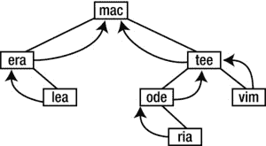

然后，它会打印以下内容:

```java
The in-order traversal is: era lea mac ode ria tee vim
```

8.9 层级顺序遍历

除了前序、按序和后序，另一个有用的遍历是*级序*。这里，我们从根开始，一层一层地遍历树。在每一层，我们从左到右遍历节点。例如，假设我们有下面的树:


它的层次顺序遍历是`C E G B A N F J`。

为了执行层次顺序遍历，我们需要使用一个队列。以下算法说明了如何操作:

```java
        add the root to the queue, Q
        while (Q is not empty) {
           remove item at the head of Q and store in p
           visit p
           if (left(p) is not null) add left(p) to Q
           if (right(p) is not null) add right(p) to Q
        }
```

对于前面的树，会出现以下情况:

*   将`C`放在`Q`上。
*   `Q`不为空，所以移除并访问`C`；将`E`和`G`添加到`Q`中，后者现在有`E G`。
*   `Q`不为空，所以移除并访问`E`；把`B`加到`Q`，现在已经有了`G B`。
*   `Q`非空；移除并访问`G`；将`A`和`N`添加到`Q`中，后者现在有`B A N`。
*   `Q`非空；移除并访问`B`；把`F`加到`Q`，现在已经有了`A N F`。
*   `Q`非空；移除并访问`A`；`Q`什么都不加，现在有了`N F`。
*   `Q`非空；移除并访问`N`；把`J`加到`Q`，现在已经有了`F J`。
*   `Q`非空；移除并访问`F`；`Q`什么都不加，现在有了`J`。
*   `Q`非空；移除并访问`J`；`Q`什么都不加，现在是空的。
*   `Q`空；遍历结束时已经按顺序访问了节点`C E G B A N F J`。

我们将需要以下内容来执行队列操作。首先，我们将类`QueueData`定义如下:

```java
        public class QueueData {
           TreeNode node;

           public QueueData(TreeNode n) {
              node = n;
           }
        } //end class QueueData
```

接下来，我们定义类`QNode`:

```java
        public class QNode {
           QueueData data;
           QNode next;

           public QNode(QueueData d) {
              data = d;
              next = null;
           }
        } //end class QNode
```

最后，这里是类`Queue`:

```java
        public class Queue {
           QNode head = null, tail = null;

           public boolean empty() {
              return head == null;
           }

           public void enqueue(QueueData nd) {
              QNode p = new QNode(nd);
              if (this.empty()) {
                 head = p;
                 tail = p;
              }
              else {
                 tail.next = p;
                 tail = p;
              }
           } //end enqueue

           public QueueData dequeue() {
              if (this.empty()) {
                 System.out.printf("\nAttempt to remove from an empty queue\n");
                 System.exit(1);
              }
              QueueData hold = head.data;
              head = head.next;
              if (head == null) tail = null;
              return hold;
           } //end dequeue
        } //end class Queue
```

注意，如果你把`QueueData`和`Queue`或者使用`Queue`的程序放在同一个文件里，你必须省略`public`这个词。类似的评论也适用于`QNode`这个阶层。

使用`Queue`和`QueueData`，我们可以将`BinaryTree`中的实例方法`levelOrderTraversal`编写如下:

```java
        public void levelOrderTraversal() {
           Queue Q = new Queue();
           Q.enqueue(new QueueData(root));
           while (!Q.empty()) {
              QueueData temp = Q.dequeue();
              temp.node.data.visit();
              if (temp.node.left != null) Q.enqueue(new QueueData(temp.node.left));
              if (temp.node.right != null) Q.enqueue(new QueueData(temp.node.right));
           }
        } //end levelOrderTraversal
```

将所有这些放在一起，我们编写了[程序 P8.4](#list4) ，它使用来自文件`btree.in`的数据构建了一棵树，并执行了一次层次顺序遍历。注意，为了将整个程序放在一个文件中，只有包含`main`的类被声明为`public`。在其他类中，只显示了与这个问题相关的方法。

***[程序 P8.4](#_list4)***

```java
        import java.io.*;
        import java.util.*;
        public class LevelOrderTest {
           public static void main(String[] args) throws IOException {

              Scanner in = new Scanner(new FileReader("btree.in"));
              BinaryTree bt = new BinaryTree(in);

              System.out.printf("\n\nThe level-order traversal is: ");
              bt.levelOrderTraversal();
              System.out.printf("\n");
              in.close();
           } // end main

        } //end class LevelOrderTest

        class NodeData {
           String word;

           public NodeData(String w) {
              word = w;
           }
           public void visit() {
              System.out.printf("%s ", word);
           }
        } //end class NodeData

        class TreeNode {
           NodeData data;
           TreeNode left, right, parent;

           public TreeNode(NodeData d) {
              data = d;
              left = right = parent = null;
           }
        } //end class TreeNode

        //The BinaryTree class - only the methods relevant to this problem are shown
        class BinaryTree {
           TreeNode root;

           public BinaryTree() {
              root = null;
           }

           public BinaryTree(Scanner in) {
              root = buildTree(in);
           }

          public static TreeNode buildTree(Scanner in) {
           String str = in.next();
              if (str.equals("@")) return null;
              TreeNode p = new TreeNode(new NodeData(str));
              p.left = buildTree(in);
              p.right = buildTree(in);
              return p;
           } //end buildTree

           public void levelOrderTraversal() {
              Queue Q = new Queue();
              Q.enqueue(new QueueData(root));
              while (!Q.empty()) {
                 QueueData temp = Q.dequeue();
                 temp.node.data.visit();
                 if (temp.node.left != null) Q.enqueue(new QueueData(temp.node.left));
                 if (temp.node.right != null) Q.enqueue(new QueueData(temp.node.right));
              }
           } //end levelOrderTraversal

        } //end class BinaryTree

        class QueueData {
           TreeNode node;

           public QueueData(TreeNode n) {
              node = n;
           }
        } //end class QueueData

        class QNode {
           QueueData data;
           QNode next;

           public QNode(QueueData d) {
              data = d;
              next = null;
           }
        } //end class QNode

        class Queue {
           QNode head = null, tail = null;

           public boolean empty() {
              return head == null;
           }

           public void enqueue(QueueData nd) {
              QNode p = new QNode(nd);
              if (this.empty()) {
                 head = p;
                 tail = p;
              }
              else {
                 tail.next = p;
                 tail = p;
              }
           } //end enqueue

           public QueueData dequeue() {
              if (this.empty()) {
                 System.out.printf("\nAttempt to remove from an empty queue\n");
                 System.exit(1);
              }
              QueueData hold = head.data;
              head = head.next;
              if (head == null) tail = null;
              return hold;
           } //end dequeue

        } //end class Queue
```

假设文件`btree.in`包含以下内容:

```java
        C E @ B F @ @ @ G A @ @ N J @ @ @
```

[程序 P8.4](#list4) 将构建本节开头所示的树，并打印以下内容:

```java
The level-order traversal is: C E G B A N F J
```

8.10 一些有用的二叉树函数 s

我们现在向你展示如何编写一些函数(在类`BinaryTree`中)来返回关于二叉树的信息。第一种方法计算树中节点的数量:

```java
        public int numNodes() {
           return countNodes(root);
        }

        private int countNodes(TreeNode root) {
           if (root == null) return 0;
           return 1 + countNodes(root.left) + countNodes(root.right);
        }
```

如果`bt`是二叉树，`bt.numNodes()`将返回树中节点的个数。对节点的计数被委托给`private`功能`countNodes`。

下一个函数返回树中叶子的数量:

```java
        public int numLeaves() {
           return countLeaves(root);
        }

        private int countLeaves(TreeNode root) {
           if (root == null) return 0;
           if (root.left == null && root.right == null) return 1;
           return countLeaves(root.left) + countLeaves(root.right);
        }
```

下一个返回树的高度:

```java
        public int height() {
           return numLevels(root);
        }

        private int numLevels(TreeNode root) {
           if (root == null) return 0;
           return 1 + Math.max(numLevels(root.left), numLevels(root.right));
        }
```

`Math.max`返回两个参数中较大的一个。

建议您在一些样本树上运行这些函数，以验证它们确实返回了正确的值。

8.11 二叉查找树删除

考虑从二叉查找树(BST)中删除一个节点以便它仍然是 BST 的问题。有三种情况需要考虑:

1.  该节点是一个叶子。
2.  (a)该节点没有左子树。
    (b)节点没有右边的子树。
3.  该节点具有非空的左右子树。

我们使用图 8-9 所示的 BST 来说明这些情况。


[图 8-9](#_Fig9) 。一个二叉查找树

案例 1 很简单。例如，要删除`P`，我们只需将`N`的右边子树设置为 null。案例 2 也很简单。为了删除`A`(没有左子树)，我们用它的右子树`C`代替它。为了删除`F`(没有右边的子树)，我们用它的左边的子树`A`代替它。

情况 3 有点困难，因为我们必须考虑如何处理悬挂在节点上的两个子树。比如我们怎么删除`L`？一种方法是用它的有序后继者`N`替换`L`，其中*必须*有一个空的左子树。为什么呢？因为根据定义，一个节点的有序后继节点是其右子树中的第一个节点(按顺序)。并且这个第一个节点(在任何树中)是通过尽可能向左走找到的。

由于`N`没有左子树，我们将把它的左链接设置为`L`的左子树。我们将`N`(本例中为`R`)的父节点的左侧链接设置为指向`N`的右侧子树`P`。最后我们将`N`的右链接设置为指向`L`的右子树，给出[图 8-10](#Fig10) 所示的树。


[图 8-10](#_Fig10) 。在[图 8-9](#Fig9) 中删除 L 后的 BST

另一种方式是想象节点`N`的内容被复制到节点`L`中。并将`N`(也就是`R)`)的父节点的左边链接设置为指向`N`(也就是`P`)的右边子树。

在我们的算法中，我们将把要删除的节点视为一个子树的根。我们将删除根，并返回一个指向重建树的根的指针。


假设我们用指向节点`L` ( [图 8-9](#Fig9) )的指针调用`deleteNode`作为自变量。该函数将删除`L`,并返回一个指向以下树的指针:


由于`L`是`H`的右子树，我们现在可以将`H`的右子树设置为指向这棵树的根`N`。

8.12 以二叉树表示的数组

一棵*完全*二叉树是这样的树，其中每个非叶子节点有两个非空子树，并且所有的叶子都在同一层。[图 8-11](#Fig11) 显示了一些完整的二叉树。


[图 8-11](#_Fig11) 。完全二叉树

第一个是高度为 1 的完全二叉树，第二个是高度为 2 的完全二叉树，第三个是高度为 3 的完全二叉树。对于一棵高度为 *n* 的完全二叉树，树中的节点数为 2<sup>T3】nT5】-1。</sup>

考虑第三棵树。让我们按照[图 8-12](#Fig12) 所示对节点进行编号。


[图 8-12](#_Fig12) 。逐层对节点进行编号

从根节点的 1 开始，我们按照从上到下和从左到右的顺序对每一层的节点进行编号。

注意，如果一个节点具有标签 *n* ，则其左子树具有标签 2 *n* ，其右子树具有标签 2 *n* + 1。

如果节点存储在数组`T[1..7]`中，如下所示:

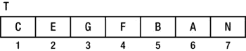

然后

*   T[1]是根。
*   T[i]的左子树是 T[2i]如果 2i <= 7，否则为`null`。
*   T[i]的右子树是 T[2i+1]如果 2i+1 <= 7，否则为`null`。
*   T[i]的父代是 T[i/2](整数除法)。

基于此，数组是一个完整二叉树的表示。换句话说，给定数组，我们可以很容易地构造它所代表的二叉树。

如果数组中的元素个数为 2<sup>*n*</sup>–1，对于某些 *n* ，则该数组表示一棵完整的二叉树。如果元素的数量是某个其他值，数组表示一个*几乎完整的*二叉树。

一棵*几乎完全二叉树*是这样一棵树，其中:

*   除了最低层之外，所有层都被完全填满。
*   最底层的节点(所有叶子)尽可能靠左。

如果节点如前所示进行编号，那么所有的叶子将被标上从`n/2+1`到`n`的连续编号。最后一个非叶节点将具有标签`n/2`。例如，考虑如图 8-13 中[所示的有十个节点的树。](#Fig13)


[图 8-13](#_Fig13) 。一个由十个节点组成的树，逐层标记

注意叶子的编号是从 6 到 10。例如，如果`H`是`B`的右子树而不是左子树，那么该树将不是“几乎完整的”,因为最底层的叶子不会“尽可能地靠左”

以下大小为 10 的数组可以代表这个几乎完整的二叉树:


一般而言，如果树由数组`T[1..n]`表示，则以下成立:

*   T[1]是根。
*   T[i]的左子树是 T[2i]如果 2i <= n，否则为 null。
*   T[i]的右子树是 T[2i+1]如果 2i+1 <= n，否则为 null。
*   T[i]的父代是 T[i/2](整数除法)。

从另一个角度来看，确实有一个几乎完整的二叉树，有 *n* 个节点，大小为 *n* 的数组表示这棵树。

几乎完整的二叉树中没有“洞”；没有空间在现有节点之间添加节点。添加节点的唯一位置是在最后一个节点之后。

例如，[图 8-14](#Fig14) 不是“几乎完整的”，因为在`B`的右边子树上有一个“洞”。


[图 8-14](#_Fig14) 。空的 B 的右子树使得这不是“几乎完全的”

有了洞，`A`(在位置 6)的左子树是*不是*现在在位置 6*2 = 12，右子树不在位置 6*2+1 =13。这种关系只有在树几乎完成时才成立。

给定一个表示具有 *n* 个节点的几乎完整的二叉树的数组`T[1..n]`，我们可以通过调用下面的函数`inOrder(1, n)`来执行树的有序遍历:

```java
        public static void inOrder(int h, int n) {
           if (h <= n) {
              inOrder(h * 2, n);
              visit(h); //or visit(T[h]), if you wish
              inOrder(h * 2 + 1, n);
           }
        } //end inOrder
```

我们可以为前序和后序遍历编写类似的函数。

与完全二叉树相比，*完全二叉树*是这样一种树，其中除了一片叶子之外，每个节点都有*恰好两个*非空子树。[图 8-15](#Fig15) 是一个完全二叉树的例子。


[图 8-15](#_Fig15) 。完整的二叉树

注意，一棵完整的二叉树总是满的，但是如图[图 8-15](#Fig15) 所示，一棵完整的二叉树不一定是完整的。几乎完整的二叉树可能是满的，也可能不是满的。

[图 8-16](#Fig16) 中的树几乎完整但不完整(`G`有*一个*非空子树)。


[图 8-16](#_Fig16) 。几乎完全但不完全的二叉树

然而，如果节点`A`被移除，树将几乎完成*并且*满。

在下一章，我们将解释如何通过解释一个几乎完整的二叉树来排序一个数组。

**练习 8**

1.  二叉树由一个整数键字段和指向左子树、右子树和父树的指针组成。编写构建树所需的声明，并编写创建空树的代码。
2.  Each node of a binary tree has fields `left`, `right`, `key`, and `parent`.

    编写一个函数来返回任意给定节点`x`的有序后继节点。提示:如果节点`x`的右子树为空，并且`x`有一个后继`y`，那么`y`是`x`的最低祖先，它的*左*子树中包含`x`。

    编写一个函数来返回任何给定节点`x`的前序后继节点。

    编写一个函数来返回任意给定节点`x`的后序后继节点。

    使用这些函数，编写函数来执行给定二叉树的有序、前序和后序遍历。

3.  假设树存储在一个数组中，做练习 2。
4.  写一个函数，给定一个二叉查找树的根，删除最小的节点，并返回一个指向重建树的根的指针。
5.  写一个函数，给定一个二叉查找树的根，删除最大的节点，并返回一个指向重建树的根的指针。
6.  写一个函数，给定二叉查找树的根，删除根并返回一个指向重建树的根的指针。写出用(I)它的有序后继者和(ii)它的有序前趋者替换根的函数。
7.  画一个五个节点的非退化二叉树，使得前序和层次序遍历产生相同的结果。
8.  写一个函数，给定二叉树的根，返回树的*宽*，也就是任意级别的最大节点数。
9.  二叉查找树包含整数。对于以下每个序列，说明它是否可能是在搜索数字`36`时检查的值序列。如果不能，说明原因。

    ```java
    7 25 42 40 33 34 39 36
    92 22 91 24 89 20 35 36
    95 20 90 24 92 27 30 36
    7 46 41 21 26 39 37 24 36
    ```

10.  Draw the binary search tree (BST) obtained for the following keys assuming they are inserted in the following order: `56 30 61 39 47 35 75 13 21 64 26 73 18`.

    对于前面的键，有一个几乎完整的 BST。画出来。

    按照产生几乎完整 BST 的顺序列出这些键。

    假设几乎完整的树存储在一维数组`num[1..13]`中，写一个递归函数，用于按后序打印整数。

11.  An imaginary “external” node is attached to each null pointer of a binary tree of *n* nodes. How many external nodes are there?

    如果 **I** 是原树节点的层数之和， **E** 是外部节点的层数之和，证明**E**–**I**= 2*n*。( **I** 称为*内部路径长度*。)

    写一个递归函数，给定一个二叉树的根，返回 **I** 。

    写一个非递归函数，给定二叉树的根，返回 **I** 。

12.  Draw the binary tree whose in-order and post-order traversals of the nodes are as follows:

    按顺序:`G D P K E N F A T L`

    后期订单:`G P D K F N T A L E`

13.  Draw the binary tree whose pre-order and in-order traversals of the nodes are as follows:

    预购:`N D G K P E T F A L`

    按顺序:`G D P K E N F A T L`

14.  画两个不同的二叉树，使得一棵树的前序和后序遍历与另一棵树的前序和后序遍历相同。
15.  编写一个递归函数，在给定二叉树的根和一个键的情况下，使用(I)前序、(ii)按序和(iii)后序遍历来搜索该键。如果找到，返回包含该键的节点；否则，返回`null`。
16.  Store the following integers in an array `bst[1..15]` such that `bst` represents a complete binary search tree:

    `34 23 45 46 37 78 90 2 40 20 87 53 12 15 91`

17.  *二叉查找树*的每个节点包含三个字段——`left`、`right`和`data`——具有它们通常的含义；`data`是正整数字段。写一个*有效的*函数，给定树的根和`key`，返回树中大于`key`的*最小的*数。如果没有这个数字，则返回-1。**
18.  Write a program that takes a Java program as input and outputs the program, numbering the lines, followed by an alphabetical cross-reference listing of all user identifiers; that is, a user identifier is followed by the numbers of all lines in which the identifier appears. If an identifier appears more than once in a given line, the line number must be repeated the number of times it appears.

    交叉引用列表必须*而不是*包含 Java 保留字、字符串中的单词或注释中的单词。