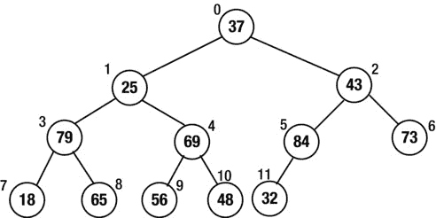
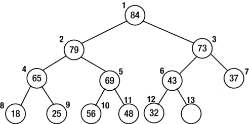
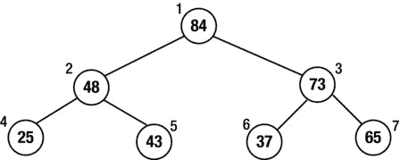
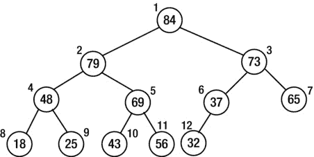
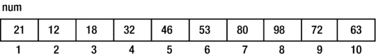
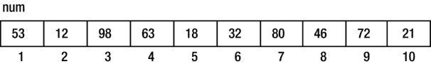
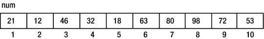
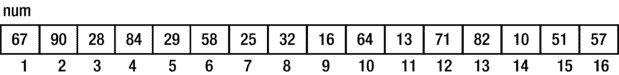
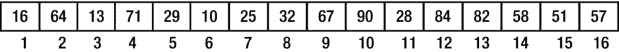
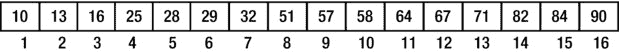

第九章


高级排序

在本章中，我们将解释以下内容:

*   什么是堆以及如何使用`siftDown`执行堆排序
*   如何使用`siftUp`构建一个堆
*   如何分析 heapsort 的性能
*   如何使用堆来实现优先级队列
*   如何使用快速排序对项目列表进行排序
*   如何找到列表中第 *k* 个最小的项目
*   如何使用外壳(递减增量)排序对项目列表进行排序

在第 1 章中，我们讨论了两种简单的方法(选择和插入排序)来排序条目列表。在这一章中，我们将详细介绍一些更快的方法——堆排序、快速排序和 Shell(递减增量)排序。

9.1 重头戏

*Heapsort* 是一种排序方法，*将数组中的元素*解释为一棵几乎完整的二叉树。考虑下面的数组，它将按升序排序:


我们可以把这个数组想象成一棵几乎完整的 12 节点二叉树，如图[图 9-1](#Fig1) 所示。


[图 9-1](#_Fig1) 。一个二叉树视图的数组

假设我们现在要求每个节点的值大于或等于其左右子树中的值，如果存在的话。实际上，只有节点 6 和叶子具有这种属性。简而言之，我们将看到如何重新排列节点，以便所有的*节点都满足这个条件。但是，首先，我们给这样的结构一个名字:*

*一个* ***堆*** *是一个几乎完全的二叉树，使得根的值大于或等于左右子树的值，左右子树也是堆。*

这个定义的一个直接结果是最大值在根处。这样的堆被称为*最大堆* 。我们定义一个*最小堆* ，用更小的*代替更大的*。在最小堆中，*最小的*值位于根。**

 *现在让我们将图 9-1 中[的二叉树转换成最大堆](#Fig1)。

9.1.1 将二叉树转换成最大堆

首先，我们观察到所有的叶子都是堆，因为它们没有孩子。

从最后一个非叶节点(本例中为 6)开始，我们将根在那里的树转换为 max-heap。如果该节点的值大于其子节点的值，则无需采取任何措施。节点 6 就是这种情况，因为 84 大于 32。

接下来，我们转到节点 5。这里的值 48 小于至少一个孩子(在本例中是 56 和 69)。我们首先找到较大的孩子(69)并将其与节点 5 交换。因此，69 在节点 5 结束，48 在节点 11 结束。

接下来，我们去节点 4。较大的孩子 79 被移动到节点 4，65 被移动到节点 9。在这个阶段，树看起来像图 9-2 中的树。


[图 9-2](#_Fig2) 。处理完节点 6、5 和 4 后的树

在节点 3 继续，43 必须被移动。较大的孩子是 84，所以我们交换节点 3 和 6 的值。现在节点 6 的值(43)比它的子节点(32)大，所以没什么可做的了。但是，请注意，如果节点 6 的值是 28，那么它必须与 32 交换。

移动到节点 2，25 与其较大的孩子 79 交换。但是现在节点 4 中的 25 小于它在节点 9 中的子节点 65。因此，这两个值必须交换。

最后，在节点 1，37 与其较大的孩子 84 交换。它进一步与它的(新的)更大的孩子 73 交换，得到树，现在是一个堆，如图 9-3 所示。


[图 9-3](#_Fig3) 。最后一棵树，现在是一堆

9.1.2 分拣过程

在转换为堆之后，注意最大的值 84 位于树的根处。现在，数组中的值形成了一个堆，我们可以按如下方式按升序对它们进行排序:

*   将最后一个项目 32 存储在临时位置。接下来，将 84 移动到最后一个位置(节点 12)，释放节点 1。然后，假设 32 在节点 1 中，并移动它，使项目 1 到 11 成为一个堆。这将按如下方式完成:
*   32 与其较大的子节点 79 交换，后者现在移入节点 1。然后，32 进一步与其(新的)更大的子节点 69 交换，该子节点移动到节点 2。

最后 32 和 56 交换，给我们[图 9-4](#Fig4) 。


[图 9-4](#_Fig4) 。在 84 被放置并且堆被重组之后

在此阶段，第二大数量 79 位于节点 1 中。这被放置在节点 11 中，并且 48 从节点 1“向下筛选”，直到项目 1 到 10 形成一个堆。现在，第三大数字 73 将成为根源。这被放置在节点 10 中，以此类推。重复该过程，直到阵列被排序。

在构建了初始堆之后，排序过程可以用下面的伪代码来描述:

```java
        for k = n downto 2 do
           item = num[k]     //extract current last item
           num[k] = num[1]   //move top of heap to current last node
           siftDown(item, num, 1, k-1)  //restore heap properties from 1 to k-1
        end for
```

其中`siftDown(item, num, 1, k-1)`假设以下情况成立:

*   `num[1]`空无一物。
*   `num[2]`到`num[k-1]`形成一堆。

从位置 1 开始，`item`被插入，使得`num[1]`到`num[k-1]`形成一个堆。

在上述排序过程中，每次循环时，当前最后位置(`k`)中的值存储在`item`中。节点 1 的值移动到位置`k`；节点 1 变为空(可用)，节点`2`到`k-1`都满足堆属性。

调用`siftDown(item, num, 1, k-1)`将添加`item`，以便`num[1]`到`num[k-1]`包含一个堆。这确保了下一个最高的数字在节点 1。

关于`siftDown`(当我们编写它时)的好处是它可以用来从给定的数组创建初始堆。回想一下 9.1.1 节中描述的创建堆的过程。在每个节点(`h`，比方说)，我们“向下筛选值”，这样我们就形成了一个以`h`为根的堆。为了在这种情况下使用`siftDown`，我们将其概括如下:

```java
        void siftDown(int key, int num[], int root, int last)
```

这假设了以下情况:

*   `num[root]`空无一物。
*   `last`是数组中的最后一个条目，`num`。
*   `num[root*2]`，如果存在(`root*2 ≤ last`)，就是堆的根。
*   `num[root*2+1]`，如果存在(`root*2+1 ≤ last`)，就是堆的根。

从`root`开始，`key`被插入，因此`num[root]`成为一个堆的根。

给定一组值`num[1]`到`num[n]`，我们可以用以下伪代码构建堆:

```java
        for h = n/2 downto 1 do           // n/2 is the last non-leaf node
       siftDown(num[h], num, h, n)
```

我们现在展示如何写`siftDown`。


[图 9-5](#_Fig5) 。一个堆，除了节点 1 和 2

考虑[图 9-5](#Fig5) 。

除了节点 1 和 2，所有其他节点都满足堆属性，因为它们大于或等于其子节点。假设我们想让节点 2 成为一个堆的根。实际上，值 25 小于它的子值(79 和 69)。我们希望编写`siftDown`以便下面的调用可以完成这项工作:

```java
        siftDown(25, num, 2, 12)
```

这里，`25`是`key`，`num`是数组，`2`是根，`12`是最后一个节点的位置。

此后，节点 2 到 12 中的每一个都将成为堆的根，下面的调用将确保整个数组包含一个堆:

```java
        siftDown(37, num, 1, 12)
```

`siftDown`的要旨如下:

```java
        find the bigger child of num[root]; //suppose it is in node m
        if (key >= num[m]) we are done; put key in num[root]
        //key is smaller than the bigger child
        store num[m] in num[root]  //promote bigger child
        set root to m
```

重复该过程，直到`root`处的值大于其子值或者没有子值。这里是`siftDown`:

```java
        public static void siftDown(int key, int[] num, int root, int last) {
           int bigger = 2 * root;
           while (bigger <= last) { //while there is at least one child
              if (bigger < last) //there is a right child as well; find the bigger
                 if (num[bigger+1] > num[bigger]) bigger++;
              //'bigger' holds the index of the bigger child
              if (key >= num[bigger]) break;
              //key is smaller; promote num[bigger]
              num[root] = num[bigger];
              root = bigger;
              bigger = 2 * root;
           }
           num[root] = key;
        } //end siftDown
```

我们现在可以这样写`heapSort`:

```java
        public static void heapSort(int[] num, int n) {
           //sort num[1] to num[n]
           //convert the array to a heap
           for (int k = n / 2; k >= 1; k--) siftDown(num[k], num, k, n);

           for (int k = n; k > 1; k--) {
              int item = num[k]; //extract current last item
              num[k] = num[1];   //move top of heap to current last node
              siftDown(item, num, 1, k-1); //restore heap properties from 1 to k-1
           }
        } //end heapSort
```

我们可以用[程序 P9.1](#list1) 来测试`heapSort`。

***[程序 P9.1](#_list1)***

```java
        import java.io.*;
        public class HeapSortTest {
           public static void main(String[] args) throws IOException {
              int[] num = {0, 37, 25, 43, 65, 48, 84, 73, 18, 79, 56, 69, 32};
              int n = 12;
              heapSort(num, n);
              for (int h = 1; h <= n; h++) System.out.printf("%d ", num[h]);
              System.out.printf("\n");
           }

        public static void heapSort(int[] num, int n) {
           //sort num[1] to num[n]
           //convert the array to a heap
           for (int k = n / 2; k >= 1; k--) siftDown(num[k], num, k, n);

           for (int k = n; k > 1; k--) {
              int item = num[k]; //extract current last item
              num[k] = num[1];   //move top of heap to current last node
              siftDown(item, num, 1, k-1); //restore heap properties from 1 to k-1
           }
        } //end heapSort

           public static void siftDown(int key, int[] num, int root, int last) {
              int bigger = 2 * root;
              while (bigger <= last) { //while there is at least one child
                 if (bigger < last) //there is a right child as well; find the bigger
                    if (num[bigger+1] > num[bigger]) bigger++;
                 //'bigger' holds the index of the bigger child
                 if (key >= num[bigger]) break;
                 //key is smaller; promote num[bigger]
                 num[root] = num[bigger];
                 root = bigger;
                 bigger = 2 * root;
              }
              num[root] = key;
           } //end siftDown

        } //end class HeapSortTest
```

运行时，[程序 P9.1](#list1) 产生如下输出(`num[1]`到`num[12]`排序):

```java
        18 25 32 37 43 48 56 65 69 73 79 84
```

*编程* *注*:如前所述，`heapSort`对一个数组排序，假设 *n* 个元素从下标`1`到`n`存储。如果它们从`0`存储到`n-1`，则必须进行适当的调整。它们将主要基于以下观察:

*   根存储在`num[0]`中。
*   如果`2h+1 < n`，节点`h`的左子节点就是节点`2h+1`。
*   如果`2h+2 < n`，节点`h`的子节点就是节点`2h+2`。
*   节点`h`的父节点是节点`(h–1)/2`(整数除法)。
*   最后一个非叶节点是`(n–2)/2`(整数除法)。

你可以使用[图 9-6](#Fig6) 中所示的树(`n` = 12)来验证这些观察结果。



[图 9-6](#_Fig6) 。存储在从 0 开始的数组中的二叉树

系统会提示您重写`heapSort`，以便它对数组 `num[0..n-1]`进行排序。作为提示，请注意`siftDown`中唯一需要更改的是`bigger`的计算。我们现在用`2 * root + 1`代替`2 * root`。

9.2 使用 siftUp 构建堆

考虑向现有堆中添加新节点的问题。具体来说，假设`num[1]`到`num[n]`包含一个堆。我们想添加一个新的数字，`newKey`，这样`num[1]`到`num[n+1]`包含一个包含`newKey`的堆。我们假设数组中有容纳新密钥的空间。

例如，假设我们有一个如图 9-7 所示的堆，我们想把 T0 添加到这个堆中。当添加新数字时，堆将包含 13 个元素。我们假设`40`被放在`num[13]`(但是还没有把它存储在那里)，并把它和它在`num[6]`的父`43`进行比较。由于`40`较小，满足堆属性；我们将`40`放在`num[13]`中，流程结束。



[图 9-7](#_Fig7) 。我们将向其中添加新项目的堆

但是假设我们想将`80`添加到堆中。我们假设`80`被放在`num[13]`(但实际上还没有把它存储在那里)，并把它和它在`num[6]`中的父`43`进行比较。由于`80`更大，我们将`43`移到`num[13]`，并想象`80`被放置在`num[6]`中。

接下来，我们将`80`与它在`num[3]`中的父`73`进行比较。它更大，所以我们将`73`移到`num[6]`，并想象`80`被放置在`num[3]`中。

然后我们将`80`与它在`num[1]`中的父`84`进行比较。它更小，所以我们将`80`放在`num[3]`中，流程结束。

注意，如果我们将`90`添加到堆中，`84`将被移动到`num[3]`，而`90`将被插入到`num[1]`。它现在是堆中最大的数字。

[图 9-8](#Fig8) 显示了添加`80`后的堆。


[图 9-8](#_Fig8) 。添加 80 后的堆

以下代码将`newKey`添加到存储在`num[1]`到`num[n]`的堆中:

```java
        child = n + 1;
        parent = child / 2;
        while (parent > 0) {
           if (newKey <= num[parent]) break;
           num[child] = num[parent]; //move down parent
           child = parent;
           parent = child / 2;
        }
        num[child] = newKey;
        n = n + 1;
```

所描述的过程通常被称为*筛选*。我们可以将这段代码重写为一个函数`siftUp`。我们假设给了`siftUp`一个数组`heap[1..n]`，使得`heap[1..n-1]`包含一个堆，并且`heap[n]`将被向上筛选，使得`heap[1..n]`包含一个堆。换句话说，`heap[n]`在前面的讨论中扮演了`newKey`的角色。

我们将`siftUp`显示为[程序 P9.2](#list2) 的一部分，该程序从存储在文件`heap.in`中的数字中创建一个堆。

***[程序 P9.2](#_list2)***

```java
     import java.io.*;
     import java.util.*;
     public class SiftUpTest {
        final static int MaxHeapSize = 100;
        public static void main (String[] args) throws IOException {
           Scanner in = new Scanner(new FileReader("heap.in"));
           int[] num = new int[MaxHeapSize + 1];
           int n = 0, number;

           while (in.hasNextInt()) {
              number = in.nextInt();
              if (n < MaxHeapSize) { //check if array has room
                 num[++n] = number;
                 siftUp(num, n);
              }
           }

           for (int h = 1; h <= n; h++) System.out.printf("%d ", num[h]);
           System.out.printf("\n");
           in.close();
        } //end main

        public static void siftUp(int[] heap, int n) {
        //heap[1] to heap[n-1] contain a heap
        //sifts up the value in heap[n] so that heap[1..n] contains a heap
           int siftItem = heap[n];
           int child = n;
           int parent = child / 2;
           while (parent > 0) {
              if (siftItem <= heap[parent]) break;
              heap[child] = heap[parent]; //move down parent
              child = parent;
              parent = child / 2;
           }
           heap[child] = siftItem;
        } //end siftUp

     } //end class SiftUpTest
```

假设`heap.in`包含以下内容:

```java
    37 25 43 65 48 84 73 18 79 56 69 32
```

[程序 P9.2](#list2) 将构建堆(如下所述)并打印以下内容:

```java
    84 79 73 48 69 37 65 18 25 43 56 32
```

在`37`、`25`、`43`被读取后，我们将有[图 9-9](#Fig9) 。


[图 9-9](#_Fig9) 。处理后堆 37，25，43

在`65`、`48`、`84`和`73`被读取之后，我们将会有[图 9-10](#Fig10) 。



[图 9-10](#_Fig10) 。处理后堆 65、48、84、73

在读取了`18`、`79`、`56`、`69`、`32`之后，我们将得到如图 9-11 中[所示的最终堆。](#Fig11)



[图 9-11](#_Fig11) 。处理后的最终堆 18、79、56、69、32

请注意，图 9-11 中的[堆与图 9-3](#Fig11) 中的[堆不同，尽管它们由相同的数字组成。没变的是最大值`84`在根。](#Fig3)

如果这些值已经存储在数组`num[1..n]`中，我们可以用下面的方法创建一个堆:

```java
    for (int k = 2; k <= n; k++) siftUp(num, k);
```

9.3 堆排序的分析

对于创建堆来说，`siftUp`还是`siftDown`更好？请记住，任何节点移动的次数最多是 log<sub>2</sub>T4】n。

在`siftDown`中，我们处理 *n* /2 个节点，在每一步，我们进行两次比较:一次是寻找更大的子节点，一次是比较节点值和更大的子节点。在一个简单化的分析中，在最坏的情况下，我们将需要进行 2 **n*/2 * log<sub>2</sub>T7】n=*n*log<sub>2</sub>T13】n 的比较。然而，更仔细的分析会表明，我们最多只需要进行 4 次比较。

在`siftUp`中，我们处理 *n* -1 个节点。在每一步，我们做一个比较:节点和它的父节点。在一个简单化的分析中，在最坏的情况下，我们进行(*n*-1)log<sub>2</sub>*n*的比较。然而，有可能所有的叶子都必须一路旅行到树的顶端。在这种情况下，我们有 *n* /2 个节点必须经过 log <sub>2</sub> *n* 的距离，总共有(*n*/2)log<sub>2</sub>*n*的比较。这只是为了树叶。最后，一个更仔细的分析仍然给了我们大约*n*log<sub>2</sub>T26】n 对于`siftUp`的比较。

性能上的差异取决于以下几点:在`siftDown`中，一半的节点(树叶)没有工作可做；`siftUp`为这些节点做的工作最多。

无论我们使用哪种方法来创建初始堆，heapsort 都会对大小为 *n* 的数组进行排序，最多进行 2 次*n*log<sub>2</sub>T6】n 比较和*n*log<sub>2</sub>*n*赋值。这非常快。此外，堆排序是*稳定的*，因为它的性能总是最差 2*n*log<sub>2</sub>T20】n，而不管给定数组中项目的顺序如何。

为了了解 heapsort(以及所有顺序为 O(*n*log<sub>2</sub>T4】n)的排序方法，如 quicksort 和 mergesort)有多快，让我们将其与 selection sort 进行比较，selection sort 大致对*n*T8】2 条目([表 9-1](#Tab1) 进行比较。

[表 9-1](#_Tab1) 。堆排序和选择排序的比较


第二列和第三列显示了每种方法进行的比较次数。最后两列显示了每种方法的运行时间(秒)，假设计算机每秒可以处理一百万次比较。例如，对 100 万个项目进行排序，选择排序将花费 500，000 秒(差不多 6 天！)，而 heapsort 会在不到 40 秒的时间内完成。

9.4 堆和优先级队列

一个*优先级队列*是这样的队列，其中每个项目都被分配了一些“优先级”,并且它在队列中的位置是基于这个优先级的。优先级最高的项目被放在队列的最前面。以下是可以在优先级队列上执行的一些典型操作:

*   移除(服务)具有最高优先级的项目
*   添加具有给定优先级的项目
*   从队列中删除项目
*   更改项目的优先级，根据新的优先级调整其位置

我们可以把优先级想象成一个整数——整数越大，优先级越高。

很快，我们可以推测，如果我们将队列实现为 max-heap，那么优先级最高的项将位于根，因此可以很容易地将其移除。重新组织堆只需要从根中“筛选”出最后一项。

添加一个项目将涉及到将该项目放置在当前最后一个项目之后的位置，并对其进行筛选，直到找到正确的位置。

要从队列中删除任意一项，我们需要知道它的位置。删除它将涉及到用当前最后一个项目替换它，并向上或向下筛选它以找到它的正确位置。堆将减少一项。

如果我们改变一个项目的优先级，我们可能需要向上或向下筛选来找到它的正确位置。当然，它也可能保持在原来的位置，这取决于变化。

在许多情况下(例如，一台多任务计算机上的一个作业队列)，一个作业的优先级可能会随着时间的推移而增加，以便它最终得到服务。在这些情况下，随着每次改变，作业向堆的顶部移动得更近；因此，只需要向上筛选。

在典型的情况下，关于优先级队列中的项目的信息保存在另一个可以快速搜索的结构中，例如二叉查找树。节点中的一个字段将包含用于实现优先级队列的数组中项的索引。

使用作业队列示例，假设我们想要向队列中添加一个项目。比方说，我们可以通过作业编号搜索树，并将项目添加到树中。它的优先级数用于确定它在队列中的位置。该位置存储在树节点中。

如果后来优先级改变了，则该项在队列中的位置被调整，并且这个新位置被存储在树节点中。请注意，调整此项可能还涉及到更改其他项的位置(当它们在堆中上移或下移时)，并且还必须为这些项更新树。

9.5 使用快速排序对项目列表进行排序

快速排序的核心是相对于一个叫做*枢纽* 的值来划分列表的概念。例如，假设给我们以下要排序的列表:


我们可以用第一个值 53 来划分 T2。这意味着将 53 放在这样一个位置，它左边的所有值都小于它，右边的所有值都大于或等于它。简而言之，我们将描述一种算法，该算法将如下划分`num`:



数值 53 用作*枢轴*。它被放置在位置 6。53 左边的所有值都小于 53，右边的所有值都大于 53。支点所在的位置称为*分界点* ( `dp`，比方说)。根据定义，53 处于其最终排序位置。

如果我们可以对`num[1..dp-1]`和`num[dp+1..n]`进行排序，我们就已经对整个列表进行了排序。但是我们可以使用相同的过程来对这些片段进行排序，这表明递归过程是合适的。

假设有一个函数`partition`可以将分割成一个数组的给定部分，并返回分割点，我们可以将`quicksort`写成如下形式:

```java
        public static void quicksort(int[] A, int lo, int hi) {
        //sorts A[lo] to A[hi] in ascending order
           if (lo < hi) {
              int dp = partition(A, lo, hi);
              quicksort(A, lo, dp-1);
              quicksort(A, dp+1, hi);
           }
        } //end quicksort
```

调用`quicksort(num, 1, n)`将按照升序对`num[1..n]`进行排序。

我们现在来看看`partition`可能是如何写的。考虑以下阵列:



我们将通过一次遍历数组，相对于`num[1]`，53(支点)对其进行划分。我们将依次查看每个数字。如果它比支点大，我们什么也不做。如果它比较小，我们把它移到数组的左边。最初，我们将变量`lastSmall`设置为`1`；随着方法的进行，`lastSmall`将是已知小于枢纽的最后一个项目的索引。我们对`num`分区如下:

1.  比较`12`和`53`；它更小，所以将`1`加到`lastSmall`(使其成为`2`)并将`num[2]`与其自身互换。
2.  比较`98`和`53`；它更大，所以继续前进。
3.  比较`63`和`53`；它更大，所以继续前进。
4.  Compare `18` with `53`; it is smaller, so add `1` to `lastSmall` (making it `3`) and swap `num[3]`, `98`, with `18`.

    在这个阶段，我们有这个:

    

5.  比较`32`和`53`；它比较小，所以把`1`加到`lastSmall`(使之成为`4`)，把`num[4]`、`63`和`32`互换。
6.  比较`80`和`53`；它更大，所以继续前进。
7.  Compare `46` with `53`; it is smaller, so add `1` to `lastSmall` (making it `5`) and swap `num[5]`, `98`, with `46`.

    在此阶段，我们有以下内容:

    

8.  比较`72`和`53`；它更大，所以继续前进。
9.  比较`21`和`53`；它比较小，所以把`1`加到`lastSmall`(使之成为`6`)，把`num[6]`、`63`和`21`互换。
10.  我们已经到了数组的末尾；交换`num[1]`和`num[lastSmall]`；这将枢轴移动到其最终位置(在本例中为`6`)。

我们以此结束:


分割点用`lastSmall` ( `6`)表示。

我们可以将刚刚描述的方法表示为函数`partition1`。该功能显示为[程序 P9.3](#list3) 的一部分，我们编写该程序来测试`quicksort`和`partition1`。

***[程序 P9.3](#_list3)***

```java
        import java.io.*;
        public class QuicksortTest {

           public static void main(String[] args) throws IOException {
              int[] num = {0, 37, 25, 43, 65, 48, 84, 73, 18, 79, 56, 69, 32};
              int n = 12;
              quicksort(num, 1, n);
              for (int h = 1; h <= n; h++) System.out.printf("%d ", num[h]);
              System.out.printf("\n");
           }

           public static void quicksort(int[] A, int lo, int hi) {
           //sorts A[lo] to A[hi] in ascending order
              if (lo < hi) {
                 int dp = partition1(A, lo, hi);
                 quicksort(A, lo, dp-1);
                 quicksort(A, dp+1, hi);
              }
           } //end quicksort

           public static int partition1(int[] A, int lo, int hi) {
           //partition A[lo] to A[hi] using A[lo] as the pivot
              int pivot = A[lo];
              int lastSmall = lo;
              for (int j = lo + 1; j <= hi; j++)
                 if (A[j] < pivot) {
                    ++lastSmall;
                    swap(A, lastSmall, j);
                 }
              //end for
              swap(A, lo, lastSmall);
              return lastSmall;  //return the division point
           } //end partition1

           public static void swap(int[] list, int i, int j) {
           //swap list[i] and list[j]
              int hold = list[i];
              list[i] = list[j];
              list[j] = hold;
           }

        } //end class QuicksortTest
```

运行时，[程序 P9.3](#list3) 产生如下输出(`num[1]`到`num[12]`排序):

```java
    18 25 32 37 43 48 56 65 69 73 79 84
```

Quicksort 是一种性能从非常快到非常慢的方法。通常情况下，它的顺序为 O(*n*log<sub>2</sub>T5】n)，对于随机数据，比较的次数在*n*log<sub>2</sub>T11】n 和 3*n*log<sub>2</sub>T17】n 之间变化。然而，事情可能会变得更糟。

分区背后的思想是将给定的部分分成两个相当相等的部分。这种情况是否会发生，在很大程度上取决于被选作中枢的值。

在函数中，我们选择第一个元素作为支点。这在大多数情况下都能很好地工作，尤其是对于随机数据。但是，如果第一个元素恰好是最小的，那么划分操作就变得几乎没有用了，因为划分点仅仅是第一个位置。“左”块将是空的，“右”块将只比给定的子列表小一个元素。如果枢轴是最大的元素，类似的评论也适用。

虽然该算法仍然可以工作，但速度会大大降低。例如，如果给定的数组被排序，快速排序将变得和选择排序一样慢。

避免这个问题的一个方法是选择一个随机元素作为支点，而不仅仅是第一个。虽然这种方法仍有可能选择最小的(或最大的)，但这种选择只是偶然的。

还有一种方法是选择第一个(`A[lo]`)、最后一个(`A[hi]`)和中间(`A[(lo+hi)/2]`)项目的中间值作为枢纽。

建议你尝试各种选择支点的方法。

我们的实验表明，选择一个随机元素作为中枢是简单而有效的，即使对于排序后的数据也是如此。事实上，在许多情况下，这种方法处理排序数据比处理随机数据要快，这对于快速排序来说是一个不寻常的结果。

quicksort 的一个可能的缺点是，根据被排序的实际数据，递归调用的开销可能很高。我们将在 9.5.2 节中看到如何最小化这种情况。有利的一面是，quicksort 使用很少的额外存储空间。另一方面，`mergesort`(也是递归的)需要额外的存储空间(与被排序的数组大小相同)来促进排序后的片段的合并。Heapsort 没有这些缺点。它是*而不是*递归的，并且使用非常少的额外存储。正如 9.3 节所提到的，堆排序是*稳定的*，因为它的性能总是最差 2*n*log<sub>2</sub>T10】n，而不管给定数组中项目的顺序如何。

9.5.1 另一种分区方式

有许多方法可以实现分区的目标——将列表分成两部分，使左边部分的元素比右边部分的元素小。我们的第一个方法，如前所示，将枢轴放置在最终位置。为了多样化，我们将看看另一种分区方式。虽然这种方法仍然对一个枢纽进行分区，但是它不会*而不是*将枢纽放置在其最终的排序位置。正如我们将看到的，这不是一个问题。

再次考虑数组`num[1..n]`，其中`n` = `10`。


我们选择 53 作为支点。总的想法是从右边扫描，寻找小于或等于枢轴的键。然后，我们从左侧扫描大于或等于主元的键。我们交换这两个值；这个过程有效地将较小的值放在左边，将较大的值放在右边。

我们用两个变量，`lo`和`hi`，来标记我们在左边和右边的位置。最初，我们将`lo`设置为`0`，将`hi`设置为`11` ( `n+1`)。然后我们循环如下:

1.  从`hi`中减去`1`(使其成为`10`)。
2.  比较`num[hi]`、`21`，与`53`；它变小了，所以用`hi` = `10`停止从右边扫描。
3.  将`1`添加到`lo`(使其成为`1`)。
4.  比较`num[lo]`、`53`，与`53`；它没有变小，所以用`lo` = `1`停止从左边扫描。
5.  `lo` ( `1`)小于`hi` ( `10`)，所以互换`num[lo]`和`num[hi]`。
6.  从`hi`中减去`1`(使其成为`9`)。
7.  比较`num[hi]`、`72`，与`53`；它更大，所以减少`hi`(使其成为`8`)。比较`num[hi]`、`46`，与`53`；它变小了，所以用`hi` = `8`停止从右边扫描。
8.  将`1`添加到`lo`(使其成为`2`)。
9.  比较`num[lo]`、`12`，与`53`；它更小，所以在`lo`上加上`1`(使其成为`3`)。比较`num[lo]`、`98`，与`53`；它比较大，所以用`lo` = `3`停止从左边扫描。
10.  `lo` (`3`) is less than `hi` (`8`), so swap `num[lo]` and `num[hi]`.

    在这个阶段，我们有`lo` = `3`、`hi` = `8`和`num`如下:

    

11.  从`hi`中减去`1`(使其成为`7`)。
12.  比较`num[hi]`、`80`，与`53`；它更大，所以减少`hi`(使其成为`6`)。比较`num[hi]`、`32`，与`53`；它变小了，所以用`hi` = `6`停止从右边扫描。
13.  将`1`添加到`lo`(使其成为`4`)。
14.  比较`num[lo]`、`63`，与`53`；它比较大，所以用`lo` = `4`停止从左边扫描。
15.  `lo` (`4`) is less than `hi` (`6`), so swap `num[lo]` and `num[hi]`, giving this:

    

16.  从`hi`中减去`1`(使其成为`5`)。
17.  比较`num[hi]`、`18`，与`53`；它变小了，所以用`hi` = `5`停止从右边扫描。
18.  将`1`添加到`lo`(使其成为`5`)。
19.  比较`num[lo]`、`18`，与`53`；它更小，所以在`lo`上加上`1`(使其成为`6`)。比较`num[lo]`、`63`，与`53`；它比较大，所以用`lo` = `6`停止从左边扫描。
20.  `lo` ( `6`)比`hi` ( `5`)少*不*，算法结束。

`hi`的值使得`num[1..hi]`中的值小于`num[hi+1..n]`中的值。这里，`num[1..5]`中的值小于`num[6..10]`中的值。注意`53`不在其最终分类位置。然而，这不是问题，因为为了对数组进行排序，我们需要做的就是对`num[1..hi]`和`num[hi+1..n]`进行排序。

我们可以将刚才描述的过程表示为`partition2`:

```java
        public static int partition2(int[] A, int lo, int hi) {
        //return dp such that A[lo..dp] <= A[dp+1..hi]
           int pivot = A[lo];
           --lo; ++hi;
           while (lo < hi) {
              do --hi; while (A[hi] > pivot);
              do ++lo; while (A[lo] < pivot);
              if (lo < hi) swap(A, lo, hi);
           }
           return hi;
        } //end partition2
```

有了*这个*版本的分区，我们可以把`quicksort2`写成如下:

```java
        public static void quicksort2(int[] A, int lo, int hi) {
        //sorts A[lo] to A[hi] in ascending order
           if (lo < hi) {
              int dp = partition2(A, lo, hi);
              quicksort2(A, lo, dp);
              quicksort2(A, dp+1, hi);
           }
        }
```

在`partition2`中，我们选择第一个元素作为支点。然而，正如所讨论的，选择一个随机的元素会给出更好的结果。我们可以用下面的代码做到这一点:

```java
        swap(A, lo, random(lo, hi));
        int pivot = A[lo];
```

在这里，`random`可以这样写:

```java
        public static int random(int m, int n) {
        //returns a random integer from m to n, inclusive
           return (int) (Math.random() * (n - m + 1)) + m;
        }
```

9.5.2 非递归快速排序

在前面显示的`quicksort`版本中，在子列表被划分后，我们调用`quicksort`，左边部分跟着右边部分。在大多数情况下，这将工作得很好。然而，对于大的`n`，挂起的递归调用的数量可能会变得很大，以至于产生一个“递归栈溢出”错误。

在我们的实验中，如果给定的数据已经排序，并且第一个元素被选为枢纽，那么这种情况会发生在`n` = 7000 的情况下。然而，如果选择一个随机元素作为支点，即使对于`n` = 100000 也没有问题。

另一种方法是非递归地编写`quicksort`。这需要我们将列表中需要排序的部分堆叠起来。可以看出，当一个子列表被细分时，如果我们首先处理*较小的*子列表，那么栈元素的数量将被限制为最多 log<sub>2</sub>T5】n。

举个例子，假设我们正在排序`A[1..99]`，第一个分割点是 40。假设我们使用的是`partition2`，它不会将轴心放到最终的排序位置。因此，我们必须对`A[1..40]`和`A[41..99]`进行排序以完成排序。我们将栈(41，99)并首先处理`A[1..40]`(较短的子列表)。

假设`A[1..40]`的分割点是 25。我们将栈(1，25)并首先处理`A[26..40]`。在这个阶段，我们在栈上有两个子列表—(41，99)和(1，25)—需要排序。试图对`A[26..40]`进行排序将导致另一个子列表被添加到栈中，等等。在我们的实现中，我们还会将较短的子列表添加到栈中，但这将被立即移除并进行处理。

这里提到的结果向我们保证，在任何给定的时间，栈上绝不会有超过 log <sub>2</sub> 99 = 7(取整)的元素。即使对于`n` = 1，000，000，我们也保证栈项数不会超过 20。

当然，我们必须自己操作栈。每个栈元素将由两个整数组成(比如说`left`和`right`，这意味着从`left`到`right`的列表部分仍有待排序。我们可以将`NodeData`定义如下:

```java
        class NodeData {
           int left, right;

           public NodeData (int a, int b) {
              left = a;
              right = b;
           }

           public static NodeData getRogueValue() {return new NodeData(-1, -1);}

        } //end class NodeData
```

我们将使用 4.3 节中的栈实现。我们现在根据前面的讨论写`quicksort3`。它显示为独立[程序 P9.4](#list4) 的一部分。这个程序从文件`quick.in`中读取数字，使用`quicksort3`对数字进行排序，并打印排序后的数字，每行 10 个。

***[程序 P9.4](#_list4)***

```java
        import java.io.*;
        import java.util.*;
        public class Quicksort3Test {
           final static int MaxNumbers = 100;
           public static void main (String[] args) throws IOException {
              Scanner in = new Scanner(new FileReader("quick.in"));
              int[] num = new int[MaxNumbers+1];
              int n = 0, number;

              while (in.hasNextInt()) {
                 number = in.nextInt();
                 if (n < MaxNumbers) num[++n] = number; //store if array has room
              }

              quicksort3(num, 1, n);
              for (int h = 1; h <= n; h++) {
                 System.out.printf("%d ", num[h]);
                 if (h % 10 == 0) System.out.printf("\n"); //print 10 numbers per line
              }
              System.out.printf("\n");
           } //end main

           public static void quicksort3(int[] A, int lo, int hi) {
              Stack S = new Stack();
              S.push(new NodeData(lo, hi));
              int stackItems = 1, maxStackItems = 1;

              while (!S.empty()) {
                 --stackItems;
                 NodeData d = S.pop();
                 if (d.left < d.right) { //if the sublist is > 1 element
                    int dp = partition2(A, d.left, d.right);
                    if (dp - d.left + 1 < d.right - dp) {  //compare lengths of sublists
                       S.push(new NodeData(dp+1, d.right));
                       S.push(new NodeData(d.left, dp));
                    }
                    else {
                       S.push(new NodeData(d.left, dp));
                       S.push(new NodeData(dp+1, d.right));
                    }
                    stackItems += 2;   //two items added to stack
                 } //end if
                 if (stackItems > maxStackItems) maxStackItems = stackItems;
              } //end while
              System.out.printf("Max stack items: %d\n\n", maxStackItems);
           } //end quicksort3

           public static int partition2(int[] A, int lo, int hi) {
           //return dp such that A[lo..dp] <= A[dp+1..hi]
              int pivot = A[lo];
              --lo; ++hi;
              while (lo < hi) {
                 do --hi; while (A[hi] > pivot);
                 do ++lo; while (A[lo] < pivot);
                 if (lo < hi) swap(A, lo, hi);
              }
              return hi;
           } //end partition2

           public static void swap(int[] list, int i, int j) {
           //swap list[i] and list[j]
              int hold = list[i];
              list[i] = list[j];
              list[j] = hold;
           } //end swap

        } //end class Quicksort3Test

        class NodeData {
           int left, right;

           public NodeData(int a, int b) {
              left = a;
              right = b;
           }

           public static NodeData getRogueValue() {return new NodeData(-1, -1);}

        } //end class NodeData

        class Node {
           NodeData data;
           Node next;

           public Node(NodeData d) {
              data = d;
              next = null;
           }

        } //end class Node

        class Stack {
           Node top = null;

           public boolean empty() {
              return top == null;
           }

           public void push(NodeData nd) {
              Node p = new Node(nd);
              p.next = top;
              top = p;
           } //end push

           public NodeData pop() {
              if (this.empty())return NodeData.getRogueValue();
              NodeData hold = top.data;
              top = top.next;
              return hold;
           } //end pop

        } //end class Stack
```

在`quicksort3`中，当`partition2`返回时，比较两个子列表的长度，长的先放入栈中，短的放入栈中。这确保了较短的一个将首先被取下，并在较长的一个之前被处理。

我们还在`quicksort3`中添加了语句，以跟踪在任何给定时间栈上的最大项目数。当用于对 100000 个整数进行排序时，栈项目的最大数量是 13。这小于理论上的最大值，log <sub>2</sub> 100000 = 17，向上取整。

假设`quick.in`包含以下数字:

```java
        43 25 66 37 65 48 84 73 60 79 56 69 32 87 23 99 85 28 14 78 39 51 44 35
        46 90 26 96 88 31 17 81 42 54 93 38 22 63 40 68 50 86 75 21 77 58 72 19
```

当[程序 P9.4](#list4) 运行时，产生如下输出:

```java
Max stack items: 5

14 17 19 21 22 23 25 26 28 31
32 35 37 38 39 40 42 43 44 46
48 50 51 54 56 58 60 63 65 66
68 69 72 73 75 77 78 79 81 84
85 86 87 88 90 93 96 99
```

如前所述，即使一个子列表只包含两个条目，该方法也会经历调用 partition、检查子列表的长度以及堆叠两个子列表的整个过程。这似乎是一个可怕的工作排序两个项目。

我们可以通过使用一种简单的方法(比如插入排序)对短于某个预定义长度(比如 8)的子列表进行排序，从而使`quicksort`更加有效。我们敦促您使用这一更改来编写`quicksort`,并尝试不同的预定义长度值。

9.5.3 找出第 *k* <sup>第</sup>个最小的数字

考虑在一列 *n* 数中找到第*k*T4】第个最小数的问题。一种方法是对第 *n* 个数字进行排序，挑出第 *k* 第<sup>个</sup>个。如果数字存储在数组`A[1..n]`中，我们只需在排序后检索`A[k]`。

另一种更有效的方法是使用分区的思想。我们将使用那个版本的`partition`,它将枢纽放在其最终的排序位置。考虑一个数组`A[1..99]`,假设对`partition`的调用返回一个 40 的分割点。这意味着枢轴已经放置在`A[40]`中，较小的数字在左边，较大的数字在右边。换句话说，第 40 个<sup>个</sup>最小的数字被放到了`A[40]`。所以，如果 k 是 40，我们马上就有答案了。

如果 T2 是 59 岁会怎么样？我们知道 40 个最小的数字占据了一个[1..40].所以，第 59 个<sup>第</sup>一定是在一个【41..99]，我们可以将搜索限制在数组的这一部分。换句话说，通过对`partition`的一次调用，我们可以从考虑中排除 40 个号码。这个想法类似于*二分搜索法*。

假设对`partition`的下一次调用返回 65。我们现在知道第 65 个<sup>第</sup>个最小的数字，第 59 个<sup>第</sup>个将在`A[41..64]`中；我们已经将`A[66..99]`排除在考虑范围之外。我们每次都重复这个过程，减小包含第 59 个最小数字的部分的大小。最终，`partition`将返回 59，我们将得到我们的答案。

以下是`kthSmall`的一种写法；它使用`partition1`:

```java
        public static int kthSmall(int[] A, int k, int lo, int hi) {
        //returns the kth smallest from A[lo] to A[hi]
           int kShift = lo + k - 1; //shift k to the given portion, A[lo..hi]
           if (kShift < lo || kShift > hi) return -9999;
           int dp = partition1(A, lo, hi);
           while (dp != kShift) {
              if (kShift < dp) hi = dp - 1; //kth smallest is in the left part
              else lo = dp + 1;             //kth smallest is in the right part
              dp = partition1(A, lo, hi);
           }
           return A[dp];
        } //end kthSmall
```

例如，调用`kthSmall(num, 59, 1, 99)`将从`num[1..99]`返回第 59 个<sup>第</sup>个最小的数字。然而，请注意，调用`kthSmall(num, 10, 30, 75)`将从`num[30..75]`返回第 10 个<sup>个</sup>最小的数字。

作为练习，编写递归版本的`kthSmall`。

9.6 外壳(递减增量)排序

Shell sort(以 Donald Shell 命名)使用一系列的*增量*来管理排序过程。它对数据进行多次传递，最后一次传递与插入排序相同。对于其他遍，使用与插入排序相同的技术对相距固定距离(例如，相距 5)的元素进行排序。

例如，为了对下面的数组进行排序，我们使用三个增量—8、3 和 1:



增量大小递减(因此术语*递减增量排序* )，最后一个是 1。

使用增量 8，我们对数组进行八排序。这意味着我们对相距 8 的元素进行排序。我们对元素 1 和 9，2 和 10，3 和 11，4 和 12，5 和 13，6 和 14，7 和 15，8 和 16 进行排序。这将把`num`转换成这样:



接下来，我们对数组进行三排序；也就是说，我们对相距三的元素进行排序。我们对元素进行排序(1，4，7，10，13，16)，(2，5，8，11，14)，和(3，6，9，12，15)。这为我们提供了以下信息:


注意，在每一步，数组都离排序更近了一点。最后，我们执行单排序，对整个列表进行排序，给出最终的排序顺序:



你可能会问，为什么我们不从一开始就做一次排序，然后对整个列表进行排序呢？这里的想法是，当我们到达进行单排序的阶段时，数组或多或少是有序的，如果我们使用一种更好地处理部分有序数据的方法(比如插入排序)，那么排序可以快速进行。回想一下，插入排序可以进行少至 *n 次*比较(如果数据已经排序)或多至 *n 次*T5】2 次比较(如果数据以降序排序，而我们想要升序)来排序一列 *n* 项。

当增量较大时，要排序的块较小。在本例中，当增量为 8 时，每个片段只包含两个元素。想必可以快速排序一个小列表。当增量较小时，要排序的块较大。然而，当我们到达小的增量时，数据是部分排序的，如果我们使用一种利用数据中的顺序的方法，我们可以快速地对片段进行排序。

我们将使用插入排序的一个略微修改的版本来对相距 *h* 的元素进行排序，而不是相距一个元素。

在插入排序中，当我们处理`num[k]`时，我们假设`num[1..k-1]`被排序，并在前面的项目中插入`num[k]`，这样`num[1..k]`被排序。

假设增量是`h`，考虑我们如何处理`num[k]`，其中`k`是任何有效的下标。记住，我们的目标是对相距`h`的项目进行排序。因此，我们必须根据`num[k-h]`、`num[k-2h]`、`num[k-3h]`等对`num[k]`进行排序，前提是这些元素都在数组中。当我们开始处理`num[k]`时，如果前面分开的`h`项在它们之间被排序，我们必须简单地在那些项之间插入`num[k]`，以便结束于`num[k]`的子列表被排序。

为了说明，假设`h` = 3、`k` = 4。在`num[4]`之前只有一个元素是三远，那就是`num[1]`。因此，当我们开始处理`num[4]`时，我们可以假设`num[1]`本身已经排序。我们相对于`num[1]`插入`num[4]`，以便对`num[1]`和`num[4]`进行排序。

同样的，`num[5]`之前只有一个元素是三远的，也就是`num[2]`。因此，当我们开始处理`num[5]`时，我们可以假设`num[2]`本身已经排序。我们相对于`num[2]`插入`num[5]`，以便`num[2]`和`num[5]`被排序。类似的评论也适用于`num[3]`和`num[6]`。

当我们到达`num[7]`时，在`num[7]`之前的两个项目(`num[1]`和`num[4]`)被排序。我们插入`num[7]`，以便对`num[1]`、`num[4]`和`num[7]`进行排序。

当我们到达`num[8]`时，在`num[8]`之前的两个项目(`num[2]`和`num[5]`)被排序。我们插入`num[8]`，以便对`num[2]`、`num[5]`和`num[8]`进行排序。

当我们到达`num[9]`时，在`num[9]`之前的两个项目(`num[3]`和`num[6]`)被排序。我们插入`num[9]`，以便对`num[3]`、`num[6]`和`num[9]`进行排序。

当我们到达`num[10]`时，在`num[10]`之前的三个项目(`num[1]`、`num[4]`和`num[7]`)被排序。我们插入`num[10]`，以便对`num[1]`、`num[4]`、`num[7]`和`num[10]`进行排序。

等等。从`h+1`开始，我们遍历数组，相对于距离`h`的倍数的先前项目来处理每个项目。

在例子中，当`h` = 3 时，我们说必须对元素(1，4，7，10，13，16)，(2，5，8，11，14)，(3，6，9，12，15)进行排序。这是真的，但是我们的算法不会先对项目(1，4，7，10，13，16)进行排序，再对项目(2，5，8，11，14)进行排序，然后对项目(3，6，9，12，15)进行排序。

相反，它将按照以下顺序对这些片段进行并行排序:(1，4)，(2，5)，(3，6)，(1，4，7)，(2，5，8)，(3，6，9)，(1，4，7，10)，(2，5，8，11)，(3，6，9，12)，(1，4，7，10，13)，(2，5，8，11，14)，(3，6，9，12，15)，最后是(1，4，7，10，13，13 这听起来可能更困难，但实际上更容易编码，因为我们只需要从`h+1`开始遍历数组。

下面将对`A[1..n]`执行`h`排序:

```java
        public static void hsort(int[] A, int n, int h) {
           for (int k = h + 1; k <= n; k++) {
              int j = k – h;
              int key = A[k];
              while (j > 0 && key < A[j]) {
                 A[j + h] = A[j];
                 j = j – h;
              }
              A[j + h] = key;
           }
        } //end hsort
```

警觉的读者会意识到，如果我们将`h`设置为 1，这就变成了插入排序。

*编程注意事项*:如果要对`A[0..n-1]`进行排序，必须将`for`语句改为如下，并在`while`语句中使用`j >= 0`:

```java
        for (int k = h; k < n; k++)
```

给定一系列增量 h <sub>t</sub> ，h <sub>t-1</sub> ，...，h <sub>1</sub> = 1，我们简单地用每个增量调用`hsort`，从最大到最小，来实现排序。

我们编写[程序 P9.5](#list5) ，它从文件`shell.in`中读取数字，使用 Shell sort 对它们进行排序(有三个增量——8、3 和 1)，并打印排序后的列表，每行十个数字。

***[程序 P9.5](#_list5)***

```java
        import java.io.*;
        import java.util.*;
        public class ShellSortTest {
           final static int MaxNumbers = 100;
           public static void main (String[] args) throws IOException {
              Scanner in = new Scanner(new FileReader("shell.in"));
              int[] num = new int[MaxNumbers+1];
              int n = 0, number;
              while (in.hasNextInt()) {
                 number = in.nextInt();
                 if (n < MaxNumbers) num[++n] = number; //store if array has room
              }

              //perform Shell sort with increments 8, 3 and 1
              hsort(num, n, 8);
              hsort(num, n, 3);
              hsort(num, n, 1);

              for (int h = 1; h <= n; h++) {
                 System.out.printf("%d ", num[h]);
                 if (h % 10 == 0) System.out.printf("\n"); //print 10 numbers per line
              }
              System.out.printf("\n");
           } //end main

           public static void hsort(int[] A, int n, int h) {
              for (int k = h + 1; k <= n; k++) {
                 int j = k - h;
                 int key = A[k];
                 while (j > 0 && key < A[j]) {
                    A[j + h] = A[j];
                    j = j - h;
                 }
                 A[j + h] = key;
              } //end for
           } //end hsort

        } //end class ShellSortTest
```

假设`shell.in`包含以下数字:

```java
        43 25 66 37 65 48 84 73 60 79 56 69 32 87 23 99 85 28 14 78 39 51 44 35
        46 90 26 96 88 31 17 81 42 54 93 38 22 63 40 68 50 86 75 21 77 58 72 19
```

当[程序 P9.5](#list5) 运行时，产生如下输出:

```java
14 17 19 21 22 23 25 26 28 31
32 35 37 38 39 40 42 43 44 46
48 50 51 54 56 58 60 63 65 66
68 69 72 73 75 77 78 79 81 84
85 86 87 88 90 93 96 99
```

顺便说一下，我们注意到，如果增量存储在一个数组中(`incr`)，并且用数组中的每个元素依次调用`hsort`，我们的代码会更加灵活。例如，假设`incr[0]`包含增量数(`m`)，而`incr[1]`到`incr[m]`包含以`incr[m] = 1`递减的增量。我们可以调用`hsort`，每次递增如下:

```java
        for (int i = 1; i <= incr[0]; i++) hsort(num, n, incr[i]);
```

出现的一个问题是，我们如何决定给定的`n`使用哪个增量？已经提出了许多方法；以下给出了合理的结果:

```java
        let h`1`= 1
        generate h`s+1`= 3h`s`+ 1, for s = 1, 2, 3,...
        stop when h`t+2` ≥ n; use h`1`to h`t`as the increments for the sort
```

换句话说，我们生成序列的项，直到某项大于或等于`n`。丢弃最后两个，使用其他的作为排序的增量。

举个例子，如果`n` = 100，我们生成 h <sub>1</sub> = 1，h <sub>2</sub> = 4，h <sub>3</sub> = 13，h <sub>4</sub> = 40，h <sub>5</sub> = 121。由于 h<sub>5</sub>19】100，我们以 h <sub>1</sub> ，h <sub>2</sub> ，h <sub>3</sub> 为增量对 100 个项目进行排序。

Shell 排序的性能介于简单的 O( *n* <sup>2</sup> )方法(插入、选择)和 O(*n*log<sub>2</sub>*n*)方法(堆排序、快速排序、合并排序)之间。其顺序约为 O( *n* <sup>1.3</sup> )对于 *n* 在一个实际范围内趋于 O(*n*(log<sub>2</sub>*n*)<sup>2</sup>)随着 *n* 趋于无穷大。

作为练习，编写一个程序使用 Shell sort 对一个列表进行排序，计算在对列表排序时进行的比较和赋值的次数。

**练习 9**

1.  Write a program to compare the performance of the sorting methods discussed in this chapter with respect to “number of comparisons” and “number of assignments”. For quicksort, compare the performance of choosing the first element as the pivot with choosing a random element.

    运行程序以(I)对随机提供的 10、100、1000、10000 和 100000 个元素进行排序，以及(ii)对已经排序的 10、100、1000、10000 和 100000 个元素进行排序。

2.  函数`makeHeap`被传递一个整数数组`A`。如果`A[0]`包含`n`，那么`A[1]`到`A[n]`包含任意顺序的数字。编写`makeHeap`使得`A[1]`到`A[n]`包含一个 max-heap(根处的*最大*值)。您的函数必须按照`A[2]`、`A[3]`、...，`A[n]`。
3.  堆存储在一维整数数组`num[1..n]`中，最大的*值位于位置 1。给出一个有效的算法，删除根元素，重新排列其他元素，使堆现在占据`num[1]`到`num[n-1]`。*
4.  堆存储在一维整数数组`A[0..max]`中，其中*最大值*位于位置 1。`A[0]`指定任意时刻堆中元素的数量。写一个函数向堆中添加一个新值`v`。如果堆最初是空的，你的函数应该工作，如果没有空间存储`v`，应该打印一条消息。
5.  Write code to read a set of positive integers (terminated by 0) and create a heap in an array `H` with the *smallest* value at the top of the heap. As each integer is read, it is inserted among the existing items such that the heap properties are maintained.  At any time, if *n* numbers have been read then `H[1..n]` must contain a heap. Assume that `H` is large enough to hold all the integers.

    给定数据:`51 26 32 45 38 89 29 58 34 23 0`

    在每个数字被读取和处理后，显示 H 的内容。

6.  一个函数被赋予一个整数数组`A`和两个下标`m`和`n`。该函数必须重新排列元素`A[m]`到`A[n]`并返回下标`d`，使得`d`左边的所有元素都小于或等于`A[d]`，而`d`右边的所有元素都大于`A[d]`。
7.  编写一个函数，给定一个整数数组`num`和一个整数`n`，使用 Shell sort 对元素`num[1]`到`num[n]`进行排序。该函数必须返回在执行排序时进行的键比较的数量。您可以使用任何合理的方法来确定增量。
8.  单个整数数组`A[1..n]`包含以下内容:`A[1..k]`包含最小堆，`A[k+1..n]`包含任意值。编写有效的代码来合并这两个部分，以便`A[1..n]`包含一个最小堆。难道*没有*使用任何其他数组。
9.  An *integer* max-heap is stored in an array (`A`, say) such that the size of the heap (`n`, say) is stored in `A[0]` and `A[1]` to `A[n]` contain the elements of the heap with the *largest* value in `A[1]`.

    (I)编写一个函数`deleteMax`，在给定一个类似于`A`的数组的情况下，删除最大的元素并重组该数组，使其仍然是一个堆。

    (ii)给定如上所述包含堆的两个数组`A`和`B`，编写编程代码以将`A`和`B`的元素合并到另一个数组`C`中，使得`C`按升序排列。您的方法必须通过比较`A`中的一个元素和`B`中的一个元素来进行。你可以假设`deleteMax`是可用的。

10.  编写一个递归函数，在一个由 *n* 个数字组成的数组中寻找第 k <sup>个</sup>个最小的数字，不需要对数组进行排序。
11.  使用二分搜索法编写插入排序，以确定`A[j]`在排序后的子列表`A[1..j-1]`中的插入位置。
12.  如果相等的键在排序后保持它们原来的相对顺序，那么一个排序算法被称为是*稳定的*。讨论的排序方法中哪些是稳定的？
13.  You are given a list of *n* numbers. Write efficient algorithms to find (i) the smallest (ii) the largest (iii) the mean (iv) the median (the middle value) and (v) the mode (the value that appears most often).

    写一个高效的算法，求全部五个值。

14.  It is known that every number in a list of *n distinct* numbers is between 100 and 9999\. Devise an efficient method for sorting the numbers.

    如果列表中可能包含重复的数字，请修改列表的排序方法。

15.  修改合并排序([第 5 章](05.html))和快速排序，以便如果要排序的子列表小于某个预定义的大小，则使用插入排序进行排序。
16.  You are given a list of *n* numbers and another number `x`. You must find the smallest number in the list that is greater than or equal to `x`. You must then delete this number from the list and replace it by a new number `y`, retaining the list structure. Devise ways of solving this problem using (i) unsorted array (ii) sorted array (iii) sorted linked list (iv) binary search tree (v) heap.

    这些中哪一个是最有效的？

17.  给你一份(很长的)英语单词表。写一个程序来确定这些单词中哪些是彼此的变位词。输出由每组变位词(两个或更多单词)组成，后跟一个空行。两个单词如果由相同的字母组成，如(老师，骗子)，(妹子，反抗)，就是变位词。
18.  Each value in `A[1..n]` is either 1, 2 or 3\. You are required to find the *minimal* number of *exchanges* to sort the array. For example, the array

    

    可以用四个交换排序，依次为:(1，3) (4，7) (2，9) (5，9)。另一种解法是(1，3) (2，9) (4，7) (5，9)。少于四次交换无法对数组进行排序。*