# 3.编写 Java 程序

在本章中，您将学习:

*   Java 程序的结构

*   如何组织 Java 程序的源代码

*   如何使用 Java Shell、命令提示符和 NetBeans 集成开发环境(IDE)编写、编译和运行 Java 程序

*   什么是模块图

*   什么是模块路径和类路径，以及如何使用它们

*   简要介绍 Java 平台和 Java 虚拟机(JVM)

本章和本书的其余章节假设您已经安装了 JDK 17 和 NetBeans IDE 12.5 或更高版本，如第 [2](02.html) 章所述。

## 目标陈述

本章的主要目标很简单—编写一个 Java 程序在控制台上打印以下消息:

```java
Welcome to Java 17!

```

你可能会想，“用 Java 打印一条消息会有多难？”事实上，用 Java 打印一条消息并不难。下面一行代码将打印这条消息:

```java
System.out.println("Welcome to Java 17!");

```

然而，要在一个成熟的 Java 程序中打印这条消息，您必须做大量的准备工作。我们将向您展示如何使用三种方法在 Java 中打印消息:

*   使用 Java Shell，也称为 JShell 工具

*   使用命令提示符或终端

*   使用 NetBeans IDE

使用 JShell 工具不需要做任何准备工作，这是最简单的。它将让您在不了解 Java 编程语言的任何其他知识的情况下打印一条消息。

使用命令提示符需要做大量的准备工作，并使您在按照本节所述的目标打印消息之前学习 Java 程序结构的基础知识。

使用 NetBeans IDE 需要做一些准备工作，它为开发人员提供了最大的帮助。在本章之后，您将只使用 NetBeans 来编写所有程序，除非需要其他两种方法来显示它们的特殊功能。以下部分向您展示了如何使用这三种方法来实现既定目标。

## 使用 JShell 工具

第 2 章快速介绍了 JShell 工具。您需要输入以下代码行来打印消息:

```java
System.out.println("Welcome to Java 17!");

```

我们将在下一节中解释这段代码的每一部分。以下 JShell 会话显示了 Windows 命令提示符下的所有步骤:

```java
c:\>jshell
|  Welcome to JShell -- Version 17
|  For an introduction type: /help intro
jshell> System.out.println("Welcome to Java 17!");
Welcome to Java 17!
jshell> /exit
|  Goodbye
c:\>

```

您已经看到了如何使用 JShell 执行 Java 语句。您还没有看到完整的 Java 程序。JShell 是一个非常强大的工具，你可以用它来快速学习 Java 语言。在接下来的几章中，它将是试验示例中使用的代码片段的便利工具。我们将在本书后面的一章中介绍它的所有细节。

## 什么是 Java 程序？

使用 Java 编程语言的规则和语法编写的 Java 程序是由计算机执行以完成任务的一组指令。在接下来的几节中，我们只解释编写 Java 程序所涉及的基础知识。我们将在后续章节中详细解释 Java 程序的所有方面。开发 Java 应用程序包括四个步骤:

*   编写源代码

*   编译源代码

*   打包编译后的代码

*   运行编译后的代码

您可以使用自己选择的文本编辑器编写 Java 程序，例如 Windows 上的记事本和 UNIX 上的 vi 编辑器。使用 Java 编译器将源代码编译成目标代码，也称为*字节码*。编译好的代码打包成 JAR(**J**ava**Ar**chive)文件。打包的编译代码由 JVM 运行。

当您使用 NetBeans 之类的 IDE 时，IDE 为您提供了一个内置编辑器来编写源代码。IDE 还为您提供了编译、打包和运行应用程序的简单方法。

## 编写源代码

本节涵盖了编写源代码的细节。我们通过在 Windows 上使用记事本来演示这一点。您可以使用操作系统上提供的文本编辑器。

Note

我将在本章后面介绍如何使用 NetBeans IDE。我首先想介绍使用文本编辑器，因为这个过程揭示了许多您需要了解的 Java 程序。

当你写完源代码后，你必须用扩展名`.java`保存文件。您将把您的源代码文件命名为`Welcome.java`。请注意，除了`.java`之外的任何文件扩展名都是不可接受的。例如，`Welcome.txt`和`Welcome.doc`这样的名字就不是有效的源代码文件名。

每当你使用一种语言来写东西(在你的例子中，Java 源代码)，你需要遵循该语言的语法，并根据你所写的东西使用特定的语法。让我们举一个给你朋友写信的例子。这封信有几个部分:标题、问候语、正文、结束语和你的签名。在一封信中，不仅仅是把五个部分放在一起很重要；相反，它们也应该按照特定的顺序排列。例如，结尾需要跟随身体。一封信中的一些部分是可选的，而其他部分是必须的。例如，在给朋友的信中不写回信地址是可以的，但在商务信函中却是必须的。一开始，你可以把写 Java 程序想象成类似于写信。

Java 程序由一个或多个模块组成。一个模块包含零个或多个包。一个包包含一种或多种类型。术语 *type* 是一个通用术语，指的是用户定义的数据类型。您可以有四种用户定义的数据类型—类、接口、枚举和注释。广义地说，枚举和注释分别是类和接口的特殊类型。在接下来的几章中，您将只使用类。图 [3-1](#Fig1) 显示了一个模块的布置。

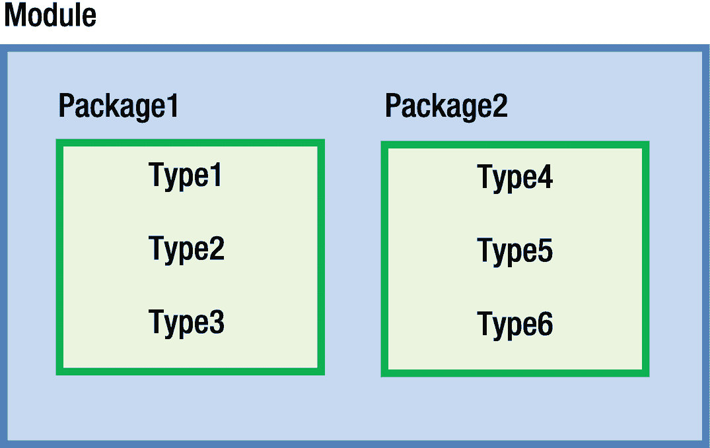

图 3-1

Java 程序的结构

Note

在 JDK 9 中引入了模块。直到 JDK 8，你有包和类型，但没有模块。除了包之外，模块是组织代码的可选方式。

纯 Java 程序是操作系统不可知的。你在所有操作系统上写同样的 Java 代码。操作系统使用不同的语法来引用文件和分隔文件路径。使用 Java 程序时，您必须引用文件和目录，并且需要使用适用于您的操作系统的语法。Windows 在文件路径中使用反斜杠(`\`)作为目录分隔符，例如`C:\javafun\src`，而类 UNIX 操作系统使用正斜杠(`/`)，例如`/home/ksharan/javafun`。Windows 使用分号(`;`)作为路径分隔符，例如`C:\java9\bin;C:\bj9r`，而类 UNIX 操作系统使用冒号(`:`)，例如`/home/ksharan/java9/bin:/home/ksharan/javafun`。我使用 Windows 来处理本书中的示例。我还解释了使用不同操作系统时存在的差异。

我们使用以下目录结构来处理本节中的示例:

*   `javafun`

*   `javafun\src`

*   `javafun\mod`

*   `javafun\lib`

我们将顶级目录命名为`javafun`，这是开始*Java*17*Fun*damentals 的简称。您可以在计算机上的任何其他目录中创建此目录。例如，您可以在 Windows 上将其命名为`C:\javafun`,在 UNIX 上命名为`/home/ksharan/javafun`。您将在`javafun\src`目录中存储源代码，在`javafun\mod`目录中存储编译后的代码，在`javafun\lib`目录中存储打包后的代码。继续在您的计算机上创建这些目录。在接下来的章节中，您需要用到它们。

## 写评论

注释是不可执行的代码，用于记录代码。Java 编译器会忽略它们。它们包含在源代码中，以记录程序的功能和逻辑。Java 支持三种类型的注释:

*   单行注释

*   多行 comment

*   文档注释或 Javadoc 注释

单行注释以两个正斜杠(`//`)开头，后跟文本，例如:

```java
// This is a single-line comment
package com.jdojo.intro; // This is also a single-line comment

```

单行注释可以从一行的任何位置开始。从两个正斜杠开始到行尾的部分被认为是注释。如前所述，您还可以混合 Java 源代码，例如，在一行中混合一个包声明和一个注释。注意，这种类型的注释不能插入到 Java 代码中间。下面详细讨论的包声明是不正确的，因为包名和分号也被认为是注释的一部分:

```java
package // An incorrect single-line comment com.jdojo.intro;

```

下面一行是单行注释。它有一个有效的包声明作为注释文本。

它将被视为注释，而不是包声明:

```java
// package com.jdojo.intro;

```

第二种类型的注释称为多行注释。多行注释可以跨越多行。它以紧跟其后的星号(`/*`)的正斜杠开始，以紧跟其后的星号(`*/`)结束。Java 源代码中多行注释的示例如下:

```java
/*
    This is a multi-line comment.
    It can span more than one line.
*/

```

该注释也可以使用两个单行注释来编写，如下所示:

```java
// This is a multi-line comment.
// It can span more than one line

```

您在源代码中使用的注释风格是您个人的选择。可以在 Java 代码中间插入一个多行注释，如下所示。编译器忽略从`/*`到`*/`的所有文本:

```java
package /* A correct comment */ com.jdojo.intro;

```

第三种类型的注释称为文档(或 Javadoc)注释，也是多行注释。它用于为 Java 程序生成文档。这种注释以紧跟其后的两个星号(`/**`)的正斜杠开始，以紧跟其后的一个星号(`*/`)结束。以下是文档注释的简单示例:

```java
/**
   This is a documentation comment. javadoc generates documentation from such comments.
*/

```

编写 Javadoc 注释是一个庞大的主题。附录 B 详细介绍了这一点。本书中的所有源代码都以单行注释开始，注释中包含包含源代码的文件的名称，例如:

```java
// Welcome.java

```

## 声明模块

模块充当包的容器。模块可以包含可以在模块内部使用或由其他模块使用的包。模块控制其包的可访问性。一个模块导出它的包供其他模块使用。如果一个模块需要使用另一个模块的包，第一个模块需要声明对第二个模块的依赖，第二个模块需要导出第一个模块使用的包。下面是声明模块的简化语法:

```java
module <module-name> {
    <module-statement-1>
    <module-statement-2>
}

```

模块的声明以关键字`module`开始，后面是模块名。在大括号内，放置模块声明的主体，它包含零个或多个模块语句。清单 [3-1](#PC14) 包含了一个名为`jdojo.intro`的模块的完整代码。

```java
// module-info.java
module jdojo.intro {
    // An empty module body
}

Listing 3-1The Declaration of a Module Named jdojo.intro

```

`jdojo.intro`模块不包含模块语句。也就是说，它不导出任何包供其他模块使用，也不依赖于任何其他模块。JDK 由几个模块组成；其中一个模块被命名为`java.base`。`java.base`模块被称为原始模块。它不依赖于其他模块，所有其他模块——内置的和用户定义的——都隐式依赖于它。

Tip

在 Java 中，三个术语“依赖于”、“读取”和“需要”可以互换使用，以表示一个模块对另一个模块的依赖性。如果模块`P`依赖于模块`Q`，也可以表述为“模块`P`读取模块`Q`或者“模块`P`需要模块【T5”)

模块的依赖关系是在模块体中用一个`requires`语句声明的。其最简单的语法如下:

```java
requires <module-name>;

```

您没有为`jdojo.intro`模块声明任何依赖关系。然而，由于 Java 中的每个模块都隐式地依赖于`java.base`模块，编译器会在你的`jdojo.intro`模块中添加对`java.base`模块的依赖。编译器修改的模块声明如清单 [3-2](#PC16) 所示。

```java
// module-info.java
module jdojo.intro {
    requires java.base;
}

Listing 3-2The Compiler-Modified Declaration of the jdojo.intro Module

```

如果你愿意，你可以在你的模块声明中包含一个`"requires java.base"`语句。

如果您不这样做，编译器总是会为您添加它。在本书中，我没有将它包含在模块声明中。

为什么每个模块都依赖于`java.base`模块？`java.base`模块包含几个 Java 包，它们是在所有 Java 程序中提供基本功能所必需的。例如，您想在控制台上打印一条消息，打印功能包含在名为`java.lang`的包中的`java.base`模块中。

通常，模块声明保存在模块源代码根目录下的一个`module-info.java`文件中。在`javafun\src`目录中创建一个名为`jdojo.intro`的子目录，在其中放置`jdojo.intro`模块的所有源代码。将清单 [3-1](#PC14) 中显示的代码保存在一个名为`javafun\src\jdojo.intro\module-info.java`的文件中。这就完成了您的模块声明。

是否必须将模块声明保存在与模块名同名的根目录下？不，这不是强制性的。您可以将`module-info.java`文件保存在`javafun\src`目录中，一切都会正常工作。将模块的所有源代码保存在以模块名称命名的目录中，可以使编译模块代码更加容易。JDK 还支持将模块的代码保存在不同的根目录下。

## 声明类型

一个包被分成几个编译单元。编译单元包含这些类型的源代码。在很大程度上，您可以将编译单元视为一个包含类和接口等类型的源代码的`.java`文件。当你编译一个 Java 程序时，你编译的是该程序包含的编译单元。通常，一个编译单元包含一种类型的声明。例如，您要声明一个名为`Welcome`的类，您将把`Welcome`类的源代码放在一个名为`Welcome.java`的编译单元(或文件)中。编译单元由三部分组成:

*   一包申报

*   零个或多个`import`声明

*   零个或多个类型声明:类、接口、枚举或批注声明

所有三个部分，如果存在，必须按上述顺序指定。图 [3-2](#Fig2) 显示了一个编译单元的三个部分，其中包含一个类型声明。类型是一个名为`Welcome`的类。后续部分详细描述了编译单元的每个部分。

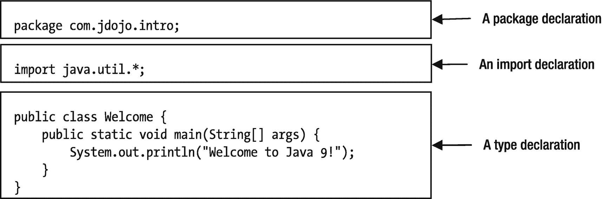

图 3-2

编译单元的组成部分

### 包装声明

包声明的一般语法如下:

```java
package <your-package-name>;

```

包声明以关键字`package`开始，后跟用户提供的包名。空白(空格、制表符、换行符、回车符和换页符)分隔关键字`package`和包名。分号(`;`)结束包声明。例如，下面是名为`com.jdojo.intro`的包的包声明:

```java
package com.jdojo.intro;

```

图 [3-3](#Fig3) 显示了包装声明的各个部分。

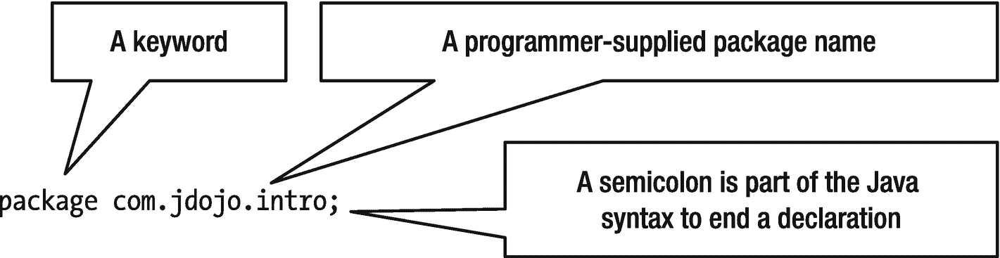

图 3-3

编译单元中的部分包声明

您提供包名。包名可以由一个或多个部分组成，用点(.).在这个例子中，包名由三部分组成:`com`、`jdojo`和`intro`。包名中的部分数量没有限制。在一个编译单元中，最多可以有一个包声明。编译单元中声明的所有类型都成为该包的成员。以下是有效包声明的一些示例:

```java
package intro;
package com.jdojo.intro.common;
package com.ksharan;
package com.jdojo.intro;

```

如何选择一个好的包名？保持包名的唯一性很重要，这样它们就不会与同一应用程序中使用的其他包名冲突。建议对包的开头部分使用反向域名符号，例如:`com.yahoo`代表 Yahoo, `com.google`代表 Google，等等。使用公司的反向域名作为包名的主要部分保证了包名不会与其他公司使用的包名冲突，只要它们遵循相同的准则。如果你没有域名，请创建一个唯一的域名。这只是一个指导方针。实际上，没有任何东西可以保证世界上所有 Java 程序都有一个唯一的包名。例如，我拥有一个名为`jdojo.com`的域名，我以`com.jdojo`开始我所有的包名，以保持它们的唯一性。在本书中，我以`com.jdojo`开始一个包名，后面跟着主题名。

为什么我们要使用包声明？包是类型的逻辑存储库。换句话说，它为相关类型提供了一个逻辑分组。包可以存储在特定于主机的文件系统或网络位置。在文件系统中，包名的每个部分表示主机系统上的一个目录。例如，包名`com.jdojo.intro`表示存在一个名为`com`的目录，该目录包含一个名为`jdojo`的子目录，该子目录包含一个名为`intro`的子目录。也就是说，包名`com.jdojo.intro`表明在 Windows 上存在一个`com\jdojo\intro`目录，在类 UNIX 操作系统上存在一个`com/jdojo/intro`目录。`intro`目录将包含为`com.jdojo.intro`包中的所有类型编译的 Java 代码。在主机系统上，用于分隔软件包名称中各部分的点被视为文件分隔符。注意，反斜杠(`\`)是 Windows 上的文件分隔符，正斜杠(`/`)用于类似 UNIX 的操作系统。

包名只指定编译后的 Java 程序(类文件)必须存在的部分目录结构。它没有指定类文件的完整路径。在这个例子中，包声明`com.jdojo.intro`没有指定`com`目录放在哪里。可以放在`C:\`目录或者`C:\myprograms`目录下，也可以放在文件系统中的任何其他目录下。仅仅知道包名不足以定位类文件，因为它只指定了类文件的部分路径。文件系统中类文件路径的前导部分是从 *modulepath* 中获取的，需要在编译运行 Java 程序时指定。在 JDK 9 之前，包中的类文件是使用类路径定位的，为了向后兼容，在 JDK 9–17 中仍然支持类路径。我们将在本章后面讨论这两种方法。

Java 源代码是区分大小写的。关键字`package`必须按原样书写——全部小写。单词`Package`或`packAge`不能代替关键词`package`。包名也区分大小写。在某些操作系统上，文件和目录的名称区分大小写。在这些系统上，包名区分大小写，正如您所看到的:包名被视为主机系统上的目录名。包名`com.jdojo.intro`和`Com.jdojo.intro`可能不一样，这取决于您正在使用的主机系统。建议使用全部小写的包名。

在 JDK 9 之前，编译单元中的包声明是可选的。如果一个编译单元不包含包声明，那么在该编译单元中声明的类型属于一个名为*未命名包*的包。JDK 9 不允许模块中有未命名的包。如果将类型放在模块中，编译单元必须包含一个包声明。

### 进口申报

编译单元中的导入声明是可选的。您甚至可以不使用一个导入声明就开发一个 Java 应用程序。为什么需要进口申报单？使用进口报关让您的生活更轻松。它节省了您的一些输入，并使您的代码更干净，更容易阅读。在导入声明中，您告诉 Java 编译器您可以使用特定包中的一个或多个类型。每当在编译单元中使用某个类型时，必须用它的完全限定名来引用它。使用类型的导入声明可以让您使用类型的简单名称来引用该类型。我将很快讨论简单的和完全限定的类型名。

与包声明不同，源代码中对导入声明的数量没有限制。以下是两项进口申报:

```java
import com.jdojo.intro.Account;
import com.jdojo.util.*;

```

我们将在本书的后面详细讨论导入声明。在本节中，我们只讨论进口申报单所有部分的含义。

进口申报以关键字`import`开始。进口申报的第二部分由两部分组成:

*   要在当前编译单元中使用类型的包名

*   类型名称或星号(`*`)表示您可以使用包中存储的一个或多个类型

最后，导入声明以分号结束。前两份进口申报说明如下:

*   我们可以使用来自`com.jdojo.intro`包的简单名称命名为`Account`的类型。

*   我们可以使用`com.jdojo.util`包中任何类型的简单名称。

如果您想使用来自`com.jdojo.common`包的名为`Person`的类，您需要在您的编译单元中包含以下两个导入声明之一:

```java
import com.jdojo.common.Person;

```

或者

```java
import com.jdojo.common.*;

```

以下导入声明不包括包`com`或`com.jdojo`中的类:

```java
import com.jdojo.intro.Account;
import com.jdojo.intro.*;

```

你可能认为像这样的进口申报单

```java
import com.*.*;

```

将允许您使用所有类型的简单名称，这些类型的包声明的第一部分是`com`。Java 不支持在导入声明中使用这种类型的通配符。您只能命名一个包中的一种类型(`com.jdojo.intro.Account`)或一个包中的所有类型(`com.jdojo.intro`)。*);导入类型的任何其他语法都是无效的。

编译单元中的第三部分包含类型声明，它可能包含零个或多个类型声明:类、接口、枚举和注释。根据 *Java 语言规范*，类型声明也是可选的。但是，如果您省略了这一部分，您的 Java 程序不会做任何事情。

要使 Java 程序有意义，必须在编译单元中至少包含一个类型声明。

我将把对接口、枚举和注释的讨论推迟到本书后面的章节。

让我们讨论如何在编译单元中声明一个类。

### 类别声明

最简单的形式是，类声明如下所示:

```java
class Welcome {
    // Code for the class body goes here
};

```

图 [3-4](#Fig4) 显示了这个类声明的一部分。

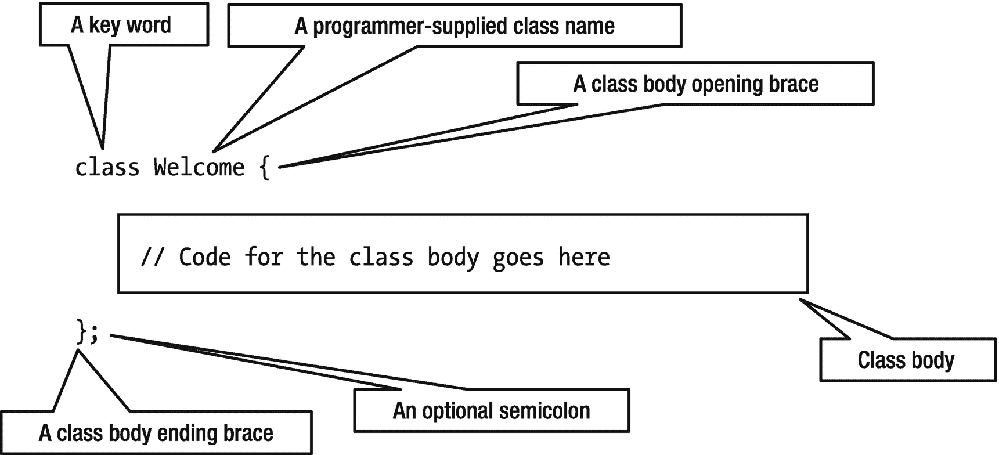

图 3-4

编译单元中类声明的一部分

使用关键字`class`声明一个类，关键字后面跟有类的名称。在这个例子中，类的名称是`Welcome`。

类的主体放在左大括号和右大括号之间。身体可能是空的。但是，您必须包括两个大括号来标记主体的开始和结束。

可选地，类声明可以以分号结束。本书不会使用可选的分号来结束类声明。

Java 程序中最简单的类声明可能如下所示:

```java
class Welcome { }

```

这一次，我将整个类声明放在一行中。您可以将关键字`class`、类名`Welcome`和两个大括号放在任何您想要的位置，除了您必须包括至少一个空白字符(空格、换行符、制表符等等。)在关键字`class`和类名`Welcome`之间。Java 允许你以自由格式的文本格式编写源代码。以下三个类声明都是相同的:

```java
// Class Declaration #1
class
Welcome { }
// Class Declaration #2
class
         Welcome {
}
// Class Declaration #3
class Welcome {
}

```

本书使用了如下的类声明格式:左大括号放在类名后面的同一行，右大括号放在单独的一行，与类声明第一行的第一个字符对齐，像这样:

```java
class Welcome {
}

```

类的主体由四部分组成。所有部分都是可选的，可以按任何顺序出现，并且可以分成多个部分:

*   字段声明

*   *初始化器*:静态初始化器和实例初始化器

*   构造器

*   方法声明

Java 对类体的四个部分的出现顺序没有任何限制。我从方法声明开始，在本章中只讨论简单的方法声明。我们将在后面的章节中讨论方法声明的高级方面和类体声明的其他部分。

让我们讨论如何在类中声明一个方法。您可能会猜测方法声明将以关键字`method`开始，因为包和类声明分别以关键字`package`和`class`开始。然而，方法声明不是以关键字`method`开始的。事实上，`method`在 Java 语言中并不是一个关键字。你用关键字`class`开始一个类声明，表明你将要声明一个类。但是，在方法声明的情况下，首先要指定的是方法将返回给调用者的值的类型。如果一个方法没有返回任何东西给它的调用者，你必须在方法声明的开始使用关键字`void`提到这个事实。方法的名称遵循方法的返回类型。方法名后跟一个左括号和一个右括号。像类一样，方法也有一个主体，用大括号括起来。Java 中最简单的方法声明如下所示:

```java
<method-return-type> <method-name> (<arguments-list>) {
    // Body of the method goes here
}

```

下面是方法声明的一个示例:

```java
void main() {
    // Empty body of the main method
}

```

这个方法声明包含四点:

*   该方法不返回任何东西，如关键字`void`所示。

*   方法的名字是`main`。

*   该方法不需要参数。

*   该方法不做任何事情，因为它的主体是空的。

方法的返回值是该方法返回给调用者的东西。该方法的调用方可能还希望向该方法传递一些值。如果一个方法需要它的调用者传递值给它，这个事实必须在方法的声明中指出。您希望将值传递给方法的事实是在方法名后面的括号中指定的。关于要传递给方法的值，您需要指定两件事:

*   要传递的值的类型。假设您想将一个整数(比如 10)传递给方法。您需要使用关键字`int`来表示这一点，该关键字用于表示一个整数值，如 10。

*   标识符，它将保存您传递给方法的值。标识符是用户定义的名称。它被称为参数名。

如果您想让`main`方法从它的调用者那里接受一个整数值，那么它的声明将变成如下:

```java
void main(int num) {
}

```

这里，`num`是一个标识符，它将保存传递给这个方法的值。除了`num`，您可以选择使用另一个标识符，例如`num1`、`num2`、`num3`、`myNumber`等。`main`方法的声明如下:

> *main 方法接受一个 int 类型的参数，它不向其调用者返回任何值。*

如果您想将两个整数传递给`main`方法，它的声明将更改如下:

```java
void main(int num1, int num2) {
}

```

从这个声明中可以清楚地看出，您需要用逗号(`,`)来分隔传递给方法的参数。如果你想给这个方法传递 50 个整数，你会怎么做？您将得到一个类似这样的方法声明:

```java
void main(int num1, int num2, ..., int num50) {
}

```

我只展示了三个参数声明。然而，当你写一个 Java 程序时，你将不得不键入所有的 50 个参数声明。让我们寻找一个更好的方法来给这个方法传递 50 个参数。在所有 50 个参数中有一个相似之处——它们都是同一类型，一个整数。任何值都不会包含像 20.11 或 45.09 这样的分数。所有参数之间的这种相似性允许您在 Java 语言中使用一种称为*数组*的神奇生物。使用数组向该方法传递 50 个整数参数需要什么？当你写作时

```java
int num

```

这意味着`num`是类型`int`的标识符，它可以保存一个整数值。如果你在 int 后面放两个魔法括号(`[])`,比如

```java
int[] num

```

这意味着`num`是一个`int`的数组，它可以保存任意多的整数值。`num`所能容纳的整数数量是有限制的。但是，这个限制非常高，我们在详细讨论数组时会讨论这个限制。存储在`num`中的值可以使用下标访问:`num[0]`、`num[1]`、`num[2]`等。请注意，在声明一个类型为`int`的数组时，您没有提到希望`num`表示 50 个整数的事实。您修改后的`main`方法声明可以接受 50 个整数，如下所示:

```java
void main(int[] num) {
}

```

你将如何声明让你传递 50 个人名字的`main`方法？由于`int`只能用于整数，所以您必须在 Java 语言中寻找其他表示文本的类型，因为人名将是文本，而不是整数。有一种类型`String`(注意`String`中的大写`S`)表示 Java 语言中的文本。因此，要向方法`main`传递 50 个名称，您可以如下更改其声明:

```java
void main(String[] name) {
}

```

在该声明中，您不必将参数名从`num`更改为`name`。您更改它只是为了使参数的含义清晰直观。现在让我们向`main`方法的主体添加一些 Java 代码，这将在控制台上打印一条消息:

```java
System.out.println("The message you want to print");

```

这不是讨论`System`、`out`和`println`的合适场合。现在，只需输入`System`(注意`System`中的大写`S`)、一个点、`out`、一个点和`println`，后跟两个括号，括号中包含您想要打印的信息，并加上双引号。您想要打印一条消息"`Welcome to Java 17!`"，那么您的`main`方法声明将如下所示:

```java
void main(String[] name) {
    System.out.println("Welcome to Java 17!");
}

```

这是一个有效的方法声明，它将在控制台上打印一条消息。下一步是编译包含`Welcome`类声明的源代码，并运行编译后的代码。当您运行一个类时，Java 运行时会在该类中寻找一个名为`main`的方法，该方法的声明必须如下所示，尽管`name`可以是任何标识符。

```java
public static void main(String[] name) {
}

```

除了`public`和`static`两个关键词，你应该能理解这个方法声明，声明:“`main`是一个方法，接受一个`String`的数组作为参数，不返回任何东西。”

现在，你可以把`public`和`static`看作是两个关键字，它们必须存在才能声明`main`方法。注意，Java 运行时还要求方法的名称是`main`。这就是我从一开始就选择`main`作为方法名称的原因。源代码的最终版本如清单 [3-3](#PC41) 所示。我做了两处改动:

*   我将`Welcome`类声明为 public。

*   我将主方法的参数命名为`args`。

将源代码保存在`javafun\src\jdojo.intro\com\jdojo\intro`目录下名为`Welcome.java`的文件中。

```java
// Welcome.java
package com.jdojo.intro;
public class Welcome {
    public static void main(String[] args) {
        System.out.println("Welcome to Java 17!");
    }
}

Listing 3-3The Source Code for the Welcome Class

```

Java 编译器对源代码的文件名施加了限制。如果已经在编译单元中声明了公共类型(例如，类或接口)，则编译单元的文件名必须与公共类型的名称相同。在这个例子中，您已经声明了`Welcome`类 public，这要求您将文件命名为`Welcome.java`。这也意味着不能在一个编译单元中声明多个公共类型。在一次编译中，最多可以有一个公共类型和任意数量的非公共类型。

此时，本示例的源目录和文件如下所示:

*   `javafun\src\jdojo.intro\module-info.java`

*   `javafun\src\jdojo.intro\com\jdojo\intro\Welcome.java`

### 类型有两个名称

Java 中的每个类(实际上是每个类型)都有两个名字:

*   简单的名字

*   完全限定的名称

类的简单名称是在类声明中出现在关键字`class`之后的名称。在这个例子中，`Welcome`是类的简单名称。一个类的完全限定名是它的包名后跟一个点和它的简单名。在本例中，`com.jdojo.intro.Welcome`是该类的完全限定名:

```java
Simple-Name = "Name appearing in the type declaration"
Fully-Qualified-Name = "package name" + "." + "Simple-Name"

```

您脑海中可能出现的下一个问题是，“没有包声明的类的完全限定名是什么？”答案很简单。在这种情况下，类的简单名称和完全限定名称是相同的。如果您从源代码中删除包声明，`Welcome`将是您的类的两个名称。

## 编译源代码

编译是将源代码翻译成一种叫做*字节码*的特殊二进制格式的过程。这是使用 JDK 附带的一个名为`javac`的程序(通常称为编译器)来完成的。编译 Java 源代码的过程如图 [3-5](#Fig5) 所示。

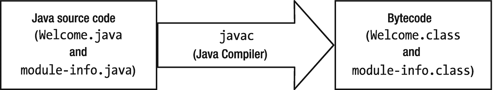

图 3-5

将 Java 源代码编译成字节码的过程

您提供源代码(在您的例子中是`Welcome.java`和`module-info.java`)作为 Java 编译器的输入，它生成两个扩展名为`.class`的文件。扩展名为`.class`的文件称为类文件。类文件是一种叫做字节码的特殊格式。字节码是 Java 虚拟机(JVM)的一种机器语言。我们将在本章的后面讨论 JVM 和字节码。

现在，我将介绍在 Windows 上编译源代码所需的步骤。对于其他平台，例如 UNIX 和 Mac OS X，您需要使用特定于这些平台的文件路径语法。我假设您已经在 Windows 上保存了两个源文件，如下所示:

*   `C:\javafun\src\jdojo.intro\module-info.java`

*   `C:\javafun\src\jdojo.intro\com\jdojo\intro\Welcome.java`

打开命令提示符，将当前目录更改为`C:\javafun`。提示符应该如下所示:

```java
C:\javafun>

```

使用`javac`命令的语法如下:

```java
javac -d <output-directory> <source-file1> <source-file2>...<source-fileN>

```

`-d`选项指定编译后的类文件将被放置的输出目录。您可以指定一个或多个源代码文件。如果没有指定`-d`选项，编译后的类文件将被放在与源文件相同的位置。

您的输出目录将是`javafun\mod\jdojo.intro`,因为您希望将所有的类文件放在这个目录中。您将指定两个源文件，分别是`module-info.java`和`Welcome.java`。以下命令将编译您的源代码。该命令是在一行中输入的，而不是如图所示的两行:

```java
C:\javafun>javac -d mod\jdojo.intro src\jdojo.intro\module-info.java src\jdojo.intro\com\jdojo\intro\Welcome.java

```

注意，该命令使用相对路径，如`mod`和`src`，它们相对于当前目录`C:\javafun`。如果愿意，可以使用绝对路径，比如`C:\javafun\mod\jdojo.intro`。

如果您没有收到错误消息，这意味着您的源文件编译成功，编译器生成了两个名为`module-info.class`和`Welcome.class`的文件，如下所示:

*   `C:\javafun\mod\jdojo.intro\module-info.class`

*   `C:\javafun\mod\jdojo.intro\com\jdojo\intro\Welcome.class`

注意，编译器通过创建一个目录层次结构来放置`Welcome.class`文件，该目录层次结构反映了`Welcome.java`文件中的包声明。回想一下，包名反映了目录层次结构。例如，名为`com.jdojo.intro`的包对应于名为`com\jdojo\intro`的目录。您已经通过创建镜像包名的目录层次结构放置了`Welcome.class`文件。Java 编译器足够聪明，可以读取包名，并在输出目录中创建一个目录层次结构来放置生成的类文件。

如果在编译源代码时出现任何错误，可能有以下三种原因之一:

*   您没有将`module-info.java`和`Welcome.java`文件保存在本节开头指定的目录中。

*   您的计算机上可能没有安装 JDK 17。

*   如果你已经安装了 JDK 17，你还没有将`JDK_HOME\bin`目录添加到`PATH`环境变量中，这里`JDK_HOME`指的是你在机器上安装 JDK 17 的目录。如果您在目录`C:\java17`中安装了 JDK 17，您需要将`C:\java17\bin`添加到您机器上的`PATH`环境变量中。

如果关于设置`PATH`环境变量的讨论没有帮助，您可以使用下面的命令。这个命令假设您已经在目录`C:\java17`中安装了 JDK:

```java
C:\javafun> C:\java17\bin\javac -d mod\jdojo.intro src\jdojo.intro\module-info.java src\jdojo.intro\com\jdojo\intro\Welcome.java

```

如果您在编译源代码时收到以下错误消息，这意味着您正在使用旧版本的 JDK，例如 JDK 8:

```java
src\jdojo.intro\module-info.java:1: error: class, interface, or enum expected
module jdojo.intro {

```

从 JDK 9 开始支持模块。在旧的 JDK 上编译`module-info.java`源文件会导致这个错误。修复方法是使用 JDK 17 的`javac`命令来编译你的源文件。

字节码文件(`.class`文件)的名称是`Welcome.class`。为什么编译器选择将类文件命名为`Welcome.class`？当您编写源代码并编译它时，您在三个地方使用了“欢迎”一词:

*   首先，您声明了一个名为`Welcome`的类。

*   其次，您将源代码保存在一个名为`Welcome.java`的文件中。

*   第三，将`Welcome.java`文件名作为输入传递给编译器。

你的三个步骤中的哪一个促使编译器将生成的字节码文件命名为`Welcome.class`？首先，这似乎是第三步，即将`Welcome.java`作为输入文件名传递给 Java 编译器。然而，猜测是错误的。这是第一步，在文件`Welcome.java`中声明一个名为`Welcome`的类，这促使编译器将输出的字节码文件命名为`Welcome.class`。您可以在一个编译单元中声明任意多个类。假设您在一个名为`Welcome.java`的编译单元中声明了两个类`Welcome`和`Bye`。编译器将选择什么文件名来命名输出类文件？编译器扫描整个编译单元。它为编译单元中声明的每个类(实际上是每个类型)创建一个类文件。如果`Welcome.java`文件有三个类——`Welcome`、`Thanks`和`Bye`——编译器将生成三个类文件——`Welcome.class`、`Thanks.class`和`Bye.class`。

要运行 Java 程序，您可以安排类文件:

*   在展开的目录中，正如您现在所看到的

*   在一个或多个 JAR 文件中

*   或者两者的组合——展开的目录和 JAR 文件

您现在可以使用`javafun\mod\jdojo.intro`目录中的类文件运行您的程序。我将暂时推迟运行它。首先，我们将在下一节向您展示如何将编译后的代码打包到一个 JAR 文件中。

## 打包编译后的代码

JDK 附带了一个名为`jar`的工具，用于将 Java 编译的代码打包到 JAR 文件中。JAR 文件格式使用 ZIP 格式。JAR 文件只是一个扩展名为`.jar`的 ZIP 文件，在它的`META-INF`目录中有一个`MANIFEST.MF`文件。`MANIFEST.MF`文件是一个文本文件，包含不同 Java 工具使用的 JAR 文件及其内容的信息。JDK 还包含以编程方式处理 JAR 文件的 API。在这一节中，我们简要说明如何使用`jar`工具创建一个 JAR 文件。使用`jar`命令的语法如下:

```java
jar [options] [-C <dir-to-change>] <file-list>

```

`--create`选项创建一个新的 JAR 文件。`--file`选项用于指定要创建的 JAR 文件的名称。`-C`选项用于指定一个目录，该目录将作为当前目录，该选项后指定的所有文件都将包含在 JAR 文件中。如果您想包含几个目录中的文件，您可以多次指定`-C`选项。

下面的命令在`C:\javafun\lib`目录中创建一个名为`com.jdojo.intro.jar`的 JAR 文件。在运行命令之前，确保`C:\javafun\lib`目录存在:

```java
C:\javafun>jar --create --file lib/com.jdojo.intro.jar -C mod/jdojo.intro .

```

这里

*   `--create`选项指定您想要创建一个新的 JAR 文件。

*   `--file lib/com.jdojo.intro.jar`选项指定新文件的路径和名称。注意，文件路径以`lib`开始，这是相对于`C:\javafun`目录的。您可以自由使用绝对路径，如`C:\javafun\lib\com.jdjo.intro.jar`。

*   `-C mod/jdojo.intro`选项指定`jar`命令应该切换到`mod/jdojo.intro`目录。

*   注意,`-C`选项后面是一个空格，然后是一个点，或者命令以一个点结束。点表示当前目录，这是用`-C`选项指定的目录。它要求切换到`mod/jdojo.intro`目录，并递归地包含该目录中的所有文件。

该命令创建以下文件:

```java
C:\javafun\lib\com.jdojo.intro.jar

```

您可以在`jar`命令中使用`--list`选项来列出 JAR 文件的内容。使用以下命令列出由前面的命令创建的`com.jdojo.intro.jar`文件的内容:

```java
C:\javafun>jar --list --file lib/com.jdojo.intro.jar
META-INF/
META-INF/MANIFEST.MF
module-info.class
com/
com/jdojo/
com/jdojo/intro/
com/jdojo/intro/Welcome.class

```

输出显示了 JAR 文件中的所有目录和文件。输入目录中没有名为`MANIFEST.MF`的文件。`jar`命令为您创建一个`MANIFEST.MF`文件。您还可以看到，JAR 文件的根目录包含了`module-info.class`文件，而`Welcome.class`文件被放在了一个目录中，该目录镜像了它被放在`mod\jdojo.intro`目录中的目录，而后者又镜像了在其包名中指定的目录层次结构。

如果一个 JAR 文件包含一个`module-info.class`文件，它也被称为模块描述符，这个文件被称为一个*模块化* JAR。否则，该文件就被简单地称为 JAR。在这个例子中，`com.jdojo.intro.jar`文件是一个模块化的 JAR。如果你把`module-info.class`文件移除，它就会变成一个罐子。

Tip

根目录中包含模块描述符(`module-info.class`)的 JAR 文件称为模块化 JAR。在 JDK 9 之前没有模块，所以没有模块化的罐子。

您可以使用`jar`工具来描述使用`--describe-module`选项的模块，并通过使用`--file`选项指定模块化 JAR。以下命令描述了打包在`com.jdojo.intro.jar`文件中的模块:

```java
C:\javafun>jar --describe-module --file lib/com.jdojo.intro.jar
jdojo.intro jar:file:///C:/javafun/lib/com.jdojo.intro.jar/!module-info.class
requires java.base mandated
contains com.jdojo.intro

```

考虑以下命令的输出:

*   第一行以模块名开始，是`jdojo.intro`。名称后面是模块描述的路径。该路径使用一个`jar`方案，并指向文件系统。

*   第二行提到一个`requires`语句，表明`jdojo.intro`模块需要`java.base`模块。回想一下，每个模块都隐式依赖于`java.base`模块。编译器为您添加了这个。最后一个词，`mandated`，表示对`java.base`模块的依赖是由 Java 模块系统规定的。

*   第三行表示`jdojo.intro`模块包含一个名为`com.jdojo.intro`的包。`contains`这个短语用来表示这个包在模块中，但是它没有被模块导出，所以其他模块不能使用这个包。对于每个导出的包，该命令将打印以下内容:

```java
exports <package-name>.

```

输出中的最后一行需要解释一下。图 [3-1](#Fig1) 显示一个模块包含一个或多个包。输出显示`jdojo.intro`模块包含一个`com.jdojo.intro`包。然而，您从未指定模块和包之间的链接——无论是在编写源代码时还是在编译或打包期间。那么模块如何知道它们包含的包呢？答案很简单。将`module-info.class`文件放在根目录下会使模块包含其下的所有包。在您的例子中，镜像`Welcome`类的`com.jdojo.intro`包的`com/jdojo/intro`目录位于模块 JAR 的根目录下。这就是它成为模块一部分的原因。

Tip

模块化 JAR 只包含一个模块的代码。根目录下的所有包都是该模块的一部分。

## 运行 Java 程序

Java 程序是由 JVM 运行的。使用名为`java`的命令调用 JVM，该命令位于`JDK_HOME\bin`目录中。`java`命令也被称为 Java 启动器。运行它的语法如下:

```java
java [options] --module <module-name>[/<main-class-name>] [arguments]

```

这里

*   `[options]`表示传递给`java`命令的零个或多个选项。

*   `--module`选项指定模块名和模块内的主类名。`<module-name>`是模块名，例如`jdojo.intro`,`<main-class-name>`是主类的*全限定名*，例如`com.jdojo.intro.Welcome`。当您在模块化 JAR 中打包一个模块时，您可以为该模块指定主类名，它存储在模块描述符——`module-info.class`文件中。在上一节创建`com.jdojo.intro.jar`模块化 JAR 时，您还没有指定主类名。通过`<main-class-name>`是可选的。如果没有指定，那么`java`命令将使用模块描述符中的主类名。该命令调用`<main-class-name>`的`main()`方法。

*   `[arguments]`是传递给主类的`main()`方法的以空格分隔的参数列表。注意，`[options]`被传递给`java`命令(或 JVM)，而`[arguments]`被传递给正在运行的主类的`main()`方法。`[arguments]`必须在`--module`选项后指定。

让我们尝试使用以下命令运行`Welcome`类:

```java
C:\javafun>java --module jdojo.intro/com.jdojo.intro.Welcome
Error occurred during initialization of boot layer
java.lang.module.FindException: Module jdojo.intro not found

```

哎呀！你弄错了。我们有意使用这个命令，以便您可以理解使用模块运行 Java 程序时发生的幕后过程。输出中有两条消息:

*   第一条消息指出，当 JVM 试图初始化引导层时发生了一个错误。

*   第二条消息声明 JVM 无法找到`jdojo.intro`模块。

在启动时，JVM 解析模块的依赖关系。如果启动时没有解析所有必需的模块，程序将无法启动。这是在 Java 9+中使用模块的一个重大改进，在 Java 9+中，所有依赖项都在启动时进行验证。否则，运行时会试图在程序需要依赖项(类型)时解析它们，而不是在启动时解析，这会导致许多运行时意外。

模块系统在一个阶段(编译时或运行时)可访问的所有模块称为*可观察模块*。模块解析从一组被称为*根模块*的初始模块开始，并遵循依赖链，直到到达`java.base`模块。分解模块的集合被称为*模块图*。在模块图中，每个模块都表示为一个节点。如果第一个模块依赖于第二个模块，则存在从一个模块到另一个模块的有向边。

图 [3-6](#Fig6) 显示了带有两个名为`A`和`B`的根模块的模块图。模块`A`依赖于模块`P`，模块`P`又依赖于`java.base`模块。模块`B`依赖于模块`Q`，模块`Q`又依赖于`java.base`模块。Java 运行时将只使用已解析的模块。也就是说，Java 运行时只知道模块图中的模块。


图 3-6

模块图

通常，您只有一个根模块。根模块的集合是如何确定的？当您从一个模块运行 Java 程序时，包含主类的模块是唯一的默认根模块。

Tip

如果您需要解析额外的模块，否则默认情况下不会被解析，您可以使用`--add-modules`命令行选项将它们添加到默认的根模块集中。我们将把添加根模块的讨论推迟到后面的章节，因为这是一个高级主题。

让我们回到解决我们的错误。前面的命令试图运行`jdojo.intro`模块中的`Welcome`类。因此，`jdojo.intro`模块是唯一的根模块。如果一切正常，JVM 应该已经创建了如图 [3-7](#Fig7) 所示的模块图。


图 3-7

运行 Welcome 类时在启动时创建的模块图

为了构建这个模块图，JVM 需要定位根模块`jdojo.intro`。JVM 将只在可观察模块集中寻找一个模块。错误中的第二行表示 JVM 找不到根模块`jdojo.intro`。要修复这个错误，你需要将`jdojo.intro`模块包含在可观察模块集中。您知道模块的代码存在于两个位置:

*   `javafun\mod\jdojo.intro directory`

*   `javafun\lib\com.jdojo.intro.jar file`

有两种类型的模块:JDK 附带的内置模块和您创建的用户定义模块。JVM 知道所有的内置模块，并将它们包含在可观察模块集中。您需要使用`--module-path`选项指定用户定义模块的位置。在 modulepath 上找到的模块将包含在可观察模块集中，它们将在模块解析过程中被解析。使用此选项的语法如下:

```java
--module-path <your-module-path>

```

`Module-path`是路径名的序列，其中路径名可以是目录、模块化 JAR 或 JMOD 文件的路径。路径可以是绝对的，也可以是相对的。我们将在本书的后面讨论 JMOD 文件。路径名由特定于平台的路径分隔符分隔，在类似 UNIX 的平台上是冒号(`:`)，在 Windows 上是分号(`;`)。以下是 Windows 上的有效模块路径:

*   `C:\javafun\lib`

*   `C:\javafun\lib;C:\javafun\mod\jdojo.contact\com.jdojo.contact.jar`

*   `C:\javafun\lib;C:\javafun\extlib`

第一个 modulepath 包含一个名为`C:\javafun\lib`的目录的路径。第二个包含到一个`C:\javafun\lib`目录和一个位于`C:\javafun\mod\jdojo.contact\com.jdojo.contact.jar`的模块化 JAR 的路径。第三个包含两个目录的路径— `C:\javafun\lib`和`C:\javafun\extlib`。在类似 UNIX 的平台上，这些模块路径的等效路径看起来类似于:

*   `/home/ksharan/javafun/lib`

*   `/home/ksharan/javafun/lib:/home/ksharan/javafun/mod/jdojo.contact/com.jdojo.contact.jar`

*   `/home/ksharan/javafun/lib:/home/ksharan/javafun/extlib`

JVM 如何使用 modulepath 找到模块？JVM 使用以下规则扫描 modulepaths 上存在的所有模块:

*   如果路径名是一个目录，那么将在三个地方扫描包含模块的`module-info.class`文件:目录本身、所有直接子目录和目录中所有模块化 jar 的根目录。如果在这些地方找到了一个`module-info.class`文件，那么这个模块就包含在可观察模块集中。请注意，子目录不会被递归扫描。

*   如果路径名是模块化 JAR 或 JMOD 文件，则模块化 JAR 或 JMOD 文件被认为包含模块，该模块被包括在可观察模块的集合中。

使用第一个规则，如果您将`N`模块化 jar 放在一个`C:\javafun\lib`目录中，那么在 modulepath 上指定这个目录将包含可观察模块集中的所有`N`模块。如果您在一个目录中有多个模块，但是您想在一组可观察的模块中只包含其中的几个，那么您可以使用第二种形式，即模块化 JAR 或 JMOD 文件的路径。

您已经将本例中名为`com.jdojo.intro.jar`的模块化 JAR 放到了`C:\javafun\lib`目录中。因此，指定`C:\javafun\lib`作为 modulepath 将使 JVM 能够找到`jdojo.intro`模块。让我们使用下面的命令来运行`Welcome`类:

```java
C:\javafun>java --module-path C:\javafun\lib --module jdojo.intro/com.jdojo.intro.Welcome
Welcome to Java 17!

```

该命令假设`C:\javafun`是当前目录。您可以在 modulepath 上使用相对路径，即`lib`而不是`C:\javafun\lib`，如下所示:

```java
C:\javafun>java --module-path lib --module jdojo.intro/com.jdojo.intro.Welcome
Welcome to Java 17!

```

这一次，JVM 能够找到`jdojo.intro`模块。它在包含`jdojo.intro`模块的`C:\javafun\lib`目录中找到了一个模块化 JAR 文件`com.jdojo.intro.jar`。

您将模块的编译类保存在`C:\javafun\mod\jdojo.intro`目录中。模块代码存在于该目录中展开的目录中。根目录包含了`module-info.class`文件。你也可以在一个模块中运行一个类，它的代码保存在一个展开的目录结构中，就像在`C:\javafun\mod\jdojo.intro`目录中的那个。下面的命令运行`jdojo.intro`模块中的`Welcome`类，该模块的代码在`C:\javafun\mod\jdojo.intro`目录中:

```java
C:\javafun>java --module-path C:\javafun\mod\jdojo.intro --module jdojo.intro/com.jdojo.intro.Welcome
Welcome to Java 17!

```

这一次，JVM 扫描了`C:\javafun\mod\jdojo.intro`目录，发现了一个包含`jdojo.intro`模块描述符的`module-info.class`文件。

您可以使用`C:\javafun\mod`目录作为 modulepath 的一部分来运行相同的命令，如下所示:

```java
C:\javafun>java --module-path C:\javafun\mod --module jdojo.intro/com.jdojo.intro.Welcome
Welcome to Java 17!

```

JVM 这次是怎么找到`jdojo.intro`模块的？回想一下在目录中查找模块描述符的规则。JVM 在`C:\javafun\mod`目录中寻找一个不存在的`module-info.class`文件。它在目录中寻找任何模块化 jar，但没有找到。现在它寻找`C:\javafun\mod`目录的直接子目录。它找到了一个名为`jdojo.intro`的子目录。它扫描了`jdojo.intro`子目录中的`module-info.class`文件，并找到了一个包含`jdojo.intro`模块的模块描述符的文件。这就是如何找到`jdojo.intro`模块的。

许多 GNU 风格的选项也有较短的名称。例如，您可以分别为`--module-path`和`–-module`选项使用较短的名称`-p`和`-m`。前面的命令也可以写成如下形式:

```java
C:\javafun>java -p C:\javafun\mod -m jdojo.intro/com.jdojo.intro.Welcome

```

解析模块不会加载该模块中的所有类。一次加载所有模块中的所有类是低效的。当程序中第一次引用类时，类被加载。JVM 只定位模块，并做一些内务处理以获得关于模块的更多信息。例如，它跟踪模块包含的所有包。JVM 是如何加载`Welcome`类的？JVM 使用了类的三条信息:模块路径、模块名和类的完全限定名。在运行`Welcome`类时，您指定了两条信息:

*   主模块名，即`jdojo.intro`。这使得 JVM 定位了这个模块，并且知道这个模块包含了`com.jdojo.intro`包。回想一下，一个包对应一个目录结构。在这种情况下，JVM 知道在模块内容、模块化 JAR 或包含模块描述符的目录中，存在一个包`com/jdojo/intro`，它保存了`com.jdojo.intro`包中的内容。

*   除了主模块，您还指定了主类的完全限定名，即`com.jdojo.intro.Welcome`。为了定位`Welcome`类，JVM 首先找到包含`com.jdojo.intro`包的模块。它找到`jdojo.intro`模块来包含这个包。它将包名转换成一个目录层次结构，在类名后面附加一个`.class`扩展名，并尝试在`com/jdojo/intro/Welcome.class`定位该类。

根据这两条规则，我们来定位`Welcome`类文件。如果你指定了`javafun\lib`目录作为模块路径，`com.jdojo.intro.jar`文件包含了`jdojo.intro`模块的内容，这个文件也包含了`com/jdojo/intro/Welcome.class`文件。这就是`Welcome`类文件的定位和加载方式。如果您将`javafun\mod`目录指定为 modulepath，则`javafun\mod\jdojo.intro`目录包含`jdojo.intro`模块的内容，并且该目录还包含`com/jdojo/intro/Welcome.class`文件。图 [3-8](#Fig8) 描述了需要加载`Welcome`类时寻找`Welcome.class`文件的过程。图中使用了`C:\javafun\mod\jdojo.intro`作为模块和 Windows 路径分隔符的位置，这是一个反斜杠。在类 UNIX 操作系统上，路径分隔符将是一个正斜杠。JAR 文件也使用正斜杠作为路径分隔符。

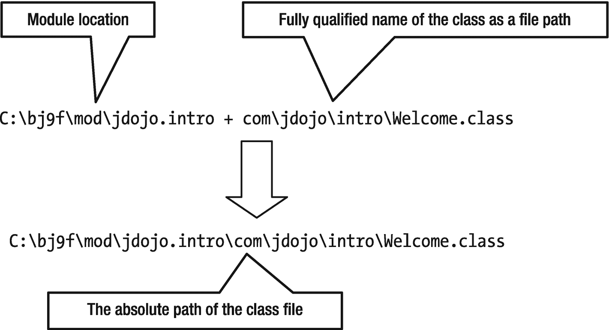

图 3-8

使用模块路径在模块中查找类文件的过程

这个例子很简单。它只涉及两个模块— `java.base`和`jdojo.intro`。如果您关注了讨论，您就会知道当您运行`Welcome`类时这些模块是如何被解析的。有几个命令行选项可以帮助您理解使用模块时幕后发生的事情。下一节将探讨这样的命令行选项。

## 使用模块选项

有一些命令行选项可以让您获得关于使用了哪些模块以及如何解析这些模块的更多信息。这些选项对于调试或减少已解析模块的数量非常有用。在这一节中，我将向您展示一些使用这些选项的例子。

### 列出可观察模块

使用带有`java`命令的`--list-modules`选项，您可以打印可观察模块的列表。该选项不接受任何参数。以下命令将打印可观察模块集中包含的所有平台模块的列表。该命令打印大约 100 个模块。显示了部分输出:

```java
C:\javafun>java --list-modules
java.activation@17
java.base@17
java.desktop@17
java.se@17
java.se.ee@17
...

```

在输出中，模块名后跟一个字符串`"@17"`。如果模块描述符包含模块版本，则版本显示在`@`符号之后。如果你使用的是 JDK 17 的最终版本，版本号将会是`"17"`。

要将您的模块包含在可观察模块集中，您需要指定放置模块的 modulepath。以下命令将把`jdojo.intro`模块包含在可观察模块集中。显示了部分输出:

```java
C:\javafun>java --module-path C:\javafun\lib --list-modules
java.activation@17
java.base@17
java.desktop@17
java.se@17
java.se.ee@17
...
jdojo.intro file:///C:/javafun/lib/com.jdojo.intro.jar

```

注意输出中的最后一项:

*   它没有打印`jdojo.intro`模块的模块版本。这是因为您在创建模块化 JAR`com.jdojo.intro.jar`时没有指定模块版本。我将在下一节向您展示如何指定模块的版本。

*   它打印出发现了`jdojo.intro`模块的模块化 JAR 的路径。当您的模块没有被正确解析时，这对于调试非常有帮助。

### 限制可观察模块

您可以使用`--limit-modules`减少可观察模块的数量。它接受逗号分隔的模块名称列表:

```java
--limit-modules <module-name>[,<module-name>...]

```

可观察的模块限于指定模块的列表以及它们递归依赖的模块，加上使用`--module`选项指定的主模块，加上使用`--add-modules`选项指定的任何模块。当您通过将 jar 放在类路径上以遗留模式运行 Java 程序时，此选项非常有用，在这种情况下，所有平台模块都包含在根模块集中。

让我们通过在运行`Welcome`类时使用它来看看这个选项的效果。`Welcome`类只使用了`java.base`模块。为了将可观察的模块限制在`java.base`和`jdojo.intro`模块，您可以将`java.base`指定为`--limit-modules`选项的值，如下所示:

```java
C:\javafun>java --module-path C:\javafun\lib --limit-modules java.base --module jdojo.intro/com.jdojo.intro.Welcome
Welcome to Java 17!

```

注意，尽管您只为`--limit-modulus`选项指定了`java.base`模块，但是`jdojo.intro`模块也包含在可观察模块中，因为它是您正在运行的主模块。

您可以使用`-verbose:module`选项打印加载的模块。下面的命令运行带有`--limit-module`选项的`Welcome`类，并且只加载两个模块:

```java
C:\javafun>java --module-path C:\javafun\lib --limit-modules java.base -verbose:module --module jdojo.intro/com.jdojo.intro.Welcome
[0.079s][info][module,load] java.base location: jrt:/java.base
[0.135s][info][module,load] jdojo.intro location: file:///C:/javafun/lib/com.jdojo.intro.jar
Welcome to Java 17!

```

以下命令运行不带`--limit-module`选项的`Welcome`类，并加载大约 40 个模块。显示了部分输出:

```java
C:\javafun>java --module-path C:\javafun\lib -verbose:module --module jdojo.intro/com.jdojo.intro.Welcome
[0.082s][info][module,load] java.base location: jrt:/java.base
[0.142s][info][module,load] jdk.naming.rmi location: jrt:/jdk.naming.rmi
[0.144s][info][module,load] jdk.scripting location: jrt:/jdk.scripting
[0.144s][info][module,load] java.logging location: jrt:/java.logging
[0.144s][info][module,load] jdojo.intro location: file:///C:/javafun/lib/com.jdojo.intro.jar
[0.156s][info][module,load] java.management location: jrt:/java.management
...
Welcome to Java 17!

```

### 描述模块

您可以使用带有`java`命令的`--describe-module`选项来描述一个模块。回想一下，您也可以使用这个选项和`jar`命令(参见“打包编译后的代码”一节中的例子)来描述模块化 JAR 中的模块。请确保在描述模块时指定模块路径。要描述平台模块，您不需要指定 modulepath。以下命令显示了几个示例:

```java
C:\javafun>java --module-path C:\javafun\lib --describe-module jdojo.intro
jdojo.intro file:///C:/javafun/lib/com.jdojo.intro.jar
requires java.base mandated
contains com.jdojo.intro
C:\javafun>java --describe-module java.sql
java.sql@17
exports java.sql
exports javax.sql
requires java.logging transitive
requires java.xml transitive
requires java.base mandated
requires java.transaction.xa transitive
uses java.sql.Driver

```

### 打印模块分辨率详细信息

使用带有`java`命令的`--show-module-resolution`选项，您可以打印启动时发生的模块解析过程的细节。当运行`Welcome`类时，下面的命令使用这个选项。显示了部分输出:

```java
C:\javafun>java --module-path C:\javafun\lib --show-module-resolution --module jdojo.intro/com.jdojo.intro.Welcome

root jdojo.intro file:///C:/javafun/lib/com.jdojo.intro.jar
java.base binds jdk.zipfs jrt:/jdk.zipfs
java.base binds jdk.jdeps jrt:/jdk.jdeps
java.base binds java.desktop jrt:/java.desktop
java.desktop requires java.xml jrt:/java.xml
java.desktop requires java.datatransfer jrt:/java.datatransfer
java.desktop requires java.prefs jrt:/java.prefs
...
Welcome to Java 17!

```

输出中的第一行显示了被解析的根模块以及根模块的位置。`java.base`模块不需要任何其他模块。然而，它使用许多服务提供商，如果他们存在的话。输出中的`"java.base binds ..."`文本表明`java.base`模块使用的服务提供者存在于可观察模块集中，并且它们被解析。服务提供者模块可能需要其他模块，这也将被解决。`java.desktop`模块的分辨率就是这样一种情况。`java.desktop`模块被解析是因为它提供了`java.base`模块使用的服务，该服务触发了`java.xml`、`java.datatransfer`和`java.prefs`模块的解析，因为`java.desktop`模块需要这三个模块。

Tip

即使您的程序只使用了不需要任何其他模块的`java.base`模块，其他平台模块也会被解析，因为它们提供了由`java.base`模块使用的服务。将平台模块限制为`java.base`模块的最佳方式是使用`--limit-modules`选项，并将`java.base`作为其值。

### 模拟运行您的程序

您可以使用`--dry-run`选项来模拟运行一个类。它创建 JVM 并加载主类，但不执行主类的`main()`方法。此选项对于验证模块配置和调试非常有用。以下命令显示了它的用法。输出不包含欢迎消息，因为没有执行`Welcome`类的`main()`方法。显示了部分输出:

```java
C:\javafun>java --module-path C:\javafun\lib --dry-run --show-module-resolution --module jdojo.intro/com.jdojo.intro.Welcome
root jdojo.intro file:///C:/javafun/lib/com.jdojo.intro.jar
java.base binds jdk.zipfs jrt:/jdk.zipfs
java.base binds java.logging jrt:/java.logging
java.base binds jdk.localedata jrt:/jdk.localedata
...

```

## 增强模块描述符

你在一个`module-info.java`文件中声明一个模块。模块声明被编译成一个名为`module-info.class`的类文件。模块的设计者可以使用 XML 或 JSON 格式来声明模块。他们为什么选择类文件格式来存储模块声明？这有几个原因:

*   Java 社区已经熟知了类文件格式。

*   类文件格式是可扩展的。也就是说，工具可以在编译后扩充`module-info.class`文件。

*   JDK 已经支持一个名为`package-info.java`的类似文件，它被编译成一个`package-info`。用于存储包信息的类文件。

`jar`工具包含几个选项来扩充模块描述符，其中两个是模块版本和主类名。不能在其声明中指定模块的版本。JDK 9 的设计者在其声明中避免处理模块的版本，声明管理模块的版本是诸如 Maven 或 Gradle 等构建工具的工作，而不是模块系统提供者的工作。鉴于模块描述符的可扩展特性，您可以将模块的版本作为类文件的属性存储在`module-info.class`文件中。作为开发人员，添加类文件属性并不容易。您可以使用`jar`工具的`--module-version`选项将模块版本添加到`module-info.class`文件中。您已经创建了一个`com.jdojo.intro.jar`文件，它包含了`jdojo.intro`模块的模块描述符。让我们重新运行描述现有`com.jdojo.intro.jar`文件中的`jdojo.intro`模块的命令，如下所示:

```java
C:\javafun>jar --describe-module --file lib/com.jdojo.intro.jar
jdojo.intro jar:file:///C:/javafun/lib/com.jdojo.intro.jar/!module-info.class
requires java.base mandated
contains com.jdojo.intro

```

输出中没有模块版本。以下命令通过将模块版本指定为 1.0 来重新创建`com.jdojo.intro.jar`文件:

```java
C:\javafun>jar --create --module-version 1.0 --file lib/com.jdojo.intro.jar -C mod/jdojo.intro.

```

Tip

通常，您应该将模块版本附加到模块 JAR 名称后面。在前面的例子中，您应该将文件命名为`com.jdojo.intro-1.0.jar`，这样它的所有者就会知道这个模块化 JAR 中存储的是什么版本的模块。我选择了相同的名称(`com.jdojo.intro.jar`)来简化这个例子。

以下命令重新描述模块，输出显示模块名称及其版本。如果有版本，模块名以`<module-name>@<module-version>`的形式打印出来:

```java
C:\javafun>jar --describe-module --file lib/com.jdojo.intro.jar
jdojo.intro@1.0 jar:file:///C:/javafun/lib/com.jdojo.intro.jar/!module-info.class
requires java.base mandated
contains com.jdojo.intro

```

在一个典型的应用程序中，您将有一个主模块，它是一个包含主类的模块。您可以将主类的名称存储在模块描述符中。当您创建或更新模块化 JAR 时，您所需要做的就是使用带有`jar`工具的`--main-class`选项。主类名是包含您想用作应用程序入口点的`main()`方法的类的完全限定名。以下命令更新现有的模块化 JAR 以添加主类名:

```java
C:\javafun>jar --update --main-class com.jdojo.intro.Welcome --file lib\com.jdojo.intro.jar

```

以下命令使用模块版本和主类名重新创建模块化 JAR:

```java
C:\javafun>jar --create --module-version 1.0 --main-class com.jdojo.intro.Welcome --file lib/com.jdojo.intro.jar -C mod/jdojo.intro .

```

模块描述符中的模块版本和主类怎么处理？模块版本旨在供 Maven 和 Gradle 等构建工具使用。当模块存在多个版本时，您需要在应用程序中包含模块的正确版本。如果您的模块描述符包含一个主类属性，您可以使用模块的名称来运行应用程序。JVM 将从模块描述符中读取主类名。现在，`jdojo.intro`模块的模块描述符包含了主类名。以下命令将运行`Welcome`类:

```java
C:\javafun>java --module-path C:\javafun\lib --module jdojo.intro
Welcome to Java 17!

```

## 在传统模式下运行 Java 程序

模块系统是在 JDK 9。以前 Java 程序是如何编写、编译、打包、运行的？把模块系统拿出来，你会发现以前 Java 程序几乎都是这么写的。然而，运行它们的机制是不同的。你在这一章中编写的`Welcome`类也将在 JDK 8 中编译和运行。除了少数例外，Java 一直是向后兼容的。你在 JDK 8 中编写的程序也可以在 JDK 17 中运行。

在 JDK 9 之前，类总是使用类路径定位。类路径是一系列目录、JAR 文件和 ZIP 文件。类路径中的每个条目由特定于平台的路径分隔符分隔，在 Windows 上是分号(`;`)，在类似 UNIX 的操作系统上是冒号(`:`)。如果比较类路径和模块路径的定义，它们看起来是一样的。它们之间的区别在于类路径用于定位类(更具体地说是类型)，而模块路径用于定位模块。

Tip

您将会遇到两个术语，“加载类”和“加载模块”当加载一个类时，从模块路径或类路径中读取它的类文件，该类在运行时表示为一个对象。当一个模块被加载时，模块描述符(`module-info.class`文件)和其他一些内务处理一起被读取；该模块在运行时表示为一个对象。加载一个模块并不意味着加载该模块中的所有类，这将是非常低效的。模块中的类在运行时第一次被程序引用时被加载。

JDK 17 允许你只使用模块路径，只使用类路径，或者两者结合使用。仅使用 modulepath 意味着您的程序仅由模块组成。只使用类路径意味着你的程序不包含模块。使用两者的组合意味着你的程序的一部分由一些模块组成，而另一部分没有。JDK 9 模块化的 JDK 代码。例如，无论您是否从一个模块运行程序，总是使用`java.base`模块。Java 支持三种模式:

*   模块模式

*   传统模式

*   混合模式

在你的程序中只使用模块被称为*模块模式*，并且只使用模块路径。仅使用类路径被称为*遗留模式*，并且仅使用类路径。使用两者的组合被称为*混合模式*。JDK 9+支持这些向后兼容的模式。例如，您应该能够在 JDK 17 中使用遗留模式“按原样”运行您的 JDK 8 程序，在该模式下，您将把所有现有的 jar 放在类路径中。如果您正在使用模块开发一个新的 Java 应用程序，但是仍然有一些来自 JDK 8 的 jar，那么您可以使用混合模式，将您的模块化 jar 放在 modulepath 上，将现有的 jar 放在类路径上。

可以使用三个同义选项来指定一个类:`--class-path`、`-classpath`和`-cp`。第一个选项是在 JDK 9 中添加的，另外两个选项以前就有了。在传统模式下运行 Java 程序的一般语法如下:

```java
java [options] <main-class-name> [arguments]

```

这里，`[options]`和`[arguments]`与上一节“运行 Java 程序”中讨论的含义相同由于在遗留模式中没有用户定义的模块，您只需简单地指定您想要运行的主类的完全限定名为`<main-class-name>`。因为必须在模块模式下指定 modulepath，所以必须在遗留模式下指定 class-path。

以下命令在传统模式下运行`Welcome`类。您不需要重新编译`Welcome`类。您可以保留或删除`module-info.class`文件，因为它不会在传统模式下使用:

```java
C:\javafun>java --class-path C:\javafun\mod\jdojo.intro com.jdojo.intro.Welcome
Welcome to Java 17!

```

JVM 使用以下步骤来运行`Welcome`类:

*   它检测到您正试图运行`com.jdojo.intro.Welcome`类。

*   它将主类名转换成文件路径`com\jdojo\intro\Welcome.class`。

*   它获取类路径中的第一个条目，并查找在上一步中计算的`Welcome.class`文件的路径是否存在。类路径中只有一个条目，它使用那个条目找到了`Welcome.class`文件。JVM 尝试使用类路径中的所有条目来查找类文件，直到找到该类文件。如果没有找到使用所有条目的类文件，它抛出一个`ClassNotFoundException`。

类路径和模块路径的工作方式有一些不同。类路径中的条目“按原样”使用也就是说，如果在类路径上指定一个目录路径，该目录路径将被附加到类文件路径的前面，以便查找类文件。与之相比，modulepath 包含一个目录路径，在该路径中搜索目录本身、目录中的所有模块化 jar 以及所有直接子目录，以查找模块描述符。使用这个规则，如果您想从 JAR 文件中以遗留模式运行`Welcome`类，您需要在类路径上指定 JAR 的完整路径。

以下命令无法找到`Welcome`类，因为在`C:\javafun\mod`或`C:\javafun\lib`目录中没有找到`com\jdojo\intro\Welcome.class`文件:

```java
C:\javafun>java --class-path C:\javafun\mod com.jdojo.intro.Welcome
Error: Could not find or load main class com.jdojo.intro.Welcome
Caused by: java.lang.ClassNotFoundException: com.jdojo.intro.Welcome
C:\javafun>java --class-path C:\javafun\lib com.jdojo.intro.Welcome
Error: Could not find or load main class com.jdojo.intro.Welcome
Caused by: java.lang.ClassNotFoundException: com.jdojo.intro.Welcome

```

以下命令找到了`Welcome`类，因为您在类路径中指定了 JAR 路径:

```java
C:\javafun>java --class-path C:\javafun\lib\com.jdojo.intro.jar com.jdojo.intro.Welcome
Welcome to Java 17!

```

拥有多个 jar 是典型的非平凡 Java 应用程序。将所有 jar 的完整路径添加到类路径中非常不方便。为了支持这个用例，class-path 语法支持在条目中使用星号(`*`)作为最后一个字符，这扩展到该条目所代表的目录中的所有 JAR 和 ZIP 文件。假设您有一个名为`cdir`的目录，其中包含两个 jar—`x.jar`和`y.jar`。要在类路径中包含这两个 jar，您可以在 Windows 中使用以下路径序列之一:

*   `cdir\x.jar;cdir\y.jar`

*   `cdir\*`

第二种情况下的星号将被扩展为`cdir`目录中每个 JAR/ZIP 文件一个条目。这种扩展发生在 JVM 启动之前。以下命令显示了如何在类路径中使用星号:

```java
C:\javafun>java -cp C:\javafun\lib\* com.jdojo.intro.Welcome
Welcome to Java 17!

```

您必须在类路径条目的末尾使用星号或单独使用星号。如果单独使用星号，星号将被扩展为包括当前目录中的所有 JAR/ZIP 文件。以下命令使用`C:\javafun\lib`目录作为当前目录，并使用星号作为运行`Welcome`类的类路径:

```java
C:\javafun\lib>java -cp * com.jdojo.intro.Welcome
Welcome to Java 17!

```

在混合模式下，可以像这样同时使用 modulepath 和 class-path:

```java
java --module-path <module-path> --class-path <class-path> <other-arguments>

```

可能会有这样的情况，您可能有重复的类——一个副本在模块路径上，另一个副本在类路径上。在这种情况下，使用 modulepath 上的版本，实际上忽略了类路径副本。如果类路径中存在重复的类，则使用在类路径中最先找到的类。模块之间不允许有重复的包和重复的类。也就是说，如果您有一个名为`com.jdojo.intro`的包，那么这个包中的所有类都必须通过一个模块可用。否则，您的应用程序将无法编译/运行。

如果 Java 只处理模块，那么从类路径加载的非模块类型是如何使用的？类型是由类装入器装入的。每个类装入器都有一个名为*的未命名的*模块。从类路径加载的所有类型都成为其类加载器的未命名模块的成员。从 modulepath 加载的所有模块都是声明它们的模块的成员。我们将在后面的章节中重新讨论未命名的模块。

## 模块路径上的重复模块

有时，在 modulepath 上可能有相同模块的多个版本。模块系统如何从模块路径中选择使用哪个模块副本？在 modulepath 中有两个同名的模块总是错误的。模块系统以有限的方式防止你犯这样的错误。

让我们从一个例子开始，来理解解决重复模块的规则。您有两个版本的`jdojo.intro`模块——一个在`C:\javafun\lib`目录下的`com.jdojo.intro.jar`文件中，另一个在`C:\javafun\mod\jdojo.intro`目录下。运行`Welcome`类并在 modulepath 中包含这两个目录:

```java
C:\javafun>java --module-path C:\javafun\lib;C:\javafun\mod\jdojo.intro --module jdojo.intro/com.jdojo.intro.Welcome
Welcome to Java 17!

```

您可能已经预料到这个命令会失败，因为运行一个程序时，运行时系统可以访问同一个模块的两个版本是没有意义的。此命令使用了模块的哪个副本？很难通过查看输出来判断，因为模块的两个副本包含相同的代码。您可以使用`--show-module-resolution`选项查看模块加载的位置。下面的命令可以做到这一点。显示了部分输出:

```java
C:\javafun>java --module-path C:\javafun\lib;C:\javafun\mod\jdojo.intro --show-module-resolution --module jdojo.intro/com.jdojo.intro.Welcome
root jdojo.intro file:///C:/javafun/lib/com.jdojo.intro.jar
...
Welcome to Java 17!

```

输出表明`jdojo.intro`模块，在本例中是根模块，是从`C:\javafun\lib`目录中的模块化 JAR `com.jdojo.intro.jar`中加载的。让我们交换 modulepath 中条目的顺序，然后重新运行命令:

```java
C:\javafun>java --module-path C:\javafun\mod\jdojo.intro;C:\javafun\lib --show-module-resolution --module jdojo.intro/com.jdojo.intro.Welcome
root jdojo.intro file:///C:/javafun/mod/jdojo.intro/
...
Welcome to Java 17!

```

这一次，输出表明从`C:\javafun\mod\jdojo.intro`目录加载了`jdojo.intro`模块。规则如下:

> *如果通过 modulepath 中的不同条目可以访问一个模块的多个同名副本，则使用 modulepath 中最先找到的模块副本。*

使用这个规则，当在 modulepath 中首先列出了`lib`目录时，从`lib`目录中使用`jdojo.intro`模块，并忽略`mod\jdojo.intro`目录中的模块副本。当您颠倒了 modulepath 中这些条目的顺序时，就使用了`mod\jdojo.intro`目录中的模块。

注意规则中 modulepath" 短语中的不同条目可以访问的*。只要一个模块的多个副本存在于不同的 modulepath 条目中，这个规则就适用。但是，如果通过 modulepath 中的同一条目可以访问一个模块的多个副本，则会发生错误。你怎么会陷入这种境地？以下是一些可能性:*

*   多个具有不同文件名的模块化 jar，但是具有相同名称的模块代码，可能存在于同一个目录中。如果这样的目录是 modulepath 中的一个条目，则可以通过这个单一的 modulepath 条目来访问一个模块的多个副本。

*   当一个目录被用作 modulepath 条目时，该目录中的所有模块化 jar 和所有包含模块描述符的直接子目录都通过该 modulepath 条目来定位模块。这为通过单个 modulepath 条目访问多个同名模块提供了可能性。

在我们的例子中，`jdojo.intro`模块的两个副本不能通过单个 modulepath 条目访问。让我们使用以下步骤来模拟错误:

*   创建一个名为`C:\javafun\temp`的目录。

*   将`C:\lib\com.jdojo.intro.jar`文件复制到`C:\javafun\temp`目录。

*   将`C:\mod\jdojo.intro`目录复制到`C:\javafun\temp`目录。

此时，您拥有以下文件:

*   `C:\javafun\temp\com.jdojo.intro.jar`

*   `C:\javafun\temp\jdojo.intro\module-info.class`

*   `C:\javafun\temp\jdojo.intro\com\jdojo\intro\Welcome.class`

如果在 modulepath 中包含了`C:\javafun\temp`目录，那么就可以访问`jdojo.intro`模块的两个副本——一个在模块 JAR 中，一个在子目录中。以下命令失败，并显示一条指明问题的明确消息:

```java
C:\javafun>java --module-path C:\lib;C:\javafun\temp --module jdojo.intro/com.jdojo.intro.Welcome
Error occurred during initialization of boot layer
java.lang.module.FindException: Error reading module: C:\lib\com.jdojo.intro-1.0.jar
Caused by: java.lang.module.InvalidModuleDescriptorException: this_class should be module-info

```

下面的命令将`C:\javafun\lib`目录作为 modulepath 中的第一个条目，在这里只能找到模块的一个副本。它将`C:\javafun\temp`目录作为 modulepath 中的第二个条目。您仍然会得到相同的错误:

```java
C:\javafun>java --module-path C:\javafun\lib;C:\javafun\temp --module jdojo.intro/com.jdojo.intro.Welcome
Error occurred during initialization of boot layer
java.lang.module.FindException: Two versions of module jdojo.intro found in C:\javafun\temp (jdojo.intro and com.jdojo.intro.jar)

```

## 命令行选项的语法

JDK 17 支持两种指定命令行选项的方式:

*   UNIX 风格

*   GNU 风格

UNIX 样式的选项以连字符(`-`)开头，后跟作为一个单词的选项名，例如`-p`、`-m`和`-cp`。GNU 风格的选项以两个连字符(`--`)开头，后跟选项名，其中选项名中的每个单词都用连字符连接，例如`--module-path`、`--module`和`--class-path`。

JDK 的设计者已经没有对开发者有意义的选项的简称了。因此，JDK(版本 9)开始使用 GNU 风格的选项。大多数选项在两种风格中都可用。如果可能的话，我们鼓励您使用 GNU 风格的选项，因为它们更容易记忆，对读者来说更直观。

Tip

要打印 JDK 工具支持的所有标准选项的列表，使用`--help`或`-h`选项运行工具，对于所有非标准选项，使用`--help-extra`或`-X`选项运行工具。例如，`java --help`和`java --help-extra`命令分别打印`java`命令的标准和非标准选项列表。

选项可以将一个值作为其参数。选项的值跟在选项名称后面。选项名称和值必须由一个或多个空格分隔。以下示例显示了如何使用两个选项通过`java`命令指定 modulepath:

```java
// Using the UNIX-style option
C:\javafun>java -p C:\applib;C:\extlib <other-args-go-here>
// Using the GNU-style option
C:\javafun>java --module-path C:\applib;C:\lib <other-args-go-here>

```

当您使用 GNU 风格的选项时，您可以用以下两种形式之一指定该选项的值:

*   `--<name> <value>`

*   `--<name>=<value>`

前面的命令也可以写成如下形式:

```java
// Using the GNU-style option
C:\>java -–module-path=C:\applib;C:\lib <other-args-go-here>

```

当使用空格作为`name-value`分隔符时，至少需要使用一个空格。当使用`=`作为`name-value`分隔符时，不得在其周围包含任何空格。这个选项

```java
 --module-path=C:\applib

```

是有效的，而此选项

```java
 --module-path =C:\applib

```

无效，因为`" =C:\applib"`将被解释为无效路径 modulepath。

## 使用 NetBeans IDE 编写 Java 程序

您可以使用 NetBeans IDE 来编写、编译和运行 Java 程序。在本节中，我们将引导您完成使用 NetBeans 的步骤。首先，您将学习如何创建一个新的 Java 项目，编写一个简单的 Java 程序，编译并运行它。最后，您将了解如何打开本书的 NetBeans 项目并使用本书提供的源代码。关于如何下载、安装和配置 NetBeans IDE，请参考第 [2](02.html) 章。

Note

在撰写本文时，NetBeans IDE 12.5 尚未发布。它将与 JDK 17 一起发布。当您阅读本章时，最终发布版本 12.5 应该已经发布。在本节中，我们使用 NetBeans 12.5 测试版的夜间版本。

### 创建 Java 项目

当您启动 NetBeans IDE 时，会显示启动页面，如图 [3-9](#Fig9) 所示。启动页面包含对开发人员有用的链接，如 Java、JavaFX、C++等教程的链接。如果不希望每次启动 IDE 时都显示启动页面，则需要取消选中启动页面右上角的“启动时显示”复选框。您可以通过点击起始页选项卡中显示的`X`图标来关闭起始页。使用帮助➤起始页可以随时打开起始页。


图 3-9

带有启动页面的 NetBeans IDE

要创建新的 Java 项目，请遵循以下步骤:


图 3-10

新项目对话框

1.  选择文件➤新建项目或按 Ctrl+Shift+N，弹出新建项目对话框，如图 [3-10](#Fig10) 所示。

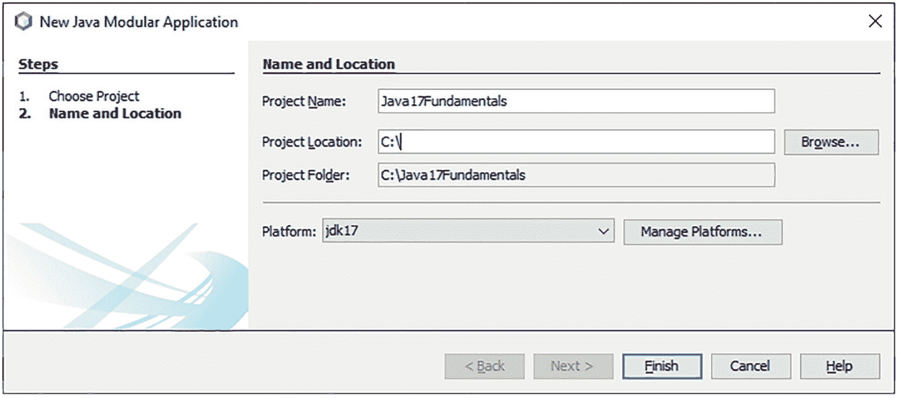

图 3-11

“新建 Java 模块化应用程序”对话框

1.  在“新建项目”对话框的“类别”列表中，选择“Java with Ant”。在“项目”列表中，可以选择“Java 应用程序”、“Java 类库”或“Java 模块化项目”。当您选择一个类别时，其描述会显示在底部。在前两个类别中，您只能拥有一个 Java 模块，而第三个类别允许您拥有多个 Java 模块。选择 Java 模块化项目选项，然后单击下一个➤按钮。显示如图 [3-11](#Fig11) 所示的新建 Java 模块化应用程序对话框。


图 3-12

带有 Java17Fundamentals Java 项目的 NetBeans IDE

1.  在新建 Java 模块化应用程序对话框中，输入`Java17Fundamentals`作为项目名称。在“项目位置”字段中，输入或浏览到要保存项目文件的位置。我输入`C:\`作为项目地点。NetBeans 将创建一个`C:\Java17Fundamentals`目录，用于存储`Java17Fundamentals`项目的所有文件。从平台下拉列表中选择 JDK 17 作为 Java 平台。如果没有 JDK 17 版可供选择，请单击管理平台...按钮并创建一个新的 Java 平台。创建一个新的 Java 平台只是在文件系统中添加一个存储 JDK 的位置，并给这个位置命名。完成后，单击“完成”按钮。新的`Java17Fundamentals`项目显示在 IDE 中，如图 [3-12](#Fig12) 所示。

在左上角，您可以看到三个选项卡:项目、文件和服务。“项目”选项卡显示所有与项目相关的文件。“文件”选项卡允许您查看计算机上的所有系统文件。“服务”选项卡允许您使用数据库和 web 服务器等服务。如果关闭这些选项卡，可以使用“窗口”菜单下与这些选项卡同名的子菜单重新打开它们。

至此，您已经创建了一个不包含任何模块的模块化 Java 应用程序项目。您需要向项目中添加模块。要新建模块，在项目页签中选择项目名称`Java17Fundamentals`，右键选择新建➤模块，如图 [3-13](#Fig13) 所示。显示新模块对话框，如图 [3-14](#Fig14) 所示。输入`jdojo.intro`作为模块名，并点击 Finish 按钮。

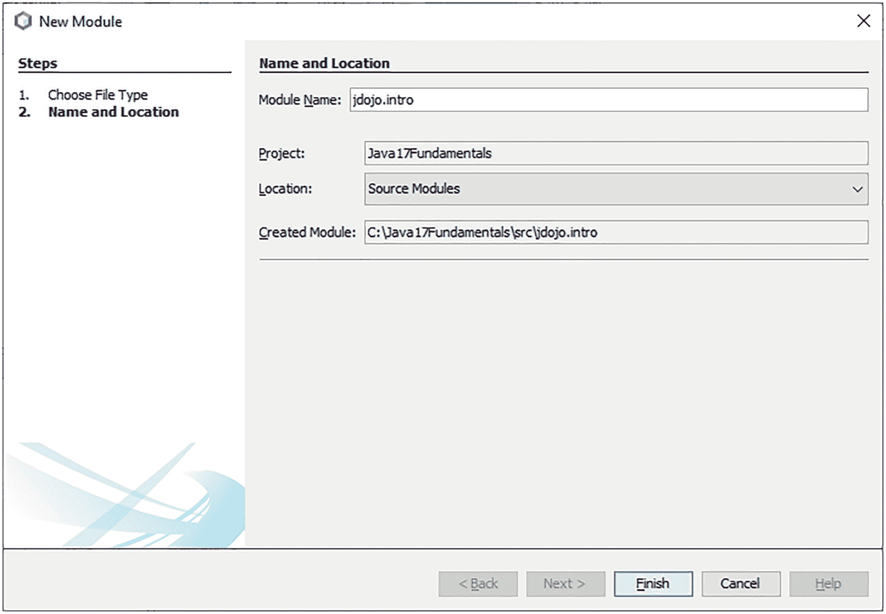

图 3-14

“新建模块”对话框


图 3-13

选择模块菜单项以创建菜单模块

图 [3-15](#Fig15) 显示了打开`module-info.java`文件的编辑器。我已经删除了 NetBeans IDE 添加的注释，并在顶部添加了一个注释。您可能需要在“项目”选项卡中展开文件树才能看到所有文件。创建一个`jdojo.intro`模块创建了一个`module-info.java`文件，其中包含了对`jdojo.intro`模块的模块声明。当在编辑器中打开一个`module-info.java`文件时，NetBeans IDE 会显示三个选项卡——源代码、历史记录和图表。选择图形选项卡显示模块图形，如图 [3-16](#Fig16) 所示。右键单击模块图中的空白区域，查看用于定制图形的选项。使用布局选项，您可以用不同的方式排列图表中的节点。我更喜欢通过分层排列节点来查看图表。使用“导出为图像”右键选项将图像导出为 PNG 图像。选择一个节点会突出显示进出所选节点的所有边，这使您可以轻松地在图形中可视化模块的角色。选择`module-info.java`选项卡下的源代码选项卡，查看模块的源代码。


图 3-16

由 NetBeans IDE 创建的模块图


图 3-15

jdojo.intro 模块及其 module-info.java 文件已在编辑器中打开

现在您已经准备好将`Welcome`类添加到`jdojo.intro`模块中。在项目选项卡中选择`jdojo.intro`模块节点，然后右键单击。然后选择新➤ Java 类...，显示如图 [3-17](#Fig17) 所示的新建 Java 类对话框。输入`Welcome`作为类名，输入`com.jdojo.intro`作为包名。然后单击“完成”按钮。

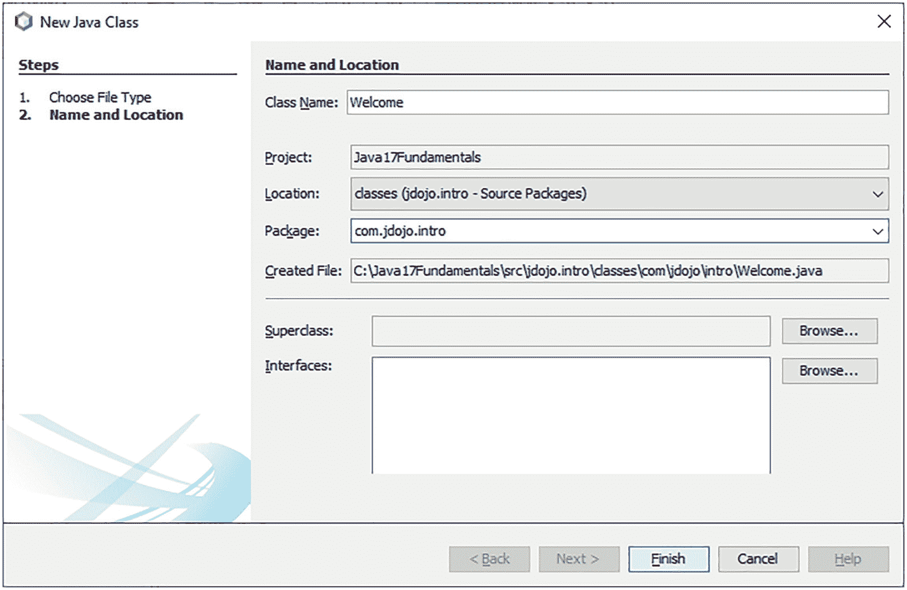

图 3-17

在“新建 Java 类”对话框中输入类的详细信息

图 [3-18](#Fig18) 显示了为`Welcome`类创建的源代码。我已经清理了创建新类时 NetBeans 添加的注释。您需要向`Welcome`类添加一个`main()`方法，如清单 [3-3](#PC41) 所示。图 [3-19](#Fig19) 显示了使用`main()`方法的`Welcome`类。您可以通过按 Ctrl+Shift+S 保存所有更改，也可以使用 Ctrl+S 保存活动文件中的更改。或者，您可以使用文件➤全部保存和文件➤保存菜单或工具栏按钮。


图 3-19

带有 main()方法的 Welcome 类代码


图 3-18

NetBeans 创建的欢迎类

使用 NetBeans 时，不需要编译代码。默认情况下，NetBeans 会在您保存代码时对其进行编译。现在您已经准备好运行`Welcome`类了。NetBeans 允许您运行一个项目或单个 Java 类。如果 Java 文件包含主类，您可以运行它。要运行`Welcome`类，您需要在 NetBeans 中运行`Welcome.java`文件。您可以通过以下方式之一运行`Welcome`类:

*   在编辑器中打开`Welcome.java`文件，按下 Shift+F6。或者，您可以在编辑器中右键单击`Welcome.java`文件并选择 Run File。

*   在“项目”标签中选择`Welcome.java`文件，然后按 Shift+F6。或者，在项目选项卡中选择`Welcome.java`文件，然后选择运行文件。

*   在“项目”选项卡中选择`Welcome.java`文件，然后选择“运行➤”“运行文件”。

当您运行 Welcome 类时，输出会出现在 output 选项卡中，如图 [3-20](#Fig20) 所示。

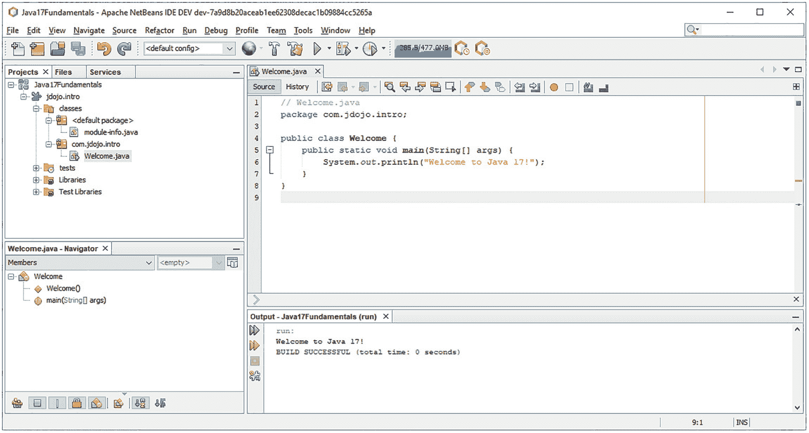

图 3-20

欢迎类运行时的输出

### 在 NetBeans 中创建模块化 jar

您可以从 NetBeans IDE 内部构建模块化 JAR。按 F11 构建项目，这将为您添加到 NetBeans 项目中的每个模块创建一个模块化 JAR。您可以按 Shift+F11 进行清理和构建，这将删除所有现有的已编译类文件和模块化 jar，并在创建新的模块化 jar 之前重新编译所有类。或者，您可以选择运行➤构建项目(<your project="" name="">)菜单项来构建您的项目。</your>

当您构建一个项目时，在哪里创建模块化 jar？NetBeans 在项目目录下创建一个`dist`目录。回想一下，您已经在`C:\Java17Fundamentals`中保存了 NetBeans 项目，所以当您在 IDE 中构建项目时，NetBeans 将创建一个`C:\Java17Fundamentals\dist`目录。假设您的项目中有两个模块— `jdojo.intro`和`jdojo.test`。构建项目将创建以下两个模块化 jar:

*   `C:\Java17Fundamentals\dist\jdojo.intro.jar`

*   `C:\Java17Fundamentals\dist\jdojo.test.jar`

### NetBeans 项目目录结构

NetBeans 使用默认的目录结构来存储源代码、编译代码和打包代码。以下目录是在 NetBeans 项目目录下创建的:

*   `src\<module-name>\classes`

*   `build\modules\<module-name>`

*   `dist`

这里，`<module-name>`是你的模块名比如`jdojo.intro`。`src\<module-name>\classes`目录存储了特定模块的源代码。模块的`module-info.java`文件存储在`classes`子目录中。`classes`子目录可能有几个子目录，这些子目录反映了模块中存储的类型包所需的目录结构。

`build\modules\<module-name>`目录存储模块的编译代码。例如，`jdojo.intro`模块的`module-info.class`文件将存储在`build\modules\jdojo.intro\module-info.class`。`build\modules\<module-name>`目录镜像了存储在模块中的类型包。例如，我们示例中的`Welcome.class`文件将存储在`build\modules\jdojo.intro\com\jdojo\intro\Welcome.class`。当您清理一个项目(右键单击并选择 clean)或清理并构建一个项目时，整个`build`目录将被删除并重新创建。

`dist`目录为项目中的每个模块存储了一个模块化 JAR。项目上的`Clean`或`Clean+Build`动作删除所有模块化 jar 并重新创建它们。

本书将在后续章节中引用 NetBeans 目录结构，向您展示在命令行中使用相同模块的示例。您可以使用 NetBeans 编写模块的代码，并为该模块构建一个模块化的 JAR。您可以将 NetBeans 项目的`dist`目录添加到 modulepath 中，以便在命令行上使用模块化 jar。

### 向模块添加类

通常，一个模块中有几个类。要向模块中添加新类，请在“项目”选项卡中右键单击该模块，然后选择“新建➤ Java 类”....在“新建 Java 类”对话框中填写类名和包名。

### 自定义 NetBeans 项目属性

NetBeans 允许您使用“项目属性”对话框为 Java 项目自定义几个属性。要打开“项目属性”对话框，请在“项目”选项卡中右键单击项目名称，然后选择“属性”。`Java17Fundamentals`项目的项目属性对话框如图 [3-21](#Fig21) 所示。


图 3-21

Java17Fundamentals 项目的项目属性对话框

对话框的左侧是属性类别列表。当您选择一个属性类别时，详细信息会显示在右侧。以下是每个属性类别的简要描述:

*   *来源*:用于设置与源代码相关的属性，如源文件夹、格式、JDK、编码等。当您从“源/二进制格式”下拉列表中选择 JDK 时，NetBeans IDE 将限制您使用该 JDK 版本之外的 API。“包括/排除”按钮允许您在项目中包括和排除字段。当您想在项目中保留一些文件，但不想编译它们时，使用此按钮，例如，文件可能因为不完整而无法编译。

*   *库*:在几个属性中，它允许您设置三个重要的属性:Java 平台、模块路径和类路径。单击管理平台...按钮打开“Java 平台管理器”对话框，您可以在其中选择现有平台或添加新平台。使用`Modulepath`和`Classpath`右侧的+号，使用添加项目、添加库和添加 JAR/folder 按钮将项目、预定义的 JAR 文件集和 JAR/Folder 添加到模块路径和类路径中。这里设置的 modulepath 和 classpath 用于编译和运行 Java 项目。请注意，添加到项目中的所有模块都会自动添加到 modulepath 中。如果在当前 NetBeans 项目之外有模块化 jar，可以使用此对话框将它们添加到 modulepath 中。

*   *Build* :它可以让你设置几个子类别的属性。在“编译”子类别下，可以设置与编译器相关的选项。您可以选择在保存源代码时编译它，也可以选择使用 IDE 中的菜单选项自己编译源代码。在打包子类别下，您可以设置打包模块的选项。“文档”子类别允许您为项目设置生成 Java 文档的选项。

*   *Run* :这个类别允许您设置用于运行项目的属性。您可以设置 Java 平台和 JVM 参数。使用类别，您可以为项目设置一个主类。通常，当您学习时，您会像在前面章节中一样运行一个 Java 文件，而不是一个模块化的 Java 项目。

### 打开现有的 NetBeans 项目

假设您已经下载了这本书的源代码。源代码包含一个 NetBeans 项目。要打开项目，请按照下列步骤操作:


图 3-22

打开 NetBeans Java 项目获取本书的源代码

1.  按 Ctrl+Shift+O 或选择文件➤打开项目。将显示“打开项目”对话框。

2.  导航到包含解压缩的下载源代码的文件夹。显示项目`Java17Fundamentals`，如图 [3-22](#Fig22) 所示。

1.  选择项目，然后单击“打开项目”按钮。NetBeans 在 IDE 中打开该项目。使用左侧的“项目”或“文件”选项卡浏览本书所有章节的源代码。参考前面关于如何在源代码中编译、构建和运行类的章节。

## 在幕后

本节回答了一些与编译和运行 Java 程序相关的一般问题。比如我们为什么要把 Java 源代码编译成字节码格式再运行？什么是 Java 平台？什么是 JVM，它是如何工作的？对这些主题的详细讨论超出了本书的范围。请参考 JVM 规范，了解有关 JVM 功能的任何主题的详细讨论。JVM 规范可以在 [`http://docs.oracle.com/javase/specs`](http://docs.oracle.com/javase/specs) 在线获得。

让我们看一个简单的日常生活例子。假设有一个法国人只会说法语，他必须与另外三个人交流——一个美国人、一个德国人和一个俄罗斯人——而这三个人只懂一种语言(分别是英语、德语和俄语)。法国人将如何与其他三人沟通？有许多方法可以解决这个问题:

*   这个法国人可能会学习所有三种语言。

*   法国人可能会雇一个懂四种语言的翻译。

*   法国人可以雇佣三名懂法英、法德、法俄的翻译。

这个问题还有许多其他可能的解决方案。让我们在运行 Java 程序的上下文中考虑类似的问题。Java 源代码被编译成字节码。相同的字节码需要在所有操作系统上运行，无需任何修改。Java 语言的设计者选择了第三种选择，为每个操作系统配备一个翻译器。翻译器的工作是将字节码翻译成机器码，机器码是运行翻译后的代码的操作系统所固有的。这个翻译器叫做 Java 虚拟机(JVM)。每个操作系统都需要一个 JVM。图 [3-23](#Fig23) 是 JVM 如何在字节码(类文件)和不同操作系统之间充当翻译器的示意图。


图 3-23

JVM 作为字节码和操作系统之间的翻译器

编译成字节码格式的 Java 程序有两个优点:

*   如果想在另一台装有不同操作系统的机器上运行源代码，不需要重新编译。在 Java 中也叫平台独立性。对于 Java 代码，它也被称为“一次编写，随处运行”。

*   如果您在网络上运行 Java 程序，由于字节码格式的紧凑大小，程序运行得更快，从而减少了网络上的加载时间。

为了在网络上运行 Java 程序，Java 代码的大小必须足够紧凑，以便在网络上更快地传输。由 Java 编译器以字节码格式生成的类文件非常紧凑。这是以字节码格式编译 Java 源代码的优点之一。

使用字节码格式的第二个重要优点是它是架构中立的。字节码格式是与体系结构无关的，这意味着如果你在一个特定的主机系统上编译 Java 源代码，比如说，在 Windows 上，生成的类文件没有提到或影响它是在 Windows 上生成的。如果在两个不同的主机系统(例如 Windows 和 UNIX)上编译相同的 Java 源代码，两个类文件将是相同的。

字节码格式的类文件不能在主机系统上直接执行，因为它没有任何特定于主机系统的直接指令。换句话说，我们可以说字节码不是任何特定主机系统的机器语言。现在的问题是，谁理解字节码，谁把它翻译成底层的特定于主机系统的机器码？JVM 执行这项工作。字节码是 JVM 的机器语言。如果您在 Windows 上编译 Java 源代码来生成一个类文件，那么如果您在运行 UNIX 的机器上有 Java 平台(JVM 和 Java API 统称为 Java 平台),那么您也可以在 UNIX 上运行相同的类文件。您不需要重新编译源代码来为 UNIX 生成新的类文件，因为运行在 UNIX 上的 JVM 可以理解您在 Windows 上生成的字节码。这就是 Java 程序如何实现“编写一次，在任何地方运行”的概念。

Java 平台，也称为 Java 运行时系统，由两部分组成:

*   Java 虚拟机(JVM)

*   Java 应用程序编程接口(Java API)

术语“JVM”在三种上下文中使用:

*   JVM 规范:它是一个抽象机器的规范或标准，Java 编译器可以为其生成字节码。

*   *JVM 规范的具体实现*:如果你想运行你的 Java 程序，你需要有一个真正的 JVM，它是使用 JVM 的抽象规范开发的。为了运行上一节中的 Java 程序，您使用了`java`命令，这是抽象 JVM 规范的具体实现。命令(或者 JVM)已经完全用软件实现了。然而，JVM 可以用软件或硬件或两者的组合来实现。

*   *一个正在运行的 JVM 实例*:当您调用`java`命令时，您有一个正在运行的 JVM 实例。

这本书对这三种情况都使用了术语 JVM。它的实际含义应该根据其使用的上下文来理解。

JVM 执行的工作之一是执行字节码并为主机系统生成特定于机器的指令集。JVM 有类装入器和执行引擎。类加载器在需要时读取类文件的内容，并将其加载到内存中。执行引擎的工作是执行字节码。

JVM 也被称为 Java 解释器。“Java 解释器”这个术语经常会引起误解，尤其是对于那些刚刚开始学习 Java 语言的人。对于术语“Java 解释器”，他们的结论是 JVM 的执行引擎一次解释一个字节码，所以 Java 一定非常慢。JVM 的名称“Java 解释器”与执行引擎用来执行字节码的技术没有任何关系。执行引擎执行字节码可能选择的实际技术取决于 JVM 的具体实现。一些执行引擎类型有解释器、实时编译器和自适应优化器。在最简单的解释器中，执行引擎一次解释一个字节码，因此速度较慢。在第二种类型中，即实时编译器，它在方法第一次被调用时，用底层主机语言编译该方法的全部代码。然后在下一次调用相同的方法时重用编译后的代码。与第一种相比，这种执行引擎速度更快，但需要更多内存来缓存编译后的代码。在自适应优化器技术中，它不编译和缓存整个字节码；相反，它只对字节码中使用最频繁的部分这样做。

什么是 API(应用编程接口)？API 是一组特定的方法，由操作系统或应用程序提供给程序员直接使用。在前面的小节中，您在`com.jdojo.intro`包中创建了`Welcome`类，它声明了一个方法`main`，该方法接受一个数组`String`作为参数，并且不返回任何内容(由关键字`void`指示)。如果您公开所有这些关于所创建的包、类和方法的信息，并使它们可供其他程序员使用，那么您在`Welcome`类中的方法`main`就是一个典型的 API 示例，尽管这并不重要。通常，当我们使用术语“API”时，我们指的是可供程序员使用的一组方法。现在很容易理解 Java API 的意思了。Java API 是程序员在编写 Java 源代码时可以使用的所有类和其他组件的集合。在您的`Welcome`类示例中，您已经使用了一个 Java API。您在`main`方法体中使用它来在控制台上打印消息。使用 Java API 的代码是

```java
System.out.println("Welcome to Java 17!");

```

您没有在代码中声明任何名为`println`的方法。这个方法通过 Java API 在运行时对 JVM 可用，Java API 是 Java 平台的一部分。概括地说，Java API 可以分为两类:核心 API 和扩展 API。每个 JDK 都必须支持核心 API。核心 Java APIs 的例子是 Java 运行时(例如，小应用程序、AWT、I/O 等。)，JFC，JDBC 等。Java 扩展 API 有 JavaMail、JNDI (Java 命名和目录接口)等。Java 包含 JavaFX API 作为扩展 API。编译和运行 Java 程序的过程如图 [3-24](#Fig24) 所示。

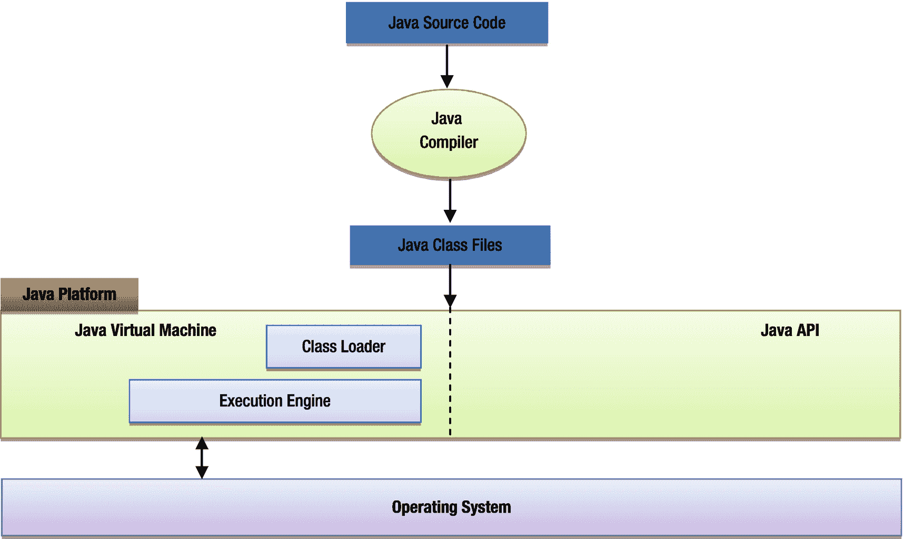

图 3-24

编译和运行 Java 程序所涉及的组件

## 摘要

Java 程序是使用文本编辑器或 IDE 以纯文本格式编写的。Java 源代码也称为编译单元，它存储在扩展名为`.java`的文件中。市场上有一些免费的 Java 集成开发环境(ide ),比如 NetBeans。使用 IDE 开发 Java 应用程序减少了开发 Java 应用程序所需的时间和精力。

JDK 9 向 Java 平台引入了模块系统。模块包含包，包又由类型组成。类型可以是类、接口、枚举或注释。一个模块在一个名为`module-info.java`的源文件中声明，它被编译成一个名为`module-info.class`的类文件。一个编译单元包含一个或多个类型的源代码。编译编译单元时，会为编译单元中声明的每个类型生成一个类文件。

使用 Java 编译器将 Java 源代码编译成类文件。类文件包含字节码。JDK 附带的 Java 编译器叫做`javac`。使用名为`jar`的工具将编译后的代码打包成 JAR 文件。当一个 JAR 文件在其根目录下包含一个`module-info.class`文件，它是一个模块描述符，这个 JAR 文件被称为模块化 JAR。编译后的代码由 JVM 运行。JDK 安装一个可以作为`java`命令运行的 JVM。`javac`和`java`命令都位于`JDK_HOME\bin`目录下，其中`JDK_HOME`是 JDK 的安装目录。

一个模块可以包含内部和外部使用的包。如果一个模块导出一个包，则该包中包含的公共类型可能会被其他模块使用。如果一个模块想要使用另一个模块导出的包，第一个模块必须声明对第二个模块的依赖。JDK 9+由几个模块组成，称为平台模块。`java.base`模块是一个原始模块，所有其他模块都隐式依赖于它。

modulepath 是路径名的序列，其中路径名可以是目录、模块化 JAR 或 JMOD 文件的路径。modulepath 中的每个条目由特定于平台的路径分隔符分隔，在 Windows 上是分号(`;`)，在类似 UNIX 的操作系统上是冒号(:)。用户定义的模块由模块系统使用 modulepath 定位。modulepath 是使用`--module-path`(或者更简短的版本`-p`)命令行选项设置的。

可以使用类路径来定位类。类路径是一系列目录、JAR 文件和 ZIP 文件。类路径中的每个条目由特定于平台的路径分隔符分隔，在 Windows 上是分号(`;`)，在类似 UNIX 的操作系统上是冒号(`:`)。您可以使用`--class-path`(或者`-cp`或者`-classpath`)命令行选项来指定类路径。

classpath 和 modulepath 的值可能看起来相同，但它们用于不同的目的。classpath 用于定位类(更具体地说是类型)，而 modulepath 用于定位模块。您可以通过`jar`和`java`命令使用`--describe-module`(或更短版本的`-d`)选项打印模块的描述。如果你有一个模块化的 JAR，使用`jar`命令。如果在模块路径上的模块 JAR 或展开目录中有一个模块，使用`java`命令。

模块系统在任何阶段(编译时或运行时)可访问的所有模块都称为可观察模块。您可以使用`--list-modules`命令行选项打印可观察模块的列表。模块系统通过隐晦地解析一组被称为*根模块*的模块相对于该组可观察模块的依赖性来创建模块图。在编译时，所有被编译的模块组成了根模块集。运行主类的主模块在运行时构成了根模块集。如果主类在类路径上，那么所有系统模块都是根模块。您可以使用`--add-modules`命令行选项将模块添加到根模块集中。您可以使用`--limit-modules`命令行选项来限制可观察模块的数量。

JDK 9+只适用于你的代码是否在模块内的模块。每个类装入器都有一个未命名的模块。如果类装入器从 modulepath 装入一个类型，该类型就是一个命名模块的成员。如果类装入器从类路径中装入一个类型，该类型将成为该类装入器的未命名模块的成员。

Java 代码被编译成字节码，由 JVM (Java 虚拟机)运行。这允许相同的代码在许多不同的操作系统上运行。

EXERCISES

1.  包含 Java 程序源代码的文件的扩展名是什么？

2.  什么是编译单元？

3.  在一个编译单元中可以声明多少个类型？

4.  在一个编译单元中可以声明多少个公共类型？

5.  如果编译单元包含公共类型，那么对它的命名有什么限制？如果编译单元包含一个名为`HelloWorld`的公共类的声明，它的名字会是什么？

6.  在一个编译单元中，以下结构是按什么顺序指定的:类型声明、包和导入语句？

7.  一个编译单元中可以有多少个 package 语句？

8.  包含 Java 编译代码的文件的扩展名是什么？

9.  包含 Java 模块的源代码和编译代码的文件名是什么？

10.  你用什么关键字来声明一个模块？

11.  在一个`module-info.java`文件中可以声明多少个模块？

12.  什么是未命名模块？一个类装入器可以有多少个未命名的模块？一个类型(例如，一个类)什么时候成为一个未命名模块的成员？

13.  什么是罐子？JAR 文件和 ZIP 文件有什么区别？

14.  什么是模块化 JAR，它与 JAR 有什么不同？你能把一个模块化的 JAR 作为一个 JAR 使用吗，反之亦然？

    *提示*:模块化 JAR 也是一个 JAR，也可以这样使用。放置在模块路径上的罐子充当模块罐子；在这种情况下，模块定义由模块系统自动导出。这种模块被称为*自动*模块。

15.  您使用什么命令来启动 JShell 工具，该命令位于哪里？

16.  你用什么命令编译 Java 源代码？

17.  你用什么命令把 Java 编译的代码打包成一个 JAR 或者一个模块化的 JAR？

18.  模块描述符(`module-info.class`文件)放在模块化 JAR 的什么地方？

19.  您在`C:\lib\com.jdojo.test.jar`保存了一个模块化 JAR。它包含一个名为`jdojo.test`的模块和一个名为`com.jdojo.test.Test`的主类。编写在模块模式和传统模式下运行该类的命令。

20.  您在`C:\lib\com.jdojo.test.jar`保存了一个模块化 JAR。使用`jar`命令编写命令来描述这个模块化 JAR 中打包的模块。

21.  什么是模块描述符？在声明模块时，可以指定模块的版本吗？如何指定模块版本？

22.  什么是可观测模块？什么是根模块，在构建模块图时如何使用它们？

23.  写出用于将模块添加到根模块集中的命令行选项的名称。

24.  您使用什么命令行选项来打印可观察模块的列表？

25.  您使用什么命令行选项来限制可观察模块的集合？

26.  用于指定 modulepath 的 GNU 风格的选项名是`--module-path`。它的等价 UNIX 风格选项是什么？

27.  有哪些选项可以打印命令的帮助？如何为命令的非标准选项打印额外的帮助？