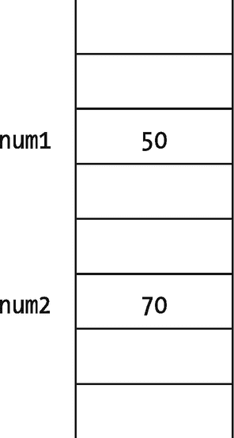
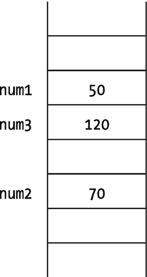
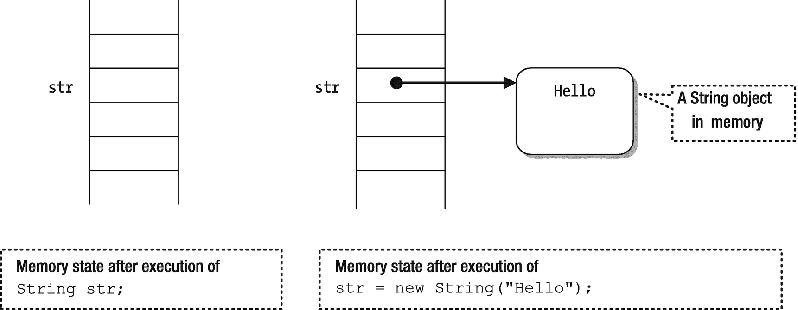
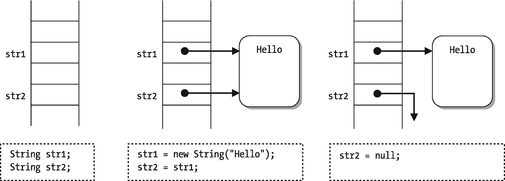
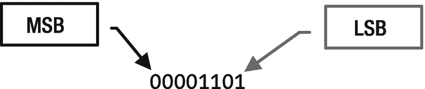

# 四、数据类型

在本章中，您将学习:

*   什么是标识符以及声明它们的详细规则

*   什么是数据类型

*   原始数据类型和引用数据类型之间的区别

*   使用“var”的局部变量类型推理

*   如何声明数据类型的变量

*   如何给变量赋值

*   Java 中所有原始数据类型的详细描述

*   什么是数据类型的文字

*   什么是铸造，什么时候需要铸造

*   整数和浮点数的二进制表示

*   浮点数的不同舍入模式

*   Java 如何实现 IEEE 浮点标准

我们在这一章中使用了很多代码片段。评估这些代码片段并查看结果的最快方法是使用 JShell 工具。关于如何在命令提示符下启动 JShell 工具，请参考第 [2](02.html) 章。

## 什么是数据类型

数据类型(或简称为类型)由三个部分定义:

*   一组值(或数据对象)

*   可以应用于集合中所有值的一组运算

*   一种数据表示形式，它决定了值的存储方式

编程语言提供了一些预定义的数据类型，这些数据类型被称为内置数据类型。编程语言也可以让程序员定义他们自己的数据类型，这就是所谓的用户定义的数据类型。

由不可分割的原子值组成的数据类型——在没有任何其他数据类型帮助的情况下定义——被称为*原语*数据类型。用户定义的数据类型是根据原始数据类型和其他用户定义的数据类型定义的。通常，编程语言不允许程序员扩展或重新定义原始数据类型。

Java 提供了很多内置的原始数据类型，比如`int`、`float`、`boolean`、`char`等。例如，在 Java 中定义`int`原始数据类型的三个组件如下:

*   一个`int`数据类型由一组介于–2147483648 和 2147483647 之间的整数组成。

*   为`int`数据类型定义了加、减、乘、除、比较等操作。

*   `int`数据类型的值在 32 位存储器中以 2 的补码形式表示。

数据类型的所有三个组成部分都是由 Java 语言预定义的。开发人员不能扩展或重新定义`int`数据类型。您可以为`int`数据类型的值命名，如下所示:

```java
int employeeId;

```

该语句声明,`employeeId`是一个名称(技术上称为标识符),它可以与定义`int`数据类型的值的值集中的一个值相关联。例如，您可以使用如下赋值语句将整数`1969`与名称`employeeId`相关联:

```java
employeeId = 1969;

```

## 什么是标识符？

Java 中的一个*标识符*是一个无限长的字符序列。字符序列包括所有 Java 字母和 Java 数字，其中第一个必须是 Java 字母。Java 使用 Unicode 字符集。

Java 字母是由 Unicode 字符集表示的任何语言的字母。例如，A–Z、A–Z、_(下划线)和$被视为 Unicode 的 ASCII 字符集范围内的 Java 字母。Java 数字包括 0–9 个 ASCII 数字和任何表示语言中数字的 Unicode 字符。标识符中不允许有空格。

Tip

Java 中的标识符是一个或多个 Unicode 字母和数字的序列，并且必须以字母开头。

“标识符”是“名称”的技术术语因此，标识符只是 Java 程序中一个实体的名字，比如模块、包、类、方法、变量等等。在前一章中，您声明了一个名为`jdojo.intro`的模块，一个名为`com.jdojo.intro`的包，一个名为`Welcome`的类，一个名为`main`的方法，以及一个名为`args`的`main`方法的参数。所有这些名字都是标识符。

您见过两种形式的名称:一种是仅由一部分组成的名称，如`Welcome`，另一种是由多个部分组成的名称，由点分隔，如`jdojo.intro`和`com.jdojo.intro`。仅由一部分组成而没有使用任何点的名字被称为*简单名字*；可以由点分隔的部分组成的名称称为*限定的* *名称*。关于 Java 中哪种实体可以有简单名称和限定名称，有一些规则。例如，模块和包可以有限定名，而类、方法和变量只能有简单名。一个实体可以有一个限定名，并不意味着这种实体的名称必须至少由`x.y`等两部分组成；它只是意味着这样一个实体的名字可能由点分隔的部分组成。例如，模块名`ComJdojoIntro`与模块名`com.jdojo.intro`或`jdojo.intro`一样有效。

为什么我们有两种类型的名字——简单的和限定的？要理解其背后的原因，请考虑以下两个问题:

*   约翰和他的朋友安娜住在英国。约翰告诉安娜他明天将去伯明翰。

*   托马斯和他的朋友旺达住在美国。托马斯告诉旺达，他明天将去伯明翰。

约翰和托马斯谈论的是同一个伯明翰城市吗？答案是否定的。英国和美国都有一个城市叫伯明翰。约翰正在谈论英国的城市，而托马斯正在谈论美国的城市。当您在日常对话或 Java 程序中使用名称时，该名称有一个空格(一个区域、一个地区或一个作用域),在该空格内它是有效的并且必须是唯一的。这样的空间称为命名空间。在我们的示例中，UK 和 USA 作为名称空间，其中伯明翰城市的名称是唯一的。限定名允许您使用名称空间作为名称。例如，John 和 Thomas 可能使用了`UK.Birmingham`和`USA.Birmingham`作为城市名，这在 Java 术语中是限定名。

当 Java 实体可以作为独立的实体出现时，例如模块和包，允许使用这些实体的限定名来防止名称冲突。假设我们有一个名为`jdojo.intro`的模块，其他人也创建了一个名为`jdojo.intro`的模块。由于名称冲突，这些模块不能在同一个 Java 应用程序中使用(或引用)。然而，如果这些模块将被独立使用，这些名称是可以的。类总是出现在(或被声明在)包内；因此，只要简单名称在包中是唯一的，类名就必须是简单名称。

命名可重用和已发布的模块和包的一个简单的经验法则是使用 Internet 反向域命名约定。如果你拥有`jdojo.com`，使用`com.jdojo`作为你所有模块和包的名字的前缀。我们在本书中只使用`jdojo`作为所有模块名称的前缀，因为这些模块并不公开使用；它们只是用在本书的例子中，而且只是为了学习；较短的模块名称也便于我和你输入和阅读！

Java 编程语言是区分大小写的。标识符中使用的所有字符都很重要，就像它们的大小写一样。名字`welcome`、`Welcome`和`WELCOME`是三个不同的标识符。如果您在 Java 程序中使用直观的名称来表达实体的目的，会对代码的读者有所帮助。假设您需要在一个变量中存储一个雇员的 ID。你可以将变量命名为`n1`和`id`，Java 不会抱怨。然而，如果您将其命名为`employeeId`或`empId`，您的代码将变得更具可读性。任何阅读你的代码的人都会得到正确的上下文和那个变量的目的。表 [4-1](#Tab1) 包含了一些 Java 中有效和无效标识符的例子。

表 4-1

Java 中有效和无效标识符的示例

<colgroup><col class="tcol1 align-left"> <col class="tcol2 align-left"> <col class="tcol3 align-left"></colgroup> 
| 

标识符

 | 

有效的

 | 

描述

 |
| --- | --- | --- |
| `Welcome` | 是 | 由所有字母组成。 |
| `num1` | 是 | 由三个字母和一个数字组成。 |
| `_myId` | 是 | 可以以下划线开头。 |
| `sum_of_two_numbers` | 是 | 可以有字母和下划线。 |
| `Outer$Inner` | 是 | 可以有字母和一个美元。 |
| `$var` | 是 | 可以从一个美元开始。 |
| `$` | 是 | 只能是一个亿。 |
| `_` | 不 | 从 JDK 9 开始，下划线不能单独用作标识符。但是，下划线可以是多字符标识符名称的一部分。 |
| `2num` | 不 | 标识符不能以数字开头。 |
| `my name` | 不 | 标识符不能包含空格。 |
| `num1+num2` | 不 | 标识符不能包含`+`、`-`、`*`、`/`等符号。 |

## 关键词

关键字是在 Java 编程语言中具有预定义含义的单词。它们只能在 Java 编程语言定义的上下文中使用。关键字不能用作标识符。表 [4-2](#Tab2) 包含了 Java 中关键字的完整列表。

表 4-2

Java 中的关键字和保留字列表

<colgroup><col class="tcol1 align-left"> <col class="tcol2 align-left"> <col class="tcol3 align-left"> <col class="tcol4 align-left"> <col class="tcol5 align-left"></colgroup> 
| 

`abstract`

 | 

`continue`

 | 

`for`

 | 

`New`

 | 

`switch`

 |
| --- | --- | --- | --- | --- |
| `assert` | `default` | `If` | `Package` | `synchronized` |
| `boolean` | `do` | `goto` | `Private` | `this` |
| `break` | `double` | `implements` | `Protected` | `throw` |
| `byte` | `else` | `import` | `Public` | `throws` |
| `case` | `enum` | `instanceof` | `Return` | `transient` |
| `catch` | `extends` | `int` | `short` | `try` |
| `char` | `final` | `interface` | `static` | `void` |
| `class` | `finally` | `long` | `strictfp` | `volatile` |
| `const` | `float` | `native` | `super` | `while` |
| `_ (underscore)` |   |   |   |   |

Java 中目前不使用两个关键字`const`和`goto`。它们是保留关键字，不能用作标识符。Java SE 10 引入了“var”作为保留类型，所以虽然它看起来是一个关键字，但它不是。

随着模块系统的引入，Java SE 9 引入了十个新的受限关键字，这些关键字不能用作标识符。那些受限的关键字是`open`、`module`、`requires`、`transitive`、`exports`、`opens`、`to`、`uses`、`provides`和`with`。它们是受限制的关键字，因为它们仅在模块声明的上下文中被视为关键字；在程序中的任何地方，它们都可以用作标识符。在 Java SE 8 中它们不是关键字。如果它们在 Java SE 9 中被声明为关键字，那么用 Java SE 编写的、使用它们作为标识符的许多程序将会崩溃。

Tip

在 Java 程序中，你会遇到三个词——`true`、`false`和`null`。它们看似是关键词，其实不是。相反，`true`和`false`是布尔文字，而`null`是空文字。在 Java 中不能使用`true`、`false`和`null`作为标识符，即使它们不是关键字。

## Java 中的数据类型

在我们开始讨论 Java 中所有可用的数据类型之前，让我们看一个简单的将两个数字相加的例子。假设你的朋友让你把两个数相加。将两个数相加的过程如下:

1.  你的朋友告诉你第一个数字，你听他们说话，你的大脑把这个数字记录在你记忆中的特定位置。当然，你不知道这个数字在你大脑记忆中的确切位置。

2.  你的朋友告诉你第二个数字，你听他们，同样，你的大脑把它记录在你记忆中的特定位置。

3.  现在，你的朋友让你把这两个数相加。你的大脑又开始行动了。它回忆(或读取)两个数并相加，你告诉你的朋友这两个数的和。

现在，如果你的朋友想让你告诉他们这两个数字的区别，他们不需要再告诉你这两个数字了。这是因为这两个数字储存在你的记忆中，你的大脑可以再次回忆和使用它们。然而，你的大脑是否能够执行那两个数字的加法取决于许多因素，例如，那两个数字有多大，你的大脑是否能够记住(或存储)那些大数字，你的大脑是否受过做加法的训练，等等。两个数相加的过程也取决于这两个数的类型。根据这两个数字是整数(例如 10 和 20)、实数(例如 12.4 和 19.1)，还是整数和实数的混合(例如 10 和 69.9)，你的大脑会使用不同的逻辑将它们相加。整个过程发生在你的大脑中，而你却没有注意到(可能是因为你太习惯于做这些加法)。但是，当您想要在 Java 程序中对数字或任何其他类型的值进行任何类型的操作时，您需要指定关于您想要操作的值的细节以及操作这些值的过程。

让我们讨论 Java 程序中两个数相加的同一个例子。你需要告诉 Java 的第一件事是你要相加的两个数的类型。假设你想把两个整数 50 和 70 相加。当你自己把两个数字相加时，你的大脑给每个数字起了一个名字(可能作为第一个数字和第二个数字)。你没有注意到大脑对这些数字的命名。然而，在 Java 程序中，您必须显式地给这两个数字命名(也称为标识符)。我们把这两个数字分别命名为`num1`和`num2`。Java 程序中的下面两行表示有两个整数，`num1`和`num2`:

```java
int num1;
int num2;

```

`int`关键字用于表示后面的名称代表一个整数值，例如 10、15、70、1000 等。当这两行代码被执行时，Java 分配了两个内存位置，并将名字`num1`与第一个内存位置相关联，将名字`num2`与第二个内存位置相关联。此时的存储状态如图 [4-1](#Fig1) 所示。


图 4-1

声明两个 int 类型变量时的内存状态

这些内存位置被称为变量，被命名为`num1`和`num2`。严格来说，`num1`和`num2`是与两个内存位置相关联的两个名字。然而，粗略地说，你说

*   `num1`和`num2`是两个变量

*   `num1`和`num2`是`int`数据类型的两个变量

*   `num1`和`num2`是两个`int`变量

因为您已经声明了`int`数据类型的`num1`和`num2`变量，所以您不能在这些内存位置存储一个实数，比如 10.51。下面这段代码在`num1`中存储 50，在`num2`中存储 70:

```java
num1 = 50;
num2 = 70;

```

这两行代码执行后的内存状态如图 [4-2](#Fig2) 所示。



图 4-2

两个 int 类型变量赋值后的内存状态

现在，你想把这两个数相加。在添加它们之前，必须分配另一个内存位置来保存结果。您将这个内存位置命名为`num3`，下面这段代码执行这些任务:

```java
int num3;            // Allocates the memory location num3
num3 = num1 + num2;  // Computes sum and store the result in num3

```

这两行代码执行后的内存状态如图 [4-3](#Fig3) 所示。



图 4-3

两个数相加过程中的记忆状态

前面两行可以合并成一行:

```java
int num3 = num1 + num2;

```

变量有三个属性:

*   保存该值的内存位置

*   存储在内存位置的数据的类型

*   一个名称(也称为*标识符*)来引用存储位置

变量的数据类型也决定了内存位置可以容纳的值的范围。因此，为变量分配的内存量取决于它的数据类型。例如，为`int`数据类型的变量分配 32 位内存。在这个例子中，每个变量(`num1`、`num2`和`num3`)使用 32 位内存。

Java 支持两种数据类型:

*   原始数据类型

*   参考数据类型

原始数据类型的变量保存一个值，而引用数据类型的变量保存对内存中对象的引用。在本节中，我们将讨论 Java 中可用的参考数据类型之一`String`。`String`是 Java 库中定义的一个类，你可以用它来操作文本(字符序列)。您如下声明一个名为`str`的`String`类型的引用变量:

```java
String str;

```

在将对象的引用赋给引用变量之前，需要创建一个对象。使用`new`操作符创建一个对象。您可以创建一个以`"Hello"`为内容的`String`类的对象，如下所示:

```java
// Creates a String object and assigns the reference of the object to str
str = new String("Hello");

```

执行这段代码时会发生什么？首先，分配内存，变量`str`的名称与该内存位置相关联，如图 [4-4](#Fig4) 所示。这个过程与声明一个原始数据类型变量是一样的。第二段代码用文本`"Hello"`在内存中创建一个`String`对象，并将`String`对象的引用(或内存地址)存储到变量`str`中。这一事实在图 [4-4](#Fig4) 的后半部分通过使用一个从变量`str`指向内存中对象的箭头来显示。



图 4-4

使用参考变量存储状态

还可以将存储在一个引用变量中的对象的引用分配给另一个引用变量。在这种情况下，两个引用变量都指向内存中的同一个对象。这可以通过以下方式实现:

```java
// Declares String reference variable str1 and str2
String str1;
String str2;
// Assigns the reference of a String object "Hello" to str1
str1 = new String("Hello");
// Assigns the reference stored in str1 to str2
str2 = str1;

```

有一个引用常量(也叫引用文字)`null`，可以赋给任何引用变量。如果`null`被赋值给一个引用变量，就意味着这个引用变量没有引用内存中的任何对象。`null`参考文字可以分配给`str2`:

```java
str2 = null;

```

图 [4-5](#Fig5) 描述了所有这些语句执行后的存储器状态。



图 4-5

在引用变量赋值中使用 null 的内存状态

使用`new`操作符创建一个`String`对象。然而，字符串的使用如此频繁，以至于有一个创建 String 对象的快捷方式。所有字符串文字，即双引号中的字符序列，都被视为`String`对象。因此，不使用`new`操作符来创建一个`String`对象，您可以像这样使用字符串文字:

```java
// Assigns the reference of a String object with text "Hello" to str1
String str1 = "Hello";
// Assigns the reference of a String object with text "Hello" to str1
String str1 = new String ("Hello");

```

这两条语句之间有一个微妙的区别，它们用相同的文本`"Hello"`将一个`String`对象分配给`str1`。这本书在单独的一章 [15](15.html) 中讨论了`String`类的区别。

## 局部变量类型推理

Java 10 引入了局部变量类型推断特性，如果编译器能够确定它应该使用的类型，该特性允许您使用“var”来代替局部变量的类型(在方法内部)。它与严格定义类型的意思相同，但它是一种更简洁的语法。在很多情况下可以避免类型的重复。

例如，以前面的代码为例，使用“var”会产生如下代码，但含义没有任何变化:

```java
// Assigns the reference of a String object with text "Hello" to str1
var str1 = "Hello";
// Assigns the reference of a String object with text "Hello" to str1
var str1 = new String ("Hello");

```

它不是一个关键字，仍然可以用作变量名，尽管不建议这样做。我们将在后面的章节中更深入地讨论“var ”,比如可以使用和不可以使用它的每一个场景。

## Java 中的原始数据类型

Java 有八种原始数据类型。表 [4-3](#Tab3) 列出了它们的名称、大小、有符号还是无符号、范围以及一些例子。以下部分将对它们进行详细描述。

表 4-3

原始数据类型、大小、范围和示例的列表

<colgroup><col class="tcol1 align-left"> <col class="tcol2 align-left"> <col class="tcol3 align-left"> <col class="tcol4 align-left"> <col class="tcol5 align-left"></colgroup> 
| 

数据类型

 | 

以位为单位的大小

 | 

签名/未签名

 | 

范围

 | 

例子

 |
| --- | --- | --- | --- | --- |
| `byte` | `8` | 签名 | `-2` <sup>`7`</sup> 到`+2` <sup>`7`</sup> `- 1` | `-2, 8, 10` |
| `short` | `16` | 签名 | `-2` <sup>`15`</sup> 到`+2` <sup>`15`</sup> `- 1` | `-2, 8, 10` |
| `int` | `32` | 签名 | `-2` <sup>`31`</sup> 到`+2` <sup>`31`</sup> `- 1` | `1990, -90, 23` |
| `long` | `64` | 签名 | `-2` <sup>`63`</sup> 到`+2` <sup>`63`</sup> `- 1` | `1990L, -90L, 23L` |
| `char` | `16` | 无符号的 | `0`至`65535` | `'A', '8', '\u0000'` |
| `float` | `32` | 签名 | `-3.4 x 10` <sup>`38`</sup> 到`+3.4 x 10` <sup>`38`</sup> | `12.89F, -89.78F` |
| `double` | `64` | 签名 | -1.7 x 10 <sup>308</sup> 到+1.7 x 10 <sup>308</sup> | `12.78, -78.89` |
| `boolean` | 未指明的 | 不适用的 | `true`和`false` | `true, false` |

八种原始数据类型分为两类:

*   `boolean`数据类型

*   数字数据类型

数字数据类型可以进一步细分为整型和浮点型。所有原始数据类型及其类别如图 [4-6](#Fig6) 所示。随后的部分详细描述了所有的原始数据类型。


图 4-6

Java 中按类别划分的基本数据类型列表

Alert

我们已经收到了几封来自本书第一版读者的电子邮件，称将`char`数据类型列在数值数据类型类别下是一个错误。然而，事实并非如此。`char`数据类型绝对是数值数据类型。可以给`char`变量赋一个整数，也可以对`char`变量进行加减等算术运算。Java 语言规范也将`char`归类为数字数据类型。许多 Java 书籍要么将`char`列为单独的数据类型，要么将其描述为非数值数据类型；两个都不对。

在阅读本书和使用 Java 时，你会多次碰到“文字”这个术语。类型为`X`的文字表示类型为`X`的值，可以在源代码中直接表示，而不需要任何计算。例如，10 是一个`int`字面值，这意味着每当你在 Java 程序中需要一个`int`类型的值 10 时，你可以简单地输入 10。Java 为所有基本类型和两种引用类型定义了文字，即`String`类型和空类型。

### 整数数据类型

整数数据类型是数值数据类型，其值是整数(即整数)。Java 提供了五种整型数据类型:`byte`、`short`、`int`、`long`和`char`。所有整型数据类型将在接下来的章节中详细描述。

#### int 数据类型

`int`数据类型是 32 位有符号 Java 原语数据类型。`int`数据类型的变量占用 32 位内存。其有效范围是–2，147，483，648 到 2，147，483，647(–231 到 231–1)。这个范围内的所有整数都称为整数文字(或整数常量)。例如，10、–200、0、30、19 等。是`int`类型的整数。一个整数可以被赋给一个`int`变量，比如说`num1`，就像这样:

```java
int num1 = 21;

```

整数文字可以用以下格式表示:

*   十进制数字格式

*   八进制数字格式

*   十六进制数字格式

*   二进制数字格式

当整数文字以零开始并且至少有两位数时，它被认为是八进制数字格式。以下代码行将十进制值 17(八进制为 021)赋给`num1`:

```java
// 021 is in octal number format, not in decimal
int num1 = 021;

```

下面两行代码具有相同的效果，将值 17 赋给变量`num1`:

```java
// No leading zero - decimal number format
int num1 = 17;
// Leading zero - octal number format. 021 in octal is the same as 17 in decimal
int num1 = 021;

```

使用带有前导零的`int`文字时要小心，因为 Java 会将这些文字视为八进制数字格式。请注意，八进制格式的`int`文字必须至少有两位数，并且必须以零开头，才能被视为八进制数。在十进制数字格式中，数字 0 被视为零，而在八进制数字格式中，00 被视为零:

```java
// Assigns zero to num1, 0 is in the decimal number format
int num1 = 0;
// Assigns zero to num1, 00 is in the octal number format
int num1 = 00;

```

注意 0 和 00 代表同一个值，零。两行代码具有相同的效果，将值 0 赋给变量`num1`。

所有十六进制数字格式的`int`文字都以`0x`或`0X`开头，也就是说，零后面紧跟一个大写或小写的`X`，并且它们必须包含至少一个十六进制数字。十六进制数字格式使用 16 位数字，0–9 和 A–F(或 A–F)。字母 A-F 的大小写无关紧要。以下是使用十六进制格式的`int`文字的示例:

```java
int num1 = 0x123;
int num2 = 0xdecafe;
int num3 = 0x1A2B;
int num4 = 0X0123;

```

一个`int`字面值也可以用二进制数字格式来表示。二进制数字格式的所有`int`文字都以`0b`或`0B`开头，也就是说，零后面紧跟一个大写或小写的`B`。以下是在二进制数字格式中使用`int`文字的例子:

```java
int num1 = 0b10101;
int num2 = 0b00011;
int num3 = 0b10;
int num4 = 0b00000010;

```

以下赋值将相同的十进制数 51966 赋给四种不同格式的名为`num1`的`int`变量:

```java
num1 = 51966;                // Decimal format
num1 = 0145376;              // Octal format, starts with a zero
num1 = 0xCAFE;               // Hexadecimal format, starts with 0x
num1 = 0b1100101011111110;   // Binary format starts with 0b

```

Java 有一个名为`Integer`(注意`Integer`中的大写`I`)的类，它定义了两个常量来表示`int`数据类型的最大值和最小值，`Integer.MAX_VALUE`和`Integer.MIN_VALUE`。

例如

```java
int max = Integer.MAX_VALUE; // Assigns maximum int value to max
int min = Integer.MIN_VALUE; // Assigns minimum int value to min

```

#### 长数据类型

`long`数据类型是 64 位有符号 Java 原语数据类型。当整数的计算结果可能超出`int`数据类型的范围时使用。其范围为–9223372036854775808 到 9223372036854775807(–2<sup>63</sup>到 2<sup>63</sup>–1)。在`long`范围内的所有整数称为`long`类型的整数文字。

51 是一个整数。它的数据类型是什么:`int`还是`long`？类型为`long`的整数文字总是以`L`(或小写`l`)结尾。本书使用`L`来标记`long`类型的整数文字的结束，因为`l`(小写`L`)在印刷中经常与`1`(数字一)混淆。以下是使用`long`类型的整数文字的示例:

```java
long num1 = 0L;
long num2 = 401L;
long mum3 = -3556L;
long num4 = 89898L;
long num5 = -105L;

```

Tip

`25L`是一个`long`类型的整数文字，而`25`是一个`int`类型的整数文字。

`long`类型的整数也可以用八进制、十六进制和二进制格式表示，例如:

```java
long num1;
num1 = 25L;      // Decimal format
num1 = 031L;     // Octal format
num1 = 0X19L;    // Hexadecimal format
num1 = 0b11001L; // Binary format

```

当一个`long`字面值被赋给一个`long`类型的变量时，Java 编译器检查被赋的值，并确保它在`long`数据类型的范围内；否则，它会生成一个编译时错误，例如:

```java
// One more than maximum positive value for long. This will generate a compile-time error
long num1 = 9223372036854775808L;

```

因为`int`数据类型的范围比`long`数据类型的范围小，所以存储在`int`变量中的值总是可以分配给`long`变量。

```java
int num1 = 10;
long num2 = 20;  // OK to assign int literal 20 to a long variable num2
num2 = num1;     // OK to assign an int to a long

```

Tip

当您将一个较小类型的值赋给一个较大类型的变量时(例如`int`到`long`)，Java 会执行一个自动扩大转换，用零填充目标中的高位，保留源的符号位。例如，当给一个`long`变量赋值一个`int`文字时，Java 执行扩大转换。

从`int`到`long`的赋值是有效的，因为所有可以存储在`int`变量中的值也可以存储在`long`变量中。然而，反之则不然。你不能简单地将存储在`long`变量中的值赋给`int`变量。存在价值溢出(或价值损失)的可能。考虑以下两个变量:

```java
int num1 = 10;
long num2 = 2147483655L;

```

如果将`num2`的值分配给`num1`,则为

```java
num1 = num2;

```

存储在`num2`中的值不能存储在`num1`中，因为`num1`的数据类型是`int`，`num2`的值超出了`int`数据类型可以处理的范围。为了防止无意中犯这样的错误，Java 不允许您编写这样的代码:

```java
// A compile-time error. long to int assignment is not allowed in Java
num1 = num2;

```

即使存储在`long`变量中的值在`int`数据类型的范围内，也不允许从`long`到`int`的赋值，如下例所示:

```java
int num1 = 5;
long num2 = 25L;
// A compile-time error. Even if num2's value 25 which is within the range of int
num1 = num2;

```

如果你想把一个`long`变量的值赋给一个`int`变量，你必须在你的代码中明确提到这个事实，这样 Java 就能确保你意识到可能会有值的损失。在 Java 中使用“cast”可以做到这一点，方法是将目标类型放在值前面的括号中，如下所示:

```java
num1 = (int)num2; // Now it is fine because of the "(int)" cast

```

通过编写`(int)num2`，您正在指示 Java 将存储在`num2`中的值视为一个`int`。在运行时，Java 将只使用`num2`的 32 个最低有效位(LSB ),并将存储在这 32 位中的值赋给`num1`。如果`num2`的值超出了`int`数据类型的范围，那么在`num1`中就不会得到相同的值。

Java 有一个类`Long`(注意`Long`中的大写`L`)定义了两个常量来表示`long`数据类型的最大值和最小值，`Long.MAX_VALUE`和`Long.MIN_VALUE`:

```java
long max = Long.MAX_VALUE;
long min = Long.MIN_VALUE;

```

#### 字节数据类型

`byte`数据类型是 8 位有符号 Java 原始整数数据类型。其范围是–128 到 127(–2<sup>7</sup>到 2<sup>7</sup>–1)。这是 Java 中最小的整数数据类型。一般来说，当程序使用大量的变量值在–128 到 127 范围内，或者在文件中或网络上处理二进制数据时，使用`byte`变量。与`int`和`long`文字不同，这里没有`byte`文字。但是，您可以将`byte`范围内的任何`int`文字赋值给`byte`变量，例如:

```java
byte b1 = 125;
byte b2 = -11;

```

如果将–128 到 127 范围之外的值赋给`byte`变量，Java 会生成一个编译器错误。以下赋值产生编译时错误:

```java
// An error. 150 is an int literal outside -128 to 127
byte b3 = 150;

```

请注意，您只能将–128 到 127 之间的`int`文字赋给`byte`变量。然而，这并不意味着您也可以将存储在一个`int`变量中的值(在–128 到 127 的范围内)赋给一个`byte`变量。下面这段代码将生成一个编译时错误，因为它将一个`int`变量`num1`的值赋给了一个`byte`变量`b1`:

```java
int num1 = 15;
// OK. Assignment of int literal (-128 to 127) to byte.
byte b1 = 15;
// A compile-time error. Even though num1 has a value of 15, which is in the range -128 and 127.
b1 = num1;

```

为什么`num1`赋给`b1`时编译器会抱怨？编译器不会试图读取存储在`num1`中的值，因为`num1`是一个变量，它的值只有在运行时才知道。它将`num1`视为`int`类型，32 位大，而将`b1`视为`byte`类型，8 位大。根据它们的大小，编译器会发现您将一个较大的变量赋给了一个较小的变量，这可能会丢失数据。当你把 15 赋给`b1`时，15 是一个`int`字面量，它的值在编译时是已知的；编译器可以确保 15 在一个`byte`的范围内(–128 到 127)。如果您在前面的代码片段中将`num1`声明为编译时常量，编译器不会生成错误。编译时常量是使用 final 关键字声明的变量，其值在编译时是已知的。以下代码片段实现了这一点:

```java
// Using final makes the num1 variable a compile-time constant
final int num1 = 15;
// OK. Assignment of int literal (-128 to 127) to byte.
byte b1 = 15;
// Now, the compiler knows the value of num1 as 15 and it is fine.
b1 = num1;

```

您也可以通过强制转换来修复这个错误，就像您在使用`long`–to-`int`赋值时所做的那样。`num1`到`b1`的赋值可以改写如下:

```java
int num1 = 15;
byte b1 = 15;
b1 = (byte)num1; // Ok. Using a cast

```

在从`int`到`byte`的转换之后，Java 编译器不会抱怨`int`到`byte`的赋值。如果`num1`保存了一个不能在 8 位`byte`变量`b1`中正确表示的值，则`num1`的高位(第 9 位到第 32 位)被忽略，低位 8 位中表示的值被分配给`b1`。在这种`int` -to- `byte`赋值的情况下，如果源变量的值超出了`byte`数据类型的范围，则分配给目标`byte`变量的值可能与源`int`变量的值不同。

然而，不管源变量`int`中的值如何，目标变量`byte`的值总是介于–128 和 127 之间。像`int`一样，由于`long`也是比`byte`更大的数据类型，如果你想把一个`long`变量的值赋给一个`byte`变量，你需要使用显式强制转换。例如，

```java
byte b4 = 10;
long num3 = 19L;
b4 = (byte)num3;  // OK because of cast
b4 = 19L;         // Error. Cannot assign long literal to byte
b4 = (byte)19L;   // OK because of cast

```

的确，19 和 19L 代表同一个数字。然而，对于 Java 编译器来说，它们是不同的。19 是一个`int`字面值，即它的数据类型是`int`，而 19L 是一个`long`字面值，即它的数据类型是`long`。

Java 有一个名为`Byte`(注意`Byte`中的大写`B`)的类，它定义了两个常量来表示`byte`数据类型的最大值和最小值`Byte.MAX_VALUE`和`Byte.MIN_VALUE`:

```java
byte max = Byte.MAX_VALUE; // Same as byte max = 127;
byte min = Byte.MIN_VALUE; // Same as byte min = -128;

```

#### 短数据类型

`short`数据类型是 16 位有符号 Java 原始整数数据类型。其范围为–32768 至 32767(或–2<sup>15</sup>至 2<sup>15</sup>–1)。通常，`short`变量用于程序使用大量值在`short`数据类型范围内的变量时，或者处理文件中的数据时，使用`short`数据类型可以轻松处理。与`int`和`long`文字不同，这里没有`short`文字。但是，您可以将任何在`short`(–32768 到 32767)范围内的`int`文字赋值给`short`变量，例如:

```java
short s1 = 12905;   // ok
short s2 = -11890;  // ok

```

因为`byte`数据类型的范围在`short`数据类型的范围内，所以`byte`变量的值总是可以赋给`short`变量。从`int`或`long`变量向`short`变量赋值的所有其他规则与`byte`变量相同。以下代码片段说明了将`byte`、`int`和`long`值分配给`short`变量:

```java
short s1 = 15;    // OK
byte b1 = 10;     // OK
s1 = b1;          // OK
int num1 = 10;    // OK
s1 = num1;        // A compile-time error
s1 = (short)num1; // OK because of cast from int to short
s1 = 35000;       // A compile-time error of an int literal outside the short range
long num2 = 555L; // OK
s1 = num2;        // A compile-time error
s1 = (short)num2; // OK because of the cast from long to short
s1 = 555L;        // A compile-time error
s = (short)555L;  // OK because of the cast from long to short

```

Java 有一个名为`Short`(注意`Short`中的大写`S`)的类，它定义了两个常量来表示`short`数据类型的最大值和最小值，`Short.MAX_VALUE`和`Short.MIN_VALUE`:

```java
short max = Short.MAX_VALUE;
short min = Short.MIN_VALUE;

```

#### char 数据类型

`char`数据类型是 16 位*无符号* Java 原始数据类型。它的值表示一个 Unicode 字符。注意`char`是一个无符号数据类型。因此，`char`变量不能有负值。`char`数据类型的范围是 0–65535，与 Unicode 字符集的范围相同。一个字符文字表示一个`char`数据类型的值。字符文字可以用以下格式表示:

*   作为用单引号括起来的字符

*   作为字符转义序列

*   作为 Unicode 转义序列

*   作为八进制转义序列

##### 单引号中的字符文字

字符文字可以用单引号括起来表示。以下是几个例子:

```java
char c1 = 'A';
char c2 = 'L';
char c3 = '5';
char c4 = '/';

```

回想一下，双引号中的字符序列是一个`String`文字。一个`String`字面量不能赋给一个`char`变量，即使`String`字面量只包含一个字符。这个限制是因为 Java 不允许混合原始数据类型和引用数据类型的值。`String`是一种引用数据类型，而`char`是一种原始数据类型。以下是几个例子:

```java
char c1 = 'A';     // OK
String s1 = 'A';   // An error. Cannot assign a char 'A' to a String s1
String s2 = "A";   // OK. "A" is a String literal assigned to a String variable
String s3 = "ABC"; // OK. "ABC" is a String literal
char c2 = "A";     // An error. Cannot assign a String "A" to char c2
char c4 = 'AB';    // An error. A character literal must contain only one character

```

##### 字符转义序列

字符文字也可以表示为字符转义序列。字符转义序列以反斜杠开头，后面紧跟着一个字符，两者都用单引号括起来。有八个预定义的字符转义序列，如表 [4-4](#Tab4) 中所列。你不能在 Java 中定义你自己的字符转义序列。

表 4-4

字符转义序列列表

<colgroup><col class="tcol1 align-left"> <col class="tcol2 align-left"></colgroup> 
| 

字符转义序列

 | 

描述

 |
| --- | --- |
| `'\n'` | 换行 |
| `'\r'` | 回车 |
| `'\f'` | 换页 |
| `'\b'` | 退格键 |
| `'\t'` | 一个标签 |
| `'\\'` | 一个反斜杠 |
| `'\"'` | 双引号 |
| `'\''` | 单引号 |

以字符转义序列形式表示的字符文字由两个字符组成——一个反斜杠和一个跟在反斜杠后面的字符。然而，它们只代表一个字符。以下是使用字符序列的几个示例:

```java
char c1 = '\n'; // Assigns a linefeed to c1
char c2 = '\"'; // Assigns double quote to c2
char c3 = '\a'; // A compile-time error. Invalid character escape sequence

```

##### Unicode 字符转义序列

一个字符文字也可以表示为一个形式为`'\uxxxx'`的 Unicode 转义序列。这里，`\u`(一个反斜杠紧接着一个小写的`u`)表示 Unicode 转义序列的开始，而`xxxx`正好表示四个十六进制数字。由`xxxx`表示的值是字符的 Unicode 值。字符`'A'`的 Unicode 值为 65。十进制的值 65 在十六进制中可以表示为 41。所以字符`'A'`可以用 Unicode 转义序列表示为`'\u0041'`。以下代码片段将相同的字符`'A'`分配给`char`变量`c1`和`c2`:

```java
char c1 = 'A';
char c2 = '\u0041';  // Same as c2 = 'A';

```

##### 八进制字符转义序列

一个字符文字也可以表示为一个八进制转义序列，形式为`'\nnn'`。这里，`n`是一个八进制数字(0–7)。八进制转义序列的范围是从`'\000'`到`'\377'`。八进制数 377 与十进制数 255 相同。因此，使用八进制转义序列，可以表示 Unicode 代码范围从 0 到 255 个十进制整数的字符。

Unicode 字符集(代码范围 0–65535)可以表示为 Unicode 转义序列(`'\uxxxx'`)。为什么 Java 有另一个八进制转义序列，它是 Unicode 转义序列的子集？八进制转义序列用于表示字符，以便与使用 8 位无符号字符表示字符的其他语言兼容。与 Unicode 转义序列不同，在 Unicode 转义序列中，您总是需要使用四个十六进制数字，而在八进制转义序列中，您可以使用一个、两个或三个八进制数字。因此，八进制转义序列可以采用`'\n'`、`'\nn'`或`'\nnn'`的形式，其中`n`是八进制数字 0、1、2、3、4、5、6 和 7 中的一个。八进制转义序列的一些例子如下:

```java
char c1 = '\52';
char c2 = '\141';
char c3 = '\400'; // A compile-time error. Octal 400 is out of range
char c4 = '\42';
char c5 = '\10';  // Same as '\n'

```

如果`int`字面量在 0–65535 的范围内，您也可以将`int`字面量赋给`char`变量。当您将一个`int`字面值赋给一个`char`变量时，`char`变量代表其 Unicode 代码等于该`int`字面值所代表的值的字符。字符`'a'`(小写 A)的 Unicode 编码是 97。十进制值 97 在八进制中表示为 141，在十六进制中表示为 61。在 Java 中可以用不同的形式表示 Unicode 字符`'a'`:`'a','\141'`和`'\u0061'`。您还可以使用`int`文字 97 来表示 Unicode 字符`'a'`。以下四种赋值在 Java 中具有相同的含义:

```java
char c1 = 97;          // Assign 'a' to c1
char c2 = 'a';         // Assign 'a' to c2
char c3 = '\141';      // Assign 'a' to c3
char c4 = '\u0061';    // Assign 'a' to c4

```

一个`byte`变量占用 8 位，一个`char`变量占用 16 位。即使`byte`数据类型的范围小于`char`数据类型的范围，也不能将存储在`byte`变量中的值赋给`char`变量。原因是`byte`是有符号数据类型，而`char`是无符号数据类型。如果`byte`变量有一个负值，比如说–15，它就不能存储在`char`变量中而不损失精度。为了使这样的赋值成功，您需要使用显式强制转换。以下代码片段说明了从`char`到其他整型数据类型的可能赋值情况，反之亦然:

```java
byte b1 = 10;
short s1 = 15;
int num1 = 150;
long num2 = 20L;
char c1 = 'A';
// byte and char
b1 = c1;          // An error
b1 = (byte)c1;    // OK
c1 = b1;          // An error
c1 = (char)b1;    // OK
// short and char
s1 = c1;          // An error
s1 = (short)c1;   // OK
c1 = s1;          // An error
c1 = (char)s1;    // OK
// int and char
num1 = c1;        // OK
num1 = (int)c1;   // OK. But cast is not required. Use num1 = c1
c1 = num1;        // An error
c1 = (char)num1;  // OK
c1 = 255;         // OK. 255 is in the range of 0-65535
c1 = 70000;       // An error. 70000 is out of range 0-65535
c1 = (char)70000; // OK. But will lose the original value
// long and char
num2 = c1;        // OK
num2 = (long)c1;  // OK. But cast is not required. Use num2 = c1
c1 = num2;        // An Error
c1 = (char)num2;  // OK
c1 = 255L;        // An error. 255L is a long literal
c1 = (char)255L;  // OK. But use c1 = 255 instead

```

#### 布尔数据类型

`boolean`数据类型只有两个有效值:`true`和`false`。这两个值被称为`boolean`文字。您可以按如下方式使用`boolean`:

```java
// Declares a boolean variable named done
boolean done;
// Assigns true to done
done = true;

```

Tip

在 Java 中，1 和 0 不会分别被视为`boolean`值`true`和`false`。如果你有 C/C++背景，这是一个改变。Java 只定义了两个`boolean`值，称为`boolean`，它们是`true`和`false`。除了`true`和`false`之外，不能给`boolean`变量赋值。

需要注意的重要一点是,`boolean`变量不能转换成任何其他数据类型，反之亦然。Java 没有指定`boolean`数据类型的大小。它的大小由 JVM 实现决定。通常，`boolean`数据类型的值被编译器映射到`int`，而`boolean`数组被编码为`byte`数组。

### 浮点数据类型

包含小数部分的数字称为实数，例如 3.25、0.49、–9.19、19.0 等。计算机以二进制格式存储每一个数字，不管是实数还是整数，都只由 0 和 1 组成。因此，有必要将实数转换为二进制表示，然后才能存储。在读取其二进制表示后，必须将其转换回实数。当一个实数被转换成二进制表示时，计算机还必须存储该数中小数点的位置。在计算机内存中存储实数有两种策略:

*   只存储数字的二进制表示，假设在点的前后总是有固定的位数。一个点在数的十进制表示中称为小数点，在二进制表示中称为二进制点。点的位置总是固定在一个数中的表示类型被称为*定点数格式*。

*   存储实数的二进制表示和该点在实数中的位置。因为在这种实数表示中，点前后的位数可以变化，所以我们说点可以浮动。这种表示法被称为*浮点格式*。

与定点表示相比，浮点表示速度较慢且不太准确。然而，与定点表示法相比，浮点表示法可以在相同内存量的情况下处理更大范围的数字。

Java 支持浮点数格式。值得注意的是，并非所有的实数都有精确的二进制表示，因此，它们被表示为浮点近似值。Java 使用 IEEE 754 浮点标准来存储实数。IEEE 是电气和电子工程师协会的缩写。Java 有两种浮点数字数据类型:

*   `float`

*   `double`

#### 浮点数据类型

`float`数据类型使用 32 位来存储 IEEE 754 标准格式的浮点数。根据 IEEE 754 标准，用 32 位表示的浮点数也称为单精度浮点数。它可以表示小到`1.4 x 10` <sup>`-45`</sup> 大到`3.4 x 10` <sup>`38`</sup> 的实数(近似值)。)在数量上。该范围仅包括大小。它可能是积极的，也可能是消极的。这里，`1.4 x 10` <sup>`-45`</sup> 是可以存储在`float`变量中的大于零的最小正数。

所有以`f`或`F`结尾的实数被称为`float`文字。`float`文字可以用以下两种格式表示:

*   十进制数字格式

*   科学符号

十进制数字格式的`float`文字的几个例子如下:

```java
float f1 = 8F;
float f2 = 8.F;
float f3 = 8.0F;
float f4 = 3.51F;
float f5 = 0.0F;
float f6 = 16.78f;

```

实数`3.25`也用`32.5 x 10`<sup>`-1`</sup>`0.325 x 10`<sup>`1`</sup>等指数形式书写。

在 Java 中，这样的实数可以用科学记数法表示为`float`文字。在科学记数法中，数字`32.5 x 10` <sup>`-1`</sup> 写成`32.5E-1`。作为`float`的字面意思，可以写成`32.5E-1F`或者`32.5E-1f`。所有下面的`float`文字表示同一个实数`32.5`:

*   `3.25F`

*   `32.5E-1F`

*   `0.325E+1F`

*   `0.325E1F`

*   `0.0325E2F`

*   `0.0325e2F`

*   `3.25E0F`

`float`数据类型定义了两个零:`+0.0F`(或`0.0F`)和`-0.0F`。然而，出于比较的目的，`+0.0F`和`-0.0F`被认为是相等的。

`float`数据类型定义了两个无穷大:正无穷大和负无穷大。例如，`2.5F`除以`0.0F`的结果是`float`正无穷大，而`2.5F`除以`-0.0F`的结果是`float`负无穷大。

对`float`的某些操作的结果未定义。例如，`0.0F`除以`0.0F`是不确定的。不确定的结果由称为`NaN`(非数字)的`float`数据类型的特殊值表示。Java 有一个`Float`类(注意`Float`中的大写`F`)，它定义了三个常量，分别代表正无穷大、负无穷大和`float`数据类型的`NaN`。表 [4-5](#Tab5) 列出了这些`float`常量及其含义。该表还列出了两个常量，代表可存储在`float`变量中的最大值和最小值(大于零)`float`值。

表 4-5

在 Float 类中定义的常量

<colgroup><col class="tcol1 align-left"> <col class="tcol2 align-left"></colgroup> 
| 

浮点常量

 | 

意义

 |
| --- | --- |
| `Float.POSITIVE_INFINITY` | float 类型的正无穷大。 |
| `Float.NEGATIVE_INFINITY` | float 类型的负无穷大。 |
| `Float.NaN` | 非浮点数类型。 |
| `Float.MAX_VALUE` | 浮点变量中可以表示的最大正值。这等于 3.4 x 10 <sup>38</sup> (大约。). |
| `Float.MIN_VALUE` | 可以用浮点变量表示的大于零的最小正值。这等于 1.4 x 10 <sup>-45</sup> 。 |

所有整型(`int`、`long`、`byte`、`short`和`char`)的值都可以赋给`float`数据类型的变量，而无需使用显式强制转换。以下是几个例子:

```java
int num1 = 15000;
float salary = num1;            // OK. int variable to float
salary = 12455;                 // OK. int literal to float
float bigNum = Float.MAX_VALUE; // Assigns maximum float value
bigNum = 1226L;                 // OK, a long literal to float
float justAChar = 'A';          // OK. Assigns 65.0F to justAChar
// OK. Assigns positive infinity to the fInf variable
float fInf = Float.POSITIVE_INFINITY;
// OK. Assigns Not-a-Number to fNan variable
float fNan = Float.NaN;
// A compile-time error. Cannot assign a float literal to a float variable
// greater than the maximum value of float(3.4E38F approx)
float fTooBig = 3.5E38F;
// A compile-time error. Cannot assign a float literal to a float variable less
// than the minimum value (greater than zero) of float 1.4E-45F
float fTooSmall = 1.4E-46F;

```

在将一个`float`值赋给任何整数数据类型的变量`int`、`long`、`byte`、`short`或`char`之前，必须对其进行强制转换。这条规则背后的原因是整数数据类型不能存储存储在`float`值中的小数部分，所以当您将`float`值转换为整数时，Java 会警告您精度损失。这里有几个例子:

```java
int num1 = 10;
float salary = 10.6F;
num1 = salary;       // A a compile-time error. Cannot assign float to int
num1 = (int)salary;  // OK. num1 will store 10

```

大多数浮点数都是它们对应的实数的近似值。将`int`和`long`分配给`float`可能会导致精度损失。考虑下面这段代码:

```java
int num1 = 1029989998; // Stores an integer in num1
float num2 = num1;     // Assigns the value stored in num1 to num2
int num3 = (int)num2;  // Assigns the value stored in num2 to num3

```

您期望存储在`num1`和`num3`中的值应该相同。然而，它们不是，因为存储在`num1`中的值不能精确地以浮点格式存储在`float`变量`num2`中。并非所有浮点数都有精确的二进制表示形式。这就是`num1`和`num3`不相等的原因。有关详细信息，请参阅本章后面的“浮点数的二进制表示”一节。下面的 JShell 会话向您展示了`num3`比`num1`多 18。

```java
jshell> int num1 = 1029989998;
num1 ==> 1029989998
jshell> float num2 = num1;
num2 ==> 1.02999002E9
jshell> int num3 = (int)num2;
num3 ==> 1029990016
jshell> num1 - num3
$4 ==> -18

```

Tip

将`int`分配给`float`可能会导致精度损失。然而，这样的赋值不会导致 Java 中的错误。

#### 双精度数据类型

`double`数据类型使用 64 位来存储 IEEE 754 标准格式的浮点数。根据 IEEE 754 标准，用 64 位表示的浮点数也称为双精度浮点数。它可以表示小到 4.9 x 10 <sup>-324</sup> ，大到 1.7 x 10 <sup>308</sup> (大约。)在数量上。该范围仅包括震级。它可能是积极的，也可能是消极的。这里，4.9 x 10 <sup>-324</sup> 是可以存储在`double`变量中的大于零的最小正数。

所有实数都称为`double`文字。一个`double`字面值可以选择以`d`或`D`结尾，例如 19.27d。也就是说，19.27 和 19.27d 表示同一个`double`字面值。本书使用不带后缀`d`或`D`的`double`文字。一个`double`文字可以用以下两种格式表示:

*   十进制数字格式

*   科学符号

十进制数字格式的`double`文字的几个例子如下:

```java
double d1 = 8D
double d2 = 8.;
double d3 = 8.0;
double d4 = 8.D;
double d5 = 78.9867;
double d6 = 45.0;

```

Tip

`8`是一个`int`字面值，而`8D`、`8.`和`8.0`是`double`字面值。

与`float`文字一样，您也可以使用科学符号来表达`double`文字，如下所示:

```java
double d1 = 32.5E-1;
double d2 = 0.325E+1;
double d3 = 0.325E1;
double d4 = 0.0325E2;
double d5 = 0.0325e2;
double d6 = 32.5E-1D;
double d7 = 0.325E+1d;
double d8 = 0.325E1d;
double d9 = 0.0325E2d;

```

像`float`数据类型一样，`double`数据类型定义了两个零、两个无穷大和一个`NaN`。它们由`Double`类中的常量表示。表 [4-6](#Tab6) 列出了这些常量及其含义。表 [4-6](#Tab6) 还列出了两个常量，它们代表可以在`double`变量中表示的最大和最小(大于零)`double`值。

表 4-6

Double 类中的常量

<colgroup><col class="tcol1 align-left"> <col class="tcol2 align-left"></colgroup> 
| 

双常量

 | 

意义

 |
| --- | --- |
| `Double.POSITIVE_INFINITY` | double 类型的正无穷大。 |
| `Double.NEGATIVE_INFINITY` | double 类型的负无穷大。 |
| `Double.NaN` | double 类型的非数字。 |
| `Double.MAX_VALUE` | 双精度变量中可以表示的最大正值。这等于 1.7 x 10 <sup>308</sup> (大约。). |
| `Double.MIN_VALUE` | 可以用双精度变量表示的大于零的最小正值。这等于 4.9 x 10 <sup>-324</sup> 。 |

所有整型(`int`、`long`、`byte`、`short`、`char`和`float`)的值都可以被赋给`double`数据类型的变量，而无需使用强制转换:

```java
int num1 = 15000;
double salary = num1;             // OK. An int to double assignment
salary = 12455;                   // OK. An int literal to double
double bigNum = Double.MAX_VALUE; // Assigns the maximum double value to bigNum
bigNum = 1226L;                   // OK. A long literal to double
double justAChar = 'A';           // OK. Assigns 65.0 to justAChar
// Assigns positive infinity to dInf variable
double dInf = Double.POSITIVE_INFINITY;
// Assigns Not-a-Number to dNan variable
double dNan = Double.NaN;
// A compile-time error. Cannot assign a double literal to a double variable
// greater than the maximum value of double (1.7E308 approx)
double dTooBig = 1.8E308;
// A compile-time error. Cannot assign a double literal to a double variable
// less than the minimum value (greater than zero) of double 4.9E-324
double dTooSmall = 4.9E-325;

```

在将一个`double`值赋给任何整型数据类型的变量(`int`、`long`、`byte`、`short`或`char`)之前，必须将其转换为整型:

```java
int num1 = 10;
double salary = 10.0;
num1 = salary;       // A compile-time Error. Cannot assign double to int
num1 = (int) salary; // Now Ok.

```

## 数字文本中的下划线

从 Java 7 开始，您可以在数字文本中的两位数字之间使用任意数量的下划线。例如，一个`int`文字`1969`可以写成`1_969`、`19_69`、`196_9`、`1___969`，或者任何其他在两位数字之间使用下划线的形式。在八进制、十六进制和二进制格式中也允许使用下划线。没有标点符号的大数字更难阅读(例如，逗号作为千位分隔符)。在大数字中使用下划线使它们更容易阅读。以下示例显示了数字文本中下划线的有效用法:

```java
int x1 = 1_969;            // Underscore in decimal format
int x2 = 1__969;           // Multiple consecutive underscores
int x3 = 03_661;           // Underscore in octal literal
int x4 = 0b0111_1011_0001; // Underscores in binary literal
int x5 = 0x7_B_1;          // Underscores in hexadecimal literal
byte b1 = 1_2_7;           // Underscores in decimal format
double d1  = 1_969.09_19;  // Underscores in double literal

```

下划线只能出现在数字之间。这意味着您不能在数字文本的开头或结尾使用下划线。对于十六进制格式，不能使用带前缀的下划线，例如带前缀的`0x`，带前缀的二进制格式不能使用带后缀的下划线，例如带后缀的`L`表示`long`文字，带后缀的`F`表示`float`文字。以下示例显示了数字文本中下划线的无效用法:

```java
int y1 = _1969;         // An error. Underscore in the beginning
int y2 = 1969_;         // An error. Underscore in the end
int y3 = 0x_7B1;        // An error. Underscore after prefix 0x
int y4 = 0_x7B1;        // An error. Underscore inside prefix 0x
long z1 = 1969_L;       // An error. Underscore with suffix L
double d1 = 1969_.0919; // An error. Underscore before decimal
double d1 = 1969._0919; // An error. Underscore after decimal

```

Tip

可以把八进制格式的`int`文字`1969`写成`03661`。八进制格式的`int`文字开头的零被视为数字，而不是前缀。允许在八进制格式的`int`文字的第一个零之后使用下划线。可以把`03661`写成`0_3661`。

## Java 编译器和 Unicode 转义序列

回想一下，Java 程序中的任何 Unicode 字符都可以用 Unicode 转义序列的形式表示。比如字符`'A'`可以换成`'\u0041'`。Java 编译器首先将每次出现的 Unicode 转义序列转换为 Unicode 字符。Unicode 转义序列以`\u`开头，后跟四个十六进制数字。`'\\u0041'`不是 Unicode 转义序列。为了使`uxxxx`成为 Unicode 转义序列的一个有效部分，它的前面必须有奇数个反斜杠，因为两个相邻的反斜杠(`\\`)代表一个反斜杠字符。所以，`"\\u0041"`代表由`'\'`、`'u'`、`'0'`、`'0'`、`'4',`、`'1'`组成的六字串。然而，`"\\\u0041"`代表的是一个双字符的字符串`"\A"`。

有时，在 Java 源代码中不恰当地使用 Unicode 转义序列可能会导致编译时错误。考虑下面一个`char`变量的声明:

```java
char c = '\u000A'; // Incorrect

```

程序员打算用一个换行符初始化变量`c`，换行符的 Unicode 转义序列是`\u000A`。当这段代码被编译时，编译器会将`\u000A`转换成一个实际的 Unicode 字符，这段代码会被拆分成如下两行:

```java
// After the actual linefeed is inserted
char c = '
         ';

```

由于字符文字不能在两行中继续，这段代码会生成一个编译时错误。初始化变量`c`的正确方法是使用字符转义序列`\n`，如下所示:

```java
char c = '\n'; // Correct

```

在字符文字和字符串文字中，换行符和回车符应该总是分别写成`\n`和`\r`，而不是`\u000A`和`\u000D`。如果没有正确使用换行符和回车符，即使一行注释也可能产生编译时错误。假设你注释了`char`变量的错误声明，如下所示:

```java
// char c = '\u000A';

```

即使这一行是注释行，也会产生编译时错误。在编译之前，注释将被分成两行，如下所示:

```java
// char c = '
';

```

包含`';`的第二行导致了错误。在这种情况下，多行注释语法不会生成编译器错误。

```java
/* char c = '\u000A'; */

```

会被转换成

```java
/* char c = '
'; */

```

这仍然是一个有效的多行注释。

## 短暂的休息

我们已经讨论完了 Java 中的所有原始数据类型。在下一节中，我们将讨论二进制数的一般概念以及它们在 Java 中表示不同类型值的用法。如果你有计算机科学背景，你可以跳过以下部分。

本章中的类是清单 [4-1](#PC67) 中声明的`jdojo.datatype`模块的成员。清单 [4-2](#PC68) 中的程序展示了如何声明不同数据类型的变量和使用不同类型的文字。它还打印了`Double`类中一些常量的值。Java 8 增加了`Double.BYTES`常量，它包含了一个`double`变量使用的字节数。

```java
// NumberTest.java
package com.jdojo.datatype;
public class NumberTest {
    public static void main(String[] args) {
        int anInt = 100;
        long aLong = 200L;
        byte aByte = 65;
        short aShort = -902;
        char aChar = 'A';
        float aFloat = 10.98F;
        double aDouble = 899.89;
        // Print values of the variables
        System.out.println("anInt = " + anInt);
        System.out.println("aLong = " + aLong);
        System.out.println("aByte = " + aByte);
        System.out.println("aShort = " + aShort);
        System.out.println("aChar = " + aChar);
        System.out.println("aFloat = " + aFloat);
        System.out.println("aDouble = " + aDouble);
        // Print some double constants
        System.out.println("Max double = " + Double.MAX_VALUE);
        System.out.println("Min double = " + Double.MIN_VALUE);
        System.out.println("Double.POSITIVE_INFINITY = " + Double.POSITIVE_INFINITY);
        System.out.println("Double.NEGATIVE_INFINITY = " + Double.NEGATIVE_INFINITY);
        System.out.println("Not-a-Number for double = " + Double.NaN);
        System.out.println("Double takes " + Double.BYTES + " bytes");
    }
}
anInt = 100
aLong = 200
aByte = 65
aShort = -902
aChar = A
aFloat = 10.98
aDouble = 899.89
Max double = 1.7976931348623157E308
Min double = 4.9E-324
Double.POSITIVE_INFINITY = Infinity
Double.NEGATIVE_INFINITY = -Infinity
Not-a-Number for double = NaN
Double takes 8 bytes

Listing 4-2Using Primitive Data Types

```

```java
// module-info.java
module jdojo.datatype {
    // No module statement needed at this time
}

Listing 4-1The Declaration of a Module Named jdojo.datatype

```

## 整数的二进制表示

计算机使用二进制数字系统处理数据。二进制系统中的所有数据都是用 1 和 0 存储的。字符 1 和 0 称为位(二进制数字的简称)。它们是计算机可以处理的最小信息单位。一组 8 位称为一个字节或八位字节。半个字节(即一组 4 位)称为半字节。计算机使用数据总线(一种路径)将数据从计算机系统的一部分发送到另一部分。一次能从一个部分向另一个部分传送多少信息取决于数据总线的位宽。特定计算机上数据总线的位宽也称为字长，一个字长中包含的信息简称为一个字。因此，一个字可以指 16 位或 32 位或其他位宽，这取决于计算机的体系结构。Java 中的`long`和`double`数据类型取 64 位。在字长为 32 位的计算机上，这两种数据类型不会被自动处理。例如，要在一个`long`变量中写入一个值，需要执行两个写操作——每个 32 位一半一个。

使用以下步骤可以将十进制数转换为二进制格式:

1.  将十进制数连续除以 2。

2.  每次除法运算后，记录余数。这将是 1 或 0。

3.  继续步骤 1 和 2，直到除法结果为 0。

4.  二进制数是通过从下到上在余数列中写入数字而形成的。

例如，十进制数 13 的二进制表示可以如表 [4-7](#Tab7) 所示进行计算。

表 4-7

十进制到二进制转换

<colgroup><col class="tcol1 align-left"> <col class="tcol2 align-left"> <col class="tcol3 align-left"> <col class="tcol4 align-left"></colgroup> 
| 

数字

 | 

除以 2

 | 

结果

 | 

剩余物

 |
| --- | --- | --- | --- |
| Thirteen | 13/2 | six | one |
| six | 6/2 | three | Zero |
| three | 3/2 | one | one |
| one | 1/2 | Zero | one |

十进制数 13 的二进制表示是 1101。Java 中的一个字节变量占用 1 个字节。字节变量中的值 13 存储为 00001101。注意，在二进制表示 1101 前面添加了四个零，因为一个字节变量总是占据 8 位，而不管它包含的值如何。一个字节或一个字中最右边的位称为最低有效位(LSB ),最左边的位称为最高有效位(MSB)。13 的二进制表示的 MSB 和 LSB 如图 [4-7](#Fig7) 所示。



图 4-7

二进制数中的 MSB 和 LSB

二进制数中的每一位都有一个权重，它是 2 的幂。通过将二进制数中的每一位乘以其权重并相加，可以将二进制数转换为十进制数。例如，二进制的 1101 可以转换为十进制的等效值，如下所示:

```java
(1101)2   = 1 x 20 + 0 x 21 + 1 x 22 + 1 x 23
          = 1 + 0 + 4 + 8
          = (13)10

```

Java 以 2 的补码形式存储负整数。让我们讨论给定数系中一个数的补数。每个数字系统都有一个基数，也称为基数。例如，10 是十进制的基数，2 是二进制的基数，8 是八进制的基数。我们将用符号 R 表示基数。每个数系都定义了两种补码:

*   递减基数补码，也称为(R-1)补码。

*   基数补码，也称为 R 的补码。

因此，对于十进制数系统，我们有 9 的补码和 10 的补码；对于八进制数系统，我们有 7 和 8 的补码，对于二进制数系统，我们有 1 和 2 的补码。

### 补码

设 N 是基数为 R 的数字系统中的一个数，N 是 N 中的总位数。数 N 的减基数补码或(R-1)补码定义为

```java
(Rn-1) - N

```

在十进制数系统中，数 N 的 9 的补数是

```java
 (10n -1) - N

```

由于 10 <sup>n</sup> 由一个 1 后跟 n 个 0 组成，(10<sup>n</sup>–1)由 n 个 9 组成。因此，一个数的补数可以简单地通过从 9 中减去该数中的每个数字来计算。比如 5678 的 9 的补码是 4321，894542 的 9 的补码是 105457。

在二进制数系统中，二进制数的 1 的补码是

```java
 (2n-1) - N

```

由于二进制数系统中的 2 <sup>n</sup> 由 1 后跟 n 个 0 组成，(2<sup>n</sup>–1)由 n 个 1 组成。比如 10110(这里 n 为 5)的 1 的补码可以计算为(2<sup>5</sup>–1)-10110，也就是 11111—10110(2<sup>5</sup>–1)是 31，也就是二进制的 11111。

一个二进制数的 1 的补码可以简单地通过从 1 中减去该数中的每个数字来计算。二进制数由 0 和 1 组成。1 减 1 得 0，1 减 0 得 1。因此，二进制数的 1 的补码可以通过反转该数的位来计算，即通过将 1 变为 0 和 0 变为 1 来计算。例如，10110 的 1 的补码是 01001，0110001 的 1 的补码是 1001110。

在一个数字系统中，一个数的(R-1)补码是通过从该数字系统的最大数字值中减去该数的每个数字来计算的。例如，八进制数字系统中的最大数字值是 7，因此，八进制数的 7 的补数是通过从 7 中减去该数的每个数字来计算的。对于十六进制数字系统，最大数字值是 15，用 f 表示。例如，八进制数 56072 的 7 的补码是 21705，十六进制数 6A910F 的 15 的补码是 956EF0。

### 补码

设 N 是基数为 R 的数系中的一个数，N 是数 N 的总位数。数 N 的基数补码或 R 的补码定义如下:

```java
Rn - N

```

对于 N = 0，R 的补码定义为零。从 R 和(R-1)补数的定义中可以明显看出，一个数的 R 补数是通过将该数的(R-1)补数加 1 来计算的。因此，十进制数的十进制补码是通过在它的九进制补码上加 1 得到的，二进制数的二进制补码是通过在它的一进制补码上加 1 得到的。比如 10110 的 2 的补码是 01001 + 1，也就是 01010。通过仔细观察计算二进制数的二进制补码的过程，您会发现只需查看二进制数就可以计算出二进制数。计算二进制数的二进制补码的简单过程可以描述如下:

1.  从二进制数的右端开始。

2.  写下所有数字，直到第一个 1 位保持不变。

3.  随后反转这些位以获得二进制数的二进制补码。

例如，让我们计算 10011000 的二进制补码。从右端开始，写下所有不变的数字，直到第一个 1 位。由于右数第四位是 1，你就把前四位不变的写出来，就是 1000。现在，将从右数第五位开始的位反转，得到 01101000。该程序如图 [4-8](#Fig8) 所示。


图 4-8

计算二进制数的二进制补码

所有负整数(`byte`、`short`、`int`和`long`)都作为它们的二进制补码存储在内存中。让我们考虑 Java 中的两个`byte`变量:

```java
byte bPos = 13;
byte bNeg = -13;

```

`bPos`在内存中存储为 00001101。00001101 的二进制补码计算为 11110011。因此，`bNeg`为–13，存储为 11110011，如图 [4-9](#Fig9) 所示。


图 4-9

以二进制补码形式存储数字 13

## 浮点数的二进制表示

二进制浮点系统只能以精确的形式表示有限数量的浮点值。所有其他值必须用最接近的可表示值来近似。IEEE 754-1985 是计算机行业最广泛接受的浮点标准，它规定了表示二进制浮点数的格式和方法。为工程计算而设计的 IEEE 标准的目标是最大化精度(尽可能接近实际数字)。精度是指您可以表示的位数。IEEE 标准试图平衡专用于指数的位数和用于小数部分的位数，以将准确度和精度保持在可接受的范围内。本节描述了通用的二进制浮点格式的 IEEE 754-1985 标准，并指出 Java 如何支持该标准。浮点数有四个部分:

*   符号

*   有效数字(也称为尾数)

*   基数(也称为基数)

*   指数

浮点数 19.25 可以用它的四个部分表示为

```java
+19.25 x 100

```

这里，符号是+(正)，有效数是 19.25，基数是 10，指数是 0。

数字 19.25 也可以用许多其他形式表示，如下所示。我们通过将+19.25 写成 19.25 来省略数字的正号:

*   `19.25 x 10`<sup>`0`T3】</sup>

*   `1.925 x 10`<sup>`1`T3】</sup>

*   `0.1925 x 10`<sup>`2`T3】</sup>

*   `192.5 x 10`<sup>`-1`T3】</sup>

*   `1925 x 10`<sup>`-2`T3】</sup>

浮点数可以用无数种方式表示。如果以 10 为基数表示的浮点数的有效位满足以下规则，则称其为规格化形式:

```java
0.1 <= significand < 1

```

根据这个规则，0.1925 x 10 <sup>2</sup> 的表示就是 19.25 的规格化形式。浮点数 19.25(基数 10)可以写成二进制形式的 10011.01(基数 2)。浮点数 19.25 可以用许多不同的二进制形式重写。十进制 19.25 的一些替代二进制表示如下:

*   `10011.01 x 2`<sup>`0`T3】</sup>

*   `1001.101 x 2`<sup>`1`T3】</sup>

*   `100.1101 x 2`<sup>`2`T3】</sup>

*   `1.001101 x 2`<sup>`4`T3】</sup>

*   `100110.1 x 2`<sup>`-1`T3】</sup>

*   `1001101 x 2`<sup>`-2`T3】</sup>

注意，在二进制形式中，基数是 2。当二进制小数点向左移动一位时，指数就增加一。当二进制小数点向右移动一位时，指数就减一。如果二进制形式的浮点数的有效位满足以下条件，则该浮点数被规格化:

```java
1 <= significand < 2

```

如果二进制浮点数的有效位的形式是`1.bbbbbbb...`，其中`b`是一个位(0 或 1)，则该二进制浮点数被称为是规格化形式。因此，1.001101 x 2 <sup>4</sup> 是二进制浮点数 10011.01 的规格化形式。换句话说，一个规范化的二进制浮点数从位 1 开始，紧接着是一个二进制点。

没有规格化的浮点数称为反规格化浮点数。反规格化的浮点数也称为反规格化或次规格化。所有的浮点数都不能用规范化的形式表示。这可能有两个原因:

*   该数字不包含任何 1 位。0.0 就是一个例子。由于 0.0 没有任何设置为 1 的位，因此它不能以规范化形式表示。

*   计算机使用固定位数来存储二进制浮点数的符号、有效数字和指数。如果二进制浮点数的指数是计算机存储格式允许的最小指数，并且有效位小于 1，则这样的二进制浮点数不能被规格化。例如，假设`-126`是一个二进制浮点数能够以给定存储格式存储的最小指数值。如果二进制浮点数是`0.01101 x 2` <sup>`-126`</sup> ，则此数不能规格化。这个数的规范化形式将是`1.101 x 2` <sup>`-128`</sup> 。然而，给定的存储格式允许最小指数为`-126`(在这个例子中，我假设数字为––126)。因此，指数`-128` ( `-128 < -126`)不能以给定的存储格式存储，这就是为什么`0.01101 x 2` <sup>`-126`</sup> 不能以规范化形式存储的原因。

为什么我们需要在将二进制浮点数存储到内存中之前对其进行规范化？以下是这样做的优点:

*   规范化表示是唯一的。

*   因为二进制浮点数中的二进制点可以放在数字中的任何位置，所以必须将二进制点的位置与数字一起存储。通过规范化数字，您总是将二进制小数点放在第一个 1 位之后，因此，您不需要存储二进制小数点的位置。这样可以节省存储额外信息的内存和时间。

*   通过比较两个规范化二进制浮点数的符号、有效数字和指数，可以很容易地对它们进行比较。

*   在规范化形式中，有效数位可以使用其所有存储位来存储有效数字(位)。例如，如果您只分配 5 位来存储有效位，对于数字 0.0010110 `×` 2 <sup>10</sup> ，将只存储有效位的 0.00101 部分。但是，如果将这个数归一化为 1.0110 x 2 <sup>7</sup> ，有效位可以完全存储在 5 位中。

*   在规格化形式中，有效位总是从 1 位开始，存储有效位时可以省略。回读时，可以加前导 1 位。这个省略的位被称为“隐藏位”，它提供了一个额外的精度位。

IEEE 754-1985 标准将四种浮点格式定义如下:

*   32 位单精度浮点格式

*   64 位双精度浮点格式

*   单扩展浮点格式

*   双扩展浮点格式

Java 使用 IEEE 32 位单精度浮点格式来存储`float`数据类型的值。它使用 64 位双精度浮点格式来存储 double 数据类型的值。

我只讨论 IEEE 32 位单精度浮点格式。单精度浮点格式与其他格式的区别在于用于存储二进制浮点数的总位数，以及位数在符号、指数和有效位之间的分布。不同 IEEE 格式之间的差异显示在讨论的结尾。

### 32 位单精度浮点格式

32 位单精度浮点格式使用 32 位来存储二进制浮点数。二进制浮点数的形式如下:

```java
Sign * Significand * 2Exponent

```

因为基数总是 2，所以这种格式不存储基数的值。32 位的分布如下:

*   1 位用于存储标志

*   8 位存储指数

*   23 位存储有效位

单精度浮点格式的布局如表 [4-8](#Tab8) 所示。

表 4-8

IEEE 单精度格式布局

<colgroup><col class="tcol1 align-left"> <col class="tcol2 align-left"> <col class="tcol3 align-left"></colgroup> 
| 

1 位符号

 | 

8 位指数

 | 

23 位含义

 |
| --- | --- | --- |
| `s` | `Eeeeeeee` | `fffffffffffffffffffffff` |

#### 符号

IEEE 单精度浮点格式使用 1 位来存储数字的符号。0 符号位表示正数，1 符号位表示负数。

#### 指数

指数取 8 位。指数可以是正数，也可以是负数。可以存储在 8 位中的指数值的范围是–127 到 128。必须有一种机制来表示指数的符号。请注意，表 [4-8](#Tab8) 所示布局中的 1 位符号字段存储的是浮点数的符号，而不是指数的符号。要存储指数的符号，可以使用符号-幅度方法，其中 1 位用于存储符号，其余 7 位存储指数的幅度。您还可以使用 2 的补码方法来存储负指数，就像存储整数一样。但是，IEEE 不使用这两种方法来存储指数。IEEE 使用指数的有偏表示来存储指数值。

什么是偏差和偏差指数？bias 是一个常量值，对于 IEEE 32 位单精度格式为 127。将偏差值存储到内存之前，会将其添加到指数中。这个新的指数，加上一个偏差，被称为有偏差的指数。有偏指数计算如下:

```java
Biased Exponent = Exponent + Bias

```

比如 19.25 可以用规格化二进制浮点格式写成 1.001101 x 2 <sup>4</sup> 。这里，指数值是 4。然而，存储在存储器中的指数值将是有偏指数，其计算如下:

```java
Biased Exponent = Exponent + Bias
                = 4 + 127 (Single-precision format)
                = 131

```

对于 1.001101 x 2 <sup>4</sup> ，131 将被存储为指数。读回二进制浮点数的指数时，必须减去该格式的偏差值，才能得到实际的指数值。

为什么 IEEE 使用有偏指数？使用有偏指数的优点是，出于比较的目的，可以将正浮点数视为整数。

假设 E 是用于以给定浮点格式存储指数值的位数。该格式的偏差值可以计算如下:

```java
Bias = 2(E - 1) - 1

```

对于单精度格式，指数范围从–127 到 128。因此，偏移指数的范围是从 0 到 255。两个极端指数值(–127 和 128 表示无偏，0 和 255 表示有偏)用于表示特殊的浮点数，如零、无穷大、`NaN` s 和非规格化数。指数范围–126 到 127(偏向 1 到 254)用于表示规范化的二进制浮点数。

#### 重要的

IEEE 单精度浮点格式使用 23 位来存储有效位。用于存储有效位的位数称为浮点格式的精度。因此，您可能已经猜到以单精度格式存储的浮点数的精度是 23。然而，事实并非如此。但首先我们需要讨论有效位的存储格式，然后才能对这种格式的精度下结论。

浮点数的有效位在存储到内存中之前被规范化。规格化的有效数字总是采用`1.fffffffffffffffffffffff`的形式。这里，`f`表示有效数的小数部分的位 0 或 1。因为前导 1 位总是以有效数的规范化形式出现，所以不需要存储前导 1 位。因此，在存储规格化有效位时，可以使用所有 23 位来存储有效位的小数部分。事实上，不存储规格化有效位的前 1 位会增加一位精度。这样，您只用 23 位就可以表示 24 位数字(1 个前导位+ 23 个小数位)。因此，对于规格化的有效位，IEEE 单精度格式的浮点数的精度是 24:

```java
Actual Significand: 1.fffffffffffffffffffffff (24 digits)
Stored Significand:   fffffffffffffffffffffff (23 digits)

```

如果您总是以规范化形式表示二进制浮点数的有效位，则在数字行上，零周围会有一个缺口。可以用 IEEE 单精度格式表示的最小幅度数可以计算如下:

*   *符号*:可以是 0 或 1，表示正数或负数。对于这个例子，让我们假设符号位是 0 来表示一个正数。

*   *指数*:最小指数值为–126。回想一下，指数值–127 和 128 保留用于表示特殊的浮点数。最小偏差指数将为–126+127 = 1。8 位有偏指数 1 的二进制表示是 00000001。

*   *有效位*:规格化形式的有效位的最小值将由前导 1 位和所有设置为 0 的 23 个小数位组成，如 1.000000000000000000。

如果将规格化浮点数的二进制表示与指数和有效位的最小可能值相结合，计算机中存储的实际数字将如表 [4-9](#Tab9) 所示。

表 4-9

最小可能归一化数

<colgroup><col class="tcol1 align-left"> <col class="tcol2 align-left"> <col class="tcol3 align-left"></colgroup> 
| 

符号

 | 

指数

 | 

重要的

 |
| --- | --- | --- |
| `0` | `00000001` | `00000000000000000000000` |
| `1-bit` | `8-bit` | `23-bit` |

十进制中最小浮点数的值为 1.0 x 2 <sup>-126</sup> 。所以 1.0 x 2 <sup>-126</sup> 是零之后第一个可表示的规格化数，在数轴上留下一个零左右的空隙。

如果使用 IEEE 单精度格式仅存储规范化的浮点数，则所有小于 1.0 x 2 <sup>-126</sup> 的数值必须四舍五入为零。当处理程序中的小数字时，这会导致严重的问题。为了存储小于 1.0 x 2 <sup>-126</sup> 的数字，必须对这些数字进行反规格化处理。

## 特殊浮点数

本节描述特殊的浮点数及其在 IEEE 单精度格式中的表示。

### 有符号零

IEEE 浮点格式允许两个零，+0.0(或 0.0)和–0.0。对于单精度格式，零由最小指数值–127 表示。零的有效数字是 0.0。由于符号位可以是 0 或 1，所以有两个零:+0.0 和–0.0。单精度格式的零的二进制表示如表 [4-10](#Tab10) 所示。

表 4-10

单精度格式的正负零的二进制表示形式

<colgroup><col class="tcol1 align-left"> <col class="tcol2 align-left"> <col class="tcol3 align-left"> <col class="tcol4 align-left"></colgroup> 
| 

数字

 | 

符号

 | 

指数

 | 

重要的

 |
| --- | --- | --- | --- |
| `0.0` | `0` | `00000000` | `00000000000000000000000` |
| `-0.0` | `1` | `00000000` | `00000000000000000000000` |

为了便于比较，+0.0 和–0.0 被认为是相等的。因此，表达式`0.0 == -0.0`总是返回`true`。

如果认为两个零相等，为什么 IEEE 要定义两个零？零的符号用于确定包含乘法和除法的算术表达式的结果。3.0 * 0.0 的结果是正零(0.0)，而 3.0 *(0.0)的结果是负零(–0.0)。对于一个值为无穷大的浮点数`num`，关系`1/(1/num) = num`只因为有两个带符号的零而成立。

### 符号不定式

IEEE 浮点格式允许两种无穷大:正无穷大和负无穷大。符号位代表无穷大的符号。单精度格式的最大指数值 128(有偏指数 255)和零有效位表示无穷大。最大偏置值 255 可以用 8 位表示，所有位都设置为 1，如 11111111。单精度格式的无限的二进制表示如表 [4-11](#Tab11) 所示。

表 4-11

单精度格式的正负无穷大的二进制表示

<colgroup><col class="tcol1 align-left"> <col class="tcol2 align-left"> <col class="tcol3 align-left"> <col class="tcol4 align-left"></colgroup> 
| 

数字

 | 

符号

 | 

指数

 | 

重要的

 |
| --- | --- | --- | --- |
| `+Infinity` | `0` | `11111111` | `00000000000000000000000` |
| `-Infinity` | `1` | `11111111` | `00000000000000000000000` |

### 圆盘烤饼

`NaN`代表“非数字”`NaN`是用于没有意义结果的算术运算的数值，如零除以零、负数的平方根、将-无穷大加到+无穷大等。

`NaN`由最大指数值(单精度格式为 128)和非零有效位表示。`NaN`的符号位不被解释。当`NaN`是算术表达式中的一个操作数时会发生什么？比如`NaN + 100`的结果是什么？涉及`NaN` s 的算术表达式的执行应该停止还是继续？有两种类型的`NaN`:

*   安静`NaN`

*   信号`NaN`

当作为算术表达式中的操作数遇到一个安静的`NaN`时，安静地(即，不引发任何陷阱或异常)产生另一个安静的`NaN`作为结果。在安静的`NaN`的情况下，表情`NaN + 100`会导致另一个安静的`NaN`。有效位中的最高有效位被设置为 1，用于静默`NaN`。表 [4-12](#Tab12) 显示了一个安静`NaN`的二进制表示。在表中，`s`和`b`表示 0 或 1 位。

表 4-12

安静 NaN 的二进制表示

<colgroup><col class="tcol1 align-left"> <col class="tcol2 align-left"> <col class="tcol3 align-left"> <col class="tcol4 align-left"></colgroup> 
| 

数字

 | 

符号

 | 

指数

 | 

重要的

 |
| --- | --- | --- | --- |
| `Quiet NaN` | `s` | `11111111` | `1bbbbbbbbbbbbbbbbbbbbbb` |

当在算术表达式中遇到作为操作数的信令`NaN`时，会发出无效操作异常的信号，并作为结果传递一个安静的`NaN`。信号`NaN`通常用于初始化程序中未初始化的变量，因此当变量在使用前未初始化时，可以发出错误信号。对于信令`NaN`，有效位的最高有效位被设置为 0。表 [4-13](#Tab13) 显示了信令`NaN`的二进制表示。在表中，`s`和`b`表示 0 或 1 位。

表 4-13

信令 NaN 的二进制表示

<colgroup><col class="tcol1 align-left"> <col class="tcol2 align-left"> <col class="tcol3 align-left"> <col class="tcol4 align-left"></colgroup> 
| 

数字

 | 

符号

 | 

指数

 | 

重要的

 |
| --- | --- | --- | --- |
| `Signaling NaN` | `s` | `11111111` | `0bbbbbbbbbbbbbbbbbbbbbb` |

Tip

IEEE 为单精度格式定义了 2 个<sup>24</sup>–2 个不同的`NaN`，为双精度格式定义了 2 个<sup>53</sup>–2 个不同的`NaN`。然而，Java 对于`float`数据类型只有一个`NaN`，对于`double`数据类型只有一个`NaN`。Java 总是使用安静的`NaN`。

### 非正常

当有偏指数为 0 且有效数位不为零时，它表示一个非规格化的数。表 [4-14](#Tab14) 显示了以单精度格式表示非规格化数的位模式。

表 4-14

非规范化单精度浮点数的位模式

<colgroup><col class="tcol1 align-left"> <col class="tcol2 align-left"> <col class="tcol3 align-left"></colgroup> 
| 

符号

 | 

指数

 | 

重要的

 |
| --- | --- | --- |
| `S` | `000000000` | `fffffffffffffffffffffff` |

在表 [4-14](#Tab14) 中，`s`表示一个符号位，正数可以是 0，负数可以是 1。指数位都是零。有效数位中的至少一个位表示为 1。反规格化数的十进制值计算如下:

```java
(-1)s * 0.fffffffffffffffffffffff * 2-126

```

假设您想以单精度格式存储一个数字 0.25 x 2 <sup>`-128`</sup> 。如果把 0.25 转换成二进制后用规格化形式写出这个数，就是 1.0×2<sup>`-130`</sup>。但是，单精度格式允许的最小指数是–126。因此，这个数字不能以单精度格式的规范化形式存储。指数保持为–126，二进制小数点左移，导致非规格化形式为 0.0001 x 2 <sup>`-126`</sup> 。数字被存储，如表 [4-15](#Tab15) 所示。

表 4-15

非规格化数 1.0 * 2 <sup>-130</sup> 的位模式

<colgroup><col class="tcol1 align-left"> <col class="tcol2 align-left"> <col class="tcol3 align-left"> <col class="tcol4 align-left"></colgroup> 
| 

数字

 | 

符号

 | 

指数

 | 

重要的

 |
| --- | --- | --- | --- |
| `0.0001 x 2-126` | `0` | `00000000` | `00010000000000000000000` |

似乎对于数字 0.0001 x 2 <sup>-126</sup> ，有偏指数应计算为–126+127 = 1，指数位应为 00000001。然而，事实并非如此。对于反规格化的数，指数存储为全 0 位；读回来的时候解释为–126。这是因为回读浮点数时需要区分规格化和反规格化的数，对于所有反规格化的数，它们的有效位都没有前导 1 位。非规格化的数字填补了数字行上零周围的空白，如果只存储规格化的数字，这个空白就会出现。

## 舍入模式

不是所有的实数都可以用有限位数的二进制浮点格式精确表示。因此，不能用二进制浮点格式精确表示的实数必须四舍五入。有四种舍入模式:

*   向零舍入

*   向正无穷大舍入

*   向负无穷大舍入

*   向最近的方向舍入

### 向零舍入

这种舍入模式也称为截断或斩波模式。在这种舍入模式下，从原始数字中保留的总位数(或数字)与以给定格式存储浮点数的可用位数相同。其余位被忽略。这种舍入模式称为“向零舍入”，因为它具有使舍入结果更接近零的效果。表 [4-16](#Tab16) 中显示了一些向零舍入的示例。

表 4-16

向零舍入的示例

<colgroup><col class="tcol1 align-left"> <col class="tcol2 align-left"> <col class="tcol3 align-left"></colgroup> 
| 

原始号码

 | 

可用的二进制点数

 | 

四舍五入的数字

 |
| --- | --- | --- |
| `1.1101` | `2` | `1.11` |
| `-0.1011` | `2` | `-0.10` |
| `0.1010` | `2` | `0.10` |
| `0.0011` | `2` | `0.00` |

### 向正无穷大舍入

在这种舍入模式下，数字被舍入到更接近正无穷大的值。表 [4-17](#Tab17) 中显示了向正无穷大舍入的一些示例。

表 4-17

向正无穷大舍入的示例

<colgroup><col class="tcol1 align-left"> <col class="tcol2 align-left"> <col class="tcol3 align-left"></colgroup> 
| 

原始号码

 | 

可用的二进制点数

 | 

四舍五入的数字

 |
| --- | --- | --- |
| `1.1101` | `2` | `10.00` |
| `-0.1011` | `2` | `-0.10` |
| `0.1010` | `2` | `0.11` |
| `0.0011` | `2` | `0.01` |

### 向负无穷大舍入

在这种舍入模式下，数字被舍入到更接近负无穷大的值。表 [4-18](#Tab18) 中显示了一些向负无穷大舍入的例子。

表 4-18

向负无穷大舍入的示例

<colgroup><col class="tcol1 align-left"> <col class="tcol2 align-left"> <col class="tcol3 align-left"></colgroup> 
| 

原始号码

 | 

可用的二进制点数

 | 

四舍五入的数字

 |
| --- | --- | --- |
| `1.1101` | `2` | `1.11` |
| `-0.1011` | `2` | `-0.11` |
| `0.1010` | `2` | `0.10` |
| `0.0011` | `2` | `0.00` |

### 向最近的方向舍入

在这种舍入模式下，舍入的结果是最接近的可表示的浮点数。如果出现平局，也就是说，如果有两个可表示的浮点数同样接近原始数，则结果是最低有效位为零的那个。换句话说，如果出现平局，四舍五入后的结果是偶数。实现 IEEE 浮点标准的系统将此模式作为默认舍入模式。IEEE 标准规定，系统还应允许用户选择其他三种舍入模式之一。Java 使用这种模式作为浮点数的默认舍入模式。Java 不允许用户(即程序员)选择任何其他舍入模式。表 [4-19](#Tab19) 中显示了向最近值舍入的一些示例。

表 4-19

向最近值舍入的示例

<colgroup><col class="tcol1 align-left"> <col class="tcol2 align-left"> <col class="tcol3 align-left"></colgroup> 
| 

原始号码

 | 

可用的二进制点数

 | 

四舍五入的数字

 |
| --- | --- | --- |
| `1.1101` | `2` | `1.11` |
| `-0.1011` | `2` | `-0.11` |
| `0.1010` | `2` | `0.10` |
| `0.0011` | `2` | `0.01` |

## IEEE 浮点异常

IEEE 浮点标准定义了当浮点运算的结果不可接受时发生的几种异常。可以忽略异常，在这种情况下，会采取一些默认操作，比如返回一个特殊值。当为异常启用捕获时，每当该异常发生时都会发出错误信号。浮点运算会导致以下五种浮点异常:

*   被零除异常

*   无效操作异常

*   溢出异常

*   下溢异常

*   不准确的例外

### 被零除异常

当一个非零数字被一个浮点零除时，就会发生被零除异常。如果没有安装陷阱处理程序，则结果为相应符号的无穷大。

### 无效操作异常

当操作数对于正在执行的操作无效时，会出现无效操作异常。如果没有安装陷阱处理器，则结果是发送一个安静的`NaN`。以下是引发无效异常的一些操作:

*   负数的平方根

*   零除以零或无穷大除以无穷大

*   零和无穷大的乘法

*   对信号`NaN`的任何操作

*   从无穷大中减去无穷大

*   当一个安静的`NaN`与`>`或`<`关系运算符比较时

### 溢出异常

当浮点运算的结果在数量上太大而不适合预期的目标格式时，会发生溢出异常。例如，当您将`Float.MAX_VALUE`乘以 2 并尝试将结果存储在`float`变量中时，就会出现这种情况。如果没有安装陷阱处理器，要传递的结果取决于舍入模式和中间结果的符号:

*   如果舍入模式是向零舍入，则溢出的结果是可以用该格式表示的最大有限数。结果的符号与中间结果的符号相同。

*   如果舍入模式是向正无穷大舍入，则负溢出导致该格式的最负有限数，正溢出导致该格式的最正有限数。

*   如果舍入模式是向负无穷大舍入，则负溢出导致负无穷大，正溢出导致该格式的最大正有限数。

*   如果舍入模式是向最接近的方向舍入，溢出将导致无穷大。结果的符号与中间结果的符号相同。

但是，如果安装了陷阱处理程序，则在溢出情况下传递给陷阱处理程序的结果将按如下方式确定:无限精确的结果除以 2 <sup>t</sup> 并在传递给陷阱处理程序之前四舍五入。t 的值对于单精度格式是 192，对于双精度格式是 1536，对于扩展格式是 3 x 2 <sup>n-1</sup> ，其中 n 是用于表示指数的位数。

### 下溢异常

当操作的结果太小而不能以其格式表示为规范化的`float`时，发生下溢异常。如果启用了捕获，则会发出浮点下溢异常信号。否则，该操作导致反规格化的`float`或零。下溢可以是突然的，也可以是逐渐的。如果运算的结果小于可以用格式中的规范化形式表示的最小值，则结果可以作为零或非规范化数传递。在突然下溢的情况下，结果为零。在逐渐下溢的情况下，结果是一个反规格化的数。IEEE 默认为逐渐下溢(非规格化数字)。Java 支持逐渐下溢。

### 不准确的例外

如果运算的舍入结果与无限精确的结果不同，则会发出不精确异常。不精确的异常很常见。1.0/3.0 是一个不精确的运算。当操作在没有溢出陷阱的情况下溢出时，也会发生不精确的异常。

## Java 和 IEEE 浮点标准

Java 遵循 IEEE 754 标准的一个子集。以下是 IEEE 浮点标准及其 Java 实现之间的一些差异:

*   Java 不会发出 IEEE 异常信号。

*   Java 没有信令`NaN`。

*   Java 使用向最近模式舍入来舍入不精确的结果。但是，Java 在将浮点值转换为整数时会四舍五入为零。Java 没有为浮点计算提供用户可选的舍入模式:向上、向下或向零舍入。

*   IEEE 为单精度格式定义了(2<sup>24【T4–2】)`NaN`s，为双精度格式定义了(2<sup>53</sup>–2)`NaN`s。然而，Java 只为这两种格式定义了一个`NaN`。</sup>

表 [4-20](#Tab20) 列出了不同 IEEE 格式的参数。

表 4-20

IEEE 格式的参数

<colgroup><col class="tcol1 align-left"> <col class="tcol2 align-left"> <col class="tcol3 align-left"> <col class="tcol4 align-left"> <col class="tcol5 align-left"> <col class="tcol6 align-left"> <col class="tcol7 align-left"></colgroup> 
|   | 

宽度英寸

位

 | 

指数

以位为单位的宽度

 | 

精确

 | 

最高的

指数

 | 

最低限度

指数

 | 

指数偏差

 |
| --- | --- | --- | --- | --- | --- | --- |
| 单精度 | `32` | `8` | `24` | `127` | `-126` | `127` |
| 双精度 | `64` | `11` | `53` | `1023` | `-1022` | `1023` |
| 单扩展 | `>= 43` | `>= 11` | `>= 32` | `>= 1023` | `<= -1022` | `Unspecified` |
| 双扩展的 | `>= 79` | `>= 15` | `>= 64` | `>= 16383` | `<= -16382` | `Unspecified` |

## 小端和大端

这两个术语与 CPU 架构中一个字的字节方向有关。计算机内存由正整数地址引用。在计算机内存中，以最低有效字节在最高有效字节之前的方式存储数字是“自然”的。有时计算机设计者更喜欢使用这种表示的逆序版本。在内存中，较低有效字节在较高有效字节之前的“自然”顺序称为小端顺序。许多供应商，如 IBM、Cray 和 Sun，更喜欢相反的顺序，当然，这被称为大端顺序。例如，32 位十六进制值 0x45679812 将存储在内存中，如下所示:

```java
Address         00  01  02  03
-------------------------------
Little-endian   12  98  67  45
Big-endian      45  67  98  12

```

在两台机器之间传输数据时，字节顺序的差异可能是一个问题。表 [4-21](#Tab21) 列出了一些供应商，他们的`float`类型，以及他们机器上的字节序。

表 4-21

供应商、浮点类型和字节序

<colgroup><col class="tcol1 align-left"> <col class="tcol2 align-left"> <col class="tcol3 align-left"></colgroup> 
| 

小贩

 | 

浮动型

 | 

字节次序

 |
| --- | --- | --- |
| 希腊字母的第一个字母 | DEC/IEEE | 小端的 |
| 国际商用机器公司 | 国际商用机器公司 | 大端的 |
| 苹果个人计算机 | 电气电子工程师学会 | 大端的 |
| 太阳 | 电气电子工程师学会 | 大端的 |
| 虚拟地址扩展器(Virtual Address Extender) | 数位计算设备公司(Digital Equipment Corporation) | 小端的 |
| 个人电脑 | 电气电子工程师学会 | 小端的 |

Java 二进制格式文件中的所有内容都是以大端顺序存储的。这有时被称为网络秩序。这意味着如果你只使用 Java，所有的文件在所有的平台上都是一样的:Mac，PC，UNIX 等等。您可以自由地以电子方式交换二进制数据，而不用担心字节顺序。当您必须与一些不是用 Java 编写的程序交换数据文件时，问题就来了，这些程序使用小端顺序，最常见的是用 c 编写的程序。一些平台在内部使用大端顺序(Mac，IBM 390)；有些使用小端顺序(英特尔)。Java 对你隐藏了内部字节序。

## 摘要

程序中所有需要引用的东西，比如值和实体，都有一个名字。Java 中的名字叫做标识符。Java 中的标识符是一个无限长的字符序列。字符序列包括所有 Java 字母和 Java 数字，其中第一个必须是 Java 字母。Java 使用 Unicode 字符集。Java 字母是由 Unicode 字符集表示的任何语言的字母。例如，A–Z、A–Z、_(下划线)和$被视为 Unicode 的 ASCII 字符集范围内的 Java 字母。Java 数字包括 0–9 个 ASCII 数字和任何表示语言中数字的 Unicode 字符。标识符中不允许有空格。

关键字是在 Java 编程语言中具有预定义含义的单词。Java 编程语言定义了几个关键字。从 Java SE 9 开始，下划线(`_`)是一个关键字。Java 中关键字的几个例子是`class`、`if`、`do`、`while`、`int`、`long`和`for`。关键字不能用作标识符。保留关键字是已经保留以备将来使用的关键字，例如`goto`和`const`。受限关键字是在特定地方使用时具有特殊含义的关键字，在其他地方不被视为关键字。受限关键字的示例有`module`、`exports`、`open`、`opens`、`requires`等。从 Java 10 开始，“var”不是一个关键字，但可以用作局部变量的推断类型。

Java 中的每个值都有一个数据类型。Java 支持两种数据类型:原始数据类型和引用数据类型。原始数据类型代表原子的、不可分割的值。Java 有八种原始数据类型:`byte`、`short`、`int`、`long`、`float`、`double`、`char`和`boolean`。原始数据类型的文字是可以在源代码中直接表示的常量。引用数据类型表示内存中对象的引用。Java 是一种静态类型的编程语言。也就是说，它在编译时检查所有值的数据类型。

`byte`数据类型是 8 位有符号 Java 原始整数数据类型。其范围是–128 到 127(–2<sup>7</sup>到 2<sup>7</sup>–1)。这是 Java 中最小的整数数据类型。

`short`数据类型是 16 位有符号 Java 原始整数数据类型。其范围是–32768 到 32767(或–2<sup>15</sup>到 2<sup>15</sup>–1)。

`int`数据类型是 32 位有符号 Java 原语数据类型。`int`数据类型的变量占用 32 位内存。其有效范围为–2147483648 至 2147483647(–2<sup>31</sup>至 2<sup>31</sup>–1)。这个范围内的所有整数都称为整数文字(或整数常量)。例如，10、–200、0、30、19 等。是`int`类型的整数。

`long`数据类型是 64 位有符号 Java 原语数据类型。当整数的计算结果可能超出`int`数据类型的范围时使用。其范围为–9223372036854775808 到 9223372036854775807(–2<sup>63</sup>到 2<sup>63</sup>–1)。在`long`范围内的所有整数称为`long`类型的整数文字。`long`类型的整数文字必须以`L`或`l`结尾，例如 10L 和 897L。

`char`数据类型是 16 位*无符号* Java 原始数据类型。它的值表示一个 Unicode 字符。`char`数据类型的范围是 0–65535，与 Unicode 字符集的范围相同。字符文字表示`char`数据类型的值，它可以用四种格式表示:用单引号括起来的字符、用单引号括起来的转义序列、Unicode 转义序列和八进制转义序列。`'A'`、`'X'`和`'8'`是`char`文字的例子。

`float`数据类型使用 32 位来存储 IEEE 754 标准格式的浮点数。

根据 IEEE 754 标准，用 32 位表示的浮点数也称为单精度浮点数。它可以表示小到 1.4 x 10 <sup>-45</sup> 大到 3.4 x 1038(近似值)的实数。)在数量上。该范围仅包括大小。它可能是积极的，也可能是消极的。这里，1.4 x 10 <sup>-45</sup> 是可以存储在`float`变量中的大于零的最小正数。

`float`文字必须以 F 或 F 结尾。2.0f、56F 和 0.78F 是`float`文字的几个例子。

`double`数据类型使用 64 位来存储 IEEE 754 标准格式的浮点数。根据 IEEE 754 标准，用 64 位表示的浮点数也称为双精度浮点数。它可以表示小到 4.9 x 10 <sup>-324</sup> 大到 1.7 x 10 <sup>308</sup> 的数字(大约。)在数量上。该范围仅包括震级。它可能是积极的，也可能是消极的。所有实数称为`double`文字。一个`double`字面值可以选择以`d`或`D`结尾，例如 19.27d。也就是说，19.27 和 19.27d 表示同一个`double`字面值。

`boolean`数据类型只有两个有效值:`true`和`false`。这两个值被称为`boolean`文字。

为了使表示为数字文字的大数值更具可读性，Java 允许在数字文字的两位数字之间使用任意数量的下划线。例如，一个`int`文字`1969`可以写成`1_969`、`19_69`、`196_9`、`1___969`，或者任何其他在两位数字之间使用下划线的形式。在八进制、十六进制和二进制格式中也允许使用下划线。

EXERCISES

1.  Java 中的标识符是什么？标识符可以由什么组成？列出 Java 中五个有效和五个无效的标识符。

2.  Java 中的关键字、保留关键字、限制关键字是什么？下划线在 Java 里是关键字吗？

3.  什么是数据类型？原始数据类型和引用数据类型有什么区别？

4.  列出 Java 编程语言支持的所有八种基本数据类型的名称。以字节为单位列出它们的大小。

5.  什么是文字？列出 Java 中每个基本类型的两个字面值。

6.  Java 中最短的数值原语类型是什么？它的取值范围是多少？

7.  Consider the following two variable declarations:

    ```java
    byte small = 10;
    int big = 99;

    ```

    如何将`big`变量中的值赋给`small`变量？

8.  当你把一个更大的变量赋给一个更小的变量时，比如把一个`int`变量赋给一个`byte`变量，为什么需要使用强制转换？

9.  说出 Java 中两种值可以是浮点数的基本数据类型。

10.  如果你声明一个`boolean`类型的变量，它可能有哪两个值？

11.  Can you cast a `boolean` value to an `int` type, as shown in the following statement?

    ```java
    boolean done = true;
    int x = (int) done;

    ```

    当你编译这段代码时会发生什么？

12.  `boolean`字面值`true`和`false`与整数 1 和 0 一样吗？

13.  用 Java 命名一个无符号数字数据类型。

14.  说出编写`char`数据类型文字的四种不同格式。各举两个例子。

15.  如何在 Java 中将一个反斜杠(`\`)和一个双引号(`"`)表示为`char`文字？编写代码来声明两个名为`c1`和`c2`的`char`变量。给`c1`分配一个反斜杠字符，给`c2`分配一个双引号字符。

16.  二进制数的 1 和 2 的补码是什么？计算二进制数 10111011 的 1 和 2 的补码。

17.  为什么 Java 程序中的下面一行注释不能编译？\ `u000A`是换行符的 Unicode 代码值:

1.  `float`和`double`数据类型支持多少个零？

2.  什么是`NaN`？Java 中的`float`和`double`类型支持多少个`NaN`？区分安静的`NaN`和发信号的`NaN`。Java 支持哪些类型的`NaN`——安静的`NaN`、信令的`NaN`,还是两者都支持？

3.  什么是反规格化或反规格化浮点数？

4.  浮点数有哪些不同的舍入方式？Java 支持哪些舍入方式？

5.  什么是小端序和大端序？Java 在类文件中编码多字节二进制数据时使用什么样的端序？

```java
char c = '\u000A';

```