# 8.方法

在本章中，您将学习:

*   什么是方法以及如何在类中声明方法

*   Java 程序中代词`this`的含义

*   什么是局部变量以及使用它们的规则

*   如何调用类的方法

*   不同的一般参数传递机制和 Java 中的参数传递机制

*   如何声明和使用 var-args 参数

本章中的示例类在`com.jdojo.cls`包中，它是`jdojo.cls`模块的成员。你在第 7 章中创建了`jdojo.cls`模块。

## 什么是方法？

类中的方法定义了该类对象的行为或该类本身的行为。方法是一个命名的代码块。可以调用该方法来执行其代码。调用该方法的代码称为该方法的调用方。可选地，方法可以接受来自调用者的输入值，并且它可以向调用者返回值。输入值的列表称为参数。一个方法可以没有参数。如果一个方法有零个参数，你说这个方法没有任何参数或者这个方法不接受任何参数。方法总是在类或接口的主体中定义。也就是说，你不能单独拥有一个方法。为了保持示例代码的简单，在本章中，它将一个方法显示为一个独立的代码块。当我们讨论一个完整的例子时，我们展示了一个类体内的方法。

## 声明类的方法

方法声明的一般语法形式如下

```java
[modifiers] <return-type> <method-name> (<parameters-list>) [throws-clause] {
    // Body of the method goes here
}

```

这里

*   `modifiers`是该方法的可选修饰符列表。

*   `return-type`是方法返回值的数据类型。

*   `method-name`是方法的名称。

*   `parameters-list`是该方法接受的参数列表。这是可选的。多个参数由逗号分隔。参数总是用左括号和右括号括起来。如果一个方法不带参数，就使用一对空括号。

*   参数列表后面可以有一个`throws`子句，声明方法可能抛出的异常类型。

*   最后，在左大括号和右大括号内指定方法代码，也称为方法体。

请注意，方法声明中的四个部分是必需的:返回类型、方法名、一对左右括号和一对左右大括号。让我们详细讨论方法声明中的每个部分。我们将在本章和本书后续章节的不同章节中讨论修饰语。我们将在第 13 章中讨论`throws`条款。下面是一个方法的示例:

```java
int add(int n1, int n2) {
    int sum = n1 + n2;
    return sum;
}

```

该方法的名称是`add`。它需要两个参数。两个参数都是类型`int`。这些参数命名为`n1`和`n2`。该方法返回一个`int`值，该值在其返回类型中指明。该方法的主体计算两个参数的总和并返回总和。图 [8-1](#Fig1) 显示了`add`方法的不同部分。


图 8-1

add 方法的一部分

方法的返回类型是该方法被调用时将返回的值的数据类型。它可以是原始数据类型(例如，`int`、`double`、`boolean`等)。)或引用类型(如`Human, String`等)。).有时，方法不会向其调用方返回值。如果一个方法不向调用者返回任何值，那么关键字`void`被用作返回类型。在前面的例子中，`add`方法返回两个整数的和，这将是一个整数。这就是它的返回类型被指定为`int`的原因。

方法名必须是有效的 Java 标识符。按照惯例，Java 方法以小写字母开始，随后使用大写字母。例如，`getName`、`setName`、`getHumanCount`和`createHuman`是有效的方法名。`AbCDeFg`也是一个有效的方法名；然而，它并不遵循标准的方法命名约定。

一个方法可以从它的调用者那里获取输入值。参数用于从调用者处获取输入值。参数由两部分组成:数据类型和变量名。事实上，方法参数声明就是变量声明。变量用于保存从方法调用方传递来的输入值。逗号用于分隔方法的两个参数。在前面的例子中，`add`方法声明了两个参数，`n1`和`n2`。两个参数都属于`int`数据类型。当调用`add`方法时，调用者必须传递两个`int`值。从调用者传递的第一个值存储在`n1`中，第二个值存储在`n2`中。参数`n1`和`n2`也被称为*形式参数*。

一个方法有一个签名，它在特定的上下文中唯一地标识该方法。方法的签名是以下四个部分的组合:

*   方法的名称

*   参数数量

*   参数类型

*   参数的顺序

修饰符、返回类型、参数名和`throws`子句不是方法签名的一部分。表 [8-1](#Tab1) 列出了一些方法声明及其签名的例子。

表 8-1

方法声明及其签名的示例

<colgroup><col class="tcol1 align-left"> <col class="tcol2 align-left"></colgroup> 
| 

方法声明

 | 

方法签名

 |
| --- | --- |
| `int add(int n1, int n2)` | `add(int, int)` |
| `int add(int n3, int n4)` | `add(int, int)` |
| `public int add(int n1, int n2)` | `add(int, int)` |
| `public int add(int n1, int n2) throws OutofRangeException` | `add(int, int)` |
| `void process(int n)` | `process(int)` |
| `double add(int n1, double d1)` | `add(int, double)` |
| `double add(double d1, int n1)` | `add(double, int)` |

最常见的情况是，您需要了解两个方法是否具有相同的签名。理解方法参数的类型和顺序是其签名的一部分是非常重要的。例如，`double add(int n1, double d1)`和`double add(double d1, int n1)`具有不同的签名，因为它们的参数顺序不同，即使参数的数量和类型相同。

Tip

方法的签名唯一地标识了类中的方法。不允许一个类中有多个方法具有相同的签名。

最后，方法的代码在方法体中指定，方法体用大括号括起来。执行方法的代码也称为“调用方法”或“调用方法”一个方法被调用时使用它的名字和它的参数值，如果有的话，放在括号里。要调用`add`方法，需要使用下面的语句:

```java
add(10, 12);

```

这个对`add`方法的调用分别传递 10 和 12 作为参数`n1`和`n2`的值。用于调用`add`方法的两个值 10 和 12 被称为*实际参数*。Java 在执行方法体内的代码之前，会将实际参数复制到形式参数中。在前面对`add`方法的调用中，10 将在`n1`中被复制，12 将在`n2`中被复制。您可以将形参名称称为在方法体中具有实际参数值的变量。在`add`方法的以下语句中，您可以看到`n1`和`n2`被视为变量:

```java
int sum = n1 + n2;

```

`return`语句用于从方法中返回值。它以关键字`return`开始。如果一个方法返回一个值，关键字`return`后面必须跟一个表达式，该表达式计算返回的值。如果该方法不返回值，其返回类型被指定为`void`。如果该方法的返回类型是`void`，则该方法不必包含`return`语句。如果一个带有`void`返回类型的方法想要包含一个`return`语句，那么`return`关键字后面不能跟任何表达式；`return`关键字后面紧跟着一个分号来标记语句的结束。下面是两种风格的`return`语句:

```java
// If a method returns a value, <<an expression>> must evaluate to a data type,
// which is assignment compatible with the specified return type of the method
return <an expression>;

```

或者

```java
// If method's return type is void
return;

```

一个`return`语句是做什么的？顾名思义，它将控制返回给方法的调用方。如果它有一个表达式，它将计算表达式并将表达式的值返回给调用者。如果一个`return`语句没有表达式，它只是将控制权返回给它的调用者。`return`语句是在方法体中执行的最后一条语句。在一个方法体中可以有多个`return`语句。然而，对于一个特定的方法调用，最多只能执行一个`return`语句。

`add`方法返回它的两个参数之和。如何捕获方法的返回值？方法调用本身是一个表达式，其数据类型是方法的返回类型，并且它计算方法的返回值。例如，如果你写一个这样的语句

```java
add(10, 12);

```

`add(10, 12)`为表达式，其数据类型为`int`。在运行时，它将被评估为一个`int`值 22，这是从`add`方法返回的值。要获取方法调用的值，可以在任何可以使用值的地方使用方法调用表达式。例如，下面的代码片段将从`add`方法返回的值赋给一个名为`sum`的变量:

```java
int sum = add(10, 12); // sum variable will be assigned 22

```

现在把注意力转向一个不返回值的方法。您指定`void`作为这种方法的返回类型。考虑下面名为`printPoem`的方法的方法声明:

```java
void printPoem() {
    System.out.println("Strange fits of passion have I known:");
    System.out.println("And I will dare to tell,");
    System.out.println("But in the lover's ear alone,");
    System.out.println("What once to me befell.");
}

```

`printPoem`方法指定`void`作为它的返回类型，这意味着它不向它的调用者返回值。它不指定任何参数，这意味着它不接受来自其调用者的任何输入值。如果需要调用`printPoem`方法，需要编写以下语句:

```java
printPoem();

```

Note

当我们在本书中提到一个方法时，我们使用方法名后面跟着一对左括号和右括号。例如，我们将`add`方法称为`add()`，将`printPoem`方法称为`printPoem()`。有时候，我们需要参考方法的形参来明确方法的含义。在那些情况下，我们可以只使用形参的数据类型，例如`add(int, int)`，来引用`add(int n1, int n2)`方法。无论我们在讨论中用什么惯例来指代一个方法，它的使用环境都会使意思变得清晰。

因为`printPoem()`方法不返回任何值，所以您不能在任何需要值的表达式中使用对该方法的调用。例如，以下语句会导致编译时错误:

```java
int x = printPoem(); // A compile-time error

```

当方法的返回类型是`void`时，没有必要在方法体中使用`return`语句，因为您没有从该方法返回的值。回想一下,`return`语句做两件事:计算它的表达式(如果有的话),并通过结束方法体中的执行将控制权返回给调用者。即使您没有从方法返回值，您仍然可以简单地使用一个`return`语句来结束方法的执行。让我们给`printPoem`方法添加一个参数，允许调用者传递想要打印的小节号。修改后的方法声明如下:

```java
void printPoem(int stanzaNumber) {
    if (stanzaNumber < 1 || stanzaNumber > 2) {
        System.out.println("Cannot print stanza #" + stanzaNumber);
        return; // End the method call
    }
    if (stanzaNumber == 1) {
        System.out.println("Strange fits of passion have I known:");
        System.out.println("And I will dare to tell,");
        System.out.println("But in the lover's ear alone,");
        System.out.println("What once to me befell.");
    } else if (stanzaNumber == 2) {
        System.out.println("When she I loved looked every day");
        System.out.println("Fresh as a rose in June,");
        System.out.println("I to her cottage bent my way,");
        System.out.println("Beneath an evening-moon.");
    }
}

```

修改后的`printPoem()`方法知道如何打印第 1 节和第 2 节。如果它的调用者传递了一个超出这个范围的节数，它将打印一条消息并结束方法调用。这是通过在第一个`if`语句中使用一个`return`语句来实现的。您可以编写前面的`printPoem()`方法，而不用编写任何`return`语句，如下所示:

```java
void printPoem(int stanzaNumber) {
    if (stanzaNumber == 1) {
        /* Print stanza #1 */
    } else if (stanzaNumber == 2) {
        /* Print stanza #2 */
    } else {
        System.out.println("Cannot print stanza #" + stanzaNumber);
    }
}

```

编译器会强迫你在方法体中包含一个`return`语句，在声明中指定返回类型。然而，如果编译器确定一个方法已经指定了返回类型，但是它总是异常地结束它的执行，例如，通过抛出一个异常，你不需要在方法体中包含一个`return`语句。例如，下面的方法声明是有效的。此时不要担心`throw`和`throws`关键词；我们将在本书的后面介绍它们:

```java
int aMethod() throws Exception {
    throw new Exception("Do not call me...");
}

```

## 局部变量

在方法、构造函数或块中声明的变量称为局部变量。我们在第 9 章讨论构造函数。方法中声明的局部变量只在方法执行期间存在。因为局部变量只存在一段临时时间，所以它不能在方法、构造函数或声明它的块之外使用。方法的形参被视为局部变量。当调用方法时，在执行方法体之前，它们用实际的参数值初始化。您需要遵守以下关于局部变量使用的规则。

### 规则 1

默认情况下，局部变量不会初始化。注意，这个规则与实例/类变量初始化的规则相反。当声明一个实例/类变量时，它用一个缺省值初始化。考虑下面一个`add()`方法的部分定义:

```java
int add(int n1, int n2) {
    int sum;
    /* What is the value of sum? We do not know because it has not been initialized yet. */
    /* More code goes here... */
}

```

### 规则 2

这条规则是第一条规则的派生。在给局部变量赋值之前，不能在程序中访问它。下面的代码片段将生成一个编译时错误，因为它试图在局部变量`sum`被赋值之前打印它的值。注意，Java 运行时必须读取(或访问)变量`sum`的值来打印它:

```java
int add(int n1, int n2) {
    int sum;
    // A compile-time error. Cannot read sum because it is not assigned a value yet.
    System.out.println(sum);
}

```

以下代码片段编译良好，因为局部变量`sum`在被读取之前已被初始化:

```java
int add(int n1, int n2) {
    int sum = 0;
    System.out.println(sum); // Ok. Will print 0
}

```

### 规则三

局部变量可以在方法体的任何地方声明。但是，必须在使用之前声明它。这条规则的含义是，您不需要在方法体的开头声明所有的局部变量。将变量声明为更接近其用途是一种好的做法。

### 规则 4

局部变量隐藏同名的实例变量和类变量的名称。我们来详细讨论一下这个规则。每个变量，无论其类型如何，都有一个范围。有时变量的范围也称为它的可见性。变量的作用域是程序的一部分，在这里变量可以用它的简单名字来引用。方法中声明的局部变量的范围是方法体中变量声明之后的部分。在块中声明的局部变量的作用域是该变量声明之后的块的其余部分。方法的形参范围是整个方法体。这意味着方法的形参名称可以在整个方法体中使用，例如:

```java
int sum(int n1, int n2) {
    // n1 and n2 can be used here
}

```

实例变量和类变量的范围是整个类。例如，实例变量`n1`和类变量`n2`可以在类`NameHidingTest1`的任何地方用它们的简单名称引用，如下所示:

```java
class NameHidingTest1 {
    int n1 = 10;         // An instance variable
    static int n2 = 20;  // A class variable
                         // m1 is a method
    void m1() {
                         // n1 and n2 can be used here
    }
    int n3 = n1;         // n1 can be used here
}

```

当两个同名的变量，比如一个实例变量和一个局部变量，在程序的同一个部分的作用域内，会发生什么？考虑下面的`NameHidingTest2`类代码:

```java
class NameHidingTest2 {
        // Declare an instance variable named n1
    int n1 = 10;
        // m1 is a method
    void m1() {
        // Declare a local variable named n1
        int n1 = 20;
        /* Both, instance variable n1 and local variable n1, are in scope here */
        // What value will be assigned to n2: 10 or 20?
        int n2 = n1;
    }
    /* Only instance variable n1 is in scope here */
        // n3 will be assigned 10 from the instance variable n1
    int n3 = n1;
}

```

在前面的代码中执行`m1()`方法时，会给变量`n2`赋什么值？注意，该类声明了一个名为`n1`的实例变量，方法`m1()`也声明了一个同名的局部变量`n1`。实例变量`n1`的范围是包括`m1()`方法主体的整个类主体。局部变量`n1`的范围是`m1()`方法的整个主体。当这个声明

```java
int n2 = n1;

```

在`m1()`方法内执行，两个同名的变量`n1`在作用域内:一个值为`10`，另一个值为`20`。前面的语句指的是哪个`n1`:实例变量`n1`还是局部变量`n1`？当局部变量与类字段(实例/类变量)同名时，局部变量名称会隐藏类字段的名称。这就是所谓的*姓名隐藏*。在这种情况下，局部变量名称`n1`隐藏了`m1()`方法中实例变量`n1`的名称。前面的语句将引用局部变量`n1`，而不是实例变量`n1`。因此，`n2`将被赋值为`20`。

Tip

与类字段同名的局部变量隐藏了类字段的名称。换句话说，当一个局部变量和一个同名的类字段在范围内时，局部变量优先。

类`NameHidingTest3`的以下代码阐明了局部变量进入范围时的场景:

```java
public class NameHidingTest3 {
    // Declare an instance variable named n1
    int n1 = 10;
    public void m1() {
        /* Only the instance variable n1 is in scope here */
        // Assigns 10 to n2
        int n2 = n1;
        /* Only the instance variable n1 is in scope here. The local variable n2
           is also in scope here, which you are ignoring for our discussion for now.
        */
        // Declare a local variable named n1
        int n1 = 20;
        /* Both, instance variable n1 and local variable n1 are in scope here.
           We are ignoring n2 for now.
        */
        // Assigns 20 to n3
        int n3 = n1;
    }
}

```

前面的代码将变量`n1`的值赋给了`m1()`方法中的`n2`。当你把`n1`的值赋给`n2`时，你还没有声明局部变量`n1`。此时，只有实例变量`n1`在范围内。当你将`n1`赋值给`n3`时，此时实例变量`n1`和局部变量`n1`都在作用域内。分配给`n2`和`n3`的值取决于名称隐藏规则。当范围内有两个同名的变量时，使用局部变量。

这是否意味着不能用相同的名称声明一个实例/类变量和一个局部变量，并同时使用这两个变量？答案是否定的。你可以用相同的名字声明一个实例/类变量和一个局部变量。您唯一需要知道的是，如果实例/类变量的名称被局部变量隐藏，如何引用它。在下一节中，您将学习如何引用隐藏的实例/类变量。

## 实例方法和类方法

在第 [7](07.html) 章中，您学习了两种类型的类字段:实例变量和类变量。类可以有两种类型的方法:实例方法和类方法。实例方法和类方法也分别称为非静态方法和静态方法。

实例方法用于实现类的实例(也称为对象)的行为。实例方法只能在类实例的上下文中调用。

类方法用于实现类本身的行为。类方法总是在类的上下文中执行。

`static`修饰符用于定义一个类方法。方法声明中缺少`static`修饰符使得该方法成为实例方法。下面是声明静态和非静态方法的示例:

```java
// A static or class method
static void aClassMethod() {
    // Method's body goes here
}
// A non-static or instance method
void anInstanceMethod() {
    // Method's body goes here
}

```

回想一下，一个类的每个实例都有一个单独的实例变量副本，而一个类变量只有一个副本，与该类的实例数量(可能是零)无关。

当调用类的静态方法时，该类的实例可能不存在。因此，不允许从静态方法内部引用实例变量。一旦类定义加载到内存中，类变量就存在了。在创建类的第一个实例之前，类定义总是被加载到内存中。请注意，不必创建一个类的实例来将其定义加载到内存中。JVM 保证一个类的所有类变量在该类的任何实例存在之前就存在。因此，您总是可以从实例方法内部引用类变量。

Tip

类方法(或静态方法)只能引用该类的类变量(或静态变量)。实例方法(非静态方法)可以引用类变量以及类的实例变量。

清单 8-1 展示了在实例和类方法中可以访问的类字段的类型。

```java
// MethodType.java
package com.jdojo.cls;
public class MethodType {
    static int m = 100; // A static variable
    int n = 200;        // An instance variable
    // Declare a static method
    static void printM() {
        /* You can refer to only static variable m in this method
           because you are inside a static method.
        */
        System.out.println("printM() - m = " + m);
        // Uncommenting the following statement results in a compile-time error.
        //System.out.println("printM() - n = " + n);
    }
    // Declare an instance method
    void printMN() {
        // You can refer to both static and instance variables m and n in this method.
        System.out.println("printMN() - m = " + m);
        System.out.println("printMN() - n = " + n);
    }
}

Listing 8-1Accessing Class Fields from Static and Non-static Methods

```

`MethodType`类将`m`声明为静态变量，将`n`声明为非静态变量。它将`printM()`声明为静态方法，将`printMN()`声明为实例方法。在`printM()`方法中，你只能引用静态变量`m`，因为静态方法只能引用静态变量。如果在`printM()`方法中取消注释语句，代码将无法编译，因为静态方法将试图访问非静态变量`n`。`printMN()`方法是非静态方法，它可以访问静态变量`m`和非静态变量`n`。现在您想调用`MethodType`类的`printM()`和`printMN()`方法。下一节解释如何调用方法。

## 调用方法

在方法体中执行代码被称为调用(或调用)方法。实例方法和类方法的调用方式不同。使用点标记法在类的实例上调用实例方法。调用实例方法的语法如下:

```java
<instance-reference>.<instance-method-name>(<actual-parameters>)

```

请注意，在调用一个类的实例方法之前，必须有一个对该类实例的引用。例如，您可以编写以下代码片段来调用清单 [8-1](#PC24) 中列出的`MethodType`类的`printMN()`实例方法:

```java
// Create an instance of MethodType class and store its reference in mt reference variable
MethodType mt = new MethodType();
// Invoke the printMN() instance method using the mt reference variable
mt.printMN();

```

Tip

您可能会在 Java 中看到使用 <class-or-instance-name>:: <method-name>的方法引用。这是一个方法引用，而不是方法调用(然而，这超出了本章的范围)。</method-name></class-or-instance-name>

要调用一个类方法，可以在类名和方法名中使用点符号。例如，下面的代码片段调用了`MethodType`类的`printM()`类方法:

```java
// Invoke the printM() class method
MethodType.printM();
MethodType mt = new MethodType();
mt.printM(); // Call the class method using an instance mt

```

使用类名和使用实例引用，哪一个是调用类方法的更好方法？这两种方法做的工作是一样的。然而，使用类名调用类方法比使用实例引用更直观。这本书使用一个类名来调用一个类方法，除了为了演示你也可以使用一个实例引用来调用一个类方法。清单 8-2 展示了如何调用一个类的实例方法和类方法。注意，当您使用类名或实例引用调用类方法`printM()`时，输出显示相同的结果。

```java
// MethodTypeTest.java
package com.jdojo.cls;
public class MethodTypeTest {
    public static void main(String[] args) {
        // Create an instance of the MethodType class
        MethodType mt = new MethodType();
        // Invoke the instance method
        System.out.println("Invoking instance method...");
        mt.printMN();
        // Invoke the class method using the class name
        System.out.println("Invoking class method using class name...");
        MethodType.printM();
        // Invoke the class method using the instance reference
        System.out.println("Invoking class method using an instance...");
        mt.printM();
    }
}
Invoking instance method...
printMN() - m = 100
printMN() - n = 200
Invoking class method using class name...
printM() - m = 100
Invoking class method using an instance...
printM() - m = 100

Listing 8-2Examples of Invoking Instance Methods and Class Methods of a Class

```

## 特殊的 main()方法

既然您已经在前一节中学习了在类中声明方法，那么让我们讨论一下您一直用来运行类的`main()`方法。`main()`方法声明如下:

```java
public static void main(String[] args) {
    // Method body goes here
}

```

在`main()`方法的声明中使用了两个修饰符`public`和`static`。`public`修饰符使得它可以从应用程序的任何地方访问，只要声明它的类是可访问的。`static`修饰符使它成为一个类方法，所以可以使用类名来调用它。它的返回类型是`void`，这意味着它不向它的调用者返回值。它的名字是`main`，它接受一个类型为`String`数组的参数(`String[]`)。请注意，您一直使用`args`作为其参数的名称。但是，您可以使用您希望的任何参数名称。例如，您可以将`main`方法声明为`public static void main(String[] myParameters)`，这与前面所示的声明`main`方法相同。无论选择什么参数名，如果需要引用传递给该方法的参数，都需要在方法体中使用相同的名称。

在一个类中声明一个`main()`方法有什么特殊之处？通过向`java`命令传递一个类名来运行 Java 应用程序。例如，您可以使用下面的命令来运行`MethodTypeTest`类:

```java
java <other-options> --module jdojo.cls/com.jdojo.cls.MethodTypeTest

```

当执行前面的命令时，JVM(`java`命令实际上启动了一个 JVM)在内存中找到并加载`MethodTypeTest`类定义。然后，它寻找一个方法声明，声明为`public`和`static`，返回`void`，有一个方法参数为`String`数组。如果找到了`main()`方法声明，JVM 就会调用该方法。如果没有找到`main()`方法，它不知道从哪里开始应用程序，并且抛出一个错误，指出没有找到`main()`方法。

为什么需要将`main()`方法声明为 static？`main()`方法充当 Java 应用程序的入口点。当您运行一个类时，JVM 会调用它。JVM 不知道如何创建一个类的实例。它需要一种标准的方式来启动 Java 应用程序。指定关于`main()`方法的所有细节并使其成为静态的，为 JVM 提供了一种启动 Java 应用程序的标准方式。通过使`main()`方法成为静态的，JVM 可以使用类名来调用它，类名在命令行上传递。

如果不将`main()`方法声明为 static，会发生什么？如果没有将`main()`方法声明为 static，它将被视为一个实例方法。代码可以很好地编译。但是，您将无法运行该类，因为它的`main()`方法被声明为实例方法。

一个类中可以有多个`main()`方法吗？答案是肯定的。一个类中可以有多个方法，只要它们没有相同的签名，就可以命名为`main`。下面对`MultipleMainMethod`类的声明是有效的，它声明了三个`main()`方法。第一个`main()`方法，声明为`public static void main(String[] args)`，可以用作运行应用程序的入口点。就 JVM 而言，另外两个`main()`方法没有特别的意义:

```java
// MultipleMainMethod.java
package com.jdojo.cls;
public class MultipleMainMethods {
    public static void main(String[] args) {
        /* May be used as the application entry point */
    }
    public static void main(String[] args, int a) {
        /* Another main() method */
    }
    public int main() {
        /* Another main() method */
        return 0;
    }
}

```

Java 中每个类都需要有一个`main()`方法吗？答案是否定的。如果你想运行一个类，你需要在这个类中声明一个`public static void main(String[] args)`方法。如果你有一个 Java 应用程序，你需要在至少一个类中有一个`main()`方法，这样你就可以通过运行那个类来启动你的应用程序。所有其他在应用程序中使用但不用于启动应用程序的类不需要有一个`main()`方法。

您能在代码中调用`main()`方法吗？还是只能由 JVM 调用？当您运行一个类时，JVM 会调用`main()`方法。除此之外，您可以将`main()`方法视为任何其他类方法。程序员有一个普遍的(错误的)印象，认为`main()`方法只能由 JVM 调用。然而，事实并非如此。诚然，JVM 通常(但不是必须)调用`main()`方法来启动 Java 应用程序。然而，它不一定只能由 JVM 调用(至少理论上是这样)。下面的例子展示了如何像调用任何其他类方法一样调用`main()`方法。清单 [8-3](#PC32) 有一个`MainTest1`类的定义，它声明了一个`main()`方法。清单 [8-4](#PC33) 有一个`MainTest2`类的定义，它声明了一个`main()`方法。

```java
// MainTest2.java
package com.jdojo.cls;
public class MainTest2 {
    public static void main(String[] args) {
        System.out.println("Inside the MainTest2.main() method.");
        MainTest1.main(args);
    }
}
Inside the MainTest2.main() method.
Inside the MainTest1.main() method.

Listing 8-4A MainTest2 Class, Which Declares a main() Method, Which in Turn Calls the main() Method of the MainTest1 Class

```

```java
// MainTest1.java
package com.jdojo.cls;
public class MainTest1 {
    public static void main(String[] args) {
        System.out.println("Inside the MainTest1.main() method.");
    }
}

Listing 8-3A MainTest1 Class, Which Declares a main() Method

```

`MainTest2`类的`main()`方法打印一条消息，并使用下面的代码调用`MainTest1`类的`main()`方法:

```java
MainTest1.main(args);

```

注意，`MainTest1`类的`main()`方法接受一个`String`数组作为参数，前面的语句将`args`作为该参数的实际值传递。

JVM 将调用`MainTest2`类的`main()`方法，这又调用`MainTest1`类的`main()`方法。清单 [8-4](#PC33) 中的输出证实了这一点。您还可以通过运行`MainTest1`类让 JVM 调用`MainTest1`类的`main()`方法，这将产生以下输出:

```java
Inside the MainTest1.main() method.

```

Tip

类中的`main()`方法，声明为`public static void main(String[] args)`，只有当类由 JVM 运行时才有特殊的意义；它充当 Java 应用程序的入口点。否则，`main()`方法将被视为与任何其他类方法相同。

## 这是什么？

Java 有一个关键词叫做`this`。它是对类的当前实例的引用。它只能在实例的上下文中使用。它永远不能在类的上下文中使用，因为它意味着当前实例，而在类的上下文中不存在任何实例。关键字`this`在很多上下文中都有使用。我们将在本章和第 9 章中讲述它的大部分用途。考虑以下声明类`ThisTest1`的代码片段:

```java
public class ThisTest1 {
    int varA = 555;
    int varB = varA;      // Assign value of varA to varB
    int varC = this.varA; // Assign value of varA to varC
}

```

`ThisTest1`类声明了三个实例变量:`varA`、`varB`和`varC`。实例变量`varA`被初始化为 555。实例变量`varB`被初始化为`varA`的值，即 555。实例变量`varC`被初始化为`varA`的值，即 555。注意`varB`和`varC`的初始化表达式的不同。我们在初始化`varB`的时候用了不合格的`varA`。我们在初始化`varC`时使用了`this.varA`。但是，效果是一样的。`varB`和`varC`都用`varA`的值初始化。当我们使用`this.varA`时，它表示当前实例的`varA`的值，为 555。在这个简单的例子中，没有必要使用关键字`this`。在上例中，不合格的`varA`指的是当前实例的`varA`。但是，有些情况下你必须使用关键字`this`。我们将很快讨论这种情况。

因为在类的上下文中使用关键字`this`是非法的，所以在初始化类变量时不能使用它，如下所示:

```java
// Would not compile
public class ThisTest2 {
    static int varU = 555;
    static int varV = varU;
    static int varW = this.varU; // A compile-time error
}

```

当您编译类`ThisTest2`的代码时，您会收到以下错误:

```java
"ThisTest2.java": non-static variable this cannot be referenced from a static context at line 4, column 21

```

错误非常明显，那就是不能在静态上下文中使用关键字`this`。注意，静态和非静态单词在 Java 中与“类”和“实例”术语同义。静态上下文与类上下文相同，非静态上下文与实例上下文相同。可以通过从`varW`的初始化表达式中删除限定符`this`来纠正前面的代码，如下所示:

```java
public class CorrectThisTest2 {
    static int varU = 555;
    static int varV = varU;
    static int varW = varU; // Now it is fine
}

```

您还可以用类名限定类变量，如`CorrectThisTest3`类所示:

```java
public class CorrectThisTest3 {
    static int varU = 555;
    static int varV = varU;
    static int varW = CorrectThisTest3.varU;
}

```

Tip

大多数情况下，您可以在声明实例和类变量的类中使用它们的简单名称。只有当实例变量或类变量被另一个同名变量隐藏时，才需要用关键字`this`限定实例变量，用类名限定类变量。

考虑下面的`ThisTest3`类代码片段:

```java
public class ThisTest3 {
    int varU = 555;
    static int varV = varU; // A compile-time error
    static int varW = varU; // A compile-time error
}

```

当您编译`ThisTest3`类时，您会收到以下错误:

```java
"ThisTest3.java": non-static variable varU cannot be referenced from a static context at line 3, column 21
"ThisTest3.java": non-static variable varU cannot be referenced from a static context at line 4, column 21

```

与您收到的针对`ThisTest2`类的错误相比，虽然措辞不同，但错误的类型是相同的。上次编译器抱怨使用了关键字`this`。这次，它抱怨使用了实例变量`varU`。关键字`this`和`varU`都存在于实例的上下文中。它们不存在于类的上下文中。存在于实例上下文中的任何东西都不能在类的上下文中使用。然而，在类的上下文中存在的任何东西都可以在实例的上下文中使用。实例变量的声明和初始化发生在实例的上下文中。在`ThisTest3`类中，`varU`是一个实例变量，它只存在于实例的上下文中。`ThisTest3`类中的`varV`和`varW`是类变量，它们只存在于类的上下文中。这就是编译器产生错误的原因。

考虑一下`ThisTest4`类的代码，如清单 [8-5](#PC43) 所示。它声明了一个实例变量`num`和一个实例方法`printNum()`。在`printNum()`实例方法中，它打印实例变量`num`的值。在它的`main()`方法中，它创建了一个`ThisTest4`类的实例，并在其上调用`printNum()`方法。`ThisTest4`类的输出显示了预期的结果。

```java
// ThisTest4.java
package com.jdojo.cls;
public class ThisTest4 {
    int num = 1982; // An instance variable
    public static void main(String[] args) {
        ThisTest4 tt4 = new ThisTest4();
        tt4.printNum();
    }
    void printNum() {
        System.out.println("Instance variable num: " + num);
    }
}
Instance variable num: 1982

Listing 8-5An Example of Using the Simple Name of an Instance Variable in an Instance Method

```

现在修改`ThisTest4`类的`printNum()`方法，使其接受一个`int`参数，并将该参数命名为`num`。清单 [8-6](#PC44) 中有作为`ThisTest5`类一部分的`printNum()`方法的修改代码。

```java
// ThisTest5.java
package com.jdojo.cls;
public class ThisTest5 {
    int num = 1982; // An instance variable
    public static void main(String[] args) {
        ThisTest5 tt5 = new ThisTest5();
        tt5.printNum(1969);
    }
    void printNum(int num) {
        System.out.println("Parameter num: " + num);
        System.out.println("Instance variable num: " + num);
    }
}
Parameter num: 1969
Instance variable num: 1969

Listing 8-6Variable Name Hiding

```

`ThisTest5`类的输出表明，当您在方法体中使用简单名称`num`时，`printNum()`方法正在使用它的参数`num`。这是一个名字隐藏的例子，其中本地变量(方法参数被认为是一个本地变量)`num`在`printNum()`方法体内隐藏了实例变量`num`的名字。在`printNum()`方法中，简单名`num`指的是它的参数`num`，而不是实例变量`num`。在这种情况下，如果您想在`printNum()`方法中引用`num`实例变量，您必须使用关键字`this`来限定`num`变量。

使用`this.num`是从`printNum()`方法内部引用实例变量的唯一方式，只要将方法的参数名保持为`num`。另一种方法是将参数重命名为`num`以外的名称，例如`numParam`或`newNum`。清单 [8-7](#PC45) 展示了如何使用关键字`this`来引用`printNum()`方法中的`num`实例变量。

```java
// ThisTest6.java
package com.jdojo.cls;
public class ThisTest6 {
    int num = 1982; // An instance variable
    public static void main(String[] args) {
        ThisTest6 tt6 = new ThisTest6();
        tt6.printNum(1969);
    }
    void printNum(int num) {
        System.out.println("Parameter num: " + num);
        System.out.println("Instance variable num: " + this.num);
    }
}
Parameter num: 1969
Instance variable num: 1982

Listing 8-7Using the this Keyword to Refer to an Instance Variable Whose Name Is Hidden by a Local Variable

```

`ThisTest6`的输出显示了预期的结果。如果不想使用关键字`this`，可以重命名`printNum()`方法的参数，如下所示:

```java
void printNum(int numParam) {
    System.out.println("Parameter num: " + numParam);
    System.out.println("Instance variable num: " + num);
}

```

一旦您将参数重命名为除了`num`之外的名称，`num`实例变量就不再隐藏在`printNum()`方法的主体中，因此您可以使用它的简单名称来引用它。

您可以使用关键字`this`来引用`printNum()`方法中的实例变量`num`，即使它没有被隐藏，如下所示。但是，在以下情况下使用关键字`this`是一种选择，而不是一种要求:

```java
void printNum(int numParam) {
    System.out.println("Parameter num: " + numParam);
    System.out.println("Instance variable num: " + this.num);
}

```

在前面的例子中，您看到当实例变量名称被隐藏时，需要使用关键字 *`this`* 来访问实例变量。在这种情况下，您可以通过重命名隐藏实例变量名称的变量或重命名实例变量本身来避免使用关键字`this`。有时保持变量名相同更容易，因为它们代表相同的东西。如果实例变量和局部变量在类中表示相同的东西，本书使用相同名称的惯例。例如，下面的代码非常常见:

```java
public class Student {
    private int id; // An instance variable
    public void setId(int id) {
        this.id = id;
    }
    public int getId() {
        return this.id;
    }
}

```

`Student`类声明了一个名为`id`的实例变量。在其`setId()`方法中，它还将参数命名为`id`，并使用`this.id`来引用实例变量。它还使用`this.id`来引用其`getId()`方法中的实例变量`id`。注意在`getId()`方法中没有隐藏名称，您可以使用简单的名称`id`，这意味着实例变量`id`。

表 [8-2](#Tab2) 列出了类的各个部分，它们出现的上下文，以及关键字`this`，实例变量和类变量的允许使用。虽然我们还没有涵盖这个表中列出的一个类的所有部分，但我们将在本章和第 [9](09.html) 章中涵盖它们。

表 8-2

上下文类型和允许使用的关键字 this、实例变量和类变量

<colgroup><col class="tcol1 align-left"> <col class="tcol2 align-left"> <col class="tcol3 align-left"> <col class="tcol4 align-left"> <col class="tcol5 align-left"></colgroup> 
| 

班级的一部分

 | 

语境

 | 

可以用这个关键词吗？

 | 

可以使用实例变量吗？

 | 

可以使用类变量吗？

 |
| --- | --- | --- | --- | --- |
| 实例变量初始化 | 情况 | 是 | 是 | 是 |
| 类变量初始化 | 班级 | 不 | 不 | 是 |
| 实例初始化器 | 情况 | 是 | 是 | 是 |
| 类初始化(也称为静态初始值设定项) | 班级 | 不 | 不 | 是 |
| 构造器 | 情况 | 是 | 是 | 是 |
| 实例方法(也称为非静态方法) | 情况 | 是 | 是 | 是 |
| 分类方法(也称为静态方法) | 班级 | 不 | 不 | 是 |

关键字`this`是一个`final`(一个常量在 Java 中被称为`final`，因为 Java 使用`final`关键字来声明一个常量)对它所在的类的当前实例的引用。因为它是`final`，你不能改变它的值。因为`this`是关键字，所以不能声明名为`this`的变量。以下代码将生成编译时错误:

```java
public class ThisError {
    void m1() {
        // An error. Cannot name a variable this
        int this = 10;
        // An error. Cannot assign a value to this because it is a constant.
        this = null;
    }
}

```

您还可以使用关键字`this`来限定实例方法名，尽管这并不是必需的。下面的代码片段显示了使用关键字`this`调用`m2()`方法的`m1()`方法。请注意，这两种方法都是实例方法:

```java
public class ThisTestMethod {
    void m1() {
        // Invoke the m2() method
        this.m2(); // same as "m2();"
    }
    void m2() {
        // do something
    }
}

```

## 类成员的访问级别

在第 7 章中，我们讨论了(非内部)类的访问级别，可以是公共的或者默认的(包级别)。本节讨论类成员的访问级别:字段和方法。类成员的访问级别决定了程序的哪个区域可以访问(使用或引用)它。以下四个访问级别修饰符之一可用于类成员:

*   `public`

*   `private`

*   `protected`

*   默认或包级访问

类成员的四种访问级别中有三种是使用三个关键字之一指定的:`public`、`private`或`protected`。第四种类型称为默认访问级别(或包级访问)，它是通过不使用访问修饰符来指定的。也就是说，缺少三个访问级别修饰符`public`、`private`或`protected`中的任何一个都指定了包级别的访问。

如果使用关键字`public`将类成员声明为 public，只要类本身是可访问的，就可以从任何地方访问它。

如果使用关键字`private`将一个类成员声明为私有，那么它只能在声明类的主体中被访问，而不能在其他地方被访问。

如果一个类成员使用`protected`关键字声明为 protected，那么它可以从同一个包或该类的后代中访问，即使后代在不同的包中。我们将在第 [20 章](20.html)中详细讨论受保护的访问级别。

如果您没有为类成员使用任何访问级别修饰符，那么它拥有包级别的访问权限。可以从同一个包中访问具有包级访问权限的类成员。

类成员属于定义该成员的类。只有当类本身可访问时，类成员才可以基于这些规则进行访问。如果该类不可访问，则无论成员的访问级别如何，其成员都是不可访问的。让我们打个比方。厨房属于房子。只有你能进入房子，你才能进入厨房。如果房子的前门是锁着的(房子是无法进入的)，那么即使厨房被贴上了公共的标签，厨房也是无法进入的。把班级成员想象成房子里的厨房，把班级想象成房子本身。在 Java 8 中，程序的所有部分总是可以访问公共类，这在 Java 9 中随着模块系统的引入而改变。一个公开课不一定对所有人都是真正的公开课。模块中定义的公共类可能属于以下三类之一:

*   仅在定义模块中是公共的

*   仅对特定模块公开

*   对所有人公开

如果某个类在模块中被定义为公共的，但该模块不导出包含该类的包，则该类仅在该模块中是公共的。没有其他模块可以访问该类。在这种情况下，公共类的公共成员在包含该类的模块中的任何地方都是可访问的，而在其他任何地方都是不可访问的。

如果一个类在一个模块中被定义为公共的，但是该模块使用一个*限定的导出*来导出包含该类的包，那么该类将只能被限定的导出中指定的模块访问。在这种情况下，公共类的公共成员可由包含该类的模块和该类的包导出到的指定模块访问。

如果一个类在一个模块中被定义为公共的，但是该模块使用非限定的导出来导出该类的包，那么所有读取定义该类的模块的模块都可以访问该类。在这种情况下，所有模块都可以访问公共类的公共成员。

类成员的访问级别可以从最严格到最不严格排列为`private`、包级别、`protected`和`public`。表 [8-3](#Tab3) 总结了类成员的四个访问级别，假设类本身是可访问的。

表 8-3

类成员的访问级别列表

<colgroup><col class="tcol1 align-left"> <col class="tcol2 align-left"></colgroup> 
| 

类成员的访问级别

 | 

易接近

 |
| --- | --- |
| `private` | 仅在同一个班级内 |
| `package-level` | 在同一个包装中 |
| `protected` | 任何包中的相同包或后代 |
| `public` | 到处 |

在本章中，我们将讨论限制在访问同一个模块中的类成员。我们将在第 [10 章](10.html)中讨论模块间的可访问性。下面是一个示例类，它声明了许多具有不同访问级别的类成员:

```java
// AccessLevelSample.java
package com.jdojo.cls;
// Class AccessLevelSample has public access level
public class AccessLevelSample {
    private int num1;            // private access level
    int num2;                    // package-level access
    protected int num3;          // protected access level
    public int num4;             // public access level
    public static int count = 1; // public access level
                                 // The m1() method has private access level
    private void m1() {
                                 // Code goes here
    }
    // The m2() method has package-level access
    void m2() {
        // Code goes here
    }
    // The m3() method has protected access level
    protected void m3() {
        // Code goes here
    }
    // The m4() method has public access level
    public void m4() {
        // Code goes here
    }
    // The doSomething() method has private access level
    private static void doSomething() {
        // Code goes here
    }
}

```

请注意，可以为类的实例和静态成员指定访问级别。在声明中将访问级别修饰符指定为第一个修饰符是一种约定。如果你为一个公共类声明一个静态字段，按照惯例，你应该首先使用`public`修饰符，然后使用`static`修饰符。例如，实例变量`num`的以下两个声明都是有效的:

```java
// Declaration #1
public static int num; // Conventionally used
// Declaration #2
static public int num; // Technically correct, but conventionally not used.

```

让我们讨论几个为类成员使用访问级别修饰符的例子及其效果。考虑清单 [8-8](#PC53) 中显示的`AccessLevel`类的代码。

```java
// AccessLevel.java
package com.jdojo.cls;
public class AccessLevel {
    private int v1 = 100;
    int v2 = 200;
    protected int v3 = 300;
    public int v4 = 400;
    private void m1() {
        System.out.println("Inside m1():");
        System.out.println("v1 = " + v1 + ", v2 = " + v2
                + ", v3 = " + v3 + ", v4 = " + v4);
    }
    void m2() {
        System.out.println("Inside m2():");
        System.out.println("v1 = " + v1 + ", v2 = " + v2
                + ", v3 = " + v3 + ", v4 = " + v4);
    }

    protected void m3() {
        System.out.println("Inside m3():");
        System.out.println("v1 = " + v1 + ", v2 = " + v2
                + ", v3 = " + v3 + ", v4 = " + v4);
    }
    public void m4() {
        System.out.println("Inside m4():");
        System.out.println("v1 = " + v1 + ", v2 = " + v2
                + ", v3 = " + v3 + ", v4 = " + v4);
    }
}

Listing 8-8An AccessLevel Class with Class Members Having Different Access Levels

```

该类有四个名为`v1`、`v2`、`v3`和`v4`的实例变量和四个名为`m1()`、`m2()`、`m3()`和`m4()`的实例方法。实例变量和实例方法使用了四种不同的访问级别修饰符。在这个例子中，我们选择使用实例变量和方法；相同的访问级别规则适用于类变量和类方法。`AccessLevel`类的代码编译时没有任何错误。请注意，无论类成员的访问级别是什么，它总是可以在声明它的类中访问。这可以通过以下事实来验证:您已经在所有四个方法中访问了(读取它们的值)所有具有不同访问级别的实例变量。考虑清单 [8-9](#PC54) 中显示的`AccessLevelTest1`类。

```java
// AccessLevelTest1.java
package com.jdojo.cls;
public class AccessLevelTest1 {
    public static void main(String[] args) {
        AccessLevel al = new AccessLevel();
        // int a = al.v1; /* A compile-time error */
        int b = al.v2;
        int c = al.v3;
        int d = al.v4;
        System.out.println("b = " + b + ", c = " + c + ", d = " + d);
        //al.m1(); /* A compile-time error */
        al.m2();
        al.m3();
        al.m4();
        // Modify the values of instance variables
        al.v2 = 20;
        al.v3 = 30;
        al.v4 = 40;

        System.out.println("\nAfter modifying v2, v3 and v4");
        al.m2();
        al.m3();
        al.m4();
    }
}
b = 200, c = 300, d = 400
Inside m2():
v1 = 100, v2 = 200, v3 = 300, v4 = 400
Inside m3():
v1 = 100, v2 = 200, v3 = 300, v4 = 400
Inside m4():
v1 = 100, v2 = 200, v3 = 300, v4 = 400
After modifying v2, v3 and v4
Inside m2():
v1 = 100, v2 = 20, v3 = 30, v4 = 40
Inside m3():
v1 = 100, v2 = 20, v3 = 30, v4 = 40
Inside m4():
v1 = 100, v2 = 20, v3 = 30, v4 = 40

Listing 8-9A Test Class Located in the Same Package as the AccessLevel Class

```

`AccessLevel`和`AccessLevelTest1`类在同一个包中。`AccessLevelTest1`类可以访问`AccessLevel`类的所有成员，除了声明为`private`的成员。不能从`AccessLevelTest1`类访问`AccessLevel`类的实例变量`v1`和实例方法`m1()`，因为它们的访问级别是`private`。如果取消注释`AccessLevelTest1`类中的两条语句，这两条语句试图访问`private`实例变量`v1`和`AccessLevel`类的`private`实例方法`m1()`，您将收到以下编译时错误:

```java
AccessLevelTest1.java:8: error: v1 has private access in AccessLevel
        int a = al.v1; /* A compile-time error */
                  ^
AccessLevelTest1.java:15: error: m1() has private access in AccessLevel
        al.m1(); /* A compile-time error */
          ^
2 errors

```

`AccessLevelTest1`类读取`AccessLevel`类的实例变量的值，并修改它们。你必须注意一件事:即使你不能从`AccessLevelTest1`类访问`AccessLevel`类的`private`实例变量`v1`和`private`方法`m1()`，你也可以打印`private`实例变量`v1`的值，如输出所示。

类成员的访问级别修饰符指定谁可以直接访问它。如果一个类成员不能直接访问，它可能可以间接访问。在这个例子中，实例变量`v1`和实例方法`m1()`不能从`AccessLevel`类外部直接访问；但是，它们可以从外部间接访问。对不可访问的类成员的间接访问通常是通过提供另一个方法来实现的，该方法可从外部访问。

假设您希望外界读取并修改原本不可访问的`private`实例变量`v1`的值。您需要在`AccessLevel`类中添加两个`public`方法`getV1()`和`setV1()`；这两个方法将读取并修改`v1`实例变量的值。修改后的`AccessLevel`类将如下所示:

```java
public class AccessLevel {
    private int v1;
    /* Other code goes here */
    public int getV1() {
        return this.v1;
    }
    public void setV1(int v1) {
        this.v1 = v1;
    }
}

```

现在，即使私有实例变量`v1`不能从外部直接访问，也可以通过公共方法`getV1()`和`setV1()`间接访问。我们说 v1 是封装在 AccessLevel 类中的。封装是将变量包装在一个类中的概念，这样我们就可以限制如何从外部操纵这些变量。

考虑另一个测试类，如清单 [8-10](#PC57) 所示。

```java
// AccessLevelTest2.java
package com.jdojo.cls.p1;
import com.jdojo.cls.AccessLevel;
public class AccessLevelTest2 {
    public static void main(String[] args) {
        AccessLevel al = new AccessLevel();
        //int a = al.v1; /* A compile-time error */
        //int b = al.v2; /* A compile-time error */
        //int c = al.v3; /* A compile-time error */
        int d = al.v4;
        System.out.println("d = " + d);
        //al.m1(); /* A compile-time error */
        //al.m2(); /* A compile-time error */
        //al.m3(); /* A compile-time error */
        al.m4();
        /* Modify the values of instance variables */
        //al.v2 = 20;  /* A compile-time error */
        //al.v3 = 30;  /* A compile-time error */
        al.v4 = 40;
        System.out.println("After modifying v4...");
        //al.m2();  /* A compile-time error */
        //al.m3();  /* A compile-time error */
        al.m4();
    }
}
d = 400
Inside m4():
v1 = 100, v2 = 200, v3 = 300, v4 = 400
After modifying v4...
Inside m4():
v1 = 100, v2 = 200, v3 = 300, v4 = 40

Listing 8-10A Test Class Located in a Different Package from the AccessLevel Class

```

注意`com.jdojo.cls.p1`包中的`AccessLevelTest2`类，它不同于`AccessLevel`类所在的`com.jdojo.cls`包。`AccessLevelTest2`类的代码类似于`AccessLevelTest1`类的代码，只是大部分语句都被注释掉了。注意使用 import 语句从`com.jdojo.cls`包中导入`AccessLevel`类，这样就可以在`main()`方法中使用它的简单名称。在`AccessLevelTest1`类中，没有必要导入`AccessLevel`类，因为它们在同一个包中。`AccessLevelTest2`类只能访问`AccessLevel`类的公共成员，因为它与`AccessLevel`类在不同的包中。这就是未注释语句只访问公共实例变量`v4`和`public`方法`m4()`的原因。注意，即使只有`v4`实例变量是可访问的，你也可以打印`v1`、`v2`和`v3`的值，通过公共方法`m4()`间接访问它们。

现在考虑一个更棘手的情况。参见清单 [8-11](#PC58) 。

```java
// AccessLevel2.java
package com.jdojo.cls;
class AccessLevel2 {
    public static int v1 = 600;
}

Listing 8-11A Class with Package-Level Access Having a Public Instance Variable

```

注意,`AccessLevel2`类没有使用访问级别修饰符，默认情况下它拥有包级别的访问权限。也就是说，`AccessLevel2`类只能在`com.jdojo.cls`包中访问。`AccessLevel2`类很简单。它只声明了一个成员，即`public static`变量`v1`。

考虑清单 [8-12](#PC59) 中显示的类`AccessLevelTest3`，它与类`AccessLevel2`在不同的包中。

```java
// AccessLevelTest3.java
package com.jdojo.cls.p1;
import com.jdojo.cls.AccessLevel2; // A compile-time error
public class AccessLevelTest3 {
    public static void main(String[] args) {
        int a = AccessLevel2.v1;   // A compile-time error
    }
}

Listing 8-12A Test Class That Attempts to Access a Public Member of a Class with a Package-Level Access

```

`AccessLevelTest3`类试图访问`AccessLevel2`类的公共静态变量`v1`，这将产生一个编译时错误。这里有一个例外，具有公共访问级别的类成员可以从任何地方访问，当且仅当类本身可访问时，公共类成员才可以从任何地方访问。在本节的开始，我们使用了一个房子和房子里的厨房的类比。如果你错过了那个类比，让我们再来一个。

假设你口袋里有一些钱，你声明你的钱是公共的。所以，谁都可以要你的钱。然而，你把自己藏起来，这样就没有人能接近你。除非你能接触到别人，否则别人怎么能接触到你的钱呢？这就是`AccessLevel2`类及其公共静态变量`v1`的情况。把`AccessLevel2`类和你自己比较，把它的公共静态变量`v1`和你的钱比较。`AccessLevel2`类拥有包级别的访问权限。因此，只有其包(`com.jdojo.cls`)内的代码才能访问其名称。它的静态变量`v1`具有 public 的访问级别，这意味着任何代码都可以从任何包中访问它。静态变量`v1`属于`AccessLevel2`类。除非`AccessLevel2`类本身是可访问的，否则它的静态变量`v1`是不可访问的，即使它已经被声明为公共的。

清单 [8-12](#PC59) 中的`import`语句也会产生一个编译时错误，因为`AccessLevel2`类在它的包`com.jdojo.cls`之外是不可访问的。

Tip

您必须考虑类及其成员的访问级别，以确定类成员是否可访问。类成员的访问级别可以使它可以被程序的一部分访问。然而，只有当成员所属的类本身也可访问时，程序的这一部分才能访问该类成员。

## 访问级别:案例研究

一个类成员可以有四个访问级别之一:`private`、`protected`、`public`或包级别。类成员应该使用哪个访问级别？答案取决于成员类型及其用途。让我们讨论一个银行账户的例子。假设您创建了一个名为`Account`的类来表示一个银行账户，如下所示:

```java
// Account.java
package com.jdojo.cls;
public class Account {
    public double balance;
}

```

银行账户持有账户中的余额。这个`Account`类就是这样做的。在现实世界中，一个银行账户可以保存更多的信息，例如，账号、账户持有人姓名、地址等。让我们保持`Account`类的简单，这样您就可以专注于访问级别的讨论。它允许每个实例在其`balance`实例变量中保存一个数值。如果您想要创建一个`Account`类的实例并操作它的平衡，它将看起来像这样:

```java
// Create an account object
Account ac = new Account();
// Change the balance to 1000.00
ac.balance = 1000.00;
// Change the balance to 550.29
ac.balance = 550.29;

```

这段代码可以在 Java 应用程序中任何可以访问`Account`类的地方执行，因为`Account`类和它的`balance`实例变量都是公共的。然而，在现实世界中，没有人会让自己的银行账户被这样操纵。例如，银行可能会要求您的账户最低余额为零。通过这种实现，没有什么可以阻止您执行下面的语句，该语句将帐户中的余额减少到负数:

```java
// Set a negative balance
ac.balance = -440.67;

```

在面向对象编程中，根据经验，定义对象状态的信息片段应该声明为私有的。一个类的所有实例变量构成了该类对象的状态。因此，应该将它们声明为`private`。如果需要类外的代码访问私有实例变量，则应该通过提供方法来间接进行访问。该方法应该具有适当的访问级别，这将只允许预期的客户端代码访问它。如前所述，这就是所谓的封装。

让我们将`balance`实例变量声明为私有变量。`Account`类的修改代码如下:

```java
// Account.java
package com.jdojo.cls;
public class Account {
    private double balance;
}

```

使用修改后的`Account`类，您可以在 Java 应用程序中的任何地方创建一个`Account`类的对象，如果可以像下面这样访问`Account`类的话:

```java
// Create an account object
Account ac = new Account();

```

然而，您不能访问`Account`对象的`balance`实例变量，除非您在`Account`类本身内部编写代码。因为私有实例变量`balance`不能从`Account`类外部访问，所以下面的代码只有在`Account`类内部编写时才有效:

```java
// Change the balance
ac.balance = 188.37;

```

在这种形式下，修改后的`Account`类是不可接受的，因为您可以创建一个帐户，但不能读取或操作其余额。`Account`类必须为外部世界提供一些接口，以可控的方式访问和操作它的平衡。比如你有钱，想和外界分享，你不把钱给大家看，直接让他们拿。而是任何想要你钱的人都需要问你(给你发信息)，然后你根据一定的情况把你的钱给他们。换句话说，钱是你的私人财产，你让别人以一种可控的方式获得它，让他们向你要钱，而不是让他们直接从你的口袋里拿钱。同样，您希望其他人查看帐户余额，将钱存入帐户，并从帐户中借记钱。然而，所有这些操作都应该通过一个`Account`对象发生，而不是直接操作一个帐户对象的余额。

Java 允许你使用实例方法向对象发送消息。一个对象可以接收来自外部世界的消息，并且它可以根据其内部状态对同一消息做出不同的响应。例如，当你所有的钱都花光了，有人问你要钱时，你可以回答说你没有钱。然而，当你有钱时，你对同样的信息(给我钱)的反应是不同的(通过给钱)。

让我们在`Account`类中声明三个公共方法，它们将作为那些需要访问和操作账户余额的人与外界的接口:

*   一个`getBalance()`方法将返回一个账户的余额。

*   一个`credit()`方法将指定的金额存入一个账户。

*   一个`debit()`方法将从账户中提取指定的金额。

如果交易成功，`credit()`和`debit()`方法都将返回 1，如果交易失败，则返回–1。

清单 [8-13](#PC66) 有修改后的`Account`类的代码。

```java
// Account.java
package com.jdojo.cls;
public class Account {
    private double balance;
    public double getBalance() {
        // Return the balance of this account
        return this.balance;
    }
    public int credit(double amount) {
        // Make sure credit amount is not negative, NaN or infinity
        if (amount < 0.0 || Double.isNaN(amount) || Double.isInfinite(amount)) {
            System.out.println("Invalid credit amount: " + amount);
            return -1;
        }
        // Credit the amount
        System.out.println("Crediting amount: " + amount);
        this.balance = this.balance + amount;
        return 1;
    }
    public int debit(double amount) {
        // Make sure the debit amount is not negative, NaN or infinity */
        if (amount < 0.0 || Double.isNaN(amount) || Double.isInfinite(amount)) {
             System.out.println("Invalid debit amount: " + amount);
            return -1;
        }
        // Make sure a minimum balance of zero is maintained
        if (this.balance < amount) {
            System.out.println("Insufficient funds. Debit attempted: " + amount);
            return -1;
        }
        // Debit the amount
        System.out.println("Debiting amount: " + amount);
        this.balance = this.balance - amount;
        return 1;
    }
}

Listing 8-13A Modified Version of the Account Class with a Private Instance Variable and Public Methods

```

该类包含一个私有实例变量。它包含允许外界访问和修改私有实例变量的公共方法。公共方法就像私有实例变量的保护罩。它们让外界以可控的方式读取或修改私有实例变量。例如，您不能贷记负金额，并且必须保持最低零余额。我们来测试一下`Account`类。测试代码如清单 [8-14](#PC67) 所示。

```java
// AccountTest.java
package com.jdojo.cls;
public class AccountTest {
    public static void main(String[] args) {
        Account ac = new Account();
        double balance = ac.getBalance();
        System.out.println("Balance = " + balance);
        // Credit and debit some amount
        ac.credit(234.78);
        ac.debit(100.12);
        balance = ac.getBalance();
        System.out.println("Balance = " + balance);
        // Attempt to credit and debit invalid amounts
        ac.credit(-234.90);
        ac.debit(Double.POSITIVE_INFINITY);
        balance = ac.getBalance();
        System.out.println("Balance = " + balance);
        // Attempt to debit more than the balance
        ac.debit(2000.00);
        balance = ac.getBalance();
        System.out.println("Balance = " + balance);
    }
}
Balance = 0.0
Crediting amount: 234.78
Debiting amount: 100.12
Balance = 134.66
Invalid credit amount: -234.9
Invalid debit amount: Infinity
Balance = 134.66
Insufficient funds. Debit attempted: 2000.0
Balance = 134.66

Listing 8-14A Test Class to Test the Account Class Behavior

```

`AccountTest`类创建了一个`Account`类的对象，并尝试使用它的公共方法对其进行各种操作。结果显示在输出中，这表明这是一个改进的`Account`类，保护帐户对象不被错误操作。您还可以注意到，将实例变量设为私有并允许通过公共方法访问它们可以让您实施您的业务规则。如果您公开实例变量，您就不能实施任何控制其有效值的业务规则，因为任何人都可以不受任何限制地修改它们。

当你设计一个类时，要记住的一个要点是它的可维护性。将所有实例变量保持为私有，并允许通过公共方法访问它们，这使得您的代码为将来的更改做好了准备。假设你的账户最低余额为零。您已经在生产环境中部署了`Account`类，并且它正在应用程序的许多地方使用。现在，您想要实现一个新的业务规则，该规则规定每个帐户的最小余额必须为 100。做出这种改变很容易。只需修改`debit()`方法的代码，就完成了。您不需要对调用`Account`类的`debit()`方法的客户端代码进行任何修改。请注意，您需要对`Account`类做一些工作，以完全执行最小余额为 100 的规则。创建帐户时，默认情况下余额为零。为了在创建帐户时执行这个新的最小余额规则，您需要了解一个类的构造函数。这本书将在下一章介绍构造函数。

`Account`类中的`balance`实例变量的访问级别的另一个选项是给它一个包级别的访问。回想一下，包级别的访问是通过在类成员的声明中不使用访问修饰符而给予类成员的。如果`balance`实例变量有包级别的访问权，这比给它`public`访问权要好一点，因为它不是从任何地方都可以访问的。然而，它可以被声明了`Account`类的同一个包中的代码直接访问和操作。到目前为止，您已经理解了让任何代码直接从`Account`类外部访问`balance`实例变量是不可接受的。此外，如果您声明`Account`类的方法具有包级访问权限，那么它只能在声明了`Account`类的同一个包中使用。您希望从应用程序的任何地方使用其方法来操作`Account`类的对象。因此，您不能将`Account`类的方法或实例变量声明为具有包级访问。什么时候声明一个类和/或类成员拥有包级的访问权限？通常，当一个类必须充当包中其他类的助手类或内部实现时，包级访问用于该类及其成员。

什么时候对类成员使用私有访问级别？您已经看到了为`Account`类使用`private`实例变量的好处。实例变量的私有访问级别提供了数据隐藏，其中对象的内部状态受到保护，不会被外部访问。一个类的实例方法定义了它的对象的行为。如果一个方法只在类内部使用，而外部代码不知道它，那么这个方法应该有一个私有访问级别。让我们回到你的`Account`课堂。您已经使用了相同的逻辑来验证传递给`credit()`和`debit()`方法的数量。您可以将验证金额的代码移动到私有方法`isValidAmount()`，该方法由`Account`类在内部使用。它检查用于贷记或借记的金额是否不是负数，不是`NaN`，也不是无穷大。一个数字成为有效数字的这三个标准只适用于`Account`类，其他类不需要使用它们。这就是为什么您需要将此方法声明为 private。声明它是私有的还有一个好处。将来，你可以制定一个规则，规定你必须从任何账户中最少存入或借记 10 英镑。这时候，你只需改变私有的`isValidAmount()`方法，就大功告成了。如果您公开了这个方法，它将影响所有使用它来验证金额的客户端代码。您可能不想全局更改有效金额的标准。当业务规则发生变化时，为了保持变化的效果局限在一个类中，您必须将一个方法实现为私有方法。您可以在您的`Account`类中实现这个逻辑，如下所示(只显示修改后的代码):

```java
// Account.java
package com.jdojo.cls;
public class Account {
    /* Other code goes here */
    public int credit(double amount) {
        // Make sure credit amount is valid
        if (!this.isValidAmount(amount, "credit")) {
          return -1;
        }
        /* Other code goes here */
    }
    public int debit(double amount) {
        // Make sure debit amount is valid
        if (!this.isValidAmount(amount, "debit")) {
          return -1;
        }
        /* Other code goes here */
    }
    // Use a private method to validate credit/debit amount
    private boolean isValidAmount(double amount, String operation) {
        // Make sure amount is not negative, NaN or infinity
        if (amount < 0.0 || Double.isNaN(amount) || Double.isInfinite(amount)) {
          System.out.println("Invalid " + operation + " amount: " + amount);
          return false;
        }
        return true;
    }
}

```

注意，您可能已经使用下面的逻辑以一种更简单的方式实现了`credit()`方法(也是`debit()`方法):

```java
if (amount >= 0)  {
    this.balance = this.balance + amount;
    return 1;
} else {
    /* Print error here */
    return –1;
}

```

您可以使用更简单的逻辑来实现`credit()`方法，该方法检查金额是否有效，而不是检查金额是否无效。我们没有使用这个逻辑，因为我们想在同一个例子中演示如何使用私有方法。有时，人们会编写更多的代码来阐述讨论中的观点。

现在，您只剩下受保护的访问级别修饰符。什么时候声明一个类成员受保护？具有受保护访问级别的类成员可以在同一个包和子类中被访问，即使子类不在同一个包中。我们将在第 20 章中讨论如何创建一个子类以及受保护访问级别的使用。

## 什么是 Var-Args 方法？

术语“var-args”是“可变长度参数”的简写它允许您声明一个方法或构造函数，该方法或构造函数接受可变数量的参数。在这个讨论中，我们只使用“方法”这个术语。然而，讨论也适用于构造函数。

一个方法接受的参数数量被称为它的 *arity* 。接受可变长度参数的方法称为变量实参法或变量实参法。var-args 方法看起来像什么？在查看 var-args 方法之前，让我们先讨论一下非 var-args 方法是如何工作的。

考虑下面声明了一个`max()`方法的`MathUtil`类的代码。该方法有两个参数。它计算并返回两个参数中的最大值:

```java
public class MathUtil {
    public static int max(int x, int y) {
        int max = x;
        if (y > max) {
            max = y;
        }
        return max;
    }
}

```

在`MathUtil`类或它的`max()`方法中没有什么特别的事情发生。假设你想计算两个整数的最大值，比如 12 和 18。您将如下调用`max()`方法:

```java
int max = MathUtil.max(12, 18);

```

执行该语句时，18 将被赋给变量`max`。假设你想计算三个整数的最大值。您可能会得出以下逻辑:

```java
int max = MathUtil.max(MathUtil.max(70, 9), 30);

```

这个逻辑很好。它计算两个整数的最大值，然后计算两个整数和第三个整数的结果的最大值。假设你想计算十个整数的最大值。您可以重复这个逻辑，这样就可以了，尽管代码可能不可读。你需要一个更好的方法来做这件事。

现在尝试重载`max()`方法，使其接受三个整数参数。这里是`MathUtil`类的新版本，叫做`MathUtil2`:

```java
public class MathUtil2 {
    public static int max(int x, int y) {
        int max = x;
        if (y > max) {
            max = y;
        }
        return max;
    }
    public static int max(int x, int y, int z) {
        int max = x;
        if (y > max) {
            max = y;
        }
        if (z > max) {
            max = z;
        }
        return max;
    }
}

```

您可以计算两个和三个整数的最大值，如下所示:

```java
int max1 = MathUtil2.max(12, 18);
int max2 = MathUtil2.max(10, 8, 18);

```

添加一个带有三个`int`参数的`max()`方法确实暂时解决了问题。真正的问题仍然存在。您必须添加一个带有所有可能整数参数的`max()`方法。你会同意没有一个程序员想写一个`max()`方法，在那里他们必须不断添加新的版本。

在 Java 中引入 var-args 方法之前，当方法的参数数量在设计时未知时，您可以将方法参数声明为一个数组`int`，如下所示。我们将在后面的章节中详细讨论数组:

```java
public class MathUtil3 {
    public static int max(int[] num) {
        /* Must check for zero element in num here */
        int max = Integer.MIN_VALUE;
        for(int i = 0; i < num.length; i++) {
            if (num[i] > max) {
                max = num[i];
            }
        }
        return max;
    }
}

```

您可以编写以下代码片段，使用`MathUtil3.max()`方法计算两个和三个整数的最大值:

```java
int[] num1 = new int[] {10, 1};
int max1 = MathUtil3.max(num1);
int[] num2 = new int[] {10, 8, 18} ;
int max2 = MathUtil3.max(num2);

```

您可以向`MathUtil3.max()`方法传递任意数量的整数。从某种意义上说，您有办法向方法传递任意数量的参数。困扰程序员的是当方法的参数类型是数组时需要调用的方式。当需要用数组参数调用方法时，必须创建一个数组对象并打包其所有元素的值。这里的问题不是`max(int[] num)`方法中的代码；相反，是客户端代码调用这个方法。

Var-args 前来救援。让我们声明一个`max()`方法，它可以接受任意数量的整数参数，包括零参数。var-args 方法的优点在于调用该方法的客户端代码更简单。那么如何声明一个 var-args 方法呢？你所需要做的就是在方法参数的数据类型后添加一个省略号(或类似于`...)`的三点)。下面的代码片段展示了一个带有一个可变长度参数`num`的`max()`方法声明，该参数属于`int`数据类型。注意数据类型`int`后省略号的位置:

```java
public static int max(int... num) {
    // Code goes here
}

```

在省略号前后添加空格是可选的。以下所有 var-args 方法声明都是有效的。他们在省略号前后使用不同类型的空格:

```java
public static int max(int ... num)   // A space after
public static int max(int ... num)   // A space before and after
public static int max(int ... num)   // No space before and after
public static int max(int ... num)
                                     // A space before and a newline after

```

var-args 方法可以有多个参数。下面的代码片段显示`aMethod()`接受三个参数，其中一个是可变长度参数:

```java
public static int aMethod(String str, double d1, int...num) {
    // Code goes here
}

```

var-args 方法有两个限制:

*   var-args 方法最多可以有一个变长参数。下面对`m1()`方法的声明是无效的，因为它声明了两个变长参数`n1`和`n2`:

*   var-args 方法的可变长度参数必须是参数列表中的最后一个参数。以下对`m2()`方法的声明无效，因为变长参数`n1`未被声明为最后一个参数:

```java
// An invalid declaration
void m1(String str, int...n1, int...n2) {
    // Code goes here
}

```

```java
// An invalid declaration
void m2(int...n1, String str) {
    // Code goes here
}

```

您可以通过将参数`n1`移动到最后来修改前面的声明，如下所示:

```java
// A valid declaration
void m2(String str, int...n1) {
    // Code goes here
}

```

让我们重写`max()`方法，使其成为 var-args 方法，如下所示:

```java
public class MathUtil4 {
    public static int max(int...num) {
        int max = Integer.MIN_VALUE;
        for(int i = 0; i < num.length; i++) {
            if (num[i] > max) {
                max = num[i];
            }
        }
        return max;
    }
}

```

在 var-args 方法中几乎总是有一个循环来处理可变长度参数的参数列表。`length`属性给出了为可变长度参数传递的值的数量。例如，`max()` var-args 方法中的`num.length`将给出传递给该方法的整数个数。要获得变长参数中的第 n 个值，需要使用`varArgsName[n-1]`。例如，`num[0]`、`num[1]`和`num[n-1]`将包含为`num`可变长度参数传递的第一个、第二个和第 n 个值。如果您只想处理可变长度参数传入的所有值，您可以使用一个更简单的循环，一个`foreach`循环。您可以使用一个`foreach`循环重写`max()`方法的代码，如下所示:

```java
public static int max2(int...num) {
    int max = Integer.MIN_VALUE;
    for(int currentNumber : num) {
        if (currentNumber > max) {
            max = currentNumber;
        }
    }
    return max;
}

```

`MathUtil4.max()`方法的主体与将`num`参数声明为`int`数组是一样的。你这样想是对的。Java 编译器使用数组实现变长参数。`MathUtil4.max()`方法之前的声明被编译器改变了。编译代码时，声明部分`max(int...num)`被改为`max(int[] num)`。使用变长参数有什么好处？在方法中使用变长参数的好处来自于调用方法的优雅方式。您可以如下调用`MathUtil4.max()`方法:

```java
int max1 = MathUtil4.max(12, 8);
int max2 = MathUtil4.max(10, 1, 30);

```

对于方法中的变长参数，可以使用零个或多个参数。以下代码是对`max()`方法的有效调用:

```java
int max = MathUtil4.max(); // Passing no argument is ok

```

不带参数调用`MathUtil4.max()`方法会返回什么？如果你看看方法的主体，它会返回`Integer.MIN_VALUE`，也就是`-2147483648`。实际上，没有至少两个参数的对`max()`方法的调用不是有效的调用。当方法是 var-args 方法时，必须检查无效的参数数量。对于非 var-args 方法，您不会遇到参数数量无效的问题，因为编译器会强制您使用确切数量的参数。以下对`max()`方法的声明将强制其调用者传递至少两个整数:

```java
// Arguments n1 and n2 are mandatory
public static int max(int n1, int n2, int... num) {
    // Code goes here
}

```

编译器会将前两个参数`n1`和`n2`视为强制参数，将第三个参数`num`视为可选参数。现在，您可以向`max()`方法传递两个或更多的整数。清单 [8-15](#PC88) 展示了`max()`方法的最终完整代码。

```java
// MathUtil5.java
package com.jdojo.cls;
public class MathUtil5 {
    public static int max(int n1, int n2, int... num) {
        // Initialize max to the maximum of n1 and n2
        int max = (n1 > n2 ? n1 : n2);
        for(int i = 0; i < num.length; i++) {
            if (num[i] > max) {
                max = num[i];
            }
        }
        return max;
    }
    public static void main(String[] args) {
        System.out.println("max(7, 9) = " + MathUtil5.max(7, 9));
        System.out.println("max(70, 19, 30) = " + MathUtil5.max(70, 19, 30));
        System.out.println("max(-7, -1, 3) = " + MathUtil5.max(-70, -1, 3));
    }
}
max(7, 9) = 9
max(70, 19, 30) = 70
max(-7, -1, 3) = 3

Listing 8-15A Utility Class to Compute the Maximum of Some Specified Integers Using a Var-Args Method

```

当调用`MathUtil5.max()`方法时，可以传递任意数量的整数。以下所有陈述都是有效的:

```java
int max1 = MathUtil5.max(12, 8);        // Assigns 12 to max1
int max2 = MathUtil5.max(10, 1, 30);    // Assigns 30 to max2
int max3 = MathUtil5.max(11, 3, 7, 37); // Assigns 37 to max3

```

如果在没有参数或只有一个参数的情况下调用`MathUtil5.max()`方法，编译器将生成一个错误:

```java
int max1 = MathUtil5.max();   // A compile-time error
int max2 = MathUtil5.max(10); // A compile-time error

```

### 重载 Var-Args 方法

同样的方法重载规则也适用于 var-args 方法。只要方法的参数在类型、顺序或数量上不同，就可以用变长参数重载方法。例如，下面是一个重载的`max()`方法的有效示例:

```java
public class MathUtil6 {
    public static int max(int x, int y) {
        // Code goes here
    }
    public static int max(int...num) {
        // Code goes here
    }
}

```

考虑下面的代码片段，它用两个参数调用重载方法`MathUtil6.max()`:

```java
int max = MathUtil6.max(12, 13); // which max() will be called?

```

`MathUtil6`类有两个`max()`方法。一个方法接受两个`int`参数，另一个接受一个可变长度的`int`参数。在这种情况下，Java 将调用`max(int x, int y)`。Java 首先尝试使用参数数量的精确匹配来查找方法声明。如果没有找到精确匹配，它将使用可变长度参数查找匹配。

Tip

如果 var-args 方法重载，Java 会使用该方法更具体的版本，而不是使用 var-args 方法。Java 使用 var-args 方法作为解决方法调用的最后手段。

有时调用重载的 var-args 方法可能会给 Java 编译器带来混乱。方法本身的重载可能是有效的。但是，对它的调用可能会导致问题。考虑下面的`MathUtil7`类代码片段，它是方法重载的一个有效例子:

```java
public class MathUtil7 {
    public static int max(int...num) {
        // Code goes here
    }
    public static int max(double...num) {
        // Code goes here
    }
}

```

当执行下面的语句时，会调用哪个版本的`max()`方法？

```java
int max = MathUtil7.max(); // Which max() to call?

```

前面的语句将生成一个编译时错误，指出对`MathUtil7.max()`的调用不明确。Java 允许您为变长参数传递零个或多个值。在前面的语句中，方法`max(int...num)`和`max(double...num)`都符合调用`MathUtil7.max()`的条件。编译器无法决定调用哪一个。您可能会发现许多其他实例，在这些实例中，对重载的 var-args 方法的调用会导致不明确的方法调用，并且编译器会生成错误。错误消息将引导您找到有问题的代码。

### Var-Args 方法和 main()方法

回想一下，如果您想要运行一个类，您需要在其中声明一个`main()`方法，并使用一个`String`数组作为它的参数。对于`main()`方法的签名必须是`main(String[] args)`。编译器使用数组实现 var-args 方法。如果你的方法签名是`m1(Xxx...args)`，编译器会把它改成`m1(Xxx[] args)`。现在，您可以使用使用`String`数组的旧符号或者使用使用 var-args 的新符号来声明您的类的`main()`方法。下面对`Test`类的`main()`方法的声明是有效的。您将能够使用`java`命令运行`Test`类:

```java
public class Test {
    public static void main(String...args)  {
        System.out.println("Hello from varargs main()...");
    }
}

```

## 参数传递机制

本节讨论向不同编程语言中使用的方法传递参数的不同方式。这一节并不是专门针对 Java 的。Java 可能不支持本节中使用的语法或符号。这一节对于程序员理解方法调用过程中的内存状态很重要。如果你是一个有经验的程序员，你可以跳过这一节。下一节讨论 Java 中的参数传递机制。

下面是一些常用的向方法传递参数的机制:

*   按值传送

*   按常数值传递

*   通过引用传递

*   按参考值传递

*   按结果传递

*   按结果值传递

*   按名字传递

*   因需要而错过

变量有三个组成部分:名称、内存地址(或位置)和数据。变量名是一个逻辑名，在程序中用来引用它的内存地址。数据存储在与变量名相关联的内存地址中。存储在内存地址的数据也称为变量值。假设你有一个名为`id`的`int`变量，它的值是`785`，存储在内存地址`131072`。你可以如下声明并初始化`id`变量:

```java
int id = 785;

```

如图 [8-2](#Fig2) 所示，您可以可视化变量名、其内存地址和存储在内存地址的数据之间的关系。

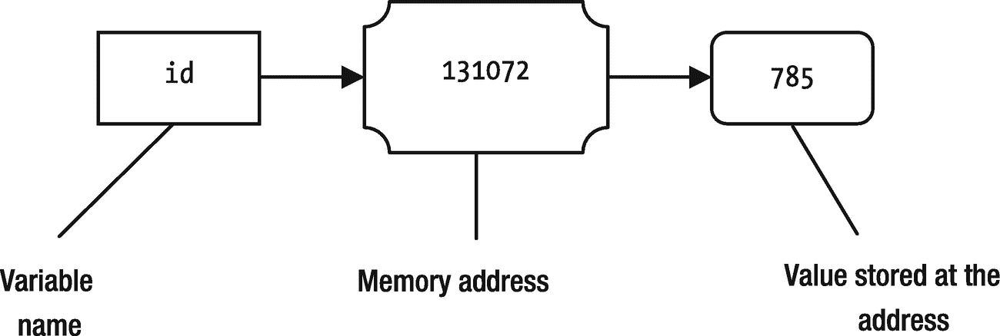

图 8-2

变量名、它的内存地址和数据之间的关系

在图 [8-2](#Fig2) 中，你看到变量`id`的实际数据存储在内存地址。您也可以将数据存储在不是变量实际值的内存地址中；相反，它是存储实际值的位置的内存地址。在这种情况下，存储在第一存储器地址的值是对存储在某个其他存储器地址的实际数据的引用，这样的值被称为引用或指针。如果一个变量存储了对某些数据的引用，它就被称为*引用变量*。

对比短语“变量”和“参考变量”变量在其内存位置存储实际数据本身。引用变量存储实际数据的引用(或内存地址)。图 [8-3](#Fig3) 描述了变量和参考变量之间的差异。


图 8-3

变量和参考变量之间的差异

在图 [8-3](#Fig3) 中，`idRef`为参考变量，`id`为变量。这两个变量分别分配内存。`785`的实际值存储在 id 变量的存储位置，即`131072`。然而，`idRef`的内存位置(`262144`)存储了`785`所在的`id`变量(或内存位置)的地址。您可以使用这两个变量中的任何一个来获取内存中的值`785`。获取引用变量所引用的实际数据的操作称为*解引用*。

方法(在某些编程语言中也称为函数或过程)可以选择性地接受来自其调用者的参数。方法的参数允许在调用方上下文和方法上下文之间共享数据。实践中有许多机制将参数传递给方法。下面几节讨论一些常用的参数传递机制。

### 按值传送

按值传递是最容易理解的参数传递机制。然而，它不一定在所有情况下都是最有效和最容易实现的。当调用一个方法时，实际参数的值被复制到形参中。当方法执行开始时，内存中存在该值的两个副本:一个副本用于实参，一个副本用于形参。在方法内部，形参操作它自己的值的副本。对形式参数值的任何更改都不会影响实际参数的值。

图 [8-4](#Fig4) 描述了使用传值机制调用方法时的内存状态。需要强调的是，一旦形式参数获得了它的值，也就是实际参数的副本，这两个参数就彼此无关了。形参在方法调用结束时被丢弃。但是，在方法调用结束后，实际参数会保留在内存中。实际参数在内存中保留多长时间取决于实际参数的上下文。

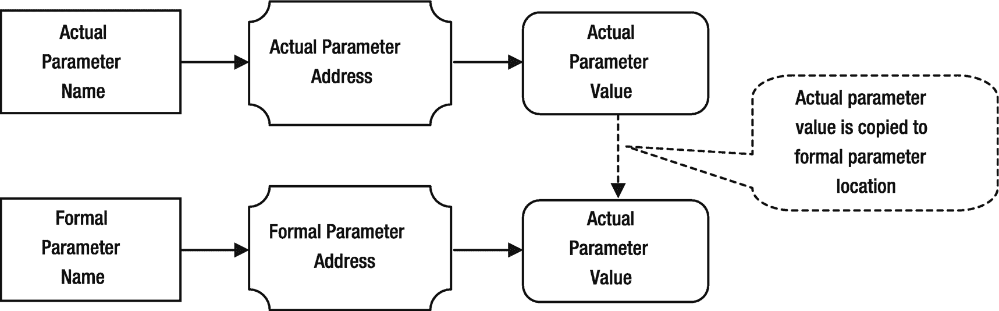

图 8-4

调用方法时实际参数和形参的内存状态

考虑下面一个`increment()`方法的代码，它接受一个`int`参数并按`2`递增:

```java
// Assume that num is passed by value
void increment(int num) {
    /* #2 */
    num = num + 2;
    /* #3 */
}

```

假设您用下面的代码片段调用了`increment()`方法:

```java
int id = 57;
/* #1 */
increment(id);
/* #4 */

```

代码中的四个执行点被标记为#1、#2、#3 和#4。表 [8-4](#Tab4) 描述了在`increment()`方法被调用之前、之后以及调用时，实参和形参的存储状态。注意，形式参数`num`不再存在于#4 的内存中。

表 8-4

当 increment()方法被调用并且参数通过值传递时，实参和形参的内存状态描述

<colgroup><col class="tcol1 align-left"> <col class="tcol2 align-left"> <col class="tcol3 align-left"></colgroup> 
| 

执行点

 | 

实际参数 id 的存储状态

 | 

形参 num 的存储状态

 |
| --- | --- | --- |
| `#1` | `id`变量存在于内存中，其值为 57。 | 此时不存在`num`变量。 |
| `#2` | `id`变量存在于内存中，其值为 57。 | 形式参数`num`已在内存中创建。实际参数`id`的值已被复制到与`num`变量相关的地址。此时，`num`保存的值为 57。 |
| `#3` | `id`变量存在于内存中，其值为 57。 | 此时，`num`的值为 59。 |
| `#4` | `id`变量存在于内存中，其值为 57。 | 形式参数`num`此时不存在于内存中，因为方法调用已经结束。 |

当方法调用结束时，包括形参在内的所有局部变量都将被丢弃。您可以观察到在`increment()`方法中增加形参的值实际上是没有用的，因为它永远不会被传递回调用者环境。如果您想将一个值发送回调用者环境，您可以在方法体中使用一个`return`语句来完成。下面是`smartIncrement()`方法的代码，该方法将递增的值返回给调用者:

```java
// Assume that num is passed by value
int smartIncrement(int num) {
    num = num + 2;
    return num;
}

```

您将需要使用下面的代码片段来存储从`id`变量中的方法返回的增量值:

```java
int id = 57;
id = smartIncrement(id);  // Store the returned value in id
/* At this point id has a value of 59 */

```

请注意，通过值传递允许您使用多个参数将多个值从调用方环境传递给方法。但是，它只允许您从方法发回一个值。如果只考虑方法调用中的参数，那么按值传递是一种单向通信。它允许您使用参数将信息从调用方传递给方法。但是，它不允许您通过参数将信息传回给调用者。有时，您可能希望通过参数将多个值从一个方法发送到调用者的环境中。在这些情况下，您需要考虑向方法传递参数的不同方式。在这种情况下，按值传递机制没有任何帮助。

当参数通过值传递时，用于交换两个值的方法不起作用。考虑以下经典`swap()`方法的代码:

```java
// Assume that x and y are passed by value
void swap(int x, int y) {
    int temp = x;
    x = y;
    y = temp;
}

```

您可以使用下面的代码片段调用前面的`swap()`方法:

```java
int u = 75;
int v = 53;
swap(u, v);
/* At this point, u and v will be still 75 and 53, respectively */

```

至此，您应该能够理解为什么`u`和`v`的值在传递给`swap()`方法时没有被交换。当调用`swap()`方法时，`u`和`v`的值被分别复制到`x`和`y`形参的位置。在`swap()`方法内部，形式参数`x`和`y`的值被交换了，实际参数`u`和`v`的值根本没有被触及。当方法调用结束时，形参`x`和`y`被丢弃。

使用按值传递的优点如下:

*   很容易实现。

*   如果被复制的数据是一个简单的值，速度会更快。

*   实际参数在传递给方法时不会受到任何副作用的影响。

使用按值传递的缺点如下:

*   如果实际的参数是复杂的数据，比如一个大的对象，那么将数据复制到另一个内存位置即使不是不可能，也是很困难的。

*   复制大量数据会占用内存空间和时间，这可能会降低方法调用的速度。

### 按常数值传递

*通过常量值传递*与*通过值传递*本质上是相同的机制，唯一的区别是形式参数被视为常量，因此，它们不能在方法体内改变。实际参数的值被复制到形式参数中，如*中通过值*所做的。如果通过常量值传递形参，则只能读取方法体中形参的值。

### 通过引用传递

重要的是，不要混淆短语“引用”和“通过引用传递”“引用”是一条信息(通常是一个内存地址),用于获取存储在其他位置的实际数据。“通过引用传递”是一种将信息从调用者的环境传递给使用形式参数的方法的机制。

在按引用传递中，传递实参的内存地址，形参与实参的内存地址映射(或关联)。这种技术也称为别名，即多个变量与同一个内存位置相关联。形式参数名是实际参数名的别名。当一个人有两个名字时，无论你用两个名字中的哪一个，你指的都是同一个人。类似地，当参数通过引用传递时，无论您在代码中使用哪个名称(实际的参数名称或形式参数名称)，您都是在引用相同的内存位置，因此引用相同的数据。

在引用传递中，如果在方法内部修改了形参，实参会立即看到修改。图 [8-5](#Fig5) 描述了当一个方法的参数通过引用传递时，实参和形参的存储状态。


图 8-5

当参数通过引用传递时，实参和形参的记忆状态

许多书使用“通过引用”这个短语。然而，它们并不是指我们在本节中讨论的那个。它们实际上意味着“通过引用值传递”，我们将在下一节讨论这一点。请注意，在按引用传递中，您没有为形参分配单独的内存。相反，您只需将形式参数名与实际参数的相同内存位置相关联。

我们再做一遍`increment()`方法调用练习。这一次，假设`num`参数是通过引用传递的:

```java
// Assume that num is passed by reference
void increment(int num) {
    /* #2 */
    num = num + 2;
    /* #3 */
}

```

您将使用以下代码片段调用`increment()`方法:

```java
int id = 57;
/* #1 */
increment(id);
/* #4 */

```

表 [8-5](#Tab5) 描述了在`increment()`方法调用之前、之后和期间，实参和形参的内存状态。注意，在#4，形式参数`num`不再存在于内存中，在方法调用结束后，实际参数`id`仍然具有值`59`。

表 8-5

调用 increment()方法并通过引用传递参数时，实参和形参的内存状态描述

<colgroup><col class="tcol1 align-left"> <col class="tcol2 align-left"> <col class="tcol3 align-left"></colgroup> 
| 

执行点

 | 

实际参数 id 的存储状态

 | 

形参 num 的存储状态

 |
| --- | --- | --- |
| `#1` | `id`变量存在于内存中，其值为 57。 | 此时不存在`num`变量。 |
| `#2` | `id`变量存在于内存中，其值为 57。 | 形参名`num`已经和实参`id`的内存地址关联。在这一点上，`num`指的是`57`的值，和`id`指的完全一样。 |
| `#3` | `id`变量存在于内存中，其值为 59。在方法内部，您使用了名为`num`的形参将值增加 2。然而，`id`和`num`是同一个内存位置的两个名字，因此，`id`的值也是 59。 | 此时，`num`保存一个值`59`。 |
| `#4` | `id`变量存在于内存中，其值为`59`。 | 名为`num`的形参此时不存在于内存中，因为方法调用已经结束。 |

通过引用传递允许您在调用方环境和被调用的方法之间进行双向通信。您可以通过引用一个方法来传递多个参数，该方法可以修改所有参数。对形参的所有修改都会立即反映到调用者的环境中。这让您可以在两个环境之间共享多条数据。

经典的`swap()`方法示例在其参数通过引用传递时有效。考虑下面的`swap()`方法的定义:

```java
// Assume that x and y are passed by reference
void swap(int x, int y) {
    int temp = x;
    x = y;
    y = temp;
}

```

您可以使用下面的代码片段调用前面的`swap()`方法:

```java
int u = 75;
int v = 53;
swap(u, v);
/* At this point, u and v will be 53 and 75, respectively. */

```

考虑以下名为`getNumber()`的方法的代码片段:

```java
// Assume that x and y are passed by reference
int getNumber(int x, int y) {
    int x = 3;
    int y = 5;
    int sum = x + y;
    return sum;
}

```

假设您如下调用`getNumber()`方法:

```java
int w = 100;
int s = getNumber(w, w);
/* What is the value of s at this point: 200, 8, 10 or something else? */

```

当`getNumber()`方法返回时，变量`s`中会存储什么值？注意，`getNumber()`方法的两个参数都是通过引用传递的，并且在调用中为两个参数传递了同一个变量`w`。当`getNumber()`方法开始执行时，形参`x`和`y`是同一个实参`w.`的别名。当你使用`w`、`x`或 y 时，你指的是内存中相同的数据。在将`x`和`y`相加并将结果存储在`sum`局部变量中之前，该方法将`y`的值设置为`5`，使得`w`、`x`和`y`的值都为`5`。当`x`和`y`被添加到方法内部时，`x`和`y`都引用值`5`。`getNumber()`方法返回`10`。

考虑将对`getNumber()`方法的另一个调用作为表达式的一部分，如下所示:

```java
int a = 10;
int b = 19;
int c = getNumber(a, b) + a;
/* What is the value of c at this point? */

```

在前面的代码片段中猜测`c`的值有点棘手。您需要考虑`getNumber()`方法调用对实际参数的副作用。`getNumber()`方法将返回`8`，它还将把`a`和`b`的值分别修改为`3`和`5`。值`11` ( `8 + 3`)将被分配给`c`。考虑下面的语句，其中您更改了加法运算符的操作数顺序:

```java
int a = 10;
int b = 19;
int d =  a + getNumber(a, b);
/* What is the value of d at this point? */

```

`d`的值将是`18` ( `10 + 8`)。本地值 10 将用于`a`。如果参数是通过引用传递的，您需要考虑方法调用对实际参数的副作用。你可能会认为表达式`getNumber(a, b) + a`和`a + getNumber(a, b)`会给出相同的结果。然而，正如我们已经解释过的，当参数通过引用传递时，结果可能不一样。

使用按引用传递的优点如下:

*   与按值传递相比，它更有效，因为不复制实际的参数值。

*   它允许您在调用者和被调用的方法环境之间共享多个值。

使用按引用传递的缺点如下:

*   如果调用者没有考虑到对被调用方法内部的实际参数所做的修改，这可能是危险的。

*   由于形式参数对实际参数的副作用，程序逻辑不容易理解。

### 按参考值传递

使用按引用值传递向方法传递参数的机制不同于按引用传递。然而，这两种机制具有相同的效果。在通过引用值传递中，实参的引用被复制到形参。形式参数使用解引用机制来访问实际参数的值。方法内部的形参所做的修改对于实际的形参来说是直接可见的，就像通过引用传递一样。图 [8-6](#Fig6) 描述了使用引用值传递机制时，实际参数和形式参数的存储状态。

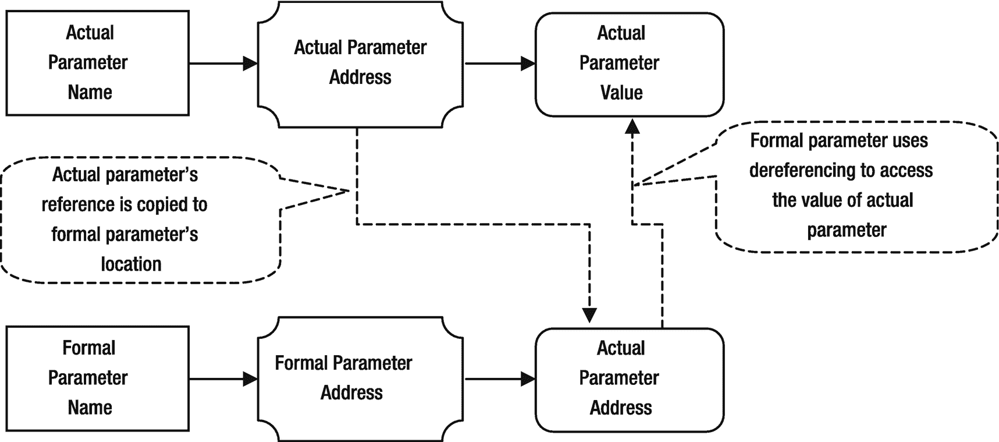

图 8-6

当使用引用值传递机制进行方法调用时，实际参数和形参的内存状态

按引用传递和按引用值传递有一个重要的区别。在通过引用值传递中，实参的引用作为方法调用的一部分被复制到形参。但是，您可以更改形参以引用方法内部的不同内存位置，这不会使实际形参引用内存中的新位置。一旦更改了存储在形参中的引用，对存储在新位置的值所做的任何更改都不会更改实际参数的值。

涉及通过引用传递的副作用和存储器状态的讨论和示例也适用于通过引用值传递机制。大多数编程语言使用按引用值传递来模拟按引用传递机制。

### 通过常量参考值

按恒定参考值传递本质上与按参考值传递相同，只是有一点不同。形参被视为方法体内的常量。也就是说，在方法的整个执行过程中，形参持有实参持有的引用的副本。不能在方法体内部修改形参来保存除实际形参所引用的数据之外的数据引用。

### 按结果传递

你可以把按结果传递看作是按值传递的反义词。在按值传递中，实际参数的值被复制到形参中。在按结果传递中，实参的值不会复制到形参中。当方法执行开始时，形参被视为未初始化的局部变量。在方法执行期间，形参被赋值。在方法执行结束时，形参的值被复制回实参。

图 [8-7](#Fig7) 描述了使用参数传递的结果传递机制时，实参和形参的存储状态。

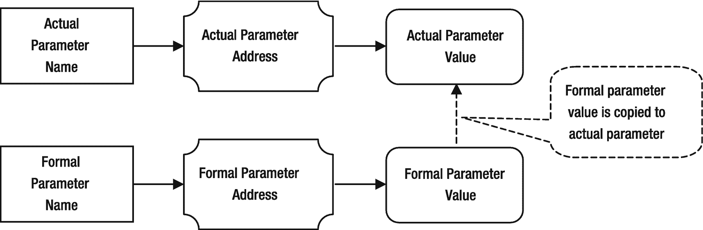

图 8-7

使用按结果传递参数机制时，实际参数和形式参数的内存状态

当使用按结果传递机制时，有时形式参数也被称为`OUT`参数。它们被称为`OUT`参数，因为它们被用于*从方法中复制*一个值到调用者的环境中。同样，如果使用传值机制，形式参数有时也称为`IN`参数，因为它们用于*复制*实际参数的值。

### 按值传递结果

也称为按复制-还原传递，这是按值传递和按结果传递的组合(因此得名“按值传递结果”)。它也被称为传递参数的`IN-OUT`方式。当调用一个方法时，实际参数的值被复制到形参中。在方法的执行过程中，形参对它自己的数据本地副本进行操作。当方法调用结束时，形参的值被复制回实参。这就是它也被称为通过拷贝还原传递的原因。它在方法调用开始时复制实参的值，在方法调用结束时在实参中恢复形参的值。图 [8-8](#Fig8) 描绘了使用按值传递结果机制传递参数时，实参和形参的存储状态。

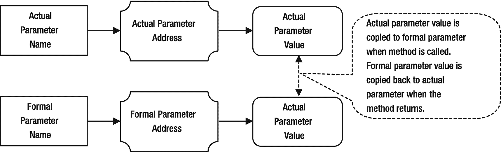

图 8-8

使用按结果传递参数机制时，实际参数和形式参数的内存状态

它以不同的方式实现了按引用传递的效果。在按引用传递中，对形参的任何修改对实参都是可见的。在按值传递结果中，只有当方法调用返回时，对形参的任何修改对实参才是可见的。如果使用按值传递结果的形参在一个方法中被多次修改，那么实际的形参只能看到最后修改的值。

按值传递结果用于模拟分布式应用程序中的引用传递。假设您进行了一个远程方法调用，它在不同的机器上执行。存在于一台机器上的实际参数的引用(内存地址)在执行远程方法的机器上没有任何意义。在这种情况下，客户端应用程序向远程机器发送实际参数的副本。复制到形参的值在远程机器上。形式参数对副本进行操作。当远程方法调用返回时，远程机器上的形参值被复制回客户机上的实参。这为客户端代码提供了通过引用运行在另一台机器上的远程方法来传递参数的功能。

### 按名字传递

通常，在将实际参数表达式的值/引用传递给方法之前，会对其进行计算。在按名称传递中，调用方法时不计算实际参数的表达式。方法体中的形参名称在文本上被替换为相应的实参表达式。在方法的执行过程中，每次遇到实际参数时都会对其进行计算，并且这些参数是在调用方的上下文中计算的，而不是在方法的上下文中。如果在替换过程中，方法中的局部变量与实际的参数表达式之间存在名称冲突，则局部变量将被重命名，以便为每个变量提供唯一的名称。

按名称传递是使用 thunks 实现的。一个 *thunk* 是一段代码，它在特定的上下文中计算并返回表达式的值。为每个实际参数生成一个 thunk，它的引用被传递给方法。每次使用形参时，都会调用 thunk，它在调用者上下文中计算实际的形参。

按名称传递的优点是，除非在方法中使用实际参数，否则永远不会计算它们。这也被称为懒惰评估。与传值机制形成对比，在传值机制中，实际参数总是在被复制到形参之前进行计算。这叫热切评价。按名称传递的缺点是，每次在方法体中使用相应的形式参数时，都要计算实际参数。如果一个方法使用了按名称传递的形参，也很难理解它的逻辑，这也有副作用。

考虑方法`squareDivide()`的如下声明:

```java
int squareDivide(int x, int y) {
    int z =  x * x/y * y;
    return z;
}

```

考虑下面调用`squareDivide()`方法的代码片段:

```java
squareDivide((4+4), (2+2));

```

您可以想象这个调用的执行，就像您编写了如下的`squareDivide()`方法一样。注意，`(2+2)`和`(4+4)`的实际参数表达式在方法体内被多次求值:

```java
int squareDivide() {
    int z = (4+4)*(4+4)/(2+2)*(2+2);
    return z;
}

```

### 因需要而错过

按需要传递类似于按名称传递，只有一点不同。在按名称传递中，每次在方法中使用实际参数时，都会对其进行计算。在按需传递中，实际参数仅在第一次使用时评估一次。当第一次调用实际参数的 thunk 时，它计算实际参数表达式，缓存该值并返回它。当再次调用同一个 thunk 时，它只是返回缓存的值，而不是再次重新计算实际的参数表达式。

## Java 中的参数传递机制

Java 支持两种数据类型:原始数据类型和引用数据类型。原始数据类型是一种简单的数据结构，它只有一个相关的值。引用数据类型是一种复杂的数据结构，它代表一个对象。原始数据类型的变量将值直接存储在其内存地址中。假设你有一个`int`变量`id`。此外，假设它已经被赋值为`754`，并且它的存储器地址是`131072`:

```java
int id = 754;

```

图 [8-9](#Fig9) 显示了`id`变量的记忆状态。

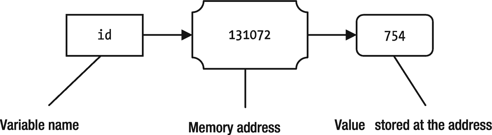

图 8-9

id 变量的值为 754 时的内存状态

值`754`直接存储在与`id`变量名相关联的内存地址`131072`中。如果执行下面的语句，将一个新值`351`赋给`id`变量，会发生什么？

```java
id = 351;

```

当一个新值`351`被分配给`id`变量时，在如图 [8-10](#Fig10) 所示的存储地址旧值`754`被新值替换。

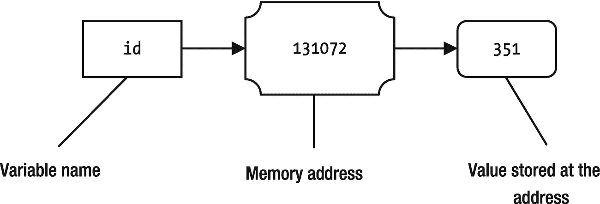

图 8-10

当新值 351 赋给 id 变量时，该变量的内存状态

当你使用对象和引用变量时，情况就不同了。考虑清单 [8-16](#PC116) 中所示的`Car`类的声明。它有三个实例变量——`model`、`year`和`price`——分别被赋予了初始值`"Unknown"`、`2000`和`0.0`。

```java
// Car.java
package com.jdojo.cls;
public class Car {
    public String model = "Unknown";
    public int year     = 2000;
    public double price = 0.0;
}

Listing 8-16Car Class with Three Public Instance Variables

```

当创建引用类型的对象时，该对象是在堆上创建的，并存储在特定的内存地址。让我们创建一个`Car`类的对象，如下所示:

```java
new Car();

```

图 [8-11](#Fig11) 显示了执行前一条语句创建一个`Car`对象时的内存状态。您可能假设存储对象的内存地址是`262144`。请注意，当创建一个对象时，会为它的所有实例变量分配内存，并对它们进行初始化。在这种情况下，新`Car`对象的`model`、`year`、`price`已经被正确初始化，如图所示。


图 8-11

使用 new Car()语句创建 Car 对象时的内存状态

此时，没有办法从 Java 程序中引用新创建的`Car`对象，即使它存在于内存中。`new`操作符(在`new Car()`中使用)返回它创建的对象的内存地址。在你的例子中，它将返回`262144`。回想一下，数据的内存地址(在您的例子中是`Car`对象)也被称为该数据的引用。从现在开始，你会说 Java 中的`new`操作符返回对它创建的对象的引用，而不是说它返回对象的内存地址。两者的意思是一样的。然而，Java 使用术语“引用”，它比“内存地址”有更一般的含义为了访问新创建的`Car`对象，您必须将它的引用存储在一个引用变量中。回想一下，引用变量存储对某些数据的引用，这些数据存储在其他地方。引用类型的所有变量在 Java 中都是引用变量。Java 中的引用变量可以存储一个`null`引用，也就是说不引用任何东西。考虑下面的代码片段，它对引用变量执行不同的操作:

```java
Car myCar = null;   /* #1 */
myCar = new Car();  /* #2 */
Car xyCar = null;   /* #3 */
xyCar = myCar;      /* $4 */

```

当执行标记为#1 的语句时，为引用变量`myCar`分配内存，比如在内存地址`8192`。`null`值是一个特殊值，通常是零的内存地址，存储在`myCar`变量的内存地址。图 [8-12](#Fig12) 描述了当`myCar`变量被分配了一个`null`参考值时，该变量的存储状态。

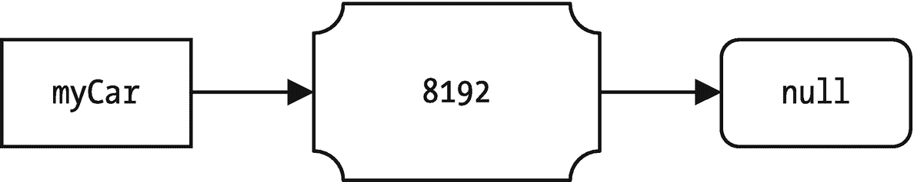

图 8-12

执行“Car myCar = null”语句时，myCar 变量的内存状态

标记为#2 的语句的执行是一个两步过程。首先，它执行语句的`new Car()`部分来创建一个新的`Car`对象。假设新的`Car`对象被分配在内存地址 9216。`new Car()`表达式返回新对象的引用，即`9216`。第二步，新对象的引用存储在`myCar`引用变量中。图 [8-13](#Fig13) 显示了执行标记为#2 的语句后`myCar`参考变量和新`Car`对象的存储状态。注意，新的`Car`对象(`9216`)的内存地址和`myCar`引用变量的值在这一点上是匹配的。您不需要担心本例中用于内存地址的数字；我只是编了一些数字来说明内部是如何使用内存地址的。Java 不允许你访问对象或变量的内存地址。Java 允许你通过引用变量来访问/修改对象的状态。


图 8-13

当执行 myCar = new Car()语句时，myCar 引用变量和 new Car 对象的内存状态

标记为#3 的语句类似于标记为#1 的语句。参考变量`xyCar`的存储状态如图 [8-14](#Fig14) 所示，假设`10240`是参考变量`xyCar`的存储地址。


图 8-14

xyCar 参考变量的存储状态

有趣的是要注意执行标记为#4 的语句时的内存状态。声明内容如下:

```java
xyCar = myCar;  /* #4 */

```

回想一下，变量名有两个关联:内存地址和存储在该内存地址的值。存储器地址(或位置)也称为其`lvalue`，而存储在其存储器地址的值也称为`rvalue`。当一个变量被用在赋值操作符的左边时(在标签为#4 的语句中的`xyCar`，它指的是它的内存地址。当一个变量用在赋值操作符的右边时(在标签为#4 的语句中为`myCar`，它指的是存储在其内存地址中的值(`rvalue`)。标记为#4 的语句可解读如下:

```java
xyCar = myCar; /* #4 */
At lvalue of xyCar store rvalue of myCar;       /* #4 – another way */
At memory address of xyCar store value of myCar /* #4 – another way */

```

因此，当你执行语句`xyCar = myCar`时，它读取`myCar`的值，也就是`9216`，并将其存储在`xyCar`的内存地址。引用变量`myCar`存储一个对`Car`对象的引用。像`xyCar = myCar`这样的赋值不会复制`myCar`引用的对象。相反，它将存储在`myCar`(对`Car`对象的引用)中的值复制到`xyCar`。当赋值`xyCar = myCar`完成时，`myCar`和`xyCar`的引用变量引用了内存中的同一个`Car`对象。此时，内存中只存在一个`Car`对象。图 [8-15](#Fig15) 显示了执行#4 语句时的内存状态。

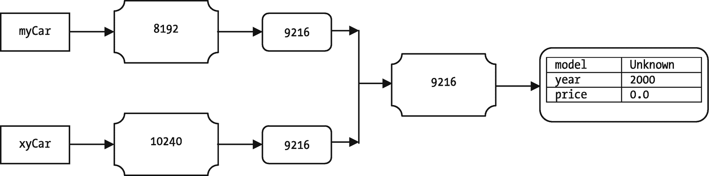

图 8-15

显示 myCar 和 xyCar 引用内存中相同汽车对象的内存状态

这时，你可以使用引用变量`myCar`或`xyCar`来访问内存中的`Car`对象。以下代码片段将访问内存中的同一个对象:

```java
myCar.model = "Civic LX"; /* Use myCar to change model */
myCar.year  = 1999;       /* Use myCar to change year */
xyCar.price = 16000.00;   /* Use xyCar to change the price */

```

执行前三条语句后，`Car`对象的`model`、`year`、`price`将被改变；记忆状态将如图 [8-16](#Fig16) 所示。

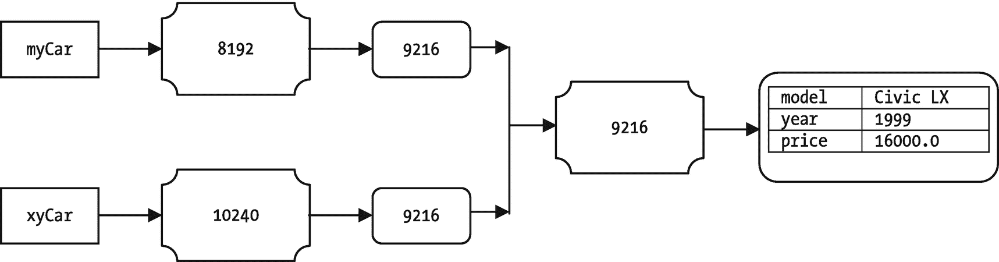

图 8-16

显示在使用 myCar 和 xyCar 更改汽车对象的状态后，myCar 和 xyCar 在内存中引用同一个汽车对象的内存状态

此时，内存中存在两个参考变量`myCar`和`xyCar`以及一个`Car`对象。两个引用变量引用同一个`Car`对象。让我们执行下面的语句，并将其标记为#5:

```java
myCar = new Car(); /* #5 */

```

前面的语句将在内存中创建一个新的`Car`对象，其实例变量具有初始值，并将新的`Car`对象的引用分配给`myCar`引用变量。`xyCar`引用变量仍然引用它之前引用的`Car`对象。假设新的`Car`对象已经被分配在存储器地址`5120`。两个参考变量`myCar`和`xyCar`以及两个`Car`对象的存储状态如图 [8-17](#Fig17) 所示。

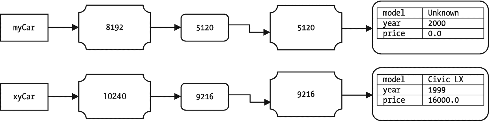

图 8-17

参考变量 myCar 和 xyCar 以及两个 Car 对象的内存状态

让我们再做一次修改，将参考变量`xyCar`设置为`null`，如下所示:

```java
xyCar = null; /* #6 */

```

图 [8-18](#Fig18) 显示了语句#6 执行后的内存状态。

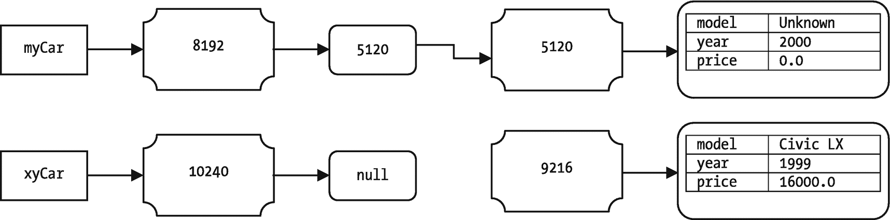

图 8-18

引用变量 myCar 和 xyCar 以及两个 Car 对象在 xyCar 被赋予空引用后的内存状态

现在`xyCar`引用变量存储了一个`null`引用，它不再引用任何`Car`对象。带有`Civic LX`模型的`Car`对象没有被任何引用变量引用。您根本无法在您的程序中访问这个`Car`对象，因为您没有对它的引用。在 Java 术语中，带有`Civic LX`模型的`Car`对象是不可达的。当内存中的对象不可访问时，它就有资格进行垃圾收集。注意，在`xyCar`被设置为`null`后，具有`Civic LX`模型的`Car`对象不会立即被销毁(或释放)。它会一直留在内存中，直到垃圾收集器运行并确保它不可到达。有关如何释放对象内存的更多细节，请参考一本关于垃圾收集的书。

我们已经介绍了足够多的关于变量类型以及它们如何在 Java 中工作的背景知识。是时候讨论 Java 中的参数传递机制了。简而言之，我们可以声明

> *Java 中的所有参数都是通过值传递的。*

这个简短的声明引起了很多混乱。这是否意味着当一个参数是引用类型时，实际参数所引用的对象会被复制并赋给形参？用例子详细说明“Java 中的所有参数都是通过值传递的”这句话很重要。即使是资深的 Java 程序员也很难理解 Java 中的参数传递机制。更详细地说，Java 支持以下四种类型的参数传递机制:

*   按值传送

*   按常数值传递

*   按参考值传递

*   通过常量参考值

注意，在 Java 中传递参数的所有四种方式都包括单词“value”这就是为什么许多关于 Java 的书籍将它们总结为“Java 通过值传递所有参数”有关前面提到的四种类型的参数传递机制的更多细节，请参考上一节。

前两种类型，按值传递和按常数值传递，适用于原始数据类型的参数。最后两种类型，按引用值传递和按常量引用值传递，适用于引用类型的参数。

当形参属于原始数据类型时，实际形参的值被复制到形参中。在方法体中对形参值的任何改变只会改变形参的副本，而不会改变实际形参的值。现在您可以知道交换两个原始值的`swap()`方法在 Java 中不起作用。

清单 [8-17](#PC124) 演示了`swap()`方法不能用 Java 编写，因为原始类型的参数是通过值传递的。输出显示`swap()`方法的`x`和`y`形参接收了`a`和`b`的值。`x`和`y`的值在方法内部交换，这完全不影响实际参数`a`和`b`的值。

```java
// BadSwapTest.java
package com.jdojo.cls;
public class BadSwapTest {
    public static void swap(int x, int y) {
        System.out.println("#2: x = " + x + ", y = " + y);
        int temp = x;
        x = y;
        y = temp;
        System.out.println("#3: x = " + x + ", y = " + y);
    }
    public static void main(String[] args) {
        int a = 19;
        int b = 37;
        System.out.println("#1: a = " + a + ", b = " + b);
        // Call the swap() method to swap values of a and b
        BadSwapTest.swap(a, b);
        System.out.println("#4: a = " + a + ", b = " + b);
    }
}
#1: a = 19, b = 37
#2: x = 19, y = 37
#3: x = 37, y = 19
#4: a = 19, b = 37

Listing 8-17An Incorrect Attempt to Write a swap() Method to Swap Two Values of Primitive Types in Java

```

原始类型参数通过值传递。但是，您可以在方法内部修改形参的值，而不会影响实际的形参值。Java 也允许你传递常量值。在这种情况下，不能在方法内部修改形参。通过制作实参的副本，用实参的值初始化形参，然后就是常数值，只能读取。您需要在正式的参数声明中使用`final`关键字来表明您打算通过常量值传递参数。任何改变参数值的尝试都会导致编译时错误。清单 [8-18](#PC126) 演示了如何使用传递常量值机制将参数`x`传递给`test()`方法。任何试图改变`test()`方法中形参`x`值的行为都会导致编译时错误。如果在`test()`方法中取消对`"x = 10;"`语句的注释，将会出现以下编译器错误:

```java
Error(10):  final parameter x may not be assigned

```

您已经向`test()`方法传递了两个参数`x`和`y`。参数`y`是通过值传递的，因此可以在方法内部进行更改。这可以通过查看输出来确认。

```java
// PassByConstantValueTest.java
package com.jdojo.cls;
public class PassByConstantValueTest {
    // x is passed by constant value and y is passed by value
    public static void test(final int x, int y) {
        System.out.println("#2: x = " + x + ", y = " + y);
        /* Uncommenting the following statement will generate a compile-time error */
        // x = 79; /* Cannot change x. It is passed by constant value */
        y = 223; // Ok to change y
        System.out.println("#3: x = " + x + ", y = " + y);
    }

    public static void main(String[] args) {
        int a = 19;
        int b = 37;
        System.out.println("#1: a = " + a + ", b = " + b);
        PassByConstantValueTest.test(a, b);
        System.out.println("#4: a = " + a + ", b = " + b);
    }
}
#1: a = 19, b = 37
#2: x = 19, y = 37
#3: x = 19, y = 223
#4: a = 19, b = 37

Listing 8-18An Example of Pass by Constant Value

```

让我们讨论一下引用类型参数的参数传递机制。Java 允许您使用按引用值传递和按常量引用值传递机制将引用类型参数传递给方法。当参数通过引用值传递时，存储在实参中的引用被复制到形参中。当方法开始执行时，实参和形参都引用内存中的同一个对象。如果实参有一个`null`引用，形参将包含`null`引用。您可以将对另一个对象的引用分配给方法体中的形参。在这种情况下，形参开始引用内存中的新对象，而实参仍然引用它在方法调用之前引用的对象。清单 [8-19](#PC131) 展示了 Java 中的引用传递机制。它在`main()`方法中创建一个`Car`对象，并将`Car`对象的引用存储在`myCar`引用变量中:

```java
// Create a Car object and assign its reference to myCar
Car myCar = new Car();

```

它使用`myCar`引用变量修改新创建的`Car`对象的型号、年份和价格:

```java
// Change model, year and price of Car object using myCar
myCar.model = "Civic LX";
myCar.year  = 1999;
myCar.price = 16000.0;

```

输出中标记为#1 的消息显示了`Car`对象的状态。使用以下调用将引用变量`myCar`传递给`test()`方法:

```java
PassByReferenceValueTest.test(myCar);

```

由于`test()`方法中形参`xyCar`的类型是`Car`，这是一个引用类型，Java 使用通过引用值传递机制将`myCar`实参的值传递给`xyCar`形参。当调用`test(myCar)`方法时，Java 将存储在`myCar`引用变量中的`Car`对象的引用复制到`xyCar`引用变量中。当执行进入`test()`方法体时，`myCar`和`xyCar`引用内存中的同一个对象。此时，内存中只有一个`Car`对象，而不是两个。理解`test(myCar)`方法调用没有复制由`myCar`引用变量引用的`Car`对象是非常重要的。相反，它复制了由作为实际参数的`myCar`引用变量引用的`Car`对象的引用(内存地址),并将该引用复制到作为形式参数的`xyCar`引用变量。事实上，`myCar`和`xyCar`都引用了内存中的同一个对象，这由输出中标记为#2 的消息表示，该消息是使用`test()`方法中的`xyCar`形参打印的。

现在您创建一个新的`Car`对象，并将其引用分配给`test()`方法中的`xyCar`形参:

```java
// Let's make xyCar refer to a new Car object
xyCar = new Car();

```

此时，内存中有两个`Car`对象。`xyCar`形参引用了新的`Car`对象，而不是其引用被传递给方法的那个对象。注意，实际的参数`myCar`仍然引用您在`main()`方法中创建的`Car`对象。输出中标记为#3 的消息表明了`xyCar`形参引用了新的`Car`对象。当`test()`方法调用返回时，`main()`方法打印被`myCar`引用变量引用的`Car`对象的详细信息。参见清单 [8-19](#PC131) 。

Tip

当引用类型的参数传递给 Java 中的方法时，形参可以像实参一样访问对象。形式参数可以通过直接更改实例变量的值或调用对象上的方法来修改对象。通过形参对对象进行的任何修改都可以通过实参立即看到，因为两者都在内存中保存对同一个对象的引用。可以修改形参本身来引用方法中的另一个对象(或`null`引用)。

```java
// PassByReferenceValueTest.java
package com.jdojo.cls;
public class PassByReferenceValueTest {
    public static void main(String[] args) {
        // Create a Car object and assign its reference to myCar
        Car myCar = new Car();
        // Change model, year and price of Car object using myCar
        myCar.model = "Civic LX";
        myCar.year = 1999;
        myCar.price = 16000.0;
        System.out.println("#1: model = " + myCar.model
                + ", year = " + myCar.year
                + ", price = " + myCar.price);
        PassByReferenceValueTest.test(myCar);
        System.out.println("#4: model = " + myCar.model
                + ", year = " + myCar.year
                + ", price = " + myCar.price);
    }

    public static void test(Car xyCar) {
        System.out.println("#2: model = " + xyCar.model
                + ", year = " + xyCar.year
                + ", price = " + xyCar.price);
        // Let's make xyCar refer to a new Car object
        xyCar = new Car();
        System.out.println("#3: model = " + xyCar.model
                + ", year = " + xyCar.year
                + ", price = " + xyCar.price);
    }
}
#1: model = Civic LX, year = 1999, price = 16000.0
#2: model = Civic LX, year = 1999, price = 16000.0
#3: model = Unknown, year = 2000, price = 0.0
#4: model = Civic LX, year = 1999, price = 16000.0

Listing 8-19An Example of Pass by Reference Value

```

如果不希望该方法更改引用类型形参来引用不同于实际形参所引用的对象，可以使用按常量引用值传递机制来传递该形参。如果在引用类型形参声明中使用关键字`final`，则形参通过常量引用值传递，形参不能在方法内部修改。下面的`test()`方法声明将`xyzCar`形参声明为`final`，参数通过常量引用值传递。该方法试图通过给`xyzCar`形参分配一个`null`引用，然后给一个新的`Car`对象分配一个引用来改变它。这两个赋值语句都会生成编译器错误:

```java
// xyzCar is passed by constant reference value because it is declared final
void test(final Car xyzCar) {
    // Can read the object referenced by xyzCar
    String model = xyzCar.model;
    // Can modify object referenced by xyzCar
    xyzCar.year = 2001;
    /* Cannot modify xyzCar. That is, xyzCar must reference the object what the actual
       parameter is referencing at the time this method is called. You cannot even set it to
       null reference.
    */
    xyzCar = null;      // A compile-time error. Cannot modify xyzCar
    xyzCar = new Car(); // A compile-time error. Cannot modify xyzCar
}

```

让我们再讨论一个关于 Java 中参数传递机制的例子。考虑下面的`changeString()`方法代码:

```java
public static void changeString(String s2) {
    /* #2 */
    s2 = s2 + " there";
    /* #3 */
}

```

考虑下面调用`changeString()`方法的代码片段:

```java
String s1 = "hi";
/* #1 */
changeString(s1);
/* #4 */

```

#4 的`s1`会是什么内容？`String`是 Java 中的引用类型。在#1，`s1`正在引用一个内容为`"hi"`的`String`对象。当调用`changeString(s1)`方法时，`s1`通过引用值传递给`s2`。在#2，`s1`和`s2`引用内存中相同的`String`对象，其内容为`"hi"`。当

```java
s2 = s2 + " there";

```

语句执行后，会发生两件事。首先，计算`s2 + " there"`表达式，在内存中创建一个新的`String`对象，内容为`"hi there"`，并返回其引用。由`s2 + " there"`表达式返回的引用被分配给`s2`形参。此时内存中有两个`String`对象:一个是`"hi"`的内容，另一个是`"hi there"`的内容。在#3，实参`s1`引用内容为`"hi"`的`String`对象，形参`s2`引用内容为`"hi there"`的`String`对象。当`changeString()`方法调用结束时，形参`s2`被丢弃。请注意，在`changeString()`方法调用结束后，内容为`"hi there"`的`String`对象仍然存在于内存中。当方法调用结束时，只有形参被丢弃，而不是形参所引用的对象。在#4，引用变量`s1`仍然引用内容为`"hi"`的`String`对象。清单 [8-20](#PC136) 有完整的代码试图修改`String`类型的形参。

Tip

一个`String`对象是不可变的，这意味着它的内容在创建后不能被改变。如果你需要改变一个`String`对象的内容，你必须用新的内容创建一个新的`String`对象。

```java
// PassByReferenceValueTest2.java
package com.jdojo.cls;
public class PassByReferenceValueTest2 {
    public static void changeString(String s2) {
        System.out.println("#2: s2 = " + s2);
        s2 = s2 + " there";
        System.out.println("#3: s2 = " + s2);
    }
    public static void main(String[] args) {
        String s1 = "hi";
        System.out.println("#1: s1 = " + s1);
        PassByReferenceValueTest2.changeString(s1);
        System.out.println("#4: s1 = " + s1);
    }
}
#1: s1 = hi
#2: s2 = hi
#3: s2 = hi there
#4: s1 = hi

Listing 8-20Another Example of Pass by Reference Value Parameter Passing in Java

```

## 摘要

类中的方法定义了该类对象的行为或该类本身的行为。方法是一个命名的代码块。可以调用该方法来执行其代码。调用该方法的代码称为该方法的调用方。可选地，方法可以接受来自调用者的输入值，并且它可以向调用者返回值。输入值的列表称为方法的参数。Var-args 参数用于定义方法和构造函数的参数，它们可以接受可变数量的参数。方法总是在类或接口的主体中定义。

类的方法可以有以下四种访问级别之一:公共、私有、受保护或包级别。在定义它们时，关键字`public`、`private`或`protected`分别赋予它们公共、私有或受保护的访问级别。缺少这些关键字中的任何一个都会指定包级访问。

您可以在方法体中声明变量，这样的变量称为局部变量。与类的字段不同，默认情况下，局部变量不会初始化。局部变量必须先初始化，然后才能读取它们的值。试图在局部变量初始化之前读取局部变量的值会导致编译时错误。

一个类可以有两种方法:实例方法和类方法。实例方法和类方法也分别称为非静态方法和静态方法。实例方法用于实现类的实例(也称为对象)的行为。实例方法只能在类实例的上下文中调用。类方法用于实现类本身的行为。类方法总是在类的上下文中执行。`static`修饰符用于定义一个类方法。方法声明中缺少`static`修饰符使得该方法成为实例方法。

可以使用点标记法访问类的方法，其形式为

```java
<qualifier>.<method-name>(<method-actual-parameters>)

```

对于实例方法，限定符是对类实例的引用。对于类方法，限定符可以是类的实例的引用或类名。

您可以从类的非静态方法调用该类的静态方法；但是，不允许从静态方法调用非静态方法。类的静态方法可以访问该类的所有静态字段，而非静态方法可以访问该类的静态和非静态字段。

Java 有一个关键词叫做`this`。它是对类的当前实例的引用。它只能在实例的上下文中使用。它永远不能在类的上下文中使用，因为它意味着当前实例，而在类的上下文中不存在任何实例。关键字`this`用在许多上下文中，比如非静态方法、构造函数、实例初始化器和初始化实例变量的表达式。

向方法和构造函数传递参数有不同的机制。Java 使用按值传递和按常数值传递机制来传递原始数据类型的参数。通过引用值传递和通过常量引用值传递用于在 Java 中传递引用类型的参数。

EXERCISES

1.  Java 中的方法是什么？

2.  描述类的静态方法和非静态方法的区别。

3.  静态方法可以访问类的实例变量吗？如果你的答案是否定的，请解释原因。

4.  `void`作为方法的返回类型是什么意思？

5.  用两个名为`x`和`y`的`int`实例变量创建一个名为`Point2D`的类。

    两个实例变量都应该声明为私有的。不要初始化这两个实例变量。为两个实例变量添加 setters 和 getters，这将允许`Point`类的用户更改和访问它们的值。声明 setters 为`setX(int x)`和`setY(int y)`，getters 为`getX()`和`getY()`。

6.  Implement a method named `distance` in the `Point2D` class that you created in the previous exercise. The method accepts an instance of the `Point2D` class and returns the distance between the current point and the point represented by the parameter. The method should be declared as follows:

    ```java
    public class Point2D {
        /* Code from the previous exercise goes here. */
        public double distance(Point2D p) {
            /* Your code for this exercise goes here. */
        }
    }

    ```

    提示两点`(x1, y1)`和`(x2, y2)`之间的距离计算为。您可以使用`Math.sqrt(n)`方法来计算一个数字`n`的平方根。

7.  Enhance the `Point2D` class by adding a static factory method named `create()`. A factory method in a class is used to create objects of the class. The `create()` method should be declared as follows:

    ```java
    public class Point2D {
        /* Code from the previous exercise goes here. */
        public Point2D create(int x, int y) {
            /* Your code for this exercise goes here. */
        }
    }

    ```

    从`create()`方法返回的`Point2D`对象的`x`和`y`实例变量应该分别初始化为该方法的`x`和`y`参数。

8.  用方法名`avg()`创建一个名为`MathUtil`的类。它计算并返回一系列数字的平均值。该方法必须接受最少带有两个`double`值的`double`类型的可变长度参数。运行`MathUtil`类并验证输出打印出正确的结果:

    ```java
    // MathUtil.java
    package com.jdojo.cls.excercise;
    public class MathUtil {
        public static void main(String[] args) {
            System.out.println("avg(10, 15) = " + avg(10, 15));
            System.out.println("avg(2, 3, 4) = " + avg(2, 3, 4));
            System.out.println("avg(20.5, 30.5, 40.5) = "
                               + avg(20.5, 30.5, 40.5));
            System.out.println("avg(-2.0, 0.0, 2.0) = "
                               + avg(-2.0, 0.0, 2.0));
        }
        public static double avg(/* Your parameters go here. */) {
            /* Your code goes here. */
        }
    }

    ```

9.  The `main()` method of a class serves as an entry point of a Java application. It is declared as follows:

    ```java
    public static void main(String[] args) {
        // Your code goes here
    }

    ```

    使用 var-args 更改`main()`方法的声明。

10.  当下面的`PassByValueTest`类运行时，输出会是什么？

    ```java
    // PassByValueTest.java
    package com.jdojo.cls.excercise;
    public class PassByValueTest {
        public static void main(String[] args) {
            int x = 100;
            System.out.println("x = " + x);
            change(x);
            System.out.println("x = " + x);
            Point2D p = new Point2D();
            p.setX(40);
            p.setY(60);
            System.out.println("p.x = " + p.getX()
                             + ", p.y = " + p.getY());
            changePointReference(p);
            System.out.println("p.x = " + p.getX()
                             + ", p.y = " + p.getY());
            changePoint(p);
            System.out.println("p.x = " + p.getX()
                             + ", p.y = " + p.getY());
        }
        public static void change(int x) {
            x = 200;
        }
        public static void changePointReference(Point2D p) {
            p = new Point2D();
        }
        public static void changePoint(Point2D p) {
            int newX = p.getX() / 2;
            int newY = p.getY() / 2;
            p.setX(newX);
            p.setY(newY);
        }
    }

    ```