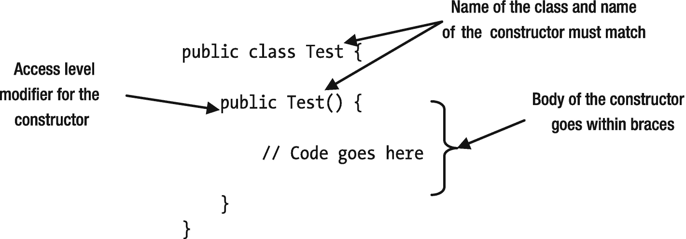
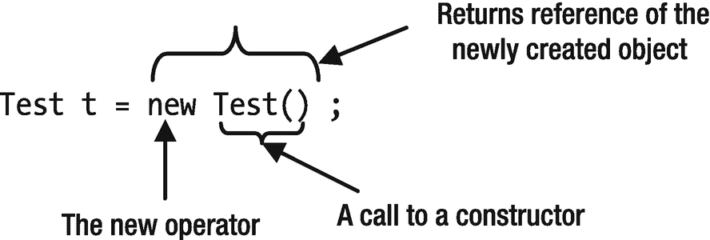

# 九、构造器

在本章中，您将学习:

*   什么是构造器以及如何使用它们

*   一个类的不同类型的初始化器

*   声明`final`变量、字段、类和方法

*   什么是泛型类以及如何使用它们

## 什么是构造器？

构造器是一个命名的代码块，用于在对象创建后立即初始化类的对象。构造器的结构看起来类似于方法。然而，两者之间的相似之处就止于此。它们是两种不同的结构，用于不同的目的。

## 声明构造器

构造器声明的一般语法如下:

```java
[modifiers] <constructor-name>(<parameters-list>) [throws-clause] {
    // Body of the constructor goes here
}

```

构造器的声明以修饰符开始。构造器的访问修饰符可以是`public`、`private`、`protected`或包级别(没有修饰符)。构造器名与类的简单名相同。构造器名后面是一对左括号和右括号，其中可能包含参数。或者，右括号后面可以跟一个`throws`子句，然后是一个逗号分隔的异常列表。我将在第 13 章[和](13.html)中讨论关键词`throws`的用法。放置代码的构造器体用大括号括起来。

如果你比较一下声明方法的语法和声明构造器的语法，你会发现它们几乎是一样的。建议在学习构造器声明时记住方法声明，因为大多数特征都是相似的。

下面的代码展示了一个为类`Test`声明构造器的例子。图 [9-1](#Fig1) 显示了构造器的解剖结构:



图 9-1

测试类构造器的剖析

```java
// Test.java
package com.jdojo.cls;
public class Test {
    public Test() {
        // Code goes here
    }
}

```

Tip

构造器的名称必须匹配类的简单名称，而不是完全限定名称。

与方法不同，构造器没有返回类型。您甚至不能将`void`指定为构造器的返回类型。考虑下面一个类`Test2`的声明:

```java
public class Test2 {
    // Below is a method, not a constructor.
    public void Test2() {
        // Code goes here
    }
}

```

类`Test2`是否声明了一个构造器？答案是否定的。类`Test2`没有声明构造器。相反，您可能看到的是一个方法声明，它与类的简单名称同名。它是一个方法声明，因为它指定了一个返回类型`void`。请注意，方法名也可以与类名相同，如本例所示。

仅仅名字本身并不能构成一个方法或构造器。如果构造的名称与类的简单名称相同，那么它可能是一个方法或构造器。如果它指定了返回类型，则它是一个方法。如果它没有指定返回类型，它就是一个构造器。

什么时候使用构造器？在新实例创建之后，使用带有`new`操作符的构造器来初始化一个类的实例(或对象)。有时短语“创建”和“初始化”在构造器的上下文中可以互换使用。但是，您需要清楚创建和初始化对象的区别。`new`操作符创建一个对象，构造器初始化该对象。

以下语句使用`Test`类的构造器来初始化`Test`类的对象:

```java
Test t = new Test();

```

图 [9-2](#Fig2) 显示了这种说法的剖析。`new`操作符后面是对构造器的调用。`new`操作符，连同构造器调用，例如`"new Test()"`，被称为实例(或对象)创建表达式。实例创建表达式在内存中创建一个对象，执行指定构造器体中的代码，最后返回新对象的引用。



图 9-2

用 new 运算符解析构造器调用

我已经介绍了足够多的关于声明构造器的理论。是时候看看一个构造器了。清单 [9-1](#PC5) 有一个`Cat`类的代码。

```java
// Cat.java
package com.jdojo.cls;
public class Cat {
    public Cat() {
        System.out.println("Meow...");
    }
}

Listing 9-1A Cat Class with a Constructor

```

`Cat`类声明了一个构造器。在构造器的主体内部，它打印一条消息`"Meow..."`。清单 [9-2](#PC6) 包含了一个`CatTest`类的代码，该类在其`main()`方法中创建了两个`Cat`对象。请注意，您总是使用对象创建表达式来创建一个新的`Cat`类对象。由您决定将新对象的引用存储在引用变量中。第一个`Cat`对象被创建，其引用未被保存。创建第二个`Cat`对象，其引用存储在引用变量`c`中。

```java
// CatTest.java
package com.jdojo.cls;
public class CatTest {
    public static void main(String[] args) {
        // Create a Cat object and ignore its reference
        new Cat();
        // Create another Cat object and store its reference in c
        Cat c = new Cat();
    }
}
Meow...
Meow...

Listing 9-2A Test Class That Creates Two Cat Objects

```

## 重载构造器

一个类可以有多个构造器。如果一个类有多个构造器，它们被称为*重载*构造器。由于构造器的名称必须与类的简单名称相同，因此有必要区分不同的构造器。重载构造器的规则与重载方法的规则相同。如果一个类有多个构造器，所有的构造器在数量、顺序或参数类型上都必须不同。清单 [9-3](#PC7) 包含了一个`Dog`类的代码，它声明了两个构造器。一个构造器不接受任何参数，另一个接受一个`String`参数。

```java
// Dog.java
package com.jdojo.cls;
public class Dog {
    // Constructor #1
    public Dog() {
        System.out.println("A dog is created.");
    }
    // Constructor #2
    public Dog(String name) {
        System.out.println("A dog named " + name + " is created.");
    }
}

Listing 9-3A Dog Class with Two Constructors, One with No Parameters and One with a String Parameter

```

如果一个类声明了多个构造器，您可以使用其中的任何一个来创建该类的对象。例如，下面两条语句创建了两个`Dog`类的对象:

```java
Dog dog1 = new Dog();
Dog dog2 = new Dog("Cupid");

```

第一条语句使用不带参数的构造器，第二条语句使用带`String`参数的构造器。如果使用带参数的构造器创建对象，实际参数的顺序、类型和数量必须与形参的顺序、类型和数量相匹配。清单 [9-4](#PC9) 有使用不同构造器创建两个`Dog`对象的完整代码。

```java
// DogTest.java
package com.jdojo.cls;
public class DogTest {
    public static void main(String[] args) {
        Dog d1 = new Dog();         // Uses Constructor #1
        Dog d2 = new Dog ("Canis"); // Uses Constructor #2
    }
}
A dog is created.
A dog named Canis is created.

Listing 9-4Testing the Constructors of the Dog Class

```

运行`DogTest`类的输出表明，当在`main()`方法中创建两个`Dog`对象时，会调用不同的构造器。

每个对象创建表达式调用一次构造器。在对象创建过程中，一个构造器的代码只能执行一次。如果一个构造器的代码被执行了`N`次，这意味着该类的`N`个对象将被创建，你必须使用`N`个对象创建表达式来完成。但是，当一个对象创建表达式调用一个构造器时，被调用的构造器可能会从它的主体调用另一个构造器。本书将在本节的后面介绍一个构造器调用另一个构造器的场景。

## 为构造器编写代码

到目前为止，您一直在用构造器编写琐碎的代码。在构造器中应该写什么样的代码？构造器的目的是初始化新创建的对象的实例变量。在构造器中，您应该限制自己只编写初始化对象实例变量的代码。调用构造器时，对象没有完全创建。该对象仍在创建过程中。如果假设内存中存在一个完整的对象，在构造器中编写一些处理逻辑，有时可能会得到意想不到的结果。让我们创建另一个类来表示一个狗对象。您将调用这个类`SmartDog`，如清单 [9-5](#PC10) 所示。

```java
// SmartDog.java
package com.jdojo.cls;
public class SmartDog {
    private String name;
    private double price;
    public SmartDog() {
        // Initialize the name to “Unknown” and the price to 0.0
        this.name = "Unknown";
        this.price = 0.0;
        System.out.println("Using SmartDog() constructor");
    }
    public SmartDog(String name, double price) {
        // Initialize name and price instance variables with the
        // values of the name and price parameters
        this.name = name;
        this.price = price;
        System.out.println("Using SmartDog(String, double) constructor");
    }
    public void bark() {
        System.out.println(name + " is barking...");
    }
    public void setName(String name) {
        this.name = name;
    }
    public String getName() {
        return this.name;
    }
    public void setPrice(double price) {
        this.price = price;
    }
    public double getPrice() {
        return this.price;
    }
    public void printDetails() {
        System.out.print("Name: " + this.name);
        if (price > 0.0) {
            System.out.println(", price: " + this.price);
        } else {
            System.out.println(", price: Free");
        }
    }
}

Listing 9-5A SmartDog Class That Declares Two Constructors to Initialize Instance Variables Differently

```

`SmartDog`级看起来大一点。但是，它的逻辑很简单。以下是您需要了解的`SmartDog`类中的要点:

*   它声明了两个实例变量；他们是`name`和`price`。`name`实例变量存储一只聪明狗的名字。`price`实例变量存储它的销售价格。

*   它声明了两个构造器。第一个构造器没有参数。它将 name 和 price 实例变量分别初始化为`"Unknown"`和`0.0`。第二个构造器接受两个名为`name`和`price`的参数。它将`name`和`price`实例变量初始化为传递给这两个参数的任何值。注意构造器中关键字`this`的使用。关键字`this`指的是构造器的代码正在执行的对象。在第一个构造器中没有必要使用关键字`this`。但是，您必须使用关键字`this`来引用第二个构造器中的实例变量，因为形参的名称隐藏了实例变量的名称。

*   这两个构造器在它们的主体中初始化实例变量(或者对象的状态)。它们不包括任何其他处理逻辑。

*   实例方法`bark()`在标准输出中打印一条消息，带有正在吠叫的智能狗的名字。

*   `setName()`和`getName()`方法用于设置和获取智能狗的名称。`setPrice()`和`getPrice()`方法用于设置和获取智能狗的价格。

*   `printDetails()`方法打印智能狗的`name`和`price`。如果智能狗的价格没有设置为正值，它会将价格打印为`"Free"`。

清单 [9-6](#PC11) 有一个`SmartDogTest`类的代码，演示了两个构造器如何初始化实例变量。

```java
// SmartDogTest.java
package com.jdojo.cls;
public class SmartDogTest {
    public static void main(String[] args) {
        // Create two SmartDog objects
        SmartDog sd1 = new SmartDog();
        SmartDog sd2 = new SmartDog("Nova", 219.2);
        // Print details about the two dogs
        sd1.printDetails();
        sd2.printDetails();
        // Make them bark
        sd1.bark();
        sd2.bark();
        // Change the name and price of Unknown dog
        sd1.setName("Opal");
        sd1.setPrice(321.80);
        // Print details again
        sd1.printDetails();
        sd2.printDetails();
        // Make them bark one more time
        sd1.bark();
        sd2.bark();
    }
}
Using SmartDog() constructor
Using SmartDog(String, double) constructor
Name: Unknown, price: Free
Name: Nova, price: 219.2
Unknown is barking...
Nova is barking...
Name: Opal, price: 321.8
Name: Nova, price: 219.2
Opal is barking...
Nova is barking...

Listing 9-6A Test Class to Demonstrate the Use of the SmartDog Class

```

## 从另一个构造器调用一个构造器

一个构造器可以调用同一个类的另一个构造器。我们来考虑下面这个`Test`类。它声明了两个构造器；一个不接受任何参数，一个接受一个`int`参数:

```java
public class Test {
    Test() {
    }
    Test(int x) {
    }
}

```

假设您想从不带参数的构造器中调用带`int`参数的构造器。你的第一次尝试是错误的，如下所示:

```java
public class Test {
    Test() {
        // Call another constructor
        Test(103); // A compile-time error
    }
    Test(int x) {
    }
}

```

前面的代码无法编译。Java 有一种特殊的方式从一个构造器调用另一个构造器。你必须使用关键字`this`，就像它是构造器的名字一样，从另一个构造器调用一个构造器。下面的代码使用语句"`this(103);"`从不带参数的构造器调用带`int`参数的构造器。这是关键字`this`的另一种用法:

```java
public class Test {
    Test() {
        // Call another constructor
        this(103); // OK. Note the use of the keyword this.
    }
    Test(int x) {
    }
}

```

从一个构造器调用另一个构造器有两条规则。这些规则确保一个构造器在一个类的对象创建过程中只执行一次。这些规则如下:

*   对另一个构造器的调用必须是该构造器中的第一条语句。

*   构造器不能调用自身。

如果一个构造器调用另一个构造器，它必须是构造器体中的第一个可执行语句。这使得编译器很容易检查一个构造器是否被调用过，并且只被调用过一次。例如，下面的代码将生成一个编译时错误，因为用`int`参数`this(k)`调用构造器是构造器体内的第二条语句，而不是第一条语句:

```java
public class Test {
    Test() {
        int k = 10; // First statement
        this(k);    // Second statement. A compile-time error
    }
    Test(int x) {
    }
}

```

尝试编译此`Test`类的代码将生成以下错误消息:

```java
Error(4):  call to this must be first statement in constructor

```

构造器不能调用自身，因为这会导致递归调用。在下面的`Test`类代码中，两个构造器都试图调用自己:

```java
public class Test {
    Test() {
        this();
    }
    Test(int x ) {
        this(10);
    }
}

```

尝试编译此代码将导致以下错误。每次尝试调用构造器本身都会生成一条错误信息:

```java
Error(2):  recursive constructor invocation
Error(6):  recursive constructor invocation

```

通常，当有多种方法来初始化类的对象时，可以为该类创建重载构造器。让我们考虑清单 [9-5](#PC10) 中显示的`SmartDog`类。两个构造器给了你两种方法来初始化一个新的`SmartDog`对象。第一个用默认值初始化`name`和`price`。第二个构造器让您用调用者提供的值初始化`name`和`price`。有时，您可能会执行一些逻辑来初始化构造器中的对象。让您从一个构造器调用另一个构造器只允许您编写一次这样的逻辑。您可以为您的`SmartDog`类使用这个特性，如下所示:

```java
// SmartDog.java
package com.jdojo.cls;
public class SmartDog {
    private String name;
    private double price;
    public SmartDog() {
        // Call another constructor with "Unknown" and 0.0 as parameters
        this("Unknown", 0.0);
        System.out.println("Using SmartDog() constructor");
    }
    public SmartDog(String name, double price) {
        // Initialize name and price to specified name and price
        this.name = name;
        this.price = price;
        System.out.println("Using SmartDog(String, double) constructor");
    }
    /* Rest of code remains the same */
}

```

请注意，您只在不接受任何参数的构造器中更改了代码。您没有在第一个构造器中为`name`和`price`设置默认值，而是调用了第二个构造器，并将默认值作为第一个构造器的参数。

## 在构造器中使用 return 语句

构造器的声明中不能有返回类型。这意味着构造器不能返回任何值。回想一下，`return`语句有两种类型:一种有返回表达式，另一种没有返回表达式。没有返回表达式的`return`语句只是将控制权返回给调用者，而不返回任何值。您可以在构造器体中使用没有返回表达式的`return`语句，尽管这被认为是一个应该避免的坏习惯。当执行构造器中的`return`语句时，控制返回到调用方，忽略构造器的其余代码。

下面的代码展示了一个在构造器中使用`return`语句的例子。如果参数`x`是负数，构造器只需执行一个`return`语句来结束对构造器的调用。否则，它会执行一些逻辑:

```java
public class Test {
    public Test(int x) {
        if (x < 0) {
            return;
        }
        /* Perform some logic here */
    }
}

```

## 构造器的访问级别修饰符

构造器的访问级别决定了可以在对象创建表达式中使用该构造器来创建该类对象的程序部分。与字段和方法类似，您可以为构造器指定四个访问级别之一:

*   `public`

*   `private`

*   `protected`

*   <package-level></package-level>

下面的代码为`Test`类声明了四个构造器。每个构造器的注释解释了它的访问级别:

```java
// Class Test has public access level
public class Test {
    // Constructor #1 - package-level access
    Test() {
    }
    // Constructor #2 - public access level
    public Test(int x) {
    }
    // Constructor #3 - private access level
    private Test(int x, int y) {
    }
    // Constructor #4 - protected access level
    protected Test(int x, int y, int z){
    }
}

```

这些访问级别的效果与它们对方法的效果相同。如果类本身是可访问的，具有`public`访问级别的构造器可以在应用程序的任何部分使用。具有`private`访问级别的构造器只能在声明它的同一个类中使用。具有`protected`访问级别的构造器可以在声明其类的同一个包中的程序的任何部分使用，也可以在任何包的任何子类中使用。具有包级访问权限的构造器可以在声明其类的同一个包中使用。

您可以为一个类指定一个`public`访问级别或包级别的访问。一个类定义了一个新的引用类型，您可以用它来声明一个引用变量。类的访问级别决定了类名可以在程序的哪个部分使用。通常，在强制转换或引用变量声明中使用类名，如下所示:

```java
// Test class name is used to declare the reference variable t
Test t;
// Test class name is used to cast the reference variable xyz
Test t2 = (Test)xyz;

```

让我们讨论一个类及其构造器的不同访问级别组合，以及它们在程序中的作用。考虑下面的代码，它声明了一个访问级别为`public`的类`T1`。它还有一个构造器，也有一个`public`访问级别:

```java
// T1.java
package com.jdojo.cls.p1;
public class T1 {
    public T1() {
    }
}

```

因为类`T1`有一个`public`访问级别，所以你可以在同一个模块的任何地方声明一个`T1`类型的引用变量。如果此代码在不同的模块中，则假设包含该类的模块导出该类的包，并且具有此代码的模块读取第一个模块:

```java
// Code inside any package
T1 t;

```

因为类`T1`的构造器有一个`public`访问级别，所以您可以在任何包的对象创建表达式中使用它:

```java
// Code inside any package
new T1();

```

您可以在任何包的代码中将前面两个语句合并为一个:

```java
// Code inside any package
T1 t = new T1();

```

让我们考虑下面这个类`T2`的代码，它有一个`public`访问级别和一个带有`private`访问级别的构造器:

```java
// T2.java
package com.jdojo.cls.p1;
public class T2 {
    private T2() {
    }
}

```

因为类`T2`有一个`public`访问级别，所以可以用它的名字在同一个模块的任何包中声明一个引用变量。如果这个包在不同的模块中，假设这个模块可以读取包含`T2`类的包。类`T2`的构造器有一个`private`访问级别。拥有一个`private`构造器意味着你不能在`T2`类之外创建一个`T2`类的对象。回想一下,`private`方法、字段或构造器不能在声明它的类之外使用。因此，除非出现在`T2`类中，否则下面的代码不会被编译:

```java
// Code outside the T2 class
new T2(); // A compile-time error

```

如果不能在`T2`类之外创建它的对象，那么`T2`类有什么用？让我们考虑一些可能的情况，你可以声明一个构造器`private`，并且仍然创建和使用这个类的对象。

构造器用于创建一个类的对象。您可能想要限制一个类的对象数量。限制一个类的对象数量的唯一方法是完全控制它的构造器。如果您声明一个类的所有构造器都具有`private`访问级别，那么您可以完全控制该类的对象将如何被创建。通常，您在该类中包含一个或多个公共静态方法，这些方法创建和/或返回该类的对象。如果你设计一个类，使得该类只有一个对象存在，这被称为*单例模式*。下面的代码是基于单例模式的`T2`类的一个版本:

```java
// T2.java
package com.jdojo.cls.p1;
public class T2 {
    private static T2 instance = new T2();
    private T2() {
    }
    public static T2 getInstance() {
        return T2.instance;
    }
    /* Other code goes here */
}

```

`T2`类声明了一个名为`instance`的私有静态引用变量，它保存了对`T2`类的对象的引用。注意，`T2`类使用它自己的`private`构造器来创建一个对象。它的公共静态`getInstance()`方法返回该类的唯一对象。不能存在多个`T2`类的对象。

您可以使用`T2.getInstance()`方法来获取对`T2`类的对象的引用。在内部，`T2`类不会在每次调用`T2.getInstance()`方法时创建一个新对象。相反，它为对此方法的所有调用返回相同的对象引用:

```java
T2 t1 = T2.getInstance();
T2 t2 = T2.getInstance();

```

有时你希望一个类只有静态成员。创建这样一个类的对象可能没有意义。例如，`java.lang.Math`类声明其构造器是私有的。`Math`类包含静态变量和静态方法来执行数字运算。创建`Math`类的对象是没有意义的。

也可以将类的所有构造器声明为私有，以防止继承。继承允许您通过扩展另一个类的定义来定义一个类。如果您不希望任何其他人扩展您的类，实现这一点的一种方法是将您的类的所有构造器声明为私有。另一种防止类被扩展的方法是将其声明为 final。我们将在第 20 章详细讨论继承。

让我们考虑一下类`T3`，它的构造器有一个受保护的访问级别，如下所示:

```java
// T3.java
package com.jdojo.cls.p1;
public class T3 {
    protected T3() {
    }
}

```

具有受保护访问级别的构造器可以在同一个包中的任何地方使用，也可以在任何包的子类中使用。类`T3`在`com.jdojo.cls.p1`包中。您可以在`com.jdojo.cls.p1`包中的任何地方编写下面的语句，这将创建一个`T3`类的对象:

```java
// Valid anywhere in the com.jdojo.cls.p1 package
new T3();

```

稍后您将详细了解更多关于继承的内容。但是，为了完成对受保护构造器的讨论，您将在下面的示例中使用继承。当我们在第 20 章讨论时，关于继承的事情会更清楚。使用关键字`extends`继承(或扩展)一个类。下面的代码通过从`T3`类继承来创建一个`T3Child`类:

```java
// T3Child.java
package com.jdojo.cls.p2;
import com.jdojo.cls.p1.T3;
public class T3Child extends T3 {
    public T3Child() {
        super(); // Ok. Calls T3() constructor, which is declared protected.
    }
}

```

`T3`类被称为`T3Child`类的父类。在创建父类的对象之前，不能创建子类的对象。注意在`T3Child()`构造器体内`super()`语句的使用。语句`super()`调用了`T3`类的受保护构造器。`super`关键字用于调用父类的构造器，就像您使用关键字`this`调用同一类的另一个构造器一样。您不能直接调用`T3`的受保护构造器，因为它在`com.jdojo.cls.p1`包之外:

```java
new T3();

```

考虑一个`T4`类，它的构造器具有包级访问权限。回想一下，不使用访问级别修饰符会给出包级别的访问:

```java
// T4.java
package com.jdojo.cls.p1;
public class T4 {
    // T4() has package-level access
    T4() {
    }
}

```

您可以使用`T4`的构造器在`com.jdojo.cls.p1`包中的任何地方创建它的对象。有时你需要一个类作为包中其他类的助手类。这些类的对象只需要在包中创建。您可以为此类帮助器类的构造器指定包级访问。

## 默认构造器

声明类的主要目的是创建其类型的对象。你需要一个构造器来创建一个类的对象。一个类有一个构造器的必要性是显而易见的，如果你没有声明一个构造器，Java 编译器会给你的类添加一个构造器。编译器添加的构造器称为*默认构造器*。默认构造器没有任何参数。有时默认构造器也被称为*无参数构造器*。默认构造器的访问级别与类的访问级别相同。

您一直在使用的类称为顶级类。你也可以在另一个类中声明一个类，这叫做*内部类*(或者*嵌套*类)。顶级类可以拥有公共或包级别的访问权限。但是，内部类可以具有公共、私有、受保护或包级别的访问权限。Java 编译器为一个顶级类以及一个*嵌套类*添加了一个默认构造器。根据类的访问级别，顶级类的默认构造器可以具有公共或包级别的访问权限。但是，内部类的默认构造器可以具有 public、private、protected 或 package 级别的访问级别，这取决于它的类访问级别。

表 [9-1](#Tab1) 展示了几个类的例子，以及编译器给它们添加了一个默认的构造器。当编译器添加默认构造器时，它还会添加一个名为`super()`的语句来调用父类的无参数构造器。有时，在默认构造器中调用父类的无参数构造器可能会导致类无法编译。参见第 20 章对这个话题的完整讨论。

表 9-1

Java 编译器为其添加默认构造器的类的示例

<colgroup><col class="tcol1 align-left"> <col class="tcol2 align-left"> <col class="tcol3 align-left"></colgroup> 
| 

您的类的源代码

 | 

您的类的编译版本

 | 

评论

 |
| --- | --- | --- |
| `public class Test {``}` | `public class Test {``public Test() {``}``}` | 编译器添加了一个默认的具有`public`级访问权限的构造器。 |
| `class Test {``}` | `class Test {``Test() {``}``}` | 编译器添加一个具有包级访问权限的默认构造器。 |
| `public class Test {``Test() {``}``}` | `public class Test {``Test() {``}``}` | `Test`类已经有一个构造器。编译器不添加任何构造器。 |
| `public class Test {``public Test(int x) {``}``}` | `public class Test {``public Test(int x) {``}``}` | `Test`类已经有一个构造器。编译器不添加任何构造器。 |
| `public class Test {``private class Inner {``}``}` | `public class Test {``public Test() {``}``private class Inner {``private Inner(){``}``}``}` | `Test`是公共顶级类，`Inner`是私有内部类。编译器为`Test`类添加了一个`public`默认构造器，为`Inner`类添加了一个`private`默认构造器。 |

Tip

将构造器显式添加到所有的类中，而不是让编译器为您的类添加默认的构造器，这是一个很好的编程实践。构造器的故事还没有结束。你将在第 20 章中重温构造器。

## 静态构造器

构造器用于创建新对象的上下文中；因此，它们被认为是对象上下文的一部分，而不是类上下文。不能声明构造器`static`。关键字`this`是对当前对象的引用，它在构造器体中可用，因为它在所有实例方法体中都可用。

## 实例初始化块

您已经看到了构造器用于初始化一个类的实例。实例初始化块，也称为实例初始化器，也用于初始化类的对象。为什么 Java 提供两个构造来执行同一件事？

不是所有的 Java 类都有构造器。得知不是所有的类都可以有构造器，你感到惊讶吗？简单来说，这本书提到了内部类，它不同于顶级类。还有另一种类型的类叫做匿名类。顾名思义，匿名类没有名字。回想一下，构造器是一个命名的代码块，其名称与类的简单名称相同。因为匿名类不能有名字，所以它也不能有构造器。你将如何初始化一个匿名类的对象？您可以使用实例初始化器来初始化匿名类的对象。使用实例初始化器初始化对象不仅限于匿名类；任何类型的类都可以用它来初始化它的对象。

实例初始化器只是一个类体内的代码块，但是在任何方法或构造器之外。回想一下，代码块是用大括号括起来的合法 Java 语句序列。实例初始值设定项没有名称。它的代码简单地放在左大括号和右大括号中。下面的代码片段展示了如何为一个`Test`类声明一个实例初始化器。注意，实例初始化器是在实例上下文中执行的，关键字`this`在实例初始化器中是可用的:

```java
public class Test {
    private int num;
    // An instance initializer
    {
        this.num = 101;
        /* Other code for the instance initializer goes here */
    }
    /* Other code for Test class goes here */
}

```

一个类可以有多个实例初始化器。对于您创建的每个对象，它们都是按照文本顺序自动执行的。所有实例初始化器的代码都在任何构造器之前执行。清单 [9-7](#PC37) 展示了构造器和实例初始化器的执行顺序。

```java
// InstanceInitializer.java
package com.jdojo.cls;
public class InstanceInitializer {
    {
        System.out.println("Inside instance initializer 1.");
    }
    {
        System.out.println("Inside instance initializer 2.");
    }
    public InstanceInitializer() {
        System.out.println("Inside no-args constructor.");
    }
    public static void main(String[] args) {
        InstanceInitializer ii = new InstanceInitializer();
    }
}
Inside instance initializer 1.
Inside instance initializer 2.
Inside no-args constructor.

Listing 9-7Example of Using an Instance Initializer

```

Tip

实例初始值设定项不能有`return`语句。除非所有声明的构造器在它们的`throws`子句中列出这些检查的异常，否则它不能抛出检查的异常；这个规则的一个例外是匿名类，因为它没有构造器；匿名类的实例初始化器可能抛出检查异常。

## 静态初始化块

静态初始化块也称为静态初始化器。它类似于实例初始化块。它用于初始化一个类。换句话说，您可以在静态初始化器块中初始化类变量。实例初始化器对每个对象执行一次，而静态初始化器对一个类只执行一次，当类定义加载到 JVM 中时。为了将其与实例初始化器区分开来，需要在声明的开头使用`static`关键字。一个类中可以有多个静态初始化器。所有静态初始值设定项都是按照它们出现的文本顺序执行的，并且在任何实例初始值设定项之前执行。清单 [9-8](#PC38) 展示了静态初始化器何时被执行。

```java
// StaticInitializer.java
package com.jdojo.cls;
public class StaticInitializer {
    private static int num;
    // An instance initializer
    {
        System.out.println("Inside instance initializer.");
    }
    // A static initializer. Note the use of the keyword static below.
    static {
        num = 1245;
        System.out.println("Inside static initializer.");
    }
    // Constructor
    public StaticInitializer() {
        System.out.println("Inside constructor.");
    }
    public static void main(String[] args) {
        System.out.println("Inside main() #1\. num: " + num);
        // Declare a reference variable of the class
        StaticInitializer si;
        System.out.println("Inside main() #2\. num: " + num);
        // Create an object
        new StaticInitializer();
        System.out.println("Inside main() #3\. num: " + num);
        // Create another object
        new StaticInitializer();
    }
}
Inside static initializer.
Inside main() #1\. num: 1245
Inside main() #2\. num: 1245
Inside instance initializer.
Inside constructor.
Inside main() #3\. num: 1245
Inside instance initializer.
Inside constructor.

Listing 9-8An Example of Using a static Initializer in a Class

```

最初，输出可能会令人困惑。它表明在第一条消息显示在`main()`方法中之前，`static`初始化器已经执行。当您使用下面的命令运行`StaticInitializer`类时，您会得到输出:

```java
C:\Java17Fundamentals>java --module-path dist --module jdojo.cls/com.jdojo.cls.StaticInitializer

```

在执行其`main()`方法之前，`java`命令必须加载`StaticInitializer`类的定义。当`StaticInitializer`类的定义被加载到内存中时，该类被初始化，并且它的静态初始化器被执行。这就是你在看到来自`main()`方法的消息之前看到来自静态初始化器的消息的原因。注意，实例初始化器被调用了两次，因为您创建了两个`StaticInitializer`类的对象。

Tip

一个`static`初始化器不能抛出被检查的异常，也不能有一个`return`语句。

## 最后一个关键字

在 Java 中，`final`关键字被用在许多上下文中。它在不同的上下文中有不同的含义。然而，顾名思义，它的主要含义在所有上下文中都是相同的。其主要含义如下:

> *final 关键字关联的构造不允许修改或替换构造的原始值或定义。*

如果你记住了`final`关键字的主要含义，它将帮助你理解它在特定上下文中的专门含义。`final`关键字可用于以下三种情况:

*   变量声明

*   类别声明

*   方法声明

在本节中，我们只讨论在变量声明的上下文中使用`final`关键字。第 20 章详细讨论了它在类和方法声明中的使用。本节将简要描述它在所有三个上下文中的含义。

如果一个变量被声明为`final`，它只能被赋值一次。也就是说，`final`变量的值一旦被设置就不能修改。如果一个类被声明为 final，它就不能被扩展(或子类化)。如果一个方法被声明为`final`，它不能在包含该方法的类的子类中被重新定义(覆盖或隐藏)。

让我们讨论一下`final`关键字在变量声明中的用法。在这个讨论中，变量声明意味着局部变量、方法/构造器的形参、实例变量和类变量的声明。要将一个变量声明为`final`，需要在变量声明中使用`final`关键字。下面的代码片段声明了四个`final`变量— `YES`、`NO`、`MSG`和`act`:

```java
final int YES = 1;
final int NO = 2;
final String MSG = "Good-bye";
final Account act = new Account();

```

您只能设置一次`final`变量的值。第二次尝试设置`final`变量的值将会产生编译时错误:

```java
final int x = 10;
int y = 101 + x; // Reading x is ok
// A compile-time error. Cannot change value of the final variable x once it is set
x = 17;

```

有两种方法可以初始化`final`变量:

*   您可以在声明时初始化它。

*   您可以将其初始化推迟到以后。

一个`final`变量的初始化可以推迟多长时间取决于变量类型。然而，您必须在第一次读取变量之前初始化该变量。

如果你没有在声明的时候初始化一个`final`变量，这样的变量被称为*空白最终变量*。以下是声明空白最终变量的示例:

```java
// A blank final variable
final int multiplier;
/* Do something here... */
// Set the value of multiplier first time
multiplier = 3;
// Ok to read the multiplier variable
int value = 100 * multiplier;

```

让我们看一下每种类型变量的例子，看看如何声明它们`final`。

### 最终局部变量

你可以声明一个局部变量`final`。如果将局部变量声明为空的最终变量，则必须在使用。如果您第二次尝试更改最终局部变量的值，将会收到一个编译时错误。下面的代码片段在一个`test()`方法中使用了 final 和空白 final 局部变量。代码中的注释解释了如何使用代码中的`final`变量:

```java
public static void test() {
    int x = 4;        // A variable
    final int y = 10; // A final variable. Cannot change y here onward
    final int z;      // A blank final variable
    // We can read x and y, and modify x
    x = x + y;
    /* We cannot read z here because it is not initialized yet */
    /* Initialize the blank final variable z */
    z = 87;
    /* Can read z now. Cannot change z here onwards */
    x = x + y + z;
    /* Perform other logic here... */
}

```

### 最终参数

也可以声明一个形参`final`。当调用方法或构造器时，形参会自动用实参的值进行初始化。因此，您不能在方法或构造器体中更改最终形参的值。下面的代码片段显示了一个`test2()`方法的最终形参`x`:

```java
public void test2(final int x) {
    // Can read x, but cannot change it
    int y = x + 11;
    /* Perform other logic here... */
}

```

### 最终实例变量

可以将实例变量声明为 final 和 blank final。实例变量(也称为*字段*)是对象状态的一部分。最终实例变量指定对象状态的一部分，该部分在对象创建后不会改变。创建对象时，必须初始化一个空的 final 实例变量。以下规则适用于初始化空白最终实例变量:

*   它必须在一个实例初始化器或所有构造器中初始化。以下规则是对该规则的扩展。

*   如果它是在实例初始化器中初始化的，就不应该在任何其他实例初始化器或构造器中再次初始化。

*   如果它没有在任何实例初始化器中初始化，编译器会确保它只在调用任何构造器时初始化一次。这条规则可以分为两个子规则。根据经验，空白的 final 实例变量必须在所有构造器中初始化。如果遵循这条规则，当一个构造器调用另一个构造器时，一个空的 final 实例变量将被初始化多次。为了避免多次初始化空的最终实例变量，如果构造器中的第一个调用是对另一个构造器的调用，该构造器初始化空的最终实例变量，则不应在构造器中初始化该变量。

这些初始化空白 final 实例变量的规则可能看起来很复杂。但是，如果您只记住一条规则，就很容易理解了，即当调用该类的任何构造器时，空白的 final 实例变量必须初始化一次，且只能初始化一次。前面描述的所有规则都是为了确保遵守该规则。

让我们考虑初始化 final 和空白 final 实例变量的不同场景。对于最终实例变量，我们没有什么可讨论的，其中`x`是`Test`类的最终实例变量:

```java
public class Test {
    private final int x = 10;
}

```

`final`实例变量`x`在声明时已经被初始化，并且它的值以后不能被改变。下面的代码显示了一个带有名为`y`的空白最终实例变量的`Test2`类:

```java
public class Test2 {
    private final int y; // A blank final instance variable
}

```

试图编译`Test2`类会产生一个错误，因为空白的最终实例变量`y`从未初始化。注意，编译器将为`Test2`类添加一个默认的构造器，但是它不会在构造器内部初始化`y`。下面的`Test2`类代码将会编译，因为它在实例初始化器中初始化了`y`:

```java
public class Test2 {
    private final int y;
    {
        y = 10; // Initialized in an instance initializer
    }
}

```

以下代码将无法编译，因为它在两个实例初始化器中多次初始化`y`:

```java
public class Test2 {
    private final int y;
    {
        y = 10; // Initialized y for the first time
    }
    {
        y = 10; // An error. Initializing y again
    }
}

```

这个代码对你来说可能是合法的。然而，这是不合法的，因为两个实例初始化器正在初始化`y`，即使它们都将`y`设置为相同的值，10。该规则是关于一个空的 final 实例变量应该被初始化的次数，而不考虑用于其初始化的值。由于所有的实例初始化器都是在创建`Test2`类的对象时执行的，`y`将被初始化两次，这是不合法的。

具有两个构造器的类`Test2`的以下代码将被编译:

```java
public class Test2 {
    private final int y;
    public Test() {
        y = 10; // Initialize y
    }
    public Test(int z) {
        y = z; // Initialize y
    }
}

```

这段代码在两个构造器中初始化空白的最终实例变量`y`。看起来似乎`y`被初始化了两次——在每个构造器中一次。注意，`y`是一个实例变量，对于`Test2`类的每个对象都有一个`y`的副本。当一个`Test2`类的对象被创建时，它将使用两个构造器中的一个，而不是两个。因此，对于`Test2`类的每个对象，`y`只初始化一次。

下面是修改后的`Test2`类的代码，它呈现了一个棘手的情况。两个构造器都初始化空白的最终实例变量`y`。棘手的部分是无参数构造器调用另一个构造器:

```java
public class Test2 {
    private final int y;
    public Test() {
        this(20); // Call another constructor
        y = 10;   // Initialize y
    }
    public Test(int z) {
        y = z;   // Initialize y
    }
}

```

`Test2`类的这段代码无法编译。编译器生成一条错误消息，内容为“*变量 y 可能已经被赋值*。 *"* 让我们考虑创建一个`Test2`类的对象，如下所示:

```java
Test2 t = new Test2(30);

```

通过调用单参数构造器创建一个`Test2`类的对象没有问题。空白的最终实例变量`y`只初始化一次。让我们创建一个`Test2`类的对象:

```java
Test2 t2 = new Test2();

```

当使用无参数构造器时，它调用单参数构造器，该构造器将`y`初始化为 20。无参数构造器再次将`y`初始化为 10，这是对`y`的第二次初始化。由于这个原因，前面的`Test2`类的代码无法编译。您需要从无参数构造器中移除`y`的初始化，然后代码就可以编译了。下面是将编译的`Test2`类的修改代码:

```java
public class Test2 {
    private final int y;
    public Test() {
        this(20); // Another constructor will initialize y
    }
    public Test(int z) {
        y = z;    // Initialize y
    }
}

```

### 最终类别变量

您可以将类变量声明为 final 和 blank final。您必须在一个静态初始化器中初始化一个空的 final 类变量。如果一个类有多个静态初始化器，那么必须在其中一个静态初始化器中只初始化一次所有的空 final 类变量。

下面的`Test3`类代码展示了如何处理一个 final 类变量。习惯上使用全部大写字母来命名最终类变量。这也是在 Java 程序中定义*常量*的一种方式。Java 类库有许多定义`public static final`变量作为常量的例子:

```java
public class Test3 {
    public static final int YES = 1;
    public static final int NO = 2;
    public static final String MSG;
    static {
        MSG = "I am a blank final static variable";
    }
}

```

### 最终参考变量

任何类型的变量(原语和引用)都可以声明为 final。在这两种情况下，`final`关键字的主要含义是相同的。也就是说，存储在`final`变量中的值一旦被设置就不能更改。我们将在本节中更详细地介绍最后一个参考变量。引用变量存储对象的引用。最终引用变量意味着一旦它引用了一个对象(或`null`，它就不能被修改来引用另一个对象。考虑以下语句:

```java
final Account act = new Account();

```

这里，`act`是一个`Account`类型的`final`参考变量。它在声明时被初始化。此时，`act`正在引用内存中的一个对象。

现在，您不能让`act`变量引用内存中的另一个对象。以下语句会生成编译时错误:

```java
act = new Account(); // A compile-time error. Cannot change act

```

在这种情况下，会产生一种常见的误解。程序员错误地认为由`act`引用变量引用的`Account`对象不能被改变。将`act`引用变量作为 final 的声明语句有两点:

*   一个`act`作为参考变量，即`final`

*   内存中的一个`Account`对象，其引用存储在`act`变量中

不能改变的是`act`引用变量，而不是它正在引用的`Account`对象。如果`Account`类允许您改变其对象的状态，您可以使用`act`变量来改变状态。以下是修改`Account`对象的`balance`实例变量的有效语句:

```java
act.deposit(2001.00); // Modifies state of the Account object
act.debit(2.00);      // Modifies state of the Account object

```

如果您不希望类的对象在创建后被修改，您需要在类设计中包含该逻辑。在创建对象后，该类不应该让它的任何实例变量被修改。这样的对象被称为*不可变对象*。

### 编译时与运行时最终变量

您使用`final`变量来定义常量。这就是`final`变量也被称为常量的原因。如果一个`final`变量的值可以由编译器在编译时计算出来，那么这个变量就是一个*编译时常量*。如果一个`final`变量的值不能被编译器计算出来，它就是一个*运行时最终变量*。所有空白最终变量的值直到运行时才知道。直到运行时才计算引用。因此，所有空白的最终变量和最终引用变量都是*运行时常量*。

当您在表达式中使用编译时常量时，Java 会执行优化。它用常量的实际值代替了编译时常量的使用。假设您有一个如下所示的`Constants`类，它声明了一个名为`MULTIPLIER`的静态最终变量:

```java
public class Constants {
    public static final int MULTIPLIER = 12;
}

```

考虑以下语句:

```java
int x = 100 * Constants.MULTIPLIER;

```

当您编译这条语句时，编译器会用值 12 替换`Constants.MULTIPLIER`，您的语句编译如下:

```java
int x = 100 * 12;

```

现在，100 * 12 也是一个编译时常量表达式。编译器会用它的值 1200 来替换它，您的原始语句将被编译如下:

```java
int x = 1200;

```

这种编译器优化有一个缺点。如果你改变了`Constants`类中`MULTIPLIER final`变量的值，你必须重新编译所有引用`Constants.MULTIPLIER`变量的类。否则，它们将继续使用上次编译时存在的`MULTIPLIER`常量的旧值。

## 通用类

抽象和多态是面向对象编程的核心。定义变量是一个抽象的例子，变量隐藏了实际的值和存储值的位置。定义一个方法隐藏了其实现逻辑的细节，这是另一种形式的抽象。为方法定义参数是多态的一部分，多态允许方法处理不同类型的值或对象。

Java 有一个特性叫做 *generics* ，它允许用 Java 编写真正的多态代码。使用泛型，您可以在不知道代码所操作的`Object`类型的情况下编写代码。它允许您创建泛型类、构造器和方法。

泛型类是使用形式类型参数定义的。形式类型参数是一列逗号分隔的变量名，放在类声明中类名后面的尖括号(`<>`)中。下面的代码片段声明了一个接受一个形式类型参数的泛型类`Wrapper`:

```java
public class Wrapper<T>  {
    // Code for the Wrapper class goes here
}

```

该参数被命名为`T`。此时的`T`是什么？答案是你不知道。此时你只知道`T`是一个类型变量，它可以是 Java 中的任何引用类型，比如`String`、`Integer`、`Double`、`Human`、`Account`等。当使用`Wrapper`类时，指定正式类型参数值。采用形式类型参数的类也被称为*参数化类*。

您可以通过将`String`类型指定为其形式类型参数的值来声明`Wrapper<T>`类的变量，如下所示。这里，`String`是实际的类型参数:

```java
Wrapper<String> stringWrapper;

```

Java 允许您使用泛型类，而无需指定正式的类型参数。这是为了向后兼容。您也可以声明一个`Wrapper<T>`类的变量，如下所示:

```java
Wrapper aRawWrapper;

```

当一个泛型类在没有指定实际类型参数的情况下被使用时，它被称为*原始类型*。前面的声明使用了`Wrapper<T>`类作为原始类型，因为它没有指定`T`的值。

Tip

泛型类的实际类型参数(如果指定)必须是引用类型，例如，`String`、`Human`等。不允许将基元类型作为泛型类的实际类型参数。

一个类可以接受多个形参。下面的代码片段声明了一个`Mapper`类，它接受两个名为`T`和`R`的形参:

```java
public class Mapper<T,R>  {
    // Code for the Mapper class goes here
}

```

您可以声明一个`Mapper<T, R>`类的变量，如下所示:

```java
Mapper<String,Integer> mapper;

```

这里，实际的类型参数是`String`和`Integer`。

习惯上，而不是要求，给形式类型参数取一个字符的名字，例如，`T`、`R`、`U`、`V`等。通常，`T`代表“类型”，R 代表“返回”，等等。单字符名称使代码更具可读性。但是，没有什么可以阻止您声明一个泛型类，如下所示，它有四个形式类型参数，分别名为`MyType`、`YourType`、`Hello`和`WhoCares`:

```java
public class Fun<MyType, YourType, Hello, WhoCares> {
    // Code for the Fun class goes here
}

```

Java 将编译`Fun`类，但是你代码的读者肯定会抱怨！正式的类型参数可以在类体内作为类型使用。还有另一个选项(更清楚)，使用全部大写字母，例如

```java
public class Fun2<TYPE1, TYPE2, RETURN_TYPE> {
    // Code for the Fun2 class goes here
}

```

清单 [9-9](#PC69) 声明了一个泛型类`Wrapper<T>`，这是在 Java 中使用泛型的一个例子。

```java
// Wrapper.java
package com.jdojo.cls;
public class Wrapper<T> {
    private T obj;
    public Wrapper(T obj) {
        this.obj = obj;
    }
    public T get() {
        return obj;
    }
    public void set(T obj) {
        this.obj = obj;
    }
}

Listing 9-9Declaring a Generic Class Wrapper<T>

```

`Wrapper<T>`类使用形式类型参数声明实例变量`obj`，为其构造器和`set()`方法声明一个形式参数，并作为`get()`方法的返回类型。

您可以通过为构造器指定实际类型参数来创建泛型类型的对象，如下所示:

```java
Wrapper<String> w1 = new Wrapper<String>("Hello");

```

大多数情况下，编译器可以推断出构造器的实际类型参数。在这些情况下，可以省略实际的类型参数。在下面的赋值语句中，编译器会将构造器的实际类型参数推断为`String (this <> is called the` `diamond operator` `)`:

```java
Wrapper<String> w1 = new Wrapper<>("Hello");

```

一旦你声明了一个泛型类的变量，你就可以把形式类型参数看作是为所有实际目的指定的实际类型参数。现在，你可以认为，对于`w1`,`Wrapper<T>`类的`get()`方法返回一个`String`:

```java
String s1 = w1.get();

```

清单 [9-10](#PC73) 中的程序展示了如何使用泛型`Wrapper<T>`类。

```java
// WrapperTest.java
package com.jdojo.cls;
public class WrapperTest {
    public static void main(String[] args) {
        Wrapper<String> w1 = new Wrapper<>("Hello");
        String s1 = w1.get();
        System.out.println("s1=" + s1);
        w1.set("Testing generics");
        String s2 = w1.get();
        System.out.println("s2=" + s2);
        w1.set(null);
        String s3 = w1.get();
        System.out.println("s3=" + s3);
    }
}
s1=Hello
s2=Testing generics
s3=null

Listing 9-10Using a Generic Class in Your Code

```

谈到泛型在 Java 中提供了什么，这只是冰山一角。要完全理解泛型，您必须先了解其他主题，比如继承。

## 摘要

构造器是一个命名的代码块，用于在对象创建后立即初始化类的对象。构造器的结构看起来类似于方法。然而，它们是两种不同的构造，并且用于不同的目的。构造器的名称与类的简单名称相同。像方法一样，构造器可以接受参数。与方法不同，构造器不能指定返回类型。构造器与`new`操作符一起使用，为新对象分配内存，构造器初始化新对象。构造器不向其调用方返回值。您可以在构造器中使用不带表达式的`return`语句。`return`语句结束构造器调用，并将控制权返回给调用者。

构造器不被视为类的成员。像字段和方法一样，构造器也有访问级别:公共、私有、受保护或包级别。在定义它们时，关键字`public`、`private`或`protected`的存在分别赋予它们公共、私有或受保护的访问级别。缺少这些关键字中的任何一个都会指定包级访问。

一个类可以有多个构造器。如果一个类有多个构造器，它们被称为重载构造器。由于构造器的名称必须与类的简单名称相同，因此有必要区分不同的构造器。一个类中的所有收缩函数在数量、顺序或参数类型上都必须不同于其他收缩函数。

一个构造器可以使用关键字`this`调用同一个类的另一个构造器，就好像它是一个方法名一样。如果一个类的构造器调用同一类的另一个构造器，则必须满足以下规则:

*   对另一个构造器的调用必须是该构造器中的第一条语句。

*   构造器不能调用自身。

如果没有在类中添加构造器，Java 编译器会添加一个。这样的构造器被称为*默认构造器*。默认的构造器和它的类具有相同的访问级别，并且没有参数。

一个类也可以有一个或多个实例初始化器来初始化该类的对象。实例初始化器只是一个类体内的代码块，但是在任何方法或构造器之外。回想一下，代码块是用大括号括起来的合法 Java 语句序列。实例初始值设定项没有名称。它的代码简单地放在左大括号和右大括号中。当一个类的对象被创建时，该类的所有实例初始化器都是按文本顺序执行的。通常，实例初始化器用于初始化匿名类的对象。

一个类可以有一个或多个静态初始化器，用来初始化一个类，通常是类变量。实例初始化器对每个对象执行一次，而静态初始化器对一个类只执行一次，当类定义加载到 JVM 中时。为了将其与实例初始化器区分开来，需要在声明的开头使用`static`关键字。一个类的所有静态初始化器都按照它们出现的文本顺序执行，并且在任何实例初始化器之前执行。

您可以最终定义一个类及其成员。如果某件事是最终的，那就意味着它的定义或价值，无论它代表什么，都不能被修改。在 Java 中，Final 变量用于定义常量。编译时常量是在程序编译时已知其值的常量。运行时常量是在程序运行之前不知道其值的常量。

变量可以声明为 blank final，在这种情况下，变量被声明为 final，但在声明时不赋值。在读取空的 final 变量的值之前，必须为其赋值。空白的 final 实例变量必须在其实例初始值设定项或构造器中初始化一次。您可以将类变量声明为空的 final。您必须在一个静态初始化器中初始化一个空的 final 类变量。如果一个类有多个静态初始化器，那么必须在其中一个静态初始化器中只初始化一次所有的空 final 类变量。

Java 允许您使用泛型编写真正的多态代码，在泛型中，代码是根据形式类型参数编写的。泛型类是使用形式类型参数定义的。形式类型参数是一列逗号分隔的变量名，放在类声明中类名后面的尖括号(`<>`)中。采用形式类型参数的类也被称为*参数化类*。实际的类型参数是在使用参数化类时指定的。

EXERCISES

1.  什么是构造器？创建一个类的对象时，必须和构造器一起使用的操作符的名字是什么？

2.  什么是默认构造器？默认构造器的访问级别是什么？

3.  如何从同一个类的另一个构造器调用一个类的构造器？描述在代码中进行这种调用的任何限制。

4.  什么是静态和实例初始化器？

5.  什么是`final`变量和空白最终变量？

6.  将方法的参数或构造器的参数声明为 final 有什么影响？

7.  Consider the following code for a `Cat` class:

    ```java
    // Cat.java
    package com.jdojo.cls.excercise;
    public class Cat {
    }

    ```

    当编译`Cat`类时，编译器会给它添加一个默认的构造器。重写`Cat`类，就像添加默认构造器而不是编译器一样。

8.  Consider the following code for a `Mouse` class:

    ```java
    // Mouse.java
    package com.jdojo.cls.excercise;
    class Mouse {
    }

    ```

    当编译`Mouse`类时，编译器会给它添加一个默认的构造器。重写`Mouse`类，就像添加默认构造器而不是编译器一样。

9.  用两个名为`x`和`y`的`int`实例变量创建一个`SmartPoint2D`类。实例变量应该声明为 private 和 final。`SmartPoint2D`类的一个实例代表了 2D 平面中的一个不变点。也就是说，一旦`SmartPoint2D`类的对象被创建，该对象的 x 和 y 值就不能被改变。向该类添加一个公共构造器，它应该接受两个实例变量`x`和`y`的值，并用传入的值初始化它们。

10.  为您在前一个练习中创建的`SmartPoint2D`类中的`x`和`y`实例变量添加 getters。

11.  向`SmartPoint2D`类添加一个名为`ORIGIN`的`public static final`变量。`ORIGIN`变量属于`SmartPoint2D`类，是一个 x = 0，y = 0 的`SmartPoint2D`。

12.  Implement a method named `distance` in the `SmartPoint2D` class that you created in the previous exercise. The method accepts an instance of the `SmartPoint2D` class and returns the distance between the current point and the point represented by the parameter. The method should be declared as follows:

    ```java
    public class SmartPoint2D {
        /* Code from the previous exercise goes here. */
        public double distance(SmartPoint2D p) {
            /* Your code for this exercise goes here. */
        }
    }

    ```

    提示两点`(x1, y1)`和`(x2, y2)`之间的距离计算为`√((x2-x1)`<sup>`2`</sup>`+ (y2-y1)`<sup>`2`</sup>`)`。您可以使用`Math.sqrt(n)`方法来计算数字`n`的平方根。

13.  创建一个`Circle`类，它有三个名为`x`、`y`和`radius`的私有最终实例变量。`x`和`y`实例变量代表圆心的`x`和`y`坐标；它们属于`int`数据类型。`radius`实例变量代表圆的半径；它属于`double`数据类型。向`Circle`类添加一个构造器，该构造器接受其实例变量`x`、`y`和`radius`的值。为三个实例变量添加 getters。

14.  通过添加四个名为`centerDistance`、`distance`、`overlaps`和`touches`的实例方法来增强`Circle`类。所有这些方法都接受一个`Circle`作为参数。`centerDistance`方法返回圆心和另一个作为参数传入的圆之间的距离(作为一个`double)`)。`distance`方法返回两个圆之间的最小距离(作为`double`)。如果两个圆重叠，`distance`方法返回一个负数。如果两个圆重叠，`overlaps`方法返回`true`,否则返回`false`。如果两个圆相互接触，则`touches`方法返回`true`，否则返回`false`。`distance`方法必须使用`centerDistance`方法。`overlaps`和`touches`方法的主体必须只包含一个使用`distance`方法的语句。

    提示:两个圆之间的距离是它们的圆心距离减去它们的半径。如果两个圆之间的距离为负，则这两个圆重叠。如果两个圆之间的距离为零，它们就相交。

15.  通过添加两个名为`perimeter`和`area`的方法来增强`Circle`类，这两个方法分别计算并返回圆的周长和面积。

16.  向`Circle`类添加第二个构造器，该构造器接受一个`double`参数，即圆的半径。这个构造器应该调用另一个现有的`Circle`类的构造器，用三个参数传递零作为`x`和`y`的值。

17.  双精度值可以是`NaN`，正无穷大，负无穷大。用三个参数`x`、`y`、`radius`增强`Circle`类的构造器，所以当`radius`参数的值不是有限数或负数时，它抛出一个`RuntimeException`。

    Hint The `java.lang.Double` class contains a static `isFinite(double n)` method, which returns `true` if the specified parameter `n` is a finite number and `false` otherwise. Use the following statement to throw a `RuntimeException`:

    ```java
    throw new RuntimeException(
               "Radius must be a finite non-negative number.");

    ```

18.  考虑下面的`InitializerTest`类。这个类中有多少静态和实例初始化器？运行该类时将打印什么？

    ```java
    // InitializerTest.java
    package com.jdojo.cls.excercise;
    public class InitializerTest {
        private static int count;
        {
            System.out.println(count++);
        }
        {
            System.out.println(count++);
        }
        static {
            System.out.println(count);
        }
        public static void main(String[] args) {
            new InitializerTest();
            new InitializerTest();
        }
    }

    ```

19.  描述为什么下面的`FinalTest`类不能编译:

    ```java
    // FinalTest.java
    package com.jdojo.cls.excercise;
    public class FinalTest {
        public static int square(final int x) {
            x = x * x;
            return x;
        }
    }

    ```

20.  描述为什么下面的`BlankFinalTest`类不能编译:

    ```java
    // BlankFinalTest.java
    package com.jdojo.cls.excercise;
    public class BlankFinalTest {
        private final int x;
        private final int y;
        {
            y = 100;
        }
        public BlankFinalTest() {
            y = 100;
        }
        /* More code goes here */
    }

    ```