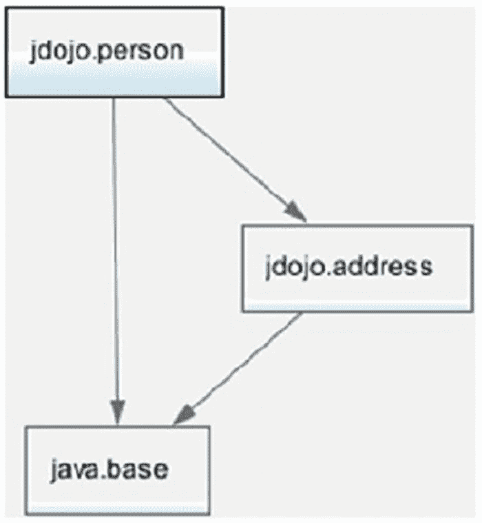
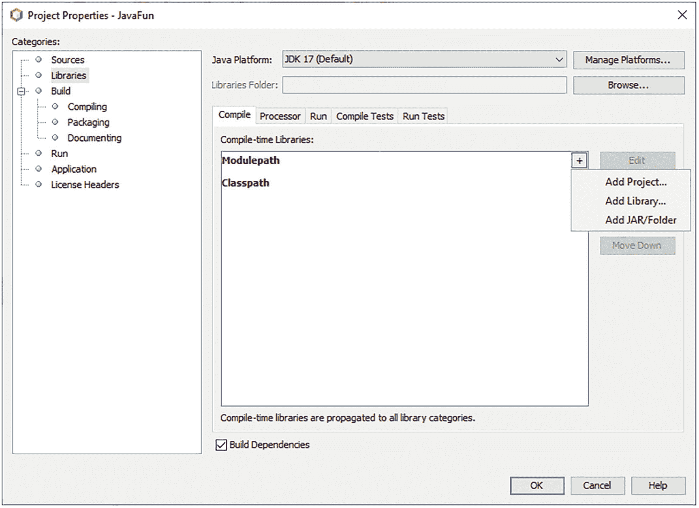
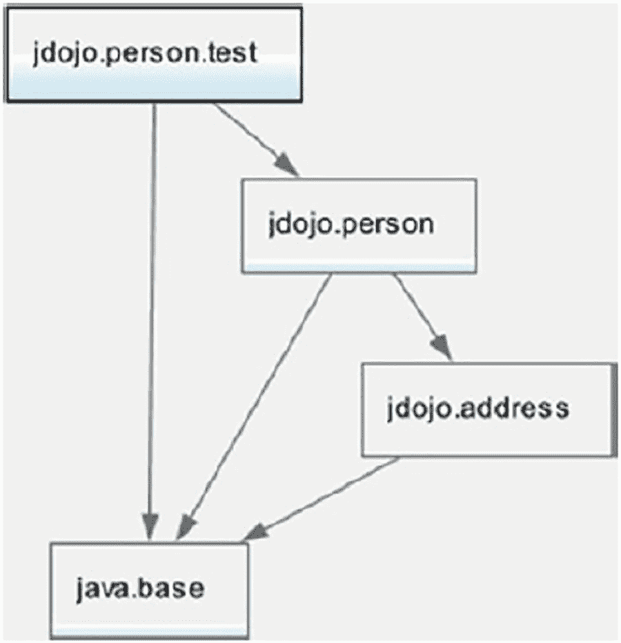
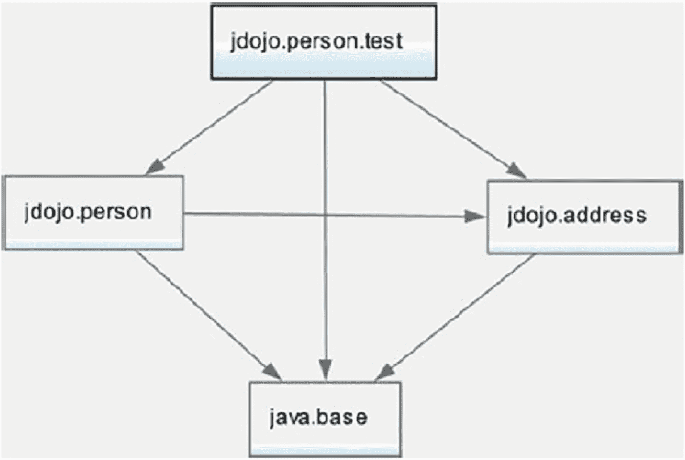
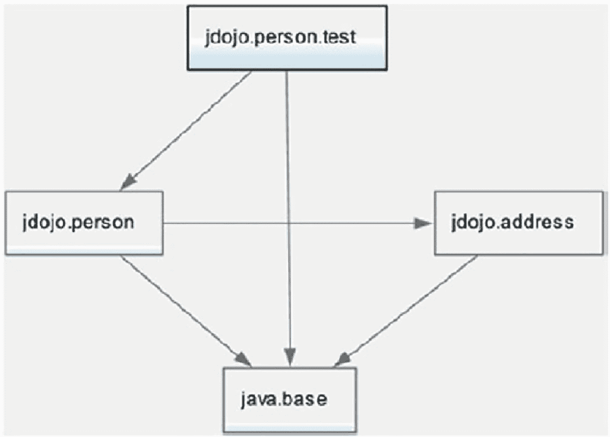
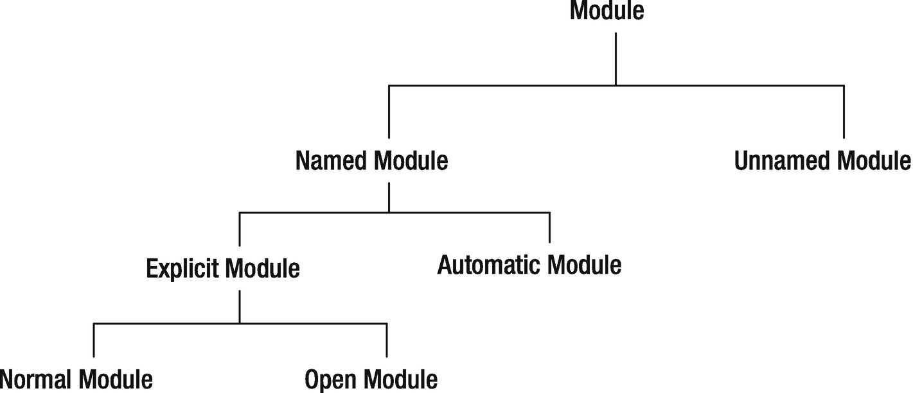

# 十、模块

在本章中，您将学习:

*   什么是模块

*   如何声明模块

*   模块的隐式可读性意味着什么以及如何声明它

*   不合格和合格出口的区别

*   声明模块的运行时可选依赖项

*   如何打开整个模块或其选定的包进行深层思考

*   关于跨模块拆分包的规则

*   模块声明的限制

*   不同类型的模块:命名模块、未命名模块、显式模块、自动模块、普通模块和开放模块

*   了解运行时的模块

*   如何使用`javap`工具反汇编模块的定义

本章中一些例子的代码经历了几个步骤。本书的源代码包含了那些例子的最后一步中使用的代码。如果你想在阅读本章的每一步都看到这些例子，你需要稍微修改一下源代码，使其与你正在进行的步骤保持同步。

## 什么是模块？

简单来说，一个模块就是一组包。一个模块可以有选择地包含诸如图像、属性文件等资源。现在，让我们只关注作为一组包的模块。一个模块指定了它的包对其他模块的可访问性以及它对其他模块的依赖性。模块中的包的可访问性决定了其他模块是否可以访问该包。一个模块的依赖关系决定了这个模块读取的其他模块的列表。“依赖于”、“读取”和“需要”这三个术语可以互换使用，以表示一个模块对另一个模块的依赖性。如果模块`M`依赖于模块`N`，下面三个短语意思相同:“模块`M`依赖于模块`N`”；“模块`M`需要模块`N`”；或者“模块`M`读取模块`N`”

默认情况下，模块中的包只能在同一个模块中访问。如果一个模块中的包需要在它的模块之外被访问，包含这个包的模块需要*导出*这个包。一个模块可以将其包导出到所有其他模块，或者只导出到其他模块的选定列表。

如果一个模块想要从另一个模块访问包，第一个模块必须声明对第二个模块的依赖，第二个模块必须导出包，以便第一个模块可以访问它们。

## 声明模块

模块是在编译单元中声明的。本书在第 3 章中介绍了编译单元的概念，其中编译单元包含类型声明(类和接口声明)。包含模块声明的编译单元不同于包含类型声明的编译单元。从 Java 9 开始，有两种类型的编译单元:

*   普通编译单元

*   模块化编译单元

一个普通的编译单元由三部分组成:包声明、导入声明和顶级类型声明。普通编译单元中的所有部分都是可选的。参见第 [3](03.html) 章了解更多关于普通编译单元的详细信息。

模块化编译单元包含一个模块声明。模块声明之前可以有可选的导入声明。模块化编译单元不能有包声明。模块化编译单元中的导入声明允许您在模块声明中使用简单的类型名称和静态类型成员。

Tip

模块化编译单元被命名为`module-info`，扩展名为`.java`或`.jav`。本书示例中的所有模块化编译单元都被命名为`module-info.java`。

使用模块化编译单元的语法如下:

```java
[import-declarations]
<module-declaration>

```

导入声明中使用的类型可能来自同一模块或其他模块中的包。有关如何使用进口申报的更多详细信息，请参考第 [7](07.html) 章。模块声明的语法如下:

```java
[open] module <module-name> {
    <module-statement-1>;
    <module-statement-2>;
    ...
}

```

*`module`* 关键字用于声明一个模块。模块声明可以选择以关键字`open`开始，以声明一个开放的模块(将在后面描述)。`module`关键字后面是一个模块名。一个*模块名*是一个合格的 Java 标识符，它是一个或多个 Java 标识符的序列，由一个点分隔，类似于包名。

模块声明的主体放在花括号内，花括号中可以有零个或多个模块语句。模块语句也被称为*模块* *指令*。这本书使用了语句这个术语，而不是指令。模块语句有五种类型:

*   `exports`声明

*   `opens`声明

*   `requires`声明

*   `uses`声明

*   `provides`声明

对于一个模块访问另一个模块中的类型，第二个模块使包含这些类型的包可被访问，第一个模块读取第二个模块。所有五种类型的模块语句都用于这两个目的:

*   使类型可访问

*   访问这些类型

`exports`、`opens`和`provides`语句表达了一个模块中的类型对其他模块的可用性。模块中的`requires`和`uses`语句用于表达模块对其他模块使用`exports`、`opens`和`provides`语句读取可用类型的依赖性。这些类型的语句的区别在于模块提供的类型和其他模块使用的类型的上下文。以下是包含所有五种模块语句的模块声明示例:

```java
module jdojo.policy {
    exports com.jdojo.policy;
    requires java.sql;
    opens com.jdojo.policy.model;
    uses com.jdojo.common.Job;
    provides com.jdojo.common.Job with com.jdojo.policy.JobImpl;
}

```

以下术语是 Java 中的受限关键字:`open`、`module`、`requires`、`transitive`、`exports`、`opens`、`to`、`uses`、`provides`、`with`。只有当它们出现在模块化编译单元的特定位置时，才会被视为关键字。它们在其他任何地方都是正常的术语。例如，下面的模块声明是有效的，尽管模块名“`module`”不是很直观:

```java
module module {
    exports com.jdojo.policy;
}

```

这里，第一个“模块”术语是一个受限制的关键字，第二个是一个用作模块名称的普通术语。

后续章节详细描述了`exports`和`requires`语句。我们在本章中简要解释一下`opens`语句。

## 声明模块依赖

在 Java SE 8 之前，一个包中的公共类型可以不受任何限制地被其他包访问。换句话说，包并不控制它们所包含的类型的可访问性。Java SE 9 和更高版本中的模块系统提供了对模块包中包含的类型的可访问性的细粒度控制。

跨模块的可访问性是被使用模块和使用模块之间的双向协议。一个模块显式地将其公共类型提供给其他模块使用，使用这些公共类型的模块显式地声明对第一个模块的依赖。模块的所有非导出包都是模块私有的，不能从模块外部访问它们。

让一个包中的公共类型对其他模块可用被称为*导出*那个包，这是通过在模块声明中使用`exports`语句来完成的。模块可以将其包导出到所有其他模块或选定的模块列表中。当一个模块将其包导出到所有其他模块时，称为*不合格导出*。以下是将包导出到所有其他模块的语法:

```java
exports <package>;

```

这里，`<package>`是当前模块中的包。读取当前模块的所有其他模块都可以使用这个包中的公共类型。考虑以下声明:

```java
module jdojo.address {
    exports com.jdojo.address;
}

```

`jdojo.address`模块将名为`com.jdojo.address`的包导出到所有其他模块。只有在`jdojo.address`模块中才能访问`jdojo.address`模块中的所有其他包。

一个模块也可以有选择地只将包导出到一个或多个命名的模块。这种导出被称为*合格导出*或*模块友好导出*。限定导出中的包中的公共类型只能由指定的命名模块访问。以下是使用限定导出的语法:

```java
exports <package> to <friend-module> [, <friend-module>...] ;

```

这里，`<package>`是当前模块中的一个包，只导出到`"to"`子句中列出的友元模块。下面是一个使用限定导出的`jdojo.policy`模块的模块声明:

```java
module jdojo.policy {
    exports com.jdojo.policy to jdojo.claim, jdojo.payment;
}

```

`jdojo.policy`模块包含一个名为`com.jdojo.policy`的包。该模块使用一个合格的导出将这个包只导出到两个模块，`jdojo.claim`和`jdojo.payment`。

Tip

合格输出的`to`条款中指定的模块不需要是可观察的。

不合格出口和合格出口哪个更好用？当您向公众共享包中的公共类型时，例如，当您开发供公众使用的模块时，应该使用非限定导出。一旦您发布了您的模块，您就不应该改变导出包中的公共 API。有时，坏的 API 会永远留在一个模块中，因为该模块是公共使用的，更改/删除 API 会影响很多用户。有时，您可能需要在模块之间共享公共类型，这些模块是库或框架的一部分；但是，这些模块中的公共类型不供公共使用。在这种情况下，您应该使用限定的导出，这将在您更改涉及那些共享公共类型的 API 时将影响降到最低。`java.base`模块使用几个合格的导出将它的包导出到其他 JDK 模块。您可以使用以下命令来描述`java.base`模块，以列出合格的导出:

```java
C:\> java --describe-module java.base
java.base@17
exports java.io
exports java.lang
...
qualified exports jdk.internal.org.xml.sax to jdk.jfr
qualified exports sun.security.tools to jdk.jartool
...
contains sun.invoke
contains sun.invoke.util
contains sun.io
...

```

一个`requires`语句用于指定一个模块对另一个模块的依赖性。如果一个模块读取另一个模块，第一个模块需要在其声明中有一个`requires`语句。`requires`语句的一般语法如下:

```java
requires [transitive] [static] <module>;

```

这里，`<module>`是当前模块读取的模块名称。`transitive`和`static`修改器都是可选的。如果`static`修饰符存在，对`<module>`的依赖在编译时是强制的，但在运行时是可选的。如果没有`static`修饰符，read 模块在编译时和运行时都是必需的。`transitive`修饰符的存在意味着一个模块隐式地读取当前模块也读取`<module>`。我们将很快介绍一个在`requires`语句中使用`transitive`修饰符的例子。下面是一个使用`requires`语句的例子:

```java
module jdojo.claim {
    requires jdojo.policy;
}

```

这里，`jdojo.claim`模块使用一个`requires`语句来表示它读取了`jdojo.policy`模块。在`jdojo.claim`模块中可以访问`jdojo.policy`模块中所有导出包的所有公共类型。

每个模块都隐式读取`java.base`模块。如果模块声明没有显式读取`java.base`模块，编译器会在模块声明中添加一条`requires`语句来读取`java.base`模块。一个`jdojo.common`模块的以下两个模块声明是相同的:

```java
// Declaration #1
module jdojo.common {
    // The compiler will add a dependence to the java.base module
}
// Declaration #2
module jdojo.common {
    // Add a dependence to the java.base module explicitly
    requires java.base;
}

```

你可以可视化两个模块之间的依赖关系，如图 [10-1](#Fig1) 所示，它描述了两个名为`jdojo.policy`和`jdojo.claim`的示例模块之间的依赖关系。


图 10-1

声明模块之间的依赖关系

`jdojo.policy`模块包含两个名为`com.jdojo.policy`和`com.jdojo.policy.impl`的包；它导出了`com.jdojo.policy`包，该包以虚线显示，以区别于未导出的`com.jdojo.policy.impl`包。`jdojo.claim`模块包含两个包— `com.jdojo.claim`和`com.jdojo.claim.impl`；它不导出任何包，并声明依赖于`jdojo.policy`模块。以下两个模块声明在 Java 代码中表达了这种依赖性:

```java
module jdojo.policy {
    exports com.jdojo.policy;
}
module jdojo.claim {
    requires jdojo.policy;
}

```

Tip

两个模块(被使用的模块和正在使用的模块)中的依赖声明是不对称的——被使用的模块导出一个*包*，而正在使用的模块需要一个*模块*。

## 模块依赖的一个例子

在这一节中，我们将带您看一个使用模块依赖的完整例子。假设您有两个名为`jdojo.address`和`jdojo.person`的模块。`jdojo.address`模块包含一个名为`com.jdojo.address`的包，其中包含一个名为`Address`的类。`jdojo.person`模块想要使用来自`jdojo.address`模块的`Address`类。图 [10-2](#Fig2) 显示了`jdojo.person module`的模块图。



图 10-2

jdojo.person 模块的模块图

在 NetBeans 中，您可以创建两个名为`jdojo.address`和`jdojo.person`的模块。清单 [10-1](#PC14) 和 [10-2](#PC15) 包含模块声明和`Address`类的代码。

```java
// Address.java
package com.jdojo.address;
public class Address {
    private String line1 = "1111 Main Blvd.";
    private String city = "Jacksonville";
    private String state = "FL";
    private String zip = "32256";
    public Address() {
    }
    public Address(String line1, String city, String state, String zip) {
        this.line1 = line1;
        this.city = city;
        this.state = state;
        this.zip = zip;
    }
    public String getLine1() {
        return line1;
    }
    public void setLine1(String line1) {
        this.line1 = line1;
    }

    public String getCity() {
        return city;
    }
    public void setCity(String city) {
        this.city = city;
    }

    public String getState() {
        return state;
    }
    public void setState(String state) {
        this.state = state;
    }
    public String getZip() {
        return zip;
    }
    public void setZip(String zip) {
        this.zip = zip;
    }
    @Override
    public String toString() {
        return "[Line1:" + line1 + ", State:" + state +
               ", City:" + city + ", ZIP:" + zip + "]";
    }

}

Listing 10-2The Address Class

```

```java
// module-info.java
module jdojo.address {
    // Export the com.jdojo.address package
    exports com.jdojo.address;
}

Listing 10-1The Module Declaration for the jdojo.address Module

```

`Address`类是一个简单的类，有四个字段以及它们的 getters 和 setters。默认值是为这些字段设置的，因此您不必在示例中键入它们。`Address`类中的`toString()`方法返回地址对象的字符串表示(本书在第 [11 章](11.html)和 [20 章](20.html)中详细介绍了`toString()`方法的使用)。

`jdojo.address`模块导出`com.jdojo.address`包，所以`Address`类是公共的，在导出的`com.jdojo.address`包中，可以被其他模块使用。在这个例子中，您将在`jdojo.person`模块中使用`Address`类。清单 [10-3](#PC16) 和 [10-4](#PC17) 包含了`jdojo.person`模块的模块声明和`Person`类的代码。

```java
// Person.java
package com.jdojo.person;
import com.jdojo.address.Address;
public class Person {
    private long personId;
    private String firstName;
    private String lastName;
    private Address address = new Address();
    public Person(long personId, String firstName, String lastName) {
        this.personId = personId;
        this.firstName = firstName;
        this.lastName = lastName;
    }
    public long getPersonId() {
        return personId;
    }
    public void setPersonId(long personId) {
        this.personId = personId;
    }
    public String getFirstName() {
        return firstName;
    }

    public void setFirstName(String firstName) {
        this.firstName = firstName;
    }
    public String getLastName() {
        return lastName;
    }
    public void setLastName(String lastName) {
        this.lastName = lastName;
    }
    public Address getAddress() {
        return address;
    }
    public void setAddress(Address address) {
        this.address = address;
    }
    @Override
    public String toString() {
        return "[Person Id:" + personId + ", First Name:" + firstName +
               ", Last Name:" + lastName + ", Address:" + address + "]";
    }
}

Listing 10-4A Person Class

```

```java
// module-info.java
module jdojo.person {
    // Read the jdojo.address module
    requires jdojo.address;
    // Export the com.jdojo.person package
    exports com.jdojo.person;
}

Listing 10-3The Module Declaration for the jdojo.person Module

```

`Person`类在`jdojo.person`模块中，它使用了一个`Address`类型的字段，该字段在`jdojo.address`模块中。这意味着`jdojo.person`模块读取`jdojo.address`模块。这由`jdojo.person`模块声明中的`requires`语句表示:

```java
// Read the jdojo.address module
requires jdojo.address;

```

`jdojo.person`模块的声明包括一个没有`static`修饰符的`requires`语句，这意味着`jdojo.address`模块在编译时和运行时都是必需的。当你编译`jdojo.person`模块时，你必须在模块路径中包含`jdojo.address`模块。在提供的源代码中，这两个模块是单个 NetBeans 模块化项目的一部分，您不需要执行额外的步骤来修改模块路径。

如果您使用两个单独的 NetBeans 项目创建这两个模块，那么您需要在`jdojo.person`模块的模块路径中包含`jdojo.address`模块的项目。在 NetBeans 中右键单击`jdojo.person`项目并选择 Properties。在“类别”列表中，选择“库”。选择 Compile 选项卡并单击 Modulepath 行上的+号。从菜单中选择添加项目…，如图 [10-3](#Fig3) 所示，从文件系统中选择`jdojo.address` NetBeans 项目。如果您在模块化 JAR 或目录中有一个已编译的`jdojo.address`模块，您可以使用 Add JAR/Folder 菜单选项。



图 10-3

在 NetBeans 中设置项目的模块路径

`jdojo.person`模块还导出了`com.jdojo.person`包，所以这个包中的公共类型，例如`Person`类，可能会被其他模块使用。清单 [10-5](#PC19) 包含了一个`Main`类的代码，它在`jdojo.person`模块中。

```java
// Main.java
package com.jdojo.person;
import com.jdojo.address.Address;
public class Main {
    public static void main(String[] args) {
        Person john = new Person(1001, "John", "Jacobs");
        String fName = john.getFirstName();
        String lName = john.getLastName();
        Address addr = john.getAddress();
        System.out.printf("%s %s%n", fName, lName);
        System.out.printf("%s%n", addr.getLine1());
        System.out.printf("%s, %s %s%n", addr.getCity(),
                          addr.getState(), addr.getZip());
    }
}

John Jacobs
1111 Main Blvd.
Jacksonville, FL 32256

Listing 10-5A Main Class to Test the jdojo.person Module

```

当您运行这个类时，输出显示您能够从`jdojo.address`模块中使用`Address`类。我们已经完成了这个展示如何使用`exports`和`requires`模块语句的例子。如果您在运行这个示例时遇到任何问题，请参考下一节，其中列出了一些可能的错误及其解决方案。

此时，您也可以使用命令提示符运行这个示例。您需要在模块路径中包含为`jdojo.person`和`jdojo.address`模块编译的展开目录或模块化 jar。以下命令使用了来自`dist`目录的模块化 jar:

```java
C:\JavaFun>java --module-path dist\jdojo.person.jar;dist\jdojo.address.jar --module jdojo.person/com.jdojo.person.Main
John Jacobs
1111 Main Blvd.
Jacksonville, FL 32256

```

本书提供的源代码包含了`JavaFun\dist`目录中的所有模块化 jar。在前面的命令中，我们有选择地包含了用于`jdojo.person`和`jdojo.address`模块的模块化 jar，以向您展示当您运行`com.jdojo.person.Main`类时，所有其他模块都没有被使用。您可以简化这个命令，只将`dist`目录添加到模块路径中，如下所示，Java 运行时将像以前一样使用所需的两个模块:

```java
C:\JavaFun>java --module-path dist --module jdojo.person/com.jdojo.person.Main
John Jacobs
1111 Main Blvd.
Jacksonville, FL 32256

```

### 解决纷争

如果您是第一次使用 JDK，那么在使用这个示例时，可能会出现一些问题。下面是几个出现错误消息的场景和相应的解决方案。

#### 空包错误

错误是

```java
error: package is empty or does not exist: com.jdojo.address
    exports com.jdojo.address;
                     ^
1 error

```

当您为`jdojo.address`模块编译模块声明而没有包含`Address`类的源代码时，您会得到这个错误。该模块导出`com.jdojo.address`包。您必须在导出的包中定义至少一个类型。

#### 找不到模块错误

错误是

```java
error: module not found: jdojo.address
    requires jdojo.address;
                      ^
1 error

```

当您在模块路径中没有包含`jdojo.address`模块的情况下为`jdojo.person`模块编译模块声明时，您会得到这个错误。`jdojo.person`模块读取`jdojo.address`模块，因此前者必须能够在编译时和运行时在模块路径上找到后者。如果使用命令提示符，使用`--module-path`选项指定`jdojo.address`模块的模块路径。如果您使用的是 NetBeans，请参考上一节关于如何为`jdojo.person`模块配置模块路径的内容。

#### 包不存在错误

错误是

```java
error: package com.jdojo.address does not exist
import com.jdojo.address.Address;
                        ^
error: cannot find symbol
    private Address address = new Address();
            ^
  symbol:   class Address
  location: class Person

```

当您在`jdojo.person`模块中编译`Person`和`Main`类而没有在模块声明中添加适当的`requires`语句时，您会得到这个错误。错误消息指出编译器找不到`com.jdojo.address.Address`类。解决方案是在编译和运行`jdojo.person`模块时，在`jdojo.person`模块的模块声明中添加一个`requires jdojo.address"`语句，并在模块路径中添加`jdojo.address`模块。

#### 模块解析异常

部分误差是

```java
Error occurred during initialization of VM
java.lang.module.ResolutionException: Module jdojo.person not found
...

```

当您尝试使用命令提示符运行该示例时，可能会由于以下原因而出现此错误:

*   未正确指定模块路径。

*   模块路径是正确的，但是在模块路径上找不到指定目录或模块化 jar 中的编译代码。

假设您使用以下命令运行该示例:

```java
C:\JavaFun>java --module-path dist --module jdojo.person/com.jdojo.person.Main

```

确保以下模块化 jar 存在:

*   `C:\JavaFun\dist\jdojo.person.jar`

*   `C:\JavaFun\dist\jdojo.address.jar`

如果这些模块化 jar 不存在，在 NetBeans 中构建`JavaFun`项目。如果您使用展开目录中的模块代码通过以下命令运行示例，请确保在 NetBeans 中编译项目:

```java
C:\JavaFun>java --module-path build\modules\jdojo.person;build\modules\jdojo.address
--module jdojo.person/com.jdojo.person.Main

```

## 隐性依赖

如果一个模块可以读取另一个模块，而第一个模块在其声明中没有包含读取第二个模块的`requires`语句，那么就说第一个模块隐式地读取了第二个模块。每个模块都隐式读取`java.base`模块。隐式读取不限于`java.base`模块。一个模块也可以隐式地读取另一个模块，而不是`java.base`模块。在我们向您展示如何向模块添加隐式可读性之前，我们将构建一个示例来展示我们为什么需要这个特性。

在上一节中，您创建了两个名为`jdojo.address`和`jdojo.person`的模块，其中第二个模块使用以下声明读取第一个模块:

```java
module jdojo.person {
    requires com.jdojo.address;
    ...
}

```

`jdojo.person`模块中的`Person`类是指`jdojo.address`模块中的`Address`类。让我们创建另一个名为`jdojo.person.test`的模块，它读取`jdojo.person`模块。模块声明如清单 [10-6](#PC29) 所示。

```java
// module-info.java
module jdojo.person.test {
    requires jdojo.person;
}

Listing 10-6The Module Declaration for the jdojo.person.test Module

```

`jdojo.person.test`模块的模块图如图 [10-4](#Fig4) 所示。注意，`jdojo.person.test`模块不读取`jdojo.address`模块，所以由`jdojo.address`模块导出的`com.jdojo.address`包中的公共类型在`jdojo.person.test`模块中是不可访问的。



图 10-4

jdojo.person.test 模块的模块图

清单 [10-7](#PC30) 包含了`jdojo.person.test`模块中`Main`类的代码。

```java
// Main.java
package com.jdojo.person.test;
import com.jdojo.person.Person;
public class Main {
    public static void main(String[] args) {
        Person john = new Person(1001, "John", "Jacobs");
        // Get John's city and print it
        String city = john.getAddress().getCity();
        System.out.printf("John lives in %s%n", city);
    }
}

Listing 10-7A Main Class to Test the jdojo.person.test Module

```

`main()`方法中的代码非常简单——它创建一个`Person`对象并读取一个人地址中的城市值:

```java
Person john = new Person(1001, "John", "Jacobs");
String city = john.getAddress().getCity();

```

编译`jdojo.person.test`模块的代码会产生以下错误:

```java
C:\JavaFun\src\jdojo.person.test\classes\com\jdojo\person\test\Main.java:11: error: Address.getCity() in package com.jdojo.address is not accessible
        String city = john.getAddress().getCity();
  (package com.jdojo.address is declared in module jdojo.address, but module jdojo.person.test does not read it)
1 error

```

编译器消息不是很清楚。它表明`jdojo.person.test`模块无法访问`Address`类。回想一下，`Address`类在`jdojo.address`模块中，`jdojo.person.test module`不读取这个模块。查看代码，很明显代码应该可以编译。您可以访问使用了`Address`类的`Person`类；所以你应该可以使用`Address`类。这里，对`john.getAddress()`方法的调用返回一个`Address`类型的对象，您无权访问它。模块系统只是在执行由`jdojo.address`模块定义的封装。如果一个模块想显式或隐式地使用`Address`类，它必须读取`jdojo.address`模块。你如何修理它？简单的答案是通过将声明改为清单 [10-8](#PC33) 中所示的声明，让`jdojo.person.test`模块读取`jdojo.address`模块。

```java
// module-info.java
module jdojo.person.test {
    requires jdojo.person;
    requires jdojo.address;
}

Listing 10-8The Modified Module Declaration for the jdojo.person.test Module

```

图 [10-5](#Fig5) 显示了`jdojo.person.test`模块修改后的模块图。



图 10-5

jdojo.person.test 模块的修改后的模块图

编译并运行`jdojo.person.test`模块中的`Main`类，它将打印以下内容:

```java
John lives in Jacksonville

```

您通过在`jdojo.person.test`模块的声明中添加一个`requires`语句解决了这个问题。然而，很有可能读取`jdojo.person`模块的其他模块将需要处理地址，它们将需要添加相同的`requires`语句。如果`jdojo.person`模块在其公共 API 中公开了来自多个其他模块的类型，那么读取`jdojo.person`模块的模块将需要为每个这样的模块添加一个`requires`语句。对于所有这些模块来说，增加一个额外的`requires`语句是非常麻烦的。

还有另一个用例可以创建这种场景。假设只有两个模块——`jdojo.person.test`和`jdojo.person`——其中前者读取后者，后者导出其公共类型被前者使用的所有包。`com.jdojo.address`包在`jdojo.person`模块里，`jdojo.person.test`模块编译好了。后来，`jdojo.person`模块被重构为两个模块——`jdojo.person`和`jdojo.address`。现在，`jdojo.person.test`模块停止工作，因为`jdojo.person`模块中的一些公共类型现在被移动到了`jdojo.address`模块中，而`jdojo.person.test`模块不读取这些公共类型。

JDK 9 的设计师意识到了这个问题，并提供了一个简单的方法来解决这个问题。在这种情况下，您需要做的就是修改`jdojo.person`模块的声明，在`requires`语句中添加一个`transitive`修饰符来读取`jdojo.address`模块。清单 [10-9](#PC35) 包含了对`jdojo.person`模块的修改声明。

```java
// module-info.java
module jdojo.person {
    // Read the jdojo.address module
    requires transitive jdojo.address;
    // Export the com.jdojo.person package
    exports com.jdojo.person;
}

Listing 10-9The Modified Module Declaration for the jdojo.person Module That Uses a Transitive Export

```

现在，你可以删除这个声明

```java
requires jdojo.address;

```

来自`jdojo.person.test`模块的声明。您需要将`jdojo.address`项目保留在模块路径上来编译和运行`jdojo.person.test`模块项目，因为`jdojo.address`模块仍然需要使用该模块中的`Address`类型。重新编译`jdojo.person`模块。重新编译并运行`jdojo.person.test`模块中的主类，以获得想要的输出。

Tip

当模块`M`使用来自模块`N`的公共类型，并且这些公共类型是模块`M`的公共 API 的一部分时，考虑在模块`M`中使用一个`requires transitive N`。假设您有一个导出包的模块`P`和另一个读取模块`P`的模块`Q`。如果您重构模块`P`以将其拆分为多个模块，比如说`S`和`T`，请考虑将`requires transitive S`和`requires transitive T`语句添加到`P`的模块声明中，以确保所有读取`P`的模块(在本例中为模块`Q`)继续工作而不做任何更改。

当`requires`语句包含`transitive`修饰符时，依赖于当前模块的模块隐式读取在`requires`语句中指定的模块。参考清单 [10-9](#PC35) ，任何读取`jdojo.person`模块的模块都会隐式读取`jdojo.address`模块。本质上，隐式读取使模块声明更容易阅读，将一个模块重构为多个模块更容易，但更难推理，因为仅通过查看模块声明，您无法了解它的所有依赖项。图 [10-6](#Fig6) 显示了`jdojo.person.test`模块的最终模块图。



图 10-6

jdojo.person.test 模块的模块图

当模块被解析时，模块图通过为每个传递依赖添加一个读边来扩充。在本例中，如图 [10-7](#Fig7) 中的虚线箭头所示，读取边沿将从`jdojo.person.test`模块添加到`jdojo.address`模块。图中用虚线显示了将`jdojo.person.test`模块连接到`jdojo.address`模块的边，以表示它是在模块图被解析后添加的。


图 10-7

jdojo.person.test 模块的模块图，在用隐式读边扩充后

## 选择性依赖

模块系统在编译时和运行时验证模块依赖性。有时候你想让模块依赖在编译时是强制性的，但在运行时是可选的。

如果特定的模块在运行时可用，您可以开发一个性能更好的库。否则，它会退回到另一个模块，使其性能达不到最佳状态。但是，库是针对可选模块编译的，它确保如果可选模块不可用，依赖于可选模块的代码不会被执行。

另一个例子是导出注释包的模块。Java 运行时已经忽略了不存在的注释类型。然而，模块依赖在启动时被验证；如果模块在运行时丢失，应用程序将不会启动。因此，有必要将包含注释包的模块的模块依赖声明为可选的。

您可以通过在`requires`语句中使用`static`关键字来声明可选的依赖项:

```java
requires static <optional-module>;

```

以下模块声明包含对`jdojo.annotation`模块的可选依赖:

```java
module jdojo.claim {
    requires static jdojo.anotation;
}

```

在一条`requires`语句中，允许同时有`transitive`和`static`修饰语；

```java
module jdojo.claim {
    requires transitive static jdojo.anotation;
}

```

## 打开模块和包

*反思*是一个浩如烟海的话题。如果这是您第一次接触 Java，您可能很难理解这一部分。当您对 Java 有了更多的经验时，或者只是阅读它而不必担心会跟不上所解释的一切时，您可以重温这一节。

反射是一种在编译时不知道 Java 类型的情况下使用它们的方法。你已经在本章中使用了诸如`Person`类的类型。要创建一个`Person`并调用它的`getFirstName()`方法，您需要编写如下代码:

```java
import com.jdojo.person.Person;
...
Person john = new Person(1001, "John", "Jacobs");
String firstName = john.getFirstName();

```

在这种情况下，Java 编译器确保在`com.jdojo.person`包中有一个名为`Person`的类。编译器还确保这段代码可以访问`Person`类、它的构造器和它的`getFirstName()`方法。如果`Person`类不存在，你就不能编译这段代码。当您运行这段代码时，Java 运行时再次验证`Person`的存在以及这段代码使用它所需的访问权限。使用反射，您可以在不知道`Person`类存在的情况下重写这段代码。您的代码和编译器不知道`Person`类，但是您将能够实现同样的功能。为此，这段代码只需要运行时访问`Person`类。Java 中有两种类型的访问:

*   编译时访问

*   运行时访问

编译器在编译期间验证编译时访问。编译时访问必须遵循 Java 语言访问规则，例如，类之外的代码不能访问该类的私有成员。

Java 运行时验证对类型及其成员的运行时访问。在运行时，代码可以通过两种方式访问类型及其成员:

*   第一种方法是运行根据被访问的类型编写的编译代码。在这种情况下，运行时会像在编译期间一样加强 Java 语言的可访问性规则。

*   第二种方法是在运行时使用反射来访问类型及其成员。在这种情况下，编译器不知道您的代码将在运行时访问的类型及其成员。使用反射访问类型及其成员被称为使用反射访问。与普通访问不同，反射访问允许访问所有类型(不仅仅是公共类型)和这些类型的所有成员(甚至是私有成员)。

反射访问有好有坏。它之所以好，是因为它让您开发可以在所有未知类型上工作的库。有几个很好的框架，比如 Spring 和 Hibernate，非常依赖于对应用程序库中定义的类型成员的深度反射访问。反射访问之所以不好，是因为它破坏了封装——它可以访问类型和这些类型的成员，而使用正常的访问规则是无法访问这些类型和成员的。使用反射访问不可访问的类型及其成员有时被称为*深度反射*。

20 多年来，Java 允许反射访问。Java 9 中模块系统的设计者在设计对模块代码的深度反射访问时面临着一个巨大的挑战。允许对导出包的类型进行深度反射违反了模块系统的*强封装*主题。它使得外部代码可以访问任何东西，即使模块开发者不想公开模块的某个部分。另一方面，不允许深度反射将使 Java 社区缺乏一些广泛使用的伟大框架，并且它还将破坏许多依赖于深度反射的现有应用程序。由于这一限制，许多现有的应用程序根本无法迁移到 JDK 9。

经过几次反复的设计和实验之后，模块系统的设计者们提出了一个折中的办法——鱼和熊掌不可兼得！该设计允许您拥有一个具有强封装、深度反射访问以及两者兼而有之的模块。规则如下:

*   导出的包将只允许在编译时和运行时访问公共类型及其公共/受保护成员。如果不导出包，其他模块将无法访问该包中的所有类型。这提供了强大的封装。

*   您可以打开一个模块，以允许在运行时对该模块中所有包中的所有类型进行深度反射。这样的模块被称为*开放模块*。

*   您可以拥有一个普通模块——一个没有为深度反射而打开的模块——以及在运行时为深度反射而打开的特定包。所有其他未打开的包装都被严密封装。模块中允许深度反射的包被称为*开放包*。

*   有时，您可能希望在编译时访问包中的类型，以便根据该包中的类型编写代码；同时，您希望在运行时对这些类型进行深度反射访问。您可以导出并打开同一个包来实现这一点。

### 开放模块

在`module`关键字前使用`open`修饰符声明一个打开的模块:

```java
open module jdojo.model {
    // Module statements go here
}

```

这里的`jdojo.model`模块是一个开放模块。其他模块可以在这个模块的所有包中的所有类型上使用深度反射。在一个开放模块的声明中可以有`exports`、`requires`、`uses`和`provides`语句。在打开的模块中不能有`opens`语句。一个`opens`语句用于打开一个特定的包进行深度反射。因为开放模块打开所有包进行深度反射，所以在开放模块内部不允许使用`opens`语句。

### 打开包装

打开一个包意味着向该包中的公共类型授予对其他模块的正常运行时访问，并允许其他模块对该包中的类型使用深度反射。您可以向所有其他模块或特定模块列表打开一个包。向所有其他模块打开包的`opens`语句的语法如下:

```java
opens <package>;

```

在这里，`<package>`可用于所有其他模块的深度反射。您还可以使用限定的`opens`语句打开特定模块的包:

```java
opens <package> to <module1>, module2>...;

```

在这里，`<package>`只对`<module1>`、`<module2>`等开放深刻反思。下面是一个在模块声明中使用`opens`语句的例子:

```java
module jdojo.model {
    // Export the com.jdojo.util package to all modules
    exports com.jdojo.util;
    // Open the com.jdojo.util package to all modules
    opens com.jdojo.util;
    // Open the com.jdojo.model.policy package only to the hibernate.core module
    opens com.jdojo.model.policy to hibernate.core;
}

```

`jdojo.model`模块导出`com.jdojo.util`包，这意味着所有公共类型及其公共成员在编译时都是可访问的，并且在运行时可以正常反射。第二条语句在运行时打开同一个包进行深度反射。总之，`com.jdojo.util`包的所有公共类型及其公共成员在编译时都是可访问的，并且该包允许在运行时进行深度反射。第三条语句将`com.jdojo.model.policy`包只对`hibernate.core`模块开放以进行深度反射，这意味着在编译时没有其他模块可以访问这个包的任何类型，而`hibernate.core`模块可以在运行时使用深度反射访问所有类型及其成员。

Tip

对另一个模块的开放包执行深度反射的模块不需要读取包含开放包的模块。但是，如果您知道模块名，那么允许并强烈建议您添加对带有开放包的模块的依赖，这样模块系统就可以在编译时和运行时验证这种依赖。

当一个模块`M`打开它的包`P`用于到另一个模块`N`的深度反射时，有可能模块`N`将它在包`P`上的深度反射访问授权给另一个模块`Q`。模块`N`将需要使用模块 API 以编程方式来完成。将反射访问委托给另一个模块可以避免将整个模块向所有其他模块开放；同时，它在被授予反射访问的模块部分创建了额外的工作。

## 跨模块拆分包

不允许将包拆分成多个模块*。也就是说，不能在多个模块中定义同一个包。如果同一个包中的类型在多个模块中，那么这些模块应该合并到一个模块中，或者您需要重命名包。有时，您可以成功编译这些模块，但会收到一个运行时错误；其他时候，您会收到编译时错误。正如我在开始提到的，拆分包并不是无条件禁止的。你需要知道这种错误背后的简单规则。*

 *如果两个名为`M`和`N`的模块定义了同一个名为`P`的包，那么`M`和`N`模块中的包`P`就不能被`Q`访问。换句话说，多个模块中的同一个包不能同时被一个模块读取。否则，会发生错误。如果一个模块正在使用包`P`中的类型`T`，而该类型在两个模块中都存在，则模块系统无法决定是否使用这两个模块之一中的`P.T`。它会生成一个错误，并希望您修复该问题。考虑以下代码片段:

```java
// Test.java
package java.util;
public class Test {
}

```

JDK 中的`java.base`模块包含一个`java.util`包，该包可供所有模块使用。如果你将 JDK 17 中的`Test`类作为一个模块的一部分或者单独编译，你会收到下面的错误:

```java
error: package exists in another module: java.base
package java.util;
^
1 error

```

如果你在一个名为`M`的模块中有这个类，编译时错误会指出这个模块和`java.base`模块中的`java.util`包可以被模块`M`读取。您必须将这个`Test`类的包从`java.util`更改为其他东西，比如说`com.jdojo.util`，它不存在于任何可观察的模块中。

## 模块声明中的限制

声明模块有几个限制。如果违反了这些规则，您将在编译时或启动时得到错误:

*   模块图不能包含循环依赖关系。也就是说，两个模块不能相互读取。如果有，它们应该是一个模块，而不是两个。请注意，通过以编程方式添加可读性边缘或使用命令行选项，可以在运行时拥有循环依赖关系。

*   模块声明不支持模块版本。您需要使用`jar`工具或其他一些工具，比如`javac`，将模块的版本添加为类文件属性。

*   模块系统没有子模块的概念。即`jdojo.person`和`jdojo.person.client`是两个独立的模块；第二个不是第一个的子模块。

## 模块类型

Java 已经存在 20 多年了；新老应用程序都将继续使用没有模块化或永远不会模块化的库。如果 JDK 9 强迫每个人模块化他们的应用程序，JDK 9 可能不会被大多数人采用。JDK 9 的设计者考虑到了向后兼容性。您可以采用 JDK 9 及更高版本，方法是按照您自己的节奏模块化您的应用程序，或者决定根本不模块化—只运行您现有的应用程序。在大多数情况下，在 JDK 8 或更早版本中工作的应用程序将继续在 JDK 9 或更高版本中工作，而不做任何更改。为了简化迁移，JDK 定义了四种类型的模块:

*   正规模

*   开放模块

*   自动模块

*   未命名模块

事实上，你会遇到六个术语来描述六种不同类型的模块，对于一个 JDK 9 的初学者来说，这些术语很容易混淆。其他两种类型的模块用于传达这四种类型模块的更广泛的类别。图 [10-8](#Fig8) 显示了所有类型模块的示意图。



图 10-8

模块类型

在我描述模块的主要类型之前，我给你图 [10-8](#Fig8) 所示模块类型的简要定义。

*   模块是代码和数据的集合。

*   根据模块是否有名字，模块可以是*命名模块*或*未命名模块*。没有未命名模块的进一步分类。

*   当一个模块有一个名字时，这个名字可以在模块声明中显式给出，也可以自动(或隐式)生成。如果在模块声明中显式地给出了这个名字，它就被称为*显式模块*。如果这个名字是由模块系统通过读取模块路径上的 JAR 文件名生成的，它就被称为一个*自动模块*。

*   如果你声明一个没有使用`open`修饰符的模块，它被称为*普通模块*。

*   如果你使用`open`修饰符声明一个模块，它被称为*开放模块*。

基于这些定义，开放模块也是显式模块和命名模块。自动模块是命名模块，因为它有一个自动生成的名称，但它不是显式模块，因为它是由模块系统在编译时和运行时隐式声明的。以下小节描述了这些模块类型。

Tip

如果 Java 平台最初是用模块系统设计的，那么您将只有一种模块类型——普通模块！所有其他模块类型的存在是为了向后兼容以及模块的平滑迁移和采用。

### 正规模

使用模块声明而不使用`open`修饰符显式声明的模块总是有一个名字，它被称为*普通模块*或简称为*模块*。到目前为止，您主要使用的是普通模块。我一直把普通模块称为模块，并且我继续在这个意义上使用这个术语，除非我需要区分这四种类型的模块。默认情况下，普通模块中的所有类型都被封装。普通模块的示例如下:

```java
module a.normal.module {
    // Module statements go here
}

```

### 开放模块

如果一个模块声明包含了`open`修饰符，那么这个模块就是开放模块。开放模块的示例如下:

```java
open module an.open.module {
    // Module statements go here
}

```

### 自动模块

为了向后兼容，用于查找类型的类路径机制在 JDK 9 中仍然有效。您可以选择将 jar 放在类路径、模块路径以及两者的组合上。请注意，您可以将模块化 jar 以及 jar 放在模块路径和类路径上。

当您将一个 JAR 放在模块路径上时，这个 JAR 被视为一个模块，它被称为一个*自动*模块。名称*自动*模块来源于这样一个事实，即该模块是从一个 JAR 中自动定义的——您不需要通过添加一个`module-info.class`文件来显式声明该模块。自动模块有一个名称。自动模块的名称是什么？它读取什么模块，导出什么包？我将很快回答这些问题。

自动模块的存在仅仅是为了将现有的 Java 应用程序移植到模块系统。通过将现有的 jar 放在模块路径上，它们允许您将它们作为模块使用。然而，它们是不可靠的，因为当 jar 的作者将它们转换成模块化 jar 时，他们可能会选择给它们不同于自动派生的模块名。当作者将 jar 转换为模块化 jar 时，自动模块中导出的包也可能改变。当您在应用程序中使用自动模块时，请记住这些风险。

为了防止自动模块的模块名改变，作者可以在他们将 JAR 转换成模块化 JAR 之前建议一个模块名。您可以在 JAR 的`MANIFEST.MF`文件中使用建议的模块名，将其指定为自动模块名。您可以在 JAR 中的`MANIFEST.MF`文件的主要部分指定一个自动模块名作为属性“Automatic-Module-Name”的值。

自动模块也是命名模块。假设您想使用一个 JAR `com.jdojo.intro-1.0`作为自动模块。它的名称和版本是使用以下规则从 JAR 文件的名称中派生出来的:

*   如果 JAR 文件在其`MANIFEST.MF`文件的主要部分中有属性“Automatic-Module-Name ”,那么该属性的值就是模块名。模块名也可以通过下面的步骤从 JAR 文件的名称中获得。

*   JAR 文件的扩展名`.jar`被删除。这一步删除了`.jar`扩展名，接下来的步骤使用`com.jdojo.intro-1.0`来导出模块的名称及其版本。

*   如果名称以连字符结尾，后跟至少一个数字(可以选择后跟一个点),则模块名称源自最后一个连字符之前的名称部分。如果连字符后面的部分可以被解析为有效版本，则该部分被指定为模块的版本；否则，这部分被忽略。在我们的例子中，模块名将来自于`com.jdojo.intro`。版本将衍生为 1.0。

*   对于模块名称，所有尾随的数字和点都被删除。在我们的例子中，模块名的剩余部分`com.jdojo.intro`不包含任何尾随数字和点。所以这一步不会改变任何事情。

*   名称部分中的每个非字母数字字符都被替换为一个点；并且，在得到的字符串中，两个连续的点被一个点代替；并且所有的前导点和尾随点都被移除。在我们的例子中，名称部分没有任何非字母数字字符，所以模块名是`com.jdojo.intro`。

按顺序应用这些规则会给你一个模块名和一个模块版本。在本节的最后，我们将向您展示如何通过 JAR 文件来知道自动模块的名称。表 [10-1](#Tab1) 列出了几个 JAR 名和它们派生的自动模块名。注意，该表没有显示 JAR 文件名中的扩展名`.jar`，并且假设在 JAR 文件的`MANIFEST.MF`的主部分中没有指定“Automatic-Module-Name”属性。

表 10-1

从 JAR 文件名派生自动模块名称的例子

<colgroup><col class="tcol1 align-left"> <col class="tcol2 align-left"> <col class="tcol3 align-left"></colgroup> 
| 

罐子名称

 | 

模块名

 | 

模块版本

 |
| --- | --- | --- |
| `com.jdojo.intro-1.0` | `com.jdojo.intro` | `1.0` |
| `junit-4.10.jar` | `Junit` | `4.10` |
| `jdojo-logging1.5.0` | `N/A` |   |
| `spring-core-4.0.1.RELEASE` | `spring.core` | `4.0.1.RELEASE` |
| `jdojo-trans-api_1.5_spec-1.0.0` | `N/A` | `N/A` |
| `_` | `N/A` | `N/A` |

让我们看一下表中的三种奇怪情况，如果您将 jar 放在模块路径上，您将会收到一个错误。第一个 JAR 名是`jdojo-logging1.5.0`。应用所有的规则，派生的模块名是`jdojo.logging1.5.0`，这是一个无效的模块名。回想一下，模块名是一个合格的 Java 标识符。也就是说，模块名中的每一部分都必须是有效的 Java 标识符。在这种情况下，名称的两部分“5”和“0”不是有效的 Java 标识符。在模块路径上使用这个 JAR 将会产生一个错误，除非您使用清单文件中的“Automatic-Module-Name”属性指定一个有效的模块名。

第二个给出错误的 JAR 名是`jdojo-trans-api_1.5_spec-1.0.0`。让我们应用规则来导出自动模块名:

*   它找到最后一个连字符，在这个连字符后面只有数字和点，并将 JAR 名称分成两部分:`jdojo-trans-api_1.5_spec`和`1.0.0`。第一部分用于派生模块名。第二部分是模块版本。

*   名称部分不包含任何尾随数字和点。因此，应用下一个规则，将所有非字母数字字符转换为点。得到的字符串是`jdojo.trans.api.1.5.spec`。现在，“1”和“5”是模块名中的两个部分，它们不是有效的 Java 标识符。所以派生的模块名是无效的，这就是当您将这个 JAR 文件添加到模块路径时出现错误的原因。

第三个 JAR 名称是表中的最后一个条目，是一个下划线(`_`)。即 JAR 文件被命名为`_.jar`。如果您应用这些规则，下划线将被一个点代替，该点将被删除，留下一个空字符串，这不是一个有效的模块名。模块路径上的`_.jar`文件会导致如下异常:

```java
java.lang.module.ResolutionException: Unable to derive module descriptor for: _.jar

```

您可以使用带有`–-describe-module`选项的`jar`命令来了解将从 JAR 派生的自动模块的名称。一般语法如下:

```java
jar --describe-module --file <your-JAR-file-path>

```

下面的命令打印名为`jdojo.util-2.2.jar`的 JAR 的自动模块名，假设 JAR 存在于`C:\JavaFun`目录中:

```java
c:\JavaFun\jars>jar --describe-module --file jdojo.util-2.2.jar
No module descriptor found. Derived automatic module.
jdojo.util@2.2 automatic
requires java.base mandated
contains com.jdojo.person

```

输出中的第一行表明`jdojo.util-2.2.jar`是一个 JAR，而不是一个模块化 JAR。如果它是一个模块化的 JAR，模块名将从`module-info.class`文件中读取。第一行表示没有找到模块描述符。第二行打印模块名`jdojo.util`和模块版本`2.2`。在第二行的末尾，打印出单词`automatic`,表示这个模块名是作为自动模块名派生出来的。输出中的第三行和第四行打印自动模块的依赖和包信息。

您可以使用`jar`命令来更新清单条目。我们将向您展示如何向 JAR 添加“Automatic-Module-Name”属性。我们在这个例子中使用了`jdojo.util-2.2.jar`。您需要创建一个文本文件并添加 manifest 属性。清单 [10-10](#PC52) 显示了名为`manifest.txt`的清单文件的内容。该文件包含两行。第一行指定了一个名为“Automatic-Module-Name”的属性，其值为`jdojo.misc`。第二行是一个你看不到的空行。确保在这个文件中有一个空行。否则，下一个命令将不起作用。

```java
Automatic-Module-Name: jdojo.misc

Listing 10-10Contents of a manifest.txt File

```

下面的命令将更新`jdojo.util-2.2.jar`文件中的清单文件，假设 JAR 文件和`manifest.txt`文件都放在同一个目录下，`C:\JavaFun`:

```java
c:\JavaFun\jars>jar --update --manifest manifest.txt --file jdojo.util-2.2.jar

```

如果您描述`jdojo.util-2.2.jar`文件来查看派生的自动模块名，那么将从其清单文件的“Automatic-Module-Name”属性中读取模块名。让我们重新运行前面的命令来描述模块:

```java
c:\JavaFun\jars>jar --describe-module --file jdojo.util-2.2.jar
No module descriptor found. Derived automatic module.
jdojo.misc@2.2 automatic
requires java.base mandated
contains com.jdojo.person

```

一旦你知道了一个自动模块的名字，其他显式模块可以使用`requires`语句读取它。下面的模块声明读取来自模块路径上的`jdojo.util-2.2.jar`的名为`jdojo.misc`的自动模块，假设自动模块名来自 JAR 文件名:

```java
module jdojo.lib {
    requires jdojo.util;
    //...
}

```

要有效地使用一个自动模块，它必须导出包并读取其他模块。让我们看看这方面的规则:

*   自动模块读取所有其他模块。重要的是要注意，在模块图被解析之后，从一个自动模块到所有其他模块的可读性被增加了。

*   自动模块中的所有包装都被导出并打开。

这两个规则基于这样一个事实，即没有实际可行的方法来判断一个自动模块依赖于哪些其他模块，以及其他模块将需要编译该自动模块的哪些包或进行深度反射。

自动模块读取所有其他模块可能会产生循环依赖，这在模块图被解析后是允许的。回想一下，在模块图解析期间，模块之间的循环依赖是不允许的。也就是说，在模块声明中不能有循环依赖。

自动模块没有模块声明，因此它们不能声明对其他模块的依赖。显式模块可以声明对其他自动模块的依赖。考虑一种情况，一个显式模块`M`读取一个自动模块`P`，而模块`P`使用另一个自动模块`Q`中的类型`T`。当您使用模块`M`中的主类启动应用程序时，模块图将只包含`M`和`P`——为了简洁起见，在此讨论中不包括`java.base`模块。解析过程将从模块`M`开始，并将看到它读取另一个模块`P`。解析过程没有实际可行的方法来判断模块`P`读取模块`Q`。通过将模块`P`和`Q`放在类路径上，您将能够编译它们。然而，当您运行这个应用程序时，您将收到一个`ClassNotFoundException`。当模块`P`试图从模块`Q`中访问一个类型时，异常发生。要解决这个问题，模块`Q`必须包含在模块图中，方法是使用`--add-modules`命令行选项将其添加为根模块，并将`Q`指定为该选项的值。

### 未命名模块

您可以将 jar 和模块化 jar 放在类路径上。当一个类型正在被加载，而它的包在任何已知的模块中都找不到时，模块系统会尝试从类路径加载该类型。如果在类路径上找到该类型，它将被类加载器加载，并成为该类加载器的一个名为*未命名模块*的模块的成员。每个类装入器都定义一个未命名的模块，其成员都是它从类路径中装入的类型。未命名模块没有名字，所以显式模块不能使用`requires`语句声明对它的依赖。如果有一个显式模块需要使用未命名模块中的类型，则必须通过将 JAR 放在模块路径上，将未命名模块的 JAR 用作自动模块。

试图在编译时从显式模块中访问未命名模块中的类型是一个常见的错误。这是不可能的，因为未命名的模块没有名字，而显式模块需要一个模块名才能在编译时读取另一个模块。自动模块作为显式模块和未命名模块之间的桥梁，如图 [10-9](#Fig9) 所示。显式模块可以使用`requires`语句访问自动模块，自动模块可以访问未命名模块。


图 10-9

一种自动模块，充当显式模块和未命名模块之间的桥梁

未命名模块没有名称。这并不意味着未命名模块的名称是一个空字符串，“未命名”或`null`。下面的模块声明试图声明对未命名模块的依赖，这是无效的:

```java
module some.module {
    requires "";        // A compile-time error
    requires "unnamed"; // A compile-time error
    requires unnamed;   // A compile-time error, unless a named module named unnamed exists
    requires null;      // A compile-time error
}

```

未命名模块读取其他模块，并使用以下规则向其他模块导出和打开其所有包:

*   未命名的模块读取所有其他模块。因此，未命名模块可以访问所有模块(包括平台模块)中所有导出包的公共类型。该规则使得使用在 Java SE 8 中编译和运行的类路径的应用程序可以继续在 Java SE 9 中编译和运行，前提是它们只使用标准的、未被弃用的 Java SE APIs。

*   未命名的模块向所有其他模块开放其所有包。因此，显式模块可以在运行时使用反射来访问未命名模块中的类型。

*   未命名的模块导出它的所有包。显式模块不能在编译时读取未命名的模块。在模块图被解析后，所有的自动模块都被用来读取未命名的模块。

    **提示**一个未命名的模块可能包含一个由命名模块导出的包。在这种情况下，未命名模块中的包将被忽略。

## 聚合器模块

您可以创建一个不包含自己代码的模块。它收集并重新导出其他模块的内容。这样的模块被称为*聚合器模块*。假设有几个模块依赖于五个模块。您可以为这五个模块创建一个聚合器模块，现在，您的模块只能依赖于一个模块—聚合器模块。聚合器模块并不是与前面章节所解释的不同的模块类型。它是一个命名模块。它有一个特殊的名字，“聚合器”，因为它没有自己的内容。相反，它将其他几个模块的内容以不同的名称组合成一个模块。

一个聚合器模块只包含一个类文件，那就是`module-info.class`。聚合器模块的模块声明由所有的"`requires transitive <module>"`语句组成。下面是一个聚合器模块声明的示例。聚合器模块名为`jdojo.all`，它聚合了三个模块——`jdojo.policy`、`jdojo.claim`和`jdojo.payment`:

```java
module jdojo.all {
    requires transitive jdojo.policy;
    requires transitive jdojo.claim;
    requires transitive jdojo.payment;
}

```

聚合器模块的存在是为了方便。从版本 9 开始，Java 包含了几个聚合器模块，比如`java.se`和`java.se.ee`。`java.se`模块收集了 Java SE 中不与 Java EE 重叠的部分。`java.se.ee`模块集合了构成 Java SE 的所有模块，包括与 Java EE 重叠的模块。

## 了解运行时的模块

Java SE 17 提供了一组类和接口来以编程方式处理模块。它们统称为*模块 API* 。模块 API 允许您查询和修改模块信息。在本节中，我们将快速预览模块 API。

JVM 中加载的每个类型都由一个`java.lang.Class<T>`类的实例表示。也就是说，`Class<T>`类的一个实例在运行时表示类型`T`。您可以使用该类的对象的`getClass()`方法来获取类型的引用。假设存在一个`Person`类，下面的代码片段获得了对`Person`类的引用:

```java
Person p = new Person();
Class<Person> cls = p.getClass();

```

还可以使用类文本来获取类的引用。类文字是后面跟有一个“`.class`”的类的名称。例如，您可以使用类文字`Person.class`来获取`Person`类的引用。您可以重写前面的代码片段，如下所示:

```java
Class<Person> cls = Person.class;

```

在运行时，每种类型都作为模块的成员加载。如果该类型是从类路径加载的，则它是加载该类型的类加载器的未命名模块的成员。如果该类型是从模块路径加载的，则它是命名模块的成员。`java.lang.Module`类的一个实例表示运行时的一个模块。`Class`类包含一个`getModule()`方法，该方法返回一个代表该类型模块的`Module`。下面的代码片段获取了对`Person`类所属的`Module`对象的引用:

```java
Class<Person> cls = Person.class;
Module m = cls.getModule();

```

`Module`类包含几个方法，让您查询模块在编译时的声明状态和运行时的实际状态。请注意，模块状态可以从源代码中声明的方式进行更改。模块 API 中的其他类和接口在`java.lang.module`包中。例如，`java.lang.module`包中的`ModuleDescriptor`类的一个实例，代表了在源文件中为显式模块声明的模块描述符，以及为自动模块合成的模块描述符。您可以将`Module`类的`getDescriptor()`方法用于`ModuleDescriptor`类的实例。未命名的模块没有模块描述符，所以`getDescriptor()`方法为未命名的模块返回`null`。可以使用`Module`类的`getName()`方法来获取模块的名称；该方法为未命名的模块返回`null`。

清单 [10-11](#PC61) 包含了一个`jdojo.mod`模块的声明。清单 [10-12](#PC62) 包含了一个`ModuleInfo`类的代码，它打印了它所属模块的信息。

```java
// ModuleInfo.java
package com.jdojo.mod;
import java.lang.module.ModuleDescriptor;
public class ModuleInfo {
    public static void main(String[] args) {
        // Get the class reference
        Class<ModuleInfo> cls = ModuleInfo.class;
        // Get the module reference
        Module m = cls.getModule();
        if (m.isNamed()) {
            // It is a named module
            // Get the module name
            String name = m.getName();
            // Get the module descriptor
            ModuleDescriptor md = m.getDescriptor();
            // Print the module details
            System.out.println("Module Name: " + name);
            System.out.println("Module is open: " + md.isOpen());
            System.out.println("Module is automatic: " + md.isAutomatic());
        } else {
            // It is an unnamed module
            System.out.println("Unnamed module.");
        }
    }
}

Listing 10-12A ModuleInfo Class

```

```java
// module-info.java
module jdojo.mod {
    exports com.jdojo.mod;
}

Listing 10-11The Module Declaration for the jdojo.mod Module

```

下面的命令通过将`jdojo.mod`模块的模块化 JAR 放在模块路径上来运行`ModuleInfo`类。输出清楚地显示了正确的模块信息:

```java
C:\JavaFun>java --module-path dist\jdojo.mod.jar --module jdojo.mod/com.jdojo.mod.ModuleInfo
Module Name: jdojo.mod
Module is open: false
Module is automatic: false

```

下面的命令通过将`jdojo.mod`模块的模块化 JAR 放在类路径上来运行`ModuleInfo`类。这一次，类是从类路径加载的，它成为加载它的类加载器的未命名模块的成员:

```java
C:\JavaFun>java --class-path dist\jdojo.mod.jar com.jdojo.mod.ModuleInfo
Unnamed module.

```

## 模块的迁移路径

如果您是第一次学习模块，可以跳过这一部分。当您必须迁移现有的 Java 应用程序以使用模块时，您可以重新访问。

当您将应用程序迁移到模块时，您应该记住模块系统提供的两个好处:强大的封装和可靠的配置。你的目标是拥有一个完全由普通模块组成的应用程序，除了一些打开的模块。似乎有人可以给你一个清晰的清单，列出将现有应用程序移植到模块时需要执行的步骤。然而，考虑到应用程序的多样性、它们与其他代码的相互依赖性以及不同的配置需求，这是不可能的。我们所能做的就是列出一些通用的指导方针来帮助您完成迁移，这也是本节所要做的。

一个重要的 Java 应用程序通常由位于三层的几个 jar 组成:

*   应用程序开发人员开发的应用层中的应用程序 jar

*   第三方提供的库层中的库 jar

*   JVM 层中的 Java 运行时 jar

Java 已经通过将 Java 运行时 jar 转换成模块，将它们模块化了。也就是说，Java 运行时由模块组成，并且只由模块组成。

库层主要由放置在类路径上的第三方 jar 组成。如果您想迁移您的应用程序以使用模块，您可能得不到第三方 jar 的模块化版本。您也无法控制供应商如何将第三方 jar 转换成模块。您可以将库 jar 放在模块路径上，并将其视为自动模块。

您可以选择完全模块化您的应用程序代码。以下是您可以选择的模块类型，从最不理想到最理想:

*   未命名模块

*   自动模块

*   开放模块

*   正规模

迁移的第一步是通过将所有的 jar(应用程序 jar 和库 jar)放在类路径上来检查您的应用程序是否在 JDK 17 中运行，而无需对您的代码进行任何修改。类路径上 jar 中的所有类型都将是未命名模块的一部分。您的应用程序在这种状态下使用 JDK 17，没有任何强大的封装和可靠的配置。

一旦您的应用程序在 JDK 17 中运行，您就可以开始将应用程序代码转换成自动模块。自动模块中的所有包都是开放的，用于深度反射访问，并被导出，用于对其公共类型的普通编译时和运行时访问。从这个意义上说，它并不比未命名的模块更好；它没有为您提供强大的封装。但是，自动模块为您提供了可靠的配置，因为其他显式模块可以声明对自动模块的依赖。

您还有另一种选择，将您的应用程序代码转换成开放模块，这提供了适度的更强的封装:在开放模块中，所有的包都是开放的，用于深度反射访问，但是您可以指定导出哪些包(如果有的话)，用于普通的编译时和运行时访问。显式模块还可以声明对开放式模块的依赖，从而为您带来可靠配置的好处。

普通模块提供最强的封装，允许您选择打开、导出或同时打开和导出哪些包。显式模块也可以声明对普通模块的依赖。

表 [10-2](#Tab2) 包含了模块类型的列表，以及它们提供的强大封装和可靠配置的程度。

表 10-2

模块类型和不同程度的强大封装以及它们提供的可靠配置

<colgroup><col class="tcol1 align-left"> <col class="tcol2 align-left"> <col class="tcol3 align-left"></colgroup> 
| 

模块类型

 | 

强封装

 | 

可靠的配置

 |
| --- | --- | --- |
| 未命名的 | 不 | 不 |
| 自动的 | 不 | 适度的 |
| 打开 | 适度的 | 是 |
| 标准 | 最强壮的 | 最强壮的 |

## Java 类依赖分析器

为了帮助确定在转换项目以使用开放或普通模块时需要什么模块，您可以使用 Java 类依赖分析器，简称 jdeps。它是一个命令行工具，用于分析现有 JAR 文件和模块的依赖关系。

例如，假设您有一个名为 aopalliance-1.0.jar 的 JAR 文件，您可以对它运行 jdeps，如下所示:

```java
$ jdeps aopalliance-1.0.jar
aopalliance-1.0.jar -> java.base
   org.aopalliance.aop             -> java.io                       java.base
   org.aopalliance.aop             -> java.lang                     java.base
   org.aopalliance.intercept       -> java.lang                     java.base
   org.aopalliance.intercept       -> java.lang.reflect             java.base
   org.aopalliance.intercept       -> org.aopalliance.aop           aopalliance-1.0.jar

```

这基本上显示了所有依赖的包以及它们包含在哪个模块中。这个 JAR 只依赖于 java.base 模块。

它还可以用来分析相反的情况—哪些模块依赖于给定的模块，例如:

```java
$ jdeps --inverse --require java.sql
Inverse transitive dependences on [java.sql]
java.sql <- java.se
java.sql <- java.sql.rowset <- java.se

```

## 反汇编模块定义

在这一节中，我们将解释 JDK 附带的`javap`工具，它可以用来反汇编类文件。这个工具对于学习模块系统非常有用，尤其是反编译模块的描述符。

我们将在提供的源代码中使用来自`JavaFun`目录的代码。我们假设您已经在`C:\JavaFun`目录中提取了它。如果不同，请在下面的示例中用您的路径替换此路径。

在第 [3](03.html) 章中，您有两个`jdojo.intro`模块的`module-info.class`文件副本:一个在`mod\jdojo.intro`目录中，另一个在`lib\com.jdojo.intro.jar`文件的模块化 JAR 中。当您将模块的代码打包到 JAR 中时，您已经为模块指定了一个版本和一个主类。这些信息去了哪里？它们作为类属性被添加到`module-info.class`文件中。所以两个`module-info.class`文件的内容是不一样的。你怎么证明？首先在两个`module-info.class`文件中打印模块声明。您可以使用位于`JDK_HOME\bin`目录中的`javap`工具来反汇编任何类文件中的代码。您可以指定要反汇编的文件名、URL 或类名。以下命令打印模块声明:

```java
C:\JavaFun>javap mod\jdojo.intro\module-info.class
Compiled from "module-info.java"
module jdojo.intro {
  requires java.base;
}
C:\JavaFun>javap jar:file:lib/com.jdojo.intro.jar!/module-info.class
Compiled from "module-info.java"
module jdojo.intro {
  requires java.base;
}

```

第一个命令使用一个文件名，第二个命令使用一个使用`jar`方案的 URL。这两个命令都使用相对路径。如果您愿意，可以使用绝对路径。

输出表明两个`module-info.class`文件包含相同的模块声明。您需要使用`–verbose`选项(或`–v`选项)打印类别信息，以查看类别属性。下面的命令打印出`mod`目录中的`module-info.class`文件信息，显示模块版本和主类名不存在。显示了部分输出:

```java
C:\JavaFun>javap -verbose mod\jdojo.intro\module-info.class
Classfile /C:/JavaFun/mod/jdojo.intro/module-info.class
  Last modified Jul 23, 2021; size 154 bytes
  MD5 checksum 2e4a3e6b8b8b03c92fdede9a5784b1d7
  Compiled from "module-info.java"
module jdojo.intro
...

```

下面的命令打印来自`lib\com.jdojo.intro.jar`文件的`module-info.class`文件信息，并显示模块版本和主类名确实存在。显示了部分输出。输出中的相关行以粗体显示:

```java
C:\JavaFun>javap -verbose jar:file:lib/com.jdojo.intro.jar!/module-info.class
Classfile jar:file:lib/com.jdojo.intro.jar!/module-info.class
  Last modified Jul 24, 2021; size 263 bytes
  MD5 checksum 60f5f169a580f02fa8085fd36e50c0e5
  Compiled from "module-info.java"
module jdojo.intro@1.0
...
   #8 = Utf8               ModuleMainClass
   #9 = Utf8               com/jdojo/intro/Welcome
  #10 = Class              #9             // com/jdojo/intro/Welcome
...
  #14 = Utf8               1.0
  ...
ModulePackages:
  #7                                      // com.jdojo.intro
ModuleMainClass: #10                      // com.jdojo.intro.Welcome
Module:
  #13,0                                   // "jdojo.intro"
  #14                                     // 1.0
 ...

```

您也可以在模块中反汇编类的代码。您需要指定模块路径、模块名称和类的完全限定名。以下命令从模块化 JAR 中打印出`com.jdojo.intro.Welcome`类的代码:

```java
C:\JavaFun>javap --module-path lib --module jdojo.intro com.jdojo.intro.Welcome
Compiled from "Welcome.java"
public class com.jdojo.intro.Welcome {
  public com.jdojo.intro.Welcome();
  public static void main(java.lang.String[]);
}

```

您还可以打印系统分类的分类信息。以下命令打印来自`java.base`模块的`java.lang.Object`类的类信息。请注意，在打印系统类信息时，不需要指定模块路径:

```java
C:\JavaFun>javap --module java.base java.lang.Object
Compiled from "Object.java"
public class java.lang.Object {
  public java.lang.Object();
  public final native java.lang.Class<?> getClass();
  public native int hashCode();
  public boolean equals(java.lang.Object);
  ...
}

```

如何打印系统模块的模块声明，比如`java.base`或`java.sql`？回想一下，系统模块是以一种叫做 JIMAGE 的特殊文件格式打包的，而不是模块化的 jar。JDK 9 引入了一个新的 URL 方案，称为`jrt` ( `jrt`是 Java 运行时的缩写)，用来引用 Java 运行时映像(或系统模块)的内容。使用`jrt`方案的语法是

```java
jrt:/<module>/<path-to-a-file>

```

以下命令打印名为`java.sql`的系统模块的模块声明:

```java
C:\JavaFun>javap jrt:/java.sql/module-info.class
Compiled from "module-info.java"
module java.sql@17 {
  requires transitive java.logging;
  requires transitive java.xml;
  requires java.base;
  exports javax.transaction.xa;
  exports javax.sql;
  exports java.sql;
  uses java.sql.Driver;
}

```

以下命令打印`java.se`的模块声明，它是一个聚合器模块:

```java
C:\JavaFun>javap jrt:/java.se/module-info.class
Compiled from "module-info.java"
module java.se@17 {
  requires transitive java.naming;
  requires transitive java.instrument;
  requires transitive java.compiler;
  requires transitive java.sql.rowset;
  requires transitive java.logging;
  requires transitive java.management.rmi;
  requires transitive java.desktop;
  requires transitive java.rmi;
  requires transitive java.datatransfer;
  requires transitive java.prefs;
  requires transitive java.xml.crypto;
  requires transitive java.sql;
  requires transitive java.xml;
  requires transitive java.security.sasl;
  requires transitive java.scripting;
  requires transitive java.management;
  requires java.base;
  requires transitive java.security.jgss;
}

```

您也可以使用`jrt`方案来引用一个系统类。以下命令打印`java.base`模块中`java.lang.Object`类的类信息:

```java
C:\JavaFun>javap jrt:/java.base/java/lang/Object.class
Compiled from "Object.java"
public class java.lang.Object {
  public java.lang.Object();
  public final native java.lang.Class<?> getClass();
  public native int hashCode();
  public boolean equals(java.lang.Object);
  ...
}

```

## 摘要

简单来说，一个模块就是一组包。一个模块可以有选择地包含诸如图像、属性文件等资源。如果一个模块需要使用另一个模块中包含的公共类型，第二个模块需要导出包含这些类型的包，第一个模块需要读取第二个模块。

模块使用`exports`语句导出它的包。模块只能将其包导出到一组命名模块或所有其他模块。在编译时和运行时，导出包中的公共类型可供其他模块使用。导出的包不允许对公共类型的非公共成员进行深度反射。

如果一个模块希望允许其他模块使用反射访问所有类型的成员——公共的和非公共的——那么该模块必须声明为开放模块，或者该模块可以使用`opens`语句有选择地打开包。从打开的包中访问类型的模块不需要读取包含那些打开的包的模块。

一个模块使用`requires`语句声明了对另一个模块的依赖。使用`transitive`修饰符可以声明这种依赖是可传递的。如果模块`M`声明了对模块`N`的传递依赖，那么任何声明了对模块`M`的依赖的模块都声明了对模块`N`的隐式依赖。

通过在`requires`语句中使用`static`修饰符，可以在编译时将依赖声明为强制的，但在运行时声明为可选的。依赖关系在运行时可以是可选的，同时也是可传递的。

根据模块是如何声明的以及它是否有名字，模块有几种类型。根据模块是否有名字，模块可以是*命名的模块*或*未命名的模块*。当一个模块有一个名字时，这个名字可以在模块声明中显式给出，也可以自动(或隐式)生成。如果在模块声明中显式地给出了这个名字，它就被称为*显式模块*。如果在 JAR 清单的“Automatic-Module-Name”属性中指定了该名称，或者该名称是由模块系统通过读取模块路径上的 JAR 文件名生成的，则该名称被称为*自动模块*。如果你声明一个没有使用`open`修饰符的模块，它被称为*普通模块*。如果你使用`open`修饰符声明一个模块，它被称为*开放模块*。基于这些定义，开放模块也是显式模块和命名模块。自动模块是命名模块，因为它有一个自动生成的名称，但它不是显式模块，因为它是由模块系统在编译时和运行时隐式声明的。

当您在模块路径上放置一个 JAR(不是模块化 JAR)时，JAR 表示一个自动模块，其名称在 JAR 清单的“Automatic-Module-Name”属性中指定，或者从 JAR 文件名中派生。自动模块读取所有其他模块，并且它的所有包都被导出和打开。

在 JDK 9+中，类装入器可以从模块或类路径装入类。每个类装入器都维护一个名为未命名模块的模块，该模块包含它从类路径装入的所有类型。未命名的模块读取所有其他模块。它向所有其他模块导出并打开它的所有包。未命名模块没有名称，因此显式模块不能声明对未命名模块的编译时依赖。如果显式模块需要访问未命名模块中的类型，前者可以使用自动模块作为桥梁，或者使用反射。

您可以创建一个不包含自己代码的模块。它收集并重新导出其他模块的内容。这样的模块被称为*聚合器*T4 模块。一个聚合器模块只包含一个类文件，那就是`module-info.class`。聚合器模块的模块声明由所有的`requires transitive <module>`语句组成。

不允许将包分割成多个模块*。也就是说，不能在多个模块中定义同一个包。如果两个名为`M`和`N`的模块定义了同一个名为`P`的包，那么`M`和`N`模块中的包`P`就不能被`Q`访问。换句话说，多个模块中的同一个包不能同时被一个模块读取。否则，会发生错误。*

 *Java 9 提供了一组在运行时与模块一起工作的类和接口。它们统称为模块 API。模块 API 允许您查询模块信息并在运行时修改它。在运行时，模块被表示为`java.lang.Module`类的一个实例。你可以使用`java.lang.Class<T>`类的`getModule()`方法来获取一个类型的模块的引用。

您可以使用`javap`工具来打印模块声明或属性。使用工具的`-verbose`(或`-v`)选项打印模块描述符的类属性。JDK 以特殊的格式存储运行时映像。JDK 9 引入了一个叫做`jrt`的新文件模式，你可以用它来访问运行时映像的内容。它的语法是`jrt:/<module>/<path-to-a-file>`。

EXERCISES

1.  什么是模块？

2.  你用什么关键字来声明一个模块？

3.  指定模块名的规则是什么？以下哪些模块名称是有效的？

    ```java
    jdojo.dashboard
    $jdojo.$dashboard
    jdojo.policy.1.0
    javaFundamentals

    ```

4.  列出仅在模块声明中的特定位置使用时才被视为关键字的所有受限关键字。

5.  您使用什么模块语句将包导出到所有其他模块或一组命名模块？

6.  Consider the following declaration for a module named `jdojo.core`:

    ```java
    module jdojo.core {
        exports com.jdojo.core to jdojo.ext, jdojo.util;
    }

    ```

    解释这个模块声明中`exports`语句的作用。在编译`jdojo.core`模块时，`jdojo.ext`和`jdojo.util`这两个模块必须存在吗？

7.  你用什么模块语句来表达一个模块对另一个模块的依赖？什么是传递依赖，使用传递依赖有什么好处？

8.  Consider the following declaration for a module named `jdojo.ext`:

    ```java
    module jdojo.ext {
        requires jdojo.core;
    }

    ```

    `jdojo.ext`读取的是哪两个模块？

9.  如何表达一个模块对另一个模块的依赖，这个模块在编译时是强制的，但在运行时是可选的？

10.  什么是开放模块？你什么时候使用开放模块？

11.  一个开放的模块和选择性的打开一个模块的包有什么区别？为什么不能在打开的模块内部使用`opens`语句？

12.  Consider the following declaration for a module named `jdojo.misc`:

    ```java
    module jdojo.misc {
        opens com.jdojo.misc;
        exports com.jdojo.misc;
    }

    ```

    这个模块声明有效吗？如果有效，解释打开和导出模块的同一个包的效果。

13.  你能有两个包含相同包的模块吗？描述禁止两个模块拥有相同包的确切规则。

14.  什么是自动模块？描述两种指定或导出自动模块名称的方法。

15.  什么是未命名模块？如果你把一个模块化的 JAR 放在类路径上，那么这个模块化 JAR 中的所有类型都是未命名模块的成员吗？

16.  什么是聚合器模块？举出 JDK 9 中的一个聚合器模块。

17.  运行时表示模块的类的完全限定类名是什么？

18.  如何在运行时获取一个类所属模块的引用？

19.  Consider the following snippet of code assuming that a `Person` class exists:

    ```java
    Person john = new Person();
    String moduleName = john./* Complete the code */;
    System.out.println("Module name of Person class is " + moduleName);

    ```

    用您的代码替换第二行中的注释，完成这段代码。这个代码片段应该打印出模块的名称，如果`Person`类是未命名模块的成员，则打印出`null`类的成员。

20.  使用`jar`和`java`工具描述一个模块时，你选择了哪个选项？

21.  如果给你一个包含模块声明的编译代码的`module-info.class`文件，你将如何获得模块的源代码？换句话说，你用什么工具反汇编一个类文件，也可以是一个`module-info.class`文件？

22.  JDK 模块以一种叫做 JIMAGE 的内部格式存储。JDK 9 引入的访问 JDK 模块的类文件和资源的新方案的名称是什么？

23.  使用`javap`命令打印`java.sql`模块的声明，它是一个 JDK 模块。**