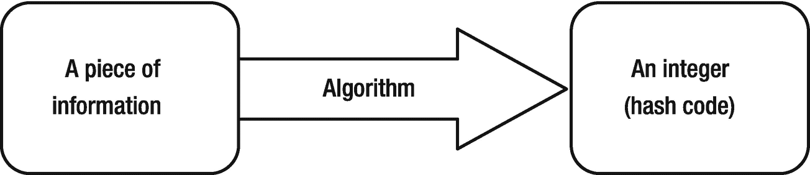
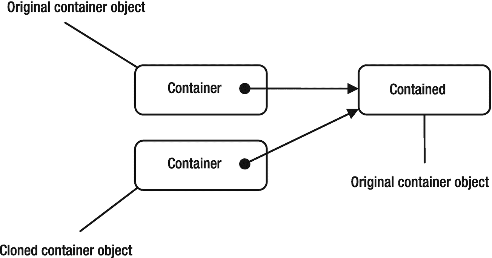

# 11.对象和对象类

在本章中，您将学习:

*   Java 中的层次类结构

*   `Object`类是所有其他类的超类

*   如何用详细的例子使用`Object`类的方法

*   如何在你的类中重新实现`Object`类的方法

*   如何检查两个对象是否相等

*   不可变对象和可变对象的区别

*   如何使用`Objects`类的实用方法来优雅地处理`null`值

*   lambda 表达式简介

本章中的所有类都是一个`jdojo.object`模块的成员，如清单 [11-1](#PC1) 中所声明的。

```java
// module-info.java
module jdojo.object {
    exports com.jdojo.object;
}

Listing 11-1The Declaration of a jdojo.object Module

```

## 对象类

Java 在`java.lang`包中有一个`Object`类，它是`java.base`模块的成员。所有的 Java 类，那些包含在 Java 类库中的和那些你创建的，都直接或间接地扩展了`Object`类。所有 Java 类都是`Object`类的子类，而`Object`类是所有类的超类。注意`Object`类本身没有超类。

Java 中的类被安排在一个树状的层次结构中，其中`Object`类位于根(或顶部)。我们将在第 20 章[中详细讨论类的层次结构，其中包括继承。我们在本章中讨论了`Object`类的一些细节。](20.html)

关于`Object`类有两条重要的规则。这里就不解释这些规则背后的原因了。在你阅读了第 20 章[之后，你会明白为什么你可以用`Object`类做这些事情的原因。](20.html)

### 规则 1

`Object`类的引用变量可以保存任何类的对象的引用。正如任何引用变量都可以存储一个`null`引用一样，`Object`类型的引用变量也可以。考虑下面对`Object`类型的引用变量`obj`的声明:

```java
Object obj;

```

您可以将 Java 中任何对象的引用分配给`obj`。以下所有陈述都是有效的:

```java
// Can assign the null reference
obj = null;
// Can assign a reference of an object of the Object class
obj = new Object();
// Can assign a reference of an object of the Account class
Account act = new Account();
obj = act;
// Can assign a reference to an object of any class. Assume that the AnyClass class exists

obj = new AnyClass();

```

这条规则的反面是不正确的。不能将`Object`类对象的引用赋给任何其他类型的引用变量。以下语句无效:

```java
Account act = new Object(); // A compile-time error

```

有时，你可能会将一个特定类型的对象的引用存储在一个`Object`类型的引用变量中，然后你想将相同的引用赋回给一个`Account`类型的引用变量。您可以使用如下所示的强制转换来实现这一点:

```java
Object obj2 = new Account(); Account act = (Account) obj2; // Must use a cast

```

有时您可能不确定`Object`类的引用变量是否包含对特定类型对象的引用。在这些情况下，您需要使用`instanceof`操作符进行测试。`instanceof`操作符的左操作数是一个引用变量，它的右操作数是一个类名——具体来说，是一个类型名，包括类和接口。如果其左操作数是其右操作数类型的引用，则返回`true`。否则，它返回`false`。关于`instanceof`操作器的更详细讨论，参见第 [20](20.html) 章:

```java
Object obj;
Cat c;
/* Do something here and store a reference in obj... */
if (obj instanceof Cat) {
    // If we get here, obj holds a reference of a Cat for sure
    c = (Cat)obj;
}

```

当您有一个将`Object`作为参数的方法时，您需要使用这个规则。您可以为`Object`类的参数传递任何对象的引用。请考虑下面的代码片段，它显示了一个方法声明:

```java
public void m1(Object obj) {
  // Code goes here
}

```

您可以通过多种不同方式调用`m1()`:

```java
m1(null);           // Pass null reference
m1(new Object());   // Pass a reference of an object of the Object class
m1(new AnyClass()); // Pass a reference of an object of the AnyClass class

```

### 规则二

`Object`类包含九个方法，可以在 Java 的所有类中使用。我们可以把这些方法分为两类:

*   第一类方法已经在`Object`类中实现。你应该在它们被实现的时候使用它们。您不能在您创建的任何类中重新实现(重新实现的技术术语是*覆盖*)这些方法。他们的实现是`final`。属于这一类别的方法有`getClass()`、`notify()`、`notifyAll()`和`wait()`。

*   第二类方法在`Object`类中有一个默认的实现。您可以通过在您的类中重新实现它们来自定义它们的实现。属于这一类别的方法有`toString()`、`equals()`、`hashCode()`、`clone()`和`finalize()`。

Java 程序员必须理解正确使用`Object`类中的所有方法。我们将详细讨论它们，除了`notify()`、`notifyAll()`和`wait()`方法。这些方法用于线程同步(这超出了本书的范围，但将在本系列的第二卷中讨论)。表 [11-1](#Tab1) 列出了`Object`类中的所有方法，并附有简要描述。“Implemented”列中的“Yes”表示`Object`类已经实现了该方法，无需编写任何代码即可使用。此列中的“否”表示您需要在使用该方法之前实现它。“可定制”列中的“是”表示您可以在您的类中重新实现该方法来定制它。该列中的“否”表示`Object`类已经实现了该方法，其实现是`final`。

表 11-1

对象类中的方法

<colgroup><col class="tcol1 align-left"> <col class="tcol2 align-left"> <col class="tcol3 align-left"> <col class="tcol4 align-left"></colgroup> 
| 

方法

 | 

执行

 | 

可定制的

 | 

描述

 |
| --- | --- | --- | --- |
| `public String toString()` | 是 | 是 | 返回对象的字符串表示形式。通常，它用于调试目的。 |
| `public boolean equals(Object obj)` | 是 | 是 | 用于比较两个对象是否相等。 |
| `public int hashCode()` | 是 | 是 | 返回对象的哈希代码(整数)值。 |
| `protected Object clone() throws CloneNotSupportedException` | 不 | 是 | 用于制作对象的副本。 |
| `protected void finalize() throws Throwable` | 不 | 是 | 在对象被销毁之前由垃圾收集器调用。它在 Java SE 9 中已被弃用。 |
| `public final Class getClass()` | 是 | 不 | 返回对对象的`Class`对象的引用。 |
| `public final void notify()` | 是 | 不 | 通知对象的等待队列中的一个线程。 |
| `public final void notifyAll()` | 是 | 不 | 通知对象的等待队列中的所有线程。 |
| `public final void wait()``throws InterruptedException``public final void wait(long timeout)``throws InterruptedException``public final void wait(long timeout, int nanos)``throws InterruptedException` | 是 | 不 | 使线程在对象的等待队列中等待，超时或不超时。 |

要重新实现一个`Object`类的方法，你需要像在`Object`类中一样声明这个方法，然后在它的主体中编写你自己的代码。重新实现一个方法有更多的规则。我们将在第 20 章介绍所有规则。你可以在你的类中重新实现`Object`类的`toString()`方法，比如说`Test`，如图所示:

```java
public class Test {
    /* Reimplement the toString() method of the Object class */
    public String toString() {
        return "Here is a string";
    }
}

```

本书将在接下来的章节中详细讨论`Object`类的六个方法。

## 一个对象的类是什么？

Java 中的每个对象都属于一个类。您在源代码中定义了一个类，它被编译成二进制格式(扩展名为`.class`的类文件)。在运行时使用一个类之前，它的二进制表示被加载到 JVM 中。将类的二进制表示加载到 JVM 中是由一个称为类加载器的对象来处理的。通常，在一个 Java 应用程序中使用多个类装入器来装入不同类型的类。类加载器是类`java.lang.ClassLoader`的一个实例。Java 允许你通过扩展`ClassLoader`类来创建自己的类装入器。通常，您不需要创建自己的类装入器。Java 运行时将使用其内置的类加载器来加载您的类。

类装入器将类定义的二进制格式读入 JVM。二进制类格式可以从任何可访问的位置加载，例如本地文件系统、网络、数据库等。然后，它创建一个`java.lang.Class<T>`类的对象，这是 JVM 中类型`T`的二进制表示。注意类名`java.lang.Class`中的大写`C`。不同的类装入器可以在 JVM 中多次装入类定义的二进制格式。JVM 中的类由它的完全限定名和它的类装入器的组合来标识。通常，类的二进制定义在 JVM 中只加载一次。

Tip

您可以将`Class<T>`类的对象视为类源代码的运行时描述符。运行时，类的源代码由`Class`类的对象表示。事实上，Java 中的所有类型——类、接口和基本类型——在运行时都由一个`Class`类的实例来表示。

`Object`类的`getClass()`方法返回`Class`对象的引用。因为`getClass()`方法是在`Object`类中声明和实现的，所以可以对任何类型的引用变量使用这个方法。下面的代码片段显示了如何为一个`Cat`对象获取`Class`对象的引用:

```java
Cat c = new Cat();
Class catClass = c.getClass();

```

`Class`类是泛型的，它的形式类型参数是由它的对象表示的类名。您可以使用泛型重写该语句，如下所示:

```java
Class<Cat> catClass = c.getClass();

```

默认情况下，类定义只加载一次，每个 Java 类只有一个`Class`对象。我们不考虑那些你已经编写代码多次加载同一个类的情况。如果你在同一个类的不同对象上使用`getClass()`方法，你将得到同一个`Class`对象的引用。考虑以下代码片段:

```java
Cat c2 = new Cat();
Cat c3 = new Cat();
Class catClass2 = c2.getClass();
Class catClass3 = c3.getClass();

```

这里，`c2`和`c3`是同一个`Cat`类的两个对象。因此，`c2.getClass()`和`c3.getClass()`返回同一个`Class`对象的引用，该对象代表 JVM 中的`Cat`类。表达式`catClass2 == catClass3`将计算为`true`。

`Class`类有许多有用的方法。您可以使用它的`getName()`方法来获取类的完全限定名。你可以使用它的`getSimpleName()`来获得类的简单名称，例如:

```java
String fullName = catClass.getName();
String simpleName = catClass.getSimpleName();

```

Tip

当应用程序启动时，并不是应用程序中的所有类都被加载到 JVM 中。加载一个类，当应用程序第一次使用该类时，创建一个对应的`Class`对象。

## 计算对象的哈希代码

哈希代码是使用算法为一条信息计算的整数值。哈希代码也称为哈希和、哈希值或简称为哈希。从一条信息中计算整数的算法称为哈希函数。散列码的定义涉及三件事:

*   一条信息

*   一种算法

*   整数值

你有一条信息。你对它应用一个算法来产生一个整数值。你得到的整数值是你所拥有的信息的散列码。如果您更改信息片段或算法，计算出的哈希代码可能会更改，也可能不会更改。图 [11-1](#Fig1) 描绘了计算散列码的过程。



图 11-1

计算散列码的过程

计算散列码是一个单向过程。从哈希代码中获取原始信息并不容易，这也不是哈希代码计算的目标。

可以用来生成散列码的信息可以是任意的字节、字符、数字或它们的组合序列。例如，您可能想要计算字符串`"Hello"`的散列码。

哈希函数是什么样子的？哈希函数可能像下面的函数一样简单，它返回所有输入数据的整数零:

```java
int myHashFunction(<your input data>) {
    return 0;  // Always return zero
}

```

这个散列函数符合散列函数的定义，尽管它不是一个实用的好函数。编写一个好的哈希函数不是一件容易的事情。在编写一个好的散列函数之前，您需要考虑关于输入数据的许多事情。

你为什么需要一个散列码？当数据存储在基于散列的集合(或容器)中时，需要它来有效地检索与之相关的数据。在将数据存储到容器中之前，会计算其哈希代码，然后将其存储在基于其哈希代码的位置(也称为*桶*)。当您想要检索数据时，可以使用它的哈希代码来查找它在容器中的位置，这样可以更快地检索信息。值得注意的是，使用散列码的数据的有效检索是基于散列码值在一个范围内的分布。如果生成的哈希代码不是均匀分布的，则数据检索可能效率不高。在最坏的情况下，对数据的检索可能与对存储在容器中的所有元素进行线性搜索一样糟糕。如果使用散列函数，容器中的所有元素都将存储在同一个桶中，这将需要搜索所有元素。使用一个好的散列函数，使它为您提供均匀分布的散列码，这对于实现一个高效的基于散列的容器以实现快速数据检索是至关重要的。

Java 中哈希码有什么用？Java 使用哈希代码的原因和上面描述的一样——从基于哈希的集合中高效地检索数据。如果你的类的对象在基于散列的集合中没有被用作键，例如在`HashSet`、`HashMap`等中。，您不必担心对象的哈希代码。

你可以用 Java 计算一个对象的散列码。在对象的情况下，将用于计算哈希代码的信息片段是组成对象状态的信息片段。Java 设计者认为对象的哈希代码非常重要，因此他们提供了一个默认实现来计算`Object`类中对象的哈希代码。

`Object`类包含一个`hashCode()`方法，该方法返回一个`int`，它是对象的哈希代码。此方法的默认实现通过将对象的内存地址转换为整数来计算对象的哈希代码。因为`hashCode()`方法是在`Object`类中定义的，所以它在 Java 的所有类中都可用。但是，您可以自由地在类中重写该实现。这里是当你在你的类中重写`hashCode()`方法时你必须遵循的规则。假设有两个对象引用，`x`和`y`:

*   如果`x.equals(y)`返回`true`，`x.hashCode()`必须返回一个整数，等于`y.hashCode()`。也就是说，如果两个对象使用`equals()`方法相等，它们必须有相同的散列码。

*   如果`x.hashCode()`等于`y.hashCode()`，则`x.equals(y)`不需要返回`true`。也就是说，如果两个对象使用`hashCode()`方法具有相同的散列码，那么使用`equals()`方法它们不一定相等。

*   如果在 Java 应用程序的同一次执行中对同一个对象多次调用`hashCode()`方法，该方法必须返回相同的整数值。`hashCode()`和`equals()`方法紧密联系在一起。如果您的类重写这两个方法中的任何一个，它必须重写这两个方法，以便您的类的对象能够在基于哈希的集合中正确工作。另一个规则是，您应该只使用那些实例变量来计算对象的哈希代码，这些代码也在`equals()`方法中用于检查相等性。

如果你的类是可变的，你不应该在基于散列的集合中使用你的类的对象作为键。如果用作键的对象在使用后发生更改，您将无法在集合中定位该对象，因为在基于哈希的集合中定位对象是基于其哈希代码的。在这种情况下，集合中会有滞留的对象。

你应该如何为一个类实现一个`hashCode()`方法？以下是为您的类编写`hashCode()`方法的逻辑的一些准则，对于大多数目的来说是合理的:

1.  从一个质数开始，比如 37:

1.  使用以下逻辑分别计算原始数据类型的每个实例变量的哈希代码值。注意，您只需要在哈希代码计算中使用那些实例变量，它们也是`equals()`方法逻辑的一部分。让我们将这一步的结果存储在一个`int`变量`code`中。我们假设`value`是实例变量的名字。

    对于`byte`、`short`、`int`和`char`数据类型，使用它们的整数值作为

```java
int hash = 37;

```

```java
code = (int)value;

```

对于`long`数据类型，使用`XOR`作为 64 位的两半

```java
code = (int)(value ^ (value >>> 32));

```

对于`float`数据类型，使用以下方法将其浮点值转换为等效的整数值

```java
code = Float.floatToIntBits(value);

```

对于`double`数据类型，使用`Double`类的`doubleToLongBits()`方法将其浮点值转换为`long`，然后使用前面针对`long`数据类型描述的过程将长整型值转换为`int`值:

```java
long longBits = Double.doubleToLongBits(value);
code = (int)(longBits ^ (longBits >>> 32));

```

对于`boolean`数据类型，使用`1`表示`true`，使用`0`表示`false`:

1.  对于引用实例变量，如果是`null`，则使用`0`。否则，调用它的`hashCode()`方法来获得它的散列码。假设`ref`是引用变量的名称:

```java
code = (value ? 1 : 0);

```

1.  使用以下公式计算哈希代码。在公式中使用`59`是一个任意的决定。任何其他质数，比如说`47`，都可以很好地工作:

```java
code = (ref == null ? 0: ref.hashCode());

```

1.  对您想要包含在`hashCode()`计算中的所有实例变量重复前面的三个步骤。

2.  最后，从您的`hashCode()`方法返回包含在`hash`变量中的值。

```java
hash = hash * 59 + code;

```

这个方法是在 Java 中计算对象散列码的许多方法之一，但不是唯一的方法。如果你需要一个更强的散列函数，请查阅一本关于计算散列码的好教科书。所有原始包装类和`String`类都覆盖了`hashCode()`方法，以提供相当好的散列函数实现。

Tip

Java 7 中增加了一个名为`java.lang.Objects`的实用程序类。它包含一个`hash()`方法，该方法计算任意类型的任意数量的值的哈希代码。建议你使用`Objects.hash()`方法来计算一个对象的散列码。有关详细信息，请参阅本章后面的“对象类”一节。

清单 [11-2](#PC23) 包含了一个`Book`类的代码。它展示了`hashCode()`方法的一个可能的实现。注意在`hashCode()`方法的声明中使用了`@Override`注释。当你在你的类中重新实现超类的方法时，你应该使用这个注释。注释用于用附加信息标记方法、字段和类。在这种情况下，@Override 告诉 Java 编译器您打算从超类或接口中覆盖一个方法。这将在第 [20](20.html) 和 [21](21.html) 章中详细介绍。

```java
// Book.java
package com.jdojo.object;
public class Book {
    private String title;
    private String author;
    private int pageCount;
    private boolean hardCover;
    private double price;
    /* Other code goes here */
    /* Must implement the equals() method too. */
    @Override
    public int hashCode() {
        int hash = 37;
        int code = 0;
        // Use title
        code = (title == null ? 0 : title.hashCode());
        hash = hash * 59 + code;
        // Use author
        code = (author == null ? 0 : author.hashCode());
        hash = hash * 59 + code;
        // Use pageCount
        code = pageCount;
        hash = hash * 59 + code;
        // Use hardCover
        code = (hardCover ? 1 : 0);
        hash = hash * 59 + code;
        // Use price
        long priceBits = Double.doubleToLongBits(price);
        code = (int) (priceBits ^ (priceBits >>> 32));
        hash = hash * 59 + code;
        return hash;
    }
}

Listing 11-2A Book Class That Reimplements the hashCode() Method

```

`Book`类有五个实例变量:`title`、`author`、`pageCount`、`hardcover`和`price`。该实现使用所有五个实例变量来计算一个`Book`对象的散列码。您还必须为`Book`类实现`equals()`方法，它必须使用所有五个实例变量来检查两个`Book`对象是否相等。您需要确保`equals()`方法和`hashCode()`方法在它们的逻辑中使用相同的实例变量集。假设您向`Book`类添加了一个实例变量。姑且称之为`ISBN`。因为`ISBN`惟一地标识了一本书，所以您可以只使用`ISBN`实例变量来计算它的散列码，并与另一个`Book`对象进行相等性比较。在这种情况下，只使用一个实例变量来计算哈希代码并检查相等性就足够了。

关于 Java 中对象的散列码有一些误解。开发人员认为散列码唯一地标识了一个对象，并且它必须是一个正整数。然而，它们不是真的。哈希代码不唯一地标识对象。两个不同的对象可能具有相同的哈希代码。散列码不必仅仅是正数。它可以是任何整数值，正的或负的。关于散列码的用法也存在混乱。它们仅用于从基于哈希的集合中高效检索数据。如果您的对象没有在基于散列的集合中用作键，并且您没有在您的类中覆盖`equals()`方法，那么您根本不需要担心在您的类中重新实现`hashCode()`方法。最有可能的是，它将覆盖`equals()`方法，这将提示您为您的类覆盖`hashCode()`方法。如果您不同时在您的类中重写并提供正确的`hashCode()`和`equals()`方法的实现，您的类的对象在基于散列的集合中将不会正常工作。Java 编译器或 Java 运行时永远不会对这两个方法在类中的不正确实现给出任何警告或错误。

## 比较对象是否相等

宇宙中的每个对象都不同于所有其他对象，Java 程序中的每个对象都不同于所有其他对象。所有对象都有唯一的标识。一个对象被分配的内存地址可以被当作它的标识，这将使它总是唯一的。如果两个对象具有相同的标识(或 Java 术语中的引用),则它们是相同的。考虑以下代码片段:

```java
Object obj1;
Object obj2;
/* Do something... */
if (obj1 == obj2) {
    /* obj1 and obj2 are the same object based on identity */
} else {
    /* obj1 and obj2 are different objects based on identity */
}

```

这段代码使用身份比较来测试`obj1`和`obj2`是否相等。它比较两个对象的引用，以测试它们是否相等。

有时，如果两个对象基于它们的一些或所有实例变量具有相同的状态，您希望将它们视为相等。如果你想基于标准而不是引用(身份)来比较你的类的两个对象是否相等，你的类需要重新实现`Object`类的`equals()`方法。`Object`类中的`equals()`方法的默认实现比较作为参数传递的对象和调用该方法的对象的引用。如果两个引用相等，它返回`true`。否则返回`false`。换句话说，`Object`类中的`equals()`方法执行基于身份的相等性比较。该方法的实现如下。回想一下，类的实例方法中的关键字`this`指的是调用该方法的对象的引用:

```java
public boolean equals(Object obj) {
    return (this == obj);
}

```

考虑下面的代码片段。它使用相等运算符(`==`)比较一些`Point`对象，该运算符总是比较其两个操作数的引用。它还使用了`Object`类的`equals()`方法来比较相同的两个引用。输出显示结果是相同的。请注意，您的`Point`类不包含`equals()`方法。当您在`Point`对象上调用`equals()`方法时，将使用`Object`类中`equals()`方法的实现:

```java
Point pt1 = new Point(10, 10);
Point pt2 = new Point(10, 10);
Point pt3 = new Point(12, 19);
Point pt4 = pt1;
System.out.println("pt1 == pt1: " + (pt1 == pt1));
System.out.println("pt1.equals(pt1): " + pt1.equals(pt1));
System.out.println("pt1 == pt2: " + (pt1 == pt2));
System.out.println("pt1.equals(pt2): " + pt1.equals(pt2));
System.out.println("pt1 == pt3: " + (pt1 == pt3));
System.out.println("pt1.equals(pt3): " + pt1.equals(pt3));
System.out.println("pt1 == pt4: " + (pt1 == pt4));
System.out.println("pt1.equals(pt4): " + pt1.equals(pt4));
pt1 == pt1: true
pt1.equals(pt1): true
pt1 == pt2: false
pt1.equals(pt2): false
pt1 == pt3: false
pt1.equals(pt3): false
pt1 == pt4: true
pt1.equals(pt4): true

```

实际上，如果两个点具有相同的(x，y)坐标，则认为它们是相同的。如果你想为你的`Point`类实现这个相等规则，你必须重新实现`equals()`方法，如清单 [11-3](#PC27) 所示。

```java
// SmartPoint.java
package com.jdojo.object;
public class SmartPoint {
    private int x;
    private int y;
    public SmartPoint(int x, int y) {
        this.x = x;
        this.y = y;
    }
    /* Reimplement the equals() method */
    @Override
    public boolean equals(Object otherObject) {
        // Are the same?
        if (this == otherObject) {
            return true;
        }
        // Is otherObject a null reference?
        if (otherObject == null) {
            return false;
        }
        // Do they belong to the same class?
        if (this.getClass() != otherObject.getClass()) {
            return false;
        }
        // Get the reference of otherObject in a SmartPoint variable
        SmartPoint otherPoint = (SmartPoint)otherObject;
        // Do they have the same x and y co-ordinates
        boolean isSamePoint = (this.x == otherPoint.x && this.y == otherPoint.y);
        return isSamePoint;
    }
    /* Reimplement hashCode() method of the Object class,
       which is a requirement when you reimplement equals() method
    */
    @Override
    public int hashCode() {
        return (this.x + this.y);
    }
}

Listing 11-3A SmartPoint Class That Reimplements equals() and hashCode() Methods

```

你称你的新类为`SmartPoint`。Java 建议一起重新实现`hashCode()`和`equals()`方法，如果它们中的任何一个在你的类中被重新实现。如果你重新实现了`equals()`方法而不是`hashCode()`方法，Java 编译器不会抱怨。但是，当您在基于哈希的集合中使用类的对象时，将会得到不可预知的结果。

对`hashCode()`方法的唯一要求是，如果`m.equals(n)`方法返回`true`，`m.hashCode()`必须返回与`n.hashCode()`相同的值。因为您的`equals()`方法使用(x，y)坐标来测试相等性，所以您从`hashCode()`方法返回 x 和 y 坐标的和，这满足了技术要求。实际上，您需要使用更好的散列算法来计算散列值。

您已经在`SmartPoint`类的`equals()`方法中编写了几行代码。让我们一个一个地过一遍逻辑。首先，您需要检查传递的对象是否与调用该方法的对象相同。如果这两个对象是相同的，那么通过返回`true`来认为它们是相等的。这是通过以下代码完成的:

```java
// Are they the same?
if (this == otherObject) {
    return true;
}

```

如果传递的参数是`null`，两个对象不能相同。注意，调用方法的对象永远不能是`null`，因为不能在`null`引用上调用方法。当试图在`null`引用上调用方法时，Java 运行时将抛出运行时异常。下面的代码确保您正在比较两个非空对象:

```java
// Is otherObject a null reference?
if (otherObject == null) {
    return false;
}

```

该方法的参数类型为`Object`。这意味着可以传递任何类型的对象引用。例如，可以使用`apple.equals(orange)`，其中`apple`和`orange`分别是对一个`Apple`对象和一个`Orange`对象的引用。在您的例子中，您只想将一个`SmartPoint`对象与另一个`SmartPoint`对象进行比较。为了确保被比较的对象属于同一类，您需要下面的代码。如果有人用一个不是`SmartPoint`对象的参数调用该方法，它将返回`false`:

```java
// Do they have the same class?
if (this.getClass() != otherObject.getClass()) {
    return false;
}

```

此时，您肯定有人试图比较两个具有不同身份(引用)的非空`SmartPoint`对象。现在你想比较两个物体的(x，y)坐标。要访问`otherObject`形参的 x 和 y 实例变量，必须将其转换成一个`SmartPoint`对象。下面的语句可以做到这一点:

```java
// Get the reference of otherObject in a SmartPoint variable
SmartPoint otherPoint = (SmartPoint)otherObject;

```

此时，只需要比较两个`SmartPoint`对象的 x 和 y 实例变量的值。如果它们相同，则通过返回`true`认为两个对象相等。否则，两个对象不相等，你返回`false`。这是通过以下代码完成的:

```java
// Do they have the same x and y coordinates
boolean isSamePoint = (this.x == otherPoint.x && this.y == otherPoint.y);
return isSamePoint;

```

是时候测试您在`SmartPoint`类中对`equals()`方法的重新实现了。清单 [11-4](#PC33) 是你的测试类。您可以在输出中观察到，您有两种方法来比较两个`SmartPoint`对象是否相等。等式运算符(`==`)基于相同性对它们进行比较，`equals()`方法基于(x，y)坐标值对它们进行比较。注意，如果两个`SmartPoint`对象的(x，y)坐标相同，`equals()`方法返回`true`。

```java
// SmartPointTest.java
package com.jdojo.object;
public class SmartPointTest {
    public static void main(String[] args)  {
        SmartPoint pt1 = new SmartPoint(10, 10);
        SmartPoint pt2 = new SmartPoint(10, 10);
        SmartPoint pt3 = new SmartPoint(12, 19);
        SmartPoint pt4 = pt1;
        System.out.println("pt1 == pt1: " + (pt1 == pt1));
        System.out.println("pt1.equals(pt1): " + pt1.equals(pt1));
        System.out.println("pt1 == pt2: " + (pt1 == pt2));
        System.out.println("pt1.equals(pt2): " + pt1.equals(pt2));
        System.out.println("pt1 == pt3: " + (pt1 == pt3));
        System.out.println("pt1.equals(pt3): " + pt1.equals(pt3));
        System.out.println("pt1 == pt4: " + (pt1 == pt4));
        System.out.println("pt1.equals(pt4): " + pt1.equals(pt4));
    }
}
pt1 == pt1: true
pt1.equals(pt1): true
pt1 == pt2: false
pt1.equals(pt2): true
pt1 == pt3: false
pt1.equals(pt3): false
pt1 == pt4: true
pt1.equals(pt4): true

Listing 11-4A Test Class to Demonstrate the Difference Between Identity and State Comparisons

```

在你的类中有一些实现`equals()`方法的规范，所以当与 Java 的其他领域(例如，基于散列的集合)一起使用时，你的类将正确地工作。实施这些规范是类设计者的责任。如果您的类不符合这些规范，Java 编译器或 Java 运行时将不会生成任何错误。相反，你的类的对象将会行为不正确。例如，您将对象添加到集合中，但您可能无法检索它。下面是`equals()`方法实现的规范。假设`x`、`y`和`z`是三个对象的非空引用:

*   *反身性*:应该是反身性。表达式`x.equals(x)`应该返回`true`。也就是说，一个对象必须等于它自己。

*   *对称*:应该是对称的。如果`x.equals(y)`返回`true`，`y.equals(x)`必须返回`true`。也就是说，如果 x 等于`y`，`y`一定等于 x

*   *传递性*:应该是传递性的。如果`x.equals(y)`返回`true`，`y.equals(z)`返回`true`，`x.equals(z)`必须返回`true`。也就是说，如果`x`等于`y`，`y`等于`z`，`x`一定等于`z`。

*   *一致性*:应该是一致的。如果`x.equals(y)`返回`true`，它应该一直返回`true`，直到 x 或 y 的状态被修改。如果`x.equals(y)`返回`false`，它应该一直返回`false`，直到 x 或 y 的状态被修改。

*   *与空引用的比较*:任何类的对象都不应该等于`null`引用。表达式`x.equals(null)`应该总是返回`false`。

*   *与 hashCode()方法*的关系:如果`x.equals(y)`返回`true`，`x.hashCode()`必须返回与`y.hashCode()`相同的值。也就是说，如果根据`equals()`方法，两个对象相等，那么它们必须具有从它们的`hashCode()`方法返回的相同散列码值。然而，事实可能恰恰相反。如果两个对象有相同的散列码，这并不意味着根据`equals()`方法它们必须相等。也就是说，如果`x.hashCode()`等于`y.hashCode()`，这并不意味着`x.equals(y)`将返回`true`。

您的`SmartPoint`类满足了`equals()`和`hashCode()`方法的所有六条规则。为`SmartPoint`类实现`equals()`方法相当容易。它有两个原始类型的实例变量，您在比较中使用了这两个变量。

对于应该使用多少实例变量来比较一个类的两个对象的相等性，没有规则。这完全取决于类的用途。例如，如果您有一个`Account`类，帐号本身就足以比较两个`Account`对象的相等性。但是，确保在`equals()`方法中使用相同的实例变量来比较相等性，在`hashCode()`方法中使用相同的实例变量来计算散列代码值。如果你的类有引用实例变量，你可以从你的类的`equals()`方法中调用它们的`equals()`方法。清单 [11-5](#PC34) 展示了如何在`equals()`方法中使用引用实例变量比较。

```java
// SmartCat.java
package com.jdojo.object;
public class SmartCat {
    private String name;
    public SmartCat(String name) {
        this.name = name;
    }
    /* Reimplement the equals() method */
    @Override
    public boolean equals(Object otherObject) {
        // Are they the same?
        if (this == otherObject) {
            return true;
        }
        // Is otherObject a null reference?
        if (otherObject == null) {
            return false;
        }
        // Do they belong to the same class?
        if (this.getClass() != otherObject.getClass()) {
            return false;
        }
        // Get the reference of otherObject is a SmartCat variable
        SmartCat otherCat = (SmartCat)otherObject;
        // Do they have the same names
        boolean isSameName = (this.name == null ? otherCat.name == null
                           : this.name.equals(otherCat.name) );
        return isSameName;
    }
    /* Reimplement the hashCode() method, which is a requirement
       when you reimplement equals() method
    */
    @Override
    public int hashCode() {
        return (this.name == null ? 0 : this.name.hashCode());
    }
}

Listing 11-5Overriding the equals() and hashCode() Methods in a Class

```

`SmartCat`类有一个`name`实例变量，它的类型是`String`。`String`类有自己版本的`equals()`方法实现，可以逐个字符地比较两个字符串。`SmartCat`类的`equals()`方法调用`name`实例变量上的`equals()`方法来检查两个名称是否相等。类似地，它在其`hashCode()`方法中利用了`String`类中`hashCode()`方法的实现。

## 对象的字符串表示形式

一个对象由它的状态来表示，状态是在某个时间点上它的所有实例变量的值的组合。有时，通常在调试中，以字符串形式表示对象是有帮助的。表示对象的字符串中应该有什么？对象的字符串表示应该包含足够的可读格式的对象状态信息。`Object`类的`toString()`方法允许您编写自己的逻辑，将类的对象表示为字符串。`Object`类提供了`toString()`方法的默认实现。它返回以下格式的字符串:

```java
<fully-qualified-class-name>@<hash-code-of-object-in-hexadecimal-format>

```

考虑下面的代码片段及其输出。您可能会得到不同的输出:

```java
// Create two objects
Object obj = new Object();
IntHolder intHolder = new IntHolder(234);
// Get string representation of objects
String objStr = obj.toString();
String intHolderStr = intHolder.toString();
// Print the string representations
System.out.println(objStr);
System.out.println(intHolderStr);
java.lang.Object@360be0
com.jdojo.object.IntHolder@45a877

```

注意，`IntHolder`类没有`toString()`方法。尽管如此，您仍然能够使用`intHolder`引用变量调用`toString()`方法，因为`Object`类中的所有方法在所有类中都自动可用。

您可能会注意到，从`toString()`方法返回的用于`IntHolder`对象的字符串表示不是很有用。它不会给你任何关于`IntHolder`物体状态的线索。让我们在`IntHolder`类中重新实现`toString()`方法。您将调用新类`SmartIntHolder`。你的`toString()`方法应该返回什么？`SmartIntHolder`类的一个对象代表一个整数值。将存储的整数值作为字符串返回就可以了。您可以使用`String`类的`valueOf()`静态方法将一个整数值(比如说`123`)转换成一个`String`对象，如下所示:

```java
String str = String.valueOf(123); // str contains "123" as a string

```

清单 [11-6](#PC38) 包含了`SmartIntHolder`类的完整代码。

```java
// SmartIntHolder.java
package com.jdojo.object;
public class SmartIntHolder {
    private int value;
    public SmartIntHolder(int value) {
        this.value = value;
    }
    public void setValue(int value) {
        this.value = value;
    }
    public int getValue() {
        return value;
    }
    /* Reimplement toString() method of the Object class */
    @Override
    public String toString() {
        // Return the stored value as a string
        String str = String.valueOf(this.value);
        return str;
    }
}

Listing 11-6Reimplementing the toString() Method of the Object Class in the SmartIntHolder Class

```

以下代码片段向您展示了如何使用`SmartIntHolder`类的`toString()`方法:

```java
// Create an object of the SmartIntHolder class
SmartIntHolder intHolder = new SmartIntHolder(234);
String intHolderStr = intHolder.toString();
System.out.println(intHolderStr);
// Change the value in SmartIntHolder object
intHolder.setValue(8967);
intHolderStr = intHolder.toString();
System.out.println(intHolderStr);
234
8967

```

在类中重新实现`toString()`方法没有特殊的技术要求。您需要确保它被声明为`public`，它的返回类型是`String`，并且不带任何参数。返回的字符串应该是人类可读的文本，以便在调用方法时给出对象状态的概念。建议在您创建的每个类中重新实现`Object`类的`toString()`方法。

假设您有一个`Point`类来表示一个 2D 点，如清单 [11-7](#PC40) 所示。一个`Point`保存一个点的 x 和 y 坐标。`Point`类中的`toString()`方法的实现可以返回一个`(x, y)`形式的字符串，其中 x 和 y 是点的坐标。

```java
// Point.java
package com.jdojo.object;
public class Point {
    private int x;
    private int y;
    public Point(int x, int y) {
        this.x = x;
        this.y = y;
    }

    /* Reimplement toString() method of the Object class */
    @Override
    public String toString() {
        String str = "(" + x + ", " + y + ")";
        return str;
    }
}

Listing 11-7A Point Class Whose Object Represents a 2D Point

```

类的`toString()`方法非常重要，Java 为你提供了使用它的简单方法。在需要对象的字符串表示的情况下，Java 会自动调用对象的`toString()`方法。值得一提的两种情况是

*   涉及对象引用的字符串串联表达式

*   使用对象引用作为参数调用`System.out.print()`和`System.out.println()`方法

当你像这样连接一个字符串和一个对象时

```java
String str = "Hello" + new Point(10, 20);

```

Java 在`Point`对象上调用`toString()`方法，并将返回值连接到`"Hello"`字符串。这条语句将把一个`"Hello(10, 20)"`字符串赋给`str`变量。该语句与下面的语句相同:

```java
String str = "Hello" + new Point(10, 20).toString();

```

您可以使用字符串连接运算符(`+`)来连接不同类型的数据。首先，Java 在连接数据之前获取所有数据的字符串表示。在串联表达式中自动调用对象的`toString()`方法可以帮助您节省一些输入。如果串联中使用的对象引用是一个`null`引用，Java 使用一个`"null"`字符串作为字符串表示。

下面的代码片段清楚地说明了对对象引用的`toString()`方法的调用。当您单独使用对象的引用或者在字符串连接表达式中调用它的`toString()`方法时，您可能会发现结果是相同的。类似地，当您使用`System.out.println(pt)`时，Java 会自动调用`pt`引用变量上的`toString()`方法:

```java
Point pt = new Point(10, 12);
// str1 and str2 will have the same contents
String str1 = "Test " + pt;
String str2 = "Test " + pt.toString();
System.out.println(pt);
System.out.println(pt.toString());
System.out.println(str1);
System.out.println(str2);
(10, 12)
(10, 12)
Test (10, 12)
Test (10, 12)

```

下面的代码片段展示了在字符串连接表达式和`System.out.println()`方法调用中使用`null`引用的效果。注意，当`pt`持有`null`引用时，不能使用`pt.toString()`。对`null`引用的任何方法的调用都会产生运行时异常:

```java
// Set pt to null
Point pt = null;
String str3 = "Test " + pt;
System.out.println(pt);
System.out.println(str3);
//System.out.println(pt.toString()); /* Will generate a runtime exception */
null
Test null

```

## 克隆对象

Java 不提供自动机制来克隆(复制)对象。回想一下，当您将一个引用变量赋给另一个引用变量时，只复制对象的引用，而不是对象的内容。克隆一个对象意味着一点一点地复制对象的内容。如果你想克隆你的类的对象，你必须在你的类中重新实现`clone()`方法。一旦你重新实现了`clone()`方法，你应该能够通过调用`clone()`方法来克隆你的类的对象。`Object`类中的`clone()`方法声明如下:

```java
protected Object clone() throws CloneNotSupportedException

```

您需要注意一些关于`clone()`方法声明的事情:

*   声明为`protected`。因此，您将无法从客户端代码中调用它。以下代码无效:

*   这意味着如果你想让客户端代码克隆你的类的对象，你需要在你的类中声明方法。

*   它的返回类型是`Object`。这意味着您需要转换`clone()`方法的返回值。假设`MyClass`是可克隆的。您的克隆代码将如下所示:

```java
Object obj = new Object();
Object clone = obj.clone(); // Error. Cannot access protected clone()
                            // method

```

```java
MyClass mc = new MyClass();
MyClass clone = (MyClass)mc.clone(); // Need to use a cast

```

克隆对象不需要知道对象的任何内部细节。`Object`类中的`clone()`方法拥有克隆一个对象所需的所有代码。你需要做的就是从你的类的`clone()`方法中调用它。它将按位复制原始对象，并返回副本的引用。

`Object`类中的`clone()`方法抛出一个`CloneNotSupportedException`。这意味着当您调用`Object`类的`clone()`方法时，您需要将调用放在`try-catch`块中或者重新抛出异常。您将在第 [13](13.html) 章中了解更多关于`try-catch`模块的信息。您可以选择不从您的类的`clone()`方法中抛出`CloneNotSupportedException`。以下代码片段放在您的类的`clone()`方法中，该方法使用`super`关键字调用`Object`类的`clone()`方法:

```java
YourClass obj = null;
try {
    // Call clone() method of the Object class using super.clone()
    obj = (YourClass)super.clone();
} catch (CloneNotSupportedException e) {
    e. printStackTrace();
}
return obj;

```

您必须做的一件重要事情是在您的类声明中添加一个`implements Cloneable`子句。`Cloneable`是在`java.lang`包中声明的接口。你会在第 21 章[中了解到接口。现在，只需在类声明中添加这个子句。否则，当您在您的类的对象上调用`clone()`方法时，您将得到一个运行时错误。您的类声明必须如下所示:](21.html)

```java
public class MyClass implements Cloneable {
    // Code for your class goes here
}

```

清单 [11-8](#PC50) 包含了一个`DoubleHolder`类的完整代码。它覆盖了`Object`类的`clone()`方法。`clone()`方法中的注释解释了代码在做什么。`DoubleHolder`类的`clone()`方法没有`throws`子句，而`Object`类的`clone()`方法有。当您覆盖一个方法时，您可以选择删除在超类中声明的`throws`子句。

```java
// DoubleHolder.java
package com.jdojo.object;
public class DoubleHolder implements Cloneable {
    private double value;
    public DoubleHolder(double value) {
        this.value = value;
    }
    public void setValue(double value) {
        this.value = value;
    }
    public double getValue() {
        return this.value;
    }
    @Override
    public Object clone() {
        DoubleHolder copy = null;
        try {
            // Call the clone() method of the Object class, which will do a
            // bit-by-bit copy and return the reference of the clone
            copy = (DoubleHolder) super.clone();
        } catch (CloneNotSupportedException e) {
            // If anything goes wrong during cloning, print the error details
            e.printStackTrace();
        }
        return copy;
    }
}

Listing 11-8A DoubleHolder Class with Cloning Capability

```

一旦您的类正确实现了`clone()`方法，克隆您的类的对象就像调用它的`clone()`方法一样简单。下面的代码片段展示了如何克隆一个`DoubleHolder`类的对象。注意，您必须将从`dh.clone()`方法调用返回的引用转换为`DoubleHolder`类型:

```java
DoubleHolder dh = new DoubleHolder(100.00);
DoubleHolder dhClone = (DoubleHolder) dh.clone();

```

此时，`DoubleHolder`类有两个独立的对象。`dh`变量引用原始对象，`dhClone`变量引用原始对象的克隆。原始对象和克隆对象持有相同的值`100.00`。但是，它们有该值的单独副本。如果更改原始对象中的值，例如`dh.setValue(200)`，克隆对象中的值保持不变。清单 [11-9](#PC52) 展示了如何使用`clone()`方法克隆一个`DoubleHolder`类的对象。输出证明，一旦克隆了一个对象，内存中就会有两个独立的对象。

```java
// CloningTest.java
package com.jdojo.object;
public class CloningTest {
    public static void main(String[] args)  {
        DoubleHolder dh = new DoubleHolder(100.00);
        // Clone dh
        DoubleHolder dhClone = (DoubleHolder)dh.clone();
        // Print the values in original and clone
        System.out.println("Original:" + dh.getValue());
        System.out.println("Clone:" + dhClone.getValue());
        // Change the value in original and clone
        dh.setValue(200.00);
        dhClone.setValue(400.00);
        // Print the values in original and clone again
        System.out.println("Original:" + dh.getValue());
        System.out.println("Clone :" + dhClone.getValue());
    }
}
Original:100.0
Clone:100.0
Original:200.0
Clone:400.0

Listing 11-9A Test Class to Demonstrate Object Cloning

```

在 Java 5 中，您不需要在您的类中将`clone()`方法的返回类型指定为`Object`类型。您可以在`clone()`方法声明中将您的类指定为返回类型。这不会强制客户端代码在调用您的类的`clone()`方法时使用强制转换。下面的代码片段显示了`DoubleHolder`类的变更代码，它只能在 Java 5 或更高版本中编译。它将`DoubleHolder`声明为`clone()`方法的返回类型，并在`return`语句中使用强制转换:

```java
// DoubleHolder.java
package com.jdojo.object;
public class DoubleHolder implements Cloneable {
    /* The same code goes here as before... */
    public DoubleHolder clone() {
        Object copy = null;
        /* The same code goes here as before... */
        return (DoubleHolder)copy;
    }
}

```

使用前面对`clone()`方法的声明，您可以编写代码来克隆一个对象，如下所示。请注意，不再需要强制转换:

```java
DoubleHolder dh = new DoubleHolder(100.00);
DoubleHolder dhClone = dh.clone();// Clone dh. No cast is needed

```

一个对象可能由另一个对象组成。在这种情况下，内存中分别存在两个对象——一个被包含的对象和一个容器对象。容器对象存储被包含对象的引用。克隆容器对象时，会克隆所包含对象的引用。克隆完成后，容器对象有两个副本；它们都引用了同一个包含的对象。这被称为*浅*克隆，因为复制的是引用，而不是对象。`Object`类的`clone()`方法只进行浅层克隆，除非你另外编码。图 [11-2](#Fig2) 显示了一个复合对象的内存状态，其中一个对象包含另一个对象的引用。图 [11-3](#Fig3) 显示了使用浅层克隆来克隆复合对象时的内存状态。您可能会注意到，在浅层克隆中，包含的对象由原始复合对象和克隆的复合对象共享。



图 11-3

使用浅层克隆克隆容器对象后的内存状态


图 11-2

复合对象。容器对象存储另一个对象(被包含的对象)的引用

在克隆复合对象的过程中，如果复制的是包含的对象，而不是它们的引用，则称为深度克隆。您必须克隆一个对象的所有引用变量所引用的所有对象，以获得深度克隆。一个复合对象可以有多个层次的被包含对象链接。例如，容器对象可能具有对另一个被包含对象的引用，而后者又具有对另一个被包含对象的引用，依此类推。您是否能够执行复合对象的深度克隆取决于许多因素。如果你有一个被包含对象的引用，它可能不支持深度克隆；在这种情况下，你必须满足于浅层克隆。你可能有一个被包含对象的引用，它本身就是一个复合对象。然而，包含的对象只支持浅层克隆，在这种情况下，您将不得不满足于浅层克隆。让我们看看浅层克隆和深层克隆的例子。

如果一个对象的引用实例变量存储了对不可变对象的引用，您不需要克隆它们。也就是说，如果一个复合对象包含的对象是不可变的，您不需要克隆包含的对象。在这种情况下，不可变包含对象的浅拷贝是好的。回想一下，不可变对象在创建后就不能修改了。不可变对象的引用可以被多个对象共享，而不会有任何副作用。这是拥有不可变对象的好处之一。如果一个复合对象包含一些对可变对象的引用和一些对不可变对象的引用，那么您必须克隆被引用的可变对象以拥有一个深度副本。清单 [11-10](#PC55) 有一个`ShallowClone`类的代码。

```java
// ShallowClone.java
package com.jdojo.object;
public class ShallowClone implements Cloneable {
    private DoubleHolder holder = new DoubleHolder(0.0);
    public ShallowClone(double value) {
        this.holder.setValue(value);
    }
    public void setValue(double value) {
        this.holder.setValue(value);
    }
    public double getValue() {
        return this.holder.getValue();
    }
    @Override
    public Object clone() {
        ShallowClone copy = null;
        try {
            copy = (ShallowClone) super.clone();
        } catch (CloneNotSupportedException e) {
            e.printStackTrace();
        }
        return copy;
    }
}

Listing 11-10A ShallowClone Class That Supports Shallow Cloning

```

`ShallowClone`类的对象由`DoubleHolder`类的对象组成。`ShallowClone`类的`clone()`方法中的代码与`DoubleHolder`类的`clone()`方法中的代码相同。区别在于用于这两个类的实例变量的类型。`DoubleHolder`类有一个原始类型`double`的实例变量，而`ShallowClone`类有一个引用类型`DoubleHolder`的实例变量。当`ShallowClone`类调用`Object`类的`clone()`方法(使用`super.clone()`)时，它接收自身的浅层副本。也就是说，它与其克隆体共享其实例变量中使用的`DoubleHolder`对象。

清单 [11-11](#PC56) 有测试用例来测试`ShallowClone`类的一个对象及其克隆。输出显示，克隆后，通过原始对象更改值也会更改克隆对象中的值。这是因为`ShallowClone`对象将值存储在`DoubleHolder`类的另一个对象中，该对象由克隆对象和原始对象共享。

```java
// ShallowCloneTest.java
package com.jdojo.object;
public class ShallowCloneTest {
    public static void main(String[] args) {
        ShallowClone sc = new ShallowClone(100.00);
        ShallowClone scClone = (ShallowClone) sc.clone();
        // Print the value in original and clone
        System.out.println("Original: " + sc.getValue());
        System.out.println("Clone: " + scClone.getValue());
        // Change the value in original and it will change the value
        // for clone too because we have done shallow cloning
        sc.setValue(200.00);
        // Print the value in original and clone
        System.out.println("Original: " + sc.getValue());
        System.out.println("Clone: " + scClone.getValue());
    }
}
Original: 100.0
Clone: 100.0
Original: 200.0
Clone: 200.0

Listing 11-11A Test Class to Demonstrate the Shallow Copy Mechanism

```

在深度克隆中，需要克隆一个对象的所有引用实例变量引用的所有对象。您必须先执行浅层克隆，然后才能执行深层克隆。浅层克隆是通过调用`Object`类的`clone()`方法来执行的。然后，您需要编写代码来克隆所有引用实例变量。清单 [11-12](#PC57) 展示了一个`DeepClone`类的代码，它执行深度克隆。

```java
// DeepClone.java
package com.jdojo.object;
public class DeepClone implements Cloneable {
    private DoubleHolder holder = new DoubleHolder(0.0);
    public DeepClone(double value) {
        this.holder.setValue(value);
    }
    public void setValue(double value) {
        this.holder.setValue(value);
    }
    public double getValue() {
        return this.holder.getValue();
    }
    @Override
    public Object clone() {
        DeepClone copy = null;
        try {
            copy = (DeepClone) super.clone();
            // Need to clone the holder reference variable too
            copy.holder = (DoubleHolder) this.holder.clone();
        } catch (CloneNotSupportedException e) {
            e.printStackTrace();
        }
        return copy;
    }
}

Listing 11-12A DeepClone Class That Performs Deep Cloning

```

如果你比较一下`ShallowClone`和`DeepClone`类的`clone()`方法中的代码，你会发现，对于深度克隆，你只需要多写一行代码:

```java
// Need to clone the holder reference variable too
copy.holder = (DoubleHolder)this.holder.clone();

```

如果`DoubleHolder`类不可克隆会怎么样？在这种情况下，您将无法编写这个语句来克隆`holder`实例变量。您可以克隆 holder 实例变量，如下所示:

```java
// Need to clone the holder reference variable too
copy.holder = new DoubleHolder(this.holder.getValue());

```

目标是克隆`holder`实例变量，并且不一定要通过调用它的`clone()`方法来完成。清单 [11-13](#PC60) 展示了你的`DeepClone`类是如何工作的。将它的输出与`ShallowCloneTest`类的输出进行比较，看看有什么不同。

```java
// DeepCloneTest.java
package com.jdojo.object;
public class DeepCloneTest {
    public static void main(String[] args) {
        DeepClone sc = new DeepClone(100.00);
        DeepClone scClone = (DeepClone) sc.clone();
        // Print the value in original and clone
        System.out.println("Original: " + sc.getValue());
        System.out.println("Clone: " + scClone.getValue());
        // Change the value in original and it will not change the value
        // for clone because we have done deep cloning
        sc.setValue(200.00);
        // Print the value in original and clone
        System.out.println("Original: " + sc.getValue());
        System.out.println("Clone: " + scClone.getValue());
    }
}
Original: 100.0
Clone: 100.0
Original: 200.0
Clone: 100.0

Listing 11-13A Test Class to Test Deep Cloning of Objects

```

Tip

使用`Object`类的`clone()`方法并不是克隆一个对象的唯一方法。您可以使用其他方法来克隆对象。您可以提供一个复制构造函数，它接受同一个类的对象并创建该对象的克隆。你可以在你的类中提供一个工厂方法，它可以接受一个对象并返回它的克隆。克隆对象的另一种方法是先序列化它，然后再反序列化它。这里不讨论对象的序列化和反序列化。

## 完成一个对象

有时，当对象被销毁时，该对象会使用需要释放的资源。当一个对象将要被销毁时，Java 为您提供了一种执行资源释放或其他类型的清理的方法。在 Java 中，你可以创建对象，但不能销毁对象。JVM 运行一个名为*垃圾收集器*的低优先级特殊任务来销毁所有不再被引用的对象。垃圾收集器让您有机会在对象被销毁之前执行清理代码。`Object`类有一个`finalize()`方法，声明如下:

```java
protected void finalize() throws Throwable { }

```

`Object`类中的`finalize()`方法不做任何事情。您需要在类中重写该方法。在你的类的一个对象被销毁之前，你的类的`finalize()`方法将被垃圾收集器调用。清单 [11-14](#PC62) 包含了`Finalize`类的代码。它覆盖了`Object`类的`finalize()`方法，并在标准输出中输出一条消息。您可以在此方法中执行任何清理逻辑。`finalize()`方法中的代码也被称为*终结器*。

```java
// Finalize.java
package com.jdojo.object;
public class Finalize {
    private int x;
    public Finalize(int x) {
        this.x = x;
    }
    @Override
    public void finalize() {
        System.out.println("Finalizing " + this.x);
        /* Perform any cleanup work here... */
    }
}

Listing 11-14A Finalize Class That Overrides the finalize() Method of the Object Class

```

垃圾回收器只为每个对象调用一次终结器。为对象运行终结器并不一定意味着该对象将在终结器完成后立即被销毁。当垃圾回收器确定不存在对该对象的引用时，将运行终结器。但是，当一个对象的终结器运行时，它可能会将自己的引用传递给程序的其他部分。这就是垃圾收集器在运行一个对象的终结器后再检查一次以确保该对象不存在引用，然后销毁(释放内存)该对象的原因。没有指定终结器的运行顺序和运行时间。甚至不能保证终结器会运行。这使得程序员在`finalize()`方法中编写清理逻辑变得不可靠。有更好的方法来执行清理逻辑，例如，使用一个`try-finally`块。建议不要依赖 Java 程序中的`finalize()`方法来清理对象使用的资源。

Tip

从 Java 9 开始，`Object`类中的`finalize()`方法就被弃用了，因为使用`finalize()`方法清理资源本身就存在问题。有几种更好的方法来清理资源，例如，使用`try-with-resources`和`try-finally`块。我们将在本书的第 13 章讨论这些技术。为了完整起见，我们在本章中已经介绍了`finalize()`方法。

清单 [11-15](#PC63) 包含测试你的`Finalize`类的终结器的代码。运行这个程序时，您可能会得到不同的输出。

```java
// FinalizeTest.java
package com.jdojo.object;
public class FinalizeTest {
    public static void main(String[] args) {
        // Create many objects, say 2000000 objects.
        for(int i = 0; i < 2000000; i++) {
            new Finalize(i);
        }
    }
}
Finalizing 977620
Finalizing 977625
Finalizing 977627

Listing 11-15A Test Class to Test Finalizers

```

该程序创建了 2000000 个`Finalize`类的对象，但没有存储它们的引用。不要存储您创建的对象的引用，这一点很重要。只要持有对象的引用，它就不会被销毁，它的终结器也不会运行。从输出中可以看到，在程序完成之前，只有三个对象有机会运行它们的终结器。您可能根本得不到输出，或者得到不同的输出。如果没有得到任何输出，可以通过增加要创建的对象的数量来尝试。当垃圾收集器感觉内存不足时，它会销毁对象。您可能需要创建更多的对象来触发垃圾回收，这反过来将运行您的对象的终结器。

## 不可变对象

一个对象的状态在被创建后不能被改变，这个对象被称为*不可变*对象。对象不可变的类称为不可变类。如果一个对象的状态在它被创建后可以被改变(或变异)，它被称为可变对象，它的类被称为可变类。

在我们进入创建和使用不可变对象的细节之前，让我们定义一下“不变性”这个词对象的实例变量定义了对象的状态。对象的状态有两种视图:内部和外部。对象的内部状态由其实例变量在某个时间点的实际值来定义。对象的外部状态由对象的用户(或客户端)在某个时间点看到的值定义。当我们声明一个对象是不可变的时，我们必须明确我们指的是对象的哪种状态是不可变的:内部状态、外部状态，或者两者都是。

通常，当我们在 Java 中使用短语“不可变对象”时，我们指的是外部不变性。在外部不变性中，对象可以在创建后改变其内部状态。但是，外部用户看不到其内部状态的变化。创建后，用户看不到其状态的任何变化。在内部不变性中，对象的状态在创建后不会改变。如果一个对象是内部不可变的，那么它也是外部不可变的。我们讨论两者的例子。

不可变对象比可变对象有几个优点。不可变对象可以被程序的不同区域共享，而不用担心它的状态变化。测试一个不可变的类很容易。不可变对象本质上是线程安全的。您不必从多个线程同步对不可变对象的访问，因为它的状态不会改变。有关线程同步的更多细节，请参考本系列的第二卷。不可变对象不必被复制并传递到同一个 Java 应用程序中的另一个程序区域，因为它的状态不会改变。你只需要传递它的引用，它就可以作为一个副本。它的引用可以用来访问它的内容。避免复制是一个很大的性能优势，因为它节省了时间和空间。

让我们从一个可变类开始，它的对象的状态可以在创建后修改。清单 [11-16](#PC64) 包含一个`IntHolder`类的代码。

```java
// IntHolder.java
package com.jdojo.object;
public class IntHolder {
    private int value;
    public IntHolder(int value) {
        this.value = value;
    }
    public void setValue(int value) {
        this.value = value;
    }
    public int getValue() {
        return value;
    }
}

Listing 11-16An Example of a Mutable Class Whose Object’s State Can Be Changed After Creation

```

`value`实例变量定义了一个`IntHolder`对象的状态。您创建了一个`IntHolder`类的对象，如下所示:

```java
IntHolder holder = new IntHolder(101);
int v = holder.getValue(); // Stores 101 in v

```

此时，`value`实例变量持有`101`，定义其状态。您可以使用 getter 和 setter 来获取和设置实例变量:

```java
// Change the value
holder.setValue(505);
int w = holder.getValue(); // Stores 505 in w

```

此时，`value`实例变量已经从`101`变成了`505`。也就是说，对象的状态已经改变。通过`setValue()`方法促进了状态的改变。`IntHolder`类的对象是可变对象的例子。

让我们让`IntHolder`类成为不可变的。您所需要做的就是从其中移除`setValue()`方法，使其成为一个不可变的类。让我们把你的不可变版本的`IntHolder`类称为`IntWrapper`，如清单 [11-17](#PC67) 所示。

```java
// IntWrapper.java
package com.jdojo.object;
public class IntWrapper {
    private final int value;
    public IntWrapper(int value) {
        this.value = value;
    }
    public int getValue() {
        return value;
    }
}

Listing 11-17An Example of an Immutable Class

```

这就是如何创建一个`IntWrapper`类的对象:

```java
IntWrapper wrapper = new IntWrapper(101);

```

此时，`wrapper`对象持有`101`，没有办法改变。因此，`IntWrapper`类是一个不可变的类，它的对象是不可变的对象。您可能已经注意到对`IntHolder`类做了两处修改，将其转换为`IntWrapper`类。移除了`setValue()`方法，并制作了`value`实例变量`final`。在这种情况下，没有必要使`value`实例变量`final`。使用`final`关键字可以让类的读者清楚你的意图，并且它可以保护`value`实例变量不被无意中更改。声明定义对象`final`的不可变状态的所有实例变量是一个好的实践(作为一个经验法则),这样 Java 编译器将在编译期间实施不变性。`IntWrapper`类的对象在内部和外部都是不可变的。一旦创建，就无法更改其状态。

让我们创建一个`IntWrapper`类的变体，它将是外部不可变但内部可变的。姑且称之为`IntWrapper2`。在清单 [11-18](#PC69) 中列出。

```java
// IntWrapper2.java
package com.jdojo.object;
public class IntWrapper2 {
    private final int value;
    private int halfValue = Integer.MAX_VALUE;
    public IntWrapper2(int value) {
        this.value = value;
    }
    public int getValue() {
        return value;
    }
    public int getHalfValue() {
        // Compute half value if it is not already computed
        if (this.halfValue == Integer.MAX_VALUE) {
            // Cache the half value for future use
            this.halfValue = this.value / 2;
        }
        return this.halfValue;
    }
}

Listing 11-18An Example of an Externally Immutable and Internally Mutable Class

```

`IntWrapper2`添加了另一个名为`halfValue`的实例变量，它将保存传递给构造函数的值的一半。这是一个微不足道的例子。然而，它的目的是解释外部和内部不可变对象的含义。假设(只是为了讨论起见)计算整数的一半是一个非常昂贵的过程，你不想在`IntWrapper2`类的构造函数中计算它，尤其是如果不是每个人都要求这样做的话。`halfValue`实例变量被初始化为最大的整数值，这是一个标志，表明它还没有被计算。您添加了一个`getHalfValue()`方法，它检查您是否已经计算了一半的值。第一次，它会计算一半的值并缓存在`halfValue`实例变量中。从第二次开始，它将简单地返回缓存的值。

问题是，“一个`IntWrapper2`对象是不可变的吗？”答案是肯定和否定的。它是内部可变的。然而，它是外部不可变的。一旦它被创建，它的客户端将从`getValue()`和`getHalfValue()`方法中看到相同的返回值。然而，当第一次调用`getHalfValue()`方法时，它的状态(具体来说是`halfValue`)在其生命周期中会改变一次。但是，该对象的用户看不到此更改。此方法在所有后续调用中返回相同的值。像`IntWrapper2`这样的对象叫做不可变对象。回想一下，不可变对象通常意味着外部不可变。

Java 类库中的`String`类就是不可变类的一个例子。它使用了针对`IntWrapper2`类讨论的缓存技术。当第一次调用`hashCode()`方法时，`String`类为其内容计算散列码，并缓存该值。因此，`String`对象在内部改变它的状态，但不是为它的客户端。你不会遇到“Java 中的一个`String`对象是外部不可变和内部可变的”这种说法相反，你会遇到“Java 中的一个`String`对象是不可变的”这种说法你应该明白这意味着`String`对象至少是外部不可变的。

清单 [11-19](#PC70) 显示了一个棘手的情况，试图创建一个不可变的类。`IntHolderWrapper`类没有可以直接让您修改存储在其`valueHolder`实例变量中的值的方法。它似乎是一个不可变的类。

```java
// IntHolderWrapper.java
package com.jdojo.object;
public class IntHolderWrapper {
    private final IntHolder valueHolder;
    public IntHolderWrapper(int value) {
        this.valueHolder = new IntHolder(value);
    }
    public IntHolder getIntHolder() {
        return this.valueHolder;
    }
    public int getValue() {
        return this.valueHolder.getValue();
    }
}

Listing 11-19An Unsuccessful Attempt to Create an Immutable Class

```

清单 [11-20](#PC71) 包含一个测试类来测试`IntHolderWrapper`类的不变性。

```java
// BadImmutableTest.java
package com.jdojo.object;
public class BadImmutableTest {
    public static void main(String[] args) {
        IntHolderWrapper ihw = new IntHolderWrapper(101);
        int value = ihw.getValue();
        System.out.println("#1 value = " + value);
        IntHolder holder = ihw.getIntHolder();
        holder.setValue(207);
        value = ihw.getValue();
        System.out.println("#2 value = " + value);
    }
}
#1 value = 101
#2 value = 207

Listing 11-20A Test Class to Test Immutability of the IntHolderWrapper Class

```

输出显示`IntHolderWrapper`类是可变的。对其`getValue()`方法的两次调用返回不同的值。罪魁祸首是它的`getIntHolder()`法。它返回`valueHolder`实例变量，这是一个引用变量。注意，`valueHolder`实例变量代表了一个`IntHolder`类的对象，它构成了一个`IntHolderWrapper`对象的状态。如果`valueHolder`引用变量引用的对象发生变化，`IntHolderWrapper`的状态也会发生变化。由于`IntHolder`对象是可变的，您不应该从`getIntHolder()`方法返回它对客户机的引用。以下两条语句从客户端代码更改对象的状态:

```java
IntHolder holder = ihw.getIntHolder(); /* Got hold of instance variable */
holder.setValue(207); /* Change the state by changing the instance variable's state */

```

请注意，`IntHolderWrapper`类的设计者在返回`valueHolder`引用时忽略了一点，即即使没有直接的方法来改变`IntHolderWrapper`类的状态，也可以间接改变。

你如何改正这个问题？解决方法很简单。在`getIntHolder()`方法中，复制`valueHolder`对象并返回副本的引用，而不是实例变量本身。这样，如果客户端改变了这个值，它只会在客户端的副本中被改变，而不会在由`IntHolderWrapper`对象持有的副本中被改变。清单 [11-21](#PC73) 包含了`IntHolderWrapper`类的正确的不可变版本，您称之为`IntHolderWrapper2`。

```java
// IntHolderWrapper2.java
package com.jdojo.object;
public class IntHolderWrapper2 {
    private final IntHolder valueHolder;
    public IntHolderWrapper2(int value) {
        this.valueHolder = new IntHolder(value);
    }
    public IntHolder getIntHolder() {
        // Make a copy of valueHolder
        int v = this.valueHolder.getValue();
        IntHolder copy = new IntHolder(v);
        // Return the copy instead of the original
        return copy;
    }
    public int getValue() {
        return this.valueHolder.getValue();
    }
}

Listing 11-21A Modified, Immutable Version of the IntHolderWrapper Class

```

创建一个不可变的类比看起来要稍微复杂一些。我已经在本节中介绍了一些案例。这是另一个你需要小心的例子。假设你设计了一个不可变的类，它有一个引用类型的实例变量。假设它在其一个构造函数中接受其引用类型实例变量的初始值。如果实例变量的类是可变类，则必须复制传递给其构造函数的参数，并将副本存储在实例变量中。在构造函数中传递对象引用的客户端代码可能会在以后通过同一引用更改该对象的状态。清单 [11-22](#PC74) 展示了如何正确实现`IntHolderWrapper3`类的第二个构造函数。它包含注释的第二个构造函数的实现的错误版本。

```java
// IntHolderWrapper3.java
package com.jdojo.object;
public class IntHolderWrapper3 {
    private final IntHolder valueHolder;
    public IntHolderWrapper3(int value) {
        this.valueHolder = new IntHolder(value);
    }
    public IntHolderWrapper3(IntHolder holder) {
        // Must make a copy of holder parameter
        this.valueHolder = new IntHolder(holder.getValue());
        /* Following implementation is incorrect. Client code will be able to change the
           state of the object using holder reference later */
        //this.valueHolder = holder; /* do not use it */
    }
    /* Rest of the code goes here... */
}

Listing 11-22Using a Copy Constructor to Correctly Implement an Immutable Class

```

## 对象类

JDK 在`java.util`包中包含一个名为`Objects`的实用程序类，用于处理对象。它由所有静态方法组成。`Objects`类的大多数方法都能优雅地处理`null`值。Java 9 给这个类增加了一些实用方法。`Objects`类中的方法根据它们执行的操作类型分为以下几类:

*   边界检查

*   比较对象

*   计算哈希代码

*   检查是否为空

*   验证参数

*   获取对象的字符串表示形式

### 边界检查

此类别中的方法用于检查索引或子范围是否在范围的界限内。通常，在执行涉及数组边界的操作之前，对数组使用这些方法。Java 中的数组是相同类型元素的集合。数组中的每个元素都有一个用于访问它们的索引。数组索引是从零开始的。第一个元素的索引为 0，第二个为 1，第三个为 2，依此类推。假设你有一个五个元素的数组，有人让你从索引 3 开始给他们数组的四个元素。此请求无效，因为数组索引范围是从 0 到 4，而请求的元素是从索引 3 到 6。`Objects`类包含以下三种执行边界检查的方法——所有这些方法都是在 Java 9 中添加的:

*   `int checkFromIndexSize(int fromIndex, int size, int length)`

*   `int checkFromToIndex(int fromIndex, int toIndex, int length)`

*   `int checkIndex(int index, int length)`

如果对索引或子范围的检查不在`0`到`length`的范围内，所有这些方法都会抛出`IndexOutOfBoundsException`，其中`length`是这些方法的参数之一。

`checkFromIndexSize(int fromIndex, int size, int length)`方法检查从`fromIndex`(含)到`fromIndex + size`(不含)的子范围是否在从`0`(含)到`length`(不含)的范围界限内。

`checkFromToIndex(int fromIndex, int toIndex, int length)`方法检查从`fromIndex`(含)到`toIndex`(不含)的子范围是否在从`0`(含)到`length`(不含)的范围界限内。

`checkIndex(int index, int length)`方法检查`index`是否在从`0`(含)到`length`(不含)的范围内。

### 比较对象

此类别中的方法用于比较对象以进行排序或相等。这一类别中有三种方法:

*   `<T> int compare(T a, T b, Comparator<? super T> c)`

*   `boolean deepEquals(Object a, Object b)`

*   `boolean equals(Object a, Object b)`

`compare()`方法用于比较两个对象以进行排序。如果两个参数相同，它将返回`0`。否则，它返回`c.compare(a, b)`的值。如果两个参数都是`null`，则返回`0`。

`deepEquals()`方法用于检查两个对象是否完全相等。如果两个参数完全相等，则返回`true`。否则，它返回`false`。如果两个参数都是`null`，则返回`true`。

方法比较两个对象是否相等。如果两个参数相等，它返回`true`。否则，它返回`false`。如果两个参数都是`null`，则返回`true`。如果只有一个参数是`null`，则返回`false`。

### 计算哈希代码

此类别中的方法用于计算一个或多个对象的哈希代码。这一类别中有两种方法:

*   `int hash(Object... values)`

*   `int hashCode(Object obj)`

`hash()`方法在其参数中为所有指定的对象生成一个散列码。它可用于计算包含多个实例字段的对象的哈希代码。清单 [11-23](#PC75) 包含了另一个版本的`Book`类。这一次，`hashCode()`方法使用`Objects.hash()`方法来计算一个`Book`对象的散列码。比较清单 [11-2](#PC23) 中`Book`类的代码和清单 [11-23](#PC75) 中`Book2`类的代码。注意使用`Objects.hash()`方法计算对象的散列码是多么容易。

```java
// Book2.java
package com.jdojo.object;
import java.util.Objects;
public class Book2 {
    private String title;
    private String author;
    private int pageCount;
    private boolean hardCover;
    private double price;
    /* Other code goes here */
    /* Must implement the equals() method too. */
    @Override
    public int hashCode() {
        return Objects.hash(title, author, pageCount, hardCover, price);
    }
}

Listing 11-23Using the Objects.hash() Method to Compute the Hash Code of an Object

```

如果将单个对象引用传递给`Objects.hash()`方法，则返回的哈希代码不等于从对象的`hashCode()`方法返回的哈希代码。换句话说，如果`book`是一个对象引用，`book.hashCode()`不等于`Objects.hash(book)`。

`Objects.hashCode(Object obj)`方法返回指定对象的散列码值。如果参数是`null`，则返回`0`。

### 检查是否为空

这类方法用于检查对象是否为空。这一类别中有两种方法:

*   `boolean isNull(Object obj)`

*   `boolean nonNull(Object obj)`

如果指定的对象是`null`，则`isNull()`方法返回`true`。否则返回`false`。还可以使用比较运算符`==`检查一个对象是否为空，例如`obj`为`null`则`obj == null`返回`true`。Java 8 中加入了`isNull()`方法。它的存在是为了像`Objects::isNull`一样被用作方法引用。

`nonNull()`方法执行与`isNull()`方法相反的检查。它也被添加到 Java 8 中，像`Objects::nonNull`一样被用作方法引用。

### 验证参数

这个类别中的方法用于验证构造函数和方法的`required`参数。您可以通过使用`if`语句编写几行代码来实现的目标，您可以使用这些方法在一行代码中实现。这一类别中有五种方法:

*   `<T> T requireNonNull(T obj)`

*   `<T> T requireNonNull(T obj, String message)`

*   `<T> T requireNonNull(T obj, Supplier<String> messageSupplier)`

*   `<T> T requireNonNullElse(T obj, T defaultObj)`

*   `<T> T requireNonNullElseGet(T obj, Supplier<? extends T> supplier)`

`requireNonNull(T obj)`方法检查参数是否不是`null`。如果参数是`null`，它抛出一个`NullPointerException`。此方法设计用于验证方法和构造函数的参数。注意方法声明中的形式类型参数`<T>`。这使它成为一个泛型方法；任何类型的对象都可以作为参数传递给此方法。它的返回类型与传递的对象的类型相同。该方法被重载。该方法的第二个版本允许您为参数为`null`时抛出的`NullPointerException`指定消息。该方法的第三个版本将一个`Supplier<String>`作为第二个参数。它将消息的创建推迟到执行空值检查之后。如果第一个参数是`null`，则调用`Supplier<String>`对象的`get()`方法来获取在`NullPointerException`中使用的错误消息。使用供应商延迟了错误消息的构造，并且还为您提供了更多的选项，比如在错误消息中添加时间戳。

Java 9 在`Objects`类中添加了`requireNonNullElse()`和`requireNonNullElseGet()`方法。`requireNonNullElse()`方法返回第一个参数，如果它不是`null`；否则，如果第二个参数不是`null`，则返回第二个参数。如果两个参数都为空，它抛出一个`NullPointerException`。`requireNonNullElseGet()`方法返回第一个参数，如果它不是`null`；否则，返回从`supplier`的`get()`方法返回的 not `null`值。如果第一个参数是`null`并且供应商为空或者供应商返回`null`，则抛出一个`NullPointerException`。

### 获取对象的字符串表示形式

此类别中的方法用于获取对象的字符串表示形式。这一类别中有两种方法:

*   `String toString(Object o)`

*   `String toString(Object o, String nullDefault)`

如果参数是`null`,`toString()`方法返回一个“null”字符串。对于非空参数，它返回通过调用参数的`toString()`方法返回的值。方法的第二个版本允许您在参数为 null 时指定默认返回的字符串。

### 使用对象类

清单 [11-24](#PC76) 展示了如何使用`Objects`类的一些方法。程序使用 lambda 表达式创建一个`Supplier<String>`。Lambda 表达式在本书第 [21](21.html) 章详细讨论。这里用它来给你一个完整的例子。简而言之，lambda 表达式使用以下语法:*参数* `->` *表达式*。如果 lambda 表达式没有参数，则使用以下语法:`() ->` *表达式*。

```java
// ObjectsTest.java
package com.jdojo.object;
import java.time.Instant;
import java.util.Objects;
import java.util.function.Supplier;
public class ObjectsTest {
    public static void main(String[] args) {
        // Compute hash code for two integers, a char, and a string
        int hash = Objects.hash(10, 8900, '\u20b9', "Hello");
        System.out.println("Hash Code is " + hash);
        // Test for equality
        boolean isEqual = Objects.equals(null, null);
        System.out.println("null is equal to null: " + isEqual);
        isEqual = Objects.equals(null, "XYZ");
        System.out.println("null is equal to XYZ: " + isEqual);
        // toString() method test
        System.out.println("toString(null) is " + Objects.toString(null));
        System.out.println("toString(null, \"XXX\") is " + Objects.toString(null, "XXX"));
        // Testing requireNonNull(T obj, String message)
        try {
            printName("Doug Dyer");
            printName(null);
        } catch (NullPointerException e) {
            System.out.println(e.getMessage());
        }
        // requireNonNull(T obj, Supplier<String> messageSupplier)
        try {
            // Using a lambda expression to create a Supplier<String> object.
            // The Supplier returns a time stamped message.
            Supplier<String> messageSupplier =
                    () -> "Name is required. Error generated on " + Instant.now();
            printNameWithSupplier("Babalu", messageSupplier);
            printNameWithSupplier(null, messageSupplier);
        } catch (NullPointerException e) {
            System.out.println(e.getMessage());
        }
         //<T> T requireNonNullElse(T obj, T defaultObj)
         printNameWithDefault("Kishori Sharan");
         // Default name "John Doe" will be used
         printNameWithDefault(null);
    }
    public static void printName(String name) {
        // Test name for not null. Generate a NullPointerException if it is null.
        Objects.requireNonNull(name, "Name is required.");
        // Print the name if the above statement did not throw an exception
        System.out.println("Name is " + name);
    }
    public static void printNameWithSupplier(String name, Supplier<String> messageSupplier) {
        // Test name for not null. Generate a NullPointerException if it is null.
        Objects.requireNonNull(name, messageSupplier);
        // Print the name if the above statement did not throw an exception
        System.out.println("Name is " + name);
    }
    public static void printNameWithDefault(String name) {
        // Test name for not null. Generate a NullPointerException if it is null.
        Objects.requireNonNullElse(name, "John Doe");
        // Print the name if the above statement did not throw an exception
        System.out.println("Name is " + name);
    }
}
Hash Code is 79643668
null is equal to null: true
null is equal to XYZ: false
toString(null) is null
toString(null, "XXX") is XXX
Name is Doug Dyer
Name is required.
Name is Babalu
Name is required. Error generated on 2017-07-29T02:44:25.974523900Z
Name is Kishori Sharan
Name is null

Listing 11-24A Test Class to Demonstrate the Use of the Methods of the Objects Class

```

## 摘要

Java 中的类是以树状层次结构排列的。树中的类具有超类-子类关系。`Object`类是类层次结构的根。它是 Java 中所有类的超类。`Object`类在`java.lang`包中，后者又在`java.base`模块中。`Object`类包含在所有类中自动可用的方法。有些方法已经实现，有些方法实现为空。类也可以重新实现`Object`类中的一些方法。`Object`类的引用变量可以存储 Java 中任何引用类型的引用。

加载到 JVM 中的每个类型都由一个`Class<T>`类的实例来表示。`Object`类的`getClass()`方法返回调用该方法的对象类型的`Class<T>`对象的引用。

哈希代码是使用算法为一条信息计算的整数值。哈希代码也称为哈希和、哈希值或简称为哈希。从一条信息中计算整数的算法称为哈希函数。`Object`类包含一个`hashCode()`方法，该方法返回一个`int`，它是对象的哈希代码。此方法的默认实现通过将对象的内存地址转换为整数来计算对象的哈希代码。因为`hashCode()`方法是在`Object`类中定义的，所以它在 Java 的所有类中都可用。但是，您可以自由地在类中重写该实现。

宇宙中的每个对象都不同于所有其他对象，Java 程序中的每个对象都不同于所有其他对象。所有对象都有唯一的标识。一个对象被分配的内存地址可以被当作它的标识，这将使它总是唯一的。如果两个对象具有相同的标识(或 Java 术语中的引用),则它们是相同的。Java 中的等号运算符(`==`)比较两个对象的引用，测试它们是否相等。有时，如果两个对象基于它们的一些或所有实例变量具有相同的状态，您希望将它们视为相等。如果你想基于标准而不是引用(身份)来比较你的类中的两个对象是否相等，你的类需要重新实现`Object`类的`equals()`方法。`Object`类中的`equals()`方法的默认实现比较作为参数传递的对象和调用该方法的对象的引用。

有时，通常在调试时，以字符串形式表示对象是有帮助的，字符串形式应该包含足够的可读格式的对象状态信息。`Object`类的`toString()`方法允许您编写自己的逻辑，将类的对象表示为字符串。`Object`类提供了`toString()`方法的默认实现。它返回一个字符串，该字符串包含对象的完全限定类名和十六进制格式的对象哈希代码。

克隆一个对象意味着一点一点地复制对象的内容。Java 不提供自动机制来克隆(复制)对象。如果你想要你的类的对象被克隆，你必须在你的类中重新实现`Object`类的`clone()`方法。一旦你重新实现了`clone()`方法，你应该能够通过调用`clone()`方法来克隆你的类的对象。

有时，当对象被销毁时，该对象会使用需要释放的资源。垃圾收集器通过调用对象的`finalize()`方法，让您有机会在对象被销毁之前执行清理代码。该方法在`Object`类中声明，其默认实现不做任何事情。`finalize()`方法中的代码也被称为*终结器*。您需要在您的类中重新实现`finalize()`方法，并编写释放资源的逻辑。`finalize()`方法是有问题的，在 Java 9 中已经被否决了。还有许多其他技术可以用来释放对象持有的资源。

Java 7 在`java.util`包中增加了一个实用程序类`Objects`。Java 8 和 Java 9 给这个类增加了一些方法。`Objects`类中的方法根据它们执行的操作类型分为以下几类:对一个范围内的索引或子范围进行边界检查、比较对象、计算哈希代码、检查空值、验证构造函数和方法参数，以及获取对象的字符串表示。这个类中的大多数方法都是用来优雅地处理`null`值的。

EXERCISES

1.  Java 中所有类的超类的全限定名是什么？

2.  `java.lang.Object`类的超类是什么？

3.  说出三个在`Object`类中可用的方法，并简要描述它们的用法。

4.  什么是哈希码？Java 里什么时候用？`Object`类中的什么方法用于返回对象的哈希代码？

5.  如何使用`==`运算符比较两个对象？

6.  如果你想基于状态而不是引用来比较类中对象的相等性，那么`Object`类的什么方法必须在你的类中被覆盖？

7.  `Object`类中`equals()`方法的默认实现是什么？

8.  在 Java 中，下列陈述是正确的吗？

    如果两个对象根据 equals(Object)方法是相等的，那么在这两个对象上调用 hashCode 方法必须产生相同的整数结果。

9.  如果你的类覆盖了`Object`类的`equals()`方法，那么`Object`类的哪一个方法也应该被你的类覆盖？

10.  Java 中的对象克隆是什么？什么是浅层克隆和深层克隆？

11.  What method of the `Object` class do you need to override in your class to allow cloning of objects of your class? Create a `Phone` class with two fields as shown:

    ```java
    // Phone.java
    package com.jdojo.object.excercise;
    public class Phone {
        private String areaCode;
        private String number;
    }

    ```

    在`Phone`类中实现`clone()`方法，这样就可以正确地克隆`Phone`对象。类中的两个实例变量都是必需的。

12.  您需要覆盖`Object`类的什么方法来提供您的类的对象的字符串表示？通过实现`toString()`方法来增强`Phone`类。

13.  `finalize()`方法在一个类中有什么用？你应该使用`finalize()`方法来清理你的类的对象持有的资源吗？

14.  什么是不可变对象和不可变类？使用不可变对象有什么好处？说出一个你经常使用的 Java 不可变类。

15.  使用`Objects`类的方法实现`hashCode()`方法和`Phone`类的其他方法。例如，在`Phone`类的构造函数和方法中使用`Objects`类的`requireNonNull()`方法来验证参数值。

16.  如何定义一个没有参数的 lambda 表达式，并返回字符串“Hello world”？

17.  编写以下代码片段中缺少的部分，它将打印简单名称和`Phone`类的完全限定名称:

    ```java
    Phone p = new Phone();
    Class cls = /* your code goes here */;
    String simpleName = cls./* your code goes here */;
    String fullyQualifedName = cls./* your code goes here */;
    System.out.println("Simple class name: "  + simpleName);
    System.out.println("Fully qualified name: "  + fullyQualifedName);

    ```