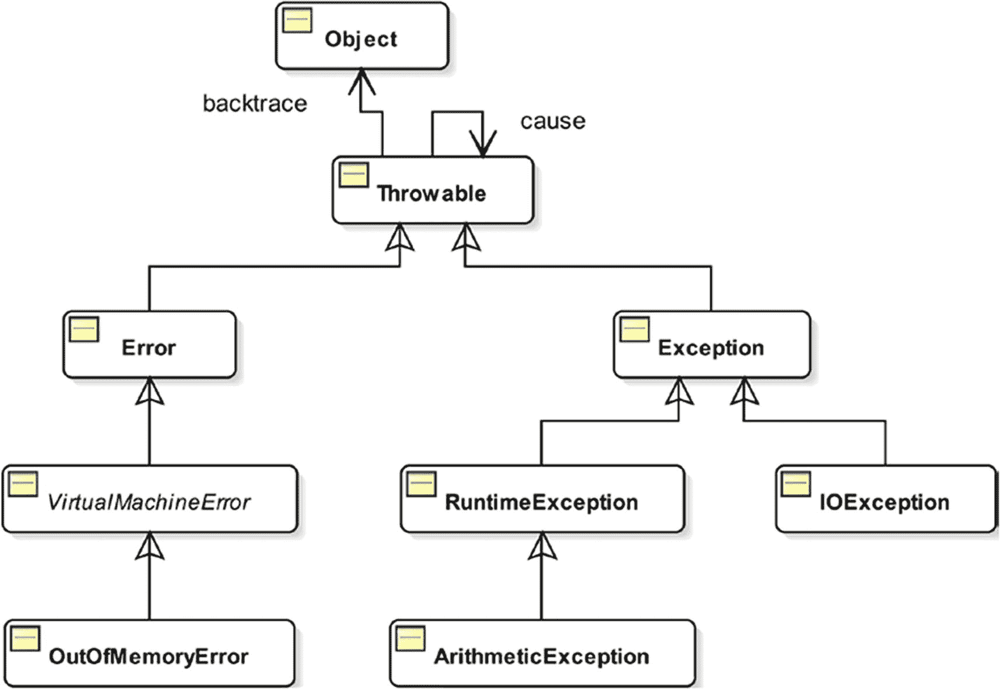
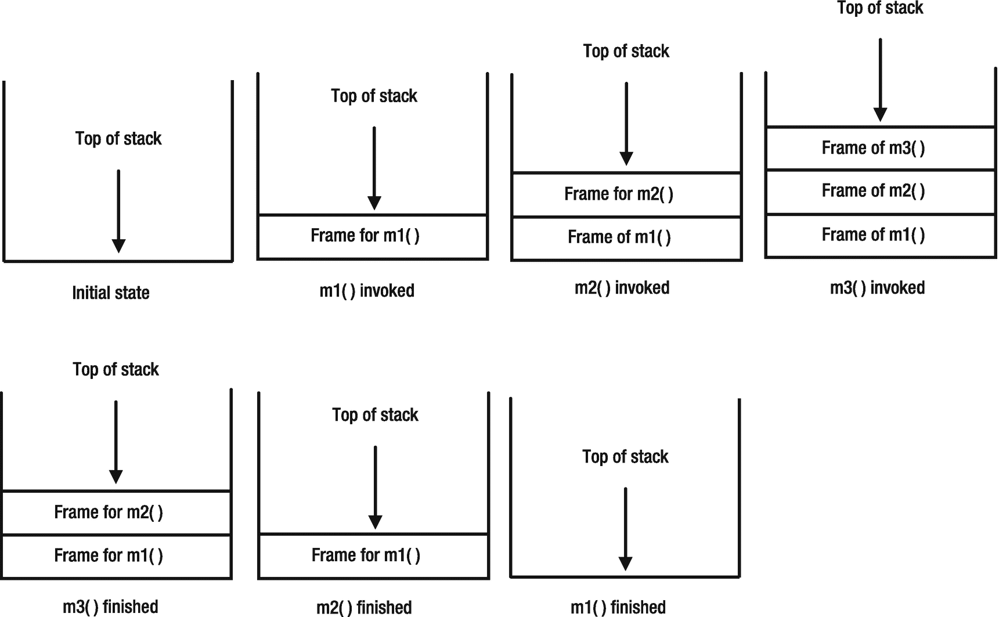

# 十三、异常处理

在本章中，您将学习:

*   使用异常在 Java 中处理错误

*   如何使用`try-catch`块处理异常

*   如何使用`finally`块清理资源

*   检查异常和未检查异常的区别

*   如何创建新的异常类型并使用它

*   如何使用`try-catch-resources`块来使用可自动关闭的资源

*   如何访问线程的堆栈帧

*   如何获取方法调用方的类名

本章中的所有类都是一个`jdojo.exception`模块的成员，如清单 [13-1](#PC1) 中所声明的。

```java
// module-info.java
module jdojo.exception {
    exports com.jdojo.exception;
}

Listing 13-1The Declaration of a jdojo.exception Module

```

## 什么是例外？

*异常*是在 Java 程序执行期间，当没有定义正常执行路径时可能出现的情况。例如，Java 程序可能会遇到试图将整数除以零的数值表达式。在执行以下代码片段的过程中，可能会出现这种情况:

```java
int x = 10, y = 0, z;
z = x / y; // Divide-by-zero

```

语句`z = x / y`试图将`x`除以`y`。因为`y`为零，所以`x / y`的结果没有在 Java 中定义。注意一个浮点数除以零，比如`9.5 / 0.0`，是定义好的，是无穷大。一般来说，异常情况，比如一个整数被零除，可以这样表述:

> *Java 程序试图将一个整数被零除时出错。*

Java 编程语言以不同的方式描述了前面的错误条件。在 Java 中有这样的说法:

> *当 Java 程序试图将一个整数除以零时抛出异常。*

实际上，这两种说法的意思是一样的。它们意味着程序中出现了异常情况。程序出现异常情况后会发生什么？你需要处理这样的异常情况。处理它的方法之一是在执行操作之前检查所有可能导致异常情况的可能性。您可以重写前面的代码，如下所示:

```java
int x = 10, y = 0, z;
if (y == 0) {
    // Report the abnormal/error condition here
} else {
    // Perform division here
    z = x / y;
}

```

您可能会注意到这段代码做了两件事:它处理错误条件并执行预期的操作。它混合了执行错误处理的代码和操作。一行代码(`z = x / y`)已经膨胀到至少五行代码。这是一个简单的例子。当错误处理代码与执行操作的实际代码混合在一起时，您可能没有完全意识到真正的问题。

为了弄清楚这个问题，考虑另一个例子。假设您想要编写更新员工工资的 Java 代码。雇员的记录储存在数据库里。伪代码可能如下所示:

```java
Connect to the database
Fetch the employee record
Update the employee salary
Commit the changes

```

实际的代码将执行这四个动作。这四个操作中的任何一个都可能导致错误。例如，您可能无法连接到数据库，因为数据库已关闭；由于某些验证失败，您可能无法提交更改。您需要在执行一个操作之后和后续操作开始之前执行错误检查。带有错误检查的伪代码可能如下所示:

```java
// Connect to the database
if (connected to the database successfully) {
    // Fetch the employee record
    if (employee record fetched) {
        // Update the employee salary
        if (update is successful) {
            // Commit the changes
            if (commit was successful ) {
                // Employee salary was saved successfully
            } else {
                // An error. Save failed
            }
        } else {
            //An error. Salary could not be updated
        }
    } else {
        // An error. Employee record does not exist
    }
} else {
    // An error. Could not connect to the database
}

```

请注意，当您在四行伪代码中添加错误处理时，代码膨胀到了 20 多行。这段代码最糟糕的地方在于，执行动作的代码被错误处理代码弄得乱七八糟。它还引入了许多嵌套的`if-else`语句，导致代码杂乱无章。

在上两个例子中，您看到了使用`if-else`语句处理错误的方式并不优雅且不可维护。Java 有一个更好的处理错误的方法:将执行动作的代码与处理错误的代码分开。在 Java 中，我们用短语“异常”而不是“错误”来表示程序中的异常情况；使用短语“异常处理”代替短语“错误处理”一般来说，我们说一个错误发生了，你处理它。在 Java 中，我们说抛出一个异常，然后你捕获它。这就是为什么*异常处理*也被称为*捕捉*T5】异常的原因。处理异常的代码被称为*异常处理程序*。您可以使用 Java 语法重写前面的伪代码(虽然不是完整的 Java 代码)，如下所示:

```java
try {
    // Connect to the database
    // Fetch employee record
    // Update employee salary
    // Commit the changes
} catch(DbConnectionException e1){
    // Handle DB Connection exception here
} catch(EmpNotFoundException e2){
    // Handle employee not found exception here
} catch(UpdateFailedException e3){
    // Handle update failed exception here
} catch(CommitFailedException e4){
    // Handle commit failed exception here
}

```

你不需要完全理解前面的伪代码。我们将很快讨论细节。您需要观察代码的结构，它允许执行动作的代码与处理异常的代码分离。执行动作的代码放在`try`块中，处理异常的代码放在`catch`块中。您将会发现，与之前编写许多`if-else`语句来达到相同效果的尝试相比，这段代码在优雅性和可维护性方面要好得多。

Tip

在 Java 中，会抛出并捕获一个异常。捕捉异常与处理异常是一样的。执行该操作的代码可能会引发异常，而处理该异常的代码会捕获所引发的异常。这种类型的异常处理允许您将执行操作的代码与处理在执行操作时可能出现的异常的代码分开。

## 异常是一个对象

代码的异常处理部分如何知道发生在代码另一部分的异常？当异常发生时，Java 创建一个对象，该对象包含关于异常的所有信息(例如，异常的类型、代码中发生异常的行号等)。)并将其传递给适当的异常处理程序。术语“异常”用于表示两种情况之一——异常条件和表示异常条件的 Java 对象。该术语的含义将从上下文中显而易见。当我们谈论抛出异常时，我们谈论的是三件事:

*   异常情况的发生

*   创建一个 Java 对象来表示异常情况

*   将异常对象抛出(或传递)给异常处理程序

异常的抛出与将对象引用传递给方法是一样的。在这里，您可以将异常处理程序想象成一个接受异常对象引用的方法。异常处理程序捕获异常对象并采取适当的措施。您可以将异常处理程序捕获的异常视为没有返回的方法调用，其中异常对象的引用是方法的实际参数。Java 还允许您创建自己的表示异常的对象，然后抛出它。

Tip

Java 中的异常是一个封装了程序中错误细节的对象。

## 使用 try-catch 块

在我们讨论`try-catch`块之前，让我们编写一个 Java 程序，试图将一个整数除以零，如清单 [13-2](#PC7) 所示。

```java
// DivideByZero.java
package com.jdojo.exception;
public class DivideByZero {
    public static void main(String[] args) {
        int x = 10, y = 0, z;
        z = x / y;
        System.out.println("z = " + z);
    }
}
Exception in thread "main" java.lang.ArithmeticException: / by zero
    at com.jdojo.exception.DivideByZero.main(DivideByZero.java:7)

Listing 13-2A Java Program Attempting to Divide an Integer by Zero

```

您是否期待清单 [13-2](#PC7) 的输出？它表示在运行`DivideByZero`类时发生了异常。输出包含四条信息:

*   它包括发生异常的线程的名称。线程的名字是`"main"`。

*   它包括已发生的异常的类型。异常的类型由异常对象的类名指示。在这种情况下，`java.lang.ArithmeticException`是异常的类名。Java 运行时创建这个类的对象，并将其引用传递给异常处理程序。

*   它包括一条消息，描述代码中导致错误的异常情况。在这种情况下，消息是“/除以零”(读作“除以零”)。

*   它包括异常发生的位置。输出中的第二行表明异常发生在`com.jdojo.exception.DivideByZero`类的`main()`方法中。源代码包含在`DivideByZero.java`文件中。源代码中导致异常的行号是 7。

您可能会注意到，在短短两行输出中，Java 运行时打印出了足够多的信息来帮助您跟踪代码中的错误。

当执行第 7 行的`z = x / y`时，Java 运行时检测到异常情况，这是试图将一个整数除以零。它用关于异常的所有相关信息创建一个类为`ArithmeticException`的新对象，然后将这个对象抛出(或传递)给一个异常处理程序。在这种情况下，谁捕捉(或处理)了异常？您没有在代码中指定任何异常处理程序。事实上，此时您甚至不知道如何指定异常处理程序。因为在这种情况下没有指定异常处理程序，所以 Java 运行时为您处理了异常。Java 运行时处理 Java 程序中抛出的所有异常吗？答案是肯定的。Java 运行时处理 Java 程序中的所有异常。但是，只有当您自己不处理异常时，它才会处理异常。

如果出现异常，而 Java 运行时没有找到程序员定义的异常处理程序来处理它，这样的异常被称为*未捕获异常*。所有未捕获的异常都由 Java 运行时处理。因为一个未被捕获的异常总是由 Java 运行时来处理的，为什么还要担心在程序中提供任何异常处理程序呢？这是一个有趣的观点。为什么您需要担心 Java 运行时会为您做的事情呢？如果你懒得收拾自己的烂摊子(处理自己的错误状况)，那么有一个坏消息要告诉你。您不应该对 Java 运行时期望过高。您可能不喜欢运行时为您处理异常的方式。它捕获未捕获的异常，在标准错误上打印错误堆栈，并暂停 Java 应用程序。换句话说，如果您让 Java 运行时处理所有的异常，那么您的程序会在异常发生的地方停止执行。这是你想做的吗？答案是否定的。有时，在处理完异常后，您可能想继续执行程序的其余部分，而不是暂停程序。当您运行`DivideByZero`类时，语句`z = x / y`中的表达式`x / y`导致了一个异常。Java 没有执行完语句`z = x / y`。有时这种情况被称为“语句`z = x / y`异常完成”运行时处理了异常，但它停止执行整个程序。这就是您在程序中看不到以下语句输出的原因:

```java
System.out.println("z = " + z);

```

现在你知道让运行时处理你的异常并不总是一个好主意。如果您想自己处理异常，您需要将代码放在一个`try`块中。一个`try`块如下所示:

```java
try {
    // Code for the try block goes here
}

```

一个`try`块以关键字`try`开始，后面跟着一个左括号和一个右括号。`try`块的代码放在左大括号和右大括号内。

一个`try`块不能单独使用。其后必须是一个或多个`catch`模块或一个`finally`模块或两者的组合。为了处理可能由`try`块中的代码抛出的异常，您需要使用一个`catch`块。一个`catch`模块可用于处理多种类型的异常。现在，我将只关注处理`catch`块中的一种类型的异常；我将在单独的章节中讲述如何在`catch`块中处理多个异常。`catch`块的语法类似于方法的语法:

```java
catch (ExceptionClassName parameterName) {
    // Exception handling code goes here
}

```

注意，`catch`块的声明类似于方法声明。它以关键字`catch`开头，后跟一对括号。在括号中，您声明一个参数，就像在方法中一样。参数类型是它应该捕获的异常类的名称。`parameterName`是用户给定的名字。括号后面是左大括号和右大括号。异常处理代码放在大括号内。当抛出异常时，异常对象的引用被复制到`parameterName`。您可以使用`parameterName`从异常对象中获取信息。它的行为完全像一个方法的形参。

您可以将一个或多个`catch`模块关联到一个`try`模块。一个`try-catch`块的一般语法如下。下面的代码片段显示了一个`try`块，它有三个关联的`catch`块。您可以将任意数量的`catch`模块关联到一个`try`模块:

```java
try {
    // Your code that may throw an exception goes here
} catch (ExceptionClass1 e1){
    // Handle exception of ExceptionClass1 type
} catch (ExceptionClass2 e2){
    // Handle exception of ExceptionClass2 type
} catch (ExceptionClass3 e3){
    // Handle exception of ExceptionClass3 type
}

```

让我们使用一个`try-catch`块来处理代码中可能出现的被零除异常。清单 13-3 显示了完整的代码。

```java
// DivideByZeroWithTryCatch.java
package com.jdojo.exception;
public class DivideByZeroWithTryCatch {
    public static void main(String[] args) {
        int x = 10, y = 0, z;
        try {
            z = x / y;
            System.out.println("z = " + z);
        } catch (ArithmeticException e) {
            // Get the description of the exception
            String msg = e.getMessage();
            // Print a custom error message
            System.out.println("An error has occurred. The error is: " + msg);
        }
        System.out.println("At the end of the program.");
    }
}
An exception has occurred. The error is: / by zero
At the end of the program.

Listing 13-3Handling an Exception Using a try-catch Block

```

清单 [13-3](#PC12) 的产量比清单 [13-2](#PC7) 的产量好。它确切地告诉你程序执行时发生了什么。请注意，当异常发生时，程序没有终止，因为您处理了异常。程序执行了打印`"At the end of the program"`消息的最后一条语句。

## 传送控制

当在`try`块中抛出异常时，您需要非常精确地理解控制流。首先，Java 运行时创建一个适当类的对象来表示已经发生的异常。检查跟随`try`块的第一个`catch`块。如果异常对象可以分配给`catch`块的参数，则`catch`块的参数被分配给异常对象的引用，并且控制转移到`catch`块的主体。当`catch`块完成执行其主体时，控制转移到`try-catch`块之后的点。值得注意的是，在执行`catch`程序块后，控制不会转移回`try`程序块。相反，它被转移到跟在`try-catch`块后面的代码中。如果一个`try`程序块有许多与之相关的`catch`程序块，则最多执行一个`catch`程序块。图 [13-1](#Fig1) 显示了当`try`块中出现异常时，典型 Java 程序中的控制转移。


图 13-1

try 块中发生异常时的控制权转移

在这个例子中，假设当执行`try-statement-2`时，它抛出一个类型为`Exception2`的异常。当抛出异常时，控制权转移到第二个`catch`块，执行`catch-statement-21`和`catch-statement-22`。在`catch-statement-22`执行后，控制转移到`try-catch`块之外，并且`statement-1`开始执行。理解当`try-statement-2`抛出异常时`try-statement-3`永远不会被执行是非常重要的。在三个`catch`块中，当`try`块中的语句抛出异常时，最多执行一个。

## 异常类层次结构

Java 类库包含许多异常类。图 [13-2](#Fig2) 显示了一些异常类。请注意，`Object`类不属于异常类家族。它在图中显示为继承层次结构中的`Throwable`类的祖先。



图 13-2

异常类层次结构中的一些类

异常类层次结构从`java.lang.Throwable`类开始。回想一下，`Object`类是 Java 中所有类的超类。它也是`Throwable`类的超类。这就是图中将`Object`类显示在类层次结构顶部的原因。需要强调的是，Java 异常类家族始于`Throwable`类，而不是`Object`类。

当一个异常被抛出时，它必须是一个`Throwable`类或者它的任何子类的对象。`catch`块的参数必须是`Throwable`类型或其子类之一，如`Exception`、`ArithmeticException`、`IOException`等。下列`catch`块不是有效的`catch`块，因为它们的参数不是`Throwable`或`Throwable`的子类:

```java
// A compile-time error. The Object class is not a throwable class.
catch(Object e1) {
}
// A compile-time error. The String class is not a throwable class.
catch(String e1) {
}

```

下面的`catch`块是有效的，因为它们将 throwable 类型指定为参数，这些类型是`Throwable`类或其子类:

```java
// Throwable is a valid exception class
catch(Throwable t) {
}
// Exception is a valid exception class because it is a subclass of Throwable
catch(Exception e) {
}
// IOException class is a valid exception class because it is a subclass of Throwable
catch(IOException t) {
}
// ArithmeticException is a valid exception class because it is a subclass of Throwable
catch(ArithmeticException t) {
}

```

您还可以通过从某个异常类继承您的类来创建自己的异常类。图 [13-2](#Fig2) 只显示了 Java 类库中可用的数百个异常类中的几个。我们在第 20 章中讨论了如何从另一个类继承一个类。

## 布置多个抓块

`Object`类的引用变量可以引用任何类型的对象。假设`AnyClass`是一个类，下面是一个有效语句:

```java
Object obj = new AnyClass();

```

前面赋值背后的规则是，一个类的对象的引用可以赋给它自己类型或者它的超类的引用变量。因为`Object`类是 Java 中所有类的超类(直接或间接),所以将任何对象的引用赋给`Object`类的引用变量是有效的。这个赋值规则不仅限于`Object`类的引用变量。它适用于任何物体。其表述如下:

> *如果 S 与 T 相同或者 S 是 T 的子类，则 T 类的引用变量可以引用 S 类的对象，以下语句在 Java 中始终有效假设 S 是 T 的子类:*

> `T t1 = new T();`

> `T t2 = new S();`

这条规则意味着任何对象的引用都可以存储在`Object`类型的引用变量中。您可以将此规则应用于例外分类层次结构。因为`Throwable`类是所有异常类的超类，所以`Throwable`类的引用变量可以引用任何异常类的对象。以下所有语句都是有效的:

```java
Throwable e1 = new Exception();
Throwable e2 = new IOException();
Throwable e3 = new RuntimeException();
Throwable e4 = new ArithmeticException();

```

记住这个赋值规则，考虑下面的`try-catch`块:

```java
try {
    statement1;
    statement2; // Exception of class MyException is thrown here
    statement3;
} catch (Exception1 e1) {
    // Handle Exception1
} catch(Exception2 e2) {
    // Handle Exception2
}

```

当执行前面的代码片段时，`statement2`抛出一个`MyException`类型的异常。假设运行时创建了一个`MyException`对象，如下所示:

```java
new MyException();

```

现在运行时选择合适的`catch`块，它可以捕获异常对象。它从与`try`模块相关的第一个 catch 模块开始，依次寻找合适的`catch`时钟。检查`catch`块是否能处理异常的过程非常简单。获取 catch 块的参数类型和参数名称，将它们放在赋值操作符的左边，并将抛出的异常对象放在右边。如果这样形成的语句是一个有效的 Java 语句，那么`catch`块将处理这个异常。否则，运行时将对下一个`catch`块重复该检查。为了检查第一个`catch`块是否可以处理前面代码片段中的`MyException`，Java 将形成以下语句:

```java
// Catch parameter declaration = thrown exception object reference
Exception1 e1 = new MyException();

```

只有当`MyException`类是`Exception1`类的子类或者`MyException`和`Exception1`是同一个类时，前面的语句才是有效的 Java 语句。如果前面的语句有效，运行时将把`MyException`对象的引用赋给`e1`，然后执行第一个`catch`块内的代码。如果前面的语句不是有效的语句，运行时将使用下面的语句对第二个`catch`块进行同样的检查:

```java
// Catch parameter declaration = thrown exception object reference
Exception2 e2 = new MyException();

```

如果前面的语句有效，`MyException`对象被分配给`e2`，并且执行`catch`块的主体。如果前面的语句无效，运行时没有为在`try`块中抛出的异常找到匹配的`catch`块，然后选择不同的执行路径，我们稍后将对此进行讨论。

通常，对于可以从`try`块抛出的每种类型的异常，都要在`try`块后添加一个`catch`块。假设有一个`try`块，它可以抛出三种异常，分别用三个类来表示——`Exception1`、`Exception2`和`Exception3`。假设`Exception1`是`Exception2`的超类，`Exception2`是`Exception3`的超类。三个异常类的类层次结构如图 [13-3](#Fig3) 所示。


图 13-3

异常 1、异常 2 和异常 3 异常类的类层次结构

考虑下面的`try-catch`块:

```java
try {
    // Exception1, Exception2 or Exception 3 could be thrown here
} catch (Exception1 e1) {
    // Handle Exception1
} catch (Exception2 e2) {
    // Handle Exception2
} catch (Exception3 e3) {
    // Handle Exception3
}

```

如果您尝试应用这些步骤来找到一个合适的`catch`块，前面的代码片段将总是执行第一个`catch`块，而不管从`try`块抛出的异常类型(`Exception1`、`Exception2`或`Exception3`)。这是因为`Exception1`是`Exception2`和`Exception3`的直接/间接超类。前面的代码片段显示了开发人员犯的一个逻辑错误。Java 编译器被设计用来处理您可能会犯的这种逻辑错误，它会生成一个编译时错误。要修复错误，您需要颠倒这三个`catch`块的顺序。您必须应用以下规则来为一个`try`块安排多个`catch`块:

> *多个* *catch* *块对于一个* *try* *块，必须从最具体的异常类型到最一般的异常类型进行安排。否则，会发生编译时错误。第一个* *catch* *块应该处理最具体的异常类型，最后一个处理最一般的异常类型。*

下面的代码片段使用了多个`catch`块的有效序列。`ArithmeticException`类是`RuntimeException`类的子类。如果这两个异常都在同一个`try`程序块的`catch`程序块中处理，那么最具体的类型`ArithmeticException`必须出现在最一般的类型`RuntimeException`之前:

```java
try {
    // Do something, which might throw Exception
} catch(ArithmeticException e1) {
    // Handle ArithmeticException first
} catch(RuntimeException e2) {
    // Handle RuntimeException after ArithmeticException
}

```

## 多抓块

您可以使用 multi-catch 块在单个`catch`块中处理多种类型的异常。您可以在一个多`catch`块中指定多个异常类型。多个异常由竖线分隔(`|`)。以下是语法:

```java
try {
    // May throw ExceptionA, ExceptionB, or ExceptionC
} catch (ExceptionA | ExceptionB | ExceptionC  e) {
    // Handle ExceptionA, ExceptionB, and ExceptionC
}

```

在多`catch`块中，不允许有通过子类化相关的可选异常。也就是说，`ExceptionA`、`ExceptionB`和`ExceptionC`不能因为是彼此的子类或超类而相关联。例如，下面的多`catch`块是不允许的，因为`ExceptionA`和`ExceptionB`是`Throwable`的子类。事实上，所有异常类都是`Throwable`的直接或间接子类:

```java
try {
    // May throw ExceptionA, ExceptionB, or ExceptionC
} catch (ExceptionA | ExceptionB | Throwable  e) {
    // Handle Exceptions here
}

```

前面的代码片段将生成以下编译时错误:

```java
error: Alternatives in a multi-catch statement cannot be related by subclassing
        } catch(ExceptionA | ExceptionB | Throwable e) {
                                          ^
  Alternative ExceptionA is a subclass of alternative Throwable
1 error

```

## 已检查和未检查的异常

在我们查看检查和未检查的异常之前，让我们看一个从标准输入中读取字符的 Java 程序。您一直在使用`System.out.println()`方法在标准输出(通常是控制台)上打印消息。您可以使用`System.in.read()`方法从标准输入(通常是键盘)中读取一个字节。它将字节的值作为 0 到 255 之间的`int`返回。如果到达输入的结尾，它返回–1。清单 [13-4](#PC26) 包含了一个`ReadInput`类的代码，该类的`readChar()`方法从标准输入中读取一个字节，并将该字节作为一个字符返回。它假设您使用的语言包含 Unicode 值在 0 到 255 之间的所有字母。`readChar()`方法包含用于读取的主代码。要从标准输入中读取字符，需要使用`ReadInput.readChar()`方法。

```java
// ReadInput.java
package com.jdojo.exception;
public class ReadInput {
    public static char readChar() {
        char c = '\u0000';
        int input = System.in.read();
        if (input != -1) {
            c = (char)input;
        }
        return c;
    }
}

Listing 13-4Reading Input from Standard Input

```

编译`ReadInput`类。哎呀！编译器生成了以下错误:

```java
"ReadInput.java": unreported exception java.io.IOException; must be caught or declared to be thrown at line 7, column 31

```

错误指向源代码中的第 7 行:

```java
int input = System.in.read();

```

这种说法有所遗漏。该错误还告诉您有一个未捕获的异常，必须捕获或声明该异常。您知道如何使用`try-catch`块捕捉异常。但是，您可能不理解如何声明异常。您将在下一节学习如何声明异常。

`System.in.read()`方法调用可能抛出一个`java.io.IOException`。这个错误告诉你将这个方法调用放在一个`try-catch`块中，这样你就可以处理这个异常。如果您没有捕捉到这个异常，您需要在`readChar()`方法的声明中包含它可能抛出一个`java.io.IOException`。在前面几节中，您已经了解到运行时处理所有未捕获的异常。那么为什么在这种情况下 Java 运行时不能处理`java.io.IOException`？您需要了解已检查和未检查的异常，以便完全理解这个错误。Java 程序中可能会出现三种异常情况:

*   *已检查*:第一类是发生几率较高的异常，你可以处理。例如，当您从文件中读取时，更有可能发生 I/O 错误。最好在程序中处理这些类型的异常。异常类层次结构中的类(参见图 [13-2](#Fig2) )是`Exception`类的子类，包括`Exception`类本身，不包括`RuntimeException`及其所有子类，都属于这一类。如果某个方法或构造器可能会引发属于此类别的异常，您必须采取适当的操作，在调用该方法或构造器的代码中处理该异常。您需要采取什么“适当的行动”来处理这些类型的异常？您可以采取以下两种措施之一:
    *   您可以将能够抛出异常的代码放在一个`try-catch`块中。其中一个`catch`块必须能够处理可能抛出的异常类型。

    *   您可以在调用方法/构造器声明中指定它可能会引发异常。您可以通过在方法/构造器声明中使用一个`throws`子句来实现这一点。

*   *错误*:第二类是在 Java 程序执行过程中可能出现的异常，你对此无能为力。例如，当运行时内存不足时，您会收到一个`java.lang.OutOfMemoryError`异常。您无法从内存不足错误中恢复。最好让应用程序崩溃，然后在程序中寻找更有效地管理内存的方法。异常类层次结构中的类(参见图 [13-2](#Fig2) )是`Error`类的子类，而`Error`类本身也属于这种异常类别。如果一段代码可能抛出属于这一类的异常，编译器不会坚持要求您采取行动。如果这种类型的异常在运行时抛出，运行时将通过显示详细的错误消息和暂停应用程序来处理它。

*   *未检查*:第三类是运行时可能发生的异常，如果自己处理，或许可以从异常情况中恢复。这一类别中有许多例外。但是，如果您觉得更有可能引发这种异常，您应该在代码中处理它。如果你试图通过使用`try-catch`块来处理它们，你的代码会变得混乱。异常类层次结构中的类(参见图 [13-2](#Fig2) )是`RuntimeException`类的子类，而`RuntimeException`类本身也属于这种异常类别。如果一段代码可能抛出属于这一类的异常，编译器不会坚持要求您采取行动。如果这种类型的异常在运行时抛出，运行时将通过显示详细的错误信息和暂停程序来处理它。

第一类异常称为检查异常。`Throwable`类也属于检查异常。`Throwable`类、`Exception`类和`Exception`类的子类，不包括`RuntimeException`类及其子类，被称为检查异常。它们被称为检查异常，因为编译器检查它们是否在代码中得到处理。

所有不是检查异常的异常都称为未检查异常。`Error`类、`Error`类的所有子类、`RuntimeException`类及其所有子类都是未检查的异常。它们被称为未检查异常，因为编译器不会检查它们是否在代码中得到处理。然而，你可以自由处理它们。处理已检查或未检查异常的程序结构是相同的。它们之间的区别在于编译器强迫(或不强迫)你在代码中处理它们的方式。

让我们修复`ReadInput`类的编译时错误。现在你知道了`java.io.IOException`是一个被检查的异常，编译器会强迫你处理它。你将使用`try-catch`块来处理它。清单 [13-5](#PC29) 显示了`ReadInput`类的代码。这一次，您已经在`readChar()`方法中处理了`IOException`，代码将会很好地编译。

```java
// ReadInput.java
package com.jdojo.exception;
import java.io.IOException;
public class ReadInput {
    public static char readChar() {
        char c = '\u0000';
        int input = 0;
        try {
            input = System.in.read();
            if (input != -1) {
                c = (char)input;
            }
        } catch (IOException e) {
            System.out.print("IOException occurred while reading input.");
        }
        return c;
    }
}

Listing 13-5A ReadInput Class Whose readChar() Method Reads One Character from the Standard Input

```

如何使用`ReadInput`类？您可以像在 Java 中使用其他类一样使用它。如果要捕获用户输入的第一个字符，需要调用`ReadInput.readChar()`静态方法。清单 [13-6](#PC30) 包含了展示如何使用`ReadInput`类的代码。它提示用户输入一些文本。输入文本的第一个字符显示在标准输出上。

```java
// ReadInputTest.java
package com.jdojo.exception;
public class ReadInputTest {
    public static void main(String[] args) {
        System.out.print("Enter some text and press Enter key: ");
        char c = ReadInput.readChar();
        System.out.println("First character you entered is: " + c);
    }
}
Enter some text and press Enter key: Hello
First character you entered is: H

Listing 13-6A Program to Test the ReadInput Class

```

## 检查异常:捕捉或声明

如果一段代码可能引发已检查的异常，您必须执行下列操作之一:

*   通过将这段代码放在`try-catch`块中来处理检查到的异常。

*   在方法/构造器声明中指定它将引发检查到的异常。

对`ReadInput`类的`readChar()`方法中的`System.in.read()`方法的调用(参见清单 [13-5](#PC29) )抛出了一个`IOException`类型的检查异常。在这种情况下，您应用了第一个选项，通过调用`try-catch`块中的`System.in.read()`方法来处理`IOException`。

让我们假设你正在为一个有三条语句的类编写一个方法`m1()`。假设三条语句可能分别抛出类型为`Exception1`、`Exception2`和`Exception3`的检查异常。该方法的代码可能如下所示:

```java
// Will not compile
public void m1() {
    statement-1; // May throw Exception1
    statement-2; // May throw Exception2
    statement-3; // May throw Exception3
}

```

您不能以这种形式编译`m1()`方法的代码。您必须使用一个`try-catch`块来处理异常，或者在其声明中包含它可能抛出三个被检查的异常。如果您想在`m1()`方法体中处理检查过的异常，您的代码可能如下所示:

```java
public void m1() {
    try {
        statement-1; // May throw Exception1
        statement-2; // May throw Exception2
        statement-3; // May throw Exception3
    } catch(Exception1 e1) {
        // Handle Exception1 here
    } catch(Exception2 e2) {
        // Handle Exception2 here
    } catch(Exception3 e3) {
        // Handle Exception3 here
    }
}

```

前面的代码假设当抛出三个异常中的一个时，您不想执行其余的语句。

如果您想使用不同的逻辑，您可能需要不止一个`try-catch`块。例如，如果您的逻辑规定您必须尝试执行所有三条语句，即使前一条语句引发了异常，您的代码也将如下所示:

```java
public void m1() {
    try {
        statement-1; // May throw Exception1
    } catch(Exception1 e1) {
        // Handle Exception1 here
    }

    try {
        statement-2; // May throw Exception2
    } catch(Exception2 e2) {
        // Handle Exception2 here
    }
    try {
        statement-3; // May throw Exception3
    } catch(Exception3 e3) {
        // Handle Exception3 here
    }
}

```

消除编译时错误的第二种方法是在`m1()`方法的声明中指定抛出三个检查过的异常。这是通过在`m1()`方法的声明中使用一个`throws`子句来实现的。指定`throws`子句的一般语法如下:

```java
[modifiers] <return-type> <method-name>([parameters]) [throws <list-of-exceptions>] {
    // Method body goes here
}

```

关键字`throws`用于指定一个`throws`子句。`throws`子句放在方法参数列表的右括号之后。`throws`关键字后面是逗号分隔的异常类型列表。回想一下，异常类型只不过是 Java 类的名称，它位于异常类层次结构中。您可以在`m1()`方法的声明中指定一个`throws`子句，如下所示:

```java
public void m1() throws Exception1, Exception2, Exception3 {
    statement-1; // May throw Exception1
    statement-2; // May throw Exception2
    statement-3; // May throw Exception3
}

```

当一段代码抛出多个检查异常时，您也可以在同一方法中混合使用这两个选项。您可以使用一个`try-catch`块来处理其中一些，并在方法声明中使用一个`throws`子句来声明一些。以下代码使用`try-catch`块处理`Exception2`，并使用`throws`子句声明异常`Exception1`和`Exception3`:

```java
public void m1() throws Exception1, Exception3 {
     statement-1;    // May throw Exception1
    try {
        statement-2; // May throw Exception2
    } catch(Exception2 e){
        // Handle Exception2 here
    }
    statement-3;     // May throw Exception3
}

```

让我们回到`ReadInput`类的例子。清单 [13-3](#PC12) 通过添加一个`try-catch`块修复了编译时错误。现在让我们使用第二个选项:在`readChar()`方法的声明中包含一个`throws`子句。清单 [13-7](#PC37) 包含了`ReadInput`类的另一个版本，叫做`ReadInput2`。

```java
// ReadInput2.java
package com.jdojo.exception;
import java.io.IOException;
public class ReadInput2 {
    public static char readChar() throws IOException {
        char c = '\u0000';
        int input = 0;
        input = System.in.read();
        if (input != -1) {
            c = (char) input;
        }
        return c;
    }
}

Listing 13-7Using a throws Clause in a Method's Declaration

```

清单 [13-8](#PC38) 包含了测试`ReadInput2`类的`readChar()`方法的`ReadInput2Test`类的代码。

```java
// ReadInput2Test.java
package com.jdojo.exception;
public class ReadInput2Test {
    public static void main(String[] args) {
        System.out.print("Enter some text and then press Enter key: ");
        char c = ReadInput2.readChar();
        System.out.print("The first character you entered is: " + c);
    }
}

Listing 13-8Testing a throws Clause in a Method’s Declaration

```

现在，编译`ReadInput2Test`类。哎呀！编译`ReadInput2Test`类会产生以下错误:

```java
Error(6,11): unreported exception: class java.io.IOException; must be caught or declared to be thrown

```

此时，您可能不太清楚编译器错误。`ReadInput2`类的`readChar()`方法声明它可能抛出一个`IOException`。`IOException`是被检查的异常。因此，`ReadInput2Test`的`main()`方法中的下面这段代码可能会抛出一个被检查的`IOException`:

```java
char c = ReadInput2.readChar();

```

回想一下关于处理被检查的异常的规则，这在本节的开头已经讨论过了。如果一段代码可能抛出检查异常，您必须使用两个选项之一:将这段代码放在一个`try-catch`块中来处理异常，或者在方法或构造器的声明中使用一个`throws`子句来指定检查异常。现在，您必须在`main()`方法中为`ReadInput2.readChar()`方法的调用应用这两个选项之一。清单 [13-9](#PC41) 使用第一个选项，并将对`ReadInput2.readChar()`方法的调用放在`try-catch`块中。请注意，您在`try`块中放置了三条语句，这是不必要的。您需要在`try`块中只放置可能抛出被检查异常的代码。

```java
// ReadInput2Test2.java
package com.jdojo.exception;
import java.io.IOException;
public class ReadInput2Test2 {
    public static void main(String[] args) {
        char c = '\u0000';
        try {
            System.out.print("Enter some text and then press Enter key:");
            c = ReadInput2.readChar();
            System.out.println("The first character you entered is: " + c);
        } catch (IOException e) {
            System.out.println("Error occurred while reading input.");
        }
    }
}

Listing 13-9A Program to Test the ReadInput2.readChar() Method

```

您还可以使用第二个选项来修复编译器错误。清单 [13-10](#PC42) 包含使用第二个选项的代码(声明抛出的异常)。

```java
// ReadInput2Test3.java
package com.jdojo.exception;
import java.io.IOException;
public class ReadInput2Test3 {
    public static void main(String[] args) throws IOException {
        System.out.print("Enter some text and then press Enter key: ");
        char c = ReadInput2.readChar();
        System.out.println("The first character you entered is: " + c);
    }
}

Listing 13-10A Program to Test the Throws Declaration for ReadInput2.readChar() Method

```

该程序包括一个带有用于`main()`方法的`IOException`的`throws`子句。你能像使用`java`命令运行其他类一样运行`ReadInput2Test3`类吗？是的。您可以像在 Java 中运行其他类一样运行`ReadInput2Test3`类。运行一个类的要求是它应该包含一个`main()`方法，该方法被声明为`public static void main(String[] args)`。该要求没有指定任何关于`throws`条款的内容。一个`main()`方法，用来运行一个类作为起点，可能包含也可能不包含一个`throws`子句。

假设您运行了`ReadInput2Test3`类，并且对`ReadInput2`类的`readChar()`方法中的`System.in.read()`方法的调用抛出了一个`IOException`。`IOException`会怎么处理，谁来处理？当在方法体中抛出异常时，运行时检查抛出异常的代码是否在`try-catch`块中。如果抛出异常的代码在`try-catch`块中，Java 运行时会寻找能够处理异常的`catch`块。如果它没有找到可以处理异常的`catch`块或者方法调用不在`try-catch`块中，异常将被向上传播到方法调用堆栈。也就是说，异常被传递给方法的调用方。在您的例子中，异常不在`ReadInput2`类的`readChar()`方法中处理。它的调用者是`ReadInput2Test2`类的`main()`方法中的一段代码。在这种情况下，在`ReadInput2Test2.main()`方法内部进行`ReadInput2.readChar()`方法调用时会抛出相同的异常。运行库应用相同的检查来处理异常。如果运行`ReadInput2Test2`类并抛出`IOException`，运行时会发现对`ReadInput2.readChar()`的调用在一个`try-catch`块中，该块可以处理`IOException`。因此，它会将控制转移到处理异常的`catch`块，程序在`ReadInput2Test2`类的`main()`方法中继续。理解这一点非常重要，控件在抛出异常后不会返回到`ReadInput2.readChar()`方法，并且该异常是在`ReadInput2Test2.main()`方法中处理的。

当运行`ReadInput2Test3`类时，对`ReadInput2.readChar()`方法的调用不在`try-catch`块中。在这种情况下，Java 运行时必须将异常向上传播到方法调用堆栈。`main()`方法是 Java 应用程序的方法调用栈的开始。这是所有 Java 应用程序启动的方法。如果`main()`方法抛出异常，运行时会处理它。回想一下，如果运行时为您处理了一个异常，它会在标准错误上打印调用堆栈的详细信息，并退出应用程序。

回想一下，具有异常类型的`catch`块可以处理相同类型或其任何子类类型的异常。例如，具有`Throwable`异常类型的`catch`块能够处理 Java 中所有类型的异常，因为`Throwable`类是所有异常类的超类。这个概念也适用于`throws`条款。如果一个方法抛出了一个`Exception1`类型的检查异常，你可以在它的`throws`子句或者`Exception1`的任何超类中提到`Exception1`类型。这条规则背后的推理是，如果方法的调用者处理的异常是`Exception1`的超类，那么同一个处理程序也可以处理`Exception1`。

Tip

Java 编译器通过使用`try-catch`块或在方法或构造器声明中使用`throws`子句来强制您处理检查异常。如果一个方法抛出一个异常，它应该在调用栈中的某个地方被处理。也就是说，如果一个方法抛出异常，它的调用者可以处理它，或者它的调用者的调用者可以处理它，以此类推。如果异常未被调用堆栈中的任何调用方处理，则称为未捕获异常(或未处理异常)。一个未捕获的异常最终由 Java 运行时处理，它在标准错误上打印异常堆栈跟踪并退出 Java 应用程序。对于不是主线程的线程中未捕获的异常，可以指定不同的行为。

编译器对由程序员处理的检查异常非常挑剔。如果`try`块中的代码不能抛出已检查的异常，而其关联的`catch`块捕捉到已检查的异常，编译器将生成一个错误。考虑清单 [13-11](#PC43) 中的代码，它使用了一个`try-catch`块。`catch`块指定了一个`IOException`，这是一个被检查的异常。但是，相应的`try`块不会抛出`IOException`。

```java
// CatchNonExistentException.java
package com.jdojo.exception;
import java.io.IOException;
// Will not compile
public class CatchNonExistentException {
    public static void main(String[] args) {
        int x = 10, y = 0, z = 0;
        try {
            z = x / y;
        } catch(IOException e) {
            // Handle the exception
        }
    }
}

Listing 13-11Catching a Checked Exception That Is Never Thrown in the try Block

```

当您编译`CatchNonExistentException`类的代码时，您会得到以下编译器错误:

```java
Error(12):  exception java.io.IOException is never thrown in body of corresponding try statement

```

错误消息是不言自明的。它声明`IOException`永远不会在`try`块中被抛出。因此，`catch`号一定抓不住它。修复该错误的一种方法是完全移除`try-catch`块。清单 [13-12](#PC45) 展示了提及通用`catch`块的另一种有趣的方式(但不是一种好方式)。

```java
// CatchNonExistentException2.java
package com.jdojo.exception;
// Will compile fine
public class CatchNonExistentException2 {
    public static void main(String[] args) {
        int x = 10, y = 0, z = 0;
        try {
            z = x / y;
        } catch(Exception e) {
            // Handle the exception
        }
    }
}

Listing 13-12Catching a Exception That Is Never Thrown in the try Block

```

与`IOException`一样，`Exception`也是 Java 中的检查异常类型。如果一个`catch`块不应该捕捉被检查的异常，除非它在相应的`try`块中被抛出，那么`CatchNonExistentException2`的代码是如何编译好的？它不应该生成相同的编译时错误吗？乍一想，你是对的。编译失败的原因应该和`CatchNonExistentException`类失败的原因一样。有两个选中的异常类是此规则的异常。这两个异常类是`Exception`和`Throwable`。`Exception`类是`IOException`和其他异常的超类，是检查异常。也是`RuntimeException`的超类和`RuntimeException`的所有子类，都是未检查的异常。回想一下超类异常类型也可以处理子类异常类型的规则。因此，您可以使用`Exception`类来处理已检查的异常和未检查的异常。检查`catch`程序块中未抛出异常的规则仅适用于已检查的异常。`catch`块中的`Exception`和`Throwable`类可以处理已检查和未检查的异常，因为它们是这两种类型的超类。这就是为什么编译器会让你在一个`catch`块中使用这两种检查过的异常类型，即使相关的`try`块没有抛出任何检查过的异常。

Tip

所有关于编译器检查正在处理或抛出的异常的规则只适用于被检查的异常。Java 不会强迫你在代码中处理未检查的异常。然而，你可以自由处理它们，只要你觉得合适。

## 检查异常和初始值设定项

你不能从一个`static`初始化器抛出一个检查过的异常。如果`static`初始化器中的一段代码抛出了一个检查过的异常，必须使用初始化器内部的`try-catch`块来处理。`static`初始化器对于一个类只被调用一次，程序员在代码中没有特定的点来捕捉它。这就是为什么`static`初始化器必须处理它可能抛出的所有可能的检查异常:

```java
public class Test {
    static {
        // Must use try-catch blocks to handle all checked exceptions
    }
}

```

对于实例初始化器，规则是不同的。实例初始化器作为类的构造器调用的一部分被调用。它可能会抛出已检查的异常。然而，所有那些被检查的异常必须包含在该类的所有构造器的`throws`子句中。这样，编译器可以确保在调用任何构造器时，所有被检查的异常都被程序员处理了。下面的`Test`类代码假设实例初始化器抛出一个`CException`类型的检查异常。编译器会强制你给`Test`的所有构造器添加一个带`CException`的`throws`子句:

```java
public class Test {
     // Instance initializer
    {
     // Throws a checked exception of type CException
    }
    // All constructors must specify that they throw CException
    // because the instance initializer throws CException
    public Test() throws CException {
        // Code goes here
    }
    public Test(int x) throws CException {
        // Code goes here
    }
    // Rest of the code goes here
}

```

当您使用`Test`类的任何构造器创建一个对象时，您必须处理`CException`，如下所示:

```java
Test t = null;
try {
    t = new Test();
} catch (CException e) {
    // Handle the exception here
}

```

如果不使用`try-catch`块来处理`CException`，那么必须使用`throws`子句来指定`Test`类的构造器可以抛出`CException`。

如果实例初始化器抛出一个检查过的异常，你必须为你的类声明一个构造器。如果您没有添加默认构造器，编译器会将它添加到您的类中。但是，编译器不会在默认构造器中添加一个`throws`子句，这会打破之前的规则。以下代码将不会编译:

```java
public class Test123 {
    {
        // Throws CException, which is a checked exception.
        throw new CException();
    }
}

```

当编译`Test123`类时，编译器会添加一个默认的构造器，并且类`Test123`将如下所示:

```java
public class Test123 {
    {
        // Throws CException, which is a checked exception.
        throw new CException();
    }
    public Test123() {
        // An empty body. The compiler did not add a throws clause.
    }
}

```

注意，编译器添加的默认构造器不包含包含由实例初始化器抛出的`CException`的`throws`子句。这就是`Test123`类无法编译的原因。要编译`Test123`类，必须显式添加至少一个构造器，并使用一个`throws`子句指定它可能抛出`CException`。

## 引发异常

Java 异常并不总是由运行时抛出。您还可以使用`throw`语句在代码中抛出异常。`throw`语句的语法是

```java
throw <a-throwable-object-reference>;

```

这里，`throw`是一个关键字，后面跟一个对 throwable 对象的引用。可抛出对象是一个类的实例，它是`Throwable`类或`Throwable`类本身的子类。下面是一个抛出`IOException`的`throw`语句的例子:

```java
// Create an object of IOException
IOException e1 = new IOException(“File not found”);
// Throw the IOException
throw e1;

```

回想一下,`new`操作符返回新对象的引用。您还可以创建一个 throwable 对象，并在一条语句中将其抛出:

```java
// Throw an IOException
throw new IOException("File not found");

```

当您在代码中引发异常时，处理异常的规则也同样适用。如果你抛出一个被检查的异常，你必须通过把代码放在一个`try-catch`块中或者通过在包含`throw`语句的方法或构造器声明中使用一个`throws`子句来处理它。如果抛出未检查的异常，则这些规则不适用。

## 创建异常类

您也可以创建自己的异常类。它们必须扩展(或继承)现有的异常类。我们将在关于继承的第 20 章中详细介绍如何扩展一个类。本节解释扩展类的必要语法。关键字`extends`用于扩展一个类，如下所示:

```java
[modifiers] class <class-name> extends <superclass-name> {
    // Body for <class-name> goes here
}

```

这里，`<class-name>`是你的异常类名，`<superclass-name>>`是已经存在的异常类名，由你的类扩展。

假设您想要创建一个`MyException`类，它扩展了`java.lang.Exception`类。语法如下所示:

```java
public class MyException extends Exception {
    // Body for MyException class goes here
}

```

异常类的主体是什么样子的？异常类就像 Java 中的其他类一样。通常，不向异常类添加任何方法。许多可用于查询异常对象状态的有用方法都在`Throwable`类中声明，您无需重新声明即可使用它们。通常，在异常类中包含四个构造器。所有构造器都将使用`super`关键字调用其超类的相应构造器。清单 [13-13](#PC56) 显示了一个有四个构造器的`MyException`类的代码。

```java
// MyException.java
package com.jdojo.exception;
public class MyException extends Exception {
    public MyException() {
        super();
    }
    public MyException(String message) {
        super(message);
    }
    public MyException(String message, Throwable cause) {
        super(message, cause);
    }
    public MyException(Throwable cause) {
        super(cause);
    }
}

Listing 13-13A MyException Class That Extends the Exception Class

```

第一个构造器创建一个异常，用`null`作为它的详细消息。第二个构造器创建一个带有详细消息的异常。第三个和第四个构造器允许您通过包装另一个带有/不带有详细消息的异常来创建一个异常。

您可以抛出类型为`MyException`的异常，如下所示:

```java
throw new MyException("Your message goes here");

```

您可以在方法/构造器声明的`throws`子句中使用`MyException`类，或者将其作为`catch`块中的参数类型。以下代码片段显示:

```java
import com.jdojo.exception.MyException;
...
public void m1() throws MyException {
    // Code for m1() body goes here
}
try {
    // Code for the try block goes here
} catch(MyException e) {
    // Code for the catch block goes here
}

```

表 [13-1](#Tab1) 显示了`Throwable`类的一些常用方法。注意`Throwable`类是 Java 中所有异常类的超类。此表中显示的所有方法在所有异常类中都可用。

表 13-1

Throwable 类的部分方法列表

<colgroup><col class="tcol1 align-left"> <col class="tcol2 align-left"></colgroup> 
| 

方法

 | 

描述

 |
| --- | --- |
| `Throwable getCause()` | 这个方法是在 Java 1.4 中添加的。它返回异常的原因。如果没有设置异常的原因，则返回`null`。 |
| `String getMessage()` | 它返回异常的详细消息。 |
| `StackTraceElement[] getStackTrace()` | 这个方法是在 Java 1.4 中添加的。它返回堆栈跟踪元素的数组。数组中的每个元素代表一个堆栈帧。数组的第一个元素表示堆栈的顶部，数组的最后一个元素表示堆栈的底部。栈顶是创建异常对象的方法/构造器。`StackTraceElement`类的对象持有类名、方法名、文件名、行号等信息。 |
| `Throwable initCause(Throwable cause)` | 这个方法是在 Java 1.4 中添加的。有两种方法可以将异常设置为异常的原因。一种方法是使用构造器，它接受原因作为参数。另一种方法是使用这种方法。 |
| `void printStackTrace()` | 它在标准错误流中打印堆栈跟踪。输出将异常对象本身的描述打印为第一行，然后是每个堆栈帧的描述。打印异常的堆栈跟踪对于调试非常有用。 |
| `void printStackTrace(PrintStream s)` | 它将堆栈跟踪打印到指定的`PrintStream`对象。 |
| `void printStackTrace(PrintWriter s)` | 它将堆栈跟踪打印到指定的`PrintWriter`对象。 |
| `String toString()` | 它返回异常对象的简短描述。异常对象的描述包含异常类的名称和详细消息。 |

清单 [13-14](#PC59) 展示了异常类的`printStackTrace()`方法的使用。`main()`方法调用`m1()`方法，后者又调用`m2()`方法。这个调用的堆栈框架从位于堆栈底部的`main()`方法开始。栈顶包含了`m2()`方法。输出显示`printStackTrace()`方法从上到下打印堆栈信息。每个堆栈帧包含类名、方法名、源文件名和行号。`printStackTrace()`方法的第一行打印异常对象的类名和详细消息。

```java
// StackTraceTest.java
package com.jdojo.exception;
public class StackTraceTest {
    public static void main(String[] args) {
        try {
            m1();
        } catch (MyException e) {
            e.printStackTrace(); // Print the stack trace
        }
    }
    public static void m1() throws MyException {
        m2();
    }
    public static void m2() throws MyException {
        throw new MyException("Some error has occurred.");
    }
}
com.jdojo.exception.MyException: Some error has occurred.
        at jdojo.exception/com.jdojo.exception.StackTraceTest.m2(StackTraceTest.java:18)
        at jdojo.exception/com.jdojo.exception.StackTraceTest.m1(StackTraceTest.java:14)
        at jdojo.exception/com.jdojo.exception.StackTraceTest.main(StackTraceTest.java:7)

Listing 13-14Printing the Stack Trace of an Exception

```

清单 [13-14](#PC59) 演示了如何在标准错误上打印异常的堆栈跟踪。有时，您可能需要将堆栈跟踪保存在文件或数据库中。您可能需要以变量中的字符串形式获取堆栈跟踪信息。另一个版本的`printStackTrace()`方法允许您这样做。清单 [13-15](#PC60) 展示了如何使用`printStackTrace(PrintWriter s)`方法将异常对象的堆栈跟踪打印到`String`对象。该程序与清单 [13-14](#PC59) 相同，只有一处不同。它将堆栈跟踪存储在一个字符串中，然后在标准输出中打印该字符串。方法`getStackTrace()`将堆栈跟踪写入一个字符串并返回该字符串。

```java
// StackTraceAsStringTest.java
package com.jdojo.exception;
import java.io.StringWriter;
import java.io.PrintWriter;
public class StackTraceAsStringTest {
    public static void main(String[] args) {
        try {
            m1();
        } catch (MyException e) {
            String str = getStackTrace(e);
            // Print the stack trace to the standard output
            System.out.println(str);
        }
    }
    public static void m1() throws MyException {
        m2();
    }
    public static void m2() throws MyException {
        throw new MyException("Some error has occurred.");
    }
    public static String getStackTrace(Throwable e) {
        StringWriter strWriter = new StringWriter();
        PrintWriter printWriter = new PrintWriter(strWriter);
        e.printStackTrace(printWriter);
        // Get the stack trace as a string
        String str = strWriter.toString();
        return str;
    }
}
com.jdojo.exception.MyException: Some error has occurred.
      at jdojo.exception/com.jdojo.exception.StackTraceAsStringTest.m2(StackTraceAsStringTest.java:24)
      at jdojo.exception/com.jdojo.exception.StackTraceAsStringTest.m1(StackTraceAsStringTest.java:20)
      at jdojo.exception/com.jdojo.exception.StackTraceAsStringTest.main(StackTraceAsStringTest.java:10)

Listing 13-15Writing Stack Trace of an Exception to a String

```

## 最终块

您已经看到了如何将一个或多个 catch 块关联到一个`try`块。一个`try`块也可以有零个或一个`finally`块。一个`finally`块从来不自己用。它总是与`try`块一起使用。使用`finally`块的语法是

```java
finally {
    // Code for finally block goes here
}

```

一个`finally`块以关键字`finally`开始，后面跟着一个左大括号和一个右大括号。一个`finally`块的代码放在大括号内。

`try`、`catch`、`finally`块有两种可能的组合:`try-catch-finally`或`try-finally`。一个`try`块后面可以跟随零个或多个`catch`块。一个`try`模块最多可以有一个`finally`模块。`try-catch-finally`块的语法是

```java
try {
    // Code for try block goes here
} catch(Exception1 e1) {
    // Code for catch block goes here
} finally {
    // Code for finally block goes here
}

```

`try-finally`块的语法是

```java
try {
    // Code for try block goes here
} finally {
    // Code for finally block goes here
}

```

当你使用一个`try-catch-finally`块时，你的意图是执行下面的逻辑:

> *尝试执行* *尝试* *块中的代码。如果* *try* *块中的代码抛出任何异常，执行匹配的 catch 块。最后，执行* *中的代码，最后* *块中的代码无论如何都要在****和* *块中完成执行。***

 **当你使用一个`try-finally`块时，你的意图是执行下面的逻辑:

> *尝试执行* *尝试* *块中的代码。当* *try* *块中的代码执行完毕后，执行* *最后* *块中的代码。*

Tip

无论相关的`try`和/或`catch`块中发生什么，都保证执行一个`finally`块。这个规则有两个例外:如果正在执行`try`或`catch`块的线程死亡，则`finally`块可能不会被执行，或者 Java 应用程序可能会退出，例如，通过调用`try`或`catch`块内的`System.exit()`方法。

为什么需要用`finally`块？有时你想执行两组语句，比如说`set-1`和`set-2`。条件是无论`set-1`中的语句如何执行完，都要执行`set-2`。例如，`set-1`中的语句可能抛出异常，也可能正常完成。您可以编写逻辑，它将在执行`set-1`之后执行`set-2`，而不使用`finally`块。然而，代码可能不那么干净。您可能最终会在多个地方重复相同的代码，并编写意大利面条式的`if-else`语句。例如，`set-1`可能使用构造，使控件从程序的一点跳到另一点。它可以使用类似于`break`、`continue`、`return`、`throw`等的结构。如果`set-1`有很多出口点，您需要重复调用`set-2`才能在很多地方出口。编写将执行`set-1`和`set-2`的逻辑既困难又难看。`finally`块使得编写这个逻辑变得容易。你需要做的就是将`set-1`代码放在`try`块中，将`set-2`代码放在`finally`块中。可选地，您也可以使用`catch`块来处理可能从`set-1`抛出的异常。您可以编写 Java 代码来执行`set-1`和`set-2`，如下所示:

```java
try {
    // Execute all statements in set-1
} catch(MyException e1) {
    // Handle any exceptions here that may be thrown by set-1
} finally {
    // Execute statements in set-2
}

```

如果你以这种方式构建你的代码来执行`set-1`和`set-2`，你会得到更干净的代码，保证在`set-1`执行后`set-2`的执行。

通常，您使用一个`finally`块来编写清理代码。例如，您可能会在程序中获得一些资源，当您使用完这些资源时，必须释放它们。一个`try-finally`块让您实现这个逻辑。您的代码结构如下所示:

```java
try {
    // Obtain and use some resources here
} finally {
    // Release the resources that were obtained in the try block
}

```

当您编写执行数据库事务和文件输入/输出的程序时，您会频繁地编写`try-finally`块。您在`try`块中获得并使用一个数据库连接，并在`finally`块中释放该连接。当使用与数据库相关的程序时，无论事务发生什么情况，都必须释放最初获得的数据库连接。如前所述，这类似于执行`set-1`和`set-2`中的语句。清单 [13-16](#PC66) 展示了`finally`模块在四种不同情况下的使用。

```java
// FinallyTest.java
package com.jdojo.exception;
public class FinallyTest {
    public static void main(String[] args) {
        int x = 10, y = 0, z;
        try {
            System.out.println("Before dividing x by y.");
            z = x / y;
            System.out.println("After dividing x by y.");
        } catch (ArithmeticException e) {
            System.out.println("Inside catch block - 1.");
        } finally {
            System.out.println("Inside finally block - 1.");
        }
        System.out.println("-------------------------------");
        try {
            System.out.println("Before setting z to 2449.");
            z = 2449;
            System.out.println("After setting z to 2449.");
        } catch (Exception e) {
            System.out.println("Inside catch block - 2.");
        } finally {
            System.out.println("Inside finally block - 2.");
        }
        System.out.println("-------------------------------");
        try {
            System.out.println("Inside try block - 3.");
        } finally {
            System.out.println("Inside finally block - 3.");
        }
        System.out.println("-------------------------------");
        try {
            System.out.println("Before executing System.exit().");
            System.exit(0);
            System.out.println("After executing System.exit().");
        } finally {
            // This finally block will not be executed
            // because application exits in try block
            System.out.println("Inside finally block - 4.");
        }
    }
}
Before dividing x by y.
Inside catch block - 1.
Inside finally block - 1.
-------------------------------
Before setting z to 2449.
After setting z to 2449.
Inside finally block - 2.
-------------------------------
Inside try block - 3.
Inside finally block - 3.
-------------------------------
Before executing System.exit().

Listing 13-16Using a finally Block

```

第一个`try-catch-finally`块试图对一个整数执行除零操作。表达式`x / y`抛出一个`ArithmeticException`，控制转移到`catch`块。`finally`块在`catch`块结束后执行。请注意，`try`块中的第二条消息没有打印出来，因为一旦抛出异常，控制跳转到最近的匹配`catch`块，并且控制不再返回到`try`块。

第二个`try-catch-finally`块是一个例子，其中`try`块正常结束(没有抛出异常)。在`try`程序段结束后，执行`finally`程序段。

第三个`try-finally`块很简单。`try`程序块正常结束，然后执行`finally`程序块。

第四个`try-finally`程序块演示了一个不执行`finally`程序块的异常情况。`try`块通过执行`System.exit()`方法退出应用程序。当调用`System.exit()`方法而不执行相关的`finally`块时，应用程序停止执行。

## 再次引发异常

被捕获的异常可以被重新引发。出于不同的原因，您可能希望重新引发异常。原因之一可能是在捕获它之后，但在将它向上传播到调用堆栈之前采取一个操作。例如，您可能希望记录有关异常的详细信息，然后将其重新抛出给客户端。另一个原因是对客户端隐藏异常类型/位置。您没有向客户端隐藏异常情况本身。相反，您隐藏了异常情况的类型。出于两个原因，您可能希望对客户端隐藏实际的异常类型:

*   客户端可能没有准备好处理引发的异常。

*   引发的异常对客户端没有意义。

重新抛出一个异常就像使用一个`throw`语句一样简单。下面的代码片段捕获异常，打印其堆栈跟踪，并再次引发相同的异常。当重新引发同一个异常对象时，它会保留原始异常的详细信息:

```java
try {
    // Code that might throw MyException
} catch(MyException e) {
    e.printStackTrace(); // Print the stack trace
    // Rethrow the same exception
    throw e;
}

```

当一个`catch`块抛出异常时，不会搜索同一组中的另一个`catch`块来处理该异常。如果您想处理从一个`catch`块抛出的异常，您需要将抛出异常的代码包含在另一个`try-catch`块中。另一种处理方法是将整个`try-catch`块放入另一个`try` - `catch`块中。下面的代码片段展示了安排嵌套的`try-catch`来处理`Exception1`和`Exception2`的两种方式。嵌套`try-catch`的实际排列取决于手头的情况。如果您没有将可能引发异常的代码包含在`try`块中，或者`try`块没有匹配的关联`catch`块来捕获异常，则运行时将在调用堆栈中向上传播异常，前提是该方法是用`throws`子句定义的:

```java
// #1 - Arranging nested try-catch
try {
    // May throw Exception1
} catch(Exception1 e1) {
    // Handle Exception1 here
    try {
        // May throw Exception2
    } catch(Exception2 e2) {
        // Handle Exception2 here
    }
}
/* #2 - Arranging nested try-catch */
try {       try {        // May throw Exception1
    }    catch(Exception1 e1) {
        // Handle Exception1 here
        // May throw Exception2
    }
} catch(Exception2 e2) {
    // Handle Exception2 here
}

```

以下代码片段显示了如何捕获一种类型的异常并重新引发另一种类型的异常:

```java
try {
    // Code that might throw a MyException
} catch(MyException e) {
    e.printStackTrace(); // Print the stack trace
    // Rethrow a RuntimeException
    throw new RuntimeException(e.getMessage());
}

```

`catch`块捕获`MyException`，打印其堆栈跟踪，并重新抛出一个`RuntimeException`。在这个过程中，它丢失了最初抛出的异常的详细信息。当`RuntimeException`被创建时，它从它被创建的点开始打包堆栈帧的信息。客户端从被重新抛出的`RuntimeException`的创建点获取信息，而不是原始`MyException`的信息。在前面的代码中，您对客户端隐藏了原始异常的类型和位置。

您也可以重新引发另一种类型的异常，并使用原始异常作为重新引发异常的原因。就好像新异常是原始异常的包装。您可以使用接受原因作为参数的新异常类型的构造器之一来设置异常的原因。您也可以使用`initCause()`方法来设置异常的原因。以下代码片段再次抛出一个`RuntimeException`设置`MyException`作为其原因:

```java
try {
    // Code that might throw a MyException
} catch(MyException e) {
    e.printStackTrace(); // Print the stack trace
    // Rethrow a RuntimeException using the original exception as its cause
    throw new RuntimeException(e.getMessage(), e);
}

```

当您再次抛出异常时，您还可以选择向客户端隐藏异常的位置。`Throwable`类的`fillInStackTrace()`方法从调用该方法的地方开始填充异常对象中的堆栈跟踪信息。您需要对您捕获的异常调用此方法，并希望重新抛出以隐藏原始异常的位置。以下代码片段显示了如何通过隐藏原始异常的位置来重新引发异常:

```java
try {
    // Code that might throw MyException
} catch(MyException e) {
    // Re-package the stack frames in the exception object
    e.fillInStackTrace();
    // Rethrow the same exception
    throw e;
}

```

清单 [13-17](#PC72) 展示了如何通过隐藏原始异常的位置来重新抛出异常。`MyException`在`m2()`方法中抛出。`m1()`方法捕捉异常，重新填充堆栈跟踪，然后再抛出。`main()`方法接收异常，就好像异常是在`m1()`内部抛出的，而不是在`m2()`内部抛出的。

```java
// RethrowTest.java
package com.jdojo.exception;
public class RethrowTest {
    public static void main(String[] args) {
        try {
            m1();
        } catch (MyException e) {
            // Print the stack trace
            e.printStackTrace();
        }
    }
    public static void m1() throws MyException {
        try {
            m2();
        } catch (MyException e) {
            e.fillInStackTrace();
            throw e;
        }
    }
    public static void m2() throws MyException {
        throw new MyException("An error has occurred.");
    }
}

om.jdojo.exception.MyException: An error has occurred.
      at jdojo.exception/com.jdojo.exception.RethrowTest.m1(RethrowTest.java:19)
      at jdojo.exception/com.jdojo.exception.RethrowTest.main(RethrowTest.java:8)

Listing 13-17Rethrowing

an Exception to Hide the Location of the Original Exception

```

## 重新抛出异常的分析

Java 7 改进了重新抛出异常的机制。考虑下面的方法声明代码片段:

```java
public void test() throws Exception {
    try {
        // May throw Exception1, or Exception2
    } catch (Exception e) {
        // Rethrow the caught exception
        throw e;
    }
}

```

`try`块可能会抛出`Exception1`或`Exception2`。`catch`块指定`Exception`作为它的参数，并重新抛出它捕获的异常。在 Java 7 之前，编译器看到`catch`块抛出`Exception`类型的异常；并且它坚持认为，在`throws`子句中，`test()`方法必须指定它抛出了一个`Exception`类型或`Exception`类型的超类型的异常。

因为`try`块只能抛出`Exception1`和`Exception2`类型的异常，所以`catch`块将再次抛出一个总是这两种类型的异常。当再次抛出异常时，Java 会执行这种分析。它允许您相应地指定`test()`方法的`throws`子句。从 Java 7 开始，您可以在`test()`方法的`throws`子句中指定更具体的异常类型`Exception1`和`Exception2`，如下所示:

```java
public void test() throws Exception1, Exception2 {
    try {
        // May throw Exception1, Exception2 or Exception3
    } catch (Exception e) {
        // Rethrow the caught exception
        throw e;
    }
}

```

## 抛出太多异常

方法/构造器可以在其`throws`子句中列出的异常类型的数量没有限制。但是，最好保持较低的数量。使用一个方法的客户端必须处理该方法可能以某种方式抛出的所有异常。同样重要的是要记住，方法一旦被设计、实现并发布给公众，就不应该抛出新类型的异常。如果一个方法在公开发布后开始抛出一个新类型的异常，所有调用这个方法的客户端代码都必须改变。如果一个方法抛出了太多的异常或者在公开发布后添加了一个新的异常，这表明设计很差。您可以通过捕捉方法中所有较低级别的异常并重新引发较高级别的异常来避免方法中的这些问题。您引发的异常可能包含较低级别的异常作为其原因。考虑下面这个方法`m1()`的代码片段，它抛出三个异常(`Exception1`、`Exception2`和`Exception3`):

```java
public void m1() throws Exception1, Exception2, Exception3 {
    // Code for m1() method goes here
}

```

您可以重新设计`m1()`方法，只抛出一个异常，比如说`MyException`，如下所示:

```java
public void m1() throws MyException {
    try {
        // Code for m1() method goes here
    } catch(Exception1 e){
        throw new MyException("Msg1", e);
    } catch(Exception2 e){
        throw new MyException("Msg2", e);
    } catch(Exception3 e){
        throw new MyException("Msg3", e);
    }
}

```

重新设计的方法只抛出一个类型为`MyException`的异常。异常的详细消息特定于在方法内部引发和捕获的较低级别的异常。较低级别的异常也作为较高级别的异常的原因传播到客户端。如果`m1()`方法将来需要抛出新的异常，您仍然可以在旧的设计中加入新的异常。您需要添加一个`catch`块来捕捉新的异常并重新抛出`MyException`。这种设计使`m1()`方法的`throws`条款保持稳定。它还允许将来在其主体中包含更多的异常类型。

Tip

不要从你的方法中抛出一个普通的异常，比如`Throwable`、`Exception`、`Error`、`RuntimeException`等等。不要在`catch`块中指定通用异常类型。异常抛出或处理的目的是准确了解发生的错误情况，并采取适当的措施。它通过向用户提供特定的错误消息来帮助您了解错误的原因。当您使用特定的异常类型处理异常时，生成特定的错误信息会变得更加容易。

## 访问线程的堆栈

堆栈是用于存储临时数据的内存区域。它使用后进先出(LIFO)方式来添加和删除数据。栈类似于日常生活中的栈，比如一摞书。书架的底部有放在上面的第一本书。书架顶上放着最后一本书。当必须从书库中取出一本书时，放在书库上的最后一本书将首先被取出。这就是堆栈也被称为后进先出内存的原因。图 [13-4](#Fig4) 显示了一个堆栈的排列。


图 13-4

堆栈中的存储器排列

该图示出了堆叠放置的三本书。`Book-1`名列第一，`Book-2`第二，`Book-3`第三。最后添加到堆栈上的`Book-3`代表堆栈的顶部。`Book-1`，首先添加到堆栈上，代表堆栈的底部。向堆栈中添加元素称为 *push* 操作，从堆栈中移除元素称为 *pop* 操作。最初，堆栈是空的，第一个操作是推送操作。当一个堆栈被丢弃时，它必须执行相同次数的 push 和 pop 操作，所以它又是空的。

Java 中的每个线程都被分配了一个堆栈来存储它的临时数据。线程将方法调用的状态存储在其堆栈上。Java 方法的状态包括参数值、局部变量、任何中间计算值和方法的返回值(如果有的话)。Java 堆栈由堆栈框架组成。每个帧存储一个方法调用的状态。一个新的帧被推送到一个线程的堆栈上，用于方法调用。当方法完成时，从线程的堆栈中弹出该帧。

假设一个线程从`m1()`方法开始。`m1()`方法调用`m2()`方法，后者又调用`m3()`方法。图 [13-5](#Fig5) 显示了调用`m1()`、`m2()`和`m3()`方法时线程堆栈上的帧。注意，图中显示了从方法`m2()`调用方法`m3()`时的帧，方法`m2()`又从方法`m1()`调用。



图 13-5

调用方法 m1()、m2()和 m3()时线程堆栈的状态

您可以获得某个特定时间点的线程堆栈的一些信息。请注意，当程序执行时，线程堆栈的状态总是在变化。因此，您可以获得一个线程堆栈的快照，就像它在您请求它时存在一样。`java.lang.StackTraceElement`类的一个对象代表一个堆栈框架。您可以查询关于堆栈框架的四条信息:类名、文件名、方法名和行号。要获得堆栈信息，您需要调用一个`Throwable`对象的`getStackTrace()`方法。它返回一个`StackTraceElement`对象的数组。数组的第一个元素表示顶部堆栈帧。数组的最后一个元素表示底部堆栈帧。当你创建一个`Throwable`类(或者任何 Java 中的异常类)的对象时，它捕获正在执行的线程的堆栈。

Tip

从 Java 9 开始，Java 引入了堆栈审核 API，这将在本系列的第二卷中详细介绍。使用新的堆栈审核 API，遍历堆栈跟踪并获取方法内部调用方类的引用要容易得多。

清单 [13-18](#PC77) 展示了如何获得一个线程的堆栈帧。一个`Throwable`对象在线程被创建时捕获它的堆栈。如果您有一个`Throwable`对象，并且想要在与创建`Throwable`对象不同的位置捕获线程堆栈的快照，您可以调用`Throwable`类的`fillInStackTrace()`方法。它在您调用此方法时捕获当前线程的当前堆栈状态。

```java
// StackFrameTest.java
package com.jdojo.exception;
public class StackFrameTest {
    public static void main(String[] args) {
        m1();
    }
    public static void m1() {
        m2();
    }
    public static void m2() {
        m3();
    }
    public static void m3() {
        // Create a Throwable object that will hold the stack state
        // at this point for the thread that executes the following statement
        Throwable t = new Throwable();
        // Get the stack trace elements
        StackTraceElement[] frames = t.getStackTrace();
        // Print details about the stack frames
        printStackDetails(frames);
    }
    public static void printStackDetails(StackTraceElement[] frames) {
        System.out.println("Frame count: " + frames.length);
        for (int i = 0; i < frames.length; i++) {
            // Get frame details
            int frameIndex = i; // i = 0 means top frame
            String fileName = frames[i].getFileName();
            String className = frames[i].getClassName();
            String methodName = frames[i].getMethodName();
            int lineNumber = frames[i].getLineNumber();
            // Print frame details
            System.out.println("Frame Index: " + frameIndex);
            System.out.println("File Name: " + fileName);
            System.out.println("Class Name: " + className);
            System.out.println("Method Name: " + methodName);
            System.out.println("Line Number: " + lineNumber);
            System.out.println("---------------------------");
        }
    }
}
Frame count: 4
Frame Index: 0
File Name: StackFrameTest.java
Class Name: com.jdojo.exception.StackFrameTest
Method Name: m3
Line Number: 21
-----------------------------------------------
Frame Index: 1
File Name: StackFrameTest.java
Class Name: com.jdojo.exception.StackFrameTest
Method Name: m2
Line Number: 15
-----------------------------------------------
Frame Index: 2
File Name: StackFrameTest.java
Class Name: com.jdojo.exception.StackFrameTest
Method Name: m1
Line Number: 11
-----------------------------------------------
Frame Index: 3
File Name: StackFrameTest.java
Class Name: com.jdojo.exception.StackFrameTest
Method Name: main
Line Number: 7
-----------------------------------------------

Listing 13-18A Sample Program That Prints the Details of the Stack Frames of a Thread

```

现在您已经可以访问线程的堆栈帧了，您可能想知道如何处理这些信息。关于线程堆栈的信息让你知道程序中代码执行的位置。通常，您记录这些信息是为了调试目的。如果您将`printStackTrace()`方法的`output`与清单 [13-18](#PC77) 的输出进行比较，您会发现它们是相似的，除了它们以不同的格式打印相同的信息。

## 用资源尝试块

在 try-with-resources 被添加到 Java 之前，当你使用一个资源时，比如一个文件、一个 SQL 语句等等。，您必须使用一个`finally`块并编写几行样板代码来关闭资源。使用资源的典型代码如下所示:

```java
AnyResource aRes;
try {
    aRes = create the resource...;
    // Work with the resource here
} finally {
    // Let us try to close the resource
    try {
        if (aRes != null) {
            aRes.close(); // Close the resource
        }
    } catch(Exception e) {
        e.printStackTrace();
    }
}

```

使用`try-with-resources`块，前面的代码可以写成如下:

```java
try (AnyResource aRes = create the resource...) {
    // Work with the resource here. The resource will be closed automatically.
}

```

哇哦！您可以使用一个`try-with-resources`块只用三行代码就编写出相同的逻辑，而以前需要 14 行代码。当程序退出块时，`try-with-resources`块自动关闭资源。一个`try-with-resource`区块可能有一个或多个`catch`区块和/或一个`finally`区块。

从表面上看，`try-with-resources`块就像上一个例子中的一样简单。然而，它带来了一些微妙之处，我们需要详细讨论。

您可以在一个`try-with-resources`块中指定多个资源。两个资源必须用分号隔开。最后一个资源后面不能跟分号。下面的代码片段展示了一个`try-with-resources`块使用一个或多个资源的一些用法:

```java
try (AnyResource aRes1 = getResource1()) {
    // Use aRes1 here
}
try (AnyResource aRes1 = getResource1(); AnyResource aRes2 = getResource2()) {
    // Use aRes1 and aRes2 here
}

```

您在`try-with-resources`中指定的资源是隐式最终的。您可以将资源声明为 final，即使这样做是多余的:

```java
try (final AnyResource aRes1 = getResource1()) {
    // Use aRes1 here
}

```

在`try-with-resources`中指定的资源必须是类型`java.lang.AutoCloseable`。这个`AutoCloseable`接口有一个`close()`方法。当程序退出`try-with-resources`块时，自动调用所有资源的`close()`方法。在多个资源的情况下，以指定资源的相反顺序调用`close()`方法。

考虑清单 [13-19](#PC82) 中所示的`MyResource`类。它实现了`AutoCloseable`接口，并为`close()`方法提供了实现。如果`exceptionOnClose`实例变量被设置为`true`，它的`close()`方法抛出一个`RuntimeException`。如果`level`等于或小于零，它的`use()`方法抛出一个`RuntimeException`。现在我们可以使用`MyResource`类来演示使用`try-with-resources`块的各种规则。

```java
// MyResource.java
package com.jdojo.exception;
public class MyResource implements AutoCloseable {
    private int level;
    private boolean exceptionOnClose;
    public MyResource(int level, boolean exceptionOnClose) {
        this.level = level;
        this.exceptionOnClose = exceptionOnClose;
        System.out.println("Creating MyResource. Level = " + level);
    }
    public void use() {
        if (level <= 0) {
            throw new RuntimeException("Low in level.");
        }
        System.out.println("Using MyResource level " + this.level);
        level--;
    }
    @Override
    public void close() {
        if (exceptionOnClose) {
            throw new RuntimeException("Error in closing");
        }
        System.out.println("Closing MyResource...");
    }
}

Listing 13-19An AutoCloseable Resource Class

```

清单 [13-20](#PC83) 显示了在`try-with-resources`块中使用`MyResource`对象的简单情况。输出表明`try-with-resources`块自动调用了`MyResource`对象的`close()`方法。

```java
// SimpleTryWithResource.java
package com.jdojo.exception;
public class SimpleTryWithResource {
    public static void main(String[] args) {
        // Create and use a resource of MyResource type.
        // Its close() method will be called automatically
        try (MyResource mr = new MyResource(2, false)) {
            mr.use();
            mr.use();
        }
    }
}
Creating MyResource. Level = 2
Using MyResource level 2
Using MyResource level 1
Closing MyResource...

Listing 13-20A Simple Use of a MyResource Object in a try-with-resources Block

```

当自动关闭资源时，可能会引发异常。如果一个`try-with-resources`块在没有抛出异常的情况下完成，并且对`close()`方法的调用抛出了异常，那么运行时会报告由`close()`方法抛出的异常。如果一个`try-with-resources`块抛出一个异常，并且对`close()`方法的调用也抛出一个异常，那么运行时会抑制从`close()`方法抛出的异常，并报告从`try-with-resources`块抛出的异常。以下代码片段演示了这一规则:

```java
// Create a resource of MyResource type with two levels, which can throw exception on
// closing and use it thrice so that its use() method throws an exception
try (MyResource mr = new MyResource (2, true) ) {
    mr.use();
    mr.use();
    mr.use(); // Will throw a RuntimeException
} catch(Exception e) {
    System.out.println(e.getMessage());
}
Creating MyResource. Level = 2
Using MyResource level 2
Using MyResource level 1
Low in level.

```

对`use()`方法的第三次调用抛出了一个异常。在前面的代码片段中，自动的`close()`方法调用将抛出一个`RuntimeException`，因为您在创建资源时将`true`作为第二个参数传递。“低电平”的输出表明`catch`模块收到了从`use()`方法抛出的`RuntimeException`，而不是从`close()`方法抛出的。

您可以通过使用`Throwable`类的`getSuppressed()`方法来检索隐藏的异常(这个方法是在 Java 7 中添加的)。它返回一个`Throwable`对象的数组。数组中的每个对象代表一个被抑制的异常。下面的代码片段演示了如何使用`getSuppressed()`方法来检索隐藏的异常:

```java
try (MyResource mr = new MyResource (2, true) ) {
    mr.use();
    mr.use();
    mr.use(); // Throws an exception
} catch(Exception e) {
    System.out.println(e.getMessage());
    // Display messages of suppressed exceptions
    System.out.println("Suppressed exception messages are...");
    for(Throwable t : e.getSuppressed()) {
        System.out.println(t.getMessage());
    }
}
Creating MyResource. Level = 2
Using MyResource level 2
Using MyResource level 1
Low in level.
Suppressed exception messages are...
Error in closing

```

Tip

在 Java 9 之前，引用在`try-with-resources`块中使用的资源的变量必须在同一个`try-with-resources`块中声明。这个限制在 Java 9 中被取消了，它允许在一个`try-with-resources`块中使用一个 final 或者有效的 final 资源变量。

在 Java 9 之前，`try-with-resources`块有一个限制，即必须在同一个`try-with-resources`块中声明引用资源的变量。如果您收到一个资源引用作为方法中的一个参数，您将不能像这样编写您的逻辑:

```java
void useIt(MyResource res) {
    try(res) {
        // Work with res here
    }
}

```

JDK 9 取消了这一限制，即您必须为想要使用`try-with-resource`块管理的资源声明新的变量。现在，您可以使用一个 *final* 或 *effectively final* 变量来引用一个由`try-with-resources`块管理的资源。如果变量是使用`final`关键字显式声明的，那么它就是最终变量:

```java
// res is explicitly final
final MyResource res = new MyResource(2, false);

```

如果变量的值在初始化后从未改变，那么它实际上就是最终变量。在下面的代码片段中，`res`变量实际上是 final 变量，即使它没有被声明为 final。它被初始化并且不再被改变:

```java
void doSomething() {
    // res is effectively final
    MyResource res = new MyResource(2, false);
    res.use();
}

```

通过 try 使用已经声明的变量，您可以编写如下内容:

```java
MyResource res = new MyResource(2, false);
try (res) {
    // Work with res here
}

```

如果您想要使用一个`try-with-resources`块来管理多个资源，您可以这样做:

```java
MyResource res1 = new MyResource(2, false);
MyResource res2 = new MyResource(3, false);
try (res1; res2) {
    // Use res1 and res2 here
}

```

您可以在同一个`try-with-resources`块中混合使用这两种方法。以下代码片段在`try-with-resources`块中使用了两个预声明的有效最终变量和一个新声明的变量:

```java
MyResource res1 = new MyResource(2, false);
MyResource res2 = new MyResource(3, false);
try (res1; res2; MyResource res3 = new MyResource(5, false)) {
    // Use res1, res2, and res3 here
}

```

在`try-with-resource`块中声明的变量是隐式的`final`。下面的代码片段显式声明了这样一个变量`final`，它等同于前面的代码示例:

```java
MyResource res1 = new MyResource(2, false);
MyResource res2 = new MyResource(3, false);
// Declare res3 explicitly final
try (res1; res2; final MyResource res3 = new MyResource(5, false)) {
    // Use res1, res2, and res3 here
}

```

清单 [13-21](#PC93) 包含了一个`ResourceTest`类的代码，它展示了一个完整的工作示例，展示了如何使用引用那些资源的 final 或有效的 final 变量，使用`try-with-resources`块来管理资源。

```java
// ResourceTest.java
package com.jdojo.exception;
public class ResourceTest {
    public static void main(String[] args) {
        MyResource r1 = new MyResource(1, false);
        MyResource r2 = new MyResource(2, false);
        try (r1; r2) {
            r1.use();
            r2.use();
            r2.use();
        }
        useResource(new MyResource(3, false));
    }
    public static void useResource(MyResource res) {
        try (res; MyResource res4 = new MyResource(4, false)) {
            res.use();
            res4.use();
        }
    }
}

Creating MyResource. Level = 1
Creating MyResource. Level = 2
Using MyResource level 1
Using MyResource level 2
Using MyResource level 1
Closing MyResource...
Closing MyResource...
Creating MyResource. Level = 3
Creating MyResource. Level = 4
Using MyResource level 3
Using MyResource level 4
Closing MyResource...
Closing MyResource...

Listing 13-21A ResourceTest Class to Demonstrate the Use of try-with-resources Blocks in Java

```

## 摘要

一个例外是在 Java 程序中出现异常情况，其中没有定义正常的执行路径。Java 允许您将执行操作的代码与处理操作执行时可能发生的异常的代码分开。

使用`try-catch`块将您的动作执行代码放在`try`块中，将异常处理代码放在`catch`块中。一个`try`块也可能有一个`finally`块，通常用于清理`try`块中使用的资源。您可以组合使用`try-catch`、`try-catch-finally`或`try-finally`模块。

`try-with-resources`块可以方便地自动关闭资源。你可以在一个`try-with-resources`块中使用`AutoCloseable`资源。当块退出时，那些资源的`close()`方法被自动调用。在 Java 9 之前，引用在`try-with-resources`块中使用的资源的变量必须在同一个`try-with-resources`块中声明。Java 允许在`try-with-resources`块中使用有效的最终资源变量。

有两种类型的异常:检查的异常和未检查的异常。编译器确保所有检查到的异常都在程序中得到处理，或者程序在一个`throws`子句中声明它们。处理或声明未检查的异常是可选的。

EXERCISES

1.  Java 中的异常是什么？说出 Java 支持的两种异常类型。

2.  Java 中所有异常类的超类是什么？

3.  如果一段代码可能抛出异常，你会使用什么类型的语句/块来放置你的代码？

4.  在一个`catch`块中可以捕捉多少个异常？

5.  可以从`catch`块内部抛出异常吗？

6.  说出两个 Java 中的结构，你可以用它们来清理资源。

7.  Java 中检查和未检查的异常是什么？`java.lang.ArithmeticException`是被检查的异常吗？`java.io.IOException`是被检查的异常吗？

8.  在方法声明中使用什么关键字来声明该方法抛出异常？

9.  你用什么关键字抛出一个异常？

10.  下面的语句会编译吗？

```java
throw null;

```

如果这个语句编译了，执行的时候会怎么样？

1.  可以在方法声明的`throws`子句中不指定异常的情况下抛出运行时异常吗？

2.  下面的方法声明会编译吗？如果不是，请描述原因:

    ```java
    public void test() {
        throw new RuntimeException("An error has occurred.");
        System.out.println("Everything is cool!");
    }

    ```

3.  完成下面的代码片段，以便在标准输出中显示与异常相关的错误消息:

    ```java
    try {
        int x = 100 / 0;
    } catch (ArithmeticException e) {
        String errorMessage = e./* You code goes here */;
        System.out.println(errorMessage);
    }

    ```

4.  用`Throwable`类的什么方法打印异常对象的堆栈跟踪？

5.  描述下面的`try-catch`块不编译的原因:

    ```java
    try {
        // The following statement throws NumberFormatException
        int luckNumber = Integer.parseInt("Hello");
    } catch (Exception e) {
        // Handle the exception here
    } catch (NumberFormatException e) {
        // Handle the exception here
    }

    ```

6.  考虑下面方法中的代码，假设`MyResource`是实现`AutoCloseable`接口的类。代码无法编译。描述代码不编译的原因并修复，所以编译:

    ```java
    MyResource res = new MyResource(1, false);
    try (res) {
        res.use();
    }
    res = null;

    ```**