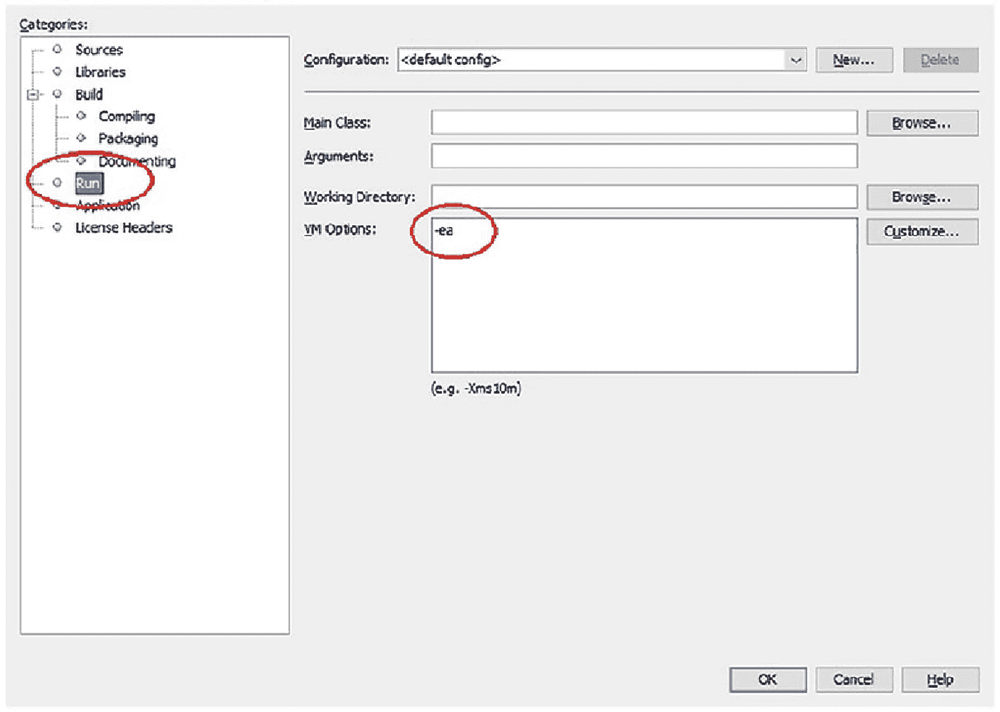

# 十四、断言

在本章中，您将学习:

*   Java 中的断言是什么

*   如何在 Java 程序中使用断言

*   如何启用和禁用断言

*   如何检查断言的状态

本章中的所有类都是一个`jdojo.assertion`模块的成员，如清单 [14-1](#PC1) 中所声明的。

```java
// module-info.java
module jdojo.assertion {
    exports com.jdojo.assertion;
}

Listing 14-1The Declaration of a jdojo.assertion Module

```

## 什么是断言？

断言的字面意思是以一种强烈、自信和有力的方式语句某事。当你断言“某事”时，你相信“某事”是真的。请注意，断言“某事”并不意味着“某事”总是正确的。它只是意味着“某事”是真的可能性非常高(或者你非常有信心)。有时你可能是错的，即使你断言它是真的，那“某事”也可能是假的。

Java 中断言的含义与其字面意思相似。它是 Java 程序中的一个语句。它允许程序员在程序的特定点断言一个条件为真。考虑下面的代码片段，其中有两个语句，中间有一个注释:

```java
int x = 10 + 15;
/* We assert that value of x is 25 at this point */
int z = x + 12;

```

第一条语句使用两个硬编码的整数值，`10`和`15`，并将它们的总和赋给变量`x`。在第一条语句执行后，可以断言变量`x`的值是`25`。请注意，在这种情况下，使用了注释来进行断言。x 的值不是这个码中的`25`的概率是多少？你可能认为`x`的值不是`25`的概率是零。这意味着你的断言将永远为真。那么，当只看代码就很明显的时候，添加一个断言 x 的值是`25`的注释有什么意义呢？在编程中，在某个时候看起来显而易见的东西在其他时候可能并不明显。

假设存在一个`getPrice()`方法，考虑下面的代码片段:

```java
int quantity = 15;
double unitPrice = getPrice();
/* We assert that unitPrice is greater than 0.0 at this point */
double totalPrice = quantity * unitPrice;

```

在这段代码中，您断言在执行第二条语句后，变量`unitPrice`的值将大于`0.0`。第二条语句执行后，`unitPrice`的值大于`0.0`的概率有多大？光看代码很难回答这个问题。然而，为了让代码正确工作，您假设断言“T4 的值大于 T5”必须为真。否则，您的代码将指出`getPrice()`方法中的严重错误。

对顾客来说，一件商品的价格总是大于零可能是显而易见的。然而，这对程序员来说并不明显，因为他们必须依赖于`getPrice()`方法的正确实现。如果`getPrice()`方法有 bug，程序员的断言就为假。如果程序员的断言是假的，他们需要知道他们断言的失败，他们需要修复 bug。如果断言是假的，他们就不会想继续进行价格计算。你用了一个评论来语句你的主张。注释不是可执行代码。即使`unitPrice`的值不大于零，你的注释也不会报告这个错误或者停止程序。在这种情况下，您需要使用断言工具来接收详细的错误消息并暂停程序。

您可以在 Java 中使用`assert`语句进行断言。`assert`语句的语法有两种形式:

*   `assert booleanAssertionExpression;`

*   `assert booleanAssertionExpression : errorMessageExpression;`

一个`assert`语句以`assert`关键字开始，后面是一个布尔断言表达式，它是程序员认为为真的条件。如果断言表达式评估为`true`，则不采取任何行动。如果断言表达式评估为`false`，运行时抛出一个`java.lang.AsssertionError`。

第二种形式的`assert`语句语法允许您在抛出断言错误时指定一个定制的错误消息表达式。断言条件和自定义消息由冒号分隔。`errorMessageExpression`不一定是字符串。它可以是一个计算任何数据类型的表达式，除了`void`数据类型。运行时会将错误信息表达式的结果转换为字符串。您可以重写前面显示的代码来利用`assert`语句，就像这样:

```java
int x = 10 + 15;
assert x == 25; // Uses the first form of the assert statement
int z = x + 12;

```

这里您用一个`assert`语句替换了注释。你需要指定的只是你断言为真的条件。您使用了第一种形式的`assert`语句。当断言失败时，您没有使用任何自定义消息。当断言失败时，Java 运行时为您提供所有细节，如行号、源代码、文件名等。关于错误。

在大多数情况下，`assert`语句的第一种形式就足够了。如果您认为出错时程序中的一些值可以帮助您更好地诊断问题，那么您应该使用第二种形式的`assert`语句。假设您想在断言失败时打印`x`的值。您可以使用以下代码片段:

```java
int x = 10 + 15;
assert x == 25: "x = " + x; // Uses the second form of the assert statement
int z = x + 12;

```

如果您只想要`x`的值，而不想要其他的，您可以使用下面的代码片段:

```java
int x = 10 + 15;
assert x == 25: x; // Uses the second form of the assert statement
int z = x + 12;

```

注意，`assert`语句的第二种形式中的`errorMessageExpression`可以是任何数据类型。这段代码提供了`x`作为`errorMessageExpression`的值，该值计算为`int`。当运行时抛出一个`AssertionError`时，它将使用`x`值的字符串表示。

此时，您可能想测试一下`assert`语句。在用`assert`语句编译和运行 Java 类之前，让我们讨论一些更多的细节。然而，您将使用带有`assert`语句的 Java 代码，如清单 [14-2](#PC7) 所示。

```java
// AssertTest.java
package com.jdojo.assertion;
public class AssertTest {
    public static void main(String[] args) {
        int x = 10 + 15;
        assert x == 100 :  "x = " + x; // should throw an AssertionError
    }
}

Listing 14-2A Simple Test Class to Test the assert Statement

```

`AssertTest`类的代码很简单。它给变量`x`赋值`25`，并断言`x`的值应该是`100`。当您运行`AssertTest`类时，您期望它总是抛出一个`AssertionError`，但是它需要以正确的方式运行，我们将在下面讨论。

## 测试断言

是时候看看`assert`声明的实际效果了。尝试在 NetBeans 中运行`AssertTest`类，或者在命令提示符下使用以下命令:

```java
C:\JavaFun>java --module-path dist --module jdojo.assertion/com.jdojo.assertion.AssertTest

```

该命令结束时没有任何输出。您不希望在标准输出中出现错误消息吗？你的断言`x == 100`不是假的吗？`x`的值是`25`，不是`100`。在看到运行中的`assert`语句之前，您需要再执行一个步骤。尝试以下命令来运行`AssertTest`类:

```java
C:\JavaFun>java -ea --module-path dist --module jdojo.assertion/com.jdojo.assertion.AssertTest
Exception in thread "main" java.lang.AssertionError: x = 25
        at jdojo.assertion/com.jdojo.assertion.AssertTest.main(AssertTest.java:7)

```

您也可以在 NetBeans 项目中启用断言。在 NetBeans 中右键单击项目名称，指定`-ea`为运行类别下的 VM 选项，如图 [14-1](#Fig1) 所示。一旦启用断言，在 NetBeans 中运行`AssertTest`类将会生成相同的错误。



图 14-1

在 NetBeans 项目中启用断言

当您运行`AssertTest`类时，会生成一个`AssertionError`，错误消息为“`x = 25"`”。这就是在代码中断言失败时发生的情况。Java 运行时抛出一个`AssertionError`。因为您在代码中使用了第二种形式的`assert`语句，所以错误消息还包含您的自定义断言消息，它打印了`x`的值。请注意，默认情况下，断言错误包含断言失败的行号和源代码文件名。该错误消息指出在`AssertFile.java`源文件的第 7 行断言失败。

那么将`-ea`开关与`java`命令结合使用的神奇之处是什么呢？默认情况下，`assert`语句不被 Java 运行时执行。换句话说，默认情况下，断言是禁用的。您必须在运行您的类时启用断言，以便执行您的`assert`语句。`–ea`开关在运行时启用断言。这就是当您使用`–ea`开关运行`AssertTest`类时收到预期错误消息的原因。我们将在下一节详细讨论启用/禁用断言。

## 启用/禁用断言

使用断言的目的是检测程序中的逻辑错误。通常，应该在开发和测试环境中启用断言。断言帮助程序员快速找到代码中问题的位置和类型。一旦应用程序被测试，断言就不太可能失败。Java 设计者牢记在生产环境中使用断言可能导致的性能损失。这就是默认情况下断言在运行时被禁用的原因。尽管不希望在生产环境中启用断言，但是您可以选择这样做。

Java 提供了命令行选项(或开关),以在运行时启用不同级别的断言。例如，您可以选择在所有用户定义的类、所有系统类、一个包及其子包中的所有类中启用断言，或者只为一个类启用断言，等等。表 [14-1](#Tab1) 列出了运行时可以在命令行上启用/禁用断言的所有开关。每个开关都有一个长格式和一个短格式。

表 14-1

运行时启用/禁用断言的命令行开关

<colgroup><col class="tcol1 align-left"> <col class="tcol2 align-left"></colgroup> 
| 

命令行开关

 | 

描述

 |
| --- | --- |
| `-enableassertions, -ea` | 用于在运行时为系统类和用户定义的类启用断言。您可以向此开关传递一个参数来控制启用断言的级别。 |
| `-disableassertions, -da` | 用于在运行时禁用系统类和用户定义类的断言。您可以向此开关传递一个参数，以控制禁用断言的级别。 |
| `-enablesystemassertions, -esa` | 用于在所有系统类中启用断言。您不能向此开关传递任何参数。 |
| `-disablesystemassertions, -dsa` | 用于禁用所有系统类中的断言。您不能向此开关传递任何参数。 |

两个开关`-ea`和`-da`，让您控制不同级别断言的启用和禁用。您可以向这些开关传递一个参数，以控制应该启用或禁用断言的级别。请注意，您不能向`-esa`和`-dsa`开关传递任何参数。它们在所有系统类中启用和禁用断言。如果您将一个参数传递给`-ea`或`-da`开关，开关和参数必须用冒号隔开，如下所示。表 [14-2](#Tab2) 列出了可用于这些开关的可能参数:

表 14-2

可以传递给–ea 和–da 开关的参数列表

<colgroup><col class="tcol1 align-left"> <col class="tcol2 align-left"></colgroup> 
| 

–ea 和–da 开关的参数

 | 

描述

 |
| --- | --- |
| `(no argument)` | 启用或禁用所有用户定义的类中的断言。注意，要在所有系统类中启用/禁用断言，需要分别使用不带参数的`–esa`和`–dsa`开关。 |
| `packageName...` | 注意`packageName`后面的三个点。它启用/禁用指定的`packageName`及其任何子包中的断言。它还可以用来启用/禁用系统包中的断言。 |
| `...` | 这个参数值是三个点。它启用/禁用当前工作目录中未命名包中的断言。 |
| `className` | 启用/禁用指定`className`中的断言。它还可以用来启用/禁用系统类中的断言。 |

*   `-ea:<argument>`

*   `-da:<argument>`

下面是使用带有不同参数的断言开关的示例。所有的例子都假设您在运行`com.jdojo.assertion.AssertTest`类时启用了断言。这些示例只向您展示了如何启用断言。默认情况下，所有断言都被禁用:

```java
/* Enable assertions in all system classes */
C:\JavaFun>java –esa --module-path dist --module jdojo.assertion/com.jdojo.assertion.AssertTest
/* Enable assertions in all user-defined classes */
C:\JavaFun>java –ea --module-path dist --module jdojo.assertion/com.jdojo.assertion.AssertTest
/* Enable assertions in com.jdojo package and its sub-packages */
C:\JavaFun>java –ea:com.jdojo... --module-path dist --module   jdojo.assertion/com.jdojo.assertion.AssertTest
C:\JavaFun>java –ea:... --module-path dist --module jdojo.assertion/com.jdojo.assertion.AssertTest
/* Enable assertions in com.jdojo.assertion.AssertTest class */
C:\JavaFun>java –ea:com.jdojo.assertion.AssertTest --module-path dist --module jdojo.assertion/com.jdojo.assertion.AssertTest

```

您可以在一个命令中使用多个`–ea`或`–da`开关来实现启用/禁用断言的更细粒度。所有开关都按照指定的顺序从左到右进行处理:

```java
/* Enable assertions in the p1 package and all its sub-packages, and disable assertion for
 * the p1.p2.MyClass class
 */
C:\JavaFun>java -ea:p1... -da:p1.p2.MyClass --module-path dist --module jdojo.assertion/com.jdojo.assertion.AssertTest

```

Tip

当类被加载时，类的断言被启用或禁用。类的断言状态在设置后不能更改。这条规则有一个例外。如果在类初始化之前执行了一个`assert`语句，Java 运行时会像启用断言一样执行它。当两个类通过调用另一个类的构造器或方法在它们的`static`初始化器中相互引用时，就会出现这种情况。

## 使用断言

对于什么时候在程序中使用断言，可能会产生混淆。在 Java 中，通过在现有的异常类层次结构中添加一个新类`java.lang.AssertionError`来实现断言。有时程序员会将一个断言误认为是另一个异常。当你只看类层次结构时，这可能是真的，你可能会说它只是现有异常类层次结构中的另一个类。然而，异常和断言之间的相似之处仅限于类的层次结构。主要区别在于它们使用背后的原因。异常用于处理用户的错误和业务规则实现。如果有可能从异常情况中恢复，您希望从异常情况中恢复并继续应用程序。断言用于检测程序员所犯的编程错误。您不希望从编程错误中恢复并继续应用程序。断言用于验证程序员在代码的特定点上对程序的假设是正确的。您不应该使用断言来处理用户的错误或验证数据，因为断言不应该在生产环境中启用。

断言不应用于验证公共方法的数据参数。下面的代码片段是一个`BankAccount`类的`credit()`方法，它使用断言来验证被贷记的金额:

```java
// An incorrect implementation
public void credit(double amount) {
    assert amount > 0.0 : "Invalid credit amount: " + amount;
    // Other code goes here
}

```

`credit()`方法的代码依赖于启用一个断言来验证账户的信用量。最有可能的是，在生产环境中断言将被禁用，这将允许甚至是负数的信用。这种对公共方法参数的验证应该使用异常来执行，如下所示:

```java
// A correct implementation
public void credit(double amount) {
    if (amount <=  0.0) {
        throw new IllegalArgumentException("Invalid credit amount:" + amount);
    }
    // Other code goes here
}

```

您可以使用断言来验证非公共方法的参数。客户端不能直接调用非公共方法。如果一个非公共方法的参数不正确，这表明程序员的错误，使用断言是合适的。

您不应该使用有副作用的断言，例如修改对象状态的断言。假设`reComputeState()`改变了类的对象的状态，考虑方法中的以下代码片段:

```java
assert reComputeState();

```

当这个`assert`语句被执行时，它将改变对象的状态。随后与对象的交互取决于其改变后的状态。如果断言被禁用，这段代码将不会执行，对象也不会正常工作。

您可以使用断言来实现类不变量。类不变量是关于确定类的对象状态的值总是成立的条件。当一个对象从一种状态转换到另一种状态时，类不变量在短暂的时间内可能不成立。假设您有一个包含四个实例变量的`BankAccount`类:`name`、`dob`、`startDate`和`balance`。对于`BankAccount`对象，以下类不变量必须为真:

*   账户上的`name`不能是`null`。

*   账户上的`dob`不能是`null`，也不能是未来的日期。

*   账户上的`startDate`不能是`null`。

*   账户上的`startDate`不能在`dob`之前。

*   账户上的`balance`必须大于零。

您可以将所有这些条件检查打包到一个方法中，比如说`validAccount()`方法:

```java
private boolean validAccount() {
    boolean valid = false;
    // Check for class invariants here. Return true if it is true. Otherwise, return false.
    return valid;
}

```

您可以在方法和构造器中使用下面的断言，以确保类不变量是强制的。假设`BankAccount`类的`toString()`方法返回了足够多的信息来帮助程序员调试错误:

```java
assert validAccount(); this.tostring();

```

您可以在每个方法的开头和从该方法返回之前使用这个`assert`语句。如果方法不修改对象的状态，就不需要检查方法内部的类不变量。您应该只在构造器的末尾使用它，因为当构造器开始执行时，类不变量将不再有效。

## 检查断言状态

你如何知道在你的程序中断言是否被激活？使用`assert`语句很容易检查断言状态。考虑以下代码片段:

```java
boolean enabled = false;
assert enabled = true;
/* Check the value of enabled here */

```

这段代码使用了第一种形式的`assert`语句。注意，在表达式`enabled = true`中，它使用了赋值运算符(`=`)，而不是相等比较运算符(`==`)。该表达式将把`true`赋给`enabled`变量，并对`true`求值。注意`enabled`变量已经被初始化为`false`。如果使能断言，在执行`assert`语句后，`enabled`变量的值将为`true`。如果断言被禁用，变量`enabled`的值将为`false`。因此，在`assert`语句之后检查`enabled`变量的值将会给你一个提示，即你的类是否启用了断言。清单 [14-3](#PC18) 显示了检查是否为`AssertionStatusTest`类启用了断言的完整代码。注意，断言也可以在类的基础上启用或禁用。如果为某个特定的类启用了断言，并不保证所有其他类也启用了断言。

```java
// AssertionStatusTest.java
package com.jdojo.assertion;
public class AssertionStatusTest {
    public static void main(String[] args)  {
        boolean enabled = false;
        assert enabled = true;
        if (enabled) {
            System.out.println("Assertion is enabled.");
        } else {
            System.out.println("Assertion is disabled.");
        }
    }
}

Listing 14-3A Program to Check Whether Assertion Is Enabled

```

## 摘要

断言是 Java 编程语言的一个特性，它允许您在程序中断言某些条件成立。关键字`assert`用于编写断言语句。断言用于检测程序中的逻辑错误，通常在开发和测试环境中启用。可以为包和类启用和禁用断言。它们不应该用于验证用户的输入或业务规则。断言不能代替异常。相反，它们相辅相成。

QUESTIONS AND EXERCISES

1.  Java 中的断言是什么？你用什么语句给你的程序添加断言？

2.  描述两种形式的`assert`语句。

3.  默认情况下是否启用断言？如果您的答案是否定的，您如何启用它？

4.  您应该在以下哪个环境中启用断言:开发、测试和生产？

5.  在所有系统类中，您用来启用和禁用断言的命令行选项是什么？

6.  假设`x`必须大于`10` :

    ```java
    int x = getValue();
    assert /* Your code goes here */ : 'x must be greater than 10.";

    ```

    ，完成以下代码片段中的`assert`语句
7.  您正在为一个公共方法编写代码，并且想要验证该方法的参数。你会用断言还是异常来实现？描述你的反应。