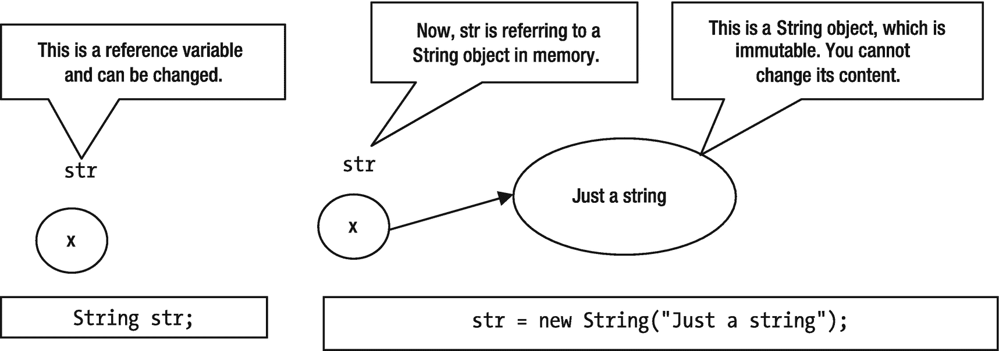

# 15.用线串

在本章中，您将学习:

*   什么是`String`对象

*   如何创建`String`对象

*   如何使用`String`文字

*   如何操纵`String` s

*   如何在`switch`语句或开关表达式中使用`String` s

*   如何使用`StringBuilder`和`StringBuffer`对象构造字符串

*   如何创建多行字符串

本章中的所有类都是一个`jdojo.string`模块的成员，如清单 [15-1](#PC1) 中所声明的。

```java
// module-info.java
module jdojo.string {
    exports com.jdojo.string;
}

Listing 15-1The Declaration of a jdojo.string Module

```

## 什么是字符串？

零个或多个字符的序列称为字符串。在 Java 程序中，字符串由`java.lang.String`类的对象表示。`String`类是不可变的。也就是说，`String`对象的内容在创建后不能修改。`String`类有两个同伴类，`java.lang.StringBuilder`和`java.lang.StringBuffer`。伴随类是可变的。当字符串的内容可以修改时，应该使用它们。

在 Java 9 之前，`String`类的实现将字符存储在一个`char`数组中，对字符串中的每个字符使用 2 个字节。大多数`String`对象只包含拉丁 1 字符，只需要 1 个字节来存储字符串中的一个字符。因此，在大多数情况下，这种`String`对象的`char`数组中有一半的空间没有被使用。Java 9 改变了`String`类的内部实现，使用一个`byte`数组来存储`String`对象的内容；它还存储一个编码标志，指示`String`中的每个字符是 1 字节还是 2 字节。这样做是为了有效利用`String`对象使用的内存。作为开发人员，在程序中使用字符串不需要了解任何新知识，因为没有为`String`类更改公共接口。

## 字符串文字

字符串由一系列用双引号括起来的零个或多个字符组成。所有字符串文字都是`String`类的对象。字符串文字的示例有

```java
String s1 = "";                       // An empty string
String s2 = "Hello";                  // String literal consisting of 5 characters
String s3 = "Just a string literal";  // String literal consisting of 21 characters

```

多个字符串文字可用于组成单个字符串文字:

```java
// Composed of two string literals "Hello" and "Hi". It represents one string literal "HelloHi"
String s4 = "Hello" + "Hi";

```

使用两个双引号的字符串文字不能分成两行(可以使用本章后面介绍的文本块语法来实现这一点):

```java
// Cannot break a string literal in multiple lines. A compile-time error
String wronStr = "Hello";

```

如果您想将`"Hello"`分成两行，您可以使用字符串连接运算符(`+`)将其断开，如下所示:

```java
String s5 = "He" + "llo";

```

或者

```java
String s6 = "He" + "llo";

```

这里显示了另一个多行字符串文字的例子。整个文本代表一个字符串文字:

```java
String s7 = "This is a big string literal" +
" and it will continue in several lines." +
" It is also valid to insert multiple new lines as we did here. " +
"Adding more than one line in between two string literals " +
"is a feature of Java Language syntax, " +
" not of string literal.";

```

## 字符串中的转义序列字符

字符串由字符组成。使用所有转义序列字符来构成字符串文字是有效的。例如，要在字符串中包含换行符和回车符，可以使用`\n`和`\r`，如下所示:

```java
"\n"      // String literal with a line feed
"\r"      // String literal with a carriage return
"\n\r"    // String literal with a line feed and a carriage return
"First line.\nSecond line." // An embedded line feed
"Tab\tSeparated\twords"     // An embedded tab escape character
"Double quote \" is here"   // Embedded double quote in string literal

```

## 字符串中的 Unicode 转义

一个字符也可以用形式为`\uxxxx`的 Unicode 转义来表示，其中`x`是一个十六进制数字(`0–9`或`A–F`)。在字符串文字中，字符`'A'`，第一个大写的英文字母，也可以写成`'\u0041'`，例如`Apple`和`\u0041pple`在 Java 中的处理是一样的。换行符和回车转义符也可以用 Unicode 转义符分别表示为`'\u000A'`和`'\u000D'`。不能使用 Unicode 转义在字符串中嵌入换行符和回车符。换句话说，你不能在一个字符串中用`'\u000A'`替换`'\n'`，用`'\u000D'`替换`'\r'`。为什么？原因是 Unicode 转义在编译过程的最开始就被处理，导致'`\u000A'`和'`\u000D'`分别被转换成一个真正的换行符和一个回车符。这违反了字符串不能在两行中继续的规则。例如，在编译的早期阶段，“`Hel\u000Alo"`被翻译成以下内容，这是一个无效的字符串文字，会生成编译时错误:

```java
"Hello"

```

Tip

在字符串中使用 Unicode 转义符`\u000A`和`\u000D`分别表示换行符和回车符是一个编译时错误。你必须使用`\n`和`\r`的转义序列来代替。

## 什么是 CharSequence？

一个`CharSequence`是`java.lang`包中的一个接口。我在第 21 章中讨论接口。现在，您可以将`CharSequence`视为一个表示可读字符序列的对象。仅举几个例子，`String`、`StringBuffer`和`StringBuilder`就是`CharSequence`的例子。它们提供只读方法来读取一些属性和它们所表示的字符序列的内容。在`String`类的 API 文档中，您会看到许多方法的参数被声明为`CharSequence`。在需要一个`CharSequence`的地方，你总是可以通过一个`String`、一个`StringBuilder`或者一个`StringBuffer`。

## 创建字符串对象

`String`类包含许多可以用来创建`String`对象的构造函数。默认构造函数允许您创建一个以空字符串为内容的`String`对象。例如，以下语句创建一个空的`String`对象，并将其引用赋给`emptyStr`变量:

```java
String emptyStr = new String();

```

`String`类包含另一个构造函数，它将另一个`String`对象作为参数:

```java
String str1 = new String();
String str2 = new String(str1); // Passing a String as an argument

```

现在`str1`表示与`str2`相同的字符序列。此时，`str1`和`str2`都代表一个空字符串。您也可以将字符串文字传递给此构造函数:

```java
String str3 = new String("");
String str4 = new String("Have fun!");

```

执行完这两条语句后，`str3`将引用一个`String`对象，它的内容是一个空字符串(零字符序列)，而`str4`将引用一个`String`对象，它的内容是“`Have fun!"`”。

## 字符串的长度

`String`类包含一个`length()`方法，该方法返回`String`对象中的字符数。注意，`length()`方法返回字符串中的字符数，而不是字符串使用的字节数。方法`length()`的返回类型是`int`。清单 [15-2](#PC13) 演示了如何计算字符串的长度。空字符串的长度为零。

```java
// StringLength.java
package com.jdojo.string;
public class StringLength {
    public static void main (String[] args) {
        // Create two string objects
        String str1 = new String() ;
        String str2 = new String("Hello") ;
        // Get the length of str1 and str2
        int len1 = str1.length();
        int len2 = str2.length();
        // Display the length of str1 and str2
        System.out.println("Length of \"" + str1 + "\" = " + len1);
        System.out.println("Length of \"" + str2 + "\" = " + len2);
    }
}
Length of "" = 0
Length of "Hello" = 5

Listing 15-2Knowing the Length of a String

```

## 字符串文字是字符串对象

所有字符串文字都是`String`类的对象。编译器用对一个`String`对象的引用替换所有的字符串文字。考虑以下语句:

```java
String str1 = "Hello";

```

当这个语句被编译时，编译器遇到字符串文字`"Hello"`，它创建一个`String`对象，以`"Hello"`作为其内容。实际上，字符串文字和`String`对象是一样的。只要可以使用`String`对象的引用，就可以使用`String`文字。`String`类的所有方法都可以直接和`String`文字一起使用。例如，要计算`String`文字的长度，您可以编写

```java
int len1 =  "".length();      // len1 is equal to 0
int len2 =  "Hello".length(); // len2 is equal to 5

```

## 字符串对象是不可变的

对象是不可变的。也就是说，您不能修改`String`对象的内容。这带来了一个好处，字符串可以被共享，而不用担心它们被修改。例如，如果您需要两个内容相同的`String`类的对象(相同的字符序列)，您可以创建一个`String`对象，并且您可以在两个地方使用它的引用。有时，Java 中字符串的不变性会被误解，尤其是初学者。考虑下面这段代码:

```java
String str;
str = new String("Just a string");
str = new String("Another string");

```

这里，`str`是可以引用任何`String`对象的引用变量。换句话说，`str`是可以改变的，是可变的。然而，`str`所指的`String`对象总是不可变的。这种情况如图 [15-1](#Fig1) 和 [15-2](#Fig2) 所示。


图 15-2

将不同的字符串对象引用赋给字符串变量



图 15-1

字符串引用变量和字符串对象

如果你不希望`str`在初始化后引用任何其他的`String`对象，你可以声明它为`final`，就像这样:

```java
final String str = new String("str cannot refer to other object");
str = new String("Let us try"); // A compile-time error. str is final

```

Tip

不可变的是内存中的`String`对象，而不是`String`类型的引用变量。如果你想让一个引用变量一直引用内存中同一个`String`对象，你必须声明引用变量`final`。

## 比较字符串

您可能想要比较由两个`String`对象表示的字符序列。`String`类覆盖了`Object`类的`equals()`方法，并提供了自己的实现，它根据内容比较两个字符串是否相等。例如，您可以比较两个字符串是否相等，如下所示:

```java
String str1 = new String("Hello");
String str2 = new String("Hi");
String str3 = new String("Hello");
boolean b1, b2;
b1 = str1.equals(str2); // false will be assigned to b1
b2 = str1.equals(str3); // true will be assigned to b2

```

还可以将字符串文字与字符串文字或字符串对象进行比较，如下所示:

```java
b1 = str1.equals("Hello");  // true will be assigned to b1
b2 = "Hello".equals(str1);  // true will be assigned to b2
b1 = "Hello".equals("Hi");  // false will be assigned to b1

```

回想一下，`==`操作符总是比较内存中两个对象的引用。比如`str1 == str2`和`str1 == str3`会返回`false`，因为`str1`、`str2`和`str3`是内存中三个不同`String`对象的引用。注意`new`操作符总是返回一个新的对象引用。

有时您希望比较字符串以进行排序。您可能希望根据字符的 Unicode 值或它们在字典中出现的顺序对字符串进行排序。`String`类中的`compareTo()`方法和`java.text.Collator`类中的`compare()`方法允许您比较字符串以进行排序。

如果您想基于字符的 Unicode 值比较两个字符串，请使用`String`类的`compareTo()`方法，其声明如下:

```java
public int compareTo(String anotherString)

```

它返回一个整数，可以是 0(零)、正整数或负整数。它比较两个字符串的相应字符的 Unicode 值。如果任意两个字符的 Unicode 值不同，该方法将返回这两个字符的 Unicode 值之差。例如，`"a".compareTo("b")`将返回`–1.`，`'a'`的 Unicode 值为 97，`'b'`的 Unicode 值为 98。它返回差值`97 – 98`，也就是`–1`。以下是字符串比较的示例:

```java
"abc".compareTo("abc") will return 0
"abc".compareTo("xyz") will return -23 (value of 'a' – 'x')
"xyz".compareTo("abc") will return 23 (value of 'x' – 'a')

```

非常重要的一点是，`compareTo()`方法根据字符的 Unicode 值来比较两个字符串。该比较可能与字典顺序比较不同。这对于英语和其他一些语言来说没有问题，在这些语言中，字符的 Unicode 值与字符的字典顺序相同。在字符的字典顺序可能与其 Unicode 值不同的语言中，不应使用此方法来比较两个字符串。要执行基于语言的字符串比较，应该使用`java.text.Collator`类的`compare()`方法。参考本章中的“区分语言的字符串比较”一节，了解如何使用`java.text.Collator`类。清单 [15-3](#PC22) 演示了字符串比较。

```java
// StringComparison.java
package com.jdojo.string;
public class StringComparison {
    public static void main(String[] args) {
        String apple = new String("Apple");
        String orange = new String("Orange");
        System.out.println(apple.equals(orange));
        System.out.println(apple.equals(apple));
        System.out.println(apple == apple);
        System.out.println(apple == orange);
        System.out.println(apple.compareTo(apple));
        System.out.println(apple.compareTo(orange));
    }
}
false
true
true
false
0
-14

Listing 15-3Comparing Strings

```

## 字符串池

Java 维护了一个包含所有字符串的池，以最小化内存使用并获得更好的性能。它在字符串池中为程序中找到的每个字符串创建一个`String`对象。当它遇到一个字符串文字时，它在字符串池中寻找具有相同内容的字符串对象。如果它在字符串池中没有找到匹配，它将使用该内容创建一个新的`String`对象，并将其添加到字符串池中。最后，它用池中新创建的`String`对象的引用替换字符串。如果它在字符串池中找到一个匹配，它就用在池中找到的`String`对象的引用替换字符串。让我们用一个例子来讨论这个场景。考虑以下语句:

```java
String str1 = new String("Hello");

```

当 Java 遇到字符串文字`"Hello"`时，它会尝试在字符串池中寻找匹配。如果字符串池中没有内容为`"Hello"`的`String`对象，则创建一个内容为`"Hello"`的新的`String`对象，并将其添加到字符串池中。字符串文字`"Hello"`将被字符串池中新的`String`对象的引用所替换。因为使用了`new`操作符，Java 将在堆上创建另一个 String 对象。因此，在这种情况下将创建两个`String`对象。考虑以下代码:

```java
String str1 = new String("Hello");
String str2 = new String("Hello");

```

这段代码会创建多少个`String`对象？假设执行第一条语句时，`"Hello"`不在字符串池中。因此，第一条语句将创建两个`String`对象。当执行第二条语句时，将在字符串池中找到字符串文字`"Hello"`。这一次，`"Hello"`将被替换为引用池中已经存在的对象。然而，Java 将创建一个新的`String`对象，因为您在第二条语句中使用了`new`操作符。假设`"Hello"`不在字符串池中，前面两条语句将创建三个`String`对象。如果这些语句开始执行时`"Hello"`已经在字符串池中，那么只会创建两个`String`对象。考虑以下陈述:

```java
String str1 = new String("Hello");
String str2 = new String("Hello");
String str3 = "Hello";
String str4 = "Hello";

```

`str1 == str2`返回的值会是什么？它将是`false`,因为`new`操作符总是在内存中创建一个新对象，并返回这个新对象的引用。

`str2 == str3`返回的值会是什么？又会是`false`了。这个需要稍微解释一下。注意`new`操作符总是创建一个新的对象。因此，`str2`在内存中有一个对新对象的引用。因为在执行第一条语句时已经遇到了`"Hello"`，所以它存在于字符串池中，`str3`引用字符串池中内容为`"Hello"`的`String`对象。所以`str2`和`str3`引用两个不同的对象，`str2 == str3`返回`false`。

`str3 == str4`返回的值会是什么？会是`true`。注意，在执行第一条语句时，`"Hello"`已经被添加到字符串池中。第三条语句将把字符串池中一个`String`对象的引用分配给`str3`。第四条语句将把字符串池中相同的对象引用分配给`str4`。换句话说，`str3`和`str4`在字符串池中引用同一个`String`对象。`==`运算符比较两个参考值；因此，`str3 == str4`返回`true`。考虑另一个例子:

```java
String s1 = "Have" + "Fun";
String s2 = "HaveFun";

```

`s1 == s2`会回`true`吗？是的，它会返回`true`。当在编译时常量表达式中创建一个`String`对象时，它也被添加到字符串池中。由于`"Have" + "Fun"`是一个编译时常量表达式，结果字符串`"HaveFun"`将被添加到字符串池中。因此，`s1`和`s2`会引用字符串池中的同一个对象。

所有编译时常量字符串都被添加到字符串池中。考虑以下示例来阐明此规则:

```java
final String constStr = "Constant";  // constStr is a constant
String varStr = "Variable";          // varStr is not a constant
// "Constant is pooled" will be added to the string pool
String s1 = constStr + " is pooled";
// Concatenated string will not be added to the string pool
String s2 = varStr + " is not pooled";

```

执行这段代码后，`"Constant is pooled" == s1`将返回`true`，而`"Variable is not pooled" == s2`将返回`false`。

Tip

编译时常量表达式产生的所有字符串和字符串都被添加到字符串池中。

您可以使用其`intern()`方法将一个`String`对象添加到字符串池中。如果找到匹配项，`intern`()方法将从字符串池中返回对象的引用。否则，它向字符串池添加一个新的`String`对象，并返回新对象的引用。例如，在前面的代码片段中，`s2`引用了一个`String`对象，其内容为`"Variable is not pooled"`。您可以通过编写以下代码将这个`String`对象添加到字符串池中

```java
// Will add the content of s2 to the string pool and return the reference
// of the string object from the pool
s2 = s2.intern();

```

现在`"Variable is not pooled" == s2`将返回`true`,因为您已经在`s2`上调用了`intern()`方法，并且它的内容已经被缓冲。

Tip

`String`类在内部维护一个字符串池。所有字符串都会自动添加到池中。您可以通过调用`String`对象上的`intern()`方法将自己的字符串添加到池中。您不能直接访问该池。除了退出并重新启动应用程序之外，没有办法从池中删除字符串对象。

## 字符串操作

本节描述了对`String`对象的一些常用操作。

### 获取索引处的字符

您可以使用`charAt()`方法从`String`对象中获取特定索引处的字符。索引从零开始。表 [15-1](#Tab1) 显示了字符串`"HELLO"`中所有字符的索引。

表 15-1

字符串“HELLO”中所有字符的索引

<colgroup><col class="tcol1 align-left"> <col class="tcol2 align-left"> <col class="tcol3 align-left"> <col class="tcol4 align-left"> <col class="tcol5 align-left"> <col class="tcol6 align-left"></colgroup> 
| 索引-> | `0` | `1` | `2` | `3` | `4` |
| 字符-> | `H` | `E` | `L` | `L` | `O` |

注意第一个字符`H`的索引是 0(零)，第二个字符`E`是 1，依此类推。最后一个字符 O 的索引是 4，等于字符串`"Hello"`的长度减 1。

下面的代码片段将打印索引值和字符串`"HELLO"`中每个索引处的字符:

```java
String str = "HELLO";
// Get the length of string
int len = str.length();
// Loop through all characters and print their indexes
for (int i = 0; i < len; i++) {
    System.out.println(str.charAt(i) + " is at index " + i);
}
H is at index 0
E is at index 1
L is at index 2
L is at index 3
O is at index 4

```

### 测试字符串是否相等

如果您想比较两个字符串是否相等并忽略它们的大小写，您可以使用`equalsIgnoreCase()`方法。如果您想执行区分大小写的相等比较，您需要使用`equals()`方法，如前所述:

```java
String str1 = "Hello";
String str2 = "HELLO";
if (str1.equalsIgnoreCase(str2)) {
    System.out.println ("Ignoring case str1 and str2 are equal");
} else {
    System.out.println("Ignoring case str1 and str2 are not equal");
}
if (str1.equals(str2)) {
    System.out.println("str1 and str2 are equal");
} else {
    System.out.println("str1 and str2 are not equal");
}
Ignoring case str1 and str2 are equal
str1 and str2 are not equal

```

### 测试字符串是否为空

有时你需要测试一个`String`对象是否为空。空字符串的长度为零。有三种方法可以检查空字符串:

*   使用`isEmpty()`方法。

*   使用`equals()`方法。

*   获取`String`的长度，并检查它是否为零。

以下代码片段显示了如何使用所有三种方法:

```java
String str1 = "Hello";
String str2 = "";
// Using the isEmpty() method
boolean empty1 = str1.isEmpty();     // Assigns false to empty1
boolean empty2 = str2.isEmpty();     // Assigns true to empty1
// Using the equals() method
boolean empty3 = "".equals(str1);    // Assigns false to empty3
boolean empty4 = "".equals(str2);    // Assigns true to empty4
// Comparing length of the string with 0
boolean empty5 = str1.length() == 0; // Assigns false to empty5
boolean empty6 = str2.length() == 0; // Assigns true to empty6

```

这些方法中哪一种最好？第一种方法可能看起来可读性更强，因为方法名称暗示了它的意图。然而，第二种方法是首选，因为它可以优雅地处理与`null`的比较。如果字符串是`null`，第一个和第三个方法抛出一个`NullPointerException`。第二种方法在字符串为`null`时返回`false`，例如`"".equals(null)`返回`false`。

### 改变案例

要将字符串的内容转换成小写和大写，可以分别使用`toLowerCase()`方法和`toUpperCase()`方法。例如，`"Hello".toUpperCase()`将返回字符串`"HELLO"`，而`"Hello".toLowerCase()`将返回字符串`"hello"`。

回想一下`String`对象是不可变的。当您在一个`String`对象上使用`toLowerCase()`或`toUpperCase()`方法时，原始对象的内容不会被修改。相反，Java 创建了一个新的`String`对象，它的内容与原来的`String`对象相同，只是改变了原来字符的大小写。以下代码片段创建了三个`String`对象:

```java
String str1 = new String("Hello"); // str1 contains "Hello"
String str2 = str1.toUpperCase();  // str2 contains "HELLO"
String str3 = str1.toLowerCase();  // str3 contains "hello"

```

### 搜索字符串

您可以使用`indexOf()`和`lastIndexOf()`方法获取一个字符或一个字符串在另一个字符串中的索引，例如:

```java
String str = "Apple";
int index = str.indexOf('p');  // index will have a value of 1
index = str.indexOf("pl");     // index will have a value of 2
index = str.lastIndexOf('p');  // index will have a value of 2
index = str.lastIndexOf("pl"); // index will have a value of 2
index = str.indexOf("k");      // index will have a value of -1

```

`indexOf()`方法从字符串的开头开始搜索字符或字符串，并返回第一个匹配的索引。`lastIndexOf()`方法从末尾开始匹配字符或字符串，并返回第一个匹配的索引。如果在字符串中没有找到字符或字符串，这些方法返回`–1`。

### 将值表示为字符串

`String`类有一个重载的`valueOf()`静态方法。它可用于获取任何原始数据类型或任何对象的值的字符串表示形式，例如:

```java
String s1 = String.valueOf('C');  // s1 has "C"
String s2 = String.valueOf("10"); // s2 has "10"
String s3 = String.valueOf(true); // s3 has "true"
String s4 = String.valueOf(1969); // s4 has "1969"

```

### 获取子字符串

您可以使用`substring()`方法来获取字符串的一部分。此方法重载如下:

*   字符串子字符串（int startIndex）

*   string substr(int begin index，int endIndex)

第一个版本返回一个字符串，该字符串从索引`beginIndex`处的字符开始，一直延伸到该字符串的末尾。第二个版本返回一个字符串，从索引`beginIndex`处的字符开始，延伸到索引`endIndex - 1`处的字符。如果指定的索引超出了字符串的范围，这两种方法都会抛出一个`IndexOutOfBoundsException`。以下是使用这些方法的示例:

```java
String s1 = "Hello".substring(1);    // s1 has "ello"
String s2 = "Hello".substring(1, 4); // s2 has "ell"

```

### 修剪绳子

您可以使用`trim()`方法删除字符串中所有的前导和尾随空格以及控制字符。事实上，`trim()`方法从字符串中删除了所有前导和尾随字符，这些字符的 Unicode 值小于`\u0020`(十进制 32)。例如:

*   `" hello ".trim()`会回“你好”。

*   `"hello ".trim()`会回“你好”。

*   `"\n \r \t hello\n\n\n\r\r"`会回“你好”。

注意,`trim()`方法只删除了开头和结尾的空白。它不会删除出现在字符串中间的任何空白或控制字符，例如:

*   因为`\n`在字符串中，所以`" he\nllo ".trim()`将返回`"he\nllo"`。

*   `"h ello".trim()`将返回`"h ello"`，因为空格在字符串内部。

### 替换字符串的一部分

`String`类包含以下方法，允许您通过用不同的字符或字符串替换旧字符串的一部分来创建新字符串:

*   `String replace(char oldChar, char newChar)`

*   `String replace(CharSequence target, CharSequence replacement)`

*   `String replaceAll(String regex, String replacement)`

*   `String replaceFirst(String regex, String replacement)`

`replace(char oldChar, char newChar)`方法通过用`newChar`替换所有出现的`oldChar`来返回一个新的`String`对象。这里有一个例子:

```java
// Both 'o's in "tooth" will be replaced by two 'e'. str will contain "teeth"
String str = "tooth".replace('o', 'e');

```

`replace(CharSequence target, CharSequence replacement)`方法与`CharSequence`一起工作。它通过用`replacement`替换所有出现的`target`来返回一个新的`String`对象。这里有一个例子:

```java
// "oo" in "tooth" will be replaced by "ee". str will contain "teeth"
String str = "tooth".replace("oo", "ee");

```

`replaceAll(String regex, String replacement)`方法使用`regex`中的正则表达式来查找匹配。它通过用`replacement`替换每个匹配返回一个新的`String`对象。匹配一个数字的正则表达式是`\d`。我在第 18 章[中讲述了正则表达式。这里有一个例子:](18.html)

```java
// Replace all digits with an *. str contains "Born on Sept **, ****"
String str = "Born on Sept 19, 1969".replaceAll("\\d", "*");

```

`replaceFirst(String regex, String replacement)`方法的工作原理与`replaceAll()`方法相同，除了它只使用`replacement`替换第一个匹配。这里有一个例子:

```java
// Replace the first digit with an *. str contains "Born on Sept *9, 1969"
String str = "Born on Sept 19, 1969".replaceFirst("\\d", "*");

```

### 匹配字符串的开头和结尾

`startsWith()`方法检查字符串是否以指定的参数开始，而`endsWith()`检查字符串是否以指定的字符串参数结束。两种方法都返回一个`boolean`值。以下是使用这些方法的示例:

```java
String str = "This is a Java program";
// Test str if it starts with "This"
if (str.startsWith("This")){
    System.out.println("String starts with This");
} else {
    System.out.println("String does not start with This");
}
// Test str if it ends with "program"
if (str.endsWith("program")) {
    System.out.println("String ends with program");
} else {
    System.out.println("String does not end with program");
}
String starts with This
String ends with program

```

## 拆分和连接字符串

在指定的分隔符周围拆分一个字符串，并使用指定的分隔符将多个字符串连接成一个字符串通常很有用。

使用`split()`方法将一个字符串拆分成多个字符串。使用分隔符执行拆分。`split()`方法返回一个`String`的数组。你将在第 19 章中学习数组。但是，在本节中，您将使用它来完成字符串的操作。

Note

`split()`方法采用一个定义模式的正则表达式作为分隔符。

```java
String str = "AL,FL,NY,CA,GA";
// Split str using a comma as the delimiter
String[] parts = str.split(",");
// Print the the string and its parts
System.out.println(str);
for(String part : parts) {
    System.out.println(part);
}
AL,FL,NY,CA,GA
AL
FL
NY
CA
GA

```

Java 8 在`String`类中添加了一个静态的`join()`方法，将多个字符串连接成一个字符串。它超载了:

*   `String join(CharSequence delimiter, CharSequence... elements)`

*   `String join(CharSequence delimiter, Iterable<? extends CharSequence> elements)`

第一个版本采用一个分隔符和一系列要连接的字符串。第二个参数是 var-args，所以您也可以将一个数组传递给这个方法。

第二个版本采用一个分隔符和一个`Iterable`，例如一个`List`或`Set`。以下代码片段使用第一个版本来连接几个字符串:

```java
// Join some strings using a comma as the delimiter
String str = String.join(",", "AL", "FL", "NY", "CA", "GA");
System.out.println(str);
AL,FL,NY,CA,GA

```

## switch 语句中的字符串

我们在第 [6](06.html) 章讨论了`switch`语句。您也可以在`switch`语句中使用字符串。`switch`表达式使用了一个`String`类型。如果`switch`表达式是`null`，则抛出`NullPointerException`。`case`标签必须是`String`文字或常量。不能在`case`标签中使用`String`变量。下面是一个在`switch`语句中使用`String`的例子，它将在标准输出中打印`"Turn on"`:

```java
String status = "on";
switch(status) {
    case "on":
        System.out.println("Turn on"); // Will execute this
        break;
    case "off":
        System.out.println("Turn off");
        break;
    default:
        System.out.println("Unknown command");
        break;
}

```

字符串的`switch`语句将`switch`表达式与`case`标签进行比较，就好像调用了`String`类的`equals()`方法一样。在前面的例子中，将调用`status.equals("on")`来测试是否应该执行第一个`case`块。注意，`String`类的`equals()`方法执行区分大小写的字符串比较。这意味着使用字符串的`switch`语句是区分大小写的。

下面的`switch`语句将在标准输出中打印`"Unknown command"`，因为大写的`switch`表达式`"ON"`与小写的第一个`case`标签`"on"`不匹配:

```java
String status = "ON";
switch(status) {
    case "on":
        System.out.println("Turn on");
        break;
    case "off":
        System.out.println("Turn off");
        break;
    default:
        System.out.println("Unknown command"); // Will execute this
        break;
}

```

作为一个良好的编程实践，在执行带有字符串的`switch`语句之前，您需要做以下两件事:

*   检查`switch`语句的`switch`值是否为`null`。如果是`null`，不执行`switch`语句。

*   如果您想在`switch`语句中执行不区分大小写的比较，您需要将`switch`表达式转换为小写或大写，并相应地在`case`标签中使用小写或大写。

您可以重写前面的`switch`语句示例，如清单 [15-4](#PC45) 所示，它考虑了两个建议。

```java
// StringInSwitch.java
package com.jdojo.string;
public class StringInSwitch {
    public static void main(String[] args) {
        operate("on");
        operate("off");
        operate("ON");
        operate("Nothing");
        operate("OFF");
        operate(null);
    }
    public static void operate(String status) {
        // Check for null
        if (status == null) {
            System.out.println("status cannot be null.");
            return;
        }
        // Convert to lowercase
        switch (status.toLowerCase()) {
            case "on":
                System.out.println("Turn on");
                break;
            case "off":
                System.out.println("Turn off");
                break;
            default:
                System.out.println("Unknown command");
                break;
        }
    }
}
Turn on
Turn off
Turn on
Unknown command
Turn off
status cannot be null.

Listing 15-4Using Strings in a switch Statement

```

## 测试字符串的回文

如果你是一个有经验的程序员，你可以跳过这一节。这对初学者来说是一个简单的练习。

回文是一个单词、一句诗、一个句子或一个数字，向前和向后读起来都一样。例如，“在我看到厄尔巴岛之前我是能干的”和 1991 就是回文的例子。让我们写一个方法，它接受一个字符串作为参数，并测试这个字符串是否是一个回文。如果字符串是回文，该方法将返回`true`。否则将返回`false`。您将使用在前面章节中学到的`String`类的一些方法。下面是对该方法中要执行的步骤的描述。

假设输入字符串的字符数为`n`。您需要比较索引 0 和(n–1)、1 和(n–2)、2 和(n–3)等处的字符。请注意，如果您继续比较，最后，您将比较索引(n–1)处的字符和索引 0 处的字符，这在开始时已经比较过了。你只需要在中途比较一下角色。如果所有相等的比较都返回`true`，那么这个字符串就是一个回文。

字符串中的字符数可以是奇数也可以是偶数。在这两种情况下，只比较字符的一半是可行的。字符串的中间根据字符串的长度是奇数还是偶数而变化。例如，字符串`"FIRST"`的中间是字符`R.`字符串`"SECOND"`的中间字符是什么？你可以说它没有中间字，因为它的长度是偶数。为此，有趣的是，如果字符串中的字符数是奇数，您不需要将中间的字符与任何其他字符进行比较。

如果字符串中的字符数是偶数，则需要继续进行字符比较，直到字符串长度的一半；如果字符数是奇数，则需要继续进行字符比较，直到字符串长度的一半减去一个。通过将字符串长度除以 2，可以得到两种情况下要进行的比较次数。注意，字符串的长度是整数；如果您将一个整数除以 2，整数除法将丢弃分数部分，如果有的话，这将处理奇数字符的情况。清单 [15-5](#PC46) 包含完整的代码。

```java
// Palindrome.java
package com.jdojo.string;
import java.util.Objects;
public class Palindrome {
    public static void main(String[] args) {
        String str1 = "hello";
        boolean b1 = Palindrome.isPalindrome(str1);
        System.out.println(str1 + " is a palindrome: " + b1);
        String str2 = "noon";
        boolean b2 = Palindrome.isPalindrome(str2);
        System.out.println(str2 + " is a palindrome: " + b2);
    }
    public static boolean isPalindrome(String inputString) {
        Objects.requireNonNull(inputString, "String cannot be null.");
        // Get the length of string
        int len = inputString.length();
        // In case of an empty string and one character strings, we do not need to
        // do any comparisons. They are always palindromes.
        if (len <= 1) {
            return true;
        }
        // Convert the string into uppercase, so we can make the comparisons case insensitive
        String newStr = inputString.toUpperCase();
        // Initialize the result variable to true
        boolean result = true;
        // Get the number of comparisons to be done
        int counter = len / 2;
        // Do the comparison
        for (int i = 0; i < counter; i++) {
            if (newStr.charAt(i) != newStr.charAt(len - 1 - i)) {
                // It is not a palindrome
                result = false;
                // Exit the loop
                break;
            }
        }
        return result;
    }
}
hello is a palindrome: false
noon is a palindrome: true

Listing 15-5Testing a String for a Palindrome

```

## StringBuilder 和 StringBuffer

`StringBuilder`和`StringBuffer`是`String`类的伙伴类。与`String`不同，它们代表一个可变的字符序列。也就是说，您可以更改`StringBuilder`和`StringBuffer`的内容，而无需创建新对象。您可能想知道为什么存在两个类来表示同一个东西——一个可变的字符序列。`StringBuffer`类从一开始就是 Java 库的一部分，而`StringBuilder`类是在 Java 5 中添加的。两者的区别在于线程安全。`StringBuffer`是线程安全的，`StringBuilder`不是线程安全的。大多数时候，您不需要线程安全，在这些情况下使用`StringBuffer`会有性能损失。这就是后来加上`StringBuilder`的原因。这两个类有相同的方法，除了`StringBuffer`中的所有方法都是同步的。本节我们将只讨论`StringBuilder`。在代码中使用`StringBuffer`只是改变类名的问题。

Tip

当不需要线程安全时，使用`StringBuilder`,例如，在方法或构造函数中操作局部变量中的字符序列。否则，使用`StringBuffer`。线程安全和同步将在本系列的第二卷中介绍。

在字符串内容经常变化的情况下，可以使用`StringBuilder`类的对象，而不是`String`类。回想一下，由于`String`类的不变性，使用`String`对象的字符串操作会产生许多新的`String`对象，从而降低性能。一个`StringBuilder`对象可以被认为是一个可修改的字符串。它有许多方法来修改它的内容。`StringBuilder`类包含四个构造函数:

*   `StringBuilder()`

*   `StringBuilder(CharSequence seq)`

*   `StringBuilder(int capacity)`

*   `StringBuilder(String str)`

无参数构造函数创建一个默认容量为 16 的空`StringBuilder`。

第二个构造函数将一个`CharSequence`对象作为参数。它创建一个`StringBuilder`对象，其内容与指定的`CharSequence`相同。

第三个构造函数以一个`int`作为参数；它创建一个空的`StringBuilder`对象，其初始容量与指定的参数相同。一个`StringBuilder`的容量是在不分配更多空间的情况下它能容纳的字符数。当需要额外空间时，容量会自动调整。

第四个构造函数获取一个`String`并创建一个与指定的`String`具有相同内容的`StringBuilder`。以下是创建`StringBuilder`对象的一些例子:

```java
// Create an empty StringBuilder with a default initial capacity of 16 characters
StringBuilder sb1 = new StringBuilder();
// Create a StringBuilder from of a string
StringBuilder sb2 = new StringBuilder("Here is the content");
// Create an empty StringBuilder with 200 characters as the initial capacity
StringBuilder sb3 = new StringBuilder(200);

```

`append()`方法允许您将文本添加到`StringBuilder`的末尾。它超载了。它需要多种类型的论证。有关所有重载的`append()`方法的完整列表，请参考该类的 API 文档。它还有其他方法，例如`insert()`和`delete()`，也可以让你修改它的内容。

`StringBuilder`类有两个属性:`length`和`capacity`。在给定的时间点，它们的值可能不相同。它的长度是指其内容的长度，而它的容量是指它在不需要分配新内存的情况下可以容纳的最大字符数。它的长度在任何时候都至多等于它的容量。`length()`和`capacity()`方法分别返回它的长度和容量，例如:

```java
StringBuilder sb = new StringBuilder(200);  // Capacity:200, length:0
sb.append("Hello");                         // Capacity:200, length:5
int len = sb.length();                      // len is assigned 5
int capacity = sb.capacity();               // capacity is assigned 200

```

一个`StringBuilder`的容量是由运行时控制的，而它的长度是由你放入其中的内容控制的。当其内容被修改时，运行时会调整容量。

您可以通过使用`toString()`方法将`StringBuilder`的内容作为`String`获取:

```java
// Create a String object
String s1 = new String("Hello");
// Create a StringBuilder from of the String object s1
StringBuilder sb = new StringBuilder(s1);
// Append " Java" to the StringBuilder’s content
sb.append(" Java"); // Now, sb contains "Hello Java"
// Get a String from the StringBuilder
String s2 = sb.toString(); // s2 contains "Hello Java"

```

与`String`不同，`StringBuilder`有一个`setLength()`方法，它把它的新长度作为参数。如果新长度大于现有长度，多余的位置用`null`字符填充(空字符为`\u0000`)。如果新长度小于现有长度，其内容将被截断以适应新长度:

```java
// Length is 5
StringBuilder sb = new StringBuilder("Hello");
// Now the length is 7 with last two characters as null character '\u0000'
sb.setLength(7);
// Now the length is 2 and the content is "He"
sb.setLength(2);

```

`StringBuilder`类有一个`reverse()`方法，用相同的字符序列替换它的内容，但是顺序相反。清单 15-6 展示了`StringBuilder`类的一些方法。

```java
// StringBuilderTest.java
package com.jdojo.string;
public class StringBuilderTest {
    public static void main(String[] args) {
        // Create an empty StringBuilder
        StringBuilder sb = new StringBuilder();
        printDetails(sb);
        // Append "blessings"
        sb.append("blessings");
        printDetails(sb);
        // Insert "Good " in the beginning
        sb.insert(0, "Good ");
        printDetails(sb);
        // Delete the first o
        sb.deleteCharAt(1);
        printDetails(sb);
        // Append " be with you"
        sb.append(" be with you");
        printDetails(sb);
        // Set the length to 3
        sb.setLength(3);
        printDetails(sb);
        // Reverse the content
        sb.reverse();
        printDetails(sb);
    }
    public static void printDetails(StringBuilder sb) {
        System.out.println("Content: \"" + sb + "\"");
        System.out.println("Length: " + sb.length());
        System.out.println("Capacity: " + sb.capacity());
        // Print an empty line to separate results
        System.out.println();
    }
}
Content: ""
Length: 0
Capacity: 16
Content: "blessings"
Length: 9
Capacity: 16
Content: "Good blessings"
Length: 14
Capacity: 16
Content: "God blessings"
Length: 13
Capacity: 16
Content: "God blessings be with you"
Length: 25
Capacity: 34
Content: "God"
Length: 3
Capacity: 34
Content: "doG"
Length: 3
Capacity: 34

Listing 15-6Using a StringBuilder Object

```

## 字符串串联运算符(+)

有三种连接字符串的方法:

*   使用`String`类的`concat(String str)`方法

*   使用+字符串串联运算符

*   使用`StringBuilder`或`StringBuffer`

`concat()`方法将一个`String`作为参数，这意味着您只能用它来连接字符串。如果要将不同数据类型的值连接成一个字符串，请使用连接运算符，例如:

```java
// Assigns "hi there" to s1
String s1 = "hi ".concat(" there");
// Assign "XY12.56" to s2
String s2 = "X" + "Y" + 12.56;
// Assign "XY12.56" to s3
String s3 = new StringBuilder().append("X").append("Y").append(12.56).toString();

```

## 多行字符串

在版本 15 和更高版本中，通过文本块向 Java 添加了多行字符串支持。文本块必须以三个引号和一个新行开始，这是定义跨越多行的字符串的一种更方便的方式。以前在 Java 中，如果你想定义一个包含换行符或多行的字符串，你需要使用“\n”在字符串中显式地提供换行符(*新行*)。

例如，使用文本块，可以定义如下所示的多行字符串:

```java
String text = """
     First line.
     Second line.
     Third line.
          """;

```

Java 忽略每行前面的空白(空格或制表符)。这使得在保持所有文本缩进的同时定义多行字符串成为可能。

以前，如果没有文本块，您需要以下列方式定义相同的字符串:

```java
String text = "First line.\n" +
     "Second line.\n" +
     "Third line.\n";

```

在定义多行字符串时，不要忘记包括三个引号和一个新行。例如，以下语法将不起作用，因为它不包括三个引号后的新行:

```java
String text = """First line.
      Second line.
      Third line.
          """;

```

您不需要转义文本块中的引号。否则，文本块的字符串定义规则与普通字符串相同。清单 [15-7](#PC56) 展示了文本块的作用。

```java
// TextBlocks.java
public class TextBlocks {
    public static void main(String[] args) {
         String text = """
         First line.
         "Second line."
         Third line.
         """;
         System.out.print(text);
    }
}
First line.
"Second line."
Third line.

Listing 15-7Multiline Strings

```

这个程序演示了如何定义一个包含引号的多行字符串，并打印出结果。

文本块使得在 Java 程序中定义多行 SQL 查询或 JSON 主体更加容易。

## 区分语言的字符串比较

`String`类根据字符的 Unicode 值来比较字符串。有时，您可能希望根据字典顺序来比较字符串。

使用`java.text.Collator`类的`compare()`方法执行区分语言(字典顺序)的字符串比较。该方法将两个要比较的字符串作为参数。如果两个字符串相同，则返回`0`，如果第一个字符串在第二个字符串之后，则返回`1`，如果第一个字符串在第二个字符串之前，则返回`-1`。清单 [15-8](#PC57) 展示了`Collator`类的用法。

```java
// CollatorStringComparison.java
package com.jdojo.string;
import java.text.Collator;
import java.util.Locale;
public class CollatorStringComparison {
    public static void main(String[] args) {
        // Create a Locale object for US
        Locale USLocale = new Locale("en", "US");
        // Get a Collator instance for US
        Collator c = Collator.getInstance(USLocale);
        String str1 = "cat";
        String str2 = "Dog";
        int diff = c.compare(str1, str2);
        System.out.print("Comparing using Collator class: ");
        print(diff, str1, str2);
        System.out.print("Comparing using String class: ");
        diff = str1.compareTo(str2);
        print(diff, str1, str2);
    }
    public static void print(int diff, String str1, String str2) {
        if (diff > 0) {
            System.out.println(str1 + " comes after " + str2);
        } else if (diff < 0) {
            System.out.println(str1 + " comes before " + str2);
        } else {
            System.out.println(str1 + " and " + str2 + " are the same.");
        }
    }
}
Comparing using Collator class: cat comes before Dog
Comparing using String class: cat comes after Dog

Listing 15-8Language-Sensitive String Comparisons

```

该程序还使用`String`类显示了相同的两个字符串的比较。请注意，在字典顺序中，单词`"cat"`位于单词`"Dog"`之前。`Collator`类使用它们的字典顺序来比较它们。然而，`String`类比较了`"cat"`的第一个字符的 Unicode 值(99)和`"Dog"`的第一个字符的 Unicode 值(68)。基于这两个值，`String`类确定`"Dog"`在`"cat"`之前。输出确认了比较字符串的两种不同方式。

## 摘要

在这一章中，你学习了`String`、`StringBuilder`和`StringBuffer`类。一个`String`表示不可变的字符序列，而`StringBuilder`和`StringBuffer`表示可变的字符序列。`StringBuilder`和`StringBuffer`工作方式相同，只是后者是线程安全的，而前者不是。

`String`类提供了几个方法来操作它的内容。每当你从一个`String`获得一部分内容，一个新的`String`对象就会被创建。`String`类根据字符的 Unicode 值比较两个字符串。Java 增加了对文本块的支持，使用三个引号加上一个新行来表示开始，并且文本可以缩进。使用`java.text.Collator`类按照字典顺序比较字符串。从 Java 7 开始，可以在`switch`语句中使用字符串。

QUESTIONS AND EXERCISES

1.  Java 中的字符串是什么？在创建一个`String`对象后，你能改变它的内容吗？

2.  什么是字符串文字？

3.  `String`级和`StringBuilder`级有什么区别？

4.  `StringBuffer`级和`StringBuilder`级有什么区别？

5.  当执行以下代码片段时，编写输出:

    ```java
    String s1 = "Hello";
    String s2 = "\"Hello\"";
    System.out.println("s1 = " + s1);
    System.out.println("s2 = " + s2);

    ```

6.  当执行以下代码片段时，编写输出:

    ```java
    String s1 = "Who\nknows";
    System.out.println("s1 = " + s1);

    ```

7.  当执行以下代码片段时，编写输出:

    ```java
    String s1 = "Having fun with strings";
    int len = s1.length();
    char c = s1.charAt(4);

    ```

8.  当执行以下代码片段时，编写输出:

    ```java
    String s1 = "Fun";
    String s2 = new String("Fun");
    System.out.println(s1 == s2);
    System.out.println(s1.equals(s2));
    System.out.println("Fun" == "Fun");

    ```

9.  当执行以下代码片段时，编写输出:

    ```java
    StringBuilder sb = new StringBuilder(200);
    sb.append("Hello").append(false);
    System.out.println("length = " + sb.length());
    System.out.println("capacity = " + sb.capacity());
    System.out.println(sb.toString());

    ```

10.  当执行以下代码片段时，编写输出:

    ```java
    String s1 = 10 + 20 + " = what";
    String s2 = 10 + String.valueOf(20) + " = what";
    System.out.println(s1);
    System.out.println(s2);

    ```

11.  如这里所声明的，完成名为`equalsContents()`的方法的代码。如果两个参数在删除了开头和结尾的空白并忽略了大小写后具有相同的内容，那么该方法应该返回`true`。如果两个参数都为空，它应该返回`true`。否则应该返回`false` :

    ```java
    public static boolean equalsContents(String s1, String s2) {
        /* your code goes here*/
    }

    ```

12.  完成以下代码，以便将年、月和日打印为`1969`、`09`和`19` :

    ```java
    String date = "1969-09-19";
    String year = date./*your code goes here*/;
    String month = date./*your code goes here*/;
    String day = date./*your code goes here*/;
    System.out.println("year = " + year);
    System.out.println("month = " + month);
    System.out.println("day = " + day);

    ```

13.  完成下面的代码片段，以便打印预期的输出，显示在该代码片段之后:

    ```java
    String s1 = "noon and spoon";
    String s2 = s1./*Your code goes here*/;
    System.out.println(s1);
    System.out.println(s2);

    ```

    预期的输出如下:

    ```java
    noon and spoon
    nun and spun

    ```

14.  完成下面的代码片段，以便打印预期的输出，显示在该代码片段之后:

    ```java
    String s1 = "noon and spoon";
    String s2 = s1./*Your code goes here*/;
    System.out.println(s1);
    System.out.println(s2);

    ```

    预期的输出如下:

    ```java
    noon and spoon
    nn and spn

    ```

15.  完成一个`reverse(String str)`方法的代码。它接受一个字符串并返回该字符串的反码。不要使用`StringBuilder`或`StringBuffer`类:

    ```java
    public static String reverse(String str) {
        /* Your code goes here */
    }

    ```

16.  表达式`"abc".compareTo("abc")`的值是多少？