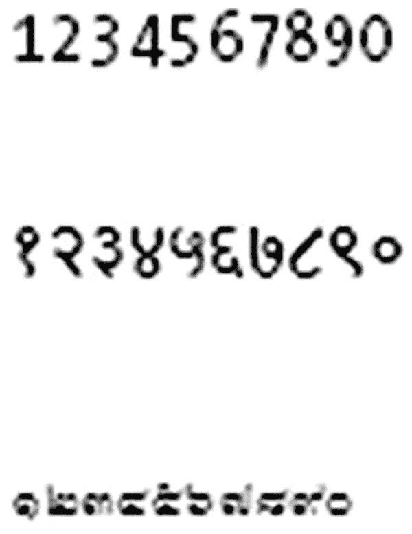
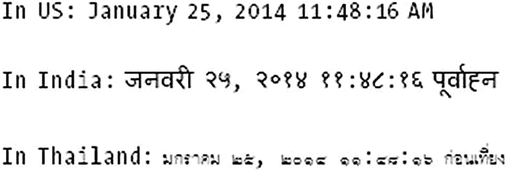

# 十七、格式化数据

在本章中，您将学习:

*   如何格式化和解析日期和数字

*   如何使用`printf`样式的格式

*   如何创建使用自定义格式化程序的类

Java 提供了一组丰富的 API 来格式化数据。数据可能包括简单的值(如数字)或对象(如字符串、日期和其他类型的对象)。本章介绍了 Java 中不同类型值的格式化选项。本章中的所有示例程序都是清单 [17-1](#PC1) 中声明的`jdojo.format`模块的成员。

```java
// module-info.java
module jdojo.format {
    exports com.jdojo.format;
}

Listing 17-1The Declaration of a jdojo.format Module

```

## 格式化日期

日期时间 API 在第 [16 章](16.html)中有所介绍。如果您正在编写与日期和时间相关的新代码，建议您使用日期-时间 API。但是，如果您需要使用使用旧方式格式化日期和时间的遗留代码，则提供本节内容。

在本节中，我们将讨论如何使用传统的日期 API 来格式化日期。我们还将讨论如何解析一个字符串来创建一个日期对象。您可以用预定义的格式或自己选择的格式来格式化日期。Java 库提供了两个类来格式化“java.text”包中的日期:

*   `java.text.DateFormat`

*   `java.text.SimpleDateFormat`

接下来的两节将向您展示如何以预定义和自定义的格式来格式化日期。

### 使用预定义的日期格式

使用`DateFormat`类使用预定义的格式来格式化日期。是一个`abstract`类。该类是抽象的，所以不能使用`new`操作符创建该类的实例。你可以调用它的一个`getXxxInstance()`方法，其中`Xxx`可以是`Date`、`DateTime`或`Time`，来获取格式化程序对象，或者只是`getInstance()`。格式化的文本取决于两个因素:样式和区域设置。使用`DateFormat`类的`format()`方法来格式化日期和时间。格式化的样式决定了格式化文本中包含多少日期/时间信息，而区域设置决定了如何组合所有信息。`DateFormat`类将五种样式定义为常量:

*   `DateFormat.DEFAULT`

*   `DateFormat.SHORT`

*   `DateFormat.MEDIUM`

*   `DateFormat.LONG`

*   `DateFormat.FULL`

`DEFAULT`的格式与`MEDIUM`相同，除非你使用`getInstance()`，默认为`SHORT`。表 [17-1](#Tab1) 显示了美国地区相同日期的不同格式。

表 17-1

为区域设置(如美国)预定义的日期格式样式和格式化文本

<colgroup><col class="tcol1 align-left"> <col class="tcol2 align-left"></colgroup> 
| 

风格

 | 

格式化日期示例

 |
| --- | --- |
| `DEFAULT` | `Mar 27, 2021` |
| `SHORT` | `3/27/21` |
| `MEDIUM` | `Mar 27, 2021` |
| `LONG` | `March 27, 2021` |
| `FULL` | `Thursday, March 27, 2021` |

`java.util.Locale`类包含一些常见地区的常量。例如，对于语言为`"fr"`(法语)和国家代码为`"FR"`的地区，可以使用`Locale.FRANCE`。或者，你可以为法兰西创建一个`Locale`对象，如下所示:

```java
Locale french FranceLocale = new Locale("fr", "FR") ;

```

要创建一个`Locale`，如果`Locale`类没有为那个国家声明一个常量，您需要使用一个两个字母的小写语言代码和一个两个字母的大写国家代码。语言代码和国家代码已在 ISO-639 代码和 ISO-3166 代码中列出。创建语言环境的更多示例如下:

```java
Locale hindiIndiaLocale = new Locale("hi", "IN");
Locale bengaliIndiaLocale = new Locale("bn", "IN");
Locale thaiThailandLocale = new Locale("th", "TH");

```

Tip

使用`Locale.getDefault()`方法为您的系统获取默认的`Locale`。

以下代码片段打印美国地区的长格式的当前日期:

```java
Date today = new Date();
DateFormat formatter = DateFormat.getDateInstance(DateFormat.LONG, Locale.US);
String formattedDate = formatter.format(today);

System.out.println(formattedDate);
August 6, 2021

```

清单 [17-2](#PC5) 中列出的程序默认以短格式和中格式显示地区日期(对于运行本例的 JVM 是 US)、法国和德国。程序打印当前日期。当你运行这个程序时，它将打印同一日期的不同格式。您可能会得到不同的输出，因为程序打印当前日期。

```java
// PredefinedDateFormats.java
package com.jdojo.format;
import java.text.DateFormat;
import java.util.Date;
import java.util.Locale;
public class PredefinedDateFormats {
    public static void main(String[] args) {
        // Get the current date
        Date today = new Date();
        // Print date in the default locale format
        Locale defaultLocale = Locale.getDefault();
        printLocaleDetails(defaultLocale);
        printDate(defaultLocale, today);
        // Print date in French (France) format
        printLocaleDetails(Locale.FRANCE);
        printDate(Locale.FRANCE, today);
        // Print date in German (Germany) format. You could also use Locale.GERMANY
        // instead of new Locale ("de", "DE").
        Locale germanLocale = new Locale("de", "DE");
        printLocaleDetails(germanLocale);
        printDate(germanLocale, today);
    }
    public static void printLocaleDetails(Locale locale) {
        String languageCode = locale.getLanguage();
        String languageName = locale.getDisplayLanguage();
        String countryCode = locale.getCountry();
        String countryName = locale.getDisplayCountry();
        // Print the locale info
        System.out.println("Language: " + languageName + "("
                + languageCode + "); "
                + "Country: " + countryName
                + "(" + countryCode + ")");
    }
    public static void printDate(Locale locale, Date date) {
        // Format and print the date in SHORT style
        DateFormat formatter = DateFormat.getDateInstance(DateFormat.SHORT, locale);
        String formattedDate = formatter.format(date);
        System.out.println("SHORT: " + formattedDate);
        // Format and print the date in MEDIUM style
        formatter = DateFormat.getDateInstance(DateFormat.MEDIUM, locale);
        formattedDate = formatter.format(date);
        System.out.println("MEDIUM: " + formattedDate);
        // Print a blank line at the end
        System.out.println();
    }
}
Language: English(en); Country: United States(US)
SHORT: 1/24/21
MEDIUM: Jan 24, 2021
Language: French(fr); Country: France(FR)
SHORT: 24/01/21
MEDIUM: 24 janv. 2021
Language: German(de); Country: Germany(DE)
SHORT: 24.01.21
MEDIUM: 24.01.2021

Listing 17-2Using the Predefined Date Formats

```

### 使用自定义日期格式

如果你想使用定制的日期格式，使用`SimpleDateFormat`类。使用`SimpleDateFormat`类的格式是区分地区的。它的默认构造器使用默认区域设置和该区域设置的默认日期格式创建格式化程序。您可以使用其他构造器创建格式化程序，在这些构造器中您可以指定自己的日期格式和区域设置。一旦有了`SimpleDateFormat`类的对象，就可以调用它的`format()`方法来格式化日期。如果您想为后续的格式化更改日期格式，您可以使用`applyPattern()`方法，通过传递新的日期格式(或模式)作为参数。下面的代码片段向您展示了如何使用`SimpleDateFormat`类格式化日期:

```java
// Create a formatter with a pattern dd/MM/yyyy.
SimpleDateFormat simpleFormatter = new SimpleDateFormat("dd/MM/yyyy");
// Get the current date
Date today = new Date();
// Format the current date
String formattedDate = simpleFormatter.format(today);
// Print the date
System.out.println("Today is (dd/MM/yyyy): " + formattedDate);
// Change the date format. Now month will be spelled fully.
simpleFormatter.applyPattern("MMMM dd, yyyy");
// Format the current date
formattedDate = simpleFormatter.format(today);
// Print the date
System.out.println("Today is (MMMM dd, yyyy): " + formattedDate);
Today is (dd/MM/yyyy): 06/08/2021
Today is (MMMM dd, yyyy): August 06, 2021

```

请注意，在您的计算机上运行这段代码时，输出会有所不同。它将使用默认的区域设置以这种格式打印当前日期。前面的输出是在美国地区。

表 [17-2](#Tab2) 中列出了用于创建日期和时间格式的字母及其含义。这些示例显示的日期是 2021 年 7 月 10 日下午 12:30:55。

表 17-2

用于格式化日期和时间的格式化符号列表

<colgroup><col class="tcol1 align-left"> <col class="tcol2 align-left"> <col class="tcol3 align-left"> <col class="tcol4 align-left"></colgroup> 
| 

信

 | 

日期或时间组件

 | 

语句

 | 

例子

 |
| --- | --- | --- | --- |
| G | 时代标志 | 文本 | 广告 |
| y | 年 | 年 | 2021; Twenty-one |
| Y | 基于周的年份 | 年 | 2021; Twenty-one |
| M | 一年中的月份 | 月 | 七月；七月；07 |
| w | 一年中的周 | 数字 | Twenty-eight |
| W | 月中的周 | 数字 | Two |
| D | 一年中的每一天 | 数字 | One hundred and ninety-one |
| d | 一个月中的第几天 | 数字 | Ten |
| F | 一个月中的星期几 | 数字 | Two |
| E | 一周中的某一天 | 文本 | 周六；坐 |
| a | AM/PM 标记 | 文本 | 首相 |
| H | 一天中的小时(0–23) | 数字 | Twelve |
| k | 一天中的小时数(1–24) | 数字 | Twelve |
| K | 上午/下午的小时数(0–11) | 数字 | Zero |
| h | 上午/下午的小时数(1–12) | 数字 | Twelve |
| m | 小时中的分钟 | 数字 | Thirty |
| s | 分钟秒 | 数字 | Fifty-five |
| S | 毫秒 | 数字 | Nine hundred and seventy-eight |
| z | 时区 | 通用时区 | 太平洋标准时间；PSTGMT-08:00 |
| Z | 时区 | RFC 822 时区 | –0800 |

您可以在格式化的日期中嵌入文字。假设您将自己的出生日期(1969 年 9 月 19 日)存储在一个 date 对象中，现在您想将其打印为“我出生于 1969 年 9 月 19 日”。消息中的一些部分来自出生日期，而其他部分是文字，它们旨在按原样出现在消息中。在日期模式中，不能将字母(如 A–Z 和 A–Z)用作文字。您需要将它们放在单引号内，将其视为文字，而不是格式模式的一部分。首先，您需要一个`Date`对象来表示 1969 年 9 月 19 日。`Date`类的构造器采用年、月和日，已被弃用。让我们从`GregorianCalendar`类开始，使用它的`getTime()`方法获得一个`Date`对象。以下代码片段打印了这条消息:

```java
// Create a GregorianCalendar object with September 19, 1969 as date
GregorianCalendar gc = new GregorianCalendar(1969, Calendar.SEPTEMBER,19);
// Get a Date object
Date birthDate = gc.getTime();
// Create the pattern. You must place literals inside single quotes
String pattern = "'I was born on the day' dd 'of the month' MMMM 'in' yyyy";
// Create a SimpleDateFormat with the pattern
SimpleDateFormat simpleFormatter = new SimpleDateFormat(pattern);
// Format and print the date
System.out.println(simpleFormatter.format(birthDate));
I was born on the Day 19 of the month September in 1969

```

### 解析日期

在前面几节中，您已经将日期对象转换为格式化文本。让我们看看如何将文本转换成`Date`对象。这是通过使用`SimpleDateFormat`类的`parse()`方法来完成的。`parse()`方法的签名如下:

```java
Date parse(String text, ParsePosition startPos)

```

该方法有两个参数。第一个参数是要从中提取日期的文本。第二个是文本中字符的起始位置，从这里开始解析。文本中可以嵌入日期部分。例如，您可以从文本中提取两个日期，如“第一个日期是 1995 年 1 月 1 日，第二个日期是 2001 年 12 月 12 日”。因为解析器不知道日期在文本中的开始位置，所以您需要使用`ParsePosition`对象告诉它。它只是跟踪解析位置。对于`ParsePosition`类只有一个构造器，它采用一个`int`，这是解析开始的位置。在`parse()`方法成功之后，`ParsePosition`对象的索引被设置为所用日期文本的最后一个字符的索引加 1。请注意，该方法不使用所有传递的文本作为其第一个参数。它只使用创建日期对象所需的文本。

让我们从一个简单的例子开始。假设您有一个字符串`"09/19/1969"`，它代表日期 1969 年 9 月 19 日。你想从这个字符串中得到一个`Date`对象。以下代码片段说明了这些步骤:

```java
// Our text to be parsed
String text = "09/19/1969";
// Create a pattern for the date text "09/19/1969"
String pattern = "MM/dd/yyyy";
// Create a SimpleDateFormat object to represent this pattern
SimpleDateFormat simpleFormatter = new SimpleDateFormat(pattern);
// Since the date part in text "09/19/1969" start at index zero,
// we create a ParsePosition object with value zero
ParsePosition startPos = new ParsePosition(0);
// Parse the text
Date parsedDate = simpleFormatter.parse(text, startPos);
// Here, parsedDate will have September 19, 1969 as date and startPos current index
// will be set to 10, which you can get calling startPos.getIndex() method.

```

让我们解析更复杂的文本。如果上一个例子中的文本是`"09/19/1969 Junk"`，您将得到相同的结果，因为在读取 1969 之后，解析器将不再查看文本中的任何字符。假设你有文本`"XX01/01/1999XX12/31/2000XX"`。文本中嵌入了两个日期。如何解析这两个日期？第一个日期的文本从索引 2 开始(前两个 x 的索引为 0 和 1)。一旦对第一个日期文本的解析完成，`ParsePosition`对象将指向文本中的第三个 X。您只需要将它的索引增加 2，指向第二个日期文本的第一个字符。以下代码片段说明了这些步骤:

```java
// Our text to be parsed
String text = "XX01/01/1999XX12/31/2000XX";
// Create a pattern for our date text "09/19/1969"
String pattern = "MM/dd/yyyy";
// Create a SimpleDateFormat object to represent this pattern
SimpleDateFormat simpleFormatter = new SimpleDateFormat(pattern);
// Set the start index at 2
ParsePosition startPos = new ParsePosition(2);
// Parse the text to get the first date (January 1, 1999)
Date firstDate = simpleFormatter.parse(text, startPos);
// Now, startPos has its index set after the last character of the first date parsed.
// To set its index to the next date increment its index by 2.
int currentIndex = startPos.getIndex();
startPos.setIndex(currentIndex + 2);
// Parse the text to get the second date (December 31, 2000)
Date secondDate = simpleFormatter.parse(text, startPos);

```

留给读者的练习是编写一个程序，从文本“我出生于 1969 年 9 月 19 日”中提取`Date`对象中的日期。提取的日期应该是 1969 年 9 月 19 日。(提示:在前面的一个示例中，当您处理格式化日期对象时，已经有了该文本的模式。)

这里还有一个解析包含日期和时间的文本的例子。假设您有文本`"2003-04-03 09:10:40.325"`，它以年-月-日`hour:minute:second.millisecond`的格式表示时间戳。您想要获得时间戳的时间部分。清单 [17-3](#PC11) 展示了如何从这个文本中获取时间部分。

```java
// ParseTimeStamp.java
package com.jdojo.format;
import java.util.Date;
import java.util.Calendar;
import java.text.ParsePosition;
import java.text.SimpleDateFormat;
public class ParseTimeStamp {
    public static void main(String[] args){
        String input = "2003-04-03 09:10:40.325";
        // Prepare the pattern
        String pattern = "yyyy-MM-dd HH:mm:ss.SSS" ;
        SimpleDateFormat sdf = new SimpleDateFormat(pattern);
        // Parse the text into a Date object
        Date dt = sdf.parse(input, new ParsePosition(0));
        System.out.println(dt);
        // Get the Calendar instance
        Calendar cal = Calendar.getInstance();
        // Set the time
        cal.setTime(dt);
        // Print time parts
        System.out.println("Hour:" + cal.get(Calendar.HOUR));
        System.out.println("Minute:" + cal.get(Calendar.MINUTE));
        System.out.println("Second:" + cal.get(Calendar.SECOND));
        System.out.println("Millisecond:" + cal.get(Calendar.MILLISECOND));

    }
}
Thu Apr 03 09:10:40 CST 2003
Hour:9
Minute:10
Second:40
Millisecond:325

Listing 17-3Parsing a Timestamp to Get Its Time Parts

```

## 格式化数字

在本节中，我们将讨论如何格式化数字。我们还将讨论如何解析一个字符串来创建一个`Number`对象。以下两个类可用于格式化和解析数字:

*   `java.text.NumberFormat`

*   `java.text.DecimalFormat`

`NumberFormat`类用于将数字格式化为特定地区的预定义格式。`DecimalFormat`类用于在特定的地区将数字格式化为您选择的格式。

### 使用预定义的数字格式

您可以使用`NumberFormat`类的`getXxxInstance()`方法来获取格式化程序对象的实例，其中`Xxx`可以替换为`Number`、`Currency`、`Integer`或`Percent`，或者只替换为`getInstance()`。这些方法是重载的。如果不带任何参数调用它们，它们将返回默认区域设置的格式化程序对象。调用`format()`方法，将数字作为参数传递，以获得字符串形式的格式化数字。下面的代码片段向您展示了如何为不同的地区获取不同类型的数字格式化程序。它还向您展示了如何使用针对美国地区的货币格式化程序来格式化薪水。请注意，它只进行格式化，不进行货币转换:

```java
// Get a number formatter for default locale
NumberFormat defaultFormatter = NumberFormat.getNumberInstance();
// Get a number formatter for French (France) locale
NumberFormat frenchFormatter = NumberFormat.getNumberInstance(Locale.FRENCH);
// Get a currency formatter for US
NumberFormat usCurrencyFormatter = NumberFormat.getCurrencyInstance(Locale.US);
double salary = 12590.90;
String str = usCurrencyFormatter.format(salary);
System.out.println("Salary in US currency: " + str);
Salary in US currency: $12,590.90

```

清单 [17-4](#PC13) 展示了如何将数字格式化为当前地区(本例中默认地区为美国)和印度地区的默认格式。

```java
// DefaultNumberFormatters.java
package com.jdojo.format;
import java.util.Locale;
import java.text.NumberFormat;
public class DefaultNumberFormatters {
    public static void main(String[] args){
        double value = 1566789.785 ;
        // Default locale
        printFormatted(Locale.getDefault(), value);
        // Indian locale
        // (Rupee is the Indian currency. Short form is Rs.)
        Locale indianLocale = new Locale("en", "IN");
        printFormatted(indianLocale, value);
    }
    public static void printFormatted(Locale locale, double value) {
        // Get number and currency formatter
        NumberFormat nf = NumberFormat.getInstance(locale);
        NumberFormat cf = NumberFormat.getCurrencyInstance(locale);
        System.out.println("Formatting value: " + value + " for locale: " + locale);
        System.out.println("Number: "   + nf.format(value));
        System.out.println("Currency: " + cf.format(value));
    }
}
Formatting value: 1566789.785 for locale: en_US
Number: 1,566,789.785
Currency: $1,566,789.78
Formatting value: 1566789.785 for locale: en_IN
Number: 1,566,789.785
Currency: Rs. 1,566,789.78

Listing 17-4Formatting Numbers Using Default Formats

```

### 使用自定义数字格式

要执行更高级的格式化，可以使用`DecimalFormat`类。它允许您提供自己的格式模式。一旦创建了一个`DecimalFormat`类的对象，就可以使用它的`applyPattern()`方法来改变格式模式。您可以为正数和负数指定不同的模式。这两种模式由分号分隔。

在格式化数字时，`DecimalFormat`类使用四舍五入模式。例如，如果您在数字格式中只指定了小数点后两位，则 12.745 将被舍入到 12.74，因为 5 在中间，4 是偶数；12.735 也将被舍入到 12.74，因为 5 在中间，第二个位置上最接近的偶数将是 4；12.746 将四舍五入为 12.75。清单 [17-5](#PC14) 展示了`DecimalFormat`类的用法。

```java
// DecimalFormatter.java
package com.jdojo.format;
import java.text.DecimalFormat;
public class DecimalFormatter {
    private static DecimalFormat formatter = new DecimalFormat();
    public static void main(String[] args) {
        formatNumber("##.##", 12.745);
        formatNumber("##.##", 12.746);
        formatNumber("0000.0000", 12.735);
        formatNumber("#.##", -12.735);
        // Positive and negative number format
        formatNumber("#.##;(#.##)", 12.735);
        formatNumber("#.##;(#.##)", -12.735);
    }
    public static void formatNumber(String pattern, double value) {
        // Apply the pattern
        formatter.applyPattern(pattern);
        // Format the number
        String formattedNumber = formatter.format(value);
        System.out.println("Number: " + value + ", Pattern: "
                + pattern + ", Formatted Number: "
                + formattedNumber);
    }
}
Number: 12.745, Pattern: ##.##, Formatted Number: 12.74
Number: 12.746, Pattern: ##.##, Formatted Number: 12.75
Number: 12.735, Pattern: 0000.0000, Formatted Number: 0012.7350
Number: -12.735, Pattern: #.##, Formatted Number: -12.73
Number: 12.735, Pattern: #.##;(#.##), Formatted Number: 12.73
Number: -12.735, Pattern: #.##;(#.##), Formatted Number: (12.73)

Listing 17-5Formatting Numbers

```

### 解析数字

您还可以使用`DecimalFormat`类的`parse()`方法将字符串解析为数字。`parse()`方法返回一个`java.lang.Number`类的对象。您可以使用`xyzValue()`方法获取原始值，其中`xyz`可以是`byte`、`double`、`float`、`int`、`long`或`short`。

清单 [17-6](#PC15) 展示了使用`DecimalFormat`类来解析一个数字。注意，您也可以使用`java.lang.Double`类的`parseDouble()`方法将字符串解析为`double`值。但是，该字符串必须采用默认的数字格式。使用`DecimalFormat`类的`parse()`方法的优点是字符串可以是任何格式。

```java
// ParseNumber.java
package com.jdojo.format;
import java.text.DecimalFormat;
import java.text.ParsePosition;
public class ParseNumber {
    public static void main(String[] args) {
        // Parse a string to decimal number
        String str = "XY4,123.983";
        String pattern = "#,###.###";
        DecimalFormat formatter = new DecimalFormat(pattern);
        // Create a ParsePosition object to specify the first digit of number
        // in the string. It is 4 in "XY4,123.983" with the index 2.
        ParsePosition pos = new ParsePosition(2);
        Number numberObject = formatter.parse(str, pos);
        double value = numberObject.doubleValue();
        System.out.println("Parsed Value is " + value);
    }
}
Parsed Value is 4123.983

Listing 17-6Parsing Numbers

```

## printf 样式的格式

在这一节中，我们将讨论如何使用类似于 c 语言中的`printf()`函数所支持的`printf`样式的格式化来格式化对象和值。首先，我们将介绍 Java 中的`printf`样式格式化支持的一般思想，然后将介绍格式化所有类型的值的细节。

### 大局

`java.util.Formatter`类支持`printf`风格的格式，类似于 C 编程语言中的`printf()`函数所支持的格式。如果您熟悉 C、C++和 C#，您应该更容易理解本节中的讨论。在本节中，您将使用格式化字符串，如`"%1$s"`、`"%1$4d"`等。在你的代码中没有完整的解释它们的意思。你可能无法完全理解它们；你现在应该忽略它们。只需关注输出，并尝试了解`Formatter`类想要完成的更大的画面，而不是试图理解细节。我们将在下一节讨论细节。让我们从清单 [17-7](#PC16) 中的一个简单例子开始。您可能会得到稍微不同的输出。

```java
// PrintfTest.java
package com.jdojo.format;
import java.util.Date;
public class PrintfTest {
    public static void main(String[] args) {
        // Formatting strings
        System.out.printf("%1$s, %2$s, and %3$s %n", "Fu", "Hu", "Lo");
        System.out.printf("%3$s, %2$s, and %1$s %n", "Fu", "Hu", "Lo");
        // Formatting numbers
        System.out.printf("%1$4d, %2$4d, %3$4d %n", 1, 10, 100);
        System.out.printf("%1$4d, %2$4d, %3$4d %n", 10, 100, 1000);
        System.out.printf("%1$-4d, %2$-4d, %3$-4d %n", 1, 10, 100);
        System.out.printf("%1$-4d, %2$-4d, %3$-4d %n", 10, 100, 1000);
        // Formatting date and time
        Date dt = new Date();
        System.out.printf("Today is %tD %n", dt);
        System.out.printf("Today is %tF %n", dt);
        System.out.printf("Today is %tc %n", dt);
    }
}
Fu, Hu, and Lo
Lo, Hu, and Fu
1,  10,  100
10, 100, 1000
1,  10,  100
10, 100, 1000
Today is 08/06/21
Today is 2021-08-06
Today is Sun Aug 06 10:29:03 CDT 2021

Listing 17-7Using C’s printf-Style Formatting in Java

```

您一直在使用`System.out.println()`和`System.out.print()`方法在标准输出上打印文本。实际上，`System.out`是`java.io.PrintStream`类的一个实例，它有`println()`和`print()`实例方法。`PrintStream`类包含另外两个方法，`format()`和`printf()`，它们可以用来将格式化的输出写到`PrintStream`实例中。这两种方法工作原理相同。清单 [17-5](#PC14) 使用`System.out.printf()`方法将格式化文本打印到标准输出。

`String`类包含一个`format()`静态方法，它返回一个格式化的字符串。`PrintStream`类的`format()` / `printf()`方法和`String`类的`format()`静态方法的格式化行为是相同的。它们之间唯一的区别是`PrintStream`类中的`format()`或`printf()`方法将格式化的输出写入输出流，而`String`类的`format()`方法将格式化的输出作为`String`返回。

`PrintStream`类的`format()`和`printf()`方法和`String`类的`format()`方法是方便的方法。它们的存在是为了简化文本格式。然而，`Formatter`类完成了真正的工作。下面详细讨论一下`Formatter`类。您将在示例中使用这些方便的方法。一个`Formatter`用于格式化文本。格式化的文本可以写入以下目的地:

*   可追加的(例如，StringBuffer、StringBuilder、Writer 等。)

*   一个文件

*   输出流

*   打印流

下面的代码片段完成了与清单 [17-7](#PC16) 中的代码相同的事情。这一次，您使用一个`Formatter`对象来格式化数据。当您调用`Formatter`对象的`format()`方法时，格式化的文本存储在`StringBuilder`对象中，您将它传递给`Formatter`对象的构造器。当您完成所有文本的格式化后，您调用`StringBuilder`的`toString()`方法来获得整个格式化的文本:

```java
// Create an Appendable data storage for our formatted output
StringBuilder sb = new StringBuilder();
// Create a Formatter that will store its output to the StringBuffer
Formatter fm = new Formatter(sb);
// Formatting strings
fm.format("%1$s, %2$s, and %3$s %n", "Fu", "Hu", "Lo");
fm.format("%3$s, %2$s, and %1$s %n", "Fu", "Hu", "Lo");
// Formatting numbers
fm.format("%1$4d, %2$4d, %3$4d %n", 1, 10, 100);
fm.format("%1$4d, %2$4d, %3$4d %n", 10, 100, 1000);
fm.format("%1$-4d, %2$-4d, %3$-4d %n", 1, 10, 100);
fm.format("%1$-4d, %2$-4d, %3$-4d %n", 10, 100, 1000);
// Formatting date and time
Date dt = new Date();
fm.format("Today is %tD %n", dt);
fm.format("Today is %tF %n", dt);
fm.format("Today is %tc %n", dt);
// Display the entire formatted string
System.out.println(sb.toString());

```

如果您想将所有格式化的文本写入一个文件，可以使用下面的代码片段。您将需要处理`FileNotFoundException`，如果指定的文件不存在，它可能会从`Formatter`类的构造器中抛出。当您使用完`Formatter`对象后，您将需要调用它的`close()`方法来关闭输出文件。注意示例代码中使用了一个`try-with-resources`块，所以格式化程序是自动关闭的:

```java
import java.io.File;
import java.io.FileNotFoundException;
import java.util.Formatter;
...
// Create a Formatter that will write the output to the file C:\kishori\xyz.txt
try (Formatter fm = new Formatter(new File("C:\\kishori\\xyz.txt"))) {
    // Formatting strings
    fm.format("%1$s, %2$s, and %3$s %n", "Fu", "Hu", "Lo");
    fm.format("%3$s, %2$s, and %1$s %n", "Fu", "Hu", "Lo");
} catch (FileNotFoundException e) {
    e.printStackTrace();
}

```

`Formatter`类的`format()`方法被重载。其声明如下:

*   `Formatter format(String format, Object... args)`

*   `Formatter format(Locale l, String format, Object... args)`

第一个版本的`format()`方法使用默认的语言环境进行格式化。第二个版本允许您指定一个地区。`PrintStream`类的`format()` / `printf()`方法和`String`类的`format()`方法提供了相同的两个版本的`format()`方法，它们接受相同类型的参数。对`Formatter`类的`format()`方法的讨论同样适用于`PrintStream`和`String`类中的这些便利方法。

只要适用，`Formatter`类就使用特定于地区的格式。例如，如果您想要格式化一个十进制数，比如 12.89，在法国该数被格式化为 12，89(注意 12 和 89 之间的逗号)，而在美国它被格式化为 12.89(注意 12 和 89 之间的点)。`format()`方法的 locale 参数用于将文本格式化为特定于语言环境的格式。下面的代码片段演示了特定于区域设置的格式的效果。请注意，对于相同的输入值，美国和法国的格式化输出有所不同:

```java
System.out.printf(Locale.US, "In US: %1$.2f %n", 12.89);
System.out.printf(Locale.FRANCE, "In France: %1$.2f %n", 12.89);
Date dt = new Date();
System.out.printf(Locale.US, "In US: %tA %n", dt);
System.out.printf(Locale.FRANCE, "In France: %tA %n", dt);
In US: 12.89
In France: 12,89
In US: Friday
In France: vendredi

```

### 细节

使用`Formatter`格式化数据需要两种输入:

*   格式字符串

*   值的列表

格式字符串是定义输出外观的模板。它包含零个或多个固定文本和零个或多个嵌入的格式说明符。固定文本不会应用任何格式。格式说明符有两个用途。它在格式字符串中充当格式化数据的占位符，并指定应该如何格式化数据。

让我们考虑下面的例子。假设您想打印一个人的出生日期。以下是此类文本的一个示例:

```java
January 16, 1970 is John's birthday.

```

Note

除非另有说明，本节中的所有输出均为美国语言环境。

以前的文本包含固定文本和格式化文本。固定文本应该出现在输出中。格式化的文本将取决于输入。您可以将之前的文本转换为模板，如下所示:

```java
<month> <day>, <year> is <name>'s birthday.

```

您已经用尖括号中的占位符替换了可能不同的文本，例如，`<month>`、`<day>`等。您将需要四个输入值(月、日、年和名称)来使用前面的模板获得格式化的文本。例如，如果您将`<month>`、`<day>`、`<year>`和`<name>`的值分别提供为`"January"`、`"16"`、`"1970"`和`"John"`，模板将生成

```java
January 16, 1970 is John's birthday.

```

在本例中，您已经用实际值替换了模板中的占位符。您没有对实际值进行任何格式化。由`Formatter`类提供的格式以类似的方式工作。我们在这个例子中称之为占位符的叫做*格式说明符*。我们在这个例子中称之为模板的东西叫做*格式字符串*。

格式说明符总是以百分号(`%`)开始。您可以将您的模板转换成一个格式字符串，它可以与`Formatter`类一起使用，如下所示:

```java
%1$tB %1$td, %1$tY is %2$s's birthday.

```

在这个格式字符串中，“`%1$tB"`、`"%1$td"`、`"%1$tY"`和`%2$s"`是四个格式说明符，而`" "`、`", "`、`"is "`和`'s birthday."`是固定文本。

下面的代码片段使用这个格式字符串打印格式化文本。注意`dob`和`"John"`是格式字符串的输入值。在这种情况下，输入值`dob`是包含出生日期的`LocalDate`类的一个实例:

```java
LocalDate dob = LocalDate.of(1970, Month.JANUARY, 16);
System.out.printf("%1$tB %1$td, %1$tY is %2$s's birthday.", dob, "John");
January 16, 1970 is John's birthday.

```

格式说明符的一般语法如下:

```java
%<argument-index$><flags><width><.precision><conversion>

```

除了`%`和`<conversion>`部分，其他部分都是可选的。请注意，格式说明符的任何两个部分之间都没有空格。`%`(百分号)表示格式字符串中格式说明符的开始。如果要将`%`指定为格式字符串中固定文本的一部分，需要使用两个连续的`%`作为`%%`。

`<argument-index$>`表示格式说明符引用的参数的索引。它由一个十进制格式的整数后跟一个`$`(美元符号)组成。第一个参数称为`1$`，第二个称为`2$`，依此类推。您可以在同一格式字符串内的不同格式说明符中多次引用同一个参数。

`<flags>`表示输出的格式。它是一组字符。`<flags>`的有效值取决于格式说明符引用的参数的数据类型。

<`width` >表示需要写入输出的最小字符数。

通常，<`.precision` >表示要写入输出的最大字符数。然而，它的确切含义因`<conversion>`的值而异。这是一个十进制数。它以一个点开始(`.`)。

`<conversion>`表示输出应该如何格式化。它的值取决于格式说明符引用的参数的数据类型。这是强制性的。

有两个特殊的格式说明符:`%%`和`%n`。`%%`格式说明符输出`%`(一个百分号)，而`%n`输出一个特定于平台的换行符。下面的代码片段演示了这两个特殊格式说明符的用法:

```java
System.out.printf("Interest rate is 10%%.%nJohn%nDonna");
Interest rate is 10%.
John
Donna

```

您没有为代码中的`printf()`方法提供任何参数，因为这两个特殊的格式说明符对任何参数都不起作用。注意输出中的两行新行是由格式字符串中的两个`%n`格式说明符生成的。

### 引用格式说明符中的参数

我们还没有讨论格式说明符的转换部分。对于本节的讨论，我们使用`s`作为格式说明符的转换字符。`s`转换将其参数格式化为字符串。最简单的形式是，您可以使用`%s`作为格式说明符。让我们考虑以下代码片段及其输出:

```java
System.out.printf("%s, %s, and %s", "Ken", "Lola", "Matt");
Ken, Lola, and Matt

```

格式字符串中的格式说明符可以通过三种方式引用参数:

*   普通索引

*   显式索引

*   相对索引

#### 普通索引

当一个格式说明符没有指定一个参数索引值时(如在`%s`中)，它被称为普通索引。在普通索引中，参数索引由格式字符串中格式说明符的索引确定。第一个没有参数索引的格式说明符的索引为 1，第二个格式说明符的索引为 2，依此类推。索引为 1 的格式说明符引用第一个参数；索引为 2 的格式说明符引用第二个参数；等等。图 [17-1](#Fig1) 显示了格式说明符和参数的索引。


图 17-1

格式字符串中格式说明符的索引和参数的索引

图 [17-1](#Fig1) 显示了在前面的例子中索引是如何映射的。指定的第一个`%s`格式是指第一个参数`"Ken"`。指定的第二个`%s`格式是指第二个参数`"Lola"`。而指定的第三个`%s`格式指的是第三个自变量`"Matt"`。

如果参数的数量大于格式字符串中格式说明符的数量，多余的参数将被忽略。考虑下面的代码片段及其输出。它有三个格式说明符(三个`%s`)和四个参数。第四个参数`"Lo"`是一个额外的参数，被忽略:

```java
System.out.printf("%s, %s, and %s", "Ken", "Lola", "Matt", "Lo");
Ken, Lola, and Matt

```

如果格式说明符引用了一个不存在的参数，就会抛出`java.util.MissingFormatArgumentException`。以下代码片段将引发此异常，因为参数的数量比格式说明符的数量少一个。有三个格式说明符，但只有两个参数:

```java
// Compiles fine, but throws a runtime exception
System.out.printf("%s, %s, and %s", "Ken", "Lola");

```

注意，`Formatter`类的`format()`方法的最后一个参数是 var-args 参数。还可以将数组传递给 var-args 参数。下面的代码片段是有效的，尽管它使用了三个格式说明符和一个数组类型的参数。数组类型参数包含三个格式说明符的三个值:

```java
String[] names = {"Ken", "Matt", "Lola"};
System.out.printf("%s, %s, and %s", names);
Ken, Matt, and Lola

```

以下代码片段也是有效的，因为它在数组类型参数中传递了四个值，但只有三个格式说明符:

```java
String[] names = {"Ken", "Matt", "Lola", "Lo"};
System.out.printf("%s, %s, and %s", names);
Ken, Matt, and Lola

```

以下代码片段无效，因为它使用了只有两个元素和三个格式说明符的数组类型参数。当运行以下代码片段时，将抛出一个`MissingFormatArgumentException`:

```java
String[] names = {"Ken", "Matt"};
System.out.printf("%s, %s, and %s", names); // Throws an exception

```

#### 显式索引

当格式说明符显式指定参数索引时，称为显式索引。请注意，参数索引是在格式说明符中的`%`符号之后指定的。是十进制格式的整数，以`$`(美元符号)结尾。考虑下面的代码片段及其输出。它使用三种格式说明符，`%1$s`、`%2$s`和`%3$s`，这些说明符使用显式索引:

```java
System.out.printf("%1$s, %2$s, and %3$s", "Ken", "Lola", "Matt");
Ken, Lola, and Matt

```

当格式说明符使用显式索引时，它可以使用参数的索引来引用参数列表中任何索引处的参数。考虑以下代码片段:

```java
System.out.printf("%3$s, %1$s, and %2$s", "Lola", "Matt", "Ken");
Ken, Lola, and Matt

```

这段代码与之前的代码具有相同的输出。但是，在这种情况下，参数列表中的值的顺序不同。第一个格式说明符`%3$s`，引用第三个参数`"Ken"`；第二个格式说明符`%1$s`，引用第一个参数`"Lola"`；第三个格式说明符`%2$s`引用第二个参数`"Matt"`。

允许使用显式索引多次引用同一个参数。也允许不引用格式字符串中的某些参数。在下面的代码片段中，`"Lola"`的第一个参数没有被引用，而`"Ken"`的第三个参数被引用了两次:

```java
System.out.printf("%3$s, %2$s, and %3$s", "Lola", "Matt", "Ken");
Ken, Matt, and Ken

```

#### 相对索引

还有第三种方法引用格式说明符中的参数，这种方法称为相对索引。在相对索引中，格式说明符使用与前一个格式说明符相同的参数。相对索引不使用参数索引值。相反，它使用`<`字符作为格式说明符中的标志。因为在相对索引中，格式说明符使用与前一个格式说明符相同的参数，所以它不能与第一个格式说明符一起使用，因为第一个格式说明符没有前一个格式说明符。考虑以下代码片段及其输出，它使用相对索引:

```java
System.out.printf("%1$s, %<s, %<s, %2$s, and %<s", "Ken", "Matt");
Ken, Ken, Ken, Matt, and Matt

```

这段代码使用了五种格式说明符:`%1$s`、`%<s`、`%<s`、`%2$s`和`%<s`。它使用了两个参数:`"Ken"`和`"Matt"`。请注意，如果某些格式说明符使用相对索引，参数的数量可能会少于格式说明符的数量。`%1$s`的第一个格式说明符使用显式索引来引用第一个参数`"Ken"`。`%<s`的第二个格式说明符使用相对索引(注意`<`标志)；因此，它将使用与前面的格式说明符`1$s`相同的参数。这样，第一个和第二个格式说明符都使用第一个参数`"Ken"`。这一点通过将`"Ken"`显示为前两个名称的输出得到了证实。`%<s`的第三个格式说明符也使用相对索引。它将使用与前一个格式说明符(第二个格式说明符)相同的参数。因为第二个格式说明符使用了第一个参数`"Ken"`，所以第三个也将使用相同的参数。这在将`"Ken"`显示为第三个名称的输出中得到确认。第四个`%2$s`格式说明符使用显式索引来使用`"Matt"`的第二个参数。`%<s`的第五个也是最后一个格式说明符使用相对索引，它将使用与其前一个格式说明符(第四个格式说明符)相同的参数。由于第四个格式说明符使用第二个参数`"Matt"`，第五个格式说明符也将使用第二个参数`"Matt"`。这在将`"Matt"`显示为第五个名称的输出中得到确认。

以下语句将抛出一个`MissingFormatArgumentException`，因为它对第一个格式说明符使用了相对索引:

```java
System.out.printf("%<s, %<s, %<s, %2$s, and %<s", "Ken", "Matt");

```

可以混合所有三种类型的索引来引用同一格式字符串中不同格式说明符内的参数。考虑以下语句及其输出:

```java
System.out.printf("%1$s, %s, %<s, %s, and %<s", "Ken", "Matt");
Ken, Ken, Ken, Matt, and Matt

```

第一个格式说明符使用显式索引来使用第一个参数`"Ken"`。第二个和第四个格式说明符(都是`%s`)使用普通索引。第三和第五个格式说明符(都是`%<s`)使用相对索引。从相对索引规则中可以清楚地看出，第三和第五个格式说明符将分别使用与第二和第四个格式说明符相同的参数。第二个和第四个格式说明符将使用哪些参数？答案很简单。当您有一些使用普通索引和一些显式索引的格式说明符时，只是为了理解这个规则，忽略使用显式索引的格式说明符，并将使用普通索引的格式说明符编号为 1、2 等等。使用此规则，您可以将前面的语句视为与下面的语句相同:

```java
System.out.printf("%1$s, %1$s, %<s, %2$s, and %<s", "Ken", "Matt");

```

请注意，您已经用`%1$s`替换了第一次出现的`%s`，用`%2$s`替换了第二次出现的`%s`，就好像它们使用了显式索引一样。这解释了前面语句生成的输出。

### 在格式说明符中使用标志

标志充当修饰符。他们修改格式化的输出。表 [17-3](#Tab3) 列出了可用于格式说明符的所有标志。

表 17-3

有效标志、它们的描述和用法示例的列表

<colgroup><col class="tcol1 align-left"> <col class="tcol2 align-left"> <col class="tcol3 align-left"> <col class="tcol4 align-left"> <col class="tcol5 align-left"></colgroup> 
| 

旗

 | 

描述

 | 

例子

 |
| --- | --- | --- |
|   |   | **格式字符串** | **自变量** | **格式化文本** |
| `-` | 结果是左对齐的。请注意，当您没有在格式说明符中使用`-`标志时，结果是右对齐的。 | `"'%6s'"` | `"Ken"` | `'   Ken'` |
| `"'%-6s'"` | `"Ken"` | `'Ken   '` |
| `#` | 根据格式说明符的转换部分，参数被格式化为替代形式。该示例显示了同一个十进制数 6270185 被格式化为十六进制格式。当使用`#`标志时，十六进制数以 0x 为前缀。 | `"%x"` | `6270185` | `5face9` |
| `"%#x"` | `6270185` | `0x5face9` |
| `+` | 结果包含一个代表正值的`+`符号。它仅适用于数值。 | `"%d"` | `105` | `105` |
| `"%+d"` | `105` | `+105` |
| `' '` | 结果包含正值的前导空格。它仅适用于数值。 | `"'%d'"` | `105` | `'105'` |
| `"'% d'"` | `105` | `' 105'` |
| `0` | 结果是零填充。它仅适用于数值。 | `"'%6d'"` | `105` | `'  105'` |
| `"'%06d'"` | `105` | `'000105'` |
| `,` | 结果包含特定于区域设置的分组分隔符。它仅适用于数值。例如，在美国地区，逗号被用作千位分隔符，而在法国地区，则使用空格。 | `"%,d"` | `89105` | `89,105``(US Locale)` |
| `"%,d"` | `89105` | `89 105``(France locale)` |
| `(` | 负数的结果用括号括起来。它仅适用于数值。 | `"%d"` | `-1969` | `-1969` |
| `"%(d"` | `-1969` | `(1969)` |
| `<` | 它导致先前格式说明符的参数被重用。它主要用于格式化日期和时间。 | `"%s and %<s"` | `"Ken"` | `Ken and Ken` |

标志的有效使用取决于其使用的上下文。根据被格式化的值，允许在一个格式说明符中使用多个标志。例如，格式说明符`%1$,0(12d`使用三个标志:`,`、`0`和`(`。如果`-122899`被这个格式说明符用作参数，它将输出`(000122,899)`。当我们在接下来的小节中讨论不同数据类型的格式时，将详细讨论使用每个标志的效果。

### 转换字符

不同的转换字符用于格式化不同数据类型的值。例如，`s`用于将值格式化为字符串。格式说明符中其他部分的有效值也由格式说明符引用的转换字符和参数的数据类型决定。基于数据类型的格式化类型可以大致分为四类:

*   常规格式

*   字符格式

*   数字格式

*   日期/时间格式

许多转换字符都有大写变体。比如`S`就是`s`的大写变体。大写变体将格式化输出转换为大写，就像调用了`output.toUpperCase()`方法一样，其中`output`是对格式化输出字符串的引用。以下语句及其输出演示了使用大写变体`S`的效果。注意，对于相同的输入值`"Ken"`，`s`产生`"Ken"`而`S`产生`"KEN"`:

```java
System.out.printf("%s and %<S", "Ken");
Ken and KEN

```

#### 常规格式

常规格式可用于格式化任何数据类型的值。表 [17-4](#Tab4) 列出了通用格式类别下可用的转换。

表 17-4

常规格式的转换字符列表

<colgroup><col class="tcol1 align-left"> <col class="tcol2 align-left"> <col class="tcol3 align-left"></colgroup> 
| 

转换

 | 

大写字母

不同的

 | 

描述

 |
| --- | --- | --- |
| `b` | `B` | 它根据参数的值产生`true`或`false`。它为一个`null`参数和一个值为假的布尔参数产生`false`。否则，就会产生`true`。 |
| `h` | `H` | 它生成一个字符串，该字符串是参数的十六进制格式的哈希代码值。如果自变量为`null`，则产生`"null"`。 |
| `s` | `S` | 它产生参数的字符串表示。如果参数是`null`，它产生一个`"null"`字符串。如果参数实现了`Formattable`接口，它就调用参数上的`formatTo()`方法，返回值就是结果。如果参数没有实现`Formattable`接口，那么将对参数调用`toString()`方法来获得结果。 |

通用格式的格式说明符的通用语法如下:

```java
%<argument_index$><flags><width><.precision><conversion>

```

宽度表示要写入输出的最小字符数。如果参数的字符串表示形式的长度小于宽度值，结果将用空格填充。空格填充在参数值的左侧执行。如果使用了`-`标志，则向右执行空格填充。宽度值本身并不能决定结果的内容。宽度和精度的值共同决定了结果的最终内容。

精度表示要写入输出的最大字符数。在应用宽度之前，先将精度应用于参数。您需要理解在宽度之前应用精度的后果。如果精度小于参数的长度，参数将被截断到精度，并执行空格填充以使输出的长度与宽度值匹配。考虑以下代码片段:

```java
System.out.printf("'%4.1s'", "Ken");
'   K'

```

参数是`"Ken",`，格式说明符是`%4.1s`，其中`4`是宽度，`1`是精度。首先，应用将值`"Ken"`截断为`K`的精度。现在，应用了宽度，这表明至少应该向输出中写入四个字符。但是，应用精度后，您只剩下一个字符。因此，`K`将用三个空格填充，以匹配宽度值 4。

考虑以下代码片段:

```java
System.out.printf("'%1.4s'", "Ken");
'Ken'

```

参数值是`"Ken",`，格式说明符是`%1.4s`，其中`1`是宽度，`4`是精度。因为精度值 4 大于参数长度 3，所以精度没有影响。因为宽度值 1 小于应用精度后结果的宽度，所以宽度值对输出没有影响。

以下是使用布尔、字符串和哈希代码格式转换的几个示例。请注意，哈希代码格式转换(`h`和`H`)以十六进制格式输出参数的哈希代码值。这些示例还演示了使用大写转换变量的效果:

```java
// Boolean conversion
System.out.printf("'%b', '%5b', '%.3b'%n", true, false, true);
System.out.printf("'%b', '%5b', '%.3b'%n", "Ken", "Matt", "Lola");
System.out.printf("'%B', '%5B', '%.3B'%n", "Ken", "Matt", "Lola");
System.out.printf("%b %n", 1969);
System.out.printf("%b %n", new Object());
'true', 'false', 'tru'
'true', ' true', 'tru'
'TRUE', ' TRUE', 'TRU'
true
true
// String conversion
System.out.printf("'%s', '%5s', '%.3s'%n", "Ken", "Matt", "Lola");
System.out.printf("'%S', '%5S', '%.3S'%n", "Ken", "Matt", "Lola");
// Use '-' flag to left-justify the result. You must use width when you specify the '-' flag
System.out.printf("'%S', '%-5S', '%.3S'%n", "Ken", "Matt", "Lola");
System.out.printf("%s %n", 1969);
System.out.printf("%s %n", true);
System.out.printf("%s %n", new Object());
'Ken', ' Matt', 'Lol'
'KEN', ' MATT', 'LOL'
'KEN', 'MATT ', 'LOL'
1969
true
java.lang.Object@de6f34
// Hash Code conversion
System.out.printf("'%h', '%5h', '%.3h'%n", "Ken", "Matt", "Lola");
System.out.printf("'%H', '%5H', '%.3H'%n", "Ken", "Matt", "Lola");
System.out.printf("%h %n", 1969);
System.out.printf("%h %n", true);
System.out.printf("%h %n", new Object());
'12634', '247b34', '243'
'12634', '247B34', '243'
7b1
4cf
156ee8e

```

如果您将一个原始类型的值作为参数传递给`Formatter`类的`format()`方法(或`PrintStream`类的`printf()`方法)，原始类型的值将使用自动装箱规则，使用适当类型的包装类转换为引用类型。例如，这种说法

```java
System.out.println("%s", 1969);

```

被转换为

```java
System.out.println("%s", new Integer(1969));

```

#### 编写自定义格式化程序

`Formatter`类通过`s`和`S`转换支持自定义格式。如果参数实现了`java.util.Formattable`接口，那么`s`转换会对参数调用`formatTo()`方法来获得格式化的结果。向`formatTo()`方法传递格式说明符中使用的`Formatter`对象、标志、宽度和精度值的引用。您可以在类的`formatTo()`方法中应用任何自定义逻辑来格式化您的类的对象。清单 [17-8](#PC47) 包含了一个`FormattablePerson`类的代码，它实现了`Formattable`接口。

```java
// FormattablePerson.java
package com.jdojo.format;
import java.util.Formattable;
import java.util.Formatter;
import java.util.FormattableFlags;
public class FormattablePerson implements Formattable {
    private String firstName = "Unknown";
    private String lastName = "Unknown";
    public FormattablePerson(String firstName, String lastName) {
        this.firstName = firstName;
        this.lastName = lastName;
    }
    /* Other code goes here... */
    @Override
    public void formatTo(Formatter formatter, int flags, int width, int precision) {
        String str = this.firstName + " " + this.lastName;
        int alternateFlagValue = FormattableFlags.ALTERNATE & flags;
        if (alternateFlagValue == FormattableFlags.ALTERNATE) {
            str = this.lastName + ", " + this.firstName;
        }
        // Check if uppercase variant of the conversion is being used
        int upperFlagValue = FormattableFlags.UPPERCASE & flags;
        if (upperFlagValue == FormattableFlags.UPPERCASE) {
            str = str.toUpperCase();
        }
        // Call the format() method of formatter argument,
        // so our result is stored in it and the caller will get it
        formatter.format(str);
    }
}

Listing 17-8Implementing a Custom Formatter Using the Formattable Interface

```

你的`Formattable`人有名字和姓氏。`formatTo()`方法内部的逻辑有意保持简单。你检查一下备用旗`#`。如果在格式说明符中使用了该标志，您可以将人名格式化为`LastName, FirstName`格式。如果没有使用替代标志，您可以将人名格式化为`FirstName LastName`格式。你也支持大写变体`S`到`s`的转换。如果使用了`S`转换，您将人名格式化为大写。您的逻辑不使用标志、宽度和精度的其他值。标志作为位掩码的`int`值传入。要检查是否传递了一个标志，您需要使用按位`&`操作符。按位`&`运算符中使用的操作数由`java.util.FormattableFlags`类中的常数定义。例如，要检查格式说明符是否使用左对齐`-`标志，您需要使用以下逻辑:

```java
int leftJustifiedFlagValue = FormattableFlags.LEFT_JUSTIFY & flags;
if (leftJustifiedFlagValue == FormattableFlags.LEFT_JUSTIFY) {
    // Left-justified flag '-' is used
} else {
    // Left-justified flag '-' is not used
}

```

您可以使用字符串转换`s`和`S`将您的`FormattablePerson`对象与格式说明符一起使用，如下所示:

```java
FormattablePerson fp = new FormattablePerson("Ken", "Smith");
System.out.printf("%s %n", fp );
System.out.printf("%#s %n", fp );
System.out.printf("%S %n", fp );
System.out.printf("%#S %n", fp );
Ken Smith
Smith, Ken
KEN SMITH
SMITH, KEN

```

#### 字符格式

字符格式可应用于`char`原始数据类型或`Character`对象的值。如果`byte`、`Byte`、`short`、`Short`、`int`或`Integer`类型的值是有效的 Unicode 码位，也可以应用于这些值。您可以通过使用`Character`类的`isValidCodePoint(int value)`静态方法来测试一个整数值是否表示一个有效的 Unicode 码位。

字符格式化的转换字符为`c`。它的大写变体是`C`。字符格式不支持标志`#`和精度。标志`-`和`width`在通用格式的上下文中具有相同的含义。以下代码片段演示了字符格式的使用:

```java
System.out.printf("%c %n", 'a');
System.out.printf("%C %n", 'a');
System.out.printf("%C %n", 98);
System.out.printf("'%5C' %n", 100);
System.out.printf("'%-5C' %n", 100);
a
A
B
'    D'
'D    '

```

#### 数字格式

数字格式可以大致分为两类:

*   整数格式

*   浮点数格式

格式化数值时，会自动应用许多特定于区域设置的格式。例如，用于数字格式的数字总是特定于区域设置的。如果带格式的数字包含小数分隔符或组分隔符，它们总是分别被替换为特定于区域设置的小数分隔符或组分隔符。以下代码片段显示了相同的数字`1234567890`在美国、印度和泰国这三个不同地区的不同格式:

```java
Locale englishUS = new Locale ("en", "US");
Locale hindiIndia = new Locale ("hi", "IN");
Locale thaiThailand = new Locale ("th", "TH", "TH");
System.out.printf(englishUS, "%d %n", 1234567890);
System.out.printf(hindiIndia, "%d %n", 1234567890);
System.out.printf(thaiThailand, "%d %n", 1234567890);

```



##### 整数格式

整数格式化处理格式化整数。可以应用于`byte`、`Byte`、`short`、`Short`、`int`、`Integer`、`long`、`Long`、`BigInteger`的格式值。表 [17-5](#Tab5) 包含整数格式类别下可用的转换列表。

表 17-5

适用于 byte、Byte、short、Short、int、Integer、long、Long 和 BigInteger 数据类型的转换列表

<colgroup><col class="tcol1 align-left"> <col class="tcol2 align-left"> <col class="tcol3 align-left"></colgroup> 
| 

转换

 | 

大写字母

不同的

 | 

描述

 |
| --- | --- | --- |
| `d` |   | 它将参数格式化为特定于区域设置的十进制整数(基数为 10)。此转换不能使用`#`标志。 |
| `o` |   | 它将参数格式化为基数为 8 的整数，没有任何本地化。如果此转换使用了`#`标志，输出总是以`0`(零)开始。(、`+, ' ',`和`,`标志不能用于此转换。 |
| `x` | `X` | 它将参数格式化为基数为 16 的整数，没有任何本地化。如果此转换使用了`#`标志，则输出总是以`0x`开始。当大写变量 X 与`#`标志一起使用时，输出总是以`0X`开始。`(, +, ' ',`和`,`标志不能用于带有 byte、`Byte`、`short`、`Short`、`int`、`Integer`、`long`和`Long`数据类型参数的转换。，标志不能与带有数据类型为`BigInteger`的参数的此转换一起使用。 |

整数格式的格式说明符的一般语法如下:

```java
%<argument_index$><flags><width><conversion>

```

请注意，格式说明符中的精度部分不适用于整数格式。以下代码片段演示了使用带有各种标志的`d`转换来格式化整数:

```java
System.out.printf("'%d' %n", 1969);
System.out.printf("'%6d' %n", 1969);
System.out.printf("'%-6d' %n", 1969);
System.out.printf("'%06d' %n", 1969);
System.out.printf("'%(d' %n", 1969);
System.out.printf("'%(d' %n", -1969);
System.out.printf("'% d' %n", 1969);
System.out.printf("'% d' %n", -1969);
System.out.printf("'%+d' %n", 1969);
System.out.printf("'%+d' %n", -1969);
'1969'
'  1969'
'1969  '
'001969'
'1969'
'(1969)'
' 1969'
'-1969'
'+1969'
'-1969'

```

当转换`o`和`x`与数据类型为`byte`、`Byte`、`short, Short`、`int`、`Integer`、`long`或`Long`的负参数一起使用时，参数值首先通过添加数字`2N`转换为无符号数，其中`N`是用于表示参数的数据类型值的位数。例如，如果参数数据类型是`byte`，它需要 8 位来存储值，则`–X`的参数值将通过向其添加 256 来转换为正的值`–X + 256`。结果包含值`–X + 256`的基数为 8 或基数为 16 的等效值。转换`o`和`x`不会将负参数值转换为`BigInteger`参数类型的无符号值。考虑以下代码片段和输出:

```java
byte b1 = 9;
byte b2 = -9;
System.out.printf("%o %n", b1);
System.out.printf("%o %n", b2);
11
367

```

转换`o`将 8 进制整数 11 输出为正的十进制整数 9。然而，当负十进制整数–9 用于`o`转换时，–9 被转换为正数`-9 + 256` ( `=247`)。最终输出包含`367`，它是十进制`247`的八进制等效值。

下面的代码片段展示了关于`int`和`BigInteger`参数类型的`o`和`x`转换的更多示例:

```java
System.out.printf("%o %n", 1969);
System.out.printf("%o %n", -1969);
System.out.printf("%o %n", new BigInteger("1969"));
System.out.printf("%o %n", new BigInteger("-1969"));
System.out.printf("%x %n", 1969);
System.out.printf("%x %n", -1969);
System.out.printf("%x %n", new BigInteger("1969"));
System.out.printf("%x %n", new BigInteger("-1969"));
System.out.printf("%#o %n", 1969);
System.out.printf("%#x %n", 1969);
System.out.printf("%#o %n", new BigInteger("1969"));
System.out.printf("%#x %n", new BigInteger("1969"));
3661
37777774117
3661
-3661
7b1
fffff84f
7b1
-7b1
03661
0x7b1
03661
0x7b1

```

##### 浮点数格式

浮点数格式化处理格式化数字，它有一个整数部分和一个小数部分。可以应用于`float`、`Float`、`double`、`Double`、`BigDecimal`数据类型的格式值。表 [17-6](#Tab6) 包含用于浮点数格式化的转换列表。

表 17-6

适用于 float、Float、double、Double 和 BigDecimal 数据类型的转换列表

<colgroup><col class="tcol1 align-left"> <col class="tcol2 align-left"> <col class="tcol3 align-left"></colgroup> 
| 

转换

 | 

大写字母

不同的

 | 

描述

 |
| --- | --- | --- |
| `e` | `E` | 它将参数格式化为特定于区域设置的计算机化科学记数法，例如 1.969919e+03。输出包含一个数字，后跟一个十进制分隔符，后跟指数部分。例如，如果精度为 6，1969.919 将被格式化为 1.969919e+03。精度是小数点后的位数。组分隔符标志不能用于此转换。 |
| `g` | `G` | 它将参数格式化为特定于语言环境的通用科学符号。根据参数的值，它充当`e`转换或`f`转换。它根据精度值对参数值进行舍入。如果舍入后的值大于或等于 10-4 但小于 10 个精度，它会将该值格式化为使用了`f`转换。如果舍入后的值小于 10-4 或大于或等于 10 精度，它会像使用`e`转换一样格式化该值。请注意，结果中有效数字的总数等于精度值。默认情况下，使用 6 的精度。 |
| `f` |   | 它将参数格式化为特定于区域设置的十进制格式。精度是小数点后的位数。该值根据指定的精度值进行舍入。 |
| `a` | `A` | 它将参数格式化为十六进制指数形式。它不适用于`BigDecimal`类型的参数。 |

浮点数格式的格式说明符的一般语法如下:

```java
%<argument_index$><flags><width><.precision><conversion>

```

精度有不同的含义。含义取决于转换字符。默认情况下，精度值为 6。对于`e`和`f`转换，精度是小数点后的位数。对于`g`转换，精度是舍入后得到的量值的总位数。精度不适用于转换。

以下代码片段显示了如何使用默认精度(6)格式化浮点数:

```java
System.out.printf("%e %n", 10.2);
System.out.printf("%f %n", 10.2);
System.out.printf("%g %n", 10.2);
System.out.printf("%e %n", 0.000002079);
System.out.printf("%f %n", 0.000002079);
System.out.printf("%g %n", 0.000002079);
System.out.printf("%a %n", 0.000002079);
1.020000e+01
10.200000
10.2000
2.079000e-06
0.000002
2.07900e-06
'1.97e+03'
0x1.1709e564a6d14p-19

```

以下代码片段显示了在浮点数格式化中使用`width`和`precision`的效果:

```java
System.out.printf("%.2e %n", 1969.27);
System.out.printf("%.2f %n", 1969.27);
System.out.printf("%.2g %n", 1969.27);
System.out.printf("'%8.2e' %n", 1969.27);
System.out.printf("'%8.2f' %n", 1969.27);
System.out.printf("'%8.2g' %n", 1969.27);
System.out.printf("'%10.2e' %n", 1969.27);
System.out.printf("'%10.2f' %n", 1969.27);
System.out.printf("'%10.2g' %n", 1969.27);
System.out.printf("'%-10.2e' %n", 1969.27);
System.out.printf("'%-10.2f' %n", 1969.27);
System.out.printf("'%-10.2g' %n", 1969.27);
System.out.printf("'%010.2e' %n", 1969.27);
System.out.printf("'%010.2f' %n", 1969.27);
System.out.printf("'%010.2g' %n", 1969.27);
1.97e+03
1969.27
2.0e+03
'1.97e+03'
' 1969.27'
' 2.0e+03'
'  1.97e+03'
'   1969.27'
'   2.0e+03'
'1.97e+03  '
'1969.27   '
'2.0e+03   '
'001.97e+03'
'0001969.27'
'0002.0e+03'

```

如果浮点转换的参数值是`NaN`或`Infinity`，则输出分别包含字符串`"NaN"`或`"Infinity"`。以下代码片段显示了当浮点数的值为`NaN`或无穷大时浮点数的格式:

```java
System.out.printf("%.2e %n", Double.NaN);
System.out.printf("%.2f %n", Double.POSITIVE_INFINITY);
System.out.printf("%.2g %n", Double.NEGATIVE_INFINITY);
System.out.printf("%(f %n", Double.POSITIVE_INFINITY);
System.out.printf("%(f %n", Double.NEGATIVE_INFINITY);
NaN
Infinity
-Infinity
Infinity
(Infinity)

```

#### 格式化日期和时间

日期/时间格式化处理格式化日期、时间和日期/时间。可以应用于`long`、`Long`、`java.util.Calendar`、`java.util.Date`、`java.time.temporal.TemporalAccessor`类型的格式值。一个`long` / `Long`类型的参数中的值被解释为自 1970 年 1 月 1 日午夜 UTC 以来经过的毫秒数。

Note

`TemporalAccessor`是 Java 8 中增加的一个接口。它是新的日期时间 API 的一部分。API 中所有指定某种日期和/或时间的类都是`TemporalAccessor. LocalDate`、`LocalTime`、`LocalDateTime`和`ZonedDateTime`都是`TemporalAccessor`的例子。参考第 [16](16.html) 章了解更多关于使用新日期时间 API 的信息。

`t`转换字符用于格式化日期/时间值。它有一个大写的变体`T`。日期/时间格式的格式说明符的一般语法如下:

```java
%<argument_index$><flags><width><conversion>

```

请注意，格式说明符中的精度部分不适用于日期/时间格式。对于日期/时间格式，转换是两个字符的序列。转换中的第一个字符总是`t`或`T`。第二个字符称为转换后缀，它决定了日期/时间参数的格式。表格 [17-7](#Tab7) 至 [17-9](#Tab9) 列出了所有可与`t` / `T`数据/时间转换字符一起使用的转换后缀。

表 17-9

日期/时间格式的后缀字符列表

<colgroup><col class="tcol1 align-left"> <col class="tcol2 align-left"></colgroup> 
| 

转换后缀

 | 

描述

 |
| --- | --- |
| `R` | 它以 24 小时制格式将时间格式化为`hour` : `minute`。其效果与使用`%tH:%tM`作为格式说明符是一样的。例子有 1 `1:23`、`01:35`、`21:30`等。 |
| `T` | 它以 24 小时制格式将时间格式化为`hour:minute:second`。其效果与使用`%tH:%tM:%tS`作为格式说明符是一样的。例子有`11:23:10`、`01:35:01, 21:30:34`等。 |
| `r` | 它以 12 小时制格式将时间格式化为`hour:minute:second morning/afternoon marker`。其效果与使用`%tI:%tM:%tS %T` p 作为格式说明符是一样的。上午/下午标记可以是特定于场所的。`09:23:45 AM`、`09:30:00 PM`等。是美国地区的例子。 |
| `D` | 它将日期格式化为`%tm/%td/%ty`，比如`01/19/11`。 |
| `F` | 它将日期格式化为`%tY-%tm-%td`，比如`2011-01-19`。 |
| `c` | 它将日期和时间格式化为`%ta %tb %td %tT %tZ %tY`，比如 Wed `Jan 19 11:52:06 CST 201` 1。 |

表 17-8

日期格式的后缀字符列表

<colgroup><col class="tcol1 align-left"> <col class="tcol2 align-left"></colgroup> 
| 

转换后缀

 | 

描述

 |
| --- | --- |
| `B` | 特定于区域设置的月份全名，如“`January`”、“`February`”等。对于美国地区。 |
| `b` | 特定于区域设置的缩写月份名称，如“`Jan`”、“`Feb`”等。对于美国地区。 |
| `h` | 同`b`。 |
| `A` | 一周中某一天的特定于语言环境的全名，例如“`Sunday"`、`"Monday"`等。对于美国地区。 |
| `a` | 一周中某一天的特定于语言环境的简称，如`"Sun"`、`"Mon"`等。对于美国地区。 |
| `C` | 它将四位数年份除以 100，并将结果格式化为两位数。如果得到的数字是一位数，它会添加一个前导零。它忽略除以 100 的结果中的小数部分。有效值为 00–99。例如，如果四位数的年份是 2011 年，它将输出 20；如果四位数年份是 12，则输出 00。 |
| `Y` | 至少是四位数的年份。如果年份少于四位数，它会添加前导零。比如年份是 789，就输出 0789；如果年份是 2021，则输出 2021；如果年份是 20189，则输出 20189。 |
| `y` | 年份的最后两位数。如有必要，它会添加一个前导零。比如年份是 9，就输出 09；如果年份是 123，则输出 23；如果年份是 2011 年，它将输出 11。 |
| `j` | 一年中三位数的一天。有效值为 000–366。 |
| `m` | 两位数的月份。有效值为 01–13。需要特殊值 13 来支持农历。 |
| `d` | 一个月中两位数的某一天。有效值为 01–31。 |
| `e` | 一月中的某一天。有效值为 1–31。除了不在输出中添加前导零之外，它的行为与“d”相同。 |

表 17-7

时间格式的后缀字符列表

<colgroup><col class="tcol1 align-left"> <col class="tcol2 align-left"></colgroup> 
| 

转换后缀

 | 

描述

 |
| --- | --- |
| `H` | 24 小时制中一天中的两位数小时。有效值为 00–23。00 用于午夜。 |
| `I` | 12 小时制中一天中的两位数小时。有效值为 01–12。01 值对应于早上或下午的一点钟。 |
| `k` | 除了不在输出中添加前导零之外，它的行为与`H`后缀相同。有效值为 0–23。 |
| `l` | 除了不添加前导零之外，它的行为与`I`后缀相同。有效值为 1–12。 |
| `M` | 一小时内的两位数分钟。有效值为 00–59。 |
| `S` | 一分钟内的两位数秒。有效值为 00–60。值 60 是支持闰秒所需的特殊值。 |
| `L` | 一秒钟内的三位数毫秒。有效值为 000–999。 |
| `N` | 一秒内的九位数纳秒。有效值为 000000000–99999999。纳秒值的精度取决于操作系统支持的精度。 |
| `p` | 它以小写形式输出特定于地区的早晨或下午标记。例如，对于美国地区，它将输出`"am"`或`"pm"`。如果您想要大写的输出(例如，`"AM"`和`"PM"`用于美国地区)，您需要使用大写的变体`T`作为转换字符。 |
| `z` | 它从 GMT 输出数字时区偏移量(例如+0530)。 |
| `Z` | 它是时区的字符串缩写(例如，CST、EST、IST 等)。). |
| `s` | 它输出自 1970 年 1 月 1 日午夜 UTC 开始的纪元开始以来的秒数。 |
| `Q` | 它输出自 1970 年 1 月 1 日午夜 UTC 开始的纪元开始以来的毫秒数。 |

只要适用，数据/时间格式就会应用本地化。以下代码片段格式化了相同的日期和时间，即美国、印度和泰国地区的 2014 年 1 月 25 日上午 11:48:16。注意在格式说明符中使用了`<`标志。它允许您使用以多种格式说明符保存日期和时间值的参数:

```java
Locale englishUS = Locale.US;
Locale hindiIndia = new Locale ("hi", "IN");
Locale thaiThailand = new Locale ("th", "TH", "TH");
// Construct a LocalDateTime
LocalDateTime ldt = LocalDateTime.of(2014, Month.JANUARY, 25, 11, 48, 16);
System.out.printf(englishUS, "In US: %tB %<te, %<tY %<tT %<Tp%n", ldt);
System.out.printf(hindiIndia, "In India: %tB %<te, %<tY %<tT %<Tp%n", ldt);
System.out.printf(thaiThailand, "In Thailand: %tB %<te, %<tY %<tT %<Tp%n", ldt);

```



以下代码片段将当前日期和时间格式化为默认区域设置(在本例中为 US)。运行代码时，您将得到不同的输出。它使用一个`ZonedDateTime`参数来保存当前日期/时间和时区:

```java
ZonedDateTime currentTime = ZonedDateTime.now();
System.out.printf("%tA %<tB %<te, %<tY %n", currentTime);
System.out.printf("%TA %<TB %<te, %<tY %n", currentTime);
System.out.printf("%tD %n", currentTime);
System.out.printf("%tF %n", currentTime);
System.out.printf("%tc %n", currentTime);
System.out.printf("%Tc %n", currentTime);
Saturday August 21, 2021
SATURDAY AUGUST 21, 2021
08/21/21
2021-08-21
Sat Aug 21 20:52:19 EDT 2021
SAT AUG 21 20:52:19 EDT 2021

```

注意使用大写变体`T`作为转换字符的效果。它以大写字母格式化参数。大写字母的定义取决于所使用的语言环境。如果区域设置没有不同的大写和小写字母，当您使用`T`或`t`作为转换字符时，输出将是相同的。

## 摘要

`DateFormat`类用于使用预定义格式格式化传统日期和时间，而`SimpleDateFormat`类用于以自定义格式格式化传统日期和时间。

`NumberFormat`类用于将数字格式化为特定地区的预定义格式。`DecimalFormat`类用于在特定的地区以您选择的格式格式化一个数字。

您可以使用`java.util.Formatter`类来格式化字符串、数字和日期/时间，从而使用`printf`样式的格式。它让您将格式化的输出发送到`StringBuilder`、`StringBuffer`、`File`、`OutputStream`、`PrintStream`等。您已经使用了`System.out.format()`和`System.out.printf`()方法将格式化的输出发送到标准输出。使用静态的`String.format()`方法获得一个格式化的字符串。使用`Formatter`将格式化的输出发送到您选择的目的地。您可以实现`Formattable`接口，将自定义格式应用于该类的对象。

QUESTIONS AND EXERCISES

1.  使用预定义的特定于语言环境的格式来格式化`java.util.Date`对象中的日期，您会使用什么类呢？

2.  你会用什么类来格式化一个使用自定义格式的`java.util.Date`对象中的日期？

3.  您将使用什么类来解析`String`对象中的日期以获得`java.util.Date`对象？

4.  您会使用什么类来将一个数字格式化为预定义的特定于地区的格式？

5.  你用什么类来定制一个数字的格式？

6.  您将使用什么类来解析字符串中的`double`以获得一个数字？

7.  假设下面代码片段中的`new Date()`表达式返回的当前日期是 1968 年 1 月 12 日，那么下面代码片段的输出会是什么？

    ```java
    import java.text.SimpleDateFormat;
    import java.util.Date;
    ...
    SimpleDateFormat sdf = new SimpleDateFormat("dd/MM/yyyy");
    String currDate = sdf.format(new Date());
    System.out.println(currDate);

    ```

8.  您会使用什么方法将格式化输出打印到标准输出— `System.out.println()`或`System.out.printf()`？

9.  输出布尔值、字符、整数、浮点数和字符串的格式说明符是什么？

10.  下面的语句抛出一个`MissingFormatArgumentException`。描述异常背后的原因以及您将如何修复它:

    ```java
    System.out.printf("%d %f", 1969);
    System.out.printf("%d %f", 1969, 2017);

    ```

11.  编写以下语句的输出:

    ```java
    System.out.printf("%s %s%n", "Ken", "Lu");
    System.out.printf("%s %<s%n", "Ken", "Lu");
    System.out.printf("%s %<s %2s%n", "Ken", "Lu");

    ```

12.  编写以下代码片段的输出:

    ```java
    System.out.println(new DecimalFormat("##.##").format(12.675));
    System.out.printf("%.2f%n", 12.675);
    System.out.printf("%1.2f%n", 12.675);
    System.out.printf("%2.2f%n", 12.675);
    System.out.printf("%2.1f%n", 12.675);

    ```

13.  完成下面的代码片段，它将输出“我的生日是 1969 年 9 月 19 日星期五”。注意，您必须以大写形式输出星期几和月份的名称:

    ```java
    LocalDate bDay = LocalDate.of(1969, 9, 19);
    String format = /* Your code goes here*/;
    System.out.printf(format, bDay);

    ```

14.  编写以下代码片段的输出:

    ```java
    System.out.printf("%d%n", 16);
    System.out.printf("%x%n", 10);
    System.out.printf("%c%n", 'a');
    System.out.printf("'%5C' %n", 'a');
    System.out.printf("'%-5C' %n", 'a');

    ```

15.  编写以下代码片段的输出:

    ```java
    System.out.printf("%s %<s %s %1$s %s%n", "Li", "Hu", "Xi");

    ```