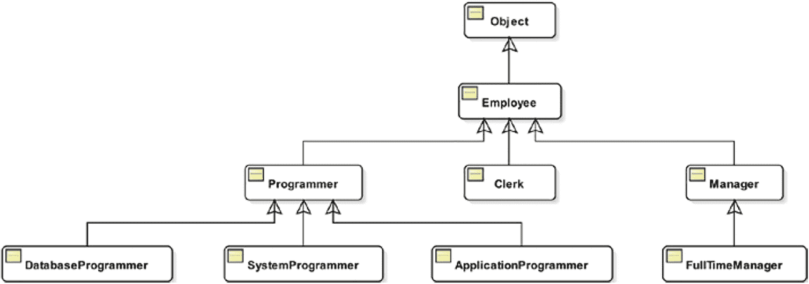

# 二十、继承

在本章中，您将学习:

*   什么是继承

*   如何从另一个类继承一个类

*   早期绑定和晚期绑定的区别

*   什么是方法重写以及如何重写方法

*   什么是字段隐藏和方法隐藏以及如何使用它们

*   什么是抽象类以及在哪里使用它们

*   如何声明`final`类和方法

*   “是一个”、“有一个”和“部分”关系之间的区别

*   如何对类使用模式匹配

*   如何使用密封类

本章中的所有示例程序都是清单 [20-1](#PC1) 中声明的`jdojo.inheritance`模块的成员。

```java
// module-info.java
module jdojo.inheritance {
    exports com.jdojo.inheritance;
}

Listing 20-1The Declaration of a jdojo.inheritance Module

```

## 什么是继承？

有时，您可能需要在应用程序的多个地方使用相同的功能。有不同的方法来编写代码来实现这一点。一种方法是在所有需要相同功能的地方复制相同的代码。如果您遵循这种逻辑，那么当功能发生变化时，您需要在所有地方进行更改。考虑一个例子，您在三个不同的地方需要相同的功能。假设您有一个处理三种对象的应用程序:行星、雇员和经理。进一步，假设这三种对象都有一个名字。您创建了三个类，`Planet`、`Employee`和`Manager`，来表示这三种对象。每个类都有一个名为`name`的实例变量和两个名为`getName()`和`setName()`的方法。如果你想一想在三个类的代码中维护它们对象的名字，你会发现它们是一样的。您可能为一个类编写了代码，并将其复制到另外两个类中。当相同的代码被复制到多个地方时，您可能会意识到维护这种代码的问题。如果以后需要对名称进行不同的处理，您将需要在三个地方进行更改。继承是面向对象编程的特性，在这种情况下有助于避免在多个地方复制相同的代码，从而促进代码重用。继承还允许您在不更改现有代码的情况下自定义代码。继承提供的不仅仅是代码重用和定制。

继承是面向对象编程语言的基石之一。它允许您通过重用现有类中的代码来创建一个新类。新的类称为子类，现有的类称为超类。超类包含由子类重用和定制的代码。据说子类继承了超类。超类也称为基类或父类。子类也称为派生类或子类。从技术上讲，从任何现有的类继承一个类是可能的。然而，实际上这样做并不总是一个好主意。软件开发中的继承与正常人类生活中的继承工作方式非常相似。你从父母那里继承了一些东西；你的父母从父母那里继承了一些东西；等等。如果你观察人类生活中的遗传，就会发现人类之间存在着遗传发生的关系。类似地，超类和子类的对象之间也存在关系。为了使继承有效，超类和子类之间必须存在的关系称为“is-a”关系。在从类`P`继承类`Q`之前，你需要问自己一个简单的问题:“类`Q`的对象也是类`P`的对象吗？”换句话说，“类`Q`的对象的行为像类`P?`的对象吗？”如果答案是肯定的，那么类`Q`可以从类`P`继承。考虑三个类:`Planet`、`Employee`和`Manager`。让我们逐个使用这三个类来问同样的问题:

*   行星是员工吗？也就是说，一个星球和一个雇员之间存在“是-是”的关系吗？答案是否定的，员工是星球吗？答案是否定的。

*   一个星球是管理者吗？答案是否定的，管理者是一个星球吗？答案是否定的。

*   员工是经理吗？答案是可能。雇员可以是经理、职员、程序员或任何其他类型的雇员。然而，员工不一定总是经理。经理是员工吗？答案是肯定的。

你用三个类问了六个问题。你只在一种情况下得到“是”的答案。这是唯一适合使用继承的情况。`Manager`类应该继承自`Employee`类。

## 继承类

一个类如何从另一个类继承？从另一个类继承一个类非常简单。您需要在子类的类声明中使用关键字`extends`，后跟超类名。一般语法如下:

```java
[modifiers] class <subclass-name> extends <superclass-name> {
    // Code for the subclass goes here
}

```

例如，下面的代码声明了一个类`Q`，它继承自类`P`，假设类`P`已经存在:

```java
public class Q extends P {
    // Code for class Q goes here
}

```

在类声明中，可以使用超类的简单名称或完全限定名称。如果子类和超类不在同一个包中，您可能需要导入超类名称，以便在`extends`子句中使用它的简单名称。假设类`P`和`Q`的完全限定名分别是`pkg1.P`和`pkg2.Q`。前面的声明可以用以下两种方式之一重写—使用超类的简单名称或使用超类的完全限定名称:

```java
// #1 – Use the simple name of P in the extends clause and use an import statement.
package pkg2;
import pkg1.P;
public class Q extends P {
    // Code for class Q goes here
}
// #2 – Use the fully qualified name of P. No need to use an import statement.
package pkg2;
public class Q extends pkg1.P {
    // Code for class Q goes here
}

```

让我们看看 Java 中最简单的继承例子。让我们从一个`Employee`类开始，如清单 [20-2](#PC5) 所示。

```java
// Employee.java
package com.jdojo.inheritance;
public class Employee {
    private String name = "Unknown";
    public void setName(String name) {
        this.name = name;
    }
    public String getName() {
        return name;
    }
}

Listing 20-2An Employee Class

```

`Employee`是一个简单的类，有一个私有实例变量`name`，和两个公共方法`setName()`和`getName()`。实例变量用于存储雇员的姓名，这两个方法用于获取和设置 name 实例变量。注意在`Employee`类中没有特殊的代码。这是你能用 Java 编写的最简单的类之一。很容易编写和理解下面使用`Employee`类的代码片段:

```java
Employee emp = new Employee();
emp.setName("John Jacobs");
String empName = emp.getName();
System.out.println("Employee Name: " + empName);
Employee Name: John Jacobs

```

清单 [20-3](#PC7) 包含一个`Manager`类的代码，它继承自`Employee`类。注意关键字`extends`的使用表明`Employee`类是超类而`Manager`类是子类。`Manager`类不包含任何代码，除了它的声明。这就是你现在在`Manager`职业中所需要的。

```java
// Manager.java
package com.jdojo.inheritance;
public class Manager extends Employee {
    // No code is needed for now
}

Listing 20-3A Manager Class

```

我们来测试一下`Manager`类。清单 [20-4](#PC8) 包含了测试程序。

```java
// SimplestInheritanceTest.java
package com.jdojo.inheritance;
public class SimplestInheritanceTest {
    public static void main(String[] args) {
        // Create an object of the Manager class
        Manager mgr = new Manager();
        // Set the manager name
        mgr.setName("Leslie Zanders");
        // Get the manager name
        String mgrName = mgr.getName();
        // Print the manager name
        System.out.println("Manager Name: " + mgrName);
    }
}
Manager Name: Leslie Zanders

Listing 20-4Testing the Manager Class

```

即使你没有为`Manager`类编写任何代码，它也和`Employee`类一样工作，因为它继承了`Employee`类。使用`Manager`类的构造器创建一个管理器对象:

```java
Manager mgr = new Manager();

```

在创建了`Manager`对象之后，代码看起来类似于您用来处理`Employee`对象的代码。您对`Manager`对象使用了`setName()`和`getName()`方法:

```java
mgr.setName("Leslie Zanders");
String mgrName = mgr.getName();

```

注意，`Manager`类没有声明`setName()`和`getName()`方法。它也没有声明`name`实例变量。然而，看起来它们都是在`Manager`类中声明的，因为它在声明中使用了`"extends Employee"`子句。当一个类从另一个类继承时，它继承它的超类成员(实例变量、方法等)。).管理继承的规则有很多。我们将在本章的后面逐一详细讨论这些规则。

## `Object`类是默认的超类

如果一个类没有在其类声明中使用关键字`extends`指定超类，那么它继承自`java.lang.Object`类。例如，类`P`的以下两个类声明是相同的:

```java
// #1 – "extends Object" is implicitly added for class P
public class P {
    // Code for class P goes here
}
// #2 – "extends Object" is explicitly added for class P
public class P extends Object {
    // Code for class P goes here
}

```

在前面的章节中，您没有使用`extends`子句来声明您的类。它们是从`Object`类中隐式继承的。这就是那些类的对象能够使用`Object`类的方法的原因。考虑以下代码片段:

```java
Employee emp = new Employee();
int hc = emp.hashCode();
String str = emp.toString();

```

`Employee`类没有使用 extends 子句指定它的超类。这意味着它继承自`Object`类。`Object`类声明了`hashCode()`和`toString()`方法。因为`Employee`类是`Object`类的一个子类，它可以使用这些方法，就好像它们已经包含在它自己的声明中一样。尽管您没有意识到，但是您已经从您编写的第一个 Java 程序中使用了继承。本节展示了代码重用带来的继承能力。在本章的后面你会看到继承的其他好处。

## 继承和等级关系

我们在上一节中提到了这一点，即只有当子类和超类之间存在“is-a”关系时，才应该使用继承。一个子类可以有自己的子类，子类又可以有自己的子类，依此类推。继承链中的所有类形成一个树状结构，这就是所谓的继承层次结构或类层次结构。继承层次结构中一个类之上的所有类都被称为该类的祖先。继承层次结构中某个类下面的所有类都称为该类的后代。

Java 允许一个类的单一继承。也就是说，一个类只能有一个超类(或父类)。然而，一个类可以是多个类的超类。Java 中的所有类都有一个超类，除了`Object`类。`Object`类位于继承层次的顶端。图 [20-1](#Fig1) 使用 UML(统一建模语言)图展示了`Employee`类及其后代的继承层次结构。在 UML 图中，超类和子类使用从子类指向超类的箭头连接。



图 20-1

示例继承类层次结构

有时，术语“直接超类”用于表示祖先类，它是继承层次结构中的上一级，而术语“超类”用于表示任何级别的祖先类。本书使用术语“超类”来表示一个类的祖先，它是继承层次结构中的上一级。例如，`Programmer`是`SystemProgrammer`的超类，而`Employee`和`Object`是`SystemProgrammer`的祖先。有时，术语“直接子类”用于表示继承层次结构中的下一级子类，而术语“子类”用于表示任何级别的子类。本书使用术语“子类”来表示一个类的后代，它是继承层次结构中的下一级。例如，`Employee`是 Object 的子类，而`Clerk`、`Programmer`和`Manager`是`Employee`的子类。`Clerk`、`Programmer`、`ApplicationProgrammer`、`SystemProgrammer`、`DatabaseProgrammer`、`Manager`、`FullTimeManager`、`PartTimeManager`都是`Employee`的后代。如果一个类是另一个类的后代，它也是那个类的祖先的后代。例如，`Employee`类的所有后代也是`Object`类的后代。所有`Manager`类的后代也是`Employee`类和`Object`类的后代。

## 子类继承了什么？

子类并不从它的超类继承一切。然而，子类可以直接或间接地使用超类中的任何东西。让我们来讨论“子类*从其超类继承*一些东西”和“子类*使用其超类的*一些东西”之间的区别

让我们举一个真实世界的例子。假设你的父母(一个超类)在银行账户里有钱。这笔钱属于你的父母。你(一个子类)需要一些钱。如果你继承了这笔钱，你会随意使用这笔钱，就好像这笔钱是你的一样。如果你只能用钱，你就不能直接拿到父母的钱。相反，你需要向你的父母要钱，他们会给你的。在这两种情况下，你都用了你父母的钱。在继承的情况下，这笔钱看起来是属于你的。也就是说，您可以直接访问它。在第二种情况下，你父母的钱你可以使用，但你不能直接使用。在后一种情况下，你必须通过你的父母来使用他们的钱。

子类继承其超类的非私有成员。我们稍后将详细讨论这个规则。请注意，构造器和初始化函数(静态和实例)不是类的成员，因此，它们不会被继承。类的成员是在类体中声明的所有成员以及它从超类继承的成员。这种对类成员的定义具有涓滴效应。

假设有三个类:`A`、`B`和`C`。类`A`继承自`Object`类。类`B`继承自类`A`，类`C`继承自类`B`。假设类`A`声明了一个私有成员`m1`和一个非私有成员`m2`。类`A`的成员是`m1`、`m2`，以及所有从`Object`类继承的成员。注意，`A`类的`m1`和`m2`成员是声明成员，而其他成员是继承成员。类`B`的成员将是在类`B`中声明的任何成员以及类`A`的所有非私有成员。成员`m1`在类`A`中被声明为私有，因此它不会被类`B`继承。同样的逻辑也适用于类`C`的成员。`Object`类的非私有成员通过继承层次向下渗透到`A`、`B`和`C`类。类`A`的非私有成员通过继承层次向下渗透到类`B`，后者又向下渗透到类`C`。

Tip

超类和它的子类可能在不同的模块中。模块`P`中的子类可以从模块`Q`中的超类继承，前提是该子类已经被声明为公共的，并且模块`Q`至少将包含超类的包导出到模块`P`。关于跨模块边界访问类的更多信息，请参考第 [10 章](10.html)。

有四个访问修饰符:`private`、`public`、`protected`和包级别。缺少`private`、`public`或`protected`访问修饰符被认为是默认或包级访问。类成员的访问级别修饰符决定了两件事:

*   谁可以直接访问(或使用)该类成员

*   无论子类是否继承该类成员

访问修饰符也用于类的非成员(例如构造器)。在这种情况下，访问修饰符的角色只有一个:“谁可以访问那个非成员？”

如果一个类成员被声明为`private`，那么它只能在声明它的类内部被访问。一个`private`类成员不能被该类的子类继承。

假设类本身是可访问的，那么从任何地方都可以访问类成员。子类继承其超类的所有`public`成员。

如果一个类成员被声明为`protected`，那么它在声明它的包中是可访问的。无论子类和类在同一个包中还是在不同的包中，受保护的类成员在子类的主体中总是可访问的。受保护的类成员由子类继承。当您希望子类访问和继承类成员时，可以使用`protected`访问修饰符。请注意，受保护的类成员既可以通过声明它的包访问，也可以通过子类访问。如果你想只从类成员的包内部提供对它的访问，你应该使用包级访问修饰符，而不是`protected`访问修饰符。

如果一个类成员被声明为包级别的，那么它只能在声明该类的包中被访问。只有当超类和子类在同一个包中时，才会继承包级的类成员。如果超类和子类在不同的包中，子类不会从其超类继承包级成员。

Tip

访问修饰符建立在彼此的基础上，从没有对外界的访问开始(`private`)并添加到它:首先，package(缺省)；然后，子类(`protected`)；然后是世界(`public`)。

让我们看看清单 [20-2](#PC5) 和 [20-3](#PC7) 中的继承示例。`Employee`类有三个成员:一个`name`字段、一个`getName()`方法和一个`setName()`方法。字段`name`已经被声明为`private`，因此它在`Manager`类中是不可访问的，因为它没有被继承。`getName()`和`setName()`方法已经被声明为`public`，它们可以从任何地方访问，包括`Manager`类。它们由`Manager`类从`Employee`类继承而来，尽管因为它们是`public`，它们被继承的事实并不重要。

## 向上铸造和向下铸造

现实世界中的“是-是”关系转化为软件中的继承类层次结构。类是 Java 中的一种类型。当您使用继承来表达“is-a”关系时，您创建了一个子类，它是超类的一个更具体的类型。例如，`Manager`是`Employee`的一种特定类型。安`Employee`是一种特殊类型的`Object`。当您在继承层次结构中向上移动时，您从一个特定的类型移动到一个更通用的类型。继承如何影响客户端代码？在这个上下文中，客户端代码是使用类层次结构中的类的任何代码。继承保证了一个类中存在的任何行为也将存在于它的子类中。类中的方法代表该类对象的行为。这意味着客户代码期望出现在类中的任何行为也将出现在该类的子类中。这导致了一个结论，如果客户端代码与一个类一起工作，它也将与该类的子类一起工作，因为子类至少保证了与其超类相同的行为。例如，`Manager`类至少提供了与其超类`Employee`相同的行为。考虑以下代码片段:

```java
Employee emp;
emp = new Employee();
emp.setName("Richard Castillo");
String name = emp.getName();

```

这段代码编译时没有任何错误。当编译器遇到`emp.setName("Richard Castillo")`和`emp.getName()`调用时，它会检查`emp`变量的声明类型。它发现`emp`变量的声明类型是`Employee`。它确保了`Employee`类具有符合正在进行的调用的`setName()`和`getName()`方法。它发现`Employee`类确实有一个将`String`作为参数的`setName()`方法。它发现`Employee`类确实有一个`getName()`方法，该方法不接受任何参数并返回一个`String`。在验证了这两个事实之后，编译器就可以调用`emp.setName()`和`emp.getName()`方法了。

记住，子类至少保证与其超类相同的行为(方法)，考虑下面的代码片段:

```java
Employee emp;
emp = new Manager(); // A Manager object assigned to an Employee variable
emp.setName("Richard Castillo");
String name = emp.getName();

```

编译器也会编译这段代码，尽管这次您已经修改了代码，将 emp 变量赋给了一个`Manager`类的对象。它将在与上一个案例相同的基础上传递`setName()`和`getName()`方法调用。它还传递赋值语句:

```java
emp = new Manager();

```

`new Manager()`表达式的编译时类型是`Manager`类型。`emp`变量的编译时类型(或声明类型)是`Employee`类型。因为`Manager`类继承自`Employee`类，所以`Manager`类的一个对象是`Employee`类的一个对象。简单来说，你说经理永远是员工。这样的赋值(从子类到超类)被称为*向上转换*，在 Java 中它总是被允许的。它也被称为扩大转换，因为一个`Manager`类(更具体的类型)的对象被分配给一个`Employee`类型(更一般的类型)的引用变量。以下所有赋值都是允许的，它们都是向上转换的例子:

```java
Object obj;
Employee emp;
Manager mgr;
PartTimeManager ptm;
// An employee is always an object
obj = emp;
// A manager is always an employee
emp = mgr;
// A part-time manager is always a manager
mgr = ptm;
// A part-time manager is always an employee
emp = ptm;
// A part-time manager is always an object
obj = ptm;

```

使用一个简单的规则来检查赋值是否是向上转换。看一下赋值操作符右边表达式的编译时类型(声明类型)(如`a = b`中的`b`)。如果右边操作数的编译时类型是左边操作数的编译时类型的子类，则是向上转换的情况，并且赋值是安全的和允许的。向上转换是子类的对象也是超类的对象这一事实的直接技术翻译。

Tip

具备向上转换和后期绑定能力的继承是 Java 中包含多态性的基础。参见第 [1](01.html) 章了解更多关于内含物多态性的信息。

向上转换是继承的一个非常强大的特性。它允许您编写多态代码，处理现有的类和将来要添加的类。它允许你用一个超类来编码你的应用程序逻辑，这个超类将总是和所有的子类(现有的子类或者将来要添加的子类)一起工作。它允许您编写通用代码，而不必担心代码在运行时使用的特定类型(类)。清单 [20-5](#PC17) 是一个简单的实用程序类，用来测试你的向上转换规则。它有一个`printName()`静态方法，接受一个`Employee`类型的参数。该方法使用`Employee`类的`getName()`方法来获取 employee 对象的名称，并将该名称打印在标准输出上。

```java
// EmpUtil.java
package com.jdojo.inheritance;
public class EmpUtil {
    public static void printName(Employee emp){
        // Get the name of employee
        String name = emp.getName();
        // Print employee name
        System.out.println(name);
    }
}

Listing 20-5A Utility Class That Uses an Employee-Type Parameter in Its printName() Method

```

清单 [20-6](#PC18) 包含一个使用`EmpUtil`类测试向上转换规则的程序。

```java
// UpcastTest.java
package com.jdojo.inheritance;
public class UpcastTest {
    public static void main(String[] args) {
        Employee emp = new Employee();
        emp.setName("Ken Wood");
        Manager mgr = new Manager();
        mgr.setName("Ken Furr"); // Inheritance of setName() at work
        // Print names
        EmpUtil.printName(emp);
        EmpUtil.printName(mgr);  // Upcasting at work
    }
}
Ken Wood
Ken Furr

Listing 20-6A Test Class to Test the Upcasting Rule

```

`main()`方法创建两个对象(`emp`和`mgr`):一个是`Employee`类，一个是`Manager`类。它为两个对象设置名称。最后，它调用`EmpUtil`类的`printName()`方法来打印两个对象的名称。第一次调用`EmpUtil.printName(emp)`是可以的，因为`printName()`方法接受一个`Employee`对象，而您已经传递了一个`Employee`对象(`emp`)。第二个调用`EmpUtil.printName(mgr)`，由于向上转换规则，是可以的。`printName(Employee emp)`接受一个`Employee`对象，您可以传递一个`Manager`对象(`mgr`)，因为经理总是雇员，向上转换规则允许将子类对象分配给超类类型的变量。

将超类引用赋给子类变量称为*向下转换*(或收缩转换)。向下转换是向上转换的反义词。在向上造型中，赋值在类层次结构中向上移动，而在向下造型中，赋值在类层次结构中向下移动。Java 编译器无法在编译时确保向下转换是合法的。考虑以下代码片段:

```java
Employee emp;
Manager mgr = new Manager();
emp = mgr; // OK. Upcasting
mgr = emp; // A compile-time error. Downcasting

```

由于向上转换，赋值`emp = mgr`被允许。然而，赋值`mgr = emp`是不允许的，因为这是一种向下转换的情况，其中超类(`Employee`)的变量被赋值给子类(`Manager`)的变量。编译器假设每个经理都是雇员是正确的。然而，并不是每个员工都是管理者(向下投射)。在前面的代码片段中，您希望向下转换能够工作，因为您肯定知道`emp`变量保存了对`Manager`的引用。为了让向下转换在编译时成功，Java 强加了一个额外的规则。您需要向编译器提供额外的保证，您已经考虑将超类引用赋值给子类引用变量，并且您希望编译器通过它。您可以通过向赋值中添加一个类型转换(或简单的转换)来提供这种保证，如下所示:

```java
mgr = (Manager) emp; // OK using a typecast. Downcast at work

```

这种使用类型转换的向下转换在编译时会成功。但是，Java 运行时将执行额外的验证。编译器的工作只是确保`mgr`变量声明的类型(即`Manager`)与正在使用的类型转换(即`Manager`)是赋值兼容的。编译器无法检查`emp`变量在运行时实际引用的是什么类型的对象。Java 运行时验证前面语句中类型转换`(Manager) emp`的正确性。

`emp`变量在运行时引用的对象的类型也称为其运行时类型。运行时比较`emp`变量的运行时类型和`Manager`类型(类型转换中使用了`Manager`类型)。如果`emp`变量的运行时类型与类型转换中使用的类型是赋值兼容的，则类型转换在运行时成功。否则，运行时抛出一个`java.lang.ClassCastException`。

考虑下面的代码片段，假设您有一个名为`PartTimeManager`的`Manager`类的子类:

```java
Employee emp;
Manager mgr = new Manager();
PartTimeManager ptm = new PartTimeManager();
emp = mgr;                   // Upcasting. OK
ptm = (PartTimeManager) emp; // Downcasting. OK at compile-time. A runtime error.

```

使用向下转换的最后一个赋值在编译时成功，因为`ptm`变量的声明类型和类型转换类型相同。`emp`的运行时类型是`Manager`，因为`emp = mgr`语句给它分配了一个`Manager`对象的引用。当运行时试图执行向下转换的`"(PartTimeManager) emp"`部分时，它发现`emp`的运行时类型`Manager`与类型转换类型`PartTimeManager`不兼容。这就是运行时会抛出一个`ClassCastException`的原因。

出于验证的目的，您可以将涉及向下转换的语句想象为包含两个部分。假设语句是`a2 = (K) b2`。编译器的工作是验证声明的类型`a2`与类型`K`是赋值兼容的。运行时的工作是验证运行时类型`b2`与类型`K`的赋值兼容。如果这两个检查中的任何一个失败了，根据哪个检查失败了，您会在编译时或运行时得到一个错误。图 [20-2](#Fig2) 描述了这种情况。


图 20-2

为向下转换进行的运行时和编译时检查

Tip

在 Java 中，`Object`类位于每个类层次结构的顶端。这允许您将任何类类型的引用分配给`Object`类型的变量。始终允许以下类型的分配:

`Object obj = new AnyJavaClass(); // Upcasting`

从一个`Object`类型向下转换到另一个类类型是否成功取决于向下转换规则，正如本节所讨论的。

## 运算符的实例

你如何确定向下转换在运行时总是成功的呢？Java 有一个`instanceof`操作符，它帮助你在运行时确定一个引用变量是否引用了一个类的对象或者这个类的子类。它接受两个操作数，并计算出一个`boolean`值`true`或`false`。其语法如下:

```java
<reference-variable> instanceof <type-name>

```

如果`<reference-variable>`引用一个类型为`<type-name>`的对象或者它的任何后代，`instanceof`返回`true`。否则，它返回`false`。如果`<reference-variable>`为`null`，则`instanceof`总是返回`false`。

您应该在向下转换之前使用`instanceof`操作符来检查您试图向下转换的引用变量是否是您期望的类型。例如，如果您想在运行时检查一个`Employee`类型的变量是否引用了一个`Manager`对象，您应该编写以下代码:

```java
Manager mgr = new Manager();
Employee emp = mgr;
if (emp instanceof Manager) {
    // The following downcast will always succeed
    mgr = (Manager) emp;
} else {
    // emp is not a Manager type
}

```

您可以使用 Java 16 中添加的模式匹配特性简化这一过程，如下所示:

```java
Manager mgr = new Manager();
Employee emp = mgr;
if (emp instanceof Manager mgr) {
    // mgr is a variable of type Manager you can reference here
} else {
    // emp is not a Manager type
}

```

模式匹配 instanceof 运算符的语法如下:

```java
<reference-variable> instanceof <type-name> <new-variable-name>

```

操作符经历两种类型的检查:编译时检查和运行时检查。编译器检查左操作数是否有可能引用右操作数的对象。此时，这张支票对你来说可能并不明显。使用`instanceof`操作符的目的是比较引用变量的运行时类型和类型。简而言之，它比较了两种类型。把一个芒果和一个员工相提并论有意义吗？你可能会说不。编译器使用`instanceof`操作符来检查这种不合逻辑的比较。它确保了`instanceof`操作符的左边操作数可以保存对右边操作数类型的对象的引用。如果不可能，编译器会生成一个错误。很容易发现编译器是否会因为使用`instanceof`操作符而产生错误。考虑以下代码片段:

```java
Manager mgr = null;
if (mgr instanceof Clerk) { //  A compile-time error
}

```

变量`mgr`可以保存对`Manager`类型或其后代类型的引用。然而，它永远不能保存对`Clerk`类型的引用。`Clerk`类型和`Manager`类不在同一个继承链中，尽管它在同一个继承树中。出于同样的原因，以下 instanceof 运算符的使用将生成编译时错误，因为`String`类不在`Employee`类的继承链中:

```java
String str = "test";
if (str instanceof Employee) { // A compile-time error
}

```

Tip

如果一个对象属于某个类的类型或其直接或间接的后代类型，则该对象被视为该类的实例。您可以使用`instanceof`操作符来检查一个对象是否是一个类的实例。

有时，您可能最终会编写使用`instanceof`操作符在一个地方测试多个条件的代码，如下所示:

```java
Employee emp;
// Some logic goes here...
if (emp instanceof TempEmployee temp) {
    // Code to deal with a temp employee
} else if (emp instanceof Manager mgr) {
    // Code to deal with a manager
} else if (emp instanceof Clerk clerk) {
    // Code to deal with a clerk
}

```

您应该避免编写这种代码。如果您添加了一个新的子类`Employee`，您将需要添加新子类的逻辑到这个代码中。通常，这种代码表明存在设计缺陷。总是问自己这样一个问题，“当我向现有的类层次结构中添加一个新的类时，这段代码会继续工作吗？”如果答案是肯定的，你就很好。否则，重新考虑设计。

在`equals()`方法中，您将经常使用`instanceof`操作符。它是在`Object`类中定义的，该方法由所有类继承。它以一个`Object`作为参数。如果参数和调用这个方法的对象被认为是相等的，它返回`true`。否则返回`false`。每个类的对象可以不同地比较相等性。例如，如果两个雇员为同一家公司和同一部门工作，并且具有相同的雇员 ID，则他们可能被认为是平等的。如果将一个`Manager`对象传递给`Employee`类的`equals()`方法会发生什么？既然管理者也是员工，就应该比较两者是否平等。清单 [20-7](#PC29) 包含了`Employee`类的`equals()`方法的可能实现。

```java
// Employee.java
package com.jdojo.inheritance;
public class Employee {
    private String name = "Unknown";
    public void setName(String name) {
        this.name = name;
    }
    public String getName() {
        return name;
    }
    public boolean equals(Object obj) {
        boolean isEqual = false;
        // We compare objects of the Employee class with the objects of
        // Employee class or its descendants
        if (obj instanceof Employee e) {
            // If two have the same name, consider them equal.
            String n = e.getName();
            isEqual = n.equals(this.name);
        }
        return isEqual;
    }
}

Listing 20-7Implementing the equals() Method for the Employee Class

```

将`equals()`方法添加到`Employee`类后，可以编写如下代码，根据名称比较两个`Employee`类型的对象是否相等:

```java
Employee emp = new Employee();
emp.setName("John Jacobs");
Manager mgr = new Manager();
mgr.setName("John Jacobs");
System.out.println(mgr.equals(emp));           // prints true
System.out.println(emp.equals(mgr));           // prints true
System.out.println(emp.equals("John Jacobs")); // prints false

```

在第三次比较中，您将一个`Employee`对象与一个`String`对象进行比较，后者返回`false`。比较一个`Employee`和一个`Manager`对象会返回`true`，因为它们通过子类化相关并且具有相同的名称。

Employee equals 方法可以减少到一行，因为 e 变量是由模式匹配 instanceof 运算符定义的，如下所示:

`return (obj instanceof Employee e && e.getName().equals(`[`this.name`](http://this.name)T2】

## 有约束力的

类有方法和字段；我们编写代码来访问它们，如下所示。假设`myMethod()`和`xyz`是`MyClass`类的成员，该类是`myObject`引用变量的声明类型:

```java
MyClass myobject = get an object reference;
myObject.myMethod();   // Which myMethod() to call?
int a = myObject.xyz;  // Which xyz to access?

```

绑定是识别被访问方法的代码(本例中为`myMethod()`)或字段(本例中为`xyz`)的过程，代码执行时将会用到这些代码。换句话说，绑定是一个在代码执行时决定访问哪个方法的代码或字段的过程。绑定可以发生在两个阶段:编译时和运行时。当绑定发生在编译时，它被称为*早期绑定*。早期绑定也被称为*静态绑定*或*编译时绑定*。当绑定发生在运行时，它被称为*后期绑定*。后期绑定也称为*动态绑定*或*运行时绑定*。

### 早期绑定

与后期绑定相比，早期绑定更容易理解。在早期绑定中，编译器在编译时决定访问哪个方法代码或字段。对于方法调用，当执行具有方法调用的代码时，编译器决定将执行哪个类中的哪个方法。对于字段访问，当执行具有字段访问的代码时，编译器决定将访问哪个类中的哪个字段。早期绑定用于类的以下类型的方法和字段:

*   所有类型的字段:静态和非静态

*   静态方法

*   非静态最终方法

在早期绑定中，根据访问方法或字段的变量(或表达式)的声明类型(或编译时类型)来访问方法或字段。例如，如果早期绑定被用于一个`a2.m1()`方法调用，如果`a2`已经被声明为类型`A`，那么当`a2.m1()`被执行时，类`A`中的`m1()`方法将被调用。

让我们看一个演示早期绑定规则的详细示例。考虑清单 [20-8](#PC32) 和 [20-9](#PC33) 中显示的两个类。

```java
// EarlyBindingSub.java
package com.jdojo.inheritance;
public class EarlyBindingSub extends EarlyBindingSuper{
    // An instance variable
    public String str = "EarlyBindingSub";
    // A static variable
    public static int count = 200;
    public static void print() {
        System.out.println("Inside EarlyBindingSub.print()");
    }
}

Listing 20-9An EarlyBindingSub Class, Which Inherits from the EarlyBindingSuper Class and Has a Static Field, an Instance Field, and a Static Method, Which Are of the Same Type as in Its Superclass

```

```java
// EarlyBindingSuper.java
package com.jdojo.inheritance;
public class EarlyBindingSuper {
    // An instance variable
    public String str = "EarlyBindingSuper";
    // A static variable
    public static int count = 100;
    public static void print() {
        System.out.println("Inside EarlyBindingSuper.print()");
    }
}

Listing 20-8An EarlyBindingSuper Class That Has a Static Field, an Instance Field, and a Static Method

```

`EarlyBindingSuper`类声明了两个字段:`str`和`count`。`str`场被声明为非静态，`count`被声明为`static`。`print()`方法被声明为`static`。

`EarlyBindingSub`类继承自`EarlyBindingSuper`类，它声明了相同类型的字段和方法，它们具有相同的名称。字段被设置为不同的值，并且该方法在`EarlyBindingSub`类中打印不同的消息，因此您可以知道在执行代码时访问的是哪一个。清单 [20-10](#PC34) 中的`EarlyBindingTest`类展示了早期绑定的结果。

```java
// EarlyBindingTest.java
package com.jdojo.inheritance;
public class EarlyBindingTest {
    public static void main(String[] args) {
        var ebSuper = new EarlyBindingSuper();
        var ebSub = new EarlyBindingSub();
        // Will access EarlyBindingSuper.str
        System.out.println(ebSuper.str);
        // Will access EarlyBindingSuper.count
        System.out.println(ebSuper.count);
        // Will access EarlyBindingSuper.print()
        ebSuper.print();
        System.out.println("------------------------------");
        // Will access EarlyBindingSub.str
        System.out.println(ebSub.str);
        // Will access EarlyBindingSub.count
        System.out.println(ebSub.count);
        // Will access EarlyBindingSub.print()
        ebSub.print();
        System.out.println("------------------------------");
        // Will access EarlyBindingSuper.str
        System.out.println(((EarlyBindingSuper) ebSub).str);
        // Will access EarlyBindingSuper.count
        System.out.println(((EarlyBindingSuper) ebSub).count);
        // Will access EarlyBindingSuper.print()
        ((EarlyBindingSuper) ebSub).print();
        System.out.println("------------------------------");
        // Assign the ebSub to ebSuper
        ebSuper = ebSub; // Upcasting
        /* Now access methods and fields using ebSuper variable, which is
           referring to a EarlyBindingSub object
         */
        // Will access EarlyBindingSuper.str
        System.out.println(ebSuper.str);
        // Will access EarlyBindingSuper.count
        System.out.println(ebSuper.count);
        // Will access EarlyBindingSuper.print()
        ebSuper.print();
        System.out.println("------------------------------");
    }
}
EarlyBindingSuper
100
Inside EarlyBindingSuper.print()
------------------------------
EarlyBindingSub
200
Inside EarlyBindingSub.print()
------------------------------
EarlyBindingSuper
100
Inside EarlyBindingSuper.print()
------------------------------
EarlyBindingSuper
100
Inside EarlyBindingSuper.print()
------------------------------

Listing 20-10A Test Class to Demonstrate Early Binding for Fields and Methods

```

`main()`方法创建每种类型`EarlyBindingSuper`和`EarlyBindingSub`的对象:

```java
var ebSuper = new EarlyBindingSuper();
var ebSub = new EarlyBindingSub();

```

根据早期的绑定规则，语句`ebSuper.str`、`ebSuper.count`和`ebSuper.print()`将总是访问`EarlyBindingSuper`类的`str`和`count`字段以及`print()`方法，因为您已经声明了`EarlyBindingSuper`类型的`ebSuper`。这个决定是由编译器做出的，因为`str`和`count`是字段，对于字段，Java 总是使用早期绑定。`print()`方法是一个`static`方法，Java 总是对`static`方法使用早期绑定。当您使用`ebSub`变量访问这些成员时，同样的规则也适用。

以下语句的输出可能不明显:

```java
// Will access EarlyBindingSuper.str
System.out.println(((EarlyBindingSuper)ebSub).str);
// Will access EarlyBindingSuper.count
System.out.println(((EarlyBindingSuper)ebSub).count);
// Will access EarlyBindingSuper.print()
((EarlyBindingSuper)ebSub).print();

```

这三个语句使用一个表达式来访问字段和方法。当你写`ebSub.str`时，你直接使用`ebSub`变量访问`str`域。很明显，`ebSub`变量属于`EarlyBindingSub`类型，因此，`ebSub.str`将访问`EarlyBindingSub`类的`str`字段。使用 typecast 时，表达式的编译时类型会发生变化。比如`ebSub`的编译时类型是`EarlyBindingSub`。但是，表达式`(EarlyBindingSuper) ebSub`的编译时类型是`EarlyBindingSuper`。这就是为什么前面三个语句都将从`EarlyBindingSuper`类访问字段和方法，而不是从`EarlyBindingSub`类，即使它们都使用`ebSub`变量，这是`EarlyBindingSub`类型。清单 [20-10](#PC34) 的输出验证了关于早期绑定规则的解释讨论。

Tip

您还可以使用类的名称来访问类的`static`字段和方法，例如`EarlyBindingSub.str`。早期的绑定规则仍然适用，编译器会将对这些字段和方法的访问绑定到使用其名称来访问它们的类。为了可读性，最好使用类名来访问类的静态成员。

### 后期绑定

所有非静态、非最终方法的绑定都遵循后期绑定的规则。也就是说，如果你的代码访问一个非静态的方法，这个方法没有被声明为`final`，那么这个方法的哪个版本将在运行时被调用。将被调用的方法的版本取决于进行方法调用的对象的运行时类型，而不是其编译时类型。考虑下面的代码片段，它创建了一个`Manager`类的对象，并将引用赋给了一个`Employee`类的变量`emp`。`emp`变量访问`setName()`方法:

```java
Employee emp = new Manager();
emp.setName("John Jacobs");

```

编译器只对这段代码中的`emp.setName()`方法调用执行一次检查。它确保了`emp`变量的声明类型，即`Employee`，有一个名为`setName(String s)`的方法。编译器检测到`Employee`类中的`setName(String s)`方法是实例方法，而不是`final`。对于实例方法调用，编译器不执行绑定。它将把这项工作留给运行时。方法调用`emp.setName("John Jacobs")`是后期绑定的一个例子。在运行时，JVM 决定应该调用哪个`setName(String s)`方法。JVM 获取`emp`变量的运行时类型。在这段代码中查看`emp.setName("John Jacobs")`语句时，`emp`变量的运行时类型是`Manager`。JVM 从`emp`变量的运行时类型(即`Manager`)开始遍历类层次结构，寻找`setName(String s)`方法的定义。首先，它查看`Manager`类，发现`Manager`类没有声明`setName(String s)`方法。JVM 现在在类层次结构中向上移动了一级，这就是`Employee`类。它发现`Employee`类声明了一个`setName(String s)`方法。一旦 JVM 找到匹配，它就将调用绑定到该方法并停止搜索。回想一下，在 Java 中，`Object`类总是位于所有类层次结构的顶端。JVM 继续搜索直到`Object`类的方法定义。如果在`Object`类中没有找到匹配，它抛出一个运行时异常。

让我们看一个演示后期绑定过程的例子。清单 [20-11](#PC38) 和 [20-12](#PC39) 分别有`LateBindingSuper`和`LateBindingSub`类的代码。`LateBindingSub`类继承自`LateBindingSuper`类。它定义并覆盖了与在`LateBindingSuper`类中定义的相同的实例方法`print()`。两个类中的`print()`方法打印不同的消息，以便您可以看到哪个方法被调用。

```java
// LateBindingSub.java
package com.jdojo.inheritance;
public class LateBindingSub extends LateBindingSuper {
    @Override
    public void print() {
        System.out.println("Inside LateBindingSub.print()");
    }
}

Listing 20-12A LateBindingSub Class, Which Has an Instance Method Named print()

```

```java
// LateBindingSuper.java
package com.jdojo.inheritance;
public class LateBindingSuper {
    public void print() {
        System.out.println("Inside LateBindingSuper.print()");
    }
}

Listing 20-11A LateBindingSuper Class, Which Has an Instance Method Named print()

```

清单 [20-13](#PC40) 展示了后期绑定的结果。

```java
// LateBindingTest.java
package com.jdojo.inheritance;
public class LateBindingTest {
    public static void main(String[] args) {
        LateBindingSuper lbSuper = new LateBindingSuper();
        LateBindingSub lbSub = new LateBindingSub();
        // Will access LateBindingSuper.print()
        lbSuper.print(); // #1
        // Will access LateBindingSub.print()
        lbSub.print();   // #2
        // Will access LateBindingSub.print()
        ((LateBindingSuper) lbSub).print(); // #3
        // Assign the lbSub to lbSuper
        lbSuper = lbSub; // Upcasting
        // Will access LateBindingSub.print() because lbSuper
        // is referring to a LateBindingSub object
        lbSuper.print(); // #4
    }
}
Inside LateBindingSuper.print()
Inside LateBindingSub.print()
Inside LateBindingSub.print()
Inside LateBindingSub.print()

Listing 20-13A Test Class to Demonstrate Late Binding

```

main()方法创建每种类型的对象`LateBindingSuper`和`LateBindingSub`:

```java
LateBindingSuper lbSuper = new LateBindingSuper();
LateBindingSub lbSub = new LateBindingSub();

```

对`print()`方法的调用被标记为#1、#2、#3 和#4，所以我们可以在讨论中引用它们。

两个变量`lbSuper`和`lbSub`都用于访问`print()`实例方法。运行时决定调用哪个版本的`print()`方法。当你使用`lbSuper.print()`时，哪个`print()`方法被调用取决于`lbSuper`变量在那个时间点引用的对象。回想一下，一个类类型的引用变量也可以引用它的任何后代的对象。`lbSuper`变量可以引用`LateBindingSuper`或`LateBindingSub`的对象。

当语句# 1`lbSuper.print()`准备好执行时，运行时将需要找到`print()`方法的代码。运行时寻找`lbSuper`变量的运行时类型，它发现`lbSuper`变量引用了一个`LateBindingSuper`类型的对象。它在`LateBindingSuper`类中寻找`print()`方法并找到它。因此，运行时将标记为#1 的语句中的`print()`方法调用绑定到`LateBindingSuper`类的`print()`方法。输出中的第一行证实了这一点。

在语句#2 中绑定`print()`方法的逻辑与标记为#1 的语句相同，但是这次的类是`LateBindingSub`。

语句#3 是棘手的。当你使用像`(LateBindingSuper) lbSub`这样的类型转换时，`lbSub`在运行时引用的对象不会改变。使用一个类型转换，你所要说的就是你想使用`lbSub`变量引用的对象作为`LateBindingSuper`类型的对象。然而，对象本身永远不会改变。您可以使用下面的代码来验证这一点，该代码获取对象的类名:

```java
// Both s1 and s2 have "com.jdojo.inheritance.LateBindingSub" class name LateBindingSub lbSub = new LateBindingSub();
String s1 = lbSub.getClass().getName();
String s2 = ((LateBindingSuper)lbSub).getClass().getName();

```

当语句#3 准备执行时，此时带有类型转换的表达式仍然引用一个`LateBindingSub`类型的对象，因此，将调用`LateBindingSub`类的`print()`方法。输出中的第三行证实了这一点。

考虑两行代码来讨论语句#4:

```java
lbSuper = lbSub; // Upcasting
lbSuper.print(); // #4

```

第一个源代码行将`lbSub`分配给`lbSuper`。这一行的作用是`lbSuper`变量开始引用一个`LateBindingSub`类型的对象。当语句#4 准备好执行时，运行时需要找到`print()`方法的代码。运行时发现`lbSuper`变量的运行时类型是`LateBindingSub`类。它在`LateBindingSub`类中寻找`print()`方法，并在那里找到它。因此，语句#4 执行`LateBindingSub`类中的`print()`方法。输出中的第四行证实了这一点。

Tip

与早期绑定相比，后期绑定会导致较小的性能开销，因为方法调用是在运行时解析的。然而，编程语言可以使用许多技术(例如，虚拟方法表)来实现后期绑定，因此性能影响很小或者可以忽略不计。后期绑定的好处掩盖了对性能的轻微影响。它让您实现包含多态性。当你编写类似于`a2.print()`的代码时，`a2`变量表现出相对于`print()`方法的多态行为。同样的代码，`a2.print()`，可能调用`a2`变量的类的`print()`方法或者它的任何子类，这取决于`a2`在运行时引用的`Object`类型。继承和后期绑定允许您编写多态代码，这些代码是根据超类类型编写的，也适用于所有子类类型。

## 方法覆盖

在类中重新定义从超类继承的实例方法称为方法重写。考虑下面的类`A`和类`B`的声明:

```java
public class A {
    public void print() {
        System.out.println("A");
    }
}
public class B extends A {
    @Override
    public void print() {
        System.out.println("B");
    }
}

```

类`B`是类`A`的子类。类`B`从它的超类继承了`print()`方法并重新定义了它。据说`B`类的`print()`方法覆盖了 a 类的`print()`方法，这就好比`B`类告诉`A`类，“感谢你做我的超类，让我继承了你的`print()`方法。然而，我需要不同的工作方式。我将以我的方式重新定义它，而不会以任何方式影响你的`print()`方法。你可以继续用你的`print()`方法。”如果一个类重写一个方法，它会影响重写的类及其子类。考虑下面的类声明`C`:

```java
public class C extends B {
    // C inherits B.print()
}

```

类`C`没有声明任何方法。类`C`继承了什么方法:`A.print()`或`B.print()`或两者？它从类`B`继承了`print()`方法。一个类总是从它的直接超类(在超类中声明或由其超超类继承)继承可用的东西。如果一个类`D`从类`C`继承，它将通过类`C`继承类`B`的打印`()`方法:

```java
public class D extends C {
    // D inherits B.print() through C
}

```

考虑另外两个类`E`和`F`，它们分别继承自`D`和`E`。类`E`覆盖了类`B`的`print()`方法，它从类`D`继承而来:

```java
public class E extends D {
    @Override
    public void print() {
        System.out.println("E");
    }
}
public class F extends E {
    // F inherits E.print() through E
}

```

以下代码片段的输出会是什么？

```java
A a = new A();
a.print();     // will print A
a = new B();
a.print();     // will print B
a = new C();
a.print();     // will print B
a = new D();
a.print();     // will print B
a = new E();
a.print();     // will print E
a = new F();
a.print();     // will print E

```

代码中的注释告诉你什么将被打印。你能想出为什么得到这个输出吗？有三件事在起作用。首先，您可以将类`A`的后代的对象分配给类`A`类型的变量。这就是你在所有声明中称`a.print()`的原因。第二，`print()`方法已经被类层次结构中的类`A`的一些后代覆盖。第三，后期绑定根据变量在运行时引用的对象的类来执行调用适当的`print()`方法的魔法。考虑以下两个类别`S`和`T`的定义:

```java
public class S {
    public void print() {
        System.out.println("S");
    }
}
public class T extends S {
    public void print(String msg) {
        System.out.println(msg);
    }
}

```

类`T`中的`print()`方法会覆盖其超类`S`中的`print()`方法吗？答案是否定的。类`T`中的`print()`方法不会覆盖类`S`中的`print()`方法。这被称为方法重载。类`T`现在将有两个`print()`方法:一个继承自它的超类`S`，不带参数，另一个在其中声明，带参数`String`。然而，类`T`的两个方法有相同的名字`print`。这就是它被称为方法重载的原因，因为同一个方法名在同一个类中被多次使用。

下面是当一个类被称为覆盖一个方法时的规则，这个方法是从它的超类继承的。

### 方法覆盖规则#1

该方法必须是实例方法。重写不适用于静态方法。

### 方法覆盖规则#2

重写方法必须与被重写的方法同名。

### 方法覆盖规则#3

重写方法必须具有与被重写方法相同数量、相同顺序的相同类型的参数。当方法使用泛型类型作为参数时，Java 5 中引入的泛型稍微改变了这个规则。当方法的参数使用泛型类型时，在与其他方法进行比较以检查一个方法是否重写另一个方法时，您需要考虑泛型类型参数的擦除，而不是泛型类型本身。我们稍后将再次讨论这条规则，并通过示例详细讨论它。现在，如果一个方法和另一个方法具有相同数量的相同类型的相同顺序的参数，那么可以认为它们覆盖了另一个方法。请注意，参数的名称无关紧要。例如，`void print(String str)`和`void print(String msg)`被认为是同一个方法。参数`str`和`msg`的不同名称并不会使它们成为不同的方法。

### 方法覆盖规则#4

在 Java 5 之前，覆盖方法和被覆盖方法的返回类型必须相同。这个规则对于原始数据类型的返回类型是一样的。但是，对于引用数据类型的返回类型，规则是不同的。如果被重写方法的返回类型是引用类型，则重写方法的返回类型必须与被重写方法的返回类型赋值兼容。假设一个类有一个方法定义`R1 m1()`，它被一个方法定义`R2 m1()`覆盖。只有当 R2 的一个实例可以被赋给一个没有任何类型转换的`R1`类型的变量时，才允许这个方法覆盖。考虑下面的代码片段，它定义了三个类— `P`、`Q`和`R`:

```java
public class P {
    public Employee getEmp() {
        // Code goes here
    }
}
public class Q extends P {
    public Employee getEmp() {
        // code goes here
    }
}
public class R extends P {
    public Manager getEmp() {
        // code goes here
    }
}

```

类`P`定义了一个`getEmp()`方法，该方法返回一个`Employee`类型的对象。类`Q`的`getEmp()`方法覆盖了其超类`P`的`getEmp()`方法，因为它具有相同的名称、相同顺序的相同类型的参数数量(在本例中为零)以及相同的返回类型`Employee`。类`R`的`getEmp()`方法也覆盖类`P`的`getEmp()`方法，即使其返回类型`Manager`不同于被覆盖方法的返回类型`Employee`。类`R`的`getEmp()`方法覆盖了它的超类`getEmp()`方法，因为一个`Manager`类型的实例总是可以被赋给一个`Employee`类型的变量而不需要任何类型转换。

### 方法覆盖规则#5

重写方法的访问级别必须至少与被重写方法的访问级别相同或更宽松。三个访问级别是`public`、`protected`和允许继承的包级别。回想一下`private`成员不是继承的，因此不能被覆盖。准入级别从最宽松到最严格的顺序是`public`、`protected`、套餐级别。如果被覆盖的方法具有`public`访问级别，那么被覆盖的方法必须具有`public`访问级别，因为`public`是最宽松的访问级别。如果被覆盖的方法具有`protected`访问级别，则被覆盖的方法可能具有`public`或`protected`访问级别。如果被重写的方法具有包级别的访问权限，那么重写的方法可能具有`public`、`protected`或包级别的访问权限。表 [20-1](#Tab1) 总结了这一规律。我们将很快讨论为什么这个规则存在。

表 20-1

重写方法允许的访问级别

<colgroup><col class="tcol1 align-left"> <col class="tcol2 align-left"></colgroup> 
| 

重写的方法访问级别

 | 

允许的重写方法访问级别

 |
| --- | --- |
| `public` | `Public` |
| `protected` | `public, protected` |
| 包装级别 | `public, protected`，包装级别 |

### 方法覆盖规则#6

一个方法可以在它的`throws`子句中包含一个检查异常的列表。虽然允许在方法的`throws`子句中包含未检查的异常，但这不是必需的。在这一节中，我们只讨论检查异常。重写方法不能向被重写方法的异常列表中添加新的异常。它可以移除一个或所有异常，或者用另一个异常替换一个异常，该异常是被重写的方法中列出的异常的后代之一。考虑下面的类定义:

```java
public class G {
    public void m1() throws CheckedException1, CheckedException2 {
        // Code goes here
    }
}

```

如果一个类覆盖了类`G`的`m1()`方法，它不能添加任何新的检查异常。下面的代码不会编译，因为它在被覆盖的方法`m1()`中添加了一个新的检查异常`CheckException3`:

```java
public class H extends G {
    public void m1() throws CheckedException1, CheckedException2, CheckedException3 {
        // Code goes here
    }
}

```

下面的类声明覆盖了类`G`中的`m1()`方法，它们都是有效的。在类`I`中，方法`m1()`移除了这两个异常。在`J`类中，它移除一个异常并保留一个。在类`K`中，它保留一个并用后代类型替换另一个，假设`CheckedException22`是`CheckedException2`的后代类:

```java
public class I extends G {
    // m1() removes all exceptions
    public void m1() {
        // Code goes here
    }
}
public class J extends G {
    // m1() removes one exception and keeps another
    public void m1() throws CheckedException1 {
        // Code goes here
    }
}
public class J extends G {
    // m1() removes one, keep one, and replaces one with a subclass
    public void m1() throws CheckedException1, CheckedException22 {
        // Code goes here
    }
}

```

关于重写方法的返回类型和异常列表的规则可能并不明显。这些规则背后有一个原因，那就是“一个类类型的变量可以保存对它的任何后代的对象的引用。”当您使用超类类型编写代码时，该代码也必须在不修改子类类型对象的情况下工作。假设`EmpNotFoundException`是一个被检查的异常类，考虑下面对类`P`的定义:

```java
public class P {
    public Employee getEmp(int empId) throws EmpNotFoundException {
        // code goes here
    }
}

```

您可以编写以下代码片段:

```java
P p = // get an object reference of P or its descendant;
try {
    Employee emp = p.getEmp(10);
} catch (EmpNotFoundException e) {
    // Handle the exception here
}

```

这段代码中需要考虑两点。首先，类型为`P`的变量`p`可以指向类型为`P`的对象或者类`P`的任何后代的对象。第二，当调用`p.getEmp(10)`方法时，编译器验证变量`p` ( `P`类)的声明类型有一个`getEmp()`方法，该方法接受一个`int`类型的参数，返回一个`Employee`类型的对象，并抛出`EmpNotFoundException`。这些信息由编译器用类`P`验证。编译器做出的关于`getEmp()`方法的假设(也得到验证)永远不应该在运行时失效。否则，将导致混乱——代码可以编译，但可能无法运行。

考虑覆盖`getEmp()`方法的一种可能情况，如下所示:

```java
public class Q extends P {
    public Manager getEmp(int empId) {
        // code goes here
    }
}

```

如果变量`p`被分配了一个类`Q`的对象，则代码

```java
Employee emp = p.getEmp(10);

```

在`try-catch`块内仍然有效。在这种情况下，变量`p`将引用类`Q`的对象，其`getEmp()`方法返回一个`Manager`对象，并且不抛出任何异常。从`getEmp()`方法返回一个`Manager`对象很好，因为你可以将一个`Manager`对象赋给`emp`变量，这是一个向上转换的例子。不从`getEmp()`方法抛出异常也没问题，因为代码已经准备好处理异常(通过使用`try-catch`块)以防异常被抛出。

重写方法的访问级别规则背后的原因是什么？注意，当变量 p 访问`getEmp()`方法时，编译器验证使用`p.getEmp()`的代码可以访问类`P`的`getEmp()`方法。如果`P`的子类降低了访问级别，相同的代码`p.getEmp()`可能在运行时无法工作，因为执行该语句的代码可能无法访问类`P`的后代中的`getEmp()`方法。

考虑下面对类`Q2`的定义，它继承自类`P`。它覆盖了`getEmp()`方法，并用另一个名为`BadEmpIdException`的检查异常替换了`EmpNoFoundException`:

```java
// Won't compile
public class Q2 extends P {
    public Manager getEmp(int empId) throws BadEmpIdException {
        // code goes here
    }
}

```

假设根据`P`类型编写的代码获得了一个`Q2`对象的引用，如下所示:

```java
P p = new Q2();
try {
    Employee emp = p.getEmp(10);
} catch(EmpNotFoundException e) {
    // Handle exception here
}

```

注意，`try-catch`块不准备处理`BadEmpIdException`，因为`Q2`类的方法`getEmp()`可能会抛出。这就是为什么类`Q2`的声明不会被编译。

为了总结重写的规则，让我们将方法声明的各个部分分解如下:

*   方法的名称

*   参数数量

*   参数类型

*   参数的顺序

*   方法的返回类型

*   访问级

*   `throws`子句中检查的异常列表

在重写和被重写的方法中，前四个部分必须始终相同。在 Java 5 之前，重写方法和被重写方法中的返回类型必须相同。从 Java 5 开始，如果返回类型是引用类型，那么覆盖方法的返回类型也可以是被覆盖方法的返回类型的子类型(任何后代)。被覆盖方法中的访问级别和异常列表可以被认为是它的约束。重写方法可以放松(甚至移除)被重写方法的约束。但是，重写方法的约束不能比被重写方法的约束更多。

重写方法的规则很复杂。你可能要花很长时间才能掌握它们。编译器直接支持所有规则。如果你在重写一个方法的时候在源代码中犯了一个错误，编译器会生成一个好的(不总是)错误消息，给你一个错误的线索。有一条关于方法重写的黄金法则可以帮助你避免错误:“无论使用超类类型编写什么代码，都必须与子类类型一起工作。”

Tip

如果你想在你的类中覆盖一个方法，你应该用一个`@Override`注释来注释这个方法。对于用`@Override`注释的方法，编译器验证该方法确实覆盖了超类中的一个方法；否则，它会生成编译时错误。

## 访问被重写的方法

有时您可能需要从子类中访问被覆盖的方法。子类可以使用关键字`super`作为限定符来调用超类的覆盖方法。注意`Object`类没有超类。在`Object`类中使用关键字`super`是非法的。作为一名程序员，你永远不需要为`Object`类编写代码，因为它是 Java 类库的一部分。考虑清单 [20-14](#PC60) 中`AOSuper`类的代码。它有一个`print()`方法，在标准输出上打印一条消息。

```java
// AOSuper.java
package com.jdojo.inheritance;
public class AOSuper {
    public void print() {
        System.out.println("Inside AOSuper.print()");
    }
}

Listing 20-14An AOSuper Class

```

清单 [20-15](#PC61) 中的代码包含对一个`AOSub`类的声明，该类继承自`AOSuper`类。

```java
// AOSub.java
package com.jdojo.inheritance;
public class AOSub extends AOSuper {
    @Override
    public void print() {
        // Call print() method of AOSuper class
        super.print();
        // Print a message
        System.out.println("Inside AOSub.print()");
    }
    public void callOverriddenPrint() {
        // Call print() method of AOSuper class
        super.print();
    }
}

Listing 20-15An AOSub Class, Which Inherits from the AOSuper Class

```

`AOSub`类覆盖了`AOSuper`类的`print()`方法。注意在`print()`方法和`AOSub`类的`callOverriddenPrint()`方法中的`super.print()`方法调用。它将调用`AOSuper`类的`print()`方法。清单 [20-16](#PC62) 的输出显示带有`super`限定符的方法调用调用了超类中被覆盖的方法。

```java
// AOTest.java
package com.jdojo.inheritance;
public class AOTest {
    public static void main(String[] args) {
        AOSub aoSub = new AOSub();
        aoSub.print();
        aoSub.callOverriddenPrint();
    }
}
Inside AOSuper.print()
Inside AOSub.print()
Inside AOSuper.print()

Listing 20-16A Test Class to Test a Method Call with the super Qualifier

```

没有办法直接调用超类的超类的实例方法。您可以使用关键字`super`调用超类(只有直接祖先)的覆盖方法。假设有三个类，`A`、`B`和`C`，其中`B`类继承自`A`类，而`C`类继承自`B`类。无法从类`C`内部调用类`A`的方法。如果类`C`需要调用类`A`的方法，你需要在类`B`中提供一个方法来调用类`A`的方法。类`C`将调用类`B`的方法，后者又将调用类`A`的方法。

Tip

当使用关键字`super`进行方法调用时，Java 使用早期绑定，即使该方法是实例方法。Java 对实例方法调用使用早期绑定的另一个实例是`private`方法调用，因为`private`方法不能从其定义类外部调用。`private`方法也不能被覆盖。关键字`super`指的是它所在的类的直接祖先的实例字段、方法或构造器。

## 方法重载

在同一个类中有多个同名的方法称为方法重载。类中同名的方法可以是声明的方法、继承的方法或两者的组合。重载方法必须具有不同数量的参数和/或不同类型的参数。方法的返回类型、访问级别和`throws`子句在使其成为重载方法中不起任何作用。`OME1`类的`m1()`方法是重载方法的一个例子:

```java
public class OME1 {
    public void m1(int a) {
        // Code goes here
    }
    public void m1(int a, int b) {
        // Code goes here
    }
    public int m1(String a) {
        // Code goes here
    }
    public int m1(String a, int b) throws CheckedException1 {
        // Code goes here
    }
}

```

下面是一个错误尝试重载类`OME2`中的`m2()`方法的例子:

```java
// Won't compile
public class OME2 {
    public void m2(int p1) {
        // Code goes here
    }
    public void m2(int p2) {
        // Code goes here
    }
}

```

为参数使用不同的名称(`p1`和`p2`)不会使`m2()`方法重载。`OME2`类的代码无法编译，因为它对`m2()`方法有重复的声明。这两种方法具有相同数量和类型的参数，这使得它不会重载。

参数的顺序可能会导致方法重载。因为参数类型不同，`OME3`类的`m3()`方法被重载。两种方法都有一个类型为`int`的参数和一个类型为`double`的参数。但是，它们的顺序不同:

```java
public class OME3 {
    public void m3(int p1, double p2) {
        // Code goes here
    }
    public void m3(double p1, int p2) {
        // Code goes here
    }
}

```

使用一个简单的规则来检查两个方法是否可以被称为重载方法。从左到右列出方法的名称及其参数的类型，用逗号分隔。您可以使用任何其他分隔符。如果一个类的两个同名方法给你不同的列表，那么它们就是重载的。否则，它们不会过载。如果您为`OME1`、`OME2`和`OME3`类中的`m1()`、`m2()`和`m3()`方法列出这样的列表，您将得到以下结果:

```java
// Method list for m1 in class OME1 - Overloaded
m1,int
m1,int,int
m1,String
m1,String,int
// Method list for m2 in class OME2 – Not Overloaded
m2,int
m2,int
// Method list for m3 in class OME3 - Overloaded
m3,int,double
m3,double,int

```

你应该意识到类`OME2`中的`m2()`方法的结果在两个版本中是相同的，因此`OME2.m2()`没有被重载。表 [20-2](#Tab2) 列出了方法覆盖和方法重载之间的一些重要区别。

表 20-2

方法重写和方法重载之间的一些重要区别

<colgroup><col class="tcol1 align-left"> <col class="tcol2 align-left"></colgroup> 
| 

方法覆盖

 | 

方法重载

 |
| --- | --- |
| 重写涉及继承和至少两个类。 | 重载与继承无关。重载只涉及一个类。 |
| 当一个类定义一个方法，该方法具有相同的名称和相同数量的相同类型的参数，并且参数的顺序与其超类定义的顺序相同时，就会发生这种情况。 | 当一个类定义了多个同名的方法时，就会出现这种情况。所有同名的方法必须至少在一个方面不同于其他方法——参数的数量、类型或顺序等。 |
| 重写方法的返回类型必须可以用被重写方法的返回类型进行赋值替换。 | 重载方法的返回类型在重载中不起作用。 |
| 除了被重写的方法之外，重写方法不能有额外的 throws 子句。它可以具有与重写方法相同或更少限制的异常列表。 | 重载方法的 Throws 子句在重载中不起作用。 |
| 重写仅适用于实例(非静态)方法。 | 任何方法(静态的或非静态的)都可以重载。 |

方法重载是另一种多态性，其中相同的方法名有不同的含义。方法重载是在编译时绑定的，而方法重载是在运行时绑定的。编译器只解析将被调用的重载方法的版本。它确定将调用重载方法的哪个版本，将重载方法的实际参数与形式参数进行匹配。如果重载的方法是一个实例方法，那么在运行时使用后期绑定仍然可以确定执行哪个代码。

对于重载的方法调用，编译器选择最具体的方法。如果找不到完全匹配，它将使用自动类型扩展规则，通过将实际参数类型转换为更通用的类型，来尝试查找更通用的版本。清单 [20-17](#PC67) 展示了编译器如何选择一个重载方法。

```java
// OverloadingTest.java
package com.jdojo.inheritance;
public class OverloadingTest {
    public static void main(String[] args) {
        var ot = new OverloadingTest();
        int i = 10;
        int j = 15;
        double d1 = 10.4;
        double d2 = 2.5;
        float f1 = 2.3F;
        float f2 = 4.5F;
        short s1 = 2;
        short s2 = 6;
        ot.add(i, j);
        ot.add(d1, j);
        ot.add(i, s1);
        ot.add(s1, s2);
        ot.add(f1, f2);
        ot.add(f1, s2);
        Employee emp = new Employee();
        Manager mgr = new Manager();
        ot.test(emp);
        ot.test(mgr);
        emp = mgr;
        ot.test(emp);
    }
    public double add(int a, int b) {
        System.out.println("Inside add(int a, int b)");
        double s = a + b;
        return s;
    }
    public double add(double a, double b) {
        System.out.println("Inside add(double a, double b)");
        double s = a + b;
        return s;
    }
    public void test(Employee e) {
        System.out.println("Inside test(Employee e)");
    }
    public void test(Manager e) {
        System.out.println("Inside test(Manager m)");
    }
}
Inside add(int a, int b)
Inside add(double a, double b)
Inside add(int a, int b)
Inside add(int a, int b)
Inside add(double a, double b)
Inside add(double a, double b)
Inside test(Employee e)
Inside test(Manager m)
Inside test(Employee e)

Listing 20-17A Test Program That Demonstrates How the Compiler Chooses the Most Specific Method from Several Versions of an Overloaded Method

```

编译器只知道实参和形参的编译时类型(声明的类型)。看看`ot.add(f1, s2)`方法调用。实际参数的类型有`float`和`short`。在`OverloadingTest`类中没有`add(float, short)`方法。编译器尝试将第一个参数的类型扩展为`double`类型，并根据第一个参数`add(double, double)`找到一个匹配。第二个参数类型仍然不匹配；实际类型为`short,`，形式类型为`double`。Java 允许从`short`到`double`的自动加宽。编译器将`short`类型转换为`double`类型，并将`add(f1, s2)`调用绑定到`add(double, double)`方法。当调用`ot.test(mgr)`时，编译器寻找精确匹配，在这种情况下，它找到一个`test(Manager m)`，并将调用绑定到这个版本的`test()`方法。假设`test(Manager m)`方法不在`OverloadingTest`类中。编译器会将`ot.test(mgr)`调用绑定到`test(Employee e)`方法，因为`Manager`类型可以自动扩展(使用向上转换)为`Employee`类型。

有时，重载方法和自动类型扩展可能会使编译器困惑，从而导致编译时错误。考虑清单 [20-18](#PC68) 和 [20-19](#PC69) 中一个具有重载`add()`方法的`Adder`类，以及如何测试它。

```java
// AdderTest.java
package com.jdojo.inheritance;
public class AdderTest {
    public static void main(String[] args) {
        Adder a = new Adder();
        // A compile-time error
        double d = a.add(2, 3);
    }
}

Listing 20-19Testing the add() Method of the Adder Class

```

```java
// Adder.java
package com.jdojo.inheritance;
public class Adder {
    public double add(int a, double b) {
        return a + b;
    }
    public double add(double a, int b) {
        return a + b;
    }
}

Listing 20-18The Adder Class, Which Has an Overloaded add() Method

```

试图编译`AdderTest`类会产生以下错误:

" AdderTest.java ":对 add 的引用不明确，com.jdojo.inheritance.Adder 中的方法 add(int，double)和 com.jdojo.inheritance.Adder 中的方法 add(double，int)在第 7 行第 18 列匹配

错误消息指出编译器无法决定调用`Adder`类中两个`add()`方法中的哪一个来调用`a.add(3, 7)`方法。编译器在决定是否应该扩展 3 的`int`类型使其成为`double`类型 3.0 并调用`add(double, int)`或者是否应该扩展 7 的`int`类型使其成为`double`类型 7.0 并调用`add(int, double)`时感到困惑。在这种情况下，您需要使用类型转换来帮助编译器，如下所示:

```java
double d1 = a.add((double) 2, 3); // OK. Will use add(double, int)
double d2 = a.add(2, (double) 3); // OK. Will use add(int, double)

```

## 继承和构造器

一个对象有两个东西:状态和行为。类中的实例变量代表其对象的状态。实例方法代表其对象的行为。一个类的每个对象都维护自己的状态。当您创建一个类的对象时，内存是为在该类中声明的所有实例变量以及在其所有级别的祖先中声明的所有实例变量分配的。您的`Employee`类声明了一个`name`实例变量。当你创建一个`Employee`类的对象时，内存是为它的`name`实例变量分配的。当一个`Manager`类的对象被创建时，内存被分配给出现在其超类`Employee`中的`name`字段。毕竟管理者和员工的状态差不多。经理的行为类似于雇员。我们来看一个例子。考虑两个类`U`和`V`，如图所示:

```java
public class U {
    private int id;
    protected String name;
}
public class V extends U {
    protected double salary;
    protected String address;
}

```

图 [20-3](#Fig3) 描述了创建`U`和`V`类对象时的内存分配。当类`U`的对象被创建时，内存只分配给类`U`中声明的实例变量。当类`V`的对象被创建时，内存被分配给类`U`和类`V`中的所有实例变量。


图 20-3

对象的内存分配包括该类的所有实例变量及其所有祖先

让我们进入本节讨论的主题，即构造器。构造器不是类的成员，也不会被子类继承。它们用于初始化实例变量。当您创建一个类的对象时，该对象包含来自该类及其所有祖先的实例变量。要初始化祖先类的实例变量，必须调用祖先类的构造器。考虑下面的两个类，`CSuper`和`CSub`，如清单 [20-20](#PC72) 和 [20-21](#PC73) 所示。清单 [20-22](#PC74) 中的`CTest`类用于创建`CSub`类的一个对象。

```java
// CTest.java
package com.jdojo.inheritance;
public class CTest {
    public static void main(String[] args) {
        CSub cs = new CSub();
    }
}
Inside CSuper() constructor.
Inside CSub() constructor.

Listing 20-22A Test Class, Which Demonstrates That Constructors for All Ancestors Are Called When an Object of a Class Is Created Starting at the Top of the Class Hierarchy and Going Down

```

```java
// CSub.java
package com.jdojo.inheritance;
public class CSub extends CSuper {
    public CSub() {
        System.out.println("Inside CSub() constructor.");
    }
}

Listing 20-21A CSub Class, Which Inherits from the CSuper Class and Has a No-Args Constructor

```

```java
// CSuper.java
package com.jdojo.inheritance;
public class CSuper {
    public CSuper() {
        System.out.println("Inside CSuper() constructor.");
    }
}

Listing 20-20A CSuper Class with a No-Args Constructor

```

`CTest`类的输出显示，首先调用`CSuper`类的构造器，然后调用`CSub`类的构造器。事实上，`Object`类的构造器在`CSuper`类的构造器之前被调用。你不能打印出`Object`类的构造器被调用的事实，因为`Object`类不是你的类，因此你不能修改它。问题是，“如何调用`CSuper`类的构造器？”这个问题的答案是基于这样的规则:当一个类的对象被创建时，内存被分配给所有的实例变量，包括它的所有祖先类中的实例变量。所有类的实例变量都必须通过调用它们的构造器来初始化。编译器会在很大程度上帮助您实施这一规则。编译器将调用注入到直接祖先的无参数构造器中，作为添加到类中的每个构造器的第一条语句。关键字`super`在很多情况下都会用到。它也指一个类的直接祖先。如果后跟括号，则表示超类的构造器。如果超类构造器接受参数，可以像方法调用一样传递括号内的参数列表。以下是调用超类的构造器的示例:

```java
// Call no-args constructor of superclass
super();
// Call superclass constructor with a String argument
super("Hello");
// Call superclass constructor with two double arguments
super(10.5, 89.2);

```

您可以显式调用超类的构造器，或者让编译器为您注入对无参数构造器的调用。当你编译`CSuper`和`CSub`类时，编译器会修改它们的构造器代码，如清单 [20-23](#PC76) 和 [20-24](#PC77) 所示。

```java
// CSub.java
package com.jdojo.inheritance;
public class CSub extends CSuper {
    public CSub() {
        super();  // Injected by the compiler
        System.out.println("Inside CSub() constructor.");
    }
}

Listing 20-24Compiler Injection of a super() Call to Call the Immediate Ancestor’s No-Args Constructor

```

```java
// CSuper.java
package com.jdojo.inheritance;
public class CSuper {
    public CSuper() {
        super();  // Injected by the compiler
        System.out.println("Inside CSuper() constructor.");
    }
}

Listing 20-23Compiler Injection of a super() Call to Call the Immediate Ancestor’s No-Args Constructor

```

Tip

关键字`super`指的是一个类的直接祖先。您可以使用关键字`super`作为构造器中的第一条语句来调用超类构造器。

也可以显式调用超类的无参数构造器或任何其他构造器，作为类的构造器中的第一条语句。只有在没有显式添加无参数构造器调用的情况下，编译器才会注入无参数构造器调用。让我们试着提高你的`Employee`和`Manager`类。让我们给`Employee`类添加一个构造器，它接受雇员的名字作为参数。您将调用新的类`Employee2`，如清单 [20-25](#PC78) 所示。

```java
// Employee2.java
package com.jdojo.inheritance;
public class Employee2 {
    private String name = "Unknown";
    public Employee2(String name) {
        this.name = name;
    }
    public void setName(String name) {
        this.name = name;
    }
    public String getName() {
        return name;
    }
}

Listing 20-25Employee2 Class, Which Is a Modified Version of the Original Employee Class and Has a Constructor That Accepts a String Argument

```

让我们称您的新`Manager`类为`Manager2`，它继承自`Employee2`类:

```java
// Manager2.java
package com.jdojo.inheritance;
// Won't compile
public class Manager2 extends Employee2 {
    // No code for now
}

```

前面的`Manager2`类代码无法编译。它会生成以下编译时错误:

```java
Error(4,23): constructor Employee2() not found in class com.jdojo.inheritance.Employee2

```

您还没有为`Manager2`类添加任何构造器。因此，编译器将为它添加一个无参数构造器。它还将尝试注入一个`super()`调用作为无参数构造器内部的第一条语句，这将调用`Employee2`类的无参数构造器。然而，`Employee2`类没有无参数构造器。这就是你得到前一个错误的原因。在被编译器修改后，`Manager2`类的代码如下所示。您可能会注意到，`super()`调用是无效的，因为`Employee2`类没有无参数构造器:

```java
// Code for Manager2 class after compiler injects a no-args constructor with a call to super()
package com.jdojo.inheritance;
// Won't compile
public class Manager2 extends Employee2 {
    // Injected by the compiler
    public Manager2() {
        // Injected by the compiler
        // Calls the nonexistent no-args constructor of Employee2 class
        super();
    }
}

```

那么如何修复`Manager2`类呢？有很多方法可以解决。修复`Manager2`类的一些方法如下。

您可以向`Employee2`类添加一个无参数构造器，如下所示:

```java
public class Employee2 {
    // A no-args constructor
    public Employee2() {
    }
    /* All other code for class remains the same */
}

```

在将无参数构造器添加到`Employee2`类之后，`Manager2`类的代码将会编译良好。

您可以向`Manager2`类添加一个无参数构造器，并使用一个`String`参数显式调用`Employee2`类的构造器，如下所示:

```java
public class Manager2 extends Employee2 {
    public Manager2() {
        // Call constructor of Employee2 class explicitly
        super("Unknown");
    }
}

```

您可以向`Manager2`类添加一个构造器，它接受一个`String`参数并将参数值传递给`Employee2`类构造器。这样，您可以通过将`Manager2`的名称作为参数传递给它的构造器来创建一个`Manager2`:

```java
public class Manager2 extends Employee2 {
    public Manager2(String name) {
        // Call constructor of Employee2 class explicitly
        super(name);
    }
}

```

通常，第三个选项用于提供一种方法来用经理的名字创建一个`Manager2`类的对象。注意，`Manager2`类不能访问`Employee2`类的 name 实例变量。不过，您可以使用`super`关键字并调用`Employee2`类的构造器，从`Manager2`类初始化`Employee2`类中的 name 实例变量。清单 [20-26](#PC85) 有将要编译的`Manager2`类的完整代码。清单 [20-27](#PC86) 有测试`Manager2`类的代码，它的输出显示它像预期的那样工作。

Tip

每个类都必须直接或间接地从其构造器中调用其超类的构造器。如果超类没有无参数构造器，你必须显式调用超类的任何其他构造器，如清单 [20-26](#PC85) 中所做的。

```java
// Manager2Test.java
package com.jdojo.inheritance;
public class Manager2Test {
    public static void main(String[] args) {
        Manager2 mgr = new Manager2("John Jacobs");
        String name = mgr.getName();
        System.out.println("Manager name: " + name);
    }
}
Manager name: John Jacobs

Listing 20-27A Test Class to Test the Manager2 Class

```

```java
// Manager2.java
package com.jdojo.inheritance;
public class Manager2 extends Employee2 {
    public Manager2(String name) {
        super(name);
    }
}

Listing 20-26A Manager2 Class That Has a Constructor That Accepts a String Argument and Calls the Constructor of the Employee2 Class Explicitly

```

我们需要讨论一些关于从子类使用超类构造器的规则。考虑下面的类`X`和`Y`的定义，它们在两个不同的包中:

```java
// X.java
package com.jdojo.inheritance.pkg1;
public class X {
    // X() has package-level access
    X() {
    }
}
// Y.java
package com.jdojo.inheritance.pkg2;
import com.jdojo.inheritance.pkg1.X;
public class Y extends X {
    public Y() {
    }
}

```

类`Y`的代码无法编译。它会生成如下编译时错误:

```java
Error(7):  X() is not public in com.jdojo.inheritance.pkg1.X; cannot be accessed from outside package

```

该错误指出类`X`中的无参数构造器具有包级访问权限。因此，不能从不同包中的类`Y`访问它。您收到此错误是因为编译器将如下修改类`Y`的定义:

```java
// Compiler modified version of class Y
// Y.java
package com.jdojo.inheritance.pkg2;
import com.jdojo.inheritance.pkg1.X;
public class Y extends X {
    public Y() {
        // Injected by the compiler to call X() constructor
        super();
    }
}

```

类`X`的无参数构造器具有包级访问权限。因此，它只能从`com.jdojo.inheritance.pkg1`包中访问。你是怎么搞定`Y`班的？在这种情况下提出解决方案是很棘手的。解决方案取决于创建类`X`和类`Y`背后使用的设计。然而，对于要编译的类`Y`，您必须为类`X`创建一个构造器，它有一个公共的或受保护的访问，因此可以从类`Y`访问它。

下面是使用构造器和继承的另一个规则。必须使用`super`关键字从类的构造器内部显式或隐式调用超类构造器。然而，从类到超类构造器的访问是由超类构造器的访问级别控制的。有时，类的构造器的访问级别的结果可能是根本无法访问它。考虑名为`NoSubclassingAllowed`的类的如下定义:

```java
public class NoSubclassingAllowed {
    private NoSubclassingAllowed() {
    }
    // Other code goes here
}

```

`NoSubclassingAllowed`类已经显式声明了一个`private`构造器。不能从任何地方访问`private`构造器，包括子类。对于一个存在的子类，该子类必须能够调用其超类的至少一个构造器。这表明`NoSubclassingAllowed`类不能被任何其他类继承。这是禁用类继承的方法之一。下面的代码将不会编译，它试图子类化`NoSubclassingAllowed`类，该类没有可访问的构造器:

```java
// Won't compile.
public class LetUsTryInVain extends NoSubclassingAllowed {
}

```

您可能会注意到，没有人能够创建一个`NoSubclassingAllowed`类的对象，因为它的构造器不能从外部访问。像这样的类提供了创建它们的对象并将其返回给调用者的方法。这也是控制和封装类的对象创建的一种方式。

回想一下第 9 章中的内容，你可以使用`this`关键字从同一个类的另一个构造器中调用一个类的构造器，并且这个调用必须是构造器体中的第一条语句。当您查看调用同一类的另一个构造器和超类的构造器的规则时，您会发现两者都声明调用必须是构造器体中的第一个语句。这两条规则的结果是，从一个构造器中，你可以使用`this()`调用同一个类的另一个构造器，或者使用`super()`调用超类的一个构造器，但不能两者都用。这个规则也确保了超类的构造器总是被调用一次，并且只被调用一次。

## 方法隐藏

一个类也从它的超类继承所有非私有的`static`方法。在类中重新定义继承的`static`方法被称为方法隐藏。据说子类中重新定义的`static`方法隐藏了其超类的`static`方法。回想一下，在类中重新定义非静态方法称为方法重写。清单 [20-28](#PC92) 包含了一个`MHidingSuper`类的代码，该类有一个`static print()`方法。清单 [20-29](#PC93) 有继承自`MHidingSuper`类的`MHidingSub`类的代码。它重新定义了`print()`方法，隐藏了`MHidingSuper`类中的`print()`方法。`MHidingSub`中的`print()`方法就是方法隐藏的一个例子。

```java
// MHidingSub.java
package com.jdojo.inheritance;
public class MHidingSub extends MHidingSuper {
    public static void print() {
        System.out.println("Inside MHidingSub.print()");
    }
}

Listing 20-29A MHidingSub Class That Hides the print() of Its Superclass

```

```java
// MHidingSuper.java
package com.jdojo.inheritance;
public class MHidingSuper {
    public static void print() {
        System.out.println("Inside MHidingSuper.print()");
    }
}

Listing 20-28A MHidingSuper Class That Has a Static Method

```

关于方法隐藏的重定义方法的所有规则(名称、访问级别、返回类型和异常)与方法重写的规则相同。有关这些规则的更详细的讨论，请参考“方法覆盖”一节。方法隐藏的一个不同规则是绑定规则。早期绑定用于静态方法。基于表达式的编译时类型，编译器决定在运行时为一个`static`方法调用执行什么代码。注意，您可以使用类名以及引用变量来调用一个`static`方法。当您使用一个类名来调用一个`static`方法时，方法绑定不会有歧义。编译器绑定在类中定义(或重新定义)的`static`方法。如果一个类没有定义(或者重定义)T4 方法，编译器会绑定这个类从它的超类继承的方法。如果编译器没有在类中找到定义/重定义/继承的方法，它将生成一个错误。清单 [20-30](#PC94) 包含的代码演示了一个类的静态方法的方法隐藏的早期绑定规则。

```java
// MHidingTest.java
package com.jdojo.inheritance;
public class MHidingTest {
    public static void main(String[] args) {
        MHidingSuper mhSuper = new MHidingSub();
        MHidingSub mhSub = new MHidingSub();
        System.out.println("#1");
        // #1
        MHidingSuper.print();
        mhSuper.print();
        System.out.println("#2");
        // #2
        MHidingSub.print();
        mhSub.print();
        ((MHidingSuper) mhSub).print();
        System.out.println("#3");
        // #3
        mhSuper = mhSub;
        mhSuper.print();
        ((MHidingSub) mhSuper).print();
    }
}
#1
Inside MHidingSuper.print()
Inside MHidingSuper.print()
#2
Inside MHidingSub.print()
Inside MHidingSub.print()
Inside MHidingSuper.print()
#3
Inside MHidingSuper.print()
Inside MHidingSub.print()

Listing 20-30A Test Class to Demonstrate Method Hiding

```

测试代码有三个部分，分别标为#1、#2 和#3。让我们在每一节讨论编译器是如何执行早期绑定的。

```java
// #1
MHidingSuper.print();
mhSuper.print();

```

第一个调用`MHidingSuper.print()`是使用一个类名进行的。编译器绑定这个调用来执行`MHidingSuper`类的`print()`方法。第二个调用`mhSuper.print()`是使用引用变量`mhSuper`进行的。`mhSuper`变量的编译时类型(或声明类型)是`MHidingSuper`。因此，编译器绑定这个调用来执行`MHidingSuper`类的`print()`方法。

```java
// #2
MHidingSub.print();
mhSub.print();
((MHidingSuper)mhSub).print();

```

部分#2 中的前两个调用类似于部分#1 中的两个调用。它们被绑定到`MHidingSub`类的`print()`方法。第三个电话，`((MHidingSuper) mhSub).print()`，需要一点解释。`mhSub`变量的编译时类型是`MHidingSub`。当您在`mhSub`变量上使用类型转换`(MHidingSuper)`时，表达式`(MHidingSuper) mhSub`的编译时类型就变成了`MHidingSuper`。当您在这个表达式上调用`print()`方法时，编译器将它绑定到它的编译时类型，也就是`MHidingSuper`。因此，第 2 节中的第三个方法调用被绑定到`MHidingSuper`类的`print()`方法。

```java
// #3
mhSuper = mhSub;
mhSuper.print();
((MHidingSub)mhSuper).print();

```

第 3 节中的第一条语句将对`MHidingSub`对象的引用分配给了引用变量`mhSuper`。第一条语句执行后，`mhSuper`变量引用了`MHidingSub`类的一个对象。当第一次调用`print()`方法时，编译器会查看`mhSuper`变量的编译时类型(或声明类型)，即`MHidingSuper`。因此，编译器将调用`mhSuper.print()`绑定到`MHidingSuper`类的`print()`方法。对`print()`方法的第二次调用被绑定到`MHidingSub`类的`print()`方法，因为类型转换`(MHidingSub)`将整个表达式的类型设为`MHidingSub`。

Tip

类的`static`方法不能隐藏其超类的实例方法。如果您想从类内部调用超类的隐藏方法，您需要用超类名限定隐藏方法调用。例如，如果你想从`MHidingSub`类内部调用`MHidingSuper`类的`print()`方法，你需要使用`MHidingSuper.print()`。在`MHidingSub`类内部，对`print()`方法的调用，没有使用类名或变量，而是引用了`MHidingSub`类的隐藏方法`print()`。

## 野外隐藏

类中的字段声明(`static`或非静态)隐藏了其超类中同名的继承字段。在隐藏字段的情况下，不考虑字段的类型及其访问级别。字段隐藏完全基于字段名称。早期绑定用于字段访问。也就是说，类的编译时类型用于绑定字段访问。考虑下面两个类`G`和`H`的声明:

```java
public class G {
    protected int x = 200;
    protected String y = "Hello";
    protected double z = 10.5;
}
public class H extends G {
    protected int x = 400;       // Hides x in class G
    protected String y = "Bye";  // Hides y in class G
    protected String z = "OK";   // Hides z in class G
}

```

类`H`中的字段声明`x`、`y`和`z`隐藏了类`G`中继承的字段 x、y 和 z。需要强调的是，一个类中的相同字段名单独隐藏了其超类的一个字段。隐藏字段和隐藏字段的数据类型无关紧要。例如，类`G`中 z 的数据类型是`double`，而类`H`中 z 的数据类型是`String`。尽管如此，类`H`中的字段`z`隐藏了类`G`中的字段`z`。类`H`中字段 x、y 和 z 的简单名称指的是隐藏字段，而不是继承字段。因此，如果在类`H`中使用简单名称 x，它指的是在类`H`中声明的字段`x`，而不是在类`G`中声明的字段。如果要从类`H`内部引用类`G`中的字段 x，需要使用关键字`super`，例如`super.x`。

在清单 [20-31](#PC99) 中，`FHidingSuper`类声明了字段`num`和`name`。在清单 [20-32](#PC100) 中，`FHidingSub`类继承了`FHidingSuper`类，并且继承了它的 num 和 name 字段。`FHidingSub`类的`print()`方法打印`num`和`name`字段的值。`print()`方法使用了`num`和`name`字段的简单名称，它们引用了从`FHidingSuper`类继承的字段。当您运行清单 [20-33](#PC101) 中的`FHidingTest`类时，输出显示`FHidingSub`类确实从其超类继承了`num`和`name`字段。

```java
// FHidingTest.java
package com.jdojo.inheritance;
public class FHidingTest {
    public static void main(String[] args) {
        FHidingSub fhSub = new FHidingSub();
        fhSub.print();
    }
}
num: 100
name: John Jacobs

Listing 20-33A Test Class to Demonstrate Field Inheritance

```

```java
// FHidingSub.java
package com.jdojo.inheritance;
public class FHidingSub extends FHidingSuper {
    public void print() {
        System.out.println("num: " + num);
        System.out.println("name: " + name);
    }
}

Listing 20-32FHidingSub Class, Which Inherits from the FHidingSuper Class and Inherits Fields num and name

```

```java
// FHidingSuper.java
package com.jdojo.inheritance;
public class FHidingSuper {
    protected int num = 100;
    protected String name = "John Jacobs";
}

Listing 20-31FHidingSuper Class with Two Protected Instance Fields

```

考虑类`FHidingSub2`的定义，如清单 [20-34](#PC102) 所示。

```java
// FHidingSub2.java
package com.jdojo.inheritance;
public class FHidingSub2 extends FHidingSuper {
    // Hides num field in FHidingSuper class
    private int num = 200;
    // Hides name field in FHidingSuper class
    private String name = "Wally Inman";
    public void print() {
        System.out.println("num: " + num);
        System.out.println("name: " + name);
    }
}

Listing 20-34A FHidingSub2 Class That Inherits from FHidingSuper and Declares Two Variables with the Same Name as Declared in Its Superclass

```

`FHidingSub2`类继承自`FHidingSuper`类。它声明了两个字段，`num`和`name`，这两个字段与其超类中声明的两个字段同名。这是一个藏场的例子。`FHidingSub2`中的`num`和`name`字段隐藏了从`FHidingSuper`类继承的`num`和`name`字段。当`num`和`name`字段被它们在`FHidingSub2`类中的简单名称使用时，它们引用在`FHidingSub2`类中声明的字段，而不是从`FHidingSuper`类继承的字段。这可以通过运行`FHidingTest2`类来验证，如清单 [20-35](#PC103) 所示。

```java
// FHidingTest2.java
package com.jdojo.inheritance;
public class FHidingTest2 {
    public static void main(String[] args) {
        FHidingSub2 fhSub2 = new FHidingSub2();
        fhSub2.print();
    }
}
num: 200
name: Wally Inman

Listing 20-35A Test Class to Demonstrate Field Hiding

```

`FHidingSub2`类有四个字段，两个继承字段(`num`和`name`)和两个声明字段(`num`和`name`)。如果您想引用从超类继承的字段，您需要用关键字`super`限定字段名称。比如`FHidingSub2`里面的`super.num`和 [`super.name`](http://super.name) 是指`FHidingSuper`类中的`num`和`name`字段。

清单 [20-36](#PC104) 中`FHidingSub3`类的`print()`方法使用关键字`super`来访问超类的隐藏字段，并使用字段的简单名称来访问自己类中的字段。清单 [20-37](#PC105) 的输出证实了这一点。

```java
// FHidingTest3.java
package com.jdojo.inheritance;
public class FHidingTest3 {
    public static void main(String[] args) {
        FHidingSub3 fhSub3 = new FHidingSub3();
        fhSub3.print();
    }
}
num: 200
super.num: 100
name: Wally Inman
super.name: John Jacobs

Listing 20-37A Test Class That Accesses Hidden Fields

```

```java
// FHidingSub3.java
package com.jdojo.inheritance;
public class FHidingSub3 extends FHidingSuper {
    // Hides the num field in FHidingSuper class
    private int num = 200;
    // Hides the name field in FHidingSuper class
    private String name = "Wally Inman";
    public void print() {
        // FHidingSub3.num
        System.out.println("num: " + num);
        // FHidingSuper.num
        System.out.println("super.num: " + super.num);
        // FHidingSub3.name
        System.out.println("name: " + name);
        // FHidingSuper.name
        System.out.println("super.name: " + super.name);
    }
}

Listing 20-36A FHidingSub3 Class That Demonstrates How to Access Hidden Fields of Superclass Using the super Keyword

```

回想一下，当创建一个对象时，Java 运行时为该对象及其所有祖先的类中的所有实例变量分配内存。当你创建一个`FHidingSub2`或`FHidingSub3`类的对象时，内存将被分配给四个实例变量，如图 [20-4](#Fig4) 所示。


图 20-4

FHidingSuper 和 FHidingSub2 类对象的内存布局

以下是字段隐藏规则的摘要:

*   当一个类声明一个与其超类继承的变量同名的变量时，就会发生字段隐藏。

*   字段隐藏仅基于字段的名称。字段隐藏不考虑访问级别、数据类型和字段类型(`static`或非静态)。例如，`static`字段可以隐藏一个实例字段。一个`int`类型的字段可以隐藏一个`String`类型的字段，以此类推。类中的`private`字段可以隐藏其超类中的`protected`字段。类中的`public`字段可以隐藏其超类中的`protected`字段。

*   一个类应该使用关键字`super`来访问超类的隐藏字段。该类可以使用简单的名称来访问其主体中重定义的字段。

## 禁用继承

您可以通过声明类`final`来禁用类的子类化。您之前已经看到了使用`final`关键字来声明常量。在类声明中使用了相同的`final`关键字。一个`final`类不能被子类化。下面的代码片段声明了一个名为`Security`的`final`类:

```java
public final class Security {
    // Code goes here
}

```

下面的类声明`CrackedSecurity`不会编译:

```java
// Won't compile. Cannot inherit from Security
public final class CrackedSecurity extends Security {
    // Code goes here
}

```

你也可以声明一个方法为`final`。一个`final`方法不能被子类覆盖或隐藏。因为`final`方法不能被覆盖或隐藏，所以对`final`方法的调用可以被代码优化器内联以获得更好的性能:

```java
public class A {
    public final void m1() {
        // Code goes here
    }
    public void m2() {
        // Code goes here
    }
}
public class B extends A {
    // Cannot override A.m1() here because it is final in class A
    // OK to override m2() because it is not final in class A
    public void m2() {
        // Code goes here
    }
}

```

您会发现 Java 类库中有许多类和方法被声明为 final。最值得注意的是，`String`类是`final`。为什么要将一个类或方法声明为`final`？换句话说，为什么要阻止类的子类化或者方法的重写/隐藏呢？这样做的主要原因是安全性、正确性和性能。如果您的类由于安全原因很重要，您不希望有人从您的类继承并破坏您的类应该实现的安全性。有时，你声明一个类/方法`final`来保持程序的正确性。一个`final`方法可能会在运行时产生更好的性能，因为代码优化器可以自由地内联`final`方法调用。

## 密封类

另一种禁用继承的方法是 Java 17 中引入的密封类特性。它允许你定义一个类，以及什么样的类可以继承它。编译器将强制任何其他类都不能扩展你的类。例如，假设您要定义一个类 Security，它只能有两个子类，Password 和 Lock。您可以按如下方式定义这些类，例如:

```java
public abstract sealed class Security permits Password, Lock {
      // code goes here..
}
public final class Password { ... }
public non-sealed class Lock { ... }

```

密封类的每个子类必须属于同一个模块，或者，如果是未命名的模块，必须属于同一个包。他们还必须定义其状态:最终、已密封或未密封。最后一个，non-sealed，是 Java 中第一个包含连字符的关键字，表示继承对所有类开放。必须使用这些修饰符中的一个。一个类不可能既是最终的又是密封的。请注意，尽管 Lock 允许其他类扩展它，但是任何类型为 Security 的引用都必须是可分配给 Password 或 Lock 的实例。

或者，不使用 permissions 关键字，您可以指定同一个类中的所有子类，编译器将使用它作为子类的详尽列表，例如:

```java
public abstract sealed class Security {
// code here...
      public final class Password { .... }
      public final class Lock { ... }
}

```

## 抽象类和方法

有时你可能创建一个类只是为了表示一个概念，而不是表示对象。假设您想开发代表不同形状的类。形状只是一个想法或概念。现实中并不存在。假设有人让你画一个形状。你的第一反应会是，“你想让我画什么形状？”如果有人让你画一个圆或者一个矩形，对你来说是有意义的。Java 允许你创建一个不能创建对象的类。它的目的只是代表一种思想，这是其他类的对象所共有的。这样的类被称为抽象类。术语“具体类”用于表示非抽象的类，其对象可以被创建。到目前为止，你所有的类都是具体的类。

你需要在类声明中使用`abstract`关键字来声明一个抽象类。例如，下面的代码声明了一个`Shape`类抽象:

```java
public abstract class Shape {
    // No code for now
}

```

因为`Shape`类已经被声明为抽象类，所以即使它有一个`public`构造器(编译器添加的默认构造器)，也不能创建它的对象。可以像声明具体类一样声明抽象类的变量。以下代码片段显示了 Shape 类的一些有效和无效用法:

```java
Shape s;     // OK
new Shape(); // A compile-time error. Cannot create a Shape object

```

如果你看一下`Shape`类的定义，除了在声明中使用了`abstract`关键字之外，它看起来和任何其他具体的类一样。一个类有实例变量和实例方法来定义它的对象的状态和行为。通过声明一个类抽象，您表明该类对于它的对象有一些不完整的方法定义(行为),对于对象创建的目的，它必须被认为是不完整的。

什么是类中不完整的方法？有声明但没有主体的方法是不完整的方法。方法的主体缺失并不意味着主体为空。意思是没有尸体。方法声明后面的大括号表示方法的主体。在不完整方法的情况下，大括号被分号替换。如果一个方法不完整，您必须在方法声明中使用`abstract`关键字来指出它。您的`Shape`类不知道如何绘制一个形状，直到您提到一个特定的形状。然而，有一点是肯定的——无论是什么形状，你都应该能够画出一个形状。在这种情况下，您知道行为名称(`draw`，但是您不知道如何实现它。因此，`draw`是在`Shape`类中被声明为抽象方法(或不完整方法)的一个很好的候选对象。`Shape`类如下所示，带有一个`abstract draw()`方法:

```java
public abstract class Shape {
    public Shape() {
    }
    public abstract void draw();
}

```

当你声明一个抽象类时，并不意味着它至少有一个抽象方法。一个抽象类可能有所有的具体方法。它可能有所有的抽象方法。它可能有一些具体的和一些抽象的方法。如果你有一个抽象类，这意味着该类的对象不能存在。但是，如果一个类有一个抽象方法(声明的或继承的)，它必须声明为抽象的。将一个类声明为抽象类就像在一栋建筑前放一个“正在建设中”的标志。如果一个“正在建设中”的标志被放在一个建筑物的前面，它不应该被使用(不应该在一个类的情况下被创建)。大楼是否完工并不重要。一个“建设中”的标志足以表明它不能使用。但是，如果构建的某些部分是不完整的(比如一个具有抽象方法的类)，您必须在它前面放置一个“正在构建”的标记(必须声明该类是抽象的)以避免任何不幸，以防有人试图使用它。

Tip

您不能创建`abstract`类的对象。如果一个类有一个`abstract`方法，声明的或者继承的，这个类必须声明为`abstract`。如果一个类没有任何`abstract`方法，你仍然可以声明这个类`abstract`。一个`abstract`方法的声明方式与任何其他方法相同，除了它的主体仅由分号表示。

清单 [20-38](#PC114) 有这个`Shape`类的完整代码。

```java
// Shape.java
package com.jdojo.inheritance;
public abstract class Shape {
    private String name;
    public Shape() {
        this.name = "Unknown shape";
    }
    public Shape(String name) {
        this.name = name;
    }
    public String getName() {
        return this.name;
    }
    public void setName(String name) {
        this.name = name;
    }
    // Abstract methods
    public abstract void draw();
    public abstract double getArea();
    public abstract double getPerimeter();
}

Listing 20-38An Abstract Shape Class with One Instance Variable, Two Constructors, and One Abstract Method

```

每个形状都有一个名字。name 实例变量存储形状的名称。`getName()`和`setName()`方法分别允许您读取和更改形状的名称。两个构造器让你设置形状的名字或者保留默认的名字`"Unknown shape"`。一个形状不知道怎么画，所以它声明了它的`draw()`方法`abstract`。一个形状也不知道如何计算它的面积和周长，所以它声明了`getArea()`和`getPerimeter()`方法是抽象的。

抽象类至少在理论上保证了继承的使用。否则，抽象类本身是没有用的。例如，在有人提供了`Shape`类的抽象方法的实现之前，它的其他部分(实例变量、具体方法和构造器)是没有用的。您创建了一个`abstract`类的子类，它覆盖了为它们提供实现的`abstract`方法。清单 [20-39](#PC115) 有一个`Rectangle`类的代码，它继承自`Shape`类。

```java
// Rectangle.java
package com.jdojo.inheritance;
public class Rectangle extends Shape {
    private final double width;
    private final double height;
    public Rectangle(double width, double height) {
        // Set the shape name as "Rectangle"
        super("Rectangle");
        this.width = width;
        this.height = height;
    }
    // Provide an implementation for inherited abstract draw() method
    @Override
    public void draw() {
        System.out.println("Drawing a rectangle...");
    }
    // Provide an implementation for inherited abstract getArea() method
    @Override
    public double getArea() {
        return width * height;
    }
    // Provide an implementation for inherited abstract getPerimeter() method
    @Override
    public double getPerimeter() {
        return 2.0 * (width + height);
    }
}

Listing 20-39A Rectangle Class, Which Inherits from the Shape Class

```

请注意，您没有声明`Rectangle`类抽象，这意味着它是一个具体的类，并且可以创建它的对象。像任何其他方法一样，一个`abstract`方法也被一个子类继承。由于`Rectangle`类没有被声明为`abstract`，它必须覆盖其超类的所有三个`abstract`方法，并为它们提供实现。如果`Rectangle`类没有覆盖其超类的所有抽象方法并为它们提供实现，它就被认为是不完整的，必须声明为`abstract`。您的`Rectangle`类覆盖了`Shape`类的`draw()`、`getArea()`和`getPerimeter()`方法，并为它们提供了实现(括号内的主体)。实例变量`width`和`height`用于跟踪矩形的宽度和高度。在构造器内部，使用`super`关键字`super("Rectangle")`调用`Shape`类的构造器来设置它的`name`。清单 [20-40](#PC116) 有一个`Circle`类的代码，它继承自`Shape`类。它还覆盖了`Shape`类的三个抽象方法，并为它们提供了实现。

```java
// Circle.java
package com.jdojo.inheritance;
public class Circle extends Shape {
    private final double radius;
    public Circle(double radius) {
        super("Circle");
        this.radius = radius;
    }
    // Provide an implementation for inherited abstract draw() method
    @Override
    public void draw() {
        System.out.println("Drawing a circle...");
    }
    // Provide an implementation for inherited abstract getArea() method
    @Override
    public double getArea() {
        return Math.PI * radius * radius;
    }
    // Provide an implementation for inherited abstract getPerimeter() method
    @Override
    public double getPerimeter() {
        return 2.0 * Math.PI * radius;
    }
}

Listing 20-40A Circle Class, Which Inherits from the Shape Class

```

是时候使用你的`abstract Shape`类及其具体子类`Rectangle`和`Circle`了。注意，当在代码中使用`abstract`类时，对它的唯一限制是不能创建它的对象。除了这一限制，您可以像使用具体类一样使用它。例如，你可以声明一个`abstract`类类型的变量；您可以使用该变量调用`abstract`类的方法；等等。如果你不能创建一个`Shape`类的对象，你如何调用一个`Shape`变量的方法？这是一个很好的观点。考虑以下代码片段:

```java
// Upcasting at work
Shape s = new Rectangle(2.0, 5.0);
// Late binding at work. s.getArea() will call the getArea() method of the Rectangle class.
double area = s.getArea();

```

如果你看前面的代码，它是有意义的。第一条语句创建一个`Rectangle`并将它的引用赋给一个`Shape`类的变量，这是一个简单的向上转换的例子。在第二条语句中，您使用`s`变量调用了`getArea()`方法。编译器只验证`Shape`类中`getArea()`方法的存在，它是`s`变量的声明类型。编译器不关心`Shape`类中的`getArea()`方法是否不完整(抽象)。它不关心`getArea()`方法是否是`Shape`类中的`abstract`，因为它是一个实例方法，并且它知道运行时的后期绑定将决定执行`getArea()`方法的哪个代码。它所关心的是`getArea()`方法的方法声明的存在。在运行时，后期绑定进程发现变量 s 引用了一个`Rectangle,`并调用了`Rectangle`类的`getArea()`方法。这难道不像鱼与熊掌兼得吗——你能拥有一个`abstract`类(不完全类)并使用它吗？如果你看看前面两行代码，你会发现这神奇的两条语句涉及了这么多面向对象编程的概念:`abstract`类、`abstract`方法、向上转换、方法重写、后期绑定、运行时多态。所有这些特性都包含在前面两个语句中，从而使您能够编写泛型和多态代码。考虑一个`ShapeUtil`类，如清单 [20-41](#PC118) 所示。

```java
// ShapeUtil.java
package com.jdojo.inheritance;
public class ShapeUtil {
    public static void drawShapes(Shape[] list) {
        for (Shape s : list) {
            // Draw the shape, no matter what it is
            s.draw(); // Late binding
        }
    }
    public static void printShapeDetails(Shape[] list) {
        for (Shape s : list) {
            // Gather details about the shape
            String name = s.getName();           // Late Binding
            double area = s.getArea();           // Late binding
            double perimeter = s.getPerimeter(); // Late binding
            // Print details
            System.out.println("Name: " + name);
            System.out.println("Area: " + area);
            System.out.println("Perimeter: " + perimeter);
        }
    }
}

Listing 20-41A ShapeUtil Class Having Utility Methods to Draw Any Shapes and Print Details About Them

```

`ShapeUtil`类包含两个`static`方法:`drawShapes()`和`printShapeDetails()`。两者都接受一组`Shape`对象作为参数。`drawShapes()`方法通过调用传递给它的数组中每个元素的`draw()`方法来绘制所有形状。`printShapeDetails()`方法打印传递给它的形状的详细信息——名称、面积和周长。`ShapeUtil`类中代码的美妙之处在于它从不引用`Shape`类的任何子类。它根本不知道`Rectangle`或`Circle`类。它甚至不关心`Rectangle`类或`Circle`类是否存在，尽管代码将与`Rectangles`、`Circles`以及`Shape`类的任何后代的对象一起工作。您可能会争辩说，即使您没有将`Shape`类声明为`abstract`，您也可以编写相同的代码。那么将`Shape`类声明为抽象类有什么大不了的呢？将`Shape`类声明为`abstract`有两个好处:

*   如果您没有声明`Shape`类`abstract`，您将被迫为该类中的三个`abstract`方法提供实现。因为`Shape`类不知道它将采用什么形状的对象，所以它不适合为这些方法提供实现。现在，让我们假设您可以通过为`draw()`方法提供一个空体并从`Shape`类中的`getArea()`和`getPerimeter()`方法返回零(或者可能是一个负数)来处理这个问题。让我们转到下一个更有说服力的优势。

*   您被迫将`Shape`类声明为`abstract`，因为您已经在其中声明了三个`abstract`方法。在一个类中声明一个`abstract`方法的最大好处是强制它的子类覆盖并为它提供实现。`Shape`类中的`abstract`方法迫使`Rectangle`和`Circle`子类覆盖它们并为它们提供实现。这不是你想要的吗？

清单 [20-42](#PC119) 包含测试`ShapeUtil`类以及`Shape`、`Rectangle`和`Circle`类的代码。它创建了一个`Shape`对象的数组。它用一个`Rectangle`填充数组的一个元素，用一个`Circle`填充另一个元素。它将数组传递给`ShapeUtil`类的`drawShapes()`和`printShapeDetails()`方法，后者根据数组中放置的`Object`类型绘制形状并打印它们的细节。

```java
// ShapeUtilTest.java
package com.jdojo.inheritance;
public class ShapeUtilTest {
    public static void main(String[] args) {
        // Create some shapes, draw, and print their details
        Shape[] shapeList = new Shape[2];
        shapeList[0] = new Rectangle(2.0, 4.0);  // Upcasting
        shapeList[1] = new Circle(5.0);          // Upcasting
        // Draw all shapes
        ShapeUtil.drawShapes(shapeList);
        // Print details of all shapes
        ShapeUtil.printShapeDetails(shapeList);
    }
}
Drawing a rectangle...
Drawing a circle...
Name: Rectangle
Area: 8.0
Perimeter: 12.0
Name: Circle
Area: 78.53981633974483
Perimeter: 31.41592653589793

Listing 20-42A Test Class to Test Shape, Rectangle, Circle, and the ShapeUtil Class

```

我们已经讨论完了声明类和方法`abstract`的主要规则。然而，在 Java 程序中还有许多其他规则控制着`abstract`类和方法的使用。这里列出了大部分规则(如果不是全部的话)。所有的规则都指向一个基本规则:“抽象类应该被子类化，这样才是有用的，子类应该覆盖并提供抽象方法的实现。”

*   一个类可以被声明为`abstract`，即使它没有`abstract`方法。

*   如果一个类声明或继承了一个`abstract`方法，它必须声明为`abstract`。如果该类覆盖并提供了所有继承的`abstract`方法的实现，并且没有声明任何`abstract`方法，则不必声明`abstract—a`l，尽管它可以声明为`abstract`。

*   您不能创建一个`abstract`类的对象。但是，您可以声明一个`abstract`类类型的变量，并使用它调用方法。

*   一个`abstract`类不能被声明为`final`。回想一下，`final`类不能被子类化，这与`abstract`类必须被子类化才能真正有用的要求相冲突。

*   一个`abstract`类不应该声明所有的构造器`private`。否则，`abstract`类就不能被子类化。注意，当一个类的对象被创建时，所有祖先类(包括一个`abstract`类)的构造器总是被调用。当你创建一个`Rectangle`类的对象时，也会调用`Object`类和`Shape`类的构造器。如果你声明了一个`abstract`类`private`的所有构造器，你不能为你的`abstract`类创建一个子类，这与声明一个`abstract final`类是一样的。

*   一个`abstract`方法不能被声明为`static`。注意，`abstract`方法必须被子类覆盖和实现。不能覆盖`static`方法。但是，可以隐藏。

*   一个`abstract`方法不能被声明为`private`。回想一下，`private`方法没有被继承，因此不能被覆盖。对`abstract`方法的要求是子类必须能够覆盖并为其提供实现。

*   一个`abstract`方法不能被声明为`native`、`strictfp`或`synchronized`。这些关键字指的是方法的实现细节。`native`关键字表示一个方法是用本地代码实现的，而不是 Java 代码。`strictfp`关键字表示方法内部的代码使用浮点计算的 FP-strict 规则。strictfp 关键字在 Java 17 中已经过时，因为 FP-strict 现在总是处于启用状态。`synchronized`关键字表示调用该方法的对象必须被线程锁定，然后才能执行该方法的代码。由于`abstract`方法没有实现，暗示实现的关键字不能用于`abstract`方法。

*   类中的`abstract`方法可以覆盖其超类中的`abstract`方法，而无需提供实现。子类`abstract`方法可以细化被覆盖的`abstract`方法的返回类型或异常列表。考虑下面的代码。类`B`覆盖了类`A`的`abstract m1()`方法，并且不提供它的实现。它只从`throws`子句中删除了一个异常。类`C`覆盖类`B`的`m1()`方法，并为其提供实现。请注意，返回类型或异常列表的更改，如类`B`和类`C`的`m1()`方法所示，必须遵循方法重写的规则:

*   一个具体的实例方法可能被一个`abstract`实例方法覆盖。这可以强制子类为该方法提供实现。Java 中的所有类都继承了`Object`类的`equals()`、`hashCode()`和`toString()`方法。假设您有一个类`CA`，并且您希望它的所有子类覆盖并提供`Object`类的`equals()`、`hashCode()`和`toString()`方法的实现。您需要在类`CA`中覆盖这三个方法，并将它们声明为`abstract,`，如下所示:

```java
public abstract class A {
    public abstract void m1() throws CE1, CE2;
}
public abstract class B extends A {
    public abstract void m1() throws CE1;
}
public class C extends B {
    public void m1() {
        // Code goes here
    }
}

```

*   在这种情况下，`Object`类的具体方法已经被`CA`类中的`abstract`方法覆盖。所有`CA`的具体子类都被强制覆盖并为`equals()`、`hashCode()`和`toString()`方法提供实现。

```java
public abstract class CA {
    public abstract int hashCode();
    public abstract boolean equals(Object obj);
    public abstract String toString();
    // Other code goes here
}

```

## 方法重写和泛型方法签名

Java 5 引入了泛型类型的概念。Java 允许你声明泛型方法。当编译具有泛型类型的代码时，泛型类型被转换为原始类型。用于转换泛型参数信息的过程被称为*类型擦除*。考虑清单 [20-43](#PC122) 中的`GenericSuper`类。它有一个泛型参数`T`。它有两种方法，`m1()`和`m2()`。它的`m1()`方法使用泛型类型`T`作为其参数类型。它的`m2()`方法定义了一个新的泛型类型作为它的参数类型。

```java
// GenericSuper.java
package com.jdojo.inheritance;
public class GenericSuper<T> {
    public void m1(T a) {
        // Code goes here
    }
    public <P extends Employee> void m2(P a) {
        // Code goes here
    }
}

Listing 20-43A Sample Class That Uses Generic Type Parameters

```

当`GenericSuper`类被编译时，擦除会在编译期间转换代码，结果代码(在字节码中编译的)看起来如清单 [20-44](#PC123) 所示。

```java
// GenericSuper.java
package com.jdojo.inheritance;
public class GenericSuper {
    public void m1(Object a) {
        // Code goes here
    }
    public void m2(Employee a) {
        // Code goes here
    }
}

Listing 20-44The GenericSuper Class Transformed Code During Compilation After Erasure Is Used

```

清单 [20-45](#PC124) 中的`GenericSub`类继承了`GenericSuper`类。

```java
// GenericSub.java
package com.jdojo.inheritance;
public class GenericSub extends GenericSuper {
    @Override
    public void m1(Object a) {
        // Code goes here
    }
    @Override
    public void m2(Employee a) {
        // Code goes here
    }
}

Listing 20-45A GenericSub Class Inherits from the GenericSuper Class and Overrides m1() and m2() Methods

```

在`GenericSub`类中，`m1()`和`m2()`方法覆盖了`GenericSuper`类中相应的方法。如果您比较清单 [20-43](#PC122) 和 [20-45](#PC124) 中的方法`m1()`和`m2()`来覆盖规则，您会认为它们没有相同的签名，因为清单 [20-43](#PC122) 中的代码使用了泛型。检查重写等效方法签名的规则是，如果方法使用泛型参数，您需要比较它的擦除，而不是它声明的泛型版本。当您比较`GenericSuper`类中`m1()`和`m2()`方法声明的擦除(在清单 [20-44](#PC123) 中)与清单 [20-45](#PC124) 中`m1()`和`m2()`方法声明时，您会发现`m1()`和`m2()`方法在`GenericSub`类中被覆盖。

## 方法重写中的打字错误危险

当你试图重写一个类中的方法时，有时很容易出错。当一个方法没有被重写时，看起来你已经重写了它。考虑下面两个类，`C1`和`C2`:

```java
// C1.java
package com.jdojo.inheritance;
public class C1 {
    public void m1(double num) {
        System.out.println("Inside C1.m1(): " + num);
    }
}
// C2.java
package com.jdojo.inheritance;
public class C2 extends C1 {
    public void m1(int num) {
        System.out.println("Inside C2.m1(): " + num);
    }
}

```

目的是让类`C2`中的`m1()`方法覆盖类`C1`中的`m1()`方法。然而，事实并非如此。这是方法重载的情况，而不是方法重写的情况。`C2`中的`m1()`方法重载；`m1(double num)`是从类`C1;`继承的，而`m1(int num)`是在`C2`中声明的。当你开始运行你的程序并且没有得到想要的结果时，事情变得更加困难。考虑下面的代码片段:

```java
C1 c = new C2();
c.m1(10); // Which method is called - C1.m() or C2.m2()?

```

执行前面的代码时应该打印什么？它打印以下内容:

```java
Inside C1.m1(): 10.0

```

看到前面代码片段的输出，你是否感到惊讶？让我们详细讨论一下前面的代码片段被编译和执行时会发生什么。当编译器遇到第二条语句`c.m1(10)`时，它会做以下事情:找出引用变量 c 的编译时类型，即`C1`。

它在`C1`中寻找一个名为`m1`的方法。传递给方法`m1()`的参数值 10 是一个`int`。编译器在`C1`中寻找一个名为`m1`(继承的或声明的)的方法，该方法带有一个`int`参数。它发现类`C1`有一个方法`m1(double num)`，该方法接受一个`double`参数。它尝试类型扩大转换，发现类`C1`中的`m1(double num)`方法可用于`c.m1(10)`方法调用。此时，编译器为调用绑定方法签名。注意，编译器绑定的是方法签名，而不是方法代码。方法代码在运行时被绑定，因为`m1()`是一个实例方法。编译器不会决定为`c.m1(10)`执行哪个`m1()`方法的代码。请记住，编译器的决定完全基于它对类`C1`的了解。当`c.m1(10)`被编译时，编译器不知道(或不关心)任何其他类的存在，例如`C2`。您可以看到 Java 编译器为`c.m1(10)`方法调用生成了什么代码。您需要使用带有`-c`选项的`javap`命令行实用程序来反汇编编译后的代码，如下所示。您需要将类的完全限定名传递给`javap`命令:

```java
javap -c <fully-qualified-class-name>

```

对于前面包含`c.m1(10)`调用的代码片段，`javap`将打印编译器生成的指令。我只展示一条指令:

```java
12:  invokevirtual   #14; // Method com/jdojo/inheritance /C1.m1:(D)V

```

`invokevirtual`指令用于表示对将使用后期绑定的实例方法的调用。#14(对您来说可能不同)表示方法表条目编号，它是`C1.m1(D)V`方法的条目。语法对你来说可能有点晦涩。字符`D`表示`double`，是参数类型，`V`表示`void`，是方法`m1()`的返回类型。

在运行时，当 JVM 试图运行`c.m1(10)`时，它使用后期绑定机制来查找它将执行的方法代码。注意，JVM 将搜索`m1(D)V`方法签名，这是 void `m1(double)`的编译器语法。它通过查看运行时类型`c`开始搜索，运行时类型是类`C2`。类`C2`没有名为`m1`的方法，该方法接受类型为`double`的参数。搜索在类别层次结构中向上移动到类别`C1`。JVM 找到类`C1`中的方法并执行它。这就是为什么您得到的输出表明类`C1`中的`m1(double num)`是为`c.m1(10)`调用的。

这种错误很难追查。您可以通过使用`@Override`注释来避免这样的错误。你已经在这本书里多次看到这个注解了。关于注释的更多信息，请参考本系列的第二卷， *More Java 17* 。该注释支持编译器。编译器将确保用`@Override`注释标注的方法确实覆盖了其超类(或接口，我们将在下一章介绍)中的方法。否则，它将生成一个错误。使用@ `Override`标注很容易。只需将它添加到方法声明中方法返回类型之前的任何地方。下面的代码为类`C2`使用了`m1()`方法的`@Override`注释:

```java
public class C2 extends C1 {
    @Override
    public void m1(int num) {
        System.out.println("Inside C2.m1(): " + num);
    }
}

```

当您为类`C2`编译前面的代码时，编译器将生成一个错误，指出类`C2`中的方法`m1()`没有覆盖其超类中的任何方法。使用`@Override`注释和一个应该覆盖超类方法的方法可以节省大量调试时间。注意，`@Override`注释并没有改变方法覆盖的工作方式。它被用作编译器的指示器，它需要确保该方法确实覆盖了其超类的方法。

## 是-a，有-a，和关系的一部分

基于面向对象范例设计的软件应用程序由交互对象组成。一个类的对象可能在某些方面与另一个类的对象相关。Is-a、has-a 和 part-of 是两个类的对象之间最常用的三种关系。我们已经讨论过，is-a 关系是使用两个类之间的继承来建模的。例如，关系“一个兼职经理*是一个*经理”通过从`Manager`类继承`PartTimeManager`类来建模。

有时一个类的对象包含另一个类的对象，表示整体-部分关系。这种关系叫做*聚合*。也就是所谓的*有-个*关系。has-a 关系的例子是“一个人有一个地址”作为整体-部分关系，人代表整体，称呼代表部分。Java 没有任何特殊的特性可以让你在代码中指出一个 has-a 关系。在 Java 代码中，聚合是通过在整体中使用一个实例变量来实现的，它的类型是 part。在这个例子中，`Person`类将有一个类型为`Address`的实例变量，如下所示。注意，`Address`类的一个对象是在`Person`类之外创建的，并被传递给`Person`类的构造器:

```java
public class Address {
    // Code goes here
}
public class Person {
    // Person has-a Address
    private Address addr;
    public Person(Address addr) {
        this.addr = addr;
    }
    // Other code goes here
}

```

*组合*是整体控制部分生命周期的聚合的特例。它也被称为关系的*部分。有时，has-a 和 part-of 关系可以互换使用。聚合和合成的主要区别在于，在合成中，整体控制部分的创建/破坏。在构图中，零件不能单独存在。更确切地说，部分是作为整体的一部分被创造和毁灭的。考虑“CPU 是计算机的一部分”的关系你也可以把这种关系重新表述为“一台计算机有一个 CPU”计算机外部 CPU 的存在有意义吗？答案是否定的，确实电脑和 CPU 代表的是整体和部分的关系。然而，这种整体与部分的关系还有更多限制，那就是“CPU 的存在只有在计算机内部才有意义。”您可以通过声明类型 part 的实例变量并创建 part 对象作为创建整体的一部分，在 Java 代码中实现组合，如下所示。创建一个`Computer`时就创建了一个 CPU。电脑毁了 CPU 也就毁了:*

```java
public class CPU {
    // Code goes here
}
public class Computer {
    // CPU part-of Computer
    private CPU cpu = new CPU();
    // Other code goes here
}

```

Java 有一个特殊的类类型叫做 inner class，也可以用来表示复合。内部类的对象只能存在于其封闭类的对象中。封闭类是整体，内部类是部分。您可以使用内部类来表示 CPU 和计算机之间的部分关系，如下所示:

```java
public class Computer {
    private CPU cpu = new CPU();
    // CPU is an inner class of Computer
    private class CPU {
        // Code goes here
    }
    // Other code goes here for Computer class
}

```

将计算机和 CPU 之间合成的这种实现与前一种实现进行比较。当您使用内部类时，`CPU`类的对象不能在没有`Computer`类的对象的情况下存在。当同一个类的对象，比如说`CPU`，是一个组合关系中另一个对象的一部分时，这个限制可能会有问题。

组成也表示所有者拥有的关系。电脑是拥有者，CPU 是电脑拥有的。没有所有者对象，所拥有的对象就不能存在。通常，但不一定，当销毁所有者对象时，销毁所拥有的对象。有时，当销毁所有者对象时，它会将所拥有对象的引用传递给另一个所有者。在这种情况下，被拥有的对象在其当前所有者死后仍然存在。需要注意的是，被拥有的对象总是有一个所有者。

有时程序员会在使用继承和组合的选择之间感到困惑，他们使用继承而不是组合。您可以在 Java 类库中找到这种错误，其中的`java.util.Stack`类是从`java.util.Vector`类继承而来的。一个`Vector`是一个对象列表。一个`Stack`也是一个对象列表，但不像`Vector`那样是一个简单的对象列表。一个`Stack`应该允许你添加一个对象到它的顶部和从它的顶部移除一个对象。然而，`Vector`允许您在任何位置添加/删除对象。因为`Stack`类继承自`Vector`类，所以它也继承了允许你在任意位置添加/移除对象的方法，这些方法对于栈来说只是错误的操作。`Stack`类应该使用 composition 来使用一个`Vector`对象作为它的内部表示，而不是继承它。以下代码片段显示了`Stack`和`Vector`类之间“has-a”关系的正确用法:

```java
public class Stack {
    // Stack has-a Vector
    private Vector items = new Vector();
    // Other code goes here
}

```

Tip

每当你在组合和继承之间犹豫不决时，优先选择组合。两者都允许你共享代码。但是，继承会强制您的类位于特定的类层次结构中。继承也创建子类型，而组合用于创建新类型。

## 模式匹配开关

Java 17 引入了对 switch 语句和表达式的增强，允许您基于给定对象的类型进行切换。尽管您通常应该依赖多态和继承，并将行为实现到类本身中，但这并不总是一个选项。有些情况下，使用 switch 表达式或语句是更好或唯一的选择。语法类似于 instanceof 运算符，但应用于 switch 语句或表达式的 case 标签。

例如，假设您想要打印出一个对象的类型和一些自定义值，这些值基于它是哪个类的实例，而您没有能力更改这些类。对象可能是雇员、经理或职员。方法如下:

```java
public static String getFormattedString(Object o) {
    return switch (o) {
        case Employee e -> String.format("Employee, ID is %d", e.getId());
        case Manager m -> String.format("Manager, salary is %f", m.getSalary());
        case Clerk c -> String.format("Clerk, total sales is %f", c.getTotalSales());
        default -> o.toString();
    };
}

```

如果您想进一步决定何时做某事，您还可以使用&操作符来使用 guard 语句或条件。下面的例子是如果你想区别对待高级经理的话:

```java
public static String getFormattedString(Object o) {
    return switch (o) {
        case Employee e -> String.format("Employee, ID is %d", e.getId());
        case Manager m && m.isSenior() ->"Manager";
        case Manager m -> String.format("Manager, salary is %f", m.getSalary());
        case Clerk c -> String.format("Clerk, total sales is %f", c.getTotalSales());
        default -> o.toString();
    };
}

```

switch 中的模式匹配是 Java 17 中的一个预览特性，所以在运行 Java 和编译时必须使用- enable-preview 命令选项来启用它。

## 没有类的多重继承

通常，类表示实现。Java 不支持实现的多重继承。也就是说，Java 中的一个类不能有多个超类。继承让一个类从它的超类继承实现和/或接口。在实现继承的情况下，超类为它的子类继承和重用的功能提供实现。例如，`Employee`类实现了`getName()`和`setName()`方法，它们由`Manager`类继承。在接口继承的情况下，超类为它的子类继承和实现的功能提供了规范。注意，在 Java 中声明`abstract`方法定义了一个规范，而声明一个具体(非抽象)方法定义了一个实现。例如，`Shape`类有一个`draw()`方法的规范，它被它的子类继承(例如`Rectangle`和`Circle)`)。它没有为`draw()`方法提供任何实现。`Shape`类的所有具体子类必须为其`draw()`方法提供实现。

多重继承被定义为一个类从多个超类继承。当一个类从多个超类继承一个实现时，会带来一些问题。假设有两个类，`Singer`和`Employee`，它们都提供了处理薪水的实现(比如一个`pay()`方法)。此外，假设您有一个类`SingerEmployee`，它继承自`Singer`和`Employee`类。新类`SingerEmployee`从两个不同的超类继承了`pay()`方法，这两个超类有不同的实现。当在`SingerEmployee`上调用`pay()`方法时，应该使用哪个`pay()`方法——来自`Employee`类还是来自`Singer`类？

多重继承使得程序员的工作和语言设计者的工作一样复杂。Java 支持接口(或类型)的多重继承，而不是实现。它有一个不同于类的构造，叫做接口。一个接口可以从多个接口继承。一个类可以实现多个接口。Java 只支持类型的多重继承的方法避免了程序员及其设计者的问题。多类型继承比多实现继承更容易理解和设计。

## 摘要

继承允许您基于另一个类的定义来定义一个类。继承是实现包含多态性的技术之一。它促进了代码重用。它让你根据一个类来编写代码，这个类为这个类及其所有子类工作。子类根据一些规则继承超类的成员。构造器不是类的成员，也不会被子类继承。

关键字`extends`用于从另一个类继承一个类。如果一个类声明不包含关键字`extends`，那么这个类将隐式继承自`Object`类。继承创建了一个树状的类层次结构——`Object`类位于所有类层次结构的顶端。`Object`类本身没有超类。

Java 支持两种类型的绑定:早期绑定和晚期绑定。在早期绑定中，编译器根据访问字段和方法的引用的编译时类型来确定将被访问的字段和方法。Java 使用早期绑定来访问所有类型的字段和静态方法。在后期绑定中，引用变量的运行时类型决定了要执行的方法。继承和后期绑定使得在 Java 中使用运行时多态性成为可能。Java 使用后期绑定来访问实例方法。

一个超类的变量总是可以被赋予它的子类的引用。这叫做向上抛掷。当子类的一个变量被类型转换并赋给超类的一个变量时，就叫做向下转换。为了使向下转换在运行时成功，超类的变量必须包含子类的引用或子类的一个子类。`instanceof`操作符用于测试引用变量是否是特定类的实例。

您可以声明抽象类和方法。关键字`abstract`用于声明抽象类和方法。抽象类不能被实例化。如果一个类包含一个抽象方法，这个类必须被声明为抽象的。即使一个类不包含抽象方法，它也可以被声明为抽象的。抽象方法应该被重写，并由子类提供实现。

子类可以使用关键字`super`访问其超类的构造器、方法和字段。访问超类构造器的调用必须是子类构造器中的第一条语句。

在子类中重新定义超类的静态方法叫做方法隐藏。与超类中的字段同名的字段隐藏超类中的字段，称为字段隐藏。使用超类名作为方法的限定符，可以从子类访问隐藏的方法。您可以使用关键字`super`来访问子类中的隐藏字段。

类和方法可以声明为`final`。一个`final`类不能被子类化。一个`final`方法不能被覆盖。声明一个类`private`的所有构造器也会停止该类的子类化。

EXERCISES

1.  你在类声明中使用什么关键字从另一个类继承你的类？

2.  在下面的类声明中，超类和子类的名字是什么？

    ```java
    public class Letter extends Document

    ```

3.  写出类`A`的超类的全限定名，声明如下:

    ```java
    public class A {
    }

    ```

4.  Java 中一个类可以有多少个超类？

5.  用什么关键字调用超类的构造器？编写调用超类构造器的语句，该构造器以一个字符串作为参数。参数值为`"Hello"`。

6.  子类继承了超类的哪些成员类型:`public`、`private`、`protected`和包级别？

7.  命名当您在类中重写方法时应该使用的批注，以便编译器可以验证您重写方法的意图。

8.  如何从子类调用超类的重写实例方法？考虑下面的代码片段:

    ```java
    public class A {
        public void print() {
            System.out.println("A");
        }
    }
    public class B extends A {
        @Override
        public void print() {
            /* Your one line code goes here */
            System.out.println("B");
        }
       public static void main(String[] args) {
           new B().print();
       }
    }

    ```

    完成类`B`的`print()`方法中的代码，因此当您运行类`B`时，它应该打印如下内容。你要调用类`A` :

    ```java
    A
    B

    ```

    的`print()`方法
9.  写出下面的类声明不能编译的原因:

    ```java
    public abstract final class A {
        // Code goes here
    }

    ```

10.  写出下面类`B`和类`C`的声明不能编译的原因:

    ```java
    public class A {
        public A(int x) {
        }
    }
    public class B extends A {
    }
    public class C extends A {
        public C() {
        }
    }

    ```

11.  方法重载和方法重写有什么区别？

12.  考虑下面对类`A`和类`B`的声明。运行`B`类时会打印什么？类`B`中方法`m1()`的声明是方法覆盖还是方法重载？解释你的答案:

    ```java
    public class A {
        public void m1(int x) {
            System.out.println("A.m1(): " + x);
        }
    }
    public class B extends A {
        public void m1(Integer x) {
            System.out.println("B.m1(): " + x);
        }
        public static void main(String[] args) {
            B b = new B();
            b.m1(100);
        }
    }

    ```

13.  考虑下面两个类声明:

    ```java
    public class A {
    }
    public class B extends A {
    }

    ```

    下面的一个语句不编译。描述编译时错误背后的原因并修复它。找出下列语句中向上转换和向下转换的例子:

    ```java
    A a = new B();
    B b = new B();
    a = b;
    b = a;

    ```

14.  早绑定和晚绑定有什么区别？哪种类型的绑定完全由编译器决定？

15.  运行下面的类`B`时，写入输出。这个练习是为了测试你对早绑定和晚绑定的知识:

    ```java
    public class A {
        public void m1() {
            System.out.println("A.m1()");
        }
        public static void m2() {
            System.out.println("A.m2()");
        }
    }
    public class B extends A {
        @Override
        public void m1() {
            System.out.println("B.m1()");
        }
        public static void m2() {
            System.out.println("B.m2()");
        }
        public static void main(String[] args) {
            A a = new B();
            a.m1();
            a.m2();
            ((B)a).m2();
            A.m2();
            B.m2();
        }
    }

    ```

16.  命名在向下转换引用之前应该使用的运算符，这样向下转换总是会成功。

17.  编写以下代码片段的输出:

    ```java
    public class A {
    }
    public class B extends A {
    }
    A a = new B();
    System.out.println("a instanceof A: " + (a instanceof A));
    System.out.println("a instanceof B: " + (a instanceof B));
    System.out.println("a instanceof Object: " + (a instanceof Object));
    System.out.println("null instanceof A: " + (null instanceof A));
    System.out.println("null instanceof B: " + (null instanceof B));

    ```

18.  解释为什么下面对类`B`的声明不能编译:

    ```java
    public abstract class A {
        public abstract void print();
    }
    public class B extends A {
    }

    ```

19.  解释为什么下面对类`B`的声明不能编译:

    ```java
    public class A {
        private A() {
            System.out.println("Hello");
        }
    }
    public class B extends A {
    }

    ```

20.  运行下面的类`B`时，写入输出。这个练习是为了测试你对字段隐藏、方法覆盖以及使用`super`关键字调用超类的方法

    ```java
    public class A {
        protected int x = 100;
        public A() {
            System.out.println("x = " + x);
        }
        public void print() {
            System.out.println("x = " + x);
        }
    }
    public class B extends A {
        private final int x = 200;
        public B() {
            System.out.println("x = " + x);
        }
        @Override
        public void print() {
            super.print();
            System.out.println("x = " + x);
        }
        public static void main(String[] args) {
            A a = new B();
            a.print();
        }
    }

    ```

    的知识