# 一、Swing 简介

在本章中，您将学习

*   什么是秋千
*   基于字符的界面和图形用户界面的区别
*   如何开发最简单的 Swing 程序
*   什么是 JFrame，它是如何由不同的组件组成的
*   如何向 JFrame 添加组件
*   什么是布局管理器以及 Swing 中不同类型的布局管理器
*   如何创建可重复使用的框架
*   如何处理事件
*   如何处理鼠标事件以及如何使用适配器类来处理鼠标事件

## 什么是 Swing？

Swing 提供了图形用户界面(GUI)组件来开发 Java 应用程序，其中包含一组丰富的图形，如窗口、按钮、复选框等。什么是图形用户界面？在我定义 GUI 之前，让我先定义一个用户界面(UI)。程序做三件事:

*   接受用户的输入
*   处理输入，以及
*   产生输出

根据输入和输出，用户界面提供了一种在用户和程序之间交换信息的手段。换句话说，用户界面定义了用户和程序之间交互的方式。使用键盘键入文本、使用鼠标选择菜单项或单击按钮都可以为程序提供输入。程序的输出可以以基于字符的文本、诸如条形图的图形、图片等形式显示在计算机显示器上。

你写过很多 Java 程序。您已经看到了这样的程序，用户必须在控制台上以文本输入的形式向程序提供输入，而程序会在控制台上打印输出。用户输入和程序输出都是文本形式的用户界面被称为基于字符的用户界面。GUI 允许用户使用称为控件或小部件的图形元素，使用键盘、鼠标和其他设备与程序进行交互。

图 [1-1](#Fig1) 显示了一个程序，让用户输入一个人的姓名和出生日期(DOB ),并使用键盘保存信息。这是一个基于字符的用户界面的例子。

图 1-1。

An example of a program with a character-based user interface

图 [1-2](#Fig2) 让用户执行相同的动作，但是使用图形用户界面。它在一个窗口中显示六个图形元素。它使用了两个标签(`Name:`和`DOB:`)、两个文本字段(用户将在其中输入`Name`和`DOB`值)以及两个按钮(`Save`和`Close`)。与基于字符的用户界面相比，图形用户界面使用户与程序的交互更加容易。你能猜出你打算在这一章开发什么样的应用吗？这将是所有关于图形用户界面。GUI 开发很有趣，比基于字符的程序开发稍微复杂一些。一旦你理解了 GUI 开发中涉及的元素，使用它会很有趣。

图 1-2。

An example of a program with a graphical user interface

本章试图介绍使用 Swing 组件和顶级容器进行 GUI 开发的基础知识。已经注意为那些以前可能没有使用任何编程语言/工具(例如，Visual C++、Visual Basic、VB.NET 或 PowerBuilder)来开发 GUI 的程序员解释 GUI 相关的细节。如果你已经使用了一种 GUI 开发语言/工具，你会更容易理解本章的内容。Swing 是一个庞大的主题，不可能涵盖它的每个细节。它本身就值得一本书。事实上，市场上有几本书专门介绍 Swing。

容器是一个可以容纳其他组件的组件。最高级别的容器称为顶级容器。一个`JFrame`、一个`JDialog`、一个`JWindow`和一个`JApplet`是顶级容器的例子。一个`JPanel`就是一个简单容器的例子。一个`JButton`，一个`JTextField`，等等。都是组件的例子。在 Swing 应用程序中，每个组件都必须包含在一个容器中。容器被称为组件的父组件，组件被称为容器的子组件。这种父子关系(或容器包含关系)被称为包含层次结构。要在屏幕上显示组件，顶级容器必须位于容器层次结构的根。每个 Swing 应用程序必须至少有一个顶级容器。图 [1-3](#Fig3) 显示了一个 Swing 应用程序的包容层次结构。顶级容器包含一个名为“容器 1”的容器，容器 1 又包含一个名为“组件 1”的组件和一个名为“容器 2”的容器，容器 2 又包含两个名为“组件 2”和“组件 3”的组件

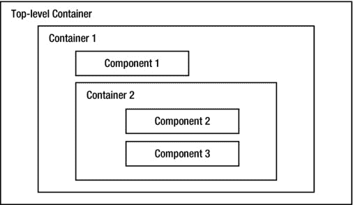

图 1-3。

Containment hierarchy in a Swing application

## 最简单的Swing程序

让我们从最简单的 Swing 程序开始。您将显示一个`JFrame`，这是一个顶级容器，其中没有任何组件。要创建并显示一个`JFrame`，您需要执行以下操作:

*   创建一个`JFrame`对象。
*   让它可见。

要创建一个`JFrame`对象，可以使用`JFrame`类的一个构造函数。其中一个构造函数接受一个字符串，该字符串将显示为`JFrame`的标题。代表 Swing 组件的类在`javax.swing`包中，同样的还有`JFrame`类。下面的代码片段创建了一个标题设置为“Simplest Swing”的`JFrame`对象:

`// Create a JFrame object`

`JFrame frame = new JFrame("Simplest Swing");`

当你创建一个`JFrame`对象时，默认情况下，它是不可见的。你需要调用它的`setVisible` `(boolean visible)`方法来使它可见。如果您将`true`传递给这个方法，`JFrame`将变得可见，如果您传递`false`，它将变得不可见。

`// Make the JFrame visible on the screen`

`frame.setVisible(true);`

这就是开发第一个 Swing 应用程序所要做的全部工作！事实上，您可以将创建和显示一个`JFrame`的两个语句包装成一个语句，如下所示:

`new JFrame("Simplest Swing").setVisible(true);`

Tip

创建一个`JFrame`并让它在`main`线程中可见并不是启动 Swing 应用程序的正确方式。但是，这对您将在这里使用的琐碎程序没有任何损害，所以我将继续使用这种方法来保持代码简单易学，这样您就可以专注于您正在学习的主题。还需要理解 Swing 中的事件处理和线程机制，才能理解为什么需要以另一种方式启动 Swing 应用程序。第 3 章详细解释了如何启动一个 Swing 应用程序。创建和显示`JFrame`的正确方法是包装 GUI 创建并使其在`Runnable`中可见，并将`Runnable`传递给`javax.swing.SwingUtilities`或`java.awt.EventQueue`类的`invokeLater()`方法，如下所示:

`import javax.swing.JFrame;`

`import javax.swing.SwingUtilities;`

...

`SwingUtilities.invokeLater(() -> new JFrame("Test").setVisible(true));`

清单 1-1 有创建和显示一个`JFrame`的完整代码。运行该程序时，在屏幕左上角显示一个`JFrame`，如图 [1-4](#Fig4) 所示。该图显示了程序在 Windows XP 上运行时的画面。在其他平台上，框架看起来可能有点不同。本章中大多数图形用户界面的截图都是在 Windows XP 上拍摄的。

清单 1-1。最简单的Swing程序

`// SimplestSwing.java`

`package com.jdojo.swing;`

`import javax.swing.JFrame;`

`public class SimplestSwing {`

`public static void main(String[] args) {`

`// Create a frame`

`JFrame frame = new JFrame("Simplest Swing");`

`// Display the frame`

`frame.setVisible(true);`

`}`

`}`

这不是很令人印象深刻，是吗？不要绝望。随着您对 Swing 的了解越来越多，您将会改进这个程序。这只是向您展示了 Swing 所提供功能的冰山一角。

您可以调整图中 [1-4](#Fig4) 所示的`JFrame`的大小，使其变大。将鼠标指针放在显示的`JFrame`的四个边(左、上、右或下)或四个角上。当您将鼠标指针放在`JFrame`的边缘时，它的形状会变成一个调整大小的指针(一条两端都有箭头的线)。然后只需拖动调整大小鼠标指针，向您想要的方向调整`JFrame`的大小。

图 1-4。

The Simplest Swing frame

图 [1-5](#Fig5) 显示了调整后的`JFrame`。注意，在创建`JFrame`时传递给构造函数的文本“Simplest Swing”显示在`JFrame`的标题栏中。

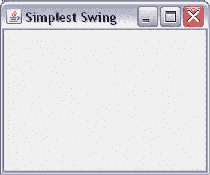

图 1-5。

The Simplest Swing frame after resizing

如何退出 Swing 应用程序？当运行清单 1-1 中列出的程序时，如何退出？当点击标题栏中的关闭按钮(标题栏上最右边带 X 的按钮)时，`JFrame`被关闭。但是，程序不会退出。如果您从命令提示符下运行该程序，当您关闭`JFrame`时，提示符不会返回。您必须强制退出该程序，例如，如果您在 Windows 上从命令提示符运行该程序，请按 Ctrl + C。那么，如何退出 Swing 应用程序呢？您可以定义一个`JFrame`的四种行为之一，以确定当`JFrame`关闭时会发生什么。它们在`javax.swing.WindowsConstants`接口中被定义为四个常量。`JFrame`类实现了`WindowsConstants`接口。您可以使用`JFrame.CONSTANT_NAME`语法引用所有这些常量(或者您可以使用`WindowsConstants.CONSTANT_NAME`语法)。这四个常数是

*   `DO_NOTHING_ON_CLOSE`:当用户关闭`JFrame`时，该选项不做任何事情。如果你为一个`JFrame`设置了这个选项，你必须提供一些其他的方法来退出应用程序，比如一个`Exit`按钮或者`JFrame`中的一个`Exit`菜单选项。
*   `HIDE_ON_CLOSE`:该选项只是在用户关闭时隐藏一个`JFrame`。这是默认行为。这就是当你点击标题栏的关闭按钮来关闭清单 1-1 中列出的程序时发生的情况。`JFrame`只是变得不可见，程序仍在运行。
*   `DISPOSE_ON_CLOSE`:该选项在用户关闭`JFrame`时隐藏并处理。处置一个`JFrame`会释放它所使用的任何操作系统级资源。注意`HIDE_ON_CLOSE`和`DISPOSE_ON_CLOSE`的区别。当您使用选项`HIDE_ON_CLOSE`时，一个`JFrame`只是被隐藏，但它仍然使用所有的操作系统资源。如果你的`JFrame`经常隐藏和显示，你可以使用这个选项。但是，如果您的`JFrame`消耗了许多资源，您可能希望使用`DISPOSE_ON_CLOSE`选项，这样资源可以在不显示时被释放和重用。
*   `EXIT_ON_CLOSE`:该选项退出应用程序。当`JFrame`关闭时，设置该选项有效，如同`System.exit()`被调用。这个选项应该小心使用。此选项将退出应用程序。如果屏幕上显示不止一个`JFrame`或任何其他类型的窗口，对一个`JFrame`使用此选项将关闭所有其他窗口。请谨慎使用此选项，因为当应用程序退出时，您可能会丢失任何未保存的数据。

您可以通过将四个常量中的一个传递给`setDefaultCloseOperation()`方法来设置`JFrame`的默认关闭行为，如下所示:

`// Exit the application when the JFrame is closed`

`frame.setDefaultCloseOperation(JFrame.EXIT_ON_CLOSE);`

你用第一个例子解决了一个问题。另一个问题是`JFrame`显示时没有可视区域。它只显示标题栏。您需要设置`JFrame`可见之前或之后的大小和位置。框架的大小由其宽度和高度(以像素为单位)来定义，您可以使用其`setSize` `(int width, int height)`方法来设置。该位置由相对于屏幕左上角的`JFrame`左上角的(x，y)坐标定义。默认情况下，它的位置被设置为(0，0)，这就是`JFrame`显示在屏幕左上角的原因。您可以使用`setLocation(int x, int y)`方法设置`JFrame`的(x，y)坐标。如果你想一步设置它的大小和位置，使用它的`setBounds(int x, int y, int width, int height)`方法。清单 1-2 在最简单的 Swing 程序中解决了这两个问题。

清单 1-2。修订的最简单Swing程序

`// RevisedSimplestSwing.java`

`package com.jdojo.swing;`

`import javax.swing.JFrame;`

`public class RevisedSimplestSwing {`

`public static void main(String[] args) {`

`// Create a frame`

`JFrame frame = new JFrame("Revised Simplest Swing");`

`// Set the default close behavior to exit the application`

`frame.setDefaultCloseOperation(JFrame.EXIT_ON_CLOSE);`

`// Set the x, y, width and height properties in one go`

`frame.setBounds(50, 50, 200, 200);`

`// Display the frame`

`frame.setVisible(true);`

`}`

`}`

Tip

您可以通过用一个`null`参数调用它的`setLocationRelativeTo()`方法来将一个`JFrame`放在中间。

## JFrame 的组件

您在前面的部分显示了一个`JFrame`。它看起来是空的；然而，它并不是真的空的。当您创建一个`JFrame`时，以下事情会自动为您完成:

*   一个称为根窗格的容器被添加为`JFrame`的唯一子元素。根窗格是一个容器。它是`JRootPane`类的一个对象。你可以通过使用`JFrame`类的`getRootPane()`方法来获得根窗格的引用。
*   名为“玻璃窗格”和“分层窗格”的两个容器被添加到根窗格中。默认情况下，玻璃窗格是隐藏的，它放置在分层窗格的顶部。顾名思义，玻璃窗格是透明的，即使你让它看得见，你也能看穿它。分层窗格之所以这样命名，是因为它可以在不同的层中容纳其他容器或组件。可选地，分层窗格可以包含菜单栏。但是，当您创建`JFrame`时，默认情况下不会添加菜单栏。你可以通过使用`JFrame`类的`getGlassPane()`和`getLayeredPane()`方法分别得到玻璃窗格和分层窗格的引用。
*   一个称为内容窗格的容器被添加到分层窗格中。默认情况下，内容窗格是空的。这是您应该添加所有 Swing 组件的容器，比如按钮、文本字段、标签等。大多数时候，您将使用`JFrame`的内容窗格。您可以通过使用`JFrame`类的`getContentPane()`方法来获取内容窗格的引用。

图 [1-6](#Fig6) 显示了 a `JFrame`的组装。根窗格、分层窗格和玻璃窗格覆盖了一个`JFrame`的整个可视区域。一个`JFrame`的可视区域是它的大小减去所有四个边上的插图。容器的 Insets 由容器四周的边框所使用的空间组成:顶部、左侧、底部和右侧。对于一个`JFrame`，顶部的插图代表标题栏的高度。图 [1-6](#Fig6) 描绘了比根窗格更小的分层窗格，以便更好地可视化。

图 1-6。

The making of a JFrame

你糊涂了吗？如果你对一个`JFrame`的所有窗格感到困惑，这里有一个更简单的解释。把一个`JFrame`想象成一个相框。一个相框有一个玻璃盖，一个玻璃格形式的`JFrame`也是如此。在玻璃罩后面，你放置你的照片。这就是你的分层窗格。您可以在一个相框中放置多张图片。每张图片将构成玻璃盖后面的一层。只要一张图片没有与另一张完全重叠，您就可以查看它的全部或部分内容。在不同图层中拍摄的所有图片构成了相框的分层窗格。离玻璃盖最远的图片图层是您的内容窗格。通常你的相框里只有一张图片。分层窗格也是如此；默认情况下，它包含一个内容窗格。画框里的画是感兴趣的内容，画放在那里。内容窗格也是如此；所有组件都放在内容窗格中。

下面列出了`JFrame`的包容层级。一个`JFrame`在层次的顶端，菜单栏(默认不添加；此处显示是为了完整性)，内容窗格位于容器层次结构的底部。

`JFrame`

`root pane`

`glass pane`

`layered pane`

`menu bar`

`content pane`

如果您仍然不能理解`JFrame`的所有“难点”(阅读窗格)，您可以稍后再看这一部分。现在，您只需要理解`JFrame`的一个窗格，那就是内容窗格，它包含了`JFrame`的 Swing 组件。您应该将所有想要添加到`JFrame`的组件添加到它的内容窗格中。您可以按如下方式获取内容窗格的引用:

`// Create a JFrame`

`JFrame frame = new JFrame("Test");`

`// Get the reference of the content pane`

`Container contentPane = frame.getContentPane();`

## 向 JFrame 添加组件

本节解释如何将组件添加到`JFrame`的内容窗格中。使用容器的`add()`方法(注意内容窗格也是一个容器)将组件添加到容器中。

`// Add aComponent to aContainer`

`aContainer.add(aComponent);`

`add()`方法被重载。除了要添加的组件之外，该方法的参数还取决于其他因素，例如您希望组件在容器中如何布局。下一节将讨论所有版本的`add()`方法。

我将把当前的讨论限制在为`JFrame`添加一个按钮上，这是一个 Swing 组件。`JButton`类的对象代表一个按钮。如果您使用过 Windows，您一定使用过按钮，如消息框上的“确定”按钮、Internet 浏览器窗口上的“后退”和“前进”按钮。通常，`JButton`包含文本，也称为标签。这就是你如何创建一个`JButton`:

`// Create a JButton with Close text`

`JButton closeButton = new JButton("Close");`

要将`closeButton`添加到`JFrame`的内容窗格中，您必须做两件事:

*   获取`JFrame`的内容窗格的引用。`Container contentPane = frame.getContentPane();`
*   调用内容窗格的`add()`方法。`contentPane.add(closeButton);`

这就是将组件添加到内容窗格的全部工作。如果您想使用一行代码添加一个`JButton`，您可以通过将所有三个语句合并成一个来实现，如下所示:

`frame.getContentPane().add(new JButton("Close"));`

向`JFrame`添加组件的代码如清单 1-3 所示。当你运行程序时，你得到一个如图 [1-7](#Fig7) 所示的`JFrame`。当你点击`Close`按钮时没有任何反应，因为你还没有给它添加任何动作。

清单 1-3。向 JFrame 添加组件

`// AddingComponentToJFrame.java`

`package com.jdojo.swing;`

`import javax.swing.JFrame;`

`import javax.swing.JButton;`

`import java.awt.Container;`

`public class AddingComponentToJFrame {`

`public static void main(String[] args) {`

`JFrame frame = new JFrame("Adding Component to JFrame");`

`frame.setDefaultCloseOperation(JFrame.EXIT_ON_CLOSE);`

`Container contentPane = frame.getContentPane();`

`// Add a close button`

`JButton closeButton = new JButton("Close");`

`contentPane.add(closeButton);`

`// set the size of the frame 300 x 200`

`frame.setBounds(50, 50, 300, 200);`

`frame.setVisible(true);`

`}`

`}`

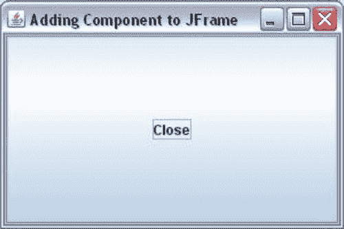

图 1-7。

A JFrame with a JButton with Close as its text

代码完成了向`JFrame`添加带有`Close`文本的`JButton`的工作。然而，`JButton`看起来非常大，它占据了`JFrame`的整个可视区域。请注意，您已经使用`setBounds()`方法将`JFrame`的大小设置为 300 像素宽和 200 像素高。因为`JButton`填满了整个`JFrame`，你能把`JFrame`的尺寸设置的小一点吗？或者，你能为`JButton`本身设置尺寸吗？这两种建议在这种情况下都行不通。如果你想让`JFrame`变小，你需要猜测它需要变小多少。如果你想为`JButton`设置大小，它会惨败；`JButton`将始终填充`JFrame`的整个可视区域。这是怎么回事？要完全理解正在发生的事情，您需要阅读下一节关于布局管理器的内容。

Swing 为计算`JFrame`和`JButton`的大小提供了一个神奇而快速的解决方案。`JFrame`类的`pack()`方法就是那个神奇的解决方案。该方法检查您添加到`JFrame`中的所有组件，决定它们的首选大小，并将`JFrame`的大小设置为刚好足以显示所有组件。当你调用这个方法时，你不需要设置`JFrame`的大小。`pack()`方法将计算`JFrame`的大小并为您设置。要修复大小调整问题，请移除对`setBounds()`方法的调用，并添加对`pack()`方法的调用。注意，`setBounds()`方法也为`JFrame`设置了(x，y)坐标。如果还想将`JFrame`的(x，y)坐标设置为(50，50)，可以使用它的`setLocation(50, 50)`方法。清单 1-4 包含修改后的代码，图 [1-8](#Fig8) 显示了结果`JFrame`。

清单 1-4。打包 JFrame 的所有组件

`// PackedJFrame.java`

`package com.jdojo.swing;`

`import javax.swing.JFrame;`

`import java.awt.Container;`

`import javax.swing.JButton;`

`public class PackedJFrame {`

`public static void main(String[] args) {`

`JFrame frame = new JFrame("Adding Component to JFrame");`

`frame.setDefaultCloseOperation(JFrame.EXIT_ON_CLOSE);`

`// Add a close button`

`JButton closeButton = new JButton("Close");`

`Container contentPane = frame.getContentPane();`

`contentPane.add(closeButton);`

`// Calculates and sets appropriate size for the frame`

`frame.pack();`

`frame.setVisible(true);`

`}`

`}`

图 1-8。

Packed JFrame with a JButton

到目前为止，您已经成功地将一个`JButton`添加到一个`JFrame`中。让我们在同一个`JFrame`上再加一个`JButton`。把这个新按钮叫做`helpButton`。代码将类似于清单 1-4，除了这次您将添加两个`JButton`类的实例。清单 1-5 包含了完整的程序。图 [1-9](#Fig9) 显示了运行程序时的结果。

清单 1-5。向 JFrame 添加两个按钮

`// JFrameWithTwoJButtons.java`

`package com.jdojo.swing;`

`import javax.swing.JFrame;`

`import java.awt.Container;`

`import javax.swing.JButton;`

`public class JFrameWithTwoJButtons {`

`public static void main(String[] args) {`

`JFrame frame = new JFrame("Adding Component to JFrame");`

`frame.setDefaultCloseOperation(JFrame.EXIT_ON_CLOSE);`

`// Add two buttons - Close and Help`

`JButton closeButton = new JButton("Close");`

`JButton helpButton = new JButton("Help");`

`Container contentPane = frame.getContentPane();`

`contentPane.add(closeButton);`

`contentPane.add(helpButton);`

`frame.pack();`

`frame.setVisible(true);`

`}`

`}`

图 1-9。

A JFrame with two buttons: Close and Help. Only the Help button is visible

当您添加了`Help`按钮时，您丢失了`Close`按钮。这是否意味着你只能给一个`JFrame`添加一个按钮？答案是否定的。你可以给一个`JFrame`添加任意多的按钮。那么，你的`Close`按钮在哪里？在我回答这个问题之前，您需要理解内容窗格的布局机制。

内容窗格是一个容器。你给它添加组件。但是，它将布局所有组件的任务交给了一个称为布局管理器的对象。布局管理器只是一个 Java 对象，它唯一的工作就是确定容器中组件的位置和大小。清单 1-5 中的例子是精心挑选的，目的是向您介绍布局管理器的概念。存在许多类型的布局管理器。它们在容器内放置组件和确定组件大小的方式不同。

默认情况下，`JFrame`的内容窗格使用一个名为`BorderLayout`的布局管理器。由于`BorderLayout`布局组件的方式，在前面的例子中只显示了`Help`按钮。事实上，当您添加两个按钮时，内容窗格会收到这两个按钮。为了确认这两个按钮仍然在内容窗格中，在清单 1-5 中的`main()`方法的末尾添加下面的代码片段，它显示了内容窗格拥有的组件的数量。它将在标准输出上打印一条消息:`"Content Pane has 2 components."`每个容器都有一个`getComponents()`方法，该方法返回添加到其中的组件数组。

`// Get the components added to the content pane`

`Component[] comps = contentPane.getComponents();`

`// Display how many components the content pane has`

`System.out.println("Content Pane has " + comps.length + " components.");`

有了这个背景，是时候学习各种版面管理器了。当我在后面的部分讨论`BorderLayout`管理器时，您将解决丢失`Close`按钮的难题。但是在讨论各种布局管理器之前，我将向您介绍一些在使用 Swing 应用程序时经常使用的实用程序类。

Tip

一个组件一次只能添加到一个容器中。如果将同一个组件添加到另一个容器中，该组件将从第一个容器中移除并添加到第二个容器中。

## 一些实用程序类

在开始开发一些严肃的 Swing GUIs 之前，有必要提一下一些经常使用的实用程序类。它们是简单的类。它们中的大多数都有一些可以在构造函数中指定的属性，并且有这些属性的 getters 和 setters。

### 点类

顾名思义，`Point`类的对象表示二维空间中的一个位置。二维空间中的位置由两个值表示:x 坐标和 y 坐标。`Point`级在`java.awt`包里。下面的代码片段演示了它的用法:

`// Create an object of the Point class with (x, y) coordinate of (20, 40)`

`Point p = new Point(20, 40);`

`// Get the x and y coordinate of p`

`int x = p.getX();`

`int y = p.getY();`

`// Set the x and y coordinate of p to (10, 60)`

`p.setLocation(10, 60);`

Swing 中的`Point`类的主要用途是设置和获取组件的位置(x 和 y 坐标)。例如，您可以设置一个`JButton`的位置。

`JButton closeButton = new JButton("Close");`

`// The following two statements do the same thing.`

`// You will use one of the following statements and not both.`

`closeButton.setLocation(10, 15);`

`closeButton.setLocation(new Point(10, 15));`

`// Get the location of the closeButton`

`Point p = closeButton.getLocation();`

### 维度类

一个`Dimension`类的对象包装了一个组件的`width`和`height`。部件的`width`和`height`统称为其尺寸。换句话说，`Dimension`类的一个对象被用来表示一个组件的大小。您可以使用`Dimension`类的对象包装任意两个整数。然而，在这一章中，它将被用在组件大小的上下文中。这个类在`java.awt`包里。

`// Create an object of the Dimension class with a width and height of 200 and 20`

`Dimension d  = new Dimension(200, 20);`

`// Set the size of closeButton to 200 X 20\. Both of the statements have the same efecct.`

`// You will use one of the following two statements.`

`closeButton.setSize(200, 20);`

`closeButton.setsize(d);`

`// Get the size of closeButton`

`Dimension d2 = closeButton.getSize();`

`int width = d2.width;`

`int height = d2.height;`

### Insets 类

`Insets`类的对象表示容器周围的空间。它包装了四个名为`top`、`left`、`bottom`和`right`的属性。它们的值表示容器四边的剩余空间。班级在`java.awt`包里。

`// Create an object of the Insets class`

`// using its constructor Insets(top, left, bottom, right)`

`Insets ins = new Insets(20, 5, 5, 5);`

`// Get the insets of a JFrame`

`Insets ins = frame.getInsets();`

`int top = ins.top;`

`int left = ins.left;`

`int bottom = ins.bottom;`

`int right = ins.right;`

### 矩形类

顾名思义，`Rectangle`类的一个实例代表一个矩形。在`java.awt`包里。你可以用许多方法定义一个矩形。一个`Rectangle`由三个属性定义:

*   左上角的(x，y)坐标
*   宽度
*   高度

你可以把一个`Rectangle`对象想象成一个`Point`对象和一个`Dimension`对象的组合；`Point`对象保存左上角的(x，y)坐标，`Dimension`对象保存宽度和高度。您可以通过指定属性的不同组合来创建一个`Rectangle`类的对象。

`// Create a Rectangle object whose upper-left corner is at (0, 0)`

`// with width and height as zero`

`Rectangle r1 = new Rectangle();`

`// Create a Rectangle object from a Point object with its width and height as zero`

`Rectangle r2 = new Rectangle(new Point(10, 10));`

`// Create a Rectangle object from a Point object and a Dimension object`

`Rectangle r3 = new Rectangle(new Point(10, 10), new Dimension(200, 100));`

`// Create a Rectangle object by specifying its upper-left corner's`

`// coordinate at (10, 10) and width as 200 and height as 100`

`Rectangle r4 = new Rectangle(10, 10, 200, 100);`

`Rectangle`类定义了许多方法来操作`Rectangle`对象并查询其属性，例如左上角的(x，y)坐标、宽度和高度。

`Rectangle`类的对象定义了 Swing 应用程序中组件的位置和大小。组件的位置和大小被称为它的边界。两个方法，`setBounds()`和`getBounds()`，可以用来设置和获取任何组件或容器的边界。`setBounds()`方法是重载的，您可以指定组件或`Rectangle`对象的 x、y、宽度和高度属性。`getBounds()`方法返回一个`Rectangle`对象。在清单 1-2 中，您使用了`setBounds()`方法来设置框架的 x、y、宽度和高度。请注意，组件的“边界”是其位置和大小的组合。`setLocation()`和`setSize()`方法的组合将实现与`setBounds()`方法相同的功能。同样，你也可以用`getLocation()` (or，`getX()`和`getY()`)和`getSize()` (or，`getWidth()`和`getHeight()`)的组合来代替使用`getBounds()`的方法。

## 布局经理

容器使用布局管理器来计算其所有组件的位置和大小。换句话说，布局管理器的工作是计算容器中所有组件的四个属性(x、y、宽度和高度)。x 和 y 属性确定组件在容器中的位置。宽度和高度属性决定组件的大小。您可能会问，“为什么需要布局管理器来执行计算组件的四个属性的简单任务？难道不能在程序中指定这四个属性，让容器用它们来显示组件吗？”答案是肯定的。您可以在程序中指定这些属性。如果这样做，当调整容器大小时，组件将不会重新定位和调整大小。此外，您必须为您的应用程序将在其上运行的所有平台指定组件的大小，因为不同的平台呈现的组件略有不同。假设您的应用程序以多种语言显示文本。一个`JButton`，比如一个`Close`按钮的最佳大小，在不同的语言中是不同的，你必须计算每种语言中`Close`按钮的大小，并根据应用程序使用的语言进行设置。但是，如果您使用布局管理器，则不必考虑所有这些因素。布局管理器将为您做这些简单但耗时的事情。

使用布局管理器是可选的。如果不使用布局管理器，则需要负责计算和设置容器中所有组件的位置和大小。

从技术上讲，布局管理器是一个实现了`LayoutManager`接口的 Java 类的对象。从`LayoutManager`接口继承了另一个名为`LayoutManager2`的接口。一些布局管理器类实现了`LayoutManager2`接口。两个接口都在`java.awt`包里。

布局管理器有很多。一些布局管理器很简单，易于手工编码。有些手工编码非常复杂，应该由 NetBeans 之类的 GUI 构建工具来使用。如果没有可用的布局管理器满足您的需求，您可以创建自己的布局管理器。一些有用的布局管理器可以在互联网上免费获得。有时你需要嵌套它们来获得想要的效果。我将在本节讨论以下布局管理器:

*   `FlowLayout`
*   `BorderLayout`
*   `CardLayout`
*   `BoxLayout`
*   `GridLayout`
*   `GridBagLayout`
*   `GroupLayout`
*   `SpringLayout`

每个容器都有一个默认的布局管理器。一个`JFrame`的内容窗格的默认布局管理器是`BorderLayout`，对于一个`JPanel`，它是`FlowLayout`。它是在创建容器时设置的。您可以通过使用容器的`setLayout()`方法来更改容器的默认布局管理器。如果不希望容器使用布局管理器，可以将`null`传递给`setLayout()`方法。您可以使用容器的`getLayout()`方法来获取容器当前使用的布局管理器的引用。

`// Set FlowLayout as the layout manager for the content pane of a JFrame`

`JFrame frame = new JFrame("Test Frame");`

`Container contentPane = frame.getContentPane();`

`contentPane.setLayout(new FlowLayout());`

`// Set BorderLayout as the layout manager for a JPanel`

`JPanel panel = new JPanel();`

`panel.setLayout(new BorderLayout());`

`// Get the layout manager for a container`

`LayoutManager layoutManager = container.getLayout()`

从 Java 5 开始，对`JFrame`上的`add()`和`setLayout()`方法的调用被转发到它的内容窗格。在 Java 5 之前，在`JFrame`上调用这些方法会抛出运行时异常。也就是说，在 Java 5 中，这两个调用`frame.setLayout()`和`frame.add()`将与调用`frame.getContentPane().setLayout()`和`frame.getContentPane().add()`做同样的事情。注意到`JFrame`的`getLayout()`方法返回的是`JFrame`的布局管理器，而不是它的内容窗格，这一点非常重要。为了避免从`JFrame`到其内容窗格的不对称调用转移(一些调用被转移，一些不被转移)的麻烦，最好直接调用内容窗格的方法，而不是在`JFrame`上调用它们。

### flow layout-流程配置

`FlowLayout`是 Swing 中最简单的布局管理器。它先水平布局组件，然后垂直布局。它按照组件被添加到容器的顺序放置组件。当水平放置组件时，可以从左到右或从右到左放置。水平布局方向取决于容器的方向。您可以通过调用容器的`setComponentOrientation()`方法来设置容器的方向。如果你想设置一个容器及其所有子容器的方向，你可以使用`applyComponentOrientation()`方法。下面是设置容器方向的一段代码:

`// Method – 1`

`// Set the orientation of the content pane of a frame to "right to left"`

`JFrame frame = new JFrame("Test");`

`Container pane = frame.getContentPane();`

`pane.setComponentOrientation(ComponentOrientation.RIGHT_TO_LEFT);`

`// Method – 2`

`// Set the orientation of the content pane and all its children to "right to left"`

`JFrame frame = new JFrame("Test");`

`Container pane = frame.getContentPane();`

`pane.applyComponentOrientation(ComponentOrientation.RIGHT_TO_LEFT);`

如果您的应用程序是多语言的，并且组件方向将在运行时决定，您可能希望以一种更通用的方式来设置组件的区域设置和方向，而不是在您的程序中对其进行硬编码。您可以为应用程序中的所有 Swing 组件全局设置默认语言环境，如下所示:

`// "ar" is used for Arabic locale`

`JComponent.setDefaultLocale(new Locale("ar"));`

当您创建一个`JFrame`时，您可以根据默认的区域设置获取组件的方向，并将其设置为框架及其子框架。这样，您不必为应用程序中的每个容器设置方向。

`// Get the default locale`

`Locale defaultLocale = JComponent.getDefaultLocale();`

`// Get the component's orientation for the default locale`

`ComponentOrientation componentOrientation = ComponentOrientation.getOrientation(defaultLocale);`

`// Apply the component's default orientation for the whole frame`

`frame.applyComponentOrientation(componentOrientation);`

A `FlowLayout`试图将所有组件放入一行，给它们自己喜欢的大小。如果一行中容纳不下所有组件，它将开始另一行。每个布局管理器都必须计算它需要布置所有组件的空间的高度和宽度。A `FlowLayout`要求宽度，这是所有组件的首选宽度之和。它要求高度，即容器中最高组件的高度。它为宽度和高度增加了额外的空间，以考虑组件之间的水平和垂直间隙。清单 1-6 展示了如何为`JFrame`的内容窗格使用`FlowLayout`。它向内容窗格添加了三个按钮。图 [1-10](#Fig10) 显示了使用`FlowLayout`的三按钮屏幕。

清单 1-6。使用流程布局管理器

`// FlowLayoutTest.java`

`package com.jdojo.swing;`

`import java.awt.Container;`

`import java.awt.FlowLayout;`

`import javax.swing.JButton;`

`import javax.swing.JFrame;`

`public class FlowLayoutTest {`

`public static void main(String[] args) {`

`JFrame frame = new JFrame("Flow Layout Test");`

`frame.setDefaultCloseOperation(JFrame.EXIT_ON_CLOSE);`

`Container contentPane = frame.getContentPane();`

`contentPane.setLayout(new FlowLayout());`

`for(int i = 1; i <= 3; i++) {`

`contentPane.add(new JButton("Button " + i));`

`}`

`frame.pack();`

`frame.setVisible(true);`

`}`

`}`

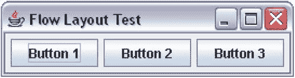

图 1-10。

Three buttons in a JFrame with a FlowLayout Manager

当水平展开框架时，按钮显示如图 [1-11](#Fig11) 所示。

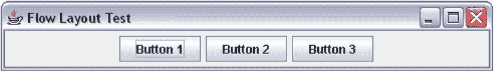

图 1-11。

After the JFrame using a FlowLatout has been expanded horizontally

默认情况下，`FlowLayout`将所有组件在容器中心对齐。您可以通过调用其`setAlignment`()方法或在其构造函数中传递对齐来更改对齐，如下所示:

`// Set the alignment when you create the layout manager object`

`FlowLayout flowLayout = new FlowLayout(FlowLayout.RIGHT);`

`// Set the alignment after you have created the flow layout manager`

`flowLayout.setAlignment(FlowLayout.RIGHT);`

在`FlowLayout`类中定义了以下五个常数来表示五种不同的对齐:`LEFT`、`RIGHT`、`CENTER`、`LEADING`和`TRAILING`。前三个常数的定义是显而易见的。`LEADING`对准可以是左对准也可以是右对准；这取决于组件的方向。如果组件的方向是`RIGHT_TO_LEFT`，则`LEADING`对准表示`RIGHT`。如果组件的方向是`LEFT_TO_RIGHT`，则`LEADING`对准表示`LEFT`。类似地，`TRAILING`对齐可能意味着向左或向右。如果组件的方向是`RIGHT_TO_LEFT`，则`TRAILING`对准表示`LEFT`。如果组件的方向是`LEFT_TO_RIGHT`，则`TRAILING`对准表示`RIGHT`。使用`LEADING`和`TRAILING`而不是`RIGHT`和`LEFT`总是一个好主意，所以你不必担心你的组件的方向。

你可以在`FlowLayout`类的构造函数中或者使用它的`setHgap()`和`setVgap()`方法来设置两个组件之间的间隙。清单 1-7 给出了向一个`JFrame`添加三个按钮的完整代码。内容窗格使用带有`LEADING`对齐的`FlowLayout`，并且`JFrame's`方向设置为`RIGHT_TO_LEFT`。运行程序时，`JFrame`将如图 [1-12](#Fig12) 所示。

清单 1-7。自定义流程布局

`// FlowLayoutTest2.java`

`package com.jdojo.swing;`

`import java.awt.ComponentOrientation;`

`import java.awt.Container;`

`import java.awt.FlowLayout;`

`import javax.swing.JButton;`

`import javax.swing.JFrame;`

`public class FlowLayoutTest2 {`

`public static void main(String[] args) {`

`int horizontalGap = 20;`

`int verticalGap = 10;`

`JFrame frame = new JFrame("Flow Layout Test");`

`frame.setDefaultCloseOperation(JFrame.EXIT_ON_CLOSE);`

`Container contentPane = frame.getContentPane();`

`FlowLayout flowLayout =`

`new FlowLayout(FlowLayout.LEADING, horizontalGap, verticalGap);`

`contentPane.setLayout(flowLayout);`

`frame.applyComponentOrientation(`

`ComponentOrientation.RIGHT_TO_LEFT);`

`for(int i = 1; i <= 3; i++) {`

`contentPane.add(new JButton("Button " + i));`

`}`

`frame.pack();`

`frame.setVisible(true);`

`}`

`}`

图 1-12。

A JFrame having three buttons and a customized FlowLayout

你必须记住，一个`FlowLayout`试图将所有的组件仅排列在一行中。因此，它不要求适合所有组件的高度。相反，它要求容器中最高组件的高度。为了演示这一微妙之处，尝试在`JFrame`中添加 30 个按钮，这样它们就不在一行中。以下代码片段演示了这一点:

`JFrame frame = new JFrame("Welcome to Swing");`

`frame.setDefaultCloseOperation(JFrame.EXIT_ON_CLOSE);`

`frame.getContentPane().setLayout(new FlowLayout());`

`for(int i = 1; i <= 30; i++) {`

`frame.getContentPane().add(new JButton("Button " + i));`

`}`

`frame.pack();`

`frame.setVisible(true);`

`JFrame`如图 [1-13](#Fig13) 所示。您可以看到 30 个按钮并没有全部显示出来。如果您调整`JFrame`的大小，使其高度变大，您将能够看到所有按钮，如图 [1-14](#Fig14) 所示。`FlowLayout`隐藏了不能在一行中显示的组件。

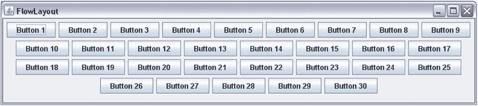

图 1-14。

A JFrame with 30 buttons after it is resized

图 1-13。

A JFrame with 30 buttons. Not all buttons are displayed

`FlowLayout`的特性有一个非常重要的含义，它试图在一行中布局所有组件。它要求高度刚好能够显示最高的组件。如果您将一个带有`FlowLayout`管理器的容器嵌套在另一个也使用`FlowLayout`管理器的容器中，您将永远不会在嵌套的容器中看到多于一行。为了演示这一点，向一个`JPanel`添加 30 个`JButton`实例。一个`JPanel`是一个空容器，默认布局管理器是一个`FlowLayout`。将`JFrame`的内容窗格的布局管理器设置为`FlowLayout`，并将`JPanel`添加到`JFrame`的内容窗格。通过这种方式，您可以将带有`FlowLayout`的容器`JPanel`嵌套在另一个带有`FlowLayout`的容器(内容窗格)中。清单 1-8 包含了演示这一点的完整程序。当运行程序时，产生的`JFrame`如图 [1-15](#Fig15) 所示。即使您调整`JFrame`的大小使其高度变大，您也只能看到一行按钮。

清单 1-8。嵌套流程布局管理器

`// FlowLayoutNesting.java`

`package com.jdojo.swing;`

`import java.awt.FlowLayout;`

`import javax.swing.JButton;`

`import javax.swing.JFrame;`

`import javax.swing.JPanel;`

`public class FlowLayoutNesting {`

`public static void main(String[] args) {`

`JFrame frame = new JFrame("FlowLayout Nesting");`

`frame.setDefaultCloseOperation(JFrame.EXIT_ON_CLOSE);`

`// Set the content pane's layout to FlowLayout`

`frame.getContentPane().setLayout(new FlowLayout());`

`// JPanel is an empty container with a FlowLayout manager`

`JPanel panel = new JPanel();`

`// Add thirty JButtons to the JPanel`

`for(int i = 1; i <= 30; i++) {`

`panel.add(new JButton("Button " + i));`

`}`

`// Add JPanel to the content pane`

`frame.getContentPane().add(panel);`

`frame.pack();`

`frame.setVisible(true);`

`}`

`}`

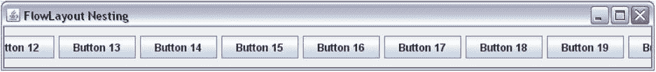

图 1-15。

A nested FlowLayout always display only one row

我想在结束关于`FlowLayout`的讨论时指出，由于本节讨论的限制，它在现实应用中的使用非常有限。它通常用于原型制作。

### 边界布局

将集装箱的空间分为五个区域:北、南、东、西、中。当您向带有`BorderLayout`的容器添加组件时，您需要指定您想要将组件添加到五个区域中的哪一个。`BorderLayout`类定义了五个常量来标识这五个区域中的每一个。常量有`NORTH`、`SOUTH`、`EAST`、`WEST`和`CENTER`。例如，要在北部区域添加一个按钮，您可以编写

`// Add a button to the north area of the container`

`JButton northButton = new JButton("North");`

`container.add(northButton, BorderLayout.NORTH);`

一个`JFrame`的内容窗格的默认布局是一个`BorderLayout`。清单 1-9 包含了向`JFrame`的内容窗格添加五个按钮的完整程序。得到的`JFrame`如图 [1-16](#Fig16) 所示。

清单 1-9。向 BorderLayout 添加组件

`// BorderLayoutTest.java`

`package com.jdojo.swing;`

`import java.awt.BorderLayout;`

`import javax.swing.JFrame;`

`import java.awt.Container;`

`import javax.swing.JButton;`

`public class BorderLayoutTest {`

`public static void main(String[] args) {`

`JFrame frame = new JFrame("BorderLayout Test");`

`frame.setDefaultCloseOperation(JFrame.EXIT_ON_CLOSE);`

`Container container = frame.getContentPane();`

`// Add a button to each of the five areas of the BorderLayout`

`container.add(new JButton("North"), BorderLayout.NORTH);`

`container.add(new JButton("South"), BorderLayout.SOUTH);`

`container.add(new JButton("East"), BorderLayout.EAST);`

`container.add(new JButton("West"), BorderLayout.WEST);`

`container.add(new JButton("Center"), BorderLayout.CENTER);`

`frame.pack();`

`frame.setVisible(true);`

`}`

`}`

图 1-16。

Five areas of the BorderLayout

您最多可以将一个组件添加到`BorderLayout`的一个区域。你可以留下一些空白区域。如果您想在一个`BorderLayout`的区域中添加多个组件，您可以通过将这些组件添加到一个容器中，然后将该容器添加到所需的区域中。

一个`BorderLayout (`中的五个区域(北、南、东、西、中)的方向是固定的，不依赖于组件的方向。还有四个常量用于指定`BorderLayout`中的区域。这些常量是`PAGE_START`、`PAGE_END`、`LINE_START`和`LINE_END`。`PAGE_START`和`PAGE_END`常量分别与`NORTH`和`SOUTH`常量相同。`LINE_START`和`LINE_END`常量根据容器的方向改变它们的位置。如果容器的方向是从左向右，`LINE_START`与`WEST`相同，`LINE_END`与`EAST`相同。如果容器的方向是从右向左，`LINE_START`与`EAST`相同，`LINE_END`与`WEST`相同。图 [1-17](#Fig17) 和图 [1-18](#Fig18) 描绘了`BorderLayout`不同组件方向区域的定位差异。

图 1-18。

A BorderLayout’s areas when the container’s orientation is right to left

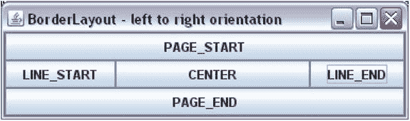

图 1-17。

A BorderLayout’s areas when the container’s orientation is left to right

如果不指定组件的区域，它将被添加到中心。以下两个语句具有相同的效果:

`// Assume that the container has a BorderLayout`

`// Add a button to the container without specifying the area`

`container.add(new JButton("Close"));`

`// The above statement is the same as the following`

`container.add(new JButton("Close"), BorderLayout.CENTER);`

我已经说过，你最多可以给一个`BorderLayout`添加五个组件，五个区域各一个。如果在一个`BorderLayout`的相同区域添加多个组件会发生什么？也就是说，如果您编写以下代码，会发生什么情况？

`// Assume that container has a BorderLayout`

`container.add(new JButton("Close"), BorderLayout.NORTH);`

`container.add(new JButton("Help"), BorderLayout.NORTH);`

你会发现`BorderLayout`的北部区域只显示了一个按钮:最后添加的那个按钮。也就是说，北部区域只会显示`Help`按钮。这就是清单 1-5 中发生的事情。您在`JFrame`的内容窗格中添加了两个按钮`Close`和`Help`。由于您没有指定要添加它们的`BorderLayout`的区域，所以它们都被添加到中心区域。由于在`BorderLayout`的每个区域只能有一个组件，所以`Help`按钮取代了`Close`按钮。这就是当您运行清单 1-5 中的程序时没有看到`Close`按钮的原因。若要解决此问题，请在将两个按钮添加到容器时指定它们的区域。

Tip

如果您在一个`BorderLayout`托管容器中缺少一些组件，请确保您没有在同一区域添加多个组件。如果将组件添加到混合面积常数的`BorderLayout`中，`PAGE_START`、`PAGE_END`、`LINE_START`和`LINE_END`常数优先于`NORTH`、`SOUTH`、`EAST`和`WEST`常数。也就是说，如果使用`add(c1, NORTH)`和`add(c2, PAGE_START)`将两个组件添加到一个`BorderLayout`中，将使用`c2`，而不是`c1`。

a `BorderLayout`如何计算组件的大小？它根据组件放置的区域计算组件的大小。它考虑了组件在南北方向的首选高度。但是，它会根据南北方向的可用空间水平拉伸组件的宽度。也就是说，它不考虑南北向组件的首选宽度。它考虑了东西两侧组件的首选宽度，并赋予它们垂直填充整个空间所需的高度。中心区域的组件水平和垂直拉伸，以适应可用空间。也就是说，中心区域不考虑其组件的首选宽度和高度。

### 菜单布局

`CardLayout`将容器中的组件排列成一叠卡片。就像一叠卡片一样，在一个`CardLayout`中只有一张卡片(最上面的卡片)是可见的。它一次只能显示一个组件。你需要使用以下步骤来为一个容器使用一个`CardLayout`:

*   创建一个容器，比如一个`JPanel`。`JPanel cardPanel = new JPanel();`
*   创建一个`CardLayout`对象。`CardLayout cardLayout = new CardLayout();`
*   为容器设置布局管理器。`cardPanel.setLayout(cardLayout);`
*   向容器中添加组件。您需要为每个组件命名。要给`cardPanel`添加一个`JButton`，使用下面的语句:`cardPanel.add(new JButton("Card 1"), "myLuckyCard");`你已经将你的卡命名为`myLuckyCard`。这个名字可以在`CardLayout`的`show()`方法中使用，使这张卡可见。
*   调用它的`next()`方法来显示下一张卡片。`cardLayout.next(cardPanel);`

`CardLayout`类提供了几种翻转组件的方法。默认情况下，它显示添加到其中的第一个组件。所有翻转相关的方法都将它管理的容器作为其参数。`first()`和`last()`方法分别显示第一张和最后一张卡片。`previous()`和`next()`方法显示当前显示的卡片中的上一张和下一张卡片。如果显示最后一张牌，调用`next()`方法显示第一张牌。如果显示第一张牌，调用`previous()`方法显示最后一张牌。

清单 1-10 演示了如何使用一个`CardLayout`。图 [1-19](#Fig19) 显示了结果`JFrame`。当你点击`Next`按钮时，下一张牌被翻转。程序将两个 JPanels 添加到`JFrame`的内容窗格中。一个`JPanel`、`buttonPanel`有`Next`按钮，它被添加到内容窗格的南部区域。注意，默认情况下，`JPanel`使用`FlowLayout`。

清单 1-10。CardLayout 的实际应用

`// CardLayoutTest.java`

`package com.jdojo.swing;`

`import java.awt.Container;`

`import javax.swing.JFrame;`

`import java.awt.CardLayout;`

`import javax.swing.JPanel;`

`import javax.swing.JButton;`

`import java.awt.Dimension;`

`import java.awt.BorderLayout;`

`public class CardLayoutTest {`

`public static void main(String[] args) {`

`JFrame frame = new JFrame("CardLayout Test");`

`frame.setDefaultCloseOperation(JFrame.EXIT_ON_CLOSE);`

`Container contentPane = frame.getContentPane();`

`// Add a Next JButton in a JPanel to the content pane`

`JPanel buttonPanel = new JPanel();`

`JButton nextButton = new JButton("Next");`

`buttonPanel.add(nextButton);`

`contentPane.add(buttonPanel, BorderLayout.SOUTH);`

`// Create a JPanel and set its layout to CardLayout`

`final JPanel cardPanel = new JPanel();`

`final CardLayout cardLayout = new CardLayout();`

`cardPanel.setLayout(cardLayout);`

`// Add five JButtons as cards to the cardPanel`

`for(int i = 1; i <= 5; i++) {`

`JButton card = new JButton("Card " + i);`

`card.setPreferredSize(new Dimension(200, 200));`

`String cardName = "card" + 1;`

`cardPanel.add(card, cardName);`

`}`

`// Add the cardPanel to the content pane`

`contentPane.add(cardPanel, BorderLayout.CENTER);`

`// Add an action listener to the Next button`

`nextButton.addActionListener(e -> cardLayout.next(cardPanel));`

`frame.pack();`

`frame.setVisible(true);`

`}`

`}`

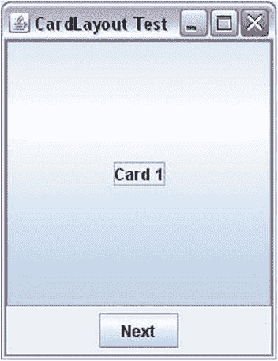

图 1-19。

A CardLayout in action. Click the Next JButton to flip through the cards

程序向`Next`按钮添加一个动作监听器。我还没有讨论如何给按钮添加一个动作监听器。有必要看看`CardLayout`的行动。我将在事件处理部分详细讨论如何向按钮添加动作。现在，只需要提到您需要调用`JButton`类的`addActionListener()`方法来添加一个动作监听器就足够了。这个方法接受一个类型为`ActionListener`接口的对象，并有一个名为`actionPerformed()`的方法。当你点击`JButton`时，执行`actionPerformed()`方法中的代码。翻转下一张牌的代码是对`cardLayout.next(cardPanel)`方法的调用。`ActionListener`接口是一个函数接口，您可以使用 lambda 表达式来创建它的实例，如下所示:

`// Add an action listener to the Next JButton to flip the next card`

`nextButton.addActionListener(e -> cardLayout.next(cardPanel));`

Tip

因为除了一个组件之外，其他组件对用户来说都是隐藏的，所以不经常使用。更容易使用的`JTabbedPane`提供了类似于`CardLayout`的功能。我将在第二章的[中讨论`JTabbedPane`。一个`JTabbedPane`是一个容器，不是一个布局管理器。它将所有组件以选项卡的形式布局，并允许用户在这些选项卡之间切换。](02.html)

### box layout-方块配置

`BoxLayout`将组件水平排列成一行或垂直排列成一列。您需要使用以下步骤在您的程序中使用一个`BoxLayout`:

*   创建一个容器，例如一个`JPanel`。`JPanel hPanel = new JPanel();`
*   创建一个`BoxLayout`类的对象。与其他布局管理器不同，您需要将容器传递给类的构造函数。您还需要将正在创建的盒子的类型(水平或垂直)传递给它的构造函数。该类有四个常量:`X_AXIS`、`Y_AXIS`、`LINE_AXIS`和`PAGE_AXIS`。常量`X_AXIS`用于创建一个水平`BoxLayout`，从左到右排列所有组件。常量`Y_AXIS`用于创建一个从上到下布局所有组件的垂直`BoxLayout`。另外两个常量`LINE_AXIS`和`PAGE_AXIS`与`X_AXIS`和`Y_AXIS`类似。但是，他们在布局组件时使用容器的方向。`// Create a BoxLayout for hPanel to lay out` `// components from left to right` `BoxLayout boxLayout = new BoxLayout(hPanel, BoxLayout.X_AXIS);`
*   设置容器的布局。`hPanel.setLayout(boxLayout);`
*   将组件添加到容器中。`hPanel.add(new JButton("Button 1"));` `hPanel.add(new JButton("Button 2"));`

清单 1-11 使用一个水平`BoxLayout`来显示三个按钮，如图 [1-20](#Fig20) 所示。

清单 1-11。使用水平方框布局

`// BoxLayoutTest.java`

`package com.jdojo.swing;`

`import java.awt.Container;`

`import javax.swing.JFrame;`

`import javax.swing.JButton;`

`import javax.swing.JPanel;`

`import javax.swing.BoxLayout;`

`import java.awt.BorderLayout;`

`public class BoxLayoutTest {`

`public static void main(String[] args) {`

`JFrame frame = new JFrame("BoxLayout Test");`

`frame.setDefaultCloseOperation(JFrame.EXIT_ON_CLOSE);`

`Container contentPane = frame.getContentPane();`

`JPanel hPanel = new JPanel();`

`BoxLayout boxLayout = new BoxLayout(hPanel, BoxLayout.X_AXIS);`

`hPanel.setLayout(boxLayout);`

`for(int i = 1; i <= 3; i++) {`

`hPanel.add(new JButton("Button " + i));`

`}`

`contentPane.add(hPanel, BorderLayout.SOUTH);`

`frame.pack();`

`frame.setVisible(true);`

`}`

`}`

图 1-20。

A JFrame with a horizontal BoxLayout with three buttons

A `BoxLayout`试图给水平布局中的所有组件提供优选的宽度，给垂直布局中的所有组件提供优选的高度。在水平布局中，最高组件的高度给定给所有其他组件。如果它无法调整组件的高度以匹配组中最高的组件，它会将组件沿中心水平对齐。您可以通过使用`setAlignmentY()`方法设置组件对齐或容器对齐来更改这个默认对齐。在垂直布局中，它试图为所有组件提供首选高度，并试图使所有组件的大小与最宽组件的宽度相同。如果它不能使所有组件具有相同的宽度，它会沿着它们的中心线垂直对齐它们。您可以通过使用`setAlignmentX()`方法改变组件的对齐或者容器的对齐来改变这个默认的对齐。

`javax.swing`包包含一个`Box`类，使得使用`BoxLayout`更加容易。一个`Box`容器使用一个`BoxLayout`作为它的布局管理器。`Box`类提供了`static`方法来创建水平或垂直布局的容器。方法`createHorizontalBox()`和`createVerticalBox()`分别创建一个水平和垂直的盒子。

`// Create a horizontal box`

`Box hBox = Box.createHorizontalBox();`

`// Create a vertical box`

`Box vBox = Box.createVerticalBox();`

要向`Box`添加组件，使用它的`add()`方法，如下所示:

`// Add two buttons to the horizontal box`

`hBox.add(new JButton("Button 1");`

`hBox.add(new JButton("Button 2");`

`Box`类还允许你创建不可见的组件并将它们添加到一个盒子中，这样你就可以调整两个组件之间的间距。它提供了四种类型的不可见组件:

*   胶
*   支柱
*   刚性区域
*   补白

胶水是一种不可见的、可扩展的成分。你可以使用`Box`类的`createHorizontalGlue()`和`createVerticalGlue()`静态方法创建水平和垂直粘合。以下代码片段在水平框布局中的两个按钮之间使用水平粘附。您还可以使用`Box`类的`createGlue()`静态方法创建一个 glue 组件，该组件可以水平和垂直扩展。

`Box hBox = Box.createHorizontalBox();`

`hBox.add(new JButton("First"));`

`hBox.add(Box.createHorizontalGlue());`

`hBox.add(new JButton("Last"));`

中间有胶水的按钮如图 [1-21](#Fig21) 所示。图 [1-22](#Fig22) 显示了容器水平展开后的情况。请注意两个按钮之间的水平空白区域，这是已经扩展的隐形胶水。

图 1-22。

A horizontal box with two buttons and a horizontal glue between them after resizing

图 1-21。

A horizontal box with two buttons and a horizontal glue between them

支柱是固定宽度或固定高度的不可见组件。您可以使用以像素为单位的宽度作为参数的`createHorizontalStrut()`方法创建一个水平支柱。您可以使用以像素为单位的高度作为参数的`createVerticalStrut()`方法创建一个垂直支柱。

`// Add a 100px strut to a horizontal box`

`hBox.add(Box.createHorizontalStrut(100));`

刚性区域是一种不可见的组件，其大小始终相同。您可以通过使用`Box`类的`createRigidArea() static`方法来创建一个刚性区域。你需要给它传递一个`Dimension`对象来指定它的宽度和高度。

`// Add a 10x5 rigid area to a horizontal box`

`hBox.add(Box.createRigidArea(new Dimesnion(10, 5)));`

填充器是一种不可见的自定义组件，可以通过指定自己的最小、最大和首选尺寸来创建。`Box`类的`Filler`静态嵌套类表示填充符。

`// Create a filler, which acts like a glue. Note that the glue is`

`// just a filler with a minimum and preferred size set to zero and`

`// a maximum size set to Short.MAX_VALUE in both directions`

`Dimension minSize = new Dimension(0, 0);`

`Dimension prefSize = new Dimension(0, 0);`

`Dimension maxSize = new Dimension(Short.MAX_VALUE, Short.MAX_VALUE);`

`Box.Filler filler = new Box.Filler(minSize, prefSize, maxSize);`

用一个水平和垂直的`BoxLayout`嵌套盒子可以得到一个非常强大的布局。`Box`类提供了创建粘合、支撑和刚性区域的便利方法。然而，它们都是`Box.Filler`类的对象。当最小和首选尺寸设置为零，最大尺寸设置为两个方向的`Short.MAX_VALUE`时，一个`Box.Filler`对象充当胶水。当粘附的最大高度设置为零时，它的行为类似于水平粘附。当粘附的最大宽度设置为零时，它的作用类似于垂直粘附。通过使用指定宽度和零高度的最小和首选尺寸，以及指定宽度和`Short.MAX_VALUE`高度的最大尺寸，您可以使用`Box.Filler`类创建水平支柱。你能想到用`Box.Filler`类创建一个刚性区域的方法吗？对于刚性区域，所有尺寸(最小、首选和最大)都是相同的。以下代码片段创建了一个 10x10 的刚性区域:

`// Create a 10x10 rigid area`

`Dimension d = new Dimension(10, 10);`

`JComponent rigidArea = new Box.Filler(d, d, d);`

清单 1-12 演示了如何使用`Box`类和 glue。图 [1-23](#Fig23) 显示了水平展开后的结果`JFrame`。当框架打开时，`Previous`和`Next`按钮之间没有间隙。

清单 1-12。使用 Box 类和 Glue 的 BoxLayout

`// BoxLayoutGlueTest.java`

`package com.jdojo.swing;`

`import java.awt.Container;`

`import javax.swing.JFrame;`

`import javax.swing.JButton;`

`import javax.swing.Box;`

`import java.awt.BorderLayout;`

`public class BoxLayoutGlueTest {`

`public static void main(String[] args) {`

`JFrame frame = new JFrame("BoxLayout with Glue");`

`frame.setDefaultCloseOperation(JFrame.EXIT_ON_CLOSE);`

`Container contentPane = frame.getContentPane();`

`Box hBox = Box.createHorizontalBox();`

`hBox.add(new JButton("<<First"));`

`hBox.add(new JButton("<Previous"));`

`hBox.add(Box.createHorizontalGlue());`

`hBox.add(new JButton("Next>"));`

`hBox.add(new JButton("Last>>"));`

`contentPane.add(hBox, BorderLayout.SOUTH);`

`frame.pack();`

`frame.setVisible(true);`

`}`

`}`

图 1-23。

A BoxLayout with glue

### 网格布局

一个`GridLayout`将组件排列在一个大小相等的矩形网格中。每个组件恰好被放置在一个单元中。它不考虑组件的首选大小。它将可用空间划分为大小相等的单元格，并根据单元格的大小调整每个组件的大小。

您可以指定网格中的行数或列数。如果两者都指定，则只使用行数，并计算列数。假设`ncomponents`是添加到容器中的组件数量，`nrows`和`ncols`是指定的行数和列数。如果`nrows`大于零，则使用以下公式计算网格中的列数:

`ncols = (ncomponents + nrows - 1)/nrows`

如果`nrows`为零，则使用以下公式计算网格中的行数:

`nrows = (ncomponents + ncols - 1)/ncols`

不能为`nrows`或`ncols`指定负数，并且它们中至少有一个必须大于零。否则，将引发运行时异常。

您可以使用`GridLayout`类的以下三个构造函数之一创建一个`GridLayout`:

*   `GridLayout()`
*   `GridLayout(int rows, int cols)`
*   `GridLayout(int rows, int cols, int hgap, int vgap)`

您可以指定行数、列数、水平间距以及网格中两个单元格之间的垂直间距。您也可以使用`setRows()`、`setColumns()`、`setHgap()`和`setVgap()`方法来设置这些属性。

无参数构造函数创建一行网格。列数与添加到容器中的组件数相同。

`// Create a grid layout of one row`

`GridLayout gridLayout = new GridLayout();`

第二个构造函数根据指定的行数或列数创建一个`GridLayout`。

`// Create a grid layout of 5 rows. Specify 0 as the number of columns.`

`// The number of columns will be computed.`

`GridLayout gridLayout = new GridLayout(5, 0);`

`// Create a grid layout of 3 columns. Specify 0 as the number of rows.`

`// The number of rows will be computed.`

`GridLayout gridLayout = new GridLayout(0, 3);`

`// Create a grid layout with 2 rows and 3 columns. You have specified`

`// a non-zero value for rows, so the value for columns will be ignored.`

`// It will be computed based on the number of components.`

`GridLayout gridLayout = new GridLayout(2, 3);`

第三个构造函数允许您指定行数或列数，以及两个单元格之间的水平和垂直间距。您可以创建一个三行的`GridLayout`，单元格之间的水平间距为 10 像素，垂直间距为 20 像素，如下所示:

`GridLayout gridLayout = new GridLayout(3, 0, 10, 20);`

清单 1-13 演示了如何使用一个`GridLayout`。请注意，您不需要指定组件将放置在哪个单元中。您只需将组件添加到容器中，布局管理器就会决定组件的位置。

清单 1-13。使用网格布局

`// GridLayoutTest.java`

`package com.jdojo.swing;`

`import java.awt.GridLayout;`

`import javax.swing.JPanel;`

`import java.awt.BorderLayout;`

`import javax.swing.JFrame;`

`import java.awt.Container;`

`import javax.swing.JButton;`

`public class GridLayoutTest {`

`public static void main(String[] args) {`

`JFrame frame = new JFrame("GridLayout Test");`

`frame.setDefaultCloseOperation(JFrame.EXIT_ON_CLOSE);`

`Container contentPane = frame.getContentPane();`

`JPanel buttonPanel = new JPanel();`

`buttonPanel.setLayout(new GridLayout(3,0));`

`for(int i = 1; i <= 9 ; i++) {`

`buttonPanel.add(new JButton("Button " + i));`

`}`

`contentPane.add(buttonPanel, BorderLayout.CENTER);`

`frame.pack();`

`frame.setVisible(true);`

`}`

`}`

图 [1-24](#Fig24) 显示了一个带有`GridLayout`的容器，有三排九个组件。图 [1-25](#Fig25) 显示了一个带有`GridLayout`的容器，该容器有三排七个组件。如果你用一个`GridLayout`调整容器的大小，所有的组件都将被调整大小，它们将是相同的大小。尝试通过运行清单 1-13 中的程序来调整`JFrame`的大小。

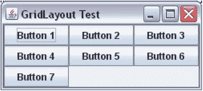

图 1-25。

A GridLayout with three rows and seven components

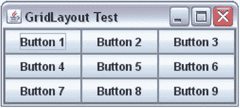

图 1-24。

A GridLayout with three rows and nine components

一个`GridLayout`是一个简单的手工编码的布局管理器。然而，它并不十分强大，原因有二。首先，它强制每个组件具有相同的大小，其次，您不能指定网格中组件的行号和列号(或确切位置)。也就是说，您只能向`GridLayout`添加一个组件。它们将按照您将它们添加到容器中的顺序水平排列，然后垂直排列。如果容器的方向是`LEFT_TO_RIGHT`，组件从左到右，然后从上到下排列。如果容器的方向是`RIGHT_TO_LEFT`，组件从右到左，然后从上到下排列。使用`GridLayout`的一个好方法是创建一组相同大小的按钮。例如，假设您将两个带有文本`OK`和`Cancel`的按钮添加到一个容器中，并希望它们具有相同的大小。您可以通过将按钮添加到由`GridLayout`布局管理器管理的容器中来实现这一点。

### 网格包布局

与`GridLayout`类似，`GridBagLayout`将组件布置在按行和列排列的矩形单元网格中。然而，它比`GridLayout`强大得多。它的强大带来了使用上的复杂性。不如`GridLayout`好用。在`GridBagLayout`中你可以定制的东西太多了，以至于很难快速学习和使用它的所有功能。

它可以让你定制组件的许多属性，如大小、对齐、可扩展性等。与`GridLayout`不同，网格中的所有单元不必大小相同。一个元件不需要精确地放置在一个单元中。一个组件可以水平和垂直跨越多个单元格。您可以指定其单元格内的组件应该如何对齐。

在使用`GridBagLayout`布局管理器时使用`GridBagLayout`和`GridBagConstraints`类。两个类都在`java.awt`包里。一个`GridBagLayout`类的对象定义了一个`GridBagLayout`布局管理器。`GridBagConstraints`类的对象为`GridBagLayout`中的组件定义约束。组件的约束用于布局组件。一些约束包括组件在网格中的位置、宽度、高度、单元格内的对齐方式等。

下面的代码片段创建了一个`GridBagLayout`类的对象，并将其设置为`JPanel`的布局管理器:

`// Create a JPanel container`

`JPanel panel = new JPanel();`

`// Set GridBagLayout as the layout manager for the JPanel`

`GridBagLayout gridBagLayout = new GridBagLayout();`

`panel.setLayout(gridBagLayout);`

让我们以最简单的形式使用`GridBagLayout`:创建一个框架，将其内容窗格的布局设置为`GridBagLayout`,并向内容窗格添加九个按钮。这是在清单 1-14 中完成的。图 [1-26](#Fig26) 显示运行程序时的画面。

清单 1-14。以最简单的形式使用的 GridBagLayout

`// SimplestGridBagLayout.java`

`package com.jdojo.swing;`

`import javax.swing.JFrame;`

`import java.awt.Container;`

`import javax.swing.JButton;`

`import java.awt.GridBagLayout;`

`public class SimplestGridBagLayout {`

`public static void main(String[] args) {`

`String title = "GridBagLayout in its Simplest Form";`

`JFrame frame = new JFrame(title);`

`frame.setDefaultCloseOperation(JFrame.EXIT_ON_CLOSE);`

`Container contentPane = frame.getContentPane();`

`contentPane.setLayout(new GridBagLayout());`

`for(int i = 1; i <= 9; i++) {`

`contentPane.add(new JButton("Button " + i));`

`}`

`frame.pack();`

`frame.setVisible(true);`

`}`

`}`

图 1-26。

Nine buttons in a GridBagLayout

起初，似乎 a `GridBagLayout`的行为像是 a `FlowLayout`。效果就像你用了一个`FlowLayout`一样。然而，`GridBagLayout`并不等同于`FlowLayout`，尽管它有能力像`FlowLayout`一样工作。它更强大(也更容易出错！)比一个`FlowLayout`。当您添加九个按钮时，您没有指定它们的单元格。您使用了`contentPane.add(Component c)`方法来添加按钮。结果是它在一行中放置了一个又一个按钮。

您可以指定`GridBagLayout`中组件应放置的单元格。要指定组件的单元格，需要调用`add(Component c, Object constraints)`方法，其中第二个参数是`GridBagConstraints`类的一个对象。如果您没有为一个`GridBagLayout`中的组件指定约束对象，它会将该组件放置在下一个单元中。下一个单元是用于放置前一个组件的单元之后的单元。如果没有对`GridBagLayout`中的任何组件使用约束，所有组件都被放置在一行中，如图 [1-26](#Fig26) 所示。当我讲述一个`GridBagConstraints`对象的`gridx`和`gridy`属性时，我会对此进行更多的讨论。

让我们通过展示它实际上是一个网格布局，并且它将组件放置在一个单元格网格中，来澄清一下`GridBagLayout`的记录。为了证明这一点，您将在前一个示例中在一个三行三列的单元格网格中显示九个按钮。这一次，只有一点不同:您将为按钮指定单元格在网格中的位置。行号和列号的组合表示单元格在网格中的位置。组件及其单元格的所有属性都是使用一个`GridBagConstraints`类的对象指定的。它有许多公共实例变量。它的`gridx`和`gridy`实例变量分别指定单元格的列号和行号。第一列用`gridx = 0`表示，第二列用`gridx = 1`表示，依此类推。第一行用`gridy = 0`表示，第二行用`gridy = 1`表示，依此类推。

哪个是网格中的第一个单元格—左上角、右上角、左下角还是右下角？这取决于容器的方向。如果容器使用`LEFT_TO_RIGHT`方向，网格左上角的单元格是第一个单元格。如果容器使用`RIGHT_TO_LEFT`方向，网格右上角的单元格是第一个单元格。表 [1-1](#Tab1) 和表 [1-2](#Tab2) 显示了具有不同容器方向的`GridBagLayout`中的单元格及其相应的`gridx`和`gridy`值。这些表格只显示了九个单元格。A `GridBagLayout`不限于只有九个单元。你想要多少细胞就有多少细胞。确切地说，您可以拥有最多`Integer.MAX_VALUE`个行和列，这肯定不会在任何应用程序中使用。

表 1-2。

Values of gridx and gridy for Cells in a Container with RIGHT_TO_LEFT Orientation

<colgroup><col> <col> <col></colgroup> 
| `gridx=2, gridy=0` | `gridx=1, gridy=0` | `gridx=0, gridy=0` |
| `gridx=2, gridy=1` | `gridx=1, gridy=1` | `gridx=0, gridy=1` |
| `gridx=2, gridy=2` | `gridx=1, gridy=2` | `gridx=0, gridy=2` |

表 1-1。

Values of gridx and gridy for Cells in a Container With LEFT_TO_RIGHT Orientation

<colgroup><col> <col> <col></colgroup> 
| `gridx=0, gridy=0` | `gridx=1, gridy=0` | `gridx=2, gridy=0` |
| `gridx=0, gridy=1` | `gridx=1, gridy=1` | `gridx=2, gridy=1` |
| `gridx=0, gridy=2` | `gridx=1, gridy=2` | `gridx=2, gridy=2` |

设置组件的`gridx`和`gridy`属性很容易。您为您的组件创建一个约束对象，这是一个`GridBagConstraints`类的对象；设置其`gridx`和`gridy`属性；并将约束对象传递给`add()`方法。下面的代码片段显示了如何在`JButton`的约束中设置`gridx`和`gridy`属性。当您调用`container.add(component, constraint)`方法时，约束对象被复制到正在添加的组件中，这样您就可以更改它的一些属性，并将其重新用于另一个组件。这样，您不必为添加到`GridBagLayout`的每个组件创建一个新的约束对象。然而，这种方法容易出错。您可能为某个组件设置了约束，但在为另一个组件重用约束对象时忘记了更改该约束。因此，在重用约束对象时要小心。

`// Create a constraint object`

`GridBagConstraints gbc = new GridBagConstraints();`

`// Set gridx and gridy properties in the constraint object`

`gbc.gridx = 0;`

`gbc.gridy = 0;`

`// Add a JButton and pass the constraint object as the`

`// second argument to the add() method.`

`container.add(new JButton("B1"), gbc);`

`// Set the gridx property to 1\. The gridy property`

`// remains as 0 as set previously.`

`gbc.gridx = 1;`

`// Add another JButton to the container`

`container.add(new JButton("B2"), gbc);`

清单 1-15 演示了如何为一个组件设置`gridx`和`gridy`值(或单元号)。图 [1-27](#Fig27) 显示了运行程序时得到的`JFrame`。

清单 1-15。为 GridBagLayout 中的组件设置 gridx 和 gridy 属性

`// GridBagLayoutWithgridxAndgridy.java`

`package com.jdojo.swing;`

`import java.awt.GridBagLayout;`

`import java.awt.Container;`

`import javax.swing.JFrame;`

`import javax.swing.JButton;`

`import java.awt.GridBagConstraints;`

`public class GridBagLayoutWithgridxAndgridy {`

`public static void main(String[] args) {`

`String title = "GridBagLayout with gridx and gridy";`

`JFrame frame = new JFrame(title);`

`frame.setDefaultCloseOperation(JFrame.EXIT_ON_CLOSE);`

`Container contentPane = frame.getContentPane();`

`contentPane.setLayout(new GridBagLayout());`

`// Create an object for GridBagConstraints to set`

`// the constraints for each JButton`

`GridBagConstraints gbc = new GridBagConstraints();`

`for(int y = 0; y < 3; y++) {`

`for(int x = 0; x < 3; x++) {`

`gbc.gridx = x;`

`gbc.gridy = y;`

`String text = "Button (" + x + ", " + y + ")";`

`contentPane.add(new JButton(text), gbc);`

`}`

`}`

`frame.pack();`

`frame.setVisible(true);`

`}`

`}`

图 1-27。

A GridBagLayout with nine buttons

您可以使用`GridBagConstraints`对象为组件指定其他约束。使用表 [1-3](#Tab3) 中列出的一个实例变量设置`GridBagConstraints`对象中的所有约束。该类还定义了许多常量，如`RELATIVE`、`REMAINDER`等。请注意，所有实例变量都是小写的。

表 1-3。

Instance Variables of the GridBagConstraints Class

<colgroup><col> <col> <col> <col></colgroup> 
| 实例变量 | 缺省值 | 可能的值 | 使用 |
| --- | --- | --- | --- |
| `gridx` `gridy` | `RELATIVE` | `RELATIVE` `An integer` | 组件所在网格中单元格的列号和行号。 |
| `gridwidth` `gridheight` | `1` | `An integer``RELATIVE`T2】 | 用于显示组件的网格单元数。 |
| `fill` | `NONE` | `BOTH``HORIZONTAL``VERTICAL`T3】 | 指定组件将如何填充网格中分配给它的单元格。 |
| `ipadx` `ipady` | `0` | 整数 | 指定添加到其最小大小的组件的内部填充。允许负整数，这将减小组件的最小大小。 |
| `insets` | `(0,0,0,0)` | Insets 对象 | 指定组件边缘与其在网格中的单元格之间的外部填充。允许负值。 |
| `anchor` | `CENTER` | `CENTER`，`NORTH`，`NORTHEAST`，`EAST`，`SOUTHEAST`，`SOUTH`，`SOUTHWEST`，`WEST`，`NORTHWEST, PAGE_START`，`PAGE_END`，`LINE_START`，`LINE_END`，`FIRST_LINE_START`，`FIRST_LINE_END`，`LAST_LINE_START`，`LAST_LINE_END, BASELINE`，`BASELINE_LEADING`，`BASELINE_TRAILING`，`ABOVE_BASELINE`，`ABOVE_BASELINE_LEADING`，`ABOVE_BASELINE_TRAILING,BELOW_BASELINE`，`BELOW_BASELINE_LEADING`，`BELOW_BASELINE_TRAILING` | 组件在显示区域中的放置位置。 |
| `weightx` `weighty` | `0.0` | 正的双精度值 | 调整容器大小时，额外空间(水平和垂直)如何在网格单元格中分布。 |

以下部分详细讨论了每个约束的影响。

#### gridx 和 gridy 约束

`gridx`和`gridy`约束指定网格中放置组件的单元。一个组件可以在水平和垂直方向上占据多个单元格。一个组件占据的所有单元格合在一起称为该组件的显示区域。

让我们对`gridx`和`gridy`约束进行精确定义。它们指定组件显示区域的起始单元格。默认情况下，每个组件只占用一个单元格。我将在下一节讨论`gridwidth`和`gridheight`约束时讨论如何让一个组件占据多个单元格。关于设置组件的`gridx`和`gridy`约束值的更多细节，请参考清单 1-15。

您可以为`gridx`和`gridy`约束中的一个或两个指定一个`RELATIVE`值。如果你指定了`gridx`和`gridy`(一个大于或等于零的整数)的值，你就决定了组件将被放置在哪里。如果你指定一个或两个约束值为`RELATVE`，布局管理器将确定`gridx`和/或`gridy`的值。如果你阅读了关于`GridBagLayout`类的 API 文档，对于`gridx`和/或`gridy`的`RELATIVE`值的描述不是很清楚。它只是说，当您将`gridx`和/或`gridy`的值指定为`RELATIVE`时，该组件将被放置在该组件之前添加的组件的旁边。API 文档中的这个描述一清二楚！以下段落将通过示例详细描述`gridx`和`gridy`的设定值。

##### 案例 1

您已经为`gridx`和`gridy`指定了值。这是网格中绝对定位的情况。您的组件根据您指定的`gridx`和`gridy`的值放置。你已经在清单 1-15 中看到了这种例子。

##### 案例 2

您已经为`gridx`指定了一个值，并将`gridy`的值设置为`RELATIVE`。在这种情况下，布局管理器需要确定`gridy`的值。我们来看一个例子。假设您有三个按钮要放在网格中，并且您有一个`container`对象，它的布局管理器被设置为`GridBagLayout`。下面的代码片段将三个按钮添加到网格中。图 [1-28](#Fig28) 显示了带有三个按钮的屏幕。

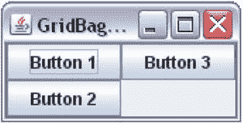

图 1-28。

Specifying gridx and Setting gridy to RELATIVE

`GridBagConstraints gbc = new GridBagConstraints();`

`JButton b1 = new JButton("Button 1");`

`JButton b2 = new JButton("Button 2");`

`JButton b3 = new JButton("Button 3");`

`gbc.gridx = 0;`

`gbc.gridy = 0;`

`container.add(b1, gbc);`

`gbc.gridx = 0;`

`gbc.gridy = GridBagConstraints.RELATIVE;`

`container.add(b2, gbc);`

`gbc.gridx = 1;`

`gbc.gridy = GridBagConstraints.RELATIVE ;`

`container.add(b3, gbc);`

按钮`b1`的位置没有混淆，因为您已经指定了`gridx`和`gridy`的值。它被放置在第一行(`gridy = 0`)和第一列(`gridx = 0`)。

对于按钮`b2`，您已经指定了`gridx = 0`。您希望将它放在第一列，结果与您预期的一样。您已经将`gridy`指定为`b2`的`RELATIVE`。这意味着您在告诉`GridBagLayout`通过将`b2`放入第一列(`gridx = 0`)来为其找到一个合适的行。由于第一行已经被第一列中的`b1`占据，下一个可用于`b2`的行是第二行，它被放置在那里。

您已经为按钮`b3`设置了`gridx = 1`。这意味着它应该放在第二列。您将它的`gridy`指定为`RELATIVE`。这意味着布局管理器需要在第二列中为它找到一行。由于第一行没有任何组件放在第二列，布局管理器将其放在第一行。如果您指定`gridx`为 0，那么`b3`会被放置在哪里？再次应用相同的逻辑。由于第一列已经分别在第一行和第二行中有了`b1`和`b2`，对于`b3`唯一可用的下一行是第三行，并且布局管理器将把它放在`b2`的正下方。

##### 案例 3

您已经为`gridy`指定了一个值，并将`gridx`的值设置为`RELATIVE`。在这种情况下，布局管理器需要确定`gridx`的值。也就是说，基于行号的指定值，布局管理器必须确定其列号。图 [1-29](#Fig29) 显示了使用以下代码片段时三个按钮的布局。以这种方式布局按钮的逻辑与前面的例子相同，只是这次布局管理器决定了`b2`和`b3`的列号，而不是它们的行号。

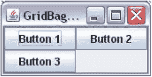

图 1-29。

Specifying gridy and setting gridx to RELATIVE in a GridBagLayout

`gbc.gridx = 0;`

`gbc.gridy = 0;`

`container.add(b1, gbc);`

`gbc.gridx = GridBagConstraints.RELATIVE;`

`gbc.gridy = 0;`

`container.add(b2, gbc);`

`gbc.gridx = GridBagConstraints.RELATIVE;`

`gbc.gridy = 1;`

`container.add(b3, gbc);`

##### 案例 4

这是将`gridx`和`gridy`都指定为`RELATIVE`的四种可能性中的最后一种。布局管理器必须确定要添加的组件的行号和列号。它将首先确定行号。该组件的行将是当前行。当前行是哪一行？默认情况下，第一行(`gridy = 0`)是当前行。当你添加一个组件时，你也可以指定它的`gridwidth`约束。它的值之一是`REMAINDER`，这意味着这是该行中的最后一个组件。如果您将组件添加到第一行，且其`gridwidth`设置为`REMAINDER`，则第二行成为当前行。一旦布局管理器确定了组件的行号(即当前行),它会将组件放在该行中最后添加的组件旁边的列中。`gridx`和`gridy`的默认值为`RELATIVE`。现在你可以理解为什么清单 1-14 将所有按钮放在第一行，默认情况下，所有按钮都使用`RELATIVE`作为`gridx`和`gridy`。因为默认的`gridwidth`是 1，所以第一行总是当前行。每当添加一个按钮时，第一行(当前行)被指定为它的行，它的列是该行中添加的最后一个按钮的下一列。让我们来看一些例子，在这些例子中，您将把`gridx`和`gridy`都设置为`RELATIVE`。

例 1:

下面的代码片段展示了如图 [1-30](#Fig30) 所示的按钮:

`gbc.gridx = 0;`

`gbc.gridy = 0;`

`container.add(b1, gbc);`

`gbc.gridx = GridBagConstraints.RELATIVE;`

`gbc.gridy = GridBagConstraints.RELATIVE;`

`container.add(b2, gbc);`

`gbc.gridx = GridBagConstraints.RELATIVE;`

`gbc.gridy = 1;`

`container.add(b3, gbc);`

图 1-30。

Specifying Both gridx and gridy as RELATIVE

您通过指定`gridx = 0`和`gridy = 0`来为`b1`使用绝对定位。结果是将`b1`放在第一行第一列。您将`b2`的`gridx`和`gridy`都指定为`RELATIVE`。布局管理器必须确定`b2`的行号和列号。它查看当前行，默认情况下是第一行。因此，它将`b2`的行号设置为 0。它发现第一列中已经有一个组件(`b1`)。因此，它为`b2`设置下一列，即第二列。这里您可以看到`b2`位于第一行和第二列。理解`b3`的摆放很简单。因为您已经指定了它的`gridy = 1`，所以它被放在第二行。它的`gridx`是`RELATIVE`，因为第一列在第二行中可用，所以它被放在第一列中。

例 2:

下面的代码片段展示了如图 [1-31](#Fig31) 所示的按钮。请注意，`b1`按钮被放置在其可用空间的中央，这是默认行为。您可以使用我稍后将讨论的`anchor`属性定制组件在其分配空间内的放置。

图 1-31。

Specifying gridx and gridy as RELATIVE with gridwidth as REMAINDER

`gbc.gridx = 0;`

`gbc.gridy = 0;`

`gbc.gridwidth = GridBagConstraints.REMAINDER;// Last component in the row`

`container.add(b1, gbc);`

`gbc.gridx = GridBagConstraints.RELATIVE;`

`gbc.gridy = GridBagConstraints.RELATIVE;`

`gbc.gridwidth = 1; // Reset to the default value`

`container.add(b2, gbc);`

`gbc.gridx = GridBagConstraints.RELATIVE; gbc.gridy = 1;`

`container.add(b3, gbc);`

您为`b1`指定了`gridx = 0`和`gridy = 0`。这次，您将`b1`的`gridwidth`指定为`REMAINDER`。这意味着`b1`是第一行的最后一个组件。因为这是添加到第一行的唯一组件，所以它成为该行的第一个也是最后一个组件。添加`b1`后，其`gridwidth`为`REMAINDER`，第二行成为当前行。对于`b2`，将`gridx`和`gridy`设置为`RELATIVE`。布局管理器将第二行(`gridy = 1)`作为其行号。由于第二行`b2`之前没有放置元件，所以它将是该行的第一个。这导致将`b2`放置在第二行第一列。请注意，您将`b2`和`b3`的值设置为 1。确定`b3`的位置很简单。因为您将它的`gridy`指定为 1(第二行)，所以它被放在第二行。它的`gridx`就是`RELATIVE`。由于`b2`已经在第一列，所以放在第二列。

#### gridwidth 和 gridheight 约束

`gridwidth`和`gridheight`约束分别指定组件显示区域的宽度和高度。两者的默认值都是 1。也就是说，默认情况下，组件放置在一个单元中。如果你为一个组件指定`gridwidth = 2`，它的显示区域将是两个单元格宽。如果您为一个组件指定`gridheight = 2`，它的显示区域将是两个单元格高。如果你曾经使用过 HTML 表格，你可以将`gridwidth`与`colspan`进行比较，将`gridheight`与 HTML 表格中单元格的`rowspan`属性进行比较。

您可以为`gridwidth`和`gridheight`指定两个预定义的常数。他们是`REMAINDER`和`RELATIVE`。`gridwidth`的`REMAINDER`值意味着组件将从其`gridx`单元格跨越到该行的其余部分。换句话说，它是行中的最后一个组件。`gridheight`的`REMAINDER`值表示它是该列中的最后一个组件。`gridwidth`的`RELATIVE`值表示组件显示区域的宽度将从其`gridx`到该行的倒数第二个单元格。`gridheight`的`RELATIVE`值表示组件显示区域的高度将从其`gridy`到倒数第二个单元格。让我们为`gridwidth`分别举一个例子。你可以为`gridheight`扩展这个概念。唯一的区别是`gridwidth`影响组件显示区域的宽度，而`gridheight`影响高度。

以下代码片段将九个按钮添加到一个容器中，第一行三个，第二行六个:

`// Expand the component to fill the whole cell`

`gbc.fill = GridBagConstraints.BOTH;`

`gbc.gridx = 0;`

`gbc.gridy = 0;`

`container.add(new JButton("Button 1"), gbc);`

`gbc.gridx = 1;`

`gbc.gridy = 0;`

`gbc.gridwidth = GridBagConstraints.RELATIVE;`

`container.add(new JButton("Button 2"), gbc);`

`gbc.gridx = GridBagConstraints.RELATIVE; gbc.gridy = 0;`

`gbc.gridwidth = GridBagConstraints.REMAINDER;`

`container.add(new JButton("Button 3"), gbc);`

`// Reset gridwidth to its default value 1`

`gbc.gridwidth = 1;`

`// Place six JButtons in second row`

`gbc.gridy = 1;`

`for(int i = 0; i < 6; i++) {`

`gbc.gridx = i;`

`container.add(new JButton("Button " + (i + 4)), gbc);`

`}`

第一句话对你来说是新的。它将`GridBagConstraints`的`fill`实例变量设置为`BOTH,`，这表示添加到单元格中的组件将在两个方向(水平和垂直)上扩展，以填充整个单元格区域。稍后我将更详细地讨论这一点。第一个按钮位于第一行第一列。

第二个按钮位于第一行第二列。它的`gridwidth`被设置为`RELATIVE`，这意味着它将从第二列(`gridx = 1`)跨越到该行的倒数第二列。第一行的最后一列是哪一列？你还不知道。您必须查看添加到`GridBagLayout`的所有组件，以找出网格中的最大行数和列数。现在，您知道第二个按钮从第二列开始，但是您不知道它将在哪一列结束(或者它将延伸到哪一列)。

让我们看看第三个按钮。您已经指定了它的`gridy = 0`，这意味着它应该放在第一行。您已经将其`gridx`设置为`RELATIVE`，这意味着它将被放置在第一行的第二个按钮之后。您已经将它的`gridwidth`值设置为`REMAINDER`，这意味着这是第一行中的最后一个组件。有个有趣的点要注意。第二个按钮将根据需要从第二列扩展到倒数第二列。你是说第三个按钮是第一行的最后一个组件，它应该占据其余的单元格。结果是，由于第二个按钮的`gridwidth`的`RELATIVE`的贪婪值，第三个按钮将始终只剩下一个单元格(最后一个单元格)。

在第二行中，您添加了六个按钮。每行中的单元格总数由一行中的最大列数决定。因此，每行(第一行和第二行)将有六个单元格。您已经将`gridwidth`设置为默认值 1，所以第二行中的每个按钮将只占据一个单元格。第一行第一个按钮占一个单元格，第三个按钮占一个单元格，第二个按钮占剩下的四个，如图 [1-32](#Fig32) 所示。

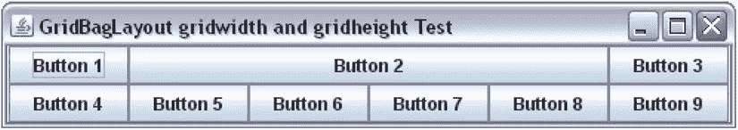

图 1-32。

Specifying gridwidth and gridheight

#### 填充约束

A `GridBagLayout`给出每个组件的首选宽度和高度。列的宽度由列中最宽的部分决定。类似地，行的高度由行中最高的组件决定。`fill`约束值表示当组件的显示区域大于其尺寸时，组件如何水平和垂直扩展。注意`fill`约束仅在组件尺寸小于其显示区域时使用。

`fill`约束有四个可能的值:`NONE`、`HORIZONTAL`、`VERTICAL`和`BOTH`。它的默认值是`NONE`，意思是“不要展开组件”值`HORIZONTAL`表示“水平扩展组件以填充其显示区域。”值`VERTICAL`表示“垂直扩展组件以填充其显示区域。”值`BOTH`表示“水平和垂直扩展组件以填充其显示区域。”

以下代码片段向三行三列的网格添加了九个按钮，如图 [1-33](#Fig33) 所示。

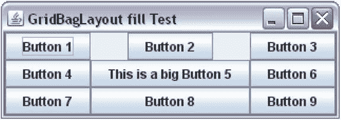

图 1-33。

Specifying the fill constraint for a component in a GridBagLayout

`gbc.gridx = 0; gbc.gridy = 0;`

`container.add(new JButton("Button 1"), gbc);`

`gbc.gridx = 1; gbc.gridy = 0;`

`container.add(new JButton("Button 2"), gbc);`

`gbc.gridx = 2; gbc.gridy = 0;`

`container.add(new JButton("Button 3"), gbc);`

`gbc.gridx = 0; gbc.gridy = 1;`

`container.add(new JButton("Button 4"), gbc);`

`gbc.gridx = 1; gbc.gridy = 1;`

`container.add(new JButton("This is a big Button 5"), gbc);`

`gbc.gridx = 2; gbc.gridy = 1;`

`container.add(new JButton("Button 6"), gbc);`

`gbc.gridx = 0; gbc.gridy = 2;`

`container.add(new JButton("Button 7"), gbc);`

`gbc.gridx = 1; gbc.gridy = 2;`

`gbc.fill = GridBagConstraints.HORIZONTAL;`

`container.add(new JButton("Button 8"), gbc);`

`gbc.gridx = 2; gbc.gridy = 2;`

`gbc.fill = GridBagConstraints.NONE;`

`container.add(new JButton("Button 9"), gbc);`

第五个按钮决定第二列的宽度，因为它是该列中最宽的`JButton`。请注意第一行第二列中的空白。它有空白空间，因为对于第二个按钮来说，`fill`值是`NONE`，这是默认的，并且第二个按钮没有扩展到占据其显示区域的整个宽度。它被保留为自己喜欢的大小。看第八个按钮。您指定它应该水平扩展，它这样做是为了匹配其显示区域的宽度。

#### ipadx 和 ipady 约束

`ipadx`和`ipady`约束用于指定组件的内部填充。它们增加了元件的首选尺寸和最小尺寸。默认情况下，两个约束都设置为零。允许负值。这些约束的负值将减小组件的首选和最小尺寸。如果指定了`ipadx`的值，组件的首选和最小宽度将增加`2*ipadx`。同样，如果您指定了`ipady`的值，组件的首选和最小高度将增加`2*ipady`。这些选项很少使用。`ipadx`和`ipady`的值以像素为单位。

#### insets 约束

`insets`约束指定组件周围的外部填充。它在组件周围添加空间。您将`insets`值指定为`java.awt.Insets`类的对象。它有一个名为`Insets(int top, int left, int bottom, int right)`的构造函数。您可以为组件的所有四个边指定填充。默认情况下，`insets`的值被设置为四边都为零像素的`Insets`对象。下面的代码片段在一个 3X3 的网格中添加了九个按钮，所有按钮的四边都有五个像素。最终布局如图 [1-34](#Fig34) 所示。请注意，您已经为所有按钮指定了`fill`约束为`BOTH`，但是由于它们的`insets`约束，您仍然可以看到相邻按钮之间的间隙。`insets`约束告诉布局管理器在组件边缘和显示区域边缘之间留有空间。

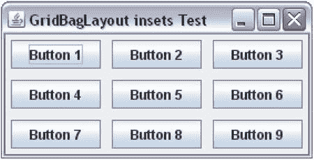

图 1-34。

Specifying insets for components in a GridBagLayout

`gbc.fill = GridBagConstraints.BOTH;`

`gbc.insets = new Insets(5, 5, 5, 5);`

`int count = 1;`

`for(int y = 0; y < 3; y++) {`

`gbc.gridy = y;`

`for(int x = 0; x < 3; x++) {`

`gbc.gridx = x;`

`container.add(new JButton("Button " + count++), gbc);`

`}`

`}`

#### 锚点约束

`anchor`约束指定当一个组件的尺寸小于其显示区域的尺寸时，该组件应放置在其显示区域内的何处。默认情况下，它的值被设置为`CENTER`，这意味着组件在其显示区域内居中。

在`GridBagConstraints`类中定义了许多常量，可以用作`anchor`约束的值。所有的常量可以分为三类:绝对的、基于方向的和基于基线的。

绝对值为`NORTH`、`SOUTH`、`WEST`、`EAST`、`NORTHWEST`、`NORTHEAST`、`SOUTHWEST`、`SOUTHEAST`、`CENTER`。图 [1-35](#Fig35) 显示了如何将一个组件放置在具有不同绝对锚值的单元内。请注意，图中的所有九个组件都将其`fill`约束设置为`NONE`。

图 1-35。

Absolute anchor values and their effects on component location in the display area

基于方向的值是基于容器的`ComponentOrientation`属性使用的。分别是`PAGE_START`、`PAGE_END`、`LINE_START`、`LINE_END`、`FIRST_LINE_START`、`FIRST_LINE_END`、`LAST_LINE_START`、`LAST_LINE_END`。图 [1-36](#Fig36) 和图 [1-37](#Fig37) 显示了当容器的方向设置为`LEFT_TO_RIGHT`和`RIGHT_TO_LEFT`时使用基于方向的锚值的效果。您可能会注意到，基于方向的值会根据容器使用的方向进行自我调整。

图 1-37。

Orientation-based anchor values and their effects when the container’s orientation is RIGHT_TO_LEFT

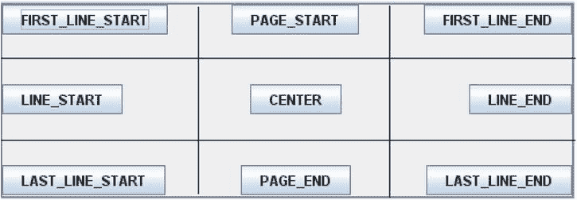

图 1-36。

Orientation-based anchor values and their effects when the container’s orientation is LEFT_TO_RIGHT

当您希望将一行中的组件沿其基线对齐时，将使用基线-基线锚点的值。一个组件的基线是什么？基线是相对于文本的。它是一条假想的线，文本中的字符就停留在这条线上。一个组件可能有一个基线。通常，组件的基线是组件的上边缘与其显示的文本的基线之间的距离(以像素为单位)。您可以通过使用组件的`getBaseline(int width, int height)`方法来获取组件的基线值。请注意，您需要传递组件的宽度和高度来获取其基线。不是每个组件都有基线。如果一个组件没有基线，这个方法返回`–1`。图 [1-38](#Fig38) 显示了三个组件，一个`JLabel`、一个`JTextField`和一个`JButton`，它们沿着基线排成一行`GridBagLayout`。

图 1-38。

A JLabel, a JTextField, and a JButton aligned along their baselines

`GridBagLayout`中的每一行都可以有一个基线。图 [1-38](#Fig38) 显示了包含三个组件的行的基线。图中的水平实线表示基线。请注意，这条水平实线是一条假想的线，它实际上并不存在。它仅用于演示基线概念。只有当至少一个组件具有有效基线并且其锚值为`BASLINE`、`BASELINE_LEADING`或`BASELINE_TRAILING`时，`GridBagLayout`中的一行才有基线。图 [1-39](#Fig39) 显示了一些基于基线的锚值。表 [1-4](#Tab4) 列出了所有可能的值及其描述。

表 1-4。

List of Baseline-Based Anchor’s Values and Descriptions

<colgroup><col> <col> <col></colgroup> 
| 基于基线的锚值 | 竖向定线 | 水平线向 |
| --- | --- | --- |
| `BASELINE` | 行基线 | 中心 |
| `BASELINE_LEADING` | 行基线 | 沿前缘对齐** |
| `BASELINE_TRAILING` | 行基线 | 沿后缘对齐*** |
| `ABOVE_BASELINE` | 底部边缘接触起始行的基线 | 中心 |
| `ABOVE_BASELINE_LEADING` | 底边接触起始行的基线* | 沿前缘对齐** |
| `ABOVE_BASELINE_TRAILING` | 底部边缘接触起始行的基线 | 沿后缘对齐*** |
| `BELOW_BASELINE` | 上边缘接触起始行的基线* | 中心 |
| `BELOW_BASELINE_LEADING` | 顶部边缘接触起始行的基线 | 沿前缘对齐** |
| `BELOW_BASELINE_TRAILING` | 上边缘接触起始行的基线* | 沿后缘对齐*** |

*starting row: The phrase “starting row” applies only when a component spans multiple rows. Otherwise, read it as the row in which the component is placed. If a row has no baseline, the component is vertically centered **Leading edge is left edge for `LEFT_TO_RIGHT` orientation and right edge for `RIGHT_TO_LEFT` orientation ***Trailing edge is right edge for `LEFT_TO_RIGHT` orientation and left edge for `RIGHT_TO_LEFT` orientation

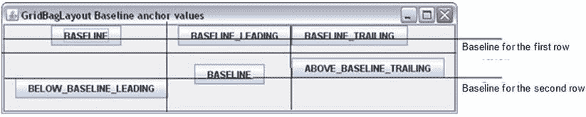

图 1-39。

Some baseline-based anchor values in action

#### 权重 x 和权重约束

`weightx`和`weighty`约束控制容器中的额外空间如何在行和列之间分配。`weightx`和`weighty`的默认值为零。它们可以有任何非负值。

图 [1-40](#Fig40) 显示一个`JFrame`使用九个按钮的`GridBagLayout`。图 [1-41](#Fig41) 为同一`JFrame`的水平和垂直展开图。

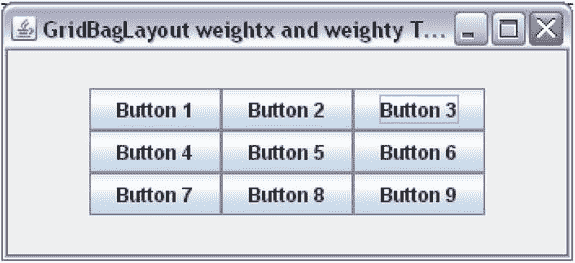

图 1-41。

A JFrame with a GridBagLayout having nine buttons after resizing

图 1-40。

A JFrame with a GridBagLayout having nine buttons with no extra spaces

请注意按钮组周围生成的额外空间。您已经将所有按钮的`fill`约束设置为`BOTH`，因此所有按钮都代表了`GridBagLayout`中的单元格网格。`weightx`和`weighty`约束保留默认值零。当所有组件的`weightx`和`weighty`约束设置为零时，容器中的任何额外空间都会出现在容器边缘和单元格网格边缘之间。

`weightx`值决定了额外水平空间在各列之间的分布，而`weighty`值决定了额外垂直空间在各行之间的分布。如果所有组件都有相同的`weightx`和`weighty`，额外的空间会在它们之间平均分配。图 [1-42](#Fig42) 显示了当`weightx`和`weighty`设置为 1.0 时的所有九个按钮。您可以为`weightx`和/或`weighty`设置任何正值。只要它们对于所有组件都是相同的，额外的空间将在它们之间平均分配。

图 1-42。

A JFrame with a GridBagLayout having nine buttons after resizing. All buttons have their weightx and weighty set to 1\. Extra space is distributed among the display area of all buttons equally

下面是如何根据`weightx`值计算每一列的额外空间。假设一个带有`GridBagLayout`的容器被水平扩展以使`ES`像素的额外空间可用。假设网格中有三列三行。布局管理器将为每列中的组件找到`weightx`值的最大值。假设`cwx1`、`cwx2`和`cwx3`分别是第 1 列、第 2 列和第 3 列的`weightx`的最大值。列 1 将获得`(cwx1 * ES)/(cwx1 + cwx2 + cwx3)`数量的额外空间。列 2 将获得`(cwx2 * ES)/(cwx1 + cwx2 + cwx3)`数量的额外空间。第 3 列将获得`(cwx3 * ES)/(cwx1 + cwx2 + cwx3)`数量的额外空间。有必要通过使用该列中的最大值`weightx`来计算给予该列的额外空间，以维护单元格网格。使用`weighty`在单元格之间分配额外垂直空间的计算是类似的

Tip

`weightx`和`weighty`约束影响组件显示区域的大小和组件本身的大小。对于`weightx`和`weighty`，通常使用 0.0 到 1.0 之间的值。但是，您可以使用任何非负值。组件的大小受其他约束的影响，如`fill`、`gridwidth`、`gridheight`等。如果您希望您的组件在额外空间可用时扩展，您需要将其`fill`约束设置为`HORIZONTAL`、`VERTICAL`或`BOTH`。通过使用`GridBagLayout`类的`setConstraints(Component c, GridBagConstraints cons)`方法，在将组件添加到容器中之后，您还可以在`GridBagLayout`中为组件设置约束。

### 布局

在`javax.swing`包中的`SpringLayout`类的一个实例代表一个`SpringLayout`管理器。回想一下，布局管理器的工作是计算容器中组件的四个属性(x、y、宽度和高度)。换句话说，它负责定位容器内的组件并计算它们的大小。一个`SpringLayout`管理器用弹簧来表示组件的这四个属性。手工编码很麻烦。它是针对 GUI 生成器工具的。在本节中，我将通过手工编写一些简单的例子来介绍这种布局的基础。

什么是春天？在经理的背景下，你可以把弹簧想象成机械弹簧，它可以被拉伸、压缩或保持正常状态。一个`Spring`类的对象代表了一个`SpringLayout`中的弹簧。一个`Spring`对象有四个属性:最小值、首选值、最大值和当前值。你可以把这四个属性想象成它的四种长度。弹簧在最大程度压缩时有最小值。在正常状态下(既不压缩也不拉伸)，它有自己的首选值。在最拉伸的状态下，它有最大值。它在任何给定时间点的值就是它的当前值。当弹簧的最小值、首选值和最大值相同时，称为支柱。

你如何创造一个春天？`Spring`类没有公共构造函数。它包含创建弹簧的工厂方法。要从头开始创建弹簧或支柱，可以使用其重载的`constant()`静态方法。您也可以使用元件的宽度或高度来建立弹簧。弹簧的最小值、首选值和最大值是根据组件的相应宽度或高度值设置的

`// Create a strut of 10 pixels`

`Spring strutPadding = Spring.constant(10);`

`// Create a spring having 10, 25 and 50 as its minimum,`

`// preferred, and maximum value respectively.`

`Spring springPadding = Spring.constant(10, 25, 50);`

`// Create a spring from the width of a component named c1`

`Spring s1 = Spring.width(c1);`

`// Create a spring from the height of a component named c1`

`Spring s2 = Spring.height(c1);`

`Spring`类有一些实用方法，可以让你操作 spring 属性。您可以通过使用`sum()`方法添加两个弹簧来创建一个新弹簧，如下所示:

`// Assuming that s1 and s2 are two springs`

`Spring s3 = Spring.sum(s1, s2);`

执行语句时不执行计算`sum`。相反，弹簧`s3`存储了`s1`和`s2`的引用。每当`s1`、`s2`或两者都改变时，计算`s3`的值。在这种情况下，`s3`的行为就像串联了弹簧`s1`和`s2`一样。

也可以通过从一个弹簧中减去另一个弹簧来创建弹簧。但是，您没有名为`subtract()`的方法。有一种叫做`minus()`的方法可以给出弹簧的负值。您可以使用`sum()`和`minus()`方法的组合来执行减法，如下所示:

`// Perform s1 – s2, which is the same as s1 + (-s2)`

`Spring s4 = Spring.sum(s1, Spring.minus(s2));`

要获得两个弹簧`s1`和`s2`的最大值，可以使用`Spring.max(s1, s2)`。注意没有对应的方法叫做`min()`。然而，您可以通过使用`minus()`和`max()`方法的组合来模拟它，就像这样:

`// Minimum of 2 and 5 is the minus of the maximum of –2 and –5.`

`// To get the minimum of two spring s1 and s2, you can use minus`

`// of maximum of –s1 and –s2`

`Spring min = Spring.minus(Spring.max(Spring.minus(s1), Spring.minus(s2)));`

你也可以使用`scale()`方法得到另一个弹簧的一部分。例如，如果您有一个弹簧`s1`，并且您想要创建一个值为其 40%的弹簧，您可以通过将 0.40f 作为第二个参数传递给`scale()`方法来实现，如下所示:

`String fractionSpring = Spring.scale(s1, 0.40f);`

Tip

创建弹簧后，不能更改弹簧的最小值、首选值和最大值。您可以通过使用它的`setValue()`方法来设置它的当前值。

你刚刚讨论了很多关于弹簧的问题。是时候看看他们的行动了。如何用`SpringLayout`将组件添加到容器中？在最简单的形式中，您使用容器的`add()`方法来添加组件。清单 1-16 将一个`JFrame`的内容窗格的布局设置为一个`SpringLayout`，并添加了两个按钮。图 [1-43](#Fig43) 显示运行程序时的`JFrame`。

清单 1-16。最简单的 spring 布局

`// SimplestSpringLayout.java`

`package com.jdojo.swing;`

`import java.awt.Container;`

`import javax.swing.JFrame;`

`import javax.swing.SpringLayout;`

`import javax.swing.JButton;`

`public class SimplestSpringLayout {`

`public static void main(String[] args) {`

`JFrame frame = new JFrame("Simplest SpringLayout");`

`frame.setDefaultCloseOperation(JFrame.EXIT_ON_CLOSE);`

`Container contentPane = frame.getContentPane();`

`// Set the content pane's layout as SpringLayout`

`SpringLayout springLayout = new SpringLayout();`

`contentPane.setLayout(springLayout);`

`// Add two JButtons to the content pane`

`JButton b1 = new JButton("Button 1");`

`JButton b2 = new JButton("Little Bigger Button 2");`

`contentPane.add(b1);`

`contentPane.add(b2);`

`frame.pack();`

`frame.setVisible(true);`

`}`

`}`

图 1-43。

The JFrame when you run the SimplestSpringLayout class

图 [1-43](#Fig43) 显示你只能看到`JFrame`的标题栏。当您展开 JFrame 时，您会看到如图 [1-44](#Fig44) 所示的屏幕。请注意，您的两个按钮都在`JFrame`中。然而，它们是重叠的。最简单的`SpringLayout`例子可能是最简单的编码；但是，看到结果就没那么简单了。

图 1-44。

After expanding the JFrame when you run the SimplestSpringLayout class

那么，你最简单的`SpringLayout`例子有什么问题呢？我提到过一个`SpringLayout`很难手工编码，你现在看到了！你在框架上使用了`pack()`方法来给它一个最佳的尺寸。但是您的框架没有显示区域。当您使用`SpringLayout`时，您必须指定所有组件和容器的 x、y、宽度和高度。这对开发人员来说是太多的工作，这就是为什么我说这个布局管理器是为 GUI 构建者设计的，而不是为手工编码设计的。

让我们再次检查图 [1-43](#Fig43) 和图 [1-44](#Fig44) 所示的屏幕。您会看到容器获得了位置(x 和 y ),按钮获得了大小(宽度和高度)。默认情况下，`JFrame`显示在(0，0)处，这就是您看到容器位置的方式(实际上，您的容器是一个内容窗格)。按钮获得它们默认的最小、首选和最大尺寸(都设置为相同的值),这是您展开屏幕后看到的按钮。默认情况下，`SpringLayout`将容器中的所有组件定位在(0，0)处。在这种情况下，两个按钮都位于(0，0)处。要解决此问题，请指定两个按钮和内容窗格的 x、y、宽度和高度。

A `SpringLayout`使用约束来排列组件。`Constraints`类的对象是`SpringLayout`类的静态内部类，代表组件和容器的约束。一个`Constraints`对象允许你使用它的方法指定一个组件的 x、y、宽度和高度。所有四个属性都必须根据一个`Spring`对象来指定。当您指定这些属性时，您需要使用`SpringLayout`类中定义的常量之一来指定它们，如表 [1-5](#Tab5) 中所列。

表 1-5。

List of Constants Defined in the SpringLayout Class

<colgroup><col> <col></colgroup> 
| 常数名称 | 描述 |
| --- | --- |
| `NORTH` | 它是`y`的同义词。它是组件的顶部边缘。 |
| `WEST` | 它是`x`的同义词。它是组件的左边缘。 |
| `SOUTH` | 它是组件的底部边缘。其值与`NORTH + HEIGHT`相同。 |
| `EAST` | 它是组件的右边缘。和`WEST + WIDTH`一样。 |
| `WIDTH` | 组件的宽度。 |
| `HEIGHT` | 组件的高度。 |
| `HORIZONTAL_CENTER` | 它是组件的水平中心。和`WEST + WIDTH/2`一样。 |
| `VERTICAL_CENTER` | 它是组件的垂直中心。和`NORTH + HEIGHT/2`一样。 |
| `BASELINE` | 它是组件的基线。 |

可以相对于容器或另一个组件设置组件的 x 和 y 约束。`Constraints`类的一个对象指定了一个组件的约束。您需要创建一个`SpringLayout.Constraints`类的对象，并使用它的方法来设置约束的值。当你添加一个组件到一个容器中时，将这个约束对象传递给`add()`方法。清单 1-17 为两个按钮设置了 x 和 y 约束。注意，值(10，20)和(150，20)是根据`Spring`对象指定的，它们是从内容窗格的边缘开始测量的。图 [1-45](#Fig45) 显示运行程序时展开`JFrame`后的画面。

清单 1-17。为元件设置 x 和 y 约束

`// SpringLayout2.java`

`package com.jdojo.swing;`

`import javax.swing.SpringLayout;`

`import java.awt.Container;`

`import javax.swing.JFrame;`

`import javax.swing.JButton;`

`import javax.swing.Spring;`

`public class SpringLayout2 {`

`public static void main(String[] args) {`

`JFrame frame = new JFrame("SpringLayout2");`

`frame.setDefaultCloseOperation(JFrame.EXIT_ON_CLOSE);`

`Container contentPane = frame.getContentPane();`

`// Set the content pane's layout to a SpringLayout`

`SpringLayout springLayout = new SpringLayout();`

`contentPane.setLayout(springLayout);`

`// Add two JButtons to the content pane`

`JButton b1 = new JButton("Button 1");`

`JButton b2 = new JButton("Little Bigger Button 2");`

`// Create Constraints objects for b1 and b2`

`SpringLayout.Constraints b1c = new SpringLayout.Constraints();`

`SpringLayout.Constraints b2c = new SpringLayout.Constraints();`

`// Create a Spring object for y value for b1 and b2`

`Spring yPadding = Spring.constant(20);`

`// Set (10, 20) for (x, y) for b1`

`b1c.setX(Spring.constant(10));`

`b1c.setY(yPadding);`

`// Set (150, 20) for (x, y) for b2`

`b2c.setX(Spring.constant(150));`

`b2c.setY(yPadding);`

`// Use the Constraints object while adding b1 and b2`

`contentPane.add(b1, b1c);`

`contentPane.add(b2, b2c);`

`frame.pack();`

`frame.setVisible(true);`

`}`

`}`

图 1-45。

After expanding the JFrame when the (x, y) are set for two buttons

您尚未确定`JFrame`的大小。运行程序时，`JFrame`仍然显示，没有显示区域。至少这次两个按钮没有重叠。你选择了一个 150 像素的任意值作为`b2`的 x 值。也就是说，`b2`的左边缘距离内容窗格的左边缘 150 像素。有一种方法可以指定`b2`的左边缘应该与`b1`的右边缘相距指定的距离。为了实现这一点，您需要首先将`b1`添加到容器中。当您向容器中添加一个组件时，`SpringLayout`将一个`Constraints`对象关联到该组件，不管您是否将一个约束对象传递给容器的`add()`方法。您可以使用`SpringLayout`类的`getConstraint(String edge, Component c)`方法来获取组件任何边的约束。下面的代码片段做了同样的事情。它将`b1`的(x，y)设置为(10，20)，将`b2`的(x，y)设置为(`b1`的右边缘+ 5，20)。如果用下面的代码片段替换清单 1-17 中添加两个按钮的代码，`b2`将出现在`b1`右侧 10 个像素处:

`// Create a Spring object for y value for b1 and b2`

`Spring yPadding = Spring.constant(20);`

`// Set (10, 20) for (x, y) for b1`

`b1c.setX(Spring.constant(10));`

`b1c.setY(yPadding);`

`// Add b1 to the content pane first`

`contentPane.add(b1, b1c);`

`// Now query the layout manager for b1's EAST constraint,`

`// which is the right edge of b1`

`Spring b1Right = springLayout.getConstraint(SpringLayout.EAST, b1);`

`// Add a 5-pixel strut to the right edge of b1 to define the`

`// left edge of b2 and set it using setX() method on b2c`

`Spring b2Left = Spring.sum(b1Right, Spring.constant(5));`

`b2c.setX(b2Left);`

`b2c.setY(yPadding);`

`// Now add b2 to the content pane`

`contentPane.add(b2, b2c);`

有一种更简单、更直观的方式来为`SpringLayout`中的组件设置约束。首先，将所有组件添加到容器中，不用担心它们的约束，然后使用`SpringLayout`类的`putConstraint()`方法定义约束。这里有两个版本的`putConstraint()`方法:

*   `void putConstraint(String targetEdge, Component targetComponent, int padding, String sourceEdge,Component sourceComponent)`
*   `void putConstraint(String targetEdge, Component targetComponent, Spring padding, String sourceEdge, Component sourceComponent)`

第一个版本使用支柱。第三个参数(`int padding`)定义了一个固定弹簧，它将作为两个组件边缘之间的支柱(固定距离)。第二个版本使用弹簧代替。你可以将方法描述理解为，“`targetComponent`的`targetEdge`与`sourceComponent`的`sourceEdge`相距`padding`例如，如果您希望`b2`的左边缘距离`b1`的右边缘 5 个像素，您可以调用此方法:

`// Set b2's left edge 5 pixels from b1's right edge`

`springLayout.putConstraint(SpringLayout.WEST, b2, 5,`

`SpringLayout.EAST, b1);`

要将`b1`(左边缘定义 x 值)的左边缘设置为距离内容窗格的左边缘 10 个像素，可以使用

`springLayout.putConstraint(SpringLayout.WEST, b1, 5,`

`SpringLayout.WEST, contentPane);`

让我们回到你的`JFrame`在调用它的`pack()`方法时的大小调整问题。您需要设置内容窗格底部和右边的位置，以便`pack()`方法能够正确地调整它的大小。您将它的下边缘设置为比`b1`(或`b2`，离它的下边缘最近的那个)的下边缘低 10 个像素。在本例中，两者距离内容窗格的底部边缘的距离相同。您将它的右边缘设置为距离内容窗格中最右边的`JButton`的右边缘 10 个像素。以下代码片段实现了这一点:

`// Set the bottom edge of the content pane`

`springLayout.putConstraint(SpringLayout.SOUTH, contentPane, 10,`

`SpringLayout.SOUTH, b1);`

`// Set the right edge of the content pane`

`springLayout.putConstraint(SpringLayout.EAST, contentPane, 10,`

`SpringLayout.EAST, b2);`

清单 1-18 包含了完整的程序，图 [1-46](#Fig46) 显示了运行程序时的`JFrame`。

清单 1-18。使用 SpringLayout 类的 putConstraint()方法

`// NiceSpringLayout.java`

`package com.jdojo.swing;`

`import javax.swing.JFrame;`

`import java.awt.Container;`

`import javax.swing.SpringLayout;`

`import javax.swing.JButton;`

`public class NiceSpringLayout {`

`public static void main(String[] args) {`

`JFrame frame = new JFrame("SpringLayout2");`

`frame.setDefaultCloseOperation(JFrame.EXIT_ON_CLOSE);`

`Container contentPane = frame.getContentPane();`

`// Set the content pane's layout to a SpringLayout`

`SpringLayout springLayout = new SpringLayout();`

`contentPane.setLayout(springLayout);`

`// Create two JButtons`

`JButton b1 = new JButton("Button 1");`

`JButton b2 = new JButton("Little Bigger Button 2");`

`// Add two JButtons without using any constraints`

`contentPane.add(b1);`

`contentPane.add(b2);`

`// Now add constraints to both JButtons`

`// Set x for b1 as 10`

`springLayout.putConstraint(SpringLayout.WEST, b1, 10,`

`SpringLayout.WEST, contentPane);`

`// Set y for b1 as 20`

`springLayout.putConstraint(SpringLayout.NORTH, b1, 20,`

`SpringLayout.NORTH, contentPane);`

`// Set x for b2 as 10 from the right edge of b1`

`springLayout.putConstraint(SpringLayout.WEST, b2, 10,`

`SpringLayout.EAST, b1);`

`// Set y for b1 as 20`

`springLayout.putConstraint(SpringLayout.NORTH, b2, 20,`

`SpringLayout.NORTH, contentPane);`

`/* Now set height and width for the content pane as the bottom`

`edge of b1 + 10 and right edge of b2 + 10\. Note that source`

`is b1 for content pane's height and b2 for its width`

`*/`

`// Set the bottom edge of the content pane`

`springLayout.putConstraint(SpringLayout.SOUTH, contentPane, 10,`

`SpringLayout.SOUTH, b1);`

`// Set the right edge of the content pane`

`springLayout.putConstraint(SpringLayout.EAST, contentPane, 10,`

`SpringLayout.EAST, b2);`

`frame.pack();`

`frame.setVisible(true);`

`}`

`}`

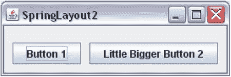

图 1-46。

Nice SpringLayout with the JFrame sized automatically

是一个非常强大的布局，可以模仿许多复杂的布局。下面的代码片段有更多的例子。评论解释了它应该做什么。

`// Place a JButton b1 horizontally centered at the top of the content pane, you // would set its constraints as below. Replace HORIZONTAL_CENTER with`

`// VERTICAL_CENTER to center the JButton vertically`

`springLayout.putConstraint(SpringLayout.HORIZONTAL_CENTER, north, 0,`

`SpringLayout.HORIZONTAL_CENTER,`

`contentPane);`

`// You can set the width of two JButtons, b1 and b2, to be the same by`

`// assigning the maximum width to the both of them. Assuming that you have`

`// already added b1 and b2 JButtons to the container`

`SpringLayout.Constraints b1c = springLayout.getConstraints(b1);`

`SpringLayout.Constraints b2c = springLayout.getConstraints(b2);`

`// Get a spring that represents the maximum of the width of b1 and b2,`

`// and set that spring as width for both b1 and b2`

`Spring maxWidth = Spring.max(b1c.getWidth(), b2c.getWidth());`

`b1c.setWidth(maxWidth);`

`b2c.setWidth(maxWidth);`

### 群组布局

`GroupLayout`在`javax.swing`包里。它是供 GUI 构建者使用的。然而，手工编码也很容易。

A `GroupLayout`使用了组的概念。组由元素组成。组的元素可以是组件、间隙或另一个组。您可以将间隙视为两个组件之间的不可见区域。

在使用`GroupLayout`之前，你必须理解组的概念。有两种类型的组:

*   顺序组
*   平行链晶

当一个组中的元素一个接一个地连续排列时，称为顺序组。当一组中的元素平行放置时，称为平行组。平行组以四种方式之一对齐其元素:基线、居中、前导和尾随。在`GroupLayout`中，您需要为每个组件定义两次布局——一次沿着水平轴，一次沿着垂直轴。也就是说，您需要分别指定所有组件如何水平和垂直地组成一个组。让我们看一些组的例子。图 [1-47](#Fig47) 显示了一组两个组件。

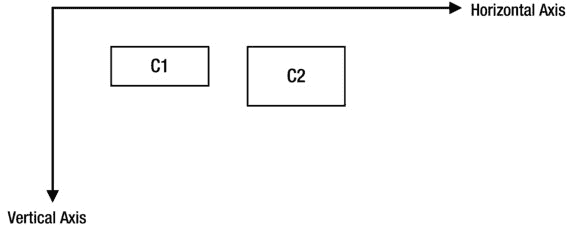

图 1-47。

Two components, C1 and C2, form a sequential group along the horizontal axis and a parallel group along the vertical axis

在图 [1-47](#Fig47) 中，两个轴仅用于讨论目的，它们不是布局的一部分。组件一个接一个地放置(从左到右)，沿水平轴形成一个连续的组。它们沿着垂直轴形成平行组。沿垂直轴，在平行组中，两个组件沿其顶边对齐。如果您对沿水平轴和垂直轴的顺序组和平行组的可视化有问题，您可以将图 [1-47](#Fig47) 重绘为图 [1-48](#Fig48) 。水平方向上的两个虚线箭头(从左到右)表示 C1 和 C2，当您在水平方向上可视化它们的分组时。您可以看到两个箭头是串联的，因此 C1 和 C2 沿着水平轴形成了一个连续的组。垂直方向上的两个虚线箭头(从上到下位于组件 C1 的左侧)表示 C1 和 C2，当您沿着垂直轴查看它们时。你可以看到这两个箭头不是串联的。相反，它们是并行的。因此，C1 和 C2 沿着纵轴形成平行组。您需要找出平行组的对齐方式。在这种情况下，C1 和 C2 沿着它们的上边缘对齐，这在`GroupLayout`术语中称为前导对齐。

图 1-48。

Groupings for components C1 and C2

C1 和 C2 还有其他可能的路线吗？平行组中有四种可能的对齐方式:基线对齐、居中对齐、前导对齐和尾随对齐。如果平行组沿垂直轴出现，则所有四种类型的对齐都是可能的。如果平行组沿水平轴出现，则只可能有三种对齐方式(居中、前导和尾随)。沿着垂直轴，前导与顶边相同，尾随与底边相同。沿水平轴，如果组件方向为`LEFT_TO_RIGHT`，前导为左边缘，如果组件方向为`RIGHT_TO_LEFT`，前导为右边缘。图 [1-49](#Fig49) 和图 [1-50](#Fig50) 显示了沿垂直轴和水平轴的可能对准。该对准由虚线示出。请注意，沿垂直轴，对齐线是水平的，沿水平轴，对齐线是垂直的。`GroupLayout.Alignment`枚举中的四个常量`LEADING`、`TRAILING`、`CENTER`和`BASELINE`用于表示四种对准类型。

图 1-50。

The three possible alignments in a parallel group along the horizontal axis in a group for component orientation of LEFT_TO_RIGHT. For RIGHT_TO_LEFT orientation, LEADING and TRAILING will swap edges

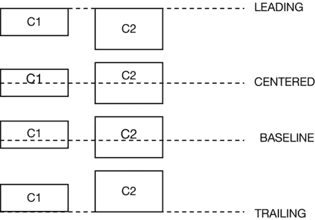

图 1-49。

The four possible alignments in a parallel group along the vertical axis in a group

如何为一个`GroupLayout`创建连续和并行的组？`GroupLayout`类包含三个内部类:`Group`、`SequentialGroup`和`ParallelGroup`。`Group`是一个抽象类，另外两个类继承自`Group`类。您不必直接创建这些类的对象。相反，您使用`GroupLayout`类的工厂方法来创建它们的对象。

`GroupLayout`类提供了两个单独的方法来创建组:`createSequentialGroup()`和`createParallelGroup()`。从这些方法的名称可以明显看出它们创建的组的种类。请注意，您需要为平行组指定对齐方式。`createParallelGroup()`方法被重载。不带参数的版本默认对齐为`LEADING`。另一个版本允许您指定对齐方式。一旦您有了一个组对象，您就可以分别使用它的`addComponent()`、`addGap()`和`addGroup()`方法向它添加组件、间隙和组。

你如何使用`GroupLayout`管理器？以下是使用`GroupLayout`需要遵循的步骤。假设你要在一个`JFrame`中放置两个按钮，如图 [1-51](#Fig51) 所示。

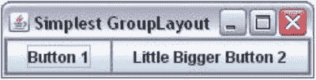

图 1-51。

The simplest GroupLayout in which two buttons are placed side by side

假设`JFrame`被命名为`frame`，两个`JButtons`被命名为`b1`和`b2`。首先，您需要创建一个`GroupLayout`类的对象。它只包含一个将容器引用作为参数的构造函数。这意味着在创建一个`GroupLayout`类的对象之前，您需要获得对您想要为其创建`GroupLayout`的容器的引用。

`// Get the reference of the container`

`Container contentPane = frame.getContentPane();`

`// Create a GroupLayout object`

`GroupLayout groupLayout = new GroupLayout(contentPane);`

`// Set the layout manager for the container`

`contentPane.setLayout(groupLayout);`

其次，您需要创建沿水平轴的组件组(称为水平组),并使用`setHorizontalGroup()`方法将该组设置为`GroupLayout`。请注意，一个组可以沿任何轴(水平轴和垂直轴)连续或平行。在你的例子中，两个按钮，`b1`和 b2，沿着水平轴形成一个连续的组。

`// Create a sequential group`

`GroupLayout.SequentialGroup sGroup = groupLayout.createSequentialGroup();`

`// Add two buttons to the group`

`sGroup.addComponent(b1);`

`sGroup.addComponent(b2);`

`// Set the horizontal group for the GroupLayout`

`groupLayout.setHorizontalGroup(sGroup);`

您可以将所有步骤合并为一步，如下所示:

`groupLayout.setHorizontalGroup(groupLayout.createSequentialGroup()`

`.addComponent(b1)`

`.addComponent(b2));`

最后，沿着垂直轴创建组件组(称为垂直组)，并使用`setVerticalGroup()`方法将该组设置为`GroupLayout`。两个按钮沿垂直轴形成一个平行组。您可以按如下方式完成此操作:

`groupLayout.setVerticalGroup(`

`groupLayout.createParallelGroup(GroupLayout.Alignment.BASELINE)`

`.addComponent(b1)`

`.addComponent(b2));`

Tip

在一个`GroupLayout`中，你不能使用它的`add()`方法添加一个组件到容器中。相反，您可以沿着水平轴和垂直轴将组件添加到一个组中，并使用`setHorizontalGroup()`和`setVerticalGroup()`方法将该组添加到`GroupLayout`中。

清单 1-19 演示了如何使用一个`GroupLayout`在一个`JFrame`中并排显示两个按钮。运行程序时，`JFrame`显示如图 [1-51](#Fig51) 所示。我稍后将讨论更复杂的例子。

清单 1-19。最简单的组布局

`// SimplestGroupLayout.java`

`package com.jdojo.swing;`

`import java.awt.Container;`

`import javax.swing.JFrame;`

`import javax.swing.JButton;`

`import javax.swing.GroupLayout;`

`public class SimplestGroupLayout {`

`public static void main(String[] args) {`

`JFrame frame = new JFrame("Simplest GroupLayout");`

`frame.setDefaultCloseOperation(JFrame.EXIT_ON_CLOSE);`

`Container contentPane = frame.getContentPane();`

`// Create an object of the GroupLayout class for contentPane`

`GroupLayout groupLayout = new GroupLayout(contentPane);`

`// Set the content pane's layout to a GroupLayout`

`contentPane.setLayout(groupLayout);`

`// Add two JButtons to the content pane`

`JButton b1 = new JButton("Button 1");`

`JButton b2 = new JButton("Little Bigger Button 2");`

`groupLayout.setHorizontalGroup(`

`groupLayout.createSequentialGroup()`

`.addComponent(b1)`

`.addComponent(b2));`

`groupLayout.setVerticalGroup(`

`groupLayout.createParallelGroup(GroupLayout.Alignment.BASELINE)`

`.addComponent(b1)`

`.addComponent(b2));`

`frame.pack();`

`frame.setVisible(true);`

`}`

`}`

A `GroupLayout`还有两个特性值得讨论:

*   它允许您在两个组件之间添加间隙。
*   它允许您指定组件、间隙和组的调整大小行为。

你可以把间隙想象成一个看不见的组件。有两种类型的间隙:两个组件之间的间隙，以及组件和容器之间的间隙。您可以使用`Group`类的`addGap()`方法在两个组件之间添加一个间隙。您可以添加刚性间隙和柔性间隙(如弹簧)。刚性间隙的大小是固定的。灵活间隙有最小、首选和最大尺寸，当调整容器大小时，它就像弹簧一样。在前面的例子中，要在`b1`和`b2`之间添加一个 10 像素的刚性间隙，你可以这样设置你的水平组:

`groupLayout.setHorizontalGroup(groupLayout.createSequentialGroup()`

`.addComponent(b1)`

`.addGap(10)`

`.addComponent(b2));`

有三种方法可以在两个组件之间添加间隙。它们基于间隙大小及其调整大小的能力。

*   您可以使用`addGap(int gapSize)`在两个组件之间添加一个刚性间隙。
*   您可以使用`addGap(int min, int pref, int max)`方法在两个组件之间添加一个灵活的(类似弹簧的)间隙，它有一个最小、一个首选和一个最大尺寸。要添加一个最小、首选和最大尺寸分别为 5、10 和 50 的灵活间隙，可以这样设置水平组:`groupLayout.setHorizontalGroup(groupLayout.createSequentialGroup()` `.addComponent(b1)` `.addGap(5, 10, 50)` `.addComponent(b2));`
*   您可以在两个组件之间添加首选间隙。在这种情况下，您可以选择指定间隙的大小，或者让布局管理器为您计算。但是，就此差距而言，您必须指定这两个组件的关联方式。这种间隙有三种:`RELATED`、`UNRELATED`和`INDENT`。如果您要在标签和其对应的字段之间添加首选间隙，您需要在它们之间添加一个`RELATED`间隙。例如，如果您有一个登录表单，并且您想要在“用户 id:”和用于输入用户 ID 的文本字段之间添加一个首选间隙，那么您可以在它们之间添加一个`RELATED`间隙。当两个组件属于不同的组时，使用`UNRELATED`间隙。当您添加一个间隙只是为了缩进一个组件时，您添加了一个`INDENT`间隙。三种类型的间隙由在`LayoutStyle.ComponentPlacement`枚举中定义的三个常量`RELATED`、`UNRELATED`和`INDENT`表示。使用`addPreferredGap()`方法添加首选间隙。以下代码片段在`b1`和`b2`之间添加了一个`RELATED`首选间隙:`groupLayout.setHorizontalGroup(` `groupLayout.createSequentialGroup()` `.addComponent(b1)` `.addPreferredGap(LayoutStyle.ComponentPlacement.RELATED)` `.addComponent(b2));`

您需要使用`GroupLayout.SequentialGroup`类的`addContainerGap()`方法在组件和容器的边缘之间添加一个间隙。该方法被重载。它还允许您指定间隙的首选大小和最大大小。

当您在不同的平台上运行应用程序时，设置硬编码的间隙可能会产生问题。这就是为什么`GroupLayout`有两个方法可以让你指定让`GroupLayout`根据你的应用程序运行的平台来计算首选的间隙。要让`GroupLayout`计算并设置两个组件之间的间隙，您需要调用它的`setAutoCreateGaps(true)`方法。要让它计算并设置组件和容器边缘之间的间隙，需要调用它的`setAutoCreateContainerGaps(true)`方法。默认情况下，间隙的自动计算是禁用的。替换该语句

`// Create an object of the GroupLayout class`

`GroupLayout groupLayout = new GroupLayout(contentPane);`

在清单 1-19 中使用了以下语句

`// Create an object of the GroupLayout class and setup gaps`

`GroupLayout groupLayout = new GroupLayout(contentPane);`

`groupLayout.setAutoCreateGaps(true);`

`groupLayout.setAutoCreateContainerGaps(true);`

现在，`JFrame`将如图 [1-52](#Fig52) 所示。您可以看到布局管理器为您添加了必要的间隙。

图 1-52。

The simplest GroupLayout with auto gaps enabled

A `GroupLayout`考虑组件的最小、首选和最大尺寸。当调整容器大小时，布局管理器询问组件的大小并相应地调整它们的大小。但是，您可以通过使用`addComponent(Component c, int min, int pref, int max)`方法来覆盖这种行为，该方法允许您指定组件的最小、首选和最大大小。您需要理解在`GroupLayout`类中定义的两个常量的含义。他们是`DEFAULT_SIZE`和`PREFERRED_SIZE`。它们可用于`addComponent()`方法中的`min`、`pref`和`max`参数。`DEFAULT_SIZE`表示布局管理器应该向组件请求该尺寸类型并使用它。`PREFERRED_SIZE`意味着管理器应该使用组件的首选尺寸。例如，如果您希望上一个示例中的`JButton b2`展开(默认情况下，一个`JButton`具有相同的`min`、`pref`和`max`大小)，您可以将它添加到水平组，如下所示:

`groupLayout.setHorizontalGroup(groupLayout.createSequentialGroup()`

`.addComponent(b1)`

`.addComponent(b2,`

`GroupLayout.PREFERRED_SIZE,`

`GroupLayout.PREFERRED_SIZE,`

`Integer.MAX_VALUE));`

通过将`PREFERRED_SIZE`指定为最小尺寸和首选尺寸，您是在告诉布局管理器`b2`不应该缩短到其首选尺寸以下。`Integer.MAX_VALUE`因为它的最大尺寸告诉布局管理器它可以无限扩展。要使一个组件不可调整大小，您可以像使用`GroupLayout.PREFERRED_SIZE`一样使用它的所有三个大小。

您可以在`GroupLayout`中嵌套组。让我们来看一个名为`b1`、`b2`、`b3`、`b4`的四个按钮的布局，如图 [1-53](#Fig53) 所示。

图 1-53。

Nested groups in GroupLayout

让我们看看沿水平轴的组件布局。你可以看到两个平行的组(`b1`、`b3`)和(`b2`、`b4`)，这两组是顺序放置的。让我们在伪代码中用`PG`和`SG`分别表示并行组和顺序组。注意在`PG` ( `b1`，`b3`)中，组件沿`LEADING`边缘(此处为左边缘)对齐，在`PG` ( `b2`，`b4`)中，组件沿`TRAILING`边缘(此处为右边缘)对齐。让我们将对齐插入到您的伪代码中，这些组将如下所示:`PG[LEADING](b1, b3)`和`PG[TRAILING](b2, b4)`。为了讨论这个例子，我编造了这个语法。您将很快看到 Java 代码。如果您对可视化排列有问题，您可以参考图 [1-54](#Fig54) ，其中每个按钮都由沿水平轴的箭头表示。

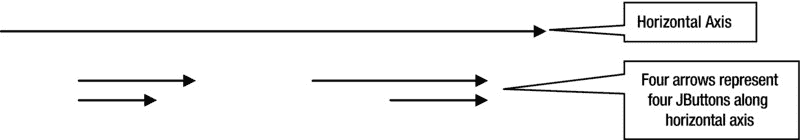

图 1-54。

Four buttons represented by four arrows along horizontal axis

箭头的对齐方式与按钮相同。你可以观察到`b1`和`b3`的箭头是平行的，`b2`和`b4`的箭头也是平行的。如果您将两个平行的组可视化，您可以观察到这两个组沿着水平轴组成一个连续的组。为了帮助你形象化这个最终的排列，箭头排列已经在图 [1-55](#Fig55) 中进行了细化。

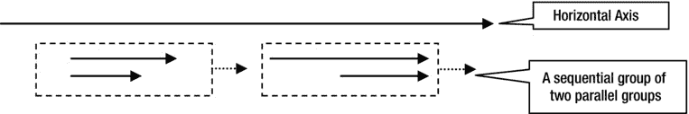

图 1-55。

Four buttons represented by four arrows along horizontal axis

每个平行组显示在虚线矩形内。从虚线矩形出来的箭头表示这些组沿着水平轴是连续的。理解这些组件沿轴的平行和顺序排列可能需要一段时间。一旦你掌握了它，在一个复杂的场景中使用一个`GroupLayout`将会非常容易。最有可能的是，您将使用 GUI 生成器工具来安排您的组件，并且您不会关心组的复杂性。但是，理解布局背后的概念总是有帮助的。

为了沿着水平轴结束这个讨论，伪代码看起来如下:

`Horizontal Group = SG(PG[LEADING](b1, b3), PG[TRAILING](b2, b4))`

类似地，您可以沿着垂直轴可视化分组排列。如果你在视觉上有问题，你可以把四个按钮都画成从上到下的箭头，看看它们是如何沿着纵轴分组的。以下是垂直分组排列:

`Vertical Group = SG(PG[BASELINE](b1, b2), PG[BASELINE](b3, b4))`

现在，很容易将伪代码翻译成 Java 代码，如清单 1-20 所示。

清单 1-20。GroupLayout 中的嵌套组

`// NestedGroupLayout.java`

`package com.jdojo.swing;`

`import java.awt.Container;`

`import javax.swing.JFrame;`

`import javax.swing.JButton;`

`import javax.swing.GroupLayout;`

`import static javax.swing.GroupLayout.Alignment.*;`

`public class NestedGroupLayout {`

`public static void main(String[] args) {`

`JFrame frame = new JFrame("Nested Groups in GroupLayout");`

`frame.setDefaultCloseOperation(JFrame.EXIT_ON_CLOSE);`

`Container contentPane = frame.getContentPane();`

`// Set the content's pane layout to GroupLayout`

`GroupLayout groupLayout = new GroupLayout(contentPane);`

`groupLayout.setAutoCreateGaps(true);`

`groupLayout.setAutoCreateContainerGaps(true);`

`contentPane.setLayout(groupLayout);`

`// Add four JButtons to the content pane`

`JButton b1 = new JButton("Button 1");`

`JButton b2 = new JButton("Little Bigger Button 2");`

`JButton b3 = new JButton("3");`

`JButton b4 = new JButton("Button 4");`

`groupLayout.setHorizontalGroup(`

`groupLayout.createSequentialGroup()`

`.addGroup(groupLayout.createParallelGroup(LEADING)`

`.addComponent(b1)`

`.addComponent(b3))`

`.addGroup(groupLayout.createParallelGroup(TRAILING)`

`.addComponent(b2)`

`.addComponent(b4))`

`);`

`groupLayout.setVerticalGroup(`

`groupLayout.createSequentialGroup()`

`.addGroup(groupLayout.createParallelGroup(BASELINE)`

`.addComponent(b1)`

`.addComponent(b2))`

`.addGroup(groupLayout.createParallelGroup(BASELINE)`

`.addComponent(b3)`

`.addComponent(b4))`

`);`

`frame.pack();`

`frame.setVisible(true);`

`}`

`}`

如何使两个组件的大小相同？让我们试着让`b1`和`b3`大小相同。当使组件可调整大小时，您需要考虑两件事情。首先，您需要考虑组的可调整行为。其次，您需要考虑组内组件的可调整行为。平行组的大小是最大元素的大小。如果你考虑`PG{LEADING](b1, b3)`，这个组的宽度将是`b1`的大小，因为`b1`是这个组中最大的组件。默认情况下，`JButton`的大小是固定的。要使`b3`伸展到组的大小(这是`b1`的大小)，您必须将它添加到组中，指定它可以扩展为`addComponent(b3, GroupLayout.DEFAULT_SIZE, GroupLayout.DEFAULT_SIZE, Integer.MAX_VALUE)`。这将迫使`b3`拉伸到与其组相同的大小，从而与`b1`的宽度相同。如果两个组件不在同一个平行组中，要使它们大小相同，可以使用`GroupLayout`类的`linkSize()`方法。当使用`linkSize()`方法使组件大小相同时，组件变得不可调整大小，不管它们的最小、首选和最大大小。

`// Make b1, b2, b3 and b4 the same size`

`groupLayout.linkSize(b1, b2, b3, b4);`

`// Make b1 and b3 the same size horizontally`

`groupLayout.linkSize(SwingConstants.HORIZONTAL, new Component[]{b1, b3});`

当您使用`createParallelGroup(GroupLayout.Alignment a, boolean resizable)`方法创建一个并行组时，您也可以调整组的大小。如果您将可调整大小的组件放在可调整大小的组中，则当您调整容器大小时，该组将调整大小，从而使组件调整大小。

### 空布局管理器

到目前为止，您可能已经意识到布局管理器处理容器内组件的定位和大小调整。如果调整了容器的大小，布局管理器将负责重新定位和调整其中组件的大小。如果您不想拥有布局管理器，您将失去这一优势，并且您需要负责容器内所有组件的定位和大小调整。告诉容器你不需要布局管理器是很简单的。只需将布局管理器设置为`null`，就像这样:

`// Do not use a layout manager for myContainer`

`myContainer.setLayout(null);`

您可以将`JFrame`的内容窗格的布局管理器设置为`null`，如下所示:

`JFrame frame = new JFrame("No Layout Manager Frame");`

`Container contentPane = frame.getContentPane();`

`contentPane.setLayout(null);`

短语“空布局管理器”仅仅意味着没有布局管理器。它也被称为绝对定位。请注意，您的程序可能运行在不同的平台上。当组件在不同的平台上显示时，它们的大小可能不同，而你的`null`布局管理器不能解释这种不一致。当你使用一个`null`布局管理器时，确保你的组件足够大，可以在所有平台上正常显示。

清单 1-21 为`JFrame`的内容窗格使用了一个`null`布局管理器。它添加了两个按钮。它还使用`setBounds()`方法设置按钮和`JFrame`的位置和大小。图 [1-56](#Fig56) 显示了最终的`JFrame`。

清单 1-21。使用空布局管理器

`// NullLayout.java`

`package com.jdojo.swing;`

`import javax.swing.JFrame;`

`import java.awt.Container;`

`import javax.swing.JButton;`

`public class NullLayout  {`

`public static void main(String[] args) {`

`JFrame frame = new JFrame("Null Layout Manager");`

`frame.setDefaultCloseOperation(JFrame.EXIT_ON_CLOSE);`

`Container contentPane = frame.getContentPane();`

`contentPane.setLayout(null);`

`JButton b1 = new JButton("Small Button 1");`

`JButton b2 = new JButton("Big Big Big Button 2...");`

`contentPane.add(b1);`

`contentPane.add(b2);`

`// Must set (x, y) and (width, height) of components`

`b1.setBounds(10, 10, 100, 20);`

`b2.setBounds(120, 10, 150, 20);`

`// Must set the size of JFrame, because it uses a null layout.`

`// Now, you cannot use the pack() method to compute its size.`

`frame.setBounds(0, 0, 350, 100);`

`frame.setVisible(true);`

`}`

`}`

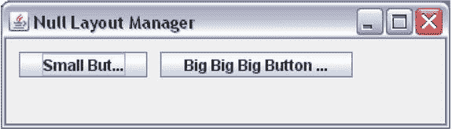

图 1-56。

A JFrame using a null layout manager

请注意，按钮的标签没有完全显示。这是你在使用`null`布局管理器时会遇到的问题之一。如果您试图在运行时调整`JFrame`的大小，您会注意到按钮不会自动调整大小，如果您使用了布局管理器，它们会自动调整大小。布局管理器根据平台、文本和字体来计算`JButton`的大小，而使用`null`布局管理器，你应该考虑所有这些因素来计算(大多数时候，你只是猜测)按钮的大小。在 Java 中使用`null`布局管理器不是一个好的实践，除非你正在原型开发或者学习`null`布局管理器。

## 创建可重用的 JFrame

在前面的章节中，您通过实例化`JFrame`类创建了一个`JFrame`，并使用该类的`main()`方法编写构建 GUI 的代码。您示例中的`JFrame`是不可重用的。到目前为止，您做得很好，因为 Swing 程序很简单，它们的唯一目的是在一个`JFrame`中显示一些组件。当您开始编写更复杂的 Swing 程序时，这种编程方式不会很好地工作。例如，假设您想在`JFrame`显示后使`JFrame`中的`JButton`不可见或被禁用。因为您已经将所有的`JButton`声明为`main()`方法中的局部变量，所以一旦`main()`方法执行完毕，您将无法访问它们的引用。为了使您的`JFrame`可重用，并保持添加到`JFrame`的组件的引用方便，以便您可以在以后引用它们，您需要改变创建`JFrame`的方法。

这是你创造`JFrame`的新方法。您创建自己的类，从`JFrame`类继承它，如下所示:

`public class CustomFrame extends JFrame {`

`// Code for CustomFrame goes here`

`}`

所有组件都在自定义类中声明为实例变量，如下所示:

`public class CustomFrame extends JFrame {`

`// Declare all components in the JFrame as instance variables`

`JButton okButton = new JButton("OK");`

`JButton cancelButton = new JButton("Cancel");`

`}`

您有一个向`JFrame`的内容窗格添加组件的`initFrame()`方法。您从自定义的构造函数`JFrame`中调用这个方法。Java 不需要方法`initFrame()`。这只是为 Swing 应用程序编写代码的惯例。为了显示您的`JFrame`，您实例化您的类并使其可见。这种方法有相似的代码，但排列方式不同，因此您可以编写一些更严肃的 Swing 程序。清单 1-22 完成了与清单 1-19 相同的事情。

清单 1-22。创建自定义 JFrame

`// CustomFrame.java`

`package com.jdojo.swing;`

`import javax.swing.JFrame;`

`import javax.swing.GroupLayout.Alignment;`

`import javax.swing.JButton;`

`import java.awt.Container;`

`import javax.swing.GroupLayout;`

`public class CustomFrame extends JFrame {`

`// Declare all components as instance variables`

`JButton b1 = new JButton("Button 1");`

`JButton b2 = new JButton("Little Bigger Button 2");`

`public CustomFrame(String title) {`

`super(title);`

`initFrame();`

`}`

`// Initialize the frame and add components to it.`

`private void initFrame() {`

`this.setDefaultCloseOperation(JFrame.EXIT_ON_CLOSE);`

`Container contentPane = this.getContentPane();`

`GroupLayout groupLayout = new GroupLayout(contentPane);`

`contentPane.setLayout(groupLayout);`

`groupLayout.setHorizontalGroup(`

`groupLayout.createSequentialGroup()`

`.addComponent(b1)`

`.addComponent(b2)`

`);`

`groupLayout.setVerticalGroup(`

`groupLayout.createParallelGroup(Alignment.BASELINE)`

`.addComponent(b1)`

`.addComponent(b2)`

`);`

`}`

`// Display the CustomFrame`

`public static void main(String[] args) {`

`CustomFrame frame = new CustomFrame("Custom Frame");`

`frame.pack();`

`frame.setVisible(true);`

`}`

`}`

## 事件处理

什么是事件？事件的字面意思是

"某事物在特定时间点的发生."

Swing 应用程序中事件的含义是相似的。Swing 中的事件是用户在特定时间点采取的动作。例如，在 Swing 应用程序中，按下按钮、按下键盘上的向下/向上键以及将鼠标移动到组件上方都是事件。有时，在 Swing(或任何基于 GUI 的应用程序)中发生的事件也被称为“触发事件”或“激发事件”当您说按钮上发生了单击事件时，您是指使用鼠标、空格键或应用程序允许您按下按钮的任何其他方式按下了按钮。有时你可以使用短语“点击事件已经在按钮上被触发或激发”来表示按钮已经被按下。

当事件发生时，您希望对事件做出响应。在程序中采取一个动作只不过是执行一段代码。为响应事件的发生而采取的行动称为事件处理。事件发生时执行的代码称为事件处理程序。有时，事件处理程序也称为事件侦听器。

如何编写事件处理程序取决于事件的类型和生成事件的组件。有时事件处理程序内置在 Swing 组件中，有时您需要自己编写事件处理程序。比如，当你按下一个`JButton`时，你需要自己编写事件处理程序。但是，当焦点在文本字段中时，如果按下键盘上的字母键，就会在文本字段中键入相应的字母，因为按键事件有一个由 Swing 提供的默认事件处理程序。

一个事件有三个参与者:

*   事件的来源
*   事件
*   事件处理程序(或事件监听器)

事件源是生成事件的组件。例如，当你按下一个`JButton`时，点击的事件发生在那个`JButton`上。在这种情况下，`JButton`是被点击事件的来源。

事件表示在源组件上发生的动作。Swing 中的事件由一个对象表示，该对象封装了事件的详细信息，例如事件的来源、事件发生的时间、事件发生的类型等。表示事件的对象的类是什么？这取决于所发生事件的类型。每种类型的事件都有一个类。例如，`java.awt.event`包中的`ActionEvent`类的一个对象代表一个`JButton`的点击事件。

我不会在本章讨论所有类型的事件。当我在第 2 章中讨论组件时，我将列出组件的重要事件。本节将解释如何在 Swing 应用程序中处理任何类型的事件。

事件处理程序是事件发生时执行的一段代码。像事件一样，事件处理程序也由对象表示，它封装了事件处理代码。哪个类的对象代表一个事件处理程序？这取决于事件处理程序应该处理的事件类型。事件处理程序也称为事件侦听器，因为它侦听源组件中发生的事件。在本章中，我将交替使用“事件处理程序”和“事件监听器”这两个短语。通常，事件侦听器是实现特定接口的对象。事件侦听器必须实现的特定接口取决于它将侦听的事件类型。例如，如果您对监听一个`JButton`的点击事件感兴趣(换句话说，如果您对处理一个`JButton`的点击事件感兴趣)，您需要一个实现`ActionListener`接口的类的对象，它在`java.awt.event`包中。

查看事件处理的三个参与者的描述，似乎您需要编写大量代码来处理一个事件。不完全是。事件处理比看起来容易。我将列出处理一个事件的步骤，然后是一个如何处理一个`JButton`的点击事件的例子。以下是处理事件的步骤。这些步骤适用于处理任何 Swing 组件上的任何类型的事件。

*   标识要为其处理事件的组件。假设您已经将组件命名为`sourceComponent`。所以你的事件源是`sourceComponent`。
*   标识要为源组件处理的事件。假设您对处理`Xxx`事件感兴趣。这里的`Xxx`是一个事件名，您必须用源组件的事件名来替换它。回想一下，一个事件由一个对象表示。事件类的 Java 命名约定可以帮助您识别对象代表`Xxx`事件的类的名称。对象代表`Xxx`事件的类被命名为`XxxEvent`。通常事件类在`java.awt.event`和`javax.swing.event`包中。
*   是时候为`Xxx`事件编写一个事件监听器了。回想一下，事件侦听器只不过是实现特定接口的类的对象。你怎么知道你需要在你的事件监听器类中实现什么特定的接口呢？在这里，Java 命名约定再次拯救了您。对于`Xxx`事件，您需要在事件监听器类中实现一个`XxxListener`接口。通常事件监听器接口在`java.awt.event`和`javax.swing.event`包中。`XxxListener`接口将有一个或多个方法。所有用于`XxxListener`的方法都接受一个类型为`XxxEvent`的参数，因为这些方法旨在处理一个`XxxEvent`。例如，假设您有一个`XxxListener`接口，它有一个名为`aMethod()`的方法，如`public interface XxxListener {` `void aMethod(XxxEvent event);` `}`所示，您的事件监听器类将如下所示。请注意，您将创建这个类。`public class MyXxxEventListener implements XxxListener {` `public void aMethod(XxxEvent event) {` `// Your event handler code goes here` `}` `}`
*   你差不多完成了。您已经确定了事件源、感兴趣的事件和事件侦听器。只有一样东西不见了。您需要让事件源知道您的事件监听器有兴趣监听它的`Xxx`事件。这也称为向事件源注册事件侦听器。向事件源注册事件侦听器类的对象。在您的例子中，您将创建一个`MyXxxEventListener`类的对象。`MyXxxEventListener myXxxListener = new MyXxxEventListener();`如何向事件源注册一个事件监听器？在这里，Java 命名约定再次派上了用场。如果一个组件(事件源)支持一个`Xxx`事件，它将有两个方法，`addXxxListener(XxxListener l)`和`removeXxxListener(XxxListener l)`。当您对组件的`Xxx`事件感兴趣时，您调用`addXxxListener()`方法，将事件侦听器作为参数传递。当你不想再监听组件的`Xxx`事件时，你调用它的`removeXxxListener()`方法。要添加您的`myXxxListener`对象作为`sourceComponent`的`Xxx`事件监听器，您需要编写`sourceComponent.addXxxListener(myXxxListener);`

这就是处理一个`Xxx`事件所需要做的一切。看起来你必须执行许多步骤来处理一个事件。然而，事实并非如此。你总是可以避免编写一个新的事件监听器类，它通过使用一个匿名内部类来实现`XxxListener`接口，这个匿名内部类实现了`XxxListener`接口。例如，您可以用两条语句编写上述代码，如下所示:

`// Create an event listener object using an anonymous inner class`

`XxxListener myXxxListener = new XxxListener() {`

`public void aMethod(XxxEvent event) {`

`// Your event handler code goes here`

`}`

`};`

`// Add the event listener to the event source component`

`sourceComponent.addXxxListener(myXxxListener);`

如果侦听器接口是一个函数接口，您可以使用 lambda 表达式来创建它的实例。您的`XxxListener`是一个函数接口，因为它只包含一个抽象方法。您可以避免创建庞大的匿名类，并将上面的代码重写如下:

`// Add the event listener using a lambda expressions`

`sourceComponent.addXxxListener((XxxEvent event) -> {`

`// Your event handler code goes here`

`});`

关于处理事件的理论，我已经讨论的够多了。是时候看一个例子了。向一个`JButton`添加一个事件监听器，然后向一个`JFrame`添加一个带有文本`Close`的`JButton`。当按下`JButton`时，`JFrame`关闭，应用程序退出。当按下`JButton`按钮时，会产生一个`Action`事件。一旦您知道了事件的名称，在本例中是`Action`，您只需要用单词`Action`替换前面通用示例中的`Xxx`。您将会知道您需要用来处理`JButton`的`Action`事件的类名和方法名。表 [1-6](#Tab6) 比较了用于处理`JButton`的`Action`事件的类/接口/方法的名称和我在讨论中使用的通用名称。

表 1-6。

A Comparison Between Generic Event Handlers With Action Event Handlers for a JButton

<colgroup><col> <col> <col></colgroup> 
| 通用事件 Xxx | JButton 的操作事件 | 评论 |
| --- | --- | --- |
| `XxxEvent` | `ActionEvent` | `java.awt.event`包中`ActionEvent`类的一个对象代表`JButton`的`Action`事件。 |
| `XxxListener` | `ActionListener` | 实现`ActionListener`接口的类的对象代表了`JButton`的`Action`事件处理程序。 |
| `addXxxListener` `(XxxListener l)` | `addActionListener` `(ActionListener l)` | 一个`JButton`的`addActionListener()`方法用于为它的`Action`事件添加一个监听器。 |
| `removeXxxListener` `(XxxListener l)` | `removeActionListener` `(ActionListener l)` | `JButton`的`removeActionListener()`方法用于移除其`Action`事件的监听器。 |

`ActionListener`界面很简单。它有一个叫做`actionPerformed()`的方法。接口声明如下:

`public interface ActionListener extends EventListener {`

`void actionPerformed(ActionEvent event);`

`}`

所有事件监听器接口都继承自`EventListener`接口，该接口在`java.util`包中。`EventListener`接口是一个标记接口，它没有任何方法。它只是充当所有事件侦听器接口的祖先。当一个`JButton`被按下时，它所有注册的`Action`监听器的`actionPerformed()`方法被调用。

使用 lambda 表达式，下面是如何将一个`Action`侦听器添加到一个`JButton`中:

`// Add an ActionListener to closeButton`

`closeButton.addActionListener(e -> System.exit(0));`

清单 1-23 显示了一个包含一个`JButton`的`JFrame`。它向`JButton`添加了一个`Action`监听器。`Action`监听器简单地退出应用程序。点击`JFrame`中的`Close`按钮将关闭应用程序。

清单 1-23。带有带动作的关闭按钮的 JFrame

`// SimplestEventHandlingFrame.java`

`package com.jdojo.swing;`

`import java.awt.FlowLayout;`

`import javax.swing.JFrame;`

`import javax.swing.JButton;`

`public class SimplestEventHandlingFrame extends JFrame {`

`JButton closeButton = new JButton("Close");`

`public SimplestEventHandlingFrame() {`

`super("Simplest Event Handling JFrame");`

`this.initFrame();`

`}`

`private void initFrame() {`

`this.setDefaultCloseOperation(EXIT_ON_CLOSE);`

`// Set a FlowLayout for the content pane`

`this.setLayout(new FlowLayout());`

`// Add the Close JButton to the content pane`

`this.getContentPane().add(closeButton);`

`// Add an ActionListener to closeButton`

`closeButton.addActionListener(e -> System.exit(0));`

`}`

`public static void main(String[] args) {`

`SimplestEventHandlingFrame frame =`

`new SimplestEventHandlingFrame();`

`frame.pack();`

`frame.setVisible(true);`

`}`

`}`

让我们再举一个将`Action`监听器添加到`JButton`的例子。这次，给一个`JFrame`添加两个按钮:一个`Close`按钮和另一个显示点击次数的按钮。每次单击第二个按钮时，它的文本都会更新，以显示它被单击的次数。您需要使用一个实例变量来维护点击计数。清单 1-24 包含了完整的代码。图 [1-57](#Fig57) 显示计数器按钮被点击三次后的`JFrame`。

清单 1-24。带有两个带动作的按钮的 JFrame

`// JButtonClickedCounter.java`

`package com.jdojo.swing;`

`import javax.swing.JFrame;`

`import java.awt.FlowLayout;`

`import java.awt.event.ActionEvent;`

`import javax.swing.JButton;`

`import java.awt.event.ActionListener;`

`public class JButtonClickedCounter extends JFrame {`

`int counter;`

`JButton counterButton = new JButton("Clicked #0");`

`JButton closeButton = new JButton("Close");`

`public JButtonClickedCounter() {`

`super("JButton Clicked Counter");`

`this.initFrame();`

`}`

`private void initFrame() {`

`this.setDefaultCloseOperation(EXIT_ON_CLOSE);`

`// Set a FlowLayout for the content pane`

`this.setLayout(new FlowLayout());`

`// Add two JButtons to the content pane`

`this.getContentPane().add(counterButton);`

`this.getContentPane().add(closeButton);`

`// Add an ActionListener to the counter JButton`

`counterButton.addActionListener(new ActionListener() {`

`public void actionPerformed(ActionEvent event) {`

`// Increment the counter and set the JButton text`

`counter++;`

`counterButton.setText("Clicked #" + counter);`

`}`

`});`

`// Add an ActionListener to closeButton`

`closeButton.addActionListener(new ActionListener() {`

`public void actionPerformed(ActionEvent event) {`

`// Exit the application, when this button is pressed`

`System.exit(0);`

`}`

`});`

`}`

`public static void main(String[] args) {`

`JButtonClickedCounter frame = new JButtonClickedCounter();`

`frame.pack();`

`frame.setVisible(true);`

`}`

`}`

图 1-57。

A JFrame when it is displayed and after the counter JButton is clicked three times

图 [1-58](#Fig58) 显示了处理`Action`事件所涉及的类和接口的类图。

图 1-58。

A class diagram for classes and interfaces realted to Action Event

注意，您没有创建一个`ActionEvent`类的对象。当按下`JButton`时，创建一个`ActionEvent`类的对象，并将其传递给事件处理程序对象的`actionPerformed()`方法。默认情况下，`ActionEvent`的`getActionCommand()`方法返回`JButton`的文本。您可以使用`setActionCommand()`方法为`JButton`显式设置动作命令文本。`getModifiers()`返回动作事件期间按住的`Shift`、`Ctrl`、`Alt`等修改键的状态。修饰键是键盘上的一个键，只有在与其他键结合使用时才有意义。`paramString()`方法返回一个描述动作事件的字符串。它通常用于调试目的。

`getActionCommand()`方法的用途之一是根据`JButton`上显示的文本采取一些行动。例如，您可能有一个`JButton`，用于显示或隐藏屏幕上的一些细节。假设您想将一个`JButton`的文本显示为`Show`或`Hide`。您可以如下编写它的`Action`监听器:

`JButton showHideButton = new JButton("Hide");`

`showHideButton.addActionListener(e -> {`

`if (e.getActionCommand().equals("Show")) {`

`// Show the details here...`

`showHideButton.setText("Hide");`

`}`

`else {`

`// Hide the details here...`

`showHideButton.setText("Show");`

`}});`

在本节中，您学习了如何为组件添加事件处理程序。例子很简单。他们给`JButton` s 添加了动作事件处理程序。`ActionListener`接口是一个函数接口，你可以利用 lambda 表达式来编写动作事件监听器。Swing 是在 lambda 表达式出现之前很久开发的。所有事件侦听器接口都不是函数接口，因此您不能使用 lambda 表达式来创建它们的对象。在这些情况下，可以使用匿名类、成员内部类，或者在主类中实现侦听器接口。

## 处理鼠标事件

您可以处理组件上的鼠标活动(单击、进入、退出、按下和释放)。您将使用一个`JButton`来试验鼠标事件。一个`MouseEvent`类的对象代表一个组件上的`Mouse`事件。现在，您可以猜测，要处理`Mouse`事件，您将需要使用`MouseListener`接口。下面是该接口的声明方式:

`public interface MouseListener extends EventListener {`

`public void mouseClicked(MouseEvent e);`

`public void mousePressed(MouseEvent e);`

`public void mouseReleased(MouseEvent e);`

`public void mouseEntered(MouseEvent e);`

`public void mouseExited(MouseEvent e);`

`}`

`MouseListener`接口有五个方法。不能使用 lambda 表达式创建鼠标事件处理程序。当特定的鼠标事件发生时，调用`MouseListener`接口的方法之一。例如，当鼠标指针进入组件的边界时，组件上发生鼠标输入事件，并调用鼠标监听器对象的`mouseEntered()`方法。当鼠标指针离开组件边界时，会发生鼠标退出事件，并调用`mouseExited()`方法。其他方法的名称不言自明。

`MouseEvent`类有许多提供鼠标事件细节的方法:

*   方法返回鼠标点击的次数。
*   当事件发生时，`getX()`和`getY()`方法返回鼠标相对于组件的 x 和 y 位置。
*   `getXOnScreen()`和`getYOnScreen()`方法返回事件发生时鼠标的绝对 x 和 y 位置。

假设您对处理`JButton`的两种鼠标事件感兴趣:鼠标进入和鼠标退出事件。`JButton`的文本发生变化以描述事件。鼠标事件处理程序代码如下:

`mouseButton.addMouseListener(new MouseListener() {`

`@Override`

`public void mouseClicked(MouseEvent e) {`

`// Nothing to handle`

`}`

`@Override`

`public void mousePressed(MouseEvent e) {`

`// Nothing to handle`

`}`

`@Override`

`public void mouseReleased(MouseEvent e) {`

`// Nothing to handle`

`}`

`@Override`

`public void mouseEntered(MouseEvent e) {`

`mouseButton.setText("Mouse has entered!");`

`}`

`@Override`

`public void mouseExited(MouseEvent e) {`

`mouseButton.setText("Mouse has exited!");`

`}`

`});`

在这段代码中，您为`MouseListener`接口的所有五个方法提供了一个实现，尽管您只对处理两种鼠标事件感兴趣。您将三个方法的主体留空。

清单 1-25 展示了一个`JButton`的鼠标进入和退出事件。当显示`JFrame`时，尝试将鼠标移进和移出`JButton`的边界，以改变其文本来指示适当的鼠标事件。

清单 1-25。处理鼠标事件

`// HandlingMouseEvent.java`

`package com.jdojo.swing;`

`import java.awt.FlowLayout;`

`import javax.swing.JFrame;`

`import javax.swing.JButton;`

`import java.awt.event.MouseListener;`

`import java.awt.event.MouseEvent;`

`public class HandlingMouseEvent extends JFrame {`

`JButton mouseButton = new JButton("No Mouse Movement Yet!");`

`public HandlingMouseEvent() {`

`super("Handling Mouse Event");`

`this.initFrame();`

`}`

`private void initFrame() {`

`this.setDefaultCloseOperation(EXIT_ON_CLOSE);`

`this.setLayout(new FlowLayout());`

`this.getContentPane().add(mouseButton);`

`// Add a MouseListener to the JButton`

`mouseButton.addMouseListener(new MouseListener() {`

`@Override`

`public void mouseClicked(MouseEvent e) {`

`}`

`@Override`

`public void mousePressed(MouseEvent e) {`

`}`

`@Override`

`public void mouseReleased(MouseEvent e) {`

`}`

`@Override`

`public void mouseEntered(MouseEvent e) {`

`mouseButton.setText("Mouse has entered!");`

`}`

`@Override`

`public void mouseExited(MouseEvent e) {`

`mouseButton.setText("Mouse has exited!");`

`}`

`});`

`}`

`public static void main(String[] args) {`

`HandlingMouseEvent frame = new HandlingMouseEvent();`

`frame.pack();`

`frame.setVisible(true);`

`}`

`}`

您是否总是必须为事件侦听器接口的所有事件处理方法提供实现，即使您对它们都不感兴趣？不，你没有。秋千的设计者考虑到了这种不便，并设计了一种方法来避免这种情况。Swing 为一些`XxxListener`接口提供了一个方便的类。这个类被命名为`XxxAdapter`。我将称它们为适配器类。一个`XxxAdapter`类被声明为抽象的，它实现了`XxxListener`接口。`XxxAdapter`类为`XxxListener`接口中的所有方法提供了空实现。下面的代码片段显示了具有两个方法`m1()`和`m2()`的`XxxListener`接口与其对应的`XxxAdapter`类之间的关系。

`public interface XxxListener {`

`public void m1();`

`public void m2();`

`}`

`public abstract class XxxAdapter implements XxxListener {`

`@Override`

`public void m1() {`

`// No implementation provided here`

`}`

`@Override`

`public void m2() {`

`// No implementation provided here`

`}`

`}`

并非所有事件侦听器接口都有相应的适配器类。声明多个方法的事件侦听器接口有一个对应的适配器类。例如，有一个名为`MouseAdapter`的用于`MouseListener`接口的适配器类。`MouseAdapter`对你有什么好处？它可以为您节省几行不必要的代码。如果您只想处理一些鼠标事件，您可以创建一个匿名内部类(或常规内部类),它继承自适配器类并覆盖您感兴趣的唯一方法。下面的代码片段使用`MouseAdapter`类重写了清单 1-28 中使用的事件处理程序:

`mouseButton.addMouseListener(new MouseAdapter() {`

`@Override`

`public void mouseEntered(MouseEvent e) {`

`mouseButton.setText("Mouse has entered!");`

`}`

`@Override`

`public void mouseExited(MouseEvent e) {`

`mouseButton.setText("Mouse has exited!");`

`}`

`});`

您可能会注意到，您不必担心`MouseListener`接口的其他三个方法，因为`MouseAdapter`类为您提供了空的实现。

对于`ActionListener`接口，没有名为`ActionAdapter`的适配器类。你能猜到为什么没有`ActionAdapter`课吗？由于`ActionListener`接口只有一个方法，提供一个适配器类不会为您节省任何击键。

请注意，使用适配器类来处理事件并没有什么特别的优势，除了节省一些击键。然而，它也有局限性。如果您希望通过使用主类本身来创建事件处理程序，则不能使用适配器类。通常，您的主类是从`JFrame`类继承的，Java 不允许您从多个类继承一个类。所以您不能从`JFrame`类继承您的主类以及适配器类。如果使用适配器类创建事件处理程序，则必须使用匿名内部类或常规内部类。

## 摘要

Swing 是一个使用 GUI 开发 Java 应用程序的小部件工具包。开发 Swing 应用程序中使用的大多数类都在`javax.swing`包中。GUI 由几个部分组成；每个部分代表一个图形，向用户显示信息，并让他们与应用程序进行交互。基于 Swing 的 GUI 应用程序中的每个部分都被称为一个组件，它是一个 Java 对象。可以包含其他组件的组件称为容器。容器和组件排列成父子层次结构。组件包含在一个容器中，该容器又可以包含在另一个容器中。存在两种类型的容器:顶级容器和非顶级容器。顶级容器不包含在另一个容器中，它可以直接显示在桌面上。例如，`JFrame`类的一个实例代表一个顶级容器，它是一个可以有标题栏、菜单栏、边框和其他组件的窗口。`JButton`类的一个实例代表一个组件。

顶级容器由许多层组成，如根窗格、分层窗格、玻璃窗格和内容窗格。组件被添加到内容窗格中。

Swing 提供了布局管理器，负责在容器中布局组件。布局管理器是一个负责确定要在容器中显示的组件的位置和大小的对象。每个容器都有一个默认的布局管理器。例如，`BorderLayout`是`JFrame`的默认布局管理器。你可以使用容器的`setLayout()`方法来设置不同的布局管理器。如果组件的布局管理器设置为`null`，则不使用布局管理器，您负责在容器中布局组件。

是所有布局管理器中最简单的，它先水平布局组件，然后垂直布局。`BorderLayout`将容器的空间分成五个区域(北、南、东、西、中),用于布局组件。`CardLayout`将容器中的组件排列成一叠卡片，一次只能看到一个组件。`BoxLayout`将组件水平排列成一行或垂直排列成一列。`GridLayout`将组件排列成大小相等的矩形网格，将每个组件放在一个单元格中。`GridBagLayout`在按行和列排列的矩形单元格网格中布置组件，其中每个组件占据一个或多个单元格。`SpringLayout`通过定义组件边缘之间的约束来布局组件；约束是根据弹簧定义的。`GroupLayout`通过形成连续和平行的组件组来布局组件。

事件表示用户操作，例如用户点击按钮。用户通过事件与 Swing 组件进行交互。在程序中采取行动来响应事件被称为事件处理。一个事件有三个参与者:事件源、事件和事件处理程序。事件源是生成事件的组件。事件由一个对象表示，该对象封装了导致事件发生的用户操作的详细信息。事件处理程序是响应事件发生而执行的特定接口的实例。允许您处理事件的组件包含添加和移除事件处理程序的方法。事件处理中使用的类、接口和方法遵循一种命名约定，这种约定使名称易于记忆。