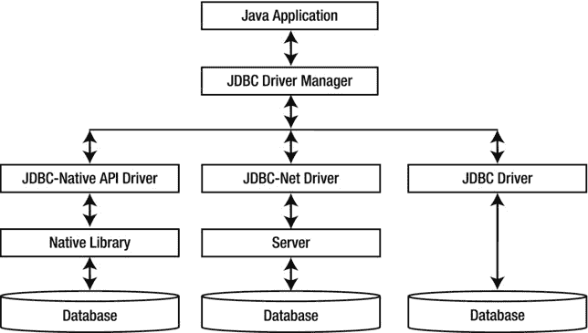
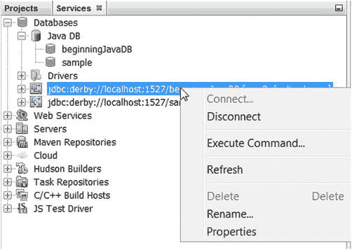
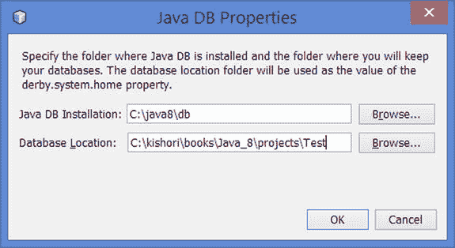
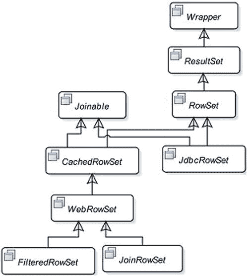

# 六、JDBC API

在本章中，您将学习

*   什么是 JDBC 空气污染指数
*   JDBC 司机的类型
*   Java DB 的简要概述
*   如何使用 JDBC 驱动程序连接到数据库
*   什么是事务隔离级别
*   JDBC 数据类型到 Java 数据类型的映射
*   如何在 Java 程序中执行 SQL 语句并处理结果
*   使用行集、批量更新和大型对象(lob)
*   如何检索 SQL 警告并启用 JDBC 跟踪

## 什么是 JDBC 空气污染指数？

JDBC API 提供了一个标准的独立于数据库的接口来与任何表格数据源进行交互。大多数时候，它用于与关系数据库管理系统(RDBMs)进行交互。但是，使用 JDBC API，可以与任何表格数据源进行交互，比如 Excel 电子表格、平面文件等。通常，您使用 JDBC API 来连接数据库、查询数据和更新数据。它还允许您使用独立于数据库的语法在数据库中执行 SQL 存储过程。

使用数据库的主要目的是管理业务数据。每个数据库都为开发人员提供了以下三种管理数据的方法:

*   标准的 SQL 语法
*   标准 SQL 语法的扩展，称为专有 SQL 语法
*   一种专有的编程语言

例如，Oracle 数据库使用 PL/SQL 作为编程语言，您可以用它来编写存储过程、函数和触发器。Microsoft SQL Server 使用 Transact-SQL (T-SQL)作为编程语言来编写存储过程、函数和触发器。如果您想要处理数据库中的一组行，您需要知道在特定的数据库相关语言中处理游标的语法和逻辑。使用 JDBC API 可以减轻您在不同数据库中学习不同语法来处理游标的痛苦。它要求您使用标准的 SQL 语法编写一个查询(`SELECT`语句)。它提供 Java APIs 以独立于数据库的方式处理查询的结果集。

使用 JDBC API 访问数据库中的数据隐藏了不同类型数据库中存在的实现差异。它通过使用接口定义其大多数 API 并让数据库供应商(或任何第三方供应商)提供这些接口的实现来实现数据库透明性。供应商提供的用于与特定数据库交互的实现类的集合称为 JDBC 驱动程序。不同的数据库(或同一数据库)有不同种类的 JDBC 驱动程序。它们的实现方式不同。一些 JDBC 驱动程序是用纯 Java 编写的。对于纯 Java 实现的 JDBC 驱动程序，您只需要在您的应用中包含供应商提供的类`CLASSPATH`。一些 JDBC 驱动程序需要在客户机上安装专有软件来与数据库交互。下一节讨论 JDBC 驱动程序类型。

## 系统需求

本章是关于使用 Java 程序与数据库交互的。您必须能够访问 Oracle 数据库、Microsoft SQL Server、Sybase 数据库、DB2、MySQL、Java DB 等数据库。您还需要为您的数据库安装 JDBC 驱动程序。一些 JDBC 驱动程序不需要特殊安装。相反，您可以通过将提供的 JDBC 驱动程序文件(通常是一个 JAR 文件)放在您机器上的`CLASSPATH`中来使用它们。如果您无权访问数据库和所需的 JDBC 驱动程序，您将无法运行本章中列出的示例。所有主要的数据库供应商都可以从他们的官方网站免费下载 JDBC 驱动程序。必要时，本章提供了在几个 DBMS(MySQL、Java DB (Apache Derby)、Oracle 数据库、DB2、Microsoft SQL Server 和 Sybase Adaptive Server Anywhere)中创建数据库对象和例程的语法和脚本。如果您使用 DBMS 来运行本章中的 JDBC 程序，除了这里列出的程序之外，您将需要参考 DBMS 文档以获得创建数据库对象的语法。

## JDBC 司机的类型

您可以在 Java 程序中使用三种类型的 JDBC 驱动程序来连接 DBMS。图 [6-1](#Fig1) 显示了这些 JDBC 驱动程序的架构。本节简要介绍这些类型的 JDBC 驱动程序。

图 6-1。

The architecture of JDBC drivers Note

在 Java 8 之前，JDBC API 提供了另一种叫做 JDBC-ODBC 桥的 JDBC 驱动程序。Java 8 中已经删除了这个驱动。

### JDBC 本地 API 驱动程序

JDBC 本地 API 驱动程序使用特定于 DBMS 的本地库来执行所有数据库活动。它将 JDBC 调用翻译成特定于 DBMS 的调用，DBMS 本地库与数据库通信。要使用这种类型的驱动程序，您必须安装特定于 DBMS 的客户端软件。它依赖于平台。

### JDBC 网络驱动程序

JDBC 网络驱动程序是用纯 Java 编写的。它需要一个服务器来处理数据库。驱动程序将 JDBC 调用转换为网络协议，并将调用传递给服务器。服务器将网络调用转换成特定于 DBMS 的调用。在客户机上运行的 JDBC 驱动程序不知道服务器将用来执行数据库活动的技术(或 DBMS 驱动程序类型)。服务器可以使用不同类型的数据库驱动程序连接到不同的数据库，并且对客户端是透明的。它是一个独立于平台的驱动程序。客户机只需要包含使用驱动程序所需的 Java 类。客户机上不需要额外安装。

### JDBC 司机

JDBC 驱动程序也称为直接数据库纯 Java 驱动程序。它是用纯 Java 编写的。它将 JDBC 调用转换为特定于 DBMS 的调用，并将这些调用直接发送到数据库。这是在Applet中使用的最合适的驱动程序类型。你所需要做的就是在你的应用或Applet中包含驱动 JAR/ZIP 文件。所有主要的 DBMS 供应商都提供这种类型的 JDBC 驱动程序。

## Java DB 的简要概述

您将需要访问关系数据库来运行本章中的示例。如果您没有访问数据库的权限，可以在安装 JDK 时使用安装在计算机上的 Java DB 数据库。Java DB 是一个基于 Java 编程语言和 SQL 的关系数据库管理系统。它是 Apache Derby 项目的 Oracle 版本。关于 Java DB 的技术文档可以在 [`http://docs.oracle.com/javadb/`](http://docs.oracle.com/javadb/) 找到。

在接下来的小节中，我将讨论 Java DB 入门所需的最基本的信息，比如如何在 Java DB 中启动、停止和运行 SQL 命令。

### Java DB 安装文件

假设`JDK_HOME`是您安装 JDK 的目录。例如，如果您在 Windows 上的`C:\java8`中安装了 JDK，`JDK_HOME`的值将是`C:\java8`；如果您在类似 UNIX 的操作系统上的`/home/ksharan/java8`中安装了 JDK，`JDK_HOME`的值将是`/home/ksharan/java8`。Java DB 文件安装在`JDK_HOME`的`db`子目录中。`db`目录包含两个子目录`bin`和`lib`。`bin`子目录包含许多用于数据库的命令文件。例如，`startNetworkServer.bat`文件用于在 Windows 上启动网络 Java DB 服务器，`startNetworkServer`用于在 UNIX 上启动网络 Java DB 服务器；您可以使用 Windows 上的`ij.bat`命令和 UNIX 上的`ij`命令连接到 Java DB 并运行 SQL 命令(`ij`代表交互式 Java DB)。`lib`子目录包含所有用于 Java DB 的 JAR 文件。

### 配置 Java 数据库

通常，安装 JDK8 后，不需要配置 Java DB。如果在启动数据库或从命令行运行 SQL 命令时遇到任何错误，您需要设置以下环境变量:

*   将`DERBY_HOME`环境变量设置为`JDK_HOME\db`目录。
*   将`JAVA_HOME`环境变量设置为`JDK_HOME`目录。
*   在`PATH`环境变量中包含`JDK_HOME\bin`目录。

当使用 Java DB 服务器和客户端应用时，需要在类路径中包含一些 Java DB 库。所有库都是位于`JDK_HOME\db\lib`目录下的 JAR 文件。表 [6-1](#Tab1) 包含 Java DB 库的列表。

表 6-1。

Libraries Used in Java DB Server and Client Applications

<colgroup><col> <col></colgroup> 
| 库名 | 描述 |
| --- | --- |
| `derby.jar` | 包含 Java DB 数据库引擎代码。用于在嵌入式模式下运行的 Java DB。对于在服务器模式下运行的 Java DB，服务器上需要它。 |
| `derbytools.jar` | 运行所有 Java DB 工具所需，如`ij`、`dblook`等。 |
| `derbyrun.jar` | 用于启动 Java DB 工具的可执行 JAR 文件。包括`CLASSPATH`中的这个文件还包括`CLASSPATH`中的`derby.jar`、`derbyclient.jar`、`derbytools.jar`、`derbynet.jar`文件。 |
| `derbynet.jar` | 包含 Java DB 网络服务器代码。需要启动 Java DB 网络服务器。 |
| `derbyclient.jar` | 包含 Java DB 网络客户端 JDBC 驱动程序。Java 应用需要通过网络连接到 Java DB 服务器。 |

### 运行 Java DB 服务器

Java DB 可以在两种模式下运行:

*   嵌入式模式
*   服务器模式

在嵌入式模式下，Java DB 是在与 Java 应用相同的 JVM 中为单用户 Java 应用启动的。Java 应用启动和停止 Java 数据库。这是学习使用 JDBC API 进行数据库编程的最合适的模式。在这种模式下，使用 Java DB 不需要进行任何设置。我将在后面详细解释如何使用这种模式。除非另有说明，本章中的所有示例都使用在此模式下运行的 Java DB。

在服务器模式下，多个用户可以通过网络同时使用 Java DB。Java DB 运行在一个单独的 JVM 中。在单独的 JVM 中运行的应用可能会连接到以这种模式运行的 Java DB。

您可以使用命令提示符或 NetBeans IDE 来管理 Java DB。以下部分将对两者进行解释。

#### 使用命令提示符

使用以下命令在服务器模式下启动 Java DB:

`c:\java8\db\bin> startNetworkServer`

`Tue Jun 17 23:25:27 CDT 2014 : Security manager installed using the Basic server security policy.`

`Tue Jun 17 23:25:27 CDT 2014 : Apache Derby Network Server - 10.10.1.3 - (1557168) started and ready to accept connections on port 1527`

您可能会在启动服务器时得到一个`AccessControlException`。错误消息可能如下所示:

`java.security.AccessControlException: access denied ("java.net.SocketPermission" "localhost:1527" "listen,resolve")`

要解决`AccessControlException`，您可以在没有安装安全管理器的情况下启动服务器，如下所示:

`c:\java8\db\bin> startNetworkServer -noSecurityManager`

您还可以通过在`JRE_HOME\lib\security\java.policy`文件中授予`listen`和`resolve`访问服务器启动所在的主机和端口的权限来解析。`java.policy`文件中的以下条目授予所需的访问权限:

`grant {`

`permission java.net.SocketPermission "localhost:1527", "listen";`

`};`

默认情况下，在服务器模式下，Java DB 从本地主机(或回送 IP 地址)和端口 1527 启动。如果要从其他计算机访问 Java DB，需要在命令行或属性文件中配置一些属性。

配置 Java DB 属性最简单的方法是在命令行上设置它们。以下命令启动 Java DB 服务器，该服务器在端口号 1537 处监听`myhost`:

`c:\java8\db\bin>startNetworkServer -h myhost -p 1537`

您还可以使用`java`命令来启动 Java DB 服务器。下面的命令启动 Java DB 服务器，另外设置`CLASSPATH`和`derby.system.home`属性:

`C:\java8\db\bin>java -classpath C:\java8\db\lib\derbynet.jar -Dderby.system.home=C:\myderbyhome org.apache.derby.drda.NetworkServerControl start -h localhost`

您可以在名为的文本文件中设置 Java DB 属性，该文件位于由`derby.system.home`属性指定的目录中。您可以在启动 Java DB 服务器时指定`derby.system.home`属性。如果没有指定`derby.system.home`属性，默认为当前工作目录。

我使用 NetBeans 为用户`ksharan`在 Windows 和 Linux 上运行 Java DB。默认情况下，NetBeans IDE 会将`derby.system.home`属性设置为用户主目录下的`.netbeans-derby`子目录。使用 NetBeans IDE，将`derby.properties`文件放在我的机器上，如下所示:

*   在 Windows 上:`C:\Users\ksharan\.netbeans-derby\derby.properties`
*   在 Linux 上:`/home/ksharan/.netbeans-derby/derby.properties`

将`derby.drda.host`属性设置为您希望在服务器模式下启动 Java DB 的主机名或 IP 地址。如果将该属性设置为 0.0.0.0，Java DB 将监听所有网络接口。设置`derby.drda.portNumber`属性来监听不同于默认端口 1527 的端口。以下是设置自定义主机和端口号的`derby.properties`文件的内容:

`# Contents of the derby.properties file`

`# Set the IP address 192.168.1.1 as the host`

`derby.drda.host=192.168.1.1`

`# Set 1528 as the port number`

`derby.drda.portNumber=1528`

使用以下命令停止在服务器模式下运行的 Java DB。请注意，您需要使用单独的命令提示符运行该命令。

`c:\java8\db\bin>stopNetworkServer`

`Tue Jun 17 23:26:49 CDT 2014 : Apache Derby Network Server - 10.10.1.3 - (1557168) shutdown`

Tip

Java DB 数据库服务器可以有几个数据库。Java DB 中的数据库是可移植的。每个数据库的文件都存储在单独的目录中。移动 Java DB 数据库就像移动该数据库的目录一样简单。该目录的名称与数据库名称相同。默认情况下，所有数据库目录都存储在`derby.system.home`属性中指定的目录中。

启动 Java DB 服务器后，您可以使用`ij`命令行工具连接到它并执行 SQL 命令。`ij`刀具位于`JDK\db\bin`目录中。假设 Java DB 服务器正在本地主机的端口 1527 上运行，下面的命令启动`ij`工具，连接到名为`beginningJavaDB`的 Java DB 数据库，执行`SELECT` SQL 语句，并使用`exit`命令退出工具。如果数据库中没有 person 表，那么在执行`SELECT`语句时可能会出现错误。

`c:\java8\db\bin>ij`

`ij version 10.10`

`ij> connect 'jdbc:derby://localhost:1527/beginningJavaDB';`

`ij> select * from person;`

`PERSON_ID  |FIRST_NAME          |LAST_NAME          |&|DOB      |INCOME`

`--------------------------------------------------------------------------`

`0 rows selected`

`ij> exit;`

`c:\java8\db\bin>`

如果希望在嵌入式模式下使用 Java DB 数据库，则不需要启动 Java DB 服务器。下面的命令设置类路径，设置`derby.system.home`属性，并启动`ij`工具。注意，该命令是在一行中输入的。启动`ij`工具后，我以嵌入式模式连接到`beginningJavaDB`数据库并执行 SQL 命令，如图所示。如果数据库中没有`person`表，那么在执行`SELECT`语句时可能会出错。

`c:\java8\db\bin>java -classpath C:\java8\db\lib\derbyrun.jar; -Dderby.system.home=C:\Users\ksharan\.netbeans-derby org.apache`

`.derby.tools.ij`

`ij version 10.10`

`ij>connect 'jdbc:derby:beginningJavaDB';`

`ij> select * from person;`

`PERSON_ID  |FIRST_NAME          |LAST_NAME          |&|DOB      |INCOME`

`--------------------------------------------------------------------------`

`0 rows selected`

`ij> exit;`

`c:\java8\db\bin>`

#### 使用 NetBeans IDE

使用 NetBeans IDE 时，使用 Java DB 很容易。您可以在 NetBeans IDE 的 Navigator 中使用“服务”选项卡来启动、停止和运行 Java DB 中的 SQL 命令。图 [6-2](#Fig2) 显示了 NetBeans IDE 中`Services`选项卡上`Databases`节点下的 Java DB。如果您没有看到`Services`选项卡，您可以通过选择菜单选项`Windows > Services`或按下`Ctrl + 5`来显示它。

图 6-2。

Using Java DB on the Services tab from inside the NetBeans IDE

要启动和停止 Java DB，请在`Services`选项卡上选择 Java DB 节点，右键单击并选择适当的选项。

Java DB 中的所有数据库都列在 Java DB 节点下。Java DB 安装了一个名为`sample`的预建数据库。您可以通过选择`Create Database`选项创建自己的数据库，如图 [6-2](#Fig2) 所示。

要连接到一个特定的数据库，选择 Java DB 节点下的数据库名称，右键单击，选择 connect 菜单选项，如图 [6-3](#Fig3) 所示。

图 6-3。

Connecting to a Java DB database from inside the NetBeans IDE

连接到数据库后，可以使用 NetBeans IDE 在该数据库中执行 SQL 命令。`Services`选项卡中的`Databases`节点包含每个 Java DB 数据库的一个`Database Connection`节点。为您的数据库选择数据库连接节点，点击右键，选择`Execute Command`菜单选项，如图 [6-4](#Fig4) 所示。它将打开一个 SQL 编辑器。您可以在 SQL 编辑器中输入 SQL 命令。要执行 SQL 命令，使用`Run SQL`工具栏按钮或按`Ctrl + Shift + E`。

图 6-4。

Executing SQL commands in Java DB from inside the NetBeans IDE

默认情况下，NetBeans IDE 将所有 Java DB 数据库存储在用户主目录中名为`.netbeans-derby`的子目录中。您可以使用“Java DB 属性”对话框来更改默认位置。通过选择图 [6-5](#Fig5) 所示的`Databases > Data DB > Right-click > Properties`菜单，可以打开 Java DB 属性对话框。

图 6-5。

Setting properties for Java DB in the NetBeans IDE

您可以使用图 [6-6](#Fig6) 所示的 Java DB 属性对话框更改默认的 Java DB 安装目录和数据库位置。图中显示我将默认数据库位置更改为 Windows 上的`C:\kishori\books\java_8\projects\Test`目录。

图 6-6。

The Java Db Properties dialog

## 创建数据库表

使用 JDBC API 的主要目的是操作数据库表中包含的数据。您可以使用 SQL 语句`SELECT`、`INSERT`、`UPDATE`和`DELETE`来操作表中的数据，这些语句直接使用表名。有时，您可能不会在 JDBC 调用中直接引用表名。相反，您可以使用 JDBC API 执行存储过程，存储过程使用表名。不管怎样，当你和 JDBC 一起工作时，你最终会使用表格。在本章的大部分时间里，您将使用一个表。你将把你的桌子命名为`person`。当您需要使用 JDBC 处理特定类型的数据库时，您可以在此过程中创建更多的表。假设您已经在自己选择的数据库中创建了一个名为`person`的表。表格描述如表格 [6-2](#Tab2) 所示。

表 6-2。

Generic Description of a Database Table Named Person

<colgroup><col> <col> <col> <col> <col></colgroup> 
| 列名 | 数据类型 | 长度 | 允许空值 | 评论 |
| --- | --- | --- | --- | --- |
| `person_id` | `integer` |   | `No` | `Primary Key` |
| `first_name` | `string` | `20` | `No` |   |
| `last_name` | `string` | `20` | `No` |   |
| `gender` | `string` | `1` | `No` |   |
| `Dob` | `date` |   | `Yes` |   |
| `income` | `double` |   | `Yes` |   |

此表中显示的列的数据类型是通用的。您需要使用特定于您的 DBMS 的数据类型。例如，对于`first_name`列，您可以在 Oracle 数据库中使用数据类型`varchar2(20)`,在 SQL Server 数据库中使用数据类型`varchar(20)`。类似地，对于`person_id`列，您可以在 Oracle 数据库中使用数据类型`number(8, 0)`，在 SQL Server 数据库中使用数据类型`int`。

每个 DBMS 都提供了一个工具，或者是基于字符的，或者是图形的，或者两者都有，让你使用数据库对象，如表、存储过程、函数等。例如，您可以使用来自 Oracle 的用于 Oracle DBMS 的 Oracle SQL*PLUS 工具、来自 Microsoft 的用于 SQL Server DBMS 的 SQL Server Management Studio 工具、来自 Sybase 的用于 Adaptive Server Anywhere (ASA)的 Interactive SQL 工具等。

以下部分展示了在不同数据库中创建`person`表的数据库脚本。您需要查阅数据库文档，了解如何运行脚本来创建`person`表。

Note

所有创建表和存储过程的数据库脚本都可以在本书的源代码所在的`dbscripts\<DBMS-Name>`目录下找到，其中`<DBMS-Name>`是 Oracle、DB2 等 DBMS 的名称。

### 甲骨文数据库

`create table person (`

`person_id number(8,0) not null,`

`first_name varchar2(20) not null,`

`last_name varchar2(20) not null,`

`gender char(1) not null,`

`dob date,`

`income number(10,2),`

`constraint pk_person primary key(person_id)`

`);`

### Adaptive Server Anywhere 数据库

`create table` `(`

`person_id integer not null default null,`

`first_name varchar(20) not null default null,`

`last_name varchar(20) not null default null,`

`gender char(1) not null default null,`

`dob date null default null,`

`income double null default null,`

`primary key (person_id)`

`);`

### SQL Server 数据库

`create table person (`

`person_id int NOT NULL,`

`first_name varchar(20) NOT NULL,`

`last_name varchar(20) NOT NULL,`

`gender char(1) NOT NULL,`

`dob datetime NULL,`

`income decimal(10,2) NULL,`

`constraint pk_person primary key (person_id)`

`);`

### DB2 数据库

`create table person (`

`person_id integer not null,`

`first_name varchar(20) not null,`

`last_name varchar(20) not null,`

`gender character (1)  not null,`

`dob date,`

`income double,`

`constraint pk_person_id primary key (person_id)`

`);`

### MySQL 数据库

`create table` `(`

`person_id integer not null primary key,`

`first_name varchar(20) not null,`

`last_name varchar(20) not null,`

`gender char(1) not null,`

`dob datetime null,`

`income double null`

`);`

### Java DB 数据库

`create table` `(`

`person_id integer not null,`

`first_name varchar(20) not null,`

`last_name varchar(20) not null,`

`gender char(1) not null,`

`dob date,`

`income double,`

`primary key(person_id)`

`);`

您可以运行清单 6-3 中显示的程序，在 Java DB 中创建 person 表。要在另一个数据库中创建 person 表，您可能需要更改程序中的`CREATE TABLE`语法。

## 连接到数据库

以下是连接到数据库时需要遵循的步骤。

*   获取 JDBC 驱动程序，并将其添加到您机器上的`CLASSPATH`环境变量中。
*   用`DriverManager`注册 JDBC 驱动程序。
*   构造一个连接 URL。
*   使用`DriverManager`的`getConnection()`静态方法建立连接。

以下部分详细描述了这些步骤。

### 获取 JDBC 驱动程序

在使用 JDBC 连接到数据库之前，您需要有数据库的 JDBC 驱动程序。您可以从数据库供应商那里获得 JDBC 驱动程序。例如，如果您正在使用 Oracle DBMS，您可以从其官方网站 [`www.oracle.com`](http://www.oracle.com/) 下载 JDBC 驱动程序。所有支持 JDBC 的数据库供应商都会让你从他们的官方网站免费下载他们 DBMS 的 JDBC 驱动程序。通常，JDBC 驱动程序捆绑在一个或多个 JAR/ZIP 文件中。

如果您使用的是 Java DB，当您安装 JDK 时，JDBC 驱动程序会被复制到您的机器上。您不需要下载任何额外的 JDBC 驱动程序。

### 设置类路径

如果您正在使用 JDBC 驱动程序，您需要将您的 JDBC 驱动程序的 JAR/ZIP 文件放在您机器上的`CLASSPATH`中，以便您的 Java 程序可以使用为您的数据库实现 JDBC 驱动程序的 Java 类。

如果您正在使用 Java DB，请参考表 [6-1](#Tab1) 中您将需要在您的案例中使用的 JAR 文件。为了在嵌入式模式下运行本章中所有使用 Java DB 的例子，您将需要在`CLASSPATH`中的`derby.jar`文件。`derby.jar`文件是在嵌入式模式下使用 Java DB 所需的 JDBC 驱动程序。如果您通过网络连接到 Java DB，您将需要在`CLASSPATH`中包含`derbyclient.jar`文件。

### 注册一个 JDBC 司机

您需要注册一个 JDBC 驱动程序，您想用它来连接数据库。一个 JDBC 驱动程序在该类中注册。

什么是 JDBC 司机？从技术上讲，JDBC 驱动程序是一个实现了`java.sql.Driver`接口的类。DBMS 供应商提供 JDBC 驱动程序类以及它使用的任何其他类。在向`DriverManager`类注册之前，您必须知道 JDBC 驱动程序类的名称。如果您不知道驱动程序类的名称，请参考 DBMS 的 JDBC 驱动程序文档。

在下一节中，我将列出一些 DBMSs 的驱动程序类名。根据 DBMS 的版本或驱动程序类的供应商，该名称可能会有所不同。有时不同的供应商为相同的 DBMS 提供驱动程序。不同的供应商将使用不同的驱动程序类名和不同的连接 URL 格式来连接到相同的 DBMS。

为什么需要用`DriverManager`注册 JDBC 司机？Java 不知道如何连接到数据库。它依赖于 JDBC 驱动程序来连接数据库。把 JDBC 驱动程序想象成一个 Java 类，它的对象将被`DriverManager`用来连接数据库。问题是，“T2 如何知道您想要用来连接数据库的 JDBC 驱动程序？”当然，它自己没有办法知道 JDBC 驱动程序。因此，向`DriverManager`注册一个驱动程序只是告诉`DriverManager`你的 JDBC 驱动程序类名。通过注册一个 JDBC 驱动程序，你告诉`DriverManager`如果你要求`DriverManager`建立一个数据库连接，它需要尝试使用这个驱动程序。你能用`DriverManager`注册多个 JDBC 驱动吗？是的。您可以注册多个 JDBC 驱动程序。当您需要建立到数据库的连接时，您必须将一个连接 URL 传递给`DriverManager`。`DriverManager`将连接 URL 逐个传递给所有注册的驱动程序，并要求它们使用您在连接 URL 中提供的信息连接到数据库。如果驱动程序识别出连接 URL，它将连接到数据库并将连接返回给`DriverManager`。接口的对象表示 Java 程序中的数据库连接。如果没有一个注册的驱动程序识别一个连接 URL，`DriverManager`将抛出一个`SQLException`,声明它找不到合适的驱动程序。

向`DriverManager`注册 JDBC 驾驶员有三种方式:

*   通过设置`jdbc.drivers`系统属性
*   通过将驱动程序类装入 JVM
*   通过使用`DriverManager`类的`registerDriver()`方法

### 设置 jdbc.drivers 系统属性

您可以使用系统属性注册 JDBC 驱动程序类名。您可以在您的计算机中全局设置该属性；您可以在运行应用时在命令行上传递此属性，也可以使用方法在应用中设置此属性。冒号分隔每个要注册的驱动程序。以下是一些例子:

`// Register Sybase and Oracle drivers in the Java code`

`String drivers = "com.sybase.jdbc2.jdbc.SybDriver:oracle.jdbc.driver.OracleDriver";`

`System.setProperty("jdbc.drivers", drivers);`

`// Pass driver names to be registered as command-line arguments.`

`// The following command is entered in one line.`

`java -Djdbc.drivers=com.sybase.jdbc2.jdbc.SybDriver:oracle.jdbc.driver.OracleDriver com.jdojo.jdbc.Test`

### 加载驱动程序类

您可以创建驱动程序类的对象。当驱动程序类被加载到 JVM 中时，它向`DriverManager`注册自己。对于要加载的类，您可以使用一个`Class.forName("driver class name")`方法或创建该类的一个对象，如下所示:

`// Register the Oracle JDBC driver`

`new oracle.jdbc.driver.OracleDriver();`

`// Register the Oracle JDBC driver using the Class.forName() method.`

`// Exception handling has been omitted.`

`Class.forName("oracle.jdbc.driver.OracleDriver")`

`// Register the Java DB embedded driver`

`new org.apache.derby.jdbc.EmbeddedDriver();`

`// Register the Java DB network client driver`

`new org.apache.derby.jdbc.ClientDriver();`

您不需要保留驱动程序对象的引用，因为目标是在 JVM 中加载驱动程序类。当驱动程序的类被加载到 JVM 中时，驱动程序类的静态初始化器被执行，其中驱动程序类向`DriverManager`注册自己。

### 使用 registerDriver()方法

你可以用一个 JDBC 驱动类的对象调用`DriverManager`类的`registerDriver(java.sql.Driver driver)`静态方法来注册 JDBC 驱动。

`// Register the Oracle JDBC driver with DriverManager`

`DriverManager.registerDriver(new oracle.jdbc.driver.OracleDriver());`

`// Register the Java DB embedded driver`

`DriverManager.registerDriver(new org.apache.derby.jdbc.EmbeddedDriver());`

`// Register the Java DB network client driver`

`DriverManager.registerDriver(new org.apache.derby.jdbc.ClientDriver());`

您可以按照上述三种方法之一注册 JDBC 驱动程序。第一种方式更灵活。它让您无需更改 Java 代码就可以更改 JDBC 驱动程序。您还可以使用系统属性或作为命令行参数来指定连接 URL(下面将讨论)。这样，您不仅可以使用不同的 JDBC 驱动程序，还可以使用不同的 DBMS，而无需修改 Java 代码。

### 构建连接 URL

使用连接 URL 建立数据库连接。连接 URL 的格式取决于 DMBS 和 JDBC 驱动程序。连接 URL 有三个部分。冒号分隔连接 URL 的两个部分。定义连接 URL 的语法是

`<protocol>:<sub-protocol>:<data-source-details>`

`<protocol>`部分总是被设置为`jdbc`。`<sub-protocol>`部分是特定于供应商的。`<data-source-details>`部分是 DBMS 特有的，用于定位数据库。在某些情况下，您还可以在 URL 的最后部分指定一些连接属性。以下是使用 Oracle 瘦 JDBC 驱动程序连接到 Oracle DBMS 的连接 URL 示例:

`jdbc:oracle:thin:@localhost:1521:chanda`

一如既往，协议部分是`jdbc`。子协议部分是`oracle:thin`，它将甲骨文公司标识为供应商，以及它将使用的驱动程序类型，即`thin`。数据源细节部分是`@localhost:1521:chanda`。它有三个子部分。`@localhost`标识服务器名。您可以使用 Oracle 数据库服务器的 IP 地址或机器名。然后，它包含运行 Oracle 传输网络底层(TNS)监听程序的端口号。最后一部分是 Oracle 的实例名，在本例中是`chanda`。以下是在 Java DB 服务器中标识数据库的连接 URL 的另一个示例:

`jdbc:derby://192.168.1.3:1527/beginningJavaDB;create=true`

一如既往，协议部分是`jdbc`。子协议部分是`derby`，它标识 Apache Derby DBMS。回想一下，Java DB 是 Oracle 发布的 Apache Derby 项目。`192.168.1.3:1527`部分是运行 Java DB 服务器的机器的 IP 地址和端口号。数据库名为`beginningJavaDB`。最后一部分，`create=true`，是连接属性，表示如果名为`beginningJavaDB`的数据库不存在，就用这个名称创建一个新的数据库。

以下部分描述了某些 DBMSs 的连接 URL 的格式。您需要访问供应商的官方网站来下载特定的 JDBC 驱动程序。您还可以在供应商的网站上获得有关使用 JDBC 驱动程序的详细信息。

#### Oracle 数据库

`DBMS:`

`Vendor: Oracle Corporation`

`Web Site:`[`http://www.oracle.com`T3】](http://www.oracle.com/)

`Driver Type: JDBC Driver (thin - Pure Java)`

`URL Format: jdbc:oracle:thin:@<server>:<port>:<instance>`

`URL Example: jdbc:oracle:thin:@localhost:1521:chanda`

`Driver Class: oracle.jdbc.driver.OracleDriver`

100%用 Java 实现。如果您使用瘦 Oracle 驱动程序，则不需要安装任何特定于 Oracle 的配置软件。如果您在 applet 中使用 JDBC 连接到 Oracle 数据库，您应该使用以下驱动程序:

`DBMS: Oracle 10g`

`Vendor: Oracle Corporation`

`Web Site:`[`http://www.oracle.com`T3】](http://www.oracle.com/)

`Driver Type: JDBC-Native Driver (OCI - Oracle Call Interface)`

`URL Format: jdbc:oracle:oci:@<tns-alias>`

`URL Example: jdbc:oracle:oci:@orcl`

`Driver Class: oracle.jdbc.driver.OracleDriver`

您需要安装 Oracle 客户端软件才能使用 OCI 驱动程序。JDBC 驱动程序将标准的 JDBC 呼叫转换为 OCI 呼叫，然后发送到数据库。URL 的`<tns-alias>`部分来自于`tnsnames.ora`文件中的一个条目。`tnsnames.ora`文件中典型的 TNS 别名条目如下所示:

`ORCL =`

`(DESCRIPTION =`

`(ADDRESS = (PROTOCOL = TCP)(HOST = HYE6754)(PORT = 1521))`

`(CONNECT_DATA =`

`(SERVER = DEDICATED)`

`(SERVICE_NAME = orcl)`

`)`

`)`

Oracle JDBC 驱动程序还允许您将 TNS 别名的整个文本指定为 JDBC 连接 URL 的一部分，如下所示:

`String dbURL="jdbc:oracle:oci:@(DESCRIPTION =" +`

`"(ADDRESS = (PROTOCOL = TCP)(HOST = HYE6754)(PORT = 1521))" +`

`"(CONNECT_DATA =(SERVER = DEDICATED)(SERVICE_NAME = orcl)))";`

#### Adaptive Server Anywhere 数据库

`DBMS:`

`Driver Type: JDBC Driver (Pure Java)`

`Vendor: Sybase Inc.`

`Web Site:`[`http://www.sybase.com`T3】](http://www.sybase.com/)

`URL Format: jdbc:sybase:Tds:<server>:<port>`

`URL Example: jdbc:sybase:Tds:localhost:2638`

`Driver Class: com.sybase.jdbc2.jdbc.SybDriver`

#### SQL Server 数据库

您可以使用以下两种 JDBC 驱动程序之一来连接到 SQL Server 数据库:

`// Driver #`

`DBMS: SQL Server`

`Vendor: Microsoft Corporation`

`Web Site:`[`http://www.microsoft.com`T3】](http://www.microsoft.com/)

`Driver Type: JDBC Driver (Pure Java)`

`URL Format: jdbc:SQLserver://<server>:<port>`

`URL Example: jdbc:SQLserver://HYE6754:1433;Database=chanda`

`Driver Class: com.microsoft.SQLserver.jdbc.SQLServerDriver`

`// Driver #2`

`DBMS: SQL Server`

`Vendor: SourceForge Inc.`

`Web Site:`[`http://www.sourceforge.net`T3】](http://www.sourceforge.net/)

`Driver Type: JDBC Driver (Pure Java)`

`URL Format: jdbc:jtds:<server_type>://<server>:<port>/<database>;<props>`

`URL Example: jdbc:jtds:sqlserver://HYE6754:1433/chanda`

`Driver Class: net.sourceforge.jtds.jdbc.Driver`

当您使用驱动程序#2 时，您可以将`sqlserver`或`sybase`指定为`<server_type>`，以分别连接到 SQL Server 或 Sybase DBMS。`<props>`是一个逗号分隔的`property=value`对列表，其中`property`是数据库属性的名称，`value`是其值。例如，如果您想指定用户和密码作为 URL 的一部分，您可以使用`<props>`作为`user=myuserid;password=mysecretpassword`。

URL 的部分内容`<port>`、`<database>`和`<props>`是可选的。如果不指定它们，将使用它们的默认值。对于 SQL Server，`<port>`的默认值是 1433，对于 Sybase 是 7100。

#### MySQL 数据库

`DBMS: MySQL Server 5.`

`Vendor: Oracle Corporation`

`Web Site:`[`http://www.oracle.com`T3】](http://www.oracle.com/)

`Driver Type: JDBC Driver (Pure Java)`

`URL Format: jdbc:mySQL://<server>:<port>/<database>?<props>`

`URL Example: jdbc:mySQL://HYE6754:3306/chanda`

`Driver Class: com.mySQL.jdbc.Driver`

对于 MySQL 数据库，连接 URL 中的大多数部分都是可选的。例如，您可以使用 MySQL 的最短连接 URL 作为`jdbc:mySQL://`，所有其他部分将被假定为它们的默认值。`<server>`和`<port>`的默认值为`localhost`和`3306`。您可以提供一个逗号分隔的`<server>:<port>`值列表，用作故障转移服务器。如果不提供`<database>`的值，可以在建立连接后调用`Connection`对象上的`setCatalog("catalog name")`方法，或者在所有查询中提供目录名。您已经在示例 URL 中指定了`chanda`作为您的数据库。`<props>`是一个由符号(&)分隔的`name=value`对列表。例如，您可以通过连接 URL 传递用户 id 和密码，如下所示。它使用 root 作为用户 id，使用`chanda`作为密码。

`jdbc:mySQL://localhost:3306/chanda?user=root&password=chanda.`

#### DB2 数据库

`DBMS:`

`Vendor: IBM`

`Web Site:`[`http://www.ibm.com`T3】](http://www.ibm.com/)

`Driver Type: JDBC Driver (Pure Java)`

`URL Format: jdbc:db2://<server>:<port>/<database>?<props>`

`URL Example: jdbc:db2://localhost:50000/chandaDB`

`Driver Class: com.ibm.db2.jcc.DB2Driver`

您可以使用`jdbc:db2:`或`jdbc:db2j:net:`作为 URL 的初始部分。如果 URL 以`jdbc:db2:`开头，则表明该连接是到 DB2 UDB 家族中的一个服务器。如果 URL 以`jdbc:db2j:net:`开头，则表明该连接是到一个远程 IBM(R)Cloudscape(TM)服务器的。URL 中的`<props>`部分是数据库连接的`name=value`对属性的逗号分隔列表。例如，以下 URL 将`user`和`password`属性分别指定为`admin`和`secret`:

`jdbc:db2://localhost:5021/chandaDB:user=admin;password=secret;`

有关可以在 JDBC 连接 URL 中设置的属性的更多详细信息，请访问 IBM 的官方网站。

#### Java DB 数据库

`DBMS: Java DB (Apache Derby)`

`Web Site:`[`http://www.oracle.com`T3】](http://www.oracle.com/)

`Driver Type: JDBC Driver (Pure Java)`

`URL Format: jdbc:derby://<server>:<port>/<database>;<props>`

`URL Example: jdbc:derby://localhost:1527/beginningJavaDB;create=true`

`Driver Class: org.apache.derby.jdbc.`

默认的用户名和密码分别是`app`和`app`。属性`create=true`被指定为创建一个空数据库，如果它不存在的话。Java DB 还有其他类型的 JDBC 驱动程序。当 Java DB 作为服务器运行并且您的应用作为客户机访问它时，客户机驱动程序允许您连接到它。还可以在应用运行的同一个 JVM 中启动 Java DB，应用和 Java DB 将在同一个进程中运行。当 Java DB 与您的应用在同一个进程中运行时，您可以使用嵌入式 JDBC 驱动程序来访问数据库。

为嵌入式 Java DB 加载 JDBC 驱动程序会启动 Java DB 数据库。以下是在嵌入式模式下启动 Java DB 并连接到名为`beginningJavaDB`的数据库的连接 URL 示例:

`jdbc:derby:beginningJavaDB`

回想一下，Java DB 数据库有一个与数据库名称同名的目录。JDBC 驱动程序如何使用这个连接 URL 找到`beginningJavaDB`目录？它将使用由`derby.system.home`属性指定的目录。如果未指定属性，它将使用当前目录。以下 java 命令通过指定`derby.system.home`属性来启动 Java 应用:

`java -Dderby.system.home=C:\myDatabases com.jdojo.jdbc.MyApp`

如果在`MyApp`类中使用数据库名，将在`C:\myDatabases`目录中进行搜索。

您还可以在连接 URL 中指定数据库目录的完整路径。以下连接 URL 指定了 Windows 上数据库的完整路径:

`jdbc:derby:C:/myDatabases/beginningJavaDB`

在数据库完整路径中，您可以在 Windows 和 UNIX 上使用正斜杠作为路径分隔符。

如果您的数据库目录在类路径中，您可以使用`classpath`子协议构造一个连接 URL，如下所示:

`jdbc:derby:classpath:beginningJavaDB`

连接 URL 将在类路径中寻找一个`beginningJavaDB`目录。如果你的数据库在`test`目录下的某个目录的类路径中，你可以如下构造连接 URL:

`jdbc:derby:classpath:test/beginningJavaDB`

Java DB 非常灵活，允许您指定连接 URL。它还允许您从 JAR/ZIP 文件访问只读数据库。以下连接 URL 在`C:\myDatabases.jar`文件中的测试目录下查找`beginningJavaDB`数据库:

`jdbc:derby:jar:(C:/myDatabases.jar)test/beginningJavaDB`

### 建立数据库连接

是时候连接到数据库了。您需要使用`DriverManager`类的`getConnection()`静态方法来建立到数据库的连接。它返回一个`java.sql.Connection`接口的对象，代表数据库连接。`getConnection()`方法使用一个`java.util.Properties`对象接受一个连接 URL、一个用户 id、一个密码和任意数量的名称-值对。`getConnection()`方法被重载:

*   `static Connection getConnection(String url) throws SQLException`
*   `static Connection getConnection(String url, Properties info) throws SQLException`
*   `static Connection getConnection(String url, String user, String password) throws SQLException`

您会发现，使用 JDBC 驱动程序对数据库进行的几乎每个操作都需要处理异常，这很烦人。这是一个检查过的异常，编译器会通过将代码放在`try-catch`块中或者使用`throws`子句来强制您处理它。即使你只写了一行代码，你最终也会使用一个`try-catch`块。您将为一行代码创建一个带有一些静态方法的实用程序类，它将为您处理异常。每当您需要使用这种单行代码功能时，您将使用实用程序类方法，而不是直接使用 JDBC 方法。这种方法将避免本章示例中臃肿的代码。

以下代码片段建立了与运行在嵌入式模式下的 Java DB 中名为`beginningJavaDB`的数据库的连接:

`// Register the JDBC driver`

`Driver derbyEmbeddedDriver = new org.apache.derby.jdbc.EmbeddedDriver();`

`DriverManager.registerDriver(derbyEmbeddedDriver);`

`// Prepare the connection URL`

`String dbURL = "jdbc:derby:beginningJavaDB;create=true";`

`Connection conn = null;`

`try {`

`conn = DriverManager.getConnection(dbURL, "root", "chanda");`

`System.out.println("Connected to database successfully");`

`// Perform database activities here...`

`}`

`catch(SQLException e) {`

`e.printStackTrace();`

`}`

`finally {`

`if (conn != null) {`

`try {`

`// Close the connection`

`conn.close();`

`}`

`catch (SQLException e) {`

`e.printStackTrace();`

`}`

`}`

`}`

连接接口从接口继承。这意味着你也可以使用一个`try-with-resources`块来获得一个`Connection`，当控件退出`try`块时，这个`Connection`会自动关闭。您可以使用`try-with-resources`块重写上述代码，如下所示:

`// Register the JDBC driver`

`Driver derbyEmbeddedDriver = new org.apache.derby.jdbc.EmbeddedDriver();`

`DriverManager.registerDriver(derbyEmbeddedDriver);`

`// Prepare the connection URL`

`String dbURL = "jdbc:derby:beginningJavaDB;create=true";`

`try (``Connection conn = DriverManager.getConnection(dbURL, "root", "chanda")`T2】

`System.out.println("Connected to database successfully");`

`// Perform database activities here...`

`}`

`catch (SQLException e) {`

`e.printStackTrace();`

`}`

如果您需要连接到任何其他数据库，您将需要更改两件事:您注册的 JDBC 驱动程序和连接 URL。驱动程序和连接 URL 都是特定于 DBMS 的。注意代码中使用了`try-catch-finally`块。当您完成一个数据库连接时，您需要使用`Connection`对象的`close()`方法来关闭它。`Connection`对象的方法抛出一个`SQLException`，迫使你使用另一个`try-catch`块。在典型的 Java 程序中，您不会在连接到数据库后立即关闭连接。您将使用`Connection`对象来执行一些数据库活动，然后关闭连接。

清单 6-1 包含了一个`JDBCUtil`类的代码，你将在本章中使用它来处理数据库连接。它的所有方法都是静态的，用于建立和关闭数据库连接、关闭`Statement`、关闭`ResultSet`、提交事务、回滚事务等。我将在本章后面讨论`Statement`和`ResultSet`对象。

清单 6-1。将用于处理数据库的实用程序类

`// JDBCUtil.java`

`package  com.jdojo.jdbc;`

`import java.sql.Connection;`

`import java.sql.Driver;`

`import java.sql.DriverManager;`

`import java.sql.ResultSet;`

`import java.sql.SQLException;`

`import java.sql.Statement;`

`public class JDBCUtil {`

`public static Connection getConnection() throws SQLException {`

`// Register the Java DB embedded JDBC driver`

`Driver derbyEmbeddedDriver = new org.apache.derby.jdbc.EmbeddedDriver();`

`DriverManager.registerDriver(derbyEmbeddedDriver);`

`// Construct the connection URL`

`String dbURL = "jdbc:derby:beginningJavaDB;create=true;";`

`String userId = "root";`

`String password = "chanda";`

`// Get a connection`

`Connection conn = DriverManager.getConnection(dbURL, userId, password);`

`// Set the auto-commit off`

`conn.setAutoCommit(false);`

`return conn;`

`}`

`public static void closeConnection(Connection conn) {`

`try {`

`if (conn != null) {`

`conn.close();`

`}`

`}`

`catch (SQLException e) {`

`e.printStackTrace();`

`}`

`}`

`public static void closeStatement(Statement stmt) {`

`try {`

`if (stmt != null) {`

`stmt.close();`

`}`

`}`

`catch (SQLException e) {`

`e.printStackTrace();`

`}`

`}`

`public static void closeResultSet(ResultSet rs) {`

`try {`

`if (rs != null) {`

`rs.close();`

`}`

`}`

`catch (SQLException e) {`

`e.printStackTrace();`

`}`

`}`

`public static void commit(Connection conn) {`

`try {`

`if (conn != null) {`

`conn.commit();`

`}`

`}`

`catch (SQLException e) {`

`e.printStackTrace();`

`}`

`}`

`public static void rollback(Connection conn) {`

`try {`

`if (conn != null) {`

`conn.rollback();`

`}`

`}`

`catch (SQLException e) {`

`e.printStackTrace();`

`}`

`}`

`public static void main(String[] args) {`

`Connection conn = null;`

`try {`

`conn = JDBCUtil.getConnection();`

`System.out.println("Connetced to the database.");`

`}`

`catch (SQLException e) {`

`e.printStackTrace();`

`}`

`finally {`

`JDBCUtil.closeConnection(conn);`

`}`

`}`

`}`

要连接到数据库，您将使用`JDBCUtil.getConnection()`方法。要关闭一个连接，您将使用`JDBCUtil.closeConnection()`方法。`getConnection()`方法使用 Java DB 特定的 JDBC 驱动程序类和连接 URL 格式。您必须更改`getConnection()`方法中的代码，这将特定于您想要连接的 DBMS。需要注意的是，在运行本章中的其他示例之前，你必须能够运行`JDBCUtil`类，并确保你能够成功连接到 DBMS。

Tip

初学者最常犯的一个错误是没有在`CLASSPATH`中包含 JDBC 驱动的 Java 类(通常是一个 JAR/ZIP 文件)。确保`CLASSPATH`中包含了你的 JDBC 驾驶相关课程。例如，在类路径中包含`derby.jar`文件以使用 Java DB embedded JDBC 驱动程序。

## 设置自动提交模式

当连接到数据库时，`Connection`对象的自动提交属性默认设置为`true`。如果连接处于自动提交模式，SQL 语句在成功执行后会自动提交。如果连接不处于自动提交模式，您必须调用`Connection`对象的`commit()`或`rollback()`方法来提交或回滚事务。通常，在 JDBC 应用中禁用连接的自动提交模式，以便应用逻辑控制事务的最终结果。要禁用自动提交模式，需要在连接建立后调用`Connection`对象上的`setAutoCommit(false)`。如果连接 URL 允许您设置自动提交模式，您也可以将其指定为连接 URL 的一部分。在获得一个`Connection`对象后，在`JDBCUtil.getConnection()`方法中将连接的自动提交模式设置为`false`。

`// Get a connection`

`Connection conn = DriverManager.getConnection(dbURL, userId, password);`

`// Set the auto-commit off`

`conn.setAutoCommit(false);`

如果您已经为您的连接启用了自动提交模式，则不能使用它的`commit()`和`rollback()`方法。在启用了自动提交模式的`Connection`对象上调用`commit()`和`rollback()`方法会抛出异常。JDBC 还允许您在事务中使用保存点，以便您可以对事务应用部分回滚。在这一章的后面我会有一个使用保存点的例子。

如果在事务处理过程中调用了`setAutoCommit()`方法来更改连接的自动提交模式，则事务会在此时提交。通常，您会在连接到数据库后立即设置连接的自动提交模式。

## 提交和回滚事务

如果对某个连接禁用了自动提交模式，您可以使用`commit()`或`rollback()`方法来提交或回滚事务。JDBC 应用中执行数据库事务的典型伪代码如下所示:

`Connection conn = get a connection;`

`// Disable auto-commit mode`

`conn.setAutoCommit(false);`

`// Perform database transaction activities here`

`IF transaction is successful THEN`

`conn.commit(); // Commit the transaction`

`ELSE`

`conn.rollback(); // Rollback the transaction`

`END IF`

`conn.close();            // Close the connection`

错误处理代码未显示。通常，一个`try-catch`或`try-catch-finally`块代替了上面显示的`IF`语句。

## 事务隔离级别

在多用户数据库中，您经常会遇到以下两个术语:

*   数据并发
*   数据一致性

数据并发是指多个用户并发使用相同数据的能力。数据一致性指的是当多个用户同时操作数据时，保持数据的准确性。随着数据并发性的增加(即更多的用户处理相同的数据)，必须小心维护所需的数据一致性级别。数据库使用锁并通过将一个事务与另一个事务隔离来维护数据一致性。一个事务与另一个事务的隔离程度取决于所需的数据一致性级别。让我们看看在支持多个并发事务的多用户环境中，数据一致性可能会受到损害的三种现象。

### 肮脏的阅读

在脏读中，一个事务从另一个事务读取未提交的数据。考虑以下步骤序列，这些步骤由于脏读而导致数据不一致:

*   事务 A 在表中插入了一个新行，但它还没有提交它。
*   事务 B 读取由事务 a 插入的未提交行。
*   事务 A 回滚更改。
*   此时，事务 B 只剩下一行不存在的数据。

### 不可重复读取

在不可重复读取中，当事务重新读取数据时，它发现数据已被另一个已提交的事务修改。考虑以下步骤序列，这些步骤由于不可重复的读取而导致数据不一致:

*   事务 A 读取一行。
*   事务 B 修改或删除同一行，并提交更改。
*   事务 A 重新读取同一行，发现该行已被修改或删除。

### 幻像读取

在幻像读取中，当事务重新执行同一查询时，它会找到更多满足该查询的数据。考虑以下步骤序列，由于幻像读取，这些步骤会导致数据不一致:

*   事务 A 执行一个查询(比如 Q ),并找到 X 行与该查询匹配。
*   事务 B 插入一些满足查询 Q 标准的行并提交。
*   事务 A 重新执行相同的查询(Q ),并找到与该查询匹配的 Y 行(Y > X)。

请注意，不可重复读取和幻像读取之间的区别在于，前者会发现行在读取之间发生了变化，而后者会发现有更多的行匹配相同的查询。

ANSI SQL-92 标准根据上述三种数据一致性情况定义了四个事务隔离级别。每个隔离级别都定义了允许或不允许哪种数据不一致。四个事务隔离级别如下:

*   未提交读取
*   已提交读取
*   可重复读
*   可序列化

表 [6-3](#Tab3) 显示了四个隔离级别和三种允许的情况。由 DBMS 决定如何实现这些隔离级别。DBMS 可以提供额外的隔离级别。DBMS 实现相同隔离级别的方式可能会稍有不同。有关 DBMS 支持的隔离级别的更多详细信息，请参考 DBMS 文档。

表 6-3。

Four Isolation Levels Defined by ANSI SQL-92

<colgroup><col> <col> <col> <col></colgroup> 
| 隔离级别 | 肮脏的阅读 | 不可重复读取 | 幻像读取 |
| --- | --- | --- | --- |
| 未提交读取 | 允许 | 允许 | 允许 |
| 已提交读取 | 不允许 | 允许 | 允许 |
| 可重复读 | 不允许 | 不允许 | 允许 |
| 可序列化 | 不允许 | 不允许 | 不允许 |

Java 在`Connection`接口中定义了以下四个常量，它们对应于 ANSI SQL-92 标准定义的四个隔离级别:

*   `TRANSACTION_READ_UNCOMMITTED`
*   `TRANSACTION_READ_COMMITTED`
*   `TRANSACTION_REPEATABLE_READ`
*   `TRANSACTION_SERIALIZABLE`

您可以使用`Connection`接口的`setTransactionIsolation(int level)`方法为数据库连接设置事务的隔离级别。

`// Get a Connection object`

`Connection conn = get a connection object...;`

`// Set the transaction isolation level to read committed`

`conn.setTransactionIsolation(Connection.TRANSACTION_READ_COMMITTED);`

您可以使用`Connection`接口的方法来获取连接的事务隔离级别的当前设置。默认的事务隔离级别依赖于 JDBC 驱动程序。您还可以使用下面三个`DatabaseMetaData`接口的方法来更深入地了解 DBMS 支持的事务隔离级别。方法名是不言自明的。

*   `int getDefaultTransactionIsolation() throws SQLException`
*   `boolean supportsTransactions() throws SQLException`
*   `boolean supportsTransactionIsolationLevel(int level) throws`

`Connection`接口定义了一个`TRANSACTION_NONE`常量来表示 JDBC 驱动程序不支持事务，并且它不是一个 JDBC 兼容的驱动程序。该常量不与`setTransactionIsolation()`方法一起使用。`getTransactionIsolation()`方法可能会返回这个常量。您可以随时更改`Connection`对象的事务隔离。但是，如果在事务进行过程中更改连接的事务隔离，则更改连接的事务隔离的效果取决于 JDBC 驱动程序。

## JDBC 类型到 Java 类型的映射

JDBC API 允许您在 Java 环境中访问和操作存储在数据库中的数据。数据库使用自己的数据类型，而 Java 使用自己的数据类型。表 [6-4](#Tab4) 列出了 JDBC 数据类型和 Java 数据类型之间的映射。

表 6-4。

Data Types Mapping Between JDBC and Java

<colgroup><col> <col></colgroup> 
| JDBC 类型 | Java 类型 |
| --- | --- |
| `ARRAY` | `java.sql.Array` |
| `BIGINT` | `long` |
| `BINARY` | `byte[]` |
| `BIT` | `boolean` |
| `BLOB` | `java.sql.Blob` |
| `BOOLEAN` | `boolean` |
| `CHAR` | `String` |
| `CLOB` | `java.sql.Clob` |
| `DATALINK` | `java.net.URL` |
| `DATE` | `java.sql.Date` |
| `DATE` | `java.time.LocalDate` |
| `DECIMAL` | `java.math.BigDecimal` |
| `DISTINCT` | `Mapping of underlying type` |
| `DOUBLE` | `double` |
| `FLOAT` | `double` |
| `INTEGER` | `int` |
| `JAVA_OBJECT` | `underlying Java class` |
| `LONGNVARCHAR` | `String` |
| `LONGVARBINARY` | `byte[]` |
| `LONGVARCHAR` | `String` |
| `NCHAR` | `String` |
| `NCLOB` | `java.sql.NClob` |
| `NUMERIC` | `java.math.BigDecimal` |
| `NVARCHAR` | `String` |
| `REAL` | `float` |
| `REF` | `java.sql.Ref` |
| `REF_CURSOR` | `Java.sql.ResultSet` |
| `ROWID` | `java.sql.RowId` |
| `SMALLINT` | `short` |
| `SQLXML` | `java.sql.SQLXML` |
| `STRUCT` | `java.sql.Struct` |
| `TIME` | `java.sql.Time` |
| `TIME` | `java.time.LocalTime` |
| `TIME_WITH_TIMEZONE` | `java.time.OffsetTime` |
| `TIMESTAMP` | `java.sql.Timestamp` |
| `TIMESTAMP_WITH_TIMEZONE` | `java.time.OffsetDateTime` |
| `TINYINT` | `byte` |
| `VARBINARY` | `byte[]` |
| `VARCHAR` | `String` |

Java 8 增加了名为`REF_CURSOR`、`TIME_WITH_TIMEZONE`和`TIMESTAMP_WITH_TIMEZONE`的 JDBC 类型。在 Java 8 之前，您可以使用`java.sql`包中的`Date`、time 和`Timestamp`类来处理日期、时间和时间戳 JDBC 类型。在 Java 8 中，与日期和时间相关的 JDBC 类型也被映射到`java.time`包中新的日期和时间类。例如，您可以为`DATE` JDBC 类型使用一个`java.sql.Date`或一个`java.time.LocalDate`对象。如果您正在为 JDBC `DATE`类型使用`java.time`包中的日期和时间相关对象，您将需要将它们用作对象，并使用类似`getObject()`和`setObject()`的方法来获取和设置它们的值。在`java.sql`包中的`Date`、`Time`和`Timestamp`类中添加了几个方法，以便于在`java.time`包中的 SQL 日期/时间和新日期/时间之间进行转换。

Tip

在撰写本文时，Java DB 和 Oracle DBMSs 提供的 JDBC 驱动程序中还不支持新的 JDBC 类型。

在`JDBC Type`列中列出的所有值都被定义为`Types`类中的常量。Java 8 添加了一个名为`JDBCType`的新枚举类型，它包含与`Types`类中的常量同名的常量。`JDBCType`枚举继承了 Java 8 中添加的`SQLType`接口。当一个数据类型在一个方法的参数中被期望时，你将在旧方法中看到参数的类型为`int`，你将需要在`Type`类中传递一个常量。Java 8 重载了其中的一些方法，转而使用`JDBCType`枚举。为了类型安全，尽可能对数据类型使用`JDBCType`枚举中的常量。

如果您必须在 Java 代码中引用 JDBC 类型，您需要使用来自`Types`类的相应常量。例如，假设您需要为一个`PreparedStatement`对象中的一个参数设置一个`null`值。参数类型为`int`类型。`PreparedStatement`接口提供了一个`setNull()`方法，如下:

*   `void setNull(int parameterIndex, int sqlType) throws SQLException`

该方法的第二个参数接受`sqlType`，它是 JDBC 数据类型，由`java.sql.Types`类中的常数定义。假设`PreparedStatement`中参数的索引为 2。您将调用如下所示的`setNull()`方法:

`myPreparedStmt.setNull(2, java.sql.Types.INTEGER);`

这个表还告诉您从数据库中读取数据所需的 Java 变量的类型。假设数据库表中的一列被声明为`varchar(20)`。表 [6-4](#Tab4) 将 JDBC `VARCHAR`数据类型映射到 Java `String`类型。这意味着您需要在 Java 程序中使用一个`String`引用类型变量来保存数据库中一个`VARCHAR`类型的值。假设您正在使用一个被声明为`varchar(20)`的`ResultSet`对象从数据库表中读取一个`first_name`列的值。您的代码将类似于以下代码:

`String firstName = myResultSet.getString("first_name");`

当您获取、设置或更新跨越`JDBC-JAVA`边界的值时，本章将使用该表中显示的映射。在 JDBC 程序中处理数据时，您将使用三组方法:`getXxx()`、`setXxx()`和`updateXxx()`，其中`Xxx`表示数据类型，如`int`、`String`、`Date`等。这些方法出现在本章使用的许多界面中，如`PreparedStatement`、`ResultSet`等。

使用一种方法将数据从 JDBC 环境读入 Java 程序。一个`setXxx()`方法用于在 Java 程序中设置一个值，该值最终将被传递到 JDBC 环境中。使用一种方法来更新从 JDBC 环境中检索的数据元素，更新后的值将再次传递到 JDBC 环境。例如，您使用`getInt()`、`setInt()`和`updateInt()`来读取、设置和更新数据库中的`INTEGER`类型的值，该值在 Java 代码中表示为`int`数据类型。您可以使用`getObject()`、`setObject()`和`updateObject()`方法来处理所有数据类型，前提是为该方法提供的参数与实际数据类型的赋值兼容。只要有可能，隐式数据类型转换就由 JDBC API 在内部执行。例如，如果一个 JDBC 类型映射到 Java 中的一个短类型，您可以使用`getShort()`方法读取它的值。如果使用`getInt()`方法读取一个短值，该短值将被隐式转换为`int`。另一个例子是使用`getString()`方法读取 JDBC `INTEGER`值。假设您想从结果集中读取一个`INTEGER`类型列`person_id`的值。您可以使用下面两个语句中的任何一个。JDBC 驱动程序将在第二条语句中执行从`int`到`String`的隐式转换。

`int personIdInt = myResultSet.getInt("person_id");`

`String personIdStr = myResultSet.getString("person_id");`

## 了解数据库

不同的 DBMSs 可能以不同的方式支持相同的数据库特性，或者根本不支持。有时，JDBC 驱动程序可能会对底层 DBMS 支持的功能进行包装。该接口的一个实例通过 JDBC 驱动程序为您提供了有关 DBMS 所支持的功能的详细信息。JDBC 驱动程序供应商为`DatabaseMetaData`接口提供了实现类。你可以使用`Connection`对象的方法得到一个`DatabaseMetaData`对象，如下所示:

`Connection conn = JDBCUtil.getConnection();`

`// Get DatabaseMetaData object`

`DatabaseMetaData dbmd = conn.getMetaData();`

清单 6-2 包含了完整的代码，它打印了一些关于你所连接的数据库的信息。输出显示了关于 Java DB、支持的特性和 JDBC 驱动程序的数据库信息。您可能会得到不同的输出。

清单 6-2。使用 DatabaseMetaData 对象了解 DBMS

`// DatabaseMetaDataTest.java`

`package  com.jdojo.jdbc;`

`import java.sql.Connection;`

`import java.sql.SQLException;`

`import java.sql.DatabaseMetaData;`

`public class DatabaseMetaDataTest {`

`public static void main(String[] args) {`

`Connection conn = null;`

`try {`

`conn = JDBCUtil.getConnection();`

`// Get DatabaseMetaData object`

`DatabaseMetaData dbmd = conn.getMetaData();`

`System.out.println("About the database...");`

`String dbName = dbmd.getDatabaseProductName();`

`String dbVersion = dbmd.getDatabaseProductVersion();`

`String dbURL = dbmd.getURL();`

`System.out.println("Database Name:" + dbName);`

`System.out.println("Database Version:" + dbVersion);`

`System.out.println("Database URL:" + dbURL);`

`System.out.printf("%nAbout JDBC driver...%n");`

`String driverName = dbmd.getDriverName();`

`String driverVersion = dbmd.getDriverVersion();`

`System.out.println("Driver Name:" + driverName);`

`System.out.println("Driver Version:" + driverVersion);`

`System.out.printf("%nAbout supported features...%n");`

`boolean ansi92BiEntry = dbmd.supportsANSI92EntryLevelSQL();`

`boolean ansi92Intermediate =`

`dbmd.supportsANSI92IntermediateSQL();`

`boolean ansi92Full = dbmd.supportsANSI92FullSQL();`

`boolean supportsBatchUpdates = dbmd.supportsBatchUpdates();`

`System.out.println("Supports Entry Level ANSI92 SQL:" +`

`ansi92BiEntry);`

`System.out.println("Supports Intermediate Level ANSI92 SQL:" +`

`ansi92Intermediate);`

`System.out.println("Supports Full Level ANSI92 SQL:" +`

`ansi92Full);`

`System.out.println("Supports batch updates:" +`

`supportsBatchUpdates);`

`}`

`catch (SQLException e) {`

`e.printStackTrace();`

`}`

`finally {`

`JDBCUtil.closeConnection(conn);`

`}`

`}`

`}`

`About the database...`

`Database Name:Apache Derby`

`Database Version:10.10.1.3 - (1557168)`

`Database URL:jdbc:derby:beginningJavaDB`

`About JDBC driver...`

`Driver Name:Apache Derby Embedded JDBC Driver`

`Driver Version:10.10.1.3 - (1557168)`

`About supported features...`

`Supports Entry Level ANSI92 SQL:true`

`Supports Intermediate Level ANSI92 SQL:false`

`Supports Full Level ANSI92 SQL:false`

`Supports batch updates:`

`DatabaseMetaData`接口有很多方法。更多细节请参考这个接口的 API 文档。通常，工具使用该接口向用户呈现 DBMS 支持的特性。如果您正在开发一个可能使用不同的 DBMS 和 JDBC 驱动程序的 JDBC 项目，您将需要使用一个`DatabaseMetaData`对象，这样您就可以在运行时通知用户，基于 JDBC 驱动程序和他们使用的 DBMS，您的应用将支持哪些特性。

## 执行 SQL 语句

您可以使用 JDBC 驱动程序执行不同类型的 SQL 语句。根据 SQL 语句在 DBMS 中执行的工作类型，可以将其分类如下:

*   答:DDL 语句的例子有`CREATE TABLE`、`ALTER TABLE`等。
*   答:DML 语句的例子有`SELECT`、`INSERT`、`UPDATE`、`DELETE`等。
*   答:DCL 语句的例子有`GRANT`和`REVOKE`。
*   答:TCL 语句的例子有`COMMIT`、`ROLLBACK`、`SAVEPOINT`等。

您可以使用不同类型的 JDBC 语句对象执行 DDL、DML 和 DCL 语句。接口的一个实例代表了 Java 程序中的一个 SQL 语句。您可以使用`Connection`对象的方法来执行 TCL 语句。

Java 使用三种不同的接口来表示不同格式的 SQL 语句:

*   `Statement`
*   `PreparedStatement`
*   `CallableStatement`

`PreparedStatement`接口继承自`Statement`接口，`CallableStatement`接口继承自`PreparedStatement`接口。您根本不需要担心这些接口的实现细节。JDBC 驱动程序的供应商将为这些接口提供实现类。您只需要知道在一个`Connection`对象上调用哪个方法来获得一个特定类型的`Statement`对象。

如果您有一个字符串形式的 SQL 语句，您可以使用一个`Statement`对象来执行它。SQL 语句可能会也可能不会返回结果集。通常，`SELECT`语句返回一个包含零个或多个记录的结果集。字符串格式的 SQL 语句在每次执行时都会被编译。

如果您想预编译一条 SQL 语句并多次执行它，您可以使用`PreparedStatement`。它允许您以使用占位符的字符串形式指定 SQL 语句。在执行语句之前，您需要提供占位符的值。使用`PreparedStatement`对象比使用`Statement`对象更好，原因如下:

*   `PreparedStatement`通过编译一次语句并多次执行来提高 JDBC 应用的性能。
*   `PreparedStatement`允许您使用 Java 数据类型在 SQL 语句中提供值，而不是使用字符串。例如，假设您想编写一个查询来获取出生日期晚于 1970 年 1 月 1 日的人员记录。您可以编写一个如下的查询:`select * from person where dob > '1970-01-01'`但是，这个查询不会在所有数据库中正确执行。它假设可以用`yyyy-mm-dd`格式指定日期文字。不同的数据库对日期字符串使用不同的格式。如果您使用一个`PreparedStatement`，您可以重写这个查询，如下所示:`select * from person where dob > ?`您可以使用一个`java.sql.Date`对象来指定`dob`标准的值，JDBC 驱动程序会将它转换成日期数据类型的 DBMS 特定值。

*   字符串形式的 SQL 语句可能会受到使用 SQL 注入技术的黑客攻击。考虑一个 SQL 注入的小例子，如下面的代码所示，用于一个`getSQL()`方法:`public String getSQL(String personID) {` `String SQL = "select * from person " +` `"where person_id = " + personId;` `return SQL;` `}`该方法接受一个`personId`并返回一个`SELECT`语句。如果这个方法被称为`getSQL("101")`，你不会有任何问题。您将得到如下所示的 SQL 语句:`select * from person where person_id = 101`假设`person_id`是`person`表的主键，该查询将从数据库中返回最多一条记录。但是，如果该方法被调用为`getSQL("101 or 1 = 1")`，它将返回如下`SELECT`语句:`select * from person where person_id = 101 or 1 = 1`上述语句在生产数据库中执行是危险的。它会将`person`表中的所有记录返回给客户端，这可能会带来安全风险。它还可能降低数据库服务器和/或应用服务器的性能，这可能导致其他用户拒绝服务。一个`PreparedStatement`使用占位符构造一个字符串格式的 SQL。上面的`SELECT`语句将被写成:`String pSQL = "select * from person where person_id = ?";`注意语句中问号的使用。问号用作占位符。稍后使用`PreparedStatement`对象的方法提供它的值。使用`PreparedStatement`消除了 SQL 注入的威胁。

您可以使用一个`CallableStatement`对象来执行数据库中的数据库存储过程或函数。存储过程可能返回结果集。

让我们在随后的章节中一次一个地看看这三种类型的`Statement`对象。

### 执行 SQL 语句的结果

当您执行 SQL 语句时，DBMS 可能返回零个或多个结果。结果可能包括更新计数(数据库中受影响的记录数)或结果集(一组记录)。

当您执行一个`SELECT`语句时，它返回一个结果集。当您执行一个`UPDATE`或`DELETE`语句时，它返回一个更新计数，即数据库中受 SQL 影响的记录数。

当您执行存储过程时，它可能会返回多个更新计数以及多个结果集。当从 SQL 执行中返回的更新计数和结果集的结果可能是混合的时，处理结果就变得更加棘手。一个 JDBC 驱动程序将让你按照从数据库返回的顺序得到结果。有关如何处理多个结果集和更新计数的完整讨论和示例，请参考本章后面的“处理语句的多个结果”一节。

### 使用语句界面

您可以使用`Statement`来执行任何类型的 SQL 语句，只要 JDBC 驱动程序和 DBMS 支持该 SQL 语句。通常，使用它的三种方法之一来执行一条 SQL 语句，这三种方法分别叫做`execute()`、`executeUpdate()`和`executeQuery()`。这些方法是重载的。以下是接受 SQL 语句作为字符串的一个版本的列表:

*   `boolean execute(String SQL) throws SQLException`
*   `int executeUpdate(String SQL) throws SQLException`
*   `ResultSet executeQuery(String SQL) throws SQLException`

在我讨论在代码中使用`Statement`对象的三个方法中的哪一个之前，下面是使用对象执行 SQL 语句的步骤:

Get a connection object. `Connection conn = JDBCUtil.getConnection();`   Create a `Statement` object using the `createStatement()` method of the `Connection` object. `Statement stmt = conn.createStatement();`   Execute one or more SQL statements by calling one of the three methods of the `Statement` object. `// Increase everyone's income by 10%` `String sql = "update person set income = income * 1.1";` `int rowsUpdated = stmt.executeUpdate(sql);` `// Execute other SQL statements using stmt`   Close the `Statement` object to release the resources. `stmt.close();`   Commit the transaction. `conn.commit();`  

`Statement`接口中的方法是一个通用方法，可以用来执行任何类型的 SQL 语句。通常，它用于执行不返回结果集的 SQL 语句，比如像`CREATE TABLE`这样的 DDL 语句。从`execute()`方法返回的值表明了返回结果集的状态。如果第一个结果是一个`ResultSet`对象，它返回`true`。如果第一个结果是更新计数或者没有结果从 DBMS 返回，则返回`false`。

该方法用于执行更新数据库中数据的 SQL 语句，如`INSERT`、`UPDATE`和`DELETE`语句。它返回数据库中受语句执行影响的行数。您可以使用这个方法来执行其他类型的 SQL 语句，比如不返回任何内容的`CREATE TABLE`语句。当 SQL 语句不返回任何内容时，该方法返回零。你不应该使用这个方法来执行一个`SELECT`语句。

Tip

Java 8 增加了一个`executeLargeUpdate()`方法，其工作原理与`executeUpdate()`方法相同，除了它返回一个`long`而不是一个`int`。当您希望更新计数超过`Integer.MAX_VALUE`时，请使用此方法。

该方法是专门为执行一条产生一个且仅一个结果集的 SQL 语句而设计的。它最适合执行一个`SELECT`语句。虽然您可以使用`Statement`接口的这个方法来执行一个产生结果集的存储过程，但是您应该使用专门设计的`CallableStatement`接口的`execute()`方法来执行一个存储过程。

一个`Statement`对象执行一个存储在字符串中的 SQL 语句。数据库有自己的数据类型。如何以字符串格式传递所有内容？有时，您可能需要在 SQL 语句中使用一些可能无法以字符串格式表示的对象，例如二进制大型对象。您可以使用一个`PreparedStatement`来更好地控制 SQL 语句的准备，因为 SQL 语句不能用字符串格式表达。

最常见的情况是，在用字符串格式表示日期、时间和时间戳值时会遇到问题。假设您希望将出生日期大于 1970 年 1 月 25 日的所有人的收入增加 20%。您的 update 语句可能如下所示:

`String sql = "update person " +`

`"set income = income * 1.2 " +`

`"where dob > '1970-01-25'";`

不是所有的 DBMSs 都将`'1970-01-25'`识别为日期。JDBC 为日期、时间和时间戳数据类型定义了转义序列。它的形式是

`{<type> '<value>'}`

表 [6-5](#Tab5) 列出了您需要在 SQL 字符串中使用的日期、时间和时间戳转义序列的格式和示例。JDBC 驱动程序会将转义序列转换成适合数据库的格式。您可以使用日期转义序列重写上述 update 语句，如下所示:

`String sql = "update person " +`

`"set income = income * 1.2 " +`

`"where dob > {d '1970-01-25'}";`

表 6-5。

JDBC Escape Sequences for Date, Time, and Timestamp Data Types

<colgroup><col> <col> <col> <col></colgroup> 
| 数据类型 |  | <value>格式</value> | 例子 |
| --- | --- | --- | --- |
| `Date` | `d` | `yyyy-mm-dd` | `{d '1970-01-25'}` |
| `Time` | `t` | `hh:mm:ss` | `{t '01:09:50'}` |
| `Timestamp` | `ts` | `yyyy-mm-dd hh:mm:ss.f...` | `{ts '1970-01-25 01:09:50'}` |
| 时间戳格式中的(`.f...`)部分是秒的小数部分，这是可选的。`yyyy –`四位数年份`mm` -两位数月份`dd`-两位数日期`hh`-小时`mm`-分钟`ss`-秒`f`-秒的小数部分 |

本章中的大多数示例都使用数据库中的 person 表。假设您已经在正在使用的数据库中创建了`person`表。人员表的通用定义如表 [6-2](#Tab2) 所示。如果您还没有创建表，您可以运行清单 6-3 中的程序。该程序使用 Java DB 的`CREATE TABLE`语法。如果您使用的是除 Java DB 之外的 DBMS，请在运行程序之前更改语法。当`person`表创建成功时，它打印以下消息:

`Person table created.`

如果`person`表已经存在，程序会为 Java DB 打印以下错误消息:

`Table/View 'PERSON' already exists in Schema 'ROOT'.`

对于 Java DB 之外的 DBMS，错误消息可能有所不同，但它传达的意思是相同的，即数据库中已经存在`person`表。

清单 6-3。在数据库中创建人员表

`// CreatePersonTable.java`

`package com.jdojo.jdbc;`

`import java.sql.Connection;`

`import java.sql.SQLException;`

`import java.sql.Statement;`

`public class CreatePersonTable {`

`public static void main(String[] args) {`

`Connection conn = null;`

`try {`

`conn = JDBCUtil.getConnection();`

`// Create a SQL string`

`String SQL = "create table person ( " +`

`"person_id integer not null, " +`

`"first_name varchar(20) not null, " +`

`"last_name varchar(20) not null, " +`

`"gender char(1) not null, " +`

`"dob date, " +`

`"income double," +`

`"primary key(person_id))";`

`Statement stmt = null;`

`try {`

`stmt = conn.createStatement();`

`stmt.executeUpdate(SQL);`

`}`

`finally {`

`JDBCUtil.closeStatement(stmt);`

`}`

`// Commit the transaction`

`JDBCUtil.commit(conn);`

`System.out.println("Person table created.");`

`}`

`catch (SQLException e) {`

`System.out.println(e.getMessage());`

`JDBCUtil.rollback(conn);`

`}`

`finally {`

`JDBCUtil.closeConnection(conn);`

`}`

`}`

`}`

清单 6-4 包含了在`person`表中插入三条记录的完整代码。注意，它使用了`JDBCUtil`类的实用方法(见清单 6-1)来执行一些活动，比如获取一个`Connection`对象，关闭`Statement`对象，提交/回滚一个事务，等等。如果你不止一次运行清单 6-4 中的程序，它会打印一条错误信息，说明你试图在`person`表中插入重复的键，因为你已经定义了`person_id`作为表中的主键，每次你运行程序，它都会插入相同的一组`person_id`值。

清单 6-4。使用语句对象执行 SQL INSERT 语句

`// InsertPersonTest.java`

`package  com.jdojo.jdbc;`

`import java.sql.Connection;`

`import java.sql.SQLException;`

`import java.sql.Statement;`

`public class InsertPersonTest {`

`public static void main(String[] args) {`

`Connection conn = null;`

`try {`

`conn = JDBCUtil.getConnection();`

`// Insert 3 person records`

`insertPerson(conn, 101, "John", "Jacobs",`

`"M", "{d '1970-01-01'}", 60000);`

`insertPerson(conn, 102, "Donna", "Duncan",`

`"F", "{d '1960-01-01'}", 70000);`

`insertPerson(conn, 103, "Buddy", "Rice",`

`"M", "{d '1975-01-01'}", 45000);`

`// Commit the transaction`

`JDBCUtil.commit(conn);`

`System.out.println("Inserted persons successfully.");`

`}`

`catch (SQLException e) {`

`System.out.println(e.getMessage());`

`JDBCUtil.rollback(conn);`

`}`

`finally {`

`JDBCUtil.closeConnection(conn);`

`}`

`}`

`public static void insertPerson(Connection conn, int personId,`

`String firstName, String lastName, String gender, String dob,`

`double income) throws SQLException {`

`// Create a SQL string`

`String SQL = "insert into person " +`

`"(person_id, first_name, last_name," +`

`" gender, dob, income) " +`

`"values " +`

`"(" + personId + ", " +`

`"'" + firstName + "'" + ", " +`

`"'" + lastName + "'" + ", " +`

`"'" + gender + "'" + ", " +`

`dob + ", " +`

`income + ")";`

`Statement stmt = null;`

`try {`

`stmt = conn.createStatement();`

`stmt.executeUpdate(SQL);`

`}`

`finally {`

`JDBCUtil.closeStatement(stmt);`

`}`

`}`

`}`

您可以使用`Statement`对象执行任何其他 SQL 语句，比如`UPDATE`或`DELETE`语句。清单 6-5 和清单 6-6 展示了如何使用一个`Statement`对象执行`UPDATE`和`DELETE`语句。

清单 6-5。使用语句对象执行 SQL UPDATE 语句

`// UpdatePersonTest.java`

`package  com.jdojo.jdbc;`

`import java.sql.Connection;`

`import java.sql.SQLException;`

`import java.sql.Statement;`

`public class UpdatePersonTest {`

`public static void main(String[] args) {`

`Connection conn = null;`

`try {`

`conn = JDBCUtil.getConnection();`

`// Give everyone a 5% raise`

`giveRaise(conn, 5.0);`

`// Commit the transaction`

`JDBCUtil.commit(conn);`

`System.out.println("Updated person records successfully.");`

`}`

`catch (SQLException e) {`

`System.out.println(e.getMessage());`

`JDBCUtil.rollback(conn);`

`}`

`finally {`

`JDBCUtil.closeConnection(conn);`

`}`

`}`

`public static void giveRaise(Connection conn, double percentRaise)`

`throws SQLException {`

`String SQL = "update person " +`

`"set income = income + income * " + (percentRaise/100);`

`Statement stmt = null;`

`try {`

`stmt = conn.createStatement();`

`int updatedCount = stmt.executeUpdate(SQL);`

`// Print how many records were updated`

`System.out.println("Gave raise to " +`

`updatedCount + " person(s).");`

`}`

`finally {`

`JDBCUtil.closeStatement(stmt);`

`}`

`}`

`}`

清单 6-6。使用语句对象执行 SQL DELETE 语句

`// DeletePersonTest.java`

`package  com.jdojo.jdbc;`

`import java.sql.Connection;`

`import java.sql.SQLException;`

`import java.sql.Statement;`

`public class DeletePersonTest {`

`public static void main(String[] args) {`

`Connection conn = null;`

`try {`

`conn = JDBCUtil.getConnection();`

`// Delete the person with person_id = 101`

`deletePerson(conn, 101);`

`// Commit the transaction`

`JDBCUtil.commit(conn);`

`}`

`catch (SQLException e) {`

`System.out.println(e.getMessage());`

`JDBCUtil.rollback(conn);`

`}`

`finally {`

`JDBCUtil.closeConnection(conn);`

`}`

`}`

`public static void deletePerson(Connection conn, int personId)`

`throws SQLException {`

`String SQL = "delete from person " +`

`"where person_id = " + personId;`

`Statement stmt = null;`

`try {`

`stmt = conn.createStatement();`

`int deletedCount = stmt.executeUpdate(SQL);`

`// Print how many persons were deleted`

`System.out.println("Deleted " +`

`deletedCount + " person(s).");`

`}`

`finally {`

`JDBCUtil.closeStatement(stmt);`

`}`

`}`

`}`

### 使用 PreparedStatement 接口

`PreparedStatement`接口继承自`Statement`接口。它比`Statement`接口更适合执行 SQL 语句。如果 DBMS 支持 SQL 语句预编译，它会预编译 SQL 语句。如果语句执行多次，它将重用预编译的 SQL 语句。它允许您准备一个字符串格式的 SQL 语句，使用占位符作为输入参数。

SQL 字符串中的问号是输入参数的占位符，该参数的值将在语句执行前提供。假设您想使用一个`PreparedStatement`在`person`表中插入一条记录。字符串格式的 SQL 语句如下所示:

`String sql = "insert into person " +`

`"(person_id, first_name, last_name, gender, dob, income) " +`

`"values " +`

`"(?, ?, ?, ?, ?, ?)";`

在本例中，六个问号中的每一个都是一个值的占位符。第一个问号是`person_id`的占位符，第二个问号是`first_name`的占位符，依此类推。每个占位符都有一个索引。SQL 字符串中的第一个占位符的索引为 1，第二个占位符的索引为 2，依此类推。注意，占位符的索引从 1 开始，而不是从 0 开始。

您可以使用`Connection`对象的方法创建一个`PreparedStatement`。`prepareStatement()`方法被重载了。最简单的形式是，它接受如下 SQL 字符串:

`String sql = "your sql statement goes here";`

`Connection conn = JDBCUtil.getConnection();`

`// Obtain a PreparedStatement for the sql`

`PreparedStatement pstmt = conn.prepareStatement(sql);`

下一步是使用`PreparedStatement`接口的`setXxx()`方法为占位符逐个提供值，其中`Xxx`是占位符的数据类型。`setXxx()`方法接受两个参数:第一个是占位符的索引，第二个是占位符的值。`setXxx()`方法的第二个参数必须与`Xxx`兼容，T5 是占位符的数据类型。如果您想为`INSERT`语句的六个占位符设置值，以便在`person`表中插入一条记录，您可以按如下方式操作:

`pstmt.setInt(1, 301);        // person_id`

`pstmt.setString(2, "Tom");  // first name`

`pstmt.setString(3, "Baker"); // last name`

`pstmt.setString(4, "M");    // gender`

`/* Set dob as January 25, 1970\. This time, you have a lot more control`

`on the data type. You need to use the java.sql.Date data type to set`

`the dob. You can use the valueOf() static method to get a java.sql.Date`

`object from a date in a string format`

`*/`

`java.sql.Date dob = java.sql.Date.valueOf("1970-01-25");`

`pstmt.setDate(5, dob);    // dob`

`pstmt.setDouble(6, 45900); // income`

现在是时候将带有占位符值的 SQL 语句发送到数据库了。使用`execute()`、`executeUpdate()`和`executeQuery()`方法之一在`PreparedStatement`中执行 SQL 语句。这些方法没有参数。回想一下,`Statement`接口有相同的方法，它们将 SQL 字符串作为参数。`PreparedStatement`接口添加了三个同名的方法，它们没有参数，因为它在创建时就获得了 SQL 字符串。

`// Execute the INSERT statement in pstmt`

`pstmt.executeUpdate();`

如何重用一个`PreparedStatement`？只需重新填充占位符值，并再次调用它的一个`execute()`方法。当您再次对一个`PreparedStatement`对象调用`setXxx()`方法时，它先前为指定占位符设置的值将被新值覆盖。一个`PreparedStatement`甚至在它被执行后仍然保持它的占位符的设置值。因此，如果要为多次执行的占位符设置相同的值，只需为该占位符设置一次值。如果想清除所有占位符的值，可以使用`PreparedStatement`接口的`clearParameters()`方法。以下代码片段再次设置所有六个占位符的值，并执行语句:

`// Set new values for placeholder`

`pstmt.setInt(1, 401);        // person_id`

`pstmt.setString(2, "Pam");  // first name`

`pstmt.setString(3, "Baker"); // last name`

`pstmt.setString(4, "F");    // gender`

`pstmt.setDate(5, java.sql.Date.valueOf("1970-01-25")); // dob`

`pstmt.setDouble(6, 25900);  // income`

`// Execute the INSERT statement in pstmt to insert another row`

`pstmt.executeUpdate();`

当您执行完一个`PreparedStatement`对象中的语句时，您需要使用它的方法关闭它。

`// Close the PreparedStatement`

`pstmt.close();`

清单 6-7 展示了如何使用一个`PreparedStatement`对象来执行一个`INSERT` SQL 语句。注意，这个例子重用了`PreparedStatement`在`person`表中插入两条记录。

清单 6-7。使用 PreparedStatement 对象执行 INSERT 语句

`// PreparedStatementTest.java`

`package  com.jdojo.jdbc;`

`import java.sql.Connection;`

`import java.sql.Date;`

`import java.sql.PreparedStatement;`

`import java.sql.SQLException;`

`import java.sql.Types;`

`public class PreparedStatementTest {`

`public static void main(String[] args) {`

`Connection conn = null;`

`PreparedStatement pstmt = null;`

`try {`

`conn = JDBCUtil.getConnection();`

`pstmt = getInsertSQL(conn);`

`// Need to get dob in java.sql.Date object`

`Date dob = Date.valueOf("1970-01-01");`

`// Insert two person records`

`insertPerson(pstmt, 401, "Sara", "Jain", "F", dob, 0.0);`

`insertPerson(pstmt, 501, "Su", "Chi", "F", null, 10000.0);`

`// Commit the transaction`

`JDBCUtil.commit(conn);`

`System.out.println("Updated person records successfully.");`

`}`

`catch (SQLException e) {`

`System.out.println(e.getMessage());`

`JDBCUtil.rollback(conn);`

`}`

`finally {`

`JDBCUtil.closeStatement(pstmt);`

`JDBCUtil.closeConnection(conn);`

`}`

`}`

`public static void insertPerson(PreparedStatement pstmt,`

`int personId, String firstName, String lastName,`

`String gender, Date dob, double income) throws SQLException {`

`// Set all the input parameters`

`pstmt.setInt(1, personId);`

`pstmt.setString(2, firstName);`

`pstmt.setString(3, lastName);`

`pstmt.setString(4, gender);`

`// Set the dob value properly if it is null`

`if (dob == null) {`

`pstmt.setNull(5, Types.DATE);`

`}`

`else {`

`pstmt.setDate(5, dob);`

`}`

`pstmt.setDouble(6, income);`

`// Execute the statement`

`pstmt.executeUpdate();`

`}`

`public static PreparedStatement getInsertSQL(Connection conn)`

`throws SQLException {`

`String SQL = "insert into person " +`

`"(person_id, first_name, last_name, gender, dob, income) " +`

`"values " +`

`"(?, ?, ?, ?, ?, ?)";`

`PreparedStatement pstmt = conn.prepareStatement(SQL);`

`return pstmt;`

`}`

`}`

### 可调用语句接口

`CallableStatement`接口继承自`PreparedStatement`接口。它用于调用数据库中的 SQL 存储过程或函数。您也可以使用`Statement`对象调用存储过程或函数。但是，使用`CallableStatement`是首选方式。

JDBC API 使得使用标准语法调用 SQL 存储过程和函数成为可能。为了执行存储过程，不同的 DBMS 可能使用不同的语法。如果使用 JDBC API 调用存储过程，只需学习一种在所有 DBMSs 中执行存储过程的标准方法。JDBC 规范为存储过程/函数定义了转义序列，以便在数据库中执行它们。

要查明您的 DBMS 是否支持存储过程，您可以调用一个`DatabaseMetaData`对象的方法。如果 DBMS 支持存储过程，它返回`true`。JDBC 驱动程序可以让你使用相同的语法调用 DBMS 函数。要知道是否可以使用相同的语法调用 DBMS 函数，可以使用`DatabaseMetaData`对象的`supportsStoredFunctionsUsingCallSyntax()`方法。如果它返回`true`，您可以使用相同的语法来调用数据库函数。从现在开始，我将使用短语“存储过程”来表示数据库存储过程和函数。

调用存储过程的一般语法如下:

`{? = call <procedure_name>(param1, param2, param3, ...)}`

对存储过程的调用放在大括号(`{}`)中。第一个问号是存储过程返回值的占位符。返回值的占位符后跟`= call`。如果存储过程不返回值，则省略`? =`部分。`<procedure_name>`是存储过程的名称。如果存储过程接受任何参数，则参数列表将包含在过程名后面的括号中。如果存储过程不接受任何参数，则省略`<procedure_name>`后的左括号、参数列表和右括号。表 [6-6](#Tab6) 列出了一些使用通用语法调用存储过程的例子。

表 6-6。

Examples of Using Stored Procedure Escape Syntax for Calling Database Stored Procedures

<colgroup><col> <col></colgroup> 
| 存储过程描述 | 调用存储过程的语法 |
| --- | --- |
| 不接受参数，不返回值 | `{call <procedure_name>}` |
| 接受两个`IN`参数，不返回值 | `{call <procedure_name>(?, ?)}` |
| 接受两个`IN`和一个`OUT`参数，不返回值 | `{call <procedure_name>(?, ?, ?)}` |
| 不接受参数返回值 | `{? = call <procedure_name>}` |
| 接受两个`IN`参数返回值 | `{? = call <procedure_name>(?, ?)}` |
| 接受两个`IN`和一个`OUT`参数返回值 | `{? = call <procedure_name>(?, ?, ?)}` |

一个存储过程可以接受不同类型的参数:`IN`、`OUT`和`INOUT`。所有类型的参数都可以使用占位符(问号)。仅通过查看使用占位符的 SQL 字符串无法区分参数的类型。这取决于您是否知道哪个占位符属于类型`IN`、`OUT`或`INOUT`参数，并相应地处理它们。接下来的三节将描述如何处理`CallableStatement`中的`IN`、`OUT`和`INOUT`参数类型。

#### 在参数中使用

`IN`参数类型意味着调用者在调用存储过程时必须为该参数传递一个值。在执行一个`CallableStatement`之前，您必须调用一个`setXxx()`方法来设置所有`IN`类型参数的值。否则，当您试图在某些参数未设置的情况下执行`CallableStatement`时，将会出现错误。

假设在一个 SQL 语句中有两个`IN`参数，它们的占位符位于索引 1 和索引 2。索引 1 处的`IN`参数为`int`类型，索引 2 处的`double`类型。您的代码逻辑将类似于所示的代码:

`CallableStatement cstmt = prepare the call...;`

`// Set the value of the IN parameter at index 1`

`cstmt.setInt(1, 101);`

`// Set the value of the IN parameter at index 2`

`cstmt.setDouble(2, 22.56);`

`// Execute the statement here`

#### 使用 OUT 参数

`OUT`参数类型意味着调用者必须为该参数向存储过程传递一个占位符，存储过程将设置该值，调用者可以在存储过程完成执行后读取该值。在执行`CallableStatement`之前，必须通过调用`CallableStatement`接口的`registerOutParameter(int placeholderIndex, int sqlType)`或`registerOutParameter(int parameterIndex, java.sql.SQLType sqlType)`方法注册一个`OUT`参数。在执行存储过程之后，您需要使用一个`getXxx()`方法来读取`OUT`参数的值。

假设 SQL 语句中有一个索引为 2 的`OUT`参数，它的类型为`double`。下面是注册它并读取其值的方法:

`CallableStatement cstmt = prepare the call...;`

`// Register the OUT parameter at index 2`

`cstmt.registerOutParameter(2, java.sql.Types.DOUBLE);`

`// Execute the statement here`

`// Read the value of the OUT parameter`

`double outParamValue = cstmt.getDouble(2);`

#### 使用 INOUT 参数

一个`INOUT`参数作为`IN`和`OUT`参数类型的组合。调用者可以使用一个`INOUT`参数类型向存储过程传递一个值。存储过程在执行过程中改变`INOUT`参数的值，在存储过程执行完毕后，调用者可以读取存储过程设置的值。在执行存储过程之前，必须使用`CallableStatement`接口的`registerOutParameter(int placeholderIndex, int sqlType)`或`registerOutParameter(int parameterIndex, java.sql.SQLType sqlType)`方法注册`INOUT`参数。您需要使用`CallableStatement`接口的`setXxx()`方法之一来设置`INOUT`参数的值。在存储过程被执行后，您需要使用`CallableStatement`接口的`getXxx()`方法之一来读取从存储过程传回的值。

假设 SQL 语句中有一个索引为 1 的`INOUT`参数，它的类型为`double`。下面是注册它、向它传递一个值并读取它的值的方法:

`CallableStatement cstmt = prepare the call...;`

`// Register the INOUT parameter at index 1`

`cstmt.registerOutParameter(1, java.sql.Types.DOUBLE);`

`// Set a value of 55.78 for the INOUT parameter`

`cstmt.setDouble(1, 55.78);`

`// Execute the statement here`

`// Read the value of the INOUT parameter`

`double inOutParamValue = cstmt.getDouble(1);`

#### 返回参数不属于参数类型

如果一个存储过程返回值，并且您想要捕获返回值，那么它的占位符(第一个问号)必须使用`CallableStatement`接口的`registerOutParameter()`方法注册为一个`OUT`参数。如果返回值占位符出现在调用语法中，它总是第一个`OUT`参数，您需要在`registerOutParameter()`和`getXxx()`方法中使用 1 作为它的索引

#### 执行可调用语句

在执行存储过程之前，您需要通过调用`Connection`对象的`prepareCall()`方法来准备一个`CallableStatement`。`prepareCall()`方法接受一个 SQL 字符串作为参数。下面的代码片段展示了如何准备一个`CallableStatement`:

`Connection conn = JDBCUtil.getConnection();`

`String SQL = "{call myProcedure}";`

`CallableStatement cstmt = conn.prepareCall(SQL);`

`CallableStatement`接口没有添加任何新方法来执行 SQL 语句。要执行 SQL 语句，您需要调用以下三种不带参数的方法之一。这三个方法都继承自`PreparedStatement`接口。

*   `execute()`
*   `executeUpdate()`
*   `executeQuery()`

在`CallableStatement`对象中执行 SQL 语句所需的方法取决于存储过程的执行结果。

*   如果它返回混合结果(结果集和更新计数)，使用`execute()`方法。
*   如果它返回一个更新计数，使用`executeUpdate()`方法。
*   如果它返回一个`ResultSet`，使用`executeQuery()`方法。

让我们看一些使用不同类型的参数和有/没有返回值调用存储过程的例子。

##### 示例#1

存储过程:`process_salary`

注释:它不接受任何参数，也不返回值

`Connection conn = JDBCUtil.getConnection();`

`String sql = "{call process_salary}";`

`CallableStatement cstmt = conn.prepareCall(sql);`

`cstmt.execute();`

##### 实施例 2

存储过程:`give_raise(integer person_id IN, double raise IN)`

备注:它接受两个`IN`参数，不返回值。

`Connection conn = JDBCUtil.getConnection();`

`String sql = "{call give_raise(?, ?)}";`

`CallableStatement cstmt = conn.prepareCall(sql);`

`// Set the value for person_id parameter at index 1`

`cstmt.setInt(1, 101);`

`// Set the value for raise parameter at index 2`

`cstmt.setDouble(2, 4.5);`

`// Execute the stored procedure`

`cstmt.execute();`

##### 实施例 3

存储过程:`get_employee_count(integer dept_id IN) RETURNS integer`

注释:它接受一个`IN`参数并返回一个整数值。

`Connection conn = JDBCUtil.getConnection();`

`String sql = "{? = call get_employee_count(?)}";`

`CallableStatement cstmt = conn.prepareCall(sql);`

`// Register the first placeholder - the return value as an OUT parameter`

`cstmt.registerOutParameter(1, java.sql.Types.INTEGER);`

`// Set the value for dept_id parameter at index 2`

`cstmt.setInt(2, 1001);`

`// Execute the stored procedure`

`cstmt.execute();`

`// Read the returned value - our first OUT parameter has an index of 1`

`int employeeCount = cstmt.getInt(1);`

`System.out.println("Employee Count is " + employeeCount);`

##### 实施例 4

存储过程:`give_raise(person_id int IN, raise double IN, old_income double OUT, new_income double OUT)`

备注:它接受两个`IN`参数和两个`OUT`参数。

`Connection conn = JDBCUtil.getConnection();`

`String sql = "{call give_raise(?, ?, ?, ?)}";`

`CallableStatement cstmt = conn.prepareCall(sql);`

`// Register the OUT parameters: old_income(index 3), new_income(index 4)`

`cstmt.registerOutParameter(3, Types.DOUBLE);`

`cstmt.registerOutParameter(4, Types.DOUBLE);`

`// Set values for person_id at index 1 and for raise at index 2`

`cstmt.setInt(1, 1001);`

`cstmt.setDouble(2, 4.5);`

`// Execute the stored procedure`

`cstmt.execute();`

`// Read the values of the OUT parameters old_income(index 3)`

`// and new_income (index 4)`

`double oldIncome = cstmt.getDouble(3);`

`double newIncome = cstmt.getDouble(4);`

`System.out.println("Old Income:" + oldIncome);`

`System.out.println("New Income:" + newIncome);`

Tip

您可以使用文字值或占位符来传递`IN`参数的值。如果您为一个`IN`参数使用一个占位符，您将需要在执行存储过程之前使用`setXxx()`方法来设置它的值。最好为`IN`参数使用占位符，并使用`setXxx()`来设置其值。例如，假设一个存储过程，`process_person(integer person_id IN),`接受一个`IN`类型的参数。您可以将调用语法准备为`"{call process_person(1001)}"`或`"{call process_person(?)}"`。在后一种情况下，您将需要使用`setInt(1, 1001)`方法来设置`person_id`参数的值。

让我们讨论一个例子，在这个例子中，您在数据库中创建一个存储过程，并在 Java 程序中使用`CallableStatement`调用它。您创建了一个名为`give_raise`的存储过程。它接受两个名为`person_id`和`raise`的`IN`参数。它接受两个`OUT`参数来传回一个`person_id`的新旧收入值。如果此人的收入为`null`，则将收入设置为`20000`。如果没有找到一个人，它在两个`OUT`参数中返回`null`。

以下是一些 DBMSs 的`give_raise`过程的 SQL 脚本。在运行清单 6-9 中的程序之前，您需要运行 DBMS 的脚本。如果您没有找到适用于您正在使用的 DBMS 的脚本，您可以通过查看此表中的代码，轻松地为您的 DBMS 编写代码。在本章的后面，您将看到一个生成结果集的存储过程的示例。

#### Adaptive Server Anywhere 数据库

`create procedure give_raise(IN @person_id integer, IN @raise double,`

`OUT @old_income double, OUT @new_income double)`

`begin`

`select @old_income = null, @new_income = null;`

`if exists(select null from person where person_id = @person_id) then`

`select income into @old_income`

`from person`

`where person_id = @person_id;`

`if @old_income is null then`

`select 20000.00 into @new_income;`

`else`

`select @old_income * (1 + @raise/100) into @new_income;`

`end if;`

`update person`

`set income = @new_income`

`where person_id = @person_id;`

`end if;`

`end;`

#### MySQL 数据库

`DELIMITER $$`

`DROP PROCEDURE IF EXISTS give_raise $$`

`CREATE PROCEDURE give_raise(in person_id_param int, in raise double,`

`out old_income double, out new_income double)`

`BEGIN`

`set old_income = null, new_income = null;`

`if exists(select null from person where person_id=person_id_param) then`

`select income into old_income`

`from person`

`where person_id = person_id_param;`

`if old_income is null then`

`select 20000.00 into new_income;`

`else`

`select old_income * (1 + raise/100) into new_income;`

`end if;`

`update person`

`set income = new_income`

`where person_id = person_id_param;`

`end if;`

`END $$`

`DELIMITER ;`

#### 甲骨文数据库

`create or replace procedure give_raise(person_id_param number,`

`raise_param number,`

`old_income out number,`

`new_income out number)`

`is`

`person_count number;`

`begin`

`old_income := null;`

`new_income := null;`

`select count(*)`

`into person_count`

`from person`

`where person_id = person_id_param;`

`if person_count = 1 then`

`select income into old_income`

`from person`

`where person_id = person_id_param;`

`if old_income is null`

`new_income := 20000.00;`

`else`

`new_income := old_income * (1 + raise_param/100) ;`

`end if;`

`update person`

`set income = new_income`

`where person_id = person_id_param;`

`end if;`

`end give_raise;`

#### SQL Server 数据库

`-- Drop stored procedure if it already`

`IF EXISTS (`

`SELECT *`

`FROM INFORMATION_SCHEMA.ROUTINES`

`WHERE SPECIFIC_SCHEMA = N'dbo'`

`AND SPECIFIC_NAME = N'give_raise'`

`)`

`DROP PROCEDURE dbo.give_raise`

`GO`

`CREATE PROCEDURE dbo.give_raise`

`@person_id int,`

`@raise decimal(5, 2),`

`@old_income decimal(10, 2) OUTPUT,`

`@new_income decimal(10, 2) OUTPUT`

`AS`

`BEGIN`

`SET NOCOUNT OFF`

`SELECT @old_income = null, @new_income = null;`

`IF EXISTS (SELECT null FROM person WHERE person_id = @person_id)`

`BEGIN`

`SELECT @old_income =`

`FROM person`

`WHERE person_id = @person_id;`

`IF @old_income is null`

`SELECT @new_income = 20000.00;`

`ELSE`

`SELECT @new_income = @old_income * (1 + @raise/100);`

`update person`

`set income = @new_income`

`WHERE person_id = @person_id;`

`END;`

`END;`

`GO`

#### DB2 数据库

`create procedure give_raise(IN person_id_param int,`

`IN raise_param double,`

`OUT old_income double,`

`OUT new_income double)`

`language sql`

`begin`

`declare person_count int;`

`set old_income = null;`

`set new_income = null;`

`select count(*) into person_count`

`from person`

`where person_id = person_id_param;`

`if person_count = 1 then`

`select income into old_income`

`from person`

`where person_id = person_id_param;`

`if old_income is null then`

`set new_income = 20000.00;`

`else`

`set new_income = old_income * (1 + raise_param/100) ;`

`end if;`

`update person`

`set income = new_income`

`where person_id = person_id_param;`

`end if;`

`end`

`@`

注意:@在上面的语法中用作语句结束符来创建存储过程。

#### Java DB 数据库

Java DB 允许您使用 Java 编程语言编写存储过程。您可以将类的静态方法用作 Java DB 中的存储过程。为了获得执行存储过程的数据库连接的引用，您将`jdbc:default:connection`作为连接 URL 传递给`DriverManager`。清单 6-8 包含了`JavaDBGiveRaiseSp`类的代码，该类的`giveRaise()`静态方法将被用作存储过程。在将该方法用作存储过程之前，您需要做一些设置工作，这将在下面描述。现在，只需编译该类并将其包含在`CLASSPATH`中。

清单 6-8。Java DB 中 give_raise 存储过程的 Java 代码

`// JavaDBGiveRaiseSp.java`

`package com.jdojo.jdbc;`

`import java.sql.SQLException;`

`import java.sql.PreparedStatement;`

`import java.sql.Connection;`

`import java.sql.DriverManager;`

`import java.sql.ResultSet;`

`public class JavaDBGiveRaiseSp {`

`public static void giveRaise(int personId, double raise,`

`double[] oldIncomeOut, double[] newIncomeOut) throws SQLException {`

`double oldIncome = 0.0;`

`double newIncome = 0.0;`

`// Must use the following URL to get the reference of the Conenction`

`// object in whose context this method is called.`

`String dbURL = "jdbc:default:connection";`

`Connection conn = DriverManager.getConnection(dbURL);`

`String sql = "select income from person where person_id = ?";`

`PreparedStatement pstmt = conn.prepareStatement(sql);`

`pstmt.setInt(1, personId);`

`ResultSet rs = pstmt.executeQuery();`

`if (!rs.next()) {`

`return;`

`}`

`oldIncome = rs.getDouble("income");`

`if (rs.wasNull()) {`

`newIncome = 20000.00;`

`}`

`else {`

`newIncome = oldIncome * (1 + raise / 100);`

`}`

`String updateSql = "update person " +`

`"set income = ? " +`

`"where person_id = ?";`

`PreparedStatement updateStmt =`

`conn.prepareStatement(updateSql);`

`updateStmt.setDouble(1, newIncome);`

`updateStmt.setInt(2, personId);`

`updateStmt.executeUpdate();`

`// Close the statement`

`updateStmt.close();`

`oldIncomeOut[0] = oldIncome;`

`newIncomeOut[0] = newIncome;`

`}`

`}`

在为存储过程编写了 Java 代码之后，需要在 Java DB 数据库中创建存储过程。使用以下命令创建`give_raise`存储过程:

`--Command to create a stored procedure`

`CREATE PROCEDURE give_raise(IN person_id integer, IN raise double, OUT old_income Double, OUT new_income Double)`

`PARAMETER STYLE JAVA`

`LANGUAGE JAVA`

`MODIFIES SQL DATA`

`EXTERNAL NAME 'com.jdojo.jdbc.JavaDBGiveRaiseSp.giveRaise';`

您可以使用`ij`命令行工具或 NetBeans IDE 来执行该命令。有关如何在 Java DB 中执行 SQL 命令的更多详细信息，请参考本章前面的“Java DB 概述”一节。

为了让存储过程在 Java DB 中工作，您需要在将`JavaDBGiveRaiseSp`类打包成 JAR 文件后，将其安装到数据库中。请参考 Java DB 文档，了解如何将 Java JAR 安装到数据库中。使 Java DB 可以使用 Java 存储过程代码的另一种方法(也是更简单的方法)是将该类包含在用户的类路径中。如果您正在使用 NetBeans IDE 运行本章中的示例，则不需要执行此步骤。`JavaDBGiveRaiseSp`类包含在 NetBeans 项目中，因此，当示例从 NetBeans IDE 内部运行时，该类已经存在于类路径中。

清单 6-9 显示了执行存储过程`give_raise`的完整代码。您可以通过在`main()`方法中为`person_id`和`raise`使用不同的值来运行`CallableStatementTest`类。

清单 6-9。使用 CallableStatement 语句调用存储过程

`// CallableStatementTest.java`

`package  com.jdojo.jdbc;`

`import java.sql.CallableStatement;`

`import java.sql.Connection;`

`import java.sql.SQLException;`

`import java.sql.Types;`

`public class CallableStatementTest {`

`public static void main(String[] args) {`

`Connection conn = null;`

`try {`

`conn = JDBCUtil.getConnection();`

`// Give a 5% raise to person_id 101`

`giveRaise(conn, 102, 5.0);`

`// Give a 5% raise to dummy person_id`

`giveRaise(conn, -100, 5.0);`

`// Commit the transaction`

`JDBCUtil.commit(conn);`

`}`

`catch (SQLException e) {`

`System.out.println(e.getMessage());`

`JDBCUtil.rollback(conn);`

`}`

`finally {`

`JDBCUtil.closeConnection(conn);`

`}`

`}`

`public static void giveRaise(Connection conn, int personId,`

`double raise) throws SQLException {`

`String SQL = "{call app.give_raise(?, ?, ?, ?)}";`

`CallableStatement cstmt = null;`

`try {`

`// Prepare the call`

`cstmt = conn.prepareCall(SQL);`

`// Set the IN parameters`

`cstmt.setInt(1, personId);`

`cstmt.setDouble(2, raise);`

`// Register the OUT parameters`

`cstmt.registerOutParameter(3, Types.DOUBLE);`

`cstmt.registerOutParameter(4, Types.DOUBLE);`

`// Execute the stored procedure`

`int updatedCount = cstmt.executeUpdate();`

`// Read the OUT parameters values`

`double oldIncome = cstmt.getDouble(3);`

`boolean oldIncomeisNull = cstmt.wasNull();`

`double newIncome = cstmt.getDouble(4);`

`boolean newIncomeisNull = cstmt.wasNull();`

`// Display the results`

`System.out.println("Updated Record: " + updatedCount);`

`System.out.println("Old Income: " + oldIncome +`

`", New Income: " + newIncome);`

`System.out.println("Old Income was null: " +`

`oldIncomeisNull +`

`", New Income is null: " +`

`newIncomeisNull);`

`}`

`finally {`

`JDBCUtil.closeStatement(cstmt);`

`}`

`}`

`}`

## 处理结果集

通过在数据库中执行 SQL SELECT 语句获得的一组行称为结果集。JDBC 允许您在数据库中执行 SELECT 语句，并使用一个`ResultSet`接口实例在 Java 程序中处理返回的结果集。以下部分讨论了使用 JDBC API 处理结果集的不同方式。

### 什么是结果集？

当您在数据库中执行查询(一个`SELECT`语句)时，它会以结果集的形式返回匹配的记录。您可以将结果集视为按行和列排列的数据。`SELECT`语句决定结果集中包含的行数和列数。`Statement`(或`PreparedStatement`或`CallableStatement`)对象将查询结果作为`ResultSet`对象返回。我在这里使用了两个短语:“结果集”和“结果集”对于“结果集”，我指的是行和列形式的数据，而对于“结果集”，我指的是实现了允许您访问和操作数据的`ResultSet`接口的类的实例。一个`ResultSet`对象还包含关于结果集中列的属性的信息，比如列的数据类型、列的名称等等。

一个`ResultSet`对象维护一个光标，它指向结果集中的一行。它的工作方式类似于数据库程序中的光标对象。您可以将光标滚动到结果集中的特定行，以访问或操作该行的列值。光标一次只能指向一行。它在特定时间点指向的行称为当前行。将`ResultSet`对象的光标移动到结果集中的一行有不同的方法。我将很快讨论移动光标的所有不同方式。

在查看示例之前，需要讨论一下`ResultSet`对象的以下三个属性:

*   `Scrollability`
*   `Concurrency`
*   `Holdability`

确定`ResultSet`滚动行的能力。默认情况下，`ResultSet`只能向前滚动。当你有一个只能向前滚动的`ResultSet`时，你可以将光标从第一行移动到最后一行。一旦移动到最后一行，就不能重用`ResultSet`对象，因为不能在只能向前滚动的`ResultSet`中向后滚动。您还可以创建一个可以向前和向后滚动的`ResultSet`。我将把这个`ResultSet`称为双向可滚动的`ResultSet`。双向可滚动的`ResultSet`有另一个属性叫做更新敏感度。它决定了当您滚动浏览结果集的行时，基础数据库中的更改是否会反映在结果集中。对滚动敏感的`ResultSet`显示数据库中所做的更改，而对滚动不敏感的不会显示打开`ResultSet`后数据库中所做的更改。`ResultSet`接口中的以下三个常量用于指定`ResultSet`的可滚动性:

*   `TYPE_FORWARD_ONLY`:允许`ResultSet`对象只向前移动。
*   `TYPE_SCROLL_SENSITIVE`:允许`ResultSet`对象向前和向后移动。它使其他事务或同一事务中的语句对底层数据库所做的更改对`ResultSet`对象可见。这种类型的`ResultSet`知道通过其他方式对其数据所做的更改。
*   `TYPE_SCROLL_INSENSITIVE`:允许`ResultSet`对象向前和向后移动。滚动时，`ResultSet`对象看不到其他事务或同一事务中的语句对底层数据库所做的更改。这种类型的`ResultSet`在打开时确定其数据集，如果通过除了这个`ResultSet`对象本身之外的任何其他方式更新，数据集不会改变。如果您想获得最新的数据，您必须重新执行查询。

`Concurrency`指`ResultSet`更新数据的能力。默认情况下，`ResultSet`是只读的，不允许您更新它的数据。如果您想通过`ResultSet`更新数据库中的数据，您需要从 JDBC 驱动程序请求一个可更新的结果集。`ResultSet`接口中的以下两个常量用于指定`ResultSet`的并发性:

*   `CONCUR_READ_ONLY`:将结果集设为只读。
*   `CONCUR_UPDATABLE:`使结果集可更新。

指的是`ResultSet`在其相关的事务被提交后的状态。当事务被提交时，`ResultSet`可以被关闭或保持打开。`ResultSet`的`holdability`的默认值取决于 JDBC 驱动程序。使用在`ResultSet`接口中定义的以下两个常量之一来指定`ResultSet`的`holdability`:

*   `HOLD_CURSORS_OVER_COMMIT`:事务提交后保持`ResultSet`打开。
*   `CLOSE_CURSORS_AT_COMMIT`:交易提交后关闭`ResultSet`。

在使用这些属性之前，您需要验证您的 JDBC 驱动程序文档是否支持这些属性。您可以通过使用下面三种`DatabaseMetaData`接口的方法来获得关于一个`ResultSet`对象的 JDBC 驱动程序所支持的属性的信息。回想一下，您可以使用一个`Connection`对象的`getMetaData()`方法获得一个`DatabaseMetaData`对象。

*   `supportsResultSetType()`
*   `supportsResultSetConcurrency()`
*   `supportsResultSetHoldability()`

清单 6-10 展示了如何使用这些方法来检查这些`ResultSet`属性。对这些方法的调用被放在一个`try-catch`块中以捕捉一个`Throwable`，因为一些 JDBC 驱动程序在不支持某个特性时会抛出一个运行时异常。输出是针对 Java DB DBMS 的。当您连接到不同的 DBMS 时，可能会得到不同的输出。

清单 6-10。检查 JDBC 驱动程序支持的结果集的属性

`// SupportedResultSetProperties.`

`package com.jdojo.jdbc;`

`import java.sql.Connection;`

`import java.sql.DatabaseMetaData;`

`import static java.sql.ResultSet.CLOSE_CURSORS_AT_COMMIT;`

`import static java.sql.ResultSet.CONCUR_READ_ONLY;`

`import static java.sql.ResultSet.CONCUR_UPDATABLE;`

`import static java.sql.ResultSet.HOLD_CURSORS_OVER_COMMIT;`

`import static java.sql.ResultSet.TYPE_FORWARD_ONLY;`

`import static java.sql.ResultSet.TYPE_SCROLL_INSENSITIVE;`

`import static java.sql.ResultSet.TYPE_SCROLL_SENSITIVE;`

`import java.sql.SQLException;`

`public class SupportedResultSetProperties {`

`public static void main(String[] args) {`

`Connection conn = null;`

`try {`

`conn = JDBCUtil.getConnection();`

`DatabaseMetaData dbmd = conn.getMetaData();`

`System.out.println("Supported result set scrollability.");`

`printScrollabilityInfo(dbmd);`

`System.out.println();`

`System.out.println("Supported result set concurrency.");`

`printConcurrencyInfo(dbmd);`

`System.out.println();`

`System.out.println("Supported result set holdability.");`

`printHoldabilityInfo(dbmd);`

`}`

`catch (SQLException e) {`

`e.printStackTrace();`

`}`

`finally {`

`JDBCUtil.closeConnection(conn);`

`}`

`}`

`public static void printScrollabilityInfo(DatabaseMetaData dbmd) {`

`try {`

`boolean forwardOnly`

`= dbmd.supportsResultSetType(TYPE_FORWARD_ONLY);`

`boolean scrollSensitive`

`= dbmd.supportsResultSetType(TYPE_SCROLL_SENSITIVE);`

`boolean scrollInsensitive`

`= dbmd.supportsResultSetType(TYPE_SCROLL_INSENSITIVE);`

`System.out.println("Forward-Only: " + forwardOnly);`

`System.out.println("Scroll-Sensitive: " + scrollSensitive);`

`System.out.println("Scroll-Insensitive: " + scrollInsensitive);`

`}`

`catch (SQLException e) {`

`System.out.println("Could not get scrollability information.");`

`System.out.println("Error Message:" + e.getMessage());`

`}`

`}`

`public static void printConcurrencyInfo(DatabaseMetaData dbmd) {`

`try {`

`boolean forwardOnlyReadOnly`

`= dbmd.supportsResultSetConcurrency(TYPE_FORWARD_ONLY,`

`CONCUR_READ_ONLY);`

`boolean forwardOnlyUpdatable`

`= dbmd.supportsResultSetConcurrency(TYPE_FORWARD_ONLY,`

`CONCUR_UPDATABLE);`

`boolean scrollSensitiveReadOnly`

`= dbmd.supportsResultSetConcurrency(`

`TYPE_SCROLL_SENSITIVE,`

`CONCUR_READ_ONLY);`

`boolean scrollSensitiveUpdatable`

`= dbmd.supportsResultSetConcurrency(`

`TYPE_SCROLL_SENSITIVE,`

`CONCUR_UPDATABLE);`

`boolean scrollInsensitiveReadOnly`

`= dbmd.supportsResultSetConcurrency(`

`TYPE_SCROLL_INSENSITIVE,`

`CONCUR_READ_ONLY);`

`boolean scrollInsensitiveUpdatable`

`= dbmd.supportsResultSetConcurrency(`

`TYPE_SCROLL_INSENSITIVE,`

`CONCUR_UPDATABLE);`

`System.out.println("Scroll Forward-Only and " +`

`"Concurrency Read-Only: " +`

`forwardOnlyReadOnly);`

`System.out.println("Scroll Forward-Only and " +`

`"Concurrency Updatable: " +`

`forwardOnlyUpdatable);`

`System.out.println("Scroll Sensitive and " +`

`"Concurrency Read-Only: " +`

`scrollSensitiveReadOnly);`

`System.out.println("Scroll Sensitive and " +`

`"Concurrency Updatable: " +`

`scrollSensitiveUpdatable);`

`System.out.println("Scroll Insensitive and " +`

`"Concurrency Read-Only: " +`

`scrollInsensitiveReadOnly);`

`System.out.println("Scroll Insensitive and " +`

`"Concurrency Updatable: " +`

`scrollInsensitiveUpdatable);`

`}`

`catch (SQLException e) {`

`System.out.println("Could not get concurrency information.");`

`System.out.println("Error Message:" + e.getMessage());`

`}`

`}`

`public static void printHoldabilityInfo(DatabaseMetaData dbmd) {`

`try {`

`boolean holdOverCommit`

`= dbmd.supportsResultSetHoldability(`

`HOLD_CURSORS_OVER_COMMIT);`

`boolean closeAtCommit`

`= dbmd.supportsResultSetHoldability(`

`CLOSE_CURSORS_AT_COMMIT);`

`System.out.println("Hold Over Commit: " + holdOverCommit);`

`System.out.println("Close At Commit: " + closeAtCommit);`

`}`

`catch (SQLException e) {`

`System.out.println("Could not get concurrency information.");`

`System.out.println("Error Message:" + e.getMessage());`

`}`

`}`

`}`

`Supported result set scrollability.`

`Forward-Only: true`

`Scroll-Sensitive: false`

`Scroll-Insensitive: true`

`Supported result set concurrency.`

`Scroll Forward-Only and Concurrency Read-Only: true`

`Scroll Forward-Only and Concurrency Updatable: true`

`Scroll Sensitive and Concurrency Read-Only: false`

`Scroll Sensitive and Concurrency Updatable: false`

`Scroll Insensitive and Concurrency Read-Only: true`

`Scroll Insensitive and Concurrency Updatable: true`

`Supported result set holdability.`

`Hold Over Commit: true`

`Close At Commit: true`

### 获取结果集

您可以使用`Statement`、`PreparedStatement`或`CallableStatement`从数据库中获得结果集。在简单的情况下，您用将返回一个`ResultSet`的`SELECT`语句调用一个`Statement`对象或一个`PreparedStatement`对象的`executeQuery()`方法。以下是获取只进可滚动结果集的典型方法:

`Connection conn = JDBCUtil.getConnection();`

`Statement stmt = conn.createStatement();`

`String sql = "select person_id, first_name, last_name, dob, income " +`

`"from person";`

`// Execute the query to get the result set`

`ResultSet rs = stmt.executeQuery(sql);`

`// Process the result set using the rs variable`

从`executeQuery()`方法返回的`ResultSet`已经打开，它准备好被循环以获取相关数据。开始时，光标指向结果集中的第一行。您必须将光标移动到有效行，然后才能访问该行的列值。`ResultSet`的`next()`方法用于将光标移动到下一行。当第一次调用`next()`方法时，它将光标移动到结果集中的第一行。

考虑`next()`方法的返回值是非常重要的。它返回一个`boolean`值。如果光标定位到一个有效的行，它返回`true`。否则返回`false`。如果你第一次在一个空的`ResultSet`对象上调用`next()`方法，它将返回`false`，因为没有有效的行可以移动。如果当前行是结果集中的最后一行，调用`next()`方法会将光标定位在最后一行之后，并返回`false`。处理只进可滚动`ResultSet`对象的典型代码片段如下:

`ResultSet rs = get a result set object;`

`// Move the cursor to the next row by calling the next() method`

`while(rs.next()) {`

`// Process the current row in rs here`

`}`

`// Done with the ResultSet`

当光标位于只能向前滚动的`ResultSet`对象的最后一行之后时，除了使用它的`close()`方法关闭它之外，不能对它做任何事情。只能向前滚动的对象类似于一个`create-use-and-throw`项目。你也不能重新打开一个`ResultSet`。要再次遍历结果集数据，必须重新执行查询并获得一个新的`ResultSet`。然而，对于双向可滚动的`ResultSet`，情况有所不同，它允许您任意多次地遍历行。您将很快看到一个双向可滚动的`ResultSet`对象。

程序退出 while 循环后，光标指向结果集中最后一行之后的行。最后一行之后第一行之前是什么行？它们只是想象中的两排。它们在现实中并不存在。当您想要多次循环结果集或者当您的方法中有一个`ResultSet`对象作为参数时，`ResultSet`对象的这两个光标位置让您可以做出决定。当您没有创建`ResultSet`时，您必须正确地知道光标位置，以便以特定的顺序处理行。下面`ResultSet`接口的四个方法让你知道光标是在第一行之前，在第一行，在最后一行，还是在最后一行之后。

*   `boolean isBeforeFirst() throws SQLException`
*   `boolean isFirst() throws SQLException`
*   `boolean isLast() throws SQLException`
*   `boolean isAfterLast() throws SQLException`

方法名是不言自明的。对于只向前滚动的`ResultSet`，对这些方法的支持是可选的。通常，对于只进可滚动的`ResultSet`，不需要使用这些方法。

一个`ResultSet`对象允许您使用它的一个`getXxx()`方法从当前行读取列的值，其中`Xxx`是列的数据类型。JDBC 支持的每个`Xxx`数据类型都有一个`getXxx()`方法。例如，要从列中读取一个`int`、`double`、`String`、`Object`和`Blob`值，可以分别使用`ResultSet`接口的`getInt()`、`getDouble()`、`getString()`、`getObject()`和`getBlob()`方法。您必须在`getXxx()`方法中指定要读取其值的列的索引或名称。这些方法被重载。一个版本接受一个`int`参数，允许您使用列索引，另一个版本接受一个`String`参数，允许您使用列标签。如果查询中未指定列标签，您可以指定列名。结果集中的第一列的索引为 1。假设您有下面的`ResultSet`查询:

`select person_id as "Person ID", first_name, last_name from person`

在`ResultSet`中，`person_id`列的列索引为 1，`first_name`列的列索引为 2，`last_name`列的列索引为 3。您已经将`Person ID`指定为`person_id`列的列标签。您还没有为`first_name`和`last_name`列指定列标签。要获得`person_id`列的值，您需要使用`getInt(1)`或`getInt("PERSON ID")`。要获得`first_name`列的值，您需要使用`getString(2)`或`getString("first_name")`。

Tip

在`getXxx()`方法中使用列标签或名称是不区分大小写的。也就是说，您可以使用`getInt("person id")`或`getInt("PERSON ID")`来获取一个`person_id`列的值。在本章中，我将使用术语“列名”来指代列标签或名称。

以下代码片段显示了如何读取结果集中当前行的列值:

`Connection conn = JDBCUtil.getConnection();`

`Statement stmt = conn.createStatement();`

`String SQL = "select person_id, first_name, last_name, dob, income " +`

`"from person";`

`ResultSet rs = stmt.executeQuery(SQL);`

`// Move the cursor to the next row one by one`

`while(rs.next()) {`

`// Process the current row in rs`

`int personId = rs.getInt("person_id");`

`String firstName = rs.getString("first_name");`

`String lastName = rs.getString("last_name");`

`java.sql.Date dob = rs.getDate("dob");`

`double income = rs.getDouble("income");`

`// Do something with column values`

`}`

您可以使用列索引重写 while 循环中的代码。

`while(rs.next()) {`

`// Process the current row in rs`

`int personId = rs.getInt(1);`

`String firstName = rs.getString(2);`

`String lastName = rs.getString(3);`

`java.sql.Date dob = rs.getDate(4);`

`double income = rs.getDouble(5);`

`// Do something with column`

`}`

在`ResultSet`的`getXxx()`方法中使用列索引还是列名是个人喜好的问题。有时您可能事先不知道列的名称，例如当用户向您传递要执行的查询时，您必须使用结果集中的数据。当您不知道列名时，应该使用列索引。您可以使用对象获取`ResultSet`对象中的列名。有关更多详细信息，请参考“ResultSetMetaData”部分。

在`ResultSet`中，当一列有一个`null`值时，`getXxx()`方法返回`Xxx`数据类型的默认值。例如，对于数值数据类型(`int`、`double`、`byte`等)。)，当列有一个`null`值时，`getXxx()`方法返回零。返回数据类型的默认值而不是返回一个`null`的原因是在 Java 中原始数据类型不能有一个`null`值。当列有一个`null`值时，`getXxx()`方法返回`boolean`数据类型的`false`。如果`Xxx`是引用类型，则`getXxx()`返回`null`。如果您想知道使用`getXxx()`方法读取的列值是否是`null`，您需要在调用`getXxx()`方法后立即调用`wasNull()`方法。如果`wasNull()`方法返回`true`，则结果集中的列值为`null`。如果`wasNull()`方法返回`false`，则结果集中的列值不是`null`。注意，该方法不接受任何参数，它使用一个`getXxx()`方法返回最后读取的列的`null`值状态。下面是一段代码，演示了对列的`null`值检查:

`ResultSet rs = get a result set object;`

`java.sql.Date dob = rs.getDate("dob");`

`if (rs.wasNull()) {`

`System.out.println("DOB is null");`

`}`

`else {`

`System.out.println("DOB is " + dob);`

`}`

`ResultSet`对象的`getDate()`方法返回一个`java.sql.Date`对象。`java.sql.Date`类的`toString()`方法返回一个`yyyy-mm-dd`格式的字符串。如果您需要将日期值转换成任何其他格式，您需要使用一个`java.text.SimpleDateFormat`类的对象来格式化您的日期值。`ResultSet`的`getTime()`和`getTimestamp()`方法分别返回一个`java.sql.Time`对象和一个`java.sql.Timestamp`对象。`java.sql.Time`类的方法返回一个`hh:mm:ss`格式的字符串。`java.sql.Timestamp`类的`toString()`方法返回一个`yyyy-mm-dd hh:mm:ss.fffffffff`格式的字符串。

让我们看一个使用一个`Statement`对象和一个`PreparedStatement`对象处理一个`ResultSet`的完整例子。清单 6-11 演示了如何在数据库中执行查询并处理结果。

清单 6-11。使用语句和 PreparedStatement 获取和处理结果集

`// QueryPersonTest.java`

`package  com.jdojo.jdbc;`

`import java.sql.Connection;`

`import java.sql.PreparedStatement;`

`import java.util.Date;`

`import java.sql.ResultSet;`

`import java.sql.SQLException;`

`import java.sql.Statement;`

`import java.text.SimpleDateFormat;`

`public class QueryPersonTest {`

`// Will be used to format dates`

`private static final SimpleDateFormat sdf =`

`new SimpleDateFormat("MM/dd/yyyy");`

`public static void main(String[] args) {`

`Connection conn = null;`

`try {`

`conn = JDBCUtil.getConnection();`

`System.out.println("Using Statement Object...");`

`displayPersonUsingStatement(conn, 101);`

`displayPersonUsingStatement(conn, 102);`

`System.out.println("Using PreparedStatement Object...");`

`displayPersonUsingPreparedStatement(conn, 101);`

`displayPersonUsingPreparedStatement(conn, 102);`

`// Commit the transaction`

`JDBCUtil.commit(conn);`

`}`

`catch (SQLException e) {`

`System.out.println(e.getMessage());`

`JDBCUtil.rollback(conn);`

`}`

`finally {`

`JDBCUtil.closeConnection(conn);`

`}`

`}`

`public static void displayPersonUsingStatement(Connection conn,`

`int inputPersonId) throws SQLException {`

`String SQL = "select person_id, first_name, last_name, " +`

`" gender, dob, income from person " +`

`" where person_id = " + inputPersonId;`

`Statement stmt = null;`

`ResultSet rs = null;`

`try {`

`stmt = conn.createStatement(`

`ResultSet.TYPE_SCROLL_SENSITIVE,`

`ResultSet.CONCUR_UPDATABLE);`

`rs = stmt.executeQuery(SQL);`

`printResultSet(rs);`

`}`

`finally {`

`// Closing the Statement closes the associated ResultSet`

`JDBCUtil.closeStatement(stmt);`

`}`

`}`

`public static void displayPersonUsingPreparedStatement(`

`Connection conn, int inputPersonId) throws SQLException {`

`String SQL = "select person_id, first_name, last_name, " +`

`" gender, dob, income from person " +`

`" where person_id = ?";`

`PreparedStatement pstmt = null;`

`ResultSet rs = null;`

`try {`

`pstmt = conn.prepareStatement(SQL);`

`// Set the IN parameter for person_id`

`pstmt.setInt(1, inputPersonId);`

`// Execute the query`

`rs = pstmt.executeQuery();`

`printResultSet(rs);`

`}`

`finally {`

`// Closing the Statement closes the ResultSet`

`JDBCUtil.closeStatement(pstmt);`

`}`

`}`

`public static void printResultSet(ResultSet rs) throws SQLException {`

`while (rs.next()) {`

`int personId = rs.getInt("person_id");`

`String firstName = rs.getString("first_name");`

`String lastName = rs.getString("last_name");`

`String gender = rs.getString("gender");`

`Date dob = rs.getDate("dob");`

`boolean isDobNull = rs.wasNull();`

`double income = rs.getDouble("income");`

`boolean isIncomeNull = rs.wasNull();`

`// Format the dob in MM/dd/YYYY format`

`String formattedDob = null;`

`if (!isDobNull) {`

`formattedDob = formatDate(dob);`

`}`

`System.out.print("Person ID:" + personId);`

`System.out.print(", First Name:" + firstName);`

`System.out.print(", Last Name:" + lastName);`

`System.out.print(", Gender:" + gender);`

`if (isDobNull) {`

`System.out.print(", DOB:null");`

`}`

`else {`

`System.out.print(", DOB:" + formattedDob);`

`}`

`if (isIncomeNull) {`

`System.out.println(", Income:null");`

`}`

`else {`

`System.out.println(", Income:" + income);`

`}`

`}`

`}`

`public static String formatDate(Date dt) {`

`if (dt == null) {`

`return "";`

`}`

`String formattedDate = sdf.format(dt);`

`return formattedDate;`

`}`

`}`

`displayPersonUsingStatement()`方法接受一个`Connection`对象和一个人 id 作为参数。它使用一个`Statement`对象来检索一个`ResultSet`中的人员详细信息。它调用`printResultSet()`方法来打印`ResultSet`中的所有行。您的`ResultSet`最多有一行，因为`person` _ `id`是您的`person`表中的主键，并且您在查询的 where 子句中使用它。查看在 while 循环中移动光标的细节，并使用`printResultSet()`方法中适当的`getXxx()`方法读取每一列的值。在打印之前，`dob`列的值被格式化为`mm/dd/yyyy`格式。

`displayPersonUsingPreparedStatement()`方法使用一个`PreparedStatement`对象来执行查询。注意，您必须在`PreparedStatement`上使用`setXxx()`方法来设置查询的输入参数。该代码使用`pstmt.setInt(1`、`inputPersonId)`来设置查询的 where 子句中的人员 id 值。

`main()`方法调用这两个方法来打印同一个人 id 的详细信息。在这个例子中，您没有从预编译`PreparedStatement`对象中获益，因为您是为每个 person id 单独调用这个方法的。如果你想用不同的输入多次执行同一个`PreparedStatement`，你可以在你的程序中存储`PreparedStatement`的引用并重用它。这个例子的目的是向你展示如何使用一个`PreparedStatement`来处理一个查询，我尽量保持程序逻辑简单。

### 获取结果集中的行数

你如何知道一个`ResultSet`中的行数？简单的回答是，`ResultSet`不知道它包含多少行。在`ResultSet`接口中没有返回结果集中行数的方法。

`ResultSet`接口包含一个返回`ResultSet`中当前行号的方法。如果没有当前行，则返回零，例如当光标位于第一行之前或最后一行之后时。在只能向前滚动的`ResultSet`中，对`getRow()`方法的支持是可选的。你可以说`getRow()`方法对于确定一个`ResultSet`对象中的行数没有任何帮助。您需要应用一些自定义逻辑来获得结果集中的行数。以下是可以用来获取结果集中行数的一些方法。没有一个是没有缺点的。

#### 滚动所有行

这个方法应用了一个逻辑，在获得`ResultSet`之后，使用`next()`方法遍历所有行。它维护一个计数器变量，每次循环迭代递增 1。退出循环后，计数器变量包含`ResultSet`中的行数。以下代码片段显示了这一逻辑:

`ResultSet rs = get a result set object;`

`// Initialize rowCount to 0`

`int rowCount = 0;`

`while(rs.next()) {`

`// Increment rowCount by 1`

`rowCount++;`

`// Process the result set data for the current row`

`}`

`// Now, the rowCount variable contains the number of rows in rs`

`System.out.println("Row Count: " + rowCount);`

如果在处理结果集的行之前需要结果集中的行数，这个逻辑将迫使您两次获取结果集:一次获取行数，另一次处理行。在获得第一个结果集和第二个结果集之间，数据库中的数据可能会发生变化，这将使第一次执行的行数无效。只有在遍历完所有行后需要结果集中的行数时，这种方法才是简单的。

#### 执行单独的查询

此方法执行单独的查询来获取结果集中的行数。假设您想知道通过执行查询在结果集中返回的行数，如下所示:

`select person_id, first_name, last_name, gender, dob, income`

`from person`

`where dob > {d '1970-01-25'}`

要获得该查询返回的行数，可以执行如下查询:

`select count(*)`

`from person`

`where dob > {d '1970-01-25'}`

结果集中第一行的第一列的值将给出主查询返回的行数。但是，这种方法也有同样的缺点，即数据库中的行可能会在两次查询执行之间发生变化。

#### 使用双向可滚动结果集

在这个方法中，您将需要创建一个可以向前和向后两个方向滚动的`ResultSet`对象。当你创建一个`Statement`对象时，你可以指定一个`ResultSet`的可滚动属性。关于创建可双向滚动的可滚动`ResultSet`对象的更多细节，请参考下一节。确保你的 JDBC 驱动程序支持可以双向滚动的`ResultSet`。在获得`ResultSet`之后，调用它的`last()`方法将光标移动到结果集中的最后一行。当光标位于最后一行时，调用`getRow()`方法。`getRow()`方法将返回最后一行的行号，这将是结果集中的行数。如果想在获得行数后处理结果集，可以调用它的`beforeFirst()`方法将光标滚动到第一行之前，并启动一个 while 循环来再次处理结果集中的行。

JDBC 驱动程序可能不支持可以双向滚动的`ResultSet`对象。在这种情况下，它可能会返回一个只能向前滚动的`ResultSet`对象。在得到一个`ResultSet`对象后，在对它调用`last()`方法之前，检查它是否支持双向滚动是非常重要的。如果您调用`last()`方法，一个只进的`ResultSet`对象将抛出一个`SQLException`。您可以通过调用`ResultSet`对象的`getType()`方法来获取它的可滚动属性。清单 6-12 展示了这种获取结果集中行数的方法。

清单 6-12。获取双向可滚动结果集中的行数

`// ResultSetRowCountTest.java`

`package  com.jdojo.jdbc;`

`import java.sql.Connection;`

`import java.sql.ResultSet;`

`import java.sql.SQLException;`

`import java.sql.Statement;`

`import static java.sql.ResultSet.CONCUR_READ_ONLY;`

`import static java.sql.ResultSet.TYPE_SCROLL_INSENSITIVE;`

`public class ResultSetRowCountTest {`

`public static void main(String[] args) {`

`Connection conn = null;`

`Statement stmt = null;`

`try {`

`// Get a Connection`

`conn = JDBCUtil.getConnection();`

`// Request a bi-directional scrollable ResultSet`

`stmt = conn.createStatement(TYPE_SCROLL_INSENSITIVE,`

`CONCUR_READ_ONLY);`

`String SQL = "select person_id, first_name, last_name, dob, " +`

`"income from person";`

`// Execute the query`

`ResultSet rs = stmt.executeQuery(SQL);`

`// Make sure you got a bi-directional ReseutSet`

`int cursorType = rs.getType();`

`if (cursorType == ResultSet.TYPE_FORWARD_ONLY) {`

`System.out.println("JDBC driver returned a " +`

`"forward - only cursor.");`

`}`

`else {`

`// Move the cursor to the last row`

`rs.last();`

`// Get the last row number, which is the row count`

`int rowCount = rs.getRow();`

`System.out.println("Row Count: " + rowCount);`

`// Place the cursor before the first row to`

`// process all rows again`

`rs.beforeFirst();`

`}`

`// Process the result`

`while (rs.next()) {`

`System.out.println("Person ID: " + rs.getInt(1));`

`}`

`}`

`catch (SQLException e) {`

`e.printStackTrace();`

`}`

`finally {`

`JDBCUtil.closeStatement(stmt);`

`JDBCUtil.commit(conn);`

`JDBCUtil.closeConnection(conn);`

`}`

`}`

`}`

### 双向可滚动结果集

当你创建一个`Statement`，准备一个`PreparedStatement`，或者使用`Connection`接口的不同方法准备一个`CallableStatement`时，你可以通过指定 scrollability 属性来请求一个双向可滚动的`ResultSet`的 JDBC 驱动程序。下面是`Connection`接口的方法列表，这些方法隐式或显式地允许您指定`ResultSet`对象的滚动属性。方法声明中的`throws`子句已被排除。他们都抛出一个。

*   `Statement createStatement()`
*   `Statement createStatement(int scrollability, int concurrency)`
*   `Statement createStatement(int scrollability, int concurrency, int holdability)`
*   `PreparedStatement prepareStatement(String SQL)`
*   `PreparedStatement prepareStatement(String SQL, int scrollability, int concurrency)`
*   `PreparedStatement prepareStatement(String SQL, int scrollability, int concurrency, int holdability)`
*   `CallableStatement prepareCall(String SQL)`
*   `CallableStatement prepareCall(String SQL, int scrollability, int concurrency)`
*   `CallableStatement prepareCall(String SQL, int scrollability, int concurrency, int holdability)`

并非所有 JDBC 驱动程序都支持结果集的所有三种类型的可滚动性属性。但是，所有驱动程序都至少支持只进结果集。`ResultSet`对象的可滚动性的默认值是`TYPE_FORWARD_ONLY`。当您在这些方法之一中指定结果集的可滚动性时，如果 JDBC 驱动程序不支持该类型的可滚动性，则驱动程序不会生成错误。相反，它将返回一个结果集，其滚动类型与所请求的滚动类型非常匹配。如果你指定了一个`ResultSet`的可滚动性而不是只进，那么使用`getType()`方法检查返回的`ResultSet`对象的可滚动性类型是一个好的实践。以下代码片段显示了如何测试一个`ResultSet`对象的可滚动性属性:

`Connection conn = JDBCUtil.getConnection();`

`// Request a bi-directional change insensitive ResultSet`

`Statement stmt = conn.createStatement(ResultSet.TYPE_SCROLL_INSENSITIVE,`

`ResultSet.CONCUR_READ_ONLY);`

`String SQL = "your select statement goes here";`

`// Get a result set`

`ResultSet rs = stmt.executeQuery(SQL);`

`// Let's see what type of result set the JDBC driver returned`

`int cursorType = rs.getType();`

`if (cursorType == ResultSet.TYPE_FORWARD_ONLY) {`

`System.out.println("ResultSet is TYPE_FORWARD_ONLY");`

`}`

`else if (cursorType == ResultSet.TYPE_SCROLL_SENSITIVE) {`

`System.out.println("ResultSet is TYPE_SCROLL_SENSITIVE");`

`}`

`else if (cursorType == ResultSet.TYPE_SCROLL_INSENSITIVE) {`

`System.out.println("ResultSet is TYPE_SCROLL_INSENSITIVE");`

`}`

一个`ResultSet`的并发性的缺省值是只读的，如常量`ResultSet.CONCUR_READ_ONLY`所示。您只能从具有只读并发性的`ResultSet`中读取数据。如果您想使用`ResultSet`更新数据，比如更改列的值、插入新行或删除现有行，您必须有一个并发性为`ResultSet.CONCUR_UPDATABLE`的`ResultSet`。并非所有 JDBC 驱动程序都支持可更新并发。您可以向 JDBC 驱动程序请求一个具有可更新并发性的`ResultSet`对象。如果 JDBC 驱动程序不支持它，它将返回一个只读的`ResultSet`对象。您可以检查`ResultSet`对象的并发性，如下所示:

`Connection conn = JDBCUtil.getConnection();`

`// Request a bidirectional change insensitive ResultSet`

`// with concurrency as CONCUR_UPDATABLE`

`Statement stmt = conn.createStatement(ResultSet.TYPE_SCROLL_INSENSITIVE,`

`ResultSet.CONCUR_UPDATABLE);`

`String SQL = "your select statement goes here";`

`// Get a result set`

`ResultSet rs = stmt.executeQuery(SQL);`

`// Let's see what type of concurrency the JDBC driver returned`

`int concurrency = rs.getConcurrency();`

`if (concurrency == ResultSet.CONCUR_READ_ONLY) {`

`System.out.println("ResultSet is CONCUR_READ_ONLY");`

`}`

`else if (concurrency == ResultSet.CONCUR_UPDATABLE) {`

`System.out.println("ResultSet is CONCUR_UPDATABLE");`

`}`

JDBC 驱动程序决定了`ResultSet`保持能力的默认值。不同的 JDBC 驱动程序对此属性有不同的默认值。您可以使用`ResultSet`的`getHoldability()`方法检查`ResultSet`的可保持性。你也可以使用`Connection`的`getHoldability()`方法来获得`ResultSet`对象的这个属性。以下是如何检查`ResultSet`的可握性:

`Connection conn = JDBCUtil.getConnection();`

`// Request a bidirectional change insensitive ResultSet with concurrency`

`// as CONCUR_UPDATABLE and holdability of HOLD_CURSORS_OVER_COMMIT`

`Statement stmt = conn.createStatement(ResultSet.TYPE_SCROLL_INSENSITIVE,`

`ResultSet.CONCUR_UPDATABLE,                                        ResultSet.HOLD_CURSORS_OVER_COMMIT);`

`String SQL = "your select statement goes here";`

`// Get a result set`

`ResultSet rs = stmt.executeQuery(SQL);`

`// Let's see what type of holdability the JDBC driver returned`

`int holdability = conn.getHoldability(); // Java 1.4 and later`

`//int holdability = rs.getHoldability(); // Java 6 and later`

`if (holdability == ResultSet.HOLD_CURSORS_OVER_COMMIT) {`

`System.out.println("ResultSet is HOLD_CURSORS_OVER_COMMIT");`

`}`

`else if (holdability == ResultSet.CLOSE_CURSORS_AT_COMMIT) {`

`System.out.println("ResultSet is CLOSE_CURSORS_AT_COMMIT");`

`}`

Tip

`getType()`、`getConcurrency()`和`getHoldability()`方法抛出一个`SQLException`，您必须在代码中处理它。

### 滚动浏览结果集的行

在`ResultSet`接口中有许多方法可以让您将光标位置移动到结果集中的一行。游标可以指向两组行。一组行由两个假想的行组成，一个在第一行之前，一个在最后一行之后。另一组行由匹配查询的行组成。表 [6-7](#Tab7) 显示了一个`ResultSet`的行列结构。如表中的`>`所示，`ResultSet`中的光标在创建时位于第一行之前。

表 6-7。

Rows and Column Structures of a ResultSet

<colgroup><col> <col> <col> <col> <col> <col> <col></colgroup> 
|   | 第 1 栏 | 第 2 栏 | 第 3 栏 | 第 4 栏 | 第 5 栏 | 第 6 栏 |
| --- | --- | --- | --- | --- | --- | --- |
| 第一行之前> | 想象中的一排 |
| 第一行 | `101` | `John` | `Jacobs` | `M` | `01/01/1970` | `45000.00` |
| 第 2 行 | `102` | `Donna` | `Duncan` | `F` | `01/01/1960` | `35000.00` |
| 第 3 行 | `102` | `Buddy` | `Rice` | `M` | `01/01/1965` | `25000.00` |
| 最后一行之后 | 想象中的一排 |

该表显示了结果集中包含与查询条件匹配的数据的三行。请注意，`ResultSet`不会一次检索一个查询的所有行。a `ResultSet`将从数据库中检索的行数取决于 JDBC 驱动程序。它可以选择从数据库中一次检索一行。您可以使用`ResultSet`对象的`setFetchSize(int fetchSize)`方法提示 JDBC 驱动程序，以便在需要更多行时从数据库中获取指定数量的行。什么时候`ResultSet`需要从数据库中获取更多的行？如果您将光标定位到不在其缓存中的行，那么`ResultSet`需要获取更多的行。例如，调用一个`ResultSet`的方法可能会触发从数据库中提取。假设一个`ResultSet`一次获取 10 条记录。如果您第一次调用`next()`方法，它将获取并缓存 10 条记录，对于对其`next()`方法的 9 次后续调用，它将从其缓存中为您提供行。获取和缓存`ResultSet`的行依赖于 JDBC 驱动程序和底层 DBMS。

可以使用`ResultSet`接口的`getRow()`方法获取光标当前所在行的行号。如果光标位于第一行之前或最后一行之后，`getRow()`方法返回零。

如果有一个`ResultSet`对象将其可滚动性设置为仅向前，那么只能使用它的`next()`方法来移动光标，这将使它的光标向前移动一行。一旦光标指向最后一行之后，调用`next()`方法就没有效果了。如果`next()`方法指向查询返回的一行，它将返回`true`。否则返回`false`。

如果一个`ResultSet`具有双向可滚动性，你有很多方法来改变它的光标位置。在这种类型的`ResultSet`中也可以使用`next()`方法，将光标从当前位置向前移动一行。所有光标移动方法都可以分为两类:

*   相对光标移动方法
*   绝对光标移动方法

相对光标移动方法相对于光标的当前位置向前或向后移动光标。在这个类别中有两种类型的方法:一种将光标从当前位置向前或向后移动一行，另一种将光标向前或向后移动指定的行数。这种类型的光标移动的一个例子是将光标从当前位置移动到下一/前一行。表 [6-8](#Tab8) 列出了相对光标移动方法，其类别如`Relative`所示。

绝对光标移动方法将光标移动到特定行，而不考虑当前光标的位置。在这个类别中有两种类型的方法:一种接受行号将光标移动到该行，例如行号 8，另一种将光标移动到已知位置，例如最后一行。这种类型的光标移动的例子是将光标移动到第八行、第一行、最后一行、第一行之前或最后一行之后，等等。表 [6-8](#Tab8) 列出了绝对光标移动方法，其类别如`Absolute`所示。表中的所有方法都抛出一个`SQLException`。

Tip

您只能使用`next()`方法在只能向前滚动的`ResultSet`中移动光标。在只进可滚动的`ResultSet`上使用任何其他方法都会抛出异常。所有光标移动方法都可用于双向可滚动的`ResultSet`对象。小心使用`last()`方法。该方法调用将强制 JDBC 驱动程序从数据库中检索所有行。如果 DBMS 不支持双向可滚动游标，JDBC 驱动程序将必须在客户端缓存所有行。对于非常大的结果集，它可能会对应用的性能产生负面影响。

表 6-8。

The Cursor Movement Methods of the ResultSet Interface

<colgroup><col> <col> <col></colgroup> 
| 方法 | 种类 | 描述 |
| --- | --- | --- |
| `boolean next()` | `Relative` | 将光标从当前位置向前移动一行。如果光标位于结果集中的有效行，它将返回`true`。如果光标位于最后一行之后，它将返回`false`。当光标已经位于最后一行之后时，如果你调用它，它可能抛出一个异常或者返回`false`。这种行为是 JDBC 驱动程序相关的。 |
| `boolean previous()` | `Relative` | 它是`next()`方法的对等物。它将光标从当前位置向后移动一行。如果光标位于结果集中的有效行，它将返回`true`。如果光标位于第一行之前，它将返回`false`。 |
| `boolean relative(int rows)` | `Relative` | 将光标从当前位置向前或向后移动指定的数量`rows`。对于`rows`的正值，例如`relative(5)`，向前移动光标。`rows`的负值如`relative(-5)`将光标向后移动。叫`relative(0)`没有效果。分别调用`relative(1)`和`relative(-1)`与调用`next()`和`previous()`效果相同。如果要移动的指定行数超出了行的范围(包括第一行之前和最后一行之后)，光标将根据指定的移动方向定位在第一行之前或最后一行之后。如果光标被定位到一个有效的行，它返回`true`。否则，返回`false`。当您调用此方法并且光标没有定位到有效行时，例如，当光标定位在第一行之前或最后一行之后时，一些 JDBC 驱动程序会抛出`SQLException`。在这种情况下，一些 JDBC 司机只是返回`false`。 |
| `boolean first()` |   | 将光标移动到结果集中的第一行。如果光标定位到第一行，它返回`true`。如果结果集为空，它将返回`false`。 |
| `boolean last()` | `Absolute` | 将光标移动到结果集中的最后一行。如果光标定位到最后一行，它返回`true`。如果结果集为空，它将返回`false`。 |
| `void beforeFirst()` | `Absolute` | 将光标定位在第一行之前。调用此方法对空结果集没有影响。 |
| `void afterLast()` | `Absolute` | 将光标定位在最后一行之后。调用此方法对空结果集没有影响。 |
| `boolean absolute(int row)` | `Absolute` | 将光标移动到指定的`row`号。它接受正的和负的行号。如果指定了一个正的行号，则从开始算起。如果指定了负的行号，则从末尾开始计数。假设结果集中有 10 行。调用`absolute(1)`会将光标定位到第一行。调用`absolute(2)`会将光标定位到第二行。调用`absolute(-1)`会将光标定位到倒数第一行，也就是最后一行。调用`absolute(-2)`会将光标定位到倒数第二行。调用`absolute(8)`和`absolute(-3)`的效果与将光标定位在 10 行结果集中的第 8 行相同。调用`absolute(0)`将光标定位在第一行之前。如果光标定位到一个有效行，它返回`true`。否则返回`false`。任何将光标移出有效行范围的尝试都会将光标定位在第一行之前或最后一行之后，这取决于移动的方向。调用`absolute(1)`与调用`first()`相同。调用`absolute(-1)`与调用`last()`相同。 |

### 知道光标在结果集中的位置

`ResultSet`界面中的五个方法让你知道光标当前的位置。如果光标在特定位置，四个方法返回一个`true`的`boolean`值。这些方法是`isBeforeFirst()`、`isFirst()`、`isLast()`和`isAfterLast()`。方法名是不言自明的。如果在空结果集上调用它们，它们将返回`false`。第五种方法称为`getRow()`，它将当前行号作为`int`返回。如果光标位于第一行之前、最后一行之后或者结果集为空，则返回 0。

### 关闭结果集

您可以通过调用`close()`方法来关闭`ResultSet`对象。在已经关闭的`ResultSet`上调用`close()`方法没有任何效果。

`ResultSet rs = get a result set object;`

`// Process the rs object...`

`// Close the result set`

`rs.close();`

关闭`ResultSet`对象会释放与之相关的资源。在下列情况下，`ResultSet`对象也可以被隐式关闭:

*   当产生`ResultSet`对象的`Statement`对象关闭时，它会自动关闭`ResultSet`对象。
*   当一个`Statement`对象被重新执行时，其先前打开的`ResultSet`对象被关闭。
*   如果一个`Statement`对象产生多个结果集，那么检索下一个结果集将关闭先前检索的`ResultSet`。
*   如果它是一个只能向前滚动的`ResultSet`，当它的`next()`方法返回`false`作为优化的一部分时，JDBC 驱动程序可以选择关闭它。一旦`next()`方法为只能向前滚动的`ResultSet`返回`false`，无论如何你都不能对那个`ResultSet`做任何事情。

除了调用它的`close()`或`isClosed()`方法之外，不能在关闭的`ResultSet`上执行任何活动。调用任何其他方法都会抛出一个`SQLException`。然而，当一个`ResultSet`对象被关闭时，一切并没有丢失。您仍然可以在关闭的`ResultSet`上获得以下信息:

*   如果您在结果集打开时访问了结果集中的`Blob`、`Clob`、`NClob`或`SQLXML`对象，则这些对象在`ResultSet`关闭后仍然有效。它们至少在交易期间有效。如果您有一个来自打开时的`ResultSet`对象的`ResultSetMetaData`对象，您仍然可以使用它来获得关于结果集的元数据信息。以下代码片段显示了语句的正确和错误顺序:`ResultSet rs = get a result set object;` `ResultSetMetaData rsmd = rs.getMetaData();` `rs.close(); // rs is closed` `// You can still use rsmd object to get info about rs` `System.out.println("Column Count:" + rsmd.getColumnCount());` `// Can use only isClosed() and close() method on rs because it is closed.` `ResultSetMetaData rsmd = rs.getMetaData(); // An error`

## 对结果集进行更改

您可以使用`ResultSet`对数据库表执行插入、更新和删除操作。为了在`ResultSet`上执行更新，`ResultSet`对象的并发性必须是`ResultSet.CONCUR_UPDATABLE`。在`ResultSet`中插入新行和更新现有行是一个两步过程，而删除行是一个一步过程。在两步过程中，您需要首先在`ResultSet`对象中进行更改，然后调用它的一个方法将更改发送到数据库。在一步式流程中，对`ResultSet`的更改会自动传播到数据库。

### 使用结果集插入行

到目前为止，您只知道结果集中有两个虚构的行。它们是第一排之前的排和最后一排之后的排。然而，在`ResultSet`中还有一个虚构的行，称为插入行。您可以将此行视为一个空的新行，它充当要插入的新行的临时区域。您可以使用`ResultSet`对象的`moveToInsertRow()`方法将光标定位到插入行。当光标移动到插入行时，它会记住它以前的位置。您可以调用`moveToCurrentRow()`方法将光标从插入行移回到先前的当前行。因此，插入新行的第一步是将光标移动到插入行。

`// Move the cursor to an insert row to add a new row`

`rs.moveToInsertRow();`

此时，在临时区域中插入了一个新行，所有列都有未定义的值。调用`getXxx()`方法读取列值可能会在此时抛出异常。一旦光标定位在插入行，您需要使用`ResultSet`接口的`updateXxx()`方法之一设置所有列的值(至少对于不可为空的列)，其中`Xxx`是列的数据类型。`updateXxx()`方法的第一个参数是列索引或列名，第二个参数是列值。如果您想使用`ResultSet`在`person`表中插入一个新行，您的`updateXxx()`方法调用将如下所示:

`// Leave dob and income unset to use null values for them`

`rs.updateInt("person_id", 501);`

`rs.updateString("first_name", "Richard");`

`rs.updateString("last_name", "Castillo");`

`rs.updateString("gender", "M");`

一旦更新了列的值，就可以使用`getXxx()`方法从`ResultSet`中检索新值。

新行尚未完成。在新行成为`ResultSet`的一部分之前，您必须将更改发送到数据库。您可以通过调用`ResultSet`接口的`insertRow()`方法将新插入的行发送到数据库，如下所示:

`// Send changes to the database`

`rs.insertRow();`

对`insertRow()`方法的调用可能会也可能不会使插入的行成为数据库中的永久行。如果为`Connection`启用了自动提交模式，那么`insertRow()`调用也将提交您的事务。在这种情况下，新行将永久成为数据库的一部分。如果`Connection`的自动提交模式被禁用，您可以通过提交事务使插入永久化，或者通过回滚事务取消插入。请注意，提交或回滚事务将提交或回滚所有挂起的活动，而不仅仅是新插入的行。

一旦将插入的行发送到数据库，就可以通过调用`moveToCurrentRow()`方法移动到先前的当前行。在调用`moveToInsertRow()`方法后，在调用`insertRow()`方法前移动到另一行，丢弃新行。

清单 6-13 展示了如何使用一个`ResultSet`来插入一个新行。在方法中获得`ResultSet`对象后，它检查它是否可更新。如果`ResultSet`对象不可更新，它会打印一条消息指出这一点，并且不做任何事情。最后，它打印结果集中的所有行。打印的记录也包括新行。注意，您不需要为新行更新`dob`和`income`列的值，当 JDBC 驱动程序在`person`表中插入新行时，它将使用`null`的值。如果您在同一个数据库中多次运行该程序，则会打印一条错误消息，因为该程序将尝试再次插入一个带有相同`person_id`的人员记录，从而导致表中出现重复行。

清单 6-13。使用结果集插入新行

`// ResultSetInsert.java`

`package com.jdojo.jdbc;`

`import java.sql.Connection;`

`import java.sql.ResultSet;`

`import java.sql.SQLException;`

`import java.sql.Statement;`

`import static java.sql.ResultSet.CONCUR_UPDATABLE;`

`import static java.sql.ResultSet.TYPE_FORWARD_ONLY;`

`public class ResultSetInsert {`

`public static void main(String[] args) {`

`Connection conn = null;`

`try {`

`conn = JDBCUtil.getConnection();`

`// Add a new row`

`addRow(conn);`

`// Commit the transaction`

`JDBCUtil.commit(conn);`

`}`

`catch (SQLException e) {`

`System.out.println(e.getMessage());`

`JDBCUtil.rollback(conn);`

`}`

`finally {`

`JDBCUtil.closeConnection(conn);`

`}`

`}`

`public static void addRow(Connection conn) throws SQLException {`

`String SQL = "select person_id, first_name, "`

`+ "last_name, gender, dob, income  "`

`+ "from person";`

`Statement stmt = null;`

`try {`

`stmt = conn.createStatement(TYPE_FORWARD_ONLY,`

`CONCUR_UPDATABLE);`

`// Get the result set`

`ResultSet rs = stmt.executeQuery(SQL);`

`// Make sure your resultset is updatable`

`int concurrency = rs.getConcurrency();`

`if (concurrency != ResultSet.CONCUR_UPDATABLE) {`

`System.out.println("The JDBC driver does not " +`

`"support updatable result sets.");`

`return;`

`}`

`// First insert a new row to the ResultSet`

`rs.moveToInsertRow();`

`rs.updateInt("person_id", 501);`

`rs.updateString("first_name", "Richard");`

`rs.updateString("last_name", "Castillo");`

`rs.updateString("gender", "M");`

`// Send the new row to the database`

`rs.insertRow();`

`// Move back to the current row`

`rs.moveToCurrentRow();`

`// Print all rows in the result set`

`while (rs.next()) {`

`System.out.print("Person ID: " +`

`rs.getInt("person_id") +`

`", First Name: " +`

`rs.getString("first_name") +`

`", Last Name: " +`

`rs.getString("last_name"));`

`System.out.println();`

`}`

`}`

`finally {`

`JDBCUtil.closeStatement(stmt);`

`}`

`}`

`}`

### 使用结果集更新行

下面是更新一个`ResultSet`对象中现有行的步骤。

Move the cursor to a valid row in the result set. Note that you can update data only for an existing row. It is obvious that the cursor should not be positioned before the first row or after the last row if you want to update the data in a row.   Call an `updateXxx()` method for a column to update the column’s value.   If you do not want to go ahead with the changes made using `updateXxx()` method calls, you need to call the `cancelRowUpdates()` method of the `ResultSet` to cancel the changes.   When you are done updating all the column’s values for the current row, call the `updateRow()` method to send the changes to the database. If the auto-commit mode is enabled for the `Connection`, changes will be committed. Otherwise, you need to commit the changes to the database.   If you move the cursor to a different row before calling the `updateRow()`, all your changes made using the `updateXxx()` method calls will be discarded.   There is another way to lose your updates to columns in a row. If you call the `refreshRow()` method after calling `updateXxx()`, but before calling `updateRow()`, your changes will be lost because the JDBC driver will refresh the row’s data from the database.  

清单 6-14 展示了如何使用一个`ResultSet`对象来更新一行。它使每个非零收入的人的收入增加了 10%。如果一个人的收入是`null`，则更新收入为 10000.00。

清单 6-14。使用结果集更新数据

`// ResultSetUpdate.java`

`package  com.jdojo.jdbc;`

`import java.sql.Connection;`

`import java.sql.ResultSet;`

`import static java.sql.ResultSet.CONCUR_UPDATABLE;`

`import static java.sql.ResultSet.TYPE_FORWARD_ONLY;`

`import java.sql.SQLException;`

`import java.sql.Statement;`

`public class ResultSetUpdate {`

`public static void main(String[] args) {`

`Connection conn = null;`

`try {`

`conn = JDBCUtil.getConnection();`

`// Give everyone a 10% raise`

`giveRaise(conn, 10.0);`

`// Commit the transaction`

`JDBCUtil.commit(conn);`

`}`

`catch (SQLException e) {`

`System.out.println(e.getMessage());`

`JDBCUtil.rollback(conn);`

`e.printStackTrace();`

`}`

`finally {`

`JDBCUtil.closeConnection(conn);`

`}`

`}`

`public static void giveRaise(Connection conn,`

`double raise) throws SQLException {`

`String SQL = "select person_id, first_name, last_name, " +`

`"income from person";`

`Statement stmt = null;`

`try {`

`stmt = conn.createStatement(TYPE_FORWARD_ONLY,`

`CONCUR_UPDATABLE);`

`// Get the result set`

`ResultSet rs = stmt.executeQuery(SQL);`

`// Make sure our resultset is updatable`

`int concurrency = rs.getConcurrency();`

`if (concurrency != CONCUR_UPDATABLE) {`

`System.out.println("The JDBC driver does not "+`

`"support updatable result sets.");`

`return;`

`}`

`// Give everyone a raise`

`while (rs.next()) {`

`double oldIncome = rs.getDouble("income");`

`double newIncome = 0.0;`

`if (rs.wasNull()) {`

`// null income starts at 10000.00`

`oldIncome = 10000.00;`

`newIncome = oldIncome;`

`}`

`else {`

`// Increase the income`

`newIncome =`

`oldIncome + oldIncome * (raise / 100.0);`

`}`

`// Update the income column with the new value`

`rs.updateDouble("income", newIncome);`

`// Print the details about the changes`

`int personId = rs.getInt("person_id");`

`String firstName = rs.getString("first_name");`

`String lastName = rs.getString("last_name");`

`System.out.println(firstName + " " + lastName +`

`" (person id=" + personId +`

`") income changed from " +`

`oldIncome + " to " + newIncome);`

`// Send the changes to the database`

`rs.updateRow();`

`}`

`}`

`finally {`

`JDBCUtil.closeStatement(stmt);`

`}`

`}`

`}`

### 使用结果集删除行

从`ResultSet`中删除一行比更新和插入一行更容易。以下是删除行的步骤。

Position the cursor at a valid row.   Call the `deleteRow()` method of the `ResultSet` to delete the current row.  

`deleteRow()`方法从`ResultSet`对象中删除该行，同时从数据库中删除该行。除了回滚事务之外，没有其他方法可以取消删除操作。如果在`Connection`对象上启用了自动提交模式，`deleteRow()`将从数据库中永久删除该行。

从`ResultSet`对象中删除一行的典型代码如下:

`ResultSet rs = get an updatable result set object;`

`// Scroll to the row you want to delete, say the first row`

`rs.next();`

`// Delete the current row`

`rs.delete(); // Row is deleted from the result set and the database`

`// Commit or rollback changes depending on your processing logic`

## 处理语句的多个结果

有时执行一条 SQL 语句可能会返回多个结果。通常，通过执行存储过程可以获得多个结果。结果包括更新计数和结果集。例如，如果您执行一个存储过程来更新一些记录并返回一个结果集，您将得到两个结果。第一个是更新计数，第二个是结果集。有些 DBMSs 允许您禁止发回更新计数。例如，您可以在 SQL Server DBMS 的存储过程中使用`SET NOCOUNT ON`和`SET NOCOUNT OFF`选项来禁用或启用更新计数结果。请查阅 DBMS 文档，了解可用于抑制更新计数结果的选项。

如果可能返回多个结果，使用`Statement`对象的方法。您需要处理四件事情来处理多个结果。您可能知道也可能不知道结果返回的顺序。你首先需要考虑的是`execute()`方法的返回值。您需要使用`Statement`接口的以下三种方法来访问所有结果:

*   `getMoreResults()`
*   `getUpdateCount()`
*   `getResultSet()`

`execute()`方法可能产生许多结果，也可能没有结果。您必须一次读取一个结果。您必须先滚动到一个结果，然后才能阅读它。`execute()`方法滚动到第一个结果，如果有的话。如果第一个结果是一个`ResultSet`，那么`execute()`方法返回`true`。如果第一个结果是更新计数或者没有结果，则返回`false`。您可以通过调用`Statement`对象的`getResultSet()`方法来检索`ResultSet`结果。您可以通过调用它的`getUpdateCount()`方法来检索更新计数。

您可以通过调用一个`Statement`的`getMoreResults()`方法滚动到下一个结果。如果滚动到一个`ResultSet`结果，该方法返回`true`。如果滚动到一个更新计数结果或者没有更多的结果，它返回`false`。

处理多个结果的规则不是很混乱吗？那么，什么标准决定了你有更多的结果要处理呢？这有点难以分辨。您将需要编写几行代码来处理通过执行一条语句返回的多个结果。下面的代码片段将逻辑放在一起。它使用了一个`CallableStatement`对象。你也可以使用一个`Statement`或者`PreparedStatement`对象。以下逻辑不依赖于多个结果的顺序或计数:

`Callable cstmt = get a callable statement object;`

`boolean hasResultSet = cstmt.execute();`

`int updateCount = cstmt.getUpdateCount();`

`while (hasResultSet || updateCount != -1) {`

`if (hasResultSet) {`

`// The cursor is pointing to a ResultSet object`

`ResultSet rs = cstmt.getResultSet();`

`// Process the result set here`

`System.out.println("Got a result set");`

`}`

`else {`

`System.out.println("Got an update Count: " + updateCount);`

`}`

`// Move the cursor to the next result`

`hasResultSet = cstmt.getMoreResults();`

`// Get the new update count`

`updateCount = cstmt.getUpdateCount();`

`}`

`// When we get to this point, all results have been processed.`

Tip

当您调用`getMoreResults()`方法时，之前通过使用`getResultSet()`方法获得的`ResultSet`被关闭。如果您想保留先前访问的`ResultSet`，您可以使用另一个版本的接受参数的`getMoreResults()`方法，它允许您指定如何处理打开的`ResultSet`对象。像往常一样，关闭`Statement`对象将关闭所有的`ResultSet`。

## 从存储过程获取结果集

我已经详细介绍了处理通过执行`SELECT`语句产生的结果集(见清单 6-11)。存储过程也可以产生结果集。在大多数数据库中，在存储过程中生成结果集很容易。这只是在存储过程中编写一个`SELECT`语句的问题。以下是在 Adaptive Server Anywhere DBMS 中创建返回结果集的存储过程的示例。存储过程的名称是`get_person_details`。它接受一个整型参数，也就是`person_id`的值。为了返回一个结果集，它只是从`person`表中为传入的`person_id`选择列。

`-- Adaptive Server Anywhere 9.0`

`create procedure get_person_details(@person_id integer)`

`as`

`begin`

`select person_id, first_name, last_name, gender, dob, income`

`from person`

`where person_id = @person_id`

`end`

在 Oracle 数据库的存储过程中生成结果集略有不同。您需要在 Oracle 数据库中使用`REF CURSOR`类型来产生结果集。首先，您使用一个示例来处理由 DBMS 而不是 Oracle 的存储过程产生的结果集。请参考您的 DBMS 及其 JDBC 文档，了解它如何支持在存储过程中生成结果集。在本节的最后，您将看到一个使用 Oracle DBMS 在存储过程中生成结果集的示例。

本节包含在一些 DBMSs 中创建一个`get_person_details`存储过程的数据库脚本。如果您正在使用这些 DBMS 中的一个，您需要运行 DBMS 的脚本，然后才能运行本节中的示例。如果您的 DBMS 没有列出，您可以复制逻辑并在 DBMS 中创建一个`get_person_details`存储过程，它会产生一个结果集。

如果您的存储过程只产生一个结果集，那么处理该结果集是很简单的。以下是从存储过程处理一个结果集的步骤:

*   使用 JDBC 标准语法以字符串格式构造存储过程调用。`String sql = "{call get_person_details(?)}";`
*   使用上一步中创建的 SQL 语法准备一个`CallableStatement`。`CallableStatement cstmt = conn.prepareCall(sql);`
*   设置需要传递给存储过程的任何`IN`参数。在您的例子中，您将传递一个`person_id`给存储过程，并且您需要设置一个`person_id`作为`IN`参数。`cstmt.setInt(1, 101);`
*   调用`CallableStatement`对象的`executeQuery()`方法，该方法将存储过程产生的结果集作为`ResultSet`返回。`ResultSet rs = cstmt.executeQuery();`
*   像往常一样处理`ResultSet`对象，遍历它的行并使用`getXxx()`方法读取列值。

Tip

如果你的存储过程返回多个结果集，你需要使用`CallableStatement`接口的`execute()`方法，而不是`executeQuery()`方法。有关如何处理由存储过程产生的多个结果集的更多细节，请参考“处理来自一个语句的多个结果”一节。

以下是在不同 DBMSs 中创建`get_person_details`存储过程的数据库脚本。

### MySQL 数据库

`DELIMITER $$`

`DROP PROCEDURE IF EXISTS get_person_details $$`

`CREATE PROCEDURE get_person_details(in person_id_param int)`

`BEGIN`

`select person_id, first_name, last_name, gender, dob, income`

`from person`

`where person_id = person_id_param;`

`END $$`

`DELIMITER ;`

### Adaptive Server Anywhere 数据库

`create procedure get_person_details(@person_id integer)`

`as`

`begin`

`select person_id, first_name, last_name, gender, dob, income`

`from person`

`where person_id = @person_id`

`end`

### 甲骨文数据库

`CREATE OR`

`PACKAGE JDBC_TEST_PKG`

`AS`

`type person_cursor_type is ref cursor;`

`END JDBC_TEST_PKG;`

`create or replace PROCEDURE GET_PERSON_DETAILS`

`( person_id_param IN NUMBER,`

`person_cursor OUT jdbc_test_pkg.person_cursor_type`

`)`

`AS`

`BEGIN`

`open person_cursor for`

`select person_id, first_name, last_name, gender, dob, income`

`from person`

`where person_id = person_id_param;`

`END GET_PERSON_DETAILS;`

### SQL Server 数据库

`-- Drop stored procedure if it already exists`

`IF EXISTS (`

`SELECT *`

`FROM INFORMATION_SCHEMA.ROUTINES`

`WHERE SPECIFIC_SCHEMA = N'dbo'`

`AND SPECIFIC_NAME = N'get_person_details'`

`)`

`DROP PROCEDURE dbo.get_person_details`

`GO`

`CREATE PROCEDURE dbo.get_person_details`

`@person_id int`

`AS`

`BEGIN`

`SELECT person_id, first_name, last_name, gender, dob, income`

`FROM person`

`WHERE person_id = @person_id;`

`END;`

`GO`

### DB2 数据库

`create procedure get_person_details(in person_id_param int)`

`result sets`

`language sql`

`begin`

`declare c1 cursor with return for`

`select person_id, first_name, last_name, gender, dob, income`

`from person`

`where person_id = person_id_param;`

`open c1;`

`end`

`@`

在上面的语法中,@符号用作语句结束符。

### Java DB 数据库

对于 Java DB 数据库，您需要将存储过程编写为 Java 类中的一个方法，如清单 6-15 所示。

清单 6-15。Java DB 中 get_person_details 存储过程的 Java 代码

`// JavaDBGetPersonDetailsSp.java`

`package com.jdojo.jdbc;`

`import java.sql.Connection;`

`import java.sql.DriverManager;`

`import java.sql.PreparedStatement;`

`import java.sql.ResultSet;`

`import java.sql.SQLException;`

`public class JavaDBGetPersonDetailsSp {`

`public static void getPersonDetails(int personId,`

`ResultSet[] personDetailRs) throws SQLException {`

`// Must use the following URL to get the reference of`

`// the Connection object in whose context this method`

`// is called.`

`String dbURL = "jdbc:default:connection";`

`Connection conn = DriverManager.getConnection(dbURL);`

`String sql = "select person_id, first_name, " +`

`"last_name, gender, dob, income " +`

`"from person " +`

`"where person_id = ?";`

`PreparedStatement pstmt = conn.prepareStatement(sql);`

`pstmt.setInt(1, personId);`

`ResultSet rs = pstmt.executeQuery();`

`personDetailRs[0] = rs;`

`/* Do not close pstmt or rs here. They are meant to be`

`procssed and closed by the caller of this stored`

`procedure.`

`*/`

`}`

`}`

在 Java DB 数据库中创建`get_person_details`存储过程的命令如下。有关在 Java DB 中使用存储过程的更多细节，请参考清单 6-8 以及包含该清单的部分中的相关步骤。

`-- Command to create the stored procedure`

`CREATE PROCEDURE get_person_details(IN person_id integer)`

`PARAMETER STYLE JAVA`

`LANGUAGE JAVA`

`READS SQL DATA`

`DYNAMIC RESULT SETS 1`

`EXTERNAL NAME 'com.jdojo.jdbc.JavaDBGetPersonDetailsSp.getPersonDetails';`

清单 6-16 包含了执行存储过程和处理存储过程产生的结果集的完整代码。它使用`QueryPersonTest`类的`printResultSet()`静态方法(见清单 6-11)来打印一个人的详细信息。该程序对于在服务器端具有对结果集的本机支持的数据库有效。请参考本节后面的示例来处理 Oracle 数据库中存储过程产生的结果集。

清单 6-16。处理存储过程产生的结果集

`// StoredProcedureResultSetTest.java`

`package  com.jdojo.jdbc;`

`import java.sql.CallableStatement;`

`import java.sql.Connection;`

`import java.sql.ResultSet;`

`import java.sql.SQLException;`

`public class StoredProcedureResultSetTest {`

`public static void main(String[] args) {`

`Connection conn = null;`

`try {`

`conn = JDBCUtil.getConnection();`

`// Print details for person_id 101`

`printPersonDetails(conn, 101);`

`JDBCUtil.commit(conn);`

`}`

`catch (SQLException e) {`

`System.out.println(e.getMessage());`

`JDBCUtil.rollback(conn);`

`}`

`finally {`

`JDBCUtil.closeConnection(conn);`

`}`

`}`

`public static void printPersonDetails(Connection conn,`

`int personId) throws SQLException {`

`String SQL = "{ call get_person_details(?) }";`

`CallableStatement cstmt = null;`

`try {`

`cstmt = conn.prepareCall(SQL);`

`// Set the IN`

`cstmt.setInt(1, personId);`

`ResultSet rs = cstmt.executeQuery();`

`// Process the result set`

`QueryPersonTest.printResultSet(rs);`

`}`

`finally {`

`JDBCUtil.closeStatement(cstmt);`

`}`

`}`

`}`

现在，是时候只使用 Oracle 数据库了。下面是处理 Oracle 数据库中存储过程产生的结果集所需的步骤。

Construct the stored procedure call in a string format using the JDBC standard syntax. You will have an additional `OUT` parameter for an Oracle stored procedure. In an Oracle database, the stored procedure will pass back the reference of a `REF CURSOR` type in that `OUT` parameter. In your case, the first parameter is of the `IN` type and it will be used to pass a `person_id`. The second parameter is an `OUT` parameter of type `oracle.jdbc.OracleTypes.CURSOR`. Note that you must have the JAR file(s) for the Oracle JDBC driver included in the `CLASSPATH` to use the `oracle.jdbc.OracleTypes.CURSOR` interface. `String sql = "{call get_person_details(?, ?)}";`   Prepare a `CallableStatement` using the SQL syntax created in the previous step. `CallableStatement cstmt = conn.prepareCall(sql);`   Set any `IN` parameters that need to be passed to the stored procedure. In your case, you will pass a `person`_`id` to the stored procedure and you need to set that `person_id` as an `IN` parameter. Register the `OUT` parameter as `oracle.jdbc.OracleTypes.CURSOR` type. `cstmt.setInt(1, 101);` `cstmt.registerOutParameter(2, oracle.jdbc.OracleTypes.CURSOR);`   Call the `execute()` method of the `CallableStatement` object. `cstmt.execute();`   Get the `ResultSet` object, which is passed back in the second `OUT` parameter using the `getObject()` method and cast it as `ResultSet`. `ResultSet rs = (ResultSet)cstmt.getObject(2);`   Process the `ResultSet` object as usual by looping through its rows and using its `getXxx()` methods to read the column values.  

清单 6-17 包含了在 Oracle 数据库中执行`get_person_details`存储过程并处理存储过程产生的结果集的完整代码。确保您有返回到 Oracle 数据库的连接的`JDBCUtil.getConnection()`方法(参见清单 6-1)。在运行清单 6-17 中的程序之前，还必须在 Oracle 数据库中编译必要的包和过程，如本节中为 Oracle 所列。请注意，您需要取消出现在`printPersonDetails()`方法中的以下语句的注释:

`//cstmt.registerOutParameter(2, oracle.jdbc.OracleTypes.CURSOR);`

我对它进行了注释，这样整个类都可以编译了。取消对该语句的注释后，需要在类路径中添加 Oracle JDBC 驱动程序 JAR 文件来编译该类。

清单 6-17。处理 Oracle 数据库中存储过程的结果集

`// OracleStoredProcedureResultSetTest.java`

`package com.jdojo.jdbc;`

`import java.sql.CallableStatement;`

`import java.sql.Connection;`

`import java.sql.ResultSet;`

`import java.sql.SQLException;`

`public class OracleStoredProcedureResultSetTest {`

`public static void main(String[] args) {`

`Connection conn = null;`

`try {`

`conn = JDBCUtil.getConnection();`

`// Print details for person_id 101`

`printPersonDetails(conn, 101);`

`JDBCUtil.commit(conn);`

`}`

`catch (SQLException e) {`

`System.out.println(e.getMessage());`

`JDBCUtil.rollback(conn);`

`}`

`finally {`

`JDBCUtil.closeConnection(conn);`

`}`

`}`

`public static void printPersonDetails(Connection conn,`

`int personId) throws SQLException {`

`String sql = "{ call get_person_details(?, ?) }";`

`CallableStatement cstmt = null;`

`try {`

`cstmt = conn.prepareCall(sql);`

`// Set the IN parameters`

`cstmt.setInt(1, personId);`

`/* Uncomment the following statement after you have`

`the Oracle JDBC driver in CLASSPATH.`

`Register the second parameter as an OUT parameter`

`which will return the REF CURSOR (the ResultSet) */`

`//cstmt.registerOutParameter(2,`

`//      oracle.jdbc.OracleTypes.CURSOR);`

`// Execute the stored procedure`

`cstmt.execute();`

`// Get the result set from the OUT parameter`

`ResultSet rs = (ResultSet) cstmt.getObject(2);`

`// Process the result set`

`QueryPersonTest.printResultSet(rs);`

`}`

`finally {`

`JDBCUtil.closeStatement(cstmt);`

`}`

`}`

`}`

许多数据库都支持`REF CURSOR`类型。Java 8 通过添加代表 Java 中`REF CUSROR`数据类型的`JDBCType.REF_CURSOR`枚举常量，增加了对 JDBC API 中`REF CURSOR`数据类型的直接支持。使用这个 JDBC 类型，你将能够使用`REF CURSOR`类型，而不用在你的 Java 程序中使用专有的 JDBC 类。例如，您将能够在`printPersonDetails()`方法中注册`REF CURSOR`数据库类型的`OUT`参数，如下所示:

`cstmt.registerOutParameter(2, JDBCType.REF_CURSOR);`

Tip

在撰写本文时，`JDBCType.REF_CURSOR`类型还没有在 Oracle JDBC 驱动程序中实现。如果使用此类型注册 REF CURSOR 数据库类型，将会出现运行时错误，并显示一条错误消息，指出此数据类型尚未实现。使用 Java 8 中添加的`DatabaseMetaData`接口的`supportsRefCursors()`方法，了解数据库是否支持 REF CURSOR。

## 元数据

一个`ResultSet`对象包含通过执行查询返回的数据行和关于列的详细信息。它包含的关于结果集中的列的信息称为结果集元数据。`ResultSetMetaData`接口的一个对象表示结果集元数据。你可以通过调用`ResultSet`接口的`getMetaData()`方法得到一个`ResultSetMetaData`对象。

`ResultSet rs = get result set object;`

`ResultSetMetaData rsmd = rs.getMetaData();`

一个`ResultSetMetaData`包含了一个结果集中所有列的大量信息。除了`getColumnCount()`之外，`ResultSetMetaData`接口中的所有方法都接受结果集中的列索引作为参数。它包含表名、名称、标签、数据库数据类型、Java 中的类名、可空性、精度等。一列。它还包含结果集中的列数。它的`getTableName()`方法返回一列的表名；`getColumnName()`方法返回列的名称；`getColumnLabel()`方法返回列的标签；`getColumnTypeName()`方法返回数据库中的列类型；`getColumnClassName()`方法返回用于表示列数据的 Java 类。它的`getColumnCount()`方法返回结果集中的列数。

列标签是一个很好的可打印文本，用于查询中的列名之后。以下查询使用`"Person ID"`作为`person_id`列的列标签。`first_name`列没有指定的标签。

`select person_id as "Person ID", first_name from person`

如果上述查询用于一个结果集，`getColumnLabel(1)`方法调用将返回`"Person ID"`，而`getColumnName(1)`将返回`person_id`。如果查询中没有指定列标签，那么`getColumnLabel()`方法将返回列名。

清单 6-18 展示了如何使用一个`ResultSetMetaData`对象来了解更多关于结果集的信息。显示了 Java DB 的输出。当您使用不同的 JDBC 驱动程序时，可能会得到不同的输出，因为数据库列类型到 JDBC 列类型的映射取决于 JDBC 驱动程序。

清单 6-18。使用 ResultSetMetaData 对象获取有关结果集的信息

`// ResultSetMetaDataTest.java`

`package  com.jdojo.jdbc;`

`import java.sql.Connection;`

`import java.sql.ResultSet;`

`import java.sql.ResultSetMetaData;`

`import java.sql.SQLException;`

`import java.sql.Statement;`

`public class ResultSetMetaDataTest {`

`public static void main(String[] args) {`

`Connection conn = null;`

`try {`

`conn = JDBCUtil.getConnection();`

`String SQL = "select person_id as \"Person ID\", " +`

`"first_name as \"First Name\", " +`

`"gender as Gender, " +`

`"dob as \"Birth Date\", " +`

`"income as Income " +`

`"from person";`

`// Print the reSult set matadata`

`printMetaData(conn, SQL);`

`JDBCUtil.commit(conn);`

`}`

`catch (SQLException e) {`

`System.out.println(e.getMessage());`

`JDBCUtil.rollback(conn);`

`}`

`finally {`

`JDBCUtil.closeConnection(conn);`

`}`

`}`

`public static void printMetaData(Connection conn, String SQL)`

`throws SQLException {`

`Statement stmt = conn.createStatement();`

`try {`

`ResultSet rs = stmt.executeQuery(SQL);`

`ResultSetMetaData rsmd = rs.getMetaData();`

`int columnCount = rsmd.getColumnCount();`

`System.out.println("Column Count:" + columnCount);`

`for (int i = 1; i <= columnCount; i++) {`

`System.out.println("Index:" + i +`

`", Name:" + rsmd.getColumnName(i) +`

`", Label:" + rsmd.getColumnLabel(i) +`

`", Type Name:" + rsmd.getColumnTypeName(i) +`

`", Class Name:" + rsmd.getColumnClassName(i));`

`}`

`}`

`finally {`

`JDBCUtil.closeStatement(stmt);`

`}`

`}`

`}`

`Index:1, Name:Person ID, Label:Person ID, Type Name:INTEGER, Class Name:java.lang.Integer`

`Index:2, Name:First Name, Label:First Name, Type Name:VARCHAR, Class Name:java.lang.String`

`Index:3, Name:GENDER, Label:GENDER, Type Name:CHAR, Class Name:java.lang.String`

`Index:4, Name:Birth Date, Label:Birth Date, Type Name:DATE, Class Name:java.sql.Date`

`Index:5, Name:INCOME, Label:INCOME, Type Name:DOUBLE, Class Name:java.lang.Double`

如果您必须编写通用代码来处理任何或未知的结果集，您会发现一个`ResultSetMetaData`对象是不可或缺的。例如，假设您想要开发一个 Swing 应用，它将允许用户输入一个查询，并且您将在一个`JTable`中显示查询数据。要构造`JTable`，您必须知道结果集中的列数。您可以使用`ResultSetMetaData`对象的`getColumnCount()`方法来了解结果集中的列数。您可以使用该对象中可用的许多其他方法来构造一个合适的`JTable`。

## 使用行集

接口的一个实例是一个结果集的包装器。`RowSet`接口继承自`ResultSet`接口。简单地说，`RowSet`是一个 Java 对象，包含一组来自表格数据源的行。表格数据源可以是数据库、平面文件、电子表格等。`RowSet`接口在`javax.sql`封装中。以下是`RowSet`相对于`ResultSet`的优势:

*   让 JDBC 编程更简单。当你使用一个`ResultSet`对象时，你必须同时处理`Connection`和`Statement`对象。一个`RowSet`对开发者隐藏了使用`Connection`和`Statement`对象的复杂性。你只需要处理一个对象，那就是一个`RowSet`对象。
*   `ResultSet`不是`Serializable`，因此，它不能通过网络发送，也不能保存到磁盘供以后使用。一个`RowSet`就是`Serializable`。它可以通过网络发送或保存到磁盘上以备后用。
*   一个`ResultSet`总是连接到一个数据源。一个`RowSet`对象不需要一直连接到它的数据源。它可以在需要时连接到数据库，例如检索/更新数据源中的数据。
*   默认情况下，`RowSet`是可滚动和可更新的。
*   一个`RowSet`的两个属性，序列化和无连接性，使得它在瘦客户端环境中非常有用，比如移动设备或 web 应用。瘦客户机不需要 JDBC 驱动程序。它可能从中间层获取断开连接的`RowSet`中的数据。它可以修改数据并将修改后的`RowSet`发送给中间层，中间层可以连接到数据源并更新数据。您可以在 applet 或 web 页面中使用这种技术。您可以拥有一个 servlet，它可以连接到一个数据库，在一个断开的`RowSet`中检索数据，并将其传递给一个 applet。applet 可以修改数据，并将修改后的`RowSet`发送给 servlet，servlet 可以连接到数据库更新数据。这样，applet 根本不需要使用 JDBC 驱动程序或任何与数据库连接相关的东西。还有一种`RowSet`类型可用于处理 XML 数据的 web 使用。
*   一个`ResultSet`使用一个数据库作为它的数据源。您并不局限于使用一个数据库作为带有`RowSet`的数据源。您可以实现一个`RowSet`来使用任何表格数据源。
*   一个`RowSet`遵循 JavaBeans 模型进行属性设置和事件通知，这使得使用支持 JavaBeans 开发的可视化工具开发一个`RowSet`成为可能。
*   一个`RowSet al` so 支持在检索到数据后过滤数据。在`ResultSet`中无法过滤数据。如果使用`ResultSet`，则必须在查询中使用`WHERE`子句来过滤数据库本身的数据。
*   从数据源中检索到两个或多个数据集后，使用`RowSet`可以根据它们的列值连接它们。一个数据集可以从数据库中检索，另一个数据集可以从平面文件中检索。当你使用一个`ResultSet`时，这是完全不可能的。使用`ResultSet`时，可以在填充`ResultSet`的查询中使用 SQL 连接来连接多个数据集。

你还需要意识到使用`RowSet`的一些缺点。

*   一个特定的实现可以在存储器中缓存数据。使用这种类型的`RowSet`时需要小心。不要使用这些`RowSet`获取大量数据。否则，可能会降低应用的速度。
*   对于`RowSet`中的缓存数据，当对数据源进行更改时，`RowSet`中的数据和数据源中的数据更有可能不一致。

`javax.sql.rowset`包中的以下接口定义了五种类型的行集:

*   `JdbcRowSet`
*   `CachedRowSet`
*   `WebRowSet`
*   `FilteredRowSet`
*   `JoinRowSet`

每种类型的行集都有适合特定需求的功能。所有这些行集接口都直接或间接地继承自`RowSet`接口。`RowSet`接口继承自`ResultSet`接口。因此，`ResultSet`接口中的所有方法也适用于所有类型的行集。图 [6-7](#Fig7) 描绘了行集接口的类图。

图 6-7。

A class diagram for the interfaces defining rowsets

谁为行集接口提供了实现类？通常，数据库供应商应该为行集提供实现类。他们可以将它们作为 JDBC 驱动程序的一部分或作为单独的包提供。第三方也可以提供行集实现类。作为开发人员，您还可以提供行集实现来满足特定需求。

### 创建行集

接口的一个实例允许您创建不同类型的对象，而不用关心行集实现类。要获得一个`RowSetFactory`，你需要使用`RowSetProvider`类的`newFactory()`静态方法。`RowSetFactory`接口有五种方法来创建五种类型的行集。这些方法被命名为`createXxxRowSet()`，其中`Xxx`可以是`Cached`、`Filtered`、`Jdbc`、`Join`和`Web`。例如，您将使用一个`RowSetFactory`的`createJdbcRowSet()`方法来创建一个`JdbcRowSet`。下面的代码片段展示了如何创建一个`JdbcRowSet`:

`import java.sql.SQLException;`

`import javax.sql.rowset.JdbcRowSet;`

`import javax.sql.rowset.RowSetFactory;`

`import javax.sql.rowset.RowSetProvider;`

`...`

`JdbcRowSet jdbcRs = null;`

`try {`

`// Get the RowSetFactory implementation`

`RowSetFactory rsFactory = RowSetProvider.newFactory();`

`// Create a JdbcRowSet object`

`jdbcRs = rsFactory.createJdbcRowSet();`

`// Work with jdbcRs here`

`}`

`catch (SQLException e) {`

`e.printStackTrace();`

`}`

`finally {`

`if (jdbcRs != null) {`

`try {`

`// Close the RowSet`

`jdbcRs.close();`

`}`

`catch (SQLException e) {`

`e.printStackTrace();`

`}`

`}`

`}`

`RowSetProvider`类的方法搜索`RowSetFactory`接口的实现类，如下所示:

*   它寻找系统属性`javax.sql.rowset.RowSetFactory`的值。您可以在命令行上指定该属性值。以下命令在运行`com.jdojo.jdbc.Test`类时将该属性值设置为`com.jdojo.MyRowSetFactoryImpl`类:`java -Djavax.sql.rowset.RowSetFactory=com.jdojo.MyRowSetFactoryImpl com.jdojo.jdbc.Test`
*   服务提供者 API 在所有可用的 JAR 文件中查找运行时在`META-INF/services/javax.sql.rowset.RowSetFactory`下的类名。
*   它为`RowSetFactory`接口寻找平台的默认实现。

`RowSetProvider`类有另一个名为`newFactory(String factoryClassName, ClassLoader cl)`的静态方法，让您指定要使用的`RowSetFactory`实现的类名。当运行时有多个`RowSetFactory`提供者可用，并且您想要使用一个特定的提供者时，这种方法非常有用。假设您已经创建了一个实现了`RowSetFactory`接口的类`com.jdojo.jdbc.MyRowSetFactory`。下面的代码片段显示了如何使用这个版本的方法来使用您自己的`RowSetFactory`类的实现:

`String factoryClassName = "com.jdojo.jdbc.MyRowSetFactory";`

`// Use null as the second argument to use the current Thread's context classLoader`

`RowSetFactory factory = RowSetProvider.newFactory(factoryClassName, null);`

`// Create a JdbcRowSet`

`JdbcRowSet jdbcRs = factory.createJdbcRowSet();`

### 设置行集连接属性

一个`RowSet`是一个 JavaBeans 组件。您可以使用可视化开发工具在设计时设置其属性。您也可以在运行时设置它的属性。通常情况下，`RowSet`需要连接到数据源来检索和更新数据。您可以根据 JDBC URL 或数据源名称来设置`RowSet`的数据库连接属性。当您使用 JDBC URL 时，`RowSet`将使用 JDBC 驱动程序连接到向`DriverManager`类注册的数据库。您可以如下设置`RowSet`对象的 JDBC 连接属性:

`// Register the JDBC driver with the DriverManager here`

`// Create a RowSet`

`RowSet rs = create a RowSet;`

`// Set the conection properties for the RowSet`

`rs.setUrl("jdbc:derby:beginningJavaDB");`

`rs.setUsername("root");`

`rs.setPassword("chanda");`

您不需要建立到数据库的连接。`RowSet`将在需要时负责建立连接。

或者，您可以为`RowSet`对象设置一个数据源名称。它将使用 JNDI 服务查找数据源名称，以获得一个用于连接数据库的`DataSource`对象。

`RowSet rs = create a RowSet;`

`rs.setDataSourceName("jdbc/myTestDB");`

您需要设置数据源名称或 JDBC URL。如果两者都设置，则最近设置的非空值将用于连接到数据库。

并非所有的`RowSets`都连接到数据库。例如，如果您使用一个`RowSet`通过网络发送数据，您不需要设置它的连接属性。然而，如果一个`RowSet`对象需要与一个数据库交互，那么您必须在调用任何需要数据库连接的`RowSet`的方法之前设置这些属性。

### 为行集设置命令

您在上一节中了解到，您不需要担心一个`Connection`对象使用一个`RowSet`。使用`RowSet`的好处不止于此。当你使用`RowSet`时，你也不需要担心`Statement`、`PreparedStatement`和`CallableStatement`物体。但是，您必须指定一个命令来为`RowSet`对象生成结果集。该命令将以 SQL `SELECT`语句或存储过程调用的形式出现在字符串中。您可以使用问号作为运行时要传递给命令的任何参数的占位符。要在运行时设置参数值，您需要使用`RowSet`接口的`setXxx(int paramIndex, Xxx paramValue)`方法之一。使用`RowSet`命令中的参数与使用`PreparedStatement`的参数是一样的。以下代码片段包含为`RowSet`对象设置命令的一些示例:

`RowSet rs = create a RowSet;`

`/* Example 1 */`

`// Command to select all rows from the person table`

`String sqlCommand = "select person_id, first_name, last_name from person";`

`// Set the command to the RowSet object`

`rs.setCommand(sqlCommand);`

`/* Example 2 */`

`// Command to select rows from the person table with two parameters that`

`// will be the range of the income`

`String sqlCommand = "select person_id, first_name, last_name, income " +`

`"from person " +`

`"where income between ? and ?;`

`// Set the command to the RowSet object`

`rs.setCommand(sqlCommand);`

`// Set the range of income between 20000.0 and 30000.0`

`rs.setDouble(1, 20000.0);`

`rs.setDouble(2, 30000.0);`

`/* Example 3 */`

`// Command to execute a stored procedure that accepts two parameters that will //be the`

`// range of the income. The getPersons() stored procedure produces a result set`

`String sqlCommand = "{call getPersons(?, ?)}";`

`// Set the command to the RowSet object`

`rs.setCommand(sqlCommand);`

`// Set the range of income between 20000.0 and 30000.0`

`rs.setDouble(1, 20000.0);`

`rs.setDouble(2, 30000.0);`

### 用数据填充行集

一个`RowSet`可以用多种方式填充数据:

*   通过执行诸如 SQL `SELECT`或存储过程之类的命令
*   通过给它提供一个`ResultSet`，它将从提供的`ResultSet`中读取所有数据
*   通过将 XML 数据读入其中
*   通过使用任何其他自定义方法

如果您想通过执行命令向`RowSet`填充数据，您需要调用它的`execute()`方法，如下所示:

`// Execute its command to populate the RowSet`

`rs.execute();`

在执行了`execute()`方法之后，`RowSet`中有数据，您需要滚动到一行来读取/更新其列的值。填充`RowSet`的其他方法取决于`RowSet`的类型。我将在描述特定类型的`RowSet`的章节中讨论每种类型的一个例子

### 滚动浏览行集的行

简单来说，`RowSet`是`ResultSet`的包装器。它从`ResultSet`接口继承了所有的光标移动方法。默认情况下，所有的`RowSet`对象都是双向可滚动和可更新的。但是，请查看您的`RowSet`的实现文档，看看它是否对可滚动性或可更新性施加了任何限制。下面的代码片段显示了一个典型的 while 循环，用于滚动所有行并从行中读取一些列值。它与您用来滚动浏览`ResultSet`对象的工具相同。

`RowSet rs = create a RowSet;`

`...`

`while(rs.next()) {`

`// Read values for person_id and first_name from the current row`

`int personID = rs.getInt("person_id");`

`String firstName = rs.getString("first_name");`

`// Perform other processing here`

`}`

### 更新行集中的数据

更新`RowSet`中的数据类似于更新`ResultSet`中的数据。要更新一列的值，需要将光标移动到一行，使用一个`updateXxx()`方法为一列设置新值，并调用`RowSet`的`updateRow()`方法将更改永久保存在`RowSet`中。

要插入新行，需要通过调用`RowSet`的`moveToInsertRow()`方法将光标移动到插入行。您需要使用一种`updateXxx()`方法为插入行中的列设置值。最后，你调用`RowSet`的`insertRow()`方法。

要删除一行，需要将光标移动到要删除的行，调用`RowSet`的`deleteRow()`方法。

如何以及何时将对一个`RowSet`对象的更改传播到数据库取决于`RowSet`的类型。我将在接下来的几节中讨论更新不同类型的`RowSet`。

Tip

您可以通过调用`setReadOnly(true)`方法将`RowSet`设为只读。

### RowSetUtil 类

您需要在使用行集的示例中使用重复的代码，比如提供数据库连接属性、获取一个`RowSetFactory`实例以及打印一个`RowSet`的行。清单 6-19 包含了您将在本节中使用的`RowSetUtil`类的完整代码。它的`setConnectionParameters()`方法加载一个 JDBC 驱动程序并设置它的连接参数。它的`getRowSetFactory()`方法返回一个`RowSetFactory`实例。它的`printPersonRecord()`方法打印来自`RowSet`的记录，假设`RowSet`至少包含来自`person`表的`person_id`、`first_name`和`last_name`列。

清单 6-19。帮助使用行集的实用程序类

`// RowSetUtil.java`

`package com.jdojo.jdbc;`

`import java.sql.Driver;`

`import java.sql.DriverManager;`

`import java.sql.SQLException;`

`import javax.sql.RowSet;`

`import javax.sql.rowset.RowSetFactory;`

`import javax.sql.rowset.RowSetProvider;`

`public class RowSetUtil {`

`private static boolean driverLoaded = false;`

`public static void setConnectionParameters(RowSet rs) throws SQLException {`

`// Register the JDBC driver only once for your database`

`if (!driverLoaded) {`

`// Change the JDBC driver class for your database`

`Driver derbyEmbeddedDriver =`

`new org.apache.derby.jdbc.EmbeddedDriver();`

`DriverManager.registerDriver(derbyEmbeddedDriver);`

`driverLoaded = true;`

`}`

`// Set the rowset database connection properties`

`String dbURL = "jdbc:derby:beginningJavaDB;create=true;";`

`String userId = "root";`

`String password = "chanda";`

`rs.setUrl(dbURL);`

`rs.setUsername(userId);`

`rs.setPassword(password);`

`}`

`public static RowSetFactory getRowSetFactory() {`

`try {`

`RowSetFactory factory = RowSetProvider.newFactory();`

`return factory;`

`}`

`catch (SQLException e) {`

`throw new RuntimeException(e);`

`}`

`}`

`// Print person id and name for each person record`

`public static void printPersonRecord(RowSet rs) throws SQLException {`

`while (rs.next()) {`

`int personId = rs.getInt("person_id");`

`String firstName = rs.getString("first_name");`

`String lastName = rs.getString("last_name");`

`System.out.println("Row #" + rs.getRow() + ":" +`

`" Person ID:" + personId +`

`", First Name:" + firstName +`

`", Last Name:" + lastName);`

`}`

`System.out.println();`

`}`

`}`

### JdbcRowSet

`JdbcRowSet`也称为连接的行集，因为它总是保持数据库连接。你可以把一个`JdbcRowSet`想象成一个`ResultSet`的薄包装。由于`ResultSet al`方式维护数据库连接，`JdbcRowSet`也是如此。它添加了一些允许您配置连接行为的方法。您可以使用它的`setAutoCommit()`方法来启用或禁用连接的自动提交模式。您可以使用它的`commit()`和`rollback()`方法来提交或回滚对其数据所做的更改。

JDBC 驱动程序或基础数据库可能不支持双向可滚动和可更新的结果集。在这种情况下，`JdbcRowSet`实现可以提供这样的特性。清单 6-20 使用一个`JdbcRowSet`从`person`表中读取指定范围内所有`person_id`的记录。注意，代码试图通过使用`RowSet`的`last()`方法来打印检索到的行数。最后，它使用`RowSetUtil`类的`printPersonRecord()`方法打印行集中的记录。

清单 6-20。使用 JdbcRowSet 从表中读取记录

`// JdbcRowSetTest.java`

`package com.jdojo.jdbc;`

`import java.sql.SQLException;`

`import javax.sql.rowset.JdbcRowSet;`

`import javax.sql.rowset.RowSetFactory;`

`public class JdbcRowSetTest {`

`public static void main(String[] args) {`

`RowSetFactory factory = RowSetUtil.getRowSetFactory();`

`// Use a try-with-resources block`

`try (JdbcRowSet jdbcRs = factory.createJdbcRowSet()) {`

`// Set the connection parameters`

`RowSetUtil.setConnectionParameters(jdbcRs);`

`// Set the command and input parameters`

`String sqlCommand = "select person_id, first_name, " +`

`"last_name from person " +`

`"where person_id between ? and ?";`

`jdbcRs.setCommand(sqlCommand);`

`jdbcRs.setInt(1, 101);`

`jdbcRs.setInt(2, 301);`

`// Retrieve the data`

`jdbcRs.execute();`

`// Scroll to the last row to get the row count It may throw an`

`// exception if the underlying JdbcRowSet implementation`

`// does not support a bi-directional scrolling result set.`

`try {`

`jdbcRs.last();`

`System.out.println("Row Count: " + jdbcRs.getRow());`

`// Position the cursor before the first row`

`jdbcRs.beforeFirst();`

`}`

`catch(SQLException e) {`

`System.out.println("JdbcRowSet implementation" +`

`" supports forward-only scrolling");`

`}`

`// Print the records in the rowset`

`RowSetUtil.printPersonRecord(jdbcRs);`

`}`

`catch (SQLException e) {`

`e.printStackTrace();`

`}`

`}`

`}`

使用`JdbcRowSet`更新数据类似于使用`ResultSet`更新数据。请确保为行集正确设置了自动提交模式。在使用`JdbcRowSet`的情况下，所有的方法都将用于`JdbcRowSet`对象，而不是`ResultSet`对象。

清单 6-21 包含检索一个人的记录并将其收入更新为 65000.00 的完整代码。注意，在更新列的值之后和滚动到另一行之前，必须调用`JdbcRowSet`的`updateRow()`方法。否则，您的更改将会丢失，就像在`ResultSet`中更新数据一样。在`JdbcRowSet`的情况下，你不能直接访问`Connection`对象。您需要使用`JdbcRowSet`对象的`commit()`和`rollback()`方法来提交和回滚对数据库的更改。

清单 6-21。更新 JdbcRowSet 中的数据

`// JdbcRowSetUpdateTest.java`

`package com.jdojo.jdbc;`

`import java.sql.SQLException;`

`import javax.sql.rowset.JdbcRowSet;`

`import javax.sql.rowset.RowSetFactory;`

`public class JdbcRowSetUpdateTest {`

`public static void main(String[] args) {`

`RowSetFactory factory = RowSetUtil.getRowSetFactory();`

`// Use a try-with-resources block`

`try (JdbcRowSet jdbcRs = factory.createJdbcRowSet()) {`

`// Set the connection parameters`

`RowSetUtil.setConnectionParameters(jdbcRs);`

`// Set the auto-commit mode to false`

`jdbcRs.setAutoCommit(false);`

`// Set the command and input parameters`

`String sqlCommand = "select person_id, first_name, " +`

`"last_name, income from person " +`

`"where person_id = ?";`

`jdbcRs.setCommand(sqlCommand);`

`jdbcRs.setInt(1, 101);`

`// Retrieve the data`

`jdbcRs.execute();`

`// If a row is retrieved, update the first row's income`

`// column to 65000.00`

`if (jdbcRs.next()) {`

`int personId = jdbcRs.getInt("person_id");`

`jdbcRs.updateDouble("income", 65000.00);`

`jdbcRs.updateRow();`

`// Commit the changes`

`jdbcRs.commit();`

`System.out.println("Income has been set to " +`

`"65000.00 for person_id=" + personId);`

`}`

`else {`

`System.out.println("No person record was found.");`

`}`

`}`

`catch (SQLException e) {`

`e.printStackTrace();`

`}`

`}`

`}`

### 行集

`CachedRowSet`也称为断开连接的行集，因为它在不需要数据库连接时会与数据库断开连接。它只在需要与数据库交互的期间保持数据库连接打开。一旦完成连接，它就会断开连接。例如，当它需要检索或更新数据时，它连接到数据库。

它检索该命令生成的所有数据，并将数据缓存在内存中。应注意不要在`CachedRowSet`中检索大量数据。否则，它可能会降低应用的性能。它提供了一个名为的新特性，可以让您以块的形式处理大量数据。在本节中，您将看到一个分页的示例。

一个`CachedRowSet`总是可序列化、可滚动和可更新的。您可以将其保存到磁盘或通过网络发送。并非所有的`CachedRowSet`都需要连接到数据源。例如，你可以在一个`CachedRowSet`中检索数据，并将它的副本发送给另一个应用，比如说一个运行在网络浏览器中的小应用。在这种情况下，applet 可以读取/更新`CachedRowSet`中的数据，而不需要数据库连接。当 applet 使用完`CachedRowSet`后，它可以将更新后的行集发送到服务器。`CachedRowSet`在 applet 中使用时不需要数据库连接。您可以使用以下四种方法之一在`CachedRowSet`对象中填充数据:

*   `void execute() throws SQLException`
*   `void execute(Connection conn) throws SQLException`
*   `void populate(ResultSet data) throws SQLException`
*   `void populate(ResultSet rs, int startRow) throws SQLException`

如果您已经为一个`CachedRowSet`设置了数据库连接属性，那么您可以使用方法。它将使用已经设置好的连接属性连接到数据库，并对行集执行命令以用数据填充它。另一个版本的`execute()`方法接受一个`Connection`，它将用于用数据填充`CachedRowSet`。使用`populate()`方法用来自`ResultSet`的数据填充`CachedRowSet`。另一个版本的`populate()`方法接受一个起始行号，从这里它将行从`ResultSet`读入`CachedRowSet`。

使用`CachedRowSet`的方法时，需要注意一些限制。这个方法使用一个提供数据的`ResultSet`对象。在将`ResultSet`传递给该方法之前，可以将光标移动到特定的行。例如，假设当您将光标传递给`populate()`方法时，光标位于`ResultSet`的第十行。当你调用第一个版本的`populate()`方法时会发生什么？它会尝试读取`ResultSet`对象中的所有行还是会从第 11 行读取数据？当当前行是 10 时，从第 5 行开始调用第二个版本的`populate()`方法会发生什么？`CachedRowSet`接口中这些方法的 Java 文档没有提供这些情况的任何信息。细节由实现类决定。然而，如果您只是检索`ResultSet`对象并将其传递给`populate()`方法的任一版本，它将按预期运行。

您可以使用`size()`方法获得`CachedRowSet`中的行数。注意，对于一个`JdbcRowSet`，您需要将光标移动到最后一行，并调用它的`getRow()`方法来获取其中的行数。由于`CachedRowSet`在内存中缓存所有的行，所以它可以随时提供所有行的计数。注意`size()`方法不适用于`JdbcRowSet`。

`// Get the row count in a CachedRowSet`

`int rowCount = myCachedRowSet.size();`

清单 6-22 演示了如何使用一个`CachedRowSet`从数据库中检索行。它类似于使用一个`JdbcRowSet`，除了您可以使用它的`size()`方法来获得检索的行数。一个`CachedRowSet`总是双向可滚动的。

清单 6-22。使用 CachedRowSet 检索数据

`// CachedRowSetTest.java`

`package com.jdojo.jdbc;`

`import java.sql.SQLException;`

`import javax.sql.rowset.CachedRowSet;`

`import javax.sql.rowset.RowSetFactory;`

`public class CachedRowSetTest {`

`public static void main(String[] args) {`

`RowSetFactory factory = RowSetUtil.getRowSetFactory();`

`// Use a try-with-resources block`

`try (CachedRowSet cachedRs = factory.createCachedRowSet()) {`

`// Set the connection parameters`

`RowSetUtil.setConnectionParameters(cachedRs);`

`String sqlCommand = "select person_id, first_name, last_name " +`

`"from person " +`

`"where person_id between 101 and 501";`

`cachedRs.setCommand(sqlCommand);`

`cachedRs.execute();`

`// Print the records in cached rowset`

`System.out.println("Row Count: " + cachedRs.size());`

`RowSetUtil.printPersonRecord(cachedRs);`

`}`

`catch (SQLException e) {`

`e.printStackTrace();`

`}`

`}`

`}`

一个`CachedRowSet`提供了一个额外的特性，可以让您以块的形式检索由一个命令生成的行。一次检索的行块称为一个页面。您可以将页面视为一组行，您可以决定集合中的行数。一页中的最大行数称为页面大小。`CachedRowSet`让您通过调用它的`setPageSize(int size)`方法来设置页面大小。假设一个`CachedRowSet`命令生成 500 行。通过调用它的`setPageSize(90)`，它将一次最多检索 90 行。当您调用它的`execute()`方法时，它将检索前 90 行。要检索接下来的 90 行，您需要调用它的`nextPage()`方法。当它已经检索了 5 页(450 行)时，调用`nextPage()`将检索剩余的 50 行。它还提供了一个`previousPage()`方法来检索上一页。您可以使用`CachedRowSet`的`nextPage()`和`previousPage()`方法来获取和处理大块的结果集。如果有更多的页面需要检索，这两种方法都会返回`true`。否则，它们返回`false`。通常，在使用分页功能时，会使用 do-while 循环和 while 循环。外部的 do-while 循环将滚动页面，内部的 while 循环将滚动当前页面中的行。以下代码片段显示了使用分页的`CachedRowSet`的典型处理逻辑:

`CachedRowSet cachedRs = create and set properties for a cached rowset here;`

`// Set the page size to 90`

`cachedRs.setPagesize(90);`

`// Retrieves the first page`

`cachedRs.execute();`

`do {`

`// Process each row in the page`

`while(cachedRs.next()) {`

`// Process a row here...`

`}`

`// Retrieve the next page of rows`

`}`

`while (cachedRs.nextPage());`

清单 6-23 包含了演示`CachedRowSet`分页特性的完整代码。它使用大小为 2 的页面一次一页地从`person`表中检索所有记录。通常，您不会在程序中检索表中的所有行。`person`的桌子只有几排。我这样做只是为了演示，让代码更简单、更小。

清单 6-23。使用 CachedRowSet 的分页功能

`// CachedRowSetPagingTest.java`

`package com.jdojo.jdbc;`

`import java.sql.SQLException;`

`import javax.sql.rowset.CachedRowSet;`

`import javax.sql.rowset.RowSetFactory;`

`public class CachedRowSetPagingTest {`

`public static void main(String[] args) {`

`RowSetFactory factory = RowSetUtil.getRowSetFactory();`

`// Use a try-with-resources block`

`try (CachedRowSet cachedRs = factory.createCachedRowSet()) {`

`// Set the connection parameters`

`RowSetUtil.setConnectionParameters(cachedRs);`

`// Set the command and teh page size`

`String sqlCommand = "select person_id, first_name, last_name " +`

`"from person";`

`cachedRs.setCommand(sqlCommand);`

`cachedRs.setPageSize(2); // page size is 2`

`// Execute the command`

`cachedRs.execute();`

`int pageCounter = 1;`

`// Retrieve and print person records one page at a time`

`do {`

`System.out.println("Page #" + pageCounter +`

`" (Row Count=" + cachedRs.size() + ")");`

`// Print the record in the current page`

`RowSetUtil.printPersonRecord(cachedRs);`

`// Increment the page count by 1`

`pageCounter++;`

`}`

`while (cachedRs.nextPage());`

`}`

`catch (SQLException e) {`

`e.printStackTrace();`

`}`

`}`

`}`

您可以更新`CachedRowSet`中的数据，并将更改保存回数据库。为`CachedRowSet`保存更改到数据库的过程与`JdbcRowSet`不同。让`CachedRowSet`的保存过程有所不同有两个主要原因。首先，它是断开的，您不想经常连接到数据库。其次，更新的数据可能与数据库中存储的数据有冲突。

在`CachedRowSet`中插入、更新和删除行的过程与在`JdbcRowSet`中相同。更改当前行的值后，需要调用`updateRow()`方法。与`JdbcRowSet`不同，当您调用`updateRow()`方法时，`CachedRowSet`不会将更改发送到数据库。使用`insertRow()`和`deleteRow()`方法的方式与使用`ResultSet`或`JdbcRowSet`方法的方式相同。当与`CachedRowSet`一起使用时，这些方法不会将更改发送到数据库。

在您对一个`CachedRowSet`进行更改之后，您可以通过调用它的方法将更改发送到数据库，如果您已经将`commit-on-accept-change`的值设置为`true`，该方法可能会提交更改。关于如何让你设置`commit-on-accept-change`值，你需要参考`CachedRowSet`的实现细节。如果设置为`false`，则需要使用`CachedRowSet`接口的`commit()`或`rollback()`方法提交或回滚更改。

一个`CachedRowSet`必须处理其中的数据和数据库中的数据之间可能存在的冲突。例如，您可能已经从数据库中检索了一行，更改了数据，并将更改保存在`CachedRowSet`中很长一段时间。当您准备好保存更改时，另一个用户可能已经在您之前更改了相同行的值。一个`CachedRowSet`使用一个同步提供者对象来同步数据库的变化。它使用另一个对象(同步解析器)来解决在同步过程中检测到的任何冲突。当在`acceptChanges()`方法调用期间检测到冲突时，它抛出一个`SyncProviderException`。您可以使用`SyncProviderException`对象的`getSyncResolver()`方法获得同步解析器对象，它是`SyncResolver`接口的一个实例。`SyncResolver`对象允许您浏览所有冲突，并将冲突行中的值更改为新的已解决值。当检测到冲突时，您需要使用`SyncResolver`对象的`setResolvedValue()`方法来设置已解决的值。

清单 6-24 展示了如何更新一个`CachedRowSet`。当检测到冲突时，它不会为数据元素设置已解析的值。相反，它只是打印冲突的细节。

清单 6-24。更新和检测 CachedRowSet 中的冲突

`// CachedRowSetUpdateTest.`

`package com.jdojo.jdbc;`

`import java.sql.SQLException;`

`import javax.sql.rowset.CachedRowSet;`

`import javax.sql.rowset.RowSetFactory;`

`import javax.sql.rowset.spi.SyncProviderException;`

`import javax.sql.rowset.spi.SyncResolver;`

`import static javax.sql.rowset.spi.SyncResolver.DELETE_ROW_CONFLICT;`

`import static javax.sql.rowset.spi.SyncResolver.INSERT_ROW_CONFLICT;`

`import static javax.sql.rowset.spi.SyncResolver.UPDATE_ROW_CONFLICT;`

`public class CachedRowSetUpdateTest {`

`public static void main(String[] args) throws SQLException {`

`RowSetFactory factory = RowSetUtil.getRowSetFactory();`

`CachedRowSet cachedRs = factory.createCachedRowSet();`

`try {`

`// Set the connection parameters for the CachedRowSet`

`RowSetUtil.setConnectionParameters(cachedRs);`

`String sqlCommand = "select person_id, first_name, last_name, "`

`+ "gender, dob, income "`

`+ "from person "`

`+ "where person_id between 101 and 301";`

`cachedRs.setKeyColumns(new int[]{1});`

`cachedRs.setCommand(sqlCommand);`

`cachedRs.execute();`

`// Print the records in the cached rowset`

`System.out.println("Before Update");`

`System.out.println("Row Count: " + cachedRs.size());`

`RowSetUtil.printPersonRecord(cachedRs);`

`// Update income to 23000.00 for the first row`

`if (cachedRs.size() > 0) {`

`updateRow(cachedRs, 1, 23000.00);`

`}`

`// Insert a new row`

`insertNewRow(cachedRs);`

`// Send changes to the database`

`cachedRs.acceptChanges();`

`System.out.println("After Update");`

`System.out.println("Row Count: " + cachedRs.size());`

`cachedRs.beforeFirst();`

`RowSetUtil.printPersonRecord(cachedRs);`

`}`

`catch (SyncProviderException spe) {`

`// When acceptChanges() detects some conflicts`

`SyncResolver resolver = spe.getSyncResolver();`

`// Print the details about the conflicts`

`printConflicts(resolver, cachedRs);`

`}`

`catch (SQLException e) {`

`e.printStackTrace();`

`}`

`finally {`

`if (cachedRs != null) {`

`try {`

`cachedRs.close();`

`}`

`catch (SQLException e) {`

`e.printStackTrace();`

`}`

`}`

`}`

`}`

`public static void insertNewRow(CachedRowSet cachedRs) throws SQLException {`

`// Move cursor to the insert-row`

`cachedRs.moveToInsertRow();`

`// Set the values for columns in the new row`

`cachedRs.updateInt("person_id", 751);`

`cachedRs.updateString("first_name", "Mason");`

`cachedRs.updateString("last_name", "Baker");`

`cachedRs.updateString("gender", "M");`

`cachedRs.updateDate("dob", java.sql.Date.valueOf("2006-01-02"));`

`cachedRs.updateDouble("income", 0.00);`

`// Insert the new row in the rowset. It is not sent to the`

`// database, until the acceptChanges() method is called`

`cachedRs.insertRow();`

`// Must move back to the current row`

`cachedRs.moveToCurrentRow();`

`}`

`public static void updateRow(CachedRowSet cachedRs, int row, double newIncome)`

`throws SQLException {`

`// Set the values for columns in the new row`

`cachedRs.absolute(row);`

`cachedRs.updateDouble("income", newIncome);`

`cachedRs.updateRow();`

`}`

`public static void printConflicts(SyncResolver resolver, CachedRowSet cachedRs) {`

`try {`

`while (resolver.nextConflict()) {`

`int status = resolver.getStatus();`

`String operation = "None";`

`if (status == INSERT_ROW_CONFLICT) {`

`operation = "insert";`

`}`

`else if (status == UPDATE_ROW_CONFLICT) {`

`operation = "update";`

`}`

`else if (status == DELETE_ROW_CONFLICT) {`

`operation = "delete";`

`}`

`// Get person_id from the database`

`Object oldPersonId`

`= resolver.getConflictValue("person_id");`

`// Get person ID from the cached rowset`

`int row = resolver.getRow();`

`cachedRs.absolute(row);`

`Object newPersonId = cachedRs.getObject("person_id");`

`// Use setResolvedValue() method to set resolved value`

`// for a column`

`// resolver.setResolvedValue(columnName,resolvedValue);`

`System.out.println("Conflict detected in row #"`

`+ row`

`+ " during " + operation + " operation."`

`+ " person_id in database is " + oldPersonId`

`+ " and person_id in rowset is " + newPersonId);`

`}`

`}`

`catch (SQLException e) {`

`e.printStackTrace();`

`}`

`}`

`}`

### 网络浏览器

`WebRowSet`接口继承自`CachedRowSet`接口。它为`CachedRowSet`增加了两个特性:从 XML 文档中读取数据和元数据，并将数据和元数据导出到 XML 文档中。它添加了两种方法来提供 XML 支持，分别是`readXML()`和`writeXML()`。两个都超负荷了。它们接受基于流或基于字符的源/接收器。使用`readXML()`方法将 XML 数据、属性和元数据从源(a `java.io.InputStream`或`java.io.Reader`)读入`WebRowSet`，并使用`writeXML()`方法将数据、属性和元数据从`WebRowSet`对象写入目的地，目的地可以是`java.io.OutputStream`或`java.io.Writer`。以下代码片段显示了如何将`WebRowSet`的内容和属性导出到字符串:

`WebRowSet webRs = get a web rowset with data...;`

`// Create a StringWriter object to hold the exported XML`

`StringWriter sw = new StringWriter();`

`// Write the XML representation of webRs into sw`

`webRs.writeXml(sw);`

`// Get the String object from sw`

`String webRsXML = sw.toString();`

此时，`webRsXML`包含了`webRs`对象的 XML 表示。您可以将它传递给应用的另一个模块，在那里您可以用相同的数据、属性和元数据重新创建`WebRowSet`。下面的代码片段展示了如何将 XML 文档导入到`WebRowSet`中:

`// Create a StringReader object from an XML string`

`StringReader sr = new StringReader(webRsXML);`

`// Create an empty WebRowSet object`

`RowSetFactory factory = RowSetUtil.getRowSetFactory();`

`WebRowSet newWebRs = factory.createWebRowSet();`

`// Import (or read) the XML contents into the new, empty WebRowSet`

`newWebRs.readXml(sr);`

此时，`webRs`和`newWebRs`处于相同的状态。一个`WebRowSet`可以很容易地将其内容导出为 XML，并将 XML 文档导入其中。您可以使用这些过程来获取 XML 文档并将其发送到另一个应用，比如一个 applet，它不需要通过 JDBC 连接到数据库。当 applet 完成对`WebRowSet`的更改后，它可以将其导出为 XML 文档，并将其传递给另一个具有 JDBC 连接的应用，以便将更改与数据库同步。

从`WebRowSet`导出的 XML 包含三组信息:属性、元数据和数据。属性是指为行集设置的属性。元数据包含有关行集中列的信息，如列计数、列名、列数据类型等。XML 中的数据节包含行集中的原始数据和已更改数据。

清单 6-25 展示了如何将一个`WebRowSet`对象导出为 XML。您将在这个清单的输出中发现三个元素:`<properties>`、`<metadata>`和`<data>`。该程序更改在行集中检索到的第一行的姓氏。您可能会注意到行集跟踪其数据中所做的更改，如第一行中出现的`<updateRow>`元素所示。运行这个程序时，您可能会得到不同的输出。输出取决于您在`person`表中的数据。

清单 6-25。将 WebRowSet 的状态导出为 XML 文档

`// WebRowSetXMLTest.java`

`package com.jdojo.jdbc;`

`import java.io.StringWriter;`

`import java.sql.SQLException;`

`import javax.sql.rowset.RowSetFactory;`

`import javax.sql.rowset.WebRowSet;`

`public class WebRowSetXMLTest {`

`public static void main(String[] args) {`

`RowSetFactory factory = RowSetUtil.getRowSetFactory();`

`// Use a try-with-resources block`

`try (WebRowSet webRs = factory.createWebRowSet()) {`

`// Set the connection parameters for the WebRowSet`

`RowSetUtil.setConnectionParameters(webRs);`

`String sqlCommand = "select person_id, first_name, last_name " +`

`"from person " +`

`"where person_id between ? and ?";`

`webRs.setCommand(sqlCommand);`

`webRs.setInt(1, 101);`

`webRs.setInt(2, 102);`

`webRs.execute();`

`// Change the last name for the first record`

`if (webRs.first()) {`

`webRs.updateString("last_name", "Who knows?");`

`}`

`// Get the XML representation of of the WebRowSet`

`StringWriter sw = new StringWriter();`

`webRs.writeXml(sw);`

`String webRsXML = sw.toString();`

`// Print the exported XML from the WebRowSet`

`System.out.println(webRsXML);`

`}`

`catch (SQLException e) {`

`e.printStackTrace();`

`}`

`}`

`}`

`<?xml version="1.0"?>`

`<webRowSet xmlns="`[`http://java.sun.com/xml/ns/jdbc`](http://java.sun.com/xml/ns/jdbc)`" xmlns:xsi="`[`http://www.w3.org/2001/XMLSchema-instance`](http://www.w3.org/2001/XMLSchema-instance)T4】

`xsi:schemaLocation="` [`http://java.sun.com/xml/ns/jdbc`](http://java.sun.com/xml/ns/jdbc) [`http://java.sun.com/xml/ns/jdbc/webrowset.xsd`](http://java.sun.com/xml/ns/jdbc/webrowset.xsd)

`<properties>`

`<command>select person_id, first_name, last_name from person where person_id between ? and ?</command>`

`<concurrency>1008</concurrency>`

`<datasource><null/></datasource>`

`<escape-processing>true</escape-processing>`

`<fetch-direction>1000</fetch-direction>`

`<fetch-size>0</fetch-size>`

`<isolation-level>2</isolation-level>`

`<key-columns>`

`</key-columns>`

`<map>`

`</map>`

`<max-field-size>0</max-field-size>`

`<max-rows>0</max-rows>`

`<query-timeout>0</query-timeout>`

`<read-only>true</read-only>`

`<rowset-type>ResultSet.TYPE_SCROLL_INSENSITIVE</rowset-type>`

`<show-deleted>false</show-deleted>`

`<table-name>person</table-name>`

`<url>jdbc:derby:beginningJavaDB;create=true;</url>`

`<sync-provider>`

`<sync-provider-name>com.sun.rowset.providers.RIOptimisticProvider</sync-provider-name>`

`<sync-provider-vendor>Oracle Corporation</sync-provider-vendor>`

`<sync-provider-version>1.0</sync-provider-version>`

`<sync-provider-grade>2</sync-provider-grade>`

`<data-source-lock>1</data-source-lock>`

`</sync-provider>`

`</properties>`

`<metadata>`

`<column-count>3</column-count>`

`<column-definition>`

`<column-index>1</column-index>`

`<auto-increment>false</auto-increment>`

`<case-sensitive>false</case-sensitive>`

`<currency>false</currency>`

`<nullable>0</nullable>`

`<signed>true</signed>`

`<searchable>true</searchable>`

`<column-display-size>11</column-display-size>`

`<column-label>PERSON_ID</column-label>`

`<column-name>PERSON_ID</column-name>`

`<schema-name>ROOT</schema-name>`

`<column-precision>10</column-precision>`

`<column-scale>0</column-scale>`

`<table-name>PERSON</table-name>`

`<catalog-name></catalog-name>`

`<column-type>4</column-type>`

`<column-type-name>INTEGER</column-type-name>`

`</column-definition>`

`<column-definition>`

`<column-index>2</column-index>`

`<auto-increment>false</auto-increment>`

`<case-sensitive>true</case-sensitive>`

`<currency>false</currency>`

`<nullable>0</nullable>`

`<signed>false</signed>`

`<searchable>true</searchable>`

`<column-display-size>20</column-display-size>`

`<column-label>FIRST_NAME</column-label>`

`<column-name>FIRST_NAME</column-name>`

`<schema-name>ROOT</schema-name>`

`<column-precision>20</column-precision>`

`<column-scale>0</column-scale>`

`<table-name>PERSON</table-name>`

`<catalog-name></catalog-name>`

`<column-type>12</column-type>`

`<column-type-name>VARCHAR</column-type-name>`

`</column-definition>`

`<column-definition>`

`<column-index>3</column-index>`

`<auto-increment>false</auto-increment>`

`<case-sensitive>true</case-sensitive>`

`<currency>false</currency>`

`<nullable>0</nullable>`

`<signed>false</signed>`

`<searchable>true</searchable>`

`<column-display-size>20</column-display-size>`

`<column-label>LAST_NAME</column-label>`

`<column-name>LAST_NAME</column-name>`

`<schema-name>ROOT</schema-name>`

`<column-precision>20</column-precision>`

`<column-scale>0</column-scale>`

`<table-name>PERSON</table-name>`

`<catalog-name></catalog-name>`

`<column-type>12</column-type>`

`<column-type-name>VARCHAR</column-type-name>`

`</column-definition>`

`</metadata>`

`<data>`

`<currentRow>`

`<columnValue>101</columnValue>`

`<columnValue>John</columnValue>`

`<columnValue>Jacobs</columnValue>`

`<updateRow>Who knows?</updateRow>`

`</currentRow>`

`<currentRow>`

`<columnValue>102</columnValue>`

`<columnValue>Donna</columnValue>`

`<columnValue>Duncan</columnValue>`

`</currentRow>`

`</data>`

`</webRowSet>`

谁来决定一个`WebRowSet`实现应该理解的 XML 格式？如果`WebRowSet`的所有实现使用不同的 XML 格式，那么从使用一个实现的`WebRowSet`导出的 XML 不能导入到使用另一个实现的`WebRowSet`对象中。为了避免这种可移植性问题，Oracle 为标准的`WebRowSet` XML 格式提供了一个 XML 模式。该模式在 [`http://java.sun.com/xml/ns/jdbc/webrowset.xsd`](http://java.sun.com/xml/ns/jdbc/webrowset.xsd) 可用。标准的`WebRowSet`实现应该使用这个模式来导出和导入`WebRowSet`实现，以确保与其他实现的可移植性。

### 过滤器行集

`FilteredRowSet`接口继承自`WebRowSet`接口。它在客户端为行集提供筛选功能。您可以在 SQL 命令中使用 where 子句对行集应用筛选器，该命令在数据库中执行。`FilteredRowSet`允许您在从数据库中检索数据后过滤行集的行。您可以将`FilteredRowSet`视为一个行集，它允许您基于一组标准(称为过滤器)查看它的行。对行集设置筛选器不会从行集中删除行。相反，它只允许您访问那些符合过滤标准的行。该筛选器还适用于插入、更新和删除行集中的行。您只能读取、插入、更新和删除符合筛选条件的行。您可以在任何想要查看行集的所有行的时候重置筛选器。过滤器是实现`javax.sql.rowset.Predicate`接口的类的对象。下面是`Predicate`接口的声明:

`public interface Predicate {`

`boolean evaluate(RowSet rs);`

`boolean evaluate(Object value, int colIndex) throws SQLException;`

`boolean evaluate(Object value, String colName) throws SQLException;`

`}`

如果该方法为一行返回`true`，那么它就是可见的。否则，它会被过滤掉，您无法访问它。所有三个版本的`evaluate()`方法都在内部调用。Oracle 对行集的引用实现没有为`Predicate`接口提供实现。在这一节中，我将讨论一个`Predicate`接口的实现。

`FilteredRowSet`接口增加了两个方法，一个是设置过滤器，一个是获取过滤器:

*   `Predicate getFilter()`
*   `void setFilter(Predicate filter) throws SQLException`

方法为行集设置筛选器。将`null`设置为过滤器会从`FilteredRowSet`中重置(或移除)过滤器，并使所有行都可以访问。您可以将过滤器设置为`FilteredRowSet`，如下所示:

`// Create a FilteredRowSet`

`FilteredRowSet filteredRs = create a filtered row set;`

`// Set properties and retrieve data in the rowset`

`// Create a Filter`

`Predicate filter = create a filter object;`

`// Set the filter`

`filteredRs.setFilter(filter);`

`// Work with the filtered rowset here`

`// Remove the filter`

`filteredRs.setFilter(null);`

清单 6-26 包含了实现范围过滤器的代码。它基于数值列的范围。

清单 6-26。谓词接口的实现

`// RangeFilter.java`

`package com.jdojo.jdbc;`

`import java.sql.SQLException;`

`import javax.sql.RowSet;`

`import javax.sql.rowset.Predicate;`

`public class RangeFilter implements Predicate {`

`private final int columnIndex;`

`private final String columnName;`

`private final double min;`

`private final double max;`

`public RangeFilter(int columnIndex, String columnName,`

`double min, double max) {`

`this.columnIndex = columnIndex;`

`this.columnName = columnName;`

`this.min = min;`

`this.max = max;`

`}`

`@Override`

`public boolean evaluate(RowSet rs) {`

`// Make sure we have a good row number to evaluate`

`try {`

`if (rs.getRow() <= 0) {`

`return false;`

`}`

`}`

`catch (SQLException e) {`

`e.printStackTrace();`

`}`

`boolean showRow = false;`

`Object value = null;`

`try {`

`value = rs.getObject(columnName);`

`if (value instanceof Number) {`

`double num = ((Number) value).doubleValue();`

`showRow = (num >=min && num <= max);`

`}`

`}`

`catch (SQLException e) {`

`showRow = false;`

`e.printStackTrace();`

`throw new RuntimeException(e);`

`}`

`return showRow;`

`}`

`@Override`

`public boolean evaluate(Object value, int columnIndex) {`

`boolean showRow = false;`

`if (columnIndex == this.columnIndex`

`&& value instanceof Number) {`

`double num = ((Number) value).doubleValue();`

`showRow = (num >=min && num <= max);`

`}`

`return showRow;`

`}`

`@Override`

`public boolean evaluate(Object value, String columnName) {`

`boolean showRow = false;`

`if (this.columnName.equalsIgnoreCase(columnName)`

`&& value instanceof Number) {`

`double num = ((Number)value).doubleValue();`

`showRow = (num >=min && num <= max);`

`}`

`return showRow;`

`}`

`}`

假设`person_id`是您的行集中的第一列，并且您只希望看到`person_id`在 101 和 501 之间的行。您可以使用`RangeFilter`类的对象为行集设置过滤器，如下所示:

`FilteredRowSet filteredRs = get a filtered row set...;`

`Predicate filter = new RangeFilter(1, "person_id", 101, 501);`

`filteredRs.setFilter(filter);`

`RangeFilter`类是`Predicate`接口的简单实现。您需要有一个稍微复杂一点的可以在生产环境中使用的实现。例如，您可以允许基于多列的筛选条件。

清单 6-27 展示了如何使用一个`FilteredRowSet`。该程序的输出将取决于`person`表中的数据。在`SQL SELECT`(使用`WHERE`子句)中，`FilteredRowSet`不能替代过滤器。您不应该在`FilteredRowSet`中检索大量的行并设置过滤器。这可能会降低应用的性能。当您在程序中获得断开连接(或缓存)的行集，并且无法控制其检索过程时，应该使用它。如果您的`FilteredRowSet`不表示数据库表中的行，比如从平面文件中检索数据，这也很有用。

清单 6-27。使用 FilteredRowSet

`// FilteredRowSetTest.java`

`package com.jdojo.jdbc;`

`import java.sql.SQLException;`

`import javax.sql.rowset.Predicate;`

`import javax.sql.rowset.FilteredRowSet;`

`import javax.sql.rowset.RowSetFactory;`

`public class FilteredRowSetTest {`

`public static void main(String[] args) {`

`RowSetFactory factory = RowSetUtil.getRowSetFactory();`

`// Use a try-with-resources block`

`try (FilteredRowSet filteredRs`

`= factory.createFilteredRowSet()) {`

`// Set the connection parameters`

`RowSetUtil.setConnectionParameters(filteredRs);`

`// Prepare, set, and execute the command`

`String sqlCommand= "select person_id, first_name, last_name " +`

`"from person";`

`filteredRs.setCommand(sqlCommand);`

`filteredRs.execute();`

`// Print the retrieved records`

`System.out.println("Before Filter - Row count: " +`

`filteredRs.size());`

`RowSetUtil.printPersonRecord(filteredRs);`

`// Set a filter`

`Predicate filter = new RangeFilter(1, "person_id", 101, 102);`

`filteredRs.setFilter(filter);`

`// Print the retrieved records`

`System.out.println("After Filter - Row count: " +`

`filteredRs.size());`

`filteredRs.beforeFirst();`

`RowSetUtil.printPersonRecord(filteredRs);`

`}`

`catch (SQLException e) {`

`e.printStackTrace();`

`}`

`}`

`}`

### JoinRowSet

`JoinRowSet`接口继承自`WebRowSet`接口。它提供了将两个或多个断开连接的行集组合(或联接)成一个行集的能力。使用 SQL `JOIN`将两个或多个表中的行连接到一个查询中。`JoinRowSet`允许您在两个或更多行集之间使用 SQL `JOIN`,而不需要在查询中使用 SQL `JOIN`。

使用`JoinRowSet`很容易。您在多个行集中检索数据:`CachedRowSet`、`WebRowSet`或`FilteredRowSet`。创建一个空的`JoinRowSet`，并通过调用它的`addRowSet()`方法将所有行集添加到其中。当添加更多行集时，添加到`JoinRowSet`的第一个行集成为建立连接的参考行集。您可以单独指定行集中的`JOIN`列，也可以在将行集添加到。

SQL `JOIN`有五种标准类型:

*   `INNER_JOIN`
*   `LEFT_OUTER_JOIN`
*   `RIGHT_OUTER_JOIN`
*   `FULL_JOIN`
*   `CROSS_JOIN`

一个`JoinRowSet`允许您在行集之间建立所有上述的 SQL `JOIN`。除了`CROSS_JOIN`，它给出了行集中行的笛卡尔积，所有其他连接都基于连接的行集中的匹配列。有两种方法可以指定匹配列:

*   如果参与`JOIN`的行集实现了`Joinable`接口，您可以使用它的`setMatchColumn()`方法之一来指定`JOIN`列。`Joinable`接口定义了多个版本的`setMatchColumn()`方法和其他方法来处理`JOIN`列。
*   当使用`addRowSet()`方法之一将行集添加到`JoinRowSet`时，可以设置`JOIN`列。

`JoinRowSet`接口的实现可能不支持所有五种类型的`JOIN`。您可以使用`JoinRowSet`接口的以下五种方法来检查实现是否支持特定的`SQL JOIN`类型:

*   `boolean supportsInnerJoin()`
*   `boolean supportsLeftOuterJoin()`
*   `boolean supportsRightOuterJoin()`
*   `boolean supportsFullJoin()`
*   `boolean supportsCrossJoin()`

您可以使用其方法在一个`JoinRowSet`中指定一个`JOIN`类型，该方法接受五个`JOIN`常量之一:`INNER_JOIN`、`LEFT_OUTER` _ `JOIN`、`RIGHT_OUTER_JOIN`、`FULL_JOIN`和`CROSS_JOIN`。默认情况下，它使用`INNER_JOIN`，这是基于匹配列的相等性。

您必须至少有两个行集才能使用`JoinRowSet`。让一个`JoinRowSet`只保存一个行集中的行是没有意义的。它的名字“Join”本身就意味着它代表了至少两个行集之间的一个`JOIN`。联接行集中列的名称或索引不必相同。联接列的数据类型不必相同。但是，联接列的数据类型必须能够比较它们的值。

在前面的例子中，您只使用了`person`表。您仍然可以只使用一个表来基于`person_id`列形成一个`SQL JOIN`。您的第一个行集将从`person`表中选择`person_id`和`first_name`。第二个行集将从`person`表中选择`person_id`和`last_name`。您将使用`INNER_JOIN`连接基于`person_id`的两个行集，这是`JoinRowSet`的默认设置。清单 6-28 展示了如何使用`JoinRowSet`来实现这一点。

清单 6-28。使用 JoinRowSet 建立 SQL 连接

`// JoinRowSetTest.java`

`package com.jdojo.jdbc;`

`import java.sql.SQLException;`

`import javax.sql.rowset.CachedRowSet;`

`import javax.sql.rowset.JoinRowSet;`

`import javax.sql.rowset.RowSetFactory;`

`public class JoinRowSetTest {`

`public static void main(String[] args) {`

`RowSetFactory factory = RowSetUtil.getRowSetFactory();`

`// Use a try-with-resources block`

`try (CachedRowSet cachedRs1 = factory.createCachedRowSet();`

`CachedRowSet cachedRs2 = factory.createCachedRowSet();`

`JoinRowSet joinRs = factory.createJoinRowSet() ) {`

`// Set the connection parameters`

`RowSetUtil.setConnectionParameters(cachedRs1);`

`RowSetUtil.setConnectionParameters(cachedRs2);`

`String sqlCommand1 = "select person_id, first_name " +`

`"from person " +`

`"where person_id in (101, 102)";`

`String sqlCommand2 = "select person_id, last_name " +`

`"from person " +`

`"where person_id in (101, 102, 103)";`

`cachedRs1.setCommand(sqlCommand1);`

`cachedRs2.setCommand(sqlCommand2);`

`cachedRs1.execute();`

`cachedRs2.execute();`

`// Create a JoinRowSet for cachedRs1 and cachedRs2`

`// joining them based on the person_id column`

`joinRs.addRowSet(cachedRs1, "person_id");`

`joinRs.addRowSet(cachedRs2, "person_id");`

`System.out.println("Row Count: "  + joinRs.size());`

`RowSetUtil.printPersonRecord(joinRs);`

`}`

`catch (SQLException e) {`

`e.printStackTrace();`

`}`

`}`

`}`

您只能将非空行集添加到`JoinRowSet`。将空行集添加到`JoinRowSet`会抛出一个`SQLException`。`JoinRowSet`可以实现基于多列的 SQL `JOIN`。添加到`JoinRowSet`的行集数量没有限制。但是，应该注意不要在一个`JoinRowSet`中添加太多包含大量行的行集。这可能会降低应用的速度，因为需要对大量行执行`JOIN`操作。

`JoinRowSet`的方法返回一个`CachedRowSet`,表示基于其中建立的`JOIN`的行。返回的`CachedRowSet`不包含通过`JoinRowSet`对数据进行的任何更改。您可以对`JoinRowSet`中的数据进行修改，并将修改应用到数据库中，就像您对`CachedRowSet`所做的那样。确保在调用`acceptChanges()`方法之前设置了`JoinRowSet`所需的属性。例如，您需要设置它的数据库连接属性、命令等。，因此它将拥有将更改应用到数据库所需的信息。

## 使用大型对象(LOB)

JDBC API 支持处理存储在数据库中的大型对象。大型对象的类型可能是以下类型之一。

*   二进制大对象
*   字符大对象
*   国家字符大对象(NClob)

LOB 列的数据通常不存储在数据库表本身中。数据库将 LOB 的数据存储在其他位置。它存储表中数据位置的引用(或指针)。对存储在表中的 LOB 的引用也称为。LOB 列的数据是存储在表中还是存储在其他位置由 DBMS 根据某些标准决定。例如，DBMS 可以决定，如果 LOB 的大小小于 10k，它将把它存储在表中，如果它变大，它将存储在其他位置，而表将存储定位器。当您检索 LOB 类型的列的数据时，通常 JDBC 驱动程序只检索 LOB 的定位器。当您需要实际的数据时，您需要在定位器上执行更多的操作来获取数据。通常 LOB 的定位器比实际数据的指针拥有更多的数据信息，比如它知道数据的长度。

Blob 用于存储二进制数据。Clob 用于存储字符数据。NClob 用于存储 Unicode 字符数据。请查阅 DBMS 文档，了解它用于 Blob、Clob 和 NClob 类型 lob 的数据类型名称。Oracle DBMS 具有与`Blob`、`Clob`和`NClob`相同的名称，作为可以用来定义表中列的数据类型。JDBC API 允许您分别使用`java.sql.Blob`、`java.sql.Clob`和`java.sql.NClob`接口来处理 Blob、Clob 和 NClob。

您将完成一个使用`Blob`和`Clob`数据类型的例子。该示例将使用一个 Java DB 数据库。Java DB 分别通过其 Blob 和 Clob 数据库数据类型支持 lob 的 Blob 和 NClob 类型。

让我们创建一个名为`person_detail`的表，用于将一个人的照片存储为 Blob，并将他的纯文本简历存储在 Clob 列中。以下是在 Java DB 中创建表的脚本:

`create table person_detail (`

`person_detail_id integer not null,`

`person_id integer not null,`

`picture blob,`

`resume clob,`

`primary key (person_detail_id),`

`foreign key (person_id) references person(person_id)`

`);`

您可以运行清单 6-29 中的程序在 Java DB 数据库中创建`person_detail`表，假设`JDBCUtil.getConnection()`方法被配置为向 Java DB 数据库返回一个`Connection`。如果您使用的是 Java DB 之外的 DBMS，请更改清单 6-29 中程序的`CREATE TABLE`脚本，以匹配您的数据库的语法。

清单 6-29。在 Java DB 中创建 person_detail 表

`// CreatePersonDetailTable.java`

`package com.jdojo.jdbc;`

`import java.sql.Connection;`

`import java.sql.SQLException;`

`import java.sql.Statement;`

`public class CreatePersonDetailTable {`

`public static void main(String[] args) {`

`Connection conn = null;`

`try {`

`conn = JDBCUtil.getConnection();`

`// Create a SQL string`

`String SQL = "create table person_detail( " +`

`"person_detail_id integer not null, " +`

`"person_id integer not null, " +`

`"picture blob, " +`

`"resume clob, " +`

`"primary key (person_detail_id), " +`

`"foreign key (person_id) references person(person_id))";`

`Statement stmt = null;`

`try {`

`stmt = conn.createStatement();`

`stmt.executeUpdate(SQL);`

`}`

`finally {`

`JDBCUtil.closeStatement(stmt);`

`}`

`// Commit the transaction`

`JDBCUtil.commit(conn);`

`System.out.println("Person table created successfully.");`

`}`

`catch (SQLException e) {`

`System.out.println(e.getMessage());`

`JDBCUtil.rollback(conn);`

`}`

`finally {`

`JDBCUtil.closeConnection(conn);`

`}`

`}`

`}`

### 正在检索 LOB 数据

您可以分别使用`ResultSet`接口的`getBlob()`、`getClob()`和`getNClob()`方法从结果集中检索 Blob、Clob 和 NClob 列的数据。这些方法分别返回`java.sql.Blob`、`java.sql.Clob`和`java.sql.NClob`接口的一个对象。这些接口包括许多方法，允许您查询 LOB 对象并操作它们所表示的数据。以下代码片段从`person_detail`表中读取等于 1001 的`person_detail_id`的行:

`Connection conn = JDBCUtil.getConnection();`

`String SQL = "select person_id, picture, resume " +`

`"from person_detail " +`

`"where person_detail_id = ?";`

`PreparedStatement pstmt = null;`

`pstmt = conn.prepareStatement(SQL);`

`pstmt.setInt(1, 1001);`

`ResultSet rs = pstmt.executeQuery();`

`while(rs.next()) {`

`int personId = rs.getInt("person_id");`

`Blob pictureBlob = rs.getBlob("picture");`

`Clob resumeClob = rs.getClob("resume");`

`}`

在您从`ResultSet`中获得一个`Blob`或`Clob`对象后，您将需要读取数据。`Blob`和`Clob`接口包含一个方法，该方法返回`Blob`对象中的字节数和`Clob`对象中的字符数。`NClob`接口继承了`Clob`接口。对`Clob`接口的讨论也适用于`NClob`接口。如果你想在一个字节数组中读取一个`Blob`的数据，在一个`String`对象中读取`Clob`的数据，你可以这样做。注意，`Blob`和`Clob`接口的`length()`方法返回`long`。

`// Read picture in a byte array`

`int pictureLength = (int)pictureBlob.length();`

`byte[] pictureData = pictureBlob.getBytes(1, pictureLength);`

`// Read resume in a string`

`int resumeLength = (int)resumeClob.length();`

`String resume = resumeClob.getSubString(1, resumeLength);`

在`Blob`接口的`getBytes(int start, int length)`方法中，第一个参数是字节在`Blob`对象中的起始位置，第二个参数是要读取的字节数。`Blob`对象中第一个字节的位置是 1，而不是 0。类似地，`Clob`接口的`getSubString(int start, int length)`方法接受字符在`Clob`对象中的起始位置和要返回的字符数。`Clob`对象中第一个字符的位置是 1，而不是 0。

Tip

在 JDBC 程序的任何上下文中使用起始位置时都要小心。在 JDBC API 中，事情从位置 1 开始，而在 Java 的其他部分如数组中，事情从位置 0 开始。

大多数时候，你不会在一个数组或者一个`String`对象中读取`Blob`和`Clob`的数据。它们可能包含大量数据。`Blob`和`Clob`接口让你分别使用`InputStream`和`Reader`来读取它们的数据。通常，您会从`Blob`和`Clob`对象中读取数据，并将它们存储在磁盘上的一个文件中。这是你怎么做的。`Blob`接口包含一个`getBinaryStream()`方法，该方法返回一个`InputStream`。您可以使用那个`InputStream`来读取包含在`Blob`对象中的数据。类似地，`Clob`接口包含一个`getCharacterStream()`方法，该方法返回一个`Reader`。您可以使用那个`Reader`对象来读取包含在`Clob`对象中的字符。

`// Read picture data and save it to a file`

`String pictureFilePath = "c:\\mypicture.bmp";`

`FileOutputStream fos = new FileOutputStream(pictureFilePath);`

`InputStream in = pictureBlob.getBinaryStream();`

`int b = -1;`

`while((b = in.read()) != -1) {`

`fos.write((byte)b);`

`}`

`fos.close();`

`// Read resume data and save it to a file`

`String resumeFilePath = "c:\\myresume.txt";`

`FileWriter fw = new FileWriter(resumeFilePath);`

`Reader reader = resumeClob.getCharacterStream();`

`int b = -1;`

`while((b = reader.read()) != -1) {`

`fw.write((char)b);`

`}`

`fw.close();`

### 创建 LOB 数据

在上一节中，您学习了如何将 LOB 数据从数据库读入 Java 程序。在本节中，您将学习如何在 Java 程序中创建一个 LOB，并将 LOB 数据发送到数据库，以将其存储在表的列中。`Connection`接口包含三种创建 LOB 的方法:

*   `Blob createBlob() throws SQLException`
*   `Clob createClob() throws SQLException`
*   `NClob createNClob() throws SQLException`

您可以使用其中一种方法来创建特定类型的空 LOB。例如，要在数据库中存储一张图片和简历，您需要创建一个`Blob`对象和一个`Clob`对象，如下所示:

`Connection conn = JDBCUtil.getConnection();`

`Blob pictureBlob = conn.createBlob();`

`Clob resumeClob = conn.createClob();`

一旦获得了`Blob`和`Clob`对象，有两种方法可以向它们写入数据。您可以使用`Blob`对象的方法向其写入数据，该方法接受`Blob`对象中您想要写入的位置，以及字节数组中的数据。您也可以使用`OutputStream`将数据写入`Blob`对象。您需要调用它的方法，该方法接受写入数据的起始位置并返回一个`OutputStream`。你需要使用那个`OutputStream`来写数据到`Blob`。以下是两个方法的签名:

*   `int setBytes(long pos, byte[] bytes) throws SQLException`
*   `OutputStream setBinaryStream(long pos) throws SQLException`

下面的代码片段显示了如何将数据写入`Blob`。它从存储图片的文件中读取数据，并将所有字节写入一个`Blob`对象。while 循环从文件中一次读取一个字节，以保持代码简单易读。在现实世界的程序中，你将一次读写更多的数据。

`// Get the output stream of the Blob object to write the picture data to it.`

`int startPosition = 1; // start writing from beginning`

`OutputStream out = pictureBlob.setBinaryStream(startPosition);`

`// Get ready to read from a file`

`String picturePath = "picture.jpg";`

`FileInputStream fis = new FileInputStream(picturePath);`

`// Read from the file and write to the Blob object`

`int b = -1;`

`while ((b = fis.read()) != -1) {`

`out.write(b);`

`}`

`fis.close();`

`out.close();`

`Clob`接口提供了以下三种方法向`Clob`对象写入数据:

*   `int setString(long pos, String str) throws SQLException`
*   `int setString(long pos, String str, int offset, int len) throws SQLException`
*   `Writer setCharacterStream(long pos) throws SQLException`

该方法允许您在指定位置向其写入一个`String`。第二个版本的`setString()`方法允许您指定源字符串中开始读取的偏移量以及要从源字符串中读取的字符数。该方法返回一个`Writer`，您可以用它将 Unicode 字符的数据写入`Clob`。`Clob`接口还包含一个方法，该方法返回一个`OutputStream`，您可以用它来编写 ASCII 编码的字符。

下面的代码片段显示了如何将数据写入`Clob`。它从一个文件中读取数据，该文件以文本格式存储一份简历，并将所有字符写入一个`Clob`对象。while 循环从文件中一次读取一个字符，以保持代码简单易读。在现实世界的程序中，你将一次读写更多的字符。

`// Get the Character output stream of the Clob object to write the resume data to it.`

`int startPosition = 1; // start writing from beginning`

`Writer writer = resumeClob.setCharacterStream(startPosition);`

`// Get ready to read from a file`

`String resumePath = "resume.txt";`

`FileReader fr = new FileReader(resumePath);`

`// Read from the file and write to the Clob object`

`int b = -1;`

`while ((b = fr.read()) != -1) {`

`writer.write(b);`

`}`

`fr.close();`

`writer.close();`

最后，是时候将 LOB 的数据写入数据库了。您可以使用`PreparedStatement`接口的`setBlob()`和`setClob()`方法来设置`Blob`和`Clob`数据，如图所示:

`Connection conn = JDBCUtil.getConnection();`

`String SQL = "insert into person_detail " +`

`"(person_detail_id, person_id, picture, resume) " +`

`"values " +`

`"(?, ?, ?, ?)";`

`PreparedStatement pstmt = null;`

`pstmt = conn.prepareStatement(SQL);`

`pstmt.setInt(1, 1);  // set person_detail_id`

`pstmt.setInt(2, 101); // Set person_id`

`Blob pictureBlob = conn.createBlob();`

`// Write data to pictureBlob object here`

`pstmt.setBlob(3, pictureBlob);`

`Clob resumeClob = conn.createClob();`

`// Write data to resumeClob object here`

`pstmt.setClob(4, resumeClob);`

`// Insert the record into the database`

`pstmt.executeUpdate();`

`ResultSet`接口还包括`updateBlob()`和`updateClob()`方法，您可以使用它们通过一个`ResultSet`对象更新`Blob`和`Clob`对象。`Blob`和`Clob`对象可能需要大量资源。一旦你完成了它们，你需要通过调用它们的`free()`方法来释放它们所拥有的资源。

Tip

在`PreparedStatement`中设置`Blob`对象数据的另一种方法是使用它的`setBinaryStream()`和`setObject()`方法。在`PreparedStatement`中设置`Clob`对象数据的另一种方法是使用它的`setAsciiStream()`、`setCharacterStream()`或`setObject()`方法。

清单 6-30 包含了完整的代码，展示了如何在包含`Blob`和`Clob`列的表格中插入记录。已经在 Java DB 中测试过了。它从名为`picture.jpg`的文件中读取图片数据，从名为`resume.txt`的文件中读取简历数据。假设这两个文件都在当前目录中。如果文件不存在，程序将打印一条消息，其中包含预期的完整路径。如果您想使用不同的文件，请在`main()`方法中更改文件路径。程序在`person_detail`表中插入一条记录，并检索相同的数据，将其保存到本地磁盘的当前目录中。多次运行该程序会打印一条错误消息，因为它会尝试在`person_detail`表中插入一条重复记录。每次运行该程序时都将检索个人详细信息。

清单 6-30。读取和写入 Blob 和 Clob 数据数据库列

`// LOBTest.java`

`package com.jdojo.jdbc;`

`import java.io.FileInputStream;`

`import java.io.FileNotFoundException;`

`import java.io.FileOutputStream;`

`import java.io.FileReader;`

`import java.io.FileWriter;`

`import java.io.IOException;`

`import java.io.InputStream;`

`import java.io.OutputStream;`

`import java.io.Reader;`

`import java.io.Writer;`

`import java.nio.file.Files;`

`import java.nio.file.Path;`

`import java.nio.file.Paths;`

`import java.sql.Blob;`

`import java.sql.Clob;`

`import java.sql.Connection;`

`import java.sql.PreparedStatement;`

`import java.sql.ResultSet;`

`import java.sql.SQLException;`

`public class LOBTest {`

`public static void main(String[] args) {`

`Connection conn = null;`

`try {`

`conn = JDBCUtil.getConnection();`

`// Insert a record in the person_detail table. Files`

`// picture.jpg and resume.txt are assumed to be in`

`// the working directory`

`String inPicturePath = "picture.jpg";`

`String inResumePath = "resume.txt";`

`// Make sure that the files exist`

`ensureFileExistence(inPicturePath);`

`ensureFileExistence(inResumePath);`

`try {`

`// Insert a person_detail record`

`insertPersonDetail(conn, 1, 101,`

`inPicturePath, inResumePath);`

`// Commit the transaction`

`JDBCUtil.commit(conn);`

`System.out.println(`

`"Inserted person details successfully");`

`}`

`catch(SQLException e) {`

`System.out.print("Inserting person details failed: ");`

`System.out.println(e.getMessage());`

`JDBCUtil.rollback(conn);`

`}`

`// These files will be created in the current directory`

`String outPicturePath = "out_picture.jpg";`

`String outResumePath = "out_resume.txt";`

`try {`

`// Read the person_detail record`

`retrievePersonDetails(conn, 1,`

`outPicturePath, outResumePath);`

`// Commit the transaction`

`JDBCUtil.commit(conn);`

`System.out.println(`

`"Retrieved and saved person details successfully.");`

`}`

`catch(SQLException e) {`

`System.out.print("Retrieving person details failed: ");`

`System.out.println(e.getMessage());`

`JDBCUtil.rollback(conn);`

`}`

`}`

`catch (Exception e) {`

`System.out.println(e.getMessage());`

`JDBCUtil.rollback(conn);`

`}`

`finally {`

`JDBCUtil.closeConnection(conn);`

`}`

`}`

`public static void insertPersonDetail(Connection conn,`

`int personDetailId,`

`int personId,`

`String pictureFilePath,`

`String resumeFilePath)`

`throws SQLException {`

`String SQL = "insert into person_detail " +`

`"(person_detail_id, person_id, picture, resume) " +`

`"values " +`

`"(?, ?, ?, ?)";`

`PreparedStatement pstmt = null;`

`try {`

`pstmt = conn.prepareStatement(SQL);`

`pstmt.setInt(1, personDetailId);`

`pstmt.setInt(2, personId);`

`// Set the picture data`

`if (pictureFilePath != null) {`

`// We need to create a Blob object first`

`Blob pictureBlob = conn.createBlob();`

`readInPictureData(pictureBlob, pictureFilePath);`

`pstmt.setBlob(3, pictureBlob);`

`}`

`// Set the resume data`

`if (resumeFilePath != null) {`

`// We need to create a Clob object first`

`Clob resumeClob = conn.createClob();`

`readInResumeData(resumeClob, resumeFilePath);`

`pstmt.setClob(4, resumeClob);`

`}`

`pstmt.executeUpdate();`

`}`

`catch (IOException | SQLException e) {`

`throw new SQLException(e);`

`}`

`finally {`

`JDBCUtil.closeStatement(pstmt);`

`}`

`}`

`public static void retrievePersonDetails(Connection conn,`

`int personDetailId,`

`String picturePath,`

`String resumePath) throws SQLException {`

`String SQL = "select person_id, picture, resume " +`

`"from person_detail " +`

`"where person_detail_id = ?";`

`PreparedStatement pstmt = null;`

`try {`

`pstmt = conn.prepareStatement(SQL);`

`pstmt.setInt(1, personDetailId);`

`ResultSet rs = pstmt.executeQuery();`

`while (rs.next()) {`

`int personId = rs.getInt("person_id");`

`Blob pictureBlob = rs.getBlob("picture");`

`if (pictureBlob != null) {`

`savePicture(pictureBlob, picturePath);`

`pictureBlob.free();`

`}`

`Clob resumeClob = rs.getClob("resume");`

`if (resumeClob != null) {`

`saveResume(resumeClob, resumePath);`

`resumeClob.free();`

`}`

`}`

`}`

`catch (IOException | SQLException e) {`

`throw new SQLException(e);`

`}`

`finally {`

`JDBCUtil.closeStatement(pstmt);`

`}`

`}`

`public static void readInPictureData(Blob pictureBlob,`

`String pictureFilePath)`

`throws FileNotFoundException, IOException, SQLException {`

`// Get the output stream of the Blob object to write`

`// the picture data to it.`

`int startPosition = 1; // start writing from the beginning`

`OutputStream out = pictureBlob.setBinaryStream(startPosition);`

`FileInputStream fis = new FileInputStream(pictureFilePath);`

`// Read from the file and write to the Blob object`

`int b = -1;`

`while ((b = fis.read()) != -1) {`

`out.write(b);`

`}`

`fis.close();`

`out.close();`

`}`

`public static void readInResumeData(Clob resumeClob,`

`String resumeFilePath)`

`throws FileNotFoundException, IOException, SQLException {`

`// Get the character output stream of the Clob object`

`// to write the resume data to it.`

`int startPosition = 1; // start writing from the beginning`

`Writer writer = resumeClob.setCharacterStream(startPosition);`

`FileReader fr = new FileReader(resumeFilePath);`

`// Read from the file and write to the Clob`

`int b = -1;`

`while ((b = fr.read()) != -1) {`

`writer.write(b);`

`}`

`fr.close();`

`writer.close();`

`}`

`public static void savePicture(Blob pictureBlob, String filePath)`

`throws SQLException, IOException {`

`FileOutputStream fos = new FileOutputStream(filePath);`

`InputStream in = pictureBlob.getBinaryStream();`

`int b = -1;`

`while ((b = in.read()) != -1) {`

`fos.write((byte) b);`

`}`

`fos.close();`

`}`

`public static void saveResume(Clob resumeClob, String filePath)`

`throws SQLException, IOException {`

`FileWriter fw = new FileWriter(filePath);`

`Reader reader = resumeClob.getCharacterStream();`

`int b = -1;`

`while ((b = reader.read()) != -1) {`

`fw.write((char) b);`

`}`

`fw.close();`

`}`

`public static void ensureFileExistence(String filePath) {`

`Path path = Paths.get(filePath);`

`if (!Files.exists(path)) {`

`throw new RuntimeException("File " +`

`path.toAbsolutePath() + " does not exist");`

`}`

`}`

`}`

## 批量更新

您看到了使用`Statement`、`PreparedStatement`和`CallableStatement`接口的例子，这些接口允许您一次向数据库发送一个 SQL 命令(或存储过程调用)。JDBC API 包括一个批量更新特性，允许您将多个更新命令批量(以一个包的形式)发送到一个数据库进行执行。批量更新大大提高了性能。您可以在批量更新中使用的更新命令有 SQL `INSERT`、`UPDATE`、`DELETE,`和存储过程。批处理中的命令不应产生结果集。否则，JDBC 司机会抛出一个`SQLException`。命令应该生成更新计数，该计数将指示数据库中受该命令执行影响的行数。

如果你使用一个`Statement`来执行一批命令，你可以在同一批中有不同的命令。例如，一个命令可以是 SQL `INSERT`语句，另一个可以是 SQL `UPDATE`语句。

如果您使用`PreparedStatement`或`CallableStatement`执行一批命令，您将使用多组输入参数执行一个命令。批次更新中使用的必须传回更新计数，而且不应该产生结果集。否则，JDBC 司机会扔出一辆`SQLException`。

Tip

批量更新是一个可选功能，可由 JDBC 驱动程序提供。如果 JDBC 驱动支持批量更新，`DatabaseMetaData`对象的`supportsBatchUpdates()`方法将返回`true`。您可以使用`Connection`对象的`getMetaData()`方法来获得`DatabaseMetaData`对象。在执行批处理更新时，您应该关闭自动提交模式，这样您应该能够提交或回滚整个批处理。如果打开了自动提交模式，当执行批处理中的某个命令出错时，提交行为取决于 JDBC 驱动程序的实现。

如何批量执行多个命令？这是一个多步骤的过程。

Create a `Statement`, a `PreparedStatement`, or a `CallableStatement` by using an appropriate method of a `Connection` object. At this point, there is no difference between executing one command and using a batch of commands.   Use the `addBatch()` method to add a command to the batch. Each type of statement object maintains a list of batch commands internally. The `addBatch()` method adds the command to the internal list of batch commands. You need to call the `addBatch()` method once for each command in the batch that you want to bundle together for execution.   If you want to clear the list of batch commands without executing them, you can call the `clearBatch()` method of the `Statement` interface to do so.   Use the `executeBatch()` method to send the batch of commands to the database for execution in one go.  

理解`Statement`接口方法的行为很重要。如果批处理中的所有命令都成功执行，它将返回一个数组`int`。数组包含的元素数量与批处理中的命令数量一样多。数组中的每个元素都包含从命令返回的更新计数。数组中元素的顺序与批处理中命令的顺序相同。有时，批处理中的命令可能会无错误地执行，但 JDBC 驱动程序无法获取更新计数值。在这种情况下，数组中会返回一个值`Statement.SUCCESS_NO_INFO`。

Tip

Java 8 在`Statement`接口中添加了一个`executeLargeBatch()`方法，其工作原理与`executeBatch`方法相同，除了它返回一个`long[]`而不是一个`int[]`。当您预计批处理中任何命令的更新计数超过`Integer.MAX_VALUE`时，使用此方法。

如果批处理中的命令执行失败，JDBC 驱动程序抛出一个`BatchUpdateException`。JDBC 驱动程序决定在失败时是继续执行批处理中的后续命令，还是在第一次失败时停止批处理执行。如何知道批处理中哪个命令失败了？当抛出一个`BatchUpdateException`时，可以使用它的`getUpdateCounts()`，它返回一个`int`数组。更新计数数组包含在批处理中执行的命令的更新计数。如果 JDBC 驱动程序在不考虑失败的情况下批量执行所有命令，则返回的数组将包含与批量中的命令数量一样多的元素。如果一个命令失败，它在数组中的对应值将是`Statement.EXECUTE_FAILED`。如果`BatchUpdateException`对象的`getUpdateCounts()`方法返回的元素数量少于批处理中的命令数量，这意味着 JDBC 驱动程序在第一次失败后停止处理任何命令。

以下代码片段显示了如何使用`Statement`对象来执行批量更新:

`Connection conn = JDBCUtil.getConnection();`

`Statement stmt = conn.createStatement();`

`// Add batch update commands`

`stmt.addBatch("insert into t1...);`

`stmt.addBatch("insert into t2...);`

`stmt.addBatch("update t3 set...);`

`stmt.addBatch("delete from t4...);`

`// Execute the batch updates`

`int[] updateCount = null;`

`try {`

`updatedCount = stmt.executeBatch();`

`System.out.println("Batch executed successfully.");`

`}`

`catch (BatchUpdateException e) {`

`System.out.println("Batch failed.");`

`}`

下面的代码片段展示了如何使用一个`PreparedStatement`对象来执行批量更新。如果使用`CallableStatement`，逻辑将是相同的，除了字符串格式的 SQL 的构造。`PreparedStatement`接口中的`addBatch()`方法不接受任何参数。

`String sql = "delete from person where person_id = ?";`

`Connection conn = JDBCUtil.getConnection();`

`PreparedStatement pstmt = conn.prepareStatement(sql);`

`// Add two commands to the batch.`

`// Command #1: Set the input parameter and add it to the batch.`

`pstmt.setInt(201);`

`pstmt.addBatch();`

`// Command #1: Set the input parameter and add it to the batch.`

`pstmt.setInt(301);`

`pstmt.addBatch();`

`// Execute the batch update`

`int[] updateCount = null;`

`try {`

`updatedCount = pstmt.executeBatch();`

`System.out.println("Batch executed successfully.");`

`}`

`catch (BatchUpdateException e) {`

`System.out.println("Batch failed.");`

`}`

清单 6-31 包含了演示如何使用批量更新的完整代码。它还展示了如何处理从`executeUpdate()`方法和`BatchUpdateException`返回的批量更新的结果。`insertPersonStatement()`和`insertPersonPreparedStatement()`方法做同样的工作:第一个使用`Statement`，第二个使用`PreparedStatement`。在`main()`方法中，对`insertPersonPreparedStatement()`方法的调用被注释。您需要使用其中一种方法，但不能两种都用。

清单 6-31。使用 JDBC API 的批量更新功能

`// BatchUpdateTest.java`

`package com.jdojo.jdbc;`

`import java.sql.Connection;`

`import java.sql.SQLException;`

`import java.sql.Statement;`

`import java.sql.BatchUpdateException;`

`import java.sql.PreparedStatement;`

`import java.sql.Types;`

`import java.sql.Date;`

`public class BatchUpdateTest {`

`public static void main(String[] args) {`

`Connection conn = null;`

`try {`

`conn = JDBCUtil.getConnection();`

`// Prepare the data`

`int[] personIds = {801, 901};`

`String[] firstNames = {"Matt", "Greg"};`

`String[] lastNames = {"Flower", "Rice"};`

`String[] genders = {"M", "M"};`

`String[] dobString = {"{d '1960-04-01'}",`

`"{d '1962-03-01'}"};`

`double[] incomes = {56778.00, 89776.00};`

`// Use batch update using the Statement objects`

`insertPersonStatement(conn, personIds, firstNames,`

`lastNames, genders, dobString, incomes);`

`// Use batch update using the PreparedStatement objects`

`/*`

`java.sql.Date[] dobDate = {Date.valueOf("1960-04-01"),`

`Date.valueOf("1962-03-01") };`

`insertPersonPreparedStatement(conn, personIds,`

`firstNames,lastNames, genders, dobDate, incomes);`

`*/`

`// Commit the transaction`

`JDBCUtil.commit(conn);`

`}`

`catch (SQLException e) {`

`System.out.println(e.getMessage());`

`JDBCUtil.rollback(conn);`

`}`

`finally {`

`JDBCUtil.closeConnection(conn);`

`}`

`}`

`public static void insertPersonStatement(Connection conn,`

`int[] personId,`

`String[] firstName, String[] lastName,`

`String[] gender, String[] dob,`

`double[] income) throws SQLException {`

`int[] updatedCount = null;`

`Statement stmt = null;`

`try {`

`stmt = conn.createStatement();`

`for (int i = 0; i < personId.length; i++) {`

`String SQL = "insert into person " +`

`"(person_id, first_name, last_name," +`

`" gender, dob, income) " +`

`"values " +`

`"(" + personId[i] + ", " +`

`"'" + firstName[i] + "'" + ", " +`

`"'" + lastName[i] + "'" + ", " +`

`"'" + gender[i] + "'" + ", " +`

`dob[i] + ", " +`

`income[i] + ")";`

`// Add insert command to the batch`

`stmt.addBatch(SQL);`

`}`

`// Execute the batch`

`updatedCount = stmt.executeBatch();`

`System.out.println("Batch executed successfully.");`

`printBatchResult(updatedCount);`

`}`

`catch (BatchUpdateException e) {`

`// Let us see how many commands were successful`

`updatedCount = e.getUpdateCounts();`

`System.out.println("Batch failed.");`

`int commandCount = personId.length;`

`if (updatedCount.length == commandCount) {`

`System.out.println(`

`"JDBC driver continues to execute all"`

`+ " commands in a batch after a failure.");`

`}`

`else {`

`System.out.println(`

`"JDBC driver stops executing subsequent"`

`+ " commands in a batch after a failure.");`

`}`

`// Re-throw the exception`

`throw e;`

`}`

`finally {`

`JDBCUtil.closeStatement(stmt);`

`}`

`}`

`public static void insertPersonPreparedStatement(`

`Connection conn, int[] personId,`

`String[] firstName, String[] lastName,`

`String[] gender, java.sql.Date[] dob,`

`double[] income) throws SQLException {`

`int[] updatedCount = null;`

`String SQL = "insert into person " +`

`"(person_id, first_name, last_name, gender, dob," +`

`" income) " +`

`" values " +`

`"(?, ?, ?, ?, ?, ?)";`

`PreparedStatement pstmt = null;`

`try {`

`pstmt = conn.prepareStatement(SQL);`

`for (int i = 0; i < personId.length; i++) {`

`// Set input parameters`

`pstmt.setInt(1, personId[i]);`

`pstmt.setString(2, firstName[i]);`

`pstmt.setString(3, lastName[i]);`

`pstmt.setString(4, gender[i]);`

`if (dob[i] == null) {`

`pstmt.setNull(5, Types.DATE);`

`}`

`else {`

`pstmt.setDate(5, dob[i]);`

`}`

`pstmt.setDouble(6, income[i]);`

`// Add insert command with current input parameters`

`pstmt.addBatch();`

`}`

`// Execute the batch`

`updatedCount = pstmt.executeBatch();`

`System.out.println("Batch executed successfully.");`

`printBatchResult(updatedCount);`

`}`

`catch (BatchUpdateException e) {`

`// Let us see how many commands were successful`

`updatedCount = e.getUpdateCounts();`

`System.out.println("Batch failed.");`

`int commandCount = personId.length;`

`if (updatedCount.length == commandCount) {`

`System.out.println(`

`"JDBC driver continues to execute all" +`

`"commands in a batch after a failure.");`

`}`

`else {`

`System.out.println(`

`"JDBC driver stops executing subsequent" +`

`"commands in a batch after a failure.");`

`}`

`// Re-throw the exception`

`throw e;`

`}`

`finally {`

`JDBCUtil.closeStatement(pstmt);`

`}`

`}`

`public static void printBatchResult(int[] updateCount) {`

`System.out.println("Batch Results...");`

`for (int i = 0; i < updateCount.length; i++) {`

`int value = updateCount[i];`

`if (value >=0) {`

`System.out.println("Command #" + (i + 1)`

`+ ": Success. Update Count=" + value);`

`} else if (value >=Statement.SUCCESS_NO_INFO) {`

`System.out.println("Command #" + (i + 1)`

`+ ": Success. Update Count=Unknown");`

`} else if (value >=Statement.EXECUTE_FAILED) {`

`System.out.println("Command #" + (i + 1) + ": Failed");`

`}`

`}`

`}`

`}`

## 事务中的保存点

数据库事务由一个或多个作为工作单元的更改组成。事务中的保存点就像一个标记，标记事务中的一个点，以便在需要时，事务可以回滚(或撤消)到该点。让我们以在`person`表中插入五条记录为例，如下所示:

`Connection conn = JDBCUtil.getConnection();`

`Statement stmt = conn.createStatement();`

`stmt.execute("insert into person..."); // insert 1`

`stmt.execute("insert into person..."); // insert 2`

`stmt.execute("insert into person..."); // insert 3`

`stmt.execute("insert into person..."); // insert 4`

`stmt.execute("insert into person..."); // insert 5`

此时，您只有两个选择:要么提交事务，这将在`person`表中插入所有五条记录，要么回滚事务，这样这五条记录都不会被插入。您可以按以下方式执行提交或回滚

`conn.commit(); // Save all five records`

或者

`conn.rollback(); // Do not save any of the five records`

保存点将允许您在上述两个`INSERT`语句之间设置一个标记。`Savepoint`接口的一个对象代表事务中的一个保存点。要标记事务中的保存点，只需调用`Connection`的`setSavepoint()`方法。该方法被重载。一个版本不接受参数，另一个版本接受字符串，即保存点的名称。`setSavepoint()`方法返回一个`Savepoint`对象，它是你的标记，你必须保存它以备将来使用。让我们在每个`INSERT`语句后使用一个保存点重写上面的逻辑。

`Connection conn = JDBCUtil.getConnection();`

`Statement stmt = conn.createStatement();`

`stmt.execute("insert into person...");        // insert 1`

`Savepoint sp1 = conn.setSavepoint();          // savepoint 1`

`stmt.execute("insert into person...");        // insert 2`

`Savepoint sp2 = conn.setSavepoint();          // savepoint 2`

`stmt.execute("insert into person...");        // insert 3`

`Savepoint sp3 = conn.setSavepoint();          // savepoint 3`

`stmt.execute("insert into person...");        // insert 4`

`Savepoint sp4 = conn.setSavepoint();          // savepoint 4`

`stmt.execute("insert into person...");        // insert 5`

在这一点上，如果您想要撤销对`person`表的上述五个插入中的任何一个，您就可以对事务进行更好的控制。现在你可以使用另一个版本的`Connection`对象的方法，它接受一个`Savepoint`对象。如果您想撤消保存点 4 之后所做的所有更改，可以按如下方式进行:

`// Rolls back insert 5 only`

`conn.rollback(sp4);`

如果您想撤消保存点 2 之后所做的所有更改，可以按如下方式进行:

`// Rolls back inserts 3, 4, and 5`

`conn.rollback(sp2);`

如果回滚到保存点 1，只有第一个插入将保留在事务中。回滚到保存点后，您能改变主意吗？假设，在您调用`conn.rollback(sp2)`之后，您意识到您犯了一个错误，并且您想要回滚 insert 4 和 5，而不是 insert 3。对`conn.rollback(sp2)`的调用将回滚三个插入:3、4 和 5。在返回到保存点 2 之后，您是否可以选择仅返回到保存点 3？不。在这种情况下你没有任何选择。一旦回滚到某个保存点(比如说，`spx`)，在该保存点`spx`之后创建的所有保存点都会被释放，并且您不能再次引用它们。如果你引用一个已释放的保存点，JDBC 驱动程序将抛出一个`SQLException`。以下代码片段将引发一个:

`conn.rollback(sp2); // Will release sp3, and sp4`

`conn.rollback(sp3); // Will throw an exception. sp3 is already released.`

请注意，当您将事务回滚到保存点时，该保存点本身不会被释放。当您调用`conn.rollback(sp2)`时，保存点`sp2`仍然有效。您可以在以后添加更多的保存点，并再次回滚到保存点`sp2`。

您还可以通过调用一个`Connection`对象的`releaseSavepoint(Savepoint sp)`方法来显式释放一个保存点。释放保存点也会释放在此保存点之后创建的所有后续保存点。例如，调用`conn.releaseSavepoint(sp2)`将释放保存点`sp2`、`sp3`和`sp4`。当事务被提交或完全回滚时，事务中的所有保存点都被释放。如果您使用通过上述任何方式释放的保存点，JDBC 驱动程序将抛出一个`SQLException`。清单 6-32 显示了如何在事务中使用保存点。

清单 6-32。在事务中使用保存点

`// SavePointTest.java`

`package com.jdojo.jdbc;`

`import java.sql.Connection;`

`import java.sql.SQLException;`

`import java.sql.PreparedStatement;`

`import java.sql.Savepoint;`

`public class SavePointTest {`

`public static void main(String[] args) {`

`Connection conn = null;`

`try {`

`// Connect to the database`

`conn = JDBCUtil.getConnection();`

`conn.setAutoCommit(false);`

`// SQL Statement`

`String SQL = "update person " +`

`"set income = ? " +`

`"where person_id = ?";`

`PreparedStatement pstmt = conn.prepareStatement(SQL);`

`pstmt.setDouble(1, 20000);`

`pstmt.setInt(2, 101);`

`pstmt.execute();`

`// Set a save point`

`Savepoint sp1 = conn.setSavepoint();`

`// Change the income to 25000 and execute the SQL again`

`pstmt.setDouble(1, 25000);`

`pstmt.execute();`

`// Set a save point`

`Savepoint sp2 = conn.setSavepoint();`

`// Perform some more database changes here`

`// Roll back the transaction to the save point sp1,`

`// so that income for person_id 101 will remain set`

`// to 20000 and not the 25000`

`conn.rollback(sp1);`

`// Commit the transaction`

`JDBCUtil.commit(conn);`

`}`

`catch (SQLException e) {`

`System.out.println(e.getMessage());`

`JDBCUtil.rollback(conn);`

`}`

`finally {`

`JDBCUtil.closeConnection(conn);`

`}`

`}`

`}`

Tip

您可以通过使用`DatabaseMetaData`对象的`supportsSavepoints()`方法来检查 JDBC 驱动程序是否支持保存点。

## 使用数据源

你需要一个`Connection`来与数据库通信。到目前为止，您已经使用`DriverManager`类获得了一个`Connection`。您需要用`DriverManager`注册数据库驱动程序，并指定数据库连接属性的细节。所有这些都必须在主应用逻辑中的 Java 代码中完成。如果与数据库连接相关的任何事情发生变化，您必须更改处理建立数据库连接的代码。

JDBC API 提供了在 Java 应用中获取`Connection`的另一种方式。您可以使用`javax.sql.DataSource`接口连接到数据库。在这种使用数据库连接的替代方式中，事情被分成两个逻辑模块:连接管理和连接使用。

*   一个模块负责在服务器上配置和部署`DataSource`对象，该服务器允许使用 Java 命名和目录接口(JNDI)服务进行查找。配置包括设置`DataSource`对象的属性，它将使用这些属性建立到数据库的连接，例如服务器名、端口号、网络协议等。部署包括通过给已配置的`DataSource`对象一个逻辑名，将其存储在 JNDI 服务器上。部署也被称为绑定，因为一个`DataSource`对象被绑定到一个逻辑名称。通常，系统管理员会执行此步骤。给予一个`DataSource`对象的逻辑名被公布给需要查找`DataSource`对象的开发人员。通常，您在应用服务器中使用一个`DataSource`，它使用 J2EE 技术。应用服务器为您提供了一个 GUI 工具来配置和部署`DataSource`对象。
*   Java 应用需要一个`Connection`对象的实例，它使用一个`DataSource`的逻辑名通过 JNDI API 执行查找。查找操作返回一个`DataSource`接口的实例。您可以使用`getConnection()`方法从`DataSource`对象中获取一个`Connection`对象。`getConnection()`方法被重载。一个版本不接受参数，另一个版本接受`userId`和`password`作为参数。`getConnection()`方法的工作方式类似于`DriverManager`类的`getConnection()`方法。开发人员执行这一步骤。

通常，您在服务器上配置和部署一个`DataSource`,可以使用 JNDI 服务获得它。下面是一个示例代码片段，您可以用它来以编程方式配置和部署一个`DataSource`。它创建了一个由`MYSQL` JDBC 提供的`DataSource`驱动程序。

`import com.mySQL.jdbc.jdbc2.optional.MySQLDataSource;`

`import javax.naming.InitialContext;`

`import javax.naming.Context;`

`...`

`// Create a DataSource object`

`MySQLDataSource mds = new MySQLDataSource();`

`mds.setServerName("localhost");`

`mds.setPortNumber(3306);`

`mds.setUser("root");`

`mds.setPassword("chanda");`

`// Get the initial context`

`Context ctx = new InitialContext();`

`// Bind (or register) the DataSource object under a logical name "jdbc/mydb"`

`ctx.bind("jdbc.mydb", mds);`

需要连接到数据库的 Java 应用将使用绑定时提供给它的逻辑名`DataSource`执行查找。当您需要一个`Connection`对象时，您需要编写一段典型的 Java 代码:

`import javax.sql.DataSource;`

`import java.sql.Connection;`

`import javax.naming.InitialContext;`

`import javax.naming.Context;`

`...`

`// Get the initial context`

`Context ctx = new InitialContext();`

`// Perform a lookup for the DataSource using its logical name "jdbc/mydb"`

`DataSource ds = (DataSource)ctx.lookup("jdbc/mydb");`

`// Get a Connection object from the DataSource object`

`Connection conn = ds.getConnection();`

`// Perform other database related tasks...`

`// Close the connection`

`conn.close()`

JDBC API 提供了另外两种类型的数据源接口:`javax.sql.ConnectionPoolDataSource`和`javas.sql.XADataSource`。`ConnectionPoolDataSource`接口包含一个`getPooledConnection()`方法，该方法返回一个`PooledConnection`接口的实例。`XADataSource`接口包含一个`getXAConnection()`方法，该方法返回一个`XAConnection`接口的实例。

接口的实现提供了连接池功能，以提高应用的性能。基本的`DataSource`实现在从数据库获得一个`Connection`对象时连接，在`Connection`对象关闭时断开与数据库的连接。一个`ConnectionPoolDataSource`实现维护一个数据库连接池。当需要数据库连接时，它从自己的池中提供一个连接。当一个数据库连接被关闭时，它不会从数据库中物理地断开`Connection`对象。相反，它将连接对象返回到池中以供重用。建立数据库连接是一个耗时的过程。通过在使用`ConnectionPoolDataSource`的应用中使用连接池，可以极大地提高应用的性能。当可以建立的数据库连接数有限时，连接池机制也很有用。在这种情况下，您可以维护一个有限数量的连接池，用户将轮流使用这些连接。

接口的实现提供了对分布式事务的支持，这些事务涉及多个数据库。事务管理器用于与`XADataSource`对象一起管理分布式事务。通常，`XADataSource`也支持连接池。

## 正在检索 SQL 警告

有时，DBMS 会发出 SQL 警告，而不是抛出异常。SQL 警告指示数据库交互已经完成；然而，一切都不对劲。JDBC API 允许您使用`java.sql.SQLWarning`对象检索 DBMS 发出的 SQL 警告。`SQLWarning`类继承自`SQLException`类。一个`SQLWarning`存储 SQL 警告链。可以在`Connection`、`Statement`(包括`PreparedStatement`和`CallableStatement`)或`ResultSet`上发出 SQL 警告。您可以使用这些对象的`getWarnings()`方法来检索与这些对象相关联的第一个警告对象。如果对象中没有报告警告，该方法返回`null`。一旦对这些对象调用了`getWarnings()`方法，它们的警告就会被清除。您也可以通过调用它们的`clearWarnings()`方法来清除它们的警告。请注意，必须打开这些对象才能访问其上报告的警告。一旦执行或重新执行一个`Statement`对象，其警告将被重置。以下代码片段可用于打印任何对象上报告的警告详细信息— `Connection`、`Statement`或`ResultSet`:

`// Check for warnings.`

`// Here xxx is either a Connection, Statement or ResultSet object`

`SQLWarning warning = xxx.getWarnings();`

`while(warning != null) {`

`int errorCode = warning.getErrorCode();`

`String sqlState = warning.getSQLState();`

`String warningMsg = warning.getMessage();`

`// Print the details`

`System.out.println("Warning: " + warningMsg +`

`"SQL State: " + sqlState +`

`"Error Code:" + errorCode);`

`// Get the next warning`

`warning = warning.getNextWarning();`

`}`

## 启用 JDBC 跟踪

您可以启用 JDBC 跟踪，将 JDBC 活动记录到一个`PrintWriter`对象中。如果使用`DriverManager`连接数据库，可以使用`DriverManager`的`setLogWriter(PrintWriter out)`静态方法来设置日志记录器。如果你正在使用一个`DataSource`，你可以使用它的`setLogWriter(PrintWriter out)`方法来设置一个日志记录器。将`null`设置为日志写入器会禁用 JDBC 跟踪。以下代码片段将日志写入器设置为 Windows 上的`C:\jdbc.log`文件:

`// Sets the log writer to a file c:\jdbc.log`

`PrintWriter pw = new PrintWriter("C:\\jdbc.log");`

`DriverManager.setLogWriter(pw);`

当您在启用 Java 安全性的情况下调用`DriverManager`类的`setLogWriter()`方法时，Java 会检查一个`java.sql.SQLPermission`。您可以将此权限授予安全策略文件中正在执行的代码。下面是安全策略文件中一个条目的示例，该条目授予在`DriverManager`上执行`setLogWriter()`方法的权限:

`grant {`

`permission java.sql.SQLPermission "setLog";`

`};`

## 摘要

JDBC API 提供了一个标准的独立于数据库的接口来与任何表格数据源交互，包括关系数据库管理系统(RDBMS ),如 Oracle、SQL Server、DB2、Java DB、MySQL 等。JDBC 驱动程序简化了 Java 程序中数据库的连接。JRE 不包括任何 JDBC 车手。JDBC 驱动程序由 DBMS 供应商提供。JDBC API 中的类和接口在`java.sql`和`javax.sql`包中。

`DriverManager`类方便了 JDBC 驱动程序的注册，以连接到不同类型的数据库。当传入数据库连接属性时，如服务器位置、协议、数据库名称、用户 id、密码等。时，`DriverManager`使用注册的 JDBC 驱动程序连接到数据库，并返回一个代表数据库连接的`Connection`接口的对象。

您可以对一个`Connection`对象使用`getMetaData()`方法来获得一个`DatabaseMetaData`对象。`DatabaseMetaData`对象包含关于数据库的信息，如数据库支持的特性、数据库中的所有表等。

JDBC API 提供了 SQL 类型和 Java 类型之间的映射。JDBC 驱动程序执行两种类型之间的转换。这隐藏了不同数据库中数据类型名称及其内部表示的差异。例如，您可以在 Java 程序中使用一个`java.sql.Date`对象来表示一个 SQL 日期值，而不管您使用的是什么 DBMS。JDBC 驱动程序将负责将`java.sql.Date`中的值转换成 DBMS 特定的日期值，反之亦然。

`Statement`用于从 Java 程序中执行字符串形式的 SQL 语句。SQL 语句返回的结果集在 Java 程序中作为`ResultSet`接口的对象可用。

一个`PreparedStatement`用于执行带参数的 SQL 语句。SQL 语句是预编译的，以便在重复使用带有不同参数的相同 SQL 语句时提供更快的执行速度。在 SQL 语句中使用输入参数作为占位符还可以防止黑客使用 SQL 注入进行攻击。

`CallableStatement`用于调用数据库中的 SQL 存储过程或函数。不同的 DBMSs 使用不同的语法来调用存储过程和函数。JDBC API 提供了一个独立于 DBMS 的语法来使用`CallableStatement`调用存储过程和函数。

A `ResultSet`表示按照行和列定义的表格数据。通常，通过执行从数据库返回结果集的 SQL 语句，可以获得一个`ResultSet`。一个`ResultSet`只能向前滚动或者同时向前和向后滚动。所有 JDBC 司机将支持至少一个只进`ResultSet`。一个`ResultSet`也可以用来更新数据库中的数据。

一个`RowSet`是一个`ResultSet`的包装器。一个`RowSet`隐藏了与一个`ResultSet`一起工作的复杂性。一个`JdbcRowSet`，也称为连接的行集，一直维护着一个数据库连接。`CachedRowSet`也称为断开连接的行集，它只在需要时使用数据库连接。一个`WebRowSet`是一个`CachedRowSet`，它支持从 XML 文档导入数据和将其数据导出到 XML 文档。一个`FilteredRowSet`是一个`WebRowSet`，在客户端提供过滤能力。一个`JoinRowSet`是一个`WebRowSet`，它提供了将两个或多个不连接的行集组合(或连接)成一个行集的能力。

JDBC 支持使用数据库大型对象，通常称为 Blob、Clob 和 NClob。

为了获得更好的性能，您可以使用 JDBC API 的批量更新特性一次向数据库发送多个 SQL 命令。通过`Statement`、`PreparedStatement`和`CallableStatement`接口支持批量更新。`Statement`对象的`addBatch()`方法用于向批处理添加一个 SQL 命令。`executeBatch()`方法将批处理中的所有 SQL 命令发送到数据库执行。

数据库事务由一个或多个作为工作单元的更改组成。事务中的保存点是一个标记，它标记事务中的一个点，以便在需要时，事务可以回滚到标记的点。`Savepoint`接口的一个实例代表一个保存点。您可以使用`Connection`对象的`setSavepoint()`方法在事务中创建一个保存点。您可以在`Connection`对象的`rollback()`方法中指定一个保存点，将事务回滚到指定的保存点。

DBMS 可能会发出 SQL 警告，而不是抛出异常。`SQLWarning`类的一个实例代表一组 SQL 警告。SQL 警告嵌套在一个`SQLWarning`对象中。使用`Connection`、`Statement`或`ResultSet`对象的`getWarnings()`方法来获取与它们相关的 SQL 警告。使用`SQLWarning`类的`getNextWarning()`方法从集合中检索下一个 SQL 警告。

您可以启用 JDBC 跟踪，将 JDBC 活动记录到一个`PrintWriter`对象中。您可以使用`DriverManager`的`setLogWriter(PrintWriter out)`静态方法来设置日志记录器。