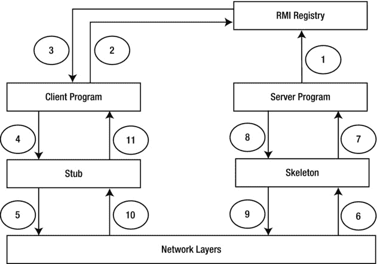

# 七、Java 远程方法调用

在本章中，您将学习

*   什么是 Java 远程方法调用(RMI)和 RMI 架构
*   如何开发和打包 RMI 服务器和客户机应用程序
*   如何启动`rmiregistry`、RMI 服务器和客户端应用程序
*   如何对 RMI 应用程序进行故障排除和调试
*   RMI 应用程序中的动态类下载
*   RMI 应用程序中远程对象的垃圾收集

## 什么是 Java 远程方法调用？

Java 支持各种应用程序架构，这些架构决定了应用程序代码如何以及在哪里部署和执行。在最简单的应用程序架构中，所有的 Java 代码都驻留在一台机器上，一个 JVM 管理所有的 Java 对象以及它们之间的交互。这是一个独立应用程序的例子，其中所需要的只是一台可以启动 JVM 的机器。Java 还支持分布式应用程序架构，其中应用程序的代码和执行可以分布在多台机器上。

在第 4 章中，你看到了 Java Applet，其中 Java 类被部署在 web 服务器上。web 浏览器将 applet 类下载到客户机上，并在客户机上运行的 JVM 中执行。在 applet 的情况下，Java 代码仍然在一个 JVM 中执行。在[第 5 章](05.html)中，您学习了 Java 网络编程，其中涉及到至少两个运行在不同机器上的 JVM，它们为客户机和服务器套接字执行 Java 代码。通常，套接字用于在两个应用程序之间传输数据。在套接字编程中，客户端程序可以向服务器程序发送消息。服务器程序创建一个 Java 对象，调用该对象上的方法，并将方法调用的结果返回给客户端程序。最后，客户端程序使用套接字读取结果。在这种情况下，客户机能够调用驻留在不同 JVM 中的 Java 对象上的方法。这种可能性为称为分布式编程的新应用程序架构打开了大门，在分布式编程中，一个应用程序可以利用多台机器，运行多个 JVM 来处理业务逻辑。虽然可以使用套接字编程来调用驻留在不同 JVM(也可能在不同的机器上)中的对象的方法，但是编写代码并不容易。为了实现这一点，Java 提供了一种称为 Java 远程方法调用(Java RMI)的独立机制。

Java RMI 允许 Java 应用程序调用远程 JVM 中 Java 对象的方法。我将使用术语“远程对象”来指代由 JVM 创建和管理的 Java 对象，而不是管理调用该“远程对象”上的方法的 Java 代码的 JVM 通常，远程对象还意味着它是由 JVM 管理的，该 JVM 运行在访问它的机器之外的机器上。然而，Java 对象作为远程对象并不一定要存在于不同机器上的 JVM 中。出于学习目的，您将使用一台机器在一个 JVM 中部署远程对象，并在不同的 JVM 中启动另一个应用程序来访问远程对象。RMI 允许您将远程对象视为本地对象。在内部，它使用套接字来处理对远程对象的访问并调用其方法。

RMI 应用程序由两个程序组成，一个客户机和一个服务器，它们运行在两个不同的 JVM 中。服务器程序创建许多 Java 对象，并使远程客户机程序可以访问这些对象来调用这些对象上的方法。客户端程序需要知道远程对象在服务器上的位置，这样它就可以对它们调用方法。服务器程序创建一个远程对象，并将其引用注册(或绑定)到 RMI 注册表。RMI 注册表是一种名称服务，用于将远程对象引用绑定到名称，因此客户端可以使用注册表中基于名称的查找来获取远程对象的引用。RMI 注册表运行在独立于服务器程序的进程中。它是作为名为`rmiregistry`的工具提供的。当你在你的机器上安装一个 JDK/JRE 时，它被复制到 JDK/JRE 安装目录下的`bin`子目录中。

在客户端程序获得远程对象的远程引用后，它调用使用该引用的方法，就好像它是对本地对象的引用一样。RMI 技术负责调用在不同机器上的不同 JVM 上运行的服务器程序中的远程引用上的方法的细节。在 RMI 应用程序中，Java 代码是根据接口编写的。服务器程序包含接口的实现。客户机程序使用接口和远程对象引用来调用存在于服务器 JVM 中的远程对象上的方法。所有支持 Java RMI 的 Java 库类都在`java.rmi`包及其子包中。

## RMI 体系结构

图 [7-1](#Fig1) 以简化的形式显示了 RMI 架构。图中的矩形框表示 RMI 应用程序中的一个组件。箭头线显示了沿箭头方向从一个组件发送到另一个组件的消息。显示从 1 到 11 的数字的椭圆表示在典型的 RMI 应用中发生的步骤序列。我将在本节详细讨论所有步骤。

图 7-1。

The RMI architecture

让我们假设您已经开发了运行 RMI 应用程序所需的所有 Java 类和接口。在这一节中，您将浏览运行 RMI 应用程序时涉及的所有步骤。在接下来的几节中，您将开发每一步所需的 Java 代码。

RMI 应用程序的第一步是在服务器中创建一个 Java 对象。该对象将被用作远程对象。要使普通的 Java 对象成为远程对象，还需要执行一个额外的步骤。这一步被称为导出远程对象。当一个普通的 Java 对象作为远程对象导出时，它就可以接收/处理来自远程客户机的调用了。导出过程产生一个远程对象引用(也称为存根)。远程引用知道导出对象的细节，比如它的位置和可以远程调用的方法。该步骤在图 [7-1](#Fig1) 中未标注。它发生在服务器程序内部。当这一步完成时，远程对象已经在服务器中创建好了，并准备好接收远程方法调用。

下一步由服务器执行，向 RMI 注册中心注册(或绑定)远程引用。服务器为它在 RMI 注册表中注册的每个远程引用选择一个惟一的名称。远程客户端需要使用相同的名称在 RMI 注册表中查找远程引用。这在图 [7-1](#Fig1) 中标记为#1。当这一步完成时，RMI 注册中心已经注册了远程对象引用，并且对调用远程对象上的方法感兴趣的客户机可以从 RMI 注册中心请求它的引用。

Tip

出于安全原因，RMI 注册中心和服务器必须运行在同一台机器上，以便服务器可以向 RMI 注册中心注册远程引用。如果没有施加这种限制，黑客可能会从他的机器上向您的 RMI 注册表注册他自己的有害 Java 对象。

这一步包括客户机和 RMI 注册中心之间的交互。通常，客户机和 RMI 注册中心运行在两台不同的机器上。客户机向 RMI 注册中心发送一个远程引用的查找请求。客户端使用名称在 RMI 注册表中查找远程引用。该名称与步骤#1 中服务器用来绑定 RMI 注册表中的远程引用的名称相同。在图 [7-1](#Fig1) 中，查找步骤被标记为#2。RMI 注册中心将远程引用(或存根)返回给图 [7-1](#Fig1) 中标记为步骤#3 的客户端。如果远程引用没有在 RMI 注册表中与客户机在查找请求中使用的名称绑定，RMI 注册表将抛出一个`NotBoundException`。如果这一步成功完成，客户机就收到了运行在服务器上的远程对象的远程引用(或存根)。

在这一步中，客户机调用存根上的一个方法。如图 [7-1](#Fig1) 中步骤#4 所示。此时，存根连接到服务器并传输调用远程对象上的方法所需的信息，例如方法的名称、方法的参数等。存根知道服务器的位置以及如何联系服务器上的远程对象的细节。该步骤在图 [7-1](#Fig1) 中标为步骤#5。网络层的许多不同层参与了从存根到服务器的信息传输。

骨架是客户端存根的服务器端副本。它的工作是接收存根发送的数据。这如图 [7-1](#Fig1) 中的步骤#6 所示。在一个框架收到数据后，它将数据重组为更有意义的格式，并调用远程对象上的方法，如图 [7-1](#Fig1) 中的步骤 7 所示。一旦服务器上的远程方法调用结束，框架就接收方法调用的结果(步骤#8)，并通过网络层将信息传输回存根(步骤#9)。存根接收远程方法调用的结果(步骤#10)，重组结果，并将结果传递给客户端程序(步骤#11)。

可以重复步骤#4 到#11 来调用同一远程对象上的相同或不同的方法。如果一个客户机想要调用一个不同的远程对象上的方法，它必须在启动一个远程方法调用之前首先执行步骤#2 和#3。

在 RMI 应用程序中，典型的情况是，客户机在开始时联系 RMI 注册中心以获得远程对象的存根。如果客户机需要运行在服务器上的另一个远程对象的存根，它可以通过调用它已经拥有的存根上的方法来获得它。请注意，远程对象的方法也可以向远程客户端返回一个存根。这样，远程客户端可以在启动时只在 RMI 注册表中执行一次查找。除了在 RMI 注册表中查找远程对象引用之外，为 RMI 应用程序编写的 Java 代码与非 RMI 应用程序没有什么不同。

## 开发 RMI 应用程序

这一节将向您介绍编写 Java 代码来开发 RMI 应用程序的步骤。您将开发一个远程工具 RMI 应用程序，它将允许您执行三件事情:从服务器回显一条消息，从服务器获取当前日期和时间，以及将两个整数相加。编写 RMI 应用程序涉及以下步骤:

*   编写远程接口。
*   在类中实现远程接口。这个类的对象充当远程对象。
*   编写服务器程序。它创建一个实现远程接口的类的对象，并将其注册到 RMI 注册表中。
*   编写一个客户端程序来访问服务器上的远程对象。

### 编写远程接口

远程接口类似于任何其他 Java 接口，其方法应该从运行在不同 JVM 中的远程客户端调用。它有四个特殊要求:

*   它必须扩展`Remote`接口。`Remote`接口是一个没有声明任何方法的标记接口。
*   远程接口中的所有方法都必须抛出一个`RemoteException`或异常，即它的超类，如`IOException`或`Exception`。`RemoteException`是被检查的异常。远程方法还可以抛出任意数量的其他特定于应用程序的异常。
*   远程方法可以接受远程对象的引用作为参数。它也可以返回远程对象的引用作为它的返回值。如果远程接口中的方法接受或返回远程对象引用，则参数或返回类型必须声明为类型`Remote`，而不是实现`Remote`接口的类的类型。
*   远程接口只能在其方法的参数或返回值中使用三种数据类型。它可以是基本类型、远程对象或可序列化的非远程对象。远程对象通过引用传递，而非远程可序列化对象通过复制传递。如果一个对象的类实现了`java.io.Serializable`接口，那么这个对象就是可序列化的。

您将您的远程接口命名为`RemoteUtility`。清单 7-1 包含了`RemoteUtility`远程接口的代码。它包含三个方法，分别叫做`echo()`、`getServerTime()`和`add()`，它们提供了你想要的三个功能。

清单 7-1。RemoteUtility 接口

`// RemoteUtility.java`

`package com.jdojo.rmi;`

`import java.rmi.Remote;`

`import java.rmi.RemoteException;`

`import java.time.ZonedDateTime;`

`public interface RemoteUtility extends Remote {`

`// Echoes a string message back to the client`

`String echo(String msg) throws RemoteException;`

`// Returns the current date and time to the client`

`ZonedDateTime getServerTime() throws RemoteException;`

`// Adds two integers and returns the result to the client`

`int add(int n1, int n2) throws RemoteException;`

`}`

### 实现远程接口

这一步包括创建一个实现远程接口的类。你将把这个类命名为`RemoteUtilityImpl`。它将实现`RemoteUtility`远程接口，并将提供三种方法的实现:`echo()`、`getServerTime()`和`add()`。这个类中可以有任意数量的其他方法。您必须做的唯一一件事就是为在`RemoteUtility`远程接口中定义的所有方法提供实现。远程客户端将只能调用该类的远程方法。如果在这个类中定义的方法不同于远程接口中定义的方法，那么这些方法对于远程方法调用是不可用的。但是，您可以使用其他方法来实现远程方法。清单 7-2 包含了`RemoteUtilityImpl`类的代码。

清单 7-2。RemoteUtility 远程接口的实现类

`// RemoteUtilityImpl.java`

`package com.jdojo.rmi;`

`import java.time.ZonedDateTime;`

`public class RemoteUtilityImpl implements RemoteUtility {`

`public RemoteUtilityImpl() {`

`}`

`@Override`

`public String echo(String msg) {`

`return msg;`

`}`

`@Override`

`public ZonedDateTime getServerTime() {`

`return ZonedDateTime.now();`

`}`

`@Override`

`public int add(int n1, int n2) {`

`return n1 + n2;`

`}`

`}`

远程对象实现类非常简单。它实现了`RemoteUtility`接口，并为该接口的三个方法提供了实现。注意，`RemoteUtilityImpl`类中的这些方法没有声明它们抛出了一个`RemoteException`。声明所有远程方法抛出一个`RemoteException`的要求是针对远程接口的，而不是实现远程接口的类。

有两种方法可以为远程接口编写实现类。一种方法是从`java.rmi.server.UnicastRemoteObject`类继承它。另一种方法是不从任何类或者从除了`UnicastRemoteObject`类之外的任何类继承它。清单 7-2 采用了后一种方法。它没有从任何类继承`RemoteUtilityImpl`类。

如果远程接口的实现类继承自`UnicastRemoteObject`类或其他类，会有什么不同呢？远程接口的实现类用于创建远程对象，远程对象的方法被远程调用。这个类的对象必须经过一个导出过程，这使得它适合于远程方法调用。`UnicastRemoteObject`类的构造函数自动为您导出对象。所以，如果你的实现类继承自`UnicastRemoteObject`类，它将为你以后的整个过程节省一步。有时你的实现类必须从另一个类继承，这将迫使你不要从`UnicastRemoteObject`类继承它。你需要注意的一点是，`UnicastRemoteObject`类的构造函数抛出一个`RemoteException.`如果你从`UnicastRemoteObject`类继承远程对象实现类，实现类的构造函数必须在其声明中抛出一个`RemoteException`。清单 7-3 通过继承`UnicastRemoteObject`类重写了`RemoteUtilityImpl`类。这个实现中有两个新东西——它在类声明中使用了`extends`子句，在构造函数声明中使用了`throws`子句。其他一切都保持不变。当你在本章的后面编写服务器程序时，我将讨论使用清单 7-2 和清单 7-3 中所示的`RemoteUtilityImpl`类的实现的区别。

清单 7-3。通过从 UnicastRemoteObject 类继承 RemoteUtilityImpl 类来重写它

`// RemoteUtilityImpl.java`

`package com.jdojo.rmi;`

`import java.rmi.RemoteException;`

`import java.rmi.server.UnicastRemoteObject;`

`import java.time.ZonedDateTime;`

`public class RemoteUtilityImpl extends UnicastRemoteObject implements RemoteUtility {`

`// Must throw RemoteException`

`public RemoteUtilityImpl() throws RemoteException {`

`}`

`@Override`

`public String echo(String msg) {`

`return msg;`

`}`

`@Override`

`public ZonedDateTime getServerTime() {`

`return ZonedDateTime.now();`

`}`

`@Override`

`public int add(int n1, int n2) {`

`return n1 + n2;`

`}`

`}`

### 编写 RMI 服务器程序

服务器程序的职责是创建远程对象，并使远程客户端可以访问它。服务器程序执行以下任务:

*   安装安全管理器。
*   创建并导出远程对象。
*   向 RMI 注册应用程序注册远程对象。

后续部分将详细讨论这些步骤。

#### 安装安全管理器

您需要确保服务器代码在安全管理器下运行。如果 RMI 程序没有运行安全管理器，它就不能从远程位置下载 Java 类。没有安全管理器，它只能使用本地 Java 类。在 RMI 服务器和 RMI 客户机中，程序可能需要从远程位置下载类文件。您将很快看到从远程位置下载 Java 类的例子。当在安全管理器下运行 Java 程序时，还必须通过 Java 策略文件控制对特权资源的访问。以下代码片段显示了如何安装安全管理器(如果尚未安装)。您可以使用`java.lang.SecurityManager`类或`java.rmi.RMISecurityManager`类的对象来安装安全管理器。

`SecurityManager secManager = System.getSecurityManager();`

`if (secManager == null) {`

`System.setSecurityManager(new SecurityManager());`

`}`

安全管理器通过策略文件控制对特权资源的访问。您需要设置适当的权限来访问 Java RMI 应用程序中使用的资源。对于本例，您将向所有代码授予所有权限。但是，您应该在生产环境中使用适当控制的策略文件。您需要在策略文件中输入以下条目来授予所有权限:

`grant {`

`permission java.security.AllPermission;`

`};`

通常，Java 策略文件驻留在计算机上用户的主目录中，它被命名为`.java.policy.`。注意，文件名以点开始。

#### 创建和导出远程对象

RMI 服务器程序执行的下一步是创建一个实现远程接口的类的对象，它将作为一个远程对象。在您的例子中，您将创建一个`RemoteUtilityImpl`类的对象。

`RemoteUtilityImpl remoteUtility = new RemoteUtilityImpl();`

您需要导出一个远程对象，以便远程客户端可以调用它的远程方法。如果您的远程对象类(本例中为`RemoteUtility`类)继承自`UnicastRemoteObject`类，那么您不需要导出它。它会在您创建时自动导出。如果您的远程对象的类不是从`UnicastRemoteObject`类继承的，您需要使用`UnicastRemoteObject`类的`exportObject()`静态方法之一显式导出它。当您导出远程对象时，您可以指定一个端口号，它可以在该端口号上侦听远程方法调用。默认情况下，它监听端口 0，这是一个匿名端口。以下语句导出远程对象:

`int port = 0;`

`RemoteUtility remoteUtilityStub =        (RemoteUtility)UnicastRemoteObject.exportObject(remoteUtility, port);`

`exportObject()`方法返回导出的远程对象的引用，也称为存根或远程引用。您需要保留存根的引用，这样就可以向 RMI 注册中心注册它。

#### 注册远程对象

服务器程序执行的最后一步是使用名称向 RMI 注册表注册(或绑定)远程对象引用。RMI 注册中心是一个提供名称服务的独立应用程序。要在 RMI 注册表中注册一个远程引用，您必须首先找到它。RMI 注册表在特定端口的机器上运行。默认情况下，它运行在端口 1099 上。找到注册表后，需要调用它的`bind()`方法来绑定远程引用。您也可以使用它的方法，如果指定名称的旧绑定已经存在，该方法将替换旧绑定。用的名字是一个`String`。您将使用名称`MyRemoteUtility`作为您的远程引用的名称。最好遵循 RMI 注册表中绑定引用对象的命名约定，以避免名称冲突。

`Registry registry = LocateRegistry.getRegistry("localhost", 1099);`

`String name = "MyRemoteUtility";`

`registry.rebind(name, remoteUtilityStub);`

这就是编写服务器程序所需的全部内容。清单 7-4 包含了 RMI 服务器的完整代码。它假设`RemoteUtilityImpl`类不继承清单 7-2 中列出的`UnicastRemoteObject`类。

清单 7-4。一个 RMI 远程服务器程序

`// RemoteServer.java`

`package com.jdojo.rmi;`

`import java.rmi.RemoteException;`

`import java.rmi.registry.LocateRegistry;`

`import java.rmi.registry.Registry;`

`import java.rmi.server.UnicastRemoteObject;`

`public class RemoteServer {`

`public static void main(String[] args) {`

`SecurityManager secManager = System.getSecurityManager();`

`if (secManager == null) {`

`System.setSecurityManager(new SecurityManager());`

`}`

`try {`

`RemoteUtilityImpl remoteUtility = new RemoteUtilityImpl();`

`// Export the object as a remote object`

`int port = 0; // an anonymous port`

`RemoteUtility remoteUtilityStub`

`= (RemoteUtility) UnicastRemoteObject.exportObject(`

`remoteUtility, port);`

`// Locate the registry`

`Registry registry = LocateRegistry.getRegistry("localhost", 1099);`

`// Bind the exported remote reference in the registry`

`String name = "MyRemoteUtility";`

`registry.rebind(name, remoteUtilityStub);`

`System.out.println("Remote server is ready...");`

`}`

`catch (RemoteException e) {`

`e.printStackTrace();`

`}`

`}`

`}`

如果您使用清单 7-3 中列出的`RemoteUtilityImpl`类的实现，您将需要修改清单 7-4 中的代码。`try-catch`块中的代码将变为如下代码。所有其他代码将保持不变。

`RemoteUtilityImpl remoteUtility = new RemoteUtilityImpl();`

`// No need to export the object`

`// Locate the registry`

`Registry registry = LocateRegistry.getRegistry("localhost", 1099);`

`// Bind the exported remote reference in the registry`

`String name = "MyRemoteUtility";`

`registry.rebind(name, remoteUtility);`

`System.out.println("Remote server is ready...");`

您还没有准备好启动您的服务器程序。我将在接下来的小节中讨论如何启动 RMI 应用程序。

出于安全原因，您只能从与 RMI 注册表运行在同一台机器上的 RMI 服务器程序将远程引用绑定到 RMI 注册表。否则，黑客可能会将任何任意的、可能有害的远程引用绑定到您的 RMI 注册表。默认情况下，`LocateRegistry`类的`getRegistry()`静态方法返回一个运行在同一台机器上端口 1099 的注册表的存根。您可以只使用下面的代码来定位服务器程序中的注册表。

`// Get a registry stub for a local machine at port 1099`

`Registry registry = LocateRegistry.getRegistry();`

请注意，对`LocateRegistry.getRegistry()`方法的调用并不试图连接到注册表应用程序。它只是返回注册表的存根。这个存根控件上的后续调用、`bind()`、`rebind()`或任何其他方法调用尝试连接到注册中心应用程序。

### 编写 RMI 客户端程序

RMI 客户端程序调用远程对象上的方法，这些方法存在于远程服务器上。客户端程序必须做的第一件事是知道远程对象的位置。RMI 服务器程序创建并知道远程对象的位置。发布远程对象的位置细节是服务器程序的责任，这样客户端就可以定位和使用它。服务器程序通过将远程对象与 RMI 注册表绑定来发布远程对象的位置细节，并给它一个名称，在您的例子中是`MyRemoteUtility`。客户端程序联系 RMI 注册表，并执行基于名称的查找来获取远程引用。获得远程引用后，客户端程序调用远程引用上的方法，这些方法在服务器中执行。通常，RMI 客户端程序执行以下操作:

*   它确保它在安全管理器下运行。

`SecurityManager secManager = System.getSecurityManager();`

`if (secManager == null) {`

`System.setSecurityManager(new SecurityManager());`

`}`

它定位远程引用被服务器绑定的注册表。您必须知道机器名或 IP 地址，以及运行 RMI 注册表的端口号。在真实的 RMI 程序中，您不会在客户端程序中使用`localhost`来定位注册表。相反，RMI 注册中心将在一台单独的机器上运行。对于您的例子，您将在同一台机器上运行所有三个程序——RMI 注册表、服务器和客户机。

`// Locate the registry`

`Registry registry = LocateRegistry.getRegistry("localhost", 1099);`

*   它使用`Registry`接口的`lookup()`方法在注册表中执行查找。它将绑定的远程引用的名称传递给`lookup()`方法，并获取远程引用(或存根)。注意，`lookup()`方法必须使用与服务器绑定/重新绑定远程引用相同的名称。`lookup()`方法返回一个`Remote`对象。您必须将其转换为远程接口的类型。以下代码片段将从`lookup()`方法返回的远程引用转换为`RemoteUtility`接口类型:

`String name = "MyRemoteUtility";`

`RemoteUtility remoteUtilStub = (RemoteUtility)registry.lookup(name);`

*   它调用远程引用(或存根)上的方法。客户端程序将`remoteUtilStub`引用视为对本地对象的引用。对它进行的任何方法调用都被发送到服务器执行。所有远程方法都抛出一个`RemoteException`。当您调用任何远程方法时，您必须处理`RemoteException`。

`// Call the echo() method`

`String reply = remoteUtilStub.echo("Hello from the RMI client.");`

清单 7-5 包含了你的客户端程序的完整代码。暂时不要运行这个程序。在接下来的几节中，您将一步一步地运行您的 RMI 应用程序。您可能会注意到，编写 RMI 代码并不复杂。RMI 中不同组件的管道是复杂的。

清单 7-5。一个 RMI 远程客户程序

`// RemoteClient.java`

`package com.jdojo.rmi;`

`import java.rmi.NotBoundException;`

`import java.rmi.RemoteException;`

`import java.rmi.registry.LocateRegistry;`

`import java.rmi.registry.Registry;`

`import java.time.ZonedDateTime;`

`public class RemoteClient {`

`public static void main(String[] args) {`

`SecurityManager secManager = System.getSecurityManager();`

`if (secManager == null) {`

`System.setSecurityManager(new SecurityManager());`

`}`

`try {`

`// Locate the registry`

`Registry registry =`

`LocateRegistry.getRegistry("localhost", 1099);`

`String name = "MyRemoteUtility";`

`RemoteUtility remoteUtilStub =`

`(RemoteUtility) registry.lookup(name);`

`// Echo a message from the server`

`String msg = "Hello";`

`String reply = remoteUtilStub.echo(msg);`

`System.out.println("Echo Message: " + msg +`

`", Echo reply: " + reply);`

`// Get the server date and time with the zone info`

`ZonedDateTime serverTime = remoteUtilStub.getServerTime();`

`System.out.println("Server Time: " + serverTime);`

`// Add two integers`

`int n1 = 101;`

`int n2 = 207;`

`int sum = remoteUtilStub.add(n1, n2);`

`System.out.println(n1 + " + " + n2 + " = " + sum);`

`}`

`catch (RemoteException | NotBoundException e) {`

`e.printStackTrace();`

`}`

`}`

`}`

## 分离服务器和客户端代码

在 RMI 应用程序中，将服务器和客户机程序的代码分开是很重要的。服务器程序需要有以下三个组件:

*   远程接口
*   远程接口的实现类
*   服务器程序

客户端程序需要有以下两个组件。

*   远程接口
*   客户端程序

客户端程序不应该知道实现远程接口的实现类。让客户机程序可以访问这个类违背了开发 RMI 应用程序的目的。您可以拥有运行服务器和客户端程序所需的附加类。

对于您的示例，您可以将服务器和客户机类文件分开，或者放在两个目录结构中，或者放在两个 JAR 文件中。您将在`utilserver.jar`和`utilclient.jar`中分别打包服务器和客户端程序的类文件。

`utilserver.jar`文件中的文件有

*   `RemoteUtility.class`
*   `RemoteUtilityImpl.class`
*   `RemoteServer.class`

`utilclient.jar`文件中的文件有

*   `RemoteUtility.class`
*   `RemoteClient.class`

## 生成存根和框架

当使用`UnicastRemoteObject`类导出远程对象时，RMI 需要一个存根类。您可以执行以下两项操作之一:

*   您可以使用`UnicastRemoteObject`类来继承您的远程接口实现类，它将自动导出您的远程对象。
*   您可以使用`UnicastRemoteObject`类的`exportObject()`方法显式导出远程对象。

在这两种情况下，当导出一个远程对象时，RMI 需要一个存根类。在 Java 5 之前，您需要执行一个额外的步骤来为远程接口实现类生成存根类。这是通过使用 JDK 安装文件夹的`bin`子目录中的`rmic`命令来完成的。运行该命令，传递远程接口实现类的完全限定名，如下所示:

`rmic com.jdojo.rmi.RemoteUtilityImpl`

您可能需要适当地设置`CLASSPATH`环境变量，以便`rmic`能够找到您指定作为其参数的类。上面的命令将在`RemoteUtilityImpl.class`文件所在的同一个文件夹中生成以下两个类文件。

*   `RemoteUtilityImpl_Stub.class`
*   `RemoteUtilityImpl_Skel.class`

您需要在`utilserver.jar`文件中包含这两个类文件。请注意，只有在使用 Java 5 之前的 Java 版本时，才需要这一步。如果您的客户端程序运行的是 Java 5 之前的 Java 版本，而您的服务器运行的是 Java 5 或更高版本，您也需要执行此步骤。如果您有兴趣查看为这两个类文件生成的 Java 源代码，您可以使用带有`rmic`命令的`–keep`(或`-keepgenerated`)选项，这将为这些类生成 Java 源代码。以下命令将生成四个文件，两个`.class`文件和两个`.java`文件。

`rmic –keep com.jdojo.chapter5.RemoteUtilityImpl`

## 运行 RMI 应用程序

您需要按照以下特定顺序启动 RMI 应用程序中涉及的所有程序:

*   运行 RMI 注册表。
*   运行 RMI 服务器程序。
*   运行 RMI 客户端程序。

如果您在运行任何程序时遇到任何问题，请参考本章后面的“排除 RMI 应用程序故障”一节。

您的服务器和客户端程序使用安全管理器。在成功运行 RMI 应用程序之前，必须正确配置 java 策略文件。出于学习目的，您可以将所有安全权限授予 RMI 应用程序。您可以通过创建一个名为`rmi.policy`的文本文件(您可以使用您想要的任何其他文件名)并输入以下内容来做到这一点，这将向所有代码授予所有权限:

`grant {`

`permission java.security.AllPermission;`

`};`

当运行 RMI 客户机或服务器程序时，需要使用`java.security.policy` JVM 选项将`rmi.policy`文件设置为 Java 安全策略文件。假设您已经将`rmi.policy`文件保存在 Windows 的`C:\`文件夹中。

`java -Djava.security.policy=file:/c:/rmi.policy <other-options>`

这种设置 Java 策略文件的方法是临时的。它应该仅用于学习目的。您需要在生产环境中设置细粒度的安全性。

### 运行 RMI 注册表

RMI 注册表应用程序是随 JDK/JRE 安装一起提供的。它被复制到相应安装主文件夹的`bin`子文件夹中。在 Windows 平台上，它是`rmiregistry.exe`可执行文件。您可以通过使用命令提示符启动`rmiregistry`应用程序来运行 RMI 注册表。它接受将在其上运行的端口号。默认情况下，它运行在端口 1099 上。以下命令在 Windows 上使用命令提示符在端口 1099 启动它:

`C:\java8\bin> rmiregistry`

以下命令在端口 8967 启动 RMI 注册表:

`C:\java8\bin> rmiregistry 8967`

`rmiregistry`应用程序不在提示符下打印任何启动信息。通常，它是作为后台进程启动的。

很可能，该命令在您的机器上不起作用。使用该命令，您将能够成功启动`rmiregistry`。然而，当您在下一节运行 RMI 服务器应用程序时，您将得到`ClassNotFoundException`。`rmiregistry`应用程序需要访问 RMI 服务器应用程序中使用的一些类(已注册的类)。有三种方法可以让`rmiregistry`使用这些类:

*   适当地设置类路径。
*   将`java.rmi.server.codebase` JVM 属性设置为包含`rmiregistry`所需类的 URL。
*   将名为`java.rmi.server.useCodebaseOnly`的 JVM 属性设置为`false`。在 JDK 7u21(也在 JDK 6u45 和 JDK 5u45)中，此属性默认设置为 true。之前默认设置为`false`。如果该属性设置为`false`，`rmiregistry`可以从服务器下载需要的类文件。

在启动`rmiregistry`之前，以下命令将`serverutil.jar`文件添加到`CLASSPATH`:

`C:\java8\bin> SET CLASSPATH=C:\utilserver.jar`

`C:\java8\bin> rmiregistry`

除了设置`CLASSPATH`使类对 rmiregistry 可用之外，还可以设置`java.rmi.server.codebase` JVM 属性，这是一个用空格分隔的 URL 列表，如下所示:

`rmiregistry -J-Djava.rmi.server.codebase=file:/C:/utilserver.jar`

下面的命令重置`CLASSPATH`并将 JVM 的`java.rmi.server.useCodebaseOnly`属性设置为`false`，这样`rmiregistry`将从 RMI 服务器下载任何需要的类文件。您的示例将使用以下命令:

`C:\java8\bin> SET CLASSPATH=`

`C:\java8\bin> rmiregistry -J-Djava.rmi.server.useCodebaseOnly=false`

### 运行 RMI 服务器

在运行 RMI 服务器之前，必须运行 RMI 注册表。回想一下，服务器在一个安全管理器下运行，该安全管理器要求您授予在 Java 策略文件中执行某些操作的权限。确保您已经在策略文件中输入了所需的授权。您可以使用以下命令来运行服务器程序。命令文本在一行中输入；为了清楚起见，已经用多行显示了它。命令文本中的每个部分都应该用空格分隔，而不是换行。在命令中，您需要更改 JAR 和策略文件的路径，以反映它们在您的机器上的路径。

`java -cp C:\utilserver.jar`

`-Djava.rmi.server.codebase=file:/C:/utilserver.jar`

`-Djava.security.policy=file:/c:/rmi.policy`

`com.jdojo.rmi.RemoteServer`

`–cp`选项将`CLASSPATH`设置为`utilserver.jar`文件。如果您不想使用 JAR 文件来打包与服务器相关的类文件，您可以使用任何其他的`CLASSPATH`设置，以便服务器程序可以运行。如果您已经设置了适当的`CLASSPATH`，您可以从命令文本中删除`–cp`选项和`CLASSPATH`值。

你需要设置一个`java.rmi.server.codebase`属性。如果 RMI 注册表和客户机程序需要下载它们没有的类文件，它们就会使用这个方法。该属性的值是一个 URL，它可以指向本地文件系统、web 服务器、FTP 服务器或任何其他资源。URL 可以指向一个 JAR 文件，就像本例中一样，也可以指向一个目录。如果它指向一个目录，URL 必须以正斜杠结束。以下命令使用文件夹作为其基本代码。如果 RMI 注册中心和客户机需要任何类文件，它们将尝试从 URL 文件`/C:/myrmi/classes/`下载类文件。

`java -cp C:\utilserver.jar`

`-Djava.rmi.server.codebase=file:/C:/myrmi/classes/`

`com.jdojo.rmi.RemoteServer`

您还可以设置一个`java.rmi.server.codebase`属性来指向一个 web 服务器，在那里您可以存储您需要的类文件，如下所示:

`java -cp C:\utilserver.jar`

`-Djava.rmi.server.codebase=`[`http://www.jdojo.com/rmi/classes/`T3】](http://www.jdojo.com/rmi/classes/)

`com.jdojo.rmi.RemoteServer`

如果将类文件存储在多个位置，可以指定所有位置，用空格分隔，如下所示:

`java -cp C:\utilserver.jar`

`-Djava.rmi.server.codebase="`[`http://www.jdojo.com/rmi/classes/`T3】](http://www.jdojo.com/rmi/classes/)

[T0](ftp://www.jdojo.com/rmi/some/classes/c.jar)T1】

`com.jdojo.rmi.RemoteServer`

它将一个位置指定为目录，将另一个位置指定为 JAR 文件。一个使用`http`协议，另一个使用`ftp`协议。这两个值由一个空格隔开，它们在一行上，而不是如图所示的两行。当您运行服务器或客户端程序时，可能会出现`ClassNotFoundException`，这很可能是由于`java.rmi.server.codebase`属性的设置不正确，或者根本没有设置该属性。

### 运行 RMI 客户端程序

成功启动 RMI 注册表和服务器应用程序之后，就该启动 RMI 客户机应用程序了。您可以使用以下命令来运行客户端程序:

`java -cp C:\utilclient.jar`

`-Djava.rmi.server.codebase=file:/C:/utilclient.jar`

`-Djava.security.policy=file:/c:/rmi.policy`

`com.jdojo.rmi.RemoteClient`

当您运行上面的命令时，您不必包含一个`java.rmi.server.codebase`选项。客户端程序也可以使用以下命令运行。当客户端程序成功运行时，您应该能够在控制台上看到输出。运行该程序时，您可能会得到不同的输出，因为它会打印当前日期和时间以及运行服务器应用程序的服务器的时区信息。

`java -cp C:\utilclient.jar`

`-Djava.security.policy=file:/c:/rmi.policy`

`com.jdojo.rmi.RemoteClient`

`Echo Message: Hello, Echo reply: Hello`

`Server Time: 2014-06-22T13:11:31.790-05:00[America/Chicago]`

`101 + 207 = 308`

## RMI 应用程序故障排除

在第一次运行 RMI 应用程序之前，很可能会出现许多异常。本节将列出一些您可能会收到的例外情况。它还将列出这些异常的一些可能原因和一些可能的解决方案。当您试图运行 RMI 应用程序时，不可能列出所有可能的错误。通过查看异常的栈输出，您应该能够找出大多数错误。

### Java . RMI . stubnotfounindexception

当你试图运行一个服务器程序时，你得到一个`StubNotFoundException`。异常栈跟踪类似于以下内容:

`java.rmi.StubNotFoundException: Stub class not found: com.jdojo.rmi.RemoteUtilityImpl_Stub; nested exception is:`

`java.lang.ClassNotFoundException: com.jdojo.rmi.RemoteUtilityImpl_Stub`

`at sun.rmi.server.Util.createStub(Util.java:292)...`

这种异常可能由于多种原因而发生。以下是您可以寻找并解决的一些原因:

*   您可能正在使用 Java 5 之前的 Java 版本运行服务器程序。您必须使用`rmic`命令创建存根和框架，并在运行服务器程序时让 JVM 可以访问它们。更多细节请参考“生成存根和框架”一节。
*   当您导出远程对象并且不传递端口号时，可能会出现此错误:

`RemoteUtility remoteUtilityStub =`

`(RemoteUtility)UnicastRemoteObject.exportObject(remoteUtility);`

*   如果您没有向`UnicastRemoteObject`类的`exportObject()`方法传递端口号来导出远程对象，您必须首先使用`rmic`命令生成存根和框架。更多细节请参考“生成存根和框架”一节。解决这个问题的另一种方法是向`exportObject()`方法传递一个端口号。端口号 0(零)表示匿名端口。

`RemoteUtility remoteUtilityStub =`

`(RemoteUtility)UnicastRemoteObject.exportObject(remoteUtility,0);`

### Java . RMI . server . export exception

当您试图运行`rmiregistry`应用程序或服务器应用程序时，您会得到一个`ExportException`。当您试图运行`rmiregistry`应用程序时，如果您得到这个异常，异常栈跟踪将类似于图中所示。

`java.rmi.server.ExportException:Port already in use: 1099; nested exception is:`

`java.net.BindException: Address already in use: JVM_Bind...`

它表明端口号 1099(在您的情况下可能是不同的号码)已经被使用。也许您已经在端口 1099(这是一个`rmiregistry`应用程序的默认端口号)上启动了`rmiregistry`应用程序，或者某个其他应用程序正在使用端口 1099。您可以执行以下两项操作之一来解决此问题:

*   您可以停止正在使用端口 1099 的应用程序，并在端口 1009 启动`rmiregistry`应用程序。
*   您可以在 1099 以外的端口启动`rmiregistry`应用程序。

如果在运行服务器程序时得到一个`ExportException`，这是由于远程对象的导出过程失败造成的。导出过程失败的原因有很多。以下异常栈跟踪(显示了部分跟踪)是由两次导出同一个远程对象引起的:

`java.rmi.server.ExportException: object already exported`

`at sun.rmi.transport.ObjectTable.putTarget(ObjectTable.java:189)`

`at sun.rmi.transport.Transport.exportObject(Transport.java:92)...`

检查您的服务器程序，并确保您只导出远程对象一次。从`UnicastRemoteObject`类继承远程对象实现类并使用`UnicastRemoteObject`类的`exportObject()`方法来导出远程对象是一个常见的错误。当您从`UnicastRemoteObject`类继承远程对象的实现类时，您创建的远程对象会被自动导出。如果您尝试使用`exportObject()`方法再次导出它，您将得到这个异常。在讨论远程接口实现类时，我已经多次强调了这一点。当你开发一个 RMI 应用程序时，记住这句话，“犯错是程序员，惩罚 Java。”即使是 RMI 程序设置中的一个小错误，也可能花费你数小时的时间来检测和修复。

### Java . security . accesscontrolexception

当您的 Java 策略文件没有运行 RMI 应用程序所必需的`grant`条目时，您会得到这个异常。下面是一个异常的部分栈跟踪，它是在您尝试运行服务器程序，并尝试将远程对象绑定到 RMI 注册表时导致的:

`java.security.AccessControlException: access denied (java.net.SocketPermission 127.0.0.1:1099 connect,resolve)...`

注册中心、服务器和客户端之间的通信是使用套接字执行的。为了安全起见，您必须在 Java 策略文件中授予适当的套接字权限，以便 RMI 应用程序的三个组件能够进行通信。大多数与安全相关的异常可以通过在 Java 策略文件中授予适当的权限来修复。

### Java . lang . class notfounindexception

当没有找到 Java 运行时需要的类文件时，您会得到一个`ClassNotFoundException`异常。到目前为止，您一定已经多次收到这个异常。大多数情况下，当`CLASSPATH`没有正确设置时，您会收到这个异常。在 RMI 应用程序中，这个异常可能是另一个异常的原因。以下栈跟踪显示抛出了`java.rmi.ServerException`异常，其原因在于`ClassNotFoundException`异常:

`java.rmi.ServerException: RemoteException occurred in server thread; nested exception is:`

`java.rmi.UnmarshalException: error unmarshalling arguments; nested exception is:`

`java.lang.ClassNotFoundException: com.jdojo.rmi.RemoteUtility`

`...`

`Caused by: java.lang.ClassNotFoundException: com.jdojo.rmi.RemoteUtility`

`at java.net.URLClassLoader$1.run(URLClassLoader.java:220)`

`at java.net.URLClassLoader$1.run(URLClassLoader.java:209)`

当您运行服务器或客户端应用程序时，`java.rmi.server.codebase`选项没有正确设置或根本没有设置，就会引发这种类型的异常。

当服务器程序在没有使用`java.rmi.server.codebase`选项的情况下启动，并且`rmiregistry`应用程序在没有设置`CLASSPATH`的情况下运行时，这个异常被抛出。当您试图将一个远程引用与一个`rmiregistry`应用程序绑定/重新绑定时，服务器应用程序会将该远程引用发送给`rmiregistry`应用程序。在 JVM 中将远程引用表示为 Java 对象之前,`rmiregistry`应用程序必须加载该类。此时，`rmiregistry`将尝试从服务器启动时使用`java.rmi.server.codebase`属性指定的位置下载所需的类文件。

如果在运行客户端程序时遇到这个异常，请确保在运行客户端程序时设置了`java.rmi.server.codebase`属性。

请在运行服务器和客户端程序时检查`CLASSPATH`和`java.rmi.server.codebase`属性，以避免此异常。

当您运行客户端程序时，您会得到一个`ClassNotFoundException`,因为服务器无法找到在服务器端解组客户端调用所需的一些类定义。异常的部分栈跟踪示例如下所示:

`java.rmi.ServerException: RemoteException occurred in server thread; nested exception is: java.rmi.UnmarshalException: error unmarshalling arguments; nested exception is: java.lang.ClassNotFoundException: com.jdojo.rmi.Square`

`at sun.rmi.server.UnicastServerRef.dispatch(UnicastServerRef.java:336)`

`at sun.rmi.transport.Transport$1.run(Transport.java:159)...`

在远程接口中定义的远程方法可以接受参数，该参数可以是接口或类类型。客户端可以传递实现接口的类的对象或远程接口的方法签名中定义的类型的子类的对象。如果服务器上不存在该类定义，服务器将尝试使用客户端应用程序中设置的`java.rmi.server.codebase`属性下载该类。您需要确保出现该错误的类(异常栈跟踪显示类名为`com.jdojo.rmi.Square`)在服务器 JVM 的`CLASSPATH`中，或者在运行远程客户端时设置`java.rmi.server.codebase`属性，以便服务器可以下载该类。

## 调试 RMI 应用程序

通过将名为`java.rmi.server.logCalls`的 JVM 属性设置为`true`，可以为 RMI 服务器应用程序打开 RMI 日志记录。默认情况下，它被设置为`false`。以下命令启动您的`RemoteServer`应用程序，将`java.rmi.server.logCalls`属性设置为`true`:

`java -cp C:\utilserver.jar`

`-Djava.rmi.server.logCalls=true`

`–Djava.rmi.server.codebase="`[`http://www.myurl.com/rmiclasses`](http://www.myurl.com/rmiclasses)T2】

`com.jdojo.rmi.RemoteServer`

当服务器 JVM 的`java.rmi.server.logCalls`属性被设置为`true`时，对服务器的所有传入调用以及在传入调用执行期间抛出的任何异常的栈跟踪都被记录到标准错误中。

RMI 运行时还允许您将服务器应用程序中的传入调用记录到一个文件中，而不考虑为服务器 JVM 的`java.rmi.server.logCalls`属性设置的值。您可以使用`java.rmi.server.RemoteServer`类的`setLog(OutputStream out)`静态方法将所有来电细节记录到一个文件中。通常，您在服务器程序代码的开头设置用于日志记录的文件输出流，比如您的`com.jdojo.rmi.RemoteServer`类的`main()`方法中的第一条语句。下面的代码片段支持将远程服务器应用程序中的调用记录到 C `:\rmi.log`文件中。您可以通过使用`null`作为`setLog()`方法中的`OutputStream`来禁用呼叫记录。

`try {`

`java.io.OutputStream os = new java.io.FileOutputStream("C:\\rmi.log");`

`java.rmi.server.RemoteServer.setLog(os);`

`}`

`catch (FileNotFoundException e) {`

`System.err.println("Could not enable incoming calls logging.");`

`e.printStackTrace();`

`}`

当安全管理器安装在服务器上时，允许记录到文件的运行代码必须有一个`java.util.logging.LoggingPermission`，其权限目标为“control”。Java 策略文件中的以下 grant 条目将授予该权限。您还必须在 Java 策略文件中授予日志文件(本例中为 C `:\rmi.log`)的“写”权限。

`grant {`

`permission java.io.FilePermission "c:\\rmi.log", "write";`

`permission java.util.logging.LoggingPermission "control";`

`};`

如果您想要获得关于 RMI 客户机应用程序的调试信息，那么在启动 RMI 客户机应用程序时，将一个非标准的`sun.rmi.client.logCalls`属性设置为`true`。它将显示关于标准错误的调试信息。由于该属性不是公共规范的一部分，因此在未来的版本中可能会被删除。关于调试选项的更多细节，您需要参考 RMI 规范。

## 动态类下载

JVM 在创建类的对象之前加载类定义。它使用一个类加载器在运行时加载一个类。类加载器是`java.lang.ClassLoader`类的一个实例。类装入器必须先找到类的字节码，然后才能将其定义装入 JVM。Java 类加载器能够从任何位置加载类的字节码，例如本地文件系统、网络等。一个 JVM 中可以有多个类装入器，它们可以是系统定义的，也可以是自定义的。

JVM 在启动时创建一个类加载器，称为类加载器。引导类加载器负责加载基本 JVM 功能所需的初始类。基于父子关系，类装入器被组织成树状结构。引导类装入器没有父类。所有其他类装入器都将引导类装入器作为它们的直接或间接父类。在一个典型的类加载过程中，当一个类加载器被要求加载一个类的字节码时，它要求它的父类加载这个类，这个类反过来又要求它的父类，以此类推，直到引导类加载器得到加载这个类的请求。如果没有一个父类装入器能够装入该类，收到装入该类的初始请求的类装入器将尝试装入该类。

RMI 运行时使用一个特殊的 RMI 类加载器，负责加载 RMI 应用程序中的类。当一个对象在 RMI 应用程序中从一个 JVM 传递到另一个 JVM 时，发送 JVM 必须序列化和封送该对象，接收 JVM 必须反序列化和解封送该对象。发送 JVM 将属性`java.rmi.server.codebase`的值添加到对象的序列化流中。当在另一端接收到对象流时，接收 JVM 必须使用类装入器装入对象的类定义，然后才能将对象流转换成 Java 对象。JVM 指示 RMI 类加载器加载对象的类定义，它已经以流的形式接收到了该定义。类装入器试图从它的 JVM `CLASSPATH`中装入类定义。如果使用`CLASSPATH`没有找到类定义，那么类加载器使用对象流中`java.rmi.server.codebase`属性的值来加载类定义。

注意,`java.rmi.server.codebase`属性是在一个 JVM 中设置的，它用于下载另一个 JVM 中的类定义。当您运行 RMI 服务器或客户端程序时，可以设置该属性。当一方(服务器或客户机)将一个对象传输到另一方时，另一方没有字节码来表示正在接收的对象的类定义，发送方必须在发送对象时设置`java.rmi.server.codebase`属性，以便接收端可以使用该属性下载类字节码。`java.rmi.server.codebase`属性的值是一个用空格分隔的 URL 列表。

从安全的角度来看，从 RMI 服务器下载代码到客户机可能没有问题。有时从客户端下载代码到服务器可能被认为是不安全的。默认情况下，禁止从远程 JVM 下载类。RMI 允许您通过使用一个`java.rmi.server.useCodebaseOnly`属性来启用/禁用这个特性。默认设置为`true`。如果设置为`true`，JVM 的类装入器将只从本地`CLASSPATH`或本地设置的`java.rmi.server.codebase`属性装入类。也就是说，如果设置为`true`，类加载器将不会从接收到的对象流中读取`java.rmi.server.codebase`的值来下载类定义。相反，它会在它的 JVM `CLASSPATH`中寻找类定义，并使用设置为它自己的 JVM 的`java.rmi.server.codebase`属性值的 URL。也就是说，当`java.rmi.server.useCodebaseOnly`属性被设置为`true`时，RMI 类加载器忽略从发送 JVM 在对象流中发送的`codebase`的值。属性名`useCodebaseOnly`似乎用词不当。如果把它命名为`useLocallySetCodebaseOnly`，可能会更好地表达它的意思。以下是在运行 RMI 服务器时如何设置该属性:

`java -cp C:\utilserver.jar`

`–Djava.rmi.server.codebase="`[`http://www.myurl.com/rmiclasses`](http://www.myurl.com/rmiclasses)T2】

`-Djava.rmi.server.useCodebaseOnly=true`

`com.jdojo.rmi.RemoteServer`

Tip

从 JDK 7u21 开始(也在 JDK 6u45 和 JDK 5u45 中)，`java.rmi.server.codebase`属性的默认值被设置为`true`。它的默认值曾经是`false`。这意味着，默认情况下，不允许应用程序从其他 JVM 下载类。

将`java.rmi.server.useCodebaseOnly`属性设置为`true`有两种含义:

*   如果服务器需要一个类作为来自客户端的远程调用的一部分，它将总是在它的`CLASSPATH`中查找，或者它将使用您为服务器程序设置的`java.rmi.server.codebase`的值。在上面的例子中，服务器中的所有类都必须在它的`CLASSPATH`中或者在 URL [`http://www.myurl.com/rmiclasses`](http://www.myurl.com/rmiclasses) 中找到。
*   如果客户端需要在远程方法调用中使用新的类类型，新的类类型必须预先为服务器所知，因为服务器永远不会使用客户端关于从何处下载所需新类的指令(在客户端使用`java.rmi.server.codebase`属性设置)。这意味着您必须使远程客户机将要使用的新类在服务器的`CLASSPATH`中或者在指定为服务器的`java.rmi.server.codebase`属性的 URL 中可用。当远程方法接受一个接口类型，并且客户端发送实现该接口的类的对象时，可能会出现这种情况。在这种情况下，服务器可能没有与客户端相同的接口新实现的定义。

如果您为运行 RMI 客户机应用程序的 JVM 将`java.rmi.server.useCodebaseOnly`属性设置为`true`，那么上面的论点同样适用于运行 RMI 客户机应用程序。如果客户端应用程序的这个属性被设置为`true`，那么您必须使所有必需的类对客户端可用，要么将它们放在它的`CLASSPATH`中，要么将它们放在 URL 中，并将 URL 设置为客户端的`java.rmi.server.codebase`属性的值。

## 远程对象的垃圾收集

在 RMI 应用程序中，远程对象是在服务器上的 JVM 中创建的。RMI 注册表和远程客户端保存远程对象的引用。远程对象会被垃圾收集吗？而且，如果它确实被垃圾收集了，它是什么时候发生的，又是如何发生的？本地对象的垃圾收集很容易。在同一个 JVM 中创建和引用了一个本地对象。对于垃圾收集器来说，确定一个本地对象在 JVM 中不再被引用是一件容易的事情。

在 RMI 应用程序中，您需要一个垃圾收集器来跟踪远程 JVM 中远程对象的引用。假设一个 RMI 服务器创建了一个`RemoteUtilityImpl`类的远程对象，五个客户机获得了它的远程引用。RMI 注册中心也是一个客户机，它在绑定/重新绑定过程中获取远程引用。服务器何时以及如何垃圾收集被五个客户端引用的`RemoteUtilityImpl`类的唯一对象？

拥有远程对象的服务器上的 JVM 和五个不同客户机上的五个 JVM 必须交互，因此当服务器 JVM 中的远程对象不再被任何远程客户机使用时，可以对其进行垃圾收集。在这个讨论中，让我们忽略服务器 JVM 中远程对象的本地引用。远程客户端和 RMI 服务器之间交互依赖于许多不可靠的因素。例如，网络可能会中断，远程客户端可能无法与服务器通信。第二个要考虑的问题是谁发起远程客户机和服务器之间的交互？是服务器不断询问远程客户端是否有实时远程引用吗？是远程客户端一直告诉服务器它仍然有一个活动的远程引用吗？客户机和服务器之间交互的责任由双方分担。远程客户端需要向服务器更新其远程引用的有效性。如果服务器在一段时间内没有收到任何客户端的消息，它会单方面决定将远程对象作为未来垃圾收集的候选对象。

RMI 垃圾收集器是基于引用计数的。参考计数具有关联的租约。租约有有效期。当一个远程客户机(包括一个 RMI 注册中心)获得一个对远程对象的引用时，它向服务器上的 RMI 运行时发送一个消息，请求租用那个远程对象引用。服务器向该客户端授予特定时间段的租约。服务器将该远程对象的引用计数递增 1，并将租约发送回客户端。默认情况下，RMI 服务器授予远程对象 10 分钟的租约。现在，以下是一些可能性:

*   客户机可以在其从服务器获得租用的时间段内完成远程对象引用。
*   客户可能希望将租期延长一段时间。
*   客户端崩溃。服务器不接收来自客户端的任何消息，并且客户端获取的远程引用的租期到期。

让我们看看每一种可能性。客户端在三种不同的情况下向服务器发送消息。它在第一次收到远程引用时就发送一条消息。它告诉服务器它有一个远程对象的引用。第二次，当它想要更新远程引用的租约时，它向服务器发送一条消息。第三次，当完成远程引用时，它向服务器发送一条消息。事实上，当一个远程引用在客户机应用程序中被垃圾收集时，它会向服务器发送一条消息，表明它已经完成了对远程对象的处理。在内部，远程客户端发送给服务器的消息只有两种类型:脏的和干净的。发送脏消息以获得租约，发送干净消息以移除/取消租约。这两条消息使用`java.rmi.dgc.DGC`接口的`dirty()`和`clean()`方法从远程客户端发送到服务器。作为一名开发人员，除了可以自定义租期之外，您对这些消息(发送或接收)没有任何控制权。租用时间段控制这些消息发送到服务器的频率。

当一个客户机完成一个远程对象引用时，它向服务器发送一个消息，表明它已经完成了。当客户机的 JVM 中的远程引用被垃圾收集时，发送该消息。因此，重要的是，一旦使用完毕，就将客户端程序代码中的远程引用设置为`null`。否则，服务器将继续保留远程对象，即使远程客户端不再使用它。您无法控制该消息从远程客户端发送到服务器的时间。要加快这个消息的发送，您所能做的就是将客户机代码中的远程对象引用设置为`null`，这样 garage collector 将尝试对它进行垃圾收集，并向服务器发送一个干净的消息。

RMI 运行时跟踪远程客户端 JVM 中远程引用的租约。当租约到期到一半时，远程客户端会向服务器发送一个租约续订请求，并续订租约。当远程客户机的租约为远程引用续订时，服务器会跟踪租约到期时间，并且不会对远程对象进行垃圾收集。理解为远程引用设置租期的重要性是很重要的。如果太小，大量的网络带宽将用于频繁更新租约。如果它太大，服务器将保持远程对象存活更长时间，以防客户端完成其远程引用，并且不通知服务器取消租用。我将简要讨论如何在 RMI 应用程序中设置租期值。

如果服务器没有从远程客户机听到任何关于客户机已经获得的远程引用的租用的消息，则在租用期到期后，它简单地取消租用并将该远程对象的引用计数减 1。这种由服务器做出的单方面决定对于处理行为不良的远程客户端(没有告诉服务器它是通过远程引用完成的)或任何可能阻止远程客户端与服务器通信的网络/系统故障非常重要。

当所有客户机都完成了对一个远程对象的远程引用时，它在服务器中的引用计数将下降到零。当远程客户端的租约到期或者它已经向服务器发送了干净的消息时，远程客户端被认为完成了远程引用。在这种情况下，RMI 运行时将使用弱引用来引用远程对象，因此如果没有对远程对象的本地引用，它可能会被垃圾收集。

默认情况下，租期设置为 10 分钟。当您启动 RMI 服务器时，您可以使用`java.rmi.dgc.leaseValue`属性来设置租期。租期的值以毫秒为单位指定。以下命令启动服务器程序，租期设置为 5 分钟(300000 毫秒)。命令文本在一行中输入，两部分用空格分开，而不是像所示的那样用换行符分开；为了清楚起见，我使用了换行符来分隔命令的各个部分。

`java -cp C:/utilserver.jar`

`-Djava.rmi.dgc.leaseValue=300000`

`-Djava.rmi.server.codebase=file:/C:/utilserver.jar`

`com.jdojo.rmi.RemoteServer`

除了设置租用时间段之外，所有事情都由 RMI 运行时处理。RMI 运行时为您提供了关于远程对象垃圾收集的更多信息。它可以告诉你远程对象的引用计数何时降到零。如果一个远程对象持有一些资源，而您希望在没有远程客户端引用它时释放这些资源，那么得到这个通知是很重要的。很容易得到这个通知。你所要做的就是在你的远程对象实现类中实现`java.rmi.server.Unreferenced`接口。其声明如下:

`public interface Unreferenced {`

`void unreferenced()`

`|`

当远程对象的远程引用计数变为零时，调用`unreferenced()`方法。如果你想在你的例子中为`RemoteUtility`远程对象得到一个通知，你需要修改`RemoteUtilityImpl`类的声明，如清单 7-6 所示。

清单 7-6。RemoteUtilityImpl 类的修改版本，它实现未引用的接口

`// RemoteUtilityImpl.java`

`package com.jdojo.rmi;`

`import java.rmi.server.Unreferenced;`

`import java.time.ZonedDateTime;`

`public class RemoteUtilityImpl implements RemoteUtility, Unreferenced {`

`public RemoteUtilityImpl() {`

`}`

`@Override`

`public String echo(String msg) {`

`return msg;`

`}`

`@Override`

`public ZonedDateTime getServerTime() {`

`return ZonedDateTime.now();`

`}`

`@Override`

`public int add(int n1, int n2) {`

`return n1 + n2;`

`}`

`@Override`

`public void unreferenced() {`

`System.out.println("RemoteUtility unreferenced at: " +`

`ZonedDateTime.now());`

`}`

`}`

您可能会注意到，这一次，`RemoteUtilityImpl`类实现了`Unreferenced`接口，并提供了`unreferenced()`方法的实现，该方法在标准输出中打印一条消息，同时显示其引用计数变为零的时间。RMI 运行时将调用`unreferenced()`方法。为了测试是否调用了`unreferenced()`方法，您可以启动 RMI 注册表应用程序，然后启动 RMI 服务器应用程序。RMI 注册表将继续更新远程对象的租约。只要 RMI 注册中心还在运行，您就永远不会看到`unreferenced()`方法被调用。您需要关闭 RMI 注册表应用程序，并等待远程对象引用的租约到期，或者在您关闭它时被 RMI 注册表取消。RMI 注册表关闭后，您将在服务器程序的标准输出上看到由`unreferenced()`方法打印的消息。

RMI 注册表应该被用作启动远程客户端的引导工具。稍后，远程客户端可以接收远程对象的引用，作为对另一个远程对象的方法调用。如果远程客户机通过对远程对象的远程方法调用接收远程对象引用，则该远程对象的引用不需要在 RMI 注册表中注册。在这种情况下，在最后一个远程客户机完成远程引用后，当远程对象被绑定到 RMI 注册表时，服务器将对其进行垃圾收集，而不是将其保存在内存中。

## 摘要

Java 远程方法调用(RMI)允许在一个 JVM 中运行的程序调用在另一个 JVM 中运行的 Java 对象上的方法。RMI 提供了一个 API 来使用 Java 编程语言开发分布式应用程序。

一个 RMI 应用程序包含运行在三个 JVM 中的三个应用程序:`rmiregistry`应用程序、服务器应用程序和客户机应用程序。JDK 附带了`rmiregistry`应用程序。您负责开发服务器和客户端应用程序。服务器应用程序创建称为远程对象的 Java 对象，并将它们注册到`rmiregistry`中，供客户机以后查找名称。客户端应用程序使用逻辑名称在`rmiregistry`中查找远程对象，并取回远程对象的引用。客户端应用程序调用发送到服务器应用程序的远程对象引用上的方法，以便在远程对象上执行该方法。方法执行的结果从服务器应用程序发送回客户端应用程序。

RMI 应用程序必须遵循一些规则来开发远程通信所涉及的类和接口。您需要创建一个必须从`Remote`接口继承的接口(称为远程接口)。接口中的所有方法必须包含一个至少抛出`RemoteException`的`throws`子句。远程对象的类必须实现远程接口。服务器应用程序创建实现远程接口的类的对象，导出该对象以给出真实远程对象的状态，并将其注册到`rmiregistry`。客户端应用程序只需要远程接口。

如果这三个应用程序中的任何一个需要本地没有的类，它们可以在运行时动态下载。对于动态下载类的 JVM 来说，`java.rmi.server.useCodebaseOnly`属性必须设置为`false`。默认情况下，它被设置为`true`，这将禁止动态下载 JVM 中的类。除了远程对象引用，JVM 还接收名为`java.rmi.server.codebase`的属性值，这是 JVM 可以下载(如果它自己的`java.rmi.server.useCodebaseOnly`属性设置允许的话)使用远程对象引用所需的类的 URL。

RMI 应用程序中有几个组件协同工作，这使得调试变得很困难。通过在 JVM 属性`java.rmi.server.logCalls`设置为`true`的情况下运行 RMI 服务器，您可以记录对它的所有调用。所有对服务器的调用都将被记录为标准错误。您还可以将 RMI 服务器调用记录到文件中。

RMI 为运行在 RMI 服务器中的远程对象提供自动垃圾收集。远程对象的垃圾收集基于引用计数和租约。当客户机应用程序获得远程对象的引用时，它也从服务器应用程序获得远程对象的租约。租约在一段时间内有效。只要客户端应用程序保留远程对象引用，它就会定期更新租约。服务器应用程序跟踪远程对象的引用计数和租约。当客户机应用程序完成远程引用时，它向服务器应用程序发送一条消息，服务器应用程序将远程对象的引用计数减 1。当远程对象的引用计数在服务器应用程序中减少到零时，远程对象被垃圾收集。