# 九、JavaFX 简介

在本章中，您将学习

*   JavaFX 是什么
*   如何编写简单的 JavaFX 程序
*   JavaFX 中的属性、绑定和可观察集合
*   事件处理
*   使用布局窗格、控制、2D 形状和在画布上绘图
*   应用效果、变换和动画
*   使用 FXML 在 JavaFX 应用程序中构建 ui
*   在 JavaFX 中打印节点

JavaFX 是一个庞大的主题，它本身就值得写一本书。这是一个介绍性章节，向您展示 JavaFX 提供的特性。这些主题都没有全面涵盖。

## JavaFX 是什么？

JavaFX 是一个开源的基于 Java 的 GUI 框架，用于开发富客户端应用程序。它可以与市场上的其他框架相媲美，如 Adobe Flex 和 Microsoft Silverlight。JavaFX 也被视为 Swing 在 Java 平台 GUI 开发技术领域的继承者。JavaFX 库作为一个公共 Java API 提供。JavaFX 包含几个特性，这些特性使它成为开发富客户端应用程序的首选:

*   JavaFX 是用 Java 编写的，使您能够利用所有 Java 特性，如多线程、泛型、lambda 表达式等。您可以使用自己选择的任何 Java 编辑器(如 NetBeans)来创作、编译、运行、调试和打包您的 JavaFX 应用程序。
*   JavaFX 通过其库支持数据绑定。
*   JavaFX 代码可以使用任何 JVM 支持的脚本语言编写，如 Visage、Groovy、Scala、Nashorn 等。
*   JavaFX 提供了两种构建 UI 的方法:使用 Java 代码和使用 FXML。FXML 是一种基于 XML 的可脚本化标记语言，用于以声明方式定义 UI。Oracle 提供了一个名为 Scene Builder 的工具，这是一个用于构建 FXML 的可视化编辑器。
*   JavaFX 提供了丰富的多媒体支持，如播放音频和视频。它利用了平台上可用的编解码器。
*   JavaFX 允许您在应用程序中嵌入 web 内容。
*   JavaFX 为应用效果和动画提供了现成的支持，这对开发游戏应用程序非常重要。在 JavaFX 中，只需编写几行代码就可以实现复杂的动画。

JavaFX 平台由以下组件组成，以利用 Java 本地库以及平台上可用的硬件和软件。这些部件的布置如图 [9-1](#Fig1) 所示。

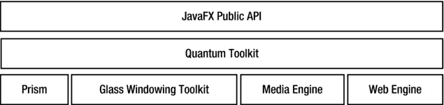

图 9-1。

Components making up the JavaFX platform

*   JavaFX 公共 API
*   量子工具包
*   棱镜
*   玻璃开窗工具包
*   媒体引擎
*   网络引擎

JavaFX 中的 GUI 被构造为场景图。场景图是被称为节点的可视元素的集合，这些节点以树状层次结构排列。使用公共 JavaFX API 构建场景图。场景图中的节点可以处理用户输入和手势。它们可以有效果、转换和状态。场景图中的节点类型包括简单的用户界面(UI)控件，例如按钮、文本字段、2D 和 3D 形状、图像、媒体(音频和视频)、web 内容、图表等。

Prism 是用于渲染场景图形的硬件加速图形管道。如果硬件加速渲染在平台上不可用，则使用 Java 2D 作为后备渲染机制。例如，在使用 Java 2D 进行渲染之前，JavaFX 将尝试在 Windows 上使用 DirectX，在 Mac、Linux 和嵌入式平台上使用 OpenGL。

使用本机操作系统提供图形和窗口服务，如 windows 和计时器。该工具包还负责管理事件队列。在 JavaFX 中，事件队列由一个称为 JavaFX 应用程序线程的操作系统级线程管理。所有用户输入事件都在 JavaFX 应用程序线程上调度。JavaFX 要求只能在 JavaFX 应用程序线程上修改实时场景图形。

Prism 使用单独的线程，而不是 JavaFX 应用程序线程来进行渲染。它通过在处理下一帧的同时渲染一帧来加速渲染过程。当场景图形被修改时，例如，通过在文本字段中输入文本，Prism 需要重新渲染场景图形。使用一个称为脉冲事件的事件来实现场景图形与 Prism 的同步。当场景图形被修改并且需要重新渲染时，一个脉冲事件在 JavaFX 应用程序线程上排队。脉冲事件表示场景图形与 Prism 中的渲染层不同步，应该渲染 Prism 级别的最新帧。脉冲事件被限制在每秒最大 60 帧。

媒体引擎负责在 JavaFX 中提供媒体支持，例如，回放音频和视频。它利用了平台上可用的编解码器。媒体引擎使用单独的线程处理媒体帧，JavaFX 应用程序线程将帧与场景图形同步。媒体引擎基于 GStreamer，这是一个开源的多媒体框架。

web 引擎负责处理嵌入在场景图中的 web 内容(HTML)。Prism 负责呈现 web 内容。web 引擎基于 Webkit，这是一个开源的 web 浏览器引擎。它支持 HTML5、级联样式表(CSS)、JavaScript 和文档对象模型(DOM)。

该工具包是对底层组件(如 Prism、Glass、媒体引擎和 Web 引擎)的抽象。它还有助于低层组件之间的协调。

## JavaFX 的历史

JavaFX 最初是由 Chris Oliver 在 Seebeyond 开发的，它被称为 F3(形式跟随功能)。F3 是一种易于开发 GUI 应用程序的 Java 脚本语言。它提供了声明性语法、静态类型、类型推断、数据绑定、动画、2D 图形、Swing 组件等。Seebeyond 被太阳微系统公司收购，F3 在 2007 年被命名为 JavaFX。甲骨文在 2010 年收购了太阳微系统公司。甲骨文在 2013 年开源了 JavaFX。

JavaFX 的第一个版本发布于 2008 年第四季度。JavaFX 的当前版本是 8.0 版。JavaFX 的版本号从 2.2 跃升到 8.0。从 Java 8 开始，Java SE 和 JavaFX 的版本号将是相同的。将来，Java SE 和 JavaFX 的主要版本将同时发布，并且它们的版本将保持同步。比如 JavaFX 9 会和 Java SE 9 一起发布，JavaFX 10 会和 Java SE 10 一起发布等等。

表 [9-1](#Tab1) 包含 JavaFX 的发布列表。从 Java SE 8 的发布开始，JavaFX 就是 Java SE 运行时库的一部分，您不需要执行任何额外的设置来编译和运行 JavaFX 程序。

表 9-1。

JavaFX Releases

<colgroup><col> <col> <col></colgroup> 
| 出厂日期 | 版本 | 评论 |
| --- | --- | --- |
| 2008 年第四季度 | JavaFX 1.0 | 这是 JavaFX 的最初版本。它使用一种称为 JavaFX Script 的声明语言来编写 JavaFX 代码。 |
| Q1，2009 年 | JavaFX 1.1 | 引入了对 JavaFX Mobile 的支持。 |
| Q2，2009 年 | JavaFX 1.2 |   |
| Q2，2010 年 | JavaFX 1.3 |   |
| 2010 年第三季度 | JavaFX 1.3.1 |   |
| 2011 年第四季度 | java fx 2.0 | 不再支持 JavaFX script 和 JavaFX Mobile。它使用 Java 编程语言编写 JavaFX 代码。 |
| 2012 年，Q2 | JavaFX 2.1 | 引入了对 Mac OS 桌面版的支持。 |
| 2012 年第三季度 | JavaFX 2.2 |   |
| 2014 年，Q1 | JavaFX 8.0 | JavaFX 版本从 2.2 跳到了 8.0。JavaFX 和 Java SE 版本将从 Java 8 开始匹配。 |

## 系统需求

要使用本章中的示例，您需要安装 JDK8。没有必要使用 NetBeans IDE 来编译和运行本书中的程序。但是，NetBeans IDE 具有创建、运行和打包 JavaFX 应用程序的特殊功能，这使得使用 NetBeans 开发 JavaFX 应用程序更加容易。您可以使用任何其他 IDE，如 Eclipse、JDeveloper、IntelliJ IDEA 等。或者只使用命令提示符来编译和运行 JavaFX 程序。

## JavaFX 运行时库

所有 JavaFX 类都打包在一个名为`jfxrt.jar`的 JAR 文件中，该文件位于`JRE_HOME\lib\ext`目录中，其中`JRE_HOME`是 JRE 的安装目录。

如果您在命令行上编译和运行 JavaFX 程序，您不需要担心在类路径中设置 JavaFX 运行时 JAR 文件。Java 8 编译器(`javac`命令)和启动器(`java`命令)自动将 JavaFX 运行时 JAR 文件包含在类路径中。

当您创建 Java 或 JavaFX 项目时，NetBeans IDE 会自动在类路径中包含 JavaFX 运行时 JAR 文件。如果您使用的是 NetBeans 之外的 ide，您可能需要在 IDE 类路径中包含`jfxrt.jar`，以便从 IDE 内部编译和运行 JavaFX 应用程序。

## JavaFX 源代码

有经验的开发人员有时更喜欢查看 JavaFX 库的源代码，以了解幕后是如何实现的。Oracle 提供了 JavaFX 源代码。Java 8 安装复制了 JDK 主目录中的源代码。文件名为`javafx-src.zip`。将文件解压到一个目录中，使用您喜欢的 Java 编辑器打开源代码。

## 您的第一个 JavaFX 应用程序

您的第一个 JavaFX 应用程序将在一个窗口中显示文本`Hello JavaFX`。通过添加尽可能少的代码行，并了解代码的作用以及为什么需要它，您将采取渐进的方法来开发您的第一个 JavaFX 应用程序。

### 创建 HelloJavaFX 类

JavaFX 应用程序是一个必须从`Application`类继承的类。`Application`级在`javafx.application`包里。你将命名你的类为`HelloFXApp`，它将被保存在`com.jdojo.jfx`包中。

`// HelloFXApp.java`

`package com.jdojo.jfx;`

`import javafx.application.Application;`

`public class HelloFXApp extends Application {`

`// Application logic goes here`

`}`

该程序包括包声明、导入语句和类声明。代码中没有类似 JavaFX 的内容。它看起来像任何其他 Java 代码。然而，通过从`Application`类继承`HelloFXApp`类，您已经满足了 JavaFX 应用程序的一个需求。此时`HelloFXApp`类不会编译。

### 重写 start()方法

如果您尝试编译`HelloFXApp class`，将会导致以下编译时错误:

`HelloFXApp is not abstract and does not override abstract method start(Stage) in Application`

该错误表明`Application`类包含一个抽象的`start(Stage stage)`方法，该方法没有在`HelloFXApp`类中被覆盖。作为 Java 开发人员，您知道下一步该做什么:要么将`HelloJavaFX`类声明为抽象类，要么为`start()`方法提供一个实现。您需要为这个类中的`start()`方法提供一个实现。`Application`类中的`start()`方法声明如下:

*   `public abstract void start(Stage stage) throws java.lang.Exception`

以下是为您的应用程序修改的代码:

`// HelloFXApp.java`

`package com.jdojo.jfx;`

`import javafx.application.Application;`

`import javafx.stage.Stage;`

`public class HelloFXApp extends Application {`

`@Override`

`public void start(Stage stage) {`

`// The logic for starting the application goes here`

`}`

`}`

在修订后的代码中，您加入了两件事:

*   您已经添加了一个另外的`import`语句来从`javafx.stage`包中导入`Stage`类。
*   您实现了`start()`方法。该方法的`throws`子句被删除，这符合 Java 中覆盖方法的规则。

`start()`方法是 JavaFX 应用程序的入口点。它由 JavaFX 应用程序启动器调用。注意，`start()`方法被传递了一个`Stage`类的实例，这被称为应用程序的初级阶段。您可以根据需要在应用程序中创建更多阶段。但是，主阶段总是由 JavaFX 运行时为您创建的。

Tip

每个 JavaFX 应用程序类都必须从`Application`类继承，并为`start(String stage)`方法提供实现。

### 展示舞台

类似于现实世界中的舞台，JavaFX 舞台用于显示场景。场景具有视觉效果，如文本、形状、图像、控件、动画、效果等。—用户可以与之交互，所有基于 GUI 的应用程序都是如此。

在 JavaFX 中，主舞台是场景的容器。根据应用程序的运行环境，stage 的外观会有所不同。您不需要根据环境采取任何行动，因为 JavaFX 运行时会为您处理所有细节。例如，如果应用程序作为桌面应用程序运行，主舞台将是一个带有标题栏和显示场景区域的窗口；如果应用程序作为 applet 在 web 浏览器中运行，主阶段将是浏览器窗口中的嵌入区域。

由应用程序启动器创建的初级阶段没有场景。在下一节中，您将为您的舞台创建一个场景。

您必须展示舞台才能看到场景中包含的视觉效果。使用`show()`方法显示阶段。或者，您可以使用方法为舞台设置标题。`HelloFXApp`类的修订代码如下:

`// HelloFXApp.java`

`package com.jdojo.jfx;`

`import javafx.application.Application;`

`import javafx.stage.Stage;`

`public class HelloFXApp extends Application {`

`@Override`

`public void start(Stage stage) {`

`// Set a title for the stage`

`stage.setTitle("Hello JavaFX Application");`

`// Show the stage`

`stage.show();`

`}`

`}`

### 启动应用程序

您已经准备好运行您的第一个 JavaFX 应用程序。您可以使用以下两个选项之一来运行 JavaFX 应用程序:

*   启动 JavaFX 应用程序不需要在类中包含方法。当运行从`Application`类继承的 Java 类时，如果正在运行的类不包含`main()`方法，则`java`命令会启动 JavaFX 应用程序。
*   在 JavaFX 应用程序类中包含一个`main()`方法。在`main()`方法中，调用`Application`类的`launch()`静态方法来启动 JavaFX 应用程序。该方法将一个`String`数组作为参数，它是传递给 JavaFX 应用程序的参数。

如果您使用第一个选项，您不需要为`HelloJavaFX`类编写任何额外的代码。如果您使用第二个选项，用`main()`方法修改后的`HelloFXApp`类代码如清单 9-1 所示。

清单 9-1。没有场景的 JavaFX 应用程序

`// HelloFXApp.java`

`package com.jdojo.jfx;`

`import javafx.application.Application;`

`import javafx.stage.Stage;`

`public class HelloFXApp extends Application {`

`public static void main(String[] args) {`

`// Launch the JavaFX application`

`Application.launch(args);`

`}`

`@Override`

`public void start(Stage stage) {`

`stage.setTitle("Hello JavaFX Application");`

`stage.show();`

`}`

`}`

`main()`方法调用`launch()`方法，后者将做一些设置工作，并调用`HelloFXApp`类的`start()`方法。你的`start()`方法为初级阶段设置标题并显示阶段。

使用以下命令编译`HelloFXApp`类:

`javac com/jdojo/intro/HelloFXApp.java`

使用以下命令运行`HelloFXApp`类:

`java com.jdojo.jfx.HelloFXApp`

显示一个带有标题栏的窗口，如图 [9-2](#Fig2) 所示。

图 9-2。

A JavaFX stage without a scene

窗口的主要区域是空的。这是舞台将显示其场景的内容区域。因为您还没有舞台场景，所以您会看到一个空白区域。标题栏显示您在`start()`方法中设置的标题。

您可以使用窗口标题栏中的关闭菜单选项关闭应用程序。在 Windows 上使用 Alt + F4 关闭窗口。您可以使用平台提供的任何其他选项来关闭窗口。

Tip

直到所有窗口都关闭或者应用程序使用`Platform.exit()`方法退出，类`Application`的`launch()`方法才返回。`Platform`级在`javafx.application`包里。

您还没有在 JavaFX 中看到任何令人兴奋的东西。你需要等待，直到你在下一部分创建一个场景。

### 添加 main()方法

如前一节所述，Java 8 启动器(`java`命令)不需要启动 JavaFX 应用程序的方法。如果您想要运行的类继承自`Application`类，`java`命令会通过自动调用`Application.launch()`方法来启动 JavaFX 应用程序。

如果使用 NetBeans IDE 创建 JavaFX 项目，并且通过运行 JavaFX 项目来运行应用程序，则不需要使用`main()`方法来启动 JavaFX 应用程序。但是，当您将 JavaFX 应用程序类作为文件运行时，NetBeans IDE 要求您有一个`main()`方法，例如，通过选择`HelloFXApp`文件，右键单击它，然后从菜单中选择`Run File`选项。

一些 ide 仍然需要`main()`方法来启动 JavaFX 应用程序。本章中的所有例子都将包括启动 JavaFX 应用程序的`main()`方法。

### 向舞台添加场景

这个类的一个实例在`javafx.scene`包中，代表一个场景。一个舞台包含一个场景。场景包含视觉内容。

场景的内容以树状层次排列。层次结构的顶部是根节点。根节点可能包含子节点，子节点又可能包含它们的子节点，依此类推。必须有根节点才能创建场景。您将使用一个`VBox`作为根节点。`VBox`代表垂直框，垂直排列其子项。

`VBox root = new VBox();`

Tip

从`javafx.scene.Parent`类继承的任何节点都可以用作场景的根节点。几个节点，称为布局窗格或容器，例如，`VBox`、`HBox`、`Pane`、`FlowPane`、`GridPane`、`TilePane`等。，可以用作根节点。`Group`是一个特殊的容器，将它的子容器组合在一起。

可以有子节点的节点提供了一个返回其子节点的`ObservableList`的方法。要向节点添加子节点，只需将子节点添加到`ObservableList`中。下面的代码片段向`VBox`添加了一个`Text`节点:

`// Create a VBox node`

`VBox root = new VBox();`

`// Create a Text node`

`Text msg = new Text("Hello JavaFX");`

`// Add the Text node to the VBox as a child node`

`root.getChildren().add(msg);`

`Scene`类包含几个构造函数。您将使用允许您指定场景的根节点和大小的那个。以下语句创建一个场景，以`VBox`作为根节点，宽度为 300 像素，高度为 50 像素:

`// Create a scene`

`Scene scene = new Scene(root, 300, 50);`

您需要通过调用`Stage`类的方法将场景设置为舞台。

`// Set the scene to the stage`

`stage.setScene(scene);`

就这样。您已经用一个场景完成了您的第一个 JavaFX 程序。清单 9-2 包含了完整的程序。程序显示如图 [9-3](#Fig3) 所示的窗口。

清单 9-2。JavaFX 应用程序，其场景包含一个文本节点

`// HelloFXApp.java`

`package com.jdojo.jfx;`

`import javafx.application.Application;`

`import javafx.scene.Scene;`

`import javafx.scene.layout.VBox;`

`import javafx.scene.text.Text;`

`import javafx.stage.Stage;`

`public class HelloFXApp extends Application {`

`public static void main(String[] args) {`

`Application.launch(args);`

`}`

`@Override`

`public void start(Stage stage) {`

`Text msg = new Text("Hello JavaFX");`

`VBox root = new VBox();`

`root.getChildren().add(msg);`

`Scene scene = new Scene(root, 300, 50);`

`stage.setScene(scene);`

`stage.setTitle("Hello JavaFX Application");`

`stage.show();`

`}`

`}`

图 9-3。

A JavaFX application with scene having a Text node

## 改进 HelloFX 应用程序

JavaFX 能够做的事情比您到目前为止看到的要多得多。让我们增强第一个程序，并添加更多的用户界面元素，如按钮和文本字段。这一次，用户将能够与应用程序进行交互。使用`Button`类的实例创建一个按钮，如下所示:

`// Create a button with "Exit" text`

`Button exitBtn = new Button("Exit");`

当一个按钮被点击时，一个`ActionEvent`被触发。您可以添加一个`ActionEvent`处理程序来处理该事件。使用方法为按钮设置一个`ActionEvent`处理程序。下面的语句为按钮设置了一个`ActionEvent`处理程序。处理程序终止应用程序。您可以使用 lambda 表达式或匿名类来设置`ActionEvent`处理程序。以下代码片段展示了这两种方法:

`// Using a lambda expression`

`exitBtn.setOnAction(e -> Platform.exit());`

`// Using an anonymous class`

`import javafx.event.ActionEvent;`

`import javafx.event.EventHandler;`

`...`

`exitBtn.setOnAction(new EventHandler<ActionEvent>() {`

`@Override`

`public void handle(ActionEvent e) {`

`Platform.exit();`

`}`

`});`

清单 9-3 中的程序展示了如何在场景中添加更多的节点。该程序使用`Label`类的方法将`Label`的填充颜色设置为蓝色。稍后我将简要讨论在 JavaFX 中使用 CSS。

清单 9-3。在 JavaFX 应用程序中与用户交互

`// ImprovedHelloFXApp.java`

`package com.jdojo.jfx;`

`import javafx.application.Application;`

`import javafx.application.Platform;`

`import javafx.scene.Scene;`

`import javafx.scene.control.Button;`

`import javafx.scene.control.Label;`

`import javafx.scene.control.TextField;`

`import javafx.scene.layout.VBox;`

`import javafx.stage.Stage;`

`public class ImprovedHelloFXApp extends Application {`

`public static void main(String[] args) {`

`Application.launch(args);`

`}`

`@Override`

`public void start(Stage stage) {`

`Label nameLbl = new Label("Enter your name:");`

`TextField nameFld = new TextField();`

`Label msg = new Label();`

`msg.setStyle("-fx-text-fill: blue;");`

`// Create buttons`

`Button sayHelloBtn = new Button("Say Hello");`

`Button exitBtn = new Button("Exit");`

`// Add the event handler for the Say Hello button`

`sayHelloBtn.setOnAction(e -> {`

`String name = nameFld.getText();`

`if (name.trim().length() > 0) {`

`msg.setText("Hello " + name);`

`}`

`else {`

`msg.setText("Hello there");`

`}`

`});`

`// Add the event handler for the Exit button`

`exitBtn.setOnAction(e -> Platform.exit());`

`// Create the root node`

`VBox root = new VBox();`

`// Set the vertical spacing between children to 5px`

`root.setSpacing(5);`

`// Add children to the root node`

`root.getChildren().addAll(nameLbl, nameFld, msg, sayHelloBtn, exitBtn);`

`Scene scene = new Scene(root, 350, 150);`

`stage.setScene(scene);`

`stage.setTitle("Improved Hello JavaFX Application");`

`stage.show();`

`}`

`}`

改进后的 HelloFX 程序显示如图 [9-4](#Fig4) 所示的窗口。该窗口包含两个标签、一个文本字段和两个按钮。一个`VBox`被用作场景的根节点。在文本字段中输入一个名称，然后单击`Say Hello`按钮查看 hello 消息。在不输入姓名的情况下点击`Say Hello`按钮会显示信息`Hello there`。应用程序在一个`Label`控件中显示一条消息。点击`Exit`按钮退出应用程序。

图 9-4。

A JavaFX Application with two labels, a text field, and two buttons

## JavaFX 应用程序的生命周期

JavaFX runtime 创建了几个线程，用于在应用程序的不同阶段执行不同的任务。在本节中，您只对那些在生命周期中用于调用`Application`类的方法的线程感兴趣。JavaFX 运行时在其他线程中创建了两个名为

*   Java FX-启动器
*   JavaFX 应用程序线程

`Application`类的方法创建这些线程。在 JavaFX 应用程序的生命周期中，JavaFX 运行时按顺序调用 JavaFX 应用程序类的以下方法:

*   无参数构造函数
*   `init()`法
*   `start()`法
*   `stop()`法

JavaFX 运行时在 JavaFX 应用程序线程上创建指定应用程序类的实例。

JavaFX-Launcher 线程调用应用程序类的方法。`Application`类中的`init()`方法实现为空。您可以在应用程序类中重写此方法。不允许在 JavaFX-Launcher 线程上创建`Stage`或`Scene`。它们必须在 JavaFX 应用程序线程上创建。因此，不能在`init()`方法中创建`Stage`或`Scene`。试图这样做将引发运行时异常。创建 UI 控件是很好的，例如，按钮、形状等。在`init()`方法中。

JavaFX 应用程序线程调用应用程序类的`start(Stage stage)`方法。注意，`Application`类中的方法被声明为`abstract`，您必须在您的应用程序类中覆盖这个方法。

此时，`launch()`方法等待 JavaFX 应用程序完成。

当应用程序完成时，JavaFX 应用程序线程调用应用程序类的方法。在`Application`类中，`stop()`方法的默认实现是空的。当应用程序停止时，您必须在应用程序类中重写此方法来执行您的逻辑。

清单 9-4 中的程序展示了 JavaFX 应用程序的生命周期。它显示一个阶段和一个`Exit`按钮。当显示 stage 时，您将看到输出的前三行。您需要点击`Exit`按钮来关闭该阶段，以查看输出的最后一行。

清单 9-4。JavaFX 应用程序的生命周期

`// FXLifeCycleApp.java`

`package com.jdojo.jfx;`

`import javafx.application.Application;`

`import javafx.application.Platform;`

`import javafx.scene.Group;`

`import javafx.scene.Scene;`

`import javafx.scene.control.Button;`

`import javafx.stage.Stage;`

`public class FXLifeCycleApp extends Application {`

`public FXLifeCycleApp() {`

`String name = Thread.currentThread().getName();`

`System.out.println("FXLifeCycleApp() constructor: " + name);`

`}`

`public static void main(String[] args) {`

`Application.launch(args);`

`}`

`@Override`

`public void init() {`

`String name = Thread.currentThread().getName();`

`System.out.println("init() method: " + name);`

`}`

`@Override`

`public void start(Stage stage) {`

`String name = Thread.currentThread().getName();`

`System.out.println("start() method: " + name);`

`// Add an Exit button to the scene`

`Button exitBtn = new Button("Exit");`

`exitBtn.setOnAction(e -> Platform.exit());`

`Scene scene = new Scene(new Group(exitBtn), 300, 100);`

`stage.setScene(scene);`

`stage.setTitle("JavaFX Application Life Cycle");`

`stage.show();`

`}`

`@Override`

`public void stop() {`

`String name = Thread.currentThread().getName();`

`System.out.println("stop() method: " + name);`

`}`

`}`

`FXLifeCycleApp() constructor: JavaFX Application Thread`

`init() method: JavaFX-Launcher`

`start() method: JavaFX Application Thread`

`stop() method: JavaFX Application Thread`

## 终止 JavaFX 应用程序

JavaFX 应用程序可以显式或隐式终止。您可以通过调用`Platform.exit()`方法显式终止 JavaFX 应用程序。当这个方法被调用时，在`start()`方法之后或者从该方法内部，调用`Application`类的`stop()`方法，然后 JavaFX 应用程序线程被终止。此时，如果只有守护线程在运行，JVM 将退出。如果从构造函数或`Application`类的`init()`方法调用该方法，则`stop()`方法可能不会被调用。

Tip

JavaFX 应用程序可以在 web 浏览器中运行。在 web 环境中调用`Platform.exit()`方法可能没有任何效果。

当最后一个窗口关闭时，JavaFX 应用程序可以隐式终止。使用`Platform`类的静态`setImplicitExit(boolean implicitExit)`方法可以打开或关闭这种行为。将 true 传递给此方法将打开此行为。将 false 传递给此方法会关闭此行为。默认情况下，此行为是打开的。这就是为什么在迄今为止的大多数例子中，当你关闭窗口时，你的应用程序被终止。当这个行为打开时，在终止 JavaFX 应用程序线程之前，调用`Application`类的`stop()`方法。终止 JavaFX 应用程序线程并不总是会终止 JVM。如果所有正在运行的非守护进程线程都终止了，JVM 也会终止。如果 JavaFX 应用程序的隐式终止行为被关闭，您必须调用`Platform`类的`exit()`方法来终止应用程序。

## 什么是属性和绑定？

属性是影响类的状态和/或行为的类的公共可访问属性。即使属性是可公开访问的，它的使用(读/写)也会调用隐藏实际实现的方法来访问数据。属性是可观察的，所以当它的值改变时，感兴趣的人会得到通知。属性可以是只读、只写或读写的。只读属性有 getter，但没有 setter。只写属性有 setter，但没有 getter。读写属性有一个 getter 和一个 setter。

与 C#等其他编程语言不同，Java 中的属性在语言级别不受支持。Java 对属性的支持来自 JavaBeans API 和设计模式。关于 Java 中属性的更多细节，请参考 JavaBeans 规范，可以从 [`www.oracle.com/technetwork/java/javase/documentation/spec-136004.html`](http://www.oracle.com/technetwork/java/javase/documentation/spec-136004.html) 下载。

在编程中，术语绑定在许多上下文中使用。在这里，我想在数据绑定的上下文中定义它。数据绑定定义了程序中数据元素(通常是变量)之间的关系，以保持它们的同步。在 GUI 应用程序中，数据绑定经常用于将数据模型中的元素与相应的 UI 元素同步。考虑以下语句，假设 x、y 和 z 是数值变量:

`x = y + z;`

该语句定义 x、y 和 z 之间的绑定。当执行该语句时，x 的值与 y 和 z 的值之和同步。绑定还具有时间因子。在上面的语句中，x 的值被绑定到 y 和 z 的和，并且在语句执行时有效。在执行语句之前和之后，x 的值可能不等于 y 和 z 的总和。有时，希望绑定持续一段时间。考虑以下使用`listPrice`、`discounts`和`taxes`定义绑定的语句:

`soldPrice = listPrice - discounts + taxes;`

在这种情况下，您希望保持绑定永远有效，这样无论何时`listPrice, discounts`或`taxes`发生变化，都会正确计算销售价格。在这个绑定中，`listPrice, discounts`、`taxes`被称为依赖关系，据说`soldPrice`被绑定到`listPrice`、`discounts`、`taxes`。

为了使绑定正常工作，有必要在依赖关系发生变化时通知它。支持绑定的编程语言提供了一种用依赖关系注册侦听器的机制。当依赖关系变得无效或发生变化时，所有侦听器都会得到通知。当绑定接收到这样的通知时，它可以将其自身与其依赖项同步。

绑定可以是急切绑定，也可以是懒惰绑定。在急切绑定中，当依赖关系发生变化时，会立即重新计算绑定变量。在惰性绑定中，当绑定变量的依赖关系改变时，不会重新计算绑定变量；下次读取其值时会重新计算。与急切绑定相比，惰性绑定的性能更好。

绑定可以是单向的也可以是双向的。单向绑定只在一个方向上起作用:依赖关系的变化会传播到绑定的变量。双向绑定在两个方向上都起作用，其中绑定变量和依赖项保持它们的值彼此同步。通常，双向绑定只在两个变量之间定义。例如，一个双向绑定，`x = y`和`y = x`，声明`x`和`y`的值总是相同的。

从数学上讲，不可能唯一地定义多个变量之间的双向绑定。在上面的例子中，售出价格绑定是单向绑定。如果您想使它成为一个双向绑定，那么当销售价格发生变化时，不可能唯一地计算标价、折扣和税的值。在另一个方向有无限多的可能性。

带有 GUI 的应用程序为用户提供 UI 小部件，如文本字段、复选框、按钮等。，来操作数据。UI 小部件中显示的数据必须与底层数据模型同步，反之亦然。在这种情况下，需要双向绑定来保持 UI 和数据模型同步。

## JavaFX 中的属性和绑定

JavaFX 通过属性和绑定 API 支持属性、事件和绑定。JavaFX 中对属性的支持是 JavaBeans 属性的一大进步。JavaFX 中的所有属性都是可观察的。可以观察到它们的失效和值的变化。您可以拥有读写或只读属性。所有读写属性都支持绑定。JavaFX 中的属性可以表示一个值或一组值。

在 JavaFX 中，属性是对象。每种属性都有一个属性类层次结构。例如，`IntegerProperty`、`DoubleProperty`和`StringProperty`类分别代表`int`、`double`和`String`类型的属性。这些类是`abstract`。它们有两种类型的实现类:一种表示读写属性，另一种表示只读属性的包装。例如，`SimpleDoubleProperty`和`ReadOnlyDoubleWrapper`类是具体的类，它们的对象分别用作类型`double`的读写和只读属性。以下是如何创建初始值为 100 的`IntegerProperty`的示例:

`IntegerProperty counter = new SimpleIntegerProperty(100);`

属性类提供两对 getter 和 setter 方法:

*   `get()`和`set()`方法
*   `getValue()`和`setValue()`方法

方法分别获取和设置属性的值。对于基本类型属性，它们使用基本类型值。比如对于`IntegerProperty`，`get()`方法的返回类型和`set()`方法的参数类型都是`int`。`getValue()`和`setValue()`方法处理对象类型；比如它们的返回类型和参数类型都是`IntegerProperty`的`Integer`。

对于引用类型属性，比如`StringProperty`和`ObjectProperty<T>`，两对 getter 和 setter 都使用对象类型。也就是说，`StringProperty`的`get()`和`getValue()`方法都返回一个`String`，而`set()`和`setValue()`方法都带有一个`String`参数。对于基本类型的自动装箱，使用 getter 和 setter 的哪个版本并不重要。`getValue()`和`setValue()`方法的存在是为了帮助你根据对象类型编写通用代码。

以下代码片段使用了一个及其`get()`和`set()`方法。该属性是一个读写属性，因为它是`SimpleIntegerProperty`类的对象。

`IntegerProperty counter = new SimpleIntegerProperty(1);`

`int counterValue = counter.get();`

`System.out.println("Counter:" + counterValue);`

`counter.set(2);`

`counterValue = counter.get();`

`System.out.println("Counter:" + counterValue);`

`Counter:1`

`Counter:2`

使用只读属性有点棘手。一个`ReadOnlyXxxWrapper`类包装了`Xxx`类型的两个属性:一个只读，一个读写。两种属性都是同步的。它的方法返回一个`ReadOnlyXxxProperty`对象。下面的代码片段显示了如何创建一个只读的`Integer`属性:

`// Create a read-only wrapper property`

`ReadOnlyIntegerWrapper idWrapper = new ReadOnlyIntegerWrapper(100);`

`// Get the read-only version of the read-only wrapper property object`

`ReadOnlyIntegerProperty id = idWrapper.getReadOnlyProperty();`

`System.out.println("idWrapper:" + idWrapper.get());`

`System.out.println("id:" + id.get());`

`// Change the value`

`idWrapper.set(101);`

`System.out.println("idWrapper:" + idWrapper.get());`

`System.out.println("id:" + id.get());`

`idWrapper:100`

`id:100`

`idWrapper:101`

`id:101`

该属性是读写的，而`id`属性是只读的。当`idWrapper`中的值改变时，`id`中的值自动改变。要在类中定义一个只读属性，需要将`idWrapper`声明为私有实例变量。如果类外需要它的值，则返回`id`，这样外界可以读取该值，但不能更改它。

Tip

通常，包装属性用作类的私有实例变量。类别可以在内部变更属性。它的一个方法返回包装类的只读属性对象，因此同一个属性对于外界是只读的。

可以使用代表单个值的七种类型的属性。这些属性的基类被命名为`XxxProperty`，只读基类被命名为`ReadOnlyXxxProperty`，包装类被命名为`ReadOnlyXxxWrapper`。每种类型的`Xxx`值列于表 [9-2](#Tab2) 中。

表 9-2。

Property Classes That Wrap a Single Value

<colgroup><col> <col></colgroup> 
| 类型 | Xxx 值 |
| --- | --- |
| `int` | `Integer` |
| `long` | `Long` |
| `float` | `Float` |
| `double` | `Double` |
| `boolean` | `Boolean` |
| `String` | `String` |
| `Object` | `Object` |

属性对象包装了三条信息:

*   包含它的 bean 的引用
*   一个名字
*   一种价值观

当您创建属性对象时，您可以提供以上三条信息中的全部信息，也可以不提供。像`SimpleXxxProperty`和`ReadOnlyXxxWrapper`这样命名的具体属性类提供了四个构造函数，让您提供这三条信息的组合。下面是该类的构造函数:

*   `SimpleIntegerProperty()`
*   `SimpleIntegerProperty(int initialValue)`
*   `SimpleIntegerProperty(Object bean, String name)`
*   `SimpleIntegerProperty(Object bean, String name, int initialValue)`

初始值的默认值取决于属性的类型。对于数值类型是零，`false`对于`boolean`类型是零，`null`对于引用类型是零。

属性对象可以是 bean 的一部分，也可以是独立的对象。指定的`bean`是对包含该属性的 bean 对象的引用。对于独立的属性对象，可以是`null`。其默认值为`null`。

属性的名字就是它的名字。如果未提供，则默认为空字符串。

下面的代码片段创建一个属性对象作为 bean 的一部分，并设置所有三个值。`SimpleStringProperty`类的构造函数的第一个参数是`this`，它是`Person` bean 的引用；第二个参数，`"name",`是属性的名称；`"Li",`还有第三个论点，就是财产的价值。

`public class Person {`

`private StringProperty name = new SimpleStringProperty(this, "name", "Li");`

`// More code for the Person goes here`

`}`

每个属性类都包含分别返回 bean 引用和属性名的`getBean()`和`getName()`方法。

### 在 JavaFX Beans 中使用属性

在上一节中，您看到了 JavaFX 属性作为独立对象的使用。在本节中，您将在类中使用它们来定义属性。让我们创建一个具有三个属性(`ISBN`、`title`和`price)`)的`Book`类，将使用 JavaFX 属性类对其进行建模。

在 JavaFX 中，不将类的属性声明为基本类型之一。相反，您使用 JavaFX 属性类之一。`Book`类的`title`属性将声明如下。照常宣布`private`。

`public class Book {`

`private StringProperty title =`

`new SimpleStringProperty(this, "title", "Unknown");`

`}`

您为属性声明了一个`public` getter，按照惯例，它被命名为`XxxProperty`，其中`Xxx`是属性的名称。getter 返回属性的引用。对于您的`title`属性，getter 将被命名为`titleProperty`，如图所示:

`public class Book {`

`private StringProperty title =`

`new SimpleStringProperty(this, "title", "Unknown");`

`public final StringProperty titleProperty() {`

`return title;`

`}`

`}`

如下面设置和获取书名的代码片段所示，`Book`类的声明可以很好地处理`title`属性:

`Book beginningJava8 = new Book();`

`beginningJava8.titleProperty().set("Beginning Java 8");`

`String title = beginningJava8.titleProperty().get();`

根据 JavaFX 设计模式(不是针对任何技术需求)，JavaFX 属性有一个 getter 和 setter，类似于 JavaBeans 中的 getter 和 setter。getter 的返回类型和 setter 的参数类型与属性值的类型相同。`title`属性的`getTitle()`和`setTitle()`方法声明如下:

`public class Book {`

`private StringProperty title =`

`new SimpleStringProperty(this, "title", "Unknown");`

`public final StringProperty titleProperty() {`

`return title;`

`}`

`public final String getTitle() {`

`return title.get();`

`}`

`public final void setTitle(String title) {`

`this.title.set(title);`

`}`

`}`

注意，`getTitle()`和`setTitle()`方法在内部使用`title`属性对象来获取和设置标题值。

Tip

在 JavaFX 中，按照惯例，类的属性的 getters 和 setters 被声明为`final`。添加了使用 JavaBeans 命名约定的额外的 getters 和 setters，以使该类能够与使用旧 JavaBeans 命名约定来标识类属性的旧工具和框架进行互操作。

以下代码片段显示了对`Book`类的只读`ISBN`属性的声明:

`public class Book {`

`private ReadOnlyStringWrapper ISBN =`

`new ReadOnlyStringWrapper(this, "ISBN", "Unknown");`

`public final String getISBN() {`

`return ISBN.get();`

`}`

`public final ReadOnlyStringProperty ISBNProperty() {`

`return ISBN.getReadOnlyProperty();`

`}`

`// More code for the Book class goes here`

`}`

关于只读`ISBN`属性的声明，请注意以下几点:

*   它使用了`ReadOnlyStringWrapper`类而不是`SimpleStringProperty`类。
*   属性值没有设置器。你可以声明一个；但是，必须是私人的。
*   属性值的 getter 与读写属性的 getter 工作方式相同。
*   `ISBNProperty()`方法使用`ReadOnlyStringProperty`作为返回类型，而不是`ReadOnlyStringWrapper`。它从包装对象获取属性对象的只读版本，并返回该版本。

对于`Book`类的用户，它的`ISBN`属性是只读的。但是，它可以在内部进行更改，并且该更改将自动反映在 property 对象的只读版本中。清单 9-5 显示了`Book`类的完整代码。

清单 9-5。具有一个只读属性和两个读写属性的 Book 类

`// Book.java`

`package com.jdojo.jfx;`

`import javafx.beans.property.DoubleProperty;`

`import javafx.beans.property.ReadOnlyStringProperty;`

`import javafx.beans.property.ReadOnlyStringWrapper;`

`import javafx.beans.property.SimpleDoubleProperty;`

`import javafx.beans.property.SimpleStringProperty;`

`import javafx.beans.property.StringProperty;`

`public class Book {`

`private StringProperty title =`

`new SimpleStringProperty(this, "title", "Unknown");`

`private DoubleProperty price =`

`new SimpleDoubleProperty(this, "price", 0.0);`

`private ReadOnlyStringWrapper ISBN =`

`new ReadOnlyStringWrapper(this, "ISBN", "Unknown");`

`public Book() {`

`}`

`public Book(String title, double price, String ISBN) {`

`this.title.set(title);`

`this.price.set(price);`

`this.ISBN.set(ISBN);`

`}`

`public final String getTitle() {`

`return title.get();`

`}`

`public final void setTitle(String title) {`

`this.title.set(title);`

`}`

`public final StringProperty titleProperty() {`

`return title;`

`}`

`public final double getprice() {`

`return price.get();`

`}`

`public final void setPrice(double price) {`

`this.price.set(price);`

`}`

`public final DoubleProperty priceProperty() {`

`return price;`

`}`

`public final String getISBN() {`

`return ISBN.get();`

`}`

`public final ReadOnlyStringProperty ISBNProperty() {`

`return ISBN.getReadOnlyProperty();`

`}`

`}`

清单 9-6 测试了`Book`类的属性。它创建一个`Book`对象，打印细节，更改一些属性，然后再次打印细节。注意该方法使用了`ReadOnlyProperty`参数类型。所有属性类都直接或间接地实现了`ReadOnlyProperty`接口。

属性实现类的方法返回一个格式良好的字符串，该字符串包含属性的所有相关信息。我没有使用 property 对象的`toString()`方法，因为我想向您展示 JavaFX 属性的不同方法的用法。

清单 9-6。一个 BookPropertyTest 类来测试 Book 类的属性

`// BookPropertyTest.java`

`package com.jdojo.jfx;`

`import javafx.beans.property.ReadOnlyProperty;`

`public class BookPropertyTest {`

`public static void main(String[] args) {`

`Book book = new Book("Beginning Java 8", 49.99, "1430266619");`

`System.out.println("After creating the Book object...");`

`// Print Property details`

`printDetails(book.titleProperty());`

`printDetails(book.priceProperty());`

`printDetails(book.ISBNProperty());`

`// Change the book's properties`

`book.setTitle("Harnessing JavaFX 8.0");`

`book.setPrice(9.49);`

`System.out.println("\nAfter changing the Book properties...");`

`// Print Property details`

`printDetails(book.titleProperty());`

`printDetails(book.priceProperty());`

`printDetails(book.ISBNProperty());`

`}`

`public static void printDetails(ReadOnlyProperty<?> p) {`

`String name = p.getName();`

`Object value = p.getValue();`

`Object bean = p.getBean();`

`String beanClassName =`

`(bean == null) ? "null" : bean.getClass().getSimpleName();`

`String propClassName = p.getClass().getSimpleName();`

`System.out.print(propClassName);`

`System.out.print("[Name:" + name);`

`System.out.print(", Bean Class:" + beanClassName);`

`System.out.println(", Value:" + value + "]");`

`}`

`}`

`After creating the Book object...`

`SimpleStringProperty[Name:title, Bean Class:Book, Value:Beginning Java 8]`

`SimpleDoubleProperty[Name:price, Bean Class:Book, Value:49.99]`

`ReadOnlyPropertyImpl[Name:ISBN, Bean Class:Book, Value:1430266619]`

`After changing the Book properties...`

`SimpleStringProperty[Name:title, Bean Class:Book, Value:Harnessing JavaFX 8.0]`

`SimpleDoubleProperty[Name:price, Bean Class:Book, Value:9.49]`

`ReadOnlyPropertyImpl[Name:ISBN, Bean Class:Book, Value:1430266619]`

### 处理属性失效事件

当属性值的状态第一次从有效变为无效时，属性会生成一个无效事件。JavaFX 中的属性使用惰性计算。当已经无效的属性由于其值的状态再次改变而再次变得无效时，不会生成无效事件。无效属性在重新计算时变得有效，例如通过调用属性的`get()`或`getValue()`方法。

清单 9-7 是一个程序，它演示了什么时候为属性生成失效事件。该程序包括足够的注释来帮助你理解其中的逻辑。

清单 9-7。测试 JavaFX 属性的失效事件

`// InvalidationTest.java`

`package com.jdojo.jfx;`

`import javafx.beans.Observable;`

`import javafx.beans.property.IntegerProperty;`

`import javafx.beans.property.SimpleIntegerProperty;`

`public class InvalidationTest {`

`public static void main(String[] args) {`

`// Create a property`

`IntegerProperty counter = new SimpleIntegerProperty(100);`

`// Add an invalidation listener to the counter property using a`

`// method reference. The invalidated() method of thi class will`

`// be called when the counter property becomes invalid..`

`counter.addListener(InvalidationTest::invalidated);`

`System.out.println("Before changing the counter value-1");`

`counter.set(101);`

`System.out.println("After changing the counter value-1");`

`/*`

`* At this point counter property is invalid and further changes`

`* to its value will not generate any invalidation events.`

`*/`

`System.out.println();`

`System.out.println("Before changing the counter value-2");`

`counter.set(102);`

`System.out.println("After changing the counter value-2");`

`// Make the counter property valid by calling its get() method`

`int value = counter.get();`

`System.out.println("Counter value = " + value);`

`/* At this point the counter property is valid and further changes`

`to its value will generate invalidation events.`

`*/`

`// Try setting the same value`

`System.out.println();`

`System.out.println("Before changing the counter value-3");`

`counter.set(102);`

`System.out.println("After changing the counter value-3");`

`// Try setting a different value`

`System.out.println();`

`System.out.println("Before changing the counter value-4");`

`counter.set(103);`

`System.out.println("After changing the counter value-4");`

`}`

`public static void invalidated(Observable prop) {`

`System.out.println("Counter is invalid.");`

`}`

`}`

`Before changing the counter value-1`

`Counter is invalid.`

`After changing the counter value-1`

`Before changing the counter value-2`

`After changing the counter value-2`

`Counter value = 102`

`Before changing the counter value-3`

`After changing the counter value-3`

`Before changing the counter value-4`

`Counter is invalid.`

`After changing the counter value-4`

一开始，程序创建一个名为`counter`的`IntegerProperty`，并向属性添加一个无效监听器。

`// Create the counter property`

`IntegerProperty counter = new SimpleIntegerProperty(100);`

`// Add an invalidation listener to the counter proeprty`

`counter.addListener(InvalidationTest::invalidated);`

当您创建属性对象时，它是有效的。当您将`counter`属性更改为 101 时，它会触发一个失效事件。此时，`counter`属性变得无效。当您将其值更改为 102 时，它不会触发无效事件，因为它已经无效。您使用`get()`方法读取`counter`值，使其再次有效。现在，您将同样的 a 值 102 设置为`counter`，这不会触发一个无效事件，因为该值并没有真正改变；它的值已经是 102 了。`counter`属性仍然有效。最后，您将它的值改为一个不同的值，果然，一个无效事件被触发。

Tip

您并不局限于在一个属性中只添加一个失效侦听器。您可以根据需要添加任意数量的失效侦听器。如果不再需要失效侦听器，请确保通过调用属性的方法移除它。否则，可能会导致内存泄漏。

### 处理属性更改事件

您可以注册一个`ChangeListener`来接收关于属性更改事件的通知。每次属性值更改时，都会触发属性更改事件。一个`ChangeListener`的`changed()`方法接收三个值:

*   属性对象的引用
*   财产的旧价值
*   属性的新值

您将运行一个类似的测试用例来测试属性变更事件，就像您在上一节中对失效事件所做的那样。清单 9-8 包含的程序演示了为属性生成的变更事件。

清单 9-8。测试 JavaFX 属性的更改事件

`// ChangeTest.java`

`package com.jdojo.jfx;`

`import javafx.beans.property.IntegerProperty;`

`import javafx.beans.property.SimpleIntegerProperty;`

`import javafx.beans.value.ObservableValue;`

`public class ChangeTest {`

`public static void main(String[] args) {`

`// Create a counter property`

`IntegerProperty counter = new SimpleIntegerProperty(100);`

`// Add a change listener to the counter property`

`counter.addListener(ChangeTest::changed);`

`System.out.println("Before changing the counter value-1");`

`counter.set(101);`

`System.out.println("After changing the counter value-1");`

`System.out.println();`

`System.out.println("Before changing the counter value-2");`

`counter.set(102);`

`System.out.println("After changing the counter value-2");`

`// Try setting the same value`

`System.out.println();`

`System.out.println("Before changing the counter value-3");`

`counter.set(102); // No change event will be fired.`

`System.out.println("After changing the counter value-3");`

`// Try setting a different value`

`System.out.println();`

`System.out.println("Before changing the counter value-4");`

`counter.set(103);`

`System.out.println("After changing the counter value-4");`

`}`

`public static void changed(ObservableValue<? extends Number> prop,`

`Number oldValue,`

`Number newValue) {`

`System.out.print("Counter changed: ");`

`System.out.println("Old = " + oldValue + ", new = " + newValue);`

`}`

`}`

`Before changing the counter value-1`

`Counter changed: Old = 100, new = 101`

`After changing the counter value-1`

`Before changing the counter value-2`

`Counter changed: Old = 101, new = 102`

`After changing the counter value-2`

`Before changing the counter value-3`

`After changing the counter value-3`

`Before changing the counter value-4`

`Counter changed: Old = 102, new = 103`

`After changing the counter value-4`

一开始，程序创建一个名为`counter`的`IntegerProperty`。

`// Create a counter property`

`IntegerProperty counter = new SimpleIntegerProperty(100);`

加个`ChangeListener`有点小技巧。`IntegerPropertyBase`类中的`addListener()`方法声明如下:

*   `void addListener(ChangeListener<? super Number> listener)`

如果使用泛型，那么`IntegerProperty`的`ChangeListener`必须按照`Number`类或者`Number`类的超类来编写。将`ChangeListener`添加到`counter`属性的三种方法如下。代码使用了匿名类，我将在最后将其转换成 lambda 表达式。

`// Method-1: Using generics and the Number class`

`counter.addListener(new ChangeListener<Number>() {`

`@Override`

`public void changed(ObservableValue<? extends Number> prop,`

`Number oldValue,`

`Number newValue) {`

`System.out.print("Counter changed: ");`

`System.out.println("Old = " + oldValue + ", new = " + newValue);`

`}});`

`// Method-2: Using generics and the Object class`

`counter.addListener(new ChangeListener<Object>() {`

`@Override`

`public void changed(ObservableValue<? extends Object> prop,`

`Object oldValue,`

`Object newValue) {`

`System.out.print("Counter changed: ");`

`System.out.println("Old = " + oldValue + ", new = " + newValue);`

`}});`

`// Method-3: Not using generics. It may generate compile-time warnings.`

`counter.addListener(new ChangeListener() {`

`@Override`

`public void changed(ObservableValue prop,`

`Object oldValue,`

`Object newValue) {`

`System.out.print("Counter changed: ");`

`System.out.println("Old = " + oldValue + ", new = " + newValue);`

`}});`

清单 9-8 使用了第一种利用泛型的方法；如您所见，`ChangeTest`类中的`changed()`方法的签名与方法-1 中的`changed()`方法签名相匹配。您已经使用带有方法引用的 lambda 表达式添加了一个`ChangeListener`，如下所示:

`// Add a change listener using a method reference`

`counter.addListener(ChangeTest::changed);`

输出显示，当属性值更改时，会触发属性更改事件。用相同的值调用`set()`方法不会触发属性更改事件。

与生成失效事件不同，属性使用对其值的急切评估来生成更改事件，因为它必须将新值传递给属性更改侦听器。

### JavaFX 中的属性绑定

在 JavaFX 中，绑定是一个计算结果为值的表达式。绑定由一个或多个被称为依赖项的可观察值组成。绑定观察其依赖关系的变化，并在需要时自动重新计算其值。JavaFX 对所有绑定都使用惰性求值。当绑定最初被定义或者当它的依赖关系改变时，它的值被标记为无效。无效绑定的值在下次被请求时计算，通常使用它的`get()`或`getValue()`方法。JavaFX 中的所有属性类都内置了对绑定的支持。

让我们讨论一个 JavaFX 中绑定的简单例子。考虑以下表示两个整数`x`和`y`之和的表达式:

`x + y`

表达式`x + y`表示一个绑定，它有两个依赖项，`x`和`y`。你可以给它起一个名字`sum`如下:

`sum = x + y`

为了在 JavaFX 中实现上述逻辑，您创建了两个`IntegerProperty`变量，`x`和`y`:

`IntegerProperty x = new SimpleIntegerProperty(100);`

`IntegerProperty y = new SimpleIntegerProperty(200);`

以下语句创建了一个名为`sum`的绑定，表示`x`和`y`的总和:

`NumberBinding sum = x.add(y);`

一个绑定有一个返回`true`的方法，如果它是有效的；否则返回`false`。您可以使用方法`intValue()`、`longValue()`、`floatValue()`和`doubleValue()`分别获得`Number`的值，如`int`、`long`、`float`和`double`。清单 9-9 中的程序展示了如何创建和使用一个绑定。

清单 9-9。在 JavaFX 中使用简单绑定

`// BindingTest.java`

`package com.jdojo.jfx;`

`import javafx.beans.binding.NumberBinding;`

`import javafx.beans.property.IntegerProperty;`

`import javafx.beans.property.SimpleIntegerProperty;`

`public class BindingTest {`

`public static void main(String[] args) {`

`// Create two properties x and y`

`IntegerProperty x = new SimpleIntegerProperty(100);`

`IntegerProperty y = new SimpleIntegerProperty(200);`

`// Create a binding: sum = x + y`

`NumberBinding sum = x.add(y);`

`System.out.println("After creating sum");`

`System.out.println("sum.isValid(): " + sum.isValid());`

`// Let us get the value of sum, so it computes its value and`

`// becomes valid`

`int value = sum.intValue();`

`System.out.println();`

`System.out.println("After requesting value");`

`System.out.println("sum.isValid(): " + sum.isValid());`

`System.out.println("sum = " + value);`

`// Change the value of x`

`x.set(250);`

`System.out.println();`

`System.out.println("After changing x");`

`System.out.println("sum.isValid(): " + sum.isValid());`

`// Get the value of sum again`

`value = sum.intValue();`

`System.out.println();`

`System.out.println("After requesting value");`

`System.out.println("sum.isValid(): " + sum.isValid());`

`System.out.println("sum = " + value);`

`}`

`}`

`After creating sum`

`sum.isValid(): false`

`After requesting value`

`sum.isValid(): true`

`sum = 300`

`After changing x`

`sum.isValid(): false`

`After requesting value`

`sum.isValid(): true`

`sum = 450`

当`sum`绑定被创建时，它是无效的，并且不知道它的值。从输出中可以明显看出这一点。一旦您使用`sum.intValue()`方法请求了它的值，它就会计算它的值并将自己标记为有效。当您更改它的一个依赖项时，它将变得无效，直到您再次请求它的值。

Tip

绑定在内部将失效侦听器添加到它的所有依赖项中。当它的任何依赖项无效时，它会将自己标记为无效。无效的绑定并不意味着它的值已经改变。这意味着下次请求值时，它需要重新计算它的值。

在 JavaFX 中，还可以将属性绑定到绑定。回想一下，绑定是一个自动与其依赖项同步的表达式。使用此定义，绑定属性是其值基于表达式计算的属性，当依赖关系更改时，该属性会自动同步。假设您有三个称为 x、y 和 z 的属性，如下所示:

`IntegerProperty x = new SimpleIntegerProperty(10);`

`IntegerProperty y = new SimpleIntegerProperty(20);`

`IntegerProperty z = new SimpleIntegerProperty(60);`

可以使用`Property`接口的`bind()`方法将属性`z`绑定到表达式`x + y,`,如下所示:

`// Bind z to x + y`

`z.bind(x.add(y));`

请注意，您不能编写`z.bind(x + y)`，因为`+`操作符不知道如何将两个`IntegerProperty`对象的值相加。您需要使用绑定 API 来创建绑定表达式。

现在，当`x`、`y`或两者都改变时，`z`属性无效。下次请求`z`的值时，它会重新计算表达式`x.add(y)`来获得它的值。

您可以使用`Property`接口的方法来解除绑定属性。对未绑定或从未绑定的属性调用`unbind()`方法没有任何效果。您可以解除`z`属性的绑定，如下所示:

`// Unbind the z proeprty`

`z.unbind();`

解除绑定后，属性表现为普通属性，独立保持其值。换句话说，解除属性绑定会断开属性与其依赖项之间的链接。清单 9-10 显示了如何将一个属性绑定到一个由其他属性组成的表达式。

清单 9-10。将属性绑定到表达式

`// BoundProperty.java`

`package com.jdojo.jfx;`

`import javafx.beans.property.IntegerProperty;`

`import javafx.beans.property.SimpleIntegerProperty;`

`public class BoundProperty {`

`public static void main(String[] args) {`

`// Create three properties`

`IntegerProperty x = new SimpleIntegerProperty(10);`

`IntegerProperty y = new SimpleIntegerProperty(20);`

`IntegerProperty z = new SimpleIntegerProperty(60);`

`// Create the binding z = x + y`

`z.bind(x.add(y));`

`System.out.println("After binding z: Bound = " +`

`z.isBound() + ", z = " + z.get());`

`// Change x and y`

`x.set(15);`

`y.set(19);`

`System.out.println("After changing x and y: Bound = " +`

`z.isBound() + ", z = " + z.get());`

`// Unbind z`

`z.unbind();`

`// Will not affect the value of z as it is not bound`

`// to x and y anymore`

`x.set(100);`

`y.set(200);`

`System.out.println("After unbinding z: Bound = " +`

`z.isBound() + ", z = " + z.get());`

`}`

`}`

`After binding z: Bound = true, z = 30`

`After changing x and y: Bound = true, z = 34`

`After unbinding z: Bound = false, z = 34`

绑定有一个方向，即传播更改的方向。JavaFX 支持两种类型的属性绑定:单向绑定和双向绑定。单向绑定只在一个方向起作用；依赖项中的更改会传播到绑定属性，反之亦然。双向绑定在两个方向上都起作用；依赖项的更改反映在属性中，反之亦然。

接口`Property`的`bind()`方法在属性和`ObservableValue`之间创建了一个单向绑定，这可能是一个复杂的表达式。`bindBidirectional()`方法在一个属性和同类型的另一个属性之间创建一个双向绑定。

上例中的语句`z.bind(x.add(y))`创建了一个单向绑定。在单向绑定中，不能更改 bind 属性。它的值总是使用它的依赖项来计算。试图更改单向绑定属性的值会引发`RuntimeException`。

双向绑定在两个方向上都起作用。它有一些限制。它只能在相同类型的属性之间创建。也就是说，双向绑定只能是 x = y 和 y = x 类型，其中 x 和 y 属于同一类型。

`// Create two properties called x and y`

`IntegerProperty x = new SimpleIntegerProperty(10);`

`IntegerProperty y = new SimpleIntegerProperty(20);`

`// Create bidirectional binding between x and y`

`x.bindBidirectional(y);`

`// Now, both x and y are 20\. The values and x and y are`

`// always the same when x or y is changed.`

`// Remove the bidirectional binding between x and y`

`x.unbindBidirectional(y);`

`// Now, x and y maintain their values independent of each other.`

JavaFX 应用程序中经常使用绑定来将 UI 元素的属性绑定到其他 UI 元素的属性或数据模型。让我们看一个使用绑定的 JavaFX GUI 应用程序的例子。您将创建一个带有一个以屏幕为中心的圆的屏幕。圆的周长将接触屏幕的较近的边。如果屏幕的宽度和高度相同，那么圆周将接触屏幕的所有四个边。

试图开发一个没有绑定的中心圆的屏幕是一项单调乏味的任务。`javafx.scene.shape`包中的`Circle`类代表一个圆。它有三个属性，`DoubleProperty`类型的`centerX`、`centerY`和`radius`。`centerX`和`centerY`属性定义了圆心的(x，y)坐标。`radius`属性定义了圆的半径。默认情况下，圆用黑色填充。将`centerX`、`centerY`和`radius`设置为默认值 0.0，创建一个圆，如下所示:

`Circle c = new Circle();`

接下来，将圆添加到一个组中，并以该组作为其根节点创建一个场景，如下所示:

`Group root = new Group(c);`

`Scene scene = new Scene(root, 150, 150);`

以下绑定将根据场景的大小来定位和调整圆的大小:

`// The center of the circle is always in the center of the scene`

`c.centerXProperty().bind(scene.widthProperty().divide(2));`

`c.centerYProperty().bind(scene.heightProperty().divide(2));`

`// The radius of the circle will be always the half of the minimum`

`// of the width and height of the scene`

`c.radiusProperty().bind(Bindings.min(scene.widthProperty(), scene.heightProperty())`

`.divide(2));`

前两个绑定将圆的`centerX`和`centerY`分别绑定到场景的宽度和高度的中间。第三个绑定将圆的`radius`绑定到场景最小宽度和高度的一半(见`divide(2)`)。就这样！当应用程序运行时，绑定 API 具有保持圆圈居中的魔力。

清单 9-11 包含了完整的程序。图 [9-5](#Fig5) 显示程序初始运行时的屏幕。尝试调整窗口大小，你会注意到圆心总是在场景的中间。

清单 9-11。使用绑定 API 保持一个以场景为中心的圆

`// CenteredCircle.java`

`package com.jdojo.jfx;`

`import javafx.application.Application;`

`import javafx.beans.binding.Bindings;`

`import javafx.scene.Group;`

`import javafx.scene.Scene;`

`import javafx.scene.shape.Circle;`

`import javafx.stage.Stage;`

`public class CenteredCircle extends Application {`

`public static void main(String[] args) {`

`Application.launch(args);`

`}`

`@Override`

`public void start(Stage stage) {`

`Circle c = new Circle();`

`Group root = new Group(c);`

`Scene scene = new Scene(root, 100, 100);`

`// Bind circle's centerX, centerY, and radius`

`// to scene's properties`

`c.centerXProperty().bind(scene.widthProperty().divide(2));`

`c.centerYProperty().bind(scene.heightProperty().divide(2));`

`c.radiusProperty().bind(Bindings.min(scene.widthProperty(),`

`scene.heightProperty())`

`.divide(2));`

`// Set the stage properties and make it visible`

`stage.setTitle("A Centered Circle");`

`stage.setScene(scene);`

`stage.sizeToScene();`

`stage.show();`

`}`

`}`

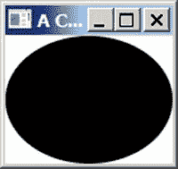

图 9-5。

A circle centered on the scene

## 可观察的集合

JavaFX 中的可观察集合是 Java 编程语言中集合的扩展。Java 中的集合框架有`List`、`Set`和`Map`接口。JavaFX 添加了以下三种类型的可观察集合，可以观察到它们内容的变化:

*   可观察的列表
*   可观察的集合
*   可观察的地图

JavaFX 通过以下三个新接口支持可观察集合:

*   可观察列表
*   可观察集
*   可观察地图

这三个接口从`java.util`包中继承了`List`、`Set`和`Map`。除了从 Java 集合接口继承之外，JavaFX 集合接口还继承了`Observable`接口。所有 JavaFX 可观察集合接口和类都在`javafx.collections`包中。图 9-6 显示了表示可观察集合的接口的部分类图。

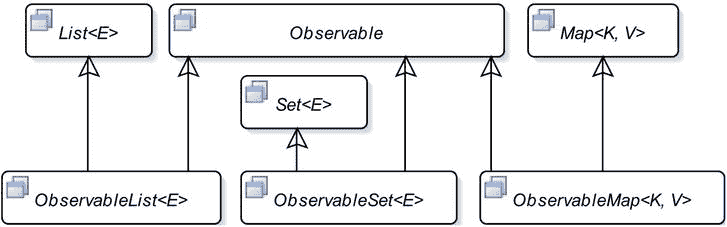

图 9-6。

A partial class diagram for observable collection interfaces in JavaFX

JavaFX 中的可观察集合有两个额外的特性:

*   它们支持失效通知，因为它们是从`Observable`接口继承的。
*   它们支持更改通知。您可以注册更改侦听器，当其内容发生更改时会得到通知。

`FXCollections`类是一个使用 JavaFX 集合的实用程序类。它由所有静态方法组成。JavaFX 不公开列表、集合和映射的实现类。您需要使用`FXCollections`类中的一个工厂方法来创建`ObservableList`、`ObservableSet`和`ObservableMap`接口的对象。以下代码片段显示了如何创建可观察集合:

`// Create an observable list with two elements`

`ObservableList<String> list = FXCollections.observableArrayList("One", "Two");`

`// Create an observable set with two elements`

`ObservableSet<String> set = FXCollections.observableSet("one", "two");`

`// Create an observable map and two key-value pairs`

`ObservableMap<String, Integer> map = FXCollections.observableHashMap();`

`map.put("one", 1);`

`map.put("two", 2);`

您可以向可观察的集合添加失效和更改侦听器。将一个`InvalidationListener`添加到可观察集合与将一个`InvalidationListener`添加到您在上一节看到的属性是一样的。每种类型的可观察集合都有自己的更改监听器类型:

*   `ListChangeListener`接口的一个实例代表了一个`ObservableList`的变更监听器。
*   `SetChangeListener`接口的一个实例代表了一个`ObservableSet`的变更监听器。
*   `MapChangeListener`接口的一个实例代表了一个`ObservableMap`的变更监听器。

使用可观察集合的方法向它们添加更改侦听器。所有可观察集合的变更监听器接口都声明了一个名为`Change`的静态内部类，它封装了相应类型集合中的变更。例如，您有一个`ListChangeListener.Change`静态内部类来封装一个`ObservableList`中的变化。向变更监听器传递一个`Change`类的实例。你需要使用`Change`类的方法来迭代所有的修改。`Change`类包含几个方法来提供对特定集合所做更改的细节。以下代码片段显示了如何将更改侦听器添加到`ObservableList`和:

`// Create an observable list with two elements`

`ObservableList<String> list = FXCollections.observableArrayList("One", "Two");`

`// Add a change listener to the list`

`list.addListener((ListChangeListener.Change<? extends String> change) -> {`

`System.out.println("The list has changed.");`

`});`

`// Create an observable set`

`ObservableSet<String> set = FXCollections.observableSet("one", "two");`

`// Add a change listener to the set`

`set.addListener((SetChangeListener.Change<? extends String> change) -> {`

`System.out.println("The list has changed.");`

`});`

让我们看一个如何处理`ObservableList`中的变化的详细例子。观察一个`ObservableList`的变化有点棘手。列表可以有多种变化。有些变化可能是排他性的，而有些变化可能与其他变化一起发生。列表中的元素可以被置换、更新、替换、添加和删除。您可以使用它的方法向一个`ObservableList`添加一个变更监听器，该方法接受一个`ListChangeListener`接口的实例。每次列表发生变化时，都会调用侦听器的方法。下面的代码片段展示了如何向`ObservableList<String>`添加一个变更监听器。`onChanged()`方法简单；当它被通知一个改变时，它在标准输出上打印一个消息。

`// Create an observable list`

`ObservableList<String> list = FXCollections.observableArrayList();`

`// Add a change listener to the list`

`list.addListener((ListChangeListener.Change<? extends String> change) -> {`

`System.out.println("List has changed.");`

`});`

清单 9-12 包含了一个完整的程序，展示了如何检测一个`ObservableList`的变化。添加更改侦听器后，它会操作列表，每次都会通知侦听器，从输出中可以明显看出这一点。这个程序被简化以保持其简短和可读性。`ListChangeListener.Change`对象包含列表中变更的所有细节，如受影响的范围、添加和删除的大小等。

清单 9-12。检测可观察列表中的变化

`// ObservableListTest.java`

`package com.jdojo.jfx;`

`import javafx.collections.FXCollections;`

`import javafx.collections.ListChangeListener;`

`import javafx.collections.ObservableList;`

`public class ObservableListTest {`

`public static void main(String[] args) {`

`// Create a list with some elements`

`ObservableList<String> list =`

`FXCollections.observableArrayList("one", "two");`

`System.out.println("After creating the list: " + list);`

`// Add a ChangeListener tp teh list`

`list.addListener(ObservableListTest::onChanged);`

`// Add some more elements to the list`

`list.addAll("three", "four");`

`System.out.println("After addAll() - list: " + list);`

`// We have four elements. Remove the middle two`

`// from index 1 (inclusive) to index 3 (exclusive)`

`list.remove(1, 3);`

`System.out.println("After remove() - list: " + list);`

`// Retain only the element "one"`

`list.retainAll("one");`

`System.out.println("After retainAll() - list: " + list);`

`// Replace the first element in the list`

`list.set(0, "ONE");`

`System.out.println("After set() - list: " + list);`

`}`

`public static void onChanged(ListChangeListener.Change<? extends String> change) {`

`while (change.next()) {`

`if (change.wasPermutated()) {`

`System.out.println("A permutation is detected.");`

`}`

`else if (change.wasUpdated()) {`

`System.out.println("An update is detected.");`

`}`

`else if (change.wasReplaced()) {`

`System.out.println("A replacement is detected.");`

`}`

`else {`

`if (change.wasRemoved()) {`

`System.out.println("A removal is detected.");`

`}`

`else if (change.wasAdded()) {`

`System.out.println("An addition is detected.");`

`}`

`}`

`}`

`}`

`}`

`After creating the list: [one, two]`

`An addition is detected.`

`After addAll() - list: [one, two, three, four]`

`A removal is detected.`

`After remove() - list: [one, four]`

`A removal is detected.`

`After retainAll() - list: [one]`

`A replacement is detected.`

`After set() - list: [ONE]`

## 事件处理

一般来说，术语“事件”用于描述感兴趣的事件。在 GUI 应用程序中，事件是用户与应用程序交互的发生。点击鼠标、按下键盘上的键等。是 JavaFX 应用程序中的事件示例。

JavaFX 中的事件由`javafx.event.Event`类或其任何子类的对象表示。JavaFX 中的每个事件都有三个属性:

*   事件源
*   事件目标
*   事件类型

当事件发生时，您通常通过执行一段代码来执行一些处理。为响应事件而执行的这段代码称为事件处理程序或事件过滤器。我将很快阐明事件处理程序和事件过滤器之间的区别。现在，把它们都看作一段代码，我把它们都称为事件处理程序。当您想要处理 UI 元素的事件时，需要向 UI 元素添加事件处理程序。当 UI 元素检测到事件时，它会执行您的事件处理程序。

调用事件处理程序的 UI 元素是这些事件处理程序的事件源。当一个事件发生时，它会通过一连串的事件调度程序。事件的源是事件调度程序链中的当前元素。当事件通过事件调度程序链中的一个调度程序传递到另一个调度程序时，事件源会发生变化。

事件目标是事件的目的地。事件目标决定了事件在处理过程中行进的路线。假设鼠标点击发生在一个`Circle`节点上。在这种情况下，`Circle`节点是鼠标点击事件的事件目标。

事件类型描述发生的事件的类型。事件类型以分层的方式定义。每个事件类型都有一个名称和一个父类型。

JavaFX 中所有事件共有的三个属性由三个不同类的对象表示。特定事件定义了附加的事件属性；例如，表示鼠标事件的 event 类添加了描述鼠标光标位置、鼠标按钮状态等的属性。

表 [9-3](#Tab3) 列出了事件处理中涉及的类和接口。JavaFX 有一个事件交付机制，它定义了事件发生和处理的细节。

表 9-3。

The List of Classes Involved in Events Processing

<colgroup><col> <col> <col></colgroup> 
| 名字 | 类别/接口 | 描述 |
| --- | --- | --- |
| `Event` | 班级 | 此类的一个实例表示一个事件。存在几个`Event`类的子类来表示特定类型的事件。 |
| `EventTarget` | 连接 | 此接口的一个实例代表一个事件目标。 |
| `EventType` | 班级 | 这个类的一个实例代表一个事件类型，例如鼠标按下，鼠标释放。鼠标移动等。 |
| `EventHandler` | 连接 | 此接口的一个实例表示一个事件处理程序或一个事件过滤器。它的`handle()`方法在它注册的事件发生时被调用。 |

### 事件处理机制

当事件发生时，作为事件处理的一部分，会执行几个步骤:

*   事件目标选择
*   事件路线构建
*   事件路径遍历

#### 事件目标选择

事件处理的第一步是选择事件目标。回想一下，事件目标是事件的目的节点。基于事件类型选择事件目标。对于鼠标事件，事件目标是鼠标光标处的节点。鼠标光标处可以有多个节点。例如，您可以在矩形上放置一个圆。鼠标光标处最顶端的节点被选为事件目标。

关键事件的事件目标是具有焦点的节点。节点如何获得焦点取决于节点的类型。例如，`TextField`可以通过在其中单击鼠标或使用焦点遍历键(如 Windows 操作系统上的 Tab 或 Shift-Tab)来获得焦点。形状如`Circles`、`Rectangles`等。默认情况下，不获得焦点。如果你想让它们接收按键事件，你可以通过调用`Node`类的`requestFocus()`方法给它们焦点。

#### 事件路线构建

事件通过事件调度链中的事件调度程序传播。事件调度链是事件路由。事件的初始和默认路线由事件目标决定。默认事件路由由从阶段开始到事件目标节点的容器子路径组成。

假设你在一个`HBox`中放置了一个`Circle`和一个`Rectangle`，并且`HBox`是一个`Stage`的`Scene`的根节点。当您点击`Circle`时，`Circle`成为事件目标。`Circle`构造默认的事件路径，它是从阶段开始到事件目标(`Circle`)的路径。

事实上，事件路由由与节点相关联的事件调度程序组成。但是，出于实际和理解的目的，您可以将事件路由视为由节点组成的路径。通常，您不直接与事件调度程序打交道。

图 [9-7](#Fig7) 显示了鼠标点击事件的事件路径。事件路线上的节点以灰色背景填充显示。事件路线上的节点由实线连接。注意，当点击`Circle`时，作为场景图一部分的`Rectangle`不是事件路径的一部分。

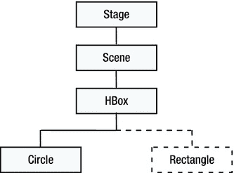

图 9-7。

Construction of the default event route for an event

事件分派链(或事件路由)有一个头和一个尾。在这种情况下，`Stage`和`Circle`分别是事件调度链的头和尾。随着事件处理的进展，可以修改初始事件路线。通常，但不是必须的，在事件遍历步骤中，事件会经过其路由中的所有节点两次，如下一节所述。

#### 事件路径遍历

事件路径遍历包括两个阶段:

*   捕获阶段
*   起泡阶段

一个事件在其路由中经过每个节点两次:一次在捕获阶段，一次在冒泡阶段。您可以为特定的事件类型向节点注册事件过滤器和事件处理程序。在捕获阶段，当事件通过节点时，执行事件过滤器。在冒泡阶段，当事件通过节点时，执行事件处理程序。事件过滤器和处理程序作为事件源在当前节点的引用中传递。随着事件从一个节点传播到另一个节点，事件源不断变化。然而，事件目标从事件路径遍历的开始到结束保持不变。

在路由遍历期间，节点可以使用事件过滤器或处理程序中的事件，从而完成事件的处理。消费一个事件只需调用事件对象上的`consume()`方法。当一个事件被消费时，事件处理被停止，即使路由中的一些节点根本没有被遍历。

##### 事件捕获阶段

在捕获阶段，事件从其事件调度链的头部移动到尾部。图 [9-8](#Fig8) 显示了本例中`Circle`在捕获阶段的鼠标点击事件的行进。图中的向下箭头表示事件传播的方向。当事件通过一个节点时，为该节点注册的事件过滤器被执行。请注意，对于当前节点，事件捕获阶段只执行事件过滤器，而不执行事件处理程序。

图 9-8。

The event capture phase

在这个例子中，假设没有事件过滤器消耗该事件，则按顺序执行`Stage`、`Scene`、`HBox`和`Circle`的事件过滤器。

您可以为一个节点注册多个事件过滤器。如果节点使用了它的一个事件过滤器中的事件，那么在事件处理停止之前，它的其他尚未执行的事件过滤器将被执行。假设您已经为示例中的`Scene`注册了五个事件过滤器，执行的第一个事件过滤器使用该事件。在这种情况下，`Scene`的其他四个事件过滤器仍将被执行。对`Scene`执行第五个事件过滤器后，事件处理将停止，事件不会传播到剩余的节点(`HBox`和`Circle`)。

在事件捕获阶段，您可以拦截针对节点子节点的事件(并提供通用响应)。例如，在本例中，您可以将鼠标点击事件的事件过滤器添加到`Stage`中，以拦截其所有子节点的所有鼠标点击事件。您可以通过在父节点的事件过滤器中使用事件来阻止事件到达其目标。例如，如果您在过滤器中为`Stage`使用鼠标点击事件，那么该事件将不会到达它的目标，比如说`Circle`。

##### 事件冒泡阶段

在冒泡阶段，事件从其事件调度链的尾部移动到头部。图 [9-9](#Fig9) 显示了你的例子中的`Circle`的鼠标点击事件在冒泡阶段的传播。

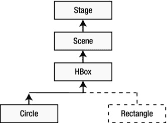

图 9-9。

The event bubbling phase

图中的向上箭头表示事件传播的方向。当事件通过一个节点时，执行该节点的注册事件处理程序。注意，事件冒泡阶段执行当前节点的事件处理程序，而事件捕获阶段执行事件过滤器。

在您的示例中，`Circle`、`HBox`、`Scene`和`Stage`的事件处理程序按顺序执行，假设没有事件过滤器使用该事件。请注意，事件冒泡阶段从事件的目标开始，向上行进到父子层次结构中的最高父级。

您可以为一个节点注册多个事件处理程序。如果节点使用了它的一个事件处理程序中的事件，那么在事件处理停止之前，它的其他尚未执行的事件处理程序将被执行。假设您已经为示例中的`Circle`注册了五个事件处理程序，执行的第一个事件处理程序使用该事件。在这种情况下，`Circle`的其他四个事件处理程序仍然会被执行。在执行了`Circle`的第五个事件处理程序后，事件处理将停止，事件不会传播到剩余的节点(`HBox, Scene`和`Stage)`)。

通常，事件处理程序注册到目标节点，以提供对事件的特定响应。有时，事件处理程序安装在父节点上，为其所有子节点提供默认事件响应。如果事件目标决定为事件提供特定的响应，它可以通过添加事件处理程序和使用事件来实现，从而阻止事件在事件冒泡阶段到达父节点。

我们来讨论一个微不足道的例子。假设您想在用户单击窗口内的任何位置时显示一个消息框。您可以向窗口注册一个事件处理程序来显示消息框。当用户在窗口的圆圈内单击时，您希望显示特定的消息。您可以向 circle 注册一个事件处理程序，以提供特定的消息并使用该事件。这将在单击圆圈时提供特定的事件响应，而对于其他节点，窗口提供默认的事件响应。

### 创建事件过滤器和处理程序

创建事件过滤器和处理程序就像创建实现`EventHandler`接口的类的对象一样简单。在 Java 8 之前，您会使用内部类来创建事件过滤器和处理程序。

`EventHandler<MouseEvent> aHandler = new EventHandler<MouseEvent>() {`

`@Override`

`public void handle(MouseEvent e) {`

`// Event handling code goes here`

`}`

`};`

在 Java 8 中，使用 lambda 表达式是创建事件过滤器和处理程序的最佳选择，如下所示:

`EventHandler<MouseEvent> aHandler = e -> {`

`// Event handling code goes here`

`};`

本章使用 lambda 表达式创建事件过滤器和处理程序。如果你不熟悉 Java 8 中的 lambda 表达式，建议你至少学习一下基础知识，这样你就能理解事件处理代码了。下面的代码片段创建了一个`MouseEvent`处理程序。它打印发生的鼠标事件的类型。

`EventHandler<MouseEvent> mouseEventHandler =`

`e -> System.out.println("Mouse event type: " + e.getEventType());`

### 注册事件过滤器和处理程序

如果某个节点对处理特定类型的事件感兴趣，您需要向该节点注册这些事件类型的事件过滤器和处理程序。当事件发生时，节点的已注册事件过滤器和处理程序的`handle()`方法按照前面章节中讨论的规则被调用。如果节点不再对处理事件感兴趣，您需要从节点中注销事件过滤器和处理程序。注册和取消注册事件筛选器和处理程序也分别称为添加和删除事件筛选器和处理程序。

JavaFX 提供了两种向节点注册和取消注册事件过滤器和处理程序的方法:

*   使用`addEventFilter()`、`addEventHandler()`、`removeEventFilter()`和`removeEventHandler()`方法
*   使用`onXxx`便利属性

您可以使用`addEventFilter()`和`addEventHandler()`方法分别向节点注册事件过滤器和处理程序。这些方法在`Node`类、`Scene`类和`Window`类中定义。有些类如`MenuItem`和`TreeItem`可以是事件目标；然而，它们不是从`Node`类继承的。

*   `<T extends Event> void addEventFilter(EventType<T> eventType, EventHandler<? super T> eventFilter)`
*   `<T extends Event> void addEventHandler(EventType<T> eventType, EventHandler<? super T> eventHandler)`

这些方法有两个参数。第一个参数是事件类型，第二个是`EventHandler`接口的对象。

您可以使用下面的代码片段来处理`Circle`的鼠标点击事件:

`import javafx.scene.shape.Circle;`

`import javafx.event.EventHandler;`

`import javafx.scene.input.MouseEvent;`

`...`

`// Create a circle`

`Circle circle = new Circle (100, 100, 50);`

`// Create a MouseEvent filter`

`EventHandler<MouseEvent> mouseEventFilter =`

`e -> System.out.println("Mouse event filter has been called.");`

`// Create a MouseEvent handler`

`EventHandler<MouseEvent> mouseEventHandler =`

`e -> System.out.println("Mouse event handler has been called.");`

`// Register the MouseEvent filter and handler to the Circle`

`// for mouse-clicked events`

`circle.addEventFilter(MouseEvent.MOUSE_CLICKED, mouseEventFilter);`

`circle.addEventHandler(MouseEvent.MOUSE_CLICKED, mouseEventHandler);`

代码创建了两个`EventHandler`对象，它们在控制台上打印一条消息。在这个阶段，它们不是事件过滤器或处理程序。他们只是两个`EventHandler`物体。请注意，给引用变量命名并打印使用单词 filter 和 handler 的消息，对它们作为过滤器和处理程序的状态没有任何影响。最后两条语句将一个`EventHandler`对象注册为事件过滤器，将另一个注册为事件处理程序；两者都注册了鼠标单击事件。

`Node`、`Scene`和`Window`类包含事件属性来存储一些选定事件类型的事件处理程序。属性名使用事件类型模式。它们被命名为`onXxx`。例如，`onMouseClicked`属性存储鼠标点击事件类型的事件处理程序，`onKeyTyped`属性存储按键输入事件的事件处理程序，等等。您可以使用这些属性的`setOnXxx()`方法来注册节点的事件处理程序。例如，使用`setOnMouseClicked()`方法为鼠标点击事件注册一个事件处理程序，使用`setOnKeyTyped()`方法为键入事件注册一个事件处理程序，等等。各种类中的`setOnXxx()`方法被认为是注册事件处理程序的便利方法。

您需要记住关于`onXxx`便利属性的一些要点:

*   它们只支持事件处理程序的注册，不支持事件过滤器。如果您需要注册事件过滤器，请使用`addEventFilter()`方法。
*   它们只支持为一个节点注册一个事件处理程序。可以使用`addEventHandler()`方法为一个节点注册多个事件处理程序。
*   这些属性只存在于节点类型的常用事件中。例如，`onMouseClicked`属性存在于`Node`和`Scene`类中，但不存在于`Window`类中；`onShowing`属性存在于`Window`类中，但不存在于`Node`和`Scene`类中。

下面的代码片段显示了如何使用便利的`onMouseClicked`属性来设置一个圆形的事件处理程序:

`// Create a circle`

`Circle circle = new Circle (100, 100, 50);`

`// Create a MouseEvent handler`

`EventHandler<MouseEvent> eventHandler =`

`e -> System.out.println("Mouse event handler has been called.");`

`// Register the handler using the setter method for the onMouseClicked`

`// convenience event property`

`circle.setOnMouseClicked(eventHandler);`

下面的代码片段展示了如何使用`Button`类的`setOnAction()`便利方法向`Button`添加一个`ActionEvent`处理程序:

`// Create a button`

`Button exitBtn = new Button("Exit");`

`// Add the event handler for the Exit button`

`exitBtn.setOnAction(e -> Platform.exit());`

便利事件属性没有提供单独的方法来注销事件处理程序。将属性设置为`null`会取消注册已经注册的事件处理程序。

`// Unregister the mouse-clicked event handler for the circle`

`circle.setOnMouseClicked(null);`

定义`onXxx`事件属性的类也定义了返回注册事件处理程序的引用的`getOnXxx()` getter 方法。如果没有设置事件处理程序，getter 方法返回`null`。

清单 9-13 包含了一个显示事件路由和处理机制的程序。它还展示了如何使用事件及其效果。图 [9-10](#Fig10) 显示运行程序时的屏幕。

清单 9-13。处理和消费事件

`// EventHandling.java`

`package com.jdojo.jfx;`

`import javafx.application.Application;`

`import javafx.event.EventHandler;`

`import javafx.geometry.Insets;`

`import javafx.scene.Scene;`

`import javafx.scene.control.CheckBox;`

`import javafx.scene.input.MouseEvent;`

`import static javafx.scene.input.MouseEvent.MOUSE_CLICKED;`

`import javafx.scene.layout.HBox;`

`import javafx.scene.paint.Color;`

`import javafx.scene.shape.Circle;`

`import javafx.scene.shape.Rectangle;`

`import javafx.stage.Stage;`

`public class EventHandling extends Application {`

`private CheckBox consumeEventCbx =`

`new CheckBox("Consume Mouse Click at Circle");`

`public static void main(String[] args) {`

`Application.launch(args);`

`}`

`@Override`

`public void start(Stage stage) {`

`Circle circle = new Circle(50, 50, 50);`

`circle.setFill(Color.CORAL);`

`Rectangle rect = new Rectangle(100, 100);`

`rect.setFill(Color.TAN);`

`HBox root = new HBox();`

`root.setPadding(new Insets(20));`

`root.setSpacing(20);`

`root.getChildren().addAll(circle, rect, consumeEventCbx);`

`Scene scene = new Scene(root);`

`// Register mouse-clicked event handlers to all nodes,`

`// except the rectangle and checkbox`

`EventHandler<MouseEvent> handler = e -> handleEvent(e);`

`EventHandler<MouseEvent> circleMeHandler =`

`e -> handleEventforCircle(e);`

`stage.addEventHandler(MOUSE_CLICKED, handler);`

`scene.addEventHandler(MOUSE_CLICKED, handler);`

`root.addEventHandler(MOUSE_CLICKED, handler);`

`circle.addEventHandler(MOUSE_CLICKED, circleMeHandler);`

`stage.setScene(scene);`

`stage.setTitle("Event Handling");`

`stage.show();`

`}`

`public void handleEvent(MouseEvent e) {`

`print(e);`

`}`

`public void handleEventforCircle(MouseEvent e) {`

`print(e);`

`if (consumeEventCbx.isSelected()) {`

`e.consume();`

`}`

`}`

`public void print(MouseEvent e) {`

`String type = e.getEventType().getName();`

`String source = e.getSource().getClass().getSimpleName();`

`String target = e.getTarget().getClass().getSimpleName();`

`// Get coordinates of the mouse relative to the event source`

`double x = e.getX();`

`double y = e.getY();`

`System.out.println("Type=" + type + ", Target=" + target +`

`", Source=" + source +`

`", location(" + x + ", " + y + ")");`

`}`

`}`

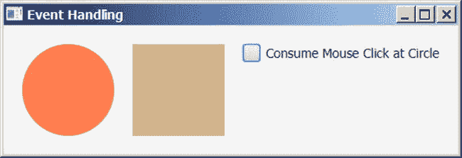

图 9-10。

Handling and consuming events

程序将一个`Circle`、一个`Rectangle`和一个`CheckBox`添加到一个`HBox`中。`HBox`是一个容器，它将它的子容器水平地排列在一行上。将`HBox`作为根节点添加到场景中。事件处理程序被添加到`Stage`、`Scene`、`HBox`和`Circle`。注意，为了保持程序逻辑简单，您对`Circle`使用了不同的事件处理程序。当选择`CheckBox`时，`Circle`的事件处理程序消耗鼠标点击事件，从而阻止事件向上传播到`HBox`、`Scene,`和`Stage`。如果没有选择`CheckBox`，则`Circle`上的鼠标点击事件从`Circle`行进到`HBox`、`Scene`和`Stage`。运行程序并使用鼠标，点击场景的不同区域来查看效果。请注意，`HBox`、`Scene`和`Stage`的鼠标点击事件处理程序被执行，即使您点击了`Circle`之外的点，因为它们在被点击节点的事件分派链中。

点击`CheckBox`不会执行`HBox`、`Scene`和`Stage`的鼠标点击事件处理程序，而点击`Rectangle`会。你能想出这种行为的原因吗？原因很简单。`CheckBox`有一个默认的事件处理程序，它采取默认的动作并消费事件，防止它沿着事件调度链向上传播。`Rectangle`不消费事件，允许它沿着事件调度链向上移动。

Tip

事件过滤器中的事件目标使用事件不会影响任何其他事件过滤器的执行。但是，它防止了事件冒泡阶段的发生。在最顶层节点的事件处理程序中使用事件对事件处理没有任何影响，最顶层节点是事件调度链的头。

## 布局窗格

可以使用两种类型的布局来排列场景图中的节点:

*   静态布局
*   动态布局

在静态布局中，节点的位置和大小只计算一次，并且在调整窗口大小时保持不变。当窗口具有节点最初布局的大小时，用户界面看起来很好。

在动态布局中，每当用户动作需要改变节点的位置、大小或两者时，场景图中的节点被布局。通常，更改一个节点的位置或大小会影响场景图中其他节点的位置和大小。当调整窗口大小时，动态布局强制重新计算一些或所有节点的位置和大小。

静态和动态布局各有优缺点。静态布局让开发人员可以完全控制用户界面的设计。它能让你在合适的时候利用可用空间。动态布局需要更多的编程工作，逻辑也更加复杂。通常，JavaFX 等支持 GUI 的编程语言通过库支持动态布局。库解决了动态布局的大多数用例。如果它们不能满足你的需求，你必须努力推出你自己的动态布局。

布局窗格是包含其他节点的节点，这些节点称为其子节点(或子节点)。布局窗格的职责是在需要时对其子元素进行布局。布局窗格也称为容器或布局容器。

布局窗格有一个布局策略，它控制布局窗格如何布局其子窗格。例如，布局窗格可以水平、垂直或以任何其他方式布置其子元素。容器的布局策略是一组计算其子容器的位置和大小的规则。节点有三种类型大小，称为首选大小、最小大小和最大大小。大多数容器试图给孩子他们喜欢的尺寸。节点的实际(或当前)大小可能与其首选大小不同。节点的当前大小取决于窗口的大小、容器的布局策略以及节点的扩展和收缩策略等。

JavaFX 包含几个容器类。图 9-11 显示了容器类的类图。容器类是`Parent`类的直接或间接子类。

图 9-11。

A class diagram for container classes in JavaFX

一个`Group`允许你将效果和变换应用到它的所有子节点上。`Group`级在`javafx.scene`包里。

`Region`类的子类用于布局子元素。它们可以用 CSS 样式化。`Region`类及其大多数子类都在`javafx.scene.layout`包中。

诚然，容器需要是`Parent`类的子类。然而，并不是所有的`Parent`类的子类都是容器。例如，`Button`类是`Parent`类的子类；但是，它是一个控件，而不是一个容器。必须将节点添加到容器中，使其成为场景图的一部分。容器根据其布局策略来布局其子容器。如果不希望容器管理节点的布局，需要将节点的`managed`属性设置为 false。

一个节点一次只能是一个容器的子节点。如果将一个节点添加到一个容器中，而该节点已经是另一个容器的子节点，则在将该节点添加到第二个容器之前，会将其从第一个容器中删除。通常，需要嵌套容器来创建复杂的布局。也就是说，您可以将一个容器作为子节点添加到另一个容器中。

该类包含三个方法来获取容器的子级列表:

*   `protected ObservableList<Node> getChildren()`
*   `public ObservableList<Node> getChildrenUnmodifiable()`
*   `protected <E extends Node> List<E> getManagedChildren()`

该方法返回一个容器的子节点的可修改的`ObservableList`。如果要将节点添加到容器中，可以将该节点添加到该列表中。这是容器类最常用的方法。您一直在使用这种方法将孩子添加到像`Group`、`HBox`、`VBox`等容器中。从第一期节目开始。

注意对`getChildren()`方法的`protected`访问。如果`Parent`类的子类不想成为一个容器，它将保持对这个方法的访问为`protected`。例如，`Button and TextField`之类的控件相关类将此方法保留为`protected`，因此您不能向它们添加子节点。一个容器类覆盖了这个方法并使之成为`public`。例如，`Group`和`Pane`类将这个方法公开为`public`。

该方法在`Parent`类中被声明为`public`。它返回一个只读的`ObservableList`子节点。它在两种情况下很有用:

*   您需要将容器的子列表传递给一个不应该修改该列表的方法。
*   你想知道控件是由什么组成的，而不是容器。

该方法具有`protected`访问权限。容器类不将其公开为`public`。他们在内部使用它来获取布局过程中托管子级的列表。您将使用这个方法推出您自己的容器类。

表 [9-4](#Tab4) 包含 JavaFX 中容器类的简要描述。本章不可能讨论所有类型的容器。在这一节中，我将向您展示一些使用它们的例子。

表 9-4。

Container Classes with a Brief Descriptions in JavaFX

<colgroup><col> <col></colgroup> 
| 集装箱等级 | 描述 |
| --- | --- |
| `Group` | 将效果和变换一起应用到它的所有子对象。 |
| `Pane` | 用于其子节点的绝对定位。 |
| `HBox` | 在单行中水平排列子项。 |
| `VBox` | 在单列中垂直排列子项。 |
| `FlowPane` | 在行或列中水平或垂直排列子项。如果一行或一列放不下它们，它们将按指定的宽度或高度换行。 |
| `BorderPane` | 将布局区域划分为顶部、右侧、底部、左侧和中间区域，并将其每个子区域放置在五个区域之一。 |
| `StackPane` | 以从后到前的栈方式排列子项。 |
| `TilePane` | 在统一大小的单元格网格中排列子级。 |
| `GridPane` | 在可变大小单元格的网格中排列子级。 |
| `AnchorPane` | 通过将子项的边缘锚定到布局区域的边缘来排列子项。 |
| `TextFlow` | 布局富文本，其内容可能由几个`Text`节点组成。 |

容器是用来装孩子的。您可以在创建容器对象时或创建后将子对象添加到容器中。所有容器类都提供接受 varargs `Node`类型参数的构造函数来添加初始的一组子元素。有些容器提供构造函数来添加初始的一组子容器，并为容器设置初始属性。

创建容器后，您还可以随时向容器中添加子容器。容器将它们的子容器存储在一个可观察的列表中，可以使用`getChildren()`方法检索该列表。向容器添加节点就像向可观察列表添加节点一样简单。下面的代码片段展示了如何在创建`HBox`时和创建后向其添加子元素。

`// Create two buttons`

`Button okBtn = new Button("OK");`

`Button cancelBtn = new Button("Cancel");`

`// Create an HBox with two buttons as its children`

`HBox hBox1 = new HBox(okBtn, cancelBtn);`

`// Create an HBox with two buttons with 20px horizontal spacing between them`

`double hSpacing = 20;`

`HBox hBox2 = new HBox(hSpacing, okBtn, cancelBtn);`

`// Create an empty HBox, and afterwards add two buttons to it`

`HBox hBox3 = new HBox();`

`hBox3.getChildren().addAll(okBtn, cancelBtn);`

Tip

当你需要在一个容器中添加多个子节点时，使用`ObservableList`的`addAll()`方法，而不是多次使用`add()`方法。

清单 9-14 中的程序展示了如何使用一个`BorderPane`、一个`HBox`和一个`VBox`来排列 UI 元素，如图 [9-12](#Fig12) 所示。

清单 9-14。使用边框窗格容器

`// BorderPaneTest.java`

`package com.jdojo.jfx;`

`import javafx.application.Application;`

`import javafx.geometry.Insets;`

`import javafx.scene.Node;`

`import javafx.scene.Scene;`

`import javafx.scene.control.Button;`

`import javafx.scene.control.Label;`

`import javafx.scene.control.TextArea;`

`import javafx.scene.control.TextField;`

`import javafx.scene.layout.BorderPane;`

`import javafx.scene.layout.HBox;`

`import javafx.scene.layout.Priority;`

`import javafx.scene.layout.VBox;`

`import javafx.stage.Stage;`

`public class BorderPaneTest extends Application {`

`public static void main(String[] args) {`

`Application.launch(args);`

`}`

`public void start(Stage stage) {`

`// Set the top and left child nodes to null`

`Node top = null;`

`Node left = null;`

`// Build the content nodes for the center region`

`VBox center = getCenter();`

`// Create the right child node`

`Button okBtn = new Button("Ok");`

`Button cancelBtn = new Button("Cancel");`

`// Make the OK and cancel buttons the same size`

`okBtn.setMaxWidth(Double.MAX_VALUE);`

`VBox right = new VBox(okBtn, cancelBtn);`

`right.setStyle("-fx-padding: 10;");`

`// Create the bottom child node`

`Label statusLbl = new Label("Status: Ready");`

`HBox bottom = new HBox(statusLbl);`

`BorderPane.setMargin(bottom, new Insets(10, 0, 0, 0));`

`bottom.setStyle("-fx-background-color: lavender;" +`

`"-fx-font-size: 7pt;" +`

`"-fx-padding: 10 0 0 0;" );`

`BorderPane root =`

`new BorderPane(center, top, right, bottom, left);`

`root.setStyle("-fx-background-color: lightgray;");`

`Scene scene = new Scene(root);`

`stage.setScene(scene);`

`stage.setTitle("Using a BorderPane");`

`stage.show();`

`}`

`private VBox getCenter() {`

`// A Label and a TextField in an HBox`

`Label nameLbl = new Label("Name:");`

`TextField nameFld = new TextField();`

`HBox.setHgrow(nameFld, Priority.ALWAYS);`

`HBox nameFields = new HBox(nameLbl, nameFld);`

`// A Label and a TextArea`

`Label descLbl = new Label("Description:");`

`TextArea descText = new TextArea();`

`descText.setPrefColumnCount(20);`

`descText.setPrefRowCount(5);`

`VBox.setVgrow(descText, Priority.ALWAYS);`

`// Box all controls in a VBox`

`VBox center = new VBox(nameFields, descLbl, descText);`

`return center;`

`}`

`}`

图 9-12。

A BorderPane using some controls in its top, right, bottom, and center regions

注意清单 9-14 中容器方法的使用。您可以使用 CSS 自定义 JavaFX 中容器和控件的视觉外观。JavaFX 中的 CSS 属性的命名和工作方式与用于在浏览器中定制 HTML 内容的 CSS 属性非常相似。JavaFX 中的 CSS 属性以`-fx-`开头；比如指定字体大小的 CSS 属性名是`-fx-font-size`。还可以使用 CSS 文件为 JavaFX 应用程序设置样式。清单 9-15 展示了如何通过给场景的根节点添加一个样式来在场景周围添加填充和一个圆形的蓝色边框。图 [9-13](#Fig13) 显示了窗口中的结果场景。

清单 9-15。使用 CSS 向场景添加填充和圆形蓝色边框

`// CSSTest.java`

`package com.jdojo.jfx;`

`import javafx.application.Application;`

`import javafx.scene.Scene;`

`import javafx.scene.control.Label;`

`import javafx.scene.control.TextField;`

`import javafx.scene.layout.GridPane;`

`import javafx.stage.Stage;`

`public class CSSTest extends Application {`

`public static void main(String[] args) {`

`Application.launch(args);`

`}`

`@Override`

`public void start(Stage stage) {`

`TextField fNameFld = new TextField();`

`Label fNameLbl = new Label("First Name:");`

`TextField lNameFld = new TextField();`

`Label lNameLbl = new Label("Last Name:");`

`GridPane root = new GridPane();`

`root.addRow(0, fNameLbl, fNameFld);`

`root.addRow(1, lNameLbl, lNameFld);`

`// Set a CSS for the GridPane`

`root.setStyle("-fx-padding: 10;" +`

`"-fx-border-style: solid inside;" +`

`"-fx-border-width: 2;" +`

`"-fx-border-insets: 5;" +`

`"-fx-border-radius: 5;" +`

`"-fx-border-color: blue;");`

`Scene scene = new Scene(root);`

`stage.setScene(scene);`

`stage.setTitle("Using CSS");`

`stage.show();`

`}`

`}`

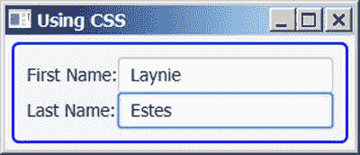

图 9-13。

Using CSS to add pading and a rounded, blue border around the scene

在 JavaFX 中使用 CSS 是一个大话题。本章不详细讨论 JavaFX 中的 CSS。请参考以下网页获取 CSS 参考指南，该指南列出了可以使用 CSS 设置样式的所有节点的所有 CSS 属性:

[T2`docs.oracle.com/javase/8/javafx/api/javafx/scene/doc-files/cssref.html`](http://docs.oracle.com/javase/8/javafx/api/javafx/scene/doc-files/cssref.html)

## 控制

JavaFX 允许您使用 GUI 组件创建应用程序。具有 GUI 的应用程序执行三项任务:

*   接受用户通过键盘、鼠标等输入设备的输入。
*   处理输入(或根据输入采取行动)
*   显示输出

用户界面提供了一种在应用程序和用户之间交换输入和输出信息的方式。使用键盘输入文本、使用鼠标选择菜单项以及点击按钮都是向 GUI 应用程序提供输入的例子。该应用程序使用文本、图表、对话框等在计算机显示器上显示输出。

用户使用称为控件或小部件的图形元素与 GUI 应用程序进行交互。按钮、标签、文本字段、文本区域、单选按钮和复选框是控件的几个例子。键盘、鼠标和触摸屏等设备用于向控件提供输入。控件还可以向用户显示输出。控件生成指示用户和控件之间发生某种交互的事件。例如，使用鼠标或空格键按下按钮会生成一个动作事件，指示用户已经按下了该按钮。

JavaFX 提供了一组丰富的易于使用的基本和高级控件。控件通常被添加到布局窗格中来定位和调整它们的大小。不可能讨论所有的控制。我将列出 JavaFX 中的大多数控件，并简要描述它们的功能。

JavaFX 中的每个控件都由一个类的实例来表示。如果多个控件共享基本功能，则它们从一个公共基类继承。控件类在`javafx.scene.control`包中。控件类是`Control`类的一个子类，直接或间接，而后者又继承自`Region`。回想一下，`Region`类继承自`Parent`类。所以，技术上来说，一个`Control`也是一个`Parent`。

一个`Parent`可以生孩子。通常，控件由作为其子节点的另一个节点(有时是多个节点)组成。控件类不通过`getChildren()`方法公开其子类的列表，因此您不能向它们添加任何子类。

控件类通过返回一个`ObservableList<Node>`的`getChildrenUnmodifiable()`方法公开其内部不可修改的子控件列表。使用控件不需要知道控件的内部子级。然而，如果你需要他们的孩子的列表，`getChildrenUnmodifiable()`方法会给你。

图 [9-14](#Fig14) 显示了一些常用控件的类的类图。控件类的列表比类图中显示的要大得多。表 [9-5](#Tab5) 包含 JavaFX 中大多数控件的列表及其简要描述。

表 9-5。

JavaFX Controls

<colgroup><col> <col></colgroup> 
| 控制 | 描述 |
| --- | --- |
| `Label` | 不可编辑的文本控件，通常用于显示另一个控件的标签。 |
| `Button` | 表示命令按钮控件。它可以显示文本和图标。当它被激活时会产生一个`ActionEvent`。 |
| `Hyperlink` | 表示一个超链接控件，它看起来像网页中的超链接。当它被激活时会产生一个`ActionEvent`。 |
| `MenuButton` | 看起来像按钮，行为像菜单。当它被激活时，它以弹出菜单的形式显示一个选项列表。要在菜单选项被选中时执行命令，您需要将`ActionEvent`处理程序添加到添加到 MenuButton 的`MenuItem`中。 |
| `ToggleButton` | 表示双态按钮控件。这两种状态是选中和取消选中。 |
| `RadioButton` | 表示单选按钮。它用于从选项列表中提供一个互斥的选项。 |
| `CheckBox` | 表示三态选择控件。三种状态是选中、未选中和未定义。 |
| `ChoiceBox` | 允许用户从预定义项目的小列表中选择一个项目。 |
| `ComboBox` | `ChoiceBox`控件的高级版本。它有很多特性，比如可编辑性、改变列表中项目的外观等。，这些不是在`ChoiceBox`中提供的。 |
| `ListView` | 为用户提供从项目列表中选择多个项目的能力。通常，列表中的所有或多个项目始终对用户可见。 |
| `ColorPicker` | 允许用户从标准调色板中选择颜色或以图形方式定义自定义颜色。 |
| `DatePicker` | 允许用户从日历弹出窗口中选择日期。 |
| `TextField` | 表示单行文本输入控件。 |
| `PasswordField` | 表示单行文本输入控件，用于输入密码或敏感文本，其中实际文本被屏蔽。 |
| `TextArea` | 表示多行文本输入控件。 |
| `ProgressIndicator` | 用于在圆形区域显示任务的进度。 |
| `ProgressBar` | 用于在矩形区域中显示任务的进度。 |
| `TitledPane` | 用于显示带有标题栏的内容(通常是一组控件)，标题栏可能包含标题文本和图形。它可以处于展开或折叠状态。在折叠状态下，只有标题栏可见。在展开状态下，内容和标题栏都可见。 |
| `Accordion` | 用作一组`TitledPane`控件的容器，其中一次只有一个`TitledPane`可见。 |
| `Pagination` | 用于显示一个大的单一内容，方法是将它分成称为页面的小块，如搜索结果。 |
| `Tooltip` | 用于当鼠标悬停在控件上时，在弹出窗口中短时间显示控件的附加信息。 |
| `ScrollBar` | 用于向控件添加滚动功能。 |
| `ScrollPane` | 提供节点的可滚动视图。 |
| `Separator` | 用于分隔两组控件的水平线或垂直线。 |
| `Slider` | 用于通过沿轨道滑动拇指(或旋钮)以图形方式从数值范围中选择数值。 |
| `MenuBar` | 用作菜单容器的水平栏。 |
| `Menu` | 包含可操作项目的列表，可根据需要显示，例如，通过单击它。 |
| `MenuItem` | 代表`menu`中可操作的选项。 |
| `ContextMenu` | 根据请求显示菜单项列表的弹出控件。 |
| `ToolBar` | 用于显示一组节点，这些节点在屏幕上提供常用的操作项。 |
| `TabPane` | 显示由`Tab`类的实例表示的多个选项卡页面。一次只能看到一个选项卡页面的内容。 |
| `Tab` | 表示一个`TabPane`中的标签页。 |
| `HTMLEditor` | 在 JavaFX 中提供丰富的文本编辑功能。 |
| `FileChooser` | 允许您以图形方式从文件系统中选择文件。 |
| `DirectoryChooser` | 允许您使用依赖于平台的目录对话框来选择目录 |
| `TableView` | 用于使用行和列显示和编辑表格数据。 |
| `TreeView` | 用于显示和编辑以树状结构排列的分层数据。 |
| `TreeTableView` | `TableView`和`TreeView`控件的组合。提供拥有下钻表格的能力。 |
| `WebView` | 显示网页。 |

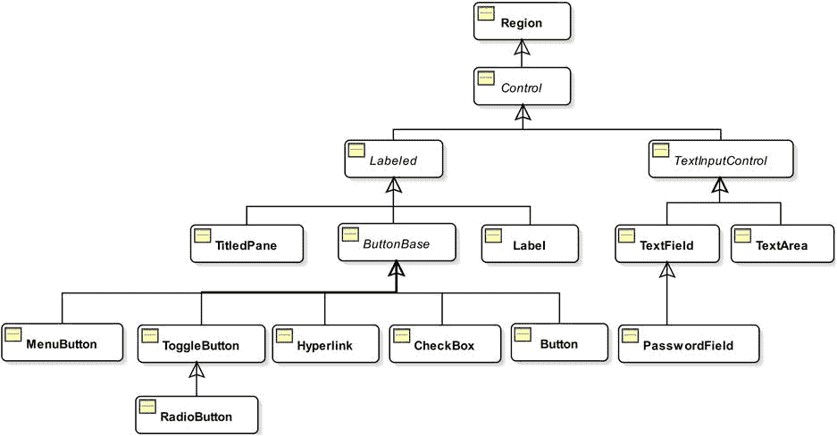

图 9-14。

A partial class diagram for control classes in JavaFX

清单 9-16 创建了一个使用 JavaFX 控件输入个人信息的表单，比如名字、姓氏、出生日期和性别，如图 9-15 所示。输入数据，点击`Save`按钮，将输入的数据显示在窗口`bottom`的`TextArea`中。该表单使用以下控件:

*   两个用于输入名字和姓氏的`TextField`控件实例。
*   一个用于输入出生日期的`DatePicker`控件。
*   用于选择性别的`ChoiceBox`控件。
*   保存数据的`Button`控件。
*   关闭窗口的`Button`控件。
*   点击`Save`按钮时显示输入数据的`TextArea`控件。

清单 9-16。使用 JavaFX 控件创建表单以输入个人详细信息

`// PersonView.java`

`package com.jdojo.jfx;`

`import javafx.application.Application;`

`import javafx.scene.Scene;`

`import javafx.scene.control.Button;`

`import javafx.scene.control.ChoiceBox;`

`import javafx.scene.control.DatePicker;`

`import javafx.scene.control.Label;`

`import javafx.scene.control.TextArea;`

`import javafx.scene.control.TextField;`

`import javafx.scene.layout.GridPane;`

`import javafx.scene.layout.VBox;`

`import javafx.stage.Stage;`

`public class PersonView extends Application {`

`// Labels`

`Label fNameLbl = new Label("First Name:");`

`Label lNameLbl = new Label("Last Name:");`

`Label bDateLbl = new Label("Birth Date:");`

`Label genderLbl = new Label("Gender:");`

`// Fields`

`TextField fNameFld = new TextField();`

`TextField lNameFld = new TextField();`

`DatePicker bDateFld = new DatePicker();`

`ChoiceBox<String> genderFld = new ChoiceBox<>();`

`TextArea dataFld = new TextArea();`

`// Buttons`

`Button saveBtn = new Button("Save");`

`Button closeBtn = new Button("Close");`

`public static void main(String[] args) {`

`Application.launch(args);`

`}`

`@Override`

`public void start(Stage stage) throws Exception {`

`// Populate the gender choice box`

`genderFld.getItems().addAll("Male", "Female", "Unknown");`

`// Set the preferred rows and columns for the text area`

`dataFld.setPrefColumnCount(30);`

`dataFld.setPrefRowCount(5);`

`GridPane grid = new GridPane();`

`grid.setHgap(5);`

`grid.setVgap(5);`

`// Place the controls in the grid`

`grid.add(fNameLbl, 0, 0); // column=0, row=0`

`grid.add(lNameLbl, 0, 1); // column=0, row=1`

`grid.add(bDateLbl, 0, 2); // column=0, row=2`

`grid.add(genderLbl, 0, 3); // column=0, row=3`

`grid.add(fNameFld, 1, 0); // column=1, row=0`

`grid.add(lNameFld, 1, 1); // column=1, row=1`

`grid.add(bDateFld, 1, 2); // column=1, row=2`

`grid.add(genderFld, 1, 3); // column=1, row=3`

`grid.add(dataFld, 1, 4, 3, 2); // column=1, row=4, colspan=3, rowspan=3`

`// Add buttons and make them the same width`

`VBox buttonBox = new VBox(saveBtn, closeBtn);`

`saveBtn.setMaxWidth(Double.MAX_VALUE);`

`closeBtn.setMaxWidth(Double.MAX_VALUE);`

`grid.add(buttonBox, 2, 0, 1, 2); // column=2, row=0, colspan=1, rowspan=2`

`// Show the data in the text area when the Save button is clicked`

`saveBtn.setOnAction(e -> showData());`

`// Close the window when the Close button is clicked`

`closeBtn.setOnAction(e -> stage.hide());`

`// Set a CSS for the GridPane to add a padding and a blue border`

`grid.setStyle("-fx-padding: 10;" +`

`"-fx-border-style: solid inside;" +`

`"-fx-border-width: 2;" +`

`"-fx-border-insets: 5;" +`

`"-fx-border-radius: 5;" +`

`"-fx-border-color: blue;");`

`Scene scene = new Scene(grid);`

`stage.setScene(scene);`

`stage.setTitle("Person Details");`

`stage.sizeToScene();`

`stage.show();`

`}`

`private void showData() {`

`String data = "First Name = " + fNameFld.getText() +`

`"\nLast Name=" + lNameFld.getText() +`

`"\nBirth Date=" + bDateFld.getValue() +`

`"\nGender=" + genderFld.getValue();`

`dataFld.setText(data);`

`}`

`}`

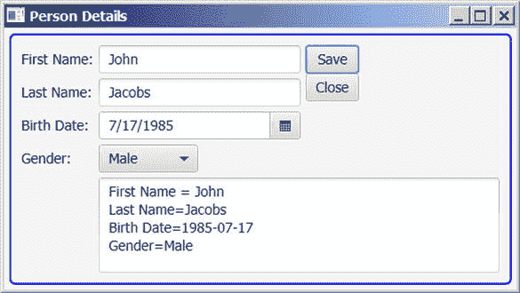

图 9-15。

A form using JavaFX controls to enter person details

## 使用 2D 形状

JavaFX 提供了各种节点来绘制不同类型的形状，如线条、圆形、矩形等。您可以将形状添加到场景图。您可以绘制 2D 和 3D 形状。在这一节，我将向你展示如何绘制 2D 形状。在 JavaFX 中使用 3D 形状有一个学习曲线。由于篇幅限制，我不会在本书中讨论 3D 形状。所有 2D 形状类都在`javafx.scene.shape`包中。表示 2D 形状的类继承自抽象的`Shape`类，如图 [9-16](#Fig16) 所示。

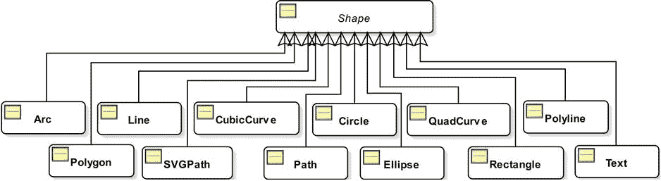

图 9-16。

A class diagram for 2D shapes

形状具有由其属性定义的大小和位置。例如，`width`和`height`属性定义了一个矩形的大小；`radius`属性定义圆的大小，`x`和`y`属性定义矩形左上角的位置，`centerX`和`centerY`属性定义圆心。

在布局过程中，父形状不会调整形状的大小。只有当形状的与大小相关的属性改变时，形状的大小才会改变。您可能会看到类似“JavaFX 形状不可调整大小”的语句这意味着在布局过程中，形状不能根据其父形状调整大小。它们只能通过更改属性来调整大小。

形状有内部和描边。定义形状内部和笔画的所有属性都在`Shape`类中声明。属性指定了填充 T2 内部的颜色。默认的`fill`是`Color.BLACK`。`stroke`属性指定轮廓线条的颜色，默认为`null`，除了`Line`、`Polyline`和`Path`将`Color.BLACK`作为默认`stroke`颜色。

Shape 类包含一个 smooth 属性，默认情况下为 true。其 true 值指示应该使用抗锯齿提示来呈现形状。如果设置为 false，将不使用抗锯齿提示，这可能会导致形状的边缘不清晰。

清单 9-17 中的程序创建了一个圆、一个矩形、一条直线、一个代表平行四边形的多边形、一个代表六边形的折线和一个带弦的圆弧。形状如图 [9-17](#Fig17) 所示。请注意关于在此程序中创建形状的以下几点:

*   它创建了一个半径为 40px 的圆。
*   它创建一个 100 像素宽、75 像素高的矩形。
*   它从(0，0)和(50，50)创建一条直线。
*   它通过连接四个点:(30.0，0.0)、(130.0，0.0)、(100.00，50.0)和(0.0，50.0)，创建一个表示平行四边形的多边形。通过连接第一个点和最后一个点，多边形会自动闭合。
*   它创建一条表示六边形的折线。多段线类似于多边形，只是它不会自动闭合。请注意，折线构造函数中的第一个点(100.0，0.0)和最后一个点(100.0，0.0)是相同的，因此它是闭合的。
*   它使用`Arc`类的构造函数`Arc(double centerX, double centerY, double radiusX, double radiusY, double startAngle, double length)`创建一个弧线。弧可以是弦的、圆的或开放的。程序使用圆弧类型作为`ArcType.CHORD`，通过一条直线(一条弦)连接圆弧上的两个极值点。

清单 9-17。在 JavaFX 中使用 2D 图形

`// ShapeTest.java`

`package com.jdojo.jfx;`

`import javafx.application.Application;`

`import javafx.scene.Scene;`

`import javafx.scene.layout.HBox;`

`import javafx.scene.paint.Color;`

`import javafx.scene.shape.Arc;`

`import javafx.scene.shape.ArcType;`

`import javafx.scene.shape.Circle;`

`import javafx.scene.shape.Line;`

`import javafx.scene.shape.Polygon;`

`import javafx.scene.shape.Polyline;`

`import javafx.scene.shape.Rectangle;`

`import javafx.stage.Stage;`

`public class ShapeTest extends Application {`

`public static void main(String[] args) {`

`Application.launch(args);`

`}`

`@Override`

`public void start(Stage stage) {`

`// Create a circle with an yellow fill and a black stroke of 2.0px`

`Circle circle = new Circle(40);`

`circle.setFill(Color.YELLOW);`

`circle.setStroke(Color.BLACK);`

`circle.setStrokeWidth(2.0);`

`// Create a rectangle`

`Rectangle rect = new Rectangle(100, 75);`

`rect.setFill(Color.RED);`

`// Create a line`

`Line line = new Line(0, 0, 50, 50);`

`line.setStrokeWidth(5.0);`

`line.setStroke(Color.GREEN);`

`// Create a parallelogram`

`Polygon parallelogram = new Polygon();`

`parallelogram.getPoints().addAll(30.0, 0.0,`

`130.0, 0.0,`

`100.00, 50.0,`

`0.0, 50.0);`

`parallelogram.setFill(Color.AZURE);`

`parallelogram.setStroke(Color.BLACK);`

`// Create a hexagon`

`Polyline hexagon = new Polyline(100.0, 0.0,`

`120.0, 20.0,`

`120.0, 40.0,`

`100.0, 60.0,`

`80.0, 40.0,`

`80.0, 20.0,`

`100.0, 0.0);`

`hexagon.setFill(Color.WHITE);`

`hexagon.setStroke(Color.BLACK);`

`// A CHORD arc with no fill and a stroke`

`Arc arc = new Arc(0, 0, 50, 100, 0, 90);`

`arc.setFill(Color.TRANSPARENT);`

`arc.setStroke(Color.BLACK);`

`arc.setType(ArcType.CHORD);`

`// Add all shapes to an HBox`

`HBox root =`

`new HBox(circle, rect, line, parallelogram, hexagon, arc);`

`root.setSpacing(10);`

`root.setStyle("-fx-padding: 10;" +`

`"-fx-border-style: solid inside;" +`

`"-fx-border-width: 2;" +`

`"-fx-border-insets: 5;" +`

`"-fx-border-radius: 5;" +`

`"-fx-border-color: blue;");`

`Scene scene = new Scene(root);`

`stage.setScene(scene);`

`stage.setTitle("2D Shapes");`

`stage.show();`

`}`

`}`

图 9-17。

Some 2D shapes in JavaFX

在 JavaFX 中，`Path`类以及其他许多类，如`MoveTo`、`LineTo`、`HLineTo`和`VLineTo`，可以用来绘制非常复杂的形状。JavaFX 还使用编码字符串中的路径数据的`SVGPath`类支持可伸缩矢量图形(SVG)。SVG 规范可以在 [`www.w3.org/TR/SVG`](http://www.w3.org/TR/SVG) 找到。以字符串格式构造路径数据的详细规则可以在 [`www.w3.org/TR/SVG/paths.html`](http://www.w3.org/TR/SVG/paths.html) 找到。JavaFX 部分支持 SVG 规范。这本书没有详细介绍使用`Path`和`SVGPath`类创建 2D 形状。清单 9-18 展示了如何使用`Path`和`SVGPath`类创建三角形，如图 [9-18](#Fig18) 所示。有关如何使用这些类的详细信息，请参考 JavaFX API 文档。

清单 9-18。使用 Path 和 SVGPath 类创建 2D 形状

`// PathTest.java`

`package com.jdojo.jfx;`

`import javafx.application.Application;`

`import javafx.scene.Scene;`

`import javafx.scene.layout.HBox;`

`import javafx.scene.paint.Color;`

`import javafx.scene.shape.LineTo;`

`import javafx.scene.shape.MoveTo;`

`import javafx.scene.shape.Path;`

`import javafx.scene.shape.SVGPath;`

`import javafx.stage.Stage;`

`public class PathTest extends Application {`

`public static void main(String[] args) {`

`Application.launch(args);`

`}`

`@Override`

`public void start(Stage stage) {`

`// Create a triangle using a Path`

`Path pathTriangle = new Path(new MoveTo(50, 0),`

`new LineTo(0, 50),`

`new LineTo(100, 50),`

`new LineTo(50, 0));`

`pathTriangle.setFill(Color.LIGHTGRAY);`

`pathTriangle.setStroke(Color.BLACK);`

`// Create a triangle using a SVGPath`

`SVGPath svgTriangle = new SVGPath();`

`svgTriangle.setContent("M50, 0 L0, 50 L100, 50 Z");`

`svgTriangle.setFill(Color.LIGHTGRAY);`

`svgTriangle.setStroke(Color.BLACK);`

`// Add all shapes to an HBox`

`HBox root = new HBox(pathTriangle, svgTriangle);`

`root.setSpacing(10);`

`root.setStyle("-fx-padding: 10;" +`

`"-fx-border-style: solid inside;" +`

`"-fx-border-width: 2;" +`

`"-fx-border-insets: 5;" +`

`"-fx-border-radius: 5;" +`

`"-fx-border-color: blue;");`

`Scene scene = new Scene(root);`

`stage.setScene(scene);`

`stage.setTitle("2D Shapes using Path and SVGPath Classes");`

`stage.show();`

`}`

`}`

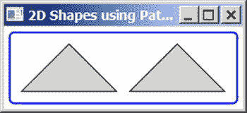

图 9-18。

Creating triangles using the Path and SVGPath classes

## 在画布上画画

通过`javafx.scene.canvas`包，JavaFX 提供了 Canvas API，该 API 提供了一个绘图表面来使用绘图命令绘制形状、图像和文本。该 API 还提供了对绘图表面的像素级访问，您可以在表面上写入任何像素。API 由以下两个类组成:

*   `Canvas`
*   `GraphicsContext`

画布是用作绘图表面的位图图像。`Canvas`类的一个实例代表一个画布。它继承自`Node`类。因此，画布是一个可以添加到场景图中的节点，可以对其应用效果和变换。一个`Canvas`有一个与之关联的图形上下文，用于向`Canvas`发出绘图命令。`GraphicsContext`类的一个实例代表一个图形上下文。

`Canvas`类包含两个构造函数。无参数构造函数创建一个空的`Canvas`。稍后，您可以使用画布的`width`和`height`属性来设置画布的大小。另一个构造函数将`Canvas`的`width`和`height`作为参数。以下代码片段显示了如何创建画布:

`// Create a Canvas of zero width and height`

`Canvas canvas = new Canvas();`

`// Set the canvas size`

`canvas.setWidth(400);`

`canvas.setHeight(200);`

`// Create a 400X200 canvas`

`Canvas canvas = new Canvas(400, 200);`

一旦创建了一个`Canvas`，您需要使用 get `getGraphicsContext2D()`方法获取它的图形上下文，如下所示:

`// Get the graphics context of the canvas`

`GraphicsContext gc = canvas.getGraphicsContext2D();`

所有绘图命令都作为方法在`GraphicsContext`类中提供。落在`Canvas`边界之外的图形被剪切。画布使用缓冲区。绘图命令将必要的参数推送到缓冲区。值得注意的是，在将`Canvas`添加到场景图形之前，您应该使用来自任何一个线程的图形上下文。一旦`Canvas`被添加到场景图形中，图形上下文应该只在 JavaFX 应用程序线程上使用。

清单 9-19 中的程序展示了如何在画布上绘制一个圆角矩形、一个椭圆形和文本。图 [9-19](#Fig19) 显示了所有绘图的画布。使用`strokeRoundRect(double x, double y, double w, double h, double arcWidth, double arcHeight)`方法绘制一个圆角矩形；`fillOval(double x, double y, double w, double h)`方法用于绘制实心椭圆。使用`strokeText(String text, double x, double y)`方法来绘制文本。

清单 9-19。在画布上画画

`// CanvasTest.java`

`package com.jdojo.jfx;`

`import javafx.application.Application;`

`import javafx.scene.Scene;`

`import javafx.scene.canvas.Canvas;`

`import javafx.scene.canvas.GraphicsContext;`

`import javafx.scene.layout.Pane;`

`import javafx.scene.paint.Color;`

`import javafx.stage.Stage;`

`public class CanvasTest extends Application {`

`public static void main(String[] args) {`

`Application.launch(args);`

`}`

`@Override`

`public void start(Stage stage) {`

`// Create a canvas`

`Canvas canvas = new Canvas(300, 100);`

`// Get the graphics context of the canvas`

`GraphicsContext gc = canvas.getGraphicsContext2D();`

`// Set line width and fill color`

`gc.setLineWidth(2.0);`

`gc.setFill(Color.RED);`

`// Draw a rounded rectangle`

`gc.strokeRoundRect(10, 10, 50, 50, 10, 10);`

`// Fill an oval`

`gc.fillOval(70, 10, 50, 20);`

`// Draw text`

`gc.strokeText("Hello Canvas", 150, 20);`

`Pane root = new Pane();`

`root.getChildren().add(canvas);`

`Scene scene = new Scene(root);`

`stage.setScene(scene);`

`stage.setTitle("Drawing on a Canvas");`

`stage.show();`

`}`

`}`

图 9-19。

A rectangle, an ellipse, and text drawn on a canvas

## 应用效果

效果是接受一个或多个图形输入、对输入应用算法并产生输出的过滤器。通常，将效果应用于节点以创建视觉上吸引人的用户界面。效果的例子有阴影、模糊、扭曲、发光、反射、混合、不同类型的照明等。JavaFX 库提供了几个与效果相关的类。效果是有条件的特征。如果应用于节点的效果在平台上不可用，则它们将被忽略。图 [9-20](#Fig20) 显示了四个使用投影、模糊、发光和绽放效果的`Text`节点。

图 9-20。

Text nodes with different effects

在 JavaFX 中对节点应用效果很容易。`Node`类包含一个`effect`属性，指定应用于节点的效果。默认情况下，是`null`。要应用一个效果，创建一个特定效果类的对象，并使用`setEffect()`方法将其设置为节点。下面的代码片段将投影效果应用于一个`Text`节点:

`Text t1 = new Text("Drop Shadow");`

`t1.setFont(Font.font(24));`

`t1.setEffect(new DropShadow());`

`Effect`类的一个实例代表一种效果。`Effect`类是所有效果类的抽象基础。所有效果类都在`javafx.scene.effect`包里。

清单 9-20 中的程序创建了`Text`节点，并对它们应用了效果。`Text`节点如图 [9-20](#Fig20) 所示。

清单 9-20。对节点应用效果

`// EffectTest.java`

`package com.jdojo.jfx;`

`import javafx.application.Application;`

`import javafx.scene.Scene;`

`import javafx.scene.effect.Bloom;`

`import javafx.scene.effect.BoxBlur;`

`import javafx.scene.effect.DropShadow;`

`import javafx.scene.effect.Glow;`

`import javafx.scene.layout.HBox;`

`import javafx.scene.layout.StackPane;`

`import javafx.scene.paint.Color;`

`import javafx.scene.shape.Rectangle;`

`import javafx.scene.text.Font;`

`import javafx.scene.text.FontWeight;`

`import javafx.scene.text.Text;`

`import javafx.stage.Stage;`

`public class EffectTest extends Application {`

`public static void main(String[] args) {`

`Application.launch(args);`

`}`

`@Override`

`public void start(Stage stage) {`

`Text t1 = new Text("Drop Shadow!");`

`t1.setFont(Font.font(24));`

`t1.setEffect(new DropShadow());`

`Text t2 = new Text("Blur!");`

`t2.setFont(Font.font(24));`

`t2.setEffect(new BoxBlur());`

`Text t3 = new Text("Glow!");`

`t3.setFont(Font.font(24));`

`t3.setEffect(new Glow());`

`Text t4 = new Text("Bloom!");`

`t4.setFont(Font.font("Arial", FontWeight.BOLD, 24));`

`t4.setFill(Color.WHITE);`

`t4.setEffect(new Bloom(0.10));`

`// Stack the Text node with bloom effect over a Reactangle`

`Rectangle rect = new Rectangle(100, 30, Color.GREEN);`

`StackPane spane = new StackPane(rect, t4);`

`HBox root = new HBox(t1, t2, t3, spane);`

`root.setSpacing(20);`

`root.setStyle("-fx-padding: 10;" +`

`"-fx-border-style: solid inside;" +`

`"-fx-border-width: 2;" +`

`"-fx-border-insets: 5;" +`

`"-fx-border-radius: 5;" +`

`"-fx-border-color: blue;");`

`Scene scene = new Scene(root);`

`stage.setScene(scene);`

`stage.setTitle("Applying Effects");`

`stage.show();`

`}`

`}`

Tip

应用于`Group`的效果会应用于它的所有子对象。也可以链接多个效果，其中一个效果的输出成为链中下一个效果的输入。

## 应用变换

变换是坐标空间中点到它们自身的映射，保持它们之间的距离和方向。几种类型的变换可以应用于坐标空间中的点。JavaFX 支持以下类型的转换:

*   翻译
*   循环
*   大剪刀
*   规模
*   姻亲

抽象`Transform`类的一个实例表示 JavaFX 中的一个转换。`Transform`类包含节点上所有类型转换使用的公共方法和属性。它包含创建特定类型转换的工厂方法。图 9-21 显示了代表不同类型转换的类的类图。类名与它们提供的转换类型相匹配。所有的课程都在`javafx.scene.transform`包里。

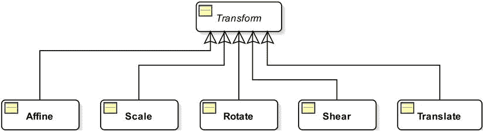

图 9-21。

A class diagram for transform-related classes

仿射变换是保留点、线和平面的广义变换。平行线在变换后保持平行。它可能不会保留线之间的角度和点之间的距离。但是，直线上各点之间的距离比保持不变。平移、缩放、相似变换、相似变换、反射、旋转和剪切都是仿射变换的例子。

`Affine`类的一个实例代表一个仿射变换。这个类对于初学者来说不容易使用。它的使用需要矩阵等高级数学知识。如果你需要一个特定类型的转换，使用特定的子类，如`Translate`、`Shear`等。而不是使用通用的`Affine`类。您也可以组合多个单独的转换来创建一个更复杂的转换。

使用转换很容易。然而，有时会令人困惑，因为有多种方法来创建和应用它们。创建`Transform`实例有两种方法:

*   使用`Transform`类的工厂方法之一，例如，`translate()`方法创建一个`Translate`对象，`rotate()`方法创建一个`Rotate`对象，等等。
*   使用特定的类来创建特定类型的转换，例如，`Translate`类用于转换，`Rotate`类用于旋转，等等。

以下两个`Translate`对象代表相同的翻译:

`double tx = 20.0;`

`double ty = 10.0;`

`// Using the factory method in the Transform class`

`Translate translate1 = Transform.translate(tx, ty);`

`// Using the Translate class constructor`

`Translate translate2 = new Translate(tx, ty);`

有两种方法可以将变换应用到节点:

*   使用`Node`类中的特定属性。例如，使用`Node`类的`translateX`、`translateY`和`translateZ`属性将翻译应用于节点。请注意，不能以这种方式应用剪切变换。
*   使用节点的`transforms`序列。`Node`类的`getTransforms()`方法返回一个`ObservableList<Transform>`。用所有的`Transform`对象填充这个列表。`Transforms`将按顺序应用。您可以仅使用此方法来应用剪切变换。

这两种应用`Transforms`的方法工作起来没有什么不同。当我讨论转换的具体类型时，我将讨论它们的区别。有时可以使用这两种方法来应用转换，在这种情况下，在节点属性上的转换集之前应用`transforms`序列中的转换。

下面的代码片段对一个`Rectangle`应用了三种转换，称为剪切、缩放和平移:

`// Create a rectangle`

`Rectangle rect = new Rectangle(100, 50, Color.LIGHTGRAY);`

`// Apply transforms using the transforms sequence of the Rectangle`

`Transform shear = Transform.shear(2.0, 1.2);`

`Transform scale = Transform.scale(1.1, 1.2);`

`rect.getTransforms().addAll(shear, scale);`

`// Apply a translation using the translatex and translateY`

`// properties of the Node class`

`rect.setTranslateX(10);`

`rect.setTranslateY(10);`

使用`transforms`序列应用剪切和缩放变换。使用`Node`类的`translateX`和`translateY`属性来应用翻译。在`transforms`序列中的变换，剪切和缩放，在平移之后依次应用。讨论所有类型的转换超出了本书的范围。有关更多详细信息，请参考 JavaFX API 文档。

清单 9-21 显示了如何对矩形应用平移、旋转、缩放和剪切变换。它创建两个大小相同、位置相同的矩形。矩形使用不同的填充颜色来区分它们。平移、旋转、缩放和剪切变换将应用于黄色填充的矩形。浅灰色填充的矩形不会应用任何变换。图 [9-22](#Fig22) 显示了两个矩形。

清单 9-21。对节点应用变换

`// TransformationTest.java`

`package com.jdojo.jfx;`

`import javafx.application.Application;`

`import javafx.scene.Scene;`

`import javafx.scene.layout.Pane;`

`import javafx.scene.paint.Color;`

`import javafx.scene.shape.Rectangle;`

`import javafx.scene.transform.Rotate;`

`import javafx.scene.transform.Scale;`

`import javafx.scene.transform.Shear;`

`import javafx.scene.transform.Translate;`

`import javafx.stage.Stage;`

`public class TransformationTest extends Application {`

`public static void main(String[] args) {`

`Application.launch(args);`

`}`

`@Override`

`public void start(Stage stage) {`

`Rectangle rect1 = new Rectangle(100, 50, Color.LIGHTGRAY);`

`rect1.setStroke(Color.BLACK);`

`Rectangle rect2 = new Rectangle(100, 50, Color.YELLOW);`

`rect2.setStroke(Color.BLACK);`

`// Apply a translation, rotate, scale and shear transformations`

`// to rect2`

`Translate translate = new Translate(50, 10);`

`Rotate rotate = new Rotate(30, 0, 0);`

`Scale scale = new Scale(0.5, 0.5);`

`Shear shear = new Shear(0.5, 0.5);`

`rect2.getTransforms().addAll(translate, rotate, scale, shear);`

`Pane root = new Pane(rect1, rect2);`

`root.setPrefSize(200, 100);`

`Scene scene = new Scene(root);`

`stage.setScene(scene);`

`stage.setTitle("Applying Transformations");`

`stage.show();`

`}`

`}`

图 9-22。

Two rectangles, one with transformations and one without transformations

## 动画

在现实世界中，动画意味着某种通过快速连续显示图像而产生的运动。例如，当你看电影时，你看到的图像变化如此之快，以至于你会产生一种运动错觉。

在 JavaFX 中，动画被定义为随时间改变节点的属性。如果改变的属性决定了节点的位置，JavaFX 中的动画将产生电影中的运动错觉。不是所有的动画都必须包含运动；例如，随时间改变一个`Shape`的`fill`属性是 JavaFX 中一个不涉及运动的动画。

为了理解动画是如何执行的，理解一些关键概念是很重要的:

*   时间表
*   关键帧
*   关键字值
*   内插器

动画是在一段时间内完成的。时间轴表示在给定时刻动画期间与关键帧相关联的时间进程。一个关键帧表示在时间轴上特定时刻被激活的节点的状态。关键帧有相关的键值。键值表示节点的属性值以及要使用的插值器。

假设你想在 10 秒内将场景中的一个圆从左向右水平移动。图 [9-23](#Fig23) 显示了几个位置的圆。粗水平线表示时间线。实线圆圈表示时间轴上特定时刻的关键帧。与关键帧相关联的键值显示在顶行。例如，第五秒关键帧的圆的`translateX`属性值为 500，在图中显示为 tx=500。

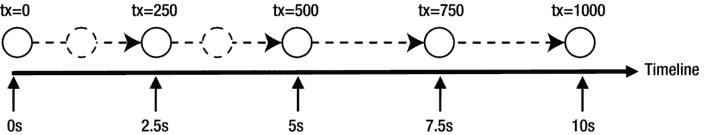

图 9-23。

Animating a circle along a horizontal line using a timeline

时间线、关键帧和关键值由开发人员提供。在你的例子中，你有五个关键帧。如果 JavaFX 在五个相应的时刻只显示五个关键帧，动画看起来会不稳定。为了提供平滑的动画，JavaFX 需要在时间轴上的任意时刻插入圆的位置。也就是说，JavaFX 需要在两个连续的关键帧之间创建中间关键帧。JavaFX 在插值器的帮助下完成这项工作。默认情况下，它使用一个线性插值器，该插值器随时间线性地改变动画的属性。也就是说，如果时间线上的时间超过了 x%，则属性值将是初始目标值和最终目标值之间的 x%。在图中，JavaFX 使用插值器创建了带虚线轮廓的圆。

JavaFX 中提供动画的类在`javafx.animation`包中，除了`Duration`类在`javafx.util`包中。图 [9-24](#Fig24) 显示了动画相关类的类图。

图 9-24。

A class diagram for core classes used in animation

抽象的`Animation`类代表一个动画。它包含所有类型的动画使用的通用属性和方法。JavaFX 支持两种类型的动画:

*   时间轴动画
*   过渡

在时间轴动画中，创建时间轴并向其添加关键帧。JavaFX 使用插值器创建中间关键帧。`Timeline`类的一个实例由时间轴动画表示。这种类型的动画需要您编写更多的代码，但是它给了您更多的控制。

通常执行几种类型的动画，例如，沿着路径移动节点，随时间改变节点的不透明度等。这些类型的动画被称为过渡。它们使用内部时间表来执行。`Transition`类的一个实例代表一个过渡动画。`Transition`类的几个子类支持特定类型的转换。例如，`FadeTransition`类通过随时间改变节点的不透明度来实现渐隐效果动画。您创建了一个`Transition`类的子类实例，指定了要动画的属性的初始值和最终值，以及动画的持续时间。JavaFX 负责创建时间轴和执行动画。这种类型的动画更容易使用。

有时，您可能希望按顺序或同时执行多个过渡。`SequentialTransition`和`ParallelTransition`类分别允许您顺序地和同时地执行一组转换。

`Duration`类在`javafx.util`包中。它以毫秒、秒、分钟和小时表示持续时间。它是一个不可变的类。一个`Duration`代表一个动画的每个周期的时间量。一个`Duration`可以代表一个正的或负的持续时间。

`KeyValue`类的一个实例表示一个键值，该键值是在动画过程中针对特定间隔插入的。它概括了三件事:

*   一个目标
*   目标的结束值
*   插值器

目标是一个`WritableValue`，它将所有 JavaFX 属性限定为一个目标。结束值是时间间隔结束时的目标值。插值器用于计算中间关键帧。

关键帧定义了时间轴上指定点的节点的目标状态。目标状态由与关键帧相关联的关键值来定义。一个关键帧包含四件事:

*   时间轴上的瞬间
*   一套`KeyValues`
*   一个名字
*   一个`ActionEvent`处理者

时间轴上与关键帧相关联的瞬间由一个`Duration`定义，它是时间轴上关键帧的偏移量。这组`KeyValue`定义了关键帧目标的最终值。一个关键帧可以有一个可选的名称，该名称可以用作一个提示点，以便在动画过程中跳转到它所定义的时刻。`Animation`类的`getCuePoints()`方法返回`Timeline`上提示点的`ObservableMap`。可选地，您可以将一个`ActionEvent`处理程序附加到一个`KeyFrame`上。在动画过程中，当关键帧到达时，调用`ActionEvent`处理程序。`KeyFrame`类的一个实例代表一个关键帧。

### 使用时间轴动画

时间轴动画用于制作节点的任何属性的动画。`Timeline`类的一个实例代表一个时间轴动画。使用时间轴动画包括以下步骤:

*   构建关键帧
*   创建一个带有关键帧的`Timeline`对象
*   设置动画属性
*   使用`play()`方法运行动画

您可以在创建`Timeline`时或之后添加关键帧。`Timeline`实例将所有关键帧保存在一个`ObservableList<KeyFrame>`对象中。`getKeyFrames()`方法返回列表的引用。您可以随时修改关键帧列表。如果时间轴动画已经在运行，您需要停止并重新启动它，以获得修改后的关键帧列表。

`Timeline`类包含几个构造函数:

*   `Timeline()`
*   `Timeline(double targetFramerate)`
*   `Timeline(double targetFramerate, KeyFrame... keyFrames)`
*   `Timeline(KeyFrame... keyFrames)`

无参数构造函数创建一个没有关键帧的`Timeline`，动画以最佳速度运行。其他构造函数允许您指定动画的目标帧速率(即每秒的帧数)和关键帧。请注意，关键帧添加到`Timeline`的顺序并不重要。`The timeline`会根据他们的时间偏移对他们进行排序。

清单 9-22 中的程序启动了一个时间轴动画，从右到左水平滚动一个文本，直到永远。图 [9-25](#Fig25) 为动画截图。

清单 9-22。使用时间轴动画滚动文本节点

`// ScrollingText.java`

`package com.jdojo.jfx;`

`import javafx.animation.KeyFrame;`

`import javafx.animation.KeyValue;`

`import javafx.animation.Timeline;`

`import javafx.application.Application;`

`import javafx.geometry.VPos;`

`import javafx.scene.Scene;`

`import javafx.scene.layout.Pane;`

`import javafx.scene.text.Font;`

`import javafx.scene.text.Text;`

`import javafx.stage.Stage;`

`import javafx.util.Duration;`

`public class ScrollingText extends Application {`

`public static void main(String[] args) {`

`Application.launch(args);`

`}`

`@Override`

`public void start(Stage stage) {`

`Text msg = new Text("JavaFX animation is cool!");`

`msg.setTextOrigin(VPos.TOP);`

`msg.setFont(Font.font(24));`

`Pane root = new Pane(msg);`

`root.setPrefSize(500, 70);`

`Scene scene = new Scene(root);`

`stage.setScene(scene);`

`stage.setTitle("Scrolling Text");`

`stage.show();`

`/* Set up a Timeline animation */`

`// Get the scene width and the text width`

`double sceneWidth = scene.getWidth();`

`double msgWidth = msg.getLayoutBounds().getWidth();`

`// Create the initial and final key frames`

`KeyValue initKeyValue =`

`new KeyValue(msg.translateXProperty(), sceneWidth);`

`KeyFrame initFrame = new KeyFrame(Duration.ZERO, initKeyValue);`

`KeyValue endKeyValue =`

`new KeyValue(msg.translateXProperty(), -1.0 * msgWidth);`

`KeyFrame endFrame =`

`new KeyFrame(Duration.seconds(3), endKeyValue);`

`// Create a Timeline object`

`Timeline timeline = new Timeline(initFrame, endFrame);`

`// Let the animation run forever`

`timeline.setCycleCount(Timeline.INDEFINITE);`

`// Start the animation`

`timeline.play();`

`}`

`}`

图 9-25。

Scrolling text using a timeline animation

执行动画的逻辑在`start()`方法中。该方法首先创建一个`Text`对象，一个带有`Text`对象的`Pane`，并为舞台设置一个场景。在展示舞台之后，它设置一个动画。首先，它得到场景和`Text`物体的宽度。

`double sceneWidth = scene.getWidth();`

`double msgWidth = msg.getLayoutBounds().getWidth();`

创建了两个关键帧:一个用于时间= 0 秒，另一个用于时间= 3 秒。动画使用`Text`对象的`translateX`属性来改变其水平位置，使其看起来滚动。在 0 秒时，`Text`被定位在场景宽度，所以它是不可见的。在 3 秒钟时，它被放置在场景左侧，距离等于它的长度，因此它也是不可见的。

`KeyValue initKeyValue = new KeyValue(msg.translateXProperty(), sceneWidth);`

`KeyFrame initFrame = new KeyFrame(Duration.ZERO, initKeyValue);`

`KeyValue endKeyValue = new KeyValue(msg.translateXProperty(), -1.0 * msgWidth);`

`KeyFrame endFrame = new KeyFrame(Duration.seconds(3), endKeyValue);`

用两个关键帧创建一个`Timeline`对象。

`Timeline timeline = new Timeline(initFrame, endFrame);`

默认情况下，动画将只运行一次。也就是说，`Text`将从右向左滚动一次，动画将停止。可以设置动画的循环次数，即动画需要运行的次数。通过将循环计数设置为`Timeline.INDEFINITE`，您可以永远运行动画，如下所示:

`timeline.setCycleCount(Timeline.INDEFINITE);`

最后，通过调用`play()`方法启动动画。

`timeline.play();`

这个例子有一个缺陷。当场景宽度改变时，滚动文本不会更新其初始水平位置。只要场景宽度发生变化，就可以通过更新初始关键帧来解决这个问题。将下面的语句添加到清单 9-22 的`start()`方法。它为场景的`width`添加了一个`ChangeListener`，用于更新关键帧并重启动画。

`scene.widthProperty().addListener( (prop, oldValue , newValue) -> {`

`KeyValue kv = new KeyValue(msg.translateXProperty(), scene.getWidth());`

`KeyFrame kf = new KeyFrame(Duration.ZERO, kv);`

`timeline.stop();`

`timeline.getKeyFrames().clear();`

`timeline.getKeyFrames().addAll(kf, endFrame);`

`timeline.play();`

`});`

创建一个只有一个关键帧的`Timeline`动画是可能的。关键帧被视为最后一个关键帧。`Timeline`使用动画属性的当前值合成一个初始关键帧(时间= 0 秒)。若要查看效果，请替换该语句

`Timeline timeline = new Timeline(initFrame, endFrame);`

在清单 9-22 中有以下语句

`Timeline timeline = new Timeline(endFrame);`

`Timeline`将用`Text`对象的`translateX`属性的当前值 0.0 创建一个初始关键帧。这一次，`Text`的滚动方式有所不同。开始滚动时，将`Text`设置为 0.0，并向左滚动，因此它超出了场景。

## 断续器

FXML 是一种基于 XML 的语言，用于为 JavaFX 应用程序构建用户界面。您可以使用 FXML 构建整个场景或场景的一部分。FXML 允许应用程序开发人员将构建 UI 的逻辑与业务逻辑分开。如果应用程序的 UI 部分发生变化，不需要重新编译 JavaFX 代码；您可以使用文本编辑器更改 FXML，然后重新运行应用程序。您仍然使用 JavaFX 通过 Java 编程语言编写业务逻辑。FXML 文档是 XML 文档。理解 f XML 需要 XML 的基础知识。

JavaFX 场景图是 Java 对象的层次结构。XML 格式非常适合存储表示某种层次结构的信息。所以用 FXML 存储场景图是非常直观的。

在 JavaFX 应用程序中使用 FXML 构建场景图是很常见的。然而，FXML 的使用并不仅限于构建场景图。它可以构建 Java 对象的分层对象图。事实上，它只能用来创建一个对象，例如一个`Person`类的对象。

让我们快速预览一下 FXML 文档的样子。你想创建一个简单的用户界面。它由一个带`Label`的`VBox`和一个`Button`组成。清单 9-23 包含了构建 UI 的 JavaFX 代码，这是您所熟悉的。清单 9-24 包含了构建相同 UI 的 FXML 版本。

清单 9-23。在 JavaFX 中构建对象图

`import javafx.scene.layout.VBox;`

`import javafx.scene.control.Label;`

`import javafx.scene.control.Button;`

`VBox root = new VBox();`

`root.getChildren().addAll(new Label("FXML is cool"),`

`new Button("Say Hello"));`

清单 9-24。在 FXML 中构建对象图

`<?xml version="1.0" encoding="UTF-8"?>`

`<?import javafx.scene.layout.VBox?>`

`<?import javafx.scene.control.Label?>`

`<?import javafx.scene.control.Button?>`

`<VBox>`

`<children>`

`<Label text="FXML is cool"/>`

`<Button text="Say Hello"/>`

`</children>`

`</VBox>`

`FXML`中的第一行是 XML 解析器使用的标准 XML 声明。它在 FXML 中是可选的。如果省略，则版本和编码分别假定为 1 和 UTF-8。接下来的三行是导入语句，对应于 Java 代码中的导入语句。表示 UI 的元素(例如，`VBox`、`Label`和`Button)`与 JavaFX 类的名称相同。`<children>`标签指定了`VBox`的子节点。使用各自元素的文本属性来指定`Label`和`Button`的文本属性。

FXML 文档只是一个文本文件。通常，文件名有一个`.fxml`扩展名，例如`hello.fxml`。例如，您可以使用记事本在 Windows 上创建 FXML 文档。如果您使用过 XML，就会知道在文本编辑器中编辑大型 XML 文档并不容易。Oracle 提供了一个名为 Scene Builder 的可视化编辑器，用于编辑 FXML 文档。场景构建器是开源的。你可以从 [`www.oracle.com/technetwork/java/javase/downloads/javafxscenebuilder-info-2157684.html`](http://www.oracle.com/technetwork/java/javase/downloads/javafxscenebuilder-info-2157684.html) 下载它的最新版本。Scene Builder 也可以集成到 NetBeans IDE 中，因此您可以在 NetBeans IDE 中使用 Scene Builder 编辑 FXML 文档。本书不讨论场景构建器的使用。

在这一节中，我将介绍 FXML 的基础知识。您将使用 FXML 开发一个简单的 JavaFX 应用程序。该应用程序包括以下内容:

*   答`VBox`
*   答`Label`
*   答`Button`

`VBox`的`spacing`被设置为 10px。`Label`和`Button`的`text`属性被设置为`FXML is cool!`和`Say Hello`。当点击`Button`时，`Label`中的文本变为`Hello from FXML!`。图 [9-26](#Fig26) 显示了应用程序显示的窗口的两个实例。

图 9-26。

Two instances of a window whose scene graph is created using FXML

清单 9-25 中的程序是这个示例应用程序的 JavaFX 实现，它使用 Java 编程语言来构建 UI。

清单 9-25。FXML 示例应用程序的 JavaFX 版本

`// SayHelloFX.java`

`package com.jdojo.jfx;`

`import javafx.application.Application;`

`import javafx.event.ActionEvent;`

`import javafx.scene.Scene;`

`import javafx.scene.control.Button;`

`import javafx.scene.control.Label;`

`import javafx.scene.layout.VBox;`

`import javafx.stage.Stage;`

`public class SayHelloFX extends Application {`

`private Label msgLbl = new Label("FXML is coll!");`

`private Button sayHelloBtn = new Button("Say Hello");`

`public static void main(String[] args) {`

`Application.launch(args);`

`}`

`@Override`

`public void start(Stage stage) {`

`// Set the preferred width of the lable`

`msgLbl.setPrefWidth(150);`

`// Set the ActionEvent handler for the button`

`sayHelloBtn.setOnAction(this::sayHello);`

`VBox root = new VBox(10);`

`root.getChildren().addAll(msgLbl, sayHelloBtn);`

`root.setStyle("-fx-padding: 10;" +`

`"-fx-border-style: solid inside;" +`

`"-fx-border-width: 2;" +`

`"-fx-border-insets: 5;" +`

`"-fx-border-radius: 5;" +`

`"-fx-border-color: blue;");`

`Scene scene = new Scene(root);`

`stage.setScene(scene);`

`stage.setTitle("Hello FXML");`

`stage.show();`

`}`

`public void sayHello(ActionEvent e) {`

`msgLbl.setText("Hello from FXML!");`

`}`

`}`

现在让我们构建清单 9-25 中程序的另一个版本，其中 UI 将使用 FXML 构建。用清单 9-26 所示的内容创建一个 FXML 文件`sayhello.fxml`。清单 9-26 是你的例子的 FXML 文档。它将为图 [9-26](#Fig26) 所示的场景创建根元素。将`sayhello.fxml`文件保存在`resources/fxml`目录中，其中`resources`目录的父目录包含在应用程序的类路径中。假设，在 Windows 上，你已经在类路径中添加了`C:\myjavafx`；`sayhello.fxml`的路径将是

`C:\myjavafx\resources\fxml\sayhello.fxml`

清单 9-26。sayhello.fxml 文件的内容

`<?xml version="1.0" encoding="UTF-8"?>`

`<?language javascript?>`

`<?import javafx.scene.Scene?>`

`<?import javafx.scene.layout.VBox?>`

`<?import javafx.scene.control.Label?>`

`<?import javafx.scene.control.Button?>`

`<VBox spacing="10" xmlns:fx="`[`http://javafx.com/fxml`](http://javafx.com/fxml)T2】

`<Label fx:id="msgLbl" text="FXML is cool!" prefWidth="150"/>`

`<Button fx:id="sayHelloBtn" text="Say Hello" onAction="sayHello()"/>`

``

`<fx:script>`

`function sayHello() {`

`msgLbl.setText("Hello from FXML!");`

`}`

`</fx:script>`

`</VBox>`

您已经为`VBox`设置了`spacing`属性，为`Label`和`Button`控件设置了`fx:id`属性。您已经使用一个`<style>`属性元素设置了`VBox`的`style`属性。您可以选择使用样式属性或属性元素来设置样式。您使用了一个属性元素，因为样式值是一个大字符串，如果在多行中输入，可读性会更好。元素用一个函数`sayHello()`定义了一个脚本块。该函数设置由`msgLbl fx:id`属性标识的`Label`的文本属性。您已经将`sayHello()`功能设置为`Button`的`onAction`属性，所以当点击`Button`时，会执行`sayHello()`功能。

要从 FML 构建 UI，需要将其加载到 JavaFX 程序中。加载 FXML 是由`FXMLLoader`类的一个实例执行的，它在`javafx.fxml`包中。

`FXMLLoader`类提供了几个构造函数，让您指定位置、字符集、资源包等。用于加载文档。您至少需要指定 FXML 文档的位置，这是一个`URL`。该类包含一个`load()`方法来执行文档的实际加载。以下代码片段从 Windows 中的本地文件系统加载 FXML 文档:

`// Build the URL to locate the FXMl file`

`String fxmlDocUrl = "file:///C:/resources/fxml/test.fxml";`

`URL fxmlUrl = new URL(fxmlDocUrl);`

`// Create an FXMLLoader object and set its location that is the URL of the`

`// FML contents`

`FXMLLoader loader = new FXMLLoader();`

`loader.setLocation(fxmlUrl);`

`// Load the FXML that will return a VBox`

`VBox root = loader.<VBox>load();`

`load()`方法有一个通用的返回类型。在上面的代码片段中，您在对`load()`方法(`loader.<VBox>load()`)的调用中清楚地表明了您的意图，即您期望从 FXML 文档中得到一个`VBox`实例。如果您愿意，可以省略通用参数，如下所示:

`// The return type of the load() method will be inferred as VBox`

`VBox root = loader.load();`

`FXMLLoader`类支持使用`InputStream`加载 FXML 文档。下面的代码片段使用一个`InputStream`加载相同的 FXML 文档:

`FXMLLoader loader = new FXMLLoader();`

`String fxmlDocPath = "C:\\resources\\fxml\\test.fxml";`

`FileInputStream fxmlStream = new FileInputStream(fxmlDocPath);`

`VBox root = loader.<VBox>load(fxmlStream);`

在内部，`FXMLLoader`使用流读取文档，这可能会抛出一个`IOException`。`FXMLLoader`类中 l `oad()`方法的所有版本都会抛出一个`IOException`。为了简单起见，我在这些代码片段中省略了异常处理。在您的应用程序中，您需要处理异常。

加载 FXML 文档后，下一步做什么？此时，FXML 的角色已经结束，JavaFX 代码应该接管它。

清单 9-27 中的程序包含了这个例子的 JavaFX 代码。它加载存储在`sayhello.fxml`文件中的 FXML 文档。程序从类路径加载文档。加载器返回一个`VBox`，它被设置为场景的根。代码的其余部分与您以前使用过的相同。请注意`start()`方法声明中的一个区别。该方法声明它可能抛出一个`IOException`，您必须添加它，因为您已经在方法内部调用了`FXMLLoader`的`load()`方法。运行程序时，会显示如图 [9-26](#Fig26) 所示的窗口。点击按钮，`Label`的文本将会改变。

清单 9-27。使用 FXML 构建图形用户界面

`// SayHelloFXML.java`

`package com.jdojo.jfx;`

`import javafx.application.Application;`

`import javafx.fxml.FXMLLoader;`

`import java.io.IOException;`

`import java.net.URL;`

`import javafx.scene.Scene;`

`import javafx.scene.layout.VBox;`

`import javafx.stage.Stage;`

`public class SayHelloFXML extends Application {`

`public static void main(String[] args) {`

`Application.launch(args);`

`}`

`@Override`

`public void start(Stage stage) throws IOException {`

`// Construct a URL for the FXML document`

`URL fxmlUrl = this.getClass()`

`.getClassLoader()`

`.getResource("resources/fxml/sayhello.fxml");`

`// Load the FXML document`

`VBox root = FXMLLoader.<VBox>load(fxmlUrl);`

`Scene scene = new Scene(root);`

`stage.setScene(scene);`

`stage.setTitle("Hello FXML");`

`stage.show();`

`}`

`}`

FXML 提供了比你在这个例子中看到的更多的东西。使用 FXML，您可以将 UI 元素绑定到 JavaFX、数据绑定和事件处理中的变量，创建自定义控件等。讨论这些特性超出了本书的范围。

## 印刷

JavaFX 8 通过`javafx.print`包中的 Print API 增加了对打印节点的支持。API 由以下类和一些枚举(未列出)组成:

*   `Printer`
*   `PrinterAttributes`
*   `PrintResolution`
*   `PrinterJob`
*   `JobSettings`
*   `Paper`
*   `PaperSource`
*   `PageLayout`
*   `PageRange`

这些类的实例代表打印过程的不同组件。例如，`Printer`代表可以用于打印作业的打印机；一个`PrinterJob`代表一个可以发送到`Printer`进行打印的打印作业；a `Paper`代表打印机等上可用的纸张尺寸。

Print API 提供了对打印节点的支持，这些节点可能会也可能不会附加到场景图。打印 web 页面的内容，而不是包含 web 页面的`WebView`节点，这是一个常见的需求。`javafx.scene.web.WebEngine`类包含一个打印网页内容的`print(PrinterJob job)`方法，而不是`WebView`节点。

如果在打印过程中修改了节点，打印的节点可能看起来不正确。注意，一个节点的打印可能跨越多个脉冲事件，导致正在打印的内容的同时改变。为了确保正确打印，请确保正在打印的节点在打印过程中没有被修改。

节点可以打印在任何线程上，包括 JavaFX 应用程序线程。建议在后台线程上提交大型、耗时的打印作业，以保持 UI 的响应性。

Print API 中的类是最终的，因为它们表示现有的打印设备属性。它们中的大多数都没有提供任何公共构造函数，因为你不能创建一个打印设备。相反，您可以使用类中的工厂方法来获取它们的引用。

静态方法返回机器上已安装打印机的可见列表。请注意，当安装新打印机或移除旧打印机时，方法返回的打印机列表可能会随时间而变化。使用`Printer`的`getName()`方法获取`Printer`代表的打印机名称。以下代码片段列出了运行该代码的机器上安装的所有打印机。您可能会得到不同的输出。

`import javafx.collections.ObservableSet;`

`import javafx.print.Printer;`

`...`

`ObservableSet<Printer> allPrinters = Printer.getAllPrinters();`

`for(Printer p : allPrinters) {`

`System.out.println(p.getName());`

`}`

`ImageRight Printer`

`Microsoft XPS Document Writer`

`PDF995`

`Sybase DataWindow PS`

`\\pro-print1\IS-HP4000`

`\\pro-print1\IS-HP4650(Color)`

`Printer.getDefaultPrinter()`方法返回默认的`Printer`。如果没有安装打印机，该方法可能返回`null`。机器上的默认打印机可以更改。因此，该方法可能在调用之间返回不同的打印机，并且返回的打印机可能在一段时间后无效。以下代码片段显示了如何获取默认打印机:

`Printer defaultPrinter = Printer.getDefaultPrinter();`

`if (defaultPrinter!= null) {`

`String name = defaultPrinter.getName();`

`System.out.println("Default printer name: " + name);`

`}`

`else {`

`System.out.println("No printers installed.");`

`}`

打印节点很简单:创建一个`PrinterJob`并调用它的`printPage()`方法，传递要打印的节点。使用具有所有默认设置的默认打印机打印节点只需要三行代码:

`PrinterJob printerJob = PrinterJob.createPrinterJob();`

`printerJob.printPage(myNode); // myNode is the node to be printed`

`printerJob.endJob();`

在现实世界的应用程序中，您希望处理错误，上面的代码重写如下:

`// Create a printer job for the default printer`

`PrinterJob printerJob = PrinterJob.createPrinterJob();`

`if (printerJob!= null) {`

`// Print the node`

`boolean printed = printerJob.printPage(node);`

`if (printed) {`

`// End the printer job`

`printerJob.endJob();`

`}`

`else {`

`System.out.println("Printing failed.");`

`}`

`}`

`else {`

`System.out.println("Could not create a printer job.");`

`}`

您可以使用`PrinterJob`类的`createPrinterJob()`静态方法来创建打印机作业。该方法被重载，如下所示:

*   `static PrinterJob createPrinterJob()`
*   `static PrinterJob createPrinterJob(Printer printer)`

不带-args 的方法为默认打印机创建一个打印机作业。您可以使用其他版本的方法为指定的打印机创建打印机作业。

您可以通过调用`setPrinter()`方法来更改`PrinterJob`的打印机。如果新打印机不支持当前的打印机作业设置，新打印机会自动重置这些设置。

`// Set a new printer for the printer job`

`printerJob.setPrinter(myNewPrinter);`

将`null`设置为作业的打印机将使用默认打印机。使用`PrinterJob`类的以下`printPage()`方法之一打印节点:

*   `boolean printPage(Node node)`
*   `boolean printPage(PageLayout pageLayout, Node node)`

该方法的第一个版本只接受要打印的节点作为参数。它使用作业的默认页面布局进行打印。第二个版本允许您指定打印节点的页面布局。如果打印成功，该方法返回 true。否则，它返回 false。

完成打印后，调用`endJob()`方法。如果作业可以成功地假脱机到打印机队列，则该方法返回 true。否则，它将返回 false，这可能表示作业无法假脱机或已经完成。作业成功完成后，就不能再重复使用了。

您可以使用`PrinterJob`的`cancelJob()`方法取消打印作业。打印可能不会立即取消，例如，当页面正在打印时。取消会尽快发生。如果出现以下情况，则该方法没有任何效果

*   已经请求取消该作业。
*   这项工作已经完成。
*   作业有错误。

`PrinterJob`类包含一个只读的`jobStatus`属性，表示打印作业的当前状态。状态由`PrinterJob.JobStatus`枚举的下列常量之一定义:

*   `NOT_STARTED`
*   `PRINTING`
*   `CANCELED`
*   `DONE`
*   `ERROR`

`NOT_STARTED`状态表示一个新任务。在这种状态下，可以配置作业并开始打印。`PRINTING`状态表示作业已请求打印至少一页，并且尚未终止打印。在这种状态下，无法配置作业。

其他三种状态，`CANCELED`、`DONE`和`ERROR,`表示作业的终止状态。一旦作业处于其中一种状态，就不应该重复使用。当状态变为`CANCELED`或`ERROR`时，不需要调用`endJob()`方法。当打印成功并且调用了`endJob()`方法时，进入`DONE`状态。

清单 9-28 中的程序显示了如何打印节点。它显示一个`TextArea`，您可以在其中输入文本。提供了两个`Button`:一个打印`TextArea`节点，另一个打印整个场景。当开始打印时，打印作业状态显示在`Label`中。`print()`方法中的代码与您在示例中看到的代码相同。该方法包括在`Label`中显示作业状态的逻辑。程序显示如图 [9-27](#Fig27) 所示的窗口。运行程序，在`TextArea, and`中输入文本点击两个按钮之一进行打印。

清单 9-28。打印节点

`// PrintingNodes.java`

`package com.jdojo.jfx;`

`import javafx.application.Application;`

`import javafx.print.PrinterJob;`

`import javafx.scene.Node;`

`import javafx.scene.Scene;`

`import javafx.scene.control.Button;`

`import javafx.scene.control.Label;`

`import javafx.scene.control.TextArea;`

`import javafx.scene.layout.HBox;`

`import javafx.scene.layout.VBox;`

`import javafx.stage.Stage;`

`public class PrintingNodes extends Application {`

`private Label jobStatus = new Label();`

`public static void main(String[] args) {`

`Application.launch(args);`

`}`

`@Override`

`public void start(Stage stage) {`

`VBox root = new VBox(5);`

`Label textLbl = new Label("Text:");`

`TextArea text = new TextArea();`

`text.setPrefRowCount(10);`

`text.setPrefColumnCount(20);`

`text.setWrapText(true);`

`// Button to print the TextArea node`

`Button printTextBtn = new Button("Print Text");`

`printTextBtn.setOnAction(e -> print(text));`

`// Button to print the entire scene`

`Button printSceneBtn = new Button("Print Scene");`

`printSceneBtn.setOnAction(e -> print(root));`

`HBox jobStatusBox =`

`new HBox(5, new Label("Print Job Status:"), jobStatus);`

`HBox buttonBox = new HBox(5, printTextBtn, printSceneBtn);`

`root.getChildren().addAll(textLbl, text, jobStatusBox, buttonBox);`

`Scene scene = new Scene(root);`

`stage.setScene(scene);`

`stage.setTitle("Printing Nodes");`

`stage.show();`

`}`

`private void print(Node node) {`

`jobStatus.textProperty().unbind();`

`jobStatus.setText("Creating a printer job...");`

`// Create a printer job for teh default printer`

`PrinterJob job = PrinterJob.createPrinterJob();`

`if (job != null) {`

`// Show the printer job status`

`jobStatus.textProperty().bind(job.jobStatusProperty().asString());`

`// Print the node`

`boolean printed = job.printPage(node);`

`if (printed) {`

`// End the printer job`

`job.endJob();`

`}`

`else {`

`jobStatus.textProperty().unbind();`

`jobStatus.setText("Printing failed.");`

`}`

`}`

`else {`

`jobStatus.setText("Could not create a printer job.");`

`}`

`}`

`}`

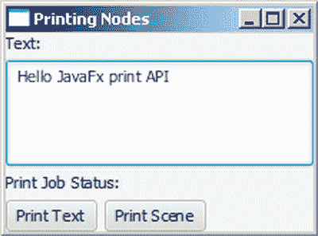

图 9-27。

A window letting the user print text in a TextArea and the scene

打印 API 提供了更多的打印特性，比如显示打印对话框。更多细节请参考 JavaFX API 文档中的`javafx.print`包中的类。

## 摘要

JavaFX 是一个开源的基于 Java 的 GUI 框架，用于开发富客户端应用程序。它是 Swing 在 Java 平台 GUI 开发技术领域的继承者。

JavaFX 中的 GUI 分阶段显示。stage 是`Stage`类的一个实例。舞台是桌面应用程序中的窗口，也是 web 应用程序中浏览器中的区域。一个舞台包含一个场景。场景包含一组以树状结构排列的节点(图形)。

JavaFX 应用程序继承自`Application`类。JavaFX 运行时创建名为 primary stage 的第一个 stage，并调用 application 类的`start()`方法，传递 primary stage 的引用。开发人员需要向舞台添加一个场景，并使舞台可见。

JavaFX 支持属性类，其实例用于表示类的属性。属性支持单向和双向绑定。如果属性绑定到表达式，属性值会自动与表达式的值同步。属性支持失效和更改通知。感兴趣的人可以注册这些通知。当属性变得无效或其值发生变化时，它们会收到通知。当属性的依赖关系发生变化时，该属性将变得无效。

JavaFX 提供了可观察的列表、集合和映射，它们是`ObservableList`、`ObservableSet`和`ObservableMap`接口的实例。可以观察到它们的失效和变化。`FXCollections class`包含创建这种可观察集合的实例的工厂方法。

JavaFX 支持 UI 元素的事件处理。您可以为 UI 元素注册事件处理程序。当事件发生时，将执行您注册的事件处理程序。

JavaFX 提供了布局窗格，它们是节点的容器。它们以特定的方式排列节点。例如，`HBox`布局窗格通过将节点水平放置在一行来排列节点，而`VBox`布局窗格通过将节点垂直放置在一列来排列节点。JavaFX 提供了丰富的控件集，如`Button`、`Label`、`ChoiceBox`、`ComboBox`、`TextField`、`DatePicker`等。`HTMLEditor`控件提供了编辑富文本的功能。`WebView`节点用于显示网页内容。

JavaFX 为绘制 2D 和 3D 图形提供了广泛的支持。它提供了画布 API 来使用绘图命令在画布上绘制 2D 形状。Canvas API 还允许您访问(读写)画布表面上的像素。

通过编写几行代码，可以将效果、变换和动画应用于场景中的节点。JavaFX 支持 FXML，这是一种基于 XML 的标记语言，用于为 JavaFX 应用程序构建 GUI。您可以使用打印 API 打印节点和网页内容。