# 3.Java 编辑器

我没有时间去学习每一个小事件、动作或可用的处理程序类型，NetBeans 会提供建议和语法自动完成功能，只需自动按键。这个功能非常流畅，已经取代了我的网络搜索。—肖恩·菲利普斯，地面系统工程师，美国宇航局 MMS 和 JWST 任务

NetBeans IDE 提供了一组相互关联的工具来支持 Java 应用程序开发。然而，尤其是源代码编辑器，您将在那里花费大部分时间。鉴于这一事实，很多注意力都集中在提供源代码编辑器中及其周围的特性和微妙之处，以帮助开发人员更快、更有效地编码。本章详细研究了使用源代码编辑器简化和加速常见编码任务的方法，特别是针对 Java 文件。

## 概观

当您编写、编辑和重构 Java 代码时，许多编辑器特性都是可用的。例如，其中之一是代码完成，有时也被称为“智能感知”，如图 [3-1](#Fig1) 所示。使用它来了解光标所在的上下文，并生成代码或提供适用于该上下文的信息。

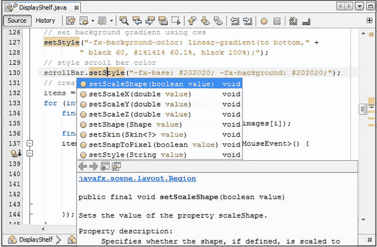

图 3-1。

Code completion

代码生成功能和应用程序中文件导航的键盘快捷键确保您的手很少需要离开键盘。

请注意，源代码编辑器是不同类型编辑器的集合，每种编辑器都包含特定于某些文件的功能。例如，当您打开一个 Java 文件(这是本章的重点)时，有一个专门针对 Java 文件的语法突出显示方案，以及代码完成、重构和其他与 Java 文件相关的特性。同样，当您打开 JSP、HTML、XML 和其他类型的文件时，您会看到一组适用于这些文件类型的特性。

也许最重要的是，源代码编辑器与 IDE 的其他部分紧密集成，这极大地简化了您的工作流程。例如，您可以直接在源代码编辑器中定义断点，并在 Java 代码执行时跟踪它。同样，当“输出”窗口中报告编译错误时，可以通过单击错误或按 F12 键跳转到这些错误的来源。

## 入门指南

本节帮助您熟悉源代码编辑器的布局和结构。这里描述了与开始使用源代码编辑器相关的最直接的任务。后续章节将详细介绍具体的功能。在这里，您可以根据邮件列表和其他地方的用户问题，了解到用户对于源代码编辑器的最基本的初始关注。

### 打开文件

在开始使用源代码编辑器之前，通常需要设置一个 NetBeans 项目。然后，您可以在项目中打开一个现有的 Java 文件，或者从模板创建一个新的 Java 文件。下一章将详细介绍这些任务，所以这里不再详细讨论。相反，您将快速浏览基本过程，让您在源代码编辑器中有一个 Java 文件，为本章的其他部分做准备。

选择文件➤新建项目，单击文件工具栏中的新建项目按钮，或者按 Ctrl+Shift+N。此时会出现新建项目窗口，如图 [3-2](#Fig2) 所示，您可以创建一个新的 Java 项目，这将在下一章中讨论。

图 3-2。

New Project window

一旦你有了一个项目，你会想要在其中创建新的文件。要在项目中创建新的 Java 文件，选择文件➤新建文件，单击文件工具栏中的新建文件按钮，或按 Ctrl+N。此时会出现新建文件窗口，如图 [3-3](#Fig3) 所示，您可以在其中创建新的 Java 文件。

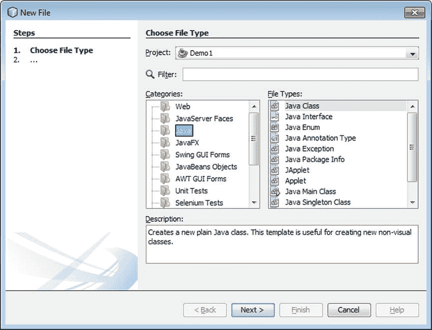

图 3-3。

New File window

### 打开没有项目的文件

如果您想在不设置项目的情况下用 Java 编写代码，可以使用文件➤打开文件打开磁盘上的特定 Java 文件。使用文件➤打开最近使用的文件(Ctrl+Shift+T)打开自 IDE 打开以来最近关闭的文件。

或者，你可以使用收藏夹窗口(Ctrl+3)，如图 [3-4](#Fig4) 所示。“收藏夹”窗口允许 IDE 访问系统中的任意文件夹和文件。

图 3-4。

The Favorites window

但是，请注意，虽然收藏夹窗口在您只想快速打开和编辑几个文件时会很有用，但它并不是为全面的 Java 应用程序开发而设计的，比如使用重构工具。

要使用“收藏夹”窗口访问源代码编辑器而无需创建项目，请从“窗口”菜单中选择“收藏夹”,或按 Ctrl+3。这将打开收藏夹窗口。通过在“收藏夹”窗口中右键单击，选择“添加到收藏夹”，然后从文件选择器中选择文件夹，来添加您希望文件存放的文件夹(或它已经存放的文件夹)。在“收藏夹”窗口中，导航到要编辑的文件，双击它以在源代码编辑器中打开它。如果要创建新文件，请右键单击文件夹节点，选择“新建”，然后在文件夹中创建新文件夹或文件。

### 重新配置源代码编辑器

现在您已经打开了一个或多个 Java 文件，是时候放松一下了！第一步是按照您希望的方式设置源代码编辑器。

首先，您会很高兴知道您可以拆分源代码编辑器来同时查看多个文件或查看同一文件的不同部分，如图 [3-5](#Fig5) 所示。若要拆分源代码编辑器窗口以查看多个文件，请确保至少有两个文件已经打开。单击一个文件上的选项卡，按住鼠标按钮，然后将该选项卡拖到源代码编辑器的最左侧、最右侧或底部。当开始拖动时选项卡周围出现的红色轮廓变为矩形时，释放鼠标按钮。这表示拆分窗口的位置。

图 3-5。

Viewing multiple files simultaneously

您可以在 IDE 中使用各种不同的工具同时查看同一文件的不同部分，如图 [3-6](#Fig6) 所示。

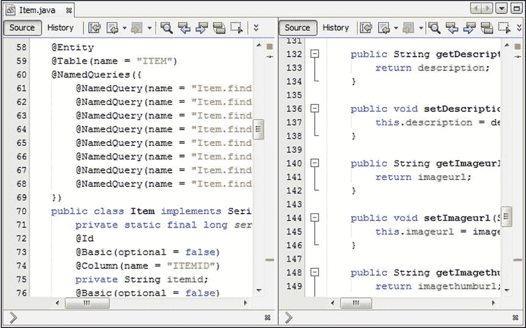

图 3-6。

Splitting a single file

*   克隆文档。在源代码编辑器中右键单击文件的选项卡，然后选择“克隆文档”为同一文档创建第二个选项卡。如果需要，拖放其中一个选项卡来创建一个分割源代码编辑器区域。请参见前面关于拖放源代码编辑器选项卡的过程。
*   拆分文档。在源代码编辑器中右键单击文件的选项卡，然后选择“拆分文档”。然后选择垂直或水平，这取决于您想要如何拆分文档。
*   拆分文档按钮。从每个编辑器文档的右上角垂直或水平拖动“拆分文档”按钮，根据需要拆分编辑器。

接下来，让我们探索一下为代码腾出更多空间可以采取的措施。

*   双击文件的标签。当您这样做时，除了主菜单和工具栏行之外，该文件将占用 IDE 的整个空间。您可以通过再次连按标签来使其他窗口重新出现。
*   使其他窗口成为“滑动”窗口。右键单击其他窗口的标签并选择“最小化”,使它们成为滑动窗口。只有当您在 IDE 的一个边缘上单击或鼠标悬停在代表该窗口的按钮上时，它们才会出现。您可以通过单击滑动窗口中的按钮将窗口恢复到正常显示。
*   隐藏 ide 的工具栏。您可以在视图菜单中切换主工具栏的显示，在视图菜单中您可以选择工具栏。然后，您可以单独选择要隐藏或显示的工具栏。通过选择“显示编辑器工具栏”,可以在“视图”菜单中切换源代码编辑器工具栏的显示。

### 更改键盘快捷键、字体和颜色

您可以更改默认键盘快捷键或将其他可用命令映射到快捷键。如果您熟悉其他 IDE 中定义的键盘快捷键，您可以选择使用这些快捷键，而不是 NetBeans IDE 提供的默认快捷键。

此外，如果您熟悉其他 IDE 或编辑器中的字体和颜色，或者出于某种原因，您不喜欢编辑器或整个 IDE 中使用的默认颜色，您可以相对容易地切换到您喜欢的字体和颜色组合。

要修改键盘快捷键，请从“工具”菜单中选择“选项”。当“选项”窗口打开时，单击“键盘映射”面板。在“操作”列表中，导航到要更改的操作，单击省略号按钮，然后单击“编辑”。键入要使用的键盘快捷键，然后按 Enter 键。

如图 [3-7](#Fig7) 所示，IDE 附带了 Eclipse、IntelliJ IDEA 和 Emacs 的键盘快捷键配置文件，您可以从 Keymap 面板的配置文件下拉框中选择其中的任何一个。您也可以创建自己的个人资料。

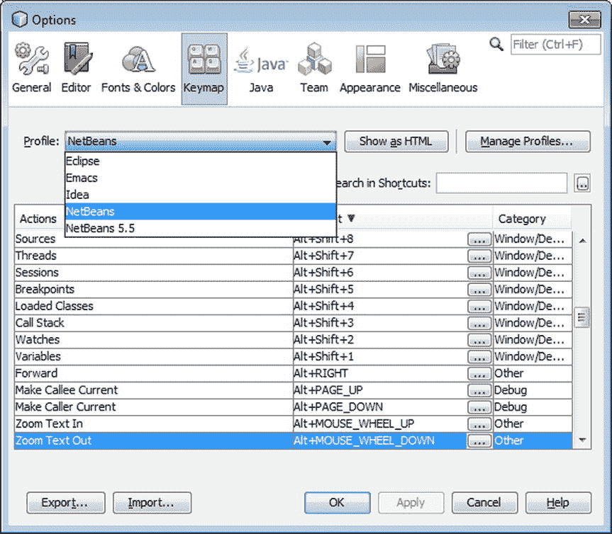

图 3-7。

Switching Keymap profiles in the Options window

要修改源代码编辑器的字体和颜色，请从“工具”菜单中选择“选项”。当选项窗口打开时，点击字体和颜色面板，如图 [3-8](#Fig8) 所示。从配置文件下拉框中选择一个配置文件。如果要微调配置文件，请使用类别列表导航到要修改的类成员，然后根据需要使用字体、前景、背景、效果和效果颜色组件。使用预览区域来确保您已经根据自己的要求进行了定制。然后按回车。

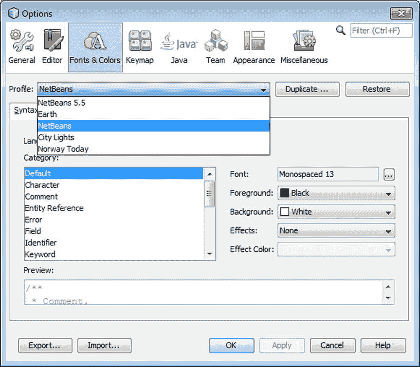

图 3-8。

Switching Fonts & Colors profiles in the Options window

例如，如果您从 Profile 下拉列表中选择 Norway Today，而不做任何进一步的更改，编辑器将如图 [3-9](#Fig9) 所示。

图 3-9。

“Norway Today” Font and Color profile

去下面的网址设计并下载你自己的主题: [http:// netbeansthemes。com](http://netbeansthemes.com/) 。

如今，深色背景在开发工具中越来越受欢迎。通过安装深色外观和感觉主题插件，你可以在整个 IDE 中切换到深色背景。

为此，请从“工具”菜单中选择“插件”。当插件管理器打开时，单击可用插件面板。选择并安装深色观感主题插件，如图 [3-10](#Fig10) 所示。

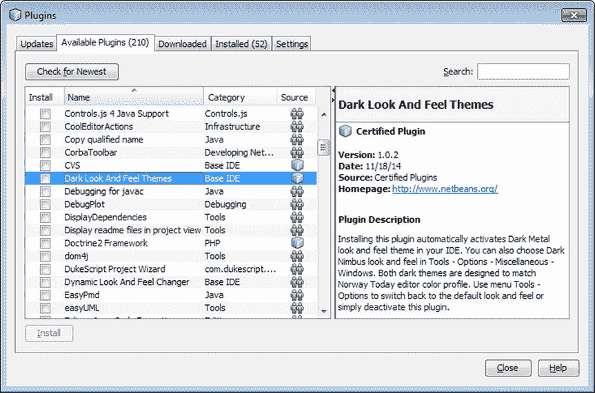

图 3-10。

Dark Look and Feel Themes plugin

安装插件并重启 IDE 后，IDE 看起来如图 [3-11](#Fig11) 所示。

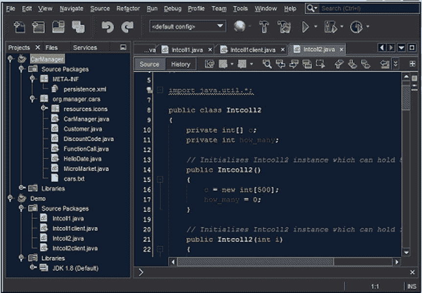

图 3-11。

Dark Metal look and feel

然而，插件提供了两种不同的黑暗主题。此外，默认情况下还提供了各种其他主题，这些主题是由 Swing 的“外观和感觉”实现定义的。

要在主题之间切换，请从“工具”菜单中选择“选项”。当选项窗口打开时，点击外观面板，如图 [3-12](#Fig12) 所示。使用首选外观下拉菜单来切换主题。

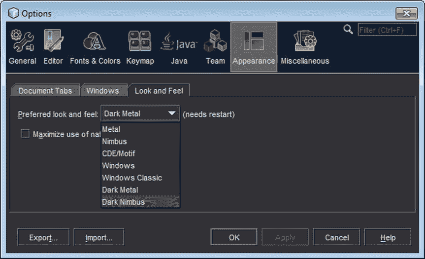

图 3-12。

Switching between look and feels in the Options window

将主题切换到黑暗光轮并重启 IDE 后，看起来如图 [3-13](#Fig13) 所示。

图 3-13。

The Dark Nimbus look and feel

### 比较两个文件之间的差异

您可以生成两个文件的并排比较，突出显示不同的行。

要比较两个文件，右键单击要比较的两个文件。选择工具，然后选择差异，如图 [3-14](#Fig14) 所示。

图 3-14。

Diff menu item in the Tools menu

源代码编辑器中出现 Diff 窗口，如图 [3-15](#Fig15) 所示。

图 3-15。

Diff window

在比较文档时，比较窗口中的颜色显示删除的行(红色)、更改的行(蓝色)和添加的行(绿色)。

请注意，只有在“项目”、“文件”或“收藏夹”窗口中选择了两个(且不超过两个)文件时,“比较”项才会出现在“工具”菜单中。

## 打字

当您在源代码编辑器中键入时，您首先会注意到的一件事是，当您键入开始字符时，会自动插入结束字符。例如，如果键入引号，右引号将插入行尾。同样，圆括号(())、方括号([])和花括号({})也为您完成了。

虽然这乍一看似乎令人惊讶，但该功能的设计不会妨碍您。如果您自己键入结束字符，自动插入的字符将被覆盖。此外，您可以通过键入分号(；)来完成一个语句。分号插入在自动生成的一个或多个字符之后的行尾。

有关如何使用匹配结束字符插入的信息，请参见以下副标题。

### 整理和连接

当源代码编辑器在行尾插入匹配字符时，这似乎会迫使您在键入分号之前手动将插入点移过结束字符。

事实上，您可以按住 Ctrl 键，在不移动插入点的情况下键入分号，它将自动放置在行尾。当您按住 Shift 键和 Ctrl 键，然后在不移动插入点的情况下键入分号时，会在分号后添加一个新行。

例如，要获得该行

`ArrayList ls = new ArrayList();`

你只需要打字

`ArrayList ls = new ArrayList(;`

如果有一个很长的字符串，您想将它分成两行，那么当您按 Enter 键时，源代码编辑器会添加连接字符串的语法。例如，要得到这些线

`String s = "Though typing can seem tedious, reading long" +`

`"and convoluted sentences can be even worse."`

你可以打字

`String s = "Though typing can seem tedious, reading long`

`and convoluted sentences can be even worse.`

最后三个引号和加号(+)是为您添加的。

如果您想在不创建连接的情况下换行，请按 Shift+Enter。

### 匹配文件中的其他单词

如果您键入的单词出现在文件中的其他位置，您可以使用键盘快捷键，根据源代码编辑器中找到的与您键入的字符匹配的第一个单词来完成该单词。这个单词匹配功能适用于文件中的任何文本。它还会搜索您最近处理过的文件(按照您上次访问文件的顺序)。按 Ctrl+K 从光标处向后搜索匹配项。按 Ctrl+L 从光标处向前搜索匹配项。

例如，如果您已经在第 100 行定义了方法`refreshCustomerInfo`,现在想从第 50 行调用该方法，您可以键入`ref`,然后按 Ctrl+L。如果在第 50 行和第 100 行之间没有其他以`ref`开头的单词，那么剩余的单词`refreshCustomerInfo`将被填充。如果找到不同的匹配项，请一直按 Ctrl+L，直到填入所需的匹配项。

对于键入变量名，您可能会发现单词匹配功能比代码完成功能更好，因为与代码完成功能相比，IDE 只需在几个文件中搜索文本字符串，而在代码完成功能中，IDE 会搜索整个类路径。

### 文本选择快捷键

为了让您的双手都放在键盘上，许多快捷键允许您选择文本、取消选择文本以及更改所选文本。参见表 [3-1](#Tab1) 了解这些快捷键的选择。

表 3-1。

Text Selection Shortcuts

<colgroup><col> <col></colgroup> 
| 捷径 | 描述 |
| --- | --- |
| Alt+Shift+J | 选择插入点所在的当前标识符或其他单词。 |
| Ctrl+Shift+[ | 选择一组圆括号、方括号或花括号之间的所有文本。插入点必须紧接在左括号/右括号/大括号之后。 |
| Alt+Shift+句点(Alt+Shift+逗号) | 选择当前代码元素。在后续按下时，递增(Alt+Shift+句点)或递减(Alt+Shift+逗号)选择的大小，以包括周围的代码元素。例如，如果您按 Alt+Shift+句点一次，则当前单词被选中。如果再次按下它，表达式的其余部分可能会被选择。第三次按下可能会选择整个语句。第四次按下可能会选择整个方法。 |
| Shift+右(Shift+左) | 选择下一个(上一个)字符或将所选内容扩展一个字符。 |
| Ctrl+Shift+向右(Ctrl+Shift+向左) | 选择下一个(上一个)单词或将选择范围扩大一个单词。 |
| Shift+向下(Shift+向上) | 向下(向上)创建或扩展一行文本选择。 |
| Shift+End (Shift+Home) | 创建文本选择或将文本选择扩展到行尾(行首)。 |
| Ctrl+Shift+End (Ctrl+Shift+Home) | 创建文本选择或将文本选择扩展到文档的结尾(开头)。 |
| Shift+向下翻页(Shift+向上翻页) | 向下(向上)一页创建或扩展文本选择。 |

### 宏指令

您可以在 IDE 中录制宏，以将通常涉及一长串击键的操作减少到一个键盘快捷键。在宏中，您可以将源代码编辑器中的字符键入和其他键盘快捷键的键入结合起来。

要录制宏:

Put the insertion point in the part of a file in the Source Editor where you want to record the macro.   Click the Start Macro Recording button in the Source Editor’s toolbar to begin recording.   Record the macro using any sequence of keystrokes, whether it is typing characters or using keyboard shortcuts. Mouse movements and clicks (such as menu selections) are not recorded.   Click in the Source Editor’s toolbar to finish recording.   In the Macro field of the Recorded Macro window that appears, fine-tune the macro, if necessary.   Click Add to assign a keyboard shortcut to the macro. In the Add Keybinding window, press the keys that you want to use for the keyboard shortcut. (For example, if you want the shortcut Alt+Shift+Z, press the Alt, Shift, and Z keys.) If you press a wrong key, click the Clear button to start over.  

注意不要使用已经分配的快捷方式。如果您输入的快捷方式是编辑器快捷方式，则对话框中会出现警告。但是，如果组合键是应用于源代码编辑器之外的快捷方式，则不会向您发出警告。

您可以在选项窗口中指定新的快捷方式。选择工具➤选项，单击编辑器面板，选择宏选项卡，然后单击设置快捷方式按钮。

### 代码片段

源代码编辑器有几个特性可以减少键入代码所需的击键次数。你可以使用这些功能，不需要使用鼠标，不需要使用菜单，也不需要记住键盘快捷键。

可以说，最重要的代码生成机制如下:

*   Ctrl+spacebar. This shortcut opens the code completion box, as shown in Figure [3-16](#Fig16). The code completion box contains a context-sensitive list of ways you can complete the statement you are currently typing and of other code snippets you might want to insert in your code.

    

    图 3-16。

    Code completion
*   Multi-keystroke. Abbreviations for longer snippets of code called code templates. These abbreviations are expanded into the full code snippet after you press the spacebar, as shown in Figure [3-17](#Fig17).

    

    图 3-17。

    Code templates
*   Alt+Insert. This shortcut opens a small popup, shown in Figure [3-18](#Fig18), from which code snippets can quickly be generated.

    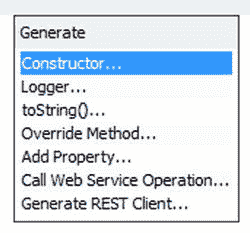

    图 3-18。

    Code generators
*   Alt+Enter. You can use this shortcut to display suggestions the IDE has regarding missing code and then have the IDE insert that code. The IDE notifies you that it has a suggestion by displaying a light bulb icon in the left margin of the line you are typing, as shown in Figure [3-19](#Fig19).

    

    图 3-19。

    Java hints

除了节省击键和使用鼠标，这些特性还有助于防止输入错误，并帮助您找到正确的类名和方法名。

下面几节说明了在用 Java 编码时如何充分利用这些特性。

## 代码完成

当您在源代码编辑器中键入 Java 标识符时，可以使用代码完成功能来帮助您完成表达式。此外，还会出现 Javadoc 文档，并显示代码完成中当前选定项的文档。

各种类型的代码生成工具已经被添加到代码完成功能中。使用代码完成，您可以执行下列操作:

*   Fill in names of classes and class members while reading the related Javadoc documentation, as shown in Figure [3-20](#Fig20).

    

    图 3-20。

    Code completion
*   Generate whole snippets of code from dynamic code templates, as shown in Figure [3-21](#Fig21).

    

    图 3-21。

    Dynamic code templates
*   Generate getter and setter methods, as shown in Figure [3-22](#Fig22).

    

    图 3-22。

    Generate getters and setters
*   Generate skeletons for abstract methods of classes extended by and interfaces implemented by the current class and override inherited methods, as shown in Figure [3-23](#Fig23).

    

    图 3-23。

    Override inherited methods
*   Generate skeletons of anonymous inner classes, as shown in Figure [3-24](#Fig24).

    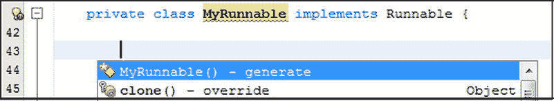

    图 3-24。

    Generate anonymous inner classes

提供了多种机制来打开代码完成框:

*   ctrl+空格键。键入表达式的前几个字符，然后按 Ctrl+空格键(或 Ctrl+\)。
*   暂停一下。键入句号()后暂停。)在一个表达式中。
*   空间。键入一个空格，然后暂停片刻。

“代码完成”框将打开，其中选择了与您到目前为止键入的内容可能匹配的内容。

若要缩小代码完成框中的选择范围，请继续键入表达式。

若要完成表达式并关闭代码完成框，请执行下列操作之一:

*   打字。继续输入，直到只剩下一个选项，然后按 Enter 键。
*   滚动。使用箭头键或鼠标滚动列表以选择一个值，然后按 Enter。

若要关闭代码完成框而不输入任何选择，请按 Esc。

要完成表达式并保持代码完成框打开，请选择一个完成项并按下句点(`.`)键。如果您正在链接方法，这将非常有用。例如，如果你想输入

getRootPane()。set default button(default button name)

您可以执行以下操作:

*   键入`getRo`(这将在代码完成框中只留下`getRootPane()`)并按下句点(`.`)键。
*   键入`.setDef`(这将使`setDefaultButton(JButton defaultButton)`成为代码完成框中选定的方法)并按 Enter 键。`getRootPane().setDefaultButton(defaultButtonName)`现在应该插入到代码中，插入点放在最后一对括号之间。将出现一个工具提示，其中包含要输入的参数类型的信息。
*   键入参数的名称。
*   键入分号(`;`)以结束语句。分号自动放在最后一个括号后面。

### 代码完成技巧

当在代码完成框打开的情况下键入时，有一些技巧可以用来更快地缩小选择范围并生成您要查找的代码。例如:

*   骆驼案。如果你想创建一个`HashSet`的实例，你可以输入`private HS`并按 Ctrl+空格键来显示`HashSet`(以及其他名字中有大写 H 和大写 S 的类)。
*   逗号(`,`)和分号(`;`)键。使用这些将代码完成框中突出显示的项插入到代码中。逗号或分号被插入到代码中从代码完成框中选择的项之后。
*   选项卡。您可以通过按 Tab 键来填写列表中所有剩余选项的通用文本。当代码完成框中的选择范围缩小到具有相同前缀的选项时，这可以为您节省几次击键(或使用箭头键或鼠标)的时间。例如，如果您正在处理一个`Hashtable`对象`ht`，并且您已经键入了`ht.n`，那么将会有两个以`notify`开头的方法(`notify()`和`notifyAll()`)。要更快地将选择缩小到仅`notifyAll()`，请按 Tab 键将`ht.n`扩展到`ht.notify`，然后键入`A`。然后，您可以按回车键，用`notifyAll()`完成该语句。

### 自定义代码完成设置

如果您喜欢使用不同的快捷键来完成代码，可以在 NetBeans IDE 中更改这些快捷键。从选项菜单中选择工具。选项窗口打开。在选项窗口中，点击编辑器，选择键映射，如图 [3-25](#Fig25) 所示。在搜索过滤器中，键入`code completion`。将显示相关的快捷方式，以便您可以根据自己的喜好进行微调。

图 3-25。

Customizing code completion actions

要调整通用格式规则，请从“选项”菜单中选择“工具”。选项窗口打开。在选项窗口中，点击编辑器，选择代码完成，如图 [3-26](#Fig26) 所示。在语言下拉列表中，选择所有语言后，根据您的喜好微调常规设置。

图 3-26。

Code completion settings in the Options window

正如你在图 [3-26](#Fig26) 中看到的，如果你发现代码完成框麻烦多于帮助，你可以禁用代码完成弹出窗口的自动出现。如果您通过按 Ctrl+空格键或 Ctrl+\，手动激活代码完成，它仍然可以工作。

您可能会发现有用的另一个典型设置是，您可以启用代码完成弹出窗口的自动外观，但禁用 bulkier Javadoc 代码完成对话框。可以使用 Ctrl+Shift+空格键手动调用 Javadoc 弹出窗口。

您可以调整特定于 Java 的格式规则，如图 [3-27](#Fig27) 所示。

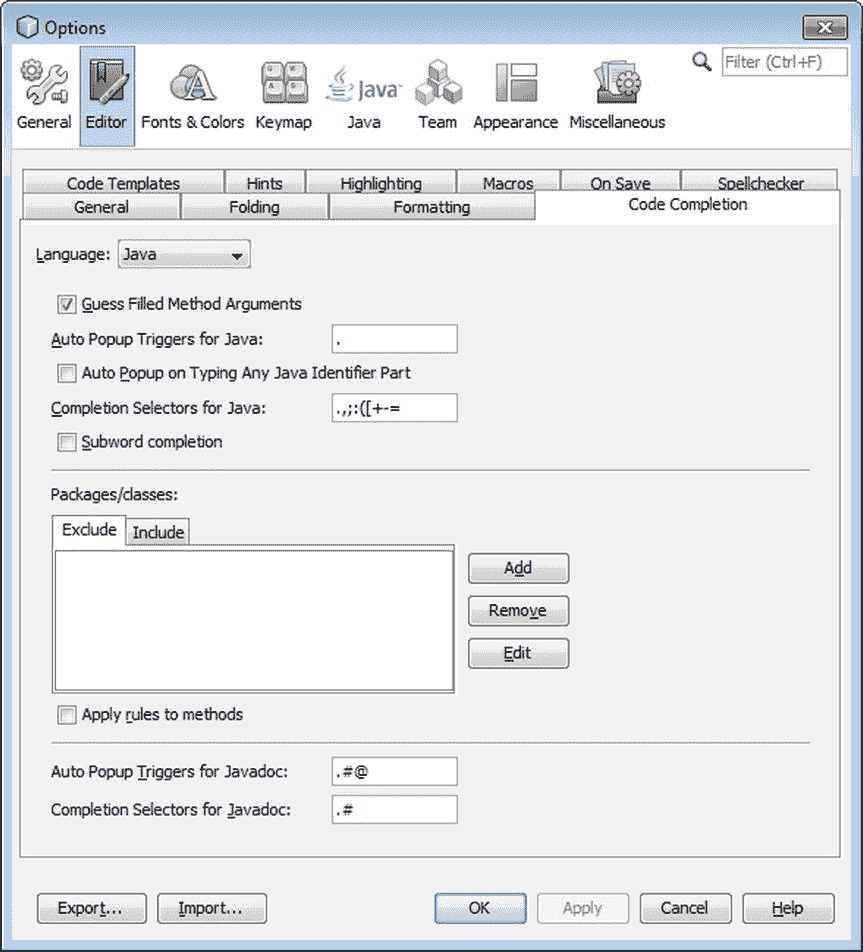

图 3-27。

Java-specific code completion in the Options window

## 模板

随着您对 IDE 越来越熟悉，您应该尽量利用它提供的许多功能。例如，如果您花一些时间了解 IDE 的许多不同种类的模板，就可以大大减少您需要键入的内容。本节介绍 IDE 的代码模板和文件模板。到这一节结束时，你应该比以前少打很多字了！

### 代码模板

当您在源代码编辑器中输入时，您可以使用代码模板来加速常用单词序列和常见代码模式的输入，例如`for`循环和字段声明。源代码编辑器附带了一组代码模板，但是您也可以创建自己的模板。

有些代码模板是由常用代码的片段组成的，比如`private static final int`。另一些是动态的，生成一个框架，然后让您轻松地通过 tab 键填充可变文本，而不必使用鼠标或箭头键将光标从一个字段移动到另一个字段。在代码段重复一个标识符的地方，比如迭代器对象，您只需要键入一次标识符名称。

这里有几个例子:

*   `newo`模板。创建新的对象实例。键入`newo`并按 Tab 键。IDE 生成`Object name = new Object(args);`，并突出显示`Object`的两次出现。然后可以键入类名并按 Tab 键。两次出现的`Object`都被更改为类名，然后选择`args`。然后，您可以填写参数并按 Enter 键，将插入点放在插入的代码的末尾。您可以使用 Shift+Tab 在参数间向后移动。您可以随时按 Enter 键跳过任何参数，直接跳到模板的末尾(或者指定填充模板参数后光标应该停留的位置)。
*   `fori`模板。您可以使用`fori`模板创建一个循环来操作数组中的所有元素。该索引被自动赋予一个在当前范围内唯一的名称(默认为`i`)。您可以手动更改该值(使 IDE 在所有三个位置更改该值),或者直接跳至`arr`键键入数组名称。如果数组在范围内，默认情况下，IDE 将使用其名称。下一次按 Tab 键时，光标停留在下一行，您可以在这里键入数组处理代码。

您可以通过以下任一方式访问代码模板:

*   代码完成框。键入代码的前几个字母，按 Ctrl+空格键，然后从“代码完成”框的列表中选择模板。模板的完整文本显示在 Javadoc 框中。
*   空格键。在源代码编辑器中直接键入代码模板的缩写，然后按空格键。您可以在键盘快捷键卡片中找到内置 Java 代码模板的缩写，该卡片在 IDE 的帮助菜单下以 PDF 文档的形式提供。如果您在代码完成框中发现了一个代码模板，该模板的缩写将出现在缩写列表的右列中。

如果缩写与您要键入的文本相同(例如，您不希望它扩展为其他内容)，请按 Shift+空格键以防止它扩展。

#### 添加、更改和移除代码模板

IDE 附带的代码模板代表了您可以使用代码模板做的事情，但它们只代表了潜在有用模板的一小部分。

您可以修改现有的代码模板并创建全新的模板，以适应您在代码中经常使用的模式。

要创建新的代码模板:

Choose Tools ➤ Options, click Editor in the left panel, and select the Code Templates tab.   Click New.   In the New Code Template window, type an abbreviation for the template and click OK.   In the Expanded Text field, insert the text for the template. See the “Code Template Syntax” section later in this chapter for information on how to customize the behavior of your templates.   Click OK to save the template and exit the Options window.  

要修改代码模板:

Choose Tools ➤ Options, click Editor in the left panel, and select the Code Templates tab.   Select a template from the Templates table and edit its text in the Expanded Text field.   Click OK to save the changes and exit the Options window.  

您不能直接更改代码模板的缩写。如果要为现有模板分配不同的快捷方式，请选择该快捷方式，复制其扩展文本，用该文本和不同的缩写创建一个新的代码模板，然后删除带有不需要的缩写的模板。

要删除代码模板，请执行以下操作:

Choose Tools ➤ Options, click Editor in the left panel, and select the Code Templates tab.   Select a template from the Templates table and click Remove.   Click OK to save the changes and exit the Options window.  

#### 代码模板语法

在代码模板中，您可以设置变量文本，为模板用户提供以下好处:

*   显示需要键入的剩余文本的描述性提示。
*   允许一次键入一个标识符，并在多个位置生成它。
*   确保为一个类添加了一个`import`语句。
*   指定代码模板的参数是其实例的类型。当模板用于插入代码时，IDE 将自动为该参数生成一个适当的值。
*   自动为迭代器设置一个变量名，确保该变量名尚未在当前作用域中使用。
*   设置一个位置，以便在生成静态文本和填充变量文本后，光标出现在生成的代码片段中。

例如，您可能希望为经常实例化的类轻松生成如下代码:

`FileWriter filewriter = new FileWriter(outputFile);`

在这种代码模板的定义中，您可以使用类似如下的内容:

`${fw type = "java.io.FileWriter"`

`editable="false"} ${filewriter} = new ${fw}(${outputFile});`

当模板插入到代码中时，会发生以下情况:

*   `${fw type = "java.io.FileWriter" editable="false"}`被转换成插入代码中的`FileWriter`。
*   `${fw}`也被转换成`Filewriter`(因为它本质上是先前定义的`${fw type = "java.io.FileWriter" editable="false"}`的简写)。
*   `${filewriter}`和`${outputFile}`生成文本(分别为`filewriter`和`outputFile`)。
*   `filewriter`被选中。您可以为该字段键入一个新名称，然后按 Tab 键选择`outputFile`并为该参数键入一个名称。然后，您可以按 Tab 或 Enter 将光标放在整个生成的代码片段之后。

您可以通过为`${outputFile}`定义一个`instanceof`属性来进一步细化代码模板(比如`OutputFile instanceof = "java.io.File"`)。这将使 IDE 能够检测该类的实例，并在生成的代码片段中动态插入实例变量的名称，而不仅仅是`outputFile`。

#### 更改代码模板的扩展器快捷方式

如果您发现代码模板妨碍了您的工作，因为在您键入某些字符串时无意中调用了它们，您可以配置 IDE 使用不同的键或组合键来激活模板。这使您能够继续使用代码模板特性，而不必单独更改任何妨碍您的模板。

要更改代码模板扩展器键，请选择“工具”“➤选项”,单击左侧面板中的“编辑器”,然后选择“代码模板”选项卡。从展开模板下拉列表中选择首选的键或组合键。单击确定保存更改并退出选项窗口。

### 文件模板

您可以自定义用来创建文件的模板。您也可以创建自己的模板，并在“新建文件向导”中提供这些模板。如果您需要在所有文件中添加标准元素，例如版权声明，或者您想要改变其他元素的生成方式，这可能会很有用，如图 [3-28](#Fig28) 所示。

图 3-28。

File templates

模板中有几个宏可以用来在创建的文件中动态生成文本。这些宏可以通过名称前后的双下划线来识别。

要编辑模板:

In the Tools menu, choose Templates. The Template Manager opens.   Expand the appropriate category node and select the template that you want to edit.   Where possible, click Open in Editor, edit the template, and then save it.  

并非模板管理器中列出的所有模板都可以在用户级别修改。在某些情况下，模板在“新建文件”向导中可用，但不代表文件结构，例如企业和 Sun 资源类别中的文件结构。

要基于另一个模板创建新的文件模板:

In the Tools menu, choose Templates. The Template Manager opens.   Expand the appropriate category node and select the template that you want to use as a starting point.   Click Duplicate.   A new node appears for the copied template. `_1` is appended to the template’s name.   Click Open in Editor.   Edit the file, incorporating any of the template macros that you want to use, and save it. If the template is for a Java class, you can use the filename for the classname and constructor name. These are automatically adjusted in the files you create from the template.  

要导入文件模板:

In the Tools menu, choose Templates. The Template Manager opens.   Select the category folder for the template.   Click Add to open the Add Template window.   Navigate to and select the file that you want to import as a template. Then click Add.  

## Java 提示

当 IDE 检测到一个它已经确定可能修复的错误，或者一个用不同方式表达代码的建议时，一个灯泡图标出现在该行的左边，如图 [3-29](#Fig29) 所示。

图 3-29。

Java hints

您可以单击灯泡或按 Alt+Enter 来显示可能的修复列表。如果其中一个修复适合您，您可以选择它并按 Enter 键，在您的代码中生成该修复。

通常，“错误”不是编码错误，而是与您没有填写丢失的代码有关。在这些情况下，编辑器提示只是自动输入某些类型的代码。其他时候，代码不是“错误的”，而是可以用不同的方式表达，因此编辑器提示建议了表达代码的替代方式。

例如，假设您刚刚输入了下面的代码，但是`x`没有在类中的任何地方定义。

`int newIntegerTransformer () {`

`return x;`

`}`

如果您的光标仍然停留在`return`语句的行上，图标将会出现。如果您单击图标或按 Alt+Enter，您将获得三种可能的解决方案。您可以选择其中一个提示来生成代码。

例如，IDE 可以为常见的编码错误提供提示并生成以下解决方案。

*   添加缺失的`import`语句。
*   插入在类的实现接口和抽象超类中声明的抽象方法。
*   插入一个`method`参数。
*   创建缺失的方法。
*   创建一个缺失字段。
*   创建一个丢失的局部变量。
*   初始化变量。
*   插入石膏。
*   添加一个带有适当例外的`throws`子句。
*   用包含适当异常的`try-catch`块包围代码。
*   To modify Java hints, choose Options from the Tools menu. In the Options window, click Editor and select Hints, as shown in Figure [3-30](#Fig30). In the Hints list, specify the hints you want to enable. In the Show As dropdown, specify the priority of the hint.

    

    图 3-30。

    Customizing Java hints

## Java 成员

Java 编辑器有专门为特定种类的 Java 成员创建的工具。

### 实现和覆盖

当您扩展一个类或实现一个接口时，您有需要实现的抽象方法，也可能有可以重写的非抽象方法。IDE 有几个工具可以帮助您在类中生成这些方法:

*   编辑提示。当您添加`implements`或`extends`子句时，左边空白处会出现一个灯泡图标。您可以单击此图标或按 Alt+Enter 查看实现抽象方法的提示。如果选择提示并按 Enter 键，IDE 将为您生成方法。只有当光标位于类声明的行中时，该提示才可用。
*   代码完成。通过按 Ctrl+空格键并从代码完成框中选择方法，可以生成要分别实现和重写的方法。

### 爪哇咖啡豆

IDE 为创建 JavaBeans 组件提供了一些级别的支持。您可以使用以下功能:

*   代码完成。当您的类中有一个字段没有对应的`get`或`set`方法时，您可以通过按 Ctrl+空格键并从代码完成框中选择方法来生成该方法。
*   重构/封装字段。您可以使用封装字段命令来生成`get`和`set`方法，更改字段的访问修饰符，并更新直接访问字段的代码以使用 getters 和 setters。
*   BeanInfo 生成器。在“项目”窗口中，可以右键单击 JavaBeans 组件，然后选择“BeanInfo 编辑器”。如果 BeanInfo 类不存在，将为您生成一个。

### 进口

当您使用 IDE 的代码完成和编辑器提示功能时，会自动为您生成`import`语句。

例如，如果打开代码完成框，开始键入简单类名而不是完全限定类名(例如，键入`Con`，然后从代码完成框中选择`ConcurrentHashMap`，下面的`import`语句将被添加到文件的开头:

`import java.util.concurrent.ConcurrentHashMap;`

如果这些机制不足以管理`import`语句，您可以使用以下命令:

*   修复导入(Alt+Shift+F)。自动为整个文件插入任何缺失的`import`语句。`import`语句是按类(而不是按包)生成的。要快速管理您的导入，请使用此命令。
*   快速导入(Alt+Shift+I)。使您能够为当前选定的标识符添加一个`import`语句或生成完全限定的类名。如果您想为整个包生成一个`import`语句，或者如果您想使用一个完全限定的内联类名而不是一个`import`语句，这个命令非常有用。

### 文档

IDE 为您提供了几种访问 JDK 和库类文档的方法。

*   要浏览源代码编辑器中当前所选类的文档，请按 Ctrl+Shift+空格键。将出现一个弹出窗口，其中包含该类的 Javadoc 文档。当您使用代码完成时，也会出现此弹出窗口。您可以通过在弹出窗口之外单击来关闭弹出窗口。
*   要打开所选类文档的 web 浏览器，请右键单击该类，然后选择“显示 Javadoc”(或按 Alt+F1)。
*   要在 web 浏览器中打开库文档的索引页面，请选择“查看➤文档索引”,然后从子菜单中选择索引。

一些库的文档与 IDE 捆绑在一起。但是，您可能需要在 IDE 中注册其他库的文档，Javadoc 功能才能工作。

矛盾的是，JDK 文档可以通过源代码编辑器中的弹出窗口获得，但默认情况下不能通过浏览器获得。这是因为源代码编辑器中的 Javadoc 弹出窗口从 JDK 附带的源代码中获取文档。但是，文档的浏览器视图需要编译的 Javadoc 文档，您必须从 JDK 单独下载。

## 格式化

当您在源代码编辑器中键入或生成代码时，默认情况下，Java 代码会以下列方式自动格式化:

*   类成员缩进四个空格。
*   连续语句缩进八个空格。
*   制表符被转换成空格。
*   左花括号与类或方法的声明放在同一行。
*   左括号前面没有空格。

如果您的文件丢失了正确的格式，您可以通过选择源➤格式(Alt+Shift+F)来重新格式化整个文件。如果选择了一行或多行，则重新格式化仅适用于这些行。如果在“项目”窗口中选择了一个节点，例如一个项目或一个包，或者多个项目、包和文件的组合，则重新格式化仅适用于这些节点的内容。

复制代码后，可以通过使用 Ctrl+Shift+V 快捷方式进行粘贴，以正确的格式插入代码。当您想要从剪贴板复制时，按 Ctrl+Shift+D 显示剪贴板内容的弹出窗口(您复制的文本的历史)，并选择您想要粘贴的项目。

如果您想要查看空格和行尾，请选择查看➤显示不可打印的字符。编辑器看起来如图 [3-31](#Fig31) 所示。

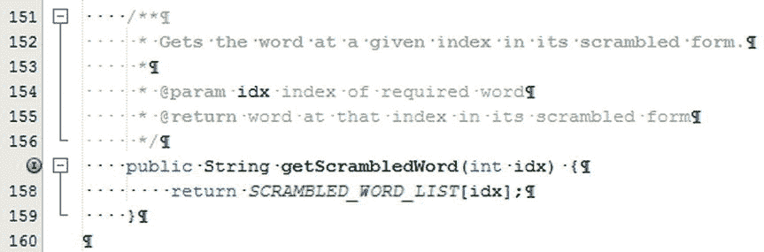

图 3-31。

Show non-printable characters

### 手动缩进代码块

您可以选择多行代码，然后通过按 Tab 或 Alt+Shift+Right 来缩进所有这些行。

您可以通过选择这些行，然后按 Shift+Tab 或 Alt+Shift+Left 来反转行的缩进。

编辑器工具栏有两个按钮，可以用来缩进和取消缩进选中的代码行，如图 [3-32](#Fig32) 所示。

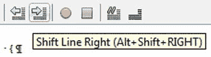

图 3-32。

Indenting blocks of code manually

### 更改格式规则

对于各种文件类型，您可以调整格式设置，例如每个制表符的空格数、花括号的位置等等。

要调整 Java 文件的格式规则，请从“选项”菜单中选择“工具”。选项窗口打开。在选项窗口中，点击编辑器，选择格式，如图 [3-33](#Fig33) 所示。在“格式”选项卡中，您可以根据自己的喜好微调设置。

图 3-33。

Changing formatting settings

## 航行

知道你在某个地方有一段代码，但是不知道它具体在哪里，这可能会非常令人沮丧。这一节向您展示了在文件和项目中快速移动的方法，以便快速有效地管理您的 Java 代码。

### 在当前 Java 文件中导航

*   IDE 提供了几个工具来简化查看和导航给定的 Java 文件:Navigator。出现在“项目”窗口下方，提供当前选定 Java 文件中的成员列表(例如，构造函数、字段和方法)。
*   书签窗口。使您能够跳回到文件中的特定位置。
*   跳转列表。使您能够在您一直工作的区域之间跳转。
*   键盘快捷键。使您能够在编辑器中滚动。
*   代码折叠。使您能够折叠代码部分(如方法体、Javadoc 注释和`import`语句块)，从而使您的类的更大部分在给定时间在窗口中可见。

#### 查看和导航类的成员

导航器提供了您的类的所有成员(构造函数、方法和字段)的列表，如图 [3-34](#Fig34) 所示。

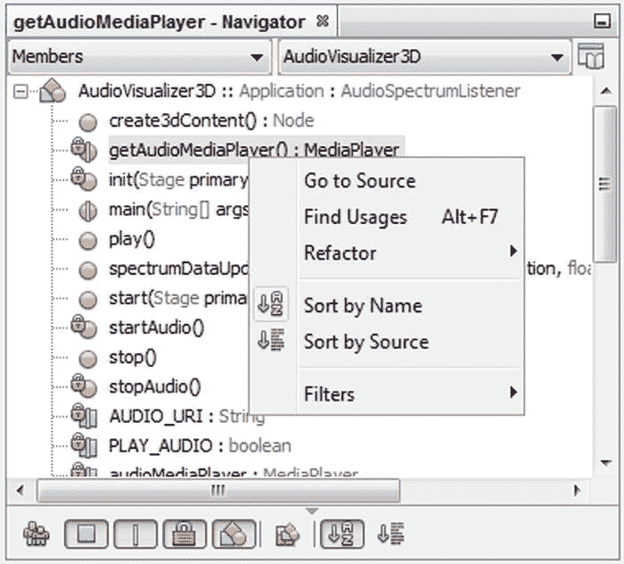

图 3-34。

Navigator

双击列表中的成员，跳转到源代码编辑器中的源代码。或者，不使用鼠标，按 Ctrl+7 将焦点放在导航窗口上。然后开始输入标识符，直到导航器找到它，并按 Enter 键在源代码编辑器中选择该标识符。

您可以使用导航器底部的过滤器按钮来隐藏非公共成员、静态成员、字段和/或继承成员。

#### 移动插入点并滚动窗口

有很多种键盘快捷键可以用来在编辑器周围快速移动插入点，即光标，而不是简单地按左右箭头键左右移动一个字符或上下箭头键上下移动一个字符，如表 [3-2](#Tab2) 所示。

表 3-2。

Cursor Movement Shortcuts

<colgroup><col> <col></colgroup> 
| 捷径 | 描述 |
| --- | --- |
| Ctrl+右(Ctrl+左) | 将插入点移动到下一个单词(上一个单词)。 |
| Ctrl+Home (Ctrl+End) | 将插入点移动到文件的顶部(底部)。 |
| 主页(结束) | 将插入点移动到语句的开头(结尾)。 |
| Ctrl+向上(Ctrl+向下) | 向上(向下)滚动，不移动插入点。 |
| Alt+Shift+Home/End/Insert | 滚动窗口，使当前行移动到窗口的顶部、底部或中部，而不移动插入点。 |
| Ctrl+[ | 将插入点移动到与插入点前面的括号、中括号或大括号相匹配的位置。 |

#### 自定义代码折叠

您可以在文件中设定书签，以便于找到您经常使用的项目区域。然后，您可以通过按 Ctrl+Shift+句点(下一个书签)或 Ctrl+Shift+逗号(上一个书签)来循环浏览所有书签。

若要为文件中的某一行添加书签，请单击该行并按 Ctrl+Shift+M。若要删除书签，也可以使用 Ctrl+Shift+M。

您可以通过选择窗口➤ IDE 工具➤书签来打开书签窗口。或者，通过 Ctrl+Shift+句点和 Ctrl+Shift+逗号在书签中循环时，选择弹出菜单中的最后一项。书签窗口显示所有应用程序中的所有书签，使您能够创建一个简单的路径来浏览您正在使用的应用程序的相关部分，如图 [3-35](#Fig35) 所示。

图 3-35。

Bookmarks window

#### 隐藏代码段

您可以折叠(或“折叠”)代码底层细节，以便在源代码编辑器中只能看到代码块中的一行，从而留出更多空间来查看其他行。方法、内部类、`import`块和 Javadoc 注释都是可折叠的。

可折叠的代码块在代码块第一行旁边的左边界标有减号图标。块的其余部分用从图标向下延伸的垂直线标记。折叠的块标有加号图标。您可以点击其中一个图标来折叠或展开它所代表的特定块，如图 [3-36](#Fig36) 所示。

图 3-36。

Hiding sections of code

还可以使用键盘快捷键和源代码编辑器中的“查看➤代码折叠”菜单和“代码折叠”子菜单中的菜单项折叠和展开单个或多个代码块。表 [3-3](#Tab3) 列出了相关的命令和快捷键。

表 3-3。

Code Folding Shortcuts

<colgroup><col> <col></colgroup> 
| 捷径 | 描述 |
| --- | --- |
| ctrl+numpad-减号 | 折叠褶皱 |
| ctrl+numpad 组合键 | 展开折叠 |
| ctrl+Shift+数字小键盘-减号 | 全部折叠 |
| ctrl+shift+numpad 组合键 | 全部展开 |

#### 用书签标记代码行

默认情况下，您编写的任何代码都不会被折叠。您可以将源代码编辑器配置为在创建文件或打开以前未打开的文件时默认折叠 Java 代码。

要将 IDE 配置为自动折叠 Java 代码的某些元素，请从“选项”菜单中选择“工具”。选项窗口打开。在选项窗口中，点击编辑器，选择折叠，如图 [3-37](#Fig37) 所示。在“折叠”选项卡中，选择默认情况下要折叠的元素的复选框。您可以从类成员中进行选择，如方法、内部类、`imports`、Javadoc 注释和初始注释。

图 3-37。

Changing folding settings

### 从源代码编辑器导航

IDE 包括在文件、不同代码和不同窗口之间导航的快捷方式。你在工作流程中使用的快捷键越多，你的手指就越少会离开键盘去使用鼠标。

#### 在打开的文件之间切换

除了使用源代码编辑器的选项卡和下拉列表，您还可以使用键盘快捷键在打开的文件之间切换。

*   Ctrl+Tab. Opens a popup showing all open files, as shown in Figure [3-38](#Fig38). Hold down the Ctrl key and press the Tab key multiple times until the file that you want to view is selected. Then release both keys to close the box and display the file.

    

    图 3-38。

    Popup switcher
*   Shift+F4\. Opens a dialog box that lists all open files, as shown in Figure [3-39](#Fig39). You can use the mouse or the arrow keys to select the file that you want to view and press Enter to close the dialog box and display the file.

    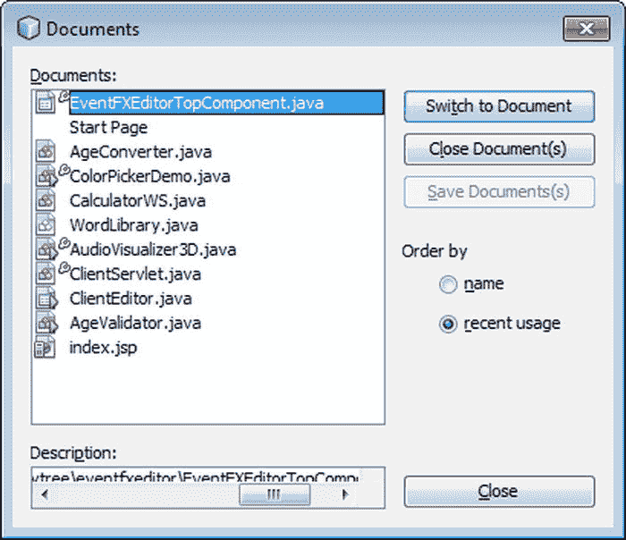

    图 3-39。

    Document switcher

#### 跳转到相关代码和文档

下面列表中的快捷方式使您能够跳转到当前文件的某些部分或与所选标识符相关的其他文件。这些快捷方式中的前六个可以从源代码编辑器的上下文(右键单击)菜单的导航菜单和转到子菜单中找到。Show Javadoc 命令可以直接从源代码编辑器的上下文菜单中获得。

*   Alt+O(或 Ctrl 单击)。如果源代码可用，跳转到当前选定的类、方法或字段的源代码。要实现这一点，可以在选定标识符的情况下按 Alt+O，或者按住 Ctrl 键，将鼠标悬停在标识符上，直到它带有蓝色下划线，然后单击它。
*   跳转到当前选定的类、方法或字段的声明。
*   Ctrl+B. Go to Super Implementation 跳转到当前所选方法的超级实现(如果所选方法重写了另一个类中的方法或者是接口中定义的方法的实现)。
*   跳转到当前文件中的特定行号。
*   “转到类”使您能够键入类名，然后跳转到该类的源代码(如果 IDE 有该源代码)。
*   跳转到所选类的单元测试。
*   Alt+F1。Show Javadoc 在 web 浏览器中显示选定类的文档。要使此命令生效，必须通过 Java 平台管理器(对于 JDK 文档)或库管理器(对于其他库的文档)使类的 Javadoc 对 IDE 可用。

#### 在你工作的区域之间跳跃

当您一次处理多个文件或在同一个文件的不同区域工作时，您可以使用编辑器工具栏中的跳转列表按钮，如图 [3-40](#Fig40) 所示，直接导航到您一直工作的区域，而不是滚动和/或切换窗口。

图 3-40。

Jump List buttons

跳转列表本质上是你在源代码编辑器中完成的代码行的历史，如图 [3-41](#Fig41) 所示。

图 3-41。

Expanded Jump List

#### 从源代码编辑器跳转到文件的节点

当您在源代码编辑器中键入时，可以跳转到其他窗口中表示当前文件的节点。例如，如果您想要快速导航到同一包中的另一个文件，或者想要浏览当前文件的版本信息，这可能会很有用。

*   Ctrl+Shift+1。在“项目”窗口中选择当前文件的节点。
*   Ctrl+Shift+2。在“文件”窗口中选择当前文件的节点。
*   Ctrl+Shift+3。在“收藏夹”窗口中选择当前文件的节点。

## 搜索和替换

有不同类型的搜索可用于不同类型的需求。根据您要执行的活动类型，您可以使用搜索/替换工具的不同方面，这里将对每个方面进行描述。

*   查找用法命令。在项目中查找类、方法或字段的标识符的匹配项。
*   重命名命令。在整个项目中重命名类、方法或字段。
*   文件中的 Ctrl+F。在打开的文件中查找并替换特定的字符组合。
*   在项目上按 Ctrl+F。根据文件中的字符、文件名中的字符、文件类型和/或日期查找符合搜索条件的文件。

### 寻找用法

当您在源代码编辑器中工作时，您可以通过使用 Find Usages 命令快速找到当前所选类、方法或字段名的给定 Java 标识符在项目中的使用位置，该命令会显示 Find Usages 窗口，如图 [3-42](#Fig42) 所示。

图 3-42。

Find Usages window

要显示“查找使用实例”窗口以查找代码中出现的特定标识符，请在源代码编辑器中启动。然后将插入点/光标移动到要查找其出现的类、方法或字段名。然后按 Alt+F7。或者，您可以在编辑器中单击鼠标右键，然后选择“查找用法”。另一种开始查找使用实例的方法是，在“编辑”菜单中，选择“查找使用实例”。在“查找使用实例”窗口中，指定诸如是否应在注释中执行搜索之类的设置，然后单击“查找”。

Find Usages 对文本编辑器中的 Find 命令进行了改进，它对 Java 语言上下文中文本的相关性很敏感。

根据您选择的标识符种类以及您在“查找使用实例”窗口中选择的选项，“使用实例”窗口会出现在 IDE 的底部并显示您的结果，如图 [3-43](#Fig43) 所示。

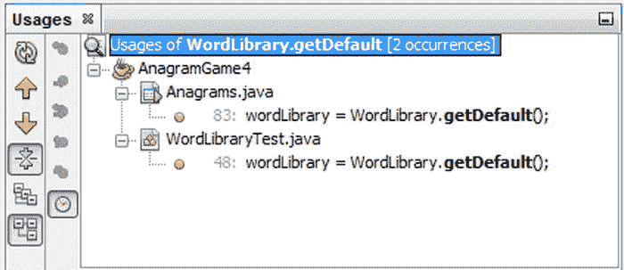

图 3-43。

Usages results

“使用实例”窗口显示包含以下项目组合的语句，具体取决于标识符:

*   类和接口。类或接口的方法或变量的声明，类型的用法，例如在创建新实例、导入类、扩展类、实现接口、转换类型或引发异常时，类型的方法或字段的用法，以及子类型。
*   方法。方法和任何重写方法的调用。
*   字段。获取或设置字段的值。
*   评论。引用标识符的任何注释。

通过双击“使用实例”窗口中的“出现次数”行，可以导航到类、方法或字段名称的给定出现次数。

### 重新命名

如果你想重命名一个类、方法或字段，你可以使用重构➤重命名命令，将项目中所有出现的标识符更新为新名称，如图 [3-44](#Fig44) 所示。

图 3-44。

Rename window

与标准的搜索和替换操作不同，Rename 命令对代码的 Java 上下文敏感，这使得它更容易使用，也更可靠。此外，使用 Rename 命令，您可以预览将要进行的更改，使您能够取消选择项目以防止特定事件的重命名，如图 [3-45](#Fig45) 所示。

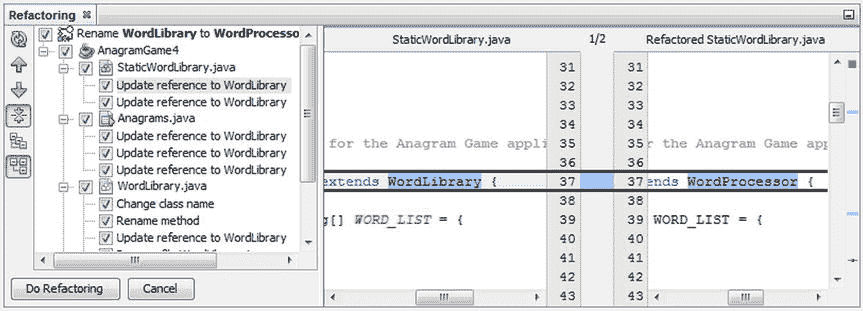

图 3-45。

Refactoring preview

要重命名类、方法或字段名称，请在源代码编辑器中启动。将插入点移动到代码中要重命名的类、方法或字段名处。按 Ctrl+R 或右键单击，然后在“重构”菜单中选择“重命名”。在“重命名”对话框中，键入元素的新名称。如果您想更改注释中出现的名称，请选中“在注释中应用名称”复选框。在重命名窗口中，单击下一步。如果您取消选择了“预览所有更改”复选框，更改会立即应用。如果保持选中“预览所有更改”复选框，将出现“重构”窗口，并预览更改。

在出现在 IDE 底部的“重构”窗口中，验证设置为要更改的事件。如果您不想更改某个事件，请取消选择该行的复选框。单击执行重构以应用更改。如果您后来发现重构产生了一些您想要逆转的后果，您可以按 Ctrl+Z 或从“编辑”菜单中选择“撤消”。

通过在“项目”窗口中内联重命名，可以启动重命名类或接口的过程。通过在要重命名的节点上键入 Ctrl+R，可以做到这一点。

### 发现

如果您想快速找到文件中的字符组合，请在您想要搜索的文件中单击，选择编辑➤查找(Ctrl+F)，并在查找窗口中键入您想要查找的文本，该窗口集成在编辑器的底部，如图 [3-46](#Fig46) 所示。

图 3-46。

Integrated Find window

使用“查找”对话框的一些提示:

*   在“查找”对话框中，通过按 Alt+G 或单击“正则表达式”按钮，可以使用正则表达式作为搜索条件。
*   与“查找用法”命令不同，“查找”命令允许您搜索部分单词，进行区分大小写的搜索(按 Alt+C 或单击“区分大小写”按钮)，并突出显示当前文件中的匹配项(按 Alt+H 或单击“突出显示匹配项”按钮)。
*   您可以通过按 F3(下一个匹配项)和 Shift+F3(上一个匹配项)在搜索字符串的匹配项之间跳转。
*   若要选择光标所在的单词并开始搜索该单词的其他匹配项，请按 Ctrl+F3。

### 取代

找到你要找的东西通常只是一项任务的开始。通常情况下，您需要替换已经找到的代码。本节将帮助您完成这项任务。

要搜索和替换文本，单击适当的文件，按 Ctrl+H，并填写查找内容和替换为字段，如图 [3-47](#Fig47) 所示。

图 3-47。

Integrated Replace window

### 其他文件搜索

如果您想在多个文件中搜索某个特定 Java 标识符以外的内容，您可以使用查找和在项目中查找命令，如图 [3-48](#Fig48) 所示。

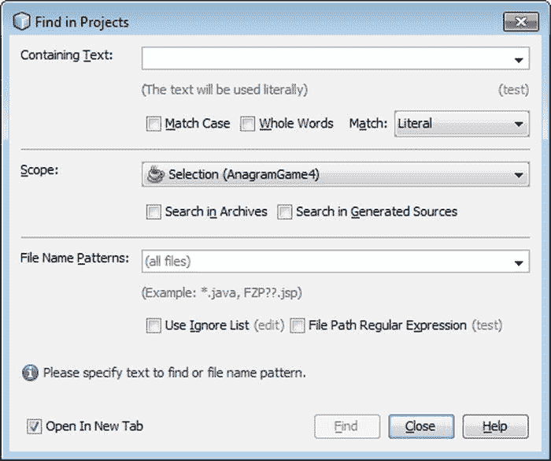

图 3-48。

Find in Projects window

这些命令使您能够在文件夹、项目或所有项目中搜索文件。

这些命令可以基于以下标准类型的任意组合:

*   匹配文件中文本的子字符串或正则表达式
*   匹配文件名上的子字符串或正则表达式
*   文件的修改日期
*   文件类型

要启动这样的文件搜索，请在“编辑”菜单中选择“在项目中查找”,以搜索所有打开的项目中的所有文件。或者，在“项目”窗口中，右键单击要搜索的文件夹或项目的节点，然后选择“查找”(或按 Ctrl+F)。还有一种方法是在“文件”窗口中右键单击文件夹，然后选择“查找”(或按 Ctrl+F)。

启动搜索后，根据需要填写任意数量的搜索标准。在“查找”或“在项目中查找”窗口中输入条件并单击“搜索”后，搜索结果将显示在“搜索结果”窗口中，并显示每个匹配文件的节点。对于全文搜索，可以展开这些节点以显示匹配文本出现的单独行。您可以双击匹配项，在源代码编辑器中打开该文件(如果是全文匹配项，则跳转到匹配项所在的行)。

按 Ctrl+F 或选择“编辑➤查找”(或“在项目中编辑➤查找”)时出现的对话框取决于哪个 IDE 窗口具有焦点。如果选择了源代码编辑器，则会出现集成在单个文件底部的“查找”对话框。如果在“项目”窗口(或其他树视图窗口之一)中选择了一个节点，则会打开用于在多个文件中搜索的对话框。

## 跟踪笔记

IDE 有一个“操作项”窗口，为您提供了一种在代码中编写注释，然后在一个集中的位置查看所有这些注释的方法。为了给自己写一个笔记，也称为“行动项目”，你可以在代码的任何地方使用像`XXX`或`TODO`这样的模式。

当清理代码中的松散部分时，你可以使用 action items 窗口作为操作的中心，如图 [3-49](#Fig49) 所示，它为你列出了所有的 Action Items。

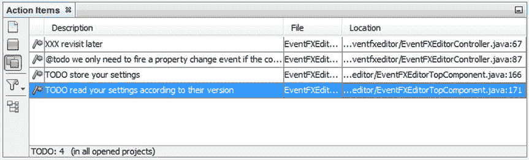

图 3-49。

Action Items window

如果某行“标记有”(包含)以下任何文本，则该行将显示在任务列表中。

当您在代码中键入这些标记之一时，它必须作为一个完整的单词键入，以便 IDE 能够识别它。例如，如果您没有在标签和注释之间添加空格，注释将不会出现在“操作项”窗口中。

要查看“操作项”窗口，请选择“窗口”“➤操作项”(或按 Ctrl+6)。

显示“操作项”窗口后，您可以通过单击“操作项”窗口左侧的相应按钮来查看当前文件、所有打开的文件或特定文件夹的任务。

通过单击相应的列标题，可以按任务、位置或优先级对任务列表项进行排序。有关显示“优先级”列的信息，请参阅本章后面的“按优先级显示任务”。

双击任务列表中的条目，可以直接跳到代码中编写注释的那一行。

### 添加、删除和更改行动项目标签

要更改用于“操作项”窗口的标签，请从“选项”菜单中选择“工具”。选项窗口打开。点击团队，选择行动项目，如图 [3-50](#Fig50) 所示。在“措施项”标签中，使用“添加”、“编辑”和“删除”按钮来修改措施项列表的内容。

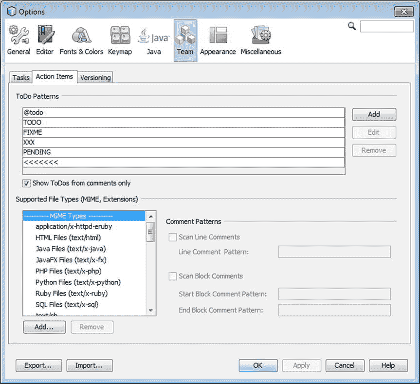

图 3-50。

Customizing action items

### 过滤行动项目

您可以通过创建和使用过滤器来进一步限制“措施项”窗口中显示的条目。使用过滤器时，只显示符合过滤器指定条件的条目。标准包括需要出现在注释中的文本、任务的优先级和/或文件名。

要创建过滤器，在行动项窗口左侧的过滤器下拉菜单中点击编辑，如图 [3-51](#Fig51) 所示。在“编辑过滤器”对话框中，单击“新建”按钮，然后在“名称”字段中键入过滤器的名称。详细填写。或者，在“关键字”选项卡中添加附加条件，然后填写过滤器的详细信息。您可以使用对话框顶部的单选按钮选择让过滤器匹配所有或任何标准。

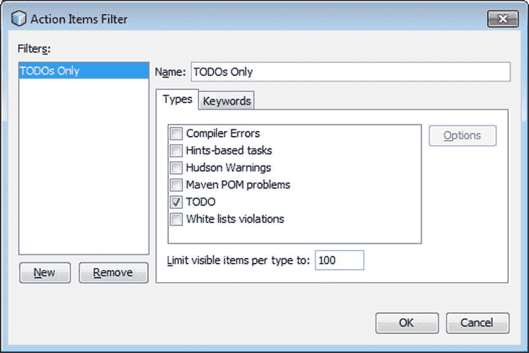

图 3-51。

Action Items Filter window

新定义的过滤器条目会出现在待办事项窗口工具栏中“操作项”窗口左侧的过滤器下拉列表中。