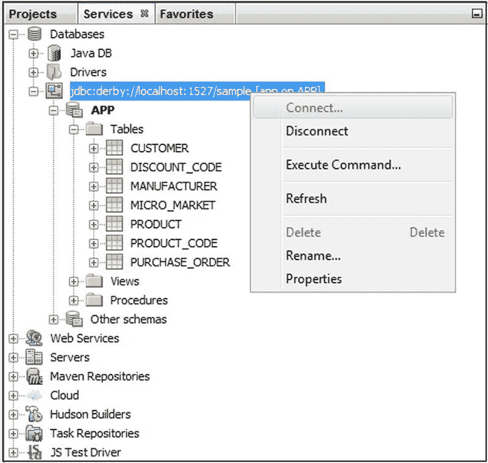
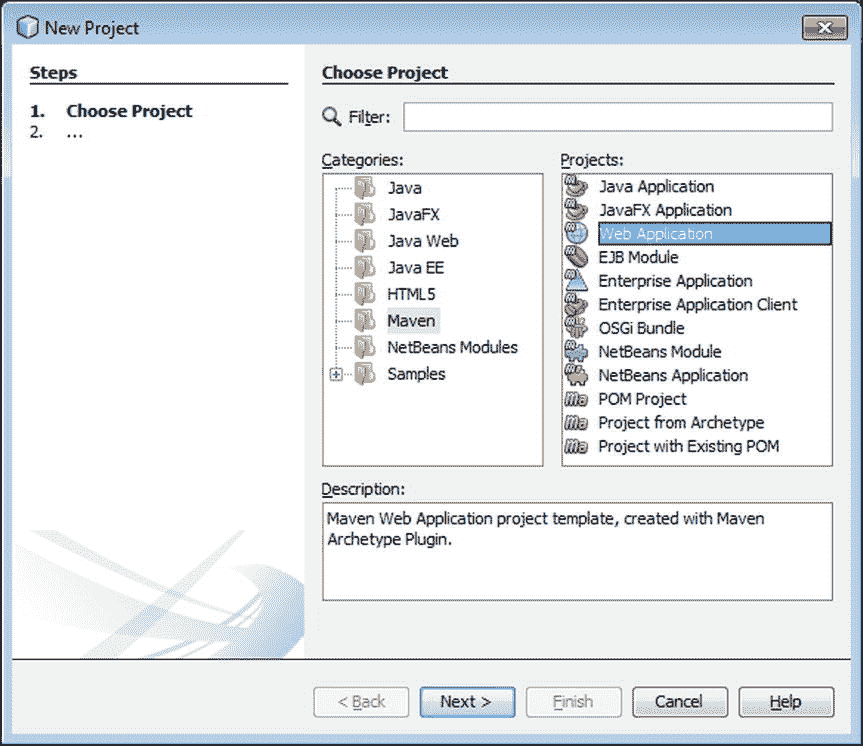
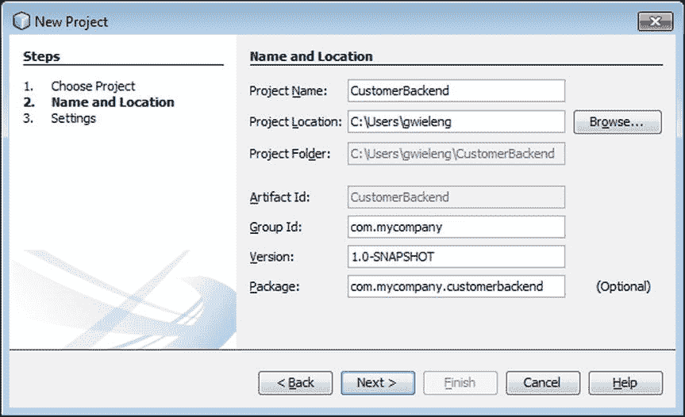
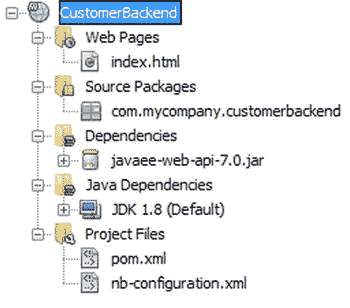
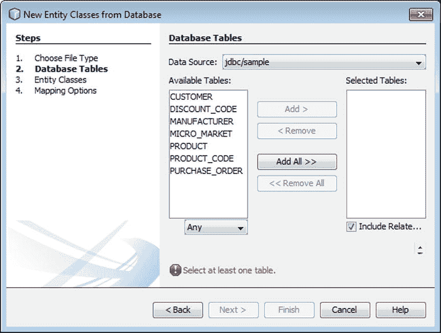
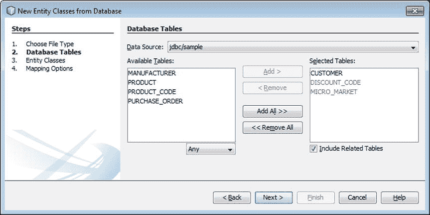
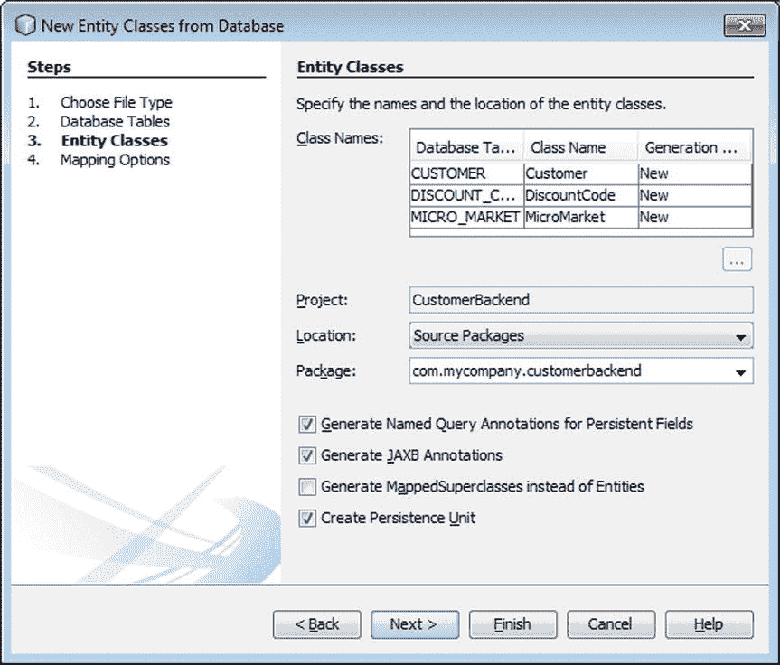
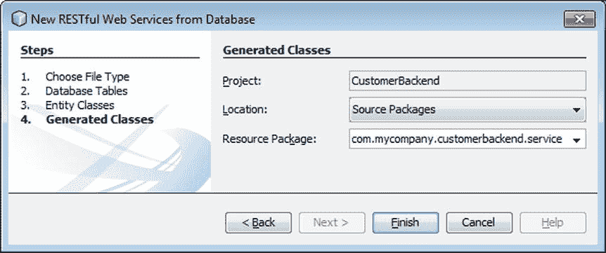
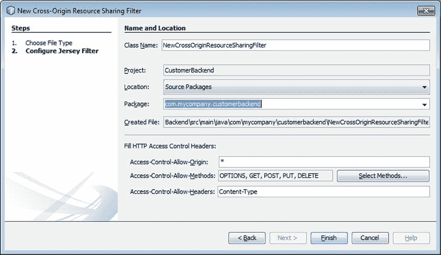
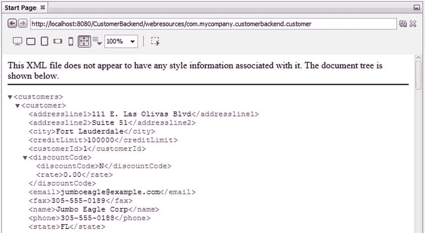

# 五、将碎片拼在一起

> NetBeans provides comprehensive and complete end-to-end support for Java EE platform. Happily develop, deploy, debug and analyze your Java EE application on multiple application servers! —— —Arun Gupta, Director of Technology Marketing and Developer Rights of Red Hat

在这一章中，你要做一些工作！前几章向您介绍了在 NetBeans IDE 中开始 Java 开发所需要了解的一切，而本章提供了一系列步骤，您可以通过这些步骤将各个部分组合在一起，用 IDE 创建一个真正的应用。

本章开始时，您需要设置一些工具和技术，比如服务器和数据库，您将需要这些工具和技术来为您将要创建的应用提供服务并提供其数据。随后，您将创建 JPA 实体类，它代表数据库中的表。JPA 实体类将从您的数据库中生成，换句话说，您将看到 IDE 中的工具帮助您避免将代码放在一起的复杂性。很多都是可以自动化的，事实上，只要可能，任何可以自动化的东西都是由 IDE 自动化的。一旦有了 JPA 实体类，您将学习如何将它们作为 RESTful Web 服务公开，以及如何在基于 JSF 的前端和 JavaScript 前端使用它们。

到本章结束时，你将具备创建任何类型的实际应用所需的所有技能和理解，特别是当你需要为需要部署到浏览器的应用这样做时。

## 安装

在本节中，您将学习如何连接到数据库并启动应用服务器。

从服务窗口(Ctrl+3)开始，在这里可以注册数据库服务器，连接到数据库，并根据需要修改数据。在这种情况下，对于您正在处理的场景，请连接到 Sample 数据库，这是一个 Derby 数据库，包含在 NetBeans IDE 的 Java EE 发行版中。在服务窗口中，展开数据库节点，右键单击`jdbc:derby`节点，然后单击连接。IDE 将连接到示例数据库。

图 [5-1](#Fig1) 显示了扩展了数据库节点的服务窗口。IDE 已经连接到示例数据库，因此它的表在 IDE 中是可见的。

图 5-1。

Sample database started from the IDE

接下来，让我们设置应用服务器。

再次在“服务”窗口(Ctrl+3)中，展开“服务”节点以查看可用的应用服务器。始终确保您将要使用的应用服务器支持您想要使用的技术和技术版本。在本章中，您将向 GlassFish 部署一个 Java EE 应用。在撰写本文时，GlassFish 的当前版本是 4.1，而 Java EE 的当前版本是 Java EE 7。GlassFish 4.1 支持 Java EE 7，因此，这种组合是 Java EE 应用的坚实基础。

GlassFish 与 IDE 捆绑在一起。因此，当您安装 IDE 时，应该已经安装了 GlassFish。

右键单击 GlassFish 节点，然后选择“启动”。输出窗口(Ctrl+4)显示了启动过程的输出。当服务器正在运行时，您应该会看到一个绿色箭头图标，并且应该能够展开节点并看到应用和资源子节点。当一个应用被部署到 GlassFish 时，您应该会看到一个新节点被添加到 Applications 节点中。这个新节点将已部署的应用可视化，并允许您在右键单击该节点并选择“取消部署”后取消部署它。

图 [5-2](#Fig2) 显示了服务器节点展开且 GlassFish 服务器正在运行的服务窗口。

图 5-2。

GlassFish application server started from the IDE

既然数据库和应用服务器已经可用并启动，那么让我们创建并部署 Java EE 后端。

## 创建 Java EE 服务器应用

Java EE 是一个社区驱动的基于规范的平台，它提供了在 Java 平台上创建企业应用的工具和技术，主要用于部署到浏览器。在本节中，您将创建一个 Java EE 应用，它利用了与通过 web 服务访问数据库和公开数据相关的 Java EE 规范。

让我们从设置一个新的 Java EE 应用开始。Java 应用事实上的标准构建系统是 Maven，它在 IDE 中得到方便的支持，您将在下面的步骤中看到这一点。

To get started creating the application, go the New Project window, which you can do via File ➤ New Project or by clicking Ctrl+Shift+N. In the New Project window, choose Maven ➤ Web Application, as shown in Figure [5-3](#Fig3).

图 5-3。

Getting started creating a Maven-based Java EE application   When you click Next, the “Name and Location” step of the wizard, shown in Figure [5-4](#Fig4), enables you to fill in Maven-specific settings. Aside from the name of the project and its location, you’re prompted to specify the group ID, version, and optionally a package name, which will be treated as the main package of the application that will be created.

图 5-4。

Maven settings for Maven-based Java EE application   Note

Maven 组 ID 是一个组织设置；通常你会把你的网站的 URL 反过来，这样如果你的网站是`mycompany.com`，组 ID，以及包设置，就会以`com.mycompany`开始。这将为应用的基本结构创建一个唯一的标识符或命名空间。

After clicking Next, select the application server to which the application will be deployed, as well as the Java EE version to which its artifacts and structure will comply; see Figure [5-5](#Fig5). Wizards and templates in the IDE will generate code conforming to the selected Java EE version. Here, choose GlassFish and Java EE.

图 5-5。

Server name and Java EE settings for Maven-based Java EE application  

当您单击 Finish 时，应用结构及其初始内容被创建并显示在 IDE 的 Projects 窗口中，如图 [5-6](#Fig6) 所示。

图 5-6。

Newly created Maven-based Java EE application

花点时间探索 IDE 提供的与 Maven 相关的工具。例如，当您打开 POM ( `pom.xml`)文件时，您会注意到多个选项卡，包括一个图表视图。当您打开导航器(Ctrl+7)时，您会注意到一个 Maven 目标列表，它是在 POM 中定义的，您可以右键单击来执行它。当您转到项目的项目属性窗口中的 Action 选项卡时，您可以将 Maven 目标绑定到项目命令，例如 Build 和 Run，您可以通过键盘快捷键调用它们。

现在您已经创建了 Java EE 后端的结构和初始内容，您已经准备好从示例数据库生成 JPA 实体类，这是您在本章前面设置的。

## 生成 JPA 实体类

Java 持久性 API (JPA)规范专注于简化和标准化数据访问。通过定义应用和它需要访问的数据库之间的连接，这是通过诸如 Java 注释和称为“持久性单元”的一致 XML 文件之类的工具来实现的。IDE 通过允许您从数据库中的表生成 JPA 实体类，进一步简化了 JPA 规范，您将在本节中发现这一点。

在新建文件窗口中，可以通过文件➤新建文件或 Ctrl+N 访问，从数据库中选择持久化➤实体类，如图 [5-7](#Fig7) 所示。

图 5-7。

Generating JPA entity classes from a database

还要注意，新文件窗口中的持久性类别提供了许多其他文件生成器。例如，如果您想要将您的数据公开为 RESTful Web 服务，请在图 [5-7](#Fig7) 所示的窗口中选择 RESTful Web 服务 from Database，因为这将在一个进程中同时生成您的 JPA 实体类和 RESTful Web 服务。同时，将创建一个永久单元。注意，也可以通过持久性单元模板单独创建持久性单元，如图 [5-7](#Fig7) 所示。

点击下一步，选择一个数据源，在本场景中为`jdbc/sample`，数据源中的可用表会列在可用表列表中，如图 [5-8](#Fig8) 所示。

图 5-8。

Available tables in selected data source

请注意，表格列表与图 [5-1](#Fig1) 中所示的表格列表相匹配。换句话说，在 IDE 中设置数据库连接时可以访问的表可以在“从数据库新建实体类”向导的“数据库表”步骤中找到。

要选择要在应用中使用的表，请在可用表列表中选择它们，然后单击添加。这将把它们移动到数据库表窗口右侧的已选表列表中，如图 [5-8](#Fig8) 和 [5-9](#Fig9) 所示。

图 5-9。

Tables with foreign key relationships automatically included

在本场景中，选择`CUSTOMER`并点击添加。这将把`CUSTOMER`表移动到数据库表窗口的选定表列表中。

如图 [5-9](#Fig9) 所示，具有外键关系的表被自动选中。

当你点击下一步，你移动到实体类步骤，如图 [5-10](#Fig10) 所示。“新建实体类”步骤在顶部显示“类名”列表，向您显示所选的表，以及 IDE 自动生成 JPA 实体类以访问相关表中的数据时将使用的类名。

图 5-10。

Entity Classes step in New Entity Classes from Database wizard

此外，如果该类已经存在，如图 [5-10](#Fig10) 所示，生成列显示“更新”，而不是“新建”，通知您 IDE 将在“从数据库新建实体类”向导的末尾用新的 JPA 实体类覆盖现有的 JPA 实体类。

请注意，默认情况下会选中几个复选框，因此 IDE 会自动为持久性字段、JAXB 注释和持久性单元生成命名查询。

虽然你可以在这里点击完成，如图 [5-10](#Fig10) 所示，但是你也可以点击下一步来微调设置，使生成的代码完全符合你的要求，如图 [5-11](#Fig11) 所示。

图 5-11。

Fine-tuning the settings to define the code to be generated

当您单击“完成”时，会根据您在向导的前面步骤中提供的设置生成 JPA 实体类。

默认情况下，持久化单元也被创建，如图 [5-12](#Fig12) 所示。

图 5-12。

Generated JPA entity classes, with related dependencies and persistence unit

基于 Maven 的应用需要访问的所有依赖关系都在 POM 中注册，并在 dependencies 节点中可视化，如图 [5-12](#Fig12) 所示。

现在您已经有了 JPA 实体类，您可以使用 IDE 中的各种工具来访问您的数据库并对相关数据做一些事情。

## 向前端客户端公开数据

IDE 提供了支持多种技术的工具，在提供对 JPA 实体类中数据的访问时，您可以使用这些技术。

*   从实体类生成 JSF 页面。
*   从实体类生成 RESTful Web 服务。
*   从 RESTful Web 服务生成 RESTful JavaScript 客户端。

### 从实体类生成 JSF 页面

IDE 提供了在 JPA 实体类上创建 JSF 页面的工具。此外，JSF 页面可以使用流行的 PrimeFaces 组件库，对它的支持直接集成到了 IDE 中。

In the IDE, open the New File window (Ctrl+N) and choose Web ➤ JSF Pages from Entity Classes.   Click Next, select the entity classes for which you would like to create JSF pages, and click Next again.   Figure [5-13](#Fig13) is shown. Specify the templates you would like to use, which can be standard JSF pages or JSF pages that use the PrimeFaces component library.

图 5-13。

Generating PrimeFaces pages from entity classes  

请注意，您可以自定义模板。例如，您可能希望更改它们，以便在 IDE 创建 JSF 页面时使用您的样式准则和公司徽标。如果要创建的文件已经存在，您可以通过覆盖现有文件复选框覆盖它们，如图 [5-13](#Fig13) 所示。

Click Next, configure JSF as needed, and click Finish.  

现在，IDE 将使用您在“从实体类新建 JSF 页面”向导中定义的模板和其他设置来创建您的 JSF 页面。

### 从实体类生成 RESTful Web 服务

您可以通过 RESTful Web 服务公开数据，而不是自己创建前端。RESTful Web 服务(JAX-RS)是 Java EE 平台的一部分，就像 JPA 一样。任何客户机都可以访问通过 RESTful Web 服务公开的 XML 或 JSON 有效负载，解析有效负载，并根据需要进行处理。

例如，您可以通过解析 RESTful Web 服务提供的有效负载，为移动设备(如 iOS 或 Android)创建一个前端。通常，您将创建一个响应式设计，通过它，相同的代码库被用于为不同的设备创建不同的用户体验。所有这些活动的起点是创建 RESTful Web 服务，通过 JPA 实体类访问您的数据。

IDE 使得创建 RESTful Web 服务变得很简单。

In the IDE, open the New File window (Ctrl+N) and choose Persistence ➤ RESTful Web Services from Entity Classes.   Click Next, select the entity classes for which you would like to create RESTful Web Services, and click Next again.   Figure [5-14](#Fig14) is shown, enabling you to specify where the RESTful Web Services will be created.

图 5-14。

Generating RESTful Web Services from entity classes  

当您单击 Finish 时，RESTful Web 服务将在指定的包中创建，同时还有一个`ApplicationConfig`类，它使用`javax.ws.rs.ApplicationPath`注释来指定应用的 URL 子根，后面是您使用向导生成的每个 RESTful Web 服务的路径。

### 从 RESTful Web 服务生成 RESTful JavaScript 客户端

另一种方法是创建一个 JavaScript 前端。尽管 JavaScript 不是本书的重点，但在 IDE 中创建的 JPA 实体类之上创建 JavaScript 前端是多么容易，这是值得一试的。

在开始创建您的 JavaScript 客户端之前，您需要有一个 HTML5 项目，也就是一个单独的新项目，它为 HTML5/JavaScript 应用提供支持。

In the IDE, choose File ➤ New Project (Ctrl+Shift+N) and then choose HTML5 ➤ HTML5 Application.   For purposes of this scenario, click Next and then click Finish. You now have the basis of a new HTML5 application that has support for technologies such as HTML, JavaScript, and CSS.   In the IDE, choose File ➤ New File (Ctrl+N), which brings up the New File window. In the New File window, choose HTML5 ➤ RESTful JavaScript Client and click Next.   Figure [5-15](#Fig15) is shown, where you can browse to the RESTful Web Service for which you would like the IDE to create a JavaScript client. By default, the IDE will use the `Backbone.js` framework to design the JavaScript frontend, although plugins exist for generating an AngularJS or KnockoutJS frontend, instead.

图 5-15。

Generating a RESTful JavaScript client from RESTful Web Services   Since you will be interacting with the backend from a different domain in your frontend, you will need a cross-origin resource sharing filter, which the IDE can create for you, as shown in Figure [5-16](#Fig16). This is done in the New File window, via Web Services ➤ Cross-Origin Resource Sharing Filter. Create this filter in your Java EE application, so that your JavaScript frontend will be able to access and use its payload.

图 5-16。

Creating a cross-origin resource-sharing filter  

## 部署应用

现在您已经有了后端和前端，是时候看看您的应用在运行了！例如，当您部署 RESTful Web 服务时，在浏览器中查看有效负载可能会有所帮助，如图 [5-17](#Fig17) 所示。确保 URL 正确无误，如图所示。它由基本 URL、应用配置类和您想要公开的 web 服务的路径构成。

图 5-17。

Seeing the payload in the browser

通过访问这个 URL，任何客户端都可以解析有效负载，并构建一个允许用户访问和操作底层数据的用户界面。

您可能不想部署 RESTful Web 服务，而是希望通过您创建的前端公开您的数据。默认情况下，使用`Backbone.js`框架的 JavaScript 前端显示如图 [5-18](#Fig18) 所示。用户可以查看并更改数据。部署的应用提供完整的 CRUD 特性，也就是说，用户可以创建、读取、更新和删除底层数据。请注意，您不必为支持这一基本功能而向应用添加任何代码。

图 5-18。

Deployed JavaScript front-end displaying Java EE payload

最后，当您在“服务”窗口中查看“服务器”节点时，您应该看到 Java EE 后端应用已经部署，如图 [5-19](#Fig19) 所示。如果需要，右键单击已部署的节点以取消部署应用。

图 5-19。

Deployed application shown in Services window

在本章中，您已经学习了在 IDE 中构建连贯的功能性应用的完整而真实的用例。