# 一、乐高MindStorm和 leJOS 简介

Electronic supplementary material The online version of this chapter (doi:[10.​1007/​978-1-4842-2005-4_​1](http://dx.doi.org/10.1007/978-1-4842-2005-4_1)) contains supplementary material, which is available to authorized users.

本章提供了如何使用乐高MindStorm EV3 公司建立 Java 机器人编程环境的分步指南，包括乐高MindStorm EV3 公司的基本概述和莱霍斯·EV3 公司的介绍。本章包括如何在你的计算机上安装莱霍斯 EV3 开发系统，如何在乐高 EV3 积木上安装莱霍斯 EV3 固件，以及如何安装和应用 Eclipse IDE 的莱霍斯 EV3 插件。最后，您将创建第一个名为 HelloWorld 的 Java 机器人程序，通过 USB 电缆将 HelloWorld 程序从您的计算机上传到乐高 EV3 积木中，并在乐高 Mindstorms EV3 上执行该程序。

## 乐高MindStorm简介

乐高MindStorm是一款来自乐高的教育产品，旨在帮助您轻松构建机器人。该产品系列已经发展了几十年，乐高MindStorm EV3 是第三代。图 [1-1](#Fig1) 展示了一个典型的乐高MindStorm EV3 机器人套装，其中 EV3 砖块是乐高MindStorm EV3 的大脑。这是一个智能的可编程设备，让乐高机器人执行各种智能操作。

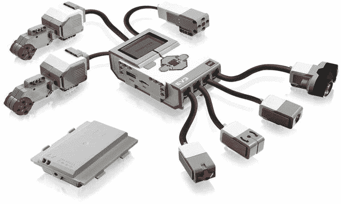

图 1-1。

Lego Mindstorms EV3

如图 [1-1](#Fig1) 所示，乐高 Mindstorms EV3 的典型组件包括电机端口、传感器端口、PC 连接端口、扬声器和 EV3 按钮。关于乐高MindStorm EV3 组成部分的更多细节可以在: [`http://www.lego.com/en-us/mindstorms/downloads`](http://www.lego.com/en-us/mindstorms/downloads) 找到。

乐高MindStorm EV3 中的电机端口有四个用于连接电机的输出端口:端口 A、B、C 和 d

传感器端口有四个用于连接传感器的输入端口:端口 1、2、3 和 4。

迷你 USB PC 连接端口用于将 USB 电缆连接到您的本地计算机，并将程序下载到 EV3 砖块(或将数据从机器人上传到您的本地计算机)。您还可以使用无线蓝牙连接上传和下载程序。

乐高MindStorm EV3 中包含的扬声器使程序具有真实的声音成为可能，你可以在运行程序时听到它们。

您可以在 EV3 砖块的中心应用一个深灰色按钮来打开电源、输入命令或运行程序。砖块的左上角还有一个浅灰色的按钮，用于反转动作、中止程序和关闭 EV3。EV3 砖块上的其他四个浅灰色按钮用于在 EV3 菜单中向左、向右、向上和向下移动。

乐高MindStorm EV3 的典型技术规格如下。关于乐高 EV3 规格的更多细节可以在 [`http://www.lego.com/en-us/mindstorms/downloads`](http://www.lego.com/en-us/mindstorms/downloads) 找到。

*   单个主处理器控制机器人:
    *   运行频率为 300 MHz 的 32 位 ARM9 处理器
    *   能够访问 64 MB 内存
    *   使用 16 MB 闪存
*   操作系统是基于 Linux 的
*   使用 6 节 AA 电池或稍大的可充电电池组运行:
    *   虽然 6 节 AA 电池理论上相当于 9 伏，但你更可能体验到大约 7-8 伏，这取决于电池中的电荷
*   包含四个电机/伺服端口:
    *   三个马达(两个大型马达和一个中型马达)配有每个乐高MindStorm EV3 套件
*   包含四个传感器端口:
    *   配有各种传感器:
        *   -触摸
        *   -颜色
        *   超声波
        *   陀螺仪
*   交流:
    *   自带蓝牙
    *   一个程序可以加载到 EV3 砖使用蓝牙以较慢的速度或使用 USB 电缆以更快的速度
    *   可以被编程以允许在程序执行时在两个(或多个)EV3 砖块之间进行通信
    *   当程序正在执行时，第三方软件可用于 PC 和 EV3 砖之间的通信
    *   包括一个内置的 178 × 128 像素 LCD 图形显示屏

## leJOS 简介

“leJOS”的意思是 Lego for Java 操作系统，这是一种开源语言，用于使用 Java 技术为 Lego Mindstorms 产品开发软件。leJOS 项目支持乐高MindStorm EV3，以及以前的版本，包括乐高MindStorm NXT 和乐高MindStorm RCX。leJOS 项目为 Lego Mindstorms 提供了以下解决方案:

### 乐高 Mindstorms EV3

*   EV3 砖的 JVM
*   EV3 砖的 leJOS API
*   leJOS PC 通信
*   远工具

### 乐高 Mindstorms NXT

*   用于 NXT 块的 JVM
*   用于 NXT 砖的 leJOS API
*   leJOS PC 通信
*   leJOS JavaME 通信公司
*   远工具

### 乐高 Mindstorms RCX

*   RCX 砖的 JVM
*   RCX 砖的 leJOS API
*   leJOS PC 通信
*   远工具

在这本书里，我们关注的是最新的乐高MindStorm产品:也就是乐高MindStorm EV3。表 [1-1](#Tab1) 显示了 leJOS 为 EV3 砖提供的典型官方包装。这些软件包允许你管理 EV3 砖，传感器，执行器，以及其他一些 EV3 硬件。

表 1-1。

EV3 brick packages

<colgroup><col> <col></colgroup> 
| 包裹 | 描述 |
| --- | --- |
| 远点，硬件 | 支持 EV3 硬件 |
| 远点，硬件，ev3 | 要访问 EV3 硬件 |
| 远点，硬件，lcd | 要访问 EV3 液晶显示器 |
| 很远，硬件，引擎 | 去 EV3 汽车公司 |
| 远点，硬件，端口 | 进入 EV3 港口 |
| 远点，硬件，传感器 | 要访问 EV3 上支持的所有传感器 |
| 远点，硬件，视频 | 要访问视频设备 |

表 [1-2](#Tab2) 列出了为一些机器人问题提供支持的包，比如定位和导航。

。

Robotics/AI packages

<colgroup><col> <col></colgroup> 
| 包裹 | 描述 |
| --- | --- |
| lejos .机器人.本地化 | 本地化支持 |
| lejos .机器人学.制图 | 支持地图 |
| lejos .机器人.导航 | 导航类 |
| lejos.robotics .对象检测 | 对象检测类 |
| 机器人学包容 | 支持包容架构 |

所有 leJOS 版本都有 Javadoc 格式的包文档。有关 EV3 莱霍斯酒店提供的套餐详情，请访问: [`http://www.lejos.org/ev3/docs/`](http://www.lejos.org/ev3/docs/) 。

图 [1-2](#Fig2) 显示了莱霍斯 EV3 开发文件。


图 1-2。

leJOS development documents

## JDK 装置

leJOS 项目基于 Java 技术，所以您需要在本地计算机上安装 Java 开发工具包(JDK)当前版本。JDK 发布可以在: [`http://www.oracle.com/technetwork/java/index.html`](http://www.oracle.com/technetwork/java/index.html) 找到。

Java 运行时环境(JRE)是不够的，因为它不允许您编译 Java 程序。莱霍斯·EV3 只支持 32 位版本的 JDK 和 JRE，所以即使你有 64 位系统，你也应该选择 32 位版本的 JDK。此外，莱霍斯·EV3 已经在 1.7 版上进行了测试，因此本书推荐使用 Java 7。作为一个例子，下面的步骤向您展示了如何使用名为`jdk-7u45-windows-i586.exe`的 Java JDK 安装程序来安装 JDK。

Installing The Jdk

1.  Double-click the file `jdk-7u45-windows-i586.exe` , and you will see the screen shown in Figure [1-3](#Fig3). Then, click the Next button.

    

    图 1-3。

    Step 1 of the JDK Installation  
2.  Install the JAVA JDK to the path `C:\Program Files (x86)\Java\jdk1.7.0_45`, choose all components, and click the Next button, as illustrated in Figure [1-4](#Fig4). It will then install JDK components that you chose.

    

    图 1-4。

    Step 2 of the JDK installation  
3.  Click the Close button, as shown in Figure [1-5](#Fig5). The JAVA JDK is then successfully installed on your computer at: `C:\Program Files (x86)\Java\jdk1.7.0_45`.

    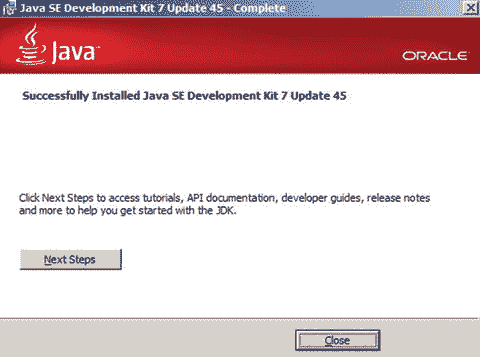

    图 1-5。

    Step 3 of the JDK installation  
4.  一旦你在电脑上安装了 J2SE 软件开发工具包，就有必要检查你是否能编译和执行任何 java 程序。

## 测试 JDK 安装

在您的计算机上打开一个 Shell 控制台，并键入命令`Java`:

*   `Java`:用于执行 Java 程序的 Java 命令
*   `Javac`:用于编译 Java 程序的 Java 命令

执行第一个测试的原因是因为您需要检查您的操作系统是否识别用于执行 Java 程序的命令`java`。如果 shell 控制台返回使用该命令的选项，如图 [1-6](#Fig6) 所示，则测试成功。


图 1-6。

Test running the java command

第二个测试是必要的，以了解您的操作系统是否识别命令`javac`，该命令用于编译您的程序。在键盘上键入`javac`并检查消息。如果您的系统不能识别该命令，那么您必须更新计算机系统中的环境变量。右键单击“我的电脑”图标，然后选择属性。单击“高级选项”选项卡。当您单击此命令时，您将看到一个新窗口，您可以在其中更新变量路径。该路径用于直接从 Shell 键盘执行命令。

在选项卡高级选项选项卡上，点击环境变量按钮，如图 [1-7](#Fig7) 所示。`path`变量位于系统变量区。找到变量`path`，点击更新按钮。路径变量可能有许多语句，因为它们被许多应用程序使用。

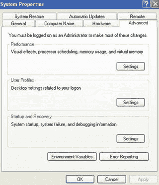

图 1-7。

A screenshot of setting up environment variables

要更新`path`变量，在你的计算机上找到 J2SE SDK 所在的路径。在这种情况下，路径是:

```java
C:\Program Files (x86)\Java\jdk1.7.0_45\bin

```

知道路径后，将其添加到系统变量 path 内容的末尾。

您还需要创建一个名为`JAVA_HOME`的新系统变量，并将其值设置为`C:\Program Files (x86)\Java\jdk1.7.0_45`。一旦你做了更改，重新启动 DoS 命令窗口，并再次检查命令`javac`。

如果您看到命令`javac`的选项，如图 [1-8](#Fig8) 所示，那么测试是成功的——恭喜！您已经完成了 JDK 的安装。现在您可以使用您的计算机来开发 java 程序，并且您已经安装和配置了基本的 Java 工具。


图 1-8。

Test running the javac command

## 在乐高 EV3 上安装 leJOS 及其固件

leJOS 可以安装在主流的操作系统中，比如 Windows、Linux 和 Mac OS。既然你已经安装并运行了 Java，那么是时候在你的电脑上安装 leJOS 系统，并在乐高 Mindstorms EV3 上安装它的固件了。为此，您需要一张最大容量为 32GB 的空白 SD 卡。此外，SD 卡需要使用 FAT32 分区进行格式化。安装 leJOS 最简单的方法是在: [`http://www.lejos.org`](http://www.lejos.org) 下载安装程序。

Installing Lejos

1.  访问 [`https://sourceforge.net/projects/ev3.lejos.p/files/0.9.1-beta/`](https://sourceforge.net/projects/ev3.lejos.p/files/0.9.1-beta/) ，然后选择`Download leJOS_EV3_0.9.1-beta_win32_setup.exe (41.8MB)`。然后你可以下载并保存`leJOS_EV3_0.9.1-beta_win32_setup.exe`到你的电脑上。
2.  Double-click `leJOS_EV3_0.9.1-beta_win32_setup.exe`, and you will see a leJOS EV3 Setup Wizard, as shown in Figure [1-9](#Fig9).

    

    图 1-9。

    leJOS setup wizard  
3.  Click the Next button, and you will see the screen shown in Figure [1-10](#Fig10).

    

    图 1-10。

    Choosing the right JDK for use with leJOS EV3  
4.  Choose the 32-bit JDK that you installed, for example, `jdk1.7.0_45`, and then click the Next button. You will see the screen shown in Figure [1-11](#Fig11).

    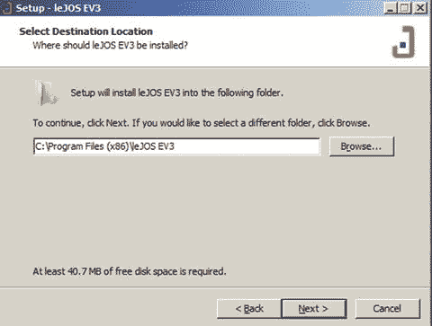

    图 1-11。

    Choosing a folder to install leJOS EV3 program  
5.  Make sure that you have installed the JDK and set the path and `JAVA_HOME` to the installation directory of your JDK. You can click browse to select the path to which you want to install. In this example, I chose the destination folder `C:\Program Files (x86)\leJOS EV3`. After you set up the installation folder, click Next button and you will see the screen shown in Figure [1-12](#Fig12).

    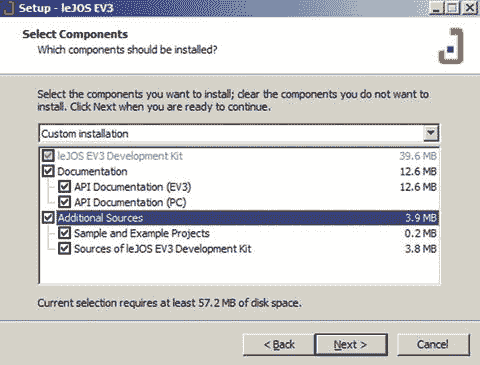

    图 1-12。

    Choosing ALL components of leJOS  
6.  Check to choose all of the components you wish to install, and then click Next button. You will see the screen shown in Figure [1-13](#Fig13).

    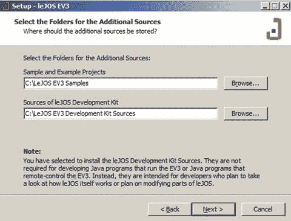

    图 1-13。

    Selecting folders where to install the sample leJOS projects  
7.  Choose to install the Sample Projects and the Development Kit into root folder C, click Next, and then you can use the default setting to create a Start Menu folder called `leJOS EV3`. After that, click Next and you will see the screen shown in Figure [1-14](#Fig14).

    

    图 1-14。

    General settings for the leJOS installation  
8.  Double-check to see if all of the settings are OK, and then click Install. You will see the installation progress bar, and eventually you will see the screen shown in Figure [1-15](#Fig15).

    

    图 1-15。

    Finishing the leJOS installation  
9.  Make sure that you have your SD card ready, and then click Finish. After that, a EV3SDCard utility program will start, as shown in Figure [1-16](#Fig16).

    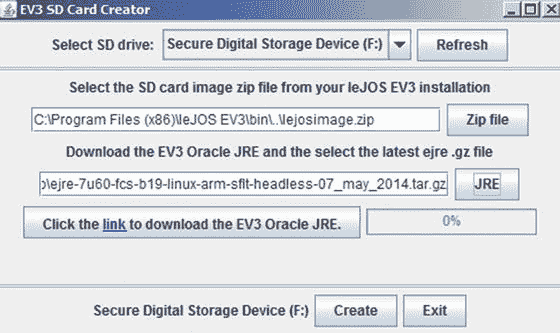

    图 1-16。

    EV3 SD Card creator  
10.  Choose the right SD Card drive, click the link to Download the EV3 Oracle JRE, and select the corresponding `.gz` file. Then click the Create button and you will see that the EV3 firmware is burned into the SD card, as shown in Figure [1-17](#Fig17).

    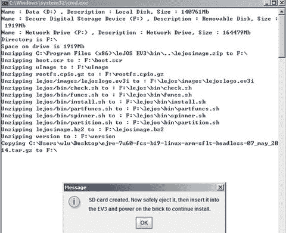

    图 1-17。

    Installing the leJOS firmware into the SD card  

创建 SD 卡后，将它插入 EV3 砖，按下中间的深灰色按钮启动 EV3，并在 EV3 砖上完成 leJOS 固件安装。leJOS EV3 的标志将显示在砖块的 LCD 上。安装完成后，将显示一个 leJOS EV3 菜单，默认 IP 地址显示在顶部(`10.0.1.1`)。至此，您已经准备好进行下一步，将用于开发 leJOS 程序的 Eclipse 插件安装到 EV3 砖中。

## 莱霍斯·EV3 的 Eclipse IDE 和 Eclipse 插件

当然，仅仅使用文本编辑器和命令行也可以进行 Java 编程。然而，对程序员来说，点击按钮让事情发生要比输入命令和可选参数容易得多。一般来说，标准的文本编辑器并不包含很多在编辑代码时可以帮助你的特性，而且当你拼错了一个类名或者遗漏了一个括号时，它们也不会告诉你。集成开发环境(IDE)是一种工具，允许您使用简单的按钮输入、编译和上传代码到 EV3，它还通过对代码进行颜色编码来监控代码语法，以便您可以轻松识别关键字和变量。最好的开源 ide 之一是 IBM 的 Eclipse，它是免费的，功能强大，易于使用。这一节将向您展示如何在 leJOS EV3 上为 Java 编程设置 Eclipse IDE。

第一步，在: [`http://www.eclipse.org/downloads/packages/eclipse-ide-java-developers/indigosr1`](http://www.eclipse.org/downloads/packages/eclipse-ide-java-developers/indigosr1) 下载 Eclipse，搜索面向 Java 开发者的 Eclipse IDE。请注意，即使您使用的是 64 位计算机，也需要下载 32 位版本的 Eclipse IDE，因为莱霍斯·EV3 插件不能与 64 位版本的 Eclipse 一起工作。下载的是一个`.zip`文件，您必须将文件解压缩到一个目录中。这将是 Eclipse 程序的永久位置。要运行 Eclipse，只需双击 Eclipse 目录中的可执行文件。类似地，为了删除 Eclipse，您只需从您的计算机上删除 Eclipse 目录。

第一次运行 Eclipse 时，它会询问您工作区的位置。在本实验中，您可以选择工作区作为用于安装 leJOS 的文件夹，在本例中为`C:\leJOSEV3Proj`，如图 [1-18](#Fig18) 所示。


图 1-18。

Setting up the workspace for Eclipse

如果有软件补丁或新功能，您可以通过点击`Window -> Preferences`，双击列表中的`Install/Update`，突出显示自动更新，将 Eclipse 设置为自动搜索更新。如图 [1-19](#Fig19) 所示，勾选自动查找新更新并通知我，然后点击确定。之后，Eclipse 及其插件将自动更新。

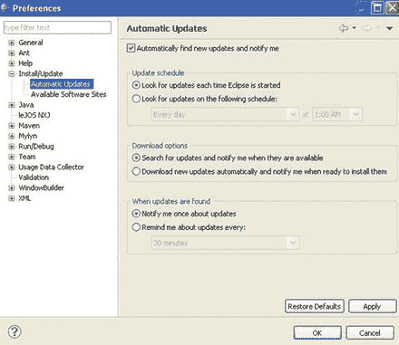

图 1-19。

Setting up automatic updates in Eclipse Installing The Eclipse Ide And Eclipse Plu-Gin

既然已经安装了 Eclipse，那么是时候安装莱乔斯 have 插件了。请遵循以下步骤:

1.  In Eclipse, select `Help > Install New Software`. You will see a dialog requesting that you input a URL, as shown in Figure [1-20](#Fig20).

    

    图 1-20。

    Step 1 of installing the leJOS EV3 plug-in  
2.  Click Add, and you will see another dialog box, as shown in Figure [1-21](#Fig21). Enter the name leJOS EV3, and for the location enter this: [`http://lejos.sourceforge.net/tools/eclipse/plugin/ev3`](http://lejos.sourceforge.net/tools/eclipse/plugin/ev3) .

    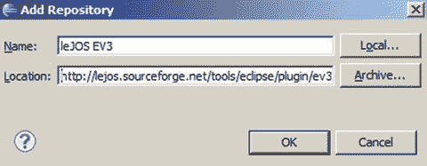

    图 1-21。

    Step 2 of installing the leJOS EV3 plug-in  
3.  Click OK. You should see a new item in the main dialog box, as shown in Figure [1-22](#Fig22). Place a check mark in the box next to the new item, and click the Next button.

    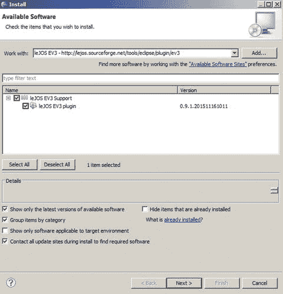

    图 1-22。

    Step 3 of installing the leJOS EV3 plug-in  
4.  阅读并接受许可协议，然后单击“下一步”按钮。插件将自动安装。
5.  完成后，会要求您重启 Eclipse。一旦它重新启动，您将在 Eclipse 中看到一些微妙的变化。该插件将在 Eclipse 中的许多地方添加新的 leJOS 菜单项。
6.  Eclipse will automatically look for the `EV3_HOME` environment variable to locate leJOS EV3\. Check to make sure that the preferences are what you like. Select `Windows -> Preferences` and then leJOS EV3 from the list. If the leJOS EV3 directory is not correct, either type in the location or browse to it. Make sure that you browse to the main directory and not one of its subdirectories. After that, you need to double-check if they are the same as the items illustrated in Figure [1-23](#Fig23).

    

    图 1-23。

    Preferences for the leJOS EV3 plug-in  

Creating And Uploading A Program: Helloworld

现在您需要创建一个输入代码的地方。Eclipse 将单个 Java 项目保存在自己的项目目录中。例如，如果您创建一个处理映射的大型多类项目，您将在它自己的目录中创建您自己的项目来存储类和数据文件。

在本节中，您将创建一个用于存储代码的项目。

1.  选择`File > New > Project`。
2.  In the next window, double-click leJOS EV3 to expand the folder options. You want to create a leJOS EV3 project, so select leJOS EV3 project and click the Next button, as shown in Figure [1-24](#Fig24).

    

    图 1-24。

    A New leJOS project  
3.  For the project name , enter `test` and then click Finish, as shown in Figure [1-25](#Fig25).

    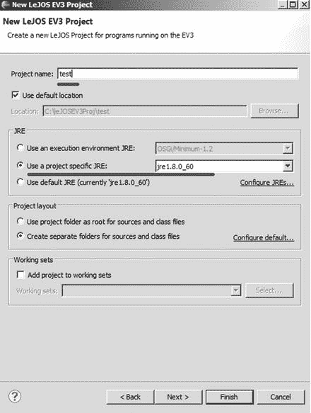

    图 1-25。

    Create a new leJOS EV3 project  
4.  In order to add a new class file, select `File > New > Class`. Enter `HelloWorld` in the name field, as shown in Figure [1-26](#Fig26). Eclipse will also offer other options, such as automatically adding a `main()` method. Check this if you want Eclipse to do some of the typing for you.

    

    图 1-26。

    Add a class in the new leJOS EV3 project  
5.  完成后点击`Finish`按钮。您应该会看到一个包含一些起始代码的新类文件。在文件中输入随后的`HelloWorld`代码。

    ```java
    //************************************************************
    //Wei Lu Java Robotics Programming with Lego EV3 Hello World.java
    //An example to display HelloWorld on the LCD screen of EV3 brick
    //************************************************************

    // import EV3 hardware packages for EV brick finding,
    // activating keys and LCD
    import lejos.hardware.ev3.EV3;
    import lejos.hardware.BrickFinder;
    import lejos.hardware.Keys;
    import lejos.hardware.lcd.TextLCD;

    public class HelloWorld {

            public static void main(String[] args) {

                    // get EV3 brick
                    EV3 ev3brick = (EV3) BrickFinder.getLocal();

    // instantized LCD class for displaying and Keys // class for buttons
                    Keys buttons = ev3brick.getKeys();
                    TextLCD lcddisplay = ev3brick.getTextLCD();

    // drawing text on the LCD screen based on
    // coordinates
                    lcddisplay.drawString("HelloWorld", 2, 4);

                    // exit program after any button pressed
                    buttons.waitForAnyPress();
            }

    }

    ```

6.  Click the Save button, turn on your EV3 brick, and then click the green Run button in the Eclipse toolbar. A pop-up window will appear the first time that you click the Run button for a class file. Select the leJOS EV3 program, as shown in Figure [1-27](#Fig27), and click OK. The program will begin uploading. You need to make sure that the EV3 brick is connected to your computer through the mini-USB port .

    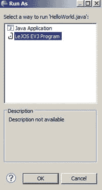

    图 1-27。

    Running a leJOS EV3 program  

当程序上传并自动运行时，您的 EV3 将在屏幕中央显示`HelloWorld`，假设您使用的是默认设置。如果您不想让程序在每次上传时自动运行，请选择`Windows > Preferences > leJOS EV3`并取消选中上传后运行程序。

## 摘要

本章让你开始在你的本地计算机上安装 JDK 和莱霍斯系统，并使用外部 SD 卡在乐高MindStorm EV3 积木上刻录莱霍斯 EV3 固件。您还使用 leJOS 和您的机器人运行了第一个名为`HelloWorld`的 Java 机器人程序。leJOS 可以安装在主流的操作系统中，比如 Windows、Linux 和 Mac OS。特别是，您在本章中学到了以下内容:

*   如何安装莱乔斯 EV3 软件到您的 Windows 操作系统与莱乔斯安装程序。
*   如何安装莱霍斯 EV3 固件到你的乐高 EV3 砖。
*   如何为 Eclipse IDE 安装和使用 leJOS 插件。
*   如何在 Eclipse 中编写源代码，然后上传并在您的 EV3 砖上运行程序。
*   如何在本地计算机上安装和配置 JDK。

在下一章中，您将了解 EV3 大型电机及其在莱霍斯 EV3 提供的相应电机类别。然后，在此基础上，你将学习如何使用电机控制基本运动，如何中断旋转，如何调节电机速度，以及如何跟踪直线。