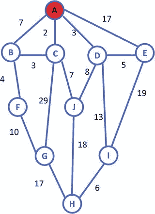
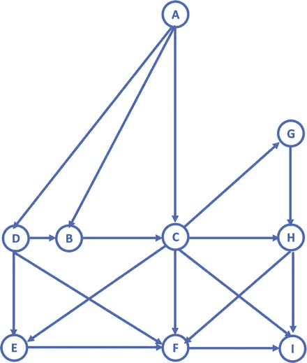

# 八、Dijkstra 算法及其在 Lego Mindstorms 上的实现

继第 7 章[对启发式搜索算法的讨论之后，本章将讨论 Dijkstra 算法。该算法可用于寻找最优解，而不是由爬山算法中的启发式函数定义的“或任何”解。特别是，本章将涵盖以下主题:](07.html)

*   一个新的 Dijkstra 的搜索算法，可以应用于建立任意树结构一般。
*   在基于 leJOS 的机器人系统中应用和集成所提出的 Dijkstra 算法用于定位和路径规划，这增强了 leJOS 系统中现有的寻路方法。

## Dijkstra 算法简介

在第 [7](07.html) 章中讨论的爬山算法试图最小化连接的数量。如你所知，这样的爬山搜索找到了一条好的路线——不是最好的，但是可以接受的。此外，迄今为止介绍的所有先前的搜索算法(包括 BSF 和 DFS)都能够确定一个解决方案:即，任何解决方案，不一定是最佳解决方案或者甚至是“好的”解决方案。定义试探法有助于提高找到好的解决方案的可能性；然而，没有作出任何努力来确保找到最佳解决方案。为了获得最优解，即最佳解，需要应用众所周知的 Dijkstra 算法:

在任何给定的图中和在任何起始节点，Dijkstra 的算法发现从起始节点到所有其他节点的最短路径。

图 [8-1](#Fig1) 显示了表示连接节点的图形:节点是标有 A-J 的蓝色圆圈。路径是连接两个节点的蓝色线，每条路径旁边都有一个关联的距离。注意:长度不是按比例的。



图 8-1。

Graphic representation of connected nodes

节点 A 是您的起始节点，您希望找到到达图中所有其他节点的最短路径。为此，您需要生成一个表。此表包含从起始节点 a 的角度到图形中所有节点的距离。

如表 [8-1](#Tab1) 所示，距离的初始条目都被设置为无穷大(或某个名义上的最大值)。这确保了找到的任何路径都比存储在表中的初始值短。

表 8-1。

Initial entries for distances to nodes from Node A

<colgroup><col> <col></colgroup> 
| 结节 | 从节点 A 到节点的距离 |
| --- | --- |
| B | 无限的 |
| C | 无限的 |
| D | 无限的 |
| E | 无限的 |
| F | 无限的 |
| G | 无限的 |
| H | 无限的 |
| 我 | 无限的 |
| J | 无限的 |

节点 A 是起始节点，因此您将首先检查离开该节点的所有可能路径。选项如表 [8-2](#Tab2) 所示。

表 8-2。

Distance to nodes (from Node A) accessible from Node A

<colgroup><col> <col></colgroup> 
| 结节 | 从节点 A 到节点的距离 |
| --- | --- |
| B | seven |
| C | Two |
| D | three |
| E | Seventeen |

这些值用于更新表 [8-1](#Tab1) ，因此您现在有了表 [8-3](#Tab3) 。

表 8-3。

Entries for distances to nodes from Node A

<colgroup><col> <col></colgroup> 
| 结节 | 从节点 A 到节点的距离 |
| --- | --- |
| B | seven |
| C | Two |
| D | three |
| E | Seventeen |
| F | 无限的 |
| G | 无限的 |
| H | 无限的 |
| 我 | 无限的 |
| J | 无限的 |

图 [8-2](#Fig2) 显示了红色标记的路线。从节点 a 有四条路径。但是，这些路径还不能保证是最短路径。为了确定你已经确定了最短的路径，你必须继续前进。


图 8-2。

Graphic representation in which starting node A has been visited

算法中的下一步是前往距离节点 a 最近的节点。在这种情况下，即节点 C。在节点 C，您有到节点 B、G 和 j 的可用路径。计算距离时，您必须确定它们与节点 a 的距离。新距离如表 [8-4](#Tab4) 所示。

表 8-4。

Distance to nodes accessible from Node A

<colgroup><col> <col></colgroup> 
| 结节 | 从节点 A 到节点的距离 |
| --- | --- |
| B | five |
| G | Thirty-one |
| J | nine |

然后将这些值与表 [8-3](#Tab3) 中的值进行比较。您会发现这两个值都小于表中存储的当前值。这样，工作台 [8-3](#Tab3) 转换为工作台 [8-5](#Tab5) 如下。

表 8-5。

Entries for distances to nodes from Node A

<colgroup><col> <col></colgroup> 
| 结节 | 从节点 A 到节点的距离 |
| --- | --- |
| B | five |
| C | Two |
| D | three |
| E | Seventeen |
| F | 无限的 |
| G | Thirty-one |
| H | 无限的 |
| 我 | 无限的 |
| J | nine |

这一步说明了 Dijkstra 算法的一个优点:到 Node B 的路由不是最直接的路由，但却是最短的。Dijkstra 的算法可以找到最短的路线，即使这条路线不是最直接的。

同样，已经检查了从节点 C 可访问的所有路径，并且已经更新了路径表。节点 C 被标记为已被访问，如图 [8-3](#Fig3) 所示。


图 8-3。

Graphic representation in which Node C has been visited

在 Dijkstra 的算法中，被访问的节点永远不会被重新访问。此外，一旦节点被标记为已访问，到该节点的路径就是从初始节点开始的最短路径。

因此，您应该向您的表中添加另一列，如表 [8-6](#Tab6) 所示。

表 8-6。

Entries for distances to nodes from Node A

<colgroup><col> <col> <col></colgroup> 
| 结节 | 从节点 A 到节点的距离 | 访问 |
| --- | --- | --- |
| B | five | 不 |
| C | Two | 是 |
| D | three | 不 |
| E | Seventeen | 不 |
| F | 无限的 | 不 |
| G | Thirty-one | 不 |
| H | 无限的 | 不 |
| 我 | 无限的 | 不 |
| J | nine | 不 |

当这些值被更新时，伴随这些距离的路线也需要被存储。再次检查路径表，并找到到未被访问的节点的最短路径。该节点成为下一个当前节点。在这种情况下，它是节点 D。从节点 D 可以使用以下路径:

表 8-7。

Distance to nodes accessible from Node A

<colgroup><col> <col></colgroup> 
| 结节 | 从节点 A 到节点的距离 |
| --- | --- |
| J | Eleven |
| 我 | Sixteen |
| E | eight |

所有路径的表被更新以反映这一点，并且节点 D 被标记为已访问。这也锁定了到节点 D 的最短路径。

从表 [8-8](#Tab8) 中可以看出，距离节点 A 最近的节点是节点 B。接下来检查来自节点 B 的所有路径。在本例中，您有一条到标记为已访问的节点(节点 C)的路径。我们已经知道，到节点 C 的路径是最短的。

表 8-8。

Entries for distances to nodes from Node A

<colgroup><col> <col> <col></colgroup> 
| 结节 | 从节点 A 到节点的距离 | 访问 |
| --- | --- | --- |
| B | five | 不 |
| C | Two | 是 |
| D | three | 是 |
| E | eight | 不 |
| F | 无限的 | 不 |
| G | Thirty-one | 不 |
| H | 无限的 | 不 |
| 我 | Sixteen | 不 |
| J | nine | 不 |

如图 [8-4](#Fig4) 所示，当您检查路径时，从节点 B 可访问的唯一其他节点是节点 f。这将更新我们的路径，如表 [8-9](#Tab9) 所示:

表 8-9。

Entries for distances to nodes from Node A

<colgroup><col> <col> <col></colgroup> 
| 结节 | 从节点 A 到节点的距离 | 访问 |
| --- | --- | --- |
| B | five | 是 |
| C | Two | 是 |
| D | three | 是 |
| E | eight | 不 |
| F | nine | 不 |
| G | Thirty-one | 不 |
| H | 无限的 | 不 |
| 我 | Sixteen | 不 |
| J | nine | 不 |


图 8-4。

Graphic representation with Node C and Node D marked visited

表 [8-9](#Tab9) 再次告诉我们，您要访问的下一个节点是节点 e。然后，您将路径相加，并将这些节点标记为已访问。接下来检查路径，从节点 E 可访问的唯一其他节点是节点 I。从节点 A 到节点 I 的距离是 27，大于表中所示的距离。因此，在这一轮中没有对表的更新，节点 E 被标记为已访问。继续看表 [8-9](#Tab9) ，你知道下一个要访问的节点是节点 F。如图 [8-4](#Fig4) 所示，当你检查路径时，从节点 F 唯一可访问的另一个节点是节点 g。这更新了如表 [8-10](#Tab10) 所示的路径。

表 8-10。

Entries for distances to nodes from Node A

<colgroup><col> <col> <col></colgroup> 
| 结节 | 从节点 A 到节点的距离 | 访问 |
| --- | --- | --- |
| B | five | 是 |
| C | Two | 是 |
| D | three | 是 |
| E | eight | 是 |
| F | nine | 是 |
| G | Nineteen | 不 |
| H | 无限的 | 不 |
| 我 | Sixteen | 不 |
| J | nine | 不 |

表 [8-10](#Tab10) 告诉我们你要访问的下一个节点是节点 j。然后你把路径加起来，把节点标记为已访问。接下来检查路径，从节点 J 可访问的唯一其他节点是节点 h。这将更新路径，如表 [8-11](#Tab11) 所示。

表 8-11。

Entries for distances to nodes from Node A

<colgroup><col> <col> <col></colgroup> 
| 结节 | 从节点 A 到节点的距离 | 访问 |
| --- | --- | --- |
| B | five | 是 |
| C | Two | 是 |
| D | three | 是 |
| E | eight | 是 |
| F | nine | 是 |
| G | Nineteen | 不 |
| H | Twenty-seven | 不 |
| 我 | Sixteen | 不 |
| J | nine | 是 |

表 [8-11](#Tab11) 告诉我们您要访问的下一个节点是节点 I。接下来，您将路径相加，并将节点标记为已访问。当您检查路径时，从节点 I 可访问的唯一其他节点是节点 h。这将更新路径，如表 [8-12](#Tab12) 所示。

表 8-12。

Entries for distances to nodes from Node A

<colgroup><col> <col> <col></colgroup> 
| 结节 | 从节点 A 到节点的距离 | 访问 |
| --- | --- | --- |
| B | five | 是 |
| C | Two | 是 |
| D | three | 是 |
| E | eight | 是 |
| F | nine | 是 |
| G | Nineteen | 不 |
| H | Twenty-two | 不 |
| 我 | Sixteen | 是 |
| J | nine | 是 |

表 [8-12](#Tab12) 告诉我们下一个要访问的节点是节点 g。然后你把路径加起来，把节点标记为已访问。检查路径时，从节点 G 可访问的唯一其他节点是节点 H。从节点 A 到节点 H 的距离是 36，大于表中所示的 22。因此，表没有更新，节点 G 被标记为已访问。现在已经访问了所有节点，搜索将终止。最终，您将看到表 [8-13](#Tab13) ，该表显示了图 [8-1](#Fig1) 所示图形中从节点 A 到所有其他节点的最短距离。

表 8-13。

Entries for distances to nodes from Node A

<colgroup><col> <col> <col></colgroup> 
| 点头 | 从节点 A 到节点的距离 | 访问 |
| --- | --- | --- |
| B | five | 是 |
| C | Two | 是 |
| D | three | 是 |
| E | eight | 是 |
| F | nine | 是 |
| G | Nineteen | 是 |
| H | Twenty-two | 是 |
| 我 | Sixteen | 是 |
| J | nine | 是 |

使用图 [8-1](#Fig1) 所示的图形，下面的程序使用 Dijkstra 算法寻找从起始节点 A 到所有其他节点的最短路径。

```java
//******************************************************************
//Wei Lu Java Robotics Programming with Lego EV3ch8p1_main.java
//Driver class to set up map using ch8p1_edge, find the shortest //path from
//starting node A to all the other nodes in a given graph.
//******************************************************************

import java.util.ArrayList;

public class ch8p1_main {
        static ArrayList<ch8p1_edge> graph = null;
        static ch8p1_edge[] parents = null;

        static ArrayList<String> unsolvedConn = null;
        static ArrayList<String> solvedConn = null;
        private static ch8p1_minpath finalPath;

        public static void main(String[] args) {

                // initialize the nodes set
                String[] nodes = { "A", "B", "C", "D", "E", "F", "G", "H", "I", "J" };

                // initialize the map with the nodes
                graph = new ArrayList<ch8p1_edge>();

                graph.add(new ch8p1_edge("A", "B", 7));
                graph.add(new ch8p1_edge("A", "C", 2));
                graph.add(new ch8p1_edge("A", "D", 3));
                graph.add(new ch8p1_edge("A", "E", 17));
                graph.add(new ch8p1_edge("B", "F", 4));
                graph.add(new ch8p1_edge("C", "B", 3));
                graph.add(new ch8p1_edge("C", "G", 29));
                graph.add(new ch8p1_edge("C", "J", 7));
                graph.add(new ch8p1_edge("D", "J", 8));
                graph.add(new ch8p1_edge("D", "I", 13));
                graph.add(new ch8p1_edge("D", "E", 5));
                graph.add(new ch8p1_edge("E", "I", 19));
                graph.add(new ch8p1_edge("F", "G", 10));
                graph.add(new ch8p1_edge("G", "H", 17));
                graph.add(new ch8p1_edge("J", "H", 18));
                graph.add(new ch8p1_edge("I", "H", 6));

                // initialize the unsolved nodes
                unsolvedConn = new ArrayList<String>();

                // sets the parent node in the unsolved connection
// ArrayList to A
                unsolvedConn.add(nodes[0]);

                // initialize the solved nodes
                solvedConn = new ArrayList<String>();

                // Add all nodes to the solved connection tree
                for (int i = 1; i < nodes.length; i++)
                        solvedConn.add(nodes[i]);

                // create a parent array that will store all the edges
                parents = new ch8p1_edge[nodes.length];

// Set the initial node to A and make its parent null // with a weight cost
                // of zero
                parents[0] = new ch8p1_edge(null, nodes[0], 0);

                for (int i = 0; i < solvedConn.size(); i++) {
// get all of the String node names that could be // attached the
                        // root
                        String n = solvedConn.get(i);

                        // Check the weights of all the nodes that are
// attached to the root
                        // A node
                        // If they are attached will return positive
// weight if not will
                        // return -1
                        parents[i + 1] = new ch8p1_edge(nodes[0], n, getEdgeLength(
                                        nodes[0], n));
                }

                finalPath = null;
                // while the solved nodes ArrayList is greater than
// zero
                while (solvedConn.size() > 0) {
// Create a minimum shortest path object to find // the shortest path
                        // to all connected points
                        ch8p1_minpath msp = getMinSideNode();
                        finalPath = msp;

                        if (msp.getEdgeLength() == -1)
                                msp.outputPath(nodes[0]);
                        else

                                msp.outputPath();

                        String node = msp.getLastNode();

                        unsolvedConn.add(node);
                        setEdgeLength(node);
                }
        }

        public static String getParent(ch8p1_edge[] parents, String node) {
                if (parents != null) {
                        for (ch8p1_edge nd : parents) {
                                if (nd.getChildNode() == node) {
                                        return nd.getParentNode();
                                }
                        }
                }
                return null;
        }

        public static void setEdgeLength(String parentNode) {
                if (graph != null && parents != null && solvedConn != null) {
                        for (String node : solvedConn) {
                                ch8p1_minpath msp = getMinPath(node);
                                int w1 = msp.getEdgeLength();
                                if (w1 == -1)
                                        continue;
                                for (ch8p1_edge n : parents) {
                                        if (n.getChildNode() == node) {
                                                if (n.getEdgeLength() == -1 || n.getEdgeLength() > w1) {
                                                        n.setEdgeLength(w1);
                                                        n.setParentNode(parentNode);
                                                        break;
                                                }
                                        }
                                }
                        }
                }
        }

        public static int getEdgeLength(String parentNode, String childNode) {
                if (graph != null) {
                        for (ch8p1_edge s : graph) {
                                if (s.getParentNode() == parentNode
                                                && s.getChildNode() == childNode)
                                        return s.getEdgeLength();
                        }
                }
                return -1;
        }

        public static ch8p1_minpath getMinSideNode() {
                // Create a minimum shortest path object
                ch8p1_minpath minMsp = null;
                // while the solved node ArrayList is greater than zero
                if (solvedConn.size() > 0) {
                        // Create an index value set to zero
                        int index = 0;
                        // for each value in the solved nodes ArrayList
                        for (int j = 0; j < solvedConn.size(); j++) {
                                // Create a shortest path map get the
// MinPath of the solved node
                                ch8p1_minpath msp = getMinPath(solvedConn.get(j));
// if there is no minimum shortest path, // if the minimum shortest
                                // path
                                // does not equal -1
                                // AND the minimum shortest path get
// weight is less than the
                                // minimum shortest path get weight
                                if (minMsp == null || msp.getEdgeLength() != -1
                                                && msp.getEdgeLength() < minMsp.getEdgeLength()) {
// set the minimum shortest path to // the minimum shortest
                                        // path
                                        minMsp = msp;
                // set the index value equal it the // node value j
                                        index = j;
                                }
                        }
                        // remove the index that you checked in the
// solved nodes
                        solvedConn.remove(index);

                }
                // return the MinShortPath object
                return minMsp;
        }

        public static ch8p1_minpath getMinPath(String node) {
// Create a Minshort Path object that is an ArrayList // and set the take
                // in node as the base
                // in this case will always be zero
                ch8p1_minpath msp = new ch8p1_minpath(node);

                // if the parents array does not equal null and the
// unsolved nodes does
                // not equal null
                if (parents != null && unsolvedConn != null) {
                        for (int i = 0; i < unsolvedConn.size(); i++) {
                                ch8p1_minpath tempMsp = new ch8p1_minpath(node);
                                String parent = unsolvedConn.get(i);
                                String curNode = node;
                                while (parent != null) {
                                        int weight = getEdgeLength(parent, curNode);
                                        if (weight > -1) {
                                                tempMsp.addNode(parent);
                                                tempMsp.addEdgeLength(weight);
                                                curNode = parent;
                                                parent = getParent(parents, parent);
                                        } else

                                                break;
                                }

                                if (msp.getEdgeLength() == -1 || tempMsp.getEdgeLength() != -1
                                                && msp.getEdgeLength() > tempMsp.getEdgeLength())
                                        msp = tempMsp;
                        }
                }
                return msp;
        }
}

//******************************************************************************************
//Wei Lu Java Robotics Programming with Lego EV3 ch8p1_minpath.java
//the minimum path from starting node to all the other nodes, //including each node
//and the corresponding minimum distance as well
//******************************************************************************************

import java.util.ArrayList;

public class ch8p1_minpath {
        private ArrayList<String> nodeList;
        private int edgeLength;

        public ch8p1_minpath(String node) {
                nodeList = new ArrayList<String>();
                nodeList.add(node);
                edgeLength = -1;
        }

        public ArrayList<String> getNodeList() {
                return nodeList;
        }

        public void setNodeList(ArrayList<String> nodeList) {
                this.nodeList = nodeList;
        }

        public void addNode(String node) {
                if (nodeList == null)
                        nodeList = new ArrayList<String>();
                nodeList.add(0, node);
        }

        public String getLastNode() {
                int size = nodeList.size();
                return nodeList.get(size - 1);

        }

        public int getEdgeLength() {
                return edgeLength;

        }

        public void setEdgeLength(int edgeLength) {
                this.edgeLength = edgeLength;
        }

        public void outputPath() {
                outputPath(null);
        }

        public void outputPath(String pathNode) {
                String result = "the minimum path of ";
                if (pathNode != null)
                        nodeList.add(pathNode);
                for (int i = 0; i < nodeList.size(); i++) {
                        result += "" + nodeList.get(i);
                        if (i < nodeList.size() - 1)
                                result += "->";
                }
                result += " is:" + edgeLength;
                System.out.println(result);
        }

        public void addEdgeLength(int e) {
                if (edgeLength == -1)
                        edgeLength = e;
                else

                        edgeLength += e;
        }

}

//******************************************************************
//Wei Lu Java Robotics Programming with Lego EV3 ch8p1_edge.java
//edge class including the parent node and child node
//and the edge length between two nodes
//******************************************************************

public class ch8p1_edge {
        private String parentNode;
        private String childNode;
        private int edgeLength;

        public ch8p1_edge(String parentNode, String childNode, int edgeLength) {
                this.parentNode = parentNode;
                this.childNode = childNode;
                this.edgeLength = edgeLength;
        }

        public String getParentNode() {
                return parentNode;
        }

        public void setParentNode(String parentNode) {
                this.parentNode = parentNode;
        }

        public String getChildNode() {
                return childNode;
        }

        public void setChildNode(String childNode) {
                this.childNode = childNode;
        }

        public int getEdgeLength() {
                return edgeLength;
        }

        public void setEdgeLength(int edgeLength) {
                this.edgeLength = edgeLength;
        }

}

```

运行程序的结果如下:

```java
The minimum path of A->C is: 2
The minimum path of A->D is: 3
The minimum path of A->C->B is: 5
The minimum path of A->D->E is: 8
The minimum path of A->C->B->F is: 9
The minimum path of A->C->J is: 9
The minimum path of A->D->I is:16
The minimum path of A->C->B->F->G is: 19
The minimum path of A->D->I->H is: 22

```

如您所见，这个结果与表 [8-13](#Tab13) 中显示的结果完全相同。

## 基于莱霍斯·EV3 的迪杰斯特拉算法

参考图 [8-5](#Fig5) ，你将为你的机器人编写一个程序，使它能够使用 Dijkstra 算法在起始节点 A 和目的节点 I 之间行进尽可能短的距离。假设您使用笛卡尔坐标系:

*   A 处的坐标是(0，0)。
*   B 点的坐标是(-10，20)。
*   C 点的坐标是(0，20)。
*   D 点的坐标是(-15，20)。
*   E 点的坐标是(-15，30)。
*   F 点的坐标是(0，30)。
*   在 G 点的坐标是(10，10)。
*   H 点的坐标是(10，20)。
*   I 处的坐标是(10，30)。



图 8-5。

Graphic to be used for conducting the shortest-path search

您的程序应至少在 LCD 上显示目的地的坐标，然后显示消息“`Press ENTER Key to continue`”当你按下回车键，你的机器人移动到下一个节点。例如，假设你的机器人从`Node A(0,0)`出发，你想让它探索一条通往`Node G(10,10)`的道路。假设您的机器人使用 Dijkstra 算法探索的最小距离路径是`Node A -> Node C -> Node G`。在起点节点 A，您的程序应该执行以下操作:

*   在 LCD 上显示目的地的坐标`Node C(0, 20)`。
*   显示信息“`Press ENTER key to continue.`”
*   转到坐标为 0，20 的位置。
*   在 LCD 上显示目的地的坐标`Node G(10, 10)`。
*   显示信息“`Press ENTER key to continue.`”
*   前往坐标为 10，10 的位置。

此外，您的问题应该有一个名为 destination 的字符串，这样当更改 destination 的值时，它就足够智能，您的机器人可以探索一条从起始节点 A 到新的目的节点的新路径，在这条路径上，机器人将以最小的距离到达目的节点。(我们假设起始节点总是 A，所以 from 字符串可以硬编码。)

以下程序表示基于 leJOS 的 Dijkstra 算法的实现，该算法被设计成探索从节点 A 到目的节点 I 的最短路径:

```java
//******************************************************************************
//Wei Lu Java Robotics Programming with Lego EV3 ch8p2_main.java
//Driver class to set up map using ch8p2_edge, find the shortest //path from
//starting node A to all the other nodes in a given graph.
//and then robots will follow the path to move from start node A
//to the given destination node I
//******************************************************************************

import lejos.hardware.BrickFinder;

import lejos.hardware.Keys;

import lejos.hardware.ev3.EV3;

import lejos.hardware.lcd.LCD;

import lejos.hardware.motor.EV3LargeRegulatedMotor;

import lejos.hardware.port.MotorPort;

import lejos.robotics.chassis.Chassis;

import lejos.robotics.chassis.Wheel;

import lejos.robotics.chassis.WheeledChassis;

import lejos.robotics.navigation.MovePilot;

import lejos.robotics.navigation.Navigator;

import lejos.robotics.navigation.Waypoint;

import lejos.robotics.pathfinding.Path;

import java.util.ArrayList;

public class ch8p2_main {
        static ArrayList<ch8p2_edge> graph = null;
        static ch8p2_edge[] parents = null;

        static ArrayList<String> unsolvedConn = null;
        static ArrayList<String> solvedConn = null;
        private static ch8p2_minpath finalPath;

        static EV3LargeRegulatedMotor LEFT_MOTOR = new EV3LargeRegulatedMotor(
                        MotorPort.A);
        static EV3LargeRegulatedMotor RIGHT_MOTOR = new EV3LargeRegulatedMotor(
                        MotorPort.C);

        static Waypoint[] coordinates = { new Waypoint(0, 0),

                        new Waypoint(-10, 20), new Waypoint(0, 20), new Waypoint(-15, 20),
                        new Waypoint(-15, 30), new Waypoint(0, 30), new Waypoint(10, 10),
                        new Waypoint(10, 20), new Waypoint(10, 30),

        };

        public static void main(String[] args) {

                // get EV3 brick
                EV3 ev3brick = (EV3) BrickFinder.getLocal();

// instantiated LCD class for displaying and Keys class // for buttons
                Keys buttons = ev3brick.getKeys();

// setup the wheel diameter of left (and right) motor // in centimeters,
                // i.e. 2.8 cm

// the offset number is the distance between the center // of wheel to
                // the center of robot, i.e. half of track width
                Wheel wheel1 = WheeledChassis.modelWheel(LEFT_MOTOR, 2.8).offset(-9);
                Wheel wheel2 = WheeledChassis.modelWheel(RIGHT_MOTOR, 2.8).offset(9);

                // set up the chassis type, i.e. Differential pilot
                Chassis chassis = new WheeledChassis(new Wheel[] { wheel1, wheel2 },
                                WheeledChassis.TYPE_DIFFERENTIAL);
                MovePilot ev3robot = new MovePilot(chassis);

                Navigator navbot = new Navigator(ev3robot);

                // initialize the nodes set
                String[] nodes = { "A", "B", "C", "D", "E", "F", "G", "H", "I" };

                // initialize the map with the nodes
                graph = new ArrayList<ch8p2_edge>();

                graph.add(new ch8p2_edge("A", "B", 22));
                graph.add(new ch8p2_edge("A", "C", 20));

                graph.add(new ch8p2_edge("A", "D", 25));

                graph.add(new ch8p2_edge("B", "C", 10));

                graph.add(new ch8p2_edge("C", "E", 18));
                graph.add(new ch8p2_edge("C", "F", 10));
                graph.add(new ch8p2_edge("C", "G", 14));
                graph.add(new ch8p2_edge("C", "H", 10));
                graph.add(new ch8p2_edge("C", "I", 18));

                graph.add(new ch8p2_edge("D", "B", 5));
                graph.add(new ch8p2_edge("D", "E", 10));
                graph.add(new ch8p2_edge("D", "F", 18));

                graph.add(new ch8p2_edge("E", "F", 15));

                graph.add(new ch8p2_edge("F", "I", 10));

                graph.add(new ch8p2_edge("G", "H", 10));

                graph.add(new ch8p2_edge("H", "F", 14));
                graph.add(new ch8p2_edge("H", "I", 10));

                // initialize the unsolved nodes
                unsolvedConn = new ArrayList<String>();

                // sets the parent node in the unsolved connection
// ArrayList to A
                unsolvedConn.add(nodes[0]);

                // initialize the solved nodes
                solvedConn = new ArrayList<String>();

                // Add all nodes to the solved connection tree
                for (int i = 1; i < nodes.length; i++)
                        solvedConn.add(nodes[i]);

                // create a parent array that will store all the edges
                parents = new ch8p2_edge[nodes.length];

// Set the initial node to A and make its parent null // with a weight cost
                // of zero
                parents[0] = new ch8p2_edge(null, nodes[0], 0);

                for (int i = 0; i < solvedConn.size(); i++) {
// get all of the String node names that could be // attached the
                        // root
                        String n = solvedConn.get(i);

                        // Check the weights of all the nodes that are
// attached to the root
                        // A node
                        // If they are attached will return positive
// weight if not will
                        // return -1
                        parents[i + 1] = new ch8p2_edge(nodes[0], n, getEdgeLength(
                                        nodes[0], n));
                }

                finalPath = null;
// while the solved nodes ArrayList is greater than zero
                while (solvedConn.size() > 0) {
// Create a minimum shortest path object to find // the shortest path
                        // to all connected points
                        ch8p2_minpath msp = getMinSideNode();
                        finalPath = msp;

                        String node = msp.getLastNode();
                        unsolvedConn.add(node);
                        setEdgeLength(node);
                }
                Path directions = finalPath.buildPath(coordinates);
                navbot.setPath(directions);
                navbot.singleStep(true);
                while (navbot.getWaypoint() != null) {
                        if (navbot.getWaypoint() != null) {
                                System.out.println("Next destination" + navbot.getWaypoint());

                        }
                        System.out.println("Press Enter Key to Continue");
                        // block the thread until a button is pressed
                        buttons.waitForAnyPress();

                        navbot.followPath();
                        while (navbot.isMoving())
                                ;
                }
                // block the thread until a button is pressed
                buttons.waitForAnyPress();

        }

        public static String getParent(ch8p2_edge[] parents, String node) {
                if (parents != null) {
                        for (ch8p2_edge nd : parents) {
                                if (nd.getChildNode() == node) {
                                        return nd.getParentNode();
                                }
                        }
                }
                return null;
        }

        public static void setEdgeLength(String parentNode) {
                if (graph != null && parents != null && solvedConn != null) {
                        for (String node : solvedConn) {
                                ch8p2_minpath msp = getMinPath(node);
                                int w1 = msp.getEdgeLength();
                                if (w1 == -1)
                                        continue;
                                for (ch8p2_edge n : parents) {
                                        if (n.getChildNode() == node) {
                                                if (n.getEdgeLength() == -1 || n.getEdgeLength() > w1) {
                                                        n.setEdgeLength(w1);
                                                        n.setParentNode(parentNode);
                                                        break;
                                                }
                                        }
                                }
                        }
                }
        }

        public static int getEdgeLength(String parentNode, String childNode) {
                if (graph != null) {
                        for (ch8p2_edge s : graph) {
                                if (s.getParentNode() == parentNode
                                                && s.getChildNode() == childNode)
                                        return s.getEdgeLength();
                        }
                }
                return -1;
        }

        public static ch8p2_minpath getMinSideNode() {
                // Create a minimum shortest path object
                ch8p2_minpath minMsp = null;
                // while the solved node ArrayList is greater than zero
                if (solvedConn.size() > 0) {
                        // Create an index value set to zero
                        int index = 0;
                        // for each value in the solved nodes ArrayList
                        for (int j = 0; j < solvedConn.size(); j++) {
                                // Create a shortest path map get the
// MinPath of the solved node
                                ch8p2_minpath msp = getMinPath(solvedConn.get(j));
                                // if there is no minimum shortest path, // if the minimum shortest
                                // path
                                // does not equal -1
                                // AND the minimum shortest path get
// weight is less than the
                                // minimum shortest path get weight
                                if (minMsp == null || msp.getEdgeLength() != -1
                                                && msp.getEdgeLength() < minMsp.getEdgeLength()) {
                                        // set the minimum shortest path to // the minimum shortest
                                        // path
                                        minMsp = msp;
                                        // set the index value equal it the // node value j
                                        index = j;

                                }
                        }
                        // remove the index that you checked in the   
// solved nodes
                        solvedConn.remove(index);

                }
                // return the MinShortPath object
                return minMsp;
        }

        public static ch8p2_minpath getMinPath(String node) {
                // Create a Minshort Path object that is an ArrayList // and set the take
                // in node as the base
                // in this case will always be zero
                ch8p2_minpath msp = new ch8p2_minpath(node);
                // if the parents array does not equal null and the
// unsolved nodes does
                // not equal null
                if (parents != null && unsolvedConn != null) {
                        for (int i = 0; i < unsolvedConn.size(); i++) {
                                ch8p2_minpath tempMsp = new ch8p2_minpath(node);
                                String parent = unsolvedConn.get(i);
                                String curNode = node;
                                while (parent != null) {
                                        int weight = getEdgeLength(parent, curNode);
                                        if (weight > -1) {
                                                tempMsp.addNode(parent);
                                                tempMsp.addEdgeLength(weight);
                                                curNode = parent;
                                                parent = getParent(parents, parent);
                                        } else

                                                break;
                                }

                                if (msp.getEdgeLength() == -1 || tempMsp.getEdgeLength() != -1
                                                && msp.getEdgeLength() > tempMsp.getEdgeLength())
                                        msp = tempMsp;
                        }
                }
                return msp;

        }
}

//******************************************************************
//Wei Lu Java Robotics Programming with Lego EV3 ch8p2_edge.java
//edge class including the parent node and child node
//and the edge length between two nodes
//******************************************************************

public class ch8p2_edge {
        private String parentNode;
        private String childNode;
        private int edgeLength;

        public ch8p2_edge(String parentNode, String childNode, int edgeLength) {
                this.parentNode = parentNode;
                this.childNode = childNode;
                this.edgeLength = edgeLength;
        }

        public String getParentNode() {
                return parentNode;
        }

        public void setParentNode(String parentNode) {
                this.parentNode = parentNode;
        }

        public String getChildNode() {
                return childNode;
        }

        public void setChildNode(String childNode) {
                this.childNode = childNode;
        }

        public int getEdgeLength() {
                return edgeLength;
        }

        public void setEdgeLength(int edgeLength) {
                this.edgeLength = edgeLength;
        }

}

//************************************************************************************
//Wei Lu Java Robotics Programming with Lego EV3 ch8p2_minpath.java
//the minimum path from starting node to all the other nodes, //including each node
//and the corresponding minimum distance as well

//************************************************************************************

import java.util.ArrayList;

import lejos.robotics.navigation.Waypoint;

import lejos.robotics.pathfinding.Path;

public class ch8p2_minpath {
        private ArrayList<String> nodeList;
        private int edgeLength;

        public ch8p2_minpath(String node) {
                nodeList = new ArrayList<String>();
                nodeList.add(node);
                edgeLength = -1;
        }

        public ArrayList<String> getNodeList() {
                return nodeList;
        }

        public void setNodeList(ArrayList<String> nodeList) {
                this.nodeList = nodeList;
        }

        public void addNode(String node) {
                if (nodeList == null)
                        nodeList = new ArrayList<String>();
                nodeList.add(0, node);
        }

        public String getLastNode() {
                int size = nodeList.size();
                return nodeList.get(size - 1);

        }

        public int getEdgeLength() {
                return edgeLength;
        }

        public void setEdgeLength(int edgeLength) {
                this.edgeLength = edgeLength;
        }

        public void outputPath() {
                outputPath(null);
        }

        public Path buildPath(Waypoint[] coordinates) {
                Path result = new Path();
                int p = 0;
                for (int i = 0; i < nodeList.size(); i++) {
                        if (nodeList.get(i).equals("A"))
                                p = 0;
                        else if (nodeList.get(i).equals("A"))
                                p = 0;
                        else if (nodeList.get(i).equals("B"))
                                p = 1;
                        else if (nodeList.get(i).equals("C"))
                                p = 2;
                        else if (nodeList.get(i).equals("D"))
                                p = 3;
                        else if (nodeList.get(i).equals("E"))
                                p = 4;
                        else if (nodeList.get(i).equals("F"))
                                p = 5;
                        else if (nodeList.get(i).equals("G"))
                                p = 6;
                        else if (nodeList.get(i).equals("H"))
                                p = 7;
                        else if (nodeList.get(i).equals("I"))

                                p = 8;
                        result.add(coordinates[p]);
                }

                return result;

        }

        public void outputPath(String pathNode) {
                String result = "the munimum path of ";
                if (pathNode != null)
                        nodeList.add(pathNode);
                for (int i = 0; i < nodeList.size(); i++) {
                        result += "" + nodeList.get(i);
                        if (i < nodeList.size() - 1)
                                result += "->";
                }
                result += " is:" + edgeLength;
                System.out.println(result);
        }

        public void addEdgeLength(int e) {
                if (edgeLength == -1)
                        edgeLength = e;
                else

                        edgeLength += e;
        }

}

```

## 摘要

本章介绍了 Dijkstra 搜索算法背后的基本思想和基本原理。你现在能够在实践中应用 Dijkstra 算法来解决路径规划问题。特别是，本章介绍了如何基于 Dijkstra 的路径规划算法和导航类来构建一个问题解决智能体，在该导航类中，问题解决智能体可以智能地找到从起点到任何目的地的路线路径，覆盖尽可能最短的距离。

在下一章中，您将看到如何基于 A\* 路径规划算法和导航类构建一个问题解决代理，其中问题解决代理可以智能地在迷宫中找到从起点到任何目的地的路线路径。