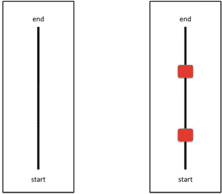

# 11.介绍光传感器和颜色传感器

乐高头脑风暴 EV3/NXT 套件带有四个常见的传感器:触摸传感器，颜色传感器，光传感器和超声波传感器。继第 [10](10.html) 章中的触摸传感器和超声波传感器之后，在本章中，您将为轮式机器人添加光传感器和颜色传感器，以提高它在房间内移动时对周围环境的感知。

特别是，本章将涵盖以下主题:

*   光传感器简介
*   颜色传感器简介
*   颜色和光线传感器的编程实践

## 光敏感元件

在 NXT 2.0 中，光传感器和颜色传感器集成到同一个硬件中。如图 [11-1](#Fig1) 所示，光线传感器由传感器正面的一个小透镜组成。


图 11-1。

Lego NXT 2.0 light sensor

光传感器测量由镜头捕获的光的强度，然后执行一组功能。通过将光传感器指向下方，机器人可以跟随一条黑线或由任何其他颜色组成的线。通过使用传感器，您还可以防止您的机器人移动到线的边缘，因为当物体远离时，光值会显著降低。换句话说，远处的物体反射的光不如近处的物体多。此外，光传感器可以区分暗物体和亮物体，因为暗物体反射回的光较少。

要使用光线传感器，首先使用以下构造函数创建它的一个实例:

```java
public ColorSensor(SensorPort port);

```

然后，一旦有了`ColorSensor`的实例，使用方法`setFloodlight`关闭颜色检测，这样`ColorSensor`通过使用`Color.NONE`只检测环境光，如下所示。然后使用`getLightValue()`方法返回一个 0 到 100 之间的数字，其中灯光越亮，灯光值越高。

```java
setFloodlight(Color.NONE)

int lightvalue  = getLightValue()

```

下面是一个示例程序，它使用连接到 S3 港的光线传感器读取当前光线值。

```java
//******************************************************************
//Wei Lu Java Robotics Programming with Lego EV3/NXT2.0 ch11p1.java
//an example for light sensor testing
//******************************************************************

import lejos.nxt.*;

import lejos.robotics.Color;

public class ch11p1 {
        public static void main(String[] args) throws Exception {

                // Get an instance of the color/light sensor of NXT 2.0
ColorSensor lightsensor = new ColorSensor(SensorPort.S1);

                // turn off the color detection, detecting light only
                lightsensor.setFloodlight(Color.NONE);

                LCD.clear();

// keep receiving light value until an Escape button is // pressed
                while (!Button.ESCAPE.isPressed()) {
LCD.drawInt(lightsensor.getLightValue(), 4, 0, 0);
                }

                // clean out the LCD screen
                LCD.clear();
        }
}

```

## 颜色传感器

如前所述，在 Lego NXT 2.0 中，颜色传感器和光线传感器都集成在同一个硬件中。与光传感器类似，颜色传感器也可以用于检测不同的颜色。如图 [11-1](#Fig1) 所示，在硬件传感器的侧面有一个内置的从多色发光二极管发出红色、蓝色或绿色光的灯。通过实现`ColorDetector`接口，颜色传感器可以读取红色、绿色和蓝色值，或者它可以从调色板中识别颜色。要识别简单的预定义颜色，可以使用`getColorID()`方法，该方法返回一个表示颜色常数的整数。

```java
int getColor()

```

这些值在`lejos.robotics.Color`类中预定义。例如，`Color.GREEN`表示绿色光谱中的颜色值。您也可以使用以下代码检索 RGB 值:

```java
ColorPick cp = new ColorSensor(SensorPort.S1);
Color colorvalue = cp.getColor();

int green = colorvalue.getGreen();

```

Color 类可以通过使用`Color.getColor()`方法进一步识别色谱，该方法从调色板中返回一个颜色常数。

下面是一个示例程序，它通过识别光线中的不同颜色来测试您的颜色传感器是否正常工作。

```java
//******************************************************************
//Wei Lu Java Robotics Programming with Lego EV3/NXT2.0 ch11p2.java
//an example for color sensor testing
//******************************************************************

import java.util.ArrayList;

import lejos.nxt.Button;

import lejos.nxt.LCD;

import lejos.nxt.SensorPort;

import lejos.robotics.Color;

import lejos.util.Stopwatch;

import sensors.ColorStruct;

import sensors.SensorControl;

import sensors.UnsupportedSensorException;

/**
 * Demonstrates the use of color sensors
 */

public class ch11p2 {

        // The port to use for color sensing
        private static SensorPort _colorPort = SensorPort.S1;

// Stores the number of characters that fit on one line of the // LCD screen.
        private static int LCD_DISP_WIDTH = 16;

        public static void main(String[] args) {
                try {
                        runColorSenseDemo();
                } catch (UnsupportedOperationException e) {
                        handleError(e, true);
                } catch (Throwable e) {
                        handleError(e, false);
                }
        }

        /**
         * Demonstrate color sensing
         *
         * @throws UnsupportedSensorException
 *             Thrown if _colorPort does not specify a valid   
 *  color sending
         *             port
         */
        private static void runColorSenseDemo() throws UnsupportedSensorException {
                LCD.drawString("Press to begin…", 0, 0);
                Button.waitForPress();
                SensorControl sControl = new SensorControl(null, null, _colorPort, null);
                while (!Button.ESCAPE.isPressed()) {
                        ColorStruct cvalue = sControl.getSensedColor();
                        Color cv = sControl.getRGBColor();
                        LCD.clear();
                        LCD.drawString("Color: " + cvalue, 0, 0);
                        LCD.drawString("Sensed:", 0, 1);
                        LCD.drawString(
                                        cv.getRed() + " " + cv.getGreen() + " " + cv.getBlue(), 0,2);

                }
        }

        /**
         * Prints an error on the LCD screen so that it does not run
 * off the screen,
         * then waits for escape to be pressed to continue.
         *
         * @param message
         *            The message to display on the LCD screen.
         * @param expected
 *            Flag indicating if the exception was expected or   
 *        caught as
         *            part of a blanket-catch.
         */
        private static void handleError(Throwable ex, boolean expected) {
                String message;
                if (expected) {
                        message = "ERROR: " + ex.getClass().toString() + ex.getMessage();
                } else {
                        message = "UNEXPECTED ERR: " + ex.getClass().toString() + ex.getMessage();
                }

                LCD.clear();
                ArrayList<String> messageSplit = new ArrayList<String>();

                // split the message in 16-character segments
                while (message.length() > LCD_DISP_WIDTH) {
                        messageSplit.add(new String(message.substring(0, LCD_DISP_WIDTH)));
                        message = message.substring(LCD_DISP_WIDTH, message.length());
                }

                int printRow = 0;
                Stopwatch sw = new Stopwatch();
                // print all of the messages
                for (String msg : messageSplit) {
                        LCD.drawString("Here", 0, 4);
                        LCD.drawString("CLS:" + ex.getClass().toString(), 0, 5);
                        sw.reset();
                        while (sw.elapsed() < 1000)
                                Thread.yield();
                        LCD.drawString(msg, 0, printRow);
                        printRow++;
                }
                LCD.refresh();
                LCD.drawString("Press to exit…", 0, printRow);
                Button.waitForPress();
        }
}

```

## 颜色和光线传感器的编程实践

在本编程练习中，您的任务是设计并编程 Mindstorms NXT 2.0 机器人，使其在两个预定义的路线中导航。第一个球场是由白底黑线定义的区域，第二个球场配备了障碍物——也就是黑线上的两个盒子。你的机器人应该认识到什么时候有障碍物挡住了它的路，绕过障碍物，然后重新加入这条路，继续走到路的尽头。图 [11-2](#Fig2) 展示了你的机器人将要探索的两条路线，其中红色方框表示障碍物。



图 11-2。

Two courses for programming practice with color/light sensor

在本编程练习中，您将创建一个具有以下功能的循线机器人:

1.  你的机器人可以直接沿着黑线从起点到终点。您不必硬编码颜色来指示您是跟随白色背景上的黑色轨迹还是黑色背景上的白色轨迹。相反，您的程序允许您在启动时选择线条和背景颜色，然后等待按钮启动运行。
2.  您的机器人可以避开到达终点途中的障碍，然后它可以顺利地重新加入原路线，直到到达目的地。

下面的程序，`ch11p3.` `java`被设计成没有任何障碍地跟随第一个程序。

```java
//******************************************************************
//Wei Lu Java Robotics Programming with Lego EV3/NXT2.0 ch11p3.java
//This program allows your robot to follow a line.
//If line is lost the robot will rotate left and right at increasing //angles
//until the line is found again.
//******************************************************************

import lejos.nxt.Button;

import lejos.nxt.ColorSensor;

import lejos.nxt.LCD;

import lejos.nxt.Motor;

import lejos.nxt.SensorPort;

import lejos.robotics.navigation.DifferentialPilot;

public class ch11p3
{
        public static void main(String[] args)
        {
// set up differential pilot and nav path controller to // use for navigation
                DifferentialPilot pilot = new DifferentialPilot(4.32f, 12.2f, Motor.A, Motor.C);
                pilot.setTravelSpeed(4);

                //set up color sensor
                ColorSensor colorSense = new ColorSensor(SensorPort.S1);
                colorSense.setFloodlight(false);

                //used to store values returned by color sensor
//follow is color robot is to follow, search is value //returned by sensor when searching
                int follow, search;

                //degrees robot will rotate when searching for line
                int rotation;

                //calibrate sensor
                LCD.drawString("Place color sensor\nabove color to follow", 0, 0);
                Button.waitForPress();
                follow = colorSense.getColorID();

                // place robot on start and wait for button press to
// begin main loop
                LCD.clear();
                LCD.drawString("Place robot", 0, 0);
                Button.waitForPress();

                // main loop
// follow line. if line is lost turn left and right to // search for it
                while(!Button.ESCAPE.isPressed())
                {
                        rotation = 5;
search = colorSense.getColorID(); //make sure we // are still on the line

                        //line is found continue forward
                        while(search == follow)
                        {
                                pilot.forward();
                                search = colorSense.getColorID();
                        }

                        //line lost
                        while(search != follow)
                        {
                                pilot.rotate(rotation); //rotate right
                                search = colorSense.getColorID();
                                if(search == follow)
                                        break; //found line again exit loop
                                else

                                {
                                        pilot.rotate(-rotation * 2); //rotate left back to start then to left position
                                        search = colorSense.getColorID();
                                        if(search == follow)
                                                break;        
//found line again exit loop

                                        pilot.rotate(rotation);
//rotate back to center
                                }
                                rotation+=5; //increase angle of rotation // and continue search
                        }//end search
                }//end main loop
        }//end main()
}//end ch11p3

```

下面的程序`ch11p4.java`，是设计来跟随第二条路线，避开任何障碍物的。

```java
//******************************************************************
// Wei Lu Java Robotics Programming with Lego EV3/NXT2.0 ch11p4.java
// Program that allows your robot to follow a line. It uses the
// ultrasonic

// sensor to detect if an object is in its path while following the // line.
// If an object is detected the robot will leave the line and travel // around
// the object. It will then search for the line and continue
// traveling.
//******************************************************************

import lejos.nxt.Button;

import lejos.nxt.ColorSensor;

import lejos.nxt.LCD;

import lejos.nxt.Motor;

import lejos.nxt.SensorPort;

import lejos.nxt.UltrasonicSensor;

import lejos.robotics.navigation.DifferentialPilot;

public class ch11p4 {

        public static void main(String[] args) {
// set up differential pilot and nav path controller to // use for
                // navigation
                DifferentialPilot pilot = new DifferentialPilot(4.32f, 12.2f, Motor.A,
                                Motor.C);
                pilot.setTravelSpeed(5);

                UltrasonicSensor ultra = new UltrasonicSensor(SensorPort.S4);

                // set up color sensor
                ColorSensor colorSense = new ColorSensor(SensorPort.S1);
                colorSense.setFloodlight(false);

                // used to store values returned by color sensor
// follow is color robot is to follow, search is value // returned by
                // sensor when searching
                int follow, search;

                // degrees robot will rotate when searching for line
                int rotation;

                // calibrate sensor
                LCD.drawString("Place color sensor\nabove color to follow", 0, 0);
                Button.waitForPress();
                follow = colorSense.getColorID();

                // place robot on start and wait for button press to
// begin main loop
                LCD.clear();
                LCD.drawString("Place robot", 0, 0);
                Button.waitForPress();

                // main loop
// follow line. if line is lost turn left and right to // search for it
                while (!Button.ESCAPE.isPressed()) {
                        rotation = 5;
                        search = colorSense.getColorID();
// make sure we // are still on the// line

                        // line is found continue forward
                        while (search == follow) {
                                // object detected
                                if (ultra.getDistance() <= 10) {
                                        // execute 90 degree turn to
// navigate around object
                                        pilot.rotate(90);
                                        pilot.travel(10);
                                        pilot.rotate(-90);
                                        pilot.travel(30);
                                        pilot.rotate(-90);
                                        search = colorSense.getColorID();

                                        // find line again
                                        while (search != follow) {
                                                pilot.forward();
                                                search = colorSense.getColorID();

// line found, rotate until // following again
                                                if (search == follow) {
                                                        pilot.rotate(90);
                                                        break;
                                                }
                                        }
                                }

                                // continue following line
                                pilot.forward();
                                search = colorSense.getColorID();
                        }

                        // line lost
                        while (search != follow) {
                                pilot.rotate(rotation); // rotate right
                                search = colorSense.getColorID();
                                if (search == follow)
                                        break; // found line again exit loop
                                else {
                                        pilot.rotate(-rotation * 2);
// rotate left back to start
   // then to left position
                                        search = colorSense.getColorID();
                                        if (search == follow)
                                                break;
// found line again exit loop

                                        pilot.rotate(rotation);
// rotate back to center
                                }
                                rotation += 5; // increase angle of
// rotation and continue search
                        }// end search
                }// end main loop
        }// end main()
}

```

## 摘要

在本章中，您学习了光线传感器和颜色传感器的功能，以及这两种传感器的工作原理。您还熟悉了光传感器和颜色传感器的使用，并学习了如何应用 leJOS NXJ JAVA 编程来控制和操作它们，以使您的机器人能够与其周围环境进行交互。

在下一章，你将开始学习基于 leJOS 中定义的包容架构的行为编程。您还将了解如何在 leJOS Java 编程中应用仲裁器来控制和操作触摸传感器、超声波传感器和颜色传感器，按照一组行为的顺序，为机器人提供与其周围环境交互的能力。