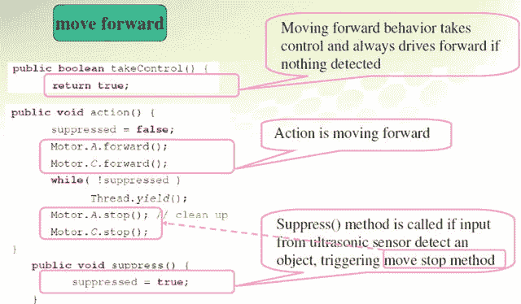

# 12.行为编程导论

机器人有能力通过使用行为编程来实现一系列类似人类的行为，如感知、规划和行动。在这一章中，你将学习基于 leJOS 中定义的包容架构的行为编程。您还将了解如何在 leJOS JAVA 编程中应用仲裁器，以一组行为的特定顺序来控制和操作触摸传感器、超声波传感器和颜色传感器，从而赋予机器人与其周围环境交互的能力。

特别是，本章将涵盖以下主题:

*   行为编程导论
*   行为 API 函数
*   行为编程的设计模式
*   行为编程实践

## 行为编程导论

行为编程是基于感觉-计划-行动控制模型的，在你开始编码之前，它需要更多的计划。通过感知，机器人通过视觉、触觉、声音和距离获取周围环境的信息。通过规划，机器人利用感官信息来决定行动。通过行动，机器人使用它的运动部件来完成计划。通过实现 Sense-Plan-Act 模型，从理论上讲，熟悉行为控制模型的其他程序员会更容易理解您的代码。此外，通过行为编程，您可以更容易地从整体结构中添加或删除特定的行为，而不会对代码的其余部分产生负面影响。

基于行为的机器人编程是设定一系列要执行的行为或要完成的目标的行为。几个简单的行为可以组合起来，理论上可以在现实世界中形成一个非常复杂的逻辑模型。基于行为的机器人编程理论最初是受昆虫的启发，被称为“硬连线思维”，由麻省理工学院人工智能实验室的罗德尼·布鲁克斯于 1983 年提出，如图 [12-1](#Fig1) 所示。


图 12-1。

Insects “hard-wired thinking ”

包容架构是一种广泛用于机器人编程的方法，它与基于行为的机器人技术密切相关。包容架构是一种将复杂的智能行为分解成许多更简单的行为模块的方法。依次地，这些被组织成不同的层。每一层都实现代理的一个特定目标，更高的层越来越抽象。例如，机器人的底层可以是“躲避物体”相比之下，在那一层之上的可能是“四处游荡”的人下一个更高的层次可能是“探索世界”，等等。这些层中的每一层都可以访问所有的传感器数据，并为致动器生成一组动作。使用这种方法，较低层可以充当快速适应机制，而较高层则努力实现总体目标。

Java leJOS 中实现的行为编程的概念遵循以下四条规则:

1.  任何时候都应该只有一种行为是活动的，并且在机器人的控制之下。
2.  每个行为都有一个预定义的固定优先级数。
3.  每种行为都有能力决定是否应该控制。
4.  优先级高于任何其他行为的活动行为应该进行控制。

一般来说，机器人的行为编程是一个解决问题的过程，在设计程序时，您可以按照所示的顺序执行以下步骤:

1.  你想让机器人做什么？
2.  机器人必须如何表现才能完成任务？
3.  把复杂的任务分解成几个简单的行为，包括给每个行为分配一个优先级，一个优先级高的行为可能会停止当前的行为。
4.  使用 Java 编程语言创建程序。
5.  运行程序。
6.  机器人的行为符合要求吗？(它正确执行任务了吗？)如果没有，请执行以下操作:
    1.  先检查机器人。如果有问题，你能解决吗？
    2.  接下来，检查程序。有问题吗？你能修好它吗？
    3.  最后回到开头，重读任务。你的程序真的告诉机器人它应该做什么吗？ 

## 行为 API 函数

行为 API 有一个接口和一个类，即行为接口和仲裁器类。行为接口定义了单独的行为类，包括三个公共方法:`takeControl()`、`action()`和`suppress()`。一旦创建了所有的行为，就使用一个仲裁器来管理所有这些行为，以确定应该在什么时候激活哪一个行为。仲裁器类和行为接口位于`lejos.subsumption`包中。图 [12-2](#Fig2) 展示了 Java leJOS 中行为编程的工作原理。如图所示，行为接口中的三种方法都非常简单。假设您的机器人有三个独立的行为，那么您需要创建三个单独的类，每个类实现行为接口。一旦这些类完成，您的代码应该将行为对象交给仲裁器。仲裁器在`lejos.subsumption.Arbitrator`包中，其构造函数如下:


图 12-2。

Behavior programming

```java
public Arbitrator(Behavior[] behaviors, boolean returnWhenInactive)

```

这将创建一个仲裁器对象，它控制每个行为何时激活，其中参数`behaviors`用于索引数组中每个行为的优先级(例如，`behaviors[0]`具有最低优先级)，如果参数`boolean returnWhenInactive`的值为真，当没有行为想要控制时，程序退出。否则，程序将一直运行，直到按下 NXT 模块上的 Enter 和 Escape 按钮而关闭。只需使用一个公共方法`start()`，就可以启动仲裁系统。

当仲裁器对象被实例化时，它被赋予一个行为对象数组。一旦有了这些，就调用`start()`方法，并开始仲裁和确定哪个行为将被激活。仲裁器对每个行为对象调用`takeControl()`方法，从行为数组中索引号最高的对象开始。它按照优先级递减的顺序工作，直到找到想要控制的行为。如果此行为的优先级指数大于当前活动行为的优先级指数，则活动行为将被抑制。在这之后，对这个索引的行为调用`action()`方法。因此，如果有几个行为希望取得控制权，那么只有优先级最高的行为才会被激活。

## 行为编程的设计模式

为了控制行为控制系统的性能，当调用`suppress()`时，迅速终止`action()`方法是非常重要的。为了实现这一点，leJOS 实际上为行为编程定义了一个设计模式。在这个设计模式中，仲裁器包含一个监视线程来循环遍历每个行为，检查`takeControl()`方法来查看行为是否应该被激活。它从具有最高索引号的行为开始，沿着数组向下进行。一旦遇到一个应该控制的行为，监视器线程就对这个活动行为执行`suppress()`,然后再从头开始检查每个行为。

下面是一个真实世界的例子，以及如何使用设计模式概念来解决问题。

如图 [12-3](#Fig3) 所示，你想直线前进，当机器人前方有物体时，你可以绕过这个物体。在这种情况下，您有两种行为:

*   行为 1:当机器人前方检测到有物体时，向前移动。停止当前行为，开始行为 2。
*   行为 2:旋转机器人，绕过物体。


图 12-3。

Scenario for design pattern of behavior programming

图 [12-4](#Fig4) 展示了行为 1 向前发展的设计模式。



图 12-4。

Design pattern of Behavior 1 moving forward

图 [12-5](#Fig5) 显示了行为 2 旋转到旁路的设计模式。图 [12-6](#Fig6) 接着说明了如何使用设计模式方法管理这两种行为，包括如何设置一组行为以及如何启动编程的行为。


图 12-6。

Managing behaviors using design pattern


图 12-5。

Design pattern of Behavior 2 rotating to bypass

总而言之，使用设计模式来管理行为的想法在下面的例子中得到了说明:

1.  当仲裁器对象被实例化时，它被赋予一个数组中的一组行为。
2.  然后调用`start()`方法，仲裁器开始确定哪些行为应该被激活。
3.  仲裁器对每个行为调用`takeControl()`方法，从数组中索引号最高的对象开始。
4.  然后仲裁器遍历每个行为，直到找到想要控制的行为。当它遇到一个时，它执行该行为的`action()`方法一次，并且只执行一次。
5.  如果两个行为都想控制，那么只有更高级的行为才被允许。

## 行为编程的编程实践

在本编程练习中，您将创建一个循线机器人，该机器人通过基于包容架构的行为编程满足以下要求:

*   行为 1:你的机器人可以从起点一直沿着绿线走，直到到达第一个障碍箱。
*   行为 2:你的机器人随后可以应用触摸传感器来检测这个障碍物，然后绕过第一个障碍物；也就是你可以让你的机器人向后移动，做一个适当的延迟，然后右转。
*   行为 3:在你的机器人绕过第一个障碍后，它将继续前进，然后回到这条线，它将沿着一条蓝色的线从它遇到的第一个障碍一直走到第二个障碍箱。
*   行为 4:你的机器人然后使用超声波传感器避免与第二个障碍物碰撞。一旦测距仪检测到第二个障碍物，机器人就会旋转远离物体，然后继续前进。
*   行为五:机器人在避开终点途中的障碍物后，再平滑地重新加入原来的蓝线，直到到达终点。

图 [12-7](#Fig7) 展示了这种编程实践的过程。


图 12-7。

Moving area for your programing practice

```java
//******************************************************************************
//Wei Lu Java Robotics Programming with Lego EV3/NXT2.0 ch12p1.java
//This program implements the leJOS behavior capabilities.
//The robot will begin following a green line. When the touch
//sensor is activated it will move around an object and search for a
//blue line. Then when it travels within 15cm of an object it will //avoid it
//and return to the blue line again.
//******************************************************************************

import lejos.nxt.Button;

import lejos.nxt.LCD;

import lejos.robotics.subsumption.Arbitrator;

import lejos.robotics.subsumption.Behavior;

public class ch12p1 {
        public static void main(String[] args) {
                // create a sensors object to send to the behavior
// classes
                Sensors sensors = new Sensors();

                // prompt to begin
                LCD.clear();
                LCD.drawString("Press to begin", 0, 0);
                Button.waitForPress();

                // set up behavior classes
                Behavior b1 = new FollowGreen(sensors);
                Behavior b2 = new TouchAvoid(sensors);
                Behavior b3 = new FollowBlue(sensors);
                Behavior b4 = new SonicAvoid(sensors);

                // create behavior array
                Behavior[] bArray = { b1, b3, b2, b4 };

                // send array to arbitrator and begin
                Arbitrator arby = new Arbitrator(bArray);
                arby.start();
        }
}
//*********************************************************
//Wei Lu Java Robotics Programming with Lego EV3/NXT2.0
// FollowGreen.java
// This behavior follows a green line
//*********************************************************

import lejos.nxt.Motor;

import lejos.robotics.Color;

import lejos.robotics.navigation.DifferentialPilot;

import lejos.robotics.subsumption.Behavior;

public class FollowGreen implements Behavior {
        private boolean suppressed;
        // used to store values returned by color sensor
        // follow is color robot is to follow, search is value //returned by sensor
        // when searching
        private int follow, search;

        // degrees robot will rotate when searching for line
        int rotation;
        // set up differential pilot and nav path controller to use //for navigation
        private DifferentialPilot pilot = new DifferentialPilot(4.32f, 12.2f,
                        Motor.A, Motor.C);

        Sensors sensors;

        public FollowGreen(Sensors globalSensors) {
                sensors = globalSensors;
                suppressed = false;
                pilot.setTravelSpeed(4);
                sensors.colorSense.setFloodlight(false);
                follow = Color.GREEN;
        }

        @Override
        public boolean takeControl() {
                return true;
        }

        @Override
        public void action() {
                suppressed = false;
                search = sensors.colorSense.getColorID();

                // move forward while line is green
                while (!suppressed) {
                        Thread.yield();
                        while (search == follow && !suppressed) {
                                pilot.forward();
                                search = sensors.colorSense.getColorID();
                                Thread.yield();
                        }

                        // line lost
                        while (search != follow && !suppressed) {
                                pilot.rotate(rotation); // rotate right
                                search = sensors.colorSense.getColorID();
                                Thread.yield();
                                if (search == follow)
                                        break; // found line again exit loop
                                else {
                                        pilot.rotate(-rotation * 2);
// rotate left back to start
                                                                    // then to left position
                                        search = sensors.colorSense.getColorID();
                                        Thread.yield();
                                        if (search == follow)
                                                break; // found line again //exit loop

                                        pilot.rotate(rotation); // rotate //back to center
                                }
                                rotation += 5; // increase angle of //rotation and continue search
                                Thread.yield();
                        }// end search
                        Thread.yield();
                }
        }

        @Override
        public void suppress() {
                suppressed = true;
        }
}// end FollowGreen

//*********************************************************************************
//Wei Lu Java Robotics Programming with Lego EV3/NXT2.0         
//        Sensors.java
//Class to store sensor objects to make them available in all //behavior classes
//*********************************************************************************

import lejos.nxt.ColorSensor;

import lejos.nxt.SensorPort;

import lejos.nxt.TouchSensor;

import lejos.nxt.UltrasonicSensor;

public class Sensors {
        ColorSensor colorSense;
        TouchSensor touch;
        UltrasonicSensor sonic;
        boolean touchPressed = false; // used for take control method //in followBlue
                                                                        //behavior

        public Sensors() {
                // set up color, touch, and sonic sensors
                colorSense = new ColorSensor(SensorPort.S1);
                touch = new TouchSensor(SensorPort.S2);
                sonic = new UltrasonicSensor(SensorPort.S4);

        }
}

//***************************************************************************
//Wei Lu Java Robotics Programming with Lego EV3/NXT2.0 //SonicAvoid.java
//This behavior avoids objects using the ultra sonic sensor
//***************************************************************************

import lejos.nxt.LCD;

import lejos.nxt.Motor;

import lejos.robotics.Color;

import lejos.robotics.navigation.DifferentialPilot;

import lejos.robotics.subsumption.Behavior;

public class SonicAvoid implements Behavior {
        // set up differential pilot
        private DifferentialPilot pilot = new DifferentialPilot(4.32f, 12.2f,
                        Motor.A, Motor.C);
        private boolean suppressed;
        private int follow, search;
        Sensors sensors;

        public SonicAvoid(Sensors globalSensors) {
                pilot.setTravelSpeed(4);
                suppressed = false;
                follow = Color.WHITE;
                sensors = globalSensors;
        }

        // take control when within 15 cm of an object and on a blue //line
        @Override
        public boolean takeControl() {
                return (sensors.sonic.getDistance() < 15 && sensors.colorSense
                                .getColorID() == Color.WHITE);
        }

        @Override
        public void action() {
                LCD.drawString("Sonic triggered", 0, 0);
                suppressed = false;

                // stop and move around object
                pilot.stop();
                // execute 90 degree turn to navigate around object
                pilot.rotate(90);
                pilot.travel(10);
                pilot.rotate(-90);
                pilot.travel(30);
                pilot.rotate(-90);

                search = sensors.colorSense.getColorID();

                // find line again
                while (search != follow && !suppressed) {
                        LCD.drawString("HERE I AM", 0, 0);
                        pilot.forward();
                        search = sensors.colorSense.getColorID();

                        // line found, rotate until following again
                        if (search == follow) {
                                pilot.rotate(90);
                                suppressed = true;
                                break;
                        }
                        Thread.yield();
                }
        }

        @Override
        public void suppress() {
                suppressed = true;
        }

}

//**************************************************************************
//Wei Lu Java Robotics Programming with Lego EV3/NXT2.0 //TouchAvoid.java
//This class represents a robotic behavior when the touch sensor
//is activated
//**************************************************************************

import lejos.nxt.LCD;

import lejos.nxt.Motor;

import lejos.robotics.Color;

import lejos.robotics.navigation.DifferentialPilot;

import lejos.robotics.subsumption.Behavior;

public class TouchAvoid implements Behavior {
        // set up differential pilot
        private DifferentialPilot pilot = new DifferentialPilot(4.32f, 12.2f,
                        Motor.A, Motor.C);
        private boolean suppressed;
        private int follow, search;
        Sensors sensors;

        public TouchAvoid(Sensors globalSensors) {
                pilot.setTravelSpeed(4);
                suppressed = false;
                follow = Color.WHITE; // color to follow when
// relocating line
                sensors = globalSensors;
        }

        @Override
        public boolean takeControl() {
                return sensors.touch.isPressed(); // behavior takes
// control when touch
                                                                                        // sensor is pressed
        }

        @Override
        public void action() // avoid the object
        {
                LCD.drawString("BUTTON IS PRESSED", 0, 0);
                sensors.touchPressed = true; // set flag in sensor //class so robot knows

// to follow different color later
                suppressed = false;

                // moves to avoid object
                pilot.stop();
                pilot.travel(-15);
                // execute 90 degree turn to navigate around object
                pilot.rotate(90);
                pilot.travel(10);
                pilot.rotate(-90);
                pilot.travel(30);
                pilot.rotate(-90);

                search = sensors.colorSense.getColorID();

                // find line again
                while (search != follow && !suppressed) {
                        // LCD.clear();
                        pilot.forward();
                        search = sensors.colorSense.getColorID();
                        LCD.drawString("search: " + Integer.toString(search), 0, 0);
                        LCD.drawString("follow: " + follow, 0, 1);

                        // line found, rotate until following again
                        if (search == follow) {
                                pilot.rotate(90);
                                suppressed = true;
                                break;
                        }
                        Thread.yield();
                }
        }

        @Override
        public void suppress() {
                suppressed = true;
        }

}

//******************************************************************
//Wei Lu Java Robotics Programming with Lego EV3/NXT2.0         
//FollowBlue.java
//This behavior follows a blue line
//******************************************************************

import lejos.nxt.ColorSensor;

import lejos.nxt.Motor;

import lejos.nxt.SensorPort;

import lejos.robotics.Color;

import lejos.robotics.navigation.DifferentialPilot;

import lejos.robotics.subsumption.Behavior;

public class FollowBlue implements Behavior {
        private boolean suppressed;
        // used to store values returned by color sensor
        // follow is color robot is to follow, search is value //returned by sensor
        // when searching
        private int follow, search;

        // degrees robot will rotate when searching for line
        int rotation;
        // set up differential pilot and nav path controller to use //for navigation
        private DifferentialPilot pilot = new DifferentialPilot(4.32f, 12.2f,
                        Motor.A, Motor.C);

        Sensors sensors;

        public FollowBlue(Sensors globalSensors) {
                sensors = globalSensors;
                suppressed = false;
                pilot.setTravelSpeed(4);
                sensors.colorSense.setFloodlight(false);
                follow = Color.WHITE;
        }

        @Override
        public boolean takeControl() {
                return sensors.touchPressed; // we want this to be the default behavior

// after the touch sensor has been

// pressed
        }

        @Override
        public void action() {
                suppressed = false;
                search = sensors.colorSense.getColorID();

                // move forward if the line is the right color
                while (!suppressed) {
                        Thread.yield();
                        while (search == follow && !suppressed) {
                                pilot.forward();
                                search = sensors.colorSense.getColorID();
                                Thread.yield();
                        }

                        // line lost
                        while (search != follow && !suppressed) {
                                pilot.rotate(rotation); // rotate right
                                search = sensors.colorSense.getColorID();
                                Thread.yield();
                                if (search == follow)
                                        break; // found line again exit loop
                                else {
                                        pilot.rotate(-rotation * 2);
// rotate left back to start
                                                                                                        // then to left position
                                        search = sensors.colorSense.getColorID();
                                        Thread.yield();
                                        if (search == follow)
                                                break;
// found line again exit loop

                                        pilot.rotate(rotation);
// rotate back to center
                                }
                                rotation += 5; // increase angle of //rotation and continue search
                                Thread.yield();
                        }// end search
                        Thread.yield();
                }
        }

        @Override
        public void suppress() {
                suppressed = true;
        }
}// end FollowBlue

```

## 摘要

在这一章中，你学习了如何使用 leJOS 中定义的包容架构进行行为编程。您还学习了如何在 leJOS Java 编程语言中应用仲裁器，以一组行为的特定顺序控制和操作触摸传感器、超声波传感器和颜色传感器，从而赋予机器人与其周围环境交互的能力。

在下一章中，您将学习 Java leJOS 多线程编程的基本概念，然后学习如何应用它来控制和操作颜色传感器、触摸传感器和超声波传感器，以使您的机器人能够与其周围环境进行交互。