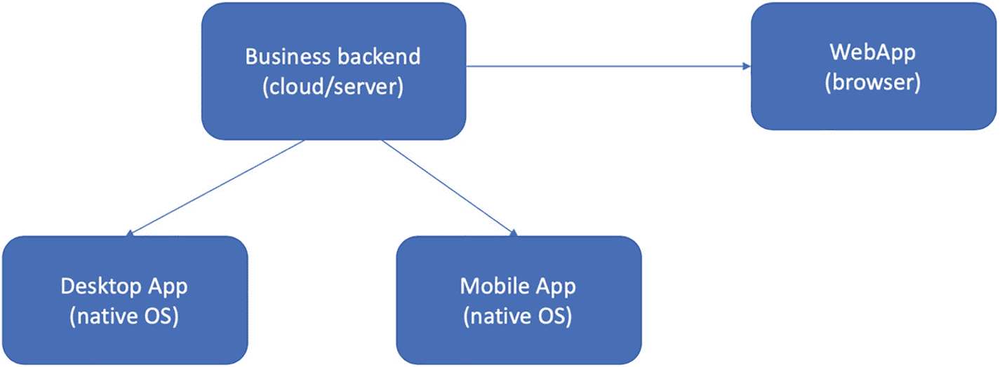
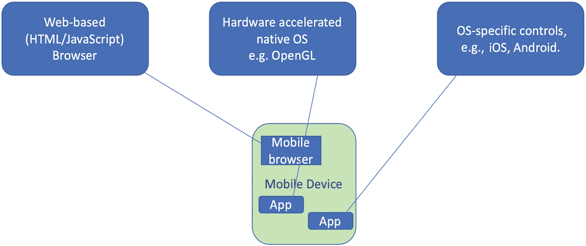
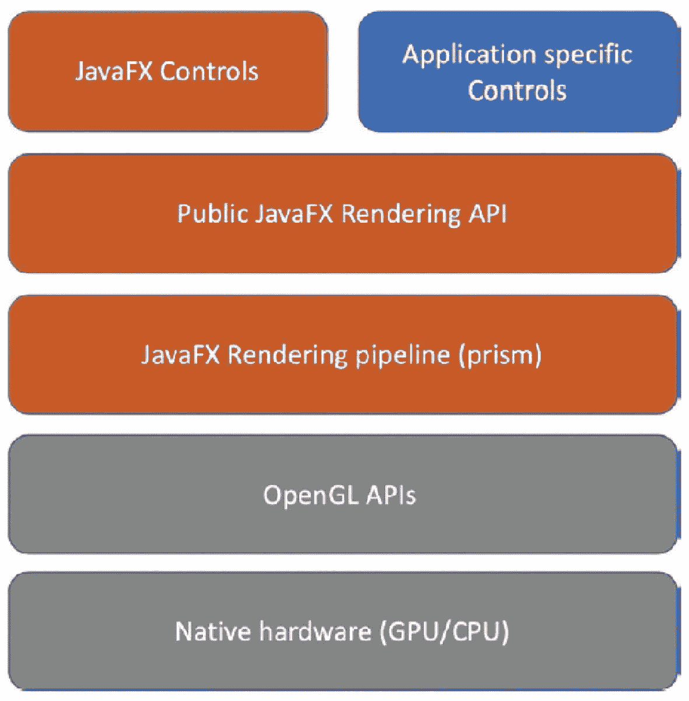
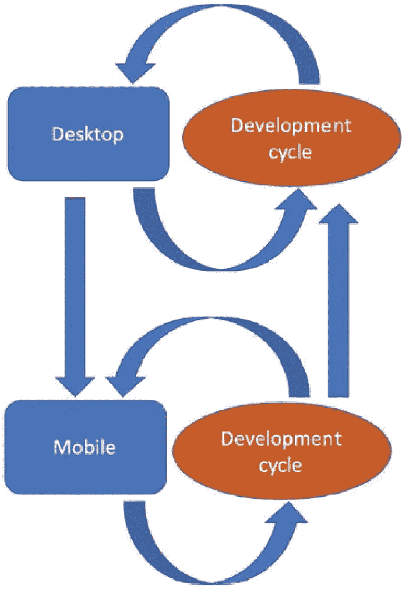
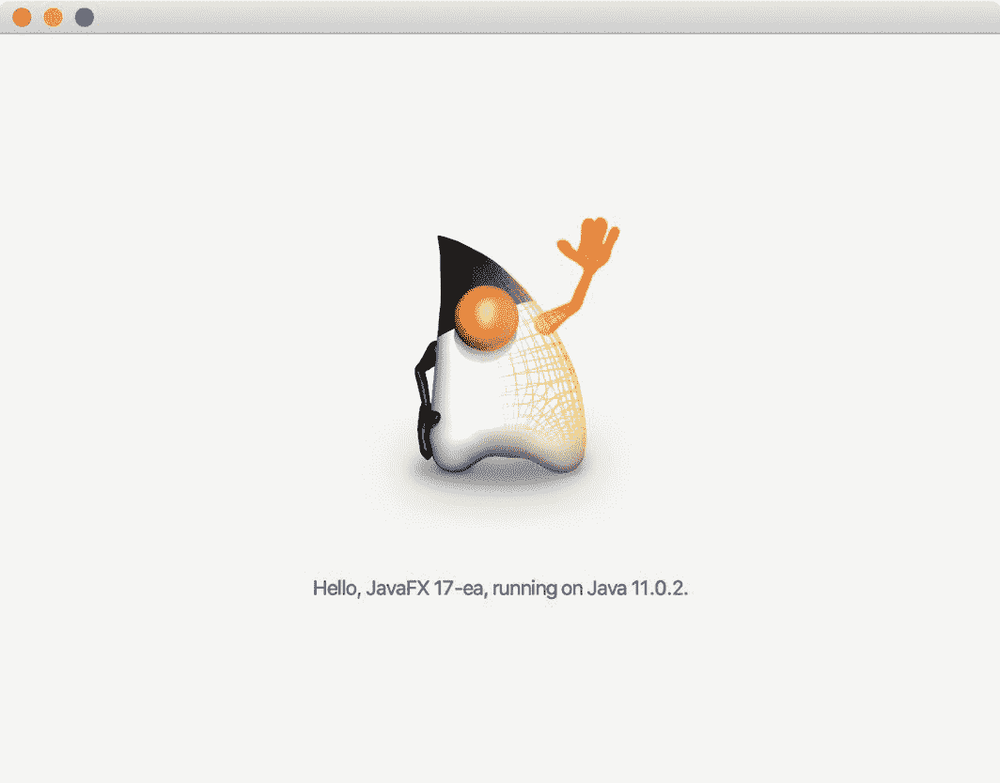
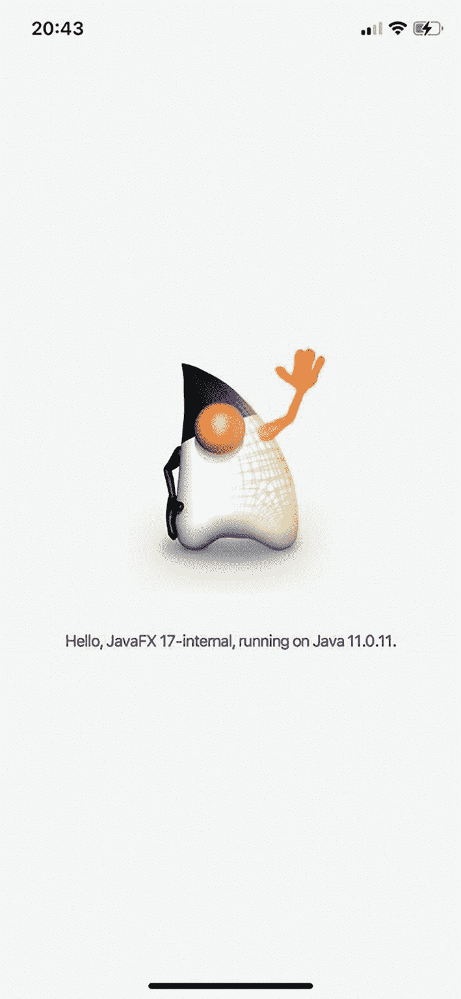
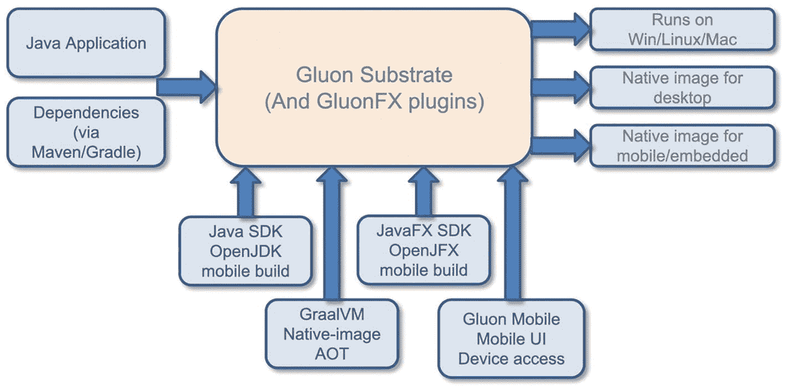
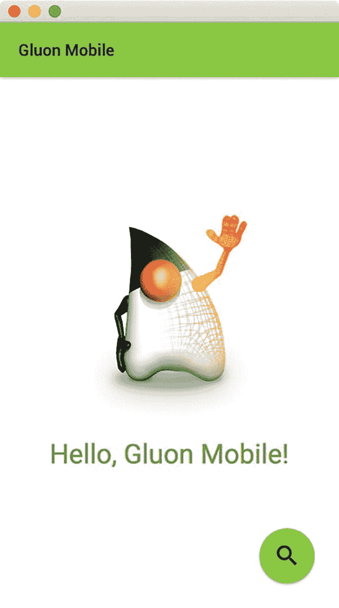

# 11.iOS 和 Android 的原生移动应用

由何塞·佩雷达和约翰·沃斯撰写

Java 最初是作为嵌入式设备的编程语言出现的。20 世纪 90 年代初，Sun Microsystems 内部的一个团队为一组下一代硬件产品开发了一个软件堆栈。

这些硬件产品的原型被称为 Star7，看起来像是介于手机和平板电脑之间的东西。这些设备的软件最初代号为 Oak，也就是我们现在所知的 Java。

硬件和软件的发展走上了截然不同的道路。Java 软件因使用小程序制作网页动画而大受欢迎，后来成为开发企业和云应用程序的首选语言。

手机和设备制造商、电信运营商和内容提供商之间的复杂互动决定了硬件的发展。商业模式非常分散，在很长一段时间里，开发者一般都不容易接触到移动设备。

随着应用商店的日益流行，开发人员为移动平台编写应用变得更加容易。此外，现在大多数手机要么基于 Android，要么基于 iOS。这减少了两个主要平台的碎片。

由于 Java 最初是为移动和嵌入式系统开发的，所以创建 Java 应用程序并在移动设备上运行它们是非常有意义的，特别是因为 Java 领域最近的发展使得向移动设备交付高性能应用程序变得很容易。

## 为什么在移动设备上使用 JavaFX

在当今的数字基础设施中，网页通常用于以简单的方式呈现来自后端的信息。

台式机和笔记本电脑系统广泛用于处理需要用户交互、数据同步、高性能渲染和云集成的应用程序。因此，它们补充了 web 应用程序。

IT 领域的发展导致移动设备的重要性日益增加，例如手机和平板电脑。因此，IT 后端现在必须服务于三个不同的渠道:基于 web 的前端、桌面应用程序和移动应用程序。如图 [11-1](#Fig1) 所示。



图 11-1

服务于不同渠道的业务后端

JavaFX 是 Java，因此支持一次编写，随处运行的范例，非常适合创建在台式机和笔记本电脑上运行的应用程序，但也可以在手机和平板电脑上运行。

在前一章中，我们展示了如何将 JavaFX 应用程序转换成客户机本地的应用程序。当我们谈论“本地”时，我们指的是两个事物的组合:

1.  代码在设备的本地方法中执行。交付给手机的应用程序直接执行机器代码，而不是在设备上解释或翻译。这允许快速执行。

2.  没有中间呈现引擎(例如，浏览器)，JavaFX 控件直接使用客户端上可用的硬件加速图形引擎来呈现。

在本章中，我们将解释如何在移动设备上部署 JavaFX 应用程序，从而利用在这些设备上使用的硬件加速的本机渲染。

### 移动应用的不同方法

为移动设备创建应用程序有多种方法，它们可以分为多种类别。任何分类都是人为的，所以我们在这里使用的只是一种可能性。

我们考虑三种不同的方法，如图 [11-2](#Fig2) 所示:



图 11-2

移动应用的三种可能方式

1.  基于网络的移动应用

2.  使用硬件加速本地渲染的应用

3.  使用特定于操作系统的本机控件的应用程序

这些选项各有优势，三个选项都有有效的用例。

## 特定于操作系统的本机控件

使用特定于操作系统的本机控件，如方法 3 中的情况，可以实现与本机操作系统的真正平滑集成。在这种情况下，本地控件(例如，按钮、标签、列表等。)用于呈现用户界面。对于最终用户来说，这是很方便的，因为他们认识到他们在其他应用程序中也使用的典型 UI 组件。

这种方法需要与目标操作系统相关的非常特殊的技能。由于大多数移动应用程序同时面向 Android 和 iOS，并且这些平台都有自己的原生用户界面方法，因此遵循这种方法的应用程序通常由不同的团队创建:一个用于 Android，一个用于 iOS。

此外，特定于操作系统的本机控件会发生快速变化。虽然许多最终用户喜欢这些环境中的快速创新，但对于软件开发人员来说，这往往是一个问题，因为他们必须经常升级他们的原生应用程序，否则他们可能会过时。

## 移动网站

最简单的方法通常是简单地创建一个移动友好的网站，并在移动设备上可用的移动浏览器中呈现——可选地与应用程序图标集成，以便用户可以更容易地启动应用程序。

理论上，用于在桌面浏览器中呈现的同一网站可以在移动设备上呈现。然而，这些网站通常是为大屏幕创建的，并且使用鼠标控制来操作。使用鼠标点击按钮比在触摸设备上触摸相同的按钮更容易。一般来说，网络体验与移动体验有很大不同。习惯在移动设备上使用原生应用的用户经常对网站感到失望，这损害了品牌。

## 设备本机呈现

JavaFX 方法就属于这一类。JavaFX 有自己的一套控件，开发者可以轻松创建自己的控件。JavaFX 的渲染是在目标平台的硬件加速驱动程序之上完成的。目前，用于 iOS 的 JavaFX 和用于 Android 的 JavaFX 的渲染管道都使用 OpenGL，使用与 macOS 和 Linux 上的渲染相同的代码。OpenGL 是一个非常成熟和稳定的协议，iOS 或 Android 的原生 UI 控件的变化并不影响 OpenGL 的开发。事实上，许多游戏开发者也在使用原生 OpenGL，他们希望在移动设备上实现最大的性能和灵活性。

与使用 web 浏览器进行渲染相比，JavaFX 渲染更加“本机”，因为它不需要中间 web 浏览器，而是直接针对用于渲染本机 iOS 或本机 Android 控件的相同本机驱动程序。

就其核心而言，iOS 和大多数 Android 设备都是采用 AArch64 处理器的系统，运行某种 Linux。这些系统，以及 OpenGL，在业界被广泛使用，而不是由一个移动设备制造商控制。因此，它们提供了一个稳定的基础，避免了供应商锁定。

特定于应用的 JavaFX 堆栈如图 [11-3](#Fig3) 所示。



图 11-3

JavaFX 堆栈

## 你好，iOS 和 Android 上的 JavaFX

虽然 Android 和 iOS 是非常不同的系统，但 Java 开发人员的体验将非常相似。因此，虽然我们在这里只讨论 iOS，但是同样的原理和工具也适用于 Android。

### GluonFX 插件降低复杂性

将应用程序部署到移动设备比在本地开发机器(笔记本电脑或台式机)上部署应用程序稍微复杂一些。这主要有两个原因:

*   当编译一个必须在与我们用来编译的系统相同的系统上执行的应用程序时，我们可以利用开发系统的现有工具链，包括编译器和链接器。然而，在为另一个系统编译应用程序时，我们需要考虑操作系统和该系统的体系结构。这通常被称为交叉编译，被认为更复杂。

*   移动应用商店的运营商 Google 和 Apple 对于创建移动应用都有自己的附加要求，例如，与签名和最终可执行包的结构相关的要求。

Java 普遍成功的原因之一是庞大的生态系统。不同的公司和个人提供了一套工具和库，使得开发人员更容易从事他们的项目。

对于移动设备上的 JavaFX，Gluon 创建了许多插件，使得 Java 开发人员可以更容易地在移动设备上部署 Java 应用程序。这些插件处理交叉编译的复杂性和来自各自应用商店的特定需求。

这些插件目前可用于 Maven 和 Gradle 项目。由于流行的 Java IDEs 对 Maven 和 Gradle 有一流的支持，所以很容易使用现有的 ide 来创建和维护移动 JavaFX 应用程序。

在我们的项目中使用 Maven 或 Gradle 构建工具，我们可以使用 GluonFX 插件在我们的本地(开发)系统上运行项目(依赖于 JavaFX 插件),还可以创建一个可以部署到目标平台的本地映像。

### 开发流程

虽然至少在理论上，可以创建一个移动应用程序，并且只在移动设备上测试/运行它，但是强烈建议首先在桌面上工作。

典型的部署周期包含许多步骤:

*   写点代码。

*   编译代码。

*   运行代码。

*   测试输出和行为是否符合预期。

这些步骤经常需要重复，导致给定项目的许多部署周期。

应该清楚的是，移动设备上的部署周期比桌面设备上的部署周期花费更多的时间。尤其是对移动设备来说，编译代码需要更多的时间。因此，最好使用您的台式机或笔记本电脑开发系统进行部署。我们将在下面描述的工具使您能够在移动和桌面设备上使用完全相同的代码，并且行为也是相似的。

当然，移动体验仍然是不同的，这只能在移动设备上进行真正的测试。例如，旋转、收缩和缩放等手势必须在特定的移动设备上进行微调，以便尽可能直观。

典型的移动应用开发流程如图 [11-4](#Fig4) 所示。



图 11-4

移动应用的开发流程

在参考图中，大部分开发是在桌面上完成的。应用程序得到了改进，包括业务逻辑部分和 UI 部分。在这个阶段，像`NullPointerException` s、错误的值或不正确的 UI 元素这样的问题被修复。

在给定的时刻，应用程序在桌面上按预期工作。业务逻辑符合需求，UI 遵循设计。此时，应用程序被部署在移动设备上并经过测试。作为这些测试的结果，在桌面或移动设备上执行新的周期。例如，如果在移动设备上的测试导致一个隐藏的问题浮出水面，建议返回到桌面周期并添加一个失败的测试。这个问题可以在桌面上解决。

另一方面，如果检测到特定于移动设备的问题(例如，缩放太快)，则该问题可以在移动设备上的开发周期中直接修复。

### 《守则》

我们将向您展示一个非常简单的 HelloFX 应用程序，它可以在桌面和 iPhone 或 Android 设备上运行。这个例子可以在这里找到(Gradle 和 Maven):

```java
https://github.com/modernclientjava/mcj-samples/tree/master/ch11-Mobile/Gradle/HelloFX
https://github.com/modernclientjava/mcj-samples/tree/master/ch11-Mobile/Maven/HelloFX

```

清单 [11-1](#PC2) 显示了 HelloFX 主类，清单 [11-2](#PC3) 显示了 styles.css 文件。

```java
.label {
    -fx-text-fill: blue;
}

Listing 11-2File styles.css

```

```java
package hellofx;
import javafx.application.Application;
import javafx.geometry.Pos;
import javafx.scene.Scene;
import javafx.scene.control.Label;
import javafx.scene.image.Image;
import javafx.scene.image.ImageView;
import javafx.scene.layout.VBox;
import javafx.stage.Stage;
public class HelloFX extends Application {
    public void start(Stage stage) {
        String javaVersion = System.getProperty("java.version");
        String javafxVersion = System.getProperty("javafx.version");
        Label label = new Label("Hello, JavaFX " + javafxVersion +
           ", running on Java " + javaVersion + ".");
        ImageView imageView = new ImageView(
           new Image(HelloFX.class.getResourceAsStream("openduke.png")));
        imageView.setFitHeight(200);
        imageView.setPreserveRatio(true);
        VBox root = new VBox(30, imageView, label);
        root.setAlignment(Pos.CENTER);
        Scene scene = new Scene(root, 640, 480);
        scene.getStylesheets().add(
           HelloFX.class.getResource("styles.css").toExternalForm());
        stage.setScene(scene);
        stage.show();
    }
   public static void main(String[] args) {
        launch(args);
    }
}

Listing 11-1HelloFX.java file

```

清单 [11-3](#PC4) 显示了 build.gradle 文件，清单 [11-4](#PC5) 显示了 gradle 项目的 settings.gradle 文件。

```java
pluginManagement {
    repositories {
         gradlePluginPortal()
    }
}
rootProject.name = 'HelloFX'

Listing 11-4File settings.gradle

```

```java
plugins {
    id 'application'
    id 'org.openjfx.javafxplugin' version '0.0.10'
    id 'com.gluonhq.gluonfx-gradle-plugin' version '1.0.3'
}

repositories {
    mavenCentral()
}

dependencies {
}

gluonfx {
    target = 'host'
    if (project.hasProperty('target')) {
        target = project.getProperty('target')
    }
}

javafx {
    version = "17.0.1"
    modules = [ "javafx.controls" ]
}

mainClassName = 'hellofx.HelloFX'

Listing 11-3File build.gradle

```

`build.gradle`文件显示，除了常规的应用程序插件，我们还使用了两个特殊的插件:

```java
    id 'org.openjfx.javafxplugin' version '0.0.10'
    id 'com.gluonhq.gluonfx-gradle-plugin' version '1.0.3'

```

`javafxplugin`是开发 JavaFX 应用程序和处理 JavaFX 模块和依赖关系的通用插件。这是您通常用于开发 JavaFX 应用程序的插件。

`gluonfx-gradle-plugin`是 Gluon 的插件，能够为 iOS 和 Android 设备交叉编译代码。

为了使用这些插件，我们必须告诉 Gradle 在哪里搜索插件，这些插件位于通用的 Gradle 插件门户中。这解释了清单 [11-4](#PC5) 中显示的`settings.gradle`文件。

与 Gradle 的构建文件类似，您可以使用 pom 文件来声明如何使用 Maven 构建应用程序。

清单 [11-5](#PC7) 显示了一个 Maven 项目的等价 pom 文件。

```java
<?xml version="1.0" encoding="UTF-8"?>
<project xmlns:="http://maven.apache.org/POM/4.0.0" xmlns:xsi="http://www.w3.org/2001/XMLSchema-instance" xsi:schemaLocation="http://maven.apache.org/POM/4.0.0 http://maven.apache.org/xsd/maven-4.0.0.xsd">
    <modelVersion>4.0.0</modelVersion>

    <groupId>hello</groupId>
    <artifactId>hellofx</artifactId>
    <version>1.0-SNAPSHOT</version>
    <packaging>jar</packaging>

    <name>hellofx</name>

    <properties>
        <project.build.sourceEncoding>UTF-8</project.build.sourceEncoding>
        <maven.compiler.release>11</maven.compiler.release>
        <javafx.version>17.0.1</javafx.version>
        <mainClassName>hellofx.HelloFX</mainClassName>
    </properties>

    <dependencies>
        <dependency>
            <groupId>org.openjfx</groupId>
            <artifactId>javafx-controls</artifactId>
            <version>${javafx.version}</version>
        </dependency>
    </dependencies>

    <build>
        <plugins>
            <plugin>
                <groupId>org.apache.maven.plugins</groupId>
                <artifactId>maven-compiler-plugin</artifactId>
                <version>3.8.1</version>
            </plugin>

            <plugin>
                <groupId>org.openjfx</groupId>
                <artifactId>javafx-maven-plugin</artifactId>
                <version>0.0.8</version>
                <configuration>
                    <mainClass>${mainClassName}</mainClass>
                </configuration>
            </plugin>

            <plugin>
                <groupId>com.gluonhq</groupId>
                <artifactId>gluonfx-maven-plugin</artifactId>
                <version>1.0.7</version>
                <configuration>
                    <target>${gluonfx.target}</target>
                    <mainClass>${mainClassName}</mainClass>
                </configuration>
            </plugin>

        </plugins>
    </build>

    <profiles>
        <profile>
            <id>ios</id>
            <properties>
                <gluonfx.target>ios</gluonfx.target>
            </properties>
        </profile>
        <profile>
            <id>android</id>
            <properties>
                <gluonfx.target>android</gluonfx.target>
            </properties>
        </profile>
    </profiles>

</project>

Listing 11-5File pom.xml

```

#### ios

##### 要求

要使用该插件在 iOS 平台上开发和部署本机应用程序，您需要一台装有 macOS 10.15.6 或更高版本以及 Xcode 11 或更高版本的 Mac，可从 Mac App Store 获得。下载并安装 Xcode 后，打开它接受许可条款。

或者，在没有 Mac 的情况下，GitHub Actions 可以用于远程构建和部署(参见 [`https://docs.gluonhq.com/#platforms_ios_github_actions`](https://docs.gluonhq.com/#platforms_ios_github_actions) )。

JavaFX 应用程序可以在 JVM 上运行，不需要任何额外的要求，因此任何 JDK 11+都应该足够了。然而，要创建本地映像并部署到移动设备，您将需要 GraalVM。胶子建造版本的最新版本可以在 [`https://github.com/gluonhq/graal/releases/latest`](https://github.com/gluonhq/graal/releases/latest) 找到。选择 macOS 的 Darwin 版本。

一旦下载并安装，你需要设置`GRAALVM_HOME`指向它，就像

```java
export GRAALVM_HOME=
     /path/to/graalvm-svm-darwin-gluon-21.2.0-dev/Contents/Home
export JAVA_HOME=$GRAALVM_HOME

```

最后，如果你想通过 App Store 测试和发布你的应用，你需要加入苹果开发者计划。但是，如果你只想在你自己的 iOS 设备上测试，你可以使用*免费供应*。

按照此链接中的说明获取有效的预置描述文件和有效的签名身份: [`https://docs.gluonhq.com/client/#_ios_deployment`](https://docs.gluonhq.com/client/#_ios_deployment) 。

#### 构建项目

第一步是将项目作为一个常规的 Java 项目来构建和运行(在一个用于本地开发的常规 JVM 上)。

与格雷尔:

```java
    ./gradlew clean run

```

使用 Maven:

```java
    mvn clean gluonfx:run

```

结果如图 [11-5](#Fig5) 所示。



图 11-5

在 OpenJDK 11.0.2 上运行 HelloFX

这些指令将编译应用程序及其依赖项，并使用系统的默认 Java 虚拟机运行生成的类。这与任何其他常规 Java 开发非常相似。这里不涉及交叉编译。

正如我们之前所说的，使用常规虚拟机验证应用程序在您的开发系统上正常工作是非常重要的。部署到移动设备时将执行的 AOT 编译需要很长时间，因此只有当项目准备好进入这个阶段时才应该调用它。

##### 编制

典型的 Gradle `run`任务将检查应用程序是否已编译；否则，它将重新编译所需的类。

对于在移动设备上运行的应用程序，编译任务必须手动调用，因为这可能需要很长时间。这是为了允许开发者修改与 Java 文件无关的东西(但是，例如，与应用程序图标无关)，而不必每次都经历漫长的编译阶段。

Gradle 和 Maven 都可以进行编译。

与 Gradle 一起运行:

```java
    ./gradlew -Ptarget=ios nativeCompile

```

与 Maven 一起运行:

```java
    mvn -Pios gluonfx:compile

```

然后等待一段时间(取决于您的机器，可能需要 5 分钟或更长时间)，直到任务成功完成。如果您检查终端，您可以看到过程中提供的反馈，如清单 [11-6](#PC13) 所示。

```java
==================== COMPILE TASK ====================
We will now compile your code for arm64-apple-ios. This may take some time.
[SUB] [hellofx.hellofx:19668]    classlist:   2,087.16 ms,  0.96 GB
[SUB] [hellofx.hellofx:19668]        (cap):     206.66 ms,  0.96 GB
[SUB] [hellofx.hellofx:19668]        setup:   2,126.59 ms,  0.96 GB
[SUB] [hellofx.hellofx:19668]     (clinit):     850.75 ms,  5.56 GB
[SUB] [hellofx.hellofx:19668]   (typeflow):  36,924.18 ms,  5.56 GB
[SUB] [hellofx.hellofx:19668]    (objects):  29,823.15 ms,  5.56 GB
[SUB] [hellofx.hellofx:19668]   (features):   2,873.60 ms,  5.56 GB
[SUB] [hellofx.hellofx:19668]     analysis:  72,256.12 ms,  5.56 GB
[SUB] [hellofx.hellofx:19668]     universe:   2,483.79 ms,  5.66 GB
[SUB] [hellofx.hellofx:19668]      (parse):   3,013.34 ms,  5.66 GB
[SUB] [hellofx.hellofx:19668]     (inline):  12,337.56 ms,  7.09 GB
[SUB] [hellofx.hellofx:19668]    (compile):  41,955.76 ms,  6.97 GB
[SUB] [hellofx.hellofx:19668]    (bitcode):   4,023.85 ms,  6.97 GB
[SUB] [hellofx.hellofx:19668]    (prelink):   8,245.57 ms,  6.97 GB
[SUB] [hellofx.hellofx:19668]       (llvm): 118,298.09 ms,  6.97 GB
[SUB] [hellofx.hellofx:19668]   (postlink):  12,859.86 ms,  6.97 GB
[SUB] [hellofx.hellofx:19668]      compile: 201,311.01 ms,  6.97 GB
[SUB] [hellofx.hellofx:19668]        image:  11,973.28 ms,  7.05 GB
[SUB] [hellofx.hellofx:19668]        write:   2,908.47 ms,  7.05 GB
[SUB] [hellofx.hellofx:19668]      [total]: 295,742.00 ms,  7.05 GB

Listing 11-6Output during the native compilation phase for iOS

```

结果在`target/gluonfx/arm64-ios/gvm/tmp/SVM-16` *** `/hellofx.hellofx.o`下可以找到 54.6 MB 的 hellofx.hellofx.o。

如果不是这样，请在`target/gluonfx/arm64-ios/gvm/log`下的日志文件中检查任何可能的故障。

接下来的步骤会更快，但它们需要有效的签名身份和有效的预置描述文件，以便您在应用程序部署到设备之前对其进行签名。

##### 链接和包

既然应用程序的 Java 代码已经编译成本机代码，我们就可以将生成的代码与所需的库和资源打包在一起，对应用程序进行签名，并执行更多特定于 iOS 的任务。

插件在`nativeLink`任务中结合了这种打包。

与 Gradle 一起运行:

```java
    ./gradlew -Ptarget=ios nativeLink

```

与 Maven 一起运行:

```java
    mvn -Pios gluonfx:link

```

它产生 target/Glu onfx/arm 64-IOs/hello FX . app(136.3 MB)。

现在，如果你想构建一个可以提交到 App Store 的 IPA 文件(见 [`https://docs.gluonhq.com/#platforms_ios_distribution`](https://docs.gluonhq.com/#platforms_ios_distribution) ，可以运行

```java
    ./gradlew -Ptarget=ios nativePackage

```

或者与 Maven 一起运行:

```java
    mvn -Pios gluonfx:package

```

##### 奔跑

恭喜你！您的手机应用程序现已准备就绪！您可以将此应用程序部署到您的手机上，如下所述。

插入你的 iOS 设备，运行 Gradle:

```java
    ./gradlew -Ptarget=ios nativeRun

```

或者与 Maven 一起运行:

```java
    mvn -Pios gluonfx:nativerun

```

请注意，您需要解锁您的设备。一旦安装，它将启动(图 [11-6](#Fig6) )。



图 11-6

iOS 上的 HelloFX 应用

#### 机器人

#### 要求

要使用该插件在 Android 上开发和部署本地应用程序，您需要一台 Linux 机器。或者，你可以从 Windows PC 上使用 WSL2 ( [`https://docs.microsoft.com/en-us/windows/wsl/install-win10`](https://docs.microsoft.com/en-us/windows/wsl/install-win10) )，也可以使用 GitHub 动作远程完成(参见 [`https://docs.gluonhq.com/#platforms_android_github_actions`](https://docs.gluonhq.com/#platforms_android_github_actions) )。

JavaFX 应用程序可以在 JVM 上运行，不需要任何额外的要求，因此任何 JDK 11+都应该足够了。然而，要创建本地映像并部署到移动设备，您将需要 GraalVM。胶子建造版本的最新版本可以在 [`https://github.com/gluonhq/graal/releases/latest`](https://github.com/gluonhq/graal/releases/latest) 找到。选择 Linux 版本。

一旦下载并安装，你需要设置`GRAALVM_HOME`指向它，就像

```java
export GRAALVM_HOME=
     /path/to/graalvm-svm-linux-gluon-21.2.0-dev/
export JAVA_HOME=$GRAALVM_HOME

```

Android SDK 和 NDK 需要为 Android 平台构建应用程序。两者都将被 GluonFX 插件自动下载并配置所需的包。

##### 编制

Gradle 和 Maven 都可以进行编译。

与 Gradle 一起运行:

```java
    ./gradlew -Ptarget=android nativeCompile

```

与 Maven 一起运行:

```java
    mvn -Pandroid gluonfx:compile

```

然后等待一段时间(取决于您的机器，可能需要 3 分钟或更长时间)，直到任务成功完成。如果您检查终端，您可以看到过程中提供的反馈，如清单 [11-7](#PC23) 所示。

```java
==================== COMPILE TASK ====================
We will now compile your code for aarch64-linux-android. This may take some time.
[SUB] Warning: Ignoring server-mode native-image argument --no-server.
[SUB] [hellofx.hellofx:4176]    classlist:   1,692.66 ms,  0.96 GB
[SUB] [hellofx.hellofx:4176]        (cap):     222.33 ms,  0.96 GB
[SUB] [hellofx.hellofx:4176]        setup:   2,350.95 ms,  0.96 GB
[SUB] [hellofx.hellofx:4176]     (clinit):   1,055.23 ms,  5.45 GB
[SUB] [hellofx.hellofx:4176]   (typeflow):  26,771.58 ms,  5.45 GB
[SUB] [hellofx.hellofx:4176]    (objects):  30,115.69 ms,  5.45 GB
[SUB] [hellofx.hellofx:4176]   (features):   2,812.99 ms,  5.45 GB
[SUB] [hellofx.hellofx:4176]     analysis:  62,782.08 ms,  5.45 GB
[SUB] [hellofx.hellofx:4176]     universe:   2,307.81 ms,  5.45 GB
[SUB] [hellofx.hellofx:4176]      (parse):   2,497.79 ms,  5.45 GB
[SUB] [hellofx.hellofx:4176]     (inline):   3,905.41 ms,  5.66 GB
[SUB] [hellofx.hellofx:4176]    (compile):  46,861.15 ms,  6.27 GB
[SUB] [hellofx.hellofx:4176]      compile:  56,083.83 ms,  6.27 GB
[SUB] [hellofx.hellofx:4176]        image:   9,097.73 ms,  5.37 GB
[SUB] [hellofx.hellofx:4176]        write:     558.92 ms,  5.37 GB
[SUB] [hellofx.hellofx:4176]      [total]: 135,607.09 ms,  5.37 GB

Listing 11-7Output during the native compilation phase for Android

```

结果在`target/gluonfx/aarch64-android/gvm/tmp/SVM-16` *** `/hellofx.hellofx.o`下可以找到 84.7 MB 的 hellofx.hellofx.o。

如果不是这样，请在`target/gluonfx/aarch64-android/gvm/log`下的日志文件中检查任何可能的故障。

##### 链接和包

既然应用程序的 Java 代码已经编译成本机代码，我们就可以将生成的代码与所需的库和资源链接并打包。

插件在任务`nativeLink`和`nativePackage`中结合了这种打包。

与 Gradle 一起运行:

```java
    ./gradlew -Ptarget=android nativeLink nativePackage

```

与 Maven 一起运行:

```java
    mvn -Pandroid gluonfx:link gluonfx:package

```

它产生`target/gluonfx/aarch64-android/gvm/hellofx.apk` (28.1 MB)。这个文件可以提交到 Google Play，前提是它已经被签署发布(见 [`https://docs.gluonhq.com/#platforms_android_distribution`](https://docs.gluonhq.com/#platforms_android_distribution) )。

##### 奔跑

您现在可以将这个 apk 部署到您的 Android 手机上，如下所述。

插入您的 Android 设备，并运行 Gradle:

```java
    ./gradlew -Ptarget=android nativeInstall nativeRun

```

或者与 Maven 一起运行:

```java
    mvn -Pandroid gluonfx:install gluonfx:nativerun

```

一旦安装，它将启动(图 [11-7](#Fig7) )。


图 11-7

Android 上的 HelloFX 应用程序

## 它是如何工作的？

作为一名普通的 Java 开发人员，尤其是 JavaFX 开发人员，您可以专注于 Java APIs，并实现使您的应用程序工作所需的代码。Java 平台本身将确保您的 Java 应用程序被翻译成 Java 字节码，该字节码不依赖于操作系统(例如，Windows、macOS、Linux 变体、iOS)或处理器(例如，ARM 64、Intel x86-64、ARMv6hf)。

典型的 Java 方法是，下一步，在本地系统上执行 Java 字节码，是使用在目标系统上运行的 Java 虚拟机(JVM)来实现的。在这种情况下，JVM 使用特定于目标的本机指令解释字节码并执行它。大多数 JVM 还包含一个实时(JIT)编译器，可以将常用的 Java 方法动态转换为本机代码。一般来说，本机代码比解释代码运行得快得多；因此，Java 应用程序的性能通常会在运行一段时间后得到提高。将 Java 字节码编译成本机代码需要一些时间，而且在此期间应用程序正在运行，因此不会立即达到最佳性能。

在前一章中，我们介绍了用于创建基于 JavaFX 应用程序的本机包的 Graal 本机映像工具。前一章中讨论的优点同样适用于移动设备，而且在移动设备上使用这种方法还有另外一个原因。苹果不允许在 iOS 设备上运行时生成动态代码。因此，典型的 Java 方法，即首先解释代码，然后(在运行时)优化代码，在 iOS 设备上是不允许的。

仅在运行时使用解释器运行移动 Java 应用程序是可能的，但是解释器比执行本地代码慢得多。

最重要的是，一个 JVM 安装可以处理大量应用程序的(旧的)服务器端方法在移动设备上并不常见。移动应用程序是自包含的应用程序，捆绑了它们所有的依赖关系——除了本机操作系统提供的一小组 API。在运行时下载额外的库或组件来满足特定应用程序所需的依赖是绝对不行的。

上一节演示的 Gluon 客户端插件包含将 Java 应用程序转换成字节码所需的工具；调用 Graal 本机映像工具将字节码转换为本机代码，包括所需的 VM 功能；并将结果链接到可部署到移动设备的可执行文件中。

这示意性地显示在图 [11-8](#Fig8) 中。



图 11-8

本机应用程序工作流

由 Gluon 客户端工具获得的结果原生映像在概念上与使用特定于 OS 的工具(例如，用于创建 iOS 应用的 Xcode 和用于创建 Android 应用的 Android Studio)创建的原生映像没有区别。开发人员仍然需要将这个图像上传到应用程序商店，从而记录应用程序、提供屏幕截图等等。

## 使用插件选项

默认情况下，插件将使用最佳配置将您的应用程序部署到移动设备上。插件和 GraalVM 中的不同组件分析您的代码及其依赖关系，以决定是否包含原生库、使用反射和 JNI 等等。预计这些分析工具将随着时间的推移而改进。

因为目前不可能用分析工具覆盖所有的边缘情况，所以插件允许开发者设置配置特定的设置(例如，用于反射的附加类，包括本地符号等)。)

### 联邦主义者

将添加到已包含的默认捆绑包列表中的附加完全限定捆绑包资源列表

```java
     com/sun/javafx/scene/control/skin/resources/controls
     com.sun.javafx.tk.quantum.QuantumMessagesBundle

```

例如，如果您使用一个用于内部化目的的资源包，比如`src/resources/hellofx/hello.properties`(和`hello_EN.properties`等等)，您将需要使用 Gradle，

```java
bundlesList = ["hellofx.hello"]

```

或者使用 Maven

```java
<bundlesList>
    <list>hellofx.hello</list>
</bundlesList>

```

### 资源列表

将添加到默认资源列表中的附加资源模式或扩展的列表，默认资源列表已经包括

```java
   png, jpg, jpeg, gif, bmp, ttf, raw
   xml, fxml, css, gls, json, dat,
   license, frag, vert, obj

```

例如，如果你正在使用一个属性文件(没有包含在资源包中)，比如`src/resources/hellofx/logging.properties`，你将需要使用 Gradle，

```java
resourcesList = ["properties"]

```

或者使用 Maven

```java
<resourcesList>
    <list>properties</list>
</resourcesList>

```

### 反射列表

将添加到默认反射列表中的附加完全限定类的列表，默认反射列表已经包含了大多数 JavaFX 类。

当前列表被添加到下的文件中

```java
{build/target}/gluonfx/gvm/reflectionconfig-$target.json

```

### 金利斯特

将添加到默认 JNI 列表中的附加完全限定类的列表，该列表已经包含了大多数 JavaFX 类。

当前列表被添加到下的文件中

```java
{build/target}/gluonfx/gvm/jniconfig-$target.json

```

### 运行代理任务/目标

作为反射和 JNI 列表的替代，runAgent 任务在桌面上运行项目，与`javafx-maven-plugin`、GraalVM 的 JVM (HotSpot)和`native-image-agent`相结合来记录 Java 应用程序的行为。它为反射、JNI、资源、代理和序列化生成配置文件，这些文件将由本机映像生成使用。

如果需要，这个目标应该在其他目标之前执行，并且需要用户干预来发现所有可到达的类，通过运行 Gradle:

```java
    ./gradlew runAgent

```

或者与 Maven 一起运行:

```java
    mvn gluonfx:runagent

```

## 创建真正的移动应用

虽然为桌面创建的 JavaFX 应用程序可以在移动设备上运行，但在许多情况下，您可以通过调整应用程序以适应移动应用来改善用户体验。这样做，你最终得到的是特定于移动设备的代码，而不是特定于桌面设备的代码，你可能会问，与用本地语言进行移动开发相比，这有什么优势。不过，这有一些很好的理由:

*   您的大部分应用程序代码仍然可以共享。所有的业务逻辑，还有很大一部分 UI 代码，都可以在移动端和桌面端共享。

*   有了合适的框架(例如，Glisten)，许多现有的 JavaFX 控件都可以进行移动应用。在这种情况下，使用完全相同的 JavaFX 代码。

*   对于移动和桌面之间完全不同的 UI 组件，至少代码都是用 Java 编写的，可以由相同的开发人员编写，由相同的工具编译，并集成到相同的 CI 基础架构中。

一个好的客户端应用程序架构可以清晰地将业务逻辑和 UI 组件分开。在 JavaFX 中，应用程序的 UI 部分可以被进一步分离。数据通常保存在`ObservableObject`或`ObservableList`的实例中，它们与 UI 组件的渲染细节没有直接关系——因此，它们可以被认为是通用组件的一部分。

有许多方法可以使 JavaFX 应用程序的 UI 组件更加移动化，我们将简要讨论以下内容:

*   对移动和桌面使用不同的样式表。

*   对手机使用特定的控制。

Gluon 的 glorin 框架[参见 [`https://docs.gluonhq.com/#_glisten_apis`](https://docs.gluonhq.com/#_glisten_apis) ]是 Gluon Mobile 的一部分，结合了这两种方法。

### 不同的样式表

JavaFX 用户界面灵活且易于更改的原因之一是因为对 CSS 的支持，这将在第 [5](05.html) 章“掌握可视化和 CSS 设计”中讨论样式表使用 CSS 文件以声明的方式定义了用户界面不同组件的外观。它们与实现逻辑是分离的，这允许许多组合。

看看我们在本章前面讨论的 HelloFX 应用程序的代码，在 JavaFX 应用程序中添加样式表很容易，例如，在应用程序的`start`方法中:

```java
        Scene scene = new Scene(root, 640, 480);
        scene.getStylesheets().add(
            HelloFX.class.getResource("styles.css").toExternalForm());

```

在这段代码中，我们将名为`styles.css`的样式表添加到场景图中。我们在这里使用的样式表非常简单，它描述了一个`Label`控件中文本的样式:

```java
.label {
    -fx-text-fill: blue;
}

```

我们可以创建第二个样式表，将`-fx-text-fill`属性设置为不同的颜色，例如红色。

我们可以将`styles.css`文件复制到`styles2.css`并编辑如下:

```java
.label {
    -fx-text-fill: red;
}

```

我们现在修改应用程序，以便加载这个样式表，而不是原来的样式表:

```java
        Scene scene = new Scene(root, 640, 480);
        scene.getStylesheets().add(
            HelloFX.class.getResource("styles2.css").toExternalForm());

```

如果我们现在运行这个应用程序，我们会看到文本颜色确实发生了变化，如图 [11-9](#Fig9) 所示。

这显示了通过提供不同的样式表来重新配置应用程序的用户界面是多么容易，但是我们现在为所有部署更改了样式表。我们真正想要的是基于目标平台加载不同的样式表。

一个简单的解决方案是检查系统属性" [`os.name`](http://os.name) "，并基于此加载不同的样式表，如下面的代码片段所示:

```java
        Scene scene = new Scene(root, 640, 480);
        If (System.getProperty("os.name").equals("ios")) {
            scene.getStylesheets().add(
                HelloFX.class.getResource("styles.css").toExternalForm());
        } else {
            scene.getStylesheets().add(
                HelloFX.class.getResource("styles2.css").toExternalForm());
        }

```

这个代码片段将导致在 iOS 系统(设备或模拟器)上运行的情况下应用`"styles.css"`样式表，在所有其他情况下将使用`"styles2.css"`样式表。


图 11-9

带有 CSS 的 HelloFX 应用程序

有了 Gluon Mobile，你可以走得更远。与 Gluon Mobile 捆绑的组件之一是开源框架 Gluon Attach，它是在 [`https://github.com/gluonhq/attach`](https://github.com/gluonhq/attach) 开发的。

Gluon Attach 包含许多服务，这些服务公开了一个 Java API，并使用特定的 API 在不同的平台上实现。由 Gluon Attach 实现的示例服务有位置、存储、应用内计费、图片、蓝牙低能耗等等。

使用 Attach，可以检测平台(例如 iOS 或 Android)和尺寸(例如手机或平板电脑)。这允许为 iPad 系统加载一个特定的样式表，为 Android 手机加载另一个特定的样式表。

下面的代码片段展示了如何检测到这一点，它将在每种情况下使用不同的样式表:

```java
        Scene scene = new Scene(root, 640, 480);
        if (Platform.isIOS()) {
            scene.getStylesheets().add(
                HelloFX.class.getResource("styles.css").toExternalForm());
        } else if (Platform.isAndroid()) {
            scene.getStylesheets().add(
                HelloFX.class.getResource("styles2.css").toExternalForm());
        }

```

在这种情况下，我们利用`com.gluonhq.attach.util.Platform`来获取应用程序运行的当前平台。

为了能够导入这个类，我们需要 build.gradle 文件中的依赖项，如清单 [11-8](#PC44) 所示。

```java
repositories {
    mavenCentral()
    maven {
        url 'https://nexus.gluonhq.com/nexus/content/repositories/releases'
    }
}
dependencies {
    implementation "com.gluonhq:charm-glisten:6.0.6"
    implementation "com.gluonhq.attach:util:4.0.11"
}

Listing 11-8Adding Attach to a Gradle project

```

我们在 pom 文件中需要类似的依赖，如清单 [11-9](#PC45) 所示。

```java
<dependencies>
    <dependency>
        <groupId>com.gluonhq</groupId>
        <artifactId>charm-glisten</artifactId>
        <version>6.0.6</version>
    </dependency>
    <dependency>
        <groupId>com.gluonhq.attach</groupId>
        <artifactId>util</artifactId>
        <version>4.0.11</version>
    </dependency>
</dependencies>
 <repositories>
    <repository>
        <id>Gluon</id>
        <url>
          https://nexus.gluonhq.com/nexus/content/repositories/releases
        </url>
    </repository>
</repositories>

Listing 11-9Adding Attach to a Maven project

```

### 特定于手机的控件

虽然我们可以用样式表做很多事情，但是有些控件确实只与移动设备相关。

为移动设备创建一个控件与为桌面应用程序创建一个控件没有什么不同，这已经在第 [7](07.html) 章“桥接 Swing 和 JavaFX”中讨论过了

Gluon Mobile 包含了许多特定于移动设备的控件，这些控件在典型的移动应用程序中经常遇到。这些控件的列表位于

```java
https://docs.gluonhq.com/charm/javadoc/6.0.6/com.gluonhq.charm.glisten/com/gluonhq/charm/glisten/control/package-summary.html

```

作为一个例子，我们将展示一个使用`FloatingActionButton`控件的应用程序。这个项目可以在这里找到(Gradle 和 Maven):

```java
https://github.com/modernclientjava/mcj-samples/tree/master/ch11-Mobile/Gradle/HelloGluon
https://github.com/modernclientjava/mcj-samples/tree/master/ch11-Mobile/Maven/HelloGluon

```

#### 《守则》

清单 [11-10](#PC48) 显示了`build.gradle`文件，清单 [11-11](#PC49) 显示了 Gradle 项目的`settings.gradle`文件。

```java
pluginManagement {
    repositories {

gradlePluginPortal()
    }
}

rootProject.name = 'HelloGluon'

Listing 11-11File settings.gradle

```

```java
plugins {
    id 'application'
    id 'org.openjfx.javafxplugin' version '0.0.10'
    id 'com.gluonhq.gluonfx-gradle-plugin' version '1.0.3'
}

repositories {
    mavenCentral()
    maven {
        url 'https://nexus.gluonhq.com/nexus/content/repositories/releases/'
    }
}

dependencies {
    implementation "com.gluonhq:charm-glisten:6.0.6"
}

gluonfx {
    target = 'host'
    if (project.hasProperty('target')) {
        target = project.getProperty('target')
    }

    attachConfig {
        version = "4.0.11"
        services 'display', 'lifecycle', 'statusbar', 'storage'
    }

}

javafx {
    version = "17-ea+16"
    modules = [ "javafx.controls" ]
}

mainClassName = "$moduleName/com.gluonhq.hello.HelloGluon"

Listing 11-10File build.gradle

```

如果您有一个 Maven 项目，清单 [11-12](#PC50) 显示了等价的 pom 文件。

```java
<?xml version="1.0" encoding="UTF-8"?>
<project xmlns:="http://maven.apache.org/POM/4.0.0" xmlns:xsi="http://www.w3.org/2001/XMLSchema-instance" xsi:schemaLocation="http://maven.apache.org/POM/4.0.0 http://maven.apache.org/xsd/maven-4.0.0.xsd">
    <modelVersion>4.0.0</modelVersion>

    <groupId>com.gluonhq.hello</groupId>
    <artifactId>hellogluon</artifactId>
    <version>1.0-SNAPSHOT</version>
    <packaging>jar</packaging>

    <name>hellogluon</name>

    <properties>
        <project.build.sourceEncoding>UTF-8</project.build.sourceEncoding>
        <maven.compiler.release>11</maven.compiler.release>
        <javafx.version>17.0.1</javafx.version>
        <attach.version>4.0.11</attach.version>
        <mainClassName>com.gluonhq.hello.HelloGluon</mainClassName>
    </properties>

    <dependencies>
        <dependency>
            <groupId>org.openjfx</groupId>
            <artifactId>javafx-controls</artifactId>
            <version>${javafx.version}</version>
        </dependency>
        <dependency>
            <groupId>com.gluonhq</groupId>
            <artifactId>charm-glisten</artifactId>
            <version>6.0.6</version>
        </dependency>
        <dependency>
            <groupId>com.gluonhq.attach</groupId>
            <artifactId>display</artifactId>
            <version>${attach.version}</version>
        </dependency>
        <dependency>
            <groupId>com.gluonhq.attach</groupId>
            <artifactId>lifecycle</artifactId>
            <version>${attach.version}</version>
        </dependency>
        <dependency>
            <groupId>com.gluonhq.attach</groupId>
            <artifactId>statusbar</artifactId>
            <version>${attach.version}</version>
        </dependency>
        <dependency>
            <groupId>com.gluonhq.attach</groupId>
            <artifactId>storage</artifactId>
            <version>${attach.version}</version>
        </dependency>
        <dependency>
            <groupId>com.gluonhq.attach</groupId>
            <artifactId>util</artifactId>
            <version>${attach.version}</version>
        </dependency>
    </dependencies>

    <repositories>
        <repository>
            <id>Gluon</id>
            <url>https://nexus.gluonhq.com/nexus/content/repositories/releases</url>
        </repository>
    </repositories>

    <build>
        <plugins>
            <plugin>
                <groupId>org.apache.maven.plugins</groupId>
                <artifactId>maven-compiler-plugin</artifactId>
                <version>3.8.1</version>
            </plugin>

            <plugin>
                <groupId>org.openjfx</groupId>
                <artifactId>javafx-maven-plugin</artifactId>
                <version>0.0.6</version>
                <configuration>
                    <mainClass>${mainClassName}</mainClass>
                </configuration>
            </plugin>

            <plugin>
                <groupId>com.gluonhq</groupId>
                <artifactId>gluonfx-maven-plugin</artifactId>
                <version>1.0.7</version>
                <configuration>
                    <target>${gluonfx.target}</target>
                    <attachList>
                        <list>display</list>
                        <list>lifecycle</list>
                        <list>statusbar</list>
                        <list>storage</list>
                    </attachList>
                    <mainClass>${mainClassName}</mainClass>
                </configuration>
            </plugin>
        </plugins>

    </build>

    <profiles>
        <profile>
            <id>ios</id>
            <properties>
                <gluonfx.target>ios</gluonfx.target>
            </properties>
        </profile>
        <profile>
            <id>android</id>
            <properties>
                <gluonfx.target>android</gluonfx.target>
            </properties>
        </profile>
    </profiles>
</project>

Listing 11-12pom.xml file

```

清单 [11-13](#PC51) 显示了`HelloGluon`主类，清单 [11-14](#PC52) 显示了 styles.css 文件。

```java
.label {
    -fx-font-size: 2em;
    -fx-text-fill: -primary-swatch-700;
}

Listing 11-14File styles.css

```

```java
package hellofx;

import com.gluonhq.attach.display.DisplayService;
import com.gluonhq.attach.util.Platform;
import com.gluonhq.charm.glisten.application.MobileApplication;
import com.gluonhq.charm.glisten.control.AppBar;
import com.gluonhq.charm.glisten.control.FloatingActionButton;
import com.gluonhq.charm.glisten.mvc.View;
import com.gluonhq.charm.glisten.visual.MaterialDesignIcon;
import com.gluonhq.charm.glisten.visual.Swatch;
import javafx.geometry.Dimension2D;
import javafx.geometry.Pos;
import javafx.scene.Scene;
import javafx.scene.control.Label;
import javafx.scene.image.Image;
import javafx.scene.image.ImageView;
import javafx.scene.layout.VBox;

public class HelloGluon extends MobileApplication {
    @Override
    public void init() {
        addViewFactory(HOME_VIEW, () -> {
            FloatingActionButton fab =
                new FloatingActionButton(MaterialDesignIcon.SEARCH.text,
                    e -> System.out.println("Search"));
            ImageView imageView = new ImageView(new Image(
                HelloGluon.class.getResourceAsStream("openduke.png")));
            imageView.setFitHeight(200);
            imageView.setPreserveRatio(true);
            Label label = new Label("Hello, Gluon Mobile!");
            VBox root = new VBox(20, imageView, label);
            root.setAlignment(Pos.CENTER);
            View view = new View(root) {
                @Override
                protected void updateAppBar(AppBar appBar) {
                    appBar.setTitleText("Gluon Mobile");
                }
            };
            fab.showOn(view);
            return view;
        });
    }

    @Override
    public void postInit(Scene scene) {
        Swatch.LIGHT_GREEN.assignTo(scene);
        scene.getStylesheets().add(
            HelloGluon.class.getResource("styles.css").toExternalForm());
        if (Platform.isDesktop()) {
            Dimension2D dimension2D = DisplayService.create()
                    .map(display -> display.getDefaultDimensions())
                    .orElse(new Dimension2D(640, 480));
            scene.getWindow().setWidth(dimension2D.getWidth());
            scene.getWindow().setHeight(dimension2D.getHeight());
        }
    }
    public static void main(String[] args) {
        launch();
    }
}

Listing 11-13HelloFX.java file

```

#### 构建项目

第一步是将项目作为一个常规的 Java 项目来构建和运行(在一个用于本地开发的常规 JVM 上，例如 HotSpot)。

与格雷尔:

```java
    ./gradlew clean build run

```

使用 Maven:

```java
    mvn clean gluonfx:run

```

结果如图 [11-10](#Fig10) 所示。



图 11-10

在桌面上运行 HelloGluon

一旦项目准备就绪，我们现在将在 iOS 上编译、打包和运行应用程序(这同样适用于 Android)。

**编译链接**

与 Gradle 一起运行:

```java
    ./gradlew -Ptarget=ios nativeBuild

```

或者与 Maven 一起运行:

```java
    mvn -Pios gluonfx:build

```

**运行**

与 Gradle 一起运行:

```java
    ./gradlew -Ptarget=ios nativeRun

```

或者与 Maven 一起运行:

```java
    mvn -Pios gluonfx:nativerun

```

结果如图 [11-11](#Fig11) 所示。


图 11-11

iOS 上的 HelloGluon 应用程序

## 摘要

JavaFX 应用程序非常适合部署在移动设备上。JavaFX 平台和 Graal 原生图像组件的结合，集成在 Gluon 移动客户端包中，使所有 Java 开发人员能够使用他们的 Java 技能，创建可以上传到流行的移动应用商店的应用。

有许多工具可以帮助开发人员以非常熟悉的方式将 Java 和 JavaFX 应用程序部署到移动设备上。

为了使应用程序真正对移动设备友好并适应移动设备环境，可以使用许多框架(例如，Gluon Attach 和 Glisten)。