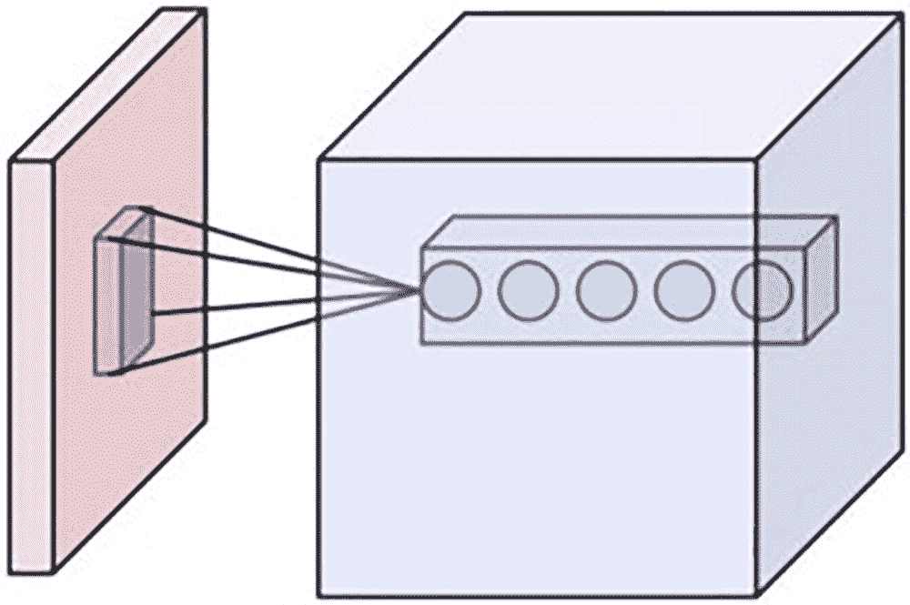
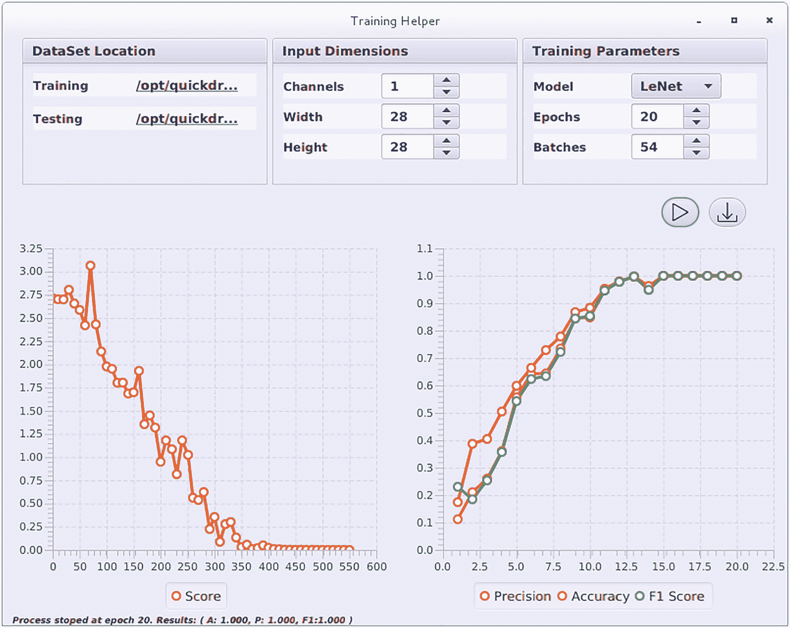
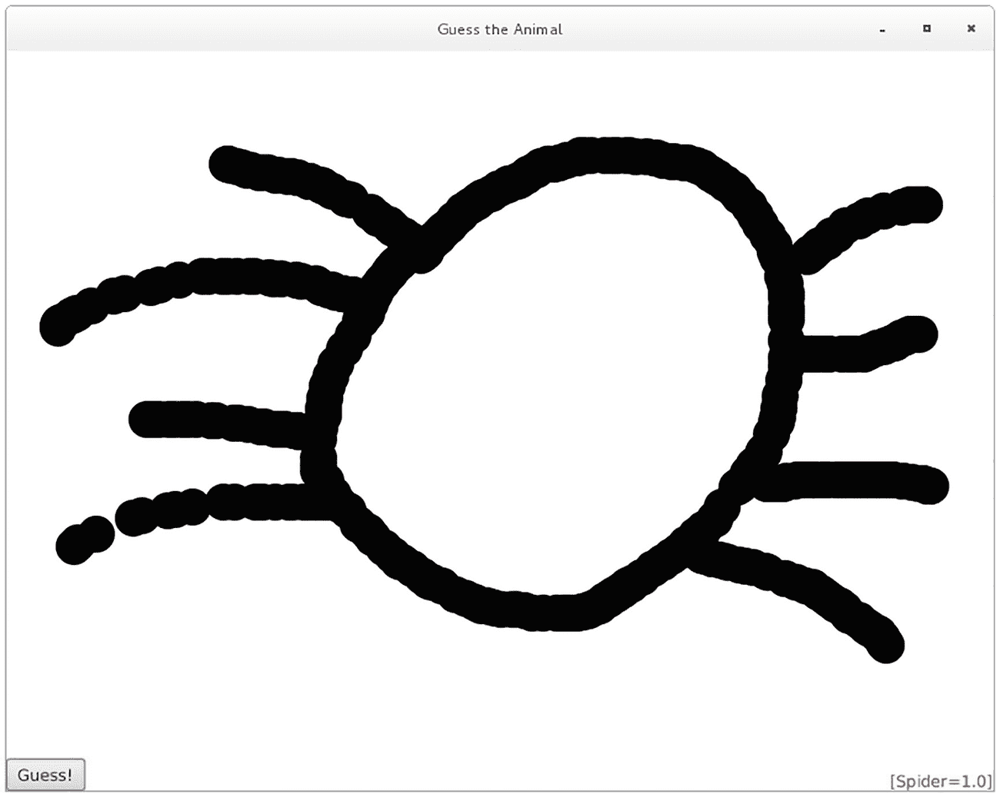

# 十三、机器学习和 JavaFX

威廉·安东尼奥·西西里

机器学习最近再次成为热门话题，主要是因为大量数据被生成和存储，以及处理能力的提高。机器学习算法远不止是一个研究课题；它们被公司用作竞争优势。在本章中，我们将讨论最著名的机器学习算法，重点是人工神经网络，并展示 JavaFX 如何与可靠的机器学习库 DeepLearning4J (DL4J)一起使用。我们将重点关注可以直接与 JavaFX 交互的视觉神经网络模型。

## 什么是机器学习

当你开发一个系统时，你必须准确地编写它应该做什么。你开发一个算法，一步一步地描述一个特定的流程必须如何执行。

机器学习技术是不同的，因为它们不需要明确的编程步骤。这些技术无需显式编程即可返回结果。你不是给它编程，而是“教”机器如何使用数据。

在机器学习领域，我们有两种不同类型的算法用于不同的任务，具有不同的性能和精度。我们将这些算法分为两大类:

*   监督学习

*   无监督学习

这两个类别都需要数据作为输入。

## 监督学习

在监督学习中，我们有利用标记数据的算法，这意味着您将为算法提供问题的样本实例，以便它可以学习如何对同一问题的新的未标记实例进行分类。例如，假设你有一些狗和猫的图像，你把这些图像用在一些算法上。在教完算法后，你可以向它输入新的图像，它应该会告诉你新图像中包含的是猫还是狗。

要教算法，需要输入信息，很多信息，调整算法参数，直到它能合理预测新数据。这个过程叫做训练。假设您想在照片中识别您的家人，并且您有数千张您家庭成员的照片。一旦这些照片被正确标记，你就可以用它们来喂给一个算法，一旦算法有了很好的精度，它就可以用来预测新的图片，有希望识别你的家庭成员！

## 无监督学习

当你有数据，你没有进一步的信息，但你仍然想检索一些知识，你可以使用无监督学习；根据所选的算法，它可以对数据的某些实例进行分组。无监督学习的一个已知示例是推荐系统，在该系统中，您使用特定系统上的用户数据向他们推荐其他产品或电影。

要使用机器学习技术，可以在多种可用算法中进行选择。对于监督学习，我们有回归、决策树等等。对于无监督学习，你会发现聚类，异常检测，等等。对于监督和非监督学习，我们有神经网络，我们将在本章中探讨。

## 人工神经网络

由于可用于训练的大量数据以及高性能 CPU 和 GPU，人工神经网络非常有名，并得到了高度的讨论和研究。神经网络基本元素是人工神经元，它以“神经神经元”为基础，由输入数(x)乘以其权重(w)并以一个偏差求和而成，结果插入一个激活函数中。然后我们有了结果(y)。这些神经元被组织成可以有 n 个神经元的层。各层以不同的架构连接，最后我们有了如图 [13-1](#Fig1) 所示的人工神经网络。现在的人工神经网络是由成千上万个神经元组成的，有时有几百层。这些大型人工神经网络是深度学习方法的一部分，我们将在本章中看到一些著名的深度神经网络架构。


图 13-1

神经网络的一个例子

训练过程是神经网络发挥作用的关键。在训练之前，神经网络从随机权重开始。训练包括在神经网络中输入数据，测量它与实际信息的距离，然后调整权重，直到结果接近实际值(也称为地面真实值)。例如，如果你有一个神经网络可以预测给定的图像是猫还是狗，你输入一只猫，它返回的结果是猫有 80%是狗，你计算一个误差(结果离地面真实数据有多远)，然后使用称为反向传播的过程来调整神经网络的权重，并用数千只猫和狗的图像重复它，直到你有一个好的结果。在训练期间，你应该关注过度配合，但这超出了本书的范围。

有相当多非常知名的神经网络架构可供使用，其中大部分是由大公司或人工智能研究人员提出的。你可能会创建自己的神经网络，获得大量数据，并对其进行训练，这样你就可以在你的应用中使用它；然而，在本章中，我们将使用预训练的神经网络。是的，优秀的灵魂得到了一些非常著名的神经网络架构，使用一些已知的数据集(例如，ImageNet)训练它们，并且，一旦它们被训练，使它们可用于应用中；这些被称为预训练神经网络模型。

经过预训练的神经网络的强大之处在于，它已经为某个数据集调整了所有权重，这意味着它已经可供使用，并且您可以使用自己的数据再次调整权重，使其准备好处理新的类，从而重用来自其他图像或数据的知识。

## 卷积神经网络

深入所有神经网络架构和技术超出了本书的范围；然而，由于我们将主要使用卷积神经网络(CNN)，其架构对于检测图像中的模式很有用，而不必编写特定的模式，因此我们来讨论一下。为了理解 CNN 是如何工作的，以图 [13-2](#Fig2) 为例，这是我妻子在一个应用程序中画的一只蜜蜂，我们将在后面讨论。


图 13-2

CNN 要分析的图像示例

观察这只蜜蜂，我们可以识别出一些图案:一只翅膀是曲线，身体也有几条曲线和一个填充的部分，头部是椭圆形，等等。你可能不知道是怎么做到的，但是你的大脑识别出了这些模式，并得出结论，这是一幅蜜蜂的图画。CNN 包含一个卷积层，与池化和规范化层一起使用，可以识别这些模式，您不必对其进行硬编码。这都是在培训过程中学到的。



然后，CNN 层的输出被传递到一个完全连接的架构，该架构将以代表每一类图像(蜜蜂、青蛙、狗等)的神经元结束。).当你实际预测一幅图像时，每一类都有百分之一的机会属于某一类。请看下面的例子，应用程序背后的 CNN 知道我们试图输入一个鼠标图像(大约 78%的鼠标)，但它也说有很小的机会是一只狮子(大约 13%)，如图 [13-3](#Fig3) ！


图 13-3

CNN 进行的图像预测的结果

要了解更多关于 CNN 的信息，请查看斯坦福( [`http://cs231n.github.io/convolutional-networks/`](http://cs231n.github.io/convolutional-networks/) )的文章和 ImageNet 竞赛获胜者的论文。

## Eclipse DeepLearning4J:用于神经网络的 Java API

如果你搜索深度学习和 Java，你会找到一些库。出于我们的目的，我们将使用 Eclipse DeepLearning4J (DL4J)，它允许轻松的数据矢量化、神经网络创建和训练，并提供可立即使用的预训练模型，甚至可以在移动设备上运行。

DL4J 使用的核心库是 ND4J。我们可以用 ND4J 进行 n 大小的向量运算；因此，它用于 DL4J 中的所有神经网络运算。例如，您希望为训练或预测而加载的每个数据都被转换为 ND4J INDArray 对象，因此它可以在训练过程中为神经网络提供信息。有关 ND4J 的更多信息，请参见第 [14 章](14.html)“使用 JavaFX 的科学应用”

在 ND4J 之上，我们有 DataVec 库。处理神经网络就是处理数据，神经网络上的数据由 n 个大小的数字向量表示。你不能简单地将图像或文本字符串的二进制文件输入到神经网络中。你必须转换它；DataVec 拥有所有的工具，可以将图像、文本、CSV 文件等转换成神经网络。稍后，我们将使用 DataSetIterators，它将清楚地说明它是如何有用的。

使用 Maven 的 DeepLearning4J 设置很简单；你必须添加 nd4j-native-platform 和 deeplearning4j-core 依赖项。对于这一章，我们还需要 deeplearning4j-zoo 来利用可用的神经网络模型。对于本章，我们使用 deeplearning4j 1.0.0-beta7:

```java
    <dependency>
      <groupId>org.nd4j</groupId>
      <artifactId>nd4j-native-platform</artifactId>
      <version>${dl4j.version}</version>
    </dependency>
    <dependency>
      <groupId>org.deeplearning4j</groupId>
      <artifactId>deeplearning4j-core</artifactId>
      <version>${dl4j.version}</version>
    </dependency>
    <dependency>
      <groupId>org.deeplearning4j</groupId>
      <artifactId>deeplearning4j-zoo</artifactId>
      <version>${dl4j.version}</version>
    </dependency>

```

我们不会创建神经网络，但为了体验如何使用 DeepLearning4J 创建神经网络，您可以查看 DeepLearning4J 示例( [`https://github.com/eclipse/deeplearning4j-examples`](https://github.com/eclipse/deeplearning4j-examples) )，例如 LeNet 版本(第一个 CNN 架构)，该版本将用于本章的第一个 JavaFX 应用程序:

```java
MultiLayerConfiguration conf = new NeuralNetConfiguration.Builder().seed(seed)
                .activation(Activation.IDENTITY)
                .weightInit(WeightInit.XAVIER)
                .optimizationAlgo(OptimizationAlgorithm.STOCHASTIC_GRADIEN T_DESCENT)
                .updater(updater)
                .cacheMode(cacheMode)
                .trainingWorkspaceMode(workspaceMode)
                .inferenceWorkspaceMode(workspaceMode)
                .cudnnAlgoMode(cudnnAlgoMode)
                .convolutionMode(ConvolutionMode.Same)
                .list()
                // block 1
                .layer(0, new ConvolutionLayer.Builder(new int[] {5, 5}, new int[] {1, 1}).name("cnn1")
                                .nIn(inputShape[0]).nOut(20).activation(Activation.RELU).build())
                .layer(1, new SubsamplingLayer.Builder(SubsamplingLayer.PoolingType.MAX, new int[] {2, 2},
                                new int[] {2, }).name("maxpool1").build())
                // block 2
                .layer(2, new ConvolutionLayer.Builder(new int[] {5, 5}, new int[] {1, 1}).name("cnn2").nOut(50)
                                .activation(Activation.RELU).build())
                .layer(3, new SubsamplingLayer.Builder(SubsamplingLayer.PoolingType.MAX, new int[] {2, 2},
                                new int[] {2, 2}).name("maxpool2").build())
                // fully connected
                .layer(4, new DenseLayer.Builder().name("ffn1").activation(Activation.RELU).nOut(500).build())
                // output
                .layer(5, new OutputLayer.Builder(LossFunctions.LossFunction.MCXENT).name("output")
                                .nOut(numClasses).activation(Activation.SOFTMAX) // radial basis function required
                                .build())
                .setInputType(InputType.convolutionalFlat(inputShape[2], inputShape[1], inputShape[0]))
                .build();

```

## 从 JavaFX 应用程序训练神经网络

如果你没有训练过的模型，你可以自己训练。这将需要数据，大量的数据，以及神经网络参数和架构的知识。为了交互和可视化神经网络训练过程的进度，我们将使用 JavaFX 应用程序。

为了演示如何从 JavaFX 训练神经网络，我们创建了一个具有以下特性的小应用程序:

*   查看培训和测试的进度。这可能需要几个月、几天或几个小时。在我们的案例中，我们将进行一个快速培训，这将需要几个小时。您可以在 JavaFX 应用程序中跟踪进度。

*   能够调整一些超参数:时期数、迭代次数和批量大小。还要为训练和测试输入图像文件以及图像信息选择路径。

*   训练后导出模型，并导入要训练的模型配置。



图 13-4

一个 JavaFX 应用程序，用于可视化神经网络训练过程的进度

图 [13-4](#Fig4) 所示的应用程序是使用本书中已经讨论过的控件构建的。图表还用于显示神经网络“学习”的进度，当该过程完成时，您可以将现在训练好的神经网络保存到您的磁盘上。导出的模型可用于数据新实例的真实预测。

为了探索完整的代码，您可以查看类 TrainingHelperApp(可在`github.com/Apress/definitive-guide-modern-java-clients-javafx17`访问)。这里我们将重点介绍 JavaFX 如何访问 DL4J APIs。用于训练的 DL4J 基础模型被封装在 NeuralNetModel 接口中，使用 Java 服务提供者接口实现该接口提供定制模型是可能的。默认情况下，我们有一个基于 LeNet 的内置 DL4J 模型，LeNet 是 Yann LeCun 创建的第一个卷积神经网络。神经网络类型为 org . deep learning 4j . nn . multilayer . multilayer network . DL4J 也提供计算图。对于这个例子，让我们保持多层网络:

```java
import org.deeplearning4j.nn.multilayer.MultiLayerNetwork;
public interface NeuralNetModel {
    public String getId();
    public MultiLayerNetwork getModel(int[] inputShape, int numClasses);
}

```

组合框中填充了 NeuralNetModel 的可用实现，实际的模型是使用 getModel 方法访问的。在运行培训流程之前，用户必须选择培训和测试目录。目录应该有一个结构，其中图像位于与其类别相对应的文件夹下，例如，猫图像必须位于名为 cat 的文件夹中。当单击按钮 Run 时，将检索所有输入的信息，然后将其传递给 prepareForTraining 方法:

```java
    private void prepareForTraining(String modelId, int[] inputShape, int epochs, int batchSize, File trainingDir, File testingDir) {
        status("Preparing for training...");
        runningProperty.set(true);
        try {
            DataSetIterator trainingIterator = DL4JHelper.createIterator(trainingDir, inputShape[1], inputShape[2], inputShape[0], batchSize, SEED);
            DataSetIterator testingIterator = DL4JHelper.createIterator(testingDir, inputShape[1], inputShape[2], inputShape[0], batchSize, SEED);
            var currentModel = getNeuralNetById(modelId).getModel(inputShape, trainingIterator.getLabels().size());
            lastModel.set(currentModel);
            currentModel.setListeners(new AsyncScoreIterationListener(this::updateScore));
            clearSeries();
            launchTrainingThread(epochs, trainingIterator, testingIterator);
        } catch (IOException e) {
            e.printStackTrace();
        }
    }

```

在 prepareForTraining 中，用户选择的目录用于创建 DataSetIterator。DL4J 为我们提供了一个迭代器 API，使得加载外部文件以输入神经网络变得容易。在我们的例子中，我们基于图像文件创建一个迭代器，标签是基于给定图像文件的父路径生成的。它负责为我们处理一切艰难的工作；否则，我们必须将图像加载到一个数组中，以便输入到神经网络中。创建的迭代器还提供了关于我们的数据集中有多少标签(或类)的信息，我们使用输入的输入形状和神经网络模型 ID 来检索实际的模型。在此之后，我们注册一个侦听器，每次更新分数时都会调用它，我们使用一个方法引用来更新分数以注册它，最后我们启动调用 launchTrainingThread 的训练过程，传递我们创建的历元和迭代器的数量:

```java
    private void launchTrainingThread(int epochs, DataSetIterator trainingIterator, DataSetIterator testingIterator) {
        var currentModel = lastModel.get();
        new Thread(() -> {
                var result  = "";
                int epochNum = 0;
                for (int i = 0; i < epochs; i++) {
                    epochNum = (i +1);
                    currentModel.fit(trainingIterator);
                    status("Evaluating...");
                    Evaluation eval = currentModel.evaluate(testingIterator);
                    double progress = (double) i / (double) epochs;
                    var accuracy =  eval.accuracy();
                    var precision = eval.precision();
                    var f1 = eval.f1();
                    updateSeries(accuracySeries, epochNum, accuracy);
                    updateSeries(precisionSeries, epochNum, precision);
                    updateSeries(f1Series, epochNum, f1);
                    testingIterator.reset();
                    trainingIterator.reset();
                    result = "( A: " + evalutionFormat.format(accuracy)  +
                             ", P: " + evalutionFormat.format(precision) +
                             ", F1:" + evalutionFormat.format(f1) + " )";
                    if (stopRequested) {
                        status("Stop Requested on epoch "  + epochNum + ".                         Results: " + result);
                        stopRequested = false;
                        break;
                    } else {
                        status("Epoch " + epochNum  + "/" + epochs + " " +                         result);
                        setProgress(progress);
                    }
                }
                status("Process stoped at epoch " + epochNum  + ".
                Results: " + result);
                Platform.runLater(() -> runningProperty.set(false));
        }).start();
    }

```

在这个方法中，我们开始获取用户选择的模型；然后，我们启动一个包含执行训练的过程的线程。在不同的线程中这样做的原因是为了避免锁定 JavaFX 线程；这样，如果我们认为我们已经达到了好的结果，我们就可以停止这个过程。训练过程基本上是拟合模型中的迭代器，对模型进行评估。模型评估返回常用的度量来查看模型有多好:准确度、精确度和 f1 分数。每个指标都有一个相应的图表 XYSeries，在培训过程中会更新。一切都发生在历元时间，因此在从 0 到历元数的 for 循环中；但是，如果用户在应用程序运行时单击 Run 按钮，那么 stopRequested 标志就会变为 true，流程就会停止并允许用户导出模型。

您可能已经注意到，在这个方法上，我们不直接与 JavaFX 控件交互；相反，我们必须调用 status、updateSeries 和 setProcess。这些方法更新 JavaFX 线程中与 JavaFX 相关的类。请参见以下内容:

```java
    private void setProgress(final double progress) {
        Platform.runLater(() ->  progressProperty.set(progress));
    }
    private void updateScore(Integer i, Double d) {
        updateSeries(scoreSeries, i, d);
    }
    private void updateSeries(XYChart.Series<Number, Number> series, Integer i, Double d) {
        Platform.runLater(() -> series.getData().add(new XYChart.Data<>(i, d)));
    }
    private void status(String txt) {
        Platform.runLater(() ->  txtProgress.set(txt));
    }

```

当训练过程结束或停止时，可以导出现在已训练的模型，这意味着它将调整权重并准备好预测新数据。这可以在方法 exportModel 上简单地完成:

```java
    private void exportModel(ActionEvent event) {
        var source = (Button) event.getSource();
        var modelOutputFile = fileChooser.showSaveDialog(source.getScene().getWindow());
        if (modelOutputFile != null) {
            try {
                ModelSerializer.writeModel(lastModel.get(), modelOutputFile, true);
                status("Model saved to " + modelOutputFile.getAbsolutePath());
            } catch (IOException e1) {
                e1.printStackTrace();
            }
        }
    }

```

## 将图像从 JavaFX 读入神经网络

您可能会遇到这样的情况:您必须从 JavaFX 应用程序内部获取内容，然后输入到神经网络中以使用其输出。比如在一个游戏中，你想把实际的屏幕传递给一个神经网络来调整游戏参数；或者，如果您正在运行模拟，您可以将模拟的状态输入到神经网络中进行实时预测。在这些情况下，我们需要知道如何从 JavaFX 获得快照，以输入到神经网络中。

你可能听说过 Quick，Draw！这是谷歌的一个在线工具，可以猜测你在画什么。谷歌把这个开放给每个人来玩这个工具，还存储了所有的图纸，超过了 10 亿张图纸。好消息是他们把数据提供给所有人使用( [`https://quickdraw.withgoogle.com/data`](https://quickdraw.withgoogle.com/data) )。

数据有几种不同的二进制格式，有数百个类，每个类有数千幅图像。为了简化训练过程，我们只上动物课(狗、猫等)。)并将它们转换成人类可读的格式 PNG，这种格式也可以从 DL4J 数据集迭代器类中访问。我们还把图像做成黑白的，并把它们的尺寸调整到 28 × 28，这与著名的手写数字数据集 MNIST 的图像尺寸相同。这样我们可以使用 DL4J 示例中的 MNIST 神经网络架构，MnistClassifier ( [`http://projects.rajivshah.com/blog/2017/07/14/QuickDraw`](http://projects.rajivshah.com/blog/2017/07/14/QuickDraw) )。我们将使用一个简单的 LeNet 神经网络来预测输入了什么涂鸦；然而，我们将展示的应用程序可以适用于其他神经网络模型。

应用程序可以在一个单独的类 GuessTheAnimal 中找到。运行该应用程序会产生类似于图 [13-5](#Fig5) 的屏幕截图。第一步是声明包含输入图像大小、模型位置和我们在训练模型时使用的类的常量。在我们的例子中，我们选择了一些动物类。我们使用了一个具有 68%准确率和 15 个类别的模型。您可以使用我们上一节中的应用程序来训练您自己的模型，并构建一个更精确的模型:

```java
    private static final String MODEL_PATH = "/quickdraw-model-15-68.zip";
    private static final String CLASSES[] = { "Bee", "Bird", "Cat", "Dog", "Duck", "Elephant", "Fish", "Frog", "Horse", "Lion", "Mouse", "Pig", "Rabbit", "Snake", "Spider" };
    private static final int INPUT_WIDTH = 28;
    private static final int INPUT_HEIGHT = 28;
    private static final Double THRESHOLD = 0.1d;

```



图 13-5

由 LeNet 神经网络分析的图形

该应用程序由两部分组成:加载模型和构建 UI。为了加载模型，我们使用 ModelSerializer 类。注意，您可以使用从我们之前讨论的应用程序中导出的任何模型。只要确保相应地调整常量。加载模型很简单。我们只需要调用 model serializer . restore multilayernetwork 并传递包含模型的文件或输入流。请参见 initModelAndLoader 方法。在此方法中，我们还创建了 NativeImageLoader，它是实际将内容转换为 INDArray 的类，这使它对神经网络非常有用:

```java
    private void initModelAndLoader() throws IOException {
        model = ModelSerializer
                .restoreMultiLayerNetwork(GuessTheAnimal.class.getResource AsStream(MODEL_PATH));
        model.init();
        loader = new NativeImageLoader(INPUT_WIDTH, INPUT_HEIGHT, 1, true);
    }

```

UI 内置在 buildUI()方法中，由三个控件组成:用于接收用户绘图的画布、触发预测过程的按钮和包含输出的标签。当用户在画布上拖动鼠标时，应用程序会画出小圆圈，给人一种铅笔在纸上写字的感觉。右键单击清除画布和结果标签:

```java
private StackPane buildUI() {
    var canvas = new Canvas(APP_WIDTH, APP_HEIGHT);
    var btnGuess = new Button("Guess!");
    var lblOutput = new Label("");
    var root = new StackPane(canvas, btnGuess, lblOutput);
    lblOutput.setTextFill(Color.RED);
    txtOutput = lblOutput.textProperty();
    ctx = canvas.getGraphicsContext2D();
    ctx.setLineWidth(30);
    canvas.setOnMouseDragged(e -> {
        ctx.setFill(Color.BLACK);
        ctx.fillOval(e.getX() - 15, e.getY() - 15, 30, 30);
    });
    canvas.setOnMouseClicked(e -> {
        if (e.getButton() == MouseButton.SECONDARY) {
            clearCanvas();
        }
    });
    btnGuess.setOnAction(evt -> {
        var predictions = predictCanvasContent();
        var pairs = sortAndMap(predictions);
        txtOutput.set(pairs.toString());
    });
    StackPane.setAlignment(btnGuess, Pos.BOTTOM_LEFT);
    StackPane.setAlignment(lblOutput, Pos.BOTTOM_RIGHT);
    return root;
}

```

此代码最重要的部分是我们获取画布内容并将其转换为 INDArray，以便可以输入到神经网络模型中。这是在方法 predictCanvasContent 和 getScaledImage 中完成的。在 getScaledImage 上，我们将画布的屏幕截图转换为 WritableImage，使用 SwingFXUtils 将其转换为 java.awt.Image，最后将其写入 BufferedImage，buffered image 也会将图像缩放到与神经网络模型中使用的图像相同的大小。我们还将最后预测的图像保存到外部文件中；它对调试很有用。在 predictCanvasContent 中，我们将 scaledImage 转换为 INDArray，然后输入到神经网络模型中。模型本身返回一个包含 1 个`×` 15 个位置的 INDArray 因此，在预测之后，我们将其转换为地图，并过滤结果低于我们定义为常量(默认为 0.1)的阈值的结果:

```java
private Map<String, Double> predictCanvasContent() {
    try {
        var img = getScaledImage();
        INDArray image = loader.asRowVector(img);
        INDArray output = model.output(image);
        double[] doubleVector = output.toDoubleVector();
        var results = new HashMap<String, Double>();
        for (int i = 0; i < doubleVector.length; i++) {
            results.put(CLASSES[i], doubleVector[i]);
        }
        return results.entrySet().stream().filter(e -> e.getValue() > THRESHOLD)
        .collect(Collectors.toMap(Map.Entry::getKey, Map.Entry::getValue));
    } catch (Exception e) {
        throw new RuntimeException(e);
    }
}
private BufferedImage getScaledImage() {
    var canvas = ctx.getCanvas();
    WritableImage writableImage = new WritableImage((int) canvas.getWidth(), (int) canvas.getHeight());
    canvas.snapshot(null, writableImage);
    Image tmp = SwingFXUtils.fromFXImage(writableImage, null).getScaledInstance(INPUT_WIDTH, INPUT_HEIGHT, Image.SCALE_SMOOTH);
    BufferedImage scaledImg = new BufferedImage(INPUT_WIDTH, INPUT_HEIGHT, BufferedImage.TYPE_BYTE_GRAY);
    Graphics graphics = scaledImg.getGraphics();
    graphics.drawImage(tmp, 0, 0, null);
    graphics.dispose();
    try {
        File outputfile = new File("last_predicted_image.jpg");
        ImageIO.write(scaledImg, "jpg", outputfile);
    } catch (IOException e) {
        e.printStackTrace();
    }
    return scaledImg;
}

```

## 检测视频中的对象

对于下一个应用，我们将探索一个叫做 YOLO 的神经网络模型架构(你只看一次)。关于 YOLO 如何工作的总结可以在它的论文中找到: <sup>[1](#Fn1)</sup>

> 我们将对象检测重新定义为一个单一的回归问题，直接从图像像素到边界框坐标和类别概率。使用我们的系统，你只需要看一次(YOLO)图像就可以预测物体的存在和位置。

本文还提供了以下简化其工作方式的图片。

原文是 2016 年的。后来，更多的论文被引入。最新的是给 YOLO3 的，更精准更快。训练一个 YOLO 神经网络需要比平常更大的图像；第一个 YOLO 版本的输入大小是 448 × 448，这意味着在个人电脑上需要很长时间。幸运的是，DL4J 提供了 TinyYOLO 和 YOLO2，随时可供我们使用。在本节中，我们将探索一个 JavaFX 应用程序，用于检测正在播放的视频中的对象。

应用程序开始声明一些对应用程序很重要的常量。让我们看看每个常量:

*   APP_WIDTH 和 APP_HEIGHT:实际的图像大小。

*   TARGET_VIDEO:支持的视频文件的 URL。如果它在类路径中，可以直接使用它的路径；不过 JavaFX 也支持 URL 协议，所以可以使用协议 file:/{path to file}加载本地文件。

*   阈值:切割值。检测到的值小于阈值的对象不会出现在神经网络输出中。

*   标签:用于训练神经网络模型的标签。默认情况下，它具有用于训练 DL4J 默认模型的类，但是可以将其更改为自定义 YOLO 模型。

*   输入宽度、输入高度、输入通道:YOLO 神经网络使用的输入图像信息。它还使用 YOLO2 DL4J 型号的值。

*   GRID_W 和 GRID_H:将原始图像划分为一个网格，输出检测到的物体位置与这个网格相关；因此，在计算输出框时，需要使用网格大小。可以使用 org . deep learning 4j . zoo . model . helper . darknet helper getGridWidth 和 getGridHeight 方法进行计算。

*   每秒帧数:每秒扫描的帧数。如果更高，处理时间会更长，但检测到的对象高光看起来会更精确。

```java
    private static final double APP_WIDTH = 800;
    private static final double APP_HEIGHT = 600;
    private static final String TARGET_VIDEO = "/path/to/video";
    private static final double THRESHOLD = 0.65d;
    private static final String[] LABELS = { "person", "bicycle", "car", "motorbike", "aeroplane", "bus", "train", "truck", "boat", "traffic light", "fire hydrant", "stop sign", "parking meter", "bench", "bird", "cat", "dog", "horse", "sheep", "cow", "elephant", "bear", "zebra", "giraffe", "backpack", "umbrella", "handbag", "tie", "suitcase", "frisbee", "skis", "snowboard", "sports ball", "kite", "baseball bat", "baseball glove", "skateboard", "surfboard", "tennis racket", "bottle", "wine glass", "cup", "fork", "knife", "spoon", "bowl", "banana", "apple", "sandwich", "orange", "broccoli", "carrot", "hot dog", "pizza", "donut", "cake", "chair", "sofa", "pottedplant", "bed", "diningtable", "toilet", "tvmonitor", "laptop", "mouse", "remote", "keyboard", "cell phone", "microwave", "oven", "toaster", "sink", "refrigerator", "book", "clock", "vase", "scissors", "teddy bear", "hair drier", "toothbrush" };
    private final int INPUT_WIDTH = 608;
    private final int INPUT_HEIGHT = 608;
    private final int INPUT_CHANNELS = 3;
    private final int GRID_W = INPUT_WIDTH / 32;
    private final int GRID_H = INPUT_HEIGHT / 32;
    private final double FRAMES_PER_SECOND = 20d;

```

应用程序 UI 由一个用于视频回放的媒体视图、一个包含突出显示检测到的对象的矩形的窗格和一个显示正在运行的任务执行进度的标签组成。所有东西都堆放在 StackPane 上，标签朝向底部。这些都是在 start 方法中完成的，但是在构建 UI 之前，我们为每个矩形生成颜色，这些颜色将突出显示检测到的对象并初始化 YOLO2 模型。注意，第一次执行这段代码时，它将下载预训练的模型；因此，这可能需要一段时间:

```java
for (int i = 0; i < LABELS.length; i++) {
    colors.put(LABELS[i], Color.hsb((i + 1) * 20, 0.5, 1.0));
}
var yoloModel = (ComputationGraph)  YOLO2.builder().build().initPretrained();
String videoPath = DetectObjectsInVideoImproved.class.getResource(TARGET_VIDEO).toString();
imageLoader = new NativeImageLoader(INPUT_WIDTH, INPUT_HEIGHT, INPUT_CHANNELS,
        new ColorConversionTransform(COLOR_BGR2RGB));
var media = new Media(videoPath);
var mp = new MediaPlayer(media);
var view = new MediaView(mp);
Label lblProgress = new Label();
lblProgress.setTextFill(Color.LIGHTGRAY);
view.setFitWidth(APP_WIDTH);
view.setFitHeight(APP_HEIGHT);
view.setPreserveRatio(false);
pane = new Pane();
pane.setMinWidth(APP_WIDTH);
pane.setMinHeight(APP_HEIGHT);
var root = new StackPane(view, pane, lblProgress);
StackPane.setAlignment(lblProgress, Pos.BOTTOM_CENTER);
stage.setScene(new Scene(root, APP_WIDTH, APP_HEIGHT));
stage.show();
stage.setTitle("Detect Objects");

```

该应用程序还允许用户通过单击来暂停视频，由于我们在媒体视图的顶部有一个窗格，所以我们在窗格上而不是在媒体视图上注册鼠标监听器:

```java
        pane.setOnMouseClicked(e -> {
            if (mp.getStatus() == Status.PLAYING) {
                mp.pause();
            } else if (mp.getStatus() == Status.PAUSED) {
                mp.play();
            } else if (mp.getStatus() == Status.STOPPED) {
                mp.seek(mp.getStartTime());
                mp.play();
            }
        });
        mp.setOnEndOfMedia(() -> {
            mp.stop();
            pane.getChildren().forEach(c -> c.setVisible(false));
        });

```

预测不是实时进行的。原因是在没有 GPU 处理的机器中，单个预测几乎需要 500 ms。当拥有 GPU 时，预测过程的一部分将由多个 GPU 核心来完成，从而使其速度更快。YOLO 的论文谈到每秒 155 帧；然而，拍摄 JavaFX 节点的快照将很难实现这一结果，但是在这个应用程序中，使用快照是因为您可以预处理媒体视图节点，然后运行 YOLO(例如，缩放或应用效果)，将 JavaFX 的功能与 YOLO 结合起来。此外，你可能不想运行 YOLO 的视频。任何 JavaFX 节点都可以成为 YOLO 预测的对象，因此它有更多的可能性。

在我们的例子中，技巧不是实时进行预测，而是在应用程序运行时收集帧并安排预测任务，创建包含检测到的对象高亮显示的 JavaFX 节点，然后在视频顶部显示它。注意，一旦创建了组，我们就给它一个 ID，这样我们就可以根据为用户显示的当前框架隐藏或显示它。我们跟踪每个任务以避免多余的执行，只有在任务完成后，带有检测到的对象的组才会添加到窗格中(请参见 target.setOnSucceeded)。换句话说，视频至少需要播放一次，以便收集所有帧并安排处理。在 trackTasks 中跟踪预定的任务，一旦给定帧 ID 的任务完成，我们将高亮显示包含检测到的对象的组，并隐藏其他对象。一切都是在一个监听器中完成的，这个监听器附加到媒体播放器播放的当前时间，所以它只在视频播放的时候被调用；否则，它不会收集帧进行处理:

```java
        var finishedTasks = new AtomicInteger();
        var previousFrame = new AtomicLong(-1);
        mp.currentTimeProperty().addListener((obs, o, n) -> {
            if(n.toMillis() < 50d) return;
            Long millis = Math.round(n.toMillis() / (1000d / FRAMES_PER_SECOND));
            final var nodeId = millis.toString();
            if(millis  == previousFrame.get()) {
                return;
            }
            previousFrame.set(millis);
            trackTasks.computeIfAbsent(nodeId, v -> {
                var scaledImage = getScaledImage(view);
                PredictFrameTask target = new PredictFrameTask(yoloModel, scaledImage);
                target.setOnSucceeded(e -> {
                    var detectedObjectGroup = getNodesForTask(nodeId, target);
                    Platform.runLater(() -> pane.getChildren().add(detectedObjectGroup));
                    updateProgress(lblProgress, trackTasks.size(), finishedTasks.incrementAndGet());
                });
                Thread thread = new Thread(target);
                thread.setDaemon(true);
                thread.start();
                return true;
            });
            updateProgress(lblProgress, trackTasks.size(),
            finishedTasks.get());
            pane.getChildren().forEach(node -> node.setVisible(false));
            Optional.ofNullable(pane.lookup("#" + nodeId)).ifPresent(node -> node.setVisible(true));
        });
    }

```

既然您已经了解了我们是如何收集帧并处理它们的，那么让我们来考虑一下实际的帧处理。在调度任务之前，有一个对 getScaledImage 的调用，其结果将被传递给任务。这个方法获得媒体视图的快照，就像我们以前做的一样，但是这次我们得到的不是黑白图像，而是彩色图像。YOLO 输入图像使用三个通道，每种颜色一个通道(红色、绿色和蓝色):

```java
    private BufferedImage getScaledImage(Node targetNode) {
        writableImage = new WritableImage((int) targetNode.getBoundsInLocal().getWidth(), (int) targetNode.getBoundsInLocal().getHeight());
        targetNode.snapshot(null, writableImage);
        Image tmp = SwingFXUtils.fromFXImage(writableImage, null).getScaledInstance(INPUT_WIDTH, INPUT_HEIGHT, Image.SCALE_SMOOTH);
        BufferedImage scaledImg = new BufferedImage(INPUT_WIDTH, INPUT_HEIGHT, BufferedImage.TYPE_INT_RGB);
        Graphics graphics = scaledImg.getGraphics();
        graphics.drawImage(tmp, 0, 0, null);
        graphics.dispose();
        return scaledImg;
    }

```

在 setOnSucceeded 侦听器上，我们将处理任务返回的检测到的对象。每个对象具有每个检测到的矩形的初始点以及其他信息，但是只需要点 x 来构建矩形以突出检测到的对象。然而，在创建矩形之前，需要转换坐标。首先，我们需要弄清楚是否需要缩放，因为应用程序大小可能大于图像输入，并且所有坐标都是相对于输入的，然后计算原始图像上的实际坐标，因为所有坐标都是相对于网格的，最后计算矩形的宽度和高度。除了矩形之外，我们还添加了一个标签来显示预测的类，它被添加到一个组中，因此我们可以唯一地处理标签和矩形。对每个检测到的对象都这样做:

```java
   private Group getNodesForTask(final String nodeId, PredictFrameTask    target) {
        try {
            var predictedObjects = target.get();
            var detectedObjectGroup = getPredictionNodes(predictedObjects);
            detectedObjectGroup.setId(nodeId);
            detectedObjectGroup.setVisible(false);
            return detectedObjectGroup;
        } catch (Exception e) {
            throw new RuntimeException(e);
        }
    }
    private Group getPredictionNodes(List<DetectedObject> objs) {
        Group grpObject = new Group();
        objs.stream().map(this::createNodesForDetectedObject)
                     .flatMap(l -> l.stream())
                     .forEach(grpObject.getChildren()::add);
        return grpObject;
    }
    private List<Node> createNodesForDetectedObject(DetectedObject obj) {
        double[] xy1 = obj.getTopLeftXY();
        double[] xy2 = obj.getBottomRightXY();
        var w  = INPUT_WIDTH;
        var h  = INPUT_HEIGHT;
        var wScale  = (APP_WIDTH / w);
        var hScale  = (APP_HEIGHT / h);
        var x1 = (w ∗ xy1[0] / GRID_W) * wScale;
        var y1 = (h ∗ xy1[1] / GRID_H) * hScale;
        var x2 = (w ∗ xy2[0] / GRID_W) * wScale;
        var y2 = (h ∗ xy2[1] / GRID_H) * hScale;
        var rectW = x2 - x1;
        var rectH = y2 - y1;
        var label = LABELS[obj.getPredictedClass()];
        Rectangle rect = new Rectangle(x1, y1, rectW, rectH);
        rect.setFill(Color.TRANSPARENT);
        Color color = colors.get(label);
        rect.setStroke(color);
        rect.setStrokeWidth(2);
        Label lbl = new Label(label);
        lbl.setTranslateX(x1 + 2);
        lbl.setTranslateY(y1 + 2);
        lbl.setTextFill(color);
        lbl.setFont(Font.font(Font.getDefault().getFamily(), FontWeight.EXTRA_BOLD, FontPosture.ITALIC, 10));
        return List.of(rect, lbl);
    }

```

最后，我们有一个任务，它实现了 javafx.concurrent.Task 并为它提供了一个 List 类型<detectedobject>。JavaFX 并发任务允许我们运行一些繁重的操作，然后检索结果，而不占用 JavaFX 主线程。这个预测几乎和我们快速绘制中所做的一样！例子。主要区别在于，为了提取对象，现在我们使用 org . deep learning 4j . nn . layers . obj detect . yolo 2 output layer 类中的一个实用程序方法来从 Array:</detectedobject>

```java
   public class PredictFrameTask extends Task<List<DetectedObject>> {
        ComputationGraph yoloModel;
        BufferedImage scaledImage;
        public PredictFrameTask(ComputationGraph yoloModel, BufferedImage scaledImage) {
            this.yoloModel = yoloModel;
            this.scaledImage = scaledImage;
        }
        @Override
        protected List<DetectedObject> call() throws Exception {
            return predictObjects();
        }
        private List<DetectedObject> predictObjects() {
            org.deeplearning4j.nn.layers.objdetect.Yolo2OutputLayer yout =
                    (org.deeplearning4j.nn.layers.objdetect.Yolo2OutputLayer)yoloModel.getOutputLayer(0);
            try {
                var imgMatrix = imageLoader.asMatrix(scaledImage);
                var scaler = new ImagePreProcessingScaler(0, 1);
                scaler.transform(imgMatrix);
                INDArray output = yoloModel.outputSingle(imgMatrix);
                return yout.getPredictedObjects(output, THRESHOLD);
            } catch (IOException e) {
                throw new RuntimeException(e);
            }
        }

```

的结果中获取预测的对象

这是构建您自己的应用程序的一个非常简单的起点。考虑构建自己的 YOLO 驱动的应用程序的可能性，如在一个属性中寻找入侵者，计算街道上的汽车数量，在大图像中寻找对象，等等！

<aside aria-label="Footnotes" class="FootnoteSection" epub:type="footnotes">Footnotes [1](#Fn1_source)

《你只看一次:统一的实时物体检测》，作者:约瑟夫·雷德蒙、桑托什·迪夫瓦拉、罗斯·吉斯克和阿里·法尔哈迪( [`https://arxiv.org/pdf/1506.02640.pdf`](https://arxiv.org/pdf/1506.02640.pdf) )。

 </aside>