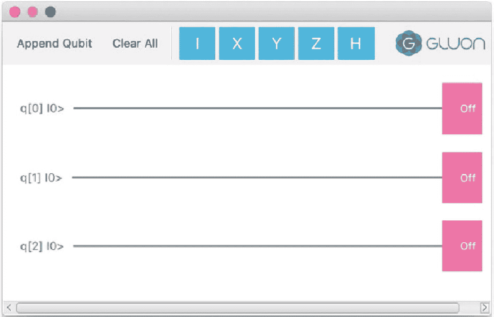
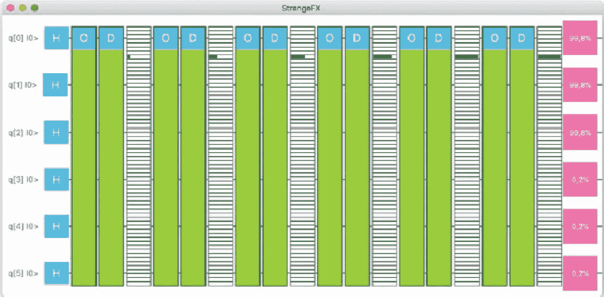
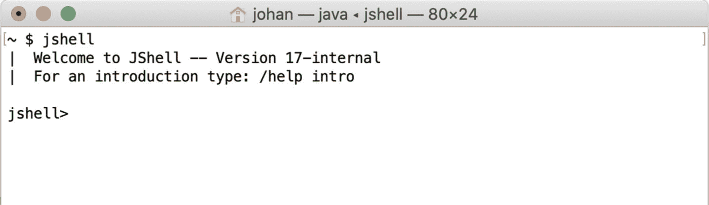
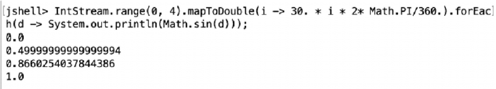
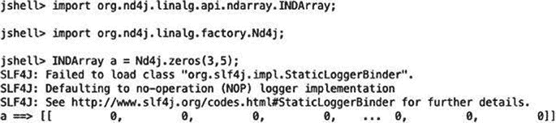
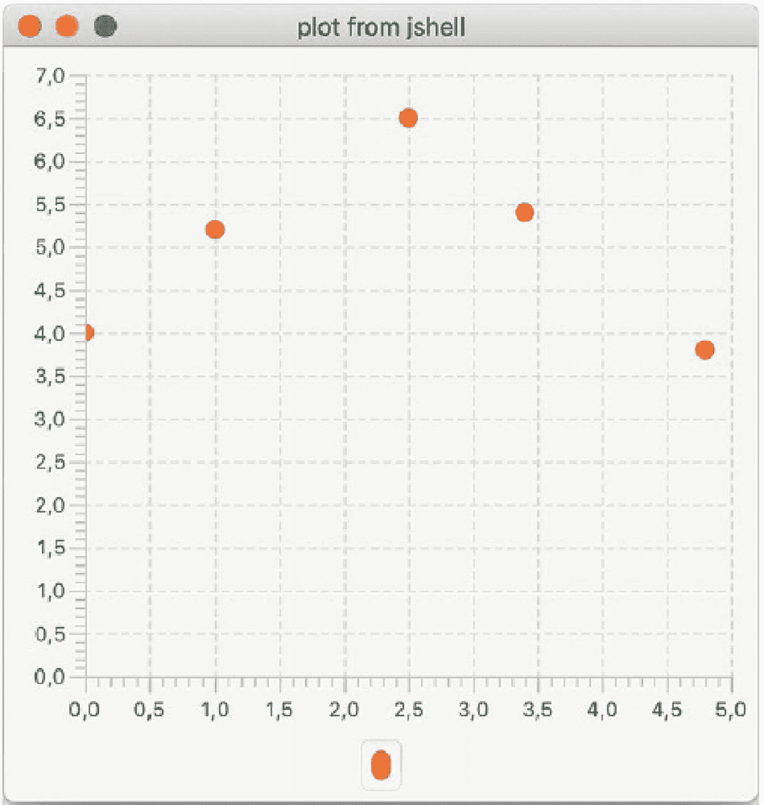

# 14.使用 JavaFX 的科学应用

由 Johan Vos 撰写

最近取得的许多惊人进展都是在数据科学领域，或者至少是与之相关的领域。不同形式的机器学习、大数据计算和量子计算正迅速对整个社会产生越来越大的影响。

这些进步的技术基础是基于不同的科学研究领域。通常情况下，技术基础是与实现无关的。不同的语言、平台和二进制文件可以用来实现技术基础。

在这一章中，我们将解释为什么 Java，特别是客户机 Java(包括 JavaFX ),是那些想用他们掌握的语言创建科学应用程序的开发人员的最佳选择。

我们将首先演示几个真实的示例，然后解释一种更通用的方法，它允许您用 Java 创建科学应用程序，包括进行与科学应用程序相关的研究工作。

## 用于太空探索的 JavaFX

使用 JavaFX 技术的一个伟大的科学应用是深空轨道探测器，或 DSTE。这是由 a.i. solutions 创造的产品，由 NASA 使用。该产品在位于 [`https://ai-solutions.com/dste`](https://ai-solutions.com/dste) 的 a.i. solutions 网站上有所描述。

据该网站介绍，深空轨道探索者是一个交互式软件包，结合了尖端的多体轨道设计技术和创新的可视化技术，以大幅减少轨道设计所花的时间。

通过 DSTE，用户可以设计空间物体的轨迹，这通常需要大量的计算。通常，在计算完成之前，这些计算是在没有任何可视化或交互性的情况下完成的。DSTE 的产品使设计过程更加“敏捷”和互动。

DSTE 的主要好处之一是它允许在任务设计过程中使用交互式可视化。这样，选择满足特定任务约束的轨道变得更加容易和直观。

结合高性能计算和复杂可视化的需求是 Java 和 JavaFX 的一个很好的用例。Java 本身是非常可扩展的，有大量强大的 Java APIs 和框架可以帮助开发人员和操作人员在多核环境中扩展 Java 代码。JavaFX 平台允许包括 3D 模型和画布渲染在内的可视化，从而使用硬件加速渲染，利用 GPU 的可用性。由于 JavaFX 是纯 Java，这种呈现可以很容易地与负责高性能计算的代码片段集成。

Deep Space Trajectory Explorer 以多种方式利用 JavaFX 平台提供的性能。它包含 2D 和 3D 的不同视图。许多视图都支持点击-拖动功能。画布组件用于在屏幕上呈现数百万个链接的数据点，而不会冻结布局。过滤器允许选择和取消选择许多选项，所产生的变化实时呈现在视图中。

图 [14-1](#Fig1) <sup>[1](#Fn1)</sup> 显示了由 DSTE 产品生成的屏幕截图，显示了该工具提供的一些视图。


图 14-1

DSTE 生成的截图

深空轨道探测器不是一个容易创建的应用程序。它需要深入了解轨道背后的物理学、高性能计算和 UI 开发。JavaFX 是整个解决方案中的关键组件，证明了该平台的强大。

## 用于量子计算的 JavaFX

量子计算正在科学环境和 IT 部门中迅速获得兴趣。

量子计算的前景之一是，一些用经典计算机极难解决或实际上不可能解决的问题，可以用量子计算机轻松解决。尤其是在算法表现出指数级时间行为的领域，量子计算机可以大有作为。

量子计算机使用一些从根本上存在于自然界的核心概念，但在经典计算机中没有。

在经典计算机中，最细粒度的单位是位。一位不是 0 就是 1。在量子计算机中，最精细的单位是量子位。一个量子位可以保存值 0 或 1，但它也可以处于所谓的叠加态，在这种状态下，它保存 0 和 1 的线性组合。然而在测量时，一个量子位总是返回 0 或 1。因此，量子计算的算法必须利用叠加态，而不需要在处理过程中测量量子位。

在经典计算中，比特是由门操纵的。例如，非门将翻转一位的值。当该位在进入门之前为 0 时，门之后的结果将为 1，反之亦然。

同样，在量子计算中，量子位是由量子门操纵的。

虽然有一些非常早期的量子计算机实验芯片可用，但量子计算还没有为主流开发做好准备。制造一台具有足够量子位的量子计算机，并使其在合理的时间内保持可用的实际需求是巨大的。因此，只有少数几个原型具有有限数量的量子位。

然而，由于量子计算的巨大潜在影响，许多开发人员已经在研究可能受益于量子计算的算法。通常，本地或基于云的模拟器用于开发这些算法，一些公司现在开始提供真正的量子计算机作为云服务。

这些算法通常用编程语言开发，并使用电路可视化来可视化。

其中一个量子模拟器 Strange 正在使用一个名为 StrangeFX 的配套工具，该工具是使用 JavaFX 构建的，用于呈现电路。StrangeFX 可以在 GitHub 的 [`https://github.com/redfx-quantum/strangefx`](https://github.com/redfx-quantum/strangefx) 获得。

StrangeFX 允许开发人员将量子门拖到量子位线上。当他们这样做时，本地仿真器评估电路并实时显示结果。JavaFX 的 draganddrop 功能为开发量子电路提供了一种非常直观的方式，并且与量子模拟算法的集成非常简单，因为两个组件都是用 Java 编写的。

图 [14-2](#Fig2) 显示了 StrangeFX 的一个简单截图，显示了三个量子位和工具栏中的一些门，可以拖动到量子位线上。



图 14-2

StrangeFX 允许开发人员将量子门拖到量子位线上

一个更复杂的例子包括图 [14-3](#Fig3) 所示的 Grover 搜索的模拟，这是一个著名的量子算法。



图 14-3

格罗弗氏 sarch 的模拟

## 使用 JShell

在不久前，我们看到了两个不同领域的活动之间的断层线:一方面是使用编程语言创建应用程序的开发人员，另一方面是从事基础设施和运营工作的人员。开发人员主要在一个孤立的环境中为特定的问题开发业务解决方案。一旦问题得到解决，解决方案就被交给 it 部门，IT 部门必须将其投入生产。这两个世界之间的差距导致了许多与可伸缩性、文档、版本、责任、依赖性等相关的问题。“它为我工作”的情况经常阻碍了从创建业务解决方案的开发人员到将解决方案投入大规模生产的运营人员的过渡。

这种差距现在通常通过所谓的“DevOps”方法来解决，其中开发和运营的一些重叠部分被集中在一个方法或团队中。如图 [14-4](#Fig4) 所示，包括容器化在内的许多软件改进使得开发和运营能够更加紧密地合作。


图 14-4

DevOps 方法

开发和运营的重叠部分在跨域 DevOps 环境中解决。

如今，人们对数据科学的兴趣越来越浓厚，这表明两个群体之间出现了一条新的断层线:从事研究的人和从事生产开发的开发人员。通常情况下，这项研究是由那些有极其困难和复杂的科学问题需要解决的科学家来完成的。那些研究人员应该关注核心问题，而不是特定编程语言的语法或特定行为。因此，像 Matlab 和 Python 这样伟大的科学平台或语言经常被科学家用来解决这些核心问题。

然而，一旦核心问题得到解决，它通常需要集成到产品中并投入生产。这经常会产生新的问题。科学平台专注于帮助研究人员找到科学问题的最佳解决方案，而不是找到与数据库、web 服务以及高可用性和安全性服务集成的最佳方式。

后者是 Java 擅长的领域。然而，当科学家不得不使用与 Java 企业开发人员相同的环境时，他们的生产力很可能会下降。

当进行纯研究时，迭代周期与开发业务应用程序和运行集成测试非常不同。在研究过程中，科学家希望衡量改变单个变量的影响，或者他们希望在现有的深度学习模型中添加一个新的层。他们应该能够检查他们算法的参数和中间值。这不同于调试业务应用程序。它需要与算法本身进行更快、更深入的交互，而不需要重新编译应用程序或运行单元测试。

在下文中，我们将展示由于 JShell，现代 Java 是如何支持这种快速的科学发展的。从 Java 9 开始，JShell 工具包含在 Java SE 发行版中。这是一个所谓的 REPL，是“读取-评估-打印-循环”的缩写，它为开发人员提供了一个简单的交互式环境，用于创建和检查应用程序和算法。JShell 构建在 Java 之上，您可以利用 JShell 的所有 Java APIs，包括 JavaFX APIs。

因此，JShell 是一个很好的工具，允许在科学研究和生产开发之间进行转换，如图 [14-5](#Fig5) 所示。


图 14-5

JShell 允许科学开发和业务环境集成之间的过渡

我们将首先展示 JShell 的基本功能。接下来，我们将展示如何使用 ND4J 库在 JShell 中轻松处理线性代数。最后，我们将演示如何使用 JavaFX 和 JShell 在原型开发过程中实现真正简单快速的可视化。

### 使用 JShell

启动 JShell 非常容易。JShell 是一个工具，与 javac 和 java 包装器位于同一个目录中。因此，如果您设法将 java 和 javac 添加到您的路径中，只需调用

```java
jshell

```

应该启动工具。一旦 JShell 启动，您就进入了 JShell 环境，您可以在其中输入命令或语句。

启动 JShell 后，您会看到以下内容:



请注意，版本号显示为“17-内部”这样做的原因是这个截图(以及接下来的截图)是在二进制版本可用之前用 OpenJDK 17 的定制版本创建的。

JShell 允许您创建 Java 语句。例如，可以在 JShell 提示符后编写以下语句:

```java
System.out.println("Hello, JShell");

```

它将立即导致以下响应:


虽然这看起来与创建常规 Java 应用程序的方式非常相似，但重要的是要注意，我们不必创建包、类或 main 方法。以下语句等效于创建包含以下定义的类 HelloWorld:

```java
public class HelloWorld {
    public static void main(String[] args) {
        System.out.println("Hello, Jshell");
    }
}

```

接下来，我们必须编译这个类

```java
javac HelloWorld.java

```

并使用运行它

```java
java HelloWorld

```

Note

从 Java 11 开始，可以跳过编译步骤，直接使用`java HelloWorld.java`运行类。

虽然最终结果是相同的(“Hello，JShell”正在打印)，但是步骤却非常不同。当处理复杂的或者模块化的软件时，创建一个带有修饰符的类和方法是非常重要的，在这种情况下不应该被看作是开销。然而，当我们只是想知道前面的代码片段中会打印出什么内容时，使用 JShell 的方法给了我们更快的答案。

使用 JShell 打印“Hello，JShell”并不是很有野心，但是我们展示了您可以在 Java 应用程序和 JShell 中使用相同的 Java 语法。因此，熟悉 Java 是 JShell 的关键优势之一。

科学应用通常需要数学运算。我们现在将展示一个具有更多数学功能的示例。

以下代码片段将打印取值为 0、30、60 和 90 度的参数的正弦值:



同样，请注意这个代码片段与实现相同功能的 Java 应用程序是多么相似。为了方便起见，这样的 Java 应用程序如下所示:

```java
import java.util.stream.*;
public class JshellSin {
    public static void main(String[] args) {
        IntStream.range(0, 4)
            .mapToDouble(i -> 30\. * i * 2* Math.PI/360.)
            .forEach(d -> System.out.println(Math.sin(d)));
    }
}

```

JShell 的一大优点是集成的编辑器功能。我们可以使用向上/向下箭头移动到上一条/下一条语句并编辑该语句。

例如，假设我们在算法中犯了一个错误。我们想打印余弦，而不是正弦。

我们可以很容易地做到这一点，按一次向上箭头键，这将再次显示前一行，我们可以修改它，以便我们用“Math.cos”替换“Math.sin”

按 return 键会立即重新计算表达式并打印结果:


因此，JShell 允许我们通过编辑语句并立即获得关于结果的反馈来试验我们的语句或算法。

这种方法已经更类似于科学家如何使用 Python 和 Matlab 来创建算法。

JShell 的一个巨大优势是代码与新的或现有的 Java 应用程序 100%兼容。JShell 代码可以很容易地粘贴到 Java 类中。

JShell 包含许多用于保存和加载代码片段的命令。然后可以将这些片段粘贴到您的应用程序中。

因此，由科学家使用 JShell 完成的最终成果，可以立即被使用 IDE 并将科学算法与项目中的其他组件集成在一起的 Java 开发人员使用。JShell 片段可以封装在一个私有方法中，提交给一个执行程序，周围是头参数，包括安全凭证等等。

虽然我们触及了 JShell 的一些核心概念，但是我们仅仅触及了可能的表面。在本章的剩余部分，我们将关注如何在结合科学工作和高质量可视化的环境中使用 JShell。如果你想了解更多关于 JShell 本身的知识，建议你去 [`https://docs.oracle.com/en/java/javase/17/jshell/introduction-jshell.html`](https://docs.oracle.com/en/java/javase/17/jshell/introduction-jshell.html) 看看 JShell 官方产品页面。

### 关于 ND4J

在前一章中介绍的 ND4J 线性代数库允许 Java 开发人员以一种对 Java 开发人员非常方便的方式访问高性能的线性代数功能。

ND4J 在提供线性代数工具的平台相关库之上提供了一个抽象层。ND4J 这个名字指的是 Java 的 N 维线性代数。许多平台(例如 Windows、macOS、Linux、iOS、Android)都包含针对特定平台进行了高度优化的线性代数库。此外，特定硬件(例如，GPU)的可用性可以导致一些功能的甚至更特定的实现。

因为性能在数据科学领域非常重要，所以 Java 开发人员能够利用这些本地库提供的功能是至关重要的。然而，如果开发人员不得不编写只适用于特定硬件或操作系统配置的应用程序，这将是一个痛苦。

这就是 ND4J 及其依赖项提供解决方案的地方。ND4J 的顶层提供了用户可以与之交互的 API。这些是 Java 开发人员和科学家都很熟悉的 Java APIs，因为它们提供了线性代数库中的典型功能。在幕后，这些 API 被映射到最佳可用的本地库。

ND4J 库为希望使用数学功能的 Java 开发人员提供了很多价值，同时也为希望他们的工作能够轻松集成到新的或现有的 Java 应用程序中的研究人员和科学家提供了很多价值，无论他们是在大型企业或云环境中运行，还是在嵌入式或移动设备上运行，或者在两者之间运行。

在我们展示如何在 JShell 中使用 ND4J 之前，我们先展示一个非常简单的应用程序，它使用 ND4J 进行基本的矩阵操作。

考虑以下示例:

```java
import org.nd4j.linalg.api.ndarray.INDArray;
import org.nd4j.linalg.factory.Nd4j;
public class HelloNd4j {
    public static void main(String[] args) {
        INDArray a = Nd4j.zeros(3,5);
        System.out.println("Matrix a has 3 rows and 5 columns:\n"+a);
        System.out.println("++++++++++++++++++++++++++++++\n");
        INDArray b = Nd4j.create(new double[] {0.,1.,2.,3.,4.,5.},
        new int[] {2,3});
        INDArray c = Nd4j.create(new double[] {2.,-1.,3.}, new int[] {3,1});
        System.out.println("Matrix b has 2 rows and 3 columns:\n"+b);
        System.out.println("++++++++++++++++++++++++++++++\n");
        System.out.println("Vector c has 3 elements:\n"+c);
        System.out.println("++++++++++++++++++++++++++++++\n");
        INDArray d = b.mmul(c);
        System.out.println("matrix product of b x c  =\n"+d);
        System.out.println("++++++++++++++++++++++++++++++\n");
    }
}

```

ND4J 库要求其他库在类路径中可用。因为我们不想为我们到底需要什么库而烦恼，所以我们将这部分委托给一个构建工具，例如 Maven。在 pom.xm 文件中，我们声明我们需要什么，Maven 将确保所有相关的依赖项都被下载并放到类路径中。

以下 pom.xml 可用于实现这一点:

```java
<project xmlns:="http://maven.apache.org/POM/4.0.0"
xmlns:xsi="http://www.w3.org/2001/XMLSchema-instance"
  xsi:schemaLocation="http://maven.apache.org/POM/4.0.0
  http://maven.apache.org/maven-v4_0_0.xsd">
  <modelVersion>4.0.0</modelVersion>
  <packaging>jar</packaging>
  <groupId>org.modernclient</groupId>
  <artifactId>nd4jshell</artifactId>
  <version>1.0.0</version>
  <url>http://maven.apache.org</url>
  <dependencies>
    <dependency>
      <groupId>org.nd4j</groupId>
      <artifactId>nd4j-native-platform</artifactId>
      <version>1.0.0-M1</version>
    </dependency>
    <dependency>
      <groupId>org.openjfx</groupId>
      <artifactId>javafx-controls</artifactId>
      <version>17.0.1</version>
    </dependency>
  </dependencies>
  <build>
    <plugins>
      <plugin>
        <groupId>org.apache.maven.plugins</groupId>
        <artifactId>maven-compiler-plugin</artifactId>
        <version>3.8.0</version>
        <configuration>
          <release>11</release>
        </configuration>
      </plugin>
      <plugin>
        <groupId>org.codehaus.mojo</groupId>
        <artifactId>exec-maven-plugin</artifactId>
        <version>1.6.0</version>
        <executions>
          <execution>
            <goals>
              <goal>java</goal>
            </goals>
          </execution>
        </executions>
        <configuration>
          <mainClass>org.modernclient.HelloNd4j</mainClass>
        </configuration>
      </plugin>
    </plugins>
  </build>
</project>

```

如果我们使用

```java
mvn compile exec:java

```

我们看到以下输出:

```java
Matrix a has 3 rows and 5 columns:
[[         0,         0,         0,         0,         0],
 [         0,         0,         0,         0,         0],
 [         0,         0,         0,         0,         0]]
++++++++++++++++++++++++++++++
Matrix b has 2 rows and 3 columns:
[[         0,    1.0000,    2.0000],
 [    3.0000,    4.0000,    5.0000]]
++++++++++++++++++++++++++++++
Vector c has 3 elements:
[2.0000,
 -1.0000,
 3.0000]
++++++++++++++++++++++++++++++
matrix product of b x c  =
[5.0000,
 17.0000]
++++++++++++++++++++++++++++++

```

在这个简单的应用程序中，我们创建了几个矩阵和一个向量，并将一个矩阵和一个向量相乘。虽然这些不是特别的计算，但它们展示了 ND4J 是如何工作的。如果您想了解更多关于 ND4J 的内容，以及与之相关的项目，我们建议您看一下 [`https://deeplearning4j.org/docs/latest/nd4j-overview`](https://deeplearning4j.org/docs/latest/nd4j-overview) `.`在下一节中，我们将解释如何在 JShell 中轻松集成基于 ND4J 的应用程序。

### 在 JShell 中使用 ND4J

通过键入以下命令，我们可以使用与应用程序相同的类路径启动 JShell，该应用程序托管在相同的目录中

```java
mvn compile com.github.johnpoth:jshell-maven-plugin:1.3:run

```

请注意，这要求 pom.xml 文件与我们键入的命令位于同一个目录中。pom.xml 文件包含应用程序的依赖关系，基于这些依赖关系(包括可传递的依赖关系)，JShell-maven-plugin 组成提供给 JShell 的类路径。用于此示例的 pom 文件如下所示:

```java
<project xmlns:="http://maven.apache.org/POM/4.0.0"
xmlns:xsi="http://www.w3.org/2001/XMLSchema-instance"
  xsi:schemaLocation="http://maven.apache.org/POM/4.0.0
  http://maven.apache.org/maven-v4_0_0.xsd">
  <modelVersion>4.0.0</modelVersion>
  <packaging>jar</packaging>
  <groupId>org.modernclient</groupId>
  <artifactId>plotjshell</artifactId>
  <version>1.0.0</version>
  <url>http://maven.apache.org</url>
  <dependencies>
    <dependency>
      <groupId>org.openjfx</groupId>
      <artifactId>javafx-controls</artifactId>
      <version>17.0.1</version>
    </dependency>
  </dependencies>
  <build>
    <plugins>
      <plugin>
        <groupId>org.apache.maven.plugins</groupId>
        <artifactId>maven-compiler-plugin</artifactId>
        <version>3.8.0</version>
        <configuration>
          <release>11</release>
        </configuration>
      </plugin>
      <plugin>
        <groupId>org.codehaus.mojo</groupId>
        <artifactId>exec-maven-plugin</artifactId>
        <version>1.6.0</version>
        <executions>
          <execution>
            <goals>
              <goal>exec</goal>
            </goals>
          </execution>
        </executions>
        <configuration>
            <executable>java</executable>
            <longModulepath>false</longModulepath>
            <arguments>
                <argument>--module-path</argument>
                <classpath />
                <argument>--add-modules</argument>
                <argument>javafx.controls</argument>
                <argument>-classpath</argument>
                <classpath />
                <argument>org.modernclient.Plot</argument>
            </arguments>
        </configuration>
      </plugin>
    </plugins>
  </build>
</project>

```

因此，前面文本中显示的命令将使用应用程序中也使用的类路径启动 JShell。首先，我们导入应用程序中需要的包:


我们现在从前面的应用程序中逐个输入命令。JShell 会在输入一行后立即给出输出。使用 ND4J API 的第一个命令将初始化 ND4J 后端，在此期间，将选择并初始化线性代数函数的最佳提供者。对此的反馈打印在第一个命令的结果之前。

在我们的例子中，第一个命令是创建一个 3 × 5 的矩阵，其中包含所有的零。输入此命令会生成以下输出:



Note

基于包括操作系统、CPU 和 GPU 在内的参数组合，Nd4j 库有许多不同的实现。其中一些实现提供了比其他实现更多(或不同)的日志输出，因此您可能会看到与之前粘贴的输出不同的输出。重要的一行是最后一行，在这里打印命令的结果。

我们现在可以继续输入命令并检查输出。例如，在进入声明 2 × 3 矩阵的第一行后，我们得到以下输出:


输入最后一个命令(忽略 System.out.println)后，矩阵向量乘法的输出如下所示:


这与我们从申请中得到的结果相同。

我们现在可以用 JShell 做的一件好事就是在这个结果的基础上构建。例如，如果我们想要将结果向量中的所有元素与标量 3 相乘，我们输入命令 d.mul(3)。ND4J Javadoc 解释说 mul 命令会将矩阵元素乘以一个给定的数——参见 [`https://deeplearning4j.org/api/latest/org/nd4j/linalg/api/ndarray/INDArray.html#mul-java.lang.Number-`](https://deeplearning4j.org/api/latest/org/nd4j/linalg/api/ndarray/INDArray.html#mul-java.lang.Number-) 。

我们不必重新运行现有代码或重新编译应用程序。我们只需输入命令，结果就会立即显示出来:


最后，我们将展示一些使用 JShell 可以完成的操作。我们展示的例子没有科学意义，但是它们应该说明了 JShell 工具的灵活性，与典型的开发周期相比，典型的开发周期包括在 IDE 中修改源代码、重新编译和从头开始运行。

在执行了上一个示例中的命令后，我们想要创建一个新函数。在这个新函数中，矩阵(或向量)的所有元素都乘以一个数，然后从结果中减去另一个数。

我们将命名为 someOperation 的函数在 Java 语法中定义如下:

```java
INDArray someOperation(INDArray src, int m, int s) {
        return src.mul(m).add(-s);
}

```

在 JShell 中定义函数与在 Java 应用程序中定义函数非常相似。我们只需输入函数定义。JShell 将确认所创建的函数，从那时起，我们可以在所有操作中使用该函数:


例如，我们现在可以在之前创建的 b 矩阵上使用这个新函数。我们将 b 的所有元素乘以 2，然后每个元素减去 1。为了清楚起见，我们首先打印 b 的当前值，这很容易通过简单地输入 b 来完成；在 JShell 提示符下:


请注意结果前面的“$31”。当没有使用结果变量时，JShell 会自动自己创建一个变量，并将结果赋给这个变量。这些变量以后可以再次使用，类似于其他变量的使用方式。

### 在 JShell 中使用 JavaFX

由于 JShell 是构建在 JVM 之上的，所以任何运行在 JVM 上的库、框架或应用程序都可以使用 JShell 运行。使用 REPL 来创建 JavaFX 应用程序听起来有些矫枉过正，而且在许多情况下确实不建议这样做。然而，JavaFX 中的 Java 可视化技术允许快速可视化数据，这在开发科学应用程序时非常有用。

在展示这种快速可视化的例子之前，我们先解释如何在 JShell 中执行 JavaFX 应用程序。但是首先，我们将展示启动独立 JavaFX 应用程序的另一种方法。

#### 启动独立 JavaFX 代码

通常，JavaFX 应用程序会扩展 javafx.application.Application。其 start 方法由 javafx 运行时调用。JavaFX 启动器管理 JavaFX 运行时的引导。

然而，我们也可以直接启动 JavaFX 运行时，并在单个方法中运行 JavaFX 应用程序。以下代码片段显示了如何做到这一点:

```java
package org.modernclient;
import javafx.application.Application;
import javafx.application.Platform;
import javafx.scene.Scene;
import javafx.scene.control.Button;
import javafx.scene.control.Label;
import javafx.scene.layout.StackPane;
import javafx.stage.Stage;
public class StandAlone {
    public static void showHello() {
        Platform.startup(() -> {});
        Platform.setImplicitExit(false);
        Platform.runLater( () -> {
            Label label = new Label ("Hello, standalone JavaFX");
            Button button = new Button ("Click me");
            button.setOnAction(e -> {label.setText("Clicked");});
            button.setTranslateY(50);
            StackPane box = new StackPane();
            box.getChildren().addAll(label, button);
            Scene s = new Scene(box, 200, 200);
            Stage stage = new Stage();
            stage.setTitle("StandAlone Hello");
            stage.setScene(s);
            stage.show();
        });
    }
    public static void main(String[] args) {
        showHello();
    }
}

```

在这个应用程序中，main 方法调用静态方法 showHello()，该方法通过调用

```java
Platform.startup(() -> {})

```

该方法将启动 JavaFX 运行时，并在成功完成启动后调用提供的 Runnable。在我们的例子中，我们不会立即调用 Runnable 因此，我们传递一个空的 Runnable。一旦该方法返回，JavaFX 应用程序线程被创建，我们可以使用 Platform.runLater()语句来创建或修改 SceneGraph，类似于我们应该对 JavaFX 应用程序执行的操作，其中运行时由 JavaFX 启动器启动。

我们首先用 Maven 编译这个类，使用

```java
mvn compile

```

如果您喜欢使用命令行编译，可以通过以下命令轻松完成:

```java
javac -p /opt/javafx-sdk-17/lib --add-modules javafx.controls src/main/java/org/modernclient/StandAlone.java
where /opt/javafx-sdk-17 should be replaced with the location where you downloaded the JavaFX 17 SDK.

```

我们用它来运行

```java
mvn exec:exec

```

或者，如果您使用命令行编译并将类编译到与源代码相同的目录中

```java
java -p /opt/javafx-sdk-17/lib --add-modules javafx.controls -cp src/main/java/ org.modernclient.StandAlone

```

结果如下所示:


为了让 Maven 正确启动这个应用程序，我们必须向 pom.xml 提供模块路径和所需的模块(javafx.controls)。

```java
<plugin>
        <groupId>org.codehaus.mojo</groupId>
        <artifactId>exec-maven-plugin</artifactId>
        <version>1.6.0</version>
        <executions>
          <execution>
            <goals>
              <goal>exec</goal>
            </goals>
          </execution>
        </executions>
        <configuration>
            <executable>java</executable>
            <longModulepath>false</longModulepath>
            <arguments>
                <argument>--module-path</argument>
                <classpath />
                <argument>--add-modules</argument>
                <argument>javafx.controls</argument>
                <argument>-classpath</argument>
                <classpath />
                <argument>org.modernclient.StandAlone</argument>
            </arguments>
        </configuration>
      </plugin>

```

在这个代码片段中，我们配置了 exec 任务来调用 Java 命令，但是我们没有使用 Maven 本来会使用的默认启动器。相反，我们手动告诉 Java，它应该从类路径(包括依赖 javafx-controls)中获取模块路径，并添加 javafx.controls 模块。

运行这个应用程序也可以在命令行上完成。例如，如果 JavaFX SDK 安装在/opt/javafx-sdk-17 中，则以下内容有效:

```java
java -p /opt/javafx-sdk-17/lib/ --add-modules javafx.controls -cp target/classes org.modernclient.StandAlone

```

#### JShell 中的 JavaFX 应用程序

我们现在可以在 JShell 中运行代码了。正如我们之前提到的，JShell 使用 JVM 来执行。我们可以简单地在 JShell 中输入相同的命令，输出会立即告诉我们发生了什么。

如果我们假设 JavaFX SDK 安装在/opt/javafx-sdk-11.0.12 中，以下命令将启动 JShell，正确设置模块路径，并添加 javafx.controls 模块:

```java
jshell --module-path /opt/javafx-sdk-11.0.12/lib/ --add-modules javafx.controls

```

我们现在可以输入最终构成 JavaFX 应用程序的命令，从导入开始:


注意，我们没有添加包声明。这涉及到了普通 Java 应用程序和 JShell 代码之间的一点区别。创建包的目的是公开功能并在其他组件和其他库中使用这些功能。JShell 的概念是提供一个独立的、交互式的、自包含的环境；因此，公开包没有意义。

既然已经添加了导入，我们就可以创建 showHello()方法了。我们将首先以一种效率较低的方式使用 JShell，但是在下一节中，我们将展示如何以一种更高效的方式来实现这一点。

现在，我们简单地复制粘贴 showHello 方法。这将产生以下输出:


JShell 编辑器允许将语句或声明拆分成多行。解析器认为在输入第一行之后，还需要更多的内容。因此，它只会在我们完成方法声明之后处理它。它将检测到最后的右花括号。

在 JShell 的早期版本中，显示了一个警告，告诉我们 static 关键字被忽略了。在 JShell 中，所有的顶级声明都是静态的，所以 keyword 在这个上下文中没有用。这是常规应用程序和 JShell 上下文中的代码之间的另一个区别。

既然方法已经声明了，我们就可以调用它了。这可以通过在 JShell 提示符下调用 showHello()来完成:


该语句立即返回，并将呈现与前面的屏幕截图相同的图像。

#### JShell 中的 JavaFX 库

虽然上一节中的示例可以工作，但是它非常冗长，需要手动键入或复制粘贴，并且不允许快速原型化。JavaFX 和 JShell 结合的真正好处来自提供简单内容的库和函数，这些内容可以从 JShell 语句中调用。通常，这些函数是在 Java 文件中创建的，经过编译后可供 JShell 使用。这与 JShell 如何使用 ND4J 库非常相似。

例如，我们创建了一个简单的函数，它创建了一个包含一些分散数据的 JavaFX 图表。

我们将该函数编写为常规的 Java 函数，如下面的代码所示:

```java
package org.modernclient;
import javafx.application.*;
import javafx.collections.FXCollections;
import javafx.collections.ObservableList;
import javafx.scene.Scene;
import javafx.scene.chart.NumberAxis;
import javafx.scene.chart.ScatterChart;
import javafx.scene.chart.XYChart;
import javafx.scene.chart.XYChart.Data;
import javafx.stage.Stage;
public class Plot {
    public static void scatter(double[] x, double[] y, String title) {
        Platform.startup(() -> {});
        Platform.setImplicitExit(false);
        Platform.runLater( () -> {
        NumberAxis xAxis = new NumberAxis();
        NumberAxis yAxis = new NumberAxis();
        ScatterChart chart = new ScatterChart(xAxis, yAxis);
        ObservableList<XYChart.Series> chartData =         FXCollections.observableArrayList();
        XYChart.Series<Number, Number> series = new XYChart.Series<>();
        ObservableList<Data<Number, Number>> data =         FXCollections.observableArrayList();
        for (int i = 0; i < x.length; i++) {
            Data<Number, Number> d = new Data<>(x[i],y[i]);
            data.add(d);
        }
        series.setData(data);
        chartData.setAll(series);
        chart.setData(chartData);
        Scene s = new Scene(chart, 400, 400);
        Stage stage = new Stage();
        stage.setTitle(title);
        stage.setScene(s);
        stage.show();
        });
    }
    public static void main(String[] args) {
        double[] x = new double[]{0.,1.,2.};
        double[] y = new double[]{0.,10.,16.};
        scatter(x, y, "plot");
    }
}

```

在这段代码中，我们定义了一个带有三个参数的 scatter 函数:一个包含 x 坐标的 double 数组、一个包含 y 坐标的 double 数组和一个图表标题。scatter 函数初始化 JavaFX 运行时，然后创建包含参数提供的数据的散点图。图表被添加到场景中并呈现在舞台上。

我们在这个类中添加了一个 main 函数，这样我们就可以使用常规的 Java 调用来测试这个函数。在这个主函数中，我们传递三个数据点(因此 x 数组有三个值，y 数组有三个值)，并提供标题“plot”

为了获得图 [14-6](#Fig6) 中的 UI，我们将使用与之前相同的方法编译并运行应用程序:


图 14-6

运行应用程序的结果

```java
Mvn compile exec:exec

```

我们现在将使这个函数对 JShell 可用，并从那里调用它。

我们使用之前使用的 Maven 插件启动 JShell:

```java
mvn com.github.johnpoth:jshell-maven-plugin:1.1:run

```

确保在包含用于绘图代码的 pom.xml 文件的目录中调用该命令。这将把编译后的类和依赖项添加到类和模块路径中。

当 JShell 启动时，会显示以下消息:


我们首先通过输入以下命令导入绘图类

```java
Import org.modernclient.Plot;

```

我们还创建了两个数组，包含我们想要可视化的数据点的 x 和 y 值:


最后，为了创建如图 [14-7](#Fig7) 所示的图形，我们调用散布函数如下:



图 14-7

由前面的代码生成的新绘图

```java
Plot.scatter(c, d, "plot from jshell");

```

JShell 的一个很好的特性是有许多内置命令，允许它更有效地与编辑器一起工作。例如,/list 命令显示了按顺序执行的命令。成功应用前面的步骤后,/list 命令的结果如下所示:


这张截图清楚地表明，在 JShell 中调用预定义的函数比在 JShell 中手动声明所有函数要容易得多。根据经验，如果希望函数经常被修改，可以在 JShell 中声明它。但是如果您主要想评估函数并检查结果，那么在类中声明它们并在 JShell 环境中导入它们更合适。

## 结论

Java 和 JavaFX 的结合为科学工作提供了坚实的基础。Java 本身已经具有很高的性能和高度的可伸缩性。使用 JShell 和 ND4J ,(数据)科学家可以使用熟悉的线性代数例程，从事需要灵活操作数据的研究项目。

通常，设计过程中的交互式可视化缩短了开发周期并提高了结果的质量。在研究阶段引入 JavaFX 可视化允许实时可视化和高度交互式的科学应用。

<aside aria-label="Footnotes" class="FootnoteSection" epub:type="footnotes">Footnotes [1](#Fn1_source)

[T2`https://ai-solutions.com/wp-content/uploads/2017/12/DTSE_DataSheet.pdf`](https://ai-solutions.com/wp-content/uploads/2017/12/DTSE_DataSheet.pdf)

 </aside>