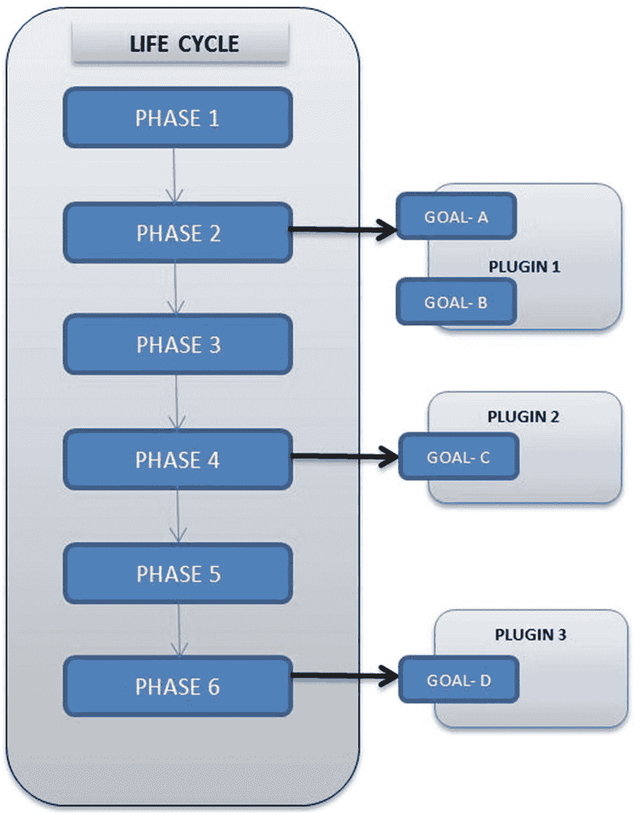
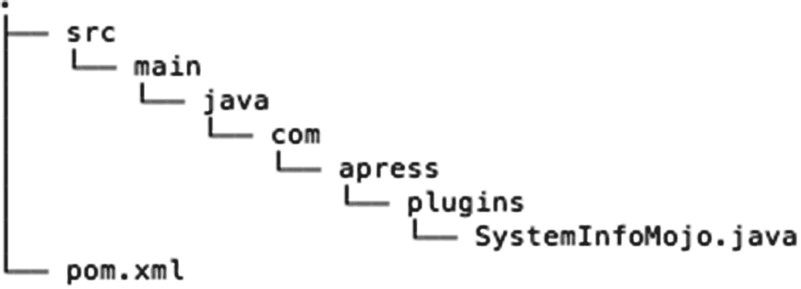

# 五、Maven 生命周期

Maven 的核心是它的生命周期，它为构建和分发项目提供了统一的接口。在本章中，我们将回顾生命周期和构成生命周期的构件。

## 目标和插件

生成 JAR 或 WAR 文件等工件的构建过程通常需要几个步骤和任务，以便按照定义好的顺序成功完成。这种任务的例子包括编译源代码、运行单元测试以及工件的打包。Maven 使用*目标*的概念来表示这种粒度任务。

为了更好地理解什么是目标，让我们看一个例子。清单 [5-1](#PC1) 显示了在`C:\apress\gswm-book\chapter5\gswm`下的`gswm`项目代码上执行的`compile`目标。顾名思义，`compile`目标编译源代码。`compile`目标识别`src/main/java`下的 Java 类`HelloWorld.java`，编译它，并将编译后的类文件放在`target\classes`文件夹下。

```java
C:\apress\gswm-book\chapter5\gswm>mvn compiler:compile
[INFO] Scanning for projects...
[INFO] --- maven-compiler-plugin:3.1:compile (default-cli) @ gswm ---
[INFO] Compiling 1 source file to C:\apress\gswm-book\chapter5\gswm\target\classes
[INFO] --------------------------------------------------------
[INFO] BUILD SUCCESS
[INFO] --------------------------------------------------------

Listing 5-1Maven compile Goal

```

Maven 中的目标被打包在*插件*中，这些插件本质上是一个或多个目标的集合。在清单 [5-1](#PC1) 中，`compiler`是提供目标`compile`的插件。

清单 [5-2](#PC2) 引入了一个非常漂亮的目标，叫做`clean`。如前所述，目标文件夹保存 Maven 生成的临时文件和工件。有时，目标文件夹会变得很大，或者缓存的某些文件需要从文件夹中清除。`clean`目标正好完成了这一点，因为它试图删除目标文件夹及其所有内容。

```java
C:\apress\gswm-book\chapter5\gswm>mvn clean:clean
[INFO] Scanning for projects...
[INFO] --- maven-clean-plugin:2.5:clean (default-cli) @ gswm ---
[INFO] Deleting C:\apress\gswm-book\chapter5\gswm\target
[INFO] --------------------------------------------------------
[INFO] BUILD SUCCESS
[INFO] --------------------------------------------------------

Listing 5-2Maven clean Goal

```

注意，清单 [5-2](#PC2) 中命令`clean:clean`的格式。冒号(`:`前的`clean`代表`clean`插件，冒号后的`clean`代表`clean`目标。到目前为止，在命令行中运行目标显然需要以下语法:

```java
mvn plugin_identifier:goal_identifier

```

Maven 提供了一个现成的帮助插件，可以用来列出给定插件中的可用目标。清单 [5-3](#PC4) 显示了帮助插件的`describe`目标，以显示编译器插件内部的目标。

```java
mvn help:describe -Dplugin=compiler

[INFO] Scanning for projects...
Name: Apache Maven Compiler Plugin
Description: The Compiler Plugin is used to compile the sources of your project.
Group Id: org.apache.maven.plugins
Artifact Id: maven-compiler-plugin
Version: 3.8.1
Goal Prefix: compiler

This plugin has 3 goals:

compiler:compile
  Description: Compiles application sources

compiler:help
  Description: Display help information on maven-compiler-plugin.
  Call mvn compiler:help -Ddetail=true -Dgoal=<goal-name> to display parameter details.

compiler:testCompile
  Description: Compiles application test sources

.

Listing 5-3Maven Help Plug-in

```

插件及其行为可以使用`pom.xml`的插件部分进行配置。考虑这样一种情况，您想要强制您的项目必须用 Java 8 编译。从 3.8 版本开始，Maven 编译器插件针对 Java 1.6 编译代码。因此，您需要在`pom.xml`文件中修改这个插件的行为，如清单 [5-4](#PC5) 所示。

```java
<project  xmlns:xsi="http://www.w3.org/2001/XMLSchema-instance"
  xsi:schemaLocation="http://maven.apache.org/POM/4.0.0 http://maven.apache.org/xsd/maven-4.0.0.xsd">
  <modelVersion>4.0.0</modelVersion>

  <!-- Project details omitted for brevity -->

  <dependencies>
       <!-- Dependency details omitted for brevity -->
  </dependencies>

  <build>
   <plugins>
    <plugin>
       <groupId>org.apache.maven.plugins</groupId>
      <artifactId>maven-compiler-plugin</artifactId>
      <version>3.8.1</version>
      <configuration>
         <source>1.8</source>
         <target>1.8</target>
      </configuration>
    </plugin>
    </plugins>
  </build>
</project>

Listing 5-4Plug-in Element in the pom.xml File

```

现在，如果您运行`mvn compiler:compile`命令，生成的类文件将是 Java 版。

### 注意

`pom.xml`中的`<build />`元素有一个非常有用的子元素叫做`finalName`。默认情况下，Maven 生成的工件的名称遵循`<<project_artifiact_id>>-<<project_version>>`格式。然而，有时您可能想要改变生成的工件的名称，而不改变`artifactId`。您可以通过将`finalName`元素声明为`<finalName>new_name</finalName>`来实现这一点。

## 生命周期和阶段

Maven 目标是细粒度的，通常执行一项任务。需要以有序的方式执行多个目标，以执行复杂的操作，例如生成工件或文档。Maven 通过生命周期和阶段抽象简化了这些复杂的操作，这样与构建相关的操作可以用少量的命令来完成。

Maven 的构建生命周期由一系列以相同顺序执行的阶段组成，独立于正在生产的工件。Maven 将生命周期中的各个阶段称为*阶段*。每个 Maven 项目都有以下三个内置的生命周期:

*   *default* :这个生命周期处理 Maven 项目的编译、打包和部署。

*   *clean* :这个生命周期处理从目标目录中删除临时文件和生成的工件。

*   站点:这个生命周期处理文档的生成和站点的生成。

为了更好地理解构建生命周期及其阶段，让我们看看与默认生命周期相关的一些阶段:

*   *validate* :运行检查以确保项目是正确的，并且所有的依赖项都已下载并可用。

*   *编译*:编译源代码。

*   测试:使用框架运行单元测试。这一步不需要打包应用程序。

*   *打包*:将编译好的代码组装成可分发的格式，比如 JAR 或者`WAR`。

*   *install* :将打包的归档文件安装到本地存储库中。该归档文件现在可供在该机器上运行的任何项目使用。

*   *deploy* :将构建好的档案推到远程存储库中，供其他团队和团队成员使用。

Maven 生命周期是一个抽象的概念，不能直接执行。相反，您执行一个或多个阶段。例如，命令`mvn package`将执行默认生命周期的`package`阶段。除了明确定义生命周期中各个阶段的顺序之外，Maven 还会自动执行请求阶段之前的所有阶段。因此，当运行`mvn package`命令时，Maven 将运行所有之前的阶段，比如编译和测试。

每个阶段都需要执行许多任务。为此，每个阶段都与零个或多个目标相关联。该阶段只是将这些任务委派给相关的目标。图 [5-1](#Fig1) 显示了生命周期、阶段、目标和插件之间的关联。



图 5-1

生命周期、阶段、目标和插件之间的关联

一个 Maven 阶段没有任何相关联的目标是有效的。在这种情况下，Maven 将跳过阶段执行。这样的阶段为用户和第三方供应商提供了占位符，以关联他们的定制目标。

`pom.xml`文件中的`<packaging />`元素将自动为每个阶段分配正确的目标，无需任何额外的配置。记住这是 CoC 的一个好处。例如，如果 packaging 元素是`jar`，那么 package 阶段将被绑定到`jar`插件中的`jar`目标。类似地，对于一个`WAR`工件，`pom.xml`会将包绑定到`war`插件中的`war`目标。图 [5-2](#Fig2) 显示了与 WAR 项目相关的内部生命周期的一部分。


图 5-2

WAR 项目的默认生命周期

### 跳过测试

如前所述，当您运行包阶段时，测试阶段也会运行，所有的单元测试都会执行。如果在测试阶段有任何失败，构建就会失败。这是期望的行为。然而，有些时候，例如，当处理一个遗留项目时，您想要跳过编译和运行测试，以便您可以成功地构建一个项目。您可以使用`maven.test.skip`属性来实现这一点。以下是使用此属性的示例:

```java
mvn package –Dmaven.test.skip=true

```

## 插件开发

为 Maven 开发定制插件非常简单。如前所述，插件只是目标的集合。因此，当我们谈论插件开发时，我们本质上是在谈论开发目标。在 Java 中，这些目标是使用 *MOJOs 实现的，其中*代表 Maven Old Java Object，它类似于 Java 的 Plain Old Java Object (POJO)。

本节解释如何在运行 Maven 命令的控制台上开发一个显示系统信息的`SystemInfoPlugin`,比如 Java 版本、操作系统等等。

让我们通过创建一个名为`gswm-maven-plugin`的 Maven Java 项目来开始这个插件开发，如图 [5-3](#Fig3) 所示。



图 5-3

用于插件开发的 Maven 项目

### 注意

在本章中，我们将手动创建插件项目。Maven 提供了一个 *mavan-archetype-mojo* ，它将启动您的插件开发。我们将在第六章[中学习玛文的原型。](6.html)

`pom.xml`文件的内容如清单 [5-5](#PC7) 所示。请注意，包装类型是`maven-plugin`。我们添加了`maven-plugin-api`和`maven-plugin-annotations`依赖项，因为插件开发需要它们。我们将利用 Apache Commons Lang 来获取系统信息。因此，我们还添加了 Apache Commons Lang 3 依赖项。

```java
<?xml version="1.0" encoding="UTF-8"?>
<project>
  <modelVersion>4.0.0</modelVersion>
  <groupId>com.apress.plugins</groupId>
  <artifactId>gswm-maven-plugin</artifactId>
  <version>1.0.0</version>
  <packaging>maven-plugin</packaging>
  <description>System Info Plugin</description>

  <properties>
    <maven.compiler.source>1.8</maven.compiler.source>
    <maven.compiler.target>1.8</maven.compiler.target>
  </properties>

   <dependencies>
     <dependency>
         <groupId>org.apache.maven</groupId>
         <artifactId>maven-plugin-api</artifactId>
         <version>3.6.1</version>
     </dependency>
     <dependency>
    <groupId>org.apache.maven.plugin-tools</groupId>
    <artifactId>maven-plugin-annotations</artifactId>
    <version>3.6.0</version>
    <scope>provided</scope>
  </dependency>
  <dependency>
          <groupId>org.apache.commons</groupId>
          <artifactId>commons-lang3</artifactId>
          <version>3.9</version>
  </dependency>
   </dependencies>
   <!-- Use the latest version of Plugin  -->
   <build>
      <plugins>
             <plugin>
                   <groupId>org.apache.maven.plugins</groupId>
                   <artifactId>maven-plugin-plugin</artifactId>
                   <version>3.6.0</version>
             </plugin>
      </plugins>
    </build>

</project>

Listing 5-5The 
pom.xml

with Dependencies

```

开发过程的下一步是创建 MOJO。清单 [5-6](#PC8) 显示了`SystemInfoMojo`的代码。@Mojo 注释将 systeminfo jo 类标记为一个 Mojo，目标名称为“system info”。执行方法包含目标逻辑。在 SystemInfoMojo 中，我们只是将几条系统信息记录到控制台。

```java
package com.apress.plugins;

import org.apache.commons.lang3.SystemUtils;
import org.apache.maven.plugin.AbstractMojo;
import org.apache.maven.plugin.MojoExecutionException;
import org.apache.maven.plugin.MojoFailureException;
import org.apache.maven.plugins.annotations.Mojo;

@Mojo( name = "systeminfo")
public class SystemInfoMojo extends AbstractMojo {

@Override
      public void execute() throws MojoExecutionException, MojoFailureException {
           getLog().info( "Java Home: " + SystemUtils.JAVA_HOME );
           getLog().info( "Java Version: "+ SystemUtils.JAVA_VERSION);
           getLog().info( "OS Name: " + SystemUtils.OS_NAME );
           getLog().info( "OS Version: " + SystemUtils.OS_VERSION );
           getLog().info( "User Name: " + SystemUtils.USER_NAME );
}
}

Listing 5-6SystemInfoMojo Java Class

```

这个过程的最后一步是在 Maven 存储库中安装插件。在根目录下运行`mvn install`命令，您应该会得到清单 [5-7](#PC9) 中所示的输出。

```java
C:\apress\gswm-book\chapter5\gswm-maven-plugin>mvn install
[INFO] Scanning for projects...
[INFO]
[INFO] --------< com.apress.plugins:gswm-maven-plugin >--------
[INFO] Building gswm-maven-plugin 1.0.0
[INFO] -------------------[ maven-plugin ]---------------------
[INFO]
[INFO] --- maven-resources-plugin:2.6:resources (default-resources) @ gswm-maven-plugin

[INFO] java-annotations mojo extractor found 1 mojo descriptor.

[INFO] --- maven-install-plugin:2.4:install (default-install) @ gswm-maven-plugin ---
[INFO] Installing C:\apress\gswm-book\chapter5\gswm-maven-plugin\target\gswm-maven-plugin-1.0.0.jar to C:\Users\<<USER_NAME>>\.m2\repository\com\apress\plugins\gswm-plugin\1.0.0\gswm-maven-plugin-1.0.0.jar
[INFO] Installing C:\apress\gswm-book\chapter5\gswm-maven-plugin\pom.xml to C:\Users\<<USER_NAME>>\.m2\repository\com\apress\plugins\gswm-maven-plugin\1.0.0\gswm-maven-plugin-1.0.0.pom

[INFO] --------------------------------------------------------
[INFO] BUILD SUCCESS

Listing 5-7Maven install Command

```

现在您已经准备好开始使用这个插件了。记住运行任何目标的语法是`mvn pluginId:goal-name`。清单 [5-8](#PC10) 展示了这个插件的运行。请注意控制台上显示的系统信息。

```java
C:\apress\gswm-book\chapter5\gswm-plugin>mvn com.apress.plugins:gswm-maven-plugin:systeminfo
[INFO] Scanning for projects...
[INFO] --- gswm-maven-plugin:1.0.0:systeminfo (default-cli) @ gswm-maven-plugin ---
[INFO] Java Home: C:\java\jdk-11
[INFO] Java Version: 11.0.1
[INFO] OS Name: Windows
[INFO] OS Version: 10
[INFO] User Name: Balaji
[INFO] --------------------------------------------------------

Listing 5-8Running the 
SystemInfoMojo

Plug-in

```

新开发的插件也可以用于其他 Maven 项目。清单 [5-9](#PC11) 显示了将 systeminfo 目标附加到验证阶段的 POM 文件的一部分。

```java
<project>
       <modelVersion>4.0.0</modelVersion>
       <groupId>com.apress.plugins</groupId>
       <artifactId>gswm-plugin-test</artifactId>
       <version>1.0.0</version>
       <packaging>jar</packaging>
       <description>Plugin Test</description>

       <properties>
              <maven.compiler.source>1.8</maven.compiler.source>
              <maven.compiler.target>1.8</maven.compiler.target>
       </properties>

       <dependencies />

       <build>
             <plugins>
                   <plugin>
                          <groupId>com.apress.plugins</groupId>
                          <artifactId>gswm-maven-plugin</artifactId>
                          <version>1.0.0</version>
                          <executions>
                                <execution>

                                       <phase>validate</phase>
                                       <goals>
                                            <goal>systeminfo</goal>
                                       </goals>
                                </execution>
                          </executions>
                   </plugin>
             </plugins>
       </build>

</project>

Listing 5-9POM File Using systeminfo Goal

```

当 Maven 阶段(如 compile 或 package)被调用时，您将看到 systeminfo 目标的输出，如清单 [5-10](#PC12) 所示。

```java
mvn compile
[INFO] Scanning for projects...
[INFO] Building gswm-plugin-test 1.0.0
[INFO] Java Home: C:\java\jdk-11
[INFO] Java Version: 11.0.1
[INFO] OS Name: Windows
[INFO] OS Version: 10
[INFO] User Name: Balaji
[INFO] --- maven-resources-plugin:2.6:resources (default-resources) @ gswm-plugin-test ---

Listing 5-10Compile Phase Output

```

## 摘要

Maven 使用基于插件的架构，这使得它的功能很容易扩展。每个插件都是一个或多个目标的集合，可以用来执行任务，比如编译源代码或运行测试。Maven 将目标与阶段联系起来。阶段通常作为构建生命周期的一部分按顺序执行。您还学习了创建插件的基础知识。

在下一章中，将向您介绍原型并了解多模块项目。