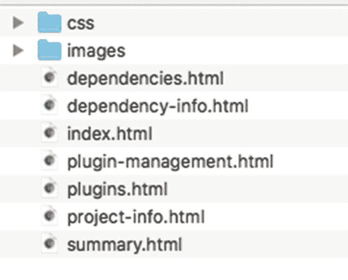
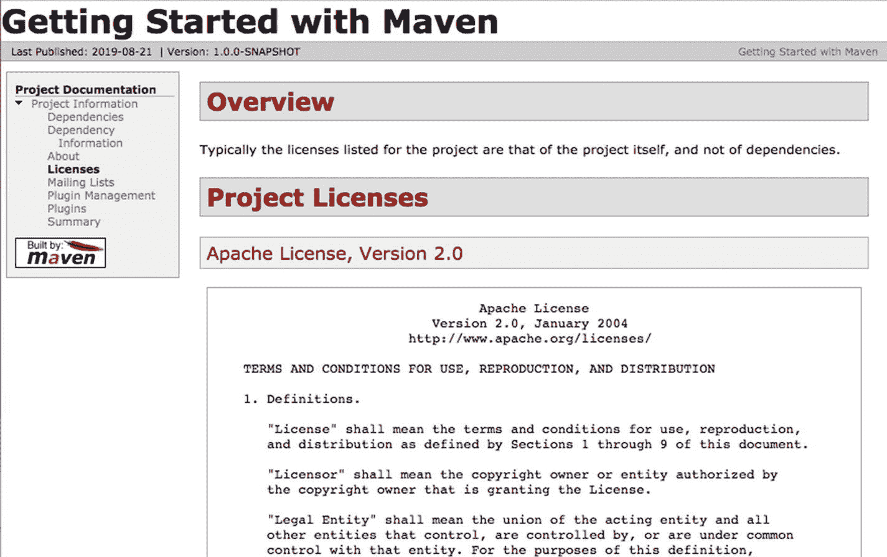
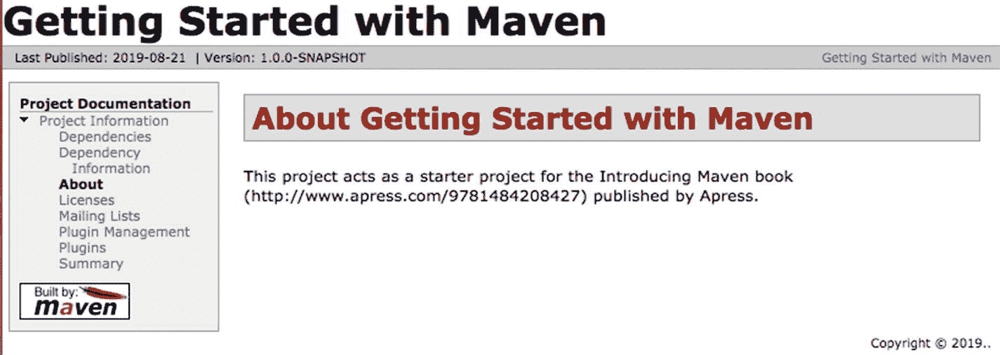
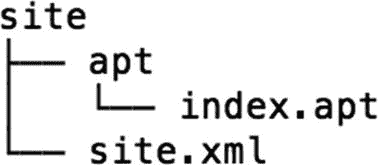
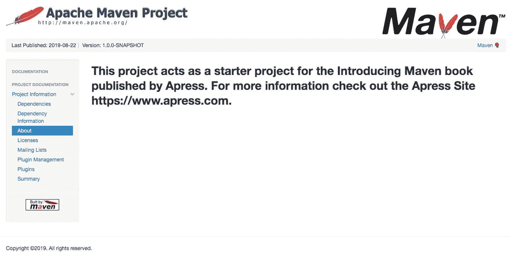
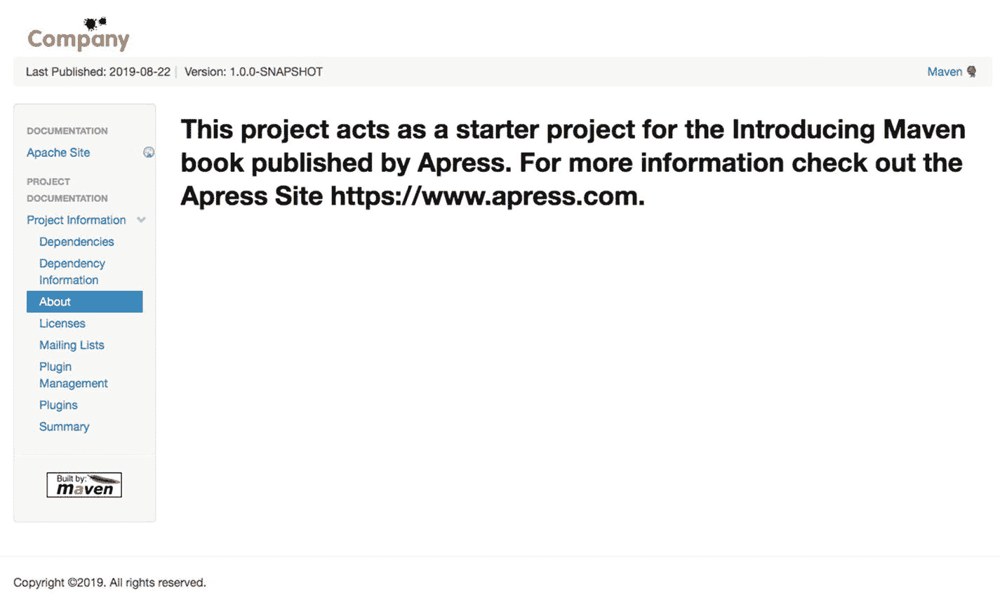
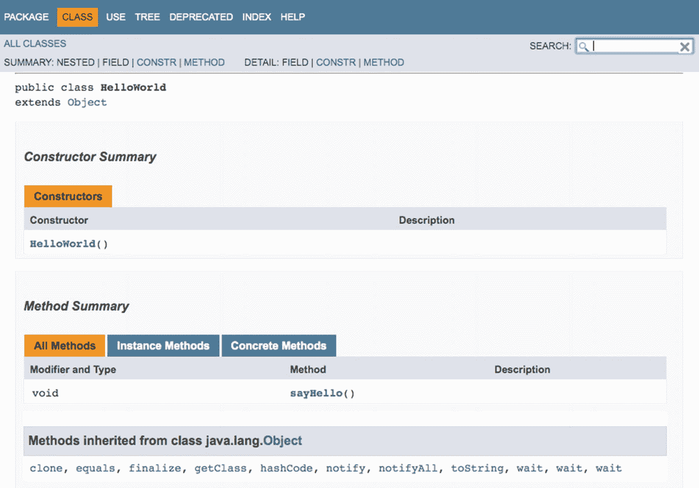
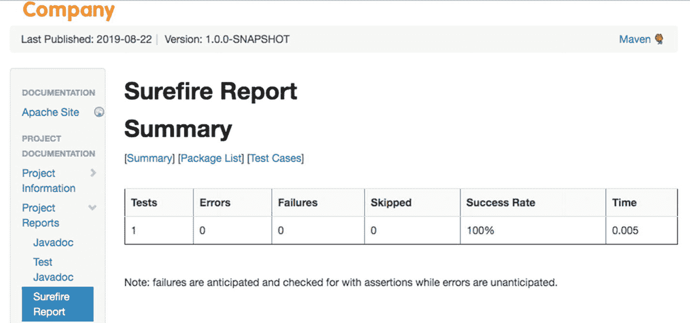
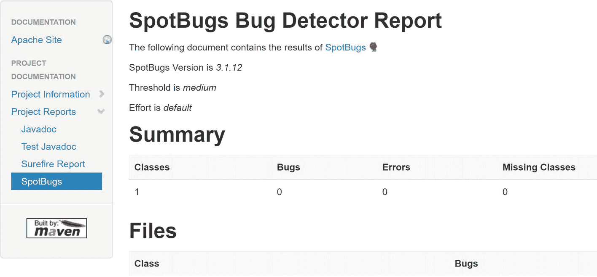

# 七、文件和报告

文档和报告是任何项目的关键方面。对于企业和开源项目来说尤其如此，在这些项目中，许多人合作开发项目。本章介绍了 Maven 的一些工具和插件，它们使得在线文档的发布和维护变得轻而易举。

在本章中，您将再次使用您在前面章节中构建的`gswm` Java 项目。在`C:\apress\gswm-book\chapter7`文件夹中也可以找到`gswm`项目。

## 使用站点生命周期

正如在第 [5](5.html) 章中所讨论的，Maven 提供了*站点*生命周期，可以用来生成项目的文档。让我们从`gswm`目录运行以下命令:

```java
mvn site

```

站点生命周期使用 Maven 的站点插件来生成项目的站点。此命令完成后，将在项目的目标文件夹下创建一个站点文件夹。图 [7-1](#Fig1) 显示了站点文件夹的内容。



图 7-1

生成的网站文件夹

在浏览器中打开`index.html`文件，查看生成的站点。Maven 自动将默认皮肤应用于站点，并生成相应的图像和 CSS 文件。图 [7-2](#Fig2) 显示了生成的`index.html`文件。


图 7-2

生成的索引页面

单击左侧导航栏底部的“依赖关系”链接，您将进入“项目依赖关系”页面。“项目相关性”页面提供了关于项目的直接和传递相关性的有价值的信息。它还提供与这些依赖项相关的许可信息，如图 [7-3](#Fig3) 所示。


图 7-3

项目相关性页面

Maven 允许您向 pom.xml 文件添加信息，以便生成的站点包含有用的信息。清单 [7-1](#PC2) 显示了更新后的 pom.xml 文件。为了成功生成站点，我们明确声明了最新版本的 maven-site-plugin。

```java
<project  xmlns:xsi="http://www.w3.org/2001/XMLSchema-instance"
  xsi:schemaLocation="http://maven.apache.org/POM/4.0.0 http://maven.apache.org/xsd/maven-4.0.0.xsd">
  <modelVersion>4.0.0</modelVersion>

  <groupId>com.apress.gswmbook</groupId>

  <artifactId>gswm</artifactId>
  <version>1.0.0-SNAPSHOT</version>
  <packaging>jar</packaging>

  <name>Getting Started with Maven</name>
  <url>http://apress.com</url>

  <description>
    This project acts as a starter project for the Introducing Maven book (http://www.apress.com/9781484208427) published by Apress.
  </description>

  <mailingLists>
    <mailingList>
      <name>GSWM Developer List</name>
      <subscribe>gswm-dev-subscribe@apress.com</subscribe>
      <unsubscribe>gswm-dev-unsubscribe@apress.com</unsubscribe>
      <post>developer@apress.com</post>
    </mailingList>
  </mailingLists>

  <licenses>
    <license>
      <name>Apache License, Version 2.0</name>
      <url>http://www.apache.org/licenses/LICENSE-2.0.txt</url>
    </license>
  </licenses>

  <!--- Developer and Dependency removed for brevity --->
   <build>
   <plugins>
    <plugin>
      <groupId>org.apache.maven.plugins</groupId>
      <artifactId>maven-compiler-plugin</artifactId>
      <version>3.8.1</version>
      <configuration>
         <source>1.8</source>
         <target>1.8</target>
      </configuration>
    </plugin>
    <plugin>
          <groupId>org.apache.maven.plugins</groupId>
          <artifactId>maven-site-plugin</artifactId>
          <version>3.8.2</version>
      </plugin>
  </plugins>
</build>

</project>

Listing 7-1The pom.xml File with Project Information

```

在清单 [7-1](#PC2) 中，我们使用`description`元素来提供项目的描述。`mailingList`元素是关于与项目相关的不同邮件列表的信息，`license`元素包括项目的许可。有了更新的 pom.xml 文件，让我们通过运行以下命令重新生成站点:

```java
mvn clean site

```

启动新生成的`target\site`文件夹下的`index.html`文件。图 [7-4A](#Fig4) 和 [7-4B](#Fig5) 分别显示了新的关于和项目许可页面。注意，Maven 使用在`license`元素中声明的 URL 来下载许可文本，并将其包含在生成的网站中。



图 7-4B

生成的项目许可证页面



图 7-4A

生成的关于页面

## 高级站点配置

在前面的小节中，项目信息是在`pom.xml`文件中指定的，供 Maven 在站点生成期间使用。对于较大的项目，这种方法会导致臃肿且难以维护的`pom.xml`文件。此外，企业通常更喜欢在生成的站点中使用他们的品牌和徽标，而不是默认的 Maven 皮肤。为了解决这些问题，Maven 允许您在名副其实的`src/site`文件夹下为站点生成指定内容和配置。图 [7-5](#Fig6) 显示了一个简单站点文件夹的目录结构。



图 7-5

站点文件夹目录结构

`site.xml`文件，也称为*站点描述符*，用于定制生成的站点。我们马上就会看到这个文件。

`apt`文件夹包含以*几乎纯文本* (APT)格式编写的网站内容。APT 格式允许以类似于纯文本的语法创建文档。关于 APT 格式的更多信息可以在 Maven 网站上找到( [`http://maven.apache.org/doxia/references/apt-format.html`](http://maven.apache.org/doxia/references/apt-format.html) )。除了 APT，Maven 还支持其他格式，比如 FML、Xdoc 和 Markdown。

Maven 提供了几个原型，允许您自动生成站点结构。要更新现有的 gswm 项目，请在`C:\apress\gswm-book\chapter7\gswm`文件夹中运行以下命令。出现提示时，输入 groupId、artifactId 和 package 的值。

```java
mvn archetype:generate -DarchetypeGroupId=org.apache.maven.archetypes -DarchetypeArtifactId=maven-archetype-site-simple -DarchetypeVersion=1.4

Define value for property 'groupId': : com.apress.gswmbook
Define value for property 'artifactId': : gswm
Define value for property 'version':  1.0-SNAPSHOT: : 1.0.0-SNAPSHOT
Define value for property 'package':  com.apress.gswmbook: :  <<Press Enter>>

```

成功完成该命令后，您将看到在`gswm\src`下创建的站点文件夹，带有`site.xml`和`apt`文件夹。让我们从添加项目描述到`index.apt.`开始，用清单 [7-2](#PC5) 中的代码替换`index.apt`文件的内容。

```java
-----
 Getting Started with Maven
 -----
 Apress
 -----
 08-10-2019
 -----

This project acts as a starter project for the Introducing Maven book published by Apress. For more information, check out the Apress site: www.apress.com.

Listing 7-2The index.apt File Contents

```

前三个部分包含文档的标题、作者和日期。以下文本块包含项目描述。运行`mvn clean site`会产生一个新的关于页面，如图 [7-6](#Fig7) 所示。



图 7-6

关于包含新内容的页面

site.xml 文件允许您定制生成的站点，例如更改标题和覆盖默认导航和外观。为了更好地理解 site.xml 的功能，让我们更改生成的站点徽标。静态资产，如图像和 HTML 文件，放在`site/resources`文件夹中。当 Maven 构建站点时，它将`resources`文件夹中的资产复制到生成的站点的根目录。从`C:\apress\gswm-book\chapter7`文件夹中复制公司 logo `company.png`，放入`gswm/src/site/resources/images`文件夹中。

用清单 [7-3](#PC6) 的内容替换`site.xml`文件。注意，徽标的`src`元素包括相对路径`img/company.png`。`menu`元素用于创建到您想要包含在站点中的定制网页/内容/Wiki 页面的链接。

```java
<?xml version="1.0" encoding="ISO-8859-1"?>
<project name="${artifactId}"  xmlns:xsi="http://www.w3.org/2001/XMLSchema-instance"
  xsi:schemaLocation="http://maven.apache.org/DECORATION/1.8.0 http://maven.apache.org/xsd/decoration-1.8.0.xsd">
  <bannerLeft>
    <name>Apress</name>
    <src>img/company.png</src>
    <href>http://apress.com</href>
  </bannerLeft>

  <skin>
    <groupId>org.apache.maven.skins</groupId>
    <artifactId>maven-fluido-skin</artifactId>
    <version>1.7</version>
  </skin>

  <body>
    <links>
      <item name="Maven" href="https://maven.apache.org/"/>
    </links>

    <menu name="Documentation">
      <item name="Apache Site" href="http://www.apache.org"/>
    </menu>

    <menu ref="reports" />
  </body>
</project>

Listing 7-3The site.xml File Contents

```

运行`mvn clean site`生成带有新 logo 和附加导航项的站点，如图 [7-7](#Fig8) 所示。



图 7-7

关于带有新徽标的页面

## 生成 Javadoc 报告

Javadoc 是记录 Java 代码的事实上的标准。它帮助开发人员理解一个类或一个方法做什么。Javadoc 还突出显示了不推荐使用的类、方法或字段。

Maven 提供了一个 Javadoc 插件，它使用 Javadoc 工具来生成 Javadoc。集成 Javadoc 插件只需要在`pom.xml`文件的`reporting`元素中声明它，如清单 [7-4](#PC7) 所示。在`pom reporting`元素中声明的插件在站点生成期间被执行。

```java
<project>
        <!—Content removed for brevity-->
 <reporting>
    <plugins>
      <plugin>
                <artifactId>maven-javadoc-plugin</artifactId>
      </plugin>
    </plugins>
  </reporting>
</project>

Listing 7-4The pom.xml Snippet with Javadoc Plug-in

```

现在您已经配置了 Javadoc 插件，让我们运行`mvn clean site`来生成 Javadoc。命令成功运行后，您会注意到在`gswm /target/site`下创建的`apidocs`文件夹。启动`site`下的`index.html`文件，导航到项目报告➤ Javadoc。图 [7-8](#Fig9) 显示了为`gswm`项目生成的 Javadoc。



图 7-8

生成的 Javadoc 页面

## 生成单元测试报告

测试驱动开发已经成为当今企业的规范。单元测试向开发人员提供即时反馈，并允许他们构建高质量的代码。考虑到测试的重要性，Maven 为每个构建执行所有的测试。任何测试失败都会导致构建失败。

Maven 提供了 Surefire 插件，该插件为运行由 JUnit 或 TestNG 等框架创建的测试提供了统一的接口。它还生成各种格式的执行结果，如 XML 和 HTML。这些发布的结果使开发人员能够快速找到并修复损坏的测试。

Surefire 插件的配置方式与`pom`文件的`reporting`部分中的 Javadoc 插件相同。清单 [7-5](#PC8) 显示了 Surefire 插件的配置。

```java
<project>
        <!—Content removed for brevity-->
  <reporting>
    <plugins>
      <plugin>
        <groupId>org.apache.maven.plugins</groupId>
        <artifactId>maven-surefire-report-plugin</artifactId>
        <version>2.17</version>
      </plugin>
    </plugins>
  </reporting>
</project>

Listing 7-5The pom.xml Snippet with Surefire Plug-in

```

现在 Surefire 已经配置好了，让我们通过运行 mvn clean site `command`来生成一个 Maven 站点。成功执行该命令后，您会看到在`gswm\target`下生成了一个`Surefire Reports`文件夹。它包含 XML 和 TXT 格式的测试执行结果。相同的信息将以 HTML 格式保存在`site`文件夹下的`surefire-report.html`文件中。启动网站下的 index.html 文件，并导航到项目报告➤ Surefire 报告。图 [7-9](#Fig10) 显示了`gswm`项目的万无一失报告。



图 7-9

生成的 Surefire 报告

## 生成代码覆盖率报告

*代码覆盖率*是对自动化测试使用了多少源代码的度量。本质上，它提供了测试质量的指示。 *JaCoCo* (开源)和 Atlassian 的 *Clover* 是两个流行的 Java 代码覆盖工具。

在本节中，您将使用 JaCoCo 来度量这个项目的代码覆盖率。清单 [7-6](#PC9) 显示了 JaCoCo 插件的配置。prepare-agent 目标设置一个指向 JaCoCo 运行时环境的属性，该属性在单元测试运行时作为 VM 参数传递。报告目标在单元测试执行完成后生成代码覆盖报告。

```java
<project>
        <build>
           <plugins>
               <!--Content removed for brevity-->
               <plugin>
                        <groupId>org.jacoco</groupId>
                        <artifactId>jacoco-maven-plugin</artifactId>
                        <version>0.8.4</version>
                        <executions>
                           <execution>
                       <id>jacoco-init</id>
                               <goals>
                                   <goal>prepare-agent</goal>
                               </goals>
                           </execution>
                           <execution>
                                <id>jacoco-report</id>
                                <phase>test</phase>
                                 <goals>
                               <goal>report</goal>
                                 </goals>
                           </execution>
                       </executions>
                       </plugin>
                  </plugins>
            <build>
</project>

Listing 7-6The pom.xml Snippet

with the JaCoCo Plug-in

```

现在插件已经配置好了，让我们使用`mvn clean site`命令生成站点。成功完成该命令后，JaCoCo 将在`gswm\target\site`下创建一个`jacoco`文件夹。双击 jacoco 文件夹下的`index.html`文件，启动代码覆盖报告。该报告应类似于图 [7-10](#Fig11) 所示的报告。


图 7-10

生成的 JaCoCo 报告

## 生成 SpotBugs 报告

*SpotBugs* 是一个检测 Java 代码缺陷的工具。它使用静态分析来检测 bug 模式，比如无限递归循环和空指针取消引用。清单 [7-7](#PC10) 显示了 SpotBugs 的配置。

```java
<project>
        <!—Content removed for brevity-->
  <reporting>
    <plugins>
      <plugin>
        <groupId>com.github.spotbugs</groupId>
  <artifactId>spotbugs-maven-plugin</artifactId>
  <version>3.1.12</version>
      </plugin>
   </plugins>
 </reporting>
</project>

Listing 7-7The pom.xml Snippet with SpotBugs Plug-in

```

一旦 Maven 站点生成，打开`site`文件夹下的`index.html`文件，导航到项目报告➤ SpotBugs 查看 SpotBugs 报告。它应该与图 [7-11](#Fig12) 所示的相似。



图 7-11

已生成 SpotBugs Bug 检测器报告

## 摘要

Maven 提供的文档和报告功能在创建可维护的高质量软件中扮演着重要的角色。本章解释了使用站点生命周期的基础知识以及制作文档所需的配置。您还了解了如何生成 Javadocs、测试覆盖率和 SpotBugs 报告。

在下一章，我们将解释如何将 Maven 与 Nexus 和 Git 集成。您还将了解 Maven 的发布过程。