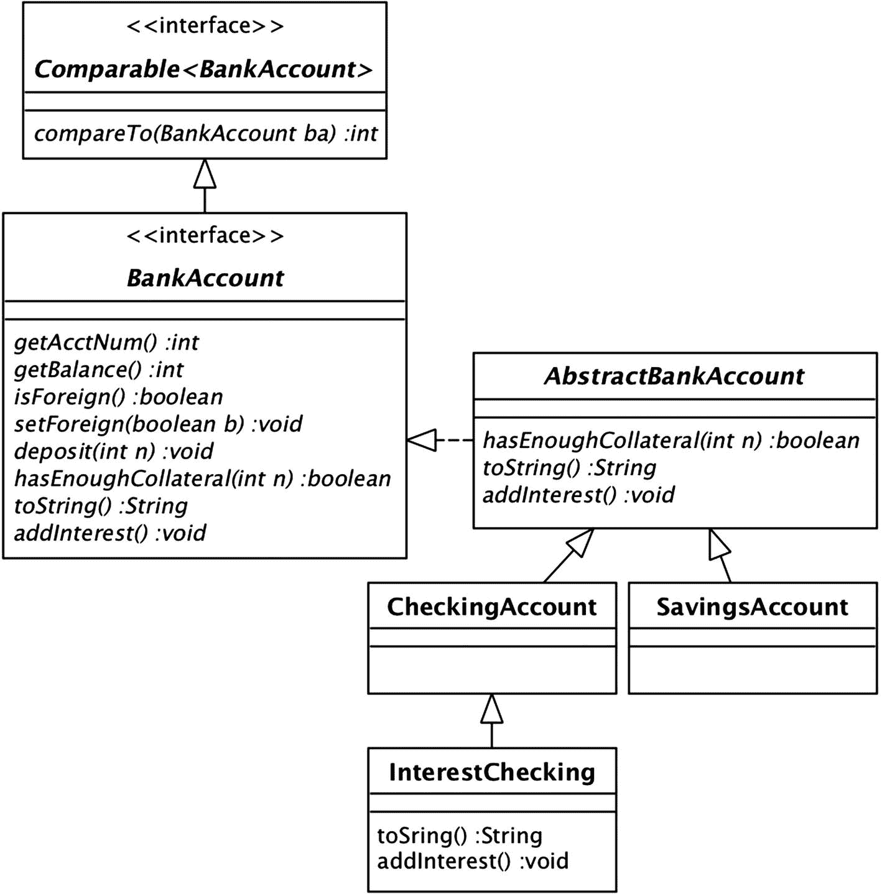
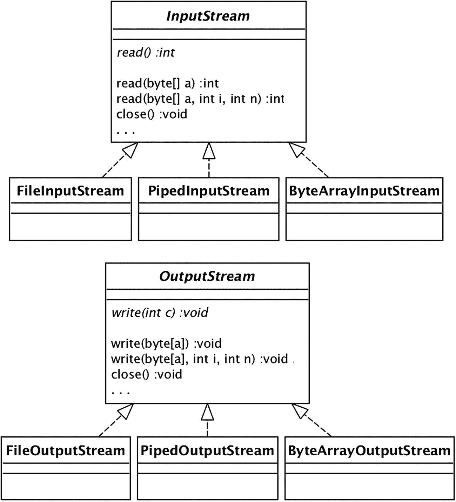
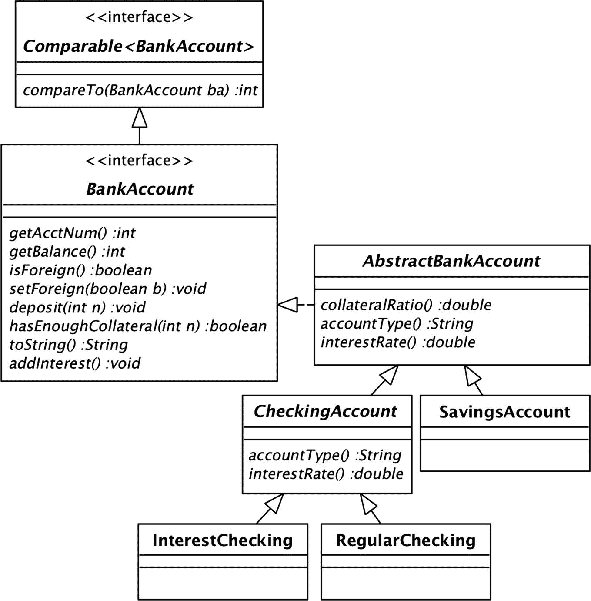

# 三、类层次结构

第 2 章研究了接口如何扩展其他接口，创建类型的层次结构。面向对象语言的特点之一是类可以扩展其他类，创建一个*类层次*。本章研究了类的层次结构以及有效使用它们的方法。

## 子类

Java 允许一个类扩展另一个类。如果类`A`扩展了类`B`，那么`A`被认为是`B`的子类，而`B`是`A`的超类。子类`A`继承了其超类`B`的所有公共变量和方法，以及这些方法的所有`B`代码。

Java 中子类化最常见的例子是内置类`Object`。根据定义，Java 中的每个类都是`Object`的子类。也就是说，以下两个类定义是等效的:

```java
   class Bank { ... }
   class Bank extends Object { ... }

```

因此，由`Object`定义的方法被每个对象继承。在这些方法中，两种常用的方法是`equals`和`toString`。如果被比较的两个引用指向同一个对象，那么`equals`方法返回 true。(也就是说，该方法等效于“==”运算。)方法`toString`返回一个描述对象的类和它在内存中的位置的字符串。清单 [3-1](#PC2) 展示了这些方法。

```java
Object x = new Object();
Object y = new Object();
Object z = x;
boolean b1 = x.equals(y); // b1 is false
boolean b2 = x.equals(z); // b2 is true
System.out.println(x.toString());
// prints something like "java.lang.Object@42a57993"

Listing 3-1Demonstrating the Default Equals Method

```

一个类可以选择*覆盖*一个继承的方法。通常超类提供的代码过于通用，子类可以用更合适的代码覆盖方法。通常会覆盖`toString`方法。例如，版本 6 银行演示中的`Bank`、`SavingsAccount`和`CheckingAccount`类覆盖了`toString`。

通常还会覆盖`equals`方法。覆盖`equals`方法的类通常会比较两个对象的状态，以确定它们是否表示同一个现实世界中的事物。例如，考虑一下`SavingsAccount`这个类。假设储蓄账户有不同的账号，如果两个`SavingsAccount`对象的账号相同，那么它们应该相等。但是，请考虑下面的代码。

```java
   SavingsAccount s1 = new SavingsAccount(123);
   SavingsAccount s2 = new SavingsAccount(123);
   boolean b = s1.equals(s2); // returns false

```

由于`s1`和`s2`引用不同的对象，使用默认的`equals`方法比较它们将返回 false。如果你想让`equals`方法在这种情况下返回 true，那么`SavingsAccount`需要覆盖它。见清单 [3-2](#PC4) 。

```java
boolean equals(Object obj) {
   if (! obj instanceof SavingsAccount)
      return false;
   SavingsAccount sa = (SavingsAccount) obj;
   return getAcctNum() == sa.getAcctNum();
}

Listing 3-2The Version 6 Equals Method of SavingsAccount

```

这段代码可能比您预期的要复杂。原因是默认`equals`方法的参数具有类型`Object`，这意味着任何覆盖`equals`的类也必须将其参数声明为类型`Object`。也就是说，`SavingsAccount`的`equals`方法必须处理客户端将`SavingsAccount`对象与其他类中的对象进行比较的可能性。清单 [3-2](#PC4) 的代码通过使用`instanceof`和类型转换克服了这个问题，如第 [2 章](02.html)所示。如果参数不是储蓄账户，则该方法立即返回 false。否则，它将参数转换为类型`SavingsAccount`，并比较它们的帐号。

在类`Object`中定义的方法永远不需要在接口中声明。例如，考虑下面的代码。

```java
   BankAccount ba = new SavingsAccount(123);
   String s = ba.toString();

```

不管`BankAccount`接口是否声明了`toString`方法，这段代码都是合法的，因为如果没有被覆盖，每个实现类都将从`Object`继承`toString`。然而，让接口声明`toString`还是有价值的——它要求它的每个实现类显式地覆盖这个方法。

要在类图中表示类-超类关系，请使用带实线的实心箭头。这与用于接口-超接口关系的箭头相同。例如，图 [3-1](#Fig1) 显示了类图中与版本 6 银行账户类相关的部分，修改后包括了`Object`类。一般来说，类图通常省略`Object`,因为它的存在是隐含的，添加它会使图变得不必要的复杂。


图 3-1

向类图中添加对象

第 [2](02.html) 章介绍了与接口相关的利斯科夫替代原理。这个原则也适用于班级。它声明如果类`A`扩展了类`B`，那么`A`对象可以用在任何需要`B`对象的地方。换句话说，如果`A`延长了`B`，那么`A`就是-A `B`。

例如，假设您想要修改银行演示，使其具有新的银行帐户类型“利息支票”利息支票账户和普通支票账户完全一样，只是它定期计息。调用这个类`InterestChecking`。

`InterestChecking`是否应该延长`CheckingAccount`？当我描述利息检查时，我说它“完全像”常规检查。这表明是一种关系，但让我们确定一下。假设银行想要一份列出所有支票账户的报告。报告应该包括利息支票账户吗？如果答案是“是”，那么就有一个 IS-A 关系，并且`InterestChecking`应该扩展`CheckingAccount`。如果答案是“不”，那就不应该。

假设`InterestChecking`确实应该是`CheckingAccount`的子类。利息支票账户在两个方面不同于普通支票账户:它的`toString`方法打印“利息支票”，它的`addInterest`方法给出利息。因此，`InterestChecking`的代码将覆盖`toString`和`addInterest`，并从其超类继承其余方法的代码。清单 [3-3](#PC6) 中显示了该类的一个可能实现。

```java
public class InterestChecking extends CheckingAccount {
   private double rate = 0.01;

   public InterestChecking(int acctnum) {
      super(acctnum);
   }

   public String toString() {
      return "Interest checking account " + getAcctNum()
            + ": balance=" + getBalance() + ", is "
            + (isForeign() ? "foreign" : "domestic");
   }

   public void addInterest() {
      int newbalance = (int) (getBalance() * rate);
      deposit(newbalance);
   }
}

Listing 3-3A Proposed InterestChecking Class

```

注意，构造器调用方法`super`。`super`方法是对超类的构造器的调用，主要在子类需要超类处理其构造器的参数时使用。如果子类的构造器调用`super`，那么 Java 要求这个调用必须是构造器的第一个语句。

一个类的私有变量对其他任何类都是不可见的，包括它的子类。这迫使子类代码通过调用超类的公共方法来访问它的继承状态。例如，再次考虑清单 [3-3](#PC6) 中建议的`InterestChecking`代码。`toString`方法想要从它的超类中访问变量`acctnum`、`balance`和`isforeign`。然而，这些变量是私有的，这迫使`toString`调用超类方法`getAcctNum`、`getBalance`和`isForeign`来获得相同的信息。同样的，`addInterest`方法也要调用`getBalance`和`deposit`而不是简单的更新变量`balance`。

尽可能多地从子类中封装一个类是一个好习惯。但是有时候(比如在`addInterest`代码的情况下)结果会很尴尬。因此，Java 提供了修饰符`protected`作为`public`或`private`的替代。受保护的变量可以被它在层次结构中的后代类访问，但不能被任何其他类访问。例如，如果`CheckingAccount`声明变量`balance`被保护，那么`InterestChecking`的`addInterest`方法可以写成如下:

```java
   public void addInterest() {
      balance += (int) (balance * RATE);
   }

```

## 抽象类

再次考虑银行演示的版本 6。`CheckingAccount`和`SavingsAccount`类目前有几个相同的方法。如果这些方法在将来不需要保持一致，那么这些类的设计是正确的。但是，假设银行的政策是，无论账户类型如何，存款总是表现相同。那么这两个`deposit`方法将永远保持一致；换句话说，它们包含重复的代码。

程序中重复代码的存在是有问题的，因为当程序改变时，需要维护这种重复。例如，如果对`CheckingAccount`的`deposit`方法进行了错误修复，那么你需要记住对`SavingsAccount`进行同样的错误修复。这种情况导致了下面的设计规则，叫做不要重复自己(或“干”):

### **“不要重复自己”规则**

一段代码应该只存在于一个地方。

干规则与最有资格的类规则相关，这意味着一段代码应该只存在于最有资格执行它的类中。如果两个类看起来同样有资格执行代码，那么设计中可能有缺陷——最有可能的是，设计中缺少一个最有资格的类。在 Java 中，提供这个缺失类的一种常见方式是使用一个*抽象类*。

银行演示的版本 6 说明了重复代码的一个常见原因:两个相关的类实现了同一个接口。一个解决方案是创建一个`CheckingAccount`和`SavingsAccount`的超类，并将重复的方法以及它们使用的状态变量移到其中。称这个超类为`AbstractBankAccount`。类`CheckingAccount`和`SavingsAccount`将各自持有它们自己的特定于类的代码，并将从`AbstractBankAccount`继承它们剩余的代码。这个设计是银行演示的第 7 版。清单 [3-4](#PC8) 中显示了`AbstractBankAccount`的代码。该类包含

*   状态变量`acctnum`、`balance`和`isforeign`。这些变量有`protected`修饰符，这样子类可以自由地访问它们。

*   初始化`acctnum`的构造器。这个构造器受到保护，因此它只能被它的子类调用(通过它们的`super`方法)。

*   常用方法`getAcctNum`、`getBalance`、`deposit`、`compareTo`、`equals`的代码。

```java
public abstract class AbstractBankAccount
                      implements BankAccount {
   protected int acctnum;
   protected int balance = 0;
   protected boolean isforeign = false;

   protected AbstractBankAccount(int acctnum) {
      this.acctnum = acctnum;
   }

   public int getAcctNum() {
      return acctnum;
   }

   public int getBalance() {
      return balance;
   }

   public boolean isForeign() {
      return isforeign;
   }

   public void setForeign(boolean b) {
      isforeign = b;
   }

   public void deposit(int amt) {
      balance += amt;
   }

   public int compareTo(BankAccount ba) {
      int bal1 = getBalance();
      int bal2 = ba.getBalance();
      if (bal1 == bal2)
         return getAcctNum() - ba.getAcctNum();
      else
         return bal1 - bal2;
   }

   public boolean equals(Object obj) {
      if (! (obj instanceof BankAccount))
         return false;
      BankAccount ba = (BankAccount) obj;
      return getAcctNum() == ba.getAcctNum();
   }

   public abstract boolean hasEnoughCollateral(int loanamt);
   public abstract String toString();
   public abstract void addInterest();
}

Listing 3-4The Version 7 AbstractBankAccount Class

```

注意方法`hasEnoughCollateral`、`toString`和`addInterest`的声明。这些方法被声明为`abstract`，并且没有关联的代码。问题是`AbstractBankAccount`实现了`BankAccount`，所以那些方法需要在它的 API 中；但是，该类没有有用的方法实现，因为代码是由其子类提供的。通过声明这些方法是抽象的，该类断言它的子类将为它们提供代码。

包含抽象方法的类被称为*抽象类*，并且必须在它的头中有`abstract`关键字。抽象类不能直接实例化。相反，有必要实例化它的一个子类，这样它的抽象方法就会有一些代码。例如:

```java
   BankAccount xx = new AbstractBankAccount(123); // illegal
   BankAccount ba = new SavingsAccount(123);      // legal

```

清单 [3-5](#PC10) 给出了`SavingsAccount`的版本 7 代码；`CheckingAccount`的代码类似。这段代码与版本 6 的代码基本相同，除了它只包含了`AbstractBankAccount`的三个抽象方法的实现；`BankAccount`的其他方法可以省略，因为它们继承自`AbstractBankAccount`。抽象方法的实现能够引用变量`balance`、`acctnum`和`isforeign`，因为它们在`AbstractBankAccount`中受到保护。

```java
public class SavingsAccount extends AbstractBankAccount {
   private double rate = 0.01;

   public SavingsAccount(int acctnum) {
      super(acctnum);
   }

   public boolean hasEnoughCollateral(int loanamt) {
      return balance >= loanamt / 2;
   }

   public String toString() {
      return "Savings account " + acctnum + ": balance="
                  + balance + ", is "
                  + (isforeign ? "foreign" : "domestic");
   }

   public void addInterest() {
      balance += (int) (balance * rate);
   }
}

Listing 3-5The Version 7 SavingsAccount Class

```

`InterestChecking`的版本 7 代码类似于清单 [3-3](#PC6) 中的代码，除了它的方法引用了`AbstractBankAccount`的受保护变量；因此没有显示它的代码。

版本 7 的`BankClient`和`Bank`类做了一些小的修改来处理`InterestChecking`对象的创建。清单 [3-6](#PC11) 给出了`BankClient`中`newAccount`方法的相关部分。清单 [3-7](#PC12) 给出了`Bank`中`newAccount`的修改方法。变化用粗体表示。

```java
public int newAccount(int type, boolean isforeign) {
   int acctnum = nextacct++;
   BankAccount ba;
   if (type == 1)
      ba = new SavingsAccount(acctnum);
   else if (type == 2)
      ba = new CheckingAccount(acctnum);
   else
      ba = new InterestChecking(acctnum);
   ba.setForeign(isforeign);
   accounts.put(acctnum, ba);
   return acctnum;
}

Listing 3-7The Version 7 newAccount Method of Bank

```

```java
private void newAccount() {
   System.out.print("Enter account type(1=savings,
                     2=checking, 3=interest checking): ");
   int type = scanner.nextInt();
   boolean isforeign = requestForeign();
   current = bank.newAccount(type, isforeign);
   System.out.println("Your new account number is "
                     + current);
}

Listing 3-6The Version 7 newAccount Method of BankClient

```

版本 7 银行账户类的类图如图 [3-2](#Fig2) 所示。从中可以推断出`AbstractBankAccount`实现了`BankAccount`中除了`hasEnoughCollateral`、`toString`和`addInterest`之外的所有方法；`CheckingAccount`和`SavingsAccount`实现这三种方法；并且`InterestChecking`超越`toString`和`addInterest`。注意，`AbstractBankAccount`的矩形用斜体表示类名和抽象方法，表示它们是抽象的。



图 3-2

第 7 版银行帐户类别

抽象类定义了一类相关的类。例如，类`AbstractBankAccount`定义了类别“银行账户”，其派生类——储蓄账户、支票账户和利息支票账户——都是该类别的成员。

另一方面，像`CheckingAccount`这样的非抽象超类扮演着两个角色:它定义了类别“支票账户”(其中`InterestChecking`是一个成员)，它还表示该类别的一个特定成员(即“常规支票账户”)。`CheckingAccount`的这种双重用法使得这个类不容易理解，也使得设计变得复杂。

解决这个问题的一个方法是将`CheckingAccount`分成两部分:定义支票账户类别的抽象类和表示常规支票账户的子类。银行演示的版本 8 做出了这样的改变:抽象类是`CheckingAccount`，子类是`RegularChecking`。

`CheckingAccount`实现所有支票账户通用的方法`hasEnoughCollateral`。它的抽象方法是`toString`和`addInterest`，由子类`RegularChecking`和`InterestChecking`实现。图 [3-3](#Fig3) 为版本 8 类图。请注意这两个抽象类是如何形成对三个银行帐户类进行分类的分类法的。


图 3-3

版本 8 银行帐户分类

`CheckingAccount`的修改代码出现在清单 [3-8](#PC13) 中。方法`toString`和`addInterest`是抽象的，因为它的子类负责计算利息并知道它们的账户类型。它的构造器是受保护的，因为它只能由子类调用。

```java
public abstract class CheckingAccount
                      extends AbstractBankAccount {
   protected CheckingAccount(int acctnum) {
      super(acctnum);
   }

   public boolean hasEnoughCollateral(int loanamt) {
      return balance >= 2 * loanamt / 3;
   }

   public abstract String toString();
   public abstract void addInterest();
}

Listing 3-8The Version 8 CheckingAccount Class

```

`RegularChecking`的代码出现在清单 [3-9](#PC14) 中；`InterestChecking`的代码类似。版本 8 演示中的其他类与版本 7 相比基本没有变化。例如，`Bank`唯一的变化是它的`newAccount`方法，它需要创建一个`RegularChecking`对象，而不是一个`CheckingAccount`对象。

```java
public class RegularChecking extends CheckingAccount {
   public RegularChecking(int acctnum) {
      super(acctnum);
   }

   public String toString() {
      return "Regular checking account " + acctnum
                + ": balance=" + balance + ", is "
                + (isforeign ? "foreign" : "domestic");
   }

   public void addInterest() {
      // do nothing
   }
}

Listing 3-9The Version 8 RegularChecking Class

```

抽象类是子类化最常见的用法。Java 库包含了许多子类-超类关系的例子，但是几乎所有的超类都是抽象的。这个例子说明了为什么会这样:一个涉及非抽象超类的设计通常可以通过将其转化为抽象类来改进。

## 编写 Java 集合类

第 2 章介绍了 Java 集合库，它的接口，以及实现这些接口的类。这些类是通用的，适用于大多数情况。但是，程序可能对自定义集合类有特定的需求。问题是集合接口有很多方法，这使得编写定制类的任务变得复杂。此外，许多方法都有简单的实现，对于每个实现类都是一样的。结果是重复的代码，违反了 DRY 规则。

Java 集合库包含了解决这个问题的抽象类。大多数集合接口都有一个对应的抽象类，抽象类的名字是“abstract”，后面跟接口名。即`List<E>`对应的类命名为`AbstractList<E>`，以此类推。每个抽象类保留一些抽象的接口方法，并根据抽象方法实现其余的方法。

比如`AbstractList<E>`的抽象方法是`size`和`get`。如果你想创建自己的实现`List<E>`的类，那么扩展`AbstractList<E>`并实现这两个方法就足够了。(如果您希望列表是可修改的，您还需要实现方法`set`。)

例如，假设您想要创建一个实现了`List<Integer>`的类`RangeList`。一个`RangeList`对象将表示一个集合，该集合包含从`0`到`n-1`的`n`个整数，用于构造器中指定的值`n`。清单 [3-10](#PC15) 给出了一个程序`RangeListTest`的代码，它使用一个`RangeList`对象来打印从 0 到 19 的数字:

```java
public class RangeListTest {
   public static void main(String[] args) {
      List<Integer> L = new RangeList(20);
      for (int x : L)
         System.out.print(x + " ");
      System.out.println();
   }
}

Listing 3-10The RangeListTest Class

```

`RangeList`的代码出现在清单 [3-11](#PC16) 中。注意一个`RangeList`对象如何表现得好像它实际上包含一个值列表，尽管它并不包含。特别是，它的`get`方法表现得好像列表的每个槽`i`都包含值`i`。这项技术是非凡而重要的。关键是，如果一个对象声明自己是一个列表，并且表现得像一个列表，那么它就是一个列表。不要求它实际包含列表的元素。

```java
public class RangeList extends AbstractList<Integer> {
   private int limit;

   public RangeList(int limit) {
      this.limit = limit;
   }

   public int size() {
      return limit;
   }

   public Integer get(int n) {
      return n;
   }
}

Listing 3-11The RangeList Class

```

## 字节流

Java 库包含抽象类`InputStream`，它表示可以作为字节序列读取的数据源的类别。这个类有几个子类。这里有三个例子:

*   类`FileInputStream`从指定的文件中读取字节。

*   类`PipedInputStream`从管道中读取字节。管道使不同的进程能够进行通信。例如，互联网套接字是使用管道实现的。

*   类`ByteArrayInputStream`从数组中读取字节。这个类使程序能够像访问文件一样访问字节数组的内容。

类似地，抽象类`OutputStream`表示可以向其中写入字节序列的对象。Java 库有镜像`InputStream`类的`OutputStream`类。具体来说，`FileOutputStream`写入指定文件，`PipedOutputStream`写入管道，`ByteArrayOutputStream`写入数组。这些类的类图如图 [3-4](#Fig4) 所示。



图 3-4

输入流和输出流的类图

公共变量`System.in`属于扩展`InputStream`的未指定类，默认情况下从控制台读取字节。例如，银行演示中的类`BankProgram`包含以下语句:

```java
   Scanner sc = new Scanner(System.in);

```

该语句可以等价地写成如下形式:

```java
   InputStream is = System.in;
   Scanner sc = new Scanner(is);

```

抽象类`InputStream`和`OutputStream`的最大价值之一是它们对多态的支持。使用`InputStream`和`OutputStream`的客户端类不需要依赖于它们使用的特定输入或输出源。《T4》就是一个很好的例子。`Scanner`的构造器的参数可以是任何输入流。例如，要创建一个从文件“testfile”中读取数据的扫描器，您可以编写:

```java
   InputStream is = new FileInputStream("testfile");
   Scanner sc = new Scanner(is);

```

演示类`EncryptDecrypt`展示了字节流的典型用法。这个类的代码出现在清单 [3-12](#PC20) 中。它的`encrypt`方法有三个参数:源文件和输出文件的名称，以及一个加密偏移量。它从源中读取每个字节，向其中添加偏移量，并将修改后的字节值写入输出。`main`方法调用了`encrypt`两次。第一次，它对文件“data.txt”的字节进行加密，写入文件“encrypted . txt”；第二次，它对“encrypted.txt”的字节进行加密，并将其写入“decrypted.txt”。由于第二次加密偏移量是第一次的负数，因此“decrypted.txt”中的字节将是“data.txt”的逐字节副本

```java
public class EncryptDecrypt {
   public static void main(String[] args) throws IOException {
      int offset = 26;  // any value will do
      encrypt("data.txt", "encrypted.txt", offset);
      encrypt("encrypted.txt", "decrypted.txt", -offset);
   }

   private static void encrypt(String source, String output,
                             int offset) throws IOException {
      try ( InputStream  is = new FileInputStream(source);
            OutputStream os = new FileOutputStream(output) ) {
         int x;
         while ((x = is.read()) >= 0) {
            byte b = (byte) x;
            b += offset;
            os.write(b);
         }
      }
   }
}

Listing 3-12The EncryptDecrypt Class

```

请注意，无论加密偏移量如何，这种“双重加密解密”算法都能正常工作。原因与字节算法的特性有关。当算术运算导致字节值超出其范围时，溢出被丢弃；结果是加法和减法变成了循环。例如，255 是最大的字节值，因此 255+1 = 0。同样，0 是最小的字节值，所以 0-1 = 255。

`encrypt`方法说明了`read`和`write`方法的使用。`write`方法很简单；它将一个字节写入输出流。`read`方法更加复杂。它返回一个整数，其值要么是输入流中的下一个字节(0 到 255 之间的值)，要么是-1(如果流中没有更多的字节)。客户端代码通常循环调用`read`，当返回值为负时停止。当返回值不是负数时，客户端应该在使用它之前将整数值转换为一个字节。

客户机不知道的是，输入和输出流经常代表它们向操作系统请求资源。因此，`InputStream`和`OutputStream`有方法`close`，其目的是将那些资源返回给操作系统。客户端可以显式调用`close`，或者可以指示 Java 自动关闭*流。`encrypt`方法说明了自动关闭特性。这些流作为`try`子句的“参数”打开，并将在`try`子句完成时自动关闭。*

大多数流方法抛出 IO 异常。原因是输入和输出流通常由操作系统管理，因此会受到超出程序控制的环境的影响。流方法需要能够传达意外情况(比如丢失文件或网络不可用)，以便它们的客户端有机会处理它们。为了简单起见，两个`EncryptDecrypt`方法不处理异常，而是将它们扔回到调用链中。

除了清单 [3-12](#PC20) 中使用的零参数读取方法之外，`InputStream`还有两个一次读取多个字节的方法:

*   一个单参数`read`方法，其中参数是一个字节数组。方法读取足够的字节来填充数组。

*   一个三参数`read`方法，其中参数是一个字节数组，数组中第一个字节应该存储的偏移量，以及要读取的字节数。

这些方法返回的值是读取的字节数，如果没有字节可以读取，则为-1。

举个简单的例子，考虑以下语句:

```java
   byte[] a = new byte[16];
   InputStream is = new FileInputStream("fname");
   int howmany = is.read(a);
   if (howmany == a.length)
       howmany = is.read(a, 0, 4);

```

第三条语句试图将`16`字节读入数组`a`；变量`howmany`包含实际读取的字节数(如果没有读取字节，则为`-1`)。如果这个值小于`16`，那么这个流一定是字节数用完了，代码不会采取进一步的动作。如果值是`16`,那么下一条语句试图再读取四个字节，将它们存储在数组的槽`0-3`中。同样，变量`howmany`将包含实际读取的字节数。

类`OutputStream`有类似的`write`方法。`write`和`read`方法的主要区别在于`write`方法返回 void。

对于使用多字节`read`和`write`方法的具体例子，考虑银行演示。假设您希望将银行的账户信息写入一个文件，以便在每次执行`BankProgram`时可以恢复其状态。

修改后的`BankProgram`代码出现在清单 [3-13](#PC22) 中。该代码使用了一个行为如下的类`SavedBankInfo`。它的构造器从指定的文件中读取帐户信息，并构造帐户映射。其方法`getAccounts`返回账户映射，如果文件不存在则为空。它的方法`nextAcctNum`返回下一个新帐户的号码，如果该文件不存在，该号码将为 0。它的方法`saveMap`将当前账户信息写入文件，覆盖之前的所有信息。

```java
public class BankProgram {
   public static void main(String[] args) {
      SavedBankInfo info = new SavedBankInfo("bank.info");
      Map<Integer,BankAccount> accounts = info.getAccounts();
      int nextacct = info.nextAcctNum();
      Bank bank = new Bank(accounts, nextacct);
      Scanner scanner = new Scanner(System.in);
      BankClient client = new BankClient(scanner, bank);
      client.run();
      info.saveMap(accounts, bank.nextAcctNum());
   }
}

Listing 3-13The Version 8 BankProgram Class

```

清单 [3-14](#PC23) 中显示了`SavedBankInfo`的代码。变量`accounts`和`nextaccount`为没有账户的银行初始化。构造器负责读取指定的文件；如果文件存在，它调用本地方法`readMap`来使用保存的帐户信息初始化`nextaccount`并填充映射。方法`saveMap`打开文件的输出流，并调用`writeMap`将账户信息写入该流。

```java
public class SavedBankInfo {
   private String fname;
   private Map<Integer,BankAccount> accounts
                        = new HashMap<Integer,BankAccount>();
   private int nextaccount = 0;
   private ByteBuffer bb = ByteBuffer.allocate(16);

   public SavedBankInfo(String fname) {
      this.fname = fname;
      if (!new File(fname).exists())
         return;
      try (InputStream is = new FileInputStream(fname)) {
         readMap(is);
      }
      catch (IOException ex) {
         throw new RuntimeException("file read exception");
      }
   }

   public Map<Integer,BankAccount> getAccounts() {
      return accounts;
   }

   public int nextAcctNum() {
      return nextaccount;
   }

   public void saveMap(Map<Integer,BankAccount> map,
                       int nextaccount) {
      try (OutputStream os = new FileOutputStream(fname)) {
         writeMap(os, map, nextaccount);
      }
      catch (IOException ex) {
         throw new RuntimeException("file write exception");
      }
   }
   ... // definitions for readMap and writeMap
}

Listing 3-14The Version 8 SavedBankInfo Class

```

`SavedBankInfo`有一个`ByteBuffer`类型的变量。`ByteBuffer`类定义了值和字节之间的转换方法。一个`ByteBuffer`对象有一个底层字节数组。它的方法`putInt`将一个整数的 4 字节表示存储到数组中指定的偏移量处；它的方法`getInt`将指定偏移量处的 4 个字节转换成一个整数。`SavedBankInfo`创建一个 16 字节的`ByteBuffer`对象，其底层数组将用于文件的所有读写操作。

清单 [3-15](#PC24) 中显示了`writeMap`和`readMap`方法的代码。这些方法决定了数据文件的整体结构。首先，`writeMap`写一个整数表示下一个账号；然后，它写入每个帐户的值。`readMap`方法读回这些值。它首先读取一个整数，并将其保存在全局变量`nextaccount`中。然后，它读取帐户信息，将每个帐户保存在地图中。

```java
private void writeMap(OutputStream os,
                      Map<Integer,BankAccount> map,
                      int nextacct) throws IOException {
   writeInt(os, nextacct);
   for (BankAccount ba : map.values())
      writeAccount(os, ba);
}

private void readMap(InputStream is) throws IOException {
   nextaccount = readInt(is);
   BankAccount ba = readAccount(is);
   while (ba != null) {
      accounts.put(ba.getAcctNum(), ba);
      ba = readAccount(is);
   }
}

Listing 3-15The Methods writeMap and readMap

```

`writeInt`和`readInt`的代码出现在清单 [3-16](#PC25) 中。`writeInt`方法将一个整数存储在字节缓冲区底层数组的前四个字节中，然后使用三参数`write`方法将这些字节写入输出流。`readInt`方法使用三参数`read`方法将四个字节读入`ByteBuffer`数组的开头，然后将这些字节转换成一个整数。

```java
private void writeInt(OutputStream os, int n)
                                    throws IOException {
   bb.putInt(0, n);
   os.write(bb.array(), 0, 4);
}

private int readInt(InputStream is) throws IOException {
   is.read(bb.array(), 0, 4);
   return bb.getInt(0);
}

Listing 3-16The writeInt and readInt Methods

```

`writeAccount`和`readAccount`的代码出现在清单 [3-17](#PC26) 中。`writeAccount`方法从银行账户中提取四个关键值(账号、类型、余额和 isforeign 标志)，将它们转换成四个整数，放入字节缓冲区，然后将整个底层字节数组写入输出流。`readAccount`方法将 16 个字节读入底层字节数组，并将其转换为 4 个整数。然后，它使用这些整数创建一个新帐户，并对其进行适当的配置。方法通过返回空值来指示流的结尾。

```java
private void writeAccount(OutputStream os, BankAccount ba)
                                       throws IOException {
   int type = (ba instanceof SavingsAccount)  ? 1
            : (ba instanceof RegularChecking) ? 2 : 3;
   bb.putInt(0, ba.getAcctNum());
   bb.putInt(4, type);
   bb.putInt(8, ba.getBalance());
   bb.putInt(12, ba.isForeign() ? 1 : 2);
   os.write(bb.array());
}

private BankAccount readAccount(InputStream is)
                                       throws IOException {
   int n = is.read(bb.array());
   if (n < 0)
      return null;
   int num       = bb.getInt(0);
   int type      = bb.getInt(4);
   int balance   = bb.getInt(8);
   int isforeign = bb.getInt(12);

   BankAccount ba;
   if (type == 1)
      ba = new SavingsAccount(num);
   else if (type == 2)
      ba = new RegularChecking(num);
   else
      ba = new InterestChecking(num);
   ba.deposit(balance);
   ba.setForeign(isforeign == 1);
   return ba;
}

Listing 3-17The writeAccount and readAccount Methods

```

如你所见，这种保存账户信息的方式非常低级。保存信息需要将每个账户转换成特定的字节序列，而恢复信息需要反向操作。因此，编码很困难，而且有点痛苦。第 [7](07.html) 章将介绍*对象流*的概念，它使客户端能够直接读写对象，并让底层代码执行繁琐的字节转换。

现在您已经看到了如何使用字节流，是时候研究它们是如何实现的了。我将只考虑输入流。类似地实现输出流。

`InputStream`是一个抽象类。它有一个抽象方法，即零参数`read`方法，并提供其他方法的默认实现。清单 [3-18](#PC27) 中出现了`InputStream`代码的简化版本。

```java
public abstract class InputStream {
   public abstract int read() throws IOException;

   public void close() { }

   public int read(byte[] buf, int offset, int len)
                                        throws IOException {
      for (int i=0; i<len; i++) {
         int x = read();
         if (x < 0)
            return (i==0) ? -1 : i;
         buf[offset+i] = (byte) x;
      }
      return len;
   }

   public int read(byte[] buf) throws IOException {
      read(buf, 0, buf.length);
   }
   ...
}

Listing 3-18A Simplified InputStream Class

```

三个非抽象方法的默认实现非常简单。`close`方法什么也不做。三参数`read`方法通过重复调用零参数`read`方法来填充数组的指定部分。而一论元`read`法只是三论元法的一个特例。

`InputStream`的每个子类都需要实现零参数`read`方法，并且可以选择覆盖其他方法的默认实现。例如，如果一个子类获得了资源(比如由`FileInputStream`获得的文件描述符)，那么它应该覆盖`close`方法来释放那些资源。

为了提高效率，子类可以选择覆盖三参数`read`方法。例如，`FileInputStream`和`PipedInputStream`这样的类通过操作系统调用获得它们的字节。由于对操作系统的调用非常耗时，因此当这些类最大限度地减少这些调用的数量时，它们会更加高效。因此，它们通过对操作系统进行单个多字节调用的方法来覆盖默认的三参数`read`方法。

`ByteArrayInputStream`的代码提供了一个`InputStream`子类的例子。一个简单的实现出现在清单 [3-19](#PC28) 中。

```java
public class ByteArrayInputStream extends InputStream {
   private byte[] a;
   private int pos = 0;

   public ByteArrayInputStream(byte[] a) {
      this.a = a;
   }

   public int read() throws IOException {
      if (pos >= a.length)
         return -1;
      else {
         pos++;
         return a[pos-1];
      }
   }
}

Listing 3-19A Simplified ByteArrayInputStream Class

```

`InputStream`方法作为子类默认值的方式类似于抽象集合类帮助它们的子类实现集合接口的方式。不同的是，集合库对一个抽象类(比如`AbstractList`)和它对应的接口(比如`List`)做了区别。抽象类`InputStream`和`OutputStream`没有对应的接口。实际上，它们充当自己的接口。

## 模板模式

抽象集合类和字节流类说明了使用抽象类的一种特殊方式:抽象类实现其 API 的一些方法，并将其他方法声明为抽象的。它的每个子类都将实现这些抽象的公共方法(并可能覆盖其他一些方法)。

这里有一个设计抽象类的更通用的方法。抽象类将实现其 API 的所有方法，但不一定完全实现。部分实现的方法称为“helper”方法，这些方法是受保护的(也就是说，它们在类层次结构之外是不可见的)和抽象的(也就是说，它们由子类实现)。

这种技术被称为*模板模式*。其思想是，API 方法的每个部分实现都提供了该方法应该如何工作的“模板”。助手方法使每个子类能够适当地定制 API 方法。

在文献中，抽象助手方法有时被称为“钩子”抽象类提供钩子，每个子类提供可以挂在钩子上的方法。

版本 8 `BankAccount`的类层次结构可以通过使用模板模式来改进。版本 8 代码的问题是它仍然违反了 DRY 规则。考虑一下`SavingsAccount`(清单 [3-5](#PC10) )和`CheckingAccount`(清单 [3-8](#PC13) )类中方法`hasEnoughCollateral`的代码。这两种方法几乎相同。他们都将账户余额乘以一个系数，并将该值与贷款金额进行比较。它们唯一的区别是它们乘以不同的因子。我们如何消除这种重复？

解决方案是将乘法和比较移到`AbstractBankAccount`类中，并创建一个抽象的帮助器方法来返回要乘的因子。该解决方案在版本 9 代码中实现。`AbstractBankAccount`中`hasEnoughCollateral`方法的代码更改如下:

```java
   public boolean hasEnoughCollateral(int loanamt) {
      double ratio = collateralRatio();
      return balance >= loanamt * ratio;
   }

   protected abstract double collateralRatio();

```

也就是说，`hasEnoughCollateral`方法不再是抽象的。相反，它是一个调用抽象助手方法`collateralRatio`的模板，其代码由子类实现。例如，下面是`SavingsAccount`中`collateralRatio`方法的版本 9 代码。

```java
   protected double collateralRatio() {
      return 1.0 / 2.0;
   }

```

抽象方法`addInterest`和`toString`也包含重复的代码。与其让每个子类完整地实现这些方法，不如在`AbstractBankAccount`中为它们创建一个模板。每个模板方法都可以调用抽象的帮助器方法，然后子类可以实现这些方法。具体来说，`addInterest`方法调用抽象方法`interestRate`，而`toString`方法调用抽象方法`accountType`。

图 [3-5](#Fig5) 显示了第 9 版银行演示的类图。从中你可以推断出:



图 3-5

版本 9 类图

*   `AbstractBankAccount`实现了`BankAccount`中的所有方法，但是它本身有抽象方法`collateralRatio`、`accountType`和`interestRate`。

*   实现了所有这三种方法。

*   `CheckingAccount`只实现了`collateralRatio`，将另外两个方法留给了它的子类。

*   `RegularChecking`和`InterestChecking`执行`accountType`和`interestRate`。

下面的清单显示了版本 9 中修改后的类。`AbstractBankAccount`的代码出现在清单 [3-20](#PC31) 中；`SavingsAccount`的代码出现在清单 [3-21](#PC32) 中；`CheckingAccount`的代码出现在清单 [3-22](#PC33) 中；清单 [3-23](#PC34) 中显示了`RegularChecking`的代码。`InterestChecking`的代码与`RegularChecking`类似，在此省略。注意，由于模板模式，这些类非常紧凑。没有任何重复的代码！

```java
public class RegularChecking extends CheckingAccount {
   public RegularChecking(int acctnum) {
      super(acctnum);
   }

   protected String accountType() {
      return "Regular Checking";
   }

   protected double interestRate() {
      return 0.0;
   }
}

Listing 3-23The Version 9 RegularChecking Class

```

```java
public abstract class CheckingAccount extends BankAccount {
   public CheckingAccount(int acctnum) {
      super(acctnum);
   }

   public double collateralRatio() {
      return 2.0 / 3.0;
   }

   protected abstract String accountType();
   protected abstract double interestRate();
}

Listing 3-22The Version 9 CheckingAccount Class

```

```java
public class SavingsAccount extends BankAccount {
   public SavingsAccount(int acctnum) {
      super(acctnum);
   }

   public double collateralRatio() {
      return 1.0 / 2.0;
   }

   public String accountType() {
      return "Savings";
   }

   public double interestRate() {
      return 0.01;
   }
}

Listing 3-21The Version 9 SavingsAccount Class

```

```java
public abstract class AbstractBankAccount
                      implements BankAccount {
   protected int acctnum;
   protected int balance;

   ...

   public boolean hasEnoughCollateral(int loanamt) {
      double ratio = collateralRatio();
      return balance >= loanamt * ratio;
   }

   public String toString() {
      String accttype = accountType();
      return accttype + " account " + acctnum
             + ": balance=" + balance + ", is "
             + (isforeign ? "foreign" : "domestic");
   }

   public void addInterest() {
      balance += (int) (balance * interestRate());
   }

   protected abstract double collateralRatio();
   protected abstract String accountType();
   protected abstract double interestRate();
}

Listing 3-20The Version 9 AbstractBankAccount Class

```

对于模板模式的另一个例子，考虑 Java 库类`Thread`。这个类的目的是允许程序在新线程中执行代码。它的工作原理如下:

*   `Thread`有两种方法:`start`和`run`。

*   `start`方法要求操作系统创建一个新线程。然后它从那个线程执行对象的`run`方法。

*   `run`方法是抽象的，由一个子类实现。

*   一个客户端程序定义了一个类`X`，它扩展了`Thread`并实现了`run`方法。然后客户端创建一个新的`X`-对象并调用它的`start`方法。

清单 [3-24](#PC35) 中的类`ReadLine`是`Thread`子类的一个例子。它的`run`方法收效甚微。对`sc.nextLine`的调用被阻塞，直到用户按下回车键。当这种情况发生时，`run`方法将输入行存储在变量`s`中，将其变量`done`设置为真，然后退出。请注意，该方法对输入行不做任何事情。输入的唯一目的是当用户按回车键时将变量`done`设置为真。

```java
class ReadLine extends Thread {
   private boolean done = false;

   public void run() {
      Scanner sc = new Scanner(System.in);
      String s = sc.nextLine();
      sc.close();
      done = true;
   }

   public boolean isDone() {
      return done;
   }
}

Listing 3-24The ReadLine Class

```

清单 [3-25](#PC36) 给出了类`ThreadTest`的代码。该类创建一个`ReadLine`对象并调用它的`start`方法，导致它的`run`方法从一个新线程中执行。然后，该类继续(从原始线程)以升序打印整数，直到`ReadLine`的`isDone`方法返回 true。换句话说，程序打印整数，直到用户按下回车键。新的线程使得用户能够交互地决定何时停止打印。

```java
public class ThreadTest {
   public static void main(String[] args) {
      ReadLine r = new ReadLine();
      r.start();
      int i = 0;
      while(!r.isDone()) {
         System.out.println(i);
         i++;
      }
   }
}

Listing 3-25The ThreadTest Class

```

注意`Thread`类是如何使用模板模式的。它的`start`方法是公共 API 的一部分，充当线程执行的模板。它的职责是创建并执行一个新线程，但它不知道要执行什么代码。`run`方法是助手方法。每个`Thread`子类通过指定`run`的代码来定制模板。

使用线程时一个常见的错误是让客户端调用线程的`run`方法，而不是它的`start`方法。毕竟，`Thread`子类包含方法`run`，而`start`方法是隐藏的。而且，调用`run`是合法的；这样做的效果是运行线程代码，但不是在新线程中。(在将语句`r.start()`改为`r.run()`后，尝试执行清单 [3-25](#PC36) 。会发生什么？)然而，一旦理解了线程使用模板模式，调用`start`方法的原因就变得清楚了，并且`Thread`类的设计最终也变得有意义了。

## 摘要

面向对象语言中的类可以形成子类-超类关系。这些关系的创建应该遵循 Liskov 替换原则:如果`X`-对象可以用在任何需要`Y`-对象的地方，那么`X`类应该是`Y`类的子类。子类继承其超类的代码。

创建超类-子类关系的一个原因是为了满足 DRY 规则，该规则规定一段代码应该只存在于一个地方。如果两个类包含公共代码，那么该公共代码可以放在这两个类的公共超类中。然后，这些类可以从它们的超类继承这些代码。

如果两个子类是同一接口的不同实现，那么它们的公共超类也应该实现该接口。在这种情况下，超类变成了一个抽象类，它没有实现的接口方法被声明为抽象的。抽象类不能被实例化，而是充当其实现类的*类别*。由抽象类的层次结构产生的分类被称为*分类法*。

抽象类有两种方法来实现它的接口。第一种方式以 Java 抽象集合类为例。抽象类声明一些接口方法是抽象的，然后根据抽象方法实现剩余的方法。每个子类只需要实现抽象方法，但是如果需要，可以覆盖任何其他方法。

第二种方式以 Java `Thread`类为例。抽象类实现了所有的接口方法，在需要的时候调用抽象的“助手”方法。每个子类都实现这些助手方法。这种技术被称为*模板模式*。抽象类提供了每个接口方法应该如何工作的“模板”,每个子类提供了特定于子类的细节。