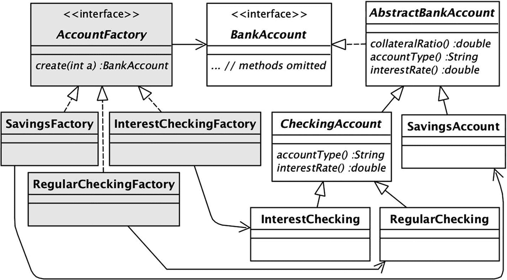

# 5.封装对象创建

多态使代码更加抽象。当您的代码引用一个接口而不是一个类时，它就失去了与该类的耦合，并且在面对未来的修改时变得更加灵活。这种抽象的使用是前几章中许多技术的核心。

类构造器是不可能进行这种抽象的地方。如果要创建一个对象，需要调用一个构造器；并且在不知道类名的情况下，调用构造器是不可能的。本章通过研究*对象缓存*和*工厂*的技术来解决这个问题。这些技术帮助设计者将构造器的使用限制在一个相对较小的、众所周知的类集合中，以最小化它们的潜在责任。

## 对象缓存

假设您想编写一个程序来分析大量运动检测传感器的状态，这些传感器的值要么是“开”，要么是“关”作为该程序的一部分，您要编写一个类`Sensors`，它将传感器信息存储在一个列表中，并提供获取和设置单个传感器值的方法。该类的代码出现在清单 [5-1](#PC1) 中。

```java
public class Sensors {
   private List<Boolean> L = new ArrayList<>();

   public Sensors(int size) {
      for (int i=0; i<size; i++)
         L.add(new Boolean(false));
   }

   public boolean getSensor(int n) {
      Boolean val = L.get(n);
      return val.booleanValue();
   }

   public void setSensor(int n, boolean b) {
      L.set(n, new Boolean(b));
   }
}

Listing 5-1Version 1 of the Sensors Class

```

这段代码创建了许多`Boolean`对象:构造器为每个传感器创建一个对象，而`setSensor`方法每次被调用时都会创建另一个对象。但是，可以创建更少的对象。`Boolean`对象是不可变的(即它们的状态不能被改变)，这意味着具有相同值的`Boolean`对象彼此无法区分。因此，这个类只需要使用两个`Boolean`对象:一个为真，一个为假。这两个对象可以在整个列表中共享。

清单 [5-2](#PC2) 显示了对`Sensors`的修改，它利用了不变性。这段代码使用变量`off`和`on`作为缓存。当它需要一个`Boolean`对象时，它使用`on`；当它需要一个`Boolean`对象为假时，它使用`off`。

```java
public class Sensors {
   private List<Boolean> L = new ArrayList<>();
   private static final Boolean off = new Boolean(false);
   private static final Boolean on  = new Boolean(true);

   public Sensors(int size) {
      for (int i=0; i<size; i++)
         L.add(off);
   }

   public boolean getSensor(int n) {
      Boolean val = L.get(n);
      return val.booleanValue();
   }

   public void setSensor(int n, boolean b) {
      Boolean val = b ? on : off;
      L.set(n, val);
   }
}

Listing 5-2Version 2 of the Sensors Class

```

使用缓存是一个好主意，但是在这种情况下，它仅限于`Sensors`类。如果您想在另一个类中使用`Boolean`对象，在两个类之间共享缓存的对象可能会很尴尬。幸运的是，有一种更好的方法——`Boolean`类内置了缓存。清单 [5-3](#PC3) 给出了`Boolean`源代码的简化版本。

```java
public class Boolean {
   public static final Boolean TRUE  = new Boolean(true);
   public static final Boolean FALSE = new Boolean(false);
   private boolean value;

   public Boolean(boolean b) {value = b;}

   public boolean booleanValue() {
      return value;
   }

   public static Boolean valueOf(boolean b) {
      return (b ? TRUE : FALSE);
   }

   ...
}

Listing 5-3A Simplified Boolean Class

```

常量`TRUE`和`FALSE`是静态的和公共的。它们只在类被加载时创建一次，在任何地方都是可用的。静态方法`valueOf`根据提供的`boolean`值返回`TRUE`或`FALSE`。

清单 [5-4](#PC4) 显示了对`Sensors`类的修改，它使用了`valueOf`方法和`Boolean`的公共常量，而不是它的构造器。这是`Boolean`类的首选用法。Java 文档声明应该优先于构造器使用`valueOf`，因为它的缓存节省了时间和空间。事实上，我想不出任何人的 Java 代码需要调用`Boolean`构造器的理由。

```java
public class Sensors {
   private List<Boolean> L = new ArrayList<>();

   public void init(int size) {
      for (int i=0; i<size; i++)
         L.add(Boolean.FALSE);
   }
   public void setSensor(int n, boolean b) {
      Boolean value = Boolean.valueOf(b);
      L.set(n, value);
   }
}

Listing 5-4Version 3 of the Sensors Class

```

尽管原始类型 boolean 和类`Boolean`之间有明显的区别，但是 Java 的*自动装箱*概念模糊了这种区别。通过自动装箱，你可以在任何需要一个`Boolean`对象的地方使用一个布尔值；编译器自动使用`valueOf`方法将布尔值转换为`Boolean`。类似地，*拆箱*的概念让你可以在任何需要布尔值的地方使用`Boolean`对象；编译器自动使用`booleanValue`方法将`Boolean`转换为布尔值。

清单 [5-5](#PC5) 给出了`Sensors`的另一个版本，这次没有明确提到`Boolean`对象。它在功能上等同于清单 [5-4](#PC4) 。这段代码很有趣，因为它在幕后进行了很多工作。虽然它没有明确提到`Boolean`对象，但是它们因为自动装箱而存在。此外，因为自动装箱调用了`valueOf`，所以代码不会创建新的对象，而是使用缓存的版本。

```java
public class Sensors {
   private List<Boolean> L = new ArrayList<>();

   public void init(int size) {
      for (int i=0; i<size; i++)
         L.add(false);
   }
   public void setSensor(int n, boolean b) {
      L.set(n, b);
   }
}

Listing 5-5Version 4 of the Sensors Class

```

Java 库类`Integer`也执行缓存。它为介于-128 和 127 之间的整数创建了一个包含 256 个对象的缓存。它的`valueOf`方法返回对这些常量之一的引用，如果它的参数在该范围内；否则它创建一个新对象并返回它。

例如，考虑清单 [5-6](#PC6) 的代码。对`valueOf`的前两次调用将返回对值为 127 的缓存的`Integer`对象的引用。第三和第四次调用将分别为值 128 创建一个新的`Integer`对象。换句话说，代码创建了两个新的`Integer`对象，它们的值都是 128。

```java
List<Integer> L = new ArrayList<>();
L.add(Integer.valueOf(127)); // uses cached object
L.add(Integer.valueOf(127)); // uses cached object
L.add(Integer.valueOf(128)); // creates new object
L.add(Integer.valueOf(128)); // creates new object

Listing 5-6An Example of Integer Caching

```

Java 编译器使用自动装箱和取消装箱在 int 值和`Integer`对象之间进行转换。与`Boolean`一样，它使用`valueOf`方法来执行装箱，使用`intValue`方法来执行取消装箱。清单 [5-7](#PC7) 的代码在功能上等同于清单 [5-6](#PC6) 。

```java
List<Integer> L = new ArrayList<>();
L.add(127); // uses cached object
L.add(127); // uses cached object
L.add(128); // creates new object
L.add(128); // creates new object

Listing 5-7An Equivalent Example of Integer Caching

```

## 单例类

缓存的一个重要用途是实现*单例类*。单例类是一个具有固定数量对象的类，它是在类被加载时创建的。它没有公共构造器，因此不能创建其他对象。它被称为“singleton ”,因为最常见的情况是一个类只有一个实例。

例如，如果 Java 设计者将`Boolean`构造器设为私有(这将是一个好主意)，那么`Boolean`将是一个单例类。另一方面，`Integer`不能是单例类，即使它的构造器是私有的，因为它的`valueOf`方法会在需要时创建新的对象。

Java *enum* 语法简化了单例类的创建，并且是编写单例的首选方式。例如，清单 [5-8](#PC8) 展示了如何将`Boolean`的代码重写为一个枚举。与清单 [5-3](#PC3) 的差异以粗体显示。

```java
public enum Boolean {
   TRUE(true), FALSE(false);

   private boolean value;

   private Boolean(boolean b) {value = b;}

   public boolean booleanValue() {
      return value;
   }

   public static Boolean valueOf(boolean b) {
      return (b ? TRUE : FALSE);
   }
   ...
}

Listing 5-8Writing Boolean as an Enum

```

请注意，语法差异非常小。主要区别在于常量`TRUE`和`FALSE`的定义，它们省略了类型声明和对`Boolean`构造器的调用。括号内的值表示构造器的参数。也就是说，声明

```java
   TRUE(true), FALSE(false);

```

相当于两个语句

```java
   public static final Boolean TRUE  = new Boolean(true);
   public static final Boolean FALSE = new Boolean(false);

```

从概念上讲，枚举是一个没有公共构造器的类，因此除了它的公共常量之外没有其他对象。在所有其他方面，枚举的行为就像一个类。例如，如果将`Boolean`实现为枚举或类，清单 [5-4](#PC4) 的代码将是相同的。

初学者通常不知道枚举和类之间的对应关系，因为枚举通常是作为一组命名的常量引入的。例如，下面的枚举定义了三个常量`Speed.SLOW` *、* `Speed.MEDIUM`和`Speed.FAST`:

```java
   public enum Speed {SLOW, MEDIUM, FAST};

```

这个枚举等价于清单 [5-9](#PC12) 中的类定义。注意，每个`Speed`常量是对不具有感兴趣的功能的`Speed`对象的引用。

```java
public class Speed {
   public static final Speed SLOW   = new Speed();
   public static final Speed MEDIUM = new Speed();
   public static final Speed FAST   = new Speed();

   private Speed() { }
}

Listing 5-9The Meaning of the Speed Enum

```

和类一样，没有参数和主体的枚举构造器(比如`Speed`的构造器)被称为*默认构造器*。默认构造器可以从枚举声明中省略，就像它们可以从类声明中省略一样。

因为枚举中的常量是对象，所以它们继承了`equals`、`toString`和`Object`的其他方法。在`Speed`枚举的简单例子中，它的对象不能做任何其他事情。Java enum 语法的精妙之处在于，enum 常量可以被赋予任意多的附加功能。

枚举的`toString`方法的默认实现是返回常量的名称。例如，以下语句将字符串“SLOW”赋给变量`s`。

```java
   String s = Speed.SLOW.toString();

```

假设您希望`Speed`常量显示为音乐节拍。然后您可以覆盖清单 [5-10](#PC14) 中所示的`toString`方法。在这种情况下，前面的语句会将字符串“largo”赋给变量`s`。

```java
public enum Speed {
   SLOW("largo"), MEDIUM("moderato"), FAST("presto");

   private String name;

   private Speed(String name) {
      this.name = name;
   }

   public String toString() {
      return name;
   }
}

Listing 5-10Overriding the toString Method of Speed

```

## 单一策略类

让我们回到银行演示的第 10 版。`OwnerStrategy`接口有两个实现类，`Domestic`和`Foreign`。这两个类都有空的构造器，并且它们的对象是不可变的。因此，所有的`Domestic`对象都可以互换使用，所有的`Foreign`对象也是如此。

与其按需创建新的`Domestic`和`Foreign`对象(这正是`AbstractBankAccount`类目前所做的)，不如让这些类成为单例。清单 [5-11](#PC15) 展示了如何将`Foreign`重写为一个枚举；`Domestic`的代码类似。与版本 10 代码的两个不同之处以粗体显示。

```java
public enum Foreign implements OwnerStrategy {
   INSTANCE;

   public boolean isForeign() {
      return true;
   }

   public int fee() {
      return 500;
   }

   public String toString() {
      return "foreign";
   }
}

Listing 5-11Rewriting Foreign as an Enum

```

常量`INSTANCE`保存对 singleton `Foreign`对象的引用，该对象是通过调用 enum 的默认构造器创建的。这个类`Domestic`也有一个常量`INSTANCE`。清单 [5-12](#PC16) 展示了类`AbstractBankAccount`如何使用这些常量而不是创建新的策略对象。

```java
public class AbstractBankAccount implements BankAccount {
   protected int acctnum;
   protected int balance = 0;
   protected OwnerStrategy owner = Domestic.INSTANCE;
   ...
   public void setForeign(boolean b) {
      owner = b ? Foreign.INSTANCE : Domestic.INSTANCE;
   }
}

Listing 5-12Revising AbstractBankAccount to Use the Enums

```

虽然枚举的这种使用是合理的，但是 12 版的银行演示使用了一种不同的实现技术，其中两个常量都属于一个名为`Owners`的枚举。它的代码出现在清单 [5-13](#PC17) 中。这个枚举定义了常量`Owners.DOMESTIC`和`Owners.FOREIGN`，它们对应于之前的常量`Domestic.INSTANCE`和`Foreign.INSTANCE`。

```java
public enum Owners implements OwnerStrategy {
   DOMESTIC(false,0,"domestic"), FOREIGN(true,500,"foreign");

   private boolean isforeign;
   private int fee;
   private String name;

   private Owners(boolean isforeign, int fee, String name) {
      this.isforeign = isforeign;
      this.fee = fee;
      this.name = name;
   }

   public boolean isForeign() {
      return isforeign;
   }

   public int fee() {
      return fee;
   }

   public String toString() {
      return name;
   }
}

Listing 5-13The Version 12 Owners Enum

```

版本 12 类`AbstractBankAccount`的修订代码出现在清单 [5-14](#PC18) 中。

```java
public class AbstractBankAccount implements BankAccount {
   protected int acctnum;
   protected int balance = 0;
   protected OwnerStrategy owner = Owners.DOMESTIC;
   ...
   public void setForeign(boolean b) {
      owner = (b ? Owners.FOREIGN : Owners.DOMESTIC);
   }
}

Listing 5-14The Version 12 AbstractBankAccount Class

```

从设计的角度来看，使用具有两个常数的单个枚举大致相当于使用两个各具有一个常数的枚举。我选择单枚举方法是因为我碰巧更喜欢它的美学——拥有名为`FOREIGN`和`DOMESTIC`的常量比拥有两个名为`INSTANCE`的常量更吸引我。

10 版本银行演示中的另一个策略界面是`InputCommand`。它的实现类也是不可变的，可以使用枚举重写。清单 [5-15](#PC19) 展示了如何为`SelectCmd`重写代码；其他七个策略类都差不多。

```java
public enum SelectCmd implements InputCommand {
   INSTANCE;

   public int execute(Scanner sc, Bank bank, int current) {
      System.out.print("Enter acct#: ");
      current = sc.nextInt();
      int balance = bank.getBalance(current);
      System.out.println("The balance of account " + current
                       + " is " + balance);
      return current;
   }

   public String toString() {
      return "select";
   }

}

Listing 5-15Rewriting SelectCmd as an Enum

```

版本 10 `BankClient`代码唯一需要修改的是它创建输入命令数组的方式。数组现在由枚举常量组成，而不是新的`InputCommand`对象。见清单 [5-16](#PC20) 。

```java
public class BankClient {
   private Scanner scanner;
   private boolean done = false;
   private Bank bank;
   private int current = 0;
   private InputCommand[] commands = {
         QuitCmd.INSTANCE,
         NewCmd.INSTANCE,
         SelectCmd.INSTANCE,
         DepositCmd.INSTANCE,
         LoanCmd.INSTANCE,
         ShowCmd.INSTANCE,
         InterestCmd.INSTANCE,
         SetForeignCmd.INSTANCE };
   ...
}

Listing 5-16Rewriting BankClient to Reference Enums

```

为每个命令创建单独的枚举的另一种方法是创建包含所有命令的单个枚举。版本 12 的代码采用了这种方法。枚举被命名为`InputCommands`，它的代码出现在清单 [5-17](#PC21) 中。`InputCommands`构造器有两个参数:`toString`方法使用的字符串，以及定义其`execute`方法的 lambda 表达式。常量`SELECT`的代码以粗体显示，以便您可以将其与清单 [5-15](#PC19) 进行比较。

```java
public enum InputCommands implements InputCommand {
   QUIT("quit", (sc, bank, current)->{
      sc.close();
      System.out.println("Goodbye!");
      return -1;
   }),
   NEW("new", (sc, bank, current)->{
      System.out.print("Enter account type(1=savings,
                       2=checking, 3=interest checking): ");
      int type = sc.nextInt();
      boolean isforeign = requestForeign(sc);
      current = bank.newAccount(type, isforeign);
      System.out.println("Your new account number is "
                        + current);
      return current;
   }),
   SELECT("select", (sc, bank, current)->{
      System.out.print("Enter account#: ");
      current = sc.nextInt();
      int balance = bank.getBalance(current);
      System.out.println("The balance of account " + current
                       + " is " + balance);
      return current;
   }),
   DEPOSIT("deposit", (sc, bank, current)->{
      System.out.print("Enter deposit amount: ");
      int amt = sc.nextInt();
      bank.deposit(current, amt);
      return current;

   }),
   LOAN("loan", (sc, bank, current)->{
      System.out.print("Enter loan amount: ");
      int amt = sc.nextInt();
      boolean ok = bank.authorizeLoan(current, amt);
      if (ok)
         System.out.println("Your loan is approved");
      else
         System.out.println("Your loan is denied");
      return current;
   }),
   SHOW("show", (sc, bank, current)->{
      System.out.println(bank.toString());
      return current;
   }),
   INTEREST("interest", (sc, bank, current)-> {
      bank.addInterest();
      return current;
   }),
   SET_FOREIGN("setforeign", (sc, bank, current)-> {
      bank.setForeign(current, requestForeign(sc));
      return current;
   });

   private String name;
   private InputCommand cmd;

   private InputCommands(String name, InputCommand cmd) {
      this.name = name;
      this.cmd = cmd;
   }

   public int execute(Scanner sc, Bank bank, int current) {
      return cmd.execute(sc, bank, current);
   }

   public String toString() {
      return name;
   }

   private static boolean requestForeign(Scanner sc) {
      System.out.print("Enter 1 for foreign,
                        2 for domestic: ");
      int val = sc.nextInt();
      return (val == 1);
   }

}

Listing 5-17The Version 12 InputCommands Enum

```

enum 有一个静态方法`values`，它返回一个常量数组。`BankClient`类可以利用这个方法。现在，`BankClient`可以调用`InputCommands.values()`，而不是构建清单 [5-16](#PC20) 中所示的命令数组。见清单 [5-18](#PC22) 。

```java
public class BankClient {
   private Scanner scanner;
   private boolean done = false;
   private Bank bank;
   private int current = 0;
   private InputCommand[] commands = InputCommands.values();
   ...
}

Listing 5-18The Version 12 BankClient Class

```

虽然使用`InputCommands.values`当然很方便，但是您可能想知道单枚举设计是否是个好主意。一个问题是它违反了单一责任规则——`InputCommands`枚举负责八个不同的命令，这导致一个比八个单独的枚举更大更复杂的枚举。拥有单个枚举也违反了开放/封闭规则——添加一个新命令需要修改`InputCommands`,而不是创建另一个枚举。

修改枚举比修改任意代码安全得多，因为修改只涉及添加或删除一个常数，这一事实减轻了这些违规行为。也许使用单个枚举的最有说服力的理由是利用它的`values`方法。如果没有它，添加新命令需要创建新的 enum 并修改创建命令列表的代码；由于该代码独立于 enum 存在，因此修改很有可能会被忽略。这种可能性看起来太危险了，不容忽视，并且倾向于单枚举设计。

## 静态工厂方法

回想一下本章开始时，`Boolean`和`Integer`类有一个方法`valueOf`，它接受一个原始值，将其装箱，并返回装箱的对象。此方法隐藏了有关其返回对象的某些细节，特别是调用方不知道返回的对象是新对象还是以前创建的对象。`valueOf`方法承担确定最佳行动过程的责任，这就是为什么使用它比使用构造器更可取。

这个`valueOf`方法被称为*静态工厂方法*。工厂方法是一种工作是创建对象的方法。它封装了对象创建的细节，并且可以隐藏新构造的对象的类。它甚至可以隐藏这样一个事实，即它正在返回一个先前创建的对象，而不是一个新的对象。

Java 库包含许多其他静态工厂方法。一个例子是类`Arrays`中的静态方法`asList`。该方法的参数是对象引用的数组，其返回值是包含这些引用的列表。下面的代码演示了它的用法。

```java
   String[] names = {"joe", "sue", "max"};
   List<String> L = Arrays.asList(names);

```

`asList`方法返回一个包含所提供数组元素的列表，但是它没有给出其他细节。该方法不仅隐藏了创建列表的算法，还隐藏了列表的类。这种封装为工厂方法选择如何创建列表提供了相当大的灵活性。例如，方法的一个选项是创建一个新的`ArrayList`对象，然后将数组的每个元素添加到其中。但是其他选择也是可能的。第 7 章[将讨论一个使用适配器类的非常有效的解决方案。](07.html)

库类`ByteBuffer`提供了静态工厂方法的其他例子。一个`ByteBuffer`对象表示内存的一个区域，并且有方法在该区域内的任意位置存储和检索原始值。从形式上来说，`ByteBuffer`是一个抽象类，有两个子类。子类`DirectByteBuffer`从操作系统的 I/O 缓冲区中分配它的空间。子类`HeapByteBuffer`从 Java 虚拟机中分配它的空间。

这两个子类都没有公共构造器。构造一个`ByteBuffer`对象的唯一方法是使用三种静态工厂方法中的一种。方法`allocateDirect`创建一个新的直接缓冲区；方法`allocate`创建一个新的、未初始化的堆缓冲区；方法`wrap`根据其参数数组的内容创建一个新的堆缓冲区。

以下语句说明了这三种工厂方法的用法。第一条语句创建一个 200 字节的直接缓冲区。第二条语句创建一个 200 字节的堆缓冲区。最后两条语句基于数组变量*字节*创建一个堆缓冲区。

```java
   ByteBuffer bb  = ByteBuffer.allocateDirect(200);
   ByteBuffer bb2 = ByteBuffer.allocate(200);
   byte[]   bytes = new byte[200];
   ByteBuffer bb3 = ByteBuffer.wrap(bytes);

```

这些静态工厂方法的好处是它们隐藏了`ByteBuffer`子类的存在。请注意类`ByteBuffer`如何充当其客户和子类之间的中介，确保其客户无法辨别任何关于`ByteBuffer`对象是如何创建的以及它们属于哪个类的信息。

关于静态工厂方法的最后一个例子，考虑一下银行业的演示。版本 10 `BankAccount`接口有静态工厂方法`createSavingsWithDeposit`。在这种情况下，工厂方法的目的是为了方便。它使客户能够使用单一方法创建一个`SavingsAccount`对象并执行初始存款。

让我们看看如何通过添加额外的静态工厂方法来改进银行演示。例如，考虑版本 10 `Bank`类如何创建银行账户。清单 [5-19](#PC25) 展示了它的`newAccount`方法，该方法执行帐户创建。

```java
public int newAccount(int type, boolean isforeign) {
   int acctnum = nextacct++;
   BankAccount ba;
   if (type == 1)
      ba = new SavingsAccount(acctnum);
   else if (type == 2)
      ba = new RegularChecking(acctnum);
   else
      ba = new InterestChecking(acctnum);
   ba.setForeign(isforeign);
   accounts.put(acctnum, ba);
   return acctnum;
}

Listing 5-19The Version 10 newAccount Method

```

粗体的 if 语句是整个`Bank`类中唯一知道`BankAccount`子类的部分。在其他地方，代码使用`BankAccount`类型的变量透明地操纵银行账户。这种情况类似于`ByteBuffer`发生的情况，解决方案也类似:需要一个中介来处理对构造器的调用，从而将`Bank`从`BankAccount`子类中屏蔽掉。

演示版本 12 为此引入了接口`AccountFactory`；它的代码出现在清单 [5-20](#PC26) 中。该接口包含静态工厂方法`createSavings`、`createRegularChecking`、`createInterestChecking`和`createAccount`。

```java
public interface AccountFactory {
   static BankAccount createSavings(int acctnum) {
      return new SavingsAccount(acctnum);
   }

   static BankAccount createRegularChecking(int acctnum) {
      return new RegularChecking(acctnum);
   }

   static BankAccount createInterestChecking(int acctnum) {
      return new InterestChecking(acctnum);
   }

   static BankAccount createAccount(int type, int acctnum) {
      BankAccount ba;
      if (type == 1)
         ba = createSavings(acctnum);
      else if (type == 2)
         ba = createRegularChecking(acctnum);
      else
         ba = createInterestChecking(acctnum);
      return ba;
   }
}

Listing 5-20The Version 12 AccountFactory Interface

```

前三个方法隐藏了子类构造器。`createAccount`方法封装了关于哪个账户类型具有哪个类型号的决定。这个决定之前已经由`Bank`(如清单 [5-19](#PC25) 所示)以及`SavedBankInfo`(见清单 [3-17](03.html#PC26) )做出。通过将决策转移到`AccountFactory`，这些类现在可以调用`createAccount`，而不需要知道账户类型是如何实现的。

例如，清单 [5-21](#PC27) 显示了`Bank`的版本 12 `newAccount`方法，被修改为调用`createAccount`方法。类似地修改了`SavedBankInfo`类，但是这里没有显示。

```java
public int newAccount(int type, boolean isforeign) {
   int acctnum = nextacct++;
   BankAccount ba =
               AccountFactory.createAccount(type, acctnum);
   ba.setForeign(isforeign);
   accounts.put(acctnum, ba);
   return acctnum;
}

Listing 5-21The Version 12 newAccount Method of Bank

```

从`BankAccount`接口中调用静态方法`createSavingsWithDeposit`，该方法创建具有指定初始余额的储蓄账户。这个方法现在可以修改为调用工厂方法而不是构造器。它的代码出现在清单 [5-22](#PC28) 中。

```java
public interface BankAccount extends Comparable<BankAccount> {
   ...
   static BankAccount createSavingsWithDeposit(
                                  int acctnum, int n) {
      BankAccount ba = AccountFactory.createSavings(acctnum);
      ba.deposit(n);
      return ba;
   }
}

Listing 5-22The Version 12 BankAccount Interface

```

## 工厂对象

`AccountFactory`类极大地改进了银行演示程序，因为该演示程序现在有一个单独的地方来保存关于`BankAccount`子类的知识。当然，`AccountFactory`耦合到每个`BankAccount`子类，这意味着对子类的任何更改都需要对`AccountFactory`进行修改，从而违反了开放/封闭规则。但至少这种侵犯被限制在一个单一的，众所周知的地方。

改进这种设计是可能的。这个想法是，静态工厂方法本质上是一个*命令*来创建一个对象。如果你有几个相关的静态工厂方法(就像`AccountFactory`一样)，那么你可以通过使用第 [4 章](04.html)中的命令模式来创建一个更加面向对象的设计。

回想一下，在命令模式中，每个命令都是一个对象。要执行一个命令，首先要获得想要的命令对象，然后调用它的`execute`方法。类似地，要执行一个工厂命令，首先要获得所需的工厂对象，然后调用它的`create`方法。下面的代码演示了这两个步骤如何结合起来从工厂对象创建一个新的`BankAccount`对象。

```java
   AccountFactory af = new SavingsFactory();
   BankAccount ba = af.create(123);

```

变量`af`保存一个类型为`SavingsFactory`的工厂对象。假设`SavingsFactory`的`create`方法调用了`SavingsAccount`构造器，变量`ba`将保存一个新的`SavingsAccount`对象。

银行演示的版本 13 采用了这种方法。它有三个工厂类:`SavingsFactory`、`RegularCheckingFactory`和`InterestCheckingFactory`。每个工厂类都有方法`create`，该方法调用适当的类构造器。清单 [5-23](#PC30) 显示了`SavingsFactory`的版本 13 代码，其`create`方法调用`SavingsAccount`构造器。其他两个工厂类的代码类似。

```java
public class SavingsFactory implements AccountFactory {
   public BankAccount create(int acctnum) {
      return new SavingsAccount(acctnum);
   }
}

Listing 5-23The SavingsFactory Class

```

工厂类以`AccountFactory`为接口形成一个策略层次。清单 [5-24](#PC31) 显示了`AccountFactory`的版本 13 代码。除了新的非静态方法`create`，接口还修改了它的静态方法`createAccount`来使用策略类。

```java
public interface AccountFactory {
   BankAccount create(int acctnum);

   static BankAccount createAccount(int type, int acctnum) {
      AccountFactory af;
      if (type == 1)
         af = new SavingsFactory();
      else if (type == 2)
         af = new RegularCheckingFactory();
      else
         af = new InterestCheckingFactory();
      return af.create(acctnum);
   }
}

Listing 5-24The Version 13 AccountFactory Interface

```

静态工厂方法`createSavings`的丢失意味着`BankAccount`中的方法`createSavingsWithDeposit`需要修改为使用工厂对象。清单 [5-25](#PC32) 给出了修改后的代码。

```java
public interface BankAccount extends Comparable<BankAccount> {
   ...
   static BankAccount createSavingsWithDeposit(
                                  int acctnum, int n) {
      AccountFactory af = new SavingsFactory();
      BankAccount ba = af.create(acctnum);
      ba.deposit(n);
      return ba;
   }
}

Listing 5-25The Version 13 BankAccount Interface

```

图 [5-1](#Fig1) 显示了工厂层级的类图及其与`BankAccount`层级的连接。注意，从每个工厂类到其对应的`BankAccount`类有一个依赖箭头。



图 5-1

帐户工厂层次结构

## 缓存的工厂对象

清单 [5-24](#PC31) 和 [5-25](#PC32) 的代码应该有助于巩固你对工厂如何工作的理解——即创建一个对象需要两步:创建一个工厂对象，并调用它的`create`方法。代码也可能留给你一个问题，为什么有人会想这样做。使用工厂对象有什么好处？

答案与工厂对象不需要与它们创建的对象同时创建这一事实有关。事实上，尽早创建工厂对象并缓存它们通常是有意义的。清单 [5-26](#PC33) 修改了清单 [5-24](#PC31) 来执行这个缓存。

```java
public interface AccountFactory {
   BankAccount create(int acctnum);

   static AccountFactory[] factories = {
                      new SavingsFactory(),
                      new RegularCheckingFactory(),
                      new InterestCheckingFactory() };

   static BankAccount createAccount(int type, int acctnum) {
      AccountFactory af = factories[type-1];
      return af.create(acctnum);
   }
}

Listing 5-26Revising AccountFactory to Use Caching

```

注意`createAccount`方法的实现。它不再需要使用 if 语句来选择创建哪种类型的帐户。相反，它可以简单地索引到工厂对象的预计算数组中。这是`AccountFactory`设计上的一大突破。它不仅消除了令人讨厌的 if 语句，而且使界面非常接近满足打开/关闭规则。要添加一个新的帐户工厂，现在只需要创建一个新的工厂类，并将该类的一个条目添加到`factories`数组中。

当然，与其手动缓存工厂对象，不如将它们实现为枚举常量。这是银行演示版本 14 中采用的方法。清单 [5-27](#PC34) 给出了枚举`AccountFactories`的代码，它为三个工厂类对象中的每一个创建一个常量。构造器有两个参数:一个字符串表示常量的显示值，一个 lambda 表达式给出了`create`方法的代码。

```java
public enum AccountFactories implements AccountFactory {
   SAVINGS("Savings",
         acctnum -> new SavingsAccount(acctnum)),
   REGULAR_CHECKING("Regular checking",
         acctnum -> new RegularChecking(acctnum)),
   INTEREST_CHECKING("Interest checking",
         acctnum -> new InterestChecking(acctnum));

   private String name;
   private AccountFactory af;

   private AccountFactories(String name, AccountFactory af) {
      this.name = name;
      this.af = af;
   }

   public BankAccount create(int acctnum) {
      return af.create(acctnum);
   }

   public String toString() {
      return name;
   }
}

Listing 5-27The Version 14 AccountFactories Enum

```

清单 [5-28](#PC35) 给出了`AccountFactory`的版本 14 代码。与`InputCommands`枚举一样，对`AccountFactories.values()`的调用使得`AccountFactory`完全满足打开/关闭规则。现在，添加一个新的帐户工厂所需的唯一动作是在`AccountFactories`中为它创建一个新的常量。

```java
public interface AccountFactory {
   BankAccount create(int acctnum);

   static AccountFactory[] factories =
                           AccountFactories.values();
   static BankAccount createAccount(int type, int acctnum) {
      AccountFactory af = factories[type-1];
      return af.create(acctnum);
   }
}

Listing 5-28The Version 14 AccountFactory Class

```

`createSavingsWithDeposit`方法的版本 14 代码出现在清单 [5-29](#PC36) 中。

```java
public interface BankAccount extends Comparable<BankAccount> {
   ...
   static BankAccount createSavingsWithDeposit(
                                  int acctnum, int n) {
      AccountFactory af = AccountFactory.SAVINGS;
      BankAccount ba = af.create(acctnum);
      ba.deposit(n);
      return ba;
   }
}

Listing 5-29The Version 14 BankAccount Interface

```

最后一点:您可能还记得版本 13 `InputCommands` enum 中的常量`NEW`要求用户从帐户类型列表中进行选择。如何确保呈现给用户的类型号与`AccountFactory`数组相关的类型号保持同步？

解决方案是修改`NEW`,使其基于`AccountFactories.values`数组的内容构建用户消息。清单 [5-30](#PC37) 显示了相关代码。

```java
public enum InputCommands implements InputCommand {
   ...
NEW("new", (sc, bank, current)->{
      printMessage();
      int type = sc.nextInt();
      current = bank.newAccount(type);
      System.out.println("Your new account number is "
                        + current);
      return current;
   }),
...
   private static String message;

   static {
      AccountFactory[] factories = AccountFactories.values();
      message = "Enter Account Type (";
      for (int i=0; i<factories.length-1; i++)
         message += (i+1) + "=" + factories[i] + ", ";
      message += factories.length + "="
              + factories[factories.length-1] +")";
   }

   private static void printMessage() {
      System.out.print(message);
   }
}

Listing 5-30The Version 14 InputCommands Enum

```

字符串的构造在一个静态块中，以确保它只出现一次。代码遍历`AccountFactories`枚举中的常量。对于每个常量，它将该常量的索引(加 1)添加到消息中，后跟该常量的`toString`值。

## 工厂模式

图 [5-1](#Fig1) 的类图说明了工厂类的一个典型用法，即工厂层次结构中的类创建属于第二个平行层次结构的对象，该层次结构称为*结果层次结构*。工厂层次结构中的每个类在结果层次结构中都有相应的类。在图 [5-1](#Fig1) 中，平行层级是`AccountFactory`和`BankAccount`。

这种设计非常普遍，以至于有了一个名字:工厂模式。图 [5-2](#Fig2) 显示了工厂模式的一般形式及其平行层次。


图 5-2

工厂模式

通常，当您有一个结果层次结构，并且希望客户机能够在不知道每个结果子类名称的情况下创建结果对象时，就需要工厂模式。工厂模式要求您创建一个并行的工厂层次结构，这样您的客户就可以通过调用适当工厂对象的`create`方法来创建一个结果对象。

举个例子，考虑一下`List`接口。Java 库有几个实现`List`的类，每个类都有不同的用途。例如，`Vector`是线程安全的；`CopyOnWriteArrayList`支持安全并发访问；`ArrayList`是随机存取；并且`LinkedList`支持快速插入和删除。假设您希望您的客户能够基于这些特征创建`List`对象，但是您不希望他们自己选择类。做出这个决定可能有几个原因:也许您不希望您的客户必须知道每个类的名称及其特征，或者您希望客户只从这四个类中选择，或者您希望随着时间的推移灵活地更改与给定特征相关联的类。

您的解决方案是使用工厂模式。你创建一个接口`ListFactory`，它的工厂类是`ThreadSafeFactory`、`ConcurrentAccessFactory`、`RandomAccessFactory`和`FastUpdateFactory`。每个工厂从其关联的结果类创建一个对象。客户可以使用这些工厂对象创建一个具有特定特征的`List`对象，但不知道它的实际类。类图如图 [5-3](#Fig3) 所示；注意其与图 [5-2](#Fig2) 的相似性。


图 5-3

ListFactory 策略层次结构

## 定制对象的工厂

工厂模式假设工厂层次结构中的类从不同的结果类创建对象。使用工厂层次结构的另一种方式是让工厂类从同一个结果类创建对象。在这种情况下，每个工厂的目的都是用特定的方式*定制*它的结果对象。本节分析了这种设计技术的三个例子。

对于第一个例子，考虑银行业演示的版本 11(即，从第 [4](04.html) 章结束时中止的版本)。在那个版本中，`AbstractBankAccount`没有子类；所有银行账户都是`AbstractBankAccount`的实例。不同类型的帐户由传递给`AbstractBankAccount`构造器的`TypeStrategy`对象来区分。在这里你如何使用工厂类？

即使没有`AbstractBankAccount`层次，拥有`AccountFactory`层次仍然是有意义的。每个工厂对象将选择合适的`TypeStrategy`对象，并将其传递给`AbstractBankAccount`构造器。清单 [5-31](#PC38) 显示了`SavingsFactory`类可能的样子，与版本 11 代码的区别用粗体显示。每个工厂类创建一个`AbstractBankAccount`对象，用不同的类型策略定制。

```java
public class SavingsFactory implements AccountFactory {
   public BankAccount create(int acctnum) {
      TypeStrategy ts = new SavingsAccount();
      return new AbstractBankAccount(acctnum, ts);
   }
}

Listing 5-31An Alternative SavingsFactory Class

```

对于定制的第二个例子，返回到版本 14 的银行演示。假设银行决定新客户开立的储蓄账户的初始余额为 10 美元。实现这个特性的一个合理方法是通过将`NEW_CUSTOMER`添加到`AccountFactories`枚举中作为第四个常量来创建一个“新客户”工厂。见清单 [5-32](#PC39) 。请注意，“新客户”工厂不会创建“新客户”帐户。相反，它创建的储蓄账户被定制为具有非零初始余额。

```java
public enum AccountFactories implements AccountFactory {
   SAVINGS("Savings",
         acctnum -> new SavingsAccount(acctnum)),
   REGULAR_CHECKING("Regular checking",
         acctnum -> new RegularChecking(acctnum)),
   INTEREST_CHECKING("Interest checking",
         acctnum -> new InterestChecking(acctnum)),
   NEW_CUSTOMER("New Customer Savings",
         acctnum -> {
             BankAccount result = new SavingsAccount(acctnum);
             result.deposit(1000); // $10 for free!
             return result; });
   ...
}

Listing 5-32Adding Promotional Accounts to AccountFactories

```

Java 库接口`ThreadFactory`提供了工厂如何用于对象定制的第三个例子。该接口定义如下:

```java
   interface ThreadFactory {
      Thread newThread(Runnable r);
   }

```

`newThread`方法返回一个定制的`Thread`对象。每个实现了`ThreadFactory`的类都有自己的方式来定制`newThread`返回的线程。举例来说，清单 [5-33](#PC41) 定义了类`PriorityThreadFactory`，它生成具有指定优先级的新线程。

```java
class PriorityThreadFactory implements ThreadFactory {
   private int priority;
   public PriorityThreadFactory(int p) {
      priority = p;
   }

   public Thread newThread(Runnable r) {
      Thread t = new Thread(r);
      t.setPriority(priority);
      return t;
   }
 }

Listing 5-33The Class PriorityThreadFactory

```

清单 [5-34](#PC42) 说明了`PriorityThreadFactory`的用法。代码创建了两个`ThreadFactory`对象:一个创建高优先级的`Thread`对象，另一个创建低优先级的`Thread`对象。然后，它从每个工厂创建两个线程并运行它们。

```java
ThreadFactory important = new PriorityThreadFactory(9);
ThreadFactory menial = new PriorityThreadFactory(2);
Runnable r1 = ...; Runnable r2 = ...;
Runnable r3 = ...; Runnable r4 = ...;

Thread t1 = important.newThread(r1);
Thread t2 = important.newThread(r2);
Thread t3 = menial.newThread(r3);
Thread t4 = menial.newThread(r4);
t1.start(); t2.start(); t3.start(); t4.start();

Listing 5-34Using the PriorityThreadFactory Class

```

清单 [5-34](#PC42) 展示了使用工厂类定制对象的另一个好处。给定一个工厂对象，客户端可以多次调用它的`create`方法，得到的对象都将被相同地定制。(在清单 [5-34](#PC42) 中，所有的对象都有相同的优先级。在清单 [5-31](#PC38) 中，它们都有相同的账户类型。)你可以把每个工厂对象想象成一个 cookie cutter，每个工厂类生产不同形状的 cookie。此外，工厂对象可以从一个方法传递到另一个方法，因此工厂对象的用户可能不知道它创建了哪种形状的 cookie。

## 摘要

类构造器是有问题的。当一个类调用另一个类的构造器时，这两个类就结合在一起了。这种耦合降低了编写抽象和透明代码的能力。本章研究了解决这个问题的两种策略:*缓存*和*工厂*。

缓存重用对象，从而减少对构造器的需求。不可变对象是缓存的良好候选对象。如果一个类只需要固定数量的不可变对象，那么它可以在加载时创建并缓存这些对象。这样的类被称为*单态*。Java 枚举语法是定义单例类的首选方法。

工厂是一个封装了构造器用法的类。当一个类需要创建一个对象时，它从适当的工厂类中调用一个方法。工厂类可以是静态的，也可以是非静态的。

静态工厂类通常由多个静态方法组成，每个静态方法调用一个不同的构造器。静态工厂方法隐藏了它调用的构造器，以及返回值的类。静态方法`ByteBuffer.allocate`就是一个例子，它隐藏了对`HeapByteBuffer`构造器的调用。`allocate`方法的调用者不知道返回值所属的`ByteBuffer`子类，甚至不知道`ByteBuffer`有子类。

非静态工厂类被组织成策略层次。层次结构中的每个类都实现了一个`create`方法，该方法包含了创建结果对象的特定策略。当工厂层次结构中的所有类创建属于同一结果层次结构的对象时，该设计被称为*工厂模式*。当多个工厂类创建属于同一个类的对象时，那么工厂类被认为提供了它们的结果对象的*定制*。