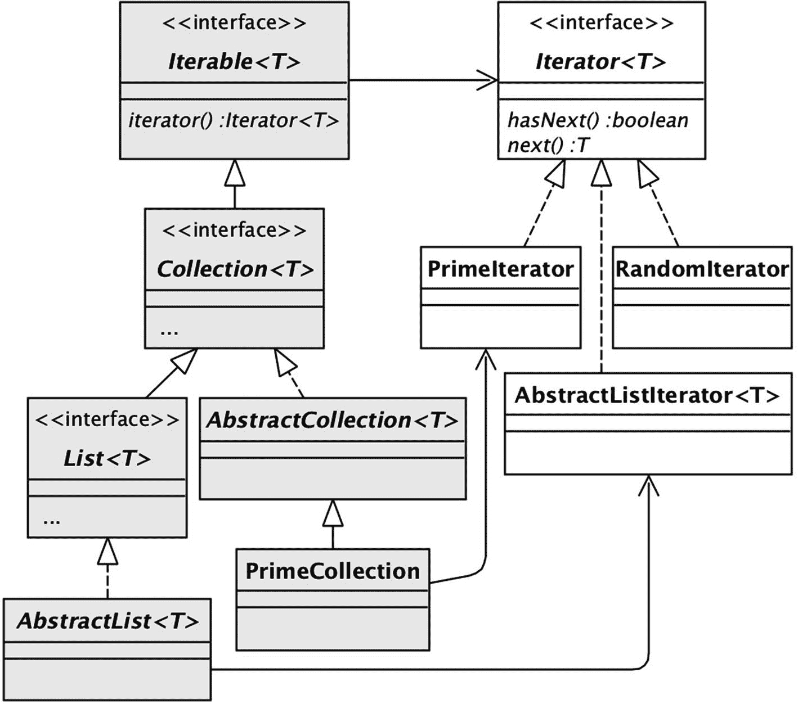

# 6.迭代和迭代

本章解决以下问题:假设一个变量包含一个对象集合；您应该编写什么代码来检查它的元素？从技术上讲，这个问题是在问关于 *iterables* 和*迭代*的问题。集合是可迭代的，检查其元素的机制是迭代。这个问题可以重新表述为“我应该如何遍历一个 iterable？”

Java 支持遍历一个 iterable 的多种方式，可以分为两类:*外部迭代*，你写一个循环，检查 iterable 的每个元素；和*内部迭代*，其中您调用一个方法来为您执行循环。本章涵盖了与迭代的两种用法相关的编程问题，以及如何编写支持迭代的类的设计问题。

## 迭代程序

假设您有一个保存对象集合的变量`L`。你应该写什么代码来打印它的元素？一种可能性是编写以下循环:

```java
   for (int i=0; i<L.size(); i++)
      System.out.println(L.get(i));

```

这段代码不太好有两个原因。首先，它违反了抽象规则，因为它使用了方法`get`，只有实现了`List`的集合才支持该方法。其次，在某些`List`实现中，它的执行效率会比其他实现低得多。特别是，`ArrayList`的`get`方法执行常数时间数组访问，而`LinkedList`的`get`方法搜索节点链。因此，如果`L`执行`ArrayList`，循环将以线性时间执行；如果`L`执行`LinkedList`，循环将以二次时间执行。

解决这两个问题的方法是为每个集合类提供专门用于迭代的方法。在 Java 中，这些方法被称为`hasNext`和`next`。方法`hasNext`返回一个布尔值，表明是否还有未检查的元素。方法`next`返回一个未检查的元素。这些方法解决了第一个问题，因为它们可以针对任何类型的集合实现，而不仅仅是列表；它们解决了第二个问题，因为每个类都可以有自己的方法实现，尽可能地提高效率。

这些方法应该放在哪里？回想一下图 [2-3](02.html#Fig3) 中集合层次的根是接口`Iterable`。所有集合都是可迭代的。这些方法应该和`Iterable`有关联，但是怎么关联呢？显而易见的设计是将方法添加到`Iterable`接口，这意味着每个集合对象都有自己的`hasNext`和`next`方法。在这种设计下，打印列表`L`内容的代码如下所示:

```java
   // Warning: This code is not legal Java.
   while (L.hasNext())
      System.out.println(L.next());

```

这种设计是不令人满意的，因为它可能允许不正确的行为发生。清单 [6-1](#PC3) 提供了一个例子。如果方法的参数列表中没有重复项，那么该方法将返回 true。代码调用 helper 方法`isUnique`，如果一个指定的字符串在列表中出现一次，该方法将返回 true。想法是`noDuplicates`遍历`L`中的每个字符串，为每个字符串调用`isUnique`，如果`isUnique`返回 false，则返回 false。方法`isUnique`也遍历`L`，如果发现字符串`s`恰好出现一次，则返回 true。

```java
// Warning: This code is not legal Java.
// And even if it were, it wouldn’t work.

public boolean noDuplicates(List<String> L) {
   while (L.hasNext()) {
      String s = L.next();
      if (!isUnique(L, s))
         return false;
   }
   return true;
}

private boolean isUnique(List<String> L, String s) {
   int count = 0;
   while (L.hasNext())
      if (L.next().equals(s))
         count++;
   return count == 1;
}

Listing 6-1A Terrible Way to Test a List for Duplicates

```

不正确的行为发生是因为两个方法同时迭代`L`。第一次通过`noDuplicates`循环时，代码检查 L 的第一个元素并调用`isUnique`。该方法将遍历`L`(从第二个元素开始)，并在读取完所有的`L`后返回到`noDuplicates`。因此，第二次通过`noDuplicates`循环时，对`L.hasNext`的调用将立即返回 false，而`noDuplicates`将提前退出。

这个算法正确工作的唯一方法是两个方法都可以独立地迭代 L。也就是说，遍历列表的功能必须独立于列表本身。Java 采用了这种方法，将方法`hasNext`和`next`移到一个名为`Iterator`的独立接口中。

`Iterable`接口(以及每个集合)有一个方法`iterator`；每次调用`iterator`都会返回一个新的`Iterator`对象。例如，下面的代码打印了`L`的元素:

```java
   Iterator<String> iter = L.iterator();
   while (iter.hasNext())
      System.out.println(iter.next());

```

每次需要迭代一个集合时创建一个`Iterator`对象可能看起来很笨拙，但这就是 Java 将迭代与集合分开的方式。当一个方法为一个集合创建一个`Iterator`对象时，该方法保证它的迭代将独立于集合的任何其他迭代。(如果在迭代过程中，其他方法碰巧修改了 iterable，Java 会抛出一个`ConcurrentModificationException`，通知你迭代已经无效。)

清单 [6-2](#PC5) 给出了`NoDuplicates`的正确代码。注意，每个方法都有自己的迭代器。事实上，`isUnique`在每次被调用时都会为`L`创建一个新的迭代器。

```java
public class NoDuplicates {
   public boolean noDuplicates(List<String> L) {
      Iterator<String> iter = L.iterator();
      while (iter.hasNext()) {
         String s = iter.next();
         if (!isUnique(L, s))
            return false;
      }
      return true;
   }

   private boolean isUnique(List<String> L, String s) {
      int count = 0;
      Iterator<String> iter = L.iterator();
      while (iter.hasNext())
         if (iter.next().equals(s))
            count++;
      return count == 1;
   }

}

Listing 6-2A Correct Way to Check a List for Duplicates

```

## 编写迭代器类

本节探索一些实现`Iterator`的类。迭代器类需要实现`hasNext`和`next`方法。它不需要与 iterable 关联。清单 [6-3](#PC6) 给出了一个非常简单的名为`RandomIterator`的“独立”迭代器类的例子。这个类的目的是生成任意多的随机数。它的`next`方法返回另一个随机整数，它的`hasNext`方法总是返回 true。

```java
public class RandomIterator implements Iterator<Integer> {
   private Random rand = new Random();

   public boolean hasNext() {
      return true;
   }

   public Integer next() {
      return rand.nextInt();
   }
}

Listing 6-3The RandomIterator Class

```

清单 [6-4](#PC7) 中的代码测试`RandomIterator`。它生成随机整数，将它们保存在哈希集中，并在出现重复时停止。然后，它打印生成的非重复整数的数量。

```java
Iterator<Integer> iter = new RandomIterator();
Set<Integer> nums = new HashSet<>();
boolean dupNotFound = true;
while (dupNotFound)
   dupNotFound = nums.add(iter.next());
System.out.println(nums.size());

Listing 6-4Using the RandomIterator Class

```

清单 6-5 给出了另一个迭代器类的例子，名为`PrimeIterator`。这个类生成第一个`N`质数，其中`N`在构造器中指定。`next`的代码计算下一个素数的值，并跟踪已经产生了多少个素数。一旦生成了指定数量的素数，`hasNext`的代码就返回 false。清单 [6-6](#PC9) 的代码通过打印前 20 个素数来测试这个类。

```java
Iterator<Integer> iter = new PrimeIterator(20);
while (iter.hasNext()) {
   int p = iter.next();
   System.out.println(p);
}

Listing 6-6Printing the First 20 Primes

```

```java
public class PrimeIterator implements Iterator<Integer> {
   private int current = 1;
   private int howmany;
   private int count = 0;

   public PrimeIterator(int howmany) {
      this.howmany = howmany;
   }

   public boolean hasNext() {
      return count < howmany;
   }

   public Integer next() {
      current++;
      while (!isPrime(current)) // Loop until
         current++;             // you find a prime.
      count++;
      return current;
   }

   private boolean isPrime(int n) {
      for (int i=2; i*i<=n; i++)
         if (n%i == 0)
            return false;
      return true;
   }
}

Listing 6-5The PrimeIterator Class

```

现在假设你想创建一个类`PrimeCollection`，它的对象表示某个`N`的前`N`个素数的集合。创建实现`Collection`的类的最简单方法是扩展抽象类`AbstractCollection`。为此，您需要实现它的抽象方法`size`和`iterator`。`PrimeCollection`的代码出现在清单 [6-7](#PC10) 中。它使用`PrimeIterator`类来实现`iterator`方法。

```java
public class PrimeCollection
             extends AbstractCollection<Integer> {
   private int size;

   public PrimeCollection(int size) {
      this.size = size;
   }

   public int size() {
      return size;
   }

   public Iterator<Integer> iterator() {
      return new PrimeIterator(size);
   }
}

Listing 6-7The PrimeCollection Class

```

一个`PrimeCollection`对象有一个非常有趣的特性——它的素数集合不存储在对象中，也不存储在其迭代器中。相反，素数是由迭代器按需生成的。有些人发现很难理解一个`Collection`对象不需要实际持有一个集合。相反，*它只需要像*一样，通过实现接口的方法。这就是封装的妙处。

创建实现`List`的类的简单方法是扩展`AbstractList`并实现它的两个抽象方法`size`和`get`。`AbstractList`的代码实现了`List`接口的其余方法。清单 [3-11](03.html#PC16) 中的类`RangeList`就是这样一个例子。

`iterator`方法是`AbstractList`实现的方法之一。清单 [6-8](#PC11) 给出了该方法的简化实现。它的代码创建并返回一个新的`AbstractListIterator`对象。该对象保存对列表的引用及其在列表中的当前位置。它的`next`方法调用列表的`get`方法从列表中检索当前位置的元素，并递增当前位置。它的`hasNext`方法调用列表的`size`方法来确定何时不再有元素。

```java
public abstract class AbstractList<T> {
   public abstract T get(int n);
   public abstract int size();

   public Iterator<T> iterator() {
      return new AbstractListIterator<T>(this);
   }
   ... // code for the other List methods
}

class AbstractListIterator<T> implements Iterator<T> {
   private int current = 0;
   private AbstractList<T> list;

   public AbstractListIterator(AbstractList<T> list) {
      this.list = list;
   }

   public boolean hasNext() {
      return current < list.size();
   }

   public T next() {
      T val = list.get(current);
      current++;
      return val;
   }

}

Listing 6-8Simplified Code for the AbstractList and AbstractListIterator Classes

```

请注意，`iterator`的这个实现使用了`get`方法，因此会表现出与本章开头的代码相同的低效行为。因此，每当您通过扩展`AbstractList`创建一个类时，您必须决定用一个更有效的实现覆盖默认的`iterator`实现是否有意义。

## 迭代器模式

图 [6-1](#Fig1) 描述了上一节提到的类和接口之间的关系。接口`Iterable`、它的两个子接口和三个实现类构成了图左侧的阴影层次；`Iterator`和它的三个实现类形成了右边的层次结构。



图 6-1

迭代器模式的例子

`Iterable`和`Iterator`层次之间的这种分离被称为*迭代器模式*。迭代器模式断言每个实现了`Iterable`的类都应该耦合到一个实现了`Iterator`的对应类。Java 集合类库是专门为满足迭代器模式而设计的。

迭代器模式的并行层次与工厂模式的并行层次非常相似，如图 [5-2](05.html#Fig2) 所示。这种相似并非巧合。iterable 可以被认为是一个“迭代器工厂”给定一个`Iterable`对象`L`，每次调用`L.iterator()`都会创建一个新的`Iterator`对象，用`L`的元素定制。

## 设计可迭代的类

可迭代类不必是集合；它只需要是一个对`iterator`方法有意义的类。举个例子，考虑一下银行业的演示。假设您想编写程序来分析由`Bank`类持有的账户。这些程序可能涉及诸如查找账户余额的分布、给定类型的账户数量等任务。这里有三种设计可供你选择。

您的第一个选择是修改`Bank`,让它为每个分析任务提供一个新的方法。这个选项使得编写分析程序变得容易，因为`Bank`类将完成所有的工作。问题是你必须修改`Bank`类来处理每一个新的需求，这违反了开放/封闭规则。修改还会导致`Bank`被专门化的方法所膨胀，违反了单一责任规则。

您的第二个设计选项是认识到`Bank`已经有了一个返回其账户信息的方法，即`toString`。您的每个分析程序都可以调用`toString`，从返回的字符串中提取所需的信息，并根据需要进行处理。例如，假设银行的`toString`方法返回清单 [6-9](#PC12) 中所示的字符串。除了第一行，每一行都描述了一个账户。为了找到每个账户的余额，分析程序可以在每一行寻找“balance=”后面的数字。要查找外国帐户，它可以查找字符串“is foreign”。等等。

```java
The bank has 3 accounts.
 Savings account 0: balance=3333, is foreign, fee=500
 Regular checking account 1: balance=6666, is domestic, fee=0
 Interest checking account 2: balance=9999, is domestic, fee=0

Listing 6-9Output of the Bank’s toString Method

```

这种技术被称为*屏幕抓取*T3。这个术语指的是程序从网页的 HTML 内容中提取信息的情况。屏幕抓取是最后的选择。这很难执行，当`toString`输出的格式改变时会中断。

第三个也是唯一一个好的选择是修改`Bank`类，使其具有一个(或多个)通用方法，客户端可以使用这些方法提取信息。这里的`iterator`方法是个不错的选择。它允许客户端遍历所需的帐户，而不会破坏帐户信息的封装实现。(例如，客户端将无法发现帐户存储在地图中。)

银行演示的版本 15 做了这样的修改。`Bank`类现在实现了`Iterable<BankAccount>`，这意味着它必须提供一个返回`BankAccount`对象的`iterator`方法。清单 [6-10](#PC13) 给出了*银行*的相关变化。

```java
public class Bank implements Iterable<BankAccount> {
   ...
   public Iterator<BankAccount> iterator() {
      return accounts.values().iterator();
   }
}

Listing 6-10The Version 15 Bank Class

```

银行演示的第 15 版也有两个新类，`IteratorAccountStats`和`StreamAccountStats`，它们是`Bank`的客户。这些类中的方法支持两个原型任务:打印和查找一些选定账户的最大余额。为了说明不同的编程技术，这些类包含了两个任务的多种方法。本章的剩余部分将研究这些类中的方法及其背后的技术。

## 外部迭代

迭代器是检查可迭代对象元素的基本方法。清单 [6-11](#PC14) 展示了遍历 iterable 的基本习惯用法。本章前面的例子都使用了这个习语。

```java
Iterable<E> c = ...
Iterator<E> iter = c.iterator();
while (iter.hasNext()) {
   E e = iter.next();
   ... // process e
}

Listing 6-11The Basic Idiom for Using Iterators

```

清单 [6-12](#PC15) 给出了来自`IteratorAccountStats`类的方法`printAccounts1`和`maxBalance1`的代码。这两种方法都使用基本的习惯用法来遍历 iterable 类`Bank`。方法`printAccounts1`打印所有银行账户，`maxBalance1`返回账户的最大余额。

```java
public void printAccounts1() {
   Iterator<BankAccount> iter = bank.iterator();
   while (iter.hasNext()) {
      BankAccount ba = iter.next();
      System.out.println(ba);
   }
}

public int maxBalance1() {
   Iterator<BankAccount> iter = bank.iterator();
   int max = 0;
   while (iter.hasNext()) {
      BankAccount ba = iter.next();
      int balance = ba.getBalance();
         if (balance > max)
            max = balance;
      }
   return max;
}

Listing 6-12The printAccounts1 and maxBalance1 Methods

```

这种习惯用法如此普遍，以至于 Java 有一种专门为简化它而设计的语法。这个语法就是 for-each 循环的*。例如，下面的循环相当于清单 [6-11](#PC14) 的代码。*

```java
   for (E e : c) {
      ... // process e
   }

```

上述 for-each 循环中的变量 c 可以是任意的`Iterable`；它不必是一个集合。清单 [6-13](#PC17) 给出了`IteratorAccountStats`的方法`printAccounts2`和`maxBalance2`的代码。这些方法修改了它们的早期版本，用 for-each 循环替换了显式迭代器方法。注意，这段代码明显更容易阅读和理解，主要是因为它不再显式地提到迭代器。

```java
   public void printAccounts2() {
      for (BankAccount ba : bank)
         System.out.println(ba);
   }

   public int maxBalance2() {
      int max = 0;
      for (BankAccount ba : bank) {
         int balance = ba.getBalance();
         if (balance > max)
            max = balance;
      }
      return max;
   }

Listing 6-13The Methods printAccounts2 and maxBalance2

```

尽管 for-each 循环简化了迭代器的使用，但它并不总是适用的。问题是 for-each 循环隐藏了对迭代器的`next`方法的调用，因此没有办法控制何时调用该方法。这里有两种需要这种控制的情况。

第一种情况是寻找 iterable 中的最大元素。清单 [6-14](#PC18) 给出了方法`findMax`的代码，它重写了清单 [2-9](02.html#PC25) 中的方法以使用迭代器。

```java
public BankAccount findMax(Iterable<BankAccount> bank) {
   Iterator<BankAccount> iter = bank.iterator();
   BankAccount max = iter.next();
   while (iter.hasNext()) {
      BankAccount ba = iter.next();
      if (ba.compareTo(max) > 0)
         max = ba;
   }
   return max;
}

Listing 6-14Using an Iterator to Find the Maximum Element

```

这段代码使用迭代器的第一个元素初始化变量`max`，然后遍历剩余的元素。这种策略在 for-each 循环中是不可能的。清单 [6-15](#PC19) 中所示的解决方案将`max`初始化为空。不幸的是，每次通过循环它都必须检查`max`是否为空，这是不令人满意的。

```java
public BankAccount findMax(Iterable<BankAccount> bank) {
   BankAccount max = null;
   for (BankAccount ba : bank)
      if (max == null || ba.compareTo(max) > 0)
         max = ba;
   return max;
}

Listing 6-15Using a for-each Loop to Find the Maximum Element

```

第二种情况是当您想要交叉两个集合的元素时。清单 [6-16](#PC20) 展示了如何使用显式迭代器执行这项任务。我不知道用 for-each 循环重写这段代码的好方法。

```java
Iterator<String> iter1 = c1.iterator();
Iterator<String> iter2 = c2.iterator();
Iterator<String> current = iter1;
while (current.hasNext()) {
  String s = current.next();
  // process s
  current = (current == iter1) ? iter2 : iter1;
}

Listing 6-16Interleaving Access to Two Collections

```

## 内部迭代

上一节中的每个例子都使用了一个循环来遍历它的迭代器。这个循环以两种不同的方式执行:显式调用迭代器方法，或者使用 for-each 循环。这两种方式都是*外部迭代*的例子，因为在每种情况下，客户端都编写循环。

也可以不写循环就遍历 iterable 对象的元素。这种技术被称为*内部迭代*。比如`Bank`中的方法`addInterest`为客户端进行内部迭代，无形中循环通过银行的账户。

`addInterest`方法是一个内部迭代器，专门用于执行单一任务。Java `Iterable`接口有默认的方法`forEach`，可以用于通用的内部迭代。`forEach`的参数是一个实现`Consumer`接口的对象。这个接口也是 Java 库的一部分，有一个 void 方法`accept`，定义如下:

```java
   interface Consumer<T> {
      void accept(T t);
   }

```

`accept`方法的目的是对它的参数对象执行一个动作。清单 [6-17](#PC22) 给出了一个创建和使用`Consumer`对象的例子。它的第一条语句创建了`Consumer`对象，并将对它的引用保存在变量`action`中。`Consumer`对象的`accept`方法打印它的`BankAccount`参数。第二条语句获得对银行账户 123 的引用，并保存在变量`x`中。第三条语句对指定的帐户执行操作。换句话说，该语句打印帐户 123。

```java
Consumer<BankAccount> action = ba -> System.out.println(ba);
BankAccount x = bank.getAccount(123);

action.accept(x);

Listing 6-17Creating and Using a Consumer Object

```

iterable 的`forEach`方法对 iterable 迭代器的每个对象执行一个操作；这个动作是由作为`forEach`参数的`Consumer`对象定义的。清单 [6-18](#PC23) 给出了方法`printAccounts3`的代码，该方法使用`forEach`打印银行迭代器生成的每个元素。

```java
public void printAccounts3() {
   Consumer<BankAccount> action = ba->System.out.println(ba);
   bank.forEach(action);
}

Listing 6-18The Method printAccounts3

```

清单 [6-18](#PC23) 有趣的特点是没有显式循环。相反，循环是在`forEach`方法内部执行的。清单 [6-19](#PC24) 给出了`Iterable`接口的简化版本，展示了`forEach`方法如何执行它的循环。

```java
public interface Iterable<T> {
   Iterator<T> iterator();

   default void forEach(Consumer<T> action) {
      Iterator<T> iter = iterator();
      while (iter.hasNext())
         action.apply(iter.next());
   }
}

Listing 6-19A Simplified Iterable Interface

```

## 访问者模式

传递给`forEach`方法的`Consumer`对象被称为*访问者*。当`forEach`方法遇到 iterable 的每个元素时，`Consumer`对象“访问”该元素。这种访问可能涉及打印元素(如在`printAccounts3`)，修改它，或者任何其他可以表示为`Consumer`的动作。

`forEach`方法的美妙之处在于，它将访问元素的代码(`Consumer`对象)与迭代元素的代码分开。这种分离被称为*访客模式*。

演示类`IteratorAccountStats`有一个方法`visit1`，它概括了`printAccounts3`，因此它的参数可以是任何访问者。它的代码出现在清单 [6-20](#PC25) 中。清单 [6-21](#PC26) 中的语句说明了它的用法。

```java
// Print all accounts
visit1(ba -> System.out.println(ba));

// Add interest to all accounts
visit1(ba -> ba.addInterest());

// Print the balance of all domestic accounts
visit1(ba -> { if (!ba.isForeign())
                  System.out.println(ba.getBalance()); });

Listing 6-21Uses of the visit1 Method

```

```java
public void visit1(Consumer<BankAccount> action) {
   bank.forEach(action);
}

Listing 6-20The Method visit1

```

`visit1`方法的问题在于它只适用于 void 操作——即不返回值的操作。例如，不能使用`visit1`来计算最大账户余额。为了实现这个功能，访问者的定义还必须有一个计算返回值的方法。Java 的库中没有这样的访问者接口，但是创建一个很容易。见清单 [6-22](#PC27) 。

```java
public interface Visitor<T,R> extends Consumer<T> {
   R result();
}

Listing 6-22The Visitor Interface

```

该接口使用附加方法`result`将访问者定义为消费者。访问者有两种通用类型:类型`T`是它访问的元素的类型，类型`R`是结果值的类型。

清单 [6-23](#PC28) 给出了访问者类`MaxBalanceVisitor`的代码，其对象计算他们访问的账户的最大余额。变量`max`保存目前为止遇到的最大余额。`accept`方法检查当前访问账户的余额，并在适当的时候更新`max`。`result`方法返回`max`的最终值。

```java
public class MaxBalanceVisitor
             implements Visitor<BankAccount,Integer> {
   private int max = 0;

   public void accept(BankAccount ba) {
      int bal = ba.getBalance();
      if (bal > max)
         max = bal;
   }

   public Integer result() {
      return max;
   }
}

Listing 6-23The Class MaxBalanceVisitor

```

`IteratorAccountStats`包含两个方法，使用访问者来查找银行账户的最大余额。它们的代码出现在清单 [6-24](#PC29) 中。方法`maxBalance3a`创建了一个`MaxBalanceVisitor`对象。方法`maxBalance3b`内联定义了等价的 visitor 对象。由于`Visitor`接口有两个非默认方法，`maxBalance3b`不能使用 lambda 表达式定义它的访问者；相反，它必须使用匿名内部类。注意，`Visitor`对象可以合法地传递给`forEach`方法，因为`Visitor`是`Consumer`的子类型。

```java
public int maxBalance3a() {
   Visitor<BankAccount,Integer> v = new MaxBalanceVisitor();
   bank.forEach(v);
   return v.result();
}

public int maxBalance3b() {
   Visitor<BankAccount,Integer> v =
         new Visitor<BankAccount,Integer>() {
            private int max = 0;
            public void accept(BankAccount ba) {
               int bal = ba.getBalance();
               if (bal > max)
                  max = bal;
            }
            public Integer result() {
               return max;
            }
         };
   bank.forEach(v);
   return v.result();
}

Listing 6-24The maxBalance3a and maxBalance3b Methods

```

清单 [6-25](#PC30) 给出了方法`visit2`的代码，它一般化了`visit1`,因此它的参数是一个`Visitor`对象而不是一个`Consumer`对象。清单 [6-26](#PC31) 给出了方法`maxBalance3c`的代码，该方法使用`visit2`来查找最大账户余额。

```java
public int maxBalance3c() {
   return visit2(new MaxBalanceVisitor());
}

Listing 6-26The maxBalance3c Method

```

```java
public <R> R visit2(Visitor<BankAccount, R> action) {
   bank.forEach(action);
   return action.result();
}

Listing 6-25The visit2 Method

```

## 述语

前一节介绍了遍历银行迭代器的几种方法。每种方法都访问所有的账户，打印它们或者找到它们的最大余额。

假设现在您想编写代码只访问一些帐户；例如，假设您要打印国内帐户。发现这些方法都没有用，这可能是一个不受欢迎的惊喜。相反，你需要编写一个新的方法，比如清单 [6-27](#PC32) 中所示的方法。

```java
public void printDomesticAccounts() {
   for (BankAccount ba : bank)
      if (!ba.isForeign())
         System.out.println(ba);
}

Listing 6-27Printing the Domestic Accounts

```

注意，这个方法包含了与 printAccounts2 相同的大部分代码，违反了不要重复自己的规则。此外，每当您对帐户的另一个子集感兴趣时，您将需要编写一个新方法。这种情况是不可接受的。

解决方案是重写`printAccounts`和`maxBalance`方法，使其具有指定所需帐户子集的参数。Java 库为此提供了接口`Predicate`。它有一个方法`test`，其返回值表明指定的对象是否满足谓词。`Predicate`界面定义如下:

```java
   interface Predicate<T> {
      boolean test(T t);
   }

```

由于接口是函数式的(也就是说，它只有一个方法)，实现`Predicate`的类可以由 lambda 表达式定义。例如，考虑清单 [6-28](#PC34) 。它的第一条语句创建了一个谓词，指定余额大于$100 的帐户。它的第二条语句获得了对帐户 123 的引用。它的第三条语句使用谓词来确定该帐户的余额是否大于$100，如果大于，就打印出来。

```java
Predicate<BankAccount> pred = ba -> ba.getBalance() > 10000;
BankAccount x = bank.getAccount(123);
if (pred.test(x))
   System.out.println(x);

Listing 6-28Creating and Using a Predicate

```

清单 6-29 给出了`InteratorAccountStats`的方法`printAccounts4`和`maxBalance4`的代码。这些方法将一个任意谓词作为它们的参数，并使用该谓词来限制它们访问的银行帐户。

```java
public void printAccounts4(Predicate<BankAccount> pred) {
   for (BankAccount ba : bank)
      if (pred.test(ba))
         System.out.println(ba);
}

public int maxBalance4(Predicate<BankAccount> pred) {
   int max = 0;
   for (BankAccount ba : bank) {
      if (pred.test(ba)) {
         int balance = ba.getBalance();
         if (balance > max)
            max = balance;
      }
   }
   return max;
}

Listing 6-29The printAccounts4 and maxBalance4 Methods

```

谓词也可以嵌入到访问者模式中。方法`printAccounts5`创建一个访问每个账户的`Consumer`对象。如果帐户满足谓词，则打印帐户。见清单 [6-30](#PC36) 。

```java
public void printAccounts5(Predicate<BankAccount> pred) {
   Consumer<BankAccount> action =
       ba -> { if (pred.test(ba))
                  System.out.println(ba);
             };
   bank.forEach(action);
}

Listing 6-30The printAccounts5 Method

```

清单 [6-31](#PC37) 中的语句说明了`printAccounts5`的三种用法。他们打印余额大于 100 美元的帐户、国内帐户和所有帐户。

```java
Predicate<BankAccount> p = ba -> ba.getBalance() > 10000;
printAccounts5(p);
printAccounts5(ba->!ba.isForeign());
printAccounts5(ba->true);

Listing 6-31Using the printAccounts5 Method

```

清单 [6-32](#PC38) 给出了方法`maxBalance5`的代码，该方法创建了一个`Consumer`对象，该对象包含了它的参数谓词和它的访问者。

```java
public int maxBalance5(Predicate<BankAccount> pred) {
   Visitor<BankAccount,Integer> r = new MaxBalanceVisitor();
   Consumer<BankAccount> action =
             ba -> {if (pred.test(ba))
                       r.accept(ba);};
   bank.forEach(action);
   return r.result();
}

Listing 6-32The maxBalance5 Method

```

以下语句显示了如何使用`maxBalance5`返回国内账户的最大余额。

```java
   int max = maxBalance5(ba->!ba.isForeign());

```

这种将谓词与消费者结合起来的能力是可以推广的。方法`visit3`有两个参数:一个谓词和一个消费者。方法`visit4`的参数是一个谓词和一个访问者。每个方法都访问那些满足谓词的元素。两种方法的代码都出现在清单 [6-33](#PC40) 中。

```java
public void visit3(Predicate<BankAccount> pred,
                   Consumer<BankAccount> action) {
   bank.forEach(ba -> {if (pred.test(ba))
                          action.accept(ba);});
}

public <R> R visit4(Predicate<BankAccount> pred,
                    Visitor<BankAccount, R> action) {
   bank.forEach(ba -> {if (pred.test(ba))
                          action.accept(ba);});
   return action.result();
}

Listing 6-33The visit3 and visit4 Methods

```

清单 [6-34](#PC41) 中的代码演示了`visit3`和`visit4`的用法。第一个报表打印余额超过$50 的所有国内帐户的余额。第二条语句将国内账户的最大余额分配给变量`max`。

```java
   visit3(ba->(!ba.isForeign() && ba.getBalance()>5000),
          ba->System.out.println(ba));
   int max = visit4(ba->!ba.isForeign(),
                    new MaxBalanceVisitor());

Listing 6-34Using the visit3 and visit4 Methods

```

## 收集流

本节研究 Java 库中的`Stream`接口。一个`Stream`对象类似于一个迭代器，因为它的方法允许你遍历一组元素。不同之处在于`Stream`提供了额外的方法来简化内部迭代的使用。

清单 [6-35](#PC42) 中显示了`Stream`及其六个方法的代码。`iterator`方法将流转换成迭代器，这样客户端可以使用`hasNext`和`next`方法进行外部迭代。这种方法不常用，只在极少数不可能进行内部迭代的情况下存在。

```java
interface Stream<T> {
   Iterator<T> iterator();
   void forEach(Consumer<T> cons);
   Stream<T> filter(Predicate<T> p);
   <R> Stream<R> map(Function<T,R> f);
   T reduce(T id, BinaryOperator<T> op);
   boolean anyMatch(Predicate<T> p);
   ...
}

Listing 6-35The Stream Interface

```

其他流方法支持内部迭代。`forEach`方法与`Iterator`的`forEach`方法相同。方法`filter`、`map`、`reduce`和`anyMatch`将很快被讨论。

实现`Stream`的对象被称为*集合流*。集合流的元素来自一个集合或者可以被看作一个集合的东西(比如数组)。收集流与第 3 章中讨论的字节流没有任何关系。

`Collection`接口包含方法`stream`，该方法创建一个`Stream`对象，其元素是集合的元素。这是获取集合流的最常见方式。一个非集合类(比如`Bank`)也可以实现`stream`方法。通常，这样一个类的`stream`方法调用它的一个集合的`stream`方法。例如，15 版银行演示中的`Bank`类实现了方法`stream`。清单 [6-36](#PC43) 给出了相关代码。

```java
public class Bank implements Iterable<BankAccount> {
   private Map<Integer,BankAccount> accounts;
   ...
   public Stream<BankAccount> stream() {
      return accounts.values().stream();
   }
}

Listing 6-36The version 15 Bank Class

```

版本 15 银行演示中的类`StreamAcctStats`演示了几种`Stream`方法的使用。`printAccounts6`的代码出现在清单 [6-37](#PC44) 中。它使用`Stream`方法`filter`和`forEach`打印满足给定谓词的银行账户。

```java
public void printAccounts6(Predicate<BankAccount> pred) {
   Stream<BankAccount> s1 = bank.stream();
   Stream<BankAccount> s2 = s1.filter(pred);
   s2.forEach(ba->System.out.println(ba));
}

Listing 6-37The printAccounts6 Method

```

`forEach`方法的行为与`Iterable`中的相应方法相同。`filter`方法将一个流转换成另一个流。它将一个谓词作为参数，并返回一个包含满足该谓词的元素的新流。在清单 [6-37](#PC44) 中，流`s2`包含来自`s1`的满足谓词的账户。请注意`filter`方法如何使用内部迭代来完成原本需要循环和 if 语句来完成的工作。

因为 Java 语法允许组合方法调用，所以可以重写`printAccounts6`以便由`stream`方法的输出调用`filter`方法。参见清单 [6-38](#PC45) 。

```java
public void printAccounts6(Predicate<BankAccount> pred) {
   Stream<BankAccount> s = bank.stream().filter(pred);
   s.forEach(ba->System.out.println(ba));
}

Listing 6-38A Revised Version of the Method printAccounts6

```

事实上，您甚至可以重写`printAccounts6`,这样所有的方法调用都出现在一条语句中。在这种情况下，你不需要变量`Stream``s`。参见清单 [6-39](#PC46) 。

```java
public void printAccounts6(Predicate<BankAccount> pred) {
   bank.stream().filter(pred).forEach(
                            ba->System.out.println(ba));
}

Listing 6-39Another Revsion of printAccounts6

```

这段代码可读性不是特别好。然而，如果重写它，使每个方法调用都在不同的行上，它就变得非常易读。这就是方法`printAccounts7`的作用。它的代码出现在清单 [6-40](#PC47) 中。

```java
public void printAccounts7(Predicate<BankAccount> pred) {
   bank.stream()
       .filter(pred)
       .forEach(ba->System.out.println(ba));
}

Listing 6-40The Method printAccounts7

```

这种编程风格叫做*流畅*。一个流畅的表达式由几个组合的方法调用组成。您可以将每个方法调用视为一个对象到另一个对象的转换。例如，清单 [6-41](#PC48) 给出了一个流畅的报表，打印出余额在 10 美元到 20 美元之间的银行账户。

```java
bank.stream()
    .filter(ba -> ba.getBalance() >= 1000)
    .filter(ba -> ba.getBalance() <= 2000)
    .forEach(ba->System.out.println(ba));

Listing 6-41A Fluent Statement

```

`filter`方法将一个流转换成包含原始元素子集的另一个流。另一种形式的转换由方法`map`产生。map 的参数是一个实现`Function`接口的对象。这个接口是 Java 库的一部分，有一个方法`apply`，定义如下:

```java
   interface Function<T,R> {
      R apply(T t);
      ...
   }

```

`apply`方法将类型为`T`的对象转换为类型为`R`的对象。`map`方法为输入流中的每个元素调用`apply`，并返回由转换后的元素组成的流。您可以使用 lambda 表达式来创建`Function`对象。例如，考虑下面的语句。lambda 表达式将一个`BankAccount`对象转换成一个表示其余额的整数。因此，`map`方法返回一个包含每个账户余额的流。

```java
   Stream<Integer> balances = bank.stream()
                                  .map(ba -> ba.getBalance());

```

能够从流中构造一个“返回值”也是有用的。这个操作被称为*减少*流。为此，`Stream`接口具有方法`reduce`。例如，清单 [6-42](#PC51) 给出了`StreamAcctStats`的`maxBalance4`方法的代码。

```java
public int maxBalance4(Predicate<BankAccount> pred) {
   return bank.stream()
              .filter(pred)
              .map(ba->ba.getBalance())
              .reduce(0, (x,y)->Math.max(x,y));
}

Listing 6-42The Method maxBalance4

```

`reduce`方法有两个参数。第一个参数是缩减的初始值。第二个参数是归约方法，将两个值归约为一个值。`reduce`方法为流的每个元素重复调用它的 reduction 方法。其算法如清单 [6-43](#PC52) 所示，其中`x`为归约初始值，`r`为归约方法。

```java
   1\. Set currentval = x.
   2\. For each element e in the stream:
         currentval = r(currentval, e).
   3\. Return currentval.

Listing 6-43The Reduction Algorithm

```

`Stream`接口也有 reduction 方法，用于搜索匹配给定谓词的元素。这些方法中的三种是`allMatch`、`anyMatch`和`findFirst`。清单 [6-44](#PC53) 的代码使用`anyMatch`来确定是否有一个账户的余额大于 1000 美元。

```java
boolean result =
   bank.stream()
       .anyMatch(ba->ba.getBalance() > 100000);

Listing 6-44Using the anyMatch Method

```

收集流是 *map-reduce* 程序的构建模块。Map-reduce 编程是处理大数据应用程序的一种有效、常用的方法。Map-reduce 程序的结构如清单 [6-45](#PC54) 所示。

```java
1\. Obtain an initial collection stream.
2\. Transform the stream, filtering and mapping its contents until you get a stream containing the values you care about.
3\. Reduce that stream to get the answer you want.

Listing 6-45The Structure of a Map-Reduce Program

```

Map-reduce 编程有两个优点。首先，它允许你把你的问题分成一系列小的转换。人们发现这种编码风格易于编写，易于调试。请注意，map-reduce 代码没有赋值语句，也没有控制结构。

第二个优点是，您可以轻松地将代码更改为并行运行。每个集合都有一个方法`parallelStream`和`stream`。给定一个集合，如果使用`parallelStream`方法创建流，那么产生的流将并行执行。就这样！Java `parallelSteam`方法在幕后完成所有的艰苦工作。

## 摘要

一个*迭代器*生成一个元素序列。它有两种方法`next`和`hasNext`。方法`next`返回迭代器中的下一个元素，而`hasNext`指示迭代器是否还有剩余的元素。一个*可迭代的*是一个有相关迭代器的对象。集合是可迭代的最常见的例子。

*迭代器模式*将 iterable 和 iterator 类组织成独立的并行层次结构，每个 iterable 类都有一个对应的 iterator 类。Java 库包含接口`Iterable`和`Iterator`正是为了这个目的。`Iterable`声明了方法`iterator`，该方法返回与该 iterable 关联的`Iterator`对象。

遍历可迭代对象`L`的最基本方法是使用下面的*基本习惯用法*:

```java
   Iterator<T> iter = L.iterator();
   while (iter.hasNext()) {
      T t = iter.next();
      process(t); // some code that uses t
   }

```

Java 对这种习惯用法有一种特殊的语法，叫做 *for-each 循环*。使用下面的 for-each 循环可以更简洁地编写上述代码:

```java
   for (T t : L) {
      process(t);
   }

```

显式循环遍历迭代器的元素称为*外部迭代*。一个封装了循环的方法(比如银行的`addInterest`方法)据说执行*内部迭代*。Java `Iterable`接口有一个通用的内部迭代方法，叫做`forEach`。`forEach`的参数是一个指定迭代循环主体的`Consumer`对象。使用`forEach`，前面的代码可以写成如下:

```java
   L.forEach(t->process(t));

```

`Consumer`对象被说成*访问*iterable 的每个元素。`forEach`方法将访问者的规范与循环的规范分开。这种分离被称为*访客模式*。

收集流是简化访问者模式的一种方式。您可以使用集合流方法将迭代表达为一系列小的*转换*，而不是通过具有复杂主体的单个访问者来表达迭代。每个转换本身就是一个访问者，执行一个有限的操作，比如一个过滤器或者一个地图。这项技术是 *map-reduce* 编程的基础。其思想是，编写几个小的转换比编写一个大的转换要简单得多，更紧凑，也更不容易出错。

然而，收集流的使用提出了效率问题。如果流转换是顺序执行的，每一个都通过自己的迭代循环，那么 map-reduce 程序将比传统程序花费更多的时间，传统程序通过元素进行单次迭代。收集流只有在它们的转换可以以某种方式合并时才有用。这样做的技术很有趣，将在第 [8](08.html) 章中讨论。