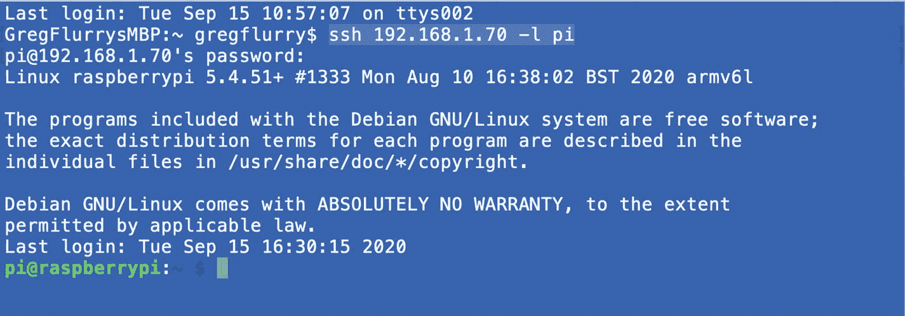
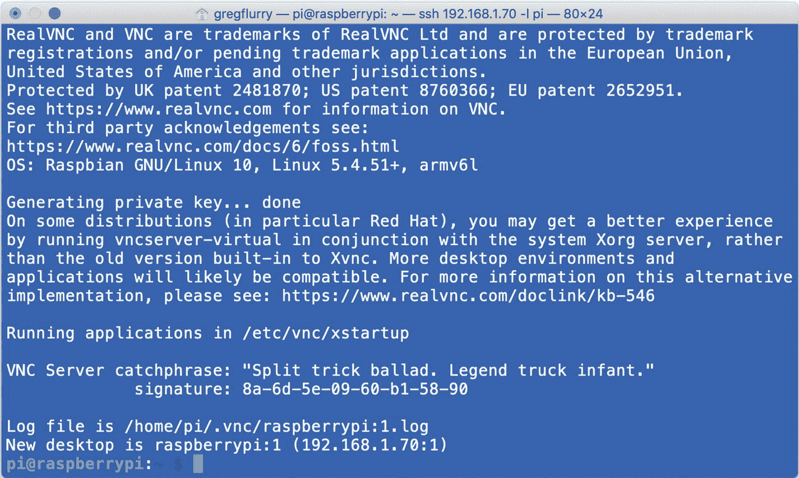
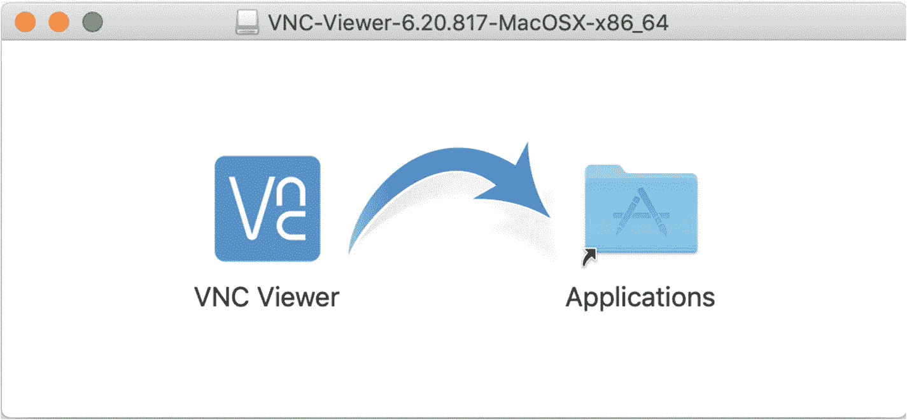
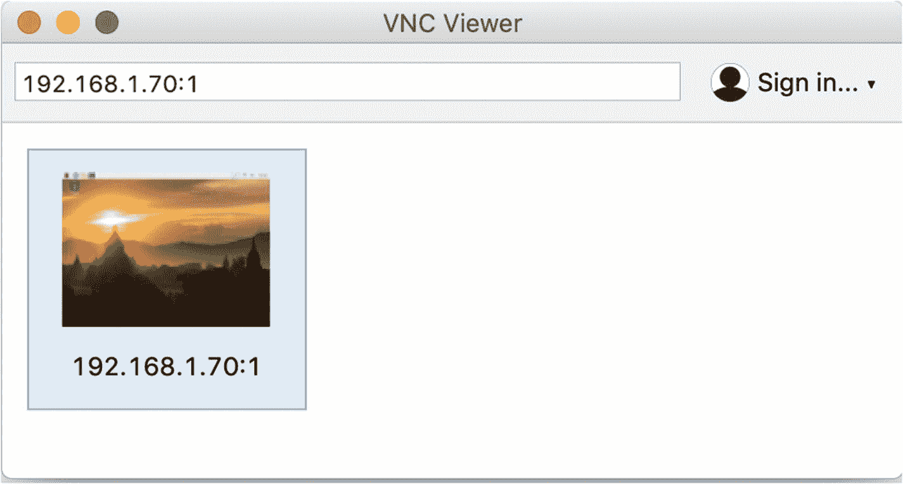

# 四、设置工作站

在前两章中，您配置了一个树莓派来支持用 Java 编写的机器人和物联网项目，并支持远程计算。在本章中，我将向您展示如何为远程计算设置工作站，以及如何将工作站连接到 Pi。您将设置两种形式的远程计算:

*   用于树莓派3 模型 B+和树莓派Zero W 的命令行控制的安全外壳(SSH)

*   用于树莓派3 模型 B+的桌面控制的虚拟网络计算(VNC)

## 使用 SSH 的远程计算

连接到树莓派的最简单和最常用的方法是从终端仿真器发出的安全 shell ( `ssh`)命令。如果你看第 [3 章](03.html)，这一节有些多余，可以跳过；如果没有，继续读。在 macOS 上，终端模拟器叫终端；在 Windows 10 上，等效物也称为终端。我就用通用词*终端*来指代两者。

要从工作站连接到 Raspberry Pi，请打开终端。以两种形式之一输入`ssh`命令:

```java
ssh <IP address> -l <username>
ssh <hostname> -l <username>

```

“IP 地址”是您希望控制的 Pi 的地址；这种形式总是有效的，因为 IP 地址在网络域中必须是唯一的。类似地，“主机名”是您希望控制的 Pi 的主机名；只有当您的 Pi 在网络域中有唯一的主机名时，此表单才有效。该命令实际上是让您使用“用户名”登录系统系统会提示输入“用户名”的密码；您可以在树莓派操作系统配置期间设置密码。图 [4-1](#Fig1) 显示了使用带有 IP 地址的`ssh`访问第 [2 章](02.html)中配置的树莓派3 Model B+ (Pi3)的结果。



图 4-1

突出显示 ssh 命令的终端 shell

成功！您可以在图 [4-1](#Fig1) 的最后一行看到来自 Pi3 的提示。现在，您可以输入操作系统中所有可用的命令。坐在您的工作站上，您实际上可以完全控制 Pi3。

Note

在旧版本的 Windows 和 Windows 10 上，您可以使用 PUTTY 来代替终端。PUTTY 是一个用于 Windows 的免费开源 ssh 客户端。

## VNC 远程计算

虚拟网络计算(VNC)为远程计算提供了客户端/服务器架构，允许您与树莓派操作系统桌面进行交互。VNC 服务器运行在树莓派上，VNC 客户端运行在您的工作站上。VNC 服务器已经安装在 Pi3 上，因为它是**推荐的**操作系统安装的一部分。因为您将 VNC 配置为禁用，所以当 Pi3 启动时，VNC 服务器不会启动。没有烦恼；您可以在需要时启动和停止它。

### 启动 VNC 服务器

在您之前打开的终端中，输入命令`vncserver`。您将得到一个冗长的响应，表明服务器正在运行，如图 [4-2](#Fig2) 所示。请特别注意回复的最后一行。它显示了您需要用于 VNC 客户端的完整地址。在这种情况下，它是 192.168.1.70:1。



图 4-2

确认 VNC 服务器正在运行

### 获取并启动 VNC 浏览器

Pi3 上的 VNC 服务器来自 RealVNC 公司。您将需要为您的工作站获得一个兼容的客户端，该兼容的客户端也来自 RealVNC 可以从 [`www.realvnc.com/en/connect/download/viewer`](http://www.realvnc.com/en/connect/download/viewer) 下载。在 macOS 上，安装很简单。下载的是一个`.dmg`文件。只要双击它，你就会得到如图 [4-3](#Fig3) 所示的安装程序。将 VNC 浏览器图标拖放到应用程序文件夹图标开始安装；可能会提示您输入密码。



图 4-3

VNC 浏览器安装

现在你可以在 macOS 上启动 vnc 浏览器，方法是点击它在**应用程序**文件夹中的图标，或者使用字符“VNC”进行 Spotlight 搜索工具第一次启动时，会问你(至少在 macOS 上)是否真的要打开；你知道你做了，所以点击**打开**按钮。图 [4-4](#Fig4) 显示了第一次运行时的查看器。


图 4-4

VNC 客户初始开放

在文本字段中键入 Pi3 的 IP 地址，后跟分号和数字(如 192.168.1.70:1)，然后按 Enter 键。系统会提示您输入用户 ID 和密码，如图 [4-5](#Fig5) 所示。输入正确的凭证(对于您在第 [2](02.html) 章中创建的配置，用户 ID 为“pi”，密码为“raspberry”，除非您更改了它)。您可能需要选中“记住密码”框。点击**确定**。


图 4-5

VNC 客户端用户 ID/密码提示

验证后，服务器会提示您“访问本地电脑的辅助功能，将播放和音量等媒体键发送到远程电脑”我说拒绝访问，但你的需求可能不同。现在，您应该会看到一些与您在初始 Pi3 配置中看到的桌面非常相似的东西，如图 [4-6](#Fig6) 所示。


图 4-6

通过 VNC 浏览器的树莓派操作系统桌面

现在，您可以在 VNC 浏览器中通过显示器、键盘和鼠标直接使用 Pi3 进行任何操作。探索。尝试一些事情。玩得开心。

### 调整 VNC 服务器

您可以做一些事情来定制 VNC 服务器的外观，以适合您的偏好。我将讨论其中的两个:光标的外观和桌面的大小。

#### 改变光标

当你在 VNC 服务器版本的桌面上玩的时候，你可能已经注意到光标是一个“X”而不是一个箭头。如果你喜欢，那好；忽略本小节的其余部分。我更喜欢箭头作为光标，我将向您展示如何使光标成为箭头。

首先，您必须终止查看器和服务器之间的连接。将光标移动到客户端窗口的中上方。一个菜单将会下拉。将光标移动到 **X** 处并点击。您将会看到一个弹出窗口，询问您是否真的要关闭。确认。

现在回到连接到 Pi 的终端。输入以下命令终止 VNC 服务器:

```java
vncserver -kill :1

```

“:1”指的是您之前启动的特定服务器(数字可能不同)。您不会得到任何确认，但服务器不再运行。

要将服务器光标更改为箭头，首先需要将 VNC 服务器配置文件从其系统位置复制到用户 pi 的主文件夹，然后修改副本中的光标形状。在终端中，使用命令`cd ~/.vnc`导航到`.vnc`文件夹。现在，使用下面的命令(以“.”结尾)将配置文件复制到该文件夹中很重要，因为它指示当前文件夹是复制的目标；`xstartup`和“.”之间的空格也很重要):

```java
cp /etc/vnc/xstartup .

```

现在你要编辑`xstartup`的副本。您可以使用任何可用的编辑器，但是我更喜欢使用`nano`，因为它很简单。要编辑文件，输入命令`nano xstartup`。您现在应该在编辑器中看到`xstartup`文件。它看起来有点像图 [4-7](#Fig7) 。


图 4-7

用编辑器`nano`打开`xstartup`的结果

现在你需要找到这样一行

```java
xsetroot -solid grey

```

在 nano 中，您可以通过按 Ctrl-w 并在提示符下键入“xsetroot”(不带引号)来完成此操作。按回车键开始搜索。现在输入附加文本，使该行如下所示:

```java
xsetroot -solid grey -cursor_name left_ptr

```

通过按 Ctrl-o 保存编辑过的文件；在提示符下，只需按回车键；您应该会看到一个文件被写入的确认。按 Ctrl-x 退出 nano。

现在，使用`vncserver`命令，再次启动服务器。返回 VNC 浏览器窗口。它的外观应该是不同的，如图 [4-8](#Fig8) 所示，因为查看者记得你之前建立的连接。



图 4-8

显示先前配置的连接的 VNC 浏览器

要重新建立连接，您只需双击地址为 192.168.1.70:1 的 Pi3 图标。请注意，查看者会记住多个连接。当桌面出现时，您应该会看到一个光标箭头。

#### 更改桌面大小

假设你不喜欢你工作站上 VNC 桌面的尺寸。幸运的是，您可以在启动 VNC 服务器时更改大小。如果你想改变大小，你必须先杀死服务器，如前所述。然后，您可以使用类似下面的命令启动 VNC 服务器:

```java
vncserver -randr=640x480

```

该命令在您的工作站上产生 640 像素宽、480 像素高的 Pi 桌面窗口。你可以使用不同的尺寸，比如 1024x768，但是我没有做过足够的实验来知道极限。

Tip

我的经验表明，vncserver 会记住输入的大小。所以，如果你对某个特定的尺寸很满意，你就不用再输入了。

## 摘要

你现在

*   学习如何从终端模拟器使用 ssh

*   安装了 VNC 浏览器

*   学习了如何在树莓派上启动和停止 VNC 服务器

*   已了解如何将 VNC 浏览器连接到 VNC 服务器

*   了解如何定制 VNC 服务器以满足您的需求

基本上，您现在有两种使用树莓派进行远程计算的方式(假设安装了桌面)。太棒了！继续第 [5](05.html) 章来设置远程开发的 NetBeans。