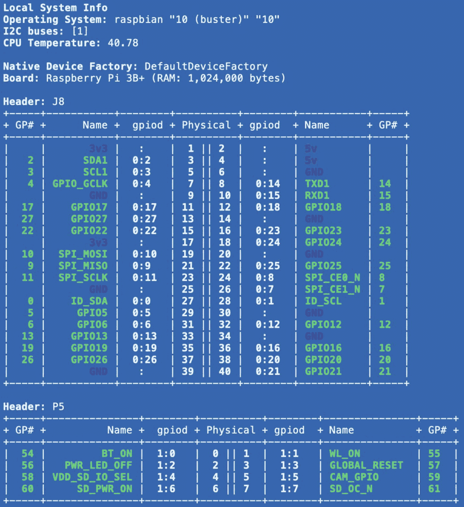
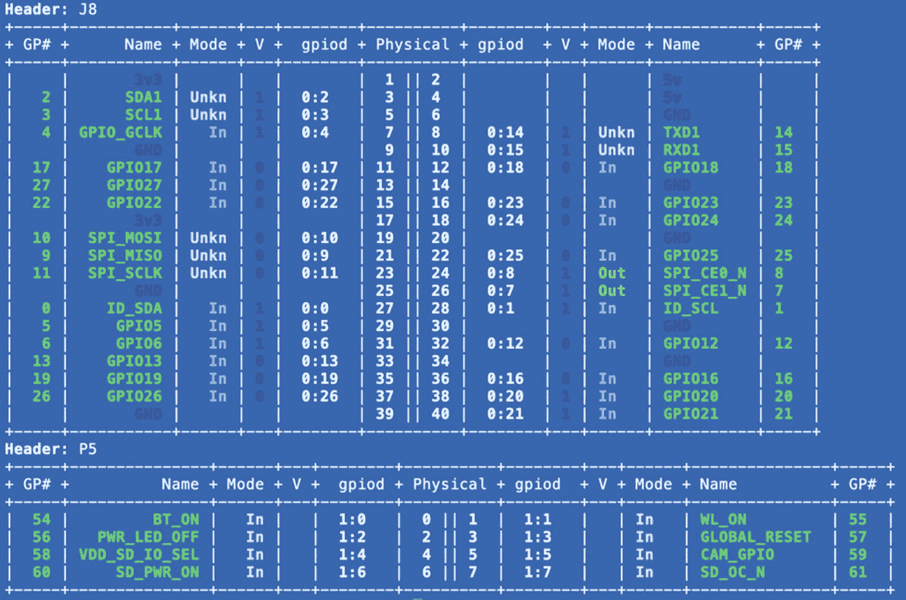

# 七、diozero 基本输入/输出 API

在这一章中，您将了解到更多关于 diozero base I/O API 的知识，您将在本书中使用它来创建 Java 库以支持您在树莓派上的设备。我们会掩护

*   diozero 提供的一些有用的实用程序

*   设备和 Pi 之间的物理连接

*   基于 Pi I/O 功能的一些背景知识

*   精选 diozero 基本 I/O API 类的亮点

*   开发使用 diozero base I/O API 的设备库和应用程序的指南

有关 diozero 基础 I/O API 的更多细节，您应该阅读 diozero Javadoc ( [`www.javadoc.io/doc/com.diozero/diozero-core/latest/index.html`](http://www.javadoc.io/doc/com.diozero/diozero-core/latest/index.html) )。

## diozero 公用事业

diozero 包括演示其许多特性的示例应用程序。您可能找不到所有这些工具的正式文档，但是您可以在 diozero GitHub ( [`https://github.com/mattjlewis/diozero/tree/main/diozero-sampleapps/src/main/java/com/diozero/sampleapps`](https://github.com/mattjlewis/diozero/tree/main/diozero-sampleapps/src/main/java/com/diozero/sampleapps) )上找到所有这些工具的源代码。

其中最有趣的例子是一些处理基本 I/O 功能的*实用程序*。我将在下面的相关章节中讨论具体的实用程序。你可以在 [`www.diozero.com/utilityapps.html`](http://www.diozero.com/utilityapps.html) 找到一些记录。要使用一个实用程序，您的类路径中必须有`diozero-sampleapps-<version>.jar`和`jansi-<version>.jar`。您可以在 diozero 发行版的 ZIP 中找到这些罐子(参见第 [6](06.html) 章)。您可以使用命令在树莓派上运行一个实用程序

```java
java -cp <classpath> com.diozero.sampleapps.<utility>

```

其中<classpath>包括`diozero-sampleapps-<version>.jar`和`jansi-<version>.jar`,<utility>是实用程序的类名。</utility></classpath>

## 将设备连接到树莓派

本书涵盖的设备通过其 USB 端口或其通用输入/输出(GPIO) *连接器*连接到 Raspberry Pi，这里描述: [`www.raspberrypi.org/documentation/usage/gpio/`](http://www.raspberrypi.org/documentation/usage/gpio/) 。该参考中提出了一些极其重要的观点:

*   连接器上的几个引脚提供 5V、3.3V(也称为 3V3)或接地。

*   在给定时间，连接器中的其余引脚可以配置为提供简单的数字输入或简单的数字输出。一些可配置引脚也可用于其他目的，例如串行、I2C 或 SPI。

*   任何特定的功能都需要连接器中有一个或多个单独的引脚(例如，I2C 需要两个引脚)。

*   树莓派是一个 3.3V 系统。这意味着输出引脚产生最大 3.3V 和最小 0V(地)。这意味着输入引脚可以承受 *3.3V 的电压*；连接到产生 3.3V 以上电压的电源可能会损坏 I/O 芯片，甚至会损坏 Raspberry Pi！

一般来说，有两个 diozero 实用程序与基本 I/O 相关。第一个是`GpioDetect`，标识您的树莓派上的 GPIO 芯片。下面两行显示了我在 Pi3B+上运行`GpioDetect`的结果:

```java
gpiochip0 [pinctrl-bcm2835] (54 lines)
gpiochip1 [raspberrypi-exp-gpio] (8 lines)

```

特别令人感兴趣的是 BCM 芯片；请注意报告中的“bcm2835”。因为 [`www.raspberrypi.org/documentation/hardware/raspberrypi/`](http://www.raspberrypi.org/documentation/hardware/raspberrypi/) 说 Pi3B+用的是 BCM2837B0，所以有点好奇。搜索该参考的各种链接(以及链接到链接的链接)显示，从 GPIO 的角度来看，Pi3B+具有 bcm2835 *架构*。因此，您可以使用 BCM2835 文档来查找有关基本 I/O 功能的详细信息。在零 W 上运行`GpioDetect`产生一条单线

```java
gpiochip0 [pinctrl-bcm2835] (54 lines)

```

Zero W 确实使用了 BCM2835，因此该报告是有意义的(它没有第二个芯片)，并确认了两个树莓派模型共享相同的基本 I/O 架构。很好！

第二个实用程序`SystemInformation`，描述了您的树莓派的引脚排列，以及其他系统信息。图 [7-1](#Fig1) 显示了在 Pi3B+上运行`SystemInformation`的结果。



图 7-1

Pi3B+的系统信息结果

Tip

网页 [`https://pinout.xyz`](https://pinout.xyz) 也为理解树莓派GPIO 连接器引脚排列提供了非常有用的指导。

## diozero 串行设备

本节通过`SerialDevice`类简要介绍 diozero 基本 I/O API 的串行功能。它支持与串行设备通信，这些设备可以连接到树莓派上的 USB 端口或 Pi GPIO 接头上的相关 UART 引脚。您可以在 [`www.javadoc.io/doc/com.diozero/diozero-core/latest/com/diozero/api/SerialDevice.html`](http://www.javadoc.io/doc/com.diozero/diozero-core/latest/com/diozero/api/SerialDevice.html) 找到更多文档。

###树莓派串行 I/O 的背景

在深入研究`SerialDevice`之前，我将在树莓派的上下文中提供一些关于串行 I/O 的有用背景。关于串口 I/O *一般*很重要的一点是*点对点*；这意味着一旦串行设备连接到串行端口上的 Pi，Pi 只能通过该端口与该设备进行*通信。 <sup>[1](#Fn1)</sup> 鉴于点对点通信的简单性，Pi 上的串行 I/O 比您想象的要复杂一些。网页 [`www.engineersgarage.com/microcontroller-projects/articles-raspberry-pi-serial-communication-uart-protocol-serial-linux-devices/`](http://www.engineersgarage.com/microcontroller-projects/articles-raspberry-pi-serial-communication-uart-protocol-serial-linux-devices/) 涵盖了一般的串行 I/O，以及 Pi 的细节。网页 [`www.raspberrypi.org/documentation/configuration/uart.md`](http://www.raspberrypi.org/documentation/configuration/uart.md) 提供了关于 Pi 上基于 *UART* 的通信的更多细节。网页 [`www.raspberrypi.org/documentation/hardware/raspberrypi/usb/README.md`](http://www.raspberrypi.org/documentation/hardware/raspberrypi/usb/README.md) 有一些关于 Pi 上基于 USB 的通信的细节。*

参考文献中的一些重要亮点:

*   所有 Pi 系列仅使用两种 UART 类型:PL001 和微型 UART。

*   不同的 Pi 系列有不同数量的串行 UARTs。Pi 3 和 Pi Zero 系列都有两个 UARTs(每种类型一个)。

*   所有系列指定一个 UART 作为主 UART。它驱动 GPIO 接头上的 RX/TX 引脚。

*   所有系列都指定一个 UART 作为第二个；它驱动支持蓝牙的机型上的蓝牙控制器。Pi 3B+和 Pi Zero W 支持蓝牙。

*   主 UART 被分配给树莓派操作系统控制台。如果您希望使用主 UART 与设备通信，您必须*禁用*控制台。章节 [2](02.html) 和 [3](03.html) 描述了如何做到这一点。

*   UARTs 在树莓派操作系统文件系统中有*设备文件*。对于 Pi 3 和 Pi Zero W，主 UART 设备文件是`/dev/ttyS0`，从 UART 设备文件是`/dev/ttyAMA0`。在两个系统中，设备文件`/dev/serial0`是到`/dev/ttyS0`的符号链接，设备文件`/dev/serial1`是到`/dev/ttyAMA0`的符号链接。

*   USB 设备可以有一个*硬件*或*软件*控制器。

*   带有硬件控制器的 USB 设备在树莓派OS 文件系统中有一个格式为`/dev/ttyACM<n>`的设备文件，其中`<n>`是一个数字，例如`/dev/ttyACM0`。

*   带有软件控制器的 USB 设备在文件系统中有一个名为`/dev/ttyUSB<n>`的设备文件，其中`<n>`是一个数字，例如`/dev/ttyUSB1`。

USB 设备文件命名值得详细说明。树莓派操作系统将设备文件*编号*动态分配给 USB 设备*。你不能假设操作系统总是给一个 USB 设备分配相同的设备文件号。例如，如果您在没有连接 USB 设备的情况下启动 Pi，插入 USB 设备 A，然后插入 USB 设备 B，设备 A 被分配`/dev/ttyACM0`，设备 B 被分配`/dev/ttyACM1`(假设两者都有硬件控制器)。如果你拔掉两个设备，然后插上 B，再插上 A， *B* 变成`/dev/ttyACM0`， *A* 变成`/dev/ttyACM1`。这使得设备识别成为问题。*

 *好消息是有办法适应这种动态行为。一种方法迫使操作系统在每次看到设备时分配相同的设备文件；参见 [`www.freva.com/2019/06/20/assign-fixed-usb-port-names-to-your-raspberry-pi/`](http://www.freva.com/2019/06/20/assign-fixed-usb-port-names-to-your-raspberry-pi/) 和 [`https://bnordgren.org/seismo/RPi/RPi_com_port_assignment.pdf`](https://bnordgren.org/seismo/RPi/RPi_com_port_assignment.pdf) 。我必须警告你，我没有尝试过这种方法，因为 diozero 提供了我认为更好的方法；我将在本章后面讨论它。

操作系统管理串行设备有一个重要的好处。一旦设备被应用程序打开，任何进一步尝试*打开*该设备都将失败。这很好，因为它可以防止其他应用程序干扰初始应用程序对设备的使用。操作系统*无法*阻止一个应用进程内的不同线程*使用*设备并相互干扰；这样做是由应用程序的开发人员来处理这样的并发问题。不幸的是，Java 并发一般来说是本书范围 之外的主题 ***。***

### 构造器

`SerialDevice`有两个构造器。两个构造器都需要一个引用串行设备的设备文件的`deviceFilename`参数。前一小节讨论了操作系统如何为 USB 设备分配设备文件的动态特性。后面的小节描述了 diozero 对确定特定 USB 设备使用什么设备文件的支持。

最简单的构造器只需要`deviceFilename`参数。它将默认值用于其他可配置的串行特性。

第二个构造器允许定制所有可配置的串行特征:波特率(默认为 9600)、每个*字的数据位*(默认为 8)、停止位(默认为 1)和奇偶校验(默认为无)。diozero 提供了一组预定义的常量(通过`SerialConstants`)供构造器使用。有关详细信息，请参见 Javadoc。

`SerialDevice`和 API 中的其他几个关键类也提供了一个带有嵌套的`Builder`类的便利构造器。`Builder`实现了一个“构建器”设计模式 <sup>[2](#Fn2)</sup> ，允许你只提供不同于默认值的特性。比如用`SerialDevice`。`Builder`，你可以只指定波特率。很好！

### 读写方法

`SerialDevice`公开了三种读取方法:

*   `read`有两种形式:
    *   第一个读取单个字节，但返回一个`int`；如果读取成功，则读取的字节是`int`中的最低有效字节；如果读取失败，则`int`为负。

    *   第二个读取字节以填充字节数组参数；它返回实际读取的字节数。

*   `readByte()`读取单个字节并将其作为`byte`返回。

理解`SerialDevice`读取方法是*阻塞*，而*没有超时*是非常重要的。这意味着，如果你试图从一个串行设备中读取，而它没有发送你期望的字节数，read 方法将*永远不会返回*。

`SerialDevice`还公开了一个`bytesAvailable`方法，该方法返回等待读取的字节数。您可以使用此方法创建非阻塞读取；你可以在第 [8](08.html) 章中找到一个粗略的例子(见清单 [8-8](08.html#PC8) )。

`SerialDevice`公开了两个`write`方法:

*   `writeByte`写入单个字节。

*   写入一个字节数组。

第 [8](08.html) 和 [10](10.html) 章使用`SerialDevice`。

### 支持设备身份

前面的小节提到了由 USB 串行设备的设备文件的动态分配引起的问题。diozero 支持从独特的特定于设备的信息到一个`SerialDevice`构造器所需的设备文件的映射。

`SerialDevice`有一个静态方法`getLocalSerialDevices`，它返回一个`DeviceInfo`实例的列表。该列表包括*所有*有效串行设备，包括任何 USB 连接设备、蓝牙设备和 GPIO 头上的串行端口(如果控制台被禁用),无论是否有任何设备连接到 GPIO RX/TX 引脚。

一个`DeviceInfo`实例包含有用的*身份*关于一个 *USB* <sup>[3](#Fn3)</sup> 串口设备的信息，通过操作系统从设备本身得到。可以通过 getter 方法访问各个字段。对我来说，最有用的字段是

*   `deviceFile`:串行设备的设备文件，例如`/dev/ttyACM0`。如前所述，在`SerialDevice`构造器中使用它。

*   `usbVendorId`:设备*厂商*或*厂商*的唯一十六进制数，例如`1ffb`；仅限 USB 设备。

*   `usbProductId`:对于*设备*的一个唯一的(对于一个供应商/制造商)十六进制数；仅限 USB 设备。

*   `manufacturer`:识别设备*销售商/制造商*的人类可读文本；仅限 USB 设备。该字段有时在操作系统信息中不可用，这种情况下会复制`usbVendorId`的值。

*   `description`:识别*设备*的人类可读文本；仅 USB 设备；非 USB 设备产生“物理端口”

对于 USB 设备，组合{ `usbVendorId`，`usbProductId` } *是唯一的*。因此，我将把这个组合称为 *USB 设备标识*。组合{ `manufacturer`、`description` } *应该是唯一的*，因此也可以被认为是 USB 设备标识。虽然特定设备的设备文件*可以改变*，但 USB 设备标识*不会改变*。这意味着一旦知道了设备的 USB 设备标识，就可以从相关的`DeviceInfo`实例中获得该设备的设备文件(`deviceFile`的值)。

来自`getLocalSerialDevices`的信息非常有用，我决定创建一个实用程序库来帮助识别 USB 设备。如何开始构建实用程序库？与任何基于 diozero 的新项目一样，您必须创建一个新的 NetBeans 项目、包和类。在您的树莓派上配置用于远程开发的项目；并将项目配置为使用 DIOZERO 库。总之，您必须

1.  创建一个新的 NetBeans“Java with Ant”项目。你可以创建一个“Java 应用程序”或“Java 类库”；前者更好。

2.  在项目中创建新包。

3.  创建一个新的 Java 主类。

4.  将项目属性中的*运行时平台*设置为您的 Raspberry Pi。

5.  使用 diozero 库添加必需的 diozero jar 文件。

6.  确保您为项目设置了*构建* ➤ *打包* ➤ *复制依赖库*属性。

有关步骤 1-4 的详细信息，请参见第 [5](05.html) 章(“测试 NetBeans 安装”一节)，有关步骤 5 和 6 的详细信息，请参见第 [6](06.html) 章(“在 NetBeans 中配置 diozero”一节)。

我将调用我的项目**工具**，我的包`org.gaf.util`，我的类`SerialUtil`。列表 [7-1](#PC4) 显示`SerialUtil`。方法`printDeviceInfo`顾名思义就是这样做的。

```java
package org.gaf.util;

import com.diozero.api.SerialDevice;
import java.util.ArrayList;
import java.util.List;

public class SerialUtil {

    public static void printDeviceInfo() {
        List<SerialDevice.DeviceInfo> devs =
                SerialDevice.
                     getLocalSerialDevices();
        for (SerialDevice.DeviceInfo di : devs){
            System.out.println(
                    "device name = " +
                    di.getDeviceName() + " : " +
                    "device file = " +
                    di.getDeviceFile() + " : " +
                    "description = " +
                    di.getDescription() + " : "+
                    "manufacturer = " +
                    di.getManufacturer()+ " : "+
                    "driver name = " +
                    di.getDriverName() + " : " +
                    "vendor ID = " +
                    di.getUsbVendorId() + " : "+
                    "product = " +
                    di.getUsbProductId());
        }
    }

    public static void main(String[] args) {
        printDeviceInfo();
    }
}

Listing 7-1SerialUtil

```

Tip

你可以在本章中找到所有*代码*清单的实际源代码，也可以在本书的代码库中找到本书的其余部分(位置见前面的内容)。您可能会在代码清单中发现错误，但是源代码已经过全面测试。

运行`SerialUtil`，你会看到类似于清单 [7-2](#PC5) 的东西，假设你连接了一些 USB 设备。当我运行该应用程序时，我有三个 USB 设备连接到一个树莓派3B+,控制台被禁用。

```java
device name = ttyACM1 : device file = /dev/ttyACM1 : description = USB Roboclaw 2x15A : manufacturer = 03eb : driver name = usb:cdc_acm : vendor ID = 03eb : product ID = 2404
device name = ttyACM0 : device file = /dev/ttyACM0 : description = Pololu A-Star 32U4 : manufacturer = Pololu Corporation : driver name = usb:cdc_acm : vendor ID = 1ffb : product ID = 2300
device name = ttyACM2 : device file = /dev/ttyACM2 : description = Pololu A-Star 32U4 : manufacturer = Pololu Corporation : driver name = usb:cdc_acm : vendor ID = 1ffb : product ID = 2300
device name = ttyS0 : device file = /dev/ttyS0 : description = Physical Port : manufacturer = null : driver name = bcm2835-aux-uart : vendor ID = null : product ID = null
device name = ttyAMA0 : device file = /dev/ttyAMA0 : description = Physical Port : manufacturer = null : driver name = uart-pl011 : vendor ID = null : product ID = null

Listing 7-2Output of SerialUtil.printDeviceInfo

```

表 [7-1](#Tab1) 显示了清单 [7-2](#PC5) 中`DeviceInfo`的每个实例最有用的字段。我稍微重新排列了一下列表。

表 7-1

设备信息列表的结果

<colgroup><col class="tcol1 align-left"> <col class="tcol2 align-left"> <col class="tcol3 align-left"> <col class="tcol4 align-left"> <col class="tcol5 align-left"></colgroup> 
| 

设备文件

 | 

制造商

 | 

描述

 | 

供应商 id

 | 

产品 id

 |
| --- | --- | --- | --- | --- |
| /dev/ttyACM0 | 波洛卢公司 | 波洛卢 A 星 32U4 | 1ffb | Two thousand three hundred |
| /dev/ttyACM1 | 03eb | USB Roboclaw 2x15A | 03eb | Two thousand four hundred and four |
| /dev/ttyACM2 | 波洛卢公司 | 波洛卢 A 星 32U4 | 1ffb | Two thousand three hundred |
| /dev/ttyS0 | 空 | 物理端口 | 空 | 空 |
| /dev/ttyAMA0 | 空 | 物理端口 | 空 | 空 |

其中一个 USB 设备(`/dev/ttyACM0`)是附录 A1 中描述的 Arduino“命令服务器”。另一个(`/dev/ttyACM2`)是 Arduino 激光雷达单元(内置一个“命令服务器”)，在附录 A2 中描述，并在第 [10 章](10.html)中使用。另一种(`/dev/ttyACM1`)是在第 [8](08.html) 章中使用的双 DC 电机控制器。`/dev/ttyS0`代表 GPIO 头上的串口(无附件)。`/dev/ttyAMA0`代表蓝牙控制器。

请注意，很容易将电机控制器与“命令服务器”和其他设备区分开来，因为 USB 设备标识{ `usbVendorId`，`usbProductId` }是唯一的。此外，注意电机控制器的`manufacturer`字段；它与`usbVendorId`相同，表明不能保证它是“人类可读的”

注意，两个“命令服务器”具有相同的 USB 设备标识。仅使用 USB 设备标识无法区分它们！在这种情况下，您必须使用设备本身的特性来区分一个*实例和另一个*。我断言，如果一个设备设计者预见到该设备在一个系统中存在多个实例，那么这样的特性就必须存在。实际上，这个设备必须有一个被认为是*的设备实例 ID* 。

这种情况意味着在解析 diozero `SerialDevice`构造器所需的设备文件时涉及两种类型的身份:

*   *USB 设备标识*:这是唯一的*仅*如果 USB 设备的单个实例连接到 Raspberry Pi。

*   设备的*设备实例 ID* :对于共享相同 USB 设备标识的设备来说，这应该总是唯一的，并且只有在 USB 设备标识不唯一的情况下*才需要。*

这意味着可以有两个阶段来进行*身份验证*。首先，找到所有带有所需 USB 设备标识的设备文件；如果只有一个，那么这个设备文件可以在`SerialDevice`构造器中使用；不需要第二阶段。其次，对于任何匹配 USB 设备标识的设备文件，构造一个`SerialDevice`并确定设备实例 ID，然后将其与所需的设备实例 ID 进行比较。

身份验证非常重要，所以我决定在`SerialUtil`中添加对它的支持。清单 [7-3](#PC6) 展示了`findDeviceFiles`方法。它基本上执行身份验证的第一阶段。具体来说，它检查所有串行设备，并返回与参数中给定的 USB 设备标识相匹配的设备文件列表。我将在第 [8](08.html) 和 [10](10.html) 章演示`findDeviceFiles`的用法。

```java
public static List<String> findDeviceFiles(
        String vendorID, String productID) {
    ArrayList<String> deviceFiles =
            new ArrayList<>();

    List<SerialDevice.DeviceInfo> dis =
            SerialDevice.getLocalSerialDevices();
    for (SerialDevice.DeviceInfo di : dis) {
        if (vendorID.equals(di.getUsbVendorId())) {
            if (productID.equals(
                    di.getUsbProductId())) {
                deviceFiles.add(di.getDeviceFile());
            }
        }
    }
    return deviceFiles;
}

Listing 7-3findDeviceFiles

```

Tip

要找到设备的 USB 设备标识，您可以使用`SerialUtil`(参见清单 [7-1](#PC4) 和 [7-2](#PC5) )。可以使用 diozero 实用程序`SerialDeviceDetect`(参见[`https://github.com/mattjlewis/diozero/blob/main/diozero-sampleapps/src/main/java/com/diozero/sampleapps/SerialDeviceDetect.java`](https://github.com/mattjlewis/diozero/blob/main/diozero-sampleapps/src/main/java/com/diozero/sampleapps/SerialDeviceDetect.java))；它的输出类似于清单 [7-2](#PC5) (可悲的是，我在知道`SerialDeviceDetect`存在之前就写了`SerialUtil`)。您也可以使用 Linux 命令`udevadm info --query=property --name=/dev/tty<.>`，其中`<.>`表示系统中设备文件名的剩余部分；例子包括`/dev/ttyACM0`和`/dev/ttyUSB0`。

## Diozero I2CDevice

本节通过`I2CDevice`类简要介绍了 diozero 基本 I/O API 的 I2C 功能。它支持与 *I2C 设备*的通信，这些设备可以通过 GPIO 头上的相关引脚连接到 Raspberry Pi。您可以在 [`www.javadoc.io/doc/com.diozero/diozero-core/latest/com/diozero/api/I2CDevice.html`](http://www.javadoc.io/doc/com.diozero/diozero-core/latest/com/diozero/api/I2CDevice.html) 找到更多文档。

### I2C 覆盆子酱的背景

在深入研究`I2CDevice`之前，我将在树莓派的背景下提供一些关于 I2C I/O 的有用背景。与串行不同，I2C 是一条*总线*，你可以将*多个 I2C 设备*连接到一条 I2C 总线。I2C 标准允许多个*主*设备启动交互，以及多个*从*设备响应交互。Pi 可以是主设备，但是据我所知，Pi 不支持多主设备配置。更进一步，据我所知，圆周率不可能是奴隶(参见 [`www.raspberrypi.org/forums/viewtopic.php?t=235740`](http://www.raspberrypi.org/forums/viewtopic.php%253Ft%253D235740) )。无论如何，`I2CDevice`作为一个 I2C 大师。

由于多个 I2C 从设备可以存在于一条 I2C 总线上，每个 I2C 设备*必须有一个理论上*唯一的地址。I2C 标准允许七位或十位地址。Pi 两者都支持。也就是说，绝大多数 I2C 设备使用 7 位地址，允许 128 个唯一的设备地址(设备数据表将显示地址的长度)。这可能会导致 I2C 设备地址冲突。一个来源是数百甚至数千个不同的 I2C 设备之间的冲突。另一个来源是当一个项目需要多个*同一个* I2C 设备时。参见 [`https://learn.adafruit.com/i2c-addresses`](https://learn.adafruit.com/i2c-addresses) 了解一些可能的解决方案。

可能存在设备冲突的事实导致一些制造商在他们的设备上包括通常称为“我是谁”的注册。读取寄存器并检查值可以提供额外的器件验证层。

树莓派家庭拥有不同数量的 I2C 公交车。例如，本书中使用的 P3B+和 Pi Zero W 有两条 I2C 总线。这两条总线被命名为 *i2c-0* 和 *i2c-1* 。只有 i2c-1 用于一般用途；i2c-0 用于访问 Pi“HATs”上的 EEPROM(参见 [`https://learn.sparkfun.com/tutorials/raspberry-pi-spi-and-i2c-tutorial/i2c-0-on-40-pin-pi-boards`](https://learn.sparkfun.com/tutorials/raspberry-pi-spi-and-i2c-tutorial/i2c-0-on-40-pin-pi-boards) )。本书将只使用 i2c-1 总线。

Note

树莓派4 有更多的 I2C 总线，但默认情况下只启用 i2c-1。您可以启用更多；见 [`www.raspberrypi.org/forums/viewtopic.php?t=271200`](http://www.raspberrypi.org/forums/viewtopic.php%253Ft%253D271200) )。

diozero 包括一个帮助诊断 I2C 地址问题的实用程序。`I2CDetect`查找连接到 I2C 总线的所有 I2C 设备。图 [7-2](#Fig2) 显示了在带有两个连接到 i2c-1 的 I2C 分线板的零 W 上运行`I2CDetect`的结果。其中一块板包含两个 I2C 设备，因此总共有三个 I2C 设备。


图 7-2

运行 I2CDetect 的结果

至少与 SPI 相比，I2C 总线被认为是一种低速的 T2 总线(见下一节)。I2C 标准( [`www.nxp.com/docs/en/user-guide/UM10204.pdf`](http://www.nxp.com/docs/en/user-guide/UM10204.pdf) )称时钟速度可以从 0 Hz 到由*类别*定义的最大值，对于双向传输，可以是

*   *标准模式*:100 kHz；大约 1982 年

*   *快速模式*:400 kHz；大约 1992 年

*   *快速模式加*:1 MHz；2007 年左右

*   *高速模式*:3.4 MHz；大约 2000 年

我能在 Pi 上找到的关于 I2C 公交车速度的最接近官方的文件是 [`www.raspberrypi.org/documentation/hardware/raspberrypi/bcm2835/BCM2835-ARM-Peripherals.pdf`](http://www.raspberrypi.org/documentation/hardware/raspberrypi/bcm2835/BCM2835-ARM-Peripherals.pdf) 。该文献的第 28 页建议符合 2000 年 1 月的规范(2.1)，这意味着符合标准、快速和高速模式。然而，该文件只提到快速模式(第 28 页)和“默认”速度 100 kHz，或标准模式(第 34 页)。第 34 页还描述了决定 I2C 总线速度的时钟分频寄存器(CDIV)。CDIV 可以设置为 2 到 65534 之间的任何偶数，从而产生大约 2289 Hz 到 75 MHz 之间的潜在速度。显然，任何超过 3.4 MHz 的频率都不符合规格。有可能超过 400 kHz 的都不行。

显然，所有 I2C 设备都支持标准模式。许多还支持快速模式。您可以找到支持高速模式和快速模式增强版的设备。无论如何，将 I2C 总线速度保持在默认的 100 kHz 是安全的，尽管可能效率较低(参见您设备的数据手册)。

如果你愿意，你可以改变 I2C 速度。为此，在你的树莓上，编辑`/boot/config.txt`(作为根)文件；找到写着

```java
dtparam=i2c_arm=on

```

然后编辑该行，如下所示:

```java
dtparam=i2c_arm=on,i2c_arm_baudrate=NNNNNN

```

其中`NNNNNN`代表以赫兹为单位的期望速度。保存文件，然后重新启动。有了正确的 Pi 模型、正确的操作系统版本和运气，您的 I2C 总线将会以期望的速度运行。

最后，理解 I2C 很重要，因为总线上的所有设备总是在寻找它们的地址，所以所有设备都以相同的速度计时。这意味着总线的最大速度受到总线上最慢设备的限制。

### 构造器

`I2CDevice`有几个构造器。所有构造器都需要以下两个参数:

*   `controller`:选择要使用的 I2C 公交车；根据之前关于树莓派的讨论，你*必须*识别 I2C-1；您可以使用常量`I2CConstants.CONTROLLER_1`来实现这一点。

*   `address`:这表示您的设备的 I2C 地址；您应该可以在器件的数据手册中找到它。

某些构造器上的附加参数允许您定义其他特性(有关正确值，请参考您设备的数据手册):

*   `addressSize`:表示交互过程中总线上传输的 I2C 设备地址的大小(以位为单位)；根据前面的讨论，通常应该是 7；可以使用常量`I2CConstants.AddressSize.SIZE_7`(默认)。

*   `byteOrder`:表示总线上多字节值的字节顺序；这是由特定的 I2C 设备控制的；您可以使用`java.nio.ByteOrder`中两个值中的一个(默认的`ByteOrder. BIG_ENDIAN`对于大多数设备是正确的)。

幸运的是，默认值是大多数 I2C 设备的正确值。这意味着大多数时候，您可以使用只需要`controller`和`address`参数的最简单的构造器。

`I2CDevice`还提供了一个嵌套的`Builder`类，允许您只更改与默认值不同的参数。

### 读写方法

`I2CDevice`公开了许多从设备读取字节和向设备写入字节的方法。为了理解它们，我必须解释一下如何使用 I2C 设备。I2C 设备有*寄存器*的概念。你*写*到*配置和控制*寄存器，让设备以你想要的方式执行它的功能。您*从*数据和状态*寄存器中读取*，以获得设备执行其功能的结果。在大多数 I2C 设备中，寄存器有一个地址；因此，在 I2C 操作中，你会发现设备 I2C 地址*和寄存器地址*。本书中的 I2C 设备都使用寄存器地址。一些 I2C 设备具有如此少的寄存器或如此简单的功能，它们*不*使用寄存器地址进行 I2C 操作(例如，参见 [`https://datasheets.maximintegrated.com/en/ds/MAX11041.pdf`](https://datasheets.maximintegrated.com/en/ds/MAX11041.pdf) ，一种具有一个控制寄存器和四个数据寄存器的逻辑等效的设备，这些寄存器总是作为一个块被读取)。

您会发现，对于块读取和块写入，I2C 设备可能支持也可能不支持*自动递增*。通过自动递增，您可以提供起始寄存器编号，然后执行读/写周期来读/写特定数量的连续寄存器。非常方便！一般而言，器件数据手册包含一个描述 I2C 功能的部分，包括任何自动递增功能。

`I2CDevice`提供支持这两种类型的 I2C 设备的方法。此外，它还提供了几种方便的方法来简化数据操作。使用寄存器地址的*基本*读/写方法有

*   `readByteData`从通过地址参数识别的寄存器中读取一个字节；它返回读取的字节。

*   `readI2CBlockData`从地址参数标识的寄存器开始读取连续的字节块，并尝试填充字节数组参数(最多 32 个字节)；它返回读取的字节数。

*   `writeByteData`向地址参数所标识的寄存器写入一个字节。

*   `writeI2CBlockData`从地址参数标识的寄存器开始，写入字节数组参数(Java vararg)中的连续字节块(最多 32 字节)。

包装这些基本方法的便利方法支持读取位(`boolean`)、`int`、`short`、无符号字节(`short`)、无符号整数(`long`)、无符号短整型(`int`)和`java.nio.ByteBuffer`。他们也支持写一点和一个`short`。

为了完整起见，*不使用*寄存器地址的基本读写方法有`readByte`、`readBytes`、`writeByte`和`writeBytes`。

第 [9 章](09.html)和第 [11 章](11.html)使用`I2CDevice`。

Note

如果您必须在一次交互中读取或写入超过 32 个字节，您可以使用`readWrite`方法来完成，尽管这有点困难。

## diozero 设备

本节简要介绍 diozero 基本 I/O API，通过`SpiDevice`类实现 SPI 功能。它支持与 *SPI 设备*的通信，SPI 设备可以通过 GPIO 头上的相关引脚连接到 Raspberry Pi。您可以在 [`www.javadoc.io/doc/com.diozero/diozero-core/latest/com/diozero/api/SpiDevice.html`](http://www.javadoc.io/doc/com.diozero/diozero-core/latest/com/diozero/api/SpiDevice.html) 找到更多文档。

### 树莓派 SPI 的背景

在深入研究`SpiDevice`之前，我将在树莓派的背景下提供一些关于 SPI 的有用背景。像 I2C 一样，SPI 也是一种总线。SPI 规范支持一个*单个*主机和*多个*从机。树莓派只能充当 SPI 主机(见 [`www.raspberrypi.org/forums/viewtopic.php?t=230392`](http://www.raspberrypi.org/forums/viewtopic.php%253Ft%253D230392) )。`SpiDevice`做 SPI 主。

树莓派 3 型号 B+和 Zero W 有两条 *SPI 总线*(见 [`www.raspberrypi.org/documentation/hardware/raspberrypi/spi/README.md`](http://www.raspberrypi.org/documentation/hardware/raspberrypi/spi/README.md) )。一个 SPI 器件只能连接到一条总线。SPI 器件有一个*芯片选择*或*芯片使能*引脚，指示总线上的流量指向该器件。Pi SPI 总线 0 有两个芯片使能引脚(名为 CE0 和 CE1)，限制了该总线上只能有两个 SPI 器件；Pi SPI 总线 1 有三个芯片使能引脚(名为 CE0、CE1 和 C2)，因此总线上只能有三个 SPI 器件。如果在一条总线上需要更多的设备，可以创建多路复用方案。 <sup>[5](#Fn5)</sup>

SPI 总线可以比 I2C 总线运行得更快(见前面的讨论)，部分原因是它可以使用更快的时钟，部分原因是它可以运行*全双工*。这使得 SPI 非常适合某些器件。与 I2C 器件一样，SPI 器件通常表现为一组存储器位置或寄存器，每个位置或寄存器都有一个地址，您可以读写控制或配置寄存器，也可以读取数据和状态寄存器。

与 I2C 一样，PI 上 SPI 总线的可行速度似乎有点难以确认。答案似乎取决于产品系列和操作系统版本。也就是说，早期的参考文献表明“任何超过 50 兆赫兹的都不太可能工作。”特定的设备可能会进一步限制速度。

SPI 相对于 I2C 的另一个优势是，器件只有在被选中时才会查看总线。这意味着 SPI 总线速度可以针对每个器件设置*。因此，低速设备不会像 I2C 那样影响高速设备的性能。*

### 构造器

`SpiDevice`有三个构造器。所有的构造器都需要一个`chipSelect`参数。`SpiDevice`为参数定义了`CE0`、`CE1`、`CE2`和`CE3`常量(记住 diozero 支持多个 SBC)。

最简单的构造器只需要`chipSelect`参数；构造器对附加的可配置特征使用默认值。额外的构造器使您能够定制`SpiDevice`实例的以下特征:

*   SPI 总线或`controller`号:该类为默认值`DEFAULT_SPI_CONTROLLER`提供了一个常量。

*   SPI 总线时钟*频率*和*模式*:该类为默认频率`DEFAULT_SPI_CLOCK_FREQUENCY` (2 MHz)提供一个常量；一个关联的类`SpiClockMode`提供有效值，默认值为`MODE_0`。

*   位传输的顺序:该类为默认值提供了一个常量，`DEFAULT_LSB_FIRST` (false)。

`SpiDevice`还提供了一个`Builder`类。`Builder`允许您仅更改默认值中必要的特性。

### 读写方法

`SpiDevice`公开了向设备写入字节和从设备读取字节的三种方法。重要的是要认识到*所有的*方法都假定*阻塞*操作。这些方法是

*   `write`向设备写入一个字节块；该块包含寄存器地址和要写入的数据；细节取决于设备；`write`有两种形式:
    *   一个参数是字节数组(Java vararg ),将所有字节写入设备

    *   三个参数，一个字节数组、一个起始索引和一个长度，将字节写入设备，从索引开始，到写入长度字节结束

*   `writeAndRead`向设备写入一个字节块，一般是提供从中读取的地址，从设备中读取一个与写入长度相同的字节块(全双工)；与`write`一样，为了能够读取所需的块，您必须写入的细节取决于设备。

您会发现 SPI 器件可能支持也可能不支持*自动递增*的读写。一般而言，器件数据手册包含一个描述 SPI 自动递增功能的部分。

您还会发现，由于 SPI 的全双工特性，使用 SPI 比使用 I2C 要复杂一些。我会在第 [11 章](11.html)中比较`SpiDevice`和`I2CDevice`。第 12 章[也使用了`SpiDevice`。](12.html)

## 通用输入输出接口

本节简要介绍 diozero 对树莓派的“其余数字 I/O”功能的支持，即之前没有提到的“专用数字 I/O”(串行、I2C、SPI)。这包括通用功能，如“简单”数字输入和“简单”数字输出以及 PWM 输出。我将在后面的小节中描述“基本”类。

diozero 包含一个实用程序`GpioReadAll`，可以帮助诊断 GPIO 问题。它读取 GPIO 引脚的状态，并产生一份报告，尽可能包括 GPIO 引脚的模式(输入或输出)和状态(0[0V]或 1[3.3V])。图 [7-3](#Fig3) 显示了启动后立即捕获的报告。



图 7-3

GpioReadAll 报道

### 树莓派GPIO 背景

在深入研究 GPIO 之前，我将在树莓派的背景下提供一些关于 GPIO 的额外背景。除了本章开头提到的亮点， [`www.raspberrypi.org/documentation/usage/gpio/`](http://www.raspberrypi.org/documentation/usage/gpio/) 和 [`www.raspberrypi.org/documentation/hardware/raspberrypi/gpio/README.md`](http://www.raspberrypi.org/documentation/hardware/raspberrypi/gpio/README.md) 为 GPIO 用法提供了额外的有用信息。

#### 引脚编号

注意，GPIO 管脚号*与物理连接器管脚号*不对应。前者通常被称为 *BCM 号*，后者通常被称为*板号*。BCM 是树莓派基金会官方支持的 pin 编号方案。diozero 使用 *BCM* 数字。

#### 上拉和下拉

将 GPIO 引脚配置为输入时，可以配置以下状态之一:

*   *上拉*:引脚通过 50–65kω电阻连接到 3.3V 因此，该引脚将显示“高”或“开”，除非所连接的设备采取措施将该引脚拉至地。

*   *下拉*:引脚通过 50–65kω电阻接地(0V)；因此，除非所连接的器件采取措施将引脚拉至 3.3V，否则引脚将显示“低”或“关”

*   *浮动*:引脚浮动；因此，引脚读“高”或“低”取决于连接的设备做什么；通常假设使用外部上拉或下拉电阻。

这些状态有两个例外。GPIO 2 和 3(连接器引脚 3 和 5)用于 I2C。因此，它们总是使用 1.8kω电阻上拉至 3.3V。

Tip

您的设备可能会迫使您了解 GPIO 引脚的初始状态。不幸的是，这个主题很复杂。上电时，所有引脚都是输入，GPIO 0–8 被上拉，其余被下拉。然而，这是可以改变的；详见 [`www.raspberrypi.org/documentation/configuration/pin-configuration.md`](http://www.raspberrypi.org/documentation/configuration/pin-configuration.md) 。前面提到的`GpioReadAll`实用程序可以帮助你随时了解你的 GPIO 的状态。

#### 电流限制

虽然 GPIO 引脚的电压限值很容易理解(最小 0V，最大 3.3V)，但电流限值却不容易理解。除了本节开头的链接， [`www.mosaic-industries.com/embedded-systems/microcontroller-projects/raspberry-pi/gpio-pin-electrical-specifications`](http://www.mosaic-industries.com/embedded-systems/microcontroller-projects/raspberry-pi/gpio-pin-electrical-specifications) 和 [`www.raspberrypi.org/documentation/hardware/raspberrypi/gpio/gpio_pads_control.md`](http://www.raspberrypi.org/documentation/hardware/raspberrypi/gpio/gpio_pads_control.md) 提供了一些血淋淋的细节和建议。一些亮点:

*   从单个输出引脚吸电流或源电流不得超过 16 mA。

*   单个输入引脚的吸电流和源电流不得超过 0.5 mA。

*   任何时刻可从输出引脚获得的最大电流为 50 mA。

*   GPIO 引脚吸收的总电流没有限制。

*   所有*引脚的源/吸电流*驱动强度*可在 2 mA 至 16 mA 范围内编程。为安全起见，不应超过设定的限值。*

最后一个亮点值得详述。您可以通过写入树莓派SoC(片上系统)上的特定寄存器来设置驱动强度。我研究了 Python、C 和 Java 中的一些 GPIO API。我没有看到任何允许编程驱动强度。树莓派硬件在上电时将驱动强度设置为 8 mA，但它可以由操作系统内核更改。

这个故事的寓意是… *小心点！*

### diozero GPIO 类

在某些方面，diozero 提供的 GPIO 功能比前面讨论的串行、I2C 和 SPI 功能更有趣、更复杂。我将在下面的小节中描述“基本”类。您可以阅读 Javadoc 以获得关于 API 中附加类的信息。

有两个相关的概念对 GPIO 功能很重要。*值*与 GPIO 管脚的*物理*方面相关；可以是*高* (3.3V)或*低* (0V)。*状态*与 GPIO 引脚的*逻辑*方面相关；可以是*激活*或*非激活*。在构建过程中，您需要将逻辑映射到物理。

#### 数字输入设备

顾名思义，`DigitalInputDevice` ( [`www.javadoc.io/doc/com.diozero/diozero-core/latest/com/diozero/api/DigitalInputDevice.html`](http://www.javadoc.io/doc/com.diozero/diozero-core/latest/com/diozero/api/DigitalInputDevice.html) )允许您监控所连接设备的值和状态。您可以读取值和状态，等待特定的值或状态，在检测到特定状态时获取事件，或者在电平转换时获取事件。`DigitalInputDevice`的行为由以下特征控制:

*   *GPIO 管脚*:用于输入的管脚(BCM 号)(或其等效物`PinInfo`

*   *活动状态* : `true` =高(3.3V)或`false` =低(0V)

*   *上拉电阻类型*:上升、下降或无(浮动)

*   *事件触发类型*:上升沿、下降沿、两者或无

活动状态允许您将逻辑活动状态映射到物理状态。例如，许多器件产生的信号在激活时为高电平，在非激活时为低电平。另一方面，有些器件在工作时产生低电平信号，在不工作时产生高电平信号。由于`DigitalInputDevice`主要根据活动和非活动而不是高和低来工作，所以为物理设备定义正确的逻辑映射是很重要的。

##### 构造器

`DigitalInputDevice`有几个构造器，除了一个之外，所有的构造器都使用内置的默认值(参见 Javadoc)来实现上述的一些或全部特征。它还有一个`Builder`嵌套类。 <sup>[6](#Fn6)</sup> 注意，diozero 为上拉电阻类型和事件触发类型定义了常量，用于构造器或与`Builder`一起使用。

##### 方法

`DigitalInputDevice`有多种了解连接设备状态的关键方法。要读取值或状态，可以使用

*   `getValue`:返回 GPIO 管脚的当前*值*；`true`表示高(3.3V)，false 表示低(0V)。

*   `isActive`:返回引脚*是否有效*；根据前面的讨论，*活动*是一种逻辑状态，可以表示高或低。

要等待特定值或状态(可能超时):

*   `waitForActive`:等待管脚激活。

*   `waitForInactive`:等待引脚变为无效。

*   `waitForValue`:等待 pin 达到所需值。

第 [14 章](14.html)展示了一个`waitForActive`的例子。

要在检测到特定状态时获取事件，可以使用以下方法:

*   `whenActivated`:当设备处于活动状态时，调用“事件处理程序”。

*   `whenDectivated`:设备不活动时调用“事件处理程序”。

这两种方法实现了“中断”功能。您必须提供“事件处理程序”(要调用的方法)作为方法的参数。作为参数给出的类或方法属于类型`LongConsumer`。该类是一个函数接口，其函数方法是`accept(long event)`。在 diozero 中，传递给方法的`long`是以纳秒为单位的*Linux CLOCK _ MONOTONIC timestamp*。它表示从过去某个未指定的时间点开始的时间量(例如，系统启动时间)。我发现这种“带时间戳的中断”功能非常棒。我会在第 [9](09.html) 和 [14](14.html) 章给你看例子。

要获得电平转换的“中断”，必须使用方法`addListener`来识别“事件处理程序”参数类是另一个函数接口，它的函数方法是`accept(DigitalInputEvent event)`。事件触发特性控制哪些边沿(电平转换)产生事件。`DigitalInputEvent`有两个时间戳:Linux CLOCK_MONOTONIC 和 *UNIX epoch time* 。第 [14 章](14.html)给出了一个例子。

#### 数字输出设备

顾名思义，`DigitalOutputDevice` ( [`www.javadoc.io/doc/com.diozero/diozero-core/latest/com/diozero/api/DigitalOutputDevice.html`](http://www.javadoc.io/doc/com.diozero/diozero-core/latest/com/diozero/api/DigitalOutputDevice.html) )可以让你控制一个连接的设备。该类还区分状态和级别，并允许您设置映射。您可以简单地设置输出有效或无效，或高或低，或者您可以产生有趣的波形。`DigitalOutputDevice`的行为由以下特征控制:

*   *GPIO 引脚*:用于输出的引脚(BCM 号)(或其等效`PinInfo`)

*   *活动状态* : `true` =高(3.3V)或`false` =低(0V)

*   *初始值* : `true` =高(3.3V)或`false` =低(0V)

##### 构造器

`DigitalOutputDevice`有几个构造器，其中一个使用内置默认值。最有用的构造器允许您设置前面提到的所有特征。`DigitalOutputDevice`也有一个`Builder`。

##### 方法

`DigitalOutputDevice`有以下主要方法(其中包括):

*   `off`:设置 GPIO 引脚*无效*；根据活动状态，可以是 0V 或 3.3V。

*   `on`:将*引脚设为有效*；根据活动状态，可以是 0V 或 3.3V。

*   `setOn`:设置引脚*有效*(真)或*无效*(假)。

*   `setValue`:将引脚设置为高电平(`true`)或低电平(`false`)。

*   `toggle`:切换设备状态/级别。

*   `onOffLoop`:自动切换多个周期的输出；完成后可以生成一个事件。

第 [13 章](13.html)用途`DigitalOutputDevice`。

#### PwmOutputDevice

顾名思义，`PwmOutputDevice` ( [`www.javadoc.io/doc/com.diozero/diozero-core/latest/com/diozero/api/PwmOutputDevice.html`](http://www.javadoc.io/doc/com.diozero/diozero-core/latest/com/diozero/api/PwmOutputDevice.html) )代表由 *PWM* (脉宽调制)信号驱动的器件。您可以通过多种方式产生 PWM 信号。`PwmOutputDevice`的行为由以下特征控制:

*   *GPIO 管脚*:用于输出的管脚(BCM 号)

*   *频率*:PWM 信号的频率，单位为赫兹

*   *值*:相对于信号周期的脉冲宽度(0..1)

##### 构造器

最有用的`PwmOutputDevice`构造器允许您设置前面提到的所有特征。`PwmOutputDevice`也有一个`Builder`。

请注意，构造器以参数定义的频率和值启动 PWM 信号。信号以该频率和值继续，直到改变。

##### 方法

`PwmOutputDevice`有以下“关键”方法(以及其他方法):

*   `setValue`:设定相对于信号周期的输出脉冲宽度(0..1);频率保持不变。

*   `setPwmFrequency`:设定信号的*新*频率；该值保持不变。

这本书没有使用`PwmOutputDevice`，但是你可以在 diozero 文档和 diozero 预构建设备中找到例子。

如果你读过本章前面引用的参考资料，你就会知道树莓派在某些 GPIO 管脚上支持硬件 PWM 但是，这样做需要以 root 用户身份运行。为了避免这种情况，本书中使用的 diozero 内置提供程序实现了软件 PWM(使用后台线程)。如果您想使用硬件 PWM，您可以使用 diozero pigpio 提供程序，但是您必须以 root 用户身份运行您的应用程序。

Tip

正如在第 6 章中提到的，diozero 提供了一些基于基本 I/O API 类的设备(也称为设备库)。 [`www.javadoc.io/doc/com.diozero/diozero-core/latest/com/diozero/devices/package-summary.html`见](http://www.javadoc.io/doc/com.diozero/diozero-core/latest/com/diozero/devices/package-summary.html)。这些设备提供了使用 diozero 基本 I/O 类的其他示例。

## 设备库和应用程序结构

本节讨论了设计和开发的一些重要准则

*   使用 diozero 基本 I/O API 设备类的设备库*类*

*   使用 diozero 基本 I/O API 设备类或基于它们的设备库类的应用程序

### RuntimeIOException

diozero 有一个简单的规则:*基础 I/O API 中的所有设备动作*都可能抛出未选中的*`RuntimeIOException`。该规则适用于从设备读取或向设备写入的构造器和方法。*

 *未检查的异常在 Java 开发人员中有点争议，因为捕捉它们是可选的，因此，实际上，它们可以被忽略，“因为你对它们无能为力。”更多信息见 [`https://docs.oracle.com/javase/tutorial/essential/exceptions/runtime.html`](https://docs.oracle.com/javase/tutorial/essential/exceptions/runtime.html) 。

忽略未检查异常的能力可以允许更快的编码，并且可以产生更干净的代码，特别是在使用 Java lambda 表达式时。然而，如果没有被捕获，一个未检查的异常会沿着调用栈向下传播到`main`方法，并且您的程序会终止。因此，你可能有理由担心忽略一个`RuntimeIOException`的“不愉快”后果。考虑以下场景:

*   你的程序创建了一个电机控制器类的实例`Motors`，来驱动移动机器人的电机。`Motors`使用`SerialDevice`与电机控制器交互。你叫`Motors.forward`打开马达(它们会一直开着，直到你叫`Motors.stop`)。

*   你为另一个设备调用一个方法(在电机运行的情况下)，它抛出一个`RuntimeIOException`。如果没有被捕获，你的程序终止，*电机运行*。机器人可能会崩溃！确实不愉快。

### 安全网

你如何防止这些不愉快的后果？Java 和 diozero 提供了一些“安全网”来解决这个和其他问题。

#### 尝试资源安全网

Java 提供了一个安全网，可以通过`java.lang.AutoCloseable`接口和 *try-with-resources* 语句( [`https://docs.oracle.com/javase/tutorial/essential/exceptions/tryResourceClose.html`](https://docs.oracle.com/javase/tutorial/essential/exceptions/tryResourceClose.html) )来防止`Motors`场景中的崩溃。任何实现`AutoCloseable` *的类都必须*有一个`close`方法，并且可以被认为是 try-with-resources 语句中的*资源*。try-with-resources 语句实例化语句中标识的资源，并确保在程序终止之前调用每个资源的`close`方法。

您可以按如下方式启用资源尝试安全网:

1.  在您创建的任何使用 diozero 基本 I/O API 类与物理设备交互的设备库类中，您都要实现`java.lang.AutoCloseable`。

2.  在设备库类中的强制`close`方法中，您
    1.  终止正在进行的活动，尤其是那些如果不终止会有不愉快后果的活动

    2.  关闭您的类中使用的 diozero 基本 I/O API 类

3.  在任何使用*你的*设备库类或 diozero base I/O API 中的任何类的应用程序/程序中，你实现一个 try-with-resources 语句，用*所有*这样的类在资源列表中。

让我们检查一下`Motors`场景，其中有资源尝试安全网:

*   `Motors`实现`java.lang.AutoCloseable`并使用`SerialDevice`与电机控制器交互。`Motors.close`停止任何正在进行的运动活动，然后在`SerialDevice`实例上调用`close`。

*   您的程序将其任务实现封装在资源列表中带有`Motors`的 try-with-resources 语句中；该语句创建了一个`Motors`的实例。在 try-with-resources 中，您调用`Motors.forward`来打开马达(它们会一直开着，直到您调用`Motors.stop`)。

*   您为另一个设备调用一个方法(在电机运行的情况下)，它会生成一个`RuntimeIOException`。程序终止前，`Motors.close`被调用并停止电机等。机器人停止时，程序终止。没有撞车！

尝试资源安全网处理你把`RuntimeIOException`理解为“你什么也做不了”并且想要一个优雅的终止的情况。我相信在某些情况下，您必须根据“我希望发生的事情没有发生”来考虑异常，并且捕获未检查的异常是合理的。您可以重试导致异常的操作，返回一些失败指示符，甚至抛出一个检查过的异常。只有你能做出这样的设计决策。关键是你要分析每一种情况再决定要不要抓。

Tip

diozero 包括一组实用程序类(见 [`www.javadoc.io/doc/com.diozero/diozero-core/latest/com/diozero/util/package-summary.html`](http://www.javadoc.io/doc/com.diozero/diozero-core/latest/com/diozero/util/package-summary.html) ),可用于基本 I/O API 来开发设备库或创建 diozero 的扩展。最有用的一个类，`SleepUtil`，包装`Thread.sleep`，捕捉`InterruptedException`(这样你就不用捕捉或抛出它)，抛出`RuntimeIOException`的一个子类。因此，当你需要睡眠时，你可以使用`SleepUtil`并利用你自己的方法来处理`RuntimeIOException`。

#### diozero 关闭安全网

但是等等，还有呢！在阅读 GPIO 设备时，您可能想知道 diozero 是否在“幕后”产生线程。答案是肯定的(更多你不必做的工作)。但是 diozero 确保这样的线程在正常和异常情况下都会被终止，这样你的应用程序就可以正常退出，*使用远程提供者时除外*。

为了解决潜在的线程问题，diozero 提供了一个实用程序类`com.diozero.util.Diozero`。它提供了静态的`shutdown`方法，强制终止所有 diozero 创建的线程，包括 pigpio 远程提供者的线程。为了启用安全网，您将方法调用放在与前一小节中提到的 try-with-resources 语句相关联的`finally`块中。

#### Java 关机安全网

但是等等，还有更多！Java 和 diozero 一起为您提供了一个额外的安全网。Java 提供了一种*关闭机制*(参见 [`www.baeldung.com/jvm-shutdown-hooks`](http://www.baeldung.com/jvm-shutdown-hooks) 和 [`www.geeksforgeeks.org/jvm-shutdown-hook-java/`](http://www.geeksforgeeks.org/jvm-shutdown-hook-java/) )，允许您在 JVM 终止之前释放资源并处理潜在的不愉快情况(例如，当 Ctrl-C 绕过 try-with-resources 时)。在应用程序启动时，diozero 注册它自己的*关闭挂钩*(`Diozero`实用程序类)，它执行*内部*清理操作，比如停止它创建的任何线程。shutdown 挂钩有一个方法，允许应用程序注册附加的类实例(例如，设备)以包含在 diozero shutdown 活动中。您可以使用静态方法`Diozero.registerForShutdown`注册任何实现`AutoCloseable`的类的实例。当在 JVM 关闭期间被调用时，diozero shutdown 钩子首先在向它注册的所有类实例上调用`close`，然后执行内部清理操作。因此，注册的`close`方法在 JVM 终止之前被调用，可以防止不愉快。

有两种方法可以启用 Java 关机安全网。您可以注册您的

*   应用程序中 try-with-resources 语句内的 *Device* 类实例

*   *应用*类实例在`main`方法中创建实例后

你的设备类应该已经是`AutoCloseable`了，所以第一种方法很简单。要使用第二种方法，您必须创建您的应用程序类`AutoCloseable`并实现一个`close`方法，然后关闭应用程序中使用的相关设备。你可以选择你喜欢的方式。

如果您的程序在无限循环中运行，并且需要 Ctrl-c 或其他中断来终止，那么启用 Java 关闭安全网是非常重要的。反过来说，*总是*使用 Java 关闭安全网也没有坏处。

Caution

不要注册自己的 Java 关闭处理程序。JVM 不保证关闭处理程序的执行顺序，因此 diozero 关闭处理程序可能会首先运行，从而阻止您的关闭处理程序与它的任何设备进行通信。

#### 自动安全网

但是等等，还有更多！diozero 在“幕后”实施了另一个安全网。diozero 基础 I/O API 中的所有设备(如`SerialDevice`、`I2CDevice`和`DigitalInputDevice`)实现`AutoCloseable`，diozero 自动为 Java 关机安全网注册实例。这确保了所有开放的 diozero base I/O 设备实例的`close`方法在程序终止前被调用。也就是说，显式设备关闭是首选(如前面讨论的`Motors`场景)；这个“自动”安全网应该被认为是一个备份。

### 安全网准则

在 diozero 环境中，安全网讨论对器件库和应用有一些重要的影响:

*   自动安全网(基于 Java 关机)总是启用的，但是你*不应该*依赖它；您应该显式关闭设备库中的 diozero API 类。认识到自动安全网*不能*关闭*你的*装置。

*   您*应该*在您编写的任何应用程序中启用 try-with-resources 安全网，将您的设备类和任何 diozero 设备类(基本 I/O 或其他)视为资源。

*   你*应该*启用 diozero 关机安全网(通过`finally`块中的`Diozero.shutdown`)，即使是本书中主要使用的默认内置提供程序。当使用一个远程提供者来终止处理远程通信的线程时，你*必须*启用 diozero 关闭安全网。

*   你*可能*启用 Java 关闭安全网(通过`Diozero.registerForShutdown`)，特别是如果你担心不愉快的后果。如果是这样，在正常的程序终止下，设备的`close`方法将被调用两次*，一次是在资源尝试结束时，另一次是在关闭时。您必须确保您的`close`方法被设计为处理多个调用。*

 *如你所料，第 8 章[到第 14 章](08.html)[都利用了资源尝试和 diozero 安全网。第 8 章](14.html)[和第 14 章](08.html)[利用 Java 关闭安全网。](14.html)

Caution

坏消息:有些情况下，即使启用了安全网，也没有一个安全网被使用(参见关断挂钩参考)。好消息:你已经尽力了。

## 摘要

在本章中，您已经了解了

*  树莓派的基本 I/O 功能

*   diozero 基本 I/O API 和一些有用的 diozero 实用程序的最重要方面

*   开发利用 diozero base I/O API 的设备库和应用程序的指南

现在是时候使用 diozero base I/O API 来创建设备库了！

<aside aria-label="Footnotes" class="FootnoteSection" epub:type="footnotes">Footnotes [1](#Fn1_source)

在第 8 章中，你会看到一个例外。

  [2](#Fn2_source)

参见 [https:// dzone。com/articles/design-patterns-the-builder-pattern](https://dzone.com/articles/design-patterns-the-builder-pattern)。

  [3](#Fn3_source)

对于非 USB 设备，`DeviceInfo`实例通常不包含任何关于身份的内容。

  [4](#Fn4_source)

可以使用简单的编辑器`nano`。参见第 [4 章](04.html)获取一些说明。

  [5](#Fn5_source)

一个硬件的例子是。

  [6](#Fn6_source)

我发现默认值，尤其是活动状态，有时不符合我的需要，所以我建议使用`Builder`来设置除 GPIO 引脚之外的所有特性，以便从`DigitalInputDevice`获得所需的行为。

 </aside>***