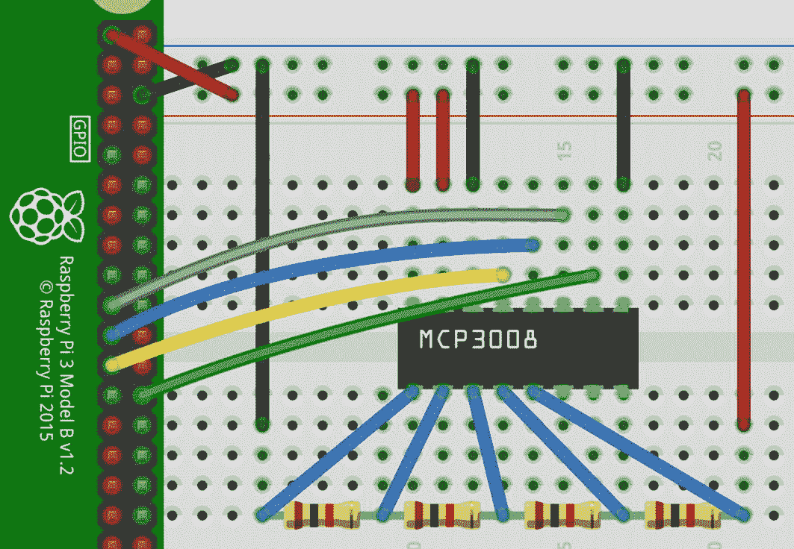

# 12.模数转换器

与一些竞争对手不同，Raspberry Pi 不提供真正的模拟 I/O。模拟输入特别有趣，因为物联网项目经常需要监控产生模拟信号的东西。在本章中，我们将为模数转换器(ADC)制作一个器件库。对于本书，我选择了 Microchip MCP3008，它是该公司制造的 ADC 大家族中的一员，原因如下:

*   它既便宜又容易获得。

*   它很容易使用(一旦你理解它)。

*   它使用 SPI 的方式与许多 SPI 器件不同。

在这一章中，我将介绍

*   发现 diozero 支持您的设备的乐趣！

*   用你的设备玩的好处，即使你已经有了一个库

## 了解设备

一如既往，你必须了解你的设备。您可以在 [`https://ww1.microchip.com/downloads/en/DeviceDoc/21295d.pdf`](https://ww1.microchip.com/downloads/en/DeviceDoc/21295d.pdf) 找到 Microchip MCP30008 数据手册。这表明该装置使用起来相对简单。以下是一些有趣的亮点:

*   它支持 8 个单端通道或 4 个伪差分对。

*   每次 SPI 交互只能转换一个通道。

*   它提供 10 位分辨率的值。所报告的值实际上是输入电压相对于参考电压的百分比。

*   最大 SPI 时钟频率取决于电源电压，范围从 5V 时的 3.6 MHz 到 2.7V 时的 1.35 MHz，假设为线性，对于 3.3V 电源，最大频率约为 1.9 MHz。

*   最大采样速率为 SPI 时钟频率除以 18。

*   您可以使用不同的方法从设备中读取值；参见数据手册的第 5.0 节和第 6.1 节。

## 查找设备库

为了找到要使用或移植的设备库，我将遵循第 [6](06.html) 章中概述的步骤。第一步是查看 diozero 设备库列表，但您可能找不到它。也就是说，搜索 diozero 文档，你会发现一个*扩展板*部分，其中有一个子部分*微芯片模数转换器*。该小节提到了相应的类(又名设备库)`com.diozero.devices.McpAdc`。该库支持 MCP3xxx 系列的几个成员，包括 MCP3008！

尽职调查要求您检查库以确保它满足您的需求。不赘述，单看`McpAdc` ( [`https://github.com/mattjlewis/diozero/blob/master/diozero-core/src/main/java/com/diozero/devices/McpAdc.java`](https://github.com/mattjlewis/diozero/blob/master/diozero-core/src/main/java/com/diozero/devices/McpAdc.java) )的实现，暴露的只是单端采集。如果这对您的项目来说足够了，您可以立即使用它。如果需要使用差分采集或定制 SPI 时钟频率(默认为电源电压为 2.7V 时的最大频率)，您必须创建自己的实施方案，当然，要从当前的实施方案开始。我应该指出，在内部，`McpAdc`确实支持差异获取。

Note

再一次，在我意识到 diozero 支持它之前，我选择了 MCP3008 在书中使用。同样，我认为 diozero 对该设备的支持主要归功于该设备家族的流行。

正如在第 [11](11.html) 章中讨论的 BME280 一样，在一个真实项目的背景下，你会继续前进。在本书的上下文中，为了完整起见，我将考虑如果我没有在 diozero 中找到支持会怎么样。事实证明，由于设备的普及，您可以找到多个设备库，这有助于您创建自己的设备库:

*   Adafruit 提供了一个针对树莓派( [`https://github.com/adafruit/Adafruit_CircuitPython_MCP3xxx`](https://github.com/adafruit/Adafruit_CircuitPython_MCP3xxx) )的 CircuitPython 库。

*   在 GitHub 上搜索会产生几个 Python 库，至少一个 JavaScript 库，一些 Android 库。确实是一个受欢迎的设备！

*   一个 Pi4J“测试程序”显示了如何使用该设备(参见 [`https://nealvs.wordpress.com/2016/02/19/pi4j-adc-mcp3008-spi-sensor-reader-example/`](https://nealvs.wordpress.com/2016/02/19/pi4j-adc-mcp3008-spi-sensor-reader-example/) )。

即使有所有可用的可能性，如果 diozero 不提供支持，MCP3008(及其家族中的许多产品)是如此简单，您最好从头开始。

## 使用 diozero McpAdc

演示一下`McpAdc`将会很有启发性。diozero 文档显示了一个例子，包括一个带有所有连接的图。我创建了一个更简单的测试环境。图 [12-1](#Fig1) 显示了 1kω电阻的级联和 MCP3008 通道 0–4 的测量点。


图 12-1

MCP3008 测试电阻级联

当然，您还必须将树莓派连接到 MCP3008。见图 [12-2](#Fig2) 。 <sup>[1](#Fn1)</sup> 首先，将 Pi +3.3V(例如，接头引脚 1)连接到 MCP3008 V <sub>DD</sub> 和 V <sub>REF</sub> 并将 Pi 地(例如，接头引脚 6)连接到 MCP3008 AGND 和 DGND。你应该用 Pi SPI 总线 0；将 Pi MOSI(插头插脚 19)连接到 MCP 3008D 中的<sub>，Pi MISO(插头插脚 21)连接到 MCP3008 D <sub>中的</sub>，Pi SCLK(插头插脚 23)连接到 MCP3008 CLK，Pi CE1(插头插脚 26)连接到 MCP3008 CS。您还必须将 MCP3008 通道连接到电阻级联，如图 [12-1](#Fig1) 所示。</sub>



图 12-2

Raspberry Pi 与 MCP3008 的连接

要开始使用测试应用程序，请创建一个新的 NetBeans 项目、包和类。在您的 Raspberry Pi 上配置用于远程开发的项目；并将项目配置为使用 diozero(更多细节参见第 [7](07.html) 章)。我将我的项目命名为 **MCP3008** ，我的包命名为`org.gaf.mcp.test`，我的类命名为`TestMcpAdc`，它是从 diozero 示例应用程序( [`https://github.com/mattjlewis/diozero/tree/master/diozero-sampleapps/src/main/java/com/diozero/sampleapps`](https://github.com/mattjlewis/diozero/tree/master/diozero-sampleapps/src/main/java/com/diozero/sampleapps) )中找到的 diozero `McpAdcTest`派生而来的。

清单 [12-1](#PC1) 显示了类别`TestMcpAdc`。该实现为 MCP3008 构建了一个`McpAdc`，指示使用 CE1 来选择器件，并将参考电压设置为 3.3V，然后读取通道 0–4 并打印结果。请注意，该应用遵循第 [7](07.html) 章中的安全网指南。

```java
package org.gaf.mcp.test;

import static com.diozero.api.SpiConstants.CE1;
import com.diozero.devices.McpAdc;
import com.diozero.devices.McpAdc.Type;
import com.diozero.util.Diozero;

public class TestMcpAdc {

    public static void main(String[] args) {
        try (McpAdc adc = new McpAdc(Type.MCP3008,
                CE1, 3.3f)) {
            for (int i = 0; i < 5; i++) {
                System.out.format("V%1d = %.2f FS%n",
                    i , adc.getValue(i));
            }
        } finally {
            Diozero.shutdown();
        }
    }
}

Listing 12-1TestMcpAdc

```

运行`TestMcpAdc`产生清单 [12-2](#PC2) 中所示的输出。考虑到电阻值的测量误差和精度，这是您应该预料到的。

```java
V0 = 0.00 FS
V1 = 0.25 FS
V2 = 0.50 FS
V3 = 0.75 FS
V4 = 1.00 FS

Listing 12-2Results from running TestMcpAdc

```

Caution

对于实际应用，有关模拟输入的缓冲和滤波，请参见数据手册的第 6.3 节。

## 玩 SPI

正如我前面提到的，MCP3008 提供了一个 SPI 与许多其它器件不同用法的例子。没有要写入的寄存器；只有 SPI 帧写入器件时产生的数据需要读取。这提供了另一个玩耍的机会！

仔细查看数据手册的第 5 和第 6 部分，会发现器件在起始位之后的第七个时钟开始返回有效数据位。有了这些信息，您就可以将起始位置于一组 SPI 帧中，以便根据您的需要优化有效数据的位置。在本节中，我们将研究从设备中检索数据的两种不同方法:

*   操作方式`McpAdc`(参见数据表第 5 节，尤其是图 5.1)。

*   数据表第 6.1 节中描述的方法，特别是图 6.1。

清单 [12-3](#PC3) 显示了类别`TestMCP`(在包装`org.gaf.mcp.test)`中)。假设通道输入如图 [12-1](#Fig1) 所示。一、看方法`getValueD`；它实现了数据手册第 5 节中的样本读取方法。第一条语句创建一个*代码*字节，其中*通道号*位于 3 个最低有效位，第 3 位为“1”以指示*单端*读取，第 4 位为*起始*位(a“1”)。下一条语句创建一个三字节数组，用于产生一个三帧 SPI 事务；第一个字节包含代码字节，第二个和第三个字节没有意义，但对于创建第二个和第三个 SPI 帧是必要的。来自`SpiDevice.writeAndRead`方法的响应包含三个字节。起始位的定位意味着第一个字节是垃圾，第二个字节包含 10 位样本值的八个最高有效位，第三个字节的两个最高有效位包含 10 位值的两个最低有效位。最后几行操作第二个和第三个字节来创建返回的 10 位值。

```java
package org.gaf.mcp.test;
import com.diozero.api.SpiConstants;
import com.diozero.api.SpiDevice;

public class TestMCP {

    private static SpiDevice device = null;

    public static void main(String[] args) {
        // use CE1; frequency = 1.35MHz
        device = SpiDevice.builder(SpiConstants.CE1).
                setFrequency(1_350_000).build();

        int[] value = new int[5];
        for  (int i = 0; i < 5; i++) {
            value[i] = getValueD(i);
        }
        for (int i = 0; i < 5; i++) {
            System.out.format(
                "C%1d = %4d, %.2f FS, %.2fV %n",
                i, value[i], getFS(value[i]),
                getVoltage(value[i], 3.3f));
        }
        device.close();
    }

    private static int getValueD(int channel) {
        // create start bit & channel code;
        // assume single-ended
        byte code = (byte) ((channel | 0x18));
        // first byte: start bit, single ended,
        // channel
        // second and third bytes create total
        // of 3 frames
        byte[] tx = {code, 0, 0};
        byte[] rx = device.writeAndRead(tx);

        int lsb = rx[2] & 0xf0;
        int msb = rx[1] << 8;
        int value = ((msb | lsb) >>> 4) & 0x3ff;

        return value;
    }

    private static int getValueM(int channel) {
        // create channel code; assume single-ended
        byte code = (byte) ((channel << 4) | 0x80);
        // first byte has start bit
        // second byte says single-ended, channel
        // third byte for creating third frame
        byte[] tx = {(byte)0x01, code, 0};
        byte[] rx = device.writeAndRead(tx);

        int lsb = rx[2] & 0xff;
        int msb = rx[1] & 0x03;
        int value = (msb << 8) | lsb;

        return value;
    } 

    private static float getFS(int value) {
        float fs = ((float)value / 1024f);
        return fs;
    }

    private static float getVoltage(int value,
        float vRef) {
        float voltage =
            ((float)value / 1024f) * vRef;
        return voltage;
    }
}

Listing 12-3TestMCP

```

接下来看方法`getValueM`；它实现了数据手册第 6.1 节中的样本读取方法。第一条语句创建一个*代码*字节，第 7 位为“1”以指示一个*单端*读取，第 4、5 和 6 位为*通道号*。下一条语句创建一个三字节数组，其中第一个字节包含最低有效位中的*起始*位，第二个字节包含代码字节，第三个字节无意义，但对于创建第三个 SPI 帧是必需的。来自`SpiDevice.writeAndRead`方法的响应包含三个字节。起始位的定位意味着第一个字节是垃圾，第二个字节的两个最低有效位包含 10 位样本值的两个最高有效位，第三个字节包含 10 位样本值的八个最低有效位。最后几行操作第二个和第三个字节来创建返回的 10 位值。

清单 [12-3](#PC3) 显示`TestMCP`构建了一个`SpiDevice`实例，该实例使用 CE1 进行器件选择，并将 SPI 时钟频率设置为 1.35 MHz(以确保其低于 3.3V 的最大频率)。注意，使用`SpiDevice.Builder`允许我们接受 SPI 控制器(0)和位顺序(MSB 优先)的所需默认值。然后使用`getValueD`读取通道 0–4。最后，它打印出原始值、满量程值(用于与`TestMcpAdc`比较)以及使用基准电压计算的电压。

运行`TestMCP`产生清单 [12-4](#PC4) 中所示的输出。满刻度结果看起来与运行`TestMcpAdc`的结果相同。这证明了`getValueD`的正确实施。

```java
C0 =    0, 0.00 FS, 0.00V
C1 =  254, 0.25 FS, 0.82V
C2 =  512, 0.50 FS, 1.65V
C3 =  767, 0.75 FS, 2.47V
C4 = 1023, 1.00 FS, 3.30V

Listing 12-4Results from TestMCP

```

为了好玩，在`TestMCP`中，将对`getValueD`的调用替换为对`getValueM`的调用，并再次运行`TestMCP`。您应该会看到与清单 [12-4](#PC4) 非常相似的结果。这很好，并且证实了对 MCP3008 使用 SPI 的方式的正确理解(并且有不止一种方法来剥一只猫的皮)。

Tip

在测试 MCP3008 期间，我最初使用 10kΩ电阻。当我移动传输字节中的起始位位置时，我收到了一个通道的不同值。这促使我们再次检查 MCP3008 数据手册。在第 4 节中，我发现了以下陈述:“较大的源阻抗会增加转换的失调、增益和积分线性误差。”我换成 1kω电阻；我开始通过一系列起始位位置获得一致的值。可惜，有时候，你一定要注意细节！

## 把玩耍变成现实

如果你想想清单 [12-3](#PC3) 中的`TestMCP`，你会意识到它基本上做了真实设备库会做的一切，只是非常非正式。因此，该剧超越了前几章中的核心实现。尽管没有必要，为什么不干脆创建一个 MCP3008 库呢？

当然，首先，我们需要在现有的 **MCP3008** 项目中创建一个包和类。我将调用包`org.gaf.mcp3008`和类`MCP3008`。

列表 [12-5](#PC5) 显示`MCP3008`。如你所料，这个类实现了`AutoCloseable`，因此有了一个`close`方法(参见第 [7](07.html) 章)。该类有两个构造器来模仿`McpAdc`。与`McpAdc`不同，它有三种方法来获取一个频道的信息:

*   `getRaw`为通道提供未处理的值。注意，它只是清单 [12-3](#PC3) 中`TestMCP`的`getValueM`的重命名副本。

*   `getFSFraction`提供一个通道的值，作为满量程的一部分。

*   `getVoltage`为一个通道提供电压。

```java
package org.gaf.mcp3008;

import com.diozero.api.RuntimeIOException;
import static com.diozero.api.SpiConstants.
    DEFAULT_SPI_CONTROLLER;
import com.diozero.api.SpiDevice;
import java.io.IOException;

public class MCP3008 implements AutoCloseable {

    private SpiDevice device = null;
    private final float vRef;

    public MCP3008(int chipSelect, float vRef)
            throws IOException {
        this(DEFAULT_SPI_CONTROLLER,
            chipSelect, vRef);
    }

    public MCP3008(int controller, int chipSelect,
            float vRef) throws IOException {
        try {
            device = SpiDevice.
                builder(chipSelect).
                setController(controller).
                setFrequency(1_350_000).build();
            this.vRef = vRef;
        } catch (RuntimeIOException ex) {
            throw new IOException(ex.getMessage());
        }
    }

    @Override
    public void close() {
        if (device != null) {
            device.close();
            device = null;
        }
    }

    public int getRaw(int channel)
            throws RuntimeIOException {
         // create channel code; assume single-ended
        byte code = (byte) ((channel << 4) | 0x80);
        // first byte has start bit
        // second byte says single-ended, channel
        // third byte for creating third frame
        byte[] tx = {(byte)0x01, code, 0};
        byte[] rx = device.writeAndRead(tx);

        int lsb = rx[2] & 0xff;
        int msb = rx[1] & 0x03;
        int value = (msb << 8) | lsb;
        return value;
    }

    public float getFSFraction(int channel)
            throws RuntimeIOException {
        int raw = getRaw(channel);
        float value = raw / (float) 1024;
        return value;
    }

    public float getVoltage(int channel)
            throws RuntimeIOException {
        return (getFSFraction(channel) * vRef);
    }
}

Listing 12-5MCP3008

```

为了测试，显然我们需要一个新的主类。我会调用我的`TestMCP3008`放在现有的包`org.gaf.mcp.test`里。清单 [12-6](#PC6) 显示了新的主类。它的基本结构是清单 [12-1](#PC1) 中`TestMcpAdc`的一个副本，但是格式化的输出使用了`MCP3008`中的所有三种数据访问方法；调用每个方法是低效的，因为设备被读取三次；但这不是真实的世界！

```java
package org.gaf.mcp.test;

import static com.diozero.api.SpiConstants.CE1;
import com.diozero.util.Diozero;
import java.io.IOException;
import org.gaf.mcp3008.MCP3008;

public class TestMCP3008 {

    public static void main(String[] args)
            throws IOException {
        try (MCP3008 adc = new MCP3008(CE1, 3.3f)) {
            for (int i = 0; i < 5; i++) {
            System.out.format("C%1d = %4d, %.2f FS,
                    %.2fV %n", i, adc.getRaw(i),
                    adc.getRelative(i),
                    adc.getVoltage(i));
            }
        } finally {
            Diozero.shutdown();
        }
    }
}

Listing 12-6TestMCP3008

```

运行`TestMCP3008`，你应该会看到一些现在熟悉的结果，如清单 [12-7](#PC7) 所示。成功！

```java
C0 =    2, 0.00 FS, 0.01V
C1 =  256, 0.25 FS, 0.82V
C2 =  512, 0.50 FS, 1.65V
C3 =  769, 0.75 FS, 2.48V
C4 = 1022, 1.00 FS, 3.30V

Listing 12-7Results from TestMCP3008

```

我不能声称`MCP3008`可以取代`McpAdc`，如果没有其他原因，它只适用于 MCP3008。前者也没有后者的复杂；例如，它没有继承 diozero 框架的大部分内容，也不支持伪差分采样。也就是说，如果`McpAdc`不存在，`MCP3008`将为许多项目服务。

## 摘要

在本章中，您学习了

*   你应该在 diozero 中彻底搜索你的设备的支持；可能是“躲”。

*   同样，有时您可以在 diozero 中找到一个现有的设备库，几乎不用做任何工作。

*   SPI 器件使用 SPI 的方式有很大不同。

*   有时候玩耍可以接近真正的代码。

*   魔鬼可以藏在细节里。

<aside aria-label="Footnotes" class="FootnoteSection" epub:type="footnotes">Footnotes [1](#Fn1_source)

图 [12-2](#Fig2) 是用熔块( [`https://fritzing.org`](https://fritzing.org) )制作的。

 </aside>