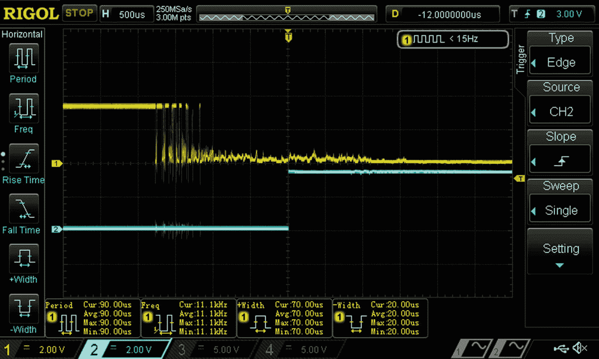
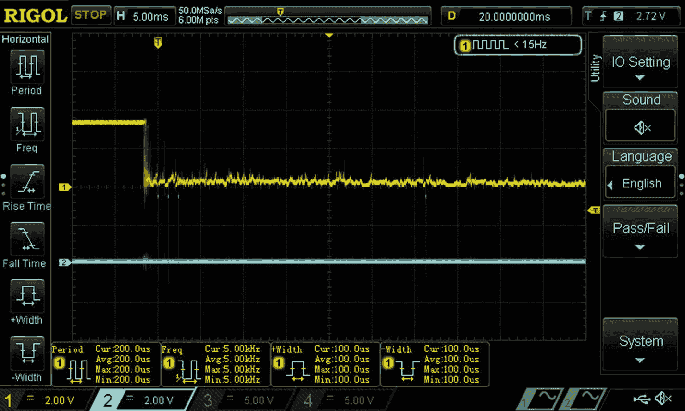

# 十四、一个项目

在这一章中，我们将研究一个需要*多个设备*的*项目*，而不是关注一个*单个设备*。我选择的项目是你可能认为的“世界上最荒谬的节拍器”虽然它并不是非常雄心勃勃，但我认为它说明了完成一个项目必须采取的步骤，这个项目涉及大多数机器人项目和一些物联网项目中典型的机械、电子和软件组件。

在这一章中，我将介绍

*   确定项目需求

*   为项目选择设备

*   用这些设备做实验

*   把所有东西放在一起

## 节拍器

在您能够识别项目需求之前，您必须定义项目。节拍器是什么？用最简单的话来说，节拍器来回挥动“魔杖”。要实现它，您可以简单地在两个已知点之间波动，其中一个必须是手动建立的起点；但那有点无聊。一个更有趣的方法是让魔杖从任意位置开始，检测两个已知点，然后挥动。让我们用有趣的方法。

因此，我们现在必须围绕节拍器的基本元素做出一些设计决策。我们如何

*   移动魔杖？

*   检测已知点？

在这本书里，我们讨论了两种移动东西的装置:DC 汽车的 RoboClaw(第 [8](08.html) 章)和步进电机的 SilentStepStick(第 [13](13.html) 章)。在这一点上，任何一个都可以满足节拍器。<sup>T5 1T7】</sup>

我们在本书中没有讨论任何检测节拍器所需的位置或存在的设备。我首先想到的两个设备是光电探测器和限位开关，可能是因为我在过去的项目中使用过这两种设备。也就是说，我在写作时只有“崩溃”(又名极限)开关可用，所以我使用了它们(见 [`www.dfrobot.com/product-762.html`](http://www.dfrobot.com/product-762.html) 和 [`www.dfrobot.com/product-763.html`](http://www.dfrobot.com/product-763.html) )。

## 构造设计

现在我们知道，我们可以使用两种电机类型中的一种来来回移动棒，并且我们将使用限位开关来检测棒何时到达两个已知点。这导致了一些机械设计问题。我们如何

*   将棒安装到马达上？

*   对齐棒和开关，以便棒激活开关来建立已知点？

在 3D 打印时代，你可能会决定设计和 3D 打印定制零件，以构建适当的机械结构。然而，在写作的时候，我碰巧收集了一些以前项目中的机器人部件(见 [`www.servocity.com`](http://www.servocity.com) )。他们允许我用标准零件快速设计和建造一个机械结构。

基于我当时拥有的零件，我不得不使用步进电机，而不是 DC 电机。考虑到这个限制，我用 Fusion360 为节拍器做了一个初步的机械设计(见 [`www.autodesk.com/products/fusion-360`](http://www.autodesk.com/products/fusion-360) )。图 [14-1](#Fig1) 显示了机械设计的主要元素。


图 14-1

节拍器机械设计

本设计使用了以下动作机器人部件: <sup>[2](#Fn2)</sup> 其中一些部件在图 [14-1](#Fig1) 中看不到:

*   585444 (2x): 5 孔 U 型槽；用于基础结构支撑

*   555156: NEMA 14 步进电机安装；将电机连接到 U 形槽

*   634076: 2.75˝ x ˝ D 轴；杆的驱动轴

*   535198 (2x):法兰滚珠轴承；轴支架

*   625302 (2x):固定螺钉套环；将轴锁定到位

*   633104 (2x):塑料垫片；减少轴旋转过程中的摩擦

*   585412: 13 孔梁；*魔杖*

*   545548:固定螺丝轮毂；将横梁连接到轴上

有两个重要部分是 ServoCity 没有的。首先是步进电机本身。第二个是一个灵活的连接器 <sup>[3](#Fn3)</sup> 以适应五毫米电机轴到˝机器人驱动轴。幸运的是，我有以前项目中的那些部分；你可以使用任何合理的步进电机和相应的耦合器。

还需要建筑

*   M3 螺丝(4x):将步进电机安装到支架上

*   ˝ 6-32 桁架头螺钉(4x):将底座固定到 u 形槽上

*   5/16˝ 6-32 螺钉(4x):将 u 形槽连接到 u 形槽

*   6-32 螺母(4x):将 U 形槽连接到 U 形槽上

如你所知，Actobotics 零件使用英制测量系统。开关使用公制，所以我不能使用 Actobotics 零件来安装限位开关。我碰巧有一些 M3 支架和螺丝，并能够使用它们将开关安装在可接受的位置。

图 [14-2](#Fig2) 显示节拍器的机械实现，包括安装的开关。你可能会注意到数字 [14-1](#Fig1) 和 [14-2](#Fig2) 之间的细微差别。我发现，为了确保棒接触开关，我必须把塑料垫片之间的棒和固定螺丝枢纽。


图 14-2

节拍器机械实现

本着诚实的精神，我承认图 [14-2](#Fig2) 中的结构并不理想，因为它容易受到机械损伤。这些开关的设计使得物体可以通过，关闭开关，并继续通过，而不会损坏开关。不幸的是，我没有零件来安装开关的位置，使该行为。如果你检查开关的位置，你会发现棒直接向开关移动，如果它继续移动，它会碰到开关体，有可能会打破什么东西！不幸的机械设计限制要求在软件设计和测试中格外小心。

## 电子设计

显然，我们将使用一个树莓派来为节拍器提供总体控制。选择步进电机来驱动节拍器意味着我们使用第 [13 章](13.html)中的静音步进棒来驱动电机；这需要 Pi 上有三个 GPIO 引脚。我们有两个限位开关，每个都必须由 Pi 监控；每个都需要一个 GPIO 引脚。

我们可以从第[章复制第 13 章](13.html)

*   从步进电机到静音步进杆的连接

*   从静音踏板到 Pi 的电源和信号连接

*   静音踏板的电机电源连接

*   静音步进微步配置

限位/碰撞开关比大多数开关稍微复杂一些(示意图见 [`http://image.dfrobot.com/image/data/SEN0138-L/Crash%20sensor%20Sch.pdf`](http://image.dfrobot.com/image/data/SEN0138-L/Crash%252520sensor%252520Sch.pdf) )。这些开关通常是打开的，有一个内置的上拉电阻和一个 LED，当开关关闭时，LED 会亮起。因此，每个开关都需要连接到电源(为了 Pi 安全，我使用了 3.3V 而不是 5V)、地和 GPIO 引脚，以检测开关何时闭合。

## 软件设计

这一章和前面几章有所不同。我们没有创建*设备库*；相反，我们正在创建一个完整的*项目*。因此，我们的主要目标是创建一个 Java *应用程序*，而不是 Java *库*。到目前为止，您应该还记得使用 diozero 开发库的设置。开发应用程序略有不同(参见第 [5 章](05.html))。在本例中，您创建了一个新项目(我将把我的项目称为 **Metronome** )、一个包(`org.gaf.metronome`)和一个新的主类(`Metronome`)。

我们在上一节中已经确定，我们将通过第 [13 章](13.html)中的库来使用 SilentStepStick。但是开关呢？我们如何尽快检测到开关闭合，从而将崩溃的可能性降至最低？检查 diozero Javadoc，在撰写本文时唯一的候选是`DigitalInputDevice`。参见第[章第 7](07.html) 。

仔细观察`DigitalInputDevice`的功能，似乎有三种方法可以检测开关闭合:

*   `waitForActive`:等待直到 GPIO 引脚检测到活动状态，对于常开开关，该状态为*低*

*   `whenActivated`:每当 GPIO 引脚检测到活动状态时，调用一个“中断处理程序”

*   `addListener`:每当 GPIO 引脚检测到所需边沿时，调用一个“中断处理程序”，对于常开开关，该边沿将是*下降*

在多设备项目中，通常需要单独测试每个设备，然后测试组合。实际上，我们在第 [13 章](13.html)中对 SilentStepStick 和它的库做了很多测试。作为交换机测试的一部分，最好测试所有三种方法，以确定哪一种检测速度最快。这听起来像玩(和乐趣)给我！

## 项目组件测试

如前所述，我们已经测试了 SilentStepStick，但我们确实需要测试开关。为此，我将在 **Metronome** 中创建另一个名为`org.gaf.metronome.test`的包来包含测试程序。

### 测试 waitForActive

我们将首先使用程序`TestWait`测试`waitForActive`，如清单 [14-1](#PC1) 所示。想法是使用`waitForActive`检测开关闭合，并使用`DigitalOutputDevice`产生一个脉冲。理论上，这允许我们测量开关闭合和能够对此采取措施之间的延迟。在第 9 章中，我们使用了`whenActivated`来捕捉中断，并在第一次和可能的第二次中断时经历了一些异常的时序。因此，`TestWait`多次练习`waitForActive`以查看是否出现相同的定时异常。

由于`DigitalOutputDevice`使用的线程，`TestWait`启用了 try-with-resources 和 diozero 安全网。参见第七章。

```java
package org.gaf.metronome.test;

import com.diozero.api.DigitalInputDevice;
import com.diozero.api.DigitalOutputDevice;
import com.diozero.api.GpioPullUpDown;
import com.diozero.util.Diozero;

public class TestWait {

    public static void main(String[] args)
            throws InterruptedException {
        try (
            DigitalInputDevice did =
                DigitalInputDevice.Builder.
                builder(20).
                setPullUpDown(GpioPullUpDown.NONE).
                setActiveHigh(false).build();
            DigitalOutputDevice dod =
                new DigitalOutputDevice(21,
                true, false)) {

            int num = 3;
            for (int i = 0; i < num; i++) {

                System.out.println("Waiting ...");
                boolean status =
                    did.waitForActive(5000);
                dod.on();
                if (status) {
                    System.out.println("Got it");
                }
                Thread.sleep(5);
                dod.off();

                System.out.println("Killing time");
                if (i < (num - 1))
                    Thread.sleep(4000);
            }
            System.out.println("Done");
        } finally {
            Diozero.shutdown();
        }
    }
}

Listing 14-1TestWait

```

正如你在清单 [14-1](#PC1) 中看到的，`TestWait`循环。每次迭代等待开关闭合，然后产生一个脉冲。然后它“消磨一些时间”让你为新的开关闭合做准备。

图 [14-3](#Fig3) 显示了我的示波器捕捉到的三个开关闭合的*第一个*的结果。顶部走线显示监控开关的 GPIO 引脚。底部轨迹显示产生输出脉冲的 GPIO 引脚。可以看到，从开关信号的第一个可见边沿到脉冲前沿的时间约为 1.8 毫秒。



图 14-3

测试等待第一次中断

你也可以在图 [14-3](#Fig3) 中看到处理机械开关的可悲现实。开关触点会“跳动”一会儿，但最终会稳定下来。这是机械开关的一个经典问题——开关*何时真正被激活？对于我使用的开关，反弹周期似乎在 500 微秒和几毫秒之间，取决于树莓派GPIO 用来定义低电平和高电平的电压，以及电压必须稳定多长时间。也就是说，去抖周期的常见期望值是 50 毫秒。*

Tip

如图 [14-3](#Fig3) 所示，机械开关“弹跳”你可以在网上找到很多关于这个主题的信息。下面的参考文献提供了一些关于为什么开关会反弹、其含义以及如何处理反弹的见解: [`www.labbookpages.co.uk/electronics/debounce.html`](http://www.labbookpages.co.uk/electronics/debounce.html) 、 [`www.allaboutcircuits.com/technical-articles/switch-bounce-how-to-deal-with-it/`](http://www.allaboutcircuits.com/technical-articles/switch-bounce-how-to-deal-with-it/) 和 [`www.eejournal.com/article/ultimate-guide-to-switch-debounce-part-9`](http://www.eejournal.com/article/ultimate-guide-to-switch-debounce-part-9) 。diozero 包括`com.diozero.api.DebouncedDigitalDevice`，它成功地去抖了我测试的一些开关，但没有其他的(例如，本章中的开关)。您应该准备好测试您的开关，甚至实现您自己的去抖方法。

图 [14-4](#Fig4) 显示了三个开关闭合的*第三个*的结果。可以看到，从开关信号的第一个可见边沿到脉冲的前沿的时间约为 800 微秒。这是一个明显的进步。我推测这种差异是由于 JVM 类加载和可能的 JITC <sup>[4](#Fn4)</sup> 完成。


图 14-4

TestWait 第三次中断

### 激活时测试

现在我们将使用程序`TestWhen`测试`whenActivated`，如清单 [14-2](#PC2) 所示。`TestWhen`与`TestWait`截然不同。如第 [9](09.html) 章所述，我们必须创建一个“中断处理程序”(方法`when`)来捕捉开关产生的中断，当然也要使用`whenActivated`来识别中断处理程序。中断处理器产生脉冲，并记录开关闭合产生的事件数。

```java
package org.gaf.metronome.test;

import com.diozero.api.DigitalInputDevice;
import com.diozero.api.DigitalOutputDevice;
import com.diozero.api.GpioPullUpDown;
import com.diozero.util.Diozero;

public class TestWhen {

    private static int cnt;
    private static DigitalOutputDevice dodP;

    public static void main(String[] args)
             throws InterruptedException {
        try (
            DigitalInputDevice did =
                DigitalInputDevice.
                Builder.builder(20).
                setPullUpDown(GpioPullUpDown.NONE).
                setActiveHigh(false).build();
            DigitalOutputDevice dod =
                new DigitalOutputDevice(21,
                true, false)) {

            did.whenActivated(TestWhen::when);

            dodP = dod;

            cnt = 0;

            System.out.println("Waiting ...");
            Thread.sleep(10000);

            System.out.println("Count = " + cnt);
        } finally {
            Diozero.shutdown();
        }
    }

    private static void when(long ts) {
        cnt++;
        dodP.on();
        dodP.off();
    }
}

Listing 14-2TestWhen

```

图 [14-5](#Fig5) 显示了运行`TestWhen`的结果。范围跟踪显示了一些有趣的方面:



图 14-5

测试结果

*   开关闭合在左侧；由于示波器的水平刻度，跳动几乎检测不到。

*   第一个脉冲出现在开关闭合后大约两毫秒。

*   从*一个*开关闭合产生*四个*脉冲；有一组三个，包括第一个，在开关闭合后约 2 毫秒开始，间隔约 2 毫秒；四个中的最后一个距离开关闭合大约 34 毫秒。

从根本上说，结果很好地证明了开关弹跳的影响。本着充分披露的精神，在测试期间，`TestWhen`打印的脉冲计数范围从 1 到 12，4 是最常见的。

底线:我断言`whenActivated`在开关闭合之间的延迟和采取行动的能力方面和`waitForActive`一样好。然而，`whenActivated`可能会更难使用，因为来自开关反弹的多个事件。

### addListener 测试

现在我们将使用程序`TestListen`测试`addListener`，如清单 [14-3](#PC3) 所示。`TestListen`和`TestWhen`几乎一样，当然是用`addListener`代替`whenActivated`。

```java
package org.gaf.metronome.test;

import com.diozero.api.DigitalInputDevice;
import com.diozero.api.DigitalInputEvent;
import com.diozero.api.DigitalOutputDevice;
import com.diozero.api.GpioEventTrigger;
import com.diozero.api.GpioPullUpDown;
import com.diozero.util.Diozero;

public class TestListen {

    private static int cnt;
    private static DigitalOutputDevice dodP;

    public static void main(String[] args)
            throws InterruptedException {
        try (
            DigitalInputDevice did =
                DigitalInputDevice.Builder.
                builder(20).
                setPullUpDown(GpioPullUpDown.NONE).
                setActiveHigh(false).
                setTrigger(
                GpioEventTrigger.FALLING).build();
            DigitalOutputDevice dod =
                new DigitalOutputDevice(21,
                true, false)) {

            did.addListener(TestListen::listen);

            dodP = dod;

            cnt = 0;

            System.out.println("Waiting ...");
            Thread.sleep(10000);

            System.out.println("Count = " + cnt);
        } finally {
            Diozero.shutdown();
        }
    }

    private static void listen(
            DigitalInputEvent event) {
        cnt++;
        dodP.on();
        dodP.off();
    }
}

Listing 14-3TestListen

```

我运行了`TestListen`，观察到了与`TestWhen`完全不同的结果。产生的第一个输出脉冲总是在第一次开关闭合脉冲串之后 15 毫秒左右。然而，关闭次数大致相同。我断言`addListener`没有`waitForActive`好，因为有更长的延迟和来自开关反弹的多个事件。

看来`waitForActive`或`whenActivated`都可以很好地尽快检测开关闭合。`waitForActive`似乎更容易使用一点，所以我们就用它。现在我们可以随着`Metronome`的发展向前迈进了。

Caution

在第 [9](09.html) 章以及本章中，我们遇到了异常的 GPIO 时序。理解使用树莓派OS 和 Java 构建的系统的局限性是很重要的。树莓派操作系统*是一个多任务操作系统*，而*不是一个实时操作系统*。这些特点限制了产生输出和对输入作出反应的及时性。Java 虚拟机的一些特性，如惰性类加载、垃圾收集和实时编译，会加剧树莓派操作系统的局限性。在大多数情况下，这些限制不会导致问题，但是您必须始终认识到这些限制的存在。在某些情况下，绕过它们很容易，就像第 [9](09.html) 章一样。在某些情况下，你可能不得不简单地接受它们，就像在本章中一样。在极端实时需求的情况下，您可能必须将一些任务卸载给能够更好地适应实时需求的子系统，如第 [8](08.html) 章和第 [10](10.html) 章。

## 节拍器发展

基于本章前面粗略定义的目标，我们知道我们需要`SilentStepStick`来驱动步进电机。要使它在 **Metronome** 项目中可用，您必须将 **SSS** 项目添加到 **Metronome** classpath 属性中；参见第 [5 章](05.html)。我们也知道我们需要一个`DigitalInputDevice`用于每个开关。上一节的结论是，我们应该使用`waitForActive`来检测开关闭合。

此外，我们可以从`TestSSS1`(清单 [13-5](13.html#PC5) )和`TestWait`(清单 [14-1](#PC1) )中复制代码片段来播种`Metronome`开发。清单 [14-4](#PC4) 显示了`Metronome`的初始框架。它使用第 [13 章](13.html)中的参数创建了一个`SilentStepStick`的实例，并使用清单 [14-1](#PC1) 中的参数创建了一个`DigitalInputDevice`的实例，用于当棒顺时针(`swCW`)和逆时针(`swCCW`)移动时遇到的开关。从清单中可以看出，这个框架除了启用 try-with-resources 和 diozero 安全网，以及 Java shutdown 安全网之外，不做任何其他事情；`Metronome`启用后者，因为步进器可能会继续运行，并在非正常终止的情况下将棒撞向开关。

```java
package org.gaf.metronome;

import com.diozero.api.DigitalInputDevice;
import com.diozero.api.GpioPullUpDown;
import com.diozero.util.Diozero;
import java.io.IOException;
import org.gaf.sss.SilentStepStick;

public class Metronome {

    public static void main(String[] args)
            throws IOException {
        try (
            SilentStepStick stepper =
                new SilentStepStick(4, 27, 17, 200,
                SilentStepStick.Resolution.Quarter);
            DigitalInputDevice swCW =
                DigitalInputDevice.Builder.
                builder(20).
                setPullUpDown(GpioPullUpDown.NONE).
                setActiveHigh(false).build();
            DigitalInputDevice swCCW =
                DigitalInputDevice.Builder.
                builder(21).
                setPullUpDown(GpioPullUpDown.NONE).
                setActiveHigh(false).build()
            ) {

            // engage Java shutdown safety net
            Diozero.registerForShutdown(stepper);

        } finally {
            Diozero.shutdown();
        }
    }
}

Listing 14-4Metronome skeleton

```

我们现在将迭代开发`Metronome`，添加功能和测试，添加功能和测试，等等。首先要添加的是检测两个开关闭合的能力。展望未来，我们可能应该假设你必须在运行程序之前手动定位魔杖，这样它就不会在运行程序之前关闭开关。此外，等待一切准备就绪的信号可能是个好主意。

清单 [14-5](#PC5) 显示了开关测试实现的代码片段；它被放在清单 [14-4](#PC4) 中的`finally`语句之前。当您首先关闭顺时针开关，然后关闭逆时针开关时，运行这个版本的`Metronome`会在清单的底部产生输出。如果你看到了，那就成功了！

```java
// wait for start
System.out.println(
    "Waiting to start .... Press CW switch.");
boolean status = swCW.waitForActive(10000);
if (status) {
    System.out.println("Starting");
} else {
    System.out.println("Failure to start!");
    System.exit(1);
}

// check for CCW
System.out.println(
    "Waiting for CCW .... Press CCW switch.");
status = swCCW.waitForActive(10000);
if (status) System.out.println("Got CCW");

Output ------------------------

Waiting to start .... Press CW switch.
Starting
Waiting for CCW .... Press CCW switch.
Got CCW

Listing 14-5Metronome switch test

```

接下来，我们可以尝试顺时针和逆时针慢慢运行步进电机，随着开关被按下而改变方向。清单 [14-6](#PC6) 显示了修改后的`Metronome`。等待启动开关后，我们首先启用步进器，然后开始以 1 RPM 的速度顺时针移动。此时，我们等待顺时针开关关闭，并在它关闭时停止步进器。然后，我们开始以 1 RPM 的速度逆时针移动步进器，等待逆时针开关关闭，并在关闭时停止步进器。

```java
// wait for start
System.out.println("Waiting to start .... Press CW switch.");
boolean status = swCW.waitForActive(10000);
if (status) {
    System.out.println("Starting");
} else {
    System.out.println("Failure to start!");
    System.exit(1);
}
// make sure switch not bouncing
Thread.sleep(100);

// run to CW switch
stepper.enable(true);
System.out.println("Run CW");
stepper.run(SilentStepStick.Direction.CW, 1f);
System.out.println("Waiting to hit switch ...");
status = swCW.waitForActive(20000);
stepper.stop();
if (status) {
    System.out.println("Got it");
} else {
    System.out.println("Motor not running");
    System.exit(1);
}

// run to CCW switch
System.out.println("Run CCW");
stepper.run(SilentStepStick.Direction.CCW, 1f);
System.out.println("Waiting to hit switch ...");
status = swCCW.waitForActive(20000);
stepper.stop();
if (status) {
    System.out.println("Got it");
} else {
    System.out.println("Motor not running");
    System.exit(1);
}

stepper.enable(false);

Listing 14-6Metronome motor test

```

为了测试`Metronome`，现在你显然必须将静音杆连接到树莓派、步进电机和电机电源(参见第 [13 章](13.html))。我建议第一次测试不带魔杖，以防止任何不愉快的意外；当然，你必须自己点击开关来模拟魔杖的运动。一旦你按下顺时针开关启动，电机应顺时针旋转，并应继续这样做，直到你按下顺时针开关。然后，电机应停止并开始逆时针旋转，并应继续这样做，直到你按下逆时针开关。那么马达应该停止。如果看到这种行为，宣告成功！

假设手动测试有效，连接棒并再次运行`Metronome`。一旦你按下启动开关，魔杖应该顺时针旋转，并应该继续这样做，直到它按下顺时针开关。然后，棒应该停止并开始逆时针旋转，并应该继续这样做，直到它碰到逆时针开关。然后魔杖应该停下来。如果看到这种行为，再次宣告成功！

## 超越最初的要求

现在，创建本章前面描述的节拍器行为的所有部分都已就绪。将驱动步进器和测试开关的代码段放在一个循环中，使棒在开关之间摆动，这是非常简单的。然而，我认为在没有 T2 按下开关的情况下挥动 T1 会有趣得多。这是可能的，因为`SilentStepStick`可以移动请求的步数，并且可以报告它已经走了多少步，无论它如何移动。

我们现在需要做更多的设计。首先看图 [14-6](#Fig6) ，图中显示了当关闭*顺时针*开关时，棒的位置；该*顺时针关闭*位置(CWC)由穿过棒的*实线*标记。左侧的*实线*表示*逆时针关闭*位置(CCWC)。


图 14-6

开关闭合时的棒位置

在清单 [14-6](#PC6) 的`Metronome`版本中，魔杖首先从任意起始位置移动到 CWC。我们不在乎要走多少步。然后魔杖从 CWC 移到了 CCWC。这需要一些步骤，在图 [14-6](#Fig6) 中标为 Sw2Sw。因此，Sw2Sw 是将魔杖从 CWC 移动到 CCWC，或者从开关闭合到开关闭合的步数。但是我们想在不关闭开关的情况下来回移动棒*。我们应该能够通过移动更少的步骤来实现这一点，也就是说，在图中的点划线之间；那些虚线代表一个*顺时针非闭合*位置(CWN)和一个*逆时针非闭合*位置(CCWN)。基本上，我们需要在开关闭合位置(如 CWC)和开关非闭合位置(如 CWN)之间定义一个缓冲步数(图中的“B”)。有了这些概念，我们就可以确定从*

*   CWC 到 CCWC = Sw2Sw

*   CCWC 到 CWN = Sw2Sw–B

*   CWN 到 CCWN(图 [14-6](#Fig6) 中的“标称”)= Sw2Sw-(2 x B)

*   CCWN 到 CWN = Sw2Sw-(2 x B)

*   CWN 到“中间”=(Sw2Sw/2)–B

清单 [14-7](#PC7) 显示了对`Metronome`的更新，以实现新的目标，来回挥动而不触及开关，然后将魔杖位置留在 CCWN 和 CWN 之间的“中间”。所示代码必须插入清单 [14-6](#PC6) ( `stepper.enable(false)`)的最后一条语句之前。

```java
// get step count; calculate moves
int sw2sw = stepper.getStepCount();
System.out.println("Step Count = " + sw2sw);
int buffer = 15;
int first = sw2sw - buffer;
int nominal = sw2sw - (2 * buffer);
int middle = sw2sw/2 - buffer;

// move to CW
stepper.stepCount(first,
    SilentStepStick.Direction.CW, 4f, false, null);

// move back and forth
for (int i = 0; i < 4; i++) {
    // move to CCW
    stepper.stepCount(nominal,
            SilentStepStick.Direction.CCW, 4f,
            false, null);
    // move to CW
    stepper.stepCount(nominal,
            SilentStepStick.Direction.CW, 4f,
            false, null);
}

// move to middle
stepper.stepCount(middle,
         SilentStepStick.Direction.CCW, 4f,
         false, null);

Listing 14-7Metronome final snippet

```

关于更新的几个有趣的点:

*   在搜索开关期间，摆动期间的所有步进运动以 *4* RPM 运行，而不是以 *1* RPM 运行。没有理由要谨慎，因为魔杖不会碰到开关！

*   我选择了任意数量的波周期。你当然可以参数化它，或者让它无限，也许当你按下开关时终止。

*   我觉得结束后把魔杖留在波动区域的中间很有趣，但是你可以在任何地方停止它。

如果您运行`Metronome`更新，您应该看到现在熟悉的顺时针缓慢旋转关闭 CW 开关，然后逆时针缓慢旋转关闭 CCW 开关。然后你应该看到快速移动顺时针移动，接着快速移动逆时针然后顺时针移动四个周期，最后逆时针快速移动到波区域的中间。恭喜你！

Note

如果你想看到节拍器的动作，你可以在书中的代码库中观看视频。

## 更接近真实的世界

除了最初的要求，还有另一种方法。在之前的实现中(清单 [14-6](#PC6) 和 [14-7](#PC7) )，我们使用限位开关来校准魔杖的移动，因此魔杖在挥动时不会激活开关。在现实世界中，我们还会使用限位开关来防止由于各种原因可能发生的崩溃，例如，糟糕的编码或机械问题。

我们该怎么做？我们必须在控制步进机的同时监控开关。基于我们在本章前面所做的测试，我们不能在`DigitalInputDevice`上使用`waitForActive`方法，因为它阻止我们做任何其他事情。然而，这些测试表明，`whenActivated`将是在做其他事情的同时监控开关的好选择。开关激活时调用的相关中断处理程序可以停止步进器。但是你可以在清单 [14-7](#PC7) 中看到有几个启动步进器的语句，所以我们必须防止在步进器停止后再次启动它。我们可以使用一个`AtomicBoolean`来同步一切(更多信息请参见清单 13-10)。

清单 [14-8](#PC8) 显示了检测崩溃所需的修改(我省略了导入语句)。您可以看到第一个实现的以下不同之处:

*   上市初期:声明的`AtomicBoolean`叫做`emergency`。

*   在清单的最后:中断处理程序`limitHit`，当一个开关被激活时，它停止步进器并设置`emergency`为真。

*   在有意按下两个开关后顺时针移动:设置`limitHit`以便在任一开关被激活时调用。

*   最后，挥动发生的地方:每个动作都受到`emergency`的检查。

```java
public class Metronome {

    private static SilentStepStick eStop;
    private static final AtomicBoolean emergency =
           new AtomicBoolean(false);

    public static void main(String[] args)
            throws IOException,InterruptedException {
        try (
            SilentStepStick stepper =
                new SilentStepStick(4, 27, 17, 200,
                SilentStepStick.Resolution.Quarter);
            DigitalInputDevice swCW =
                DigitalInputDevice.Builder.
                builder(20).
                setPullUpDown(GpioPullUpDown.NONE).
                setActiveHigh(false).build();
            DigitalInputDevice swCCW =
                DigitalInputDevice.Builder.
                builder(21).
                setPullUpDown(GpioPullUpDown.NONE).
                setActiveHigh(false).build()
            ) {

            // set up for emergency stop
            eStop = stepper;

            // engage Java shutdown safety net
            Diozero.registerForShutdown(stepper);

            // wait for start
            System.out.println(

                "Waiting to start ....
                Press CW switch.");
            boolean status =
                swCW.waitForActive(10000);
            if (status) {
                System.out.println("Starting");
            } else {
                System.out.println(
                    "Failure to start!");
                System.exit(1);
            }
            // make sure switch not bouncing
            Thread.sleep(100);

            // run to CW switch
            stepper.enable(true);
            System.out.println("Run CW");
            stepper.run(SilentStepStick.Direction.
                CW, 1f);
            System.out.println(
                "Waiting to hit switch ...");
            status = swCW.waitForActive(20000);
            stepper.stop();
            if (status) {
                System.out.println("Got it");
            } else {
                System.out.println(
                    "Motor not running");
                System.exit(1);
            }

            // run to CCW switch
            System.out.println("Run CCW");
            stepper.run(
                SilentStepStick.Direction.CCW, 1f);
            System.out.println("Waiting to
                hit switch ...");
            status = swCCW.waitForActive(20000);
            stepper.stop();
            if (status) {
                System.out.println("Got it");
            } else {
                System.out.println(
                    "Motor not running");
                System.exit(1);
            }

            // get step count; calculate moves
            int sw2sw = stepper.getStepCount();
            System.out.println(
                "Step Count = " + sw2sw);
            int buffer = 15;
            int first = sw2sw - buffer;
            int nominal = sw2sw - (2 * buffer);
            int middle = sw2sw/2 - buffer;

            // move to CW
            stepper.stepCount(first,
                    SilentStepStick.Direction.CW, 4f,
                    false, null);

            // set up limit switches for emergency
            swCW.whenActivated(Metronome::limitHit);
            swCCW.whenActivated(Metronome::limitHit);

            // move back and forth
            for (int i = 0; i < 4; i++) {
                // move to CCW
                stepper.stepCount(nominal,
                    SilentStepStick.Direction.CCW,
                    4f, false, null);
                if (emergency.get()) break;
                // move to CW
                stepper.stepCount(nominal,
                    SilentStepStick.Direction.CW,
                    4f, false, null);
                if (emergency.get()) break;
            }

            // move to middle
            if (!emergency.get())
                stepper.stepCount(middle,
                   SilentStepStick.Direction.CCW, 4f,
                   false, null);

            stepper.enable(false);
        } finally {
            Diozero.shutdown();
        }
    }

    private static void limitHit(long ts) {
        emergency.set(true);
        eStop.stop();
    }
}

Listing 14-8Metronome with crash detection

```

如果运行更新后的`Metronome`，应该会看到之前版本的行为。但是如果你在魔杖挥动的时候按下任何一个开关，步进器就会停止，并且`Metronome`终止。再次恭喜！

## 摘要

在本章中，您已经学会了如何

*   分析项目并确定需求

*   确定实施项目的合适设备

*   尝试设备以选择正确的用法

*   发展项目需求以充分利用设备功能

我希望您喜欢这个“把所有东西放在一起”的练习，这个练习是使用 diozero 定义和实现一个完整的项目。

<aside aria-label="Footnotes" class="FootnoteSection" epub:type="footnotes">Footnotes [1](#Fn1_source)

一个有吸引力的选择是伺服系统；然而，本书中提到的伺服系统是由第 [10 章](10.html)中的激光雷达单元封装的，并且没有连接到树莓派。

  [2](#Fn2_source)

您可以从 [`www.servocity.com/step-files/`](http://www.servocity.com/step-files/) 获得绝大多数 Actobotics 零件的 STEP 文件，并在 3D CAD 程序中使用它们。

  [3](#Fn3_source)

柔性耦合器减少了由于电机轴和驱动轴之间的不对准而导致的机械应变。

  [4](#Fn4_source)

JITC 是实时编译器，是 JVM 的一部分。

 </aside>