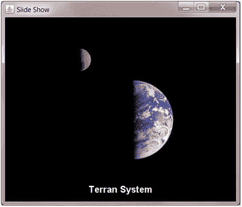

# 摆动穿线

Electronic supplementary material The online version of this chapter (doi:[10.​1007/​978-1-4842-1700-9_​10](http://dx.doi.org/10.1007/978-1-4842-1700-9_10)) contains supplementary material, which is available to authorized users.

Swing 是一个独立于平台的、[基于模型-视图-控制器](https://en.wikipedia.org/wiki/Model-View-Controller#Model-View-Controller)的 [GUI](https://en.wikipedia.org/wiki/GUI#GUI) 工具包，用于创建 Java 应用程序的图形前端。在本附录中，我首先探索 Swing 的线程架构，然后探索 Swing APIs，以避免在图形环境中使用额外线程时出现问题。最后，我将展示一个基于 Swing 的幻灯片放映应用程序，作为本附录内容的一个重要示例，并作为本书的一个有趣结尾。

Note

我假设您对 Swing APIs 以及 Swing 应用程序的架构有一些经验。

## 单线程[编程模型](https://en.wikipedia.org/wiki/Thread_%28computing%29#Thread%20(computing))

Swing 遵循一个单线程的 T2 编程模型。它被设计成单线程而不是多线程的，因为多线程图形工具包的设计经验表明，它们不可避免地会导致死锁和竞争情况。要了解关于这些问题的更多信息，请查看“为什么 GUI 是单线程的？”博文( [`http://codeidol.com/java/java-concurrency/GUI-Applications/Why-are-GUIs-Single-threaded/`](http://codeidol.com/java/java-concurrency/GUI-Applications/Why-are-GUIs-Single-threaded/) )。

用于渲染图形和处理事件的线程被称为事件调度线程(EDT)。EDT 处理来自底层抽象窗口工具包的事件队列的事件，并调用 GUI 组件(如按钮)事件侦听器，后者处理该线程上的事件。组件甚至在 EDT 上重绘自己(响应导致`paintComponent()`、`paintBorder()`和`paintChildren()`方法调用的`paint()`方法调用)。

注意代码如何与 EDT 交互，以确保 Swing 应用程序正常工作。有两条规则需要记住:

*   总是在东部时间创建 Swing GUIs。
*   不要延迟美国东部时间。

Swing 是单线程的一个结果是，您必须只在 EDT 上创建 Swing 应用程序的 GUI。在任何其他线程上创建这个 GUI 都是不正确的，包括运行 Java 应用程序的`main()`方法的默认主线程。

大多数 Swing 对象(比如`javax.swing.JFrame`对象，它用菜单栏和边框描述 GUI 顶层“框架”窗口)都不是线程安全的。从多个线程访问这些对象存在线程干扰和/或内存不一致错误的风险:

*   线程干扰:两个线程在处理相同数据时执行两种不同的操作。例如，一个线程读取一个长整数计数器变量，而另一个线程更新这个变量。因为在 32 位机器上读取或写入一个长整数需要两次读/写访问，所以有可能读取线程读取该变量当前值的一部分，然后写入线程更新该变量，然后读取线程读取该变量的其余部分。结果是读取线程具有不正确的值。
*   内存不一致错误:在不同处理器或处理器内核上运行的两个或多个线程对相同数据的视图不一致。例如，一个处理器或内核上的写线程更新一个`counter`变量，然后另一个处理器或内核上的读线程读取这个变量。但是，因为使用了缓存机制来提高性能，所以两个线程都不会访问主内存中变量的单个副本。相反，每个线程从本地内存(缓存)中访问自己的变量副本。

当 GUI 不是在 EDT 上创建时，这些问题是如何发生的？约翰·祖科夫斯基在他题为“ [Swing 线程和事件调度线程](http://www.javaworld.com/javaworld/jw-08-2007/jw-08-swingthreading.html)”([`www.javaworld.com/article/2077754/core-java/swing-threading-and-the-event-dispatch-thread.html`](http://www.javaworld.com/article/2077754/core-java/swing-threading-and-the-event-dispatch-thread.html))的 JavaWorld 文章中演示了一个场景。

祖科夫斯基展示了一个向框架窗口容器组件添加容器监听器的例子。在框架中添加或移除组件时，将调用侦听器方法。他演示了在默认主线程上实现框架窗口之前，在监听器方法中运行 EDT 代码。

Note

实现意味着组件的`paint()`方法已经被调用或者可能被调用。通过在这个容器组件上调用`setVisible(true)`、`show()`或`pack()`中的一个来实现框架窗口。框架窗口实现后，它包含的所有组件也实现了。实现组件的另一种方式是将它添加到已经实现的容器中。

在 EDT 开始在侦听器方法中运行之后，并且在默认主线程继续初始化 GUI 的同时，组件可以由默认主线程创建并由 EDT 访问。EDT 可能试图在这些组件存在之前访问它们；这样做可能会导致应用程序崩溃。

即使默认主线程在 EDT 从 listener 方法访问组件之前创建了这些组件，EDT 也可能会有不一致的视图(因为缓存),并且无法访问对新组件的引用。应用程序崩溃(可能是抛出的`java.lang.NullPointerException`对象)很可能会发生。

清单 [B-1](#FPar3) 向`ViewPage`展示源代码，这是一个用于查看网页 HTML 的 Swing 应用程序。这种应用程序存在两个问题。

Listing B-1\. A Problematic Web Page HTMLViewer Swing Application

`import java.awt.BorderLayout;`

`import java.awt.Dimension;`

`import java.awt.EventQueue;`

`import java.awt.event.ActionEvent;`

`import java.awt.event.ActionListener;`

`import java.io.InputStream;`

`import java.io.IOException;`

`import java.net.URL;`

`import javax.swing.JFrame;`

`import javax.swing.JLabel;`

`import javax.swing.JPanel;`

`import javax.swing.JScrollPane;`

`import javax.swing.JTextArea;`

`import javax.swing.JTextField;`

`public class` `ViewPage`

`{`

`public static void main(String[] args)`

`{`

`final JFrame frame = new JFrame("View Page");`

`frame.setDefaultCloseOperation(JFrame.EXIT_ON_CLOSE);`

`JPanel panel = new JPanel();`

`panel.add(new JLabel("Enter URL"));`

`final JTextField txtURL = new JTextField(40);`

`panel.add(txtURL);`

`frame.getContentPane().add(panel, BorderLayout.NORTH);`

`final JTextArea txtHTML = new JTextArea(10, 40);`

`frame.getContentPane().add(new JScrollPane (txtHTML),`

`BorderLayout.CENTER);`

`ActionListener al = (ae) ->`

`{`

`InputStream is = null;`

`try`

`{`

`URL url = new URL(txtURL.getText());`

`is = url.openStream();`

`StringBuilder sb = new StringBuilder();`

`int b;`

`while ((b = is.read()) != -1)`

`sb.append((char) b);`

`txtHTML.setText(sb.toString());`

`}`

`catch (IOException ioe)`

`{`

`txtHTML.setText(ioe.getMessage());`

`}`

`finally`

`{`

`txtHTML.setCaretPosition(0);`

`if (is != null)`

`try`

`{`

`is.close();`

`}`

`catch (IOException ioe)`

`{`

`}`

`}`

`};`

`txtURL.addActionListener(al);`

`frame.pack();`

`frame.setVisible(true);`

`}`

`}`

清单 [B-1](#FPar3) 的`main()`方法创建了一个 GUI，由一个用于输入网页 URL 的文本字段和一个用于显示页面 HTML 的可滚动文本区域组成。输入 URL 后按 Enter 键会导致`ViewPage`获取并显示 HTML。

编译清单 [B-1](#FPar3) 如下:

`javac ViewPage.java`

运行生成的应用程序，如下所示:

`java ViewPage`

您应该看到如图 [B-1](#Fig1) 所示的 GUI(填充了一个示例 URL 和部分结果网页的 HTML)。

图 B-1。

Entering a URL in a text field and viewing web page output in a scrollable text area

这个应用程序的第一个问题是 GUI 是在默认的主线程上创建的，而不是在 EDT 上。虽然在运行`ViewPage`时可能不会遇到问题，但是存在潜在的线程干扰和内存不一致问题。

这个应用程序的第二个问题是，EDT 运行动作监听器来响应文本字段上的 Enter 键，它被打开 URL 的输入流并将其内容读入字符串生成器的代码所延迟。在此期间，GUI 没有响应。

## 线程 API

Swing 提供的 API 克服了 EDT 的上述问题。在本节中，我将向您介绍这些 API。我还将向您介绍 Swing 版本的计时器，它与我在第 4 章中介绍的计时器框架有很大不同。

### SwingUtilities 和 EventQueue

`javax.swing.` `SwingUtilities`类提供了一组在 Swing 上下文中有用的`static`方法。其中三种方法对于使用 EDT 和避免前面的问题特别有用:

*   `void invokeAndWait(Runnable doRun)`:使`doRun.run()`在 EDT 上同步执行。这个调用会一直阻塞，直到所有未决事件都被处理完，然后`doRun.run()`返回。在等待 EDT 完成执行`doRun.run()`的过程中，该方法中断时`invokeAndWait()`抛出`java.lang.InterruptedException`。当应用程序线程需要从除 EDT 之外的任何线程更新 GUI 时，应该使用从`doRun.run(). invokeAndWait()`抛出异常时抛出`java.lang.reflect.InvocationTargetException`。它不应该从美国东部时间调用。
*   `void invokeLater(` [`Runnable`](https://docs.oracle.com/javase/8/docs/api/java/lang/Runnable.html#interface%20in%20java.lang) `doRun)`:导致`doRun.run()`在 EDT 上异步执行。这发生在所有未决事件处理完毕之后。当应用程序线程需要更新 GUI 时，应该使用`invokeLater()`。可以从任何线程调用它。
*   `boolean` `isEventDispatchThread()`:当调用线程为 EDT 时，返回`true`；否则，返回`false`。

`invokeAndWait()`、`invokeLater()`和`isEventDispatchThread()`方法是调用`java.awt.EventQueue`类中等效方法的包装器。虽然您可以用`SwingUtilities`作为这些方法的前缀，但我使用`EventQueue`作为前缀(出于习惯)。

通常使用`invokeLater()`根据以下模式构建 Swing GUI:

`Runnable r = ... // ... refers to the runnable’s anonymous class or lambda`

`EventQueue.invokeLater(r);`

清单 [B-2](#FPar4) 给出了第二个版本`ViewPage`的源代码，该版本使用`invokeLater()`在 EDT 上构建 Swing GUI。

Listing B-2\. Constructing the HTML Viewer Swing Application GUI on the EDT

`import java.awt.BorderLayout;`

`import java.awt.Dimension;`

`import java.awt.EventQueue;`

`import java.awt.event.ActionEvent;`

`import java.awt.event.ActionListener;`

`import java.io.InputStream;`

`import java.io.IOException;`

`import java.net.URL;`

`import javax.swing.JFrame;`

`import javax.swing.JLabel;`

`import javax.swing.JPanel;`

`import javax.swing.JScrollPane;`

`import javax.swing.JTextArea;`

`import javax.swing.JTextField;`

`public class ViewPage`

`{`

`public static void main(String[] args)`

`{`

`Runnable r = () ->`

`{`

`final JFrame frame = new JFrame("View Page");`

`frame.setDefaultCloseOperation(JFrame.EXIT_ON_CLOSE);`

`JPanel panel = new JPanel();`

`panel.add(new JLabel("Enter URL"));`

`final JTextField txtURL = new JTextField(40);`

`panel.add(txtURL);`

`frame.getContentPane().add(panel, BorderLayout.NORTH);`

`final JTextArea txtHTML = new JTextArea(10, 40);`

`frame.getContentPane().add(new JScrollPane (txtHTML),`

`BorderLayout.CENTER);`

`ActionListener al = (ae) ->`

`{`

`InputStream is = null;`

`try`

`{`

`URL url = new URL(txtURL.getText());`

`is = url.openStream();`

`StringBuilder sb = new StringBuilder();`

`int b;`

`while ((b = is.read()) != -1)`

`sb.append((char) b);`

`txtHTML.setText(sb.toString());`

`}`

`catch (IOException ioe)`

`{`

`txtHTML.setText(ioe.getMessage());`

`}`

`finally`

`{`

`txtHTML.setCaretPosition(0);`

`if (is != null)`

`try`

`{`

`is.close();`

`}`

`catch (IOException ioe)`

`{`

`}`

`}`

`};`

`txtURL.addActionListener(al);`

`frame.pack();`

`frame.setVisible(true);`

`};`

`EventQueue.invokeLater(r)` `;`

`}`

`}`

列表 [B-2](#FPar4) 解决了一个问题，但是我们仍然必须防止东部夏令时被延迟。我们可以通过创建一个工作线程来读取页面，并使用`invokeAndWait()`在 EDT 上用页面内容更新可滚动文本区域来解决这个问题。查看清单 [B-3](#FPar5) 。

Listing B-3\. Constructing the HTML Viewer Swing Application GUI on a Non-Delayed EDT

`import java.awt.BorderLayout;`

`import java.awt.Dimension;`

`import java.awt.EventQueue;`

`import java.awt.event.ActionEvent;`

`import java.awt.event.ActionListener;`

`import java.io.InputStream;`

`import java.io.IOException;`

`import java.lang.reflect.InvocationTargetException;`

`import java.net.URL;`

`import javax.swing.JFrame;`

`import javax.swing.JLabel;`

`import javax.swing.JPanel;`

`import javax.swing.JScrollPane;`

`import javax.swing.JTextArea;`

`import javax.swing.JTextField;`

`public class ViewPage`

`{`

`public static void main(String[] args)`

`{`

`Runnable r = () ->`

`{`

`final JFrame frame = new JFrame("View Page");`

`frame.setDefaultCloseOperation(JFrame.EXIT_ON_CLOSE);`

`JPanel panel = new JPanel();`

`panel.add(new JLabel("Enter URL"));`

`final JTextField txtURL = new JTextField(40);`

`panel.add(txtURL);`

`frame.getContentPane().add(panel, BorderLayout.NORTH);`

`final JTextArea txtHTML = new JTextArea(10, 40);`

`frame.getContentPane().add(new JScrollPane (txtHTML),`

`BorderLayout.CENTER);`

`ActionListener al = (ae) ->`

`{`

`txtURL.setEnabled(false);`

`Runnable worker = () ->`

`{`

`InputStream is = null;`

`try`

`{`

`URL url = new URL(txtURL.getText());`

`is = url.openStream();`

`final StringBuilder sb = new StringBuilder();`

`int b;`

`while ((b = is.read()) != -1)`

`sb.append((char) b);`

`Runnable r1 = () ->`

`{`

`txtHTML.setText(sb.toString());`

`txtURL.setEnabled(true);`

`};`

`try`

`{`

`EventQueue.invokeAndWait(r1)` `;`

`}`

`catch (InterruptedException ie)`

`{`

`}`

`catch (InvocationTargetException ite)`

`{`

`}`

`}`

`catch (final IOException ioe)`

`{`

`Runnable r1 = () ->`

`{`

`txtHTML.setText(ioe.getMessage());`

`txtURL.setEnabled(true);`

`};`

`try`

`{`

`EventQueue.invokeAndWait(r1)` `;`

`}`

`catch (InterruptedException ie)`

`{`

`}`

`catch (InvocationTargetException ite)`

`{`

`}`

`}`

`finally`

`{`

`Runnable r1 = () ->`

`{`

`txtHTML.setCaretPosition(0);`

`txtURL.setEnabled(true);`

`};`

`try`

`{`

`EventQueue.invokeAndWait(r1)` `;`

`}`

`catch (InterruptedException ie)`

`{`

`}`

`catch (InvocationTargetException ite)`

`{`

`}`

`if (is != null)`

`try`

`{`

`is.close();`

`}`

`catch (IOException ioe)`

`{`

`}`

`}`

`};`

`new Thread(worker).start();`

`};`

`txtURL.addActionListener(al);`

`frame.pack();`

`frame.setVisible(true);`

`};`

`EventQueue.invokeLater(r);`

`}`

`}`

我选择了在获取页面时禁用文本字段以进一步输入，并在之后启用它。您仍然可以随时关闭 GUI。

虽然清单 [B-3](#FPar5) 解决了 GUI 无响应的问题，但是这个解决方案有些冗长。幸运的是，有一个替代的解决方案。

### 摇摆工人

Swing 提供了`javax.swing.` `SwingWorker`类来适应长时间运行的任务(比如读取 URL 内容),减少了冗长性。您必须继承这个`abstract`类，并覆盖一个或多个方法来完成有用的工作。

`SwingWorker`的通用类型是`SwingWorker<T, V>`。参数`T`和`V`分别标识最终和中间任务结果类型。

您重写了`protected abstract T doInBackground()`方法，在一个工作线程上执行一个长时间运行的任务，并返回一个类型为`T`的结果(没有结果时，`Void`是返回类型)。当这个方法完成时，在 EDT 上调用`protected void done()`方法。默认情况下，此方法不执行任何操作。但是，您可以覆盖`done()`来安全地更新 GUI。

当任务运行时，您可以通过调用`protected void publish(V... chunks)`方法定期向 EDT 发布结果。这些结果由覆盖的`protected void process(List<V> chunks)`方法检索，该方法的代码在 EDT 上运行。如果没有要处理的中间结果，可以为`V`指定`Void`(避免使用`publish()`和`process()`方法)。

`SwingWorker`提供了另外两种你需要了解的方法。首先，`void execute()`调度调用的`SwingWorker`对象在一个工作线程上执行。第二， [`T`](https://docs.oracle.com/javase/8/docs/api/javax/swing/SwingWorker.html#type%20parameter%20in%20SwingWorker) `get()`等待`doInBackground()`完成，然后返回最终结果。

Note

当试图检索从`doInBackground()`返回的对象时发生异常，则`SwingWorker`的`get()`方法抛出一个`java.util.concurrent.ExecutionException`类的实例。这也能扔了`InterruptedException`。

清单 [B-4](#FPar7) 将源代码呈现给最终的`ViewPage`应用程序，该应用程序使用`SwingWorker`而不是`invokeAndWait()`。

Listing B-4\. Constructing the HTML Viewer Swing Application GUI on a Non-Delayed EDT, Revisited

`import java.awt.BorderLayout;`

`import java.awt.Dimension;`

`import java.awt.EventQueue;`

`import java.awt.event.ActionEvent;`

`import java.awt.event.ActionListener;`

`import java.io.InputStream;`

`import java.io.IOException;`

`import java.net.URL;`

`import java.util.concurrent.ExecutionException;`

`import javax.swing.JFrame;`

`import javax.swing.JLabel;`

`import javax.swing.JPanel;`

`import javax.swing.JScrollPane;`

`import javax.swing.JTextArea;`

`import javax.swing.JTextField;`

`import javax.swing.SwingWorker;`

`public class` `ViewPage`

`{`

`public static void main(String[] args)`

`{`

`Runnable r = () ->`

`{`

`final JFrame frame = new JFrame("View Page");`

`frame.setDefaultCloseOperation(JFrame.EXIT_ON_CLOSE);`

`JPanel panel = new JPanel();`

`panel.add(new JLabel("Enter URL"));`

`final JTextField txtURL = new JTextField(40);`

`panel.add(txtURL);`

`frame.getContentPane().add(panel, BorderLayout.NORTH);`

`final JTextArea txtHTML = new JTextArea(10, 40);`

`frame.getContentPane().add(new JScrollPane (txtHTML),`

`BorderLayout.CENTER);`

`ActionListener al = (ae) ->`

`{`

`txtURL.setEnabled(false);`

`class GetHTML extends SwingWorker<StringBuilder, Void>`

`{`

`private final String url;`

`GetHTML(String url)`

`{`

`this.url = url;`

`}`

`@Override`

`public StringBuilder doInBackground()`

`{`

`StringBuilder sb = new StringBuilder();`

`InputStream is = null;`

`try`

`{`

`URL url = new URL(this.url);`

`is = url.openStream();`

`int b;`

`while ((b = is.read()) != -1)`

`sb.append((char) b);`

`return sb;`

`}`

`catch (IOException ioe)`

`{`

`sb.setLength(0);`

`sb.append(ioe.getMessage());`

`return sb;`

`}`

`finally`

`{`

`if (is != null)`

`try`

`{`

`is.close();`

`}`

`catch (IOException ioe)`

`{`

`}`

`}`

`}`

`@Override`

`public void done()`

`{`

`try`

`{`

`StringBuilder sb = get();`

`txtHTML.setText(sb.toString());`

`txtHTML.setCaretPosition(0);`

`}`

`catch (ExecutionException ee)`

`{`

`txtHTML.setText(ee.getMessage());`

`}`

`catch (InterruptedException ie)`

`{`

`txtHTML.setText("Interrupted");`

`}`

`txtURL.setEnabled(true);`

`}`

`}`

`new GetHTML(txtURL.getText()).execute();`

`};`

`txtURL.addActionListener(al);`

`frame.pack();`

`frame.setVisible(true);`

`};`

`EventQueue.invokeLater(r);`

`}`

`}`

这个`ViewPage`的最终版本依赖于`GetHTML`，一个在动作监听器 lambda 主体中声明的本地`SwingWorker`子类，在一个工作线程上读取网页(保持用户界面响应)，并在 EDT 上用 HTML 更新用户界面(Swing 代码必须在 EDT 上执行)。

当 lambda 运行时(用户在文本字段中输入 URL 后按 Enter)，它用文本字段的文本实例化`GetHTML`(文本字段不能从工作线程访问，因为 Swing 是单线程的)并调用`SwingWorker`的`execute()`方法。

`execute()`导致`GetHTML`的覆盖`doInBackground()`方法在一个工作线程上被调用，该线程用 HTML/错误文本填充一个`java.lang.StringBuilder`对象并返回该对象。然后 EDT 调用覆盖的`done()`方法，该方法通过调用`SwingWorker`的`get()`方法来访问`StringBuilder`对象，并用这些内容填充文本区域。

### 计时器

Swing 提供了`javax.swing.Timer`类(作为定时器框架的简化版本——参见[第 4 章](04.html))来定期在 EDT 上执行 Swing 代码。在最初的延迟之后，它向注册的侦听器触发一个操作事件，此后，通过事件之间的延迟重复触发事件。

调用[`Timer`](https://docs.oracle.com/javase/8/docs/api/javax/swing/Timer.html#Timer-int-java.awt.event.ActionListener-)`(int delay,`[`ActionListener`](https://docs.oracle.com/javase/8/docs/api/java/awt/event/ActionListener.html#interface%20in%20java.awt.event)`listener)`构造函数创建一个计时器，以初始和事件间`delay`为单位(以毫秒为单位)，以初始动作`listener`(可能是`null`)作为每`delay`毫秒发送的事件的目标。

`delay`参数值用作初始延迟和事件间延迟。您也可以通过调用`void setInitialDelay(int initialDelay)`和`void setDelay(int delay)`方法来分别设置这些值。

Note

用一个`false`参数调用`Timer`的`void setRepeats(boolean flag)`方法，指示计时器只发送一个动作事件。

调用`void addActionListener(` [`ActionListener`](https://docs.oracle.com/javase/8/docs/api/java/awt/event/ActionListener.html#interface%20in%20java.awt.event) `listener)`添加另一个动作`listener`，调用`void removeActionListener(ActionListener listener)`删除之前注册的动作`listener`。调用 [`ActionListener`](https://docs.oracle.com/javase/8/docs/api/java/awt/event/ActionListener.html#interface%20in%20java.awt.event) `[] getActionListeners()`获取所有注册的监听器。

新创建的计时器处于停止状态。要启动计时器，调用它的`void start()`方法。相反，您可以调用`void stop()`来终止计时器。您可能还想调用`boolean isRunning()`来确定计时器是否正在运行。

清单 [B-5](#FPar9) 将源代码呈现给一个`Counter`应用程序，该应用程序创建一个计时器，通过标签持续显示运行计数。

Listing B-5\. Starting and Stopping a Count

`import java.awt.EventQueue;`

`import java.awt.FlowLayout;`

`import java.awt.event.ActionListener;`

`import javax.swing.JButton;`

`import javax.swing.JFrame;`

`import javax.swing.JLabel;`

`import javax.swing.JPanel;`

`import javax.swing.Timer;`

`public class Counter extends JFrame`

`{`

`int count;`

`public Counter(String title)`

`{`

`super(title);`

`setDefaultCloseOperation(EXIT_ON_CLOSE);`

`JPanel pnl = new JPanel();`

`((FlowLayout) pnl.getLayout()).setHgap(20);`

`final JLabel lblCount = new JLabel("");`

`pnl.add(lblCount);`

`final JButton btnStartStop = new JButton("Start");`

`ActionListener al = (ae) ->`

`{`

`++count;`

`lblCount.setText(count + " ");`

`};`

`final Timer timer = new Timer(30, al);`

`al = (ae) ->`

`{`

`if (btnStartStop.getText().equals("Start"))`

`{`

`btnStartStop.setText("Stop");`

`timer.start();`

`}`

`else`

`{`

`btnStartStop.setText("Start");`

`timer.stop();`

`}`

`};`

`btnStartStop.addActionListener(al);`

`pnl.add(btnStartStop);`

`setContentPane(pnl);`

`setSize(300, 80);`

`setVisible(true);`

`}`

`public static void main(String[] args)`

`{`

`EventQueue.invokeLater(() -> new Counter("Counter"));`

`}`

`}`

清单 [B-5](#FPar9) 的`main()`方法创建了一个由标签和开始/停止按钮组成的 GUI。标签显示`count`变量的当前值，按钮文本在开始和停止之间交替。当按钮显示“开始”时，单击该按钮会启动计时器；当按钮显示停止时，单击该按钮会使计时器停止。计时器动作监听器递增`count`变量，并通过标签显示其值。追加到`count`的空格字符将表达式转换成一个字符串，并确保其最右边的像素不会被截断。

编译清单 [B-5](#FPar9) 如下:

`javac Counter.java`

运行生成的应用程序，如下所示:

`java Counter`

图 [B-2](#Fig2) 显示了最终的 GUI。

图 B-2。

The panel’s components are horizontally centered

## 基于计时器的幻灯片放映

幻灯片放映是在投影屏幕上呈现静止图像，通常是按照预先安排的顺序。在被下一个图像替换之前，每个图像通常显示至少几秒钟。

幻灯片放映包括投影仪、屏幕和幻灯片。投影仪包含要投影的幻灯片，屏幕显示投影的幻灯片图像，幻灯片包含图像和其他属性(如文本标题)。

我创建了一个名为`SlideShow`的 Java 应用程序，可以让你放映任意的幻灯片。清单 [B-6](#FPar10) 展示了它的源代码。

Listing B-6\. Describing a Timer-Based Slide Show

`import java.awt.AlphaComposite;`

`import java.awt.Color;`

`import java.awt.Dimension;`

`import java.awt.EventQueue;`

`import java.awt.Font;`

`import java.awt.FontMetrics;`

`import java.awt.Graphics;`

`import java.awt.Graphics2D;`

`import java.awt.RenderingHints;`

`import java.awt.event.ActionListener;`

`import java.awt.event.WindowAdapter;`

`import java.awt.event.WindowEvent;`

`import java.awt.image.BufferedImage;`

`import java.io.BufferedReader;`

`import java.io.File;`

`import java.io.FileReader;`

`import java.io.IOException;`

`import java.util.ArrayList;`

`import java.util.List;`

`import javax.imageio.ImageIO;`

`import javax.swing.JComponent;`

`import javax.swing.JFrame;`

`import javax.swing.Timer;`

`class Projector`

`{`

`private volatile List<Slide> slides;`

`private Screen s;`

`private Timer t;`

`private volatile int slideIndexC, slideIndexN;`

`private volatile float weight;`

`Projector(List<Slide> slides, Screen s)`

`{`

`this.slides = slides;`

`this.s = s;`

`t = new Timer(1500, null);`

`t.setDelay(3000);`

`slideIndexC = 0;`

`slideIndexN = 1;`

`}`

`void start()`

`{`

`s.drawImage(Slide.blend(slides.get(0), null, 1.0f));`

`ActionListener al = (ae) ->`

`{`

`weight = 1.0f;`

`Timer t2 = new Timer(0, null);`

`t2.setDelay(10);`

`ActionListener al2 = (ae2) ->`

`{`

`Slide slideC = slides.get(slideIndexC);`

`Slide slideN = slides.get(slideIndexN);`

`BufferedImage bi = Slide.blend(slideC, slideN, weight);`

`s.drawImage(bi);`

`weight -= 0.01f;`

`if (weight <= 0.0f)`

`{`

`t2.stop();`

`slideIndexC = slideIndexN;`

`slideIndexN = (slideIndexN + 1) % slides.size();`

`}`

`};`

`t2.addActionListener(al2);`

`t2.start();`

`};`

`t.addActionListener(al);`

`t.start();`

`}`

`void stop()`

`{`

`t.stop();`

`}`

`}`

`class Screen extends JComponent`

`{`

`private Dimension d;`

`private BufferedImage bi;`

`private String text;`

`Screen(int width, int height)`

`{`

`d = new Dimension(width, height);`

`}`

`void drawImage(BufferedImage bi)`

`{`

`this.bi = bi;`

`repaint();`

`}`

`@Override`

`public Dimension getPreferredSize()`

`{`

`return d;`

`}`

`@Override`

`public void paint(Graphics g)`

`{`

`int w = getWidth();`

`int h = getHeight();`

`g.drawImage(bi, Slide.WIDTH <= w ? (w - Slide.WIDTH) / 2 : 0,`

`Slide.HEIGHT <= h ? (h - Slide.HEIGHT) / 2 : 0, null);`

`}`

`}`

`class Slide`

`{`

`static int WIDTH, HEIGHT;`

`private static int TEXTBOX_WIDTH, TEXTBOX_HEIGHT, TEXTBOX_X, TEXTBOX_Y;`

`private BufferedImage bi;`

`private String text;`

`private static Font font;`

`private Slide(BufferedImage bi, String text)`

`{`

`this.bi = bi;`

`this.text = text;`

`font = new Font("Arial", Font.BOLD, 20);`

`}`

`static BufferedImage blend(Slide slide1, Slide slide2, float weight)`

`{`

`BufferedImage bi1 = slide1.getBufferedImage();`

`BufferedImage bi2 = (slide2 != null)`

`? slide2.getBufferedImage()`

`: new BufferedImage(Slide.WIDTH, Slide.HEIGHT,`

`BufferedImage.TYPE_INT_RGB);`

`BufferedImage bi3 = new BufferedImage(Slide.WIDTH, Slide.HEIGHT,`

`BufferedImage.TYPE_INT_RGB);`

`Graphics2D g2d = bi3.createGraphics();`

`g2d.setComposite(AlphaComposite.getInstance(AlphaComposite.SRC_OVER,`

`weight));`

`g2d.drawImage(bi1, 0, 0, null);`

`g2d.setComposite(AlphaComposite.getInstance(AlphaComposite.SRC_OVER,`

`1.0f - weight));`

`g2d.drawImage(bi2, 0, 0, null);`

`g2d.setColor(Color.BLACK);`

`g2d.setRenderingHint(RenderingHints.KEY_ANTIALIASING,`

`RenderingHints.VALUE_ANTIALIAS_ON);`

`g2d.setComposite(AlphaComposite.getInstance(AlphaComposite.SRC_OVER,`

`0.5f));`

`g2d.fillRect(TEXTBOX_X, TEXTBOX_Y, TEXTBOX_WIDTH, TEXTBOX_HEIGHT);`

`g2d.setComposite(AlphaComposite.getInstance(AlphaComposite.SRC_OVER,`

`weight));`

`g2d.setColor(Color.WHITE);`

`g2d.setFont(font);`

`FontMetrics fm = g2d.getFontMetrics();`

`g2d.drawString(slide1.getText(), TEXTBOX_X + (TEXTBOX_WIDTH -`

`fm.stringWidth(slide1.getText())) / 2,`

`TEXTBOX_Y + TEXTBOX_HEIGHT / 2 + fm.getHeight() / 4);`

`g2d.setComposite(AlphaComposite.getInstance(AlphaComposite.SRC_OVER,`

`1.0f - weight));`

`if (slide2 != null)`

`g2d.drawString(slide2.getText(), TEXTBOX_X + (TEXTBOX_WIDTH -`

`fm.stringWidth(slide2.getText())) / 2, TEXTBOX_Y +`

`TEXTBOX_HEIGHT / 2 + fm.getHeight() / 4);`

`g2d.dispose();`

`return bi3;`

`}`

`BufferedImage getBufferedImage()`

`{`

`return bi;`

`}`

`String getText()`

`{`

`return text;`

`}`

`static List<Slide> loadSlides(String imagesPath) throws IOException`

`{`

`File imageFilesPath = new File(imagesPath);`

`if (!imageFilesPath.isDirectory())`

`throw new IOException(imagesPath + " identifies a file");`

`List<Slide> slides = new ArrayList<>();`

`try (FileReader fr = new FileReader(imagesPath + "/index");`

`BufferedReader br = new BufferedReader(fr))`

`{`

`String line;`

`while ((line = br.readLine()) != null)`

`{`

`String[] parts = line.split(",");`

`File file = new File(imageFilesPath + "/" + parts[0] + ".jpg");`

`System.out.println(file);`

`BufferedImage bi = ImageIO.read(file);`

`if (WIDTH == 0)`

`{`

`WIDTH = bi.getWidth();`

`HEIGHT = bi.getHeight();`

`TEXTBOX_WIDTH = WIDTH / 2 + 10;`

`TEXTBOX_HEIGHT = HEIGHT / 10;`

`TEXTBOX_Y = HEIGHT - TEXTBOX_HEIGHT - 5;`

`TEXTBOX_X = (WIDTH - TEXTBOX_WIDTH) / 2;`

`}`

`slides.add(new Slide(bi, parts[1]));`

`}`

`}`

`if (slides.size() < 2)`

`throw new IOException("at least one image must be loaded");`

`return slides;`

`}`

`}`

`public class SlideShow`

`{`

`public static void main(String[] args) throws IOException`

`{`

`if (args.length != 1)`

`{`

`System.err.println("usage: java SlideShow ssdir");`

`return;`

`}`

`List<Slide> slides = Slide.loadSlides(args[0]);`

`final Screen screen = new Screen(Slide.WIDTH, Slide.HEIGHT);`

`final Projector p = new Projector(slides, screen);`

`Runnable r = () ->`

`{`

`final JFrame f = new JFrame("Slide Show");`

`WindowAdapter wa = new WindowAdapter()`

`{`

`@Override`

`public void windowClosing(WindowEvent we)`

`{`

`p.stop();`

`f.dispose();`

`}`

`};`

`f.addWindowListener(wa);`

`f.setContentPane(screen);`

`f.pack();`

`f.setVisible(true);`

`p.start();`

`};`

`EventQueue.invokeLater(r);`

`}`

`}`

清单 [B-6](#FPar10) 根据`Projector`、`Screen`、`Slide`和`SlideShow`类对幻灯片进行建模。`Projector`声明了几个`private`字段，一个将投影仪初始化为`Slide`对象的`java.util.List`和一个`Screen`对象的`Projector(List<Slide> slides, Screen s)`构造器，一个启动投影仪的`void start()`方法，一个停止投影仪的`void stop()`方法。

`Screen`，它子类化`javax.swing.JComponent`以使一个`Screen`实例成为一种特殊的 Swing 组件，声明了几个`private`字段，一个`Screen(int width, int height)`构造器，用于实例化这个组件到传递给`width`和`height`的屏幕范围，以及一个`void drawImage(BufferedImage bi)`方法，用于在屏幕表面绘制传递给这个方法的缓冲图像。这个类还覆盖了`Dimension getPreferredSize()`和`void paint(Graphics g)`来返回组件的首选大小并绘制其表面。

`Slide`声明了各种常量、几个`private`字段、一个用于初始化`Slide`对象的`private Slide(BufferedImage bi, String text)`构造函数、用于返回幻灯片缓冲图像和文本的`BufferedImage getBufferedImage()`和`String getText()` getter 方法、一个用于混合一对缓冲图像以显示幻灯片之间过渡的`BufferedImage blend(Slide slide1, Slide slide2, float weight)`类方法，以及一个用于加载所有幻灯片图像的`List<Slide> loadSlides(String imagesPath)`类方法。

`blend()`方法提取与其幻灯片参数相关的缓冲图像，并将这些图像混合在一起，混合量由`weight`的值决定(必须在`0.0`到`1.0`的范围内)。传递给`weight`的值越高，`slide1`的图像对返回的缓冲图像的贡献就越大。混合图像后，`blend()`在混合图像上混合一对文本字符串。`java.awt.AlphaComposite`类用于处理每种情况下的混合。

我设计了`blend()`来处理一种特殊的情况，即`null`被传递给`slide2`。这发生在`Projector`的`start()`方法开始时，它执行`s.drawImage(Slide.blend(slides.get(0), null, 1.0f));`来显示第一张幻灯片——此时没有转换。

`loadSlides()`方法在由该方法的字符串参数标识的目录中查找名为`index`的文本文件，并按照该文本文件内容标识的顺序创建`Slide`的`List`——您可以选择不同于目录中存储的图像文件顺序的幻灯片显示顺序。每一行都被组织成一个文件名，后跟一个逗号，再跟一个文本描述(比如`earth, Terran System`)。指定文件名时，不要指定文件扩展名；`loadSlides()`只能识别 JPEG 文件。

`SlideShow`声明了一个驱动这个应用程序的`main()`方法。该方法首先验证已经指定了一个标识幻灯片目录(包含`index`和 JPEG 文件的目录)的命令行参数。然后它调用`loadSlides()`从这个目录加载`index`和所有幻灯片图像。`loadSlides()`无法加载图像或图像数量少于 2 时抛出`java.io.IOException`。毕竟，你怎么能有一个少于两张图片的幻灯片呢？

`main()` next 创建一个用于显示幻灯片图像的`Screen`组件对象。它将每张幻灯片的宽度和高度(实际上是每张幻灯片图像的宽度和高度)传递给`Screen`的构造函数，确保屏幕刚好足够显示这些幻灯片。(所有幻灯片图像必须具有相同的宽度和高度，尽管我在`loadSlides()`中没有强制要求。)

唯一剩下的要创建的重要模型对象是投影仪，`main()`通过将从`loadSlides()`返回的`Slide`对象的`List`和先前创建的`Screen`对象传递给`Projector`的构造函数来完成这项任务。

最后一个任务是在 EDT 上构建 GUI。这个线程将内容窗格设置为`Screen`对象，并调用`Projector`的`void start()`方法来开始幻灯片放映。它还创建了一个窗口监听器，当用户试图关闭窗口时，这个监听器调用`Projector`的`void stop()`方法。然后，该窗口被丢弃。

`Projector`使用一对`Timer`对象来管理幻灯片。主定时器对象负责将投影仪推进到下一张幻灯片，从属定时器对象(主定时器每次触发动作事件时创建)负责从当前显示的幻灯片图像过渡到下一张幻灯片的图像(在`blend()`的帮助下)。

每个定时器实例都在 EDT 上运行。重要的是，当从属定时器运行时，主定时器不执行定时器任务。如果不遵守这条规则，幻灯片放映将会失灵。我选择主定时器任务的连续执行间隔为`3000`毫秒，从属定时器任务的连续执行间隔为`10`毫秒，从属定时器任务运行 100 次，总共大约 1000 毫秒。当从属计时器任务完成时，它会自行停止。

编译清单 [B-6](#FPar10) 如下:

`javac SlideShow.java`

假设是 Windows 操作系统，运行生成的应用程序如下:

`java SlideShow ..\ss`

`ss`标识示例太阳系幻灯片(包含在本书的代码中),位于当前目录的父目录中。

图 [B-3](#Fig3) 显示了生成的 GUI。

图 B-3。

SlideShow horizontally centers a slide’s text near the bottom of the slide