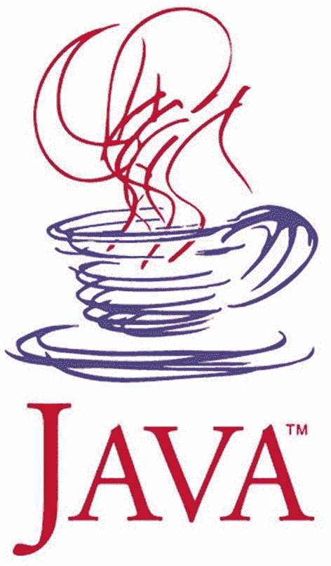

# 1.Java 及其历史简介

根据谷歌搜索，在 2020 年底，据报道有 9492 家公司在他们的技术栈中使用 Java，包括谷歌和我，本书的作者，在本书写作时工作的公司。即使过了 25 年，Java 仍然是最有影响力的编程语言之一。这一切都始于 1990 年，当时一家引领计算机行业革命的美国公司决定召集其最优秀的工程师设计和开发一种产品，让他们成为新兴互联网世界的重要参与者。这些工程师中有詹姆斯·亚瑟·高斯林，他是一位加拿大计算机科学家，被公认为 Java 编程语言之父。这需要五年的设计、编程和一次重命名(因为商标问题，从 Oak 改为 Java)，但最终在 1996 年 1 月， <sup>[1](#Fn1)</sup> Java 1.0 发布，适用于 Linux、Solaris、Mac 和 Windows。

阅读技术书籍的一般倾向是完全跳过介绍性章节。但在这种情况下，我认为这将是一个错误。在写这本书之前，我对 Java 的历史并不感兴趣。我知道詹姆斯·高斯林是创造者，甲骨文买下了太阳，差不多就是这样。我从来不太关心语言是如何发展的，灵感来自哪里，或者一个版本与另一个版本有什么不同。我从 1.5 版本开始学习 Java，我把语言中的很多东西都当成了理所当然。所以当我被分配到一个运行在 Java 1.4 上的项目时，我非常困惑，因为我不知道为什么我写的部分代码不能编译。尽管 IT 行业发展非常迅速，但总会有一个客户端拥有遗留应用。了解每个 Java 版本的特性是一个优势，因为您知道执行迁移时的问题。

当我开始为这本书做研究时，我被迷住了。Java 的历史很有趣，因为这是一个难以置信的成长故事，一个技术成功的故事，也是一个管理上的自我冲突几乎杀死创造它的公司的例子。目前，Java 是软件开发中最常用的技术，而诞生它的公司已经不存在了，这简直是自相矛盾。

本章描述了 Java 的每个版本，跟踪了语言和 Java 虚拟机的发展。

## 这本书是给谁的

大多数面向初学者的 Java 书籍都是从典型的 *Hello World 开始的！清单 [1-1](#PC1) 中描述的*示例。

```java
public class HelloWorld {
    public static void main(String[] args) {
        System.out.println("Hello World!");
    }
}

Listing 1-1The Most Common Java Beginner Code Sample

```

这段代码在执行时会打印出 *Hello World！*在控制台中。但是如果你已经买了这本书，它假定你想用 Java 开发真正的应用，并且在申请 Java 开发人员的职位时有真正的机会。如果这是你想要的，如果这是你，一个有充分利用这种语言的能力的智慧和愿望的初学者，那么这本书就是给你的。这就是为什么我会给你们足够的信任，让你们用一个更复杂的例子来开始这本书。

Java 是一种基于英语的语法可读的语言。因此，如果你有逻辑思维并且对英语有一点了解，你应该很清楚清单 [1-2](#PC2) 中的代码在不执行它的情况下做了什么。

```java
package com.apress.ch.one.hw;

import java.util.List;

public class Example01 {
    public static void main(String[] args) {
        List<String> items = List.of("1", "a", "2", "a", "3", "a");

        items.forEach(item -> {
            if (item.equals("a")) {
                System.out.println("A");
            } else {
                System.out.println("Not A");
            }
        });
    }
}

Listing 1-2The Java Beginner Code Sample a Smart Beginner Deserves

```

在此代码示例中，声明了一个文本值列表；然后遍历列表，当一个文本等于“A”时，在控制台中打印字母“A”；否则，将打印“非 A”。

如果你是一个绝对的编程初学者，这本书是为你准备的，特别是因为这本书附带的源代码利用了编程中常用的算法和设计模式。所以，如果你的计划是进入编程领域，学习一门高级编程语言，读一读这本书，运行例子，写你自己的代码，你应该会有一个好的开端。

如果你已经了解 Java，你也可以使用这本书，因为它涵盖了 Java 版本 17(早期访问程序或 EAP <sup>[2](#Fn2)</sup> 版本)的语法和内部细节，你肯定会发现一些你不知道的东西。

## 这本书的结构

您目前正在阅读的这一章是介绍性的，涵盖了 Java 历史的一小部分，向您展示了该语言是如何发展的，并提供了对其未来的一瞥。此外，还将介绍执行 Java 应用的机制，以便您为第**章** [**2**](02.html) 做好准备。下一章将向你展示如何建立你的开发环境，并向你介绍第一个简单的应用。

从第**章** [**3**](03.html) 开始，将涵盖语言的基础部分:包、模块、类、接口、注释对象、操作符、数据类型、记录、语句、流、lambda 表达式等等。

从第**章** [**8**](08.html) 开始，涵盖了与外部数据源的交互:读取和写入文件、序列化/反序列化对象、测试和创建用户界面。

**章节** [**12**](12.html) 完全致力于 Java 9 中引入的发布-订阅框架和反应式编程。

**[第十三章**第十五章**](13.html)**将垃圾收集器盖上。****

 ****本书列表中使用的所有资源，以及一些因为本书必须保持合理大小而未能使用的资源，都是名为`java-17-for-absolute-beginners`的项目的一部分。这个项目由模块组成(因此它是一个多模块项目),这些模块相互链接，并且必须由一个叫做 Maven 的东西来管理。Maven 是我们开发人员称为构建工具的东西，它提供了构建包含大量源代码的项目的能力。构建项目意味着将编写的代码转换成可以执行的东西。我选择为我写的书使用多模块项目，因为它更容易构建，还因为公共元素可以组合在一起，保持项目的配置简单且不重复。此外，通过将所有的源代码组织在一个多模块项目中，您可以尽快获得关于源代码是否工作的反馈，并且您可以联系作者并要求他们更新它们。我知道拥有一个构建工具会带来一定程度的复杂性，但是它让您有机会适应一个非常类似于您将作为一名员工工作的开发环境。

## 约定

这本书使用了许多格式约定，应该会使它更容易阅读。为此，本书使用了以下约定:

*   段落中的代码或概念名称如下:`java.util.List`

*   代码列表如下所示:

*   控制台输出中的日志将如下所示:

```java
public static void main(String[] args) {
    System.out.println("Hello World!");
}

```

*   `{xx}`是占位符；`xx`值是一个伪值，给出了应该在命令或语句中使用的真实值的提示。

*   出现在你要特别注意的段落前面。提示和警告也有类似的图标。

*   *斜体*字体用于幽默的隐喻和表达。

*   **粗体**字体用于章节参考和重要术语。

```java
01:24:07.809 [main] INFO c.a.Application - Starting Application
01:24:07.814 [main] DEBUG c.a.p.c.Application - Running in debug mode

```

至于我的写作风格，我喜欢用与同事和朋友进行技术对话的方式来写书:通篇散布笑话，给出生产实例，并与非编程情况进行类比。因为编程不过是模拟现实世界的另一种方式。

## 当 Java 被太阳微系统公司拥有时

Java 的第一个稳定版本发布于 1996 年。在那之前，有一个名为 **Green Team** 的小团队在开发一个名为 Oak 的原型语言，该语言通过一个工作演示介绍给了世界——一个名为 Star7 的交互式手持家庭娱乐控制器。动画触摸屏用户界面的明星是一个名为**杜克**的卡通人物，由团队的图形艺术家之一乔·帕朗创作。多年来，杜克(图 [1-1](#Fig1) )已经成为 Java 技术官方吉祥物，每一届 JavaOne 大会(由 Oracle 每年举办一次)都有自己的杜克吉祥物个性。


图 1-1

公爵，Java 官方吉祥物(图片来源:https:// oracle。com)

绿色团队通过互联网向世界发布 Java，因为这是创造广泛采用的最快方式。你可以想象，每当有人下载它时，他们会高兴得跳起来，因为这意味着人们对它感兴趣。软件开源还有一些其他的优势，比如贡献和反馈是由来自世界各地的许多人提供的。因此，对于 Java 来说，这是最好的决定，因为它塑造了今天许多开发人员使用的语言。即使过了 25 年，Java 仍然是最常用的三种编程语言之一。

绿色团队成立于 1982 年，为一家名为**太阳微系统**的美国公司工作。它通过销售计算机、计算机零件和软件引导了计算机革命。他们最伟大的成就之一是 Java 编程语言。在图 [1-2](#Fig2) 中可以看到公司 logo<sup>T5】3</sup>从 Java 诞生那一年开始使用，直到 2010 年被甲骨文收购。


图 1-2

太阳微系统公司的标志(图片来源:[https://en . Wikipedia . org/wiki/Sun _ Microsystems](https://en.wikipedia.org/wiki/Sun_Microsystems))

很难找到关于 Java 第一版的信息，但是见证了它诞生的专注的开发人员，当 Web 还很小并且充满静态页面时，确实创建了博客并与世界分享他们的经验。对于 Java 来说，显示与用户交互的动态内容的小程序很容易就能大放异彩。但是因为开发团队想得更大，Java 不仅仅是一种 Web 编程语言。在尝试让小程序在任何浏览器上运行的过程中，该团队找到了一个常见问题的解决方案:**可移植性**。

现在的开发人员在开发应该在任何操作系统上运行的软件时面临着许多令人头痛的问题。随着移动革命的到来，事情变得非常棘手。在图 [1-3](#Fig3) 中，你可以看到一张被认为是第一个 Java 徽标的抽象画。



图 1-3

第一个 Java logo，1996–2003(图片来源: [https:// oracle. com/](https://oracle.com/) )

Java 1.0 在第一届 JavaOne 大会上发布，有 6000 多名与会者。Java 最初是一种名为 Oak 的语言。这种语言非常类似于 C++，是为手持设备和机顶盒设计的。它演变成了 Java 的第一个版本，为开发人员提供了一些 C++所没有的优势:

*   安全性:在 Java 中，当意外超过数组的大小时，没有读取假数据的危险。

*   **自动内存管理**:Java 开发人员不必检查是否有足够的内存分配给一个对象，然后显式地取消分配；这些操作由垃圾收集器自动处理。这也意味着指针不是必需的。

*   简单性:没有指针、联合、模板和结构。Java 中的大多数东西都可以被声明为一个类。此外，通过修改继承模型和不允许多重类继承，避免了使用多重继承时的混淆。

*   **支持多线程执行** : Java 从一开始就是为了支持多线程软件的开发而设计的。

*   **可移植性**:最广为人知的 Java 格言之一是**一次编写，随处运行** (WORA)。这是由 Java 虚拟机实现的。

所有这些使得 Java 对开发人员很有吸引力，到 1997 年 Java 1.1 发布时，世界上已经有大约 400，000 名 Java 开发人员。那年 JavaOne 大会有 10，000 名与会者。通往伟大的道路已经确定。在进一步分析每个 Java 版本之前，让我们澄清一些事情。

## Java 是如何移植的？

我几次提到 Java 是可移植的，Java 程序可以在任何操作系统上运行。是时候解释这是如何可能的了。让我们从一张简单的图开始，如图 [1-4](#Fig4) 中的那张。


图 1-4

在多个平台上运行 Java 程序

Java 是我们所说的高级编程语言，它允许开发者编写独立于特定类型计算机的程序。高级语言更容易读、写和维护。但他们的代码必须由编译器翻译或解释成机器语言(人类无法阅读，因为它是由数字组成的)才能执行，因为这是计算机理解的唯一语言。

在图 [1-4](#Fig4) 中，注意在操作系统之上，需要一个 **JVM** 来执行一个 Java 程序。JVM 代表 **Java 虚拟机**，它是一种抽象的计算机器，使计算机能够运行 Java 程序。它是一个独立于平台的执行环境，将 Java 代码转换成机器语言并执行。

那么 Java 和其他高级语言有什么区别呢？其他高级语言将源代码直接编译成机器码，这些机器码是为在特定的微处理器体系结构或操作系统上运行而设计的，如 Windows 或 UNIX。JVM 所做的是模仿 Java 处理器，使 Java 程序有可能被解释为任何处理器上的一系列动作或操作系统调用，而不管操作系统是什么。当然，编译步骤使 Java 比纯编译语言(如 C++)慢，但它的优势过去是，现在仍然是美丽的。此外，Java 不是 JVM 语言家族的唯一成员。Groovy、Scala、Kotlin 和 Clojure 都是运行在 JVM 上的非常流行的编程语言。

因为提到了 Java 编译器，我们不得不回到 Java 1.1，即使在新版本发布时，它仍被广泛使用。它附带了一个改进的抽象窗口工具包(AWT)图形 API(用于构建小程序的组件集合)、内部类、数据库连接类(JDBC 模型)、远程调用类(RMI)、一个名为 JIT <sup>[5](#Fn5)</sup> 编译器(用于**J**ust**I**n**T**ime)的微软平台专用编译器、对国际化的支持以及 Unicode。Java 被广泛接受的另一个原因是，在 Java 发布后不久，微软就对它进行了许可，并开始使用它创建应用。反馈有助于 Java 的进一步发展，因此 Java 1.1 在当时的所有浏览器上都得到支持，这也是它被如此广泛部署的原因。

本书导言中使用的许多术语现在可能对你来说是陌生的，但随着你阅读本书，更多的信息被引入，这些词将开始变得更有意义。现在，只要记住每一个新的 Java 版本都比前一个版本有更多的东西，在那个时候，每一个新的组件都是新奇的。

那么，在实际执行之前，开发人员编写的 Java 代码到底发生了什么呢？该过程如图 [1-5](#Fig5) 所示。


图 1-5

从 Java 代码到机器代码

Java 代码被编译并转换成字节码，然后由 JVM 在底层操作系统上解释和执行。

Java 是一种经过编译和解释的通用编程语言，它具有许多特性，非常适合 web。

既然我们已经介绍了 Java 代码是如何执行的，让我们再回顾一些历史。

## 太阳微系统公司的 Java 版本

Sun Microsystems 发布的第一个稳定的 Java 版本可以从网站上下载，名为 **JDK，**，当时的版本是 1.0.2。JDK 是 T2、T4、发展和科技的首字母缩写。这是用于开发 Java 应用和小程序的软件开发环境。它包括**J**ava**R**untime**E**n environment(**JRE**)、解释器(loader)、编译器、归档器、文档生成器以及 Java 开发所需的其他工具。我们将在关于在你的计算机上安装 JDK 的章节中深入探讨这个问题。

从 1998 年发布的 1.2 版本开始，Java 版本被赋予了代码名称。<sup>[6](#Fn6)</sup>Java 1.2 版本的代号是**游乐场**。这是一个大规模的发布，这是人们开始谈论 Java 2 平台的时刻。从这个版本开始，J2SE 5.0 之前的版本都被重新命名，J2SE**取代了 JDK**，因为 Java 平台现在由三部分组成:

*   **J2SE** (Java 2 平台，标准版)，后来成为 JSE，一个为桌面和服务器环境开发和部署可移植代码的计算平台。

*   **J2EE** (Java 2 平台，企业版)，后来成为 JEE，一组扩展 Java SE 的规范，用于分布式计算和 web 服务等企业特性。

*   **J2ME** (Java 2 平台，微型版)，后来成为 JME，一个为嵌入式和移动设备开发和部署可移植代码的计算平台。

在这个版本中，JIT 编译器成为 Sun Microsystem 的 JVM 的一部分(这基本上意味着将代码转换为可执行代码成为一种更快的操作，并且生成的可执行代码得到了优化)，Swing 图形 API 作为 AWT 的一种奇特的替代方法被引入(引入了创建奇特的桌面应用的新组件)，并且引入了 Java Collections 框架(用于处理数据集)。

J2SE 1.3 于 2000 年发布，代号为 **Kestrel** (可能是指新引入的 Java 声音类)。这个版本还包含了 Java XML APIs。

J2SE 1.4 于 2002 年发布，代号为梅林。这是 Java 社区过程成员第一年参与决定这个版本应该包含哪些特性，因此这个版本相当一致。这是在 Java 社区过程下开发的 Java 平台的第一个版本，名为 JSR 59。 <sup>[7](#Fn7)</sup> 以下特性值得一提:

*   对 IPv6 的支持:基本上，现在可以使用网络协议 IPv6 编写运行在网络上的应用。

*   **非阻塞 IO** **:** IO 是 input-output 的缩写，指的是读写数据——一种非常慢的操作。使 IO 不阻塞意味着优化这些操作，以提高运行应用的速度。

*   **Logging API** :需要将执行的操作报告给一个文件或资源，在失败的情况下可以读取该文件或资源，以确定原因并找到解决方案。这个过程被称为日志记录，显然只有在这个版本中引入了支持这个操作的组件。

*   **图像处理 API** :组件开发者可以用这个用 Java 代码来操作图像。

Java 的咖啡杯标志在 2003 年的 JavaOne 大会上首次出现(在 1.4 和 5.0 版本之间)。在图 [1-6](#Fig6) 中可以看到。 <sup>[8](#Fn8)</sup>


图 1-6

Java 官方 logo 2003-2006(图片来源: [https:// oracle。com](https://oracle.com)

J2SE 5.0 于 2004 年发布，代号为老虎。最初，它遵循典型的版本控制，并被命名为 1.5，但因为这是一个具有大量新功能的主要版本，证明了 J2SE 在成熟度、稳定性、可扩展性和安全性方面的重大改进，所以该版本被标记为 5.0，并以这种方式向公众发布，即使内部仍使用 1.5。对于这个版本和接下来的两个版本，我们认为 1.x = x.0。让我们列出这些特性，因为它们中的大多数都包含在本书中:

*   **泛型**为集合提供了编译时(静态)类型安全支持，并消除了对大多数类型转换的需要(这意味着在特定上下文中使用的类型是在应用运行时决定的，我们在**第** [章 **5**](05.html) 中有一整节关于这一点)。

*   **注释**，也称为**元数据**，用于标记类和方法，以允许支持元数据的实用程序处理它们(这意味着一个组件被标记为另一个组件可以识别并对其执行特定操作的东西)。

*   **自动装箱/拆箱**是指原语类型和匹配对象类型(包装器)之间的自动转换，在**章节**[T5】5](05.html)中也有涉及。

*   **枚举**使用`enum`关键字定义静态的最终有序值集；**章节** [章节**章节**章节](04.html)章节。

*   **Varargs** 为支持一种类型的任意数量参数的方法提供了一种简写方式。方法的最后一个参数是使用类型名后跟三个点(例如，`String...`)来声明的，这意味着可以提供该类型的任意数量的参数并将其放入数组中；**章节** [**第三章**](03.html) 。

*   **为每个循环增强**:也用于迭代集合和数组，在**章节** [**5**](05.html) 中也有介绍。

*   改进多线程 Java 程序的语义，在第**章** [**第 7 章**](07.html) 中介绍。

*   静态进口也涵盖在**章** [**4**](04.html) **中。**

*   对 RMI 的改进(书中未涉及)、Swing ( **章** [**10**](10.html) )、并发实用程序(**章** [**7**](07.html) )、以及`Scanner`类(**章**[**11**](11.html)**)**的介绍。

Java 5 是苹果 Mac OS X 10.4 的第一个可用版本，也是苹果 Mac OS X 10.5 的默认版本。到 2015 年为止，这个版本发布了很多更新 <sup>[9](#Fn9)</sup> ，以修复与安全和性能相关的问题。这是一个错误百出的版本，这是可以理解的，因为很多特性都是在两年内开发出来的。

2006 年， **Java SE 6** 稍微延迟发布，代号**野马**。是的，这又是一次重命名，是的，又一次在相当短的时间内实现了大量的特性。之后需要大量的更新来解决现存的问题。这是 Sun Microsystems 发布的最后一个主要 Java 版本，因为 Oracle 在 2010 年 1 月收购了该公司。下面列出了此版本中最重要的功能。

*   核心平台的显著性能提升(应用运行速度更快，执行时需要的内存或 CPU 更少)。

*   改进的 web 服务支持(开发 web 应用所需的优化组件)。

*   JDBC 4.0(使用数据库开发应用所需的优化组件)。

*   Java 编译器 API(您可以从代码中调用用于编译代码的组件)。

*   许多 GUI 改进，例如在 API 中集成了`SwingWorker`，表格排序和过滤，以及真正的 Swing 双缓冲(消除了灰色区域效应)；总的来说，改进了用于创建桌面应用界面的组件。

在(*Java 术语*)之后不久，2008 年 12 月， **JavaFX** 1.0 SDK 发布。JavaFX 适合为任何平台创建图形用户界面。最初的版本是一种脚本语言。直到 2008 年，在 Java 中有两种创建用户界面的方法:

*   使用 **AWT** (抽象窗口工具包)组件，这些组件由特定于底层操作系统的本机对等组件呈现和控制；这就是 AWT 组件也被称为重量级组件的原因。

*   使用 **Swing** 组件，之所以称之为轻量级，是因为它们不需要在操作系统的窗口工具包中分配本机资源。Swing API 是 AWT 的补充扩展。

对于第一个版本，JavaFX 是否真的有前途，是否会取代 Swing，从来都不清楚。Sun 内部的管理混乱也无助于为这个项目确定一条清晰的道路。

## 甲骨文接管

尽管 Sun Microsystems 赢得了对微软的诉讼，他们同意支付 2000 万美元，因为没有完全实现 Java 1.1 标准，但在 2008 年，该公司的状况非常糟糕，以至于与 IBM 和惠普的合并谈判开始了。2009 年，甲骨文和 Sun 宣布他们就价格达成一致:甲骨文将以每股 9.50 美元的现金收购 Sun，这相当于 56 亿美元的报价。影响是巨大的。很多工程师辞职了，包括 Java 之父詹姆斯·高斯林，这让很多开发者质疑 Java 平台的未来。

### Java 7

Java SE 7，代号 **Dolphin** ，是甲骨文在 2011 年发布的第一个 Java 版本。它是 Oracle 工程师和全球 Java 社区成员广泛合作的结果，如 OpenJDK 社区和 Java 社区进程(JCP)。它包含了很多变化，但比开发人员预期的要少很多。考虑到两次发布之间的长时间间隔，期望值相当高。Project Lambda，它应该允许在 Java 中使用 Lambda 表达式(这在某些情况下会导致相当大的语法简化)，Jigsaw(使 JVM 和 Java 应用模块化；**中有一段** [章 **3**](03.html) 关于他们)被撤掉了。两者都在未来版本中发布。

以下是 Java 7 中最显著的特性:

*   JVM 通过新的 invoke 动态字节码支持动态语言(基本上，Java 代码可以使用用 Python、Ruby、Perl、Javascript 和 Groovy 等非 Java 语言实现的代码)。

*   压缩的 64 位指针(JVM 的内部优化，因此消耗的内存更少)

*   在项目**下分组的小型语言更改硬币:**
    *   switch 语句中的字符串(包含在**章节**[T3】7T5)](07.html)

    *   try-statement 中的自动资源管理(包含在**章节** [**5**](05.html) 中)

    *   泛型的改进类型推理—菱形<>操作符(在**章节** [**5**](05.html) 中介绍)

*   二进制整数文字:整数可以直接表示为二进制数，使用形式为 0b(或 0B)后跟一个或多个二进制数字(0 或 1)(在**章** [**5**](05.html) 中介绍)。
    *   多个异常处理改进(在**章** [**5**](05.html) 中涉及)

*   并发性改进

*   新的 I/O 库(添加了新的类来从文件中读取/写入数据，在**章** [**8**](08.html) 中介绍)

*   `Timsort`引入算法来排序对象的集合和数组，而不是合并排序，因为它具有更好的性能。更好的性能通常意味着减少消耗的资源:内存和/或 CPU，或者减少执行所需的时间。

在几乎没有原始开发团队参与的情况下继续开发一个项目一定是一项非常艰难的工作。这是显而易见的，因为随后有 161 个更新；他们中的大多数人需要修复安全问题和漏洞。

JavaFX 2.0 随 Java 7 一起发布。这证实了 JavaFX 项目与 Oracle 的合作前景。作为一个主要的变化，JavaFX 不再是一个脚本语言，而成为一个 Java API。这意味着 Java 语言语法知识足以开始用它构建用户图形界面。JavaFX 开始超越 Swing，因为它的硬件加速图形引擎 Prism T1 在渲染方面做得更好。

从 Java 7 开始，OpenJDK 诞生了，它是 Java SE 平台版的开源参考实现。这是 Java 开发人员社区为提供一个不受 Oracle 许可的 JDK 版本所做的努力，因为人们认为 Oracle 将为 JDK 引入更严格的许可以从中获利。

### Java 8

Java SE 8，代号 **Spider** ，于 2014 年发布，包含了最初打算成为 Java 7 一部分的功能。迟到总比不到好，对吧？历经三年的发展，Java 8 包含了以下关键特性:

*   语言语法变化
    *   lambda 表达式的语言级支持(函数式编程特性)

    *   对接口中默认方法的支持(在**章节** [**4**](04.html) 中涉及)

    *   新的日期和时间 API(包含在**章节** [**5**](05.html) 中)

    *   使用 streams 进行并行处理的新方法(在第**章** [**第 8 章**](08.html) 中介绍)

*   改进了与 JavaScript 的集成(Nashorn 项目)。JavaScript 是一种 web 脚本语言，在开发社区中很受欢迎，所以用 Java 提供对它的支持可能会为 Oracle 赢得一些新的支持者。

*   垃圾收集过程的改进

从 Java 8 开始，代号被取消，以避免任何商标法纠纷；取而代之的是，采用了一种易于区分主要版本、次要版本和安全更新版本的语义版本。 <sup>[10](#Fn10)</sup> 版本号匹配以下模式:`$MAJOR.$MINOR.$SECURITY`。

当在终端中执行`java -version`时(如果您安装了 Java 8)，您会看到类似于清单 [1-3](#PC5) 中的日志。

```java
$ java -version
java version "1.8.0_162"
JavaTM SE Runtime Environment build 1.8.0_162-b12
Java HotSpotTM 64-Bit Server VM build 25.162-b12, mixed mode

Listing 1-3Java 8 Log for Execution of java -version

```

在此日志中，版本号具有以下含义:

*   1 表示主版本号，对于包含新版本的 Java SE 平台规范中指定的重要新功能的主发行版，主版本号会增加。

*   8 代表次要版本号，次要更新版本会增加，可能包含兼容的错误修复、标准 API 的修订和其他小功能。

*   0 表示包含关键修补程序(包括提高安全性所必需的修补程序)的安全更新版本的安全级别。当$MINOR 递增时，$SECURITY 不会重置为零，这让用户知道这个版本更安全。

*   162 是内部版本号。

*   b12 表示附加的构建信息。

这种版本控制风格在 Java 应用中很常见，所以采用这种版本控制风格是为了与一般的行业实践保持一致。

### Java 9

Java SE 9 于 2017 年 9 月发布。期待已久的**拼图**项目终于来了。Java 平台终于模块化了。

对于 Java 世界来说，这是一个巨大的变化；这不是语法上的变化，也不是什么新功能。这是平台设计的改变。我认识的一些有经验的开发人员从 Java 诞生的第一年就开始使用它，他们很难适应。它应该修复 Java 已经存在多年的一些严重问题(在**章** [**3**](03.html) 中有所涉及)。您很幸运，因为作为初学者，您是从零开始的，所以您不需要改变开发应用的方式。

除了引入 Java 模块之外，以下是最重要的特性:

*   Java Shell 工具，一个交互式命令行界面，用于用 Java 编写的评估声明、语句和表达式(在第**章** [**第 3 章**](03.html) 中介绍)

*   相当多的安全更新

*   `private`方法现在在接口中得到支持(在**章节** [**4**](04.html) 中涉及)

*   强化`try-with-resources`:最终变量现在可以作为资源使用(在**章节** [**5**](05.html) 中有所涉及)

*   “_”从合法标识符名称集中删除(包含在**章** [**4**](04.html) 中)

*   对垃圾优先(G1)垃圾收集器的增强；这就变成了默认的垃圾收集器(在**章**[T3】13T5)中有介绍)](13.html)

*   在内部，使用了一种新的更紧凑的字符串表示法(在第**章** [**5**](05.html) 中介绍)

*   并发更新(与并行执行相关，在**章节** [中提到过**5**T5)](05.html)

*   集合的工厂方法(包含在**章** [**5**](05.html) 中)

*   更新图像处理 API 优化用于编写处理图像的代码的组件

Java 9 遵循与 Java 8 相同的版本控制方案，有一点小的变化。JDK 名字中包含的 Java 版本号最终成为版本方案中的`$MAJOR`号。因此，如果您安装了 Java 9，当在终端中执行`java -version`时，您会看到类似于清单 [1-4](#PC6) 中的日志。

```java
$ java -version
java version "9.0.4"
JavaTM SE Runtime Environment build 9.0.4+11
Java HotSpotTM 64-Bit Server VM build 9.0.4+11, mixed mode

Listing 1-4Java 9 Log for Execution of java -version

```

### Java 10

Java SE 10(又名 Java 18.3)于 2018 年 3 月 20 日发布。Oracle 改变了 Java 发布风格，每六个月发布一个新版本。Java 10 还使用了 Oracle 建立的新版本约定:版本号跟随$年。$月格式。这种版本控制风格是为了让开发人员和最终用户更容易计算出一个版本的年龄，这样他们就可以判断是否要升级到一个具有最新安全补丁和附加特性的新版本。

以下是 Java 10 的一些特性。 <sup>[12](#Fn12)</sup>

*   一个局部变量类型推理来增强语言，将类型推理扩展到局部变量(这是最令人期待的特性，在第**章** [**5**](05.html) 中有所介绍)

*   针对垃圾收集的更多优化(在第**章** [**第 13 章**](13.html) 中介绍)

*   应用类数据共享，通过跨进程共享公共类元数据来减少内存占用(这是一个高级特性，本书不会涉及)

*   更多并发更新(与并行执行相关，在**章节**[T3】5T5】中提到)](05.html)

*   备用内存设备上的堆分配(JVM 运行 Java 程序所需的内存—称为堆内存—可以在备用内存设备上分配，因此堆也可以在易失性和非易失性 ram 之间划分。更多关于 Java 应用使用的内存可以在**章节** [**5**](05.html) 中阅读。)

安装 JDK 10 后，在终端中运行 java -version 会显示一个类似于清单 [1-5](#PC7) 中的日志。

```java
$ java -version
java version "10" 2018-03-20
JavaTM SE Runtime Environment 18.3 build 10+46
Java HotSpotTM 64-Bit Server VM 18.3 build 10+46, mixed mode

Listing 1-5Java 10 Log for Execution of java -version

```

### Java 11

2018 年 9 月 25 日发布的 Java SE 11(又名 Java 18.9)， <sup>[13](#Fn13)</sup> ，包含以下特性:

*   删除用于构建企业 Java 应用和 Corba(用于远程调用的非常老的技术，允许您的应用与安装在不同计算机上的应用通信)模块的 JEE 高级组件。

*   lambda 参数的局部变量语法允许在声明隐式类型 lambda 表达式的形式参数时使用 var 关键字。

*   Epsilon，一个低开销的垃圾收集器(一个 no-GC，所以基本上你可以在没有 GC 的情况下运行一个应用)，基本上对垃圾收集进行了更多的优化(在**章** [**13**](13.html) 中有所涉及)。

*   更多的并发更新(与并行执行相关，在**章节**[T3】5](05.html)中提到)。

*   Nashorn JavaScript 脚本引擎和 API 被标记为不推荐使用，以便在未来的版本中删除它们。ECMAScript 语言结构发展得相当快，所以 Nashorn 变得难以维护。

除了这些变化之外，还推测应该引入一个新的版本变化，因为`$YEAR.$MONTH`格式与开发人员不太合拍。(为什么这么多版本命名变化？这真的这么重要吗？很明显，是的。)提出的版本控制变化类似于 Java 9 中引入的版本控制变化。 <sup>[14](#Fn14)</sup>

当安装 JDK 11 时，在终端中运行 java -version 会显示一个类似于清单 [1-6](#PC8) 中的日志。

```java
$ java -version
java version "11.0.3" 2019-04-16 LTS
Java(TM) SE Runtime Environment 18.9 (build 11.0.3+12-LTS)
Java HotSpot(TM) 64-Bit Server VM 18.9 (build 11.0.3+12-LTS, mixed mode)

Listing 1-6Java 11 Log for Execution of java -version

```

JDK 11 是一个长期支持版本，计划提供几年的支持。这就是版本名中的 **LTS** 的意思。

随着 JDK 11 的发布，甲骨文宣布他们将开始对 Java SE 8 许可证收费，因此试图降低软件成本的小企业开始寻找替代方案。AdoptOpenJDK 从一组完全开源的构建脚本和基础设施中为多个平台提供预构建的 OpenJDK 二进制文件。

OpenJDK 与 OracleJDK 具有相同的代码，这取决于您使用的提供者。

另一个优势是，虽然甲骨文，JDK 不能修改，以适应业务应用的需要；OpenJDK 可以修改，因为它是在 GNU 通用公共许可证下授权的，这是相当宽松的。

此外，如果钱不是问题，亚马逊的 Coretto、Azul Zulu 和 GraalVM 都是以某种方式优化的替代 JDK。

### Java 12

Java SE 12，<sup>[15](#Fn15)2019 年 3 月 29 日发布，包含以下重要特性:</sup>

*   一个名为 Shenandoah 的新的实验性垃圾收集器(GC)算法减少了 GC 暂停时间。

*   修改了`switch`语句的语法，允许它也作为表达式使用。它还消除了对`break`语句的需要(在**章节** [**7**](07.html) 中有所涉及)。

*   JVM 常量 API，对关键类文件和运行时工件的名义描述进行建模。这个 API 对操作类和方法的工具很有帮助。

*   对 G1 垃圾收集器的小改进(包含在第**章** [**第 13 章**](13.html) )。

*   改进 JDK 构建过程的 CDS 档案。

*   大约 100 个微基准 <sup>[16](#Fn16)</sup> 被添加到 JDK 源中。

安装 JDK 12 后，在终端中运行 java -version 会显示一个类似于清单 [1-7](#PC9) 中的日志。

```java
$ java -version
java version "12.0.2" 2019-07-16
Java(TM) SE Runtime Environment (build 12.0.2+10)
Java HotSpot(TM) 64-Bit Server VM (build 12.0.2+10, mixed mode, sharing)

Listing 1-7Java 12 Log for Execution of java -version

```

JDK 12 是甲骨文 2017 年 9 月随 JDK 9 推出的为期六个月的发布节奏的一部分。JDK 12 是一个支持期限很短的功能版本。这个版本已经发布了两个补丁。

### Java 13

2019 年 9 月 17 日发布的 Java SE 13， <sup>[17](#Fn17)</sup> ，包含了一些重要的特性，数百个较小的增强，以及数千个 bug 修复。这个版本最重要的特点是:

*   动态 CSD 存档(JDK 12 中增加的对 CDS 存档支持的改进)

*   z 垃圾收集器增强功能(包含在**章**[T3】13T5)](13.html)

*   传统套接字 API 的新实现

*   对`switch`表情的更多改进(包含在**章节** [**7**](07.html) )

*   对文本块的支持(在**章** [**5**](05.html) 中介绍)

安装 JDK 13 后，在终端中运行 java -version 会显示一个类似于清单 [1-8](#PC10) 中的日志。

```java
$ java -version
java version "13.0.2" 2020-01-14
Java(TM) SE Runtime Environment (build 13.0.2+8)
Java HotSpot(TM) 64-Bit Server VM (build 13.0.2+8, mixed mode, sharing)

Listing 1-8Java 13 Log for Execution of java -version

```

JDK 13 是一个功能版本，支持期限也很短。这个版本已经发布了两个补丁。

### Java 14

Java SE 14， <sup>[18](#Fn18)</sup> 于 2020 年 3 月 17 日发布，包含了一个重要特性、增强功能和错误修复的大列表。这个版本最重要的特点是:

*   `instanceof`运算符的模式匹配(包含在**章节** [**7**](07.html) 中)

*   JFR 事件流 API，用于收集 Java 应用和 JVM 运行时的分析和诊断数据

*   G1 垃圾收集器的更多改进(包含在第**章** [**第 13 章**](13.html) )

*   CMS(并发标记清除)垃圾收集器已被删除。

*   支持 macOS 的 Z 垃圾收集器(在第**章** [**第 13 章**](13.html) 中介绍)

*   `Records`的引入是为了提供一个简洁的语法来声明类，这些类是浅不可变数据的透明持有者(在**章节** [**5**](05.html) 中讨论)

*   外部内存访问 API 支持 Java 程序安全有效地访问 Java 堆外的外部内存

*   对`NullPointerException`类的改进，提供了更精确的细节，以便于识别变量`null`

*   引入`jpackage`工具是为了提供对本地打包格式的支持，给最终用户一种自然的安装体验

安装 JDK 14 时，在终端中运行 java -version 会显示一个类似于清单 [1-9](#PC11) 中的日志。

```java
$ java -version
java version "14.0.2" 2020-07-14
Java(TM) SE Runtime Environment (build 14.0.2+12-46)
Java HotSpot(TM) 64-Bit Server VM (build 14.0.2+12-46, mixed mode, sharing)

Listing 1-9Java 14 Log for Execution of java -version

```

即使这个版本包含了很多新特性，但其中大部分仅在预览模式下可用，或者被认为处于`incubation`阶段，这使得这个版本不稳定，不能作为长期支持的候选。

### Java 15

2020 年 9 月 15 日发布的 Java SE 15， <sup>[19](#Fn19)</sup> ，包含了对之前版本中添加的项目的相当大的改进。这个版本最显著的特点是:

*   删除 Nashorn JavaScript 引擎

*   添加密封和隐藏类(包含在**章节**[T3】4T5)](04.html)

*   加密签名现在支持爱德华兹曲线数字签名算法(EdDSA)

*   对传统 DatagramSocket API 的更多增强

*   偏向锁定被禁用和废弃，这导致多线程应用的性能提高

安装 JDK 15 后，在终端中运行 java -version 会显示一个类似于清单 [1-10](#PC12) 中的日志。

```java
$ java -version
java version "15" 2020-09-15
Java(TM) SE Runtime Environment (build 15+36-1562)
Java HotSpot(TM) 64-Bit Server VM (build 15+36-1562, mixed mode, sharing)

Listing 1-10Java 15 Log for Execution of java -version

```

JDK 15 只是一个短期版本，在 JDK 16 于 2021 年 3 月推出之前，Oracle 标准服务将提供六个月的支持。

### Java 16

2021 年 3 月 16 日发布的 Java SE 16， <sup>[20](#Fn20)</sup> ，是标准 Java set 追随 JDK 15 的版本的参考实现。这意味着在 JDK 15 不稳定的一切在 JDK 16 预计会更稳定。除此之外，这个版本最显著的特点是:

*   引入矢量 API，以表达矢量计算，在受支持的 CPU 架构上编译成最佳矢量硬件指令，从而实现优于同等标量计算的性能

*   默认情况下 JDK 内部构件的强封装(涵盖在**章** [**3**](03.html) )

*   引入外部链接器 API 是为了提供对本机代码的静态类型的纯 Java 访问

*   引入弹性元空间，促进将未使用的热点类元数据(即元空间)内存更迅速地返回给操作系统

*   增加了对 C++ 14 语言特性的支持

当安装了 JDK 16 后，在终端中运行`java -version`会显示一个类似于清单 [1-11](#PC13) 中的日志。

```java
$ java -version
openjdk version "16-ea" 2021-03-16
OpenJDK Runtime Environment (build 16-ea+30-2130)
OpenJDK 64-Bit Server VM (build 16-ea+30-2130, mixed mode, sharing)

Listing 1-11Java 16 Log for Execution of java -version

```

JDK 16 只是一个短期版本，在 JDK 17 于 2021 年 9 月推出之前，Oracle 标准服务将提供六个月的支持。在写这一章的时候，JDK 16 只能通过早期访问计划获得，这就是为什么“ea”字符串出现在版本名称中。

### Java 17

JDK<sup>17、[21](#Fn21)T3】接下来的长期支持发布，将由甲骨文支持八年。它于 2021 年 9 月 14 日发布，按照甲骨文针对 Java SE 版本的六个月发布节奏。</sup>

在写这一章的时候，JDK 17 只能通过早期访问程序获得，这就是为什么“ea”字符串出现在版本名称中；意思是提前进入。它很难使用，因为还没有任何编辑器或其他构建工具支持它。特性列表也不完整，仍然欢迎 Java 社区对缺陷修复和特性提出建议。

到这本书发行的时候，Java 17 已经稳定并可以使用了。这本书将全面涵盖这个版本的所有重要的稳定功能。不包括预览功能，因为它们对该项目的稳定性有风险。

*   JDK 16 版中引入的 Vector API 的性能和实现改进

*   对密封类和接口的改进

*   开关表达式的模式匹配介绍(特征预览)

*   macOS 的特定改进

*   伪随机数生成器的增强:引入了伪随机数生成器(PRNG)的新接口和实现，包括可跳转的 prng 和一类新的可拆分 PRNG 算法(LXM)

*   封装 JDK 内部构件的改进

*   弃用 Applet API(准备在 JDK 18 中移除)

*   反对安全管理器(准备在 JDK 18 中删除)

*   外部函数和内存 API 合并了两个先前孵化的 API:外部内存访问 API 和外部链接器 API，允许开发人员调用本地库和处理本地数据，而没有 JNI 的风险

JDK 17 的特性列表集中在 JVM 内部，以提高性能和废弃旧的 API。

当安装 JDK 17 时，在终端中运行 java -version 会显示一个类似于清单 [1-12](#PC14) 中的日志。

```java
openjdk version "17" 2021-09-14
OpenJDK Runtime Environment (build 17+35-2724)
OpenJDK 64-Bit Server VM (build 17+35-2724, mixed mode, sharing)

Listing 1-12Java 17 Log for Execution of java -version

```

细节到此为止。如果你想知道更多关于前 25 年的信息，你可以很容易地在网上找到。 <sup>[22](#Fn22)</sup>

## 先决条件

在结束本章之前，公平地说，要学习 Java，你需要几样东西:

*   了解操作系统，如 Windows、Linux 或 macOS。

*   如何完善你的搜索标准，因为与你的操作系统相关的信息在书中没有涉及；如果你有问题，你必须自己解决。

*   互联网连接。

如果您已经了解 Java，并且出于好奇或为了模块章节而购买了这本书，那么了解像 Maven 或 Gradle 这样的构建工具是很有帮助的，因为源代码被组织在一个多模块项目中，可以用一个简单的命令完全构建。我选择使用构建工具是因为在这个时代，没有构建工具学习 Java 是没有意义的；你申请的任何一家公司肯定都会用到它。

除了我列出的先决条件，您还需要安装一个 JDK 和一个 Java 编辑器。这在**章**[T3】2T5】中有所涉及。你不需要知道数学、算法或设计模式(尽管在你读完这本书后你可能会知道一些)。](02.html)

话虽如此，我们还是深入探讨一下吧。

## 摘要

Java 已经统治这个行业超过 25 年了。它并不总是处于最常用的开发技术的顶端，但也从未离开过前五名。即使有了 Node.js 这样的服务器端 JavaScript 智能框架，繁重的工作还是留给了 Java。像 Scala 和 Kotlin 这样的新兴编程语言运行在 JVM 上，所以为了竞争，Java 编程语言可能会经历严重的蜕变，但它仍然会在这里。

版本 9 中引入的模块化功能为在更小的设备上安装 Java 应用打开了大门，因为要运行 Java 应用，我们不再需要整个运行时—只需要它的核心加上构建应用所用的模块。

此外，有许多应用是用 Java 编写的，尤其是在金融领域，所以 Java 仍然会存在，因为遗留的原因，并且因为将这些应用移植到另一种技术是一项不可能完成的任务。然而，这些应用中的大多数都停留在 JDK 8 上，因为它们很复杂，并且有许多需要升级的依赖项，而这并不总是可能的。

Java 可能会存活下来，并在未来的 10 到 15 年内处于领先地位。它是一项非常成熟的技术，有一个巨大的社区围绕着它，这确实有所帮助。非常容易学习和开发人员友好使它仍然是大多数公司的首选。因此，此时您可能会得出结论，学习 Java 和购买这本书是一项不错的投资。

这一章有很多参考资料。它们是有趣的读物，但是它们不是理解本书内容的强制性要求。其余章节也是如此。

<aside aria-label="Footnotes" class="FootnoteSection" epub:type="footnotes">Footnotes [1](#Fn1_source)

参考: [`https://en.wikipedia.org/wiki/Java_(software_platform)`](https://en.wikipedia.org/wiki/Java_%2528software_platform%2529) 。

  [2](#Fn2_source)

早期访问程序

  [3](#Fn3_source)

这个标志背后的故事可以在 2021 年 10 月 15 日访问的【标题】`https://goodlogo.com/extended.info/sunmicrosystems-logo-2385`中阅读。您还可以阅读更多关于 Sun Microsystems 的信息。

  [4](#Fn4_source)

这种语言是由詹姆斯·高斯林以他家门前的橡树命名的。

  [5](#Fn5_source)

**j**vat**I**n**t**ime

  [6](#Fn6_source)

所有中间版本的代码名称都列在甲骨文的“JDK 版本”、“T1”、“T0”、“T2”中，访问日期为 2021 年 10 月 15 日。

  [7](#Fn7_source)

如果您想查看 Java 规范请求的内容和列表，请参见 Java 社区流程， [`http://www.jcp.org/en/jsr/detail?id=59`](http://www.jcp.org/en/jsr/detail%253Fid%253D59) ，访问于 2021 年 10 月 15 日。

  [8](#Fn8_source)

Java 语言最初被命名为 Oak。因为版权问题改名为 Java。你会发现一些关于新名字的理论。有一种说法是，JAVA 的名字实际上是绿色团队成员名字首字母的集合:詹姆斯·高斯林、亚瑟·范·霍夫和安迪·贝希托尔斯海姆，这个标志的灵感来自他们对咖啡的热爱。

  [9](#Fn9_source)

让我们称它们实际上是:修补程序。

  [10](#Fn10_source)

打开 JDK，《JEP 223:新版本-字符串方案》， [`http://openjdk.java.net/jeps/223`](http://openjdk.java.net/jeps/223) ，访问时间 2021 年 10 月 15 日。

  [11](#Fn11_source)

开放 JDK 描述的约定，“JEP 322:基于时间的版本控制”， [`http://openjdk.java.net/jeps/322`](http://openjdk.java.net/jeps/322) ，2021 年 10 月 15 日访问。

  [12](#Fn12_source)

完整的列表可在 2021 年 10 月 15 日访问的开放 JDK、“JDK 10、 [`http://openjdk.java.net/projects/jdk/10`](http://openjdk.java.net/projects/jdk/10) 中找到，包含 API 和内部更改的详细列表的发行说明可在 2021 年 10 月 15 日访问的甲骨文、“JDK 10 发行说明、`https://www.oracle.com/java/technologies/javase/10-relnote-issues.html` 中找到。

  [13](#Fn13_source)

完整的功能列表在开放的 JDK，“JDK 11”， [`http://openjdk.java.net/projects/jdk/11/`](http://openjdk.java.net/projects/jdk/11/) ，2021 年 10 月 15 日访问。

  [14](#Fn14_source)

如果你有兴趣，你可以在开放 JDK 阅读它的详细规范，“基于时间的版本控制”

  [15](#Fn15_source)

完整的功能列表在开放的 JDK，“JDK 12”， [`http://openjdk.java.net/projects/jdk/12/`](http://openjdk.java.net/projects/jdk/12/) ，2021 年 10 月 15 日访问。

  [16](#Fn16_source)

基于 Java 微基准线束，打开 JDK，“代码工具:jmh”， [`https://openjdk.java.net/projects/code-tools/jmh/`](https://openjdk.java.net/projects/code-tools/jmh/) ，访问时间 2021 年 10 月 15 日。

  [17](#Fn17_source)

完整的功能列表在开放的 JDK，“JDK 13”， [`http://openjdk.java.net/projects/jdk/13/`](http://openjdk.java.net/projects/jdk/13/) ，2021 年 10 月 15 日访问。

  [18](#Fn18_source)

完整的功能列表位于开放 JDK，“JDK 14”，[http://Open JDK . Java . net/projects/JDK/14/](http://openjdk.java.net/projects/jdk/14/)，于 2021 年 10 月 15 日访问。

  [19](#Fn19_source)

完整的功能列表在开放的 JDK，“JDK 15”， [`http://openjdk.java.net/projects/jdk/15/`](http://openjdk.java.net/projects/jdk/15/) ，2021 年 10 月 15 日访问。

  [20](#Fn20_source)

完整的功能列表在开放的 JDK，“JDK 16”， [`http://openjdk.java.net/projects/jdk/16/`](http://openjdk.java.net/projects/jdk/16/) ，2021 年 10 月 15 日访问。

  [21](#Fn21_source)

完整的功能列表在 JDK[上。java。net](http://jdk.java.net) 、【JDK 17 通用-发售】、[、`https://jdk.java.net/17`、](https://jdk.java.net/17)，2021 年 10 月 15 日访问。

  [22](#Fn22_source)

如果你认为有必要，可以从这里开始阅读:免费 Java 指南，《Java 编程语言的历史》， [`https://www.freejavaguide.com/history.html`](https://www.freejavaguide.com/history.html) ，2021 年 10 月 15 日访问。

 </aside>****