# 5.数据类型

在前一章中写了很多 Java 代码，但是在设计类的时候只使用了最简单的数据类型:一些数字和文本。在 JDK 中，许多数据类型被声明用于多种目的:为日历日期建模；用于表示多种类型的数字；以及处理文本、集合、文件、数据库连接等等。除了 JDK，还有其他人创建的提供更多功能的库。JDK 提供的数据类型是基本类型，是构建每个 Java 应用程序的基础。根据您正在构建的应用程序的类型，您可能不需要所有这些组件。例如，我从来没有机会使用`java.util.logging.Logger`类。我开发的大多数应用程序在我来的时候已经由不同的团队建立了，他们使用外部库，比如`Log4j`、`Logback`，或者日志抽象，比如`Slf4j`。

本节将介绍编写任何 Java 应用程序的 80%都需要的基本 Java 数据类型。

## 栈和堆内存

Java 类型可以分为两大类:基本类型和引用类型。Java 代码文件存储在硬盘上，Java 字节码文件也是如此。Java 程序运行在 JVM 上，JVM 通过执行`java`可执行文件作为一个进程启动。在执行过程中，所有的数据都存储在两种不同类型的内存中，分别名为:**栈**和**堆**，它们是由操作系统为程序的执行而分配的。

在执行期间(也称为在*运行时*)使用**栈**内存来存储方法原语局部变量和对存储在堆中的对象的引用。栈也是一种数据结构，由只能在一端访问的值列表表示，也称为 LIFO 顺序，是后进先出的缩写。这个名字很贴切，因为每次调用一个方法，都会在栈内存中创建一个新的块来保存该方法的局部变量:原语和对该方法中其他对象的引用。当调用结束时，该块被移除(弹出),并为之后调用的方法创建新的块。

栈数据结构非常类似于一堆盘子:你只能在顶部添加或移除额外的盘子。栈中的第一个元素称为*头*。在栈上执行的操作有特定的名称:将一个元素添加到栈中被称为*推送*操作，检查栈中的第一个元素被称为 *peek* 或 *top* ，提取栈中的第一个元素，它的头，被称为 *pop* 。通过反复调用 *pop* 来清空栈，直到其大小为零。

每个 JVM 执行线程都有自己的栈内存，其大小可以使用 JVM 参数`-Xss`(或者等效且更显式的- `XX:ThreadStackSize`)来指定。如果分配了太多变量——或者被调用的方法是递归的并且设计得很差——返回的条件永远不会满足，因此会一直调用自己，您将会遇到一个`java.lang.StackOverflowError`,这意味着没有剩余的栈内存，因为每个方法调用都会导致在栈上创建一个新的块。栈内存的大小取决于运行 JVM 的平台，对于基于 Unix 的系统(Linux 和 macOS)是 1024KB，对于 Windows，它取决于虚拟内存。有一种方法可以在你的电脑上检查它的大小。只需打开一个终端或命令提示符，运行这个命令:`java -XX:+PrintFlagsFinal -version`。该命令返回一个 JVM 配置列表，称为标志。其中一些用于配置允许 JVM 管理的内存。

清单 [5-1](#PC1) 显示了在我的 macOS 电脑上执行的命令。`grep`命令根据作为参数提供的标准过滤输出，从而产生一个更干净和有范围的输出。

```java
> java -XX:+PrintFlagsFinal -version | grep ThreadStack
  #  Data Type  # Flag Name  #  = # Flag Value
     intx ThreadStackSize       = 1024

Listing 5-1Showing the Stack Size Default Values on macOS

```

**堆**内存在运行时用于为对象和 JRE 类分配内存。对象是 JDK 类或开发人员定义的类的实例。用 new 创建的任何对象都将存储在堆内存中。应用程序的所有线程都可以访问堆内存中创建的对象。堆内存的访问和管理稍微复杂一些，将在第**章** [**13**](13.html) 中详细介绍。JVM 参数用于在执行过程中为 Java 程序设置堆内存的初始和最大大小。堆的大小可能根据程序创建的对象数量而变化，如果分配给 Java 程序的所有堆内存都满了，那么就会抛出一个`java.lang.OutOfMemoryError`。堆内存的默认大小取决于运行 JVM 的计算机的物理可用内存，它的最小值和最大值以及其他附加数据也可以从`java -XX:+PrintFlagsFinal -version`的输出中提取。

清单 [5-2](#PC2) 显示了在我的计算机上执行的命令，这是一台 macOS，总物理内存为 16GB。`grep`命令根据作为参数提供的标准过滤输出，从而产生一个更干净和有范围的输出。

```java
> java -XX:+PrintFlagsFinal -version | grep HeapSize
#  Data Type  # Flag Name  #  = # Flag Value
   size_t MaxHeapSize         = 4294967296
   size_t MinHeapSize         = 8388608

Listing 5-2Showing the Heap Size Default Values on macOS

```

如果你想了解更多关于 JVM 标志的知识，这个技术博客上有用的 JVM 标志系列文章是一个很好的来源: [`https://blog.codecentric.de/en/?s=JVM+Flags&x=0&y=0`](https://blog.codecentric.de/en/%253Fs%253DJVM%252BFlags%2526x%253D0%2526y%253D0) 。

虽然现在看到这些信息的重要性还为时过早，但是有许多 Java 命令行选项可能会对您在实际应用中的工作有所帮助。所以把这个链接也加入到你的必备收藏中: [`https://docs.oracle.com/en/java/javase/17/docs/api/index.html`](https://docs.oracle.com/en/java/javase/17/docs/api/index.html) 。

`java.lang.String`类是 Java 编程语言中最常用的类。因为应用程序中的文本值可能具有相同的值，所以出于效率原因，这种类型的对象在堆中的管理方式略有不同。在堆中有一个名为**字符串池**的特殊内存区域，所有的字符串实例都由 JVM 存储在这里。这里必须提到这一点，因为下面这段解释 Java 如何管理内存的代码包含了一个`String`实例的定义，但是字符串池和其他关于`String`数据类型的细节将在本章后面的章节中详细介绍。

让我们考虑一下清单 [5-3](#PC3) 中的可执行类，想象一下在它执行期间内存是如何组织的。

```java
01\. package com.apress.bgn.five;
02.
03\. import java.util.Date;
04.
05\. public class PrimitivesDemo {
06\.     public static void main(String... args) {
07\.         int i = 5;
08\.         int j = 7;
09\.         Date d = new Date();
10\.         int result = add(i, j);
11\.         System.out.print(result);
12\.         d = null;
13\.     }
14.
15\.     static int add(int a, int b) {
16\.        String mess = new String("performing add ...");
17\.        return a + b;
18\.     }
19\. }

Listing 5-3Code Sample Used to Discuss Memory Usage

```

仅仅看一下这段代码，你就能判断出哪些变量保存在栈上，哪些保存在堆上吗？让我们一行一行地检查程序，看看发生了什么:

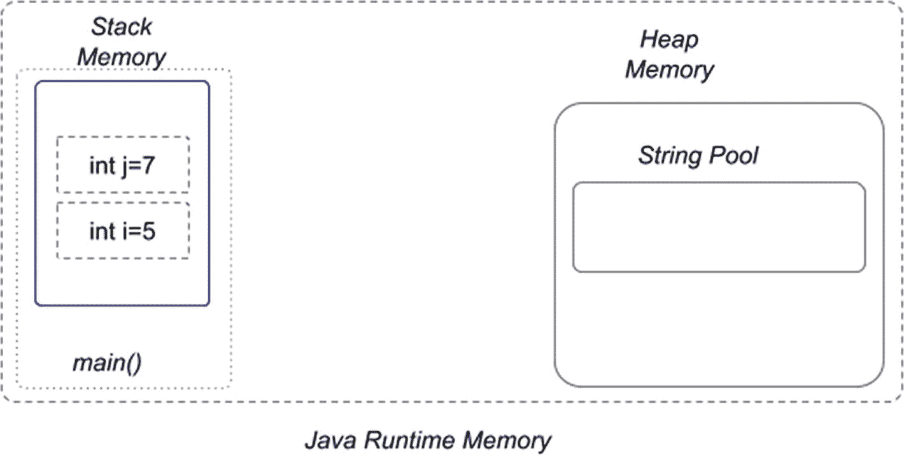

图 5-1

Java 栈和堆内存，在声明了两个原始变量之后

*   程序一启动，JVM 需要的运行时类就被加载到堆内存中。

*   第 06 行发现了`main(..)`方法，因此创建了一个栈内存，在执行该方法时使用。

*   第 07 行的原始局部变量`i=5`被创建并存储在`main(..)`方法的栈存储器中。

*   第 08 行的原始局部变量`j=7`被创建并存储在`main(..)`方法的栈存储器中。此时，程序存储器看起来如图 [5-1](#Fig1) 所示。


图 5-2

Java 栈和堆内存，在声明了两个原始变量和一个对象之后

*   在第 09 行声明了一个类型为`java.util.Date`的对象，所以这个对象被创建并存储在堆内存中，一个名为 d 的引用被保存在栈中。此时，程序存储器看起来如图 [5-2](#Fig2) 所示。

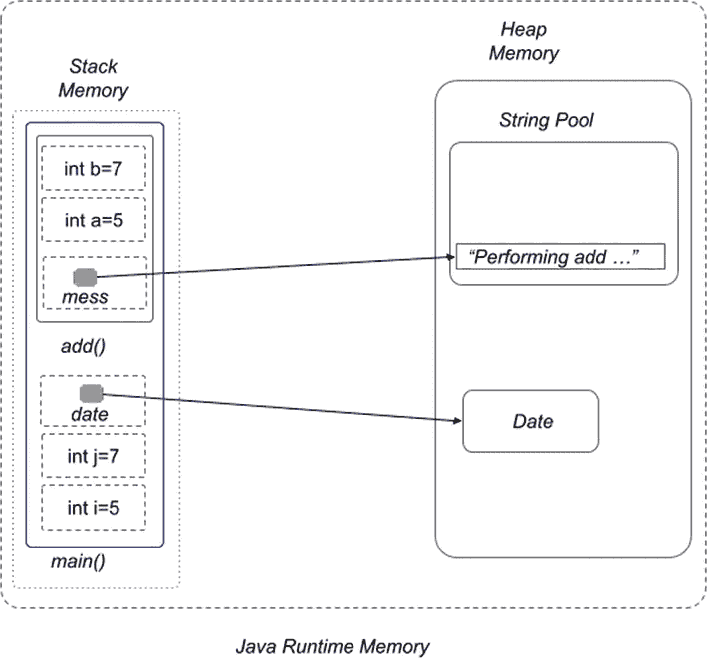

图 5-3

Java 栈和堆内存，在调用 add(..)方法

*   在第 10 行，方法`add(..)`用参数`i`和`j`调用。这意味着它们的值将被复制到这个名为`a`和`b`的方法的局部变量中，这两个变量将被存储在这个方法的内存块中。

*   在第 16 行的`add(..)`方法体内，声明了一个`String`实例。因此，`String`对象在堆内存中创建，在字符串池内存块中，名为`mess`的引用存储在栈中，在这个方法的内存块中。此时，程序存储器看起来如图 [5-3](#Fig3) 所示。

*   同样在第 10 行，方法`add(..)`的执行结果被存储到名为`result`的局部变量中。此时，`add(..)`方法已经完成了它的执行，所以它的栈块被丢弃了。因此，我们可以得出结论，只要创建变量的函数在运行，存储在栈中的变量就会一直存在。结果变量保存在`main(..)`方法的栈存储器中。

*   在第 11 行中，调用了 print 方法，但是为了简单起见，我们将跳过对这一行的解释。

*   在第 12 行中，`d`引用被赋予了一个`null`值，这意味着类型为`Date`的对象现在只在堆中，没有以任何方式链接到`main(..)`方法的执行。在这一行中，JVM 被告知不再需要该对象，因此可以安全地将其丢弃。这意味着包含它的空间可以被收集起来用于存放其他物品。

此时，程序存储器看起来如图 [5-4](#Fig4) 所示。

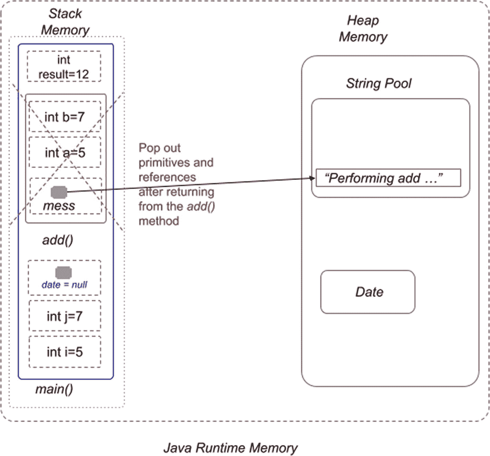

图 5-4

Java 栈和堆内存，在主(..)方法执行

显然，程序执行结束后，所有内存内容都将被丢弃。

从一个版本到另一个版本，Java 进行内存管理的方式有了一些小的变化——决定如何以及何时在堆中分配和释放空间的算法得到了优化——但是总的内存组织在过去几年中并没有太大的变化。

在申请 Java 开发人员职位时，你很可能会被问到栈内存和堆内存的区别。所以如果前一节没有为你澄清这两个观念，请随时查阅其他资源，比如这篇非常好的文章: [`https://www.journaldev.com/4098/java-heap-space-vs-stack-memory`](https://www.journaldev.com/4098/java-heap-space-vs-stack-memory) 。

## Java 数据类型简介

正如您在前面的例子中注意到的，在 Java 中，数据类型可以根据它们在执行过程中存储的位置和方式分成两大组:**原语**类型和**引用**类型。先简单介绍一下，稍后再解释他们最重要的成员。

### 原始数据类型

**原始类型**由 Java 编程语言定义为没有支持类的特殊类型，并由它们的保留关键字命名。这些类型的变量保存在栈存储器中，当使用`=`(等于)运算符给它们赋值时，值实际上被复制了。因此，如果我们声明两个类型为`int`的原始变量，如清单 [5-4](#PC4) 所示:

```java
package com.apress.bgn.five;

public class AnotherPrimitivesDemo {

    public static void main(String... args) {
        int k = 42;
        int q = k;
        System.out.println("k = " + k);
        System.out.println("q = " + q);
    }
}

Listing 5-4Code Sample Used to Discuss Primitives

```

我们最终得到两个变量，`k`和`q`，它们都有相同的值:`42`。当作为参数传递给其他方法时，原始值的值被复制和使用，而不修改初始变量。

这意味着在 Java 方法中，原始参数是通过值传递的。

这可以通过创建一个交换两个`int`变量的值的方法来证明。清单 [5-5](#PC5) 中描述了该方法的代码以及如何使用它。

```java
package com.apress.bgn.five;

public class SwappingPrimitivesDemo {
    public static void main(String... args) {
        int k = 42;
        int q = 44;
        swap(k, q);
        System.out.println("k = " + k);
        System.out.println("q = " + q);
    }

    static void swap(int a, int b) {
        int temp = a;
        a = b;
        b = temp;
    }
}

Listing 5-5Code Sample Used to Show Primitives Are Passed By Value

```

那么你认为什么会被打印成`k`和`q`的值呢？如果您认为输出与这里列出的一样，那么您是正确的。

```java
k = 42
q = 44

```

发生这种情况是因为在 Java 中，向方法传递参数是通过它们的值来完成的，这意味着对于原语来说，改变形参(方法参数)的值不会影响实际参数的值。如果你读了前一节，你已经可以想象在栈上发生了什么。当调用`swap(..)`方法时，会创建一个新的栈内存块来保存该方法使用的值。在方法执行期间，这些值可能会更改，但是如果它们没有被返回并赋给调用方法中的变量，则在方法执行结束时，这些值会丢失。图 [5-5](#Fig5) 描述了在前面列出的代码执行过程中发生在栈上的变化。


图 5-5

Java 通过值传递原始参数

### 参考数据类型

Java 中有 6 个**引用类型**:

*   类别类型

*   接口类型

*   枚举数

*   数组类型

*   记录

*   附注

引用类型不同于基本类型，因为这些类型是可实例化的(接口和注释除外)。这些类型的实例(对象)是通过调用构造函数创建的。这些类型的变量实际上只是对存储在堆中的对象的引用。因为引用也存储在栈中，所以即使我们修改前面的代码来使用引用，行为也是一样的。

清单 [5-6](#PC7) 引入了一个名为`IntContainer`的类，唯一的目的是将`int`原始值包装到对象中。

```java
package com.apress.bgn.five;

public class IntContainer {
    private int value;
    public IntContainer(int value) {
        this.value = value;
    }

    public int getValue() {
        return value;
    }
    public void setValue(int value) {
        this.value = value;
    }
}

Listing 5-6Code Sample Used to Show IntContainer

```

清单 [5-7](#PC8) 展示了这种类型的两个对象和它们的两个引用的创建，以及交换方法的新版本。

```java
package com.apress.bgn.five;

public class ReferencesDemo {

    public static void main(String... args) {
        IntContainer k = new IntContainer(42);
        IntContainer q = new IntContainer(44);
        swap(k,q);
        System.out.println("k = " + k.getValue());
        System.out.println("q = " + q.getValue());
    }

    static void swap(IntContainer a, IntContainer b) {
        IntContainer temp = a;
        a = b;
        b = temp;
    }
}

Listing 5-7Code Sample Used to Show Swap of Two int Values Using References

```

如果我们运行`main(..)`方法，您会注意到我们仍然得到:

```java
k = 42
q = 44

```

这怎么解释？Java 仍然使用相同风格的参数传递，**通过值**传递，只是这次引用的值是被传递的值。图 [5-6](#Fig6) 描述了在 JVM 管理的内存中执行前面代码的情况。

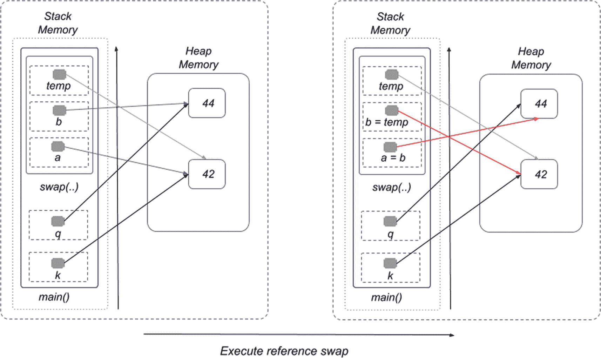

图 5-6

Java 通过值传递引用参数

对对象的引用在`swap(..)`方法的主体中互换，但是它们对 k 和 q 引用没有影响，对它们在堆中指向的对象也没有影响。为了真正交换值，我们需要通过使用一个新的对象来交换对象的内容。看看清单 [5-8](#PC10) 中描述的`swap(..)`方法的新版本。

```java
package com.apress.bgn.five;

public class ReferencesSwapDemo {

    public static void main(String... args) {
        IntContainer k = new IntContainer(42);
        IntContainer q = new IntContainer(44);
        swap(k,q);
        System.out.println("k = " + k.getValue());
        System.out.println("q = " + q.getValue());
    }
    static void swap(IntContainer a, IntContainer b) {
        IntContainer temp = new IntContainer(a.getValue());
        a.setValue(b.getValue());
        b.setValue(temp.getValue());
    }
}

Listing 5-8Code Sample Used to Show Swap of Two int Values Using References That Actually Swaps the Values

```

通过使用 setters 和 getters，我们可以交换对象的值，因为引用在方法体中不会被修改。图 [5-7](#Fig7) 描述了前一段代码执行期间内存中发生的情况。


图 5-7

Java 通过值传递引用参数，交换对象内容

也许这个例子介绍得太早了，但是它很重要，因此您可以尽早看到原始类型和引用类型之间的主要区别。我们将在总结中列出所有的差异；在此之前，我们先介绍一下 Java 中最常用的数据类型。

如果我们运行清单 [5-8](#PC10) 中的`main(..)`方法，您会注意到`k`和`q`的值被交换了，如这里描述的输出所示。

```java
k = 44
q = 42

```

### Java 原始类型

基本类型是 Java 中的基本数据类型。这种类型的变量可以通过直接分配该类型的值来创建，这样它们就不会被实例化。在 Java 中有八种基本类型:其中六种用于表示数字，一种表示字符，一种表示`boolean`值。基本类型是 Java 语言中预定义的，它们的名称是保留关键字。原始变量只能在为该类型预定义的区间或数据集中有值。当在实例化时被声明为类的字段时，特定于该类型的默认值被赋给该字段。原始值不与其他原始值共享状态。

大多数 Java 教程首先介绍数字类型，然后介绍最后两种，但是本书将从非数字类型开始。

#### `boolean`型

这种类型的变量只能有两个可接受的值之一:`true`和`false`。如果你听说过布尔逻辑，这应该是你熟悉的。在 Java 中，这种类型的值用于设置/取消设置标志和设计执行流。值`true`和`false`本身是保留关键字。

变量`boolean`的默认值为**假**。

另一个观察:当一个字段是类型`boolean`时，它的 getter 有不同的语法。不是以`get`为前缀，而是以`is`为前缀。Java IDEs 尊重这一点，并按预期生成 getters。这是有意义的，因为布尔值是用来做什么的。它们对于仅使用两个值的属性建模非常有用。例如，假设我们正在编写一个类来模拟一个转换过程。布尔字段可用于将流程状态标记为已完成或仍在进行中。如果字段的名称是`done`，一个名为`getDone()`的 getter 将会非常不直观和愚蠢，但是一个名为`isDone()`的 getter 将会完全相反。

清单 [5-9](#PC12) 描述了那个类，还展示了一个`main(...` `)`方法来测试`done`字段的默认值。

```java
package com.apress.bgn.five;

public class ConvertProcessDemo {
    /* other fields and methods */
    private boolean done;
    public boolean isDone() {
        return done;
    }
    public void setDone(boolean done) {
        this.done = done;
    }
    public static void main(String... args) {
        ConvertProcessDemo cp = new ConvertProcessDemo();
        System.out.println("Default value = " + cp.isDone());
    }
}

Listing 5-9Code Sample Used to Show Usage of boolean Fields

```

和预期的一样，打印的输出是:

```java
Default value = false

```

布尔类型与任何其他基元类型都不兼容；通过简单赋值(使用=)将布尔值赋给 int 变量是不可能的。显式转换也是不可能的。所以写这样的东西:

```java
boolean f = false;
int fi = (int) f;

```

导致如下所示的编译错误。

```java
> javac com/apress/bgn/five/PrimitivesDemo.java
com/apress/bgn/five/PrimitivesDemo.java:39: error: incompatible types: boolean cannot be converted to int
        int fi = (int) f;
                       ^
1 error

```

我们将在第**章** [**第 6 章**](06.html) 中添加更多关于这种类型的信息。

#### `char`型

`char`类型用于表示字符。这些值是表示 UTF-16 代码单元的 16 位无符号整数。char 变量的可能值的区间是从' \u0000 '到' \ uffff '包括这两个值；作为数字，这意味着从 0 到 65535。这意味着我们实际上可以尝试打印完整的值集。由于字符的表示是数字，这意味着我们可以将前面提到的区间值转换成字符值。

清单 [5-10](#PC16) 打印 char 区间的所有数值及其匹配字符。

```java
package com.apress.bgn.five;

public class CharListerDemo {
    public static void main(String... args) {
        for (int i = 0; i < 65536; ++i ) {
            char c = (char) i;
            System.out.println("c[" + i + "]=" + c);
        }
    }
}

Listing 5-10Code Sample Used to Print All char Values

```

循环语句输出的最后一个`char`值是 65535。65536 值仅用作最大值上限。所以如果`i=65336`，那么什么都不打印，语句执行结束。`for`回路将在**章节** [** 7 **](07.html) 中详细介绍。

根据操作系统的不同，某些字符可能不受支持。这意味着它们不会被显示，或者它们将被替换为虚假字符。空白字符也是如此。

如果你觉得专用于表示字符的区间太大，只要滚动控制台就明白为什么了。UTF-16 字符集包含所有数字字符、所有分隔符、中文和阿拉伯语字符以及更多符号。 <sup>[1](#Fn1)</sup>

#### 数字原始类型

在到目前为止介绍 Java 语言基础的代码示例中，我们主要使用了类型为`int`的变量，但是在 Java 中有不止一种数字原语类型。Java 定义了六种基本的数字类型。它们中的每一个在一定数量的位上都有特定的内部表示，这显然意味着它们受到最小值和最大值的限制。有四种数值类型表示整数值，两种数值类型表示实数。在图 [5-8](#Fig8) 中，你可以看到整数(非实数)类型和每种类型值的区间。


图 5-8

Java 数字整数(非实数)类型

计算机中的任何东西都是用比特信息来表示的；每一位只能有 1 或 0 的值，这也是它被称为**二进制表示**的原因。二进制表示不是本书的重点，但会简短提及，因为它很重要。你可能想知道为什么我们的计算机选择了二进制表示。这主要是因为数据(在内存和硬盘上)是使用一系列 1(开)和 0(关)二进制表示来存储的；此外，二进制运算真的很容易做到，这使得计算机非常快。

让我们以数学为例:我们广泛使用十进制，它由从 0 到 9 的 10 个唯一的数字组成。计算机内部使用二进制系统，只使用两个数字:0 和 1。为了表示大于 1 的数字，我们需要更多的位。所以在十进制系统中，我们有 0，1，2，3，4，5，6，7，8，9，10，11 等等。在二进制系统中，我们只有两位数来表示数字，所以我们会有 0，1，10，11，100，101，110，111，1000 等等。如果你想象一个盒子，里面只能放 1 和 0，像计算机一样表示数字，随着数字变大，你需要越来越多。由于一个位只能有两个值，所以要表示的值的数量由 2 的幂来定义。只看图 [5-9](#Fig9) 。

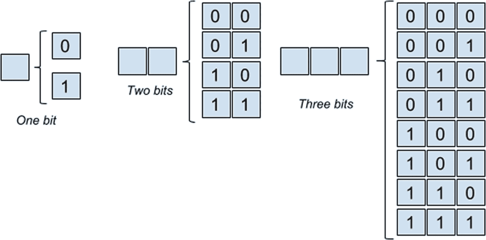

图 5-9

二进制数字表示

在一位上我们可以表示两个值，就是 2<sup>1</sup>；在两位上我们可以表示四个值，也就是 2<sup>2</sup>；等等。这就是我们将如何引用 Java 原始数字类型表示边界，有时还包括一个符号位。

#### Java 整数基本类型

下面的列表包含整数基元类型及其边界。

*   `byte`用于表示-2 <sup>7</sup> 和 2 <sup>7</sup> -1 之间的数([-128，127])。字节字段的默认值为 0，用 8 位表示。

*   `short`用于表示-2 <sup>15</sup> 和 2 <sup>15</sup> -1 之间的数字([-32768，32767])。此类型的间隔是`byte`间隔的超集；因此，字节值可以安全地赋给短变量，而不需要显式转换。这适用于所有区间为字节类型的超集的类型。在下一个代码片段中，一个字节值被赋给一个短变量，代码编译并在执行时打印 23。`short`字段的默认值为 0，用 16 位表示。

*   `int`用于表示-2 <sup>31</sup> 和 2 <sup>31</sup> -1 之间的整数([-2147483648，2147483647])。`int`字段的默认值为 0，用 32 位表示。

*   `long`用于表示-2 <sup>63</sup> 和 2 <sup>63</sup> -1 之间的整数([-9223372036854775808，9223372036854775807])`long`字段的默认值为 0，用 64 位表示。

    在实践中，有时需要处理区间之外的整数。对于这些情况，Java 中有一个名为`BigInteger`的特殊类(一个类，而不是一个基本类型),它分配存储任意大小的数字所需的内存。使用`BigInteger`的操作可能会很慢，但这是处理大量数据的代价。

```java
byte bv = 23;
short sbv = bv;
System.out.println("byte to short: " +   sbv);

```

#### Java 实数原始类型

说到算术，除了整数之外，我们还有`real`数，它们非常有用，因为大多数价格和程序执行的大多数算术运算都不会产生整数。实数包含小数点和小数点后的小数。为了在 Java 中表示实数，定义了两种基本类型，称为**浮点类型**。浮点类型有`float`和`double`。这里将详细介绍每一项功能:

*   `float`用于表示二进制浮点算术 IEEE 标准 ANSI/IEEE 标准 754-1985 (IEEE，纽约)中规定的单精度 32 位格式 IEEE 754 值。默认值为 0.0。与相同位宽的定点变量相比，浮点变量可以表示更大范围的数字，但精度会受到影响。类型为`int`或`long`的值可以分配给类型为`float`的变量。实际发生了什么，为什么精度会下降？一个数用浮点数和指数表示，指数实际上是 10 的幂。因此，当浮点数乘以 10 的这个指数幂时，应该会得到初始数。让我们取最大的 long 值，并将其赋给一个 float 变量，然后检查打印的内容。

```java
float maxLongF = Long.MAX_VALUE;
System.out.println("max long= " + Long.MAX_VALUE);
System.out.println("float max long= " + maxLongF);

```

漫长的。MAX_VALUE 是一个最终的静态变量，它被赋予了最大的 long 值:9223372036854775807。前面的代码会打印出什么？以下内容:

```java
max long= 9223372036854775807
float max long= 9.223372E18

```

如你所见，maxLongF 数应该等于 9223372036854775807，但是因为它被表示为一个更小的数和 10 的幂，所以失去了精度。如果我们将 9.223372 乘以 10 <sup>18</sup> 来重构整数，我们将得到 922337200000000000。很接近，但还不够接近。那么 float 的区间边缘是什么呢？Float 用来表示 1.4E <sup>-45</sup> 和 2 <sup>128</sup> * 10 <sup>38</sup> 之间的实数。

*   `double`用于表示 IEEE 二进制浮点运算标准 ANSI/IEEE 标准 754-1985 (IEEE，New York)中规定的单精度 64 位格式 IEEE 754 值，用于表示 4.9E <sup>-324</sup> 和 2 <sup>127</sup> * 10 <sup>308</sup> 之间的数字。默认值为 0.0。

值`0`和`0.0(double)`在 Java 中是不同的。对于普通用户来说，它们都意味着零，但是在数学中，带小数点的那个更精确。尽管如此，在 Java 中我们被允许比较一个`int`值和一个`float`值，如果我们比较`0`和`0.0`，结果将是它们相等。同样，正零和负零被认为是相等的；因此，比较结果`0.0==-0.0`也为真。

在本节的最后，还应该强调的是，开发人员不能通过从头开始定义或扩展现有的基元类型来定义基元类型。类型名是**保留的 Java 关键字**，不能被开发者重新定义。禁止声明以这些类型命名的字段、方法或类名。

正如您到目前为止所注意到的，我们打算使用的变量必须先声明，然后再使用。当它被声明时，也可以关联一个值。对于原始值，一个数可以有多种写法。在清单 [5-11](#PC20) 中，你可以看到一些例子，当变量被初始化或赋值后，数值是如何被写入的。

```java
package com.apress.bgn.five;

public class NumericDemo {
    private byte b;   // default value 0
    private short s;  // default value 0
    private int i;    // default value 0
    private long l;   // default value 0
    private float f;  // default value 0.0
    private double d; // default value 0.0

    public static void main(String... args) {
        NumericDemo nd = new NumericDemo();

        nd.b = 0b1100;
        System.out.println("Byte binary value: " + nd.b);

        nd.i = 42 ;  // decimal case

        nd.i = 045 ; // octal case - base 8
        System.out.println("Int octal value: " + nd.i);

        nd.i = 0xcafe ; // hexadecimal case - base 16
        System.out.println("Int hexadecimal value: " + nd.i);

        nd.i = 0b10101010101010101010101010101011;
        System.out.println("Int binary value: " + nd.i);

        //Starting with Java 7 ‘_’ can be used in numeric values
        nd.i = 0b1010_1010_1010_1010_1010_1010_1010_1011;
        System.out.println("Int binary value: " + nd.i);

        nd.l = 1000_000l; // equivalent to 1000_000L
        System.out.println("Long value: " + nd.l);

        nd.f = 5;
        System.out.println("Integer value assigned to a float variable: " + nd.f);

        nd.f = 2.5f; // equivalent to nd.f = 2.5F;
        System.out.println("Decimal value assigned to a float variable: " + nd.f);

        nd.d = 2.5d; // equivalent to nd.d = 2.5D;
        System.out.println("Decimal value assigned to a double variable: " + nd.f);
    }
}

Listing 5-11Code Sample Used to Print Primitive Values in Multiple Ways

```

从前面的清单中可以看出，整数在 Java 中有四种表示方式:

*   **十进制**:以 10 为基数，用数字 0 到 9 书写。

*   **八进制**:基数 8，用数字 0 到 7 书写，前缀为 0(零)；这意味着数字 8 在八进制中表示为 010 位。

*   **十六进制**:基数 16，用数字 0 到 9 和字母 A 到 F 书写，小写或大写，前缀为`0x`或`0X`；这意味着数字 10 以十六进制表示为 0x00A，11 表示为 0x00B，依此类推，直到集合中的字母结束，16 表示为 0x010。

*   **二进制(基数 2)** :基数 2，用数字 0 和 1 书写，前缀为`0b`或`0B`。这一点在解释 bits 时已经讲过了。

你可以在计算机编程书籍中读到更多关于数字表示的内容，但是除非你最终从事一些需要你做数学运算的项目，否则你很少会用到十进制以外的表示。

从 Java 7 开始，在声明数值时允许使用“_”(下划线)，以便将数字组合在一起并增加清晰度。有一些限制，比如我们:

*   “_”不能用在数值的开头或结尾。

*   “_”不能用于字节值。

*   “_”不能用在表示基数的数字或符号旁边(0b/0B 表示二进制，0 表示八进制，0x/0X 表示十六进制)。

*   “_”不能用在小数点旁边。

清单 [5-11](#PC20) 中被执行的代码的输出在清单 [5-12](#PC21) 中描述。

```java
Byte binary value: 12
Int octal value: 37
Int hexadecimal value: 51966
Int binary value: -1431655765
Int binary value: -1431655765
Long value: 1000000
Integer value assigned to a float variable: 5.0
Decimal value assigned to a float variable: 2.5
Decimal value assigned to a double variable: 2.5

Listing 5-12Output Resulted by Executing the Code in Listing 5-11

```

由于打印变量时没有格式化，控制台中显示的值是十进制的。

目前，这就是关于基本类型的所有内容。每个基本类型都有一个在 JDK 中定义的匹配的引用类型，这将在本章后面提到。

#### Java 引用类型

前面给出了 Java 引用类型的简短描述，以尽早强调原始类型和引用类型之间的区别。现在是时候扩展这个描述了，并给出一些编程时最常用的 JDK 引用类型的例子。

*对象*或*实例*是使用`new`关键字创建的，后跟对构造函数的调用。构造函数是一个类的特殊成员，用于通过用默认值或作为参数接收的值初始化类的所有字段来创建对象。通过调用类构造函数(其中之一，因为在类中可能定义了多个构造函数)来创建类实例。考虑我们在第 [4](04.html) 章`Performer`类中的例子，为了声明对`Performer`类型对象的引用，使用了下面的表达式:

```java
Performer human = new Performer("John", 40, 1.91f, Gender.MALE);

```

接口引用类型不能被实例化，但是实现该接口的类类型的对象可以被分配给该接口类型的引用。第 [4](04.html) 章中使用的层级如图 [5-10](#Fig10) 所示。


图 5-10

类和接口层次结构

基于这个层次结构，清单 [5-13](#PC23) 中的四个语句是有效的；他们编译，代码可以成功执行。

```java
package com.apress.bgn.five;

import com.apress.bgn.four.classes.Gender;
import com.apress.bgn.four.hierarchy.*;

public class ReferencesDemo {

    public static void main(String... args) {
        Performer performer = new Performer("John", 40, 1.91f, Gender.MALE);
        Human human = new Performer("Jack", 40, 1.91f, Gender.MALE);
        Actor actor = new Performer("Jean", 40, 1.91f, Gender.MALE);
        Musician musician = new Performer("Jodie", 40, 1.71f, Gender.FEMALE);
    }
}

Listing 5-13Code Sample Showing Different Reference Types

```

在前面的例子中，我们创建了四个类型为`Performer`的对象，并将它们分配给不同的引用类型，包括两个接口引用类型。如果我们用前面的方法检查栈和堆的内容，我们会发现下面的内容(图 [5-11](#Fig11) ):


图 5-11

多个引用类型

前一个例子中的所有引用都指向堆中的不同对象。让不同类型的引用指向同一个对象也是可能的，如清单 [5-14](#PC24) 所示。

```java
package com.apress.bgn.five;

import com.apress.bgn.four.classes.Gender;
import com.apress.bgn.four.hierarchy.*;

public class ReferencesDemo {

    public static void main(String... args) {
        Performer performer = new Performer("John", 40, 1.91f, Gender.MALE);
        Human human = performer;
        Actor actor = performer;
        Musician musician = performer;
    }
}

Listing 5-14Code Sample Showing Different Reference Types Pointing to the Same Object

```

在前面的代码片段中，我们只创建了一个对象，但是对它有多个不同类型的引用。如果我们再次检查栈和堆的内容，对于前面的方法，我们会发现下面的内容(图 [5-12](#Fig12) ):

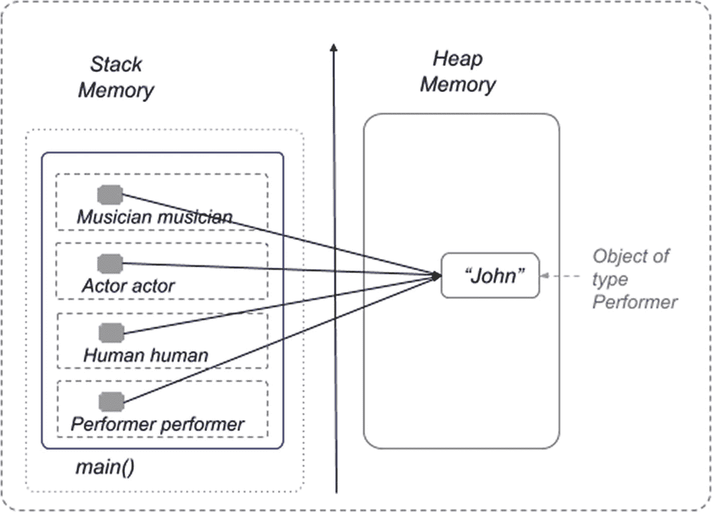

图 5-12

多个引用类型，第二个示例

引用只能是被赋值对象的类型或超类型，所以清单 [5-15](#PC25) 中的赋值不会被编译。

```java
package com.apress.bgn.five;

import com.apress.bgn.four.classes.Gender;
import com.apress.bgn.four.hierarchy.*;

public class BadReferencesDemo {

    public static void main(String... args) {
        Performer performer = new Performer("John", 40, 1.91f, Gender.MALE);
        Human human = performer;
        Actor actor = performer;
        Musician musician = performer;
        //these will not compile!!!
        performer = musician;
        //or
        performer = human;
        //or
        performer = actor;
    }
}

Listing 5-15Code Sample Showing Assignments Failing at Compile Time

```

这是因为这些方法是在引用类型上调用的，所以引用指向的对象必须有这些方法。这就是为什么 Java 编译器会报错，这就是为什么智能编辑器会用红线在语句下画线来通知您。在前面的例子中，修复编译错误最简单的方法是显式转换为`Performer`类型。但这并不意味着代码将可运行。

证明这一点最简单的方法是创建一个名为`Fiddler`的类，它实现了`Musician`，并将这个类的一个实例分配给一个`Performer`引用。将`Fiddler`实例显式转换为`Performer`是欺骗编译器接受该代码为有效代码所必需的，如清单 [5-16](#PC26) 中的标记行所示。

```java
package com.apress.bgn.five;

import com.apress.bgn.four.classes.Gender;
import com.apress.bgn.four.hierarchy.*;

public class BadReferencesDemo {

    public static void main(String... args) {
        Musician fiddler = new Fiddler(true);
        Performer performer = (Performer) fiddler;
        System.out.println("Learned the skill at: " + performer.getSchool());
        System.out.println("Appeared in movies: " + performer.getFilms());
    }
}

class Fiddler implements Musician {
    private boolean ownsFiddle = false;

    public Fiddler(boolean ownsFiddle) {
        this.ownsFiddle = ownsFiddle;
    }

    @Override
    public String getSchool() {
        return "Irish Conservatory";
    }

// other methods omitted
}

Listing 5-16Code Sample Showing Assignments Failing at Runtime

```

`Fiddler`实例被显式转换为`Performer`，编译器接受了这一点，因为它假设我们知道自己在做什么。然后将转换后的实例赋给类型为`Performer`的引用，然后在其上调用方法`getSchool()`和`.getFilms()`。

运行前面的代码时，您会期望`performer.getSchool()`方法被正确执行，并在控制台中打印出“在:爱尔兰音乐学院学到的技能”,因为毕竟类`Fiddler`实现了`Musician`,并为`getSchool()`提供了具体的实现。您还会期望在执行下一行时抛出一个异常；调用`performer.getFilms()`是不可能的，因为类`Fiddler`没有实现`Actor`，也没有为`getFilms()`方法提供具体的实现。

但是这不是 JVM 做事的方式。实际上，在运行这段代码时，在执行转换行时会抛出一个异常，因为一个`Fiddler`实例不能转换成一个`Performer`实例。类似这样的消息将在控制台中以红色打印出来。

```java
Exception in thread "main" java.lang.ClassCastException:
    class com.apress.bgn.five.Fiddler cannot be cast to class com.apress.bgn.four.hierarchy.Performer (com.apress.bgn.five.Fiddler is in module chapter.five.primitives of loader 'app'; com.apress.bgn.four.hierarchy.Performer is in module chapter.four of loader 'app') at chapter.five.primitives/com.apress.bgn.five.BadReferencesDemo.main(BadReferencesDemo.java:56)

```

#### 数组

关键字`new`也可以用来创建`arrays`，与创建对象的方式类似。`array`是一种将一组值保存在一起的数据结构。它的大小是在创建时定义的，不能更改。可以使用索引来访问每个变量，索引从 0 开始，一直到数组-1 的长度。数组可以保存原始值和引用值。清单 [5-17](#PC28) 包含一个类，该类声明了一个数组字段，该字段将`int`的值组合在一起。

```java
package com.apress.bgn.five;

public class ArrayDemo {

    int array[];

    public static void main(String... args) {
        ArrayDemo ad = new ArrayDemo();
        System.out.println("array was initialized with " + ad.array);
    }
}

Listing 5-17Class with int Array Field

```

根据括号的位置，有两种方法来声明数组:在数组名之后或在数组元素类型之后:

`int array[];`

`int[] array;`

了解这一点很重要，因为如果你有兴趣获得 Java 知识认证， <sup>[2](#Fn2)</sup> 考试可能会包含关于声明数组的正确方法的问题。

当前面的代码被执行时，你认为会在控制台中打印出什么？如果您假设`ad.array`字段将以`null`开头，并且打印的消息将是“array was initialized with null”，那么您的假设非常正确。

数组是引用类型，即使它们包含原始类型的元素，因此当让 JVM 用默认值初始化这种类型的字段时，将使用`null`，因为这是引用类型的典型默认值。前面提到了`null`这个关键词，不过还是强调一下它的重要性吧。`null`关键字用于表示一个不存在的值。被赋予此值的引用没有被赋予具体的对象；它不指向堆中的对象。这就是为什么在编写代码时，如果一个对象在初始化之前被使用(通过它的引用)，就会抛出一个`NullPointerException`。这就是为什么开发人员在使用对象(或数组)之前要测试是否等于`null`。

前面的代码片段可以写得更好一点，考虑到数组成为`null`的可能性，并使用`return`关键字优雅地退出`main(..)`方法，如清单 [5-18](#PC29) 所示。

```java
package com.apress.bgn.five;

public class ArrayDemo {

    int array[];

    public static void main(String... args) {
        ArrayDemo ad = new ArrayDemo();
        if (ad.array == null) {
            System.out.println("Array unusable. Nothing to do.");
            return;
        }
    }
}

Listing 5-18Class with int Array Field That Can Be Null

```

当使用 void 关键字声明一个方法不返回任何东西时，可以通过返回来强制执行来自该方法的正确返回；没有值的语句。回归；语句在前面的代码示例中并不真正必要，它只是作为一个示例，说明如何编写代码以在显式执行点从方法返回。

为什么我们需要`null`关键字来标记还不存在的东西？因为编程中的惯例是首先声明一个引用，只有在第一次使用时才初始化它。这对于需要分配大量内存的大型对象尤其有用。这种编程技术被称为**惰性加载**(也称为异步加载)**。**

清单 [5-19](#PC30) 描述了一个更加进化版本的`ArrayDemo`类，其中数组字段被初始化，并为其设置大小。

```java
01\. package com.apress.bgn.five;
02.
03\. public class ArrayDemo {
04.
05\.   int array[] = new int[2];
06.
07\.   public static void main(String... args) {
08\.        ArrayDemo ad = new ArrayDemo();
09\.        if (ad.array == null) {
10\.            System.out.println("Array unusable. Nothing to do.");
11\.            return;
12\.        }
13.
14\.        for (int i = 0; i < ad.array.length; ++i) {
15\.            System.out.println("array["+ i +"]= " + ad.array[i]);
16\.        }
17\.    }
18\. }

Listing 5-19Class with int Array Field That is Initialized Properly

```

`array`的初始化发生在第 5 行。数组的大小是 2。数组的大小是作为一个参数给定的，它看起来像是一个构造函数调用，只是用方括号代替了圆括号，并以数组组合在一起的元素的类型为前缀。通过将数组的维数设置为 2，我们告诉 JVM 必须为这个对象留出(分配)两个相邻的内存位置来存储两个`int`值。因为没有值被指定为数组内容，您认为当数组被创建时，它们将被填充什么？这是一个简单的例子:前面的数组被定义为由两个`int`值组成，所以当数组被初始化时，将使用`int`类型的默认值。

图 [5-13](#Fig13) 描述了当前面的代码被执行时，在栈和堆内存中会发生什么。

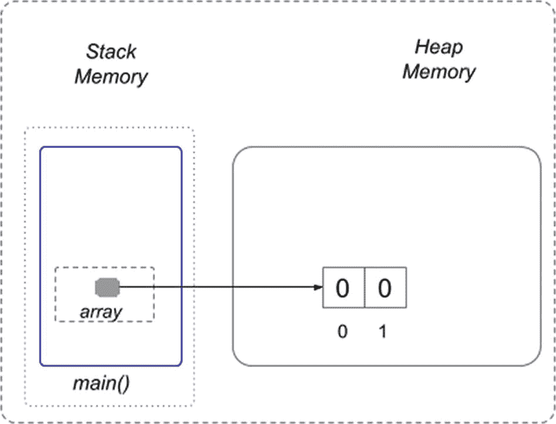

图 5-13

声明一个大小为 2 的 int 数组

在第 14 到 16 行中，for 循环用于打印数组的值。`int i`变量就是我们所说的索引变量，用于遍历数组的所有值，在循环的每一步中递增 1。`array.length`是包含数组大小的属性——数组包含多少个元素。正如您可能预料的那样，控制台中打印的输出是:

```java
array[0]= 0
array[1]= 0

```

要将一些值放入数组中，我们有以下几种选择:

*   我们直接访问元素，并设置值:

*   我们用想要存储的值显式初始化数组:

```java
array[0] = 5;
array[1] = 7;
//or
for (int i = 0; i < array.length; ++i) {
    array[i] = i;
}

```

```java
int another[] = {1,4,3,2};

```

数组也可以对引用进行分组。清单 [5-20](#PC34) 描述了如何声明和使用`Performer`数组。

```java
package com.apress.bgn.five;

import com.apress.bgn.four.classes.Gender;
import com.apress.bgn.four.hierarchy.Performer;

public class PerformerArrayDemo {
    public static void main(String... args) {
        Performer[] array = new Performer[2];
        for (int i = 0; i < array.length; ++i) {
            System.out.println("performer[" + i + "]= " + array[i] );
        }
        array[0] = new Performer("Julianna", 35, 1.61f, Gender.FEMALE);
        array[1] = new Performer("John", 40, 1.91f, Gender.MALE);
        for (int i = 0; i < array.length; ++i) {
            System.out.println("performer[" + i + "]= " + array[i].getName() );
        }
    }
}

Listing 5-20Class Creating a Performer Array

```

在显式初始化之前，数组的元素用`Performer`类型的默认值初始化。因为`Performer`是一个引用类型，所以这个值是`null`。

因为描述内存内容使得数组和对象发生的事情更加明显，我给你图 [5-14](#Fig14) 。

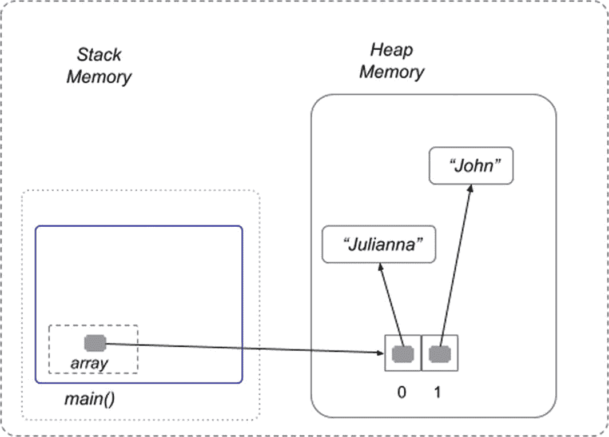

图 5-14

声明大小为 2 的执行者数组

所以是的，我们实际上有一个引用数组，它们指向的对象可以在程序中改变。

这里我需要介绍的最后一件事是数组可以是多维的。如果你学过高等数学，你可能还记得*矩阵*的概念，它是按行和列排列的矩形阵列。在 Java 中，你可以通过使用数组来模拟*矩阵*。如果你想要一个有行和列的简单矩阵，你只需要定义一个二维的数组。清单 [5-21](#PC35) 中描述了一个非常简单的例子。

```java
package com.apress.bgn.five;

public class MatrixDemo {

    public static void main(String... args) {
        // bi-dimensional array: 2 rows, 2 columns
        int[][] intMatrix = {{1, 0}, {0, 1}};
        int[][] intMatrix2 = new int[2][2];
        for (int i = 0; i < intMatrix2.length; ++i) {
            for (int j = 0; j < intMatrix2[i].length; ++j) {
                intMatrix2[i][j] = i + j;
                System.out.print(intMatrix[i][j] + " ");
            }
            System.out.println();
        }
    }
}

Listing 5-21Class Modelling a Matrix Using a 2-Dimensional Array

```

你甚至可以去多维，并定义尽可能多的坐标。在清单 [5-22](#PC36) 中，我们用一个三维数组模拟了一个立方体。

```java
package com.apress.bgn.five;

public class CubeDemo {

    public static void main(String... args) {
        // three-dimensional array with three coordinates
        int[][][] intMatrix3 = new int[2][2][2];
        for (int i = 0; i < intMatrix3.length; ++i) {
            for (int j = 0; j < intMatrix3[i].length; ++j) {
                for (int k = 0; k < intMatrix3[i][j].length; ++k) {
                    intMatrix3[i][j][k] = i + j + k;
                    System.out.print("["+i+", "+j+", " + k + "]");
                }
                System.out.println();
            }
            System.out.println();
        }
    }
}

Listing 5-22Class Modelling a Cube Using a 3-Dimensional Array

```

对于数组，在内存允许的情况下，根据需要将它们设置得尽可能大，但是要确保对它们进行初始化，并确保在代码中不尝试访问超出允许范围的索引。如果一个数组的大小是 **N** ，那么它的最后一个索引是 **N-1** ，第一个是 **0** 。试图访问该范围之外的任何索引，将在运行时抛出类型为`java.lang.ArrayIndexOutOfBoundsException`的异常。所以如果你像这样写代码:

```java
int array = new int[2];
array[5] =7;

```

虽然它可以编译，但是执行失败，因为抛出了一个异常。控制台中将打印以下内容:

```java
Exception in thread "main" java.lang.ArrayIndexOutOfBoundsException: Index 5 out of bounds for length 2 at chapter.five.arrays@1.0-SNAPSHOT/com.apress
    .bgn.five.ArrayDemo.main(ArrayDemo.java:49)

```

为了更容易地处理 Java 中的数组，有一个特殊的类:`java.util.Arrays`。这个类提供了一些实用的方法来排序和比较数组，搜索元素，或者将它们的内容转换成文本或流(**章节** [**8**](08.html) )，这样它们就可以被打印出来，而不需要编写示例中使用的冗长的`for`循环。清单 [5-23](#PC39) 描述了其中一些实用方法。

```java
package com.apress.bgn.five;

import java.util.Arrays;

public class ArrayUtilitiesDemo {
    public static void main(String... args) {
        int[] array =  {4, 2};
        System.out.println(Arrays.toString(array));
        // or
        Arrays.stream(array).forEach(ai -> System.out.println(ai));
        // or using a method reference
        Arrays.stream(array).forEach(System.out::println);

        Arrays.sort(array);

        array = new int[]{4, 2, 1, 5, 7};
        int foundAt = Arrays.binarySearch(array, 5);
        System.out.println("Key found at: " + foundAt);
    }
}
// output
[4, 2]
4
2
4
2
Key found at: -11

Listing 5-23java.util.Arrays
Useful Methods

```

在下面的列表中可以找到对前面代码清单中每个语句的简短解释:

1.  `int[] array = {4, 2}`是数组声明和初始化。不需要`new int[]`,因为编译器可以从数组的声明中计算出元素的类型，从为初始化提供的一组值的大小中计算出数组的大小。

2.  `Arrays.toString(array)`返回指定数组内容的字符串表示。元素字符串表示由逗号分隔，结果字符串用方括号括起来(`[]`)。

3.  `Arrays.stream(array)`返回一个以指定数组为源的序列`IntStream`。流包含在一个专门的章节中(**章节** [**8**](08.html) )，这些类提供了逐个处理元素的方法，不需要`for`循环。在前面的代码片段中，结果流的元素是使用`System.out.println(..)`方法处理的，这意味着它们被一个接一个地打印在控制台中。

4.  `Arrays.sort(array)`将指定数组按数字升序排序。此方法不返回新的排序数组，因此元素在原始数组中的位置会发生变化。用于执行排序的算法被称为**双枢纽快速排序**，是最有效的排序算法之一。 <sup>[3](#Fn3)</sup>

5.  `array = new int[]{4, 2, 1, 5, 7}`是数组的重新初始化。这意味着一个新的数组值被分配给`array`引用。所以声明必须指定`new`关键字以及类型和数组大小，除非一组元素用于初始化；这正是该语句的情况，因此大小不是强制性的。

6.  `Arrays.binarySearch(array, 5)`在数组中搜索作为参数提供的值(在本例中为 5)，并返回一个表示元素在数组中的位置的值(因此，它的索引)。用于搜索的算法被称为**二分搜索法**，其工作原理是将数组重复分成两部分，直到找到元素。这种技术被称为 Divide-et-Impera(或 **Divide-and-conquer** )，它涉及到将一个大问题反复(递归地)分割成更小的问题，直到它们可以被轻松解决。对数组进行排序时，数组上的二分搜索法效率最高。

    请随意在网上搜索本节提到的算法，因为当你需要开发自己的解决方案时，理解这些算法是很有用的。**章节** [**7**](07.html) 将向您展示如何按照几个简单且众所周知的算法编写代码。

#### `String`型

我们列表中的下一个特殊 Java 数据类型是`String`。与原语`int`一起，这是 Java 中最常用的类型之一。`String`实例用于对文本建模并对其执行各种操作。String 类型是一种特殊的类型，因为 JVM 对这种类型的对象进行了特殊处理。如果您还记得第一个带有内存内容的映像，那么`String`对象被分配到堆中一个叫做**字符串池**的特殊位置。在本节中，我们将详细介绍这种类型，到目前为止，您可能会遇到的许多问题都有望得到解答。

直到现在`String`变量在本书中被声明，如清单 [5-24](#PC40) 所示:

```java
package com.apress.bgn.five;

public class SimpleStringDemo {
    public static void main(String... args) {
01\.        String text1 = null;
02.
03\.        String text21 = "two";
04\.        String text22 = "two";
05\.        String text23 = new String ("two");
06.
07\.        String piece1 = "t";
08\.        String piece2 = "wo";
09\.        String text24 = piece1 + piece2;
10.
11\.        char[] twoCh = {'t', 'w', 'o'};
12\.        String text25 = new String(twoCh);
    }
}

Listing 5-24A few String Statements Used in This Book

```

如您所见，第 3、4、5、9 和 12 行中的每一行都定义了一个具有相同内容*【两个】*的`String`对象。我故意这样做的原因很快就会变得显而易见。在现实世界的应用程序中，尤其是在这个大数据炒作时期，应用程序处理大量数据，其中大部分是文本形式的。因此，能够压缩数据并重用它将减少内存消耗。减少内存访问尝试通过减少处理来提高速度，从而降低成本。

`String`变量可以直接用文本值初始化(第 3 行和第 4 行)。在这种情况下，JVM 首先在字符串池中寻找具有相同值的`String`对象。如果找到了，新的`String`变量用对它的引用来初始化。如果没有找到，就分配内存，将文本值写入其中，并用对它的引用初始化新的`String`变量。

在第 5 行，类`String`的构造函数被用来创建一个`String`对象。注意这里使用了`new`关键字。这意味着正在显式请求分配内存来存储作为参数提供的文本。

在继续这一节之前，我们必须做一个小而重要的旁注，提及**对象相等**在 Java 中的含义。在 Java 中，对象是通过引用它们的内存位置来处理的。`==` (double equals)运算符比较引用所指向的内存位置，因此当且仅当两个对象存储在同一个内存地址时，它们才是相等的。这就是为什么应该使用`equals(..)`方法来比较对象。这是一个从`Object`类继承的特殊方法，但是每个类都必须提供自己的实现，这个实现真正与自己的结构相关。正如所料，Object 类中的`equals(..)`实现默认为`==`行为。

想一想两个红色的球。它们有相同的直径，相同的颜色，由相同的材料制成。它们是相同的，这翻译成 Java 是相等的，但它们不是同一个球；它们只是使用相同的规格创建的。如果你随便找两个孩子，比如吉姆和简，每个人都可以玩自己的球。但是如果 Jim 和 Jane 玩同一个球，只是把它从一个球扔向另一个球，这与 Java 中的引用相等非常相似。图 [5-15](#Fig15) 是这种情况的抽象表示。


图 5-15

用红球显示等号和==之间的区别

清单 [5-25](#PC41) 描述了一个简单版本的`Ball`类，以及一个可执行代码样本，它创建了两个独立的球对象并对它们进行比较，但也创建了一个球来测试引用的相等性。因为 Jim 和 Jane 可以被认为是对一个球的引用，所以代码是这样写的。

```java
package com.apress.bgn.five;

import java.util.Objects;

public class EqualsDemo {

    public static void main(String... args) {

        Ball jim = new Ball(10, "red", "rubber");
        Ball jane = new Ball(10, "red", "rubber");

        System.out.println("-- Playing with different balls -- ");
        System.out.println("Jim and Jane have equal balls? A:" + jim.equals(jane));
        System.out.println("Jim and Jane have the same ball? A:" + (jim == jane));

        System.out.println("-- Playing with the same ball -- ");
        Ball  extra = new Ball(10, "red", "rubber");
        jim= extra;
        jane = extra;
        System.out.println("Jim and Jane have equal balls? A:" + jim.equals(jane));
        System.out.println("Jim and Jane have the same ball? A:" + (jim == jane));
    }
}

class Ball {
    int diameter;
    String color;
    String material;

    @Override
    public boolean equals(Object o) {
        Ball ball = (Ball) o;
        return diameter == ball.diameter
            && Objects.equals(color, ball.color)
            && Objects.equals(material, ball.material);
    }

    // other code omitted
}

Listing 5-25Code Sample Showing Differences Between equals(..) and == on References

```

执行前面清单中的代码应该会产生以下输出:

```java
-- Playing with different balls --
Jim and Jane have equal balls? A:true
Jim and Jane have the same ball? A:false
-- Playing with the same ball --
Jim and Jane have equal balls? A:true
Jim and Jane have the same ball? A:true

```

前面的代码示例很好地指出了' == '操作符和引用上的`equals(..)`方法之间的区别:`==`操作符测试引用的相等性，而`equals(..)`方法测试这些引用所指向的对象的相等性。这里介绍的`equals(..)`方法实现是幼稚的，因为应该考虑可空性和与不同类型对象的比较。然后还有一个`hashCode()`方法，当`equals(..)`为时，它必须被实现，否则你的类将不能和一些集合类一起正常工作，这将在本章后面讨论。但是现在，我真的希望对象相等和引用相等之间的区别是清楚的，这样接下来的`String`部分才有意义。

对象相等括号现在已关闭。

在 Java 中`String`实例是**不可变的**，这意味着它们一旦被创建就不能被改变。`String`类也被声明为`final`，所以开发者不能扩展它。`String`实例在 Java 中不可变有多种原因，其中一些与应用程序的安全性有关，但这些原因太枯燥，本书无法一一介绍。在这一节中，重点是最明显的原因。

由于`String`实例一旦创建就不能更改，这意味着 JVM 可以重用已经分配的现有值来形成新的`String`值，而不消耗额外的内存。这个过程叫做**实习**。每个文本值(文字)的一个副本被保存到一个叫做**字符串池**的特殊内存区域。当一个新的`String`变量被创建并被赋值时，JVM 首先在池中搜索一个等值的字符串。如果找到，将返回对该内存地址的引用，而不分配额外的内存。如果没有找到，它将被添加到池中，其引用将被返回。也就是说，考虑到清单 [5-24](#PC40) (等式括号前的那个)中的示例代码，我们期望`text21`和`text22`变量指向池中相同的`String`对象，这意味着引用也是相等的。清单 [5-26](#PC43) 描述了测试假设的代码。

```java
package com.apress.bgn.five;

public class SimpleStringDemo {
    public static void main(String... args) {
        String text21 = "two";
        String text22 = "two";

        if (text21 == text22) {
            System.out.println("Equal References");
        } else {
            System.out.println("Different References");
        }
        if (text21.equals(text22)) {
            System.out.println("Equal Objects");
        } else {
            System.out.println("Different Objects");
        }
    }
}

Listing 5-26Code Sample Showing Differences Between equals(..) and == on String References

```

当运行前面的代码时，控制台中会显示以下内容，证明前面的确认和**字符串池**的存在。

```java
Equal References
Equal Objects

```

在图 [5-16](#Fig16) 中，你可以看到前面代码执行时内存内容的抽象表示。

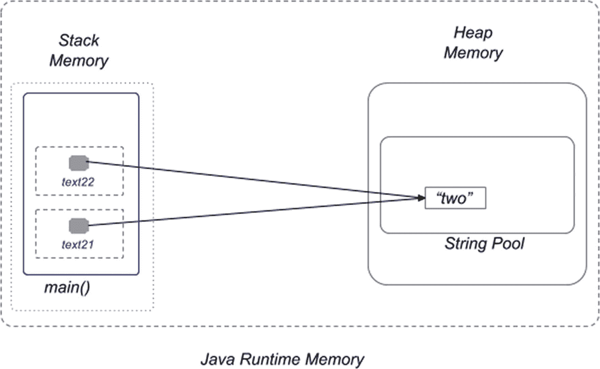

图 5-16

在堆内存中创建的字符串池区域的抽象表示

当使用`new`操作符创建一个新的`String`对象时，JVM 将为这个新对象分配新的内存，并将其存储在堆中，因此字符串池不会被使用。这导致每个像这样创建的`String`对象都有自己的内存区域和自己的地址。

我认为在这一点上很明显，使用字符串构造函数(不止一个)来创建字符串对象实际上相当于浪费内存。

这就是为什么如果我们要比较初始代码样本中的变量`text22`和变量`text23`，我们会期望它们的引用是不同的，但是对象应该是相同的。清单 [5-27](#PC45) 描述了测试这个假设的代码。

```java
package com.apress.bgn.five;

public class SimpleStringDemo {
    public static void main(String... args) {
        String text22 = "two";
        String text23 = new String ("two");

        if (text22 == text23) {
            System.out.println("Equal References");
        } else {
            System.out.println("Different References");
        }
        if (text22.equals(text23)) {
            System.out.println("Equal Objects");
        } else {
            System.out.println("Different Objects");
        }
    }
}

Listing 5-27Code Sample Showing Differences Between equals(..) and == on String References

```

运行上述代码时，控制台中将显示以下内容，证明所有假设都是正确的:

```java
Different References
Equal Objects

```

我让您来想象前一个例子中栈和堆内存的样子。 <sup>[4](#Fn4)</sup>

在 Java 6 之前，**字符串池**的默认大小是 1009 个条目。从此版本开始，可以使用`-XX:StringTableSize`命令行选项修改其大小。由于大小因 Java 版本和程序可用内存的不同而不同，我的建议是只调用`run java -XX:+PrintFlagsFinal -version`并在返回的输出中查找`StringTableSize`,以获得机器上字符串池的实际大小。

在清单 [5-24](#PC40) 中，第 11 行和第 12 行描述了如何从一个`char[3]`数组创建一个`String`实例。直到 Java 8，在内部这是`String`值的初始表示——字符数组。一个字符用 2 个字节表示，这意味着`Strings`消耗了大量内存。在 Java 9 中引入了一种新的表示法，叫做压缩`String,`，它根据内容使用`byte[]`或`char[]`。这意味着从 Java 9 开始,`String`处理应用程序消耗的内存将显著减少。

`String`类提供了大量操作字符串的方法；一整本书可能只写这种类型的 Java。这些方法将在书中解释，但如果你好奇，你可以在这里查阅在线 JavaDoc([`https://docs.oracle.com/en/java/javase/17/docs/api/java.base/java/lang/String.html`](https://docs.oracle.com/en/java/javase/17/docs/api/java.base/java/lang/String.html))或使用你的智能编辑器查找它们。

#### 转义字符

有一些特殊字符不能作为`String`值的一部分。您可能已经注意到，`String`值被定义在双引号(`"sample"`)之间，这使得`"(double quote)`字符不能作为值使用。为了能够将它用作`String`值或其中的一部分，它必须被转义。除了这个角色，还有`\(backslash)`、`\a(alert),`和其他几个角色。在图 [5-17](#Fig17) 中，你可以看到 IntelliJ IDEA 试图告诉你不能在字符串值的内容中使用这些字符。

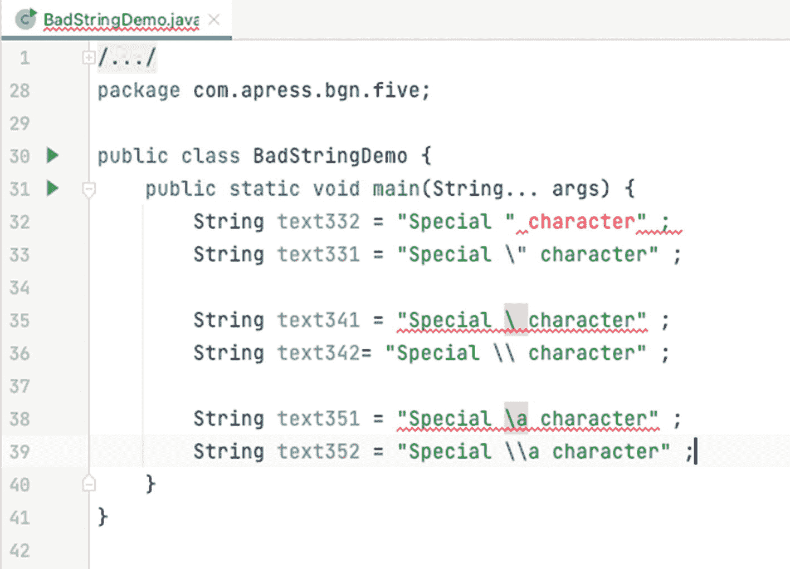

图 5-17

包含特殊字符的代码示例

所以单个的`\(backslash)`不允许成为`String`值的一部分，但是其中两个是，并且它告诉编译器字符串值包含一个`\(backslash)`字符。

```java
System.out.println(" Example using \\.")
//Prints
 Example using \.

```

至于`\a`头韵，在`String`值中是不允许的，因为`\(backslash)`是用来构造转义序列的，而`\a`不是转义序列。

(单引号)在用作字符值时也必须转义。

```java
char quote = '\";

```

有一些 Java 转义序列可以用在`String`值中以获得某种效果，表 [5-1](#Tab1) 中列出了最重要的一些。

表 5-1

Java 转义序列

<colgroup><col class="tcol1 align-left"> <col class="tcol2 align-left"></colgroup> 
| 

换码顺序

 | 

影响

 |
| --- | --- |
| `\n` | 创建一个新行(通常称为换行符)。 |
| `\t` | 创建一个制表符。 |
| `\b` | 创建退格字符(这可能会删除前面的字符，具体取决于输出设备)。 |
| `\r` | 返回到该行的开头(但不要新建一行，相当于键盘上的`Home`键)。 |
| `\f` | 换页(对于打印机，移到下一页的顶部)。 |
| `\s` | 创建一个空格字符。 |
| `\` | 行结束符。 |

字符串值中需要转义的字符的完整列表可以在 Java 语言规范文档中找到，这里: [`https://docs.oracle.com/javase/specs/jls/se16/html/jls-3.html#jls-3.10.7`](https://docs.oracle.com/javase/specs/jls/se16/html/jls-3.html%2523jls-3.10.7) 。

根据 JLS，如果转义序列中反斜杠后面的字符不是`\`或 ASCII b，s，t，n，f，r，“，'，\，0，1，2，3，4，5，6 或 7，则为编译时错误。

换行符`\n`和制表符`\t`在编程中经常被用来正确格式化控制台输出。如果我们声明一个像这样的`String`实例:

```java
String perf = "The singers performing tonight are: \n\t Paolo Nutini \n\t Seth MacFarlane\n\t John Mayer";

```

在控制台中打印时，文本将被格式化，如下所示:

今晚表演的歌手是:

```java
       Paolo Nutini
       Seth MacFarlane
       John Mayer

```

关于 Java `String`最后应该提到的是，在 JDK 15 中，引入了对文本块的支持。这意味着不用将一个大的`String`值拆分成写在多行上的多个较小的值，然后将它们连接起来以保持代码可读，现在您可以声明一个单独的文本块并将其分配给一个字符串引用。在 Java 15 之前，如果您想声明一个多行字符串值，有几种选择，包括连接(使用'+'操作符)、显式行终止符和分隔符。清单 [5-28](#PC51) 中描述了其中一些选项。根据您正在构建的解决方案，您可以选择其中任何一种，关于效率和缺点的讨论不在本书的讨论范围之内。

```java
package com.apress.bgn.five;

import java.io.PrintWriter;
import java.io.StringWriter;

public class MultiLineDemo {

    public static void main(String... args) {
        // this statement extracts the newline character specific to the
        // operating system
        String newLineCh = System.getProperty("line.separator");

        // method 1: simple concatenation using the '+' operator
        String multilineStr = "line one of the text block" +
                newLineCh +
                "line two of the text block" +
                newLineCh +
                "last line of the text block" ;

        // or method 2 using `String#concat(..)` method
        multilineStr = "line one of the text block"
                .concat(newLineCh)
                .concat("line two of the text block")
                .concat(newLineCh)
                .concat("last line of the text block") ;

        // or method 3 using `String.join` utility method
        multilineStr = String.join("line one of the text block" ,
                newLineCh ,
                "line two of the text block" ,
                newLineCh ,
                "last line of the text block");

        // or method 4 using a StringBuffer instance
        multilineStr = new StringBuffer("line one of the text block")
                .append(newLineCh)
                .append("line two of the text block")
                .append(newLineCh)
                .append("last line of the text block").toString();

        // or method 5 using a StringBuilder instance
        multilineStr = new StringBuilder("line one of the text block")
                .append(newLineCh)
                .append("line two of the text block")
                .append(newLineCh)
                .append("last line of the text block").toString();

        // or method 5 using a StringWriter instance
        StringWriter stringWriter = new StringWriter();
        stringWriter.write("line one of the text block");
        stringWriter.write(newLineCh);
        stringWriter.write("line two of the text block");
        stringWriter.write(newLineCh);
        stringWriter.write("last line of the text block");
        multilineStr = stringWriter.toString();

        // or method 6 using a StringWriter and PrintWriter instance
        stringWriter = new StringWriter();
        PrintWriter printWriter = new PrintWriter(stringWriter);
        printWriter .println("line one of the text block");
        printWriter.println("line two of the text block");
        printWriter.println("last line of the text block");
        multilineStr = stringWriter.toString();

        System.out.println(multilineStr);
    }
}

Listing 5-28Multiline Java String Value Before JDK 15

```

 `StringBuffer`表示一个线程安全的、可变的字符序列。这意味着对`StringBuffer`的任何操作都是在确保单次访问后执行的。这就是为什么使用`StringBuffer`连接字符串比使用`StringBuilder`慢的原因，T3 是非线程安全的等价物。所以在设计你的代码时，除非你的字符串连接块有被多线程并行执行的风险，否则就用`StringBuilder`。

在 JDK 15 中，添加了对声明文本块的支持，这使得可以在代码中完全按照原样嵌入多行文本，而无需修改它们来添加行终止符、分隔符或连接运算符。因此，文本块是 Java 字符串表示的另一种形式，它以三个双引号字符开始，后跟一个行结束符，以三个双引号字符结束。因此，前面的多行文本可以用新语法编写，如下所示:

```java
String multilineStr = """
        line one of the text block
        line two of the text block
        last line of the text block
    """;

```

新语法仅用于声明多行文本，因此不能用于声明单行文本。这样做会导致编译错误。如果开始的三个双引号字符后跟文本而不是预期的行结束符，也会发生同样的情况。图 [5-18](#Fig18) 描述了声明多行文本块的两种错误方式，以及 IDE 提供的解释。


图 5-18

声明多行文本的语法无效

几个例子:

*   在多行文本块中不需要对`"(double-quote)`进行转义，除非在值中有三个组合在一起。在这种情况下，编译器可能会对文本块在哪里结束感到有点困惑，所以在这种情况下，必须对其中至少一个进行转义。

*   当组成文本块的行需要缩进时，应该使用空格或制表符；同时使用它们可能会导致不可预知的结果(例如，不规则的缩进会破坏 YAML 配置)

*   文本块支持两种额外的转义序列:

*   `\<line-terminator>`禁止包含隐含的新行字符。例如，如前所示声明的文本块相当于:

    ```java
    String multilineStr = "line one of the text block" +
                    "\n" +
                    "line two of the text block" +
                    "\n" +
                    "last line of the text block" +
                    "\n" ;

    ```

    如果不需要最后一个新行，有两个选项。文本块可以在文本的最后一行内指定终止符。

    ```java
    String multilineStr = """
        line one of the text block
        line two of the text block
        last line of the text block""";

    ```

    但是不推荐这样做，因为这可能会影响缩进。推荐的方法是使用`\<line-terminator>`转义字符，因为这样可以更好地组织文本块，并允许结束分隔符管理缩进。

    ```java
    String multilineStr = """
            line one of the text block
            line two of the text block
            last line of the text block\
        """;

    ```

*   `\s`转义序列翻译成空格。当我们希望文本块中的行尾有一些空格时，这很有用。

    ```java
    String multilineStr = """
            line one of the text block\s
            line two of the text block\s
            last line of the text block\
        """;

    ```

在 Oracle 官方文档中，有一节专门介绍了 JDK 15 中添加的新多行块。如果你需要更多的信息，这里是最好的地方:[`https://docs.oracle.com/en/java/javase/17/text-blocks/index.html`](https://docs.oracle.com/en/java/javase/17/text-blocks/index.html)——新——转义——序列。

#### 基本类型的包装类

在本章的原语部分提到过，每个原语类型都有一个对应的引用类型。在介绍它们以及为什么需要它们之前，请查看表 [5-2](#Tab2) 。

表 5-2

Java 基本类型和等效的引用类型

<colgroup><col class="tcol1 align-left"> <col class="tcol2 align-left"></colgroup> 
| 

原语类型

 | 

参考类型

 |
| --- | --- |
| `char` | `java.lang.Character` |
| `boolean` | `java.lang.Boolean` |
| `byte` | `java.lang.Byte` |
| `short` | `java.lang.Short` |
| `int` | `java.lang.Integer` |
| `long` | `java.lang.Long` |
| `float` | `java.lang.Float` |
| `double` | `java.lang.Double` |

Java 包装器类用相同的名称包装原始类型的值。此外，这些类提供了将原始值转换为`String`的方法，反之亦然，以及在处理原始类型时有用的常量和方法，这些类型需要被视为对象。数字包装类是相关的，它们都扩展了`Number`类，如图 [5-19](#Fig19) 所示。

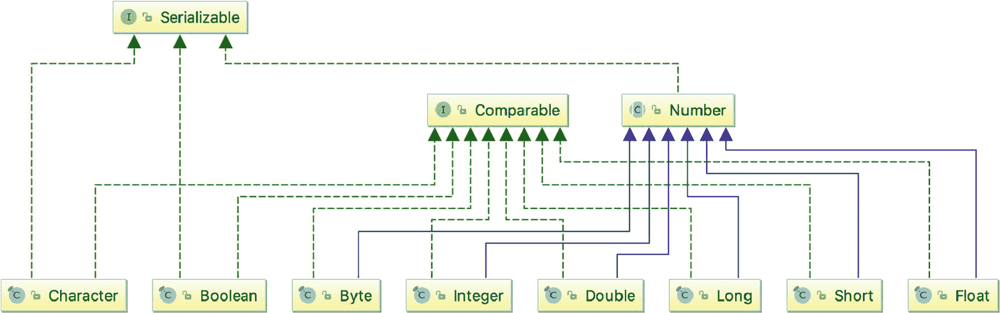

图 5-19

Java 原语和等效的引用类型

下面的代码示例将主要使用`Integer`类，但是其他数字包装类也可以以类似的方式使用。将一个原始值转换成它的等价引用被称为**装箱**；相反的过程被称为**拆箱**。JVM 在大多数情况下自动完成这些转换，术语**自动装箱**被引入来指代装箱过程，而出于某种原因，自动拆箱仍然被称为**拆箱**。

清单 [5-29](#PC57) 中描述的代码样本包含了一些关于`Integer`和 int 值的操作。

```java
package com.apress.bgn.five;

public class WrapperDemo {
    public static void main(String... args) {
        // upper interval boundary for int
        Integer max = Integer.MAX_VALUE;
        System.out.println(max);

        //autoboxing Integer -> int
        int pmax = max;

        //autoboxing int -> Integer
        Integer io = 10;

        //creating primitive utility method
        //exception is thrown, if string is not a number
        int i1 = Integer.parseInt("11");

        //constructor deprecated in Java 9
        //exception is thrown, if string is not a number
        Integer i2 = new Integer("12");

        //exception is thrown, if string is not a number
        Integer i3 = Integer.valueOf("12");

        //convert int into to String
        String s0 = Integer.toString(13);

        //convert int to float
        float f0 = Integer.valueOf(14).floatValue();

        //creating string with binary representation of number 9 (1001)
        String s1 = Integer.toBinaryString(9);

        //introduced in Java 1.8
        Integer i4 = Integer.parseUnsignedInt("+15");

        //method to add to integers
        int sum = Integer.sum(2, 3);

        //method to get the bigger value
        int maximum = Integer.max(2, 7);
    }
}

Listing 5-29Autoboxing and Unboxing in Action

```

`Character`和`Boolean`类型略有不同，因为这些类型不是数值型的，所以它们不能被转换成任何数值。它们也不能相互转换。Oracle 为它的类提供了很好的文档，所以如果你对使用这两种类型感兴趣，只需在 [`https://docs.oracle.com/en/java/javase/17/docs/api/index.html`](https://docs.oracle.com/en/java/javase/17/docs/api/index.html) 查看 JDK 官方 API 文档。

### 日期时间 API

许多应用程序利用日历日期类型来打印当前日期、截止日期和生日。无论您决定构建什么样的应用程序，您都很可能需要使用日历日期。在 Java 8 之前，建模日历日期的主要类是`java.util.Date`。这个类和其他处理日历日期的类有一些问题。但是在我们开始之前，看一下清单 [5-30](#PC58) ，看看我们如何获得当前日期，创建一个自定义日期并打印某些细节。

```java
package com.apress.bgn.five;

import java.text.SimpleDateFormat;
import java.util.Date;

public class DateDemo {
    public static void main(String... args){
        SimpleDateFormat sdf = new SimpleDateFormat("dd-MM-yyyy");
        Date currentDate = new Date();
        System.out.println("Today: " + sdf.format(currentDate));

        //deprecated since 1.1
        Date johnBirthday = new Date(77, 9, 16);
        System.out.println("John’s Birthday: " + sdf.format(johnBirthday));

        int day = johnBirthday.getDay();
        System.out.println("Day: " + day);
        int month = johnBirthday.getMonth() + 1;
        System.out.println("Month: " + month);
        int year = johnBirthday.getYear();
        System.out.println("Year: " + year);
    }
}

Listing 5-30java.util.Date Code Sample

```

获取系统上设置的当前日期很简单；只需调用`Date`类的默认构造函数:

```java
Date currentDate = new Date();

```

可以直接显示`currentDate`的内容，但是通常使用`java.text.SimpleDateFormat`的一个实例，将日期格式化为特定于国家的模式，或者只是更具可读性。格式化程序也可以用于将特定格式的`String`转换成日期实例。如果文本与格式化程序的模式不匹配，将抛出一个特定的异常(类型:`java.text.ParseException`)

```java
try {
    Date johnBirthday = sdf.parse("16-10-1977");
} catch (ParseException e) {
    // do something with the exception
}

```

要从代表日期的数字(年、月和日)创建一个`Date`实例，可以使用一个将这些值作为参数的构造函数。然而，这个构造函数从 Java 1.1 开始就被弃用了，所以一些开发人员更喜欢使用`sdf.parse(..)`方法。构造函数的参数有一些特殊性:

*   year 参数必须是年值–1900。

*   月份从 0 开始计数，因此作为参数提供的月份必须是我们想要的月份-1。

    这里描述了从年、月和日的数值构建一个`Date`的代码:

```java
//deprecated since 1.1
Date johnBirthday = new Date(77, 9, 16);
System.out.println("John's Birthday: " + sdf.format(johnBirthday));
//it prints: John’s Birthday: 16-10-1977

```

如果我们想从日期中提取年、月和月中的日，有很多方法可以做到这一点，只有一个特点:提取月中的日的方法被命名为`getDate()`。还要记住，因为月份是从 0 到 11 编号的，所以对于实际的月份值，您必须在由`getMonth()`返回的结果上加 1。清单 [5-31](#PC62) 显示了创建一个`Date`实例的代码，提取，然后是日、月和年并打印它们。

```java
package com.apress.bgn.five;

import java.text.ParseException;
import java.text.SimpleDateFormat;
import java.util.Date;

public class PrintDateDemo {
    public static void main(String... args) {

        try {
            SimpleDateFormat sdf = new SimpleDateFormat("dd-MM-yyyy");
            Date johnBirthday = sdf.parse("16-10-1977");
            System.out.println("John’s Birthday: " + sdf.format(johnBirthday));

            //day of the month
            int day = johnBirthday.getDate();
            System.out.println("Day: " + day);

            int month = johnBirthday.getMonth() + 1;
            System.out.println("Month: " + month);

            int year = johnBirthday.getYear();
            System.out.println("Year: " + year);

        } catch (ParseException e) {
            e.printStackTrace();
        }
    }
}

Listing 5-31Printing Components of a Calendar Date

```

`java.util.Data`类有两个容易混淆的方法。

`getDate()`方法返回一个日期对象的一个月中的某一天。

方法返回一个日期对象的星期几。

从 JDK 版本 1.1 开始，这两种方法都被弃用，本节稍后将介绍提取这些信息的更好、更简单的方法。

如果您在 IntelliJ IDEA 编辑器中查看本节的演示类，您会注意到有些构造函数和方法是用删除线字体编写的。这意味着它们已被弃用，可能会在 Java 的未来版本中被删除，因此不应该使用它们。这就是为什么有另一种方法来完成这一切:通过使用`java.util.Calendar class`。与清单 [5-31](#PC62) 相同的代码，但是使用日历类在清单 [5-32](#PC63) 中描述。

```java
package com.apress.bgn.five;

import java.text.SimpleDateFormat;
import java.util.Calendar;
import java.util.Date;
import java.util.GregorianCalendar;

public class CalendarDateDemo {
    public static void main(String... args) {
        SimpleDateFormat sdf = new SimpleDateFormat("dd-MM-yyyy");
        Calendar calendar = new GregorianCalendar();
        Date currentDate = calendar.getTime();
        System.out.println("Today: " + sdf.format(currentDate));

        calendar.set(1977, 9, 16);
        Date johnBirthday = calendar.getTime();
        System.out.println("John’s Birthday: " + sdf.format(johnBirthday));

        int day = calendar.get(Calendar.DAY_OF_MONTH);
        System.out.println("Day: " + day);
        int month = calendar.get(Calendar.MONTH);
        System.out.println("Month: " + month);
        int year = calendar.get(Calendar.YEAR);
        System.out.println("Year: " + year);
    }
}

Listing 5-32Code Sample for Handling Calendar Dates Using the Calendar Class

```

不幸的是，前面提到的一些特性仍然存在，因为表示日期的中心类仍然是`java.util.Date`，但至少我们不再使用不推荐的方法了。

`java.util.Date`类和`java.text.SimpleDateFormat`类不是线程安全的，因此在具有多个执行线程的复杂应用程序中，开发人员必须显式同步对这些类型对象的访问。这些类型的对象不是不可变的，使用时区是一件痛苦的事情。这就是为什么在 Java 8 中引入了一个新的 API 来模拟日历日期操作的主要原因，这个 API 设计得更好，并且日期实例是线程安全和不可变的。

API 的核心类是`java.time.LocalDate`和`java.time.LocalDateTime`，用于建模日历日期和日历日期与时间。清单 [5-33](#PC64) 展示了如何获取当前日期以及如何用新的 API 创建一个定制日期。

```java
package com.apress.bgn.five;

import java.time.LocalDate;
import java.time.LocalDateTime;
import java.time.Month;

public class NewCalendarDateDemo {

    public static void main(String... args) {
        LocalDateTime currentTime = LocalDateTime.now();
        System.out.println("Current DateTime: " + currentTime);
        LocalDate today = currentTime.toLocalDate();
        System.out.println("Today: " + today);

        LocalDate johnBd = LocalDate.of(1977, Month.OCTOBER, 16);
        System.out.println("John’s Birthday: " + johnBd);

        int day = johnBd.getDayOfMonth();
        System.out.println("Day: " + day + ", " + johnBd.getDayOfWeek());
        int month = johnBd.getMonthValue();

        System.out.println("Month: " + month + ", " + johnBd.getMonth());
        int year = johnBd.getYear();
        System.out.println("Year: " + year);
    }
}

Listing 5-33Code Sample for Handling Calendar Dates Using the New DateTime API Introduced in the JDK 8

```

为了获得当前的日期和时间，调用名为`now()`的静态方法，该方法返回类型为`LocalDateTime`的实例。这个实例可以通过调用`toLocalDate()`来获取当前日期。该方法将当前日期作为类型`LocalDate`的实例返回。这个类有一个`toString()`方法，根据系统上设置的默认地区打印格式化的日期。要创建自定义日期，实际的年份和月份可以用作参数，月份可以使用`java.time.Month`枚举的值之一来指定。通过调用具有直观名称的方法，可以很容易地提取关于日期的信息。看看前面代码片段中的`getDayOfMonth()`和`getDayOfWeek()`方法就知道了。它们的名字准确地反映了它们返回的数据。如您所见，类`LocalDate`和`LocalDateTime`简化了不需要时区的开发。使用时区是一个相当高级的主题，所以它不会在本书中讨论。

### 收集

在 JDK，你可能会经常用到的最重要的类型之一是收藏品。collections 系列中的类和接口用于建模常见的数据集合，如集合、列表和映射。所有的类都存储在包`java.util`下，可以分为两类:元组和键值对集合。元组是一维数据集:如果值是唯一的，那么任何实现了`java.util.Set`接口的类都应该被用来对它们建模；如果不是，应该使用任何实现了`java.util.List`接口的类。对于键值对类的集合，应该使用实现`java.util.Maps`。从 Java 版本 1.5 开始，集合变得通用，这使得开发人员在使用它们时更加精确和安全。在 Java 1.5 之前，集合可以包含任何类型的对象。开发人员仍然可以编写清单 [5-34](#PC65) 中描述的代码:

```java
package com.apress.bgn.five;

import com.apress.bgn.four.classes.Gender;
import com.apress.bgn.four.hierarchy.Performer;

import java.util.ArrayList;
import java.util.List;

public class CollectionsBasicDemo {

    public static void main(String... args) {
        List objList = new ArrayList();
        objList.add("temp");
        objList.add(Integer.valueOf(5));
        objList.add(new Performer("John", 40, 1.91f, Gender.MALE));
    }
}

Listing 5-34Code Using Collections Up to Java 1.5

```

您可能看不出这有什么问题；编译器当然不会，但是当你迭代这个列表时，如果没有复杂的代码分析每个对象的类型，就很难确定你在处理哪些对象。这是之前在**章** [**4**](04.html) 结尾介绍泛型的时候提到的。清单 [5-35](#PC66) 中描述了迭代列表并根据元素的类型对其进行不同处理的代码，这只是为了向您展示为什么在当今的 Java 时代这是一个糟糕的想法和糟糕的实践。

```java
package com.apress.bgn.five;

import com.apress.bgn.four.classes.Gender;
import com.apress.bgn.four.hierarchy.Performer;

import java.util.ArrayList;
import java.util.List;

public class CollectionsBasicDemo {

    public static void main(String... args) {
        List objList = new ArrayList();
        objList.add("temp");
        objList.add(Integer.valueOf(5));
        objList.add(new Performer("John", 40, 1.91f, Gender.MALE));

        for (Object obj : objList) {
            if (obj instanceof String) {
                System.out.println("String object = " + obj.toString());
            } else if (obj instanceof Integer) {
                Integer i = (Integer)obj;
                System.out.println("Integer object = " + i.intValue());
            } else {
                Performer p = (Performer) obj;
                System.out.println("Performer object = " + p.getName());
            }
        }
    }
}

Listing 5-35More Code Using Collections Up to Java 1.5

```

也许你现在还不清楚，但是为了能够使用列表的内容，你必须确切地知道放在列表中的对象的所有类型。当你独自在一个项目中工作时，这可能是可行的，但是在一个更大的项目中，当多个开发人员参与时，这可能会很快变得混乱。

这就是仿制药的用武之地。泛型有助于在编译时定义应该将什么类型的对象放入集合中，因此，如果将错误的对象类型添加到集合中，代码将不再编译。列表和集合都实现了相同的接口:`java.util.Collection<T>`，这意味着它们的 API 几乎相同。包含编程中最常用的类和接口的集合的简化层次结构如图 [5-20](#Fig20) 所示。


图 5-20

集合层次结构

清单 [5-36](#PC67) 描述了`String`值的`List`的创建，以及遍历它并打印其元素所需的循环语句。

```java
package com.apress.bgn.five;

import java.util.ArrayList;
import java.util.List;

public class GenericListDemo {
    public static void main(String... args) {
        List<String> stringList = new ArrayList<String>();
        stringList.add("one");
        stringList.add("two");
        stringList.add("three");

        for (String s : stringList) {
            System.out.println(s);
        }
    }
}

Listing 5-36Code Using Collections Starting with Java 1.5

```

一个`List`包含一个未排序的非唯一数据集合，包括`null`个元素。在前面的例子中，我们声明了一个类型为`List<T>`的引用和一个类型为`ArrayList<T>`的对象。我们这样做是因为所有的实现都有相同的 API 我们可以很容易地将`ArrayList<T>`换成`LinkedList<T>`，代码仍然可以工作。

```java
List<String> stringList = new ArrayList<String>();
stringList = new LinkedList<String>();

```

声明抽象引用是一个好的编程实践，因为它增加了代码的灵活性。

前面示例中的语法是 Java 1.7 之前的版本。在 Java1.7 中引入了`<>`(菱形运算符)。这使得集合初始化更加简单，因为它只需要在引用声明中声明列表中元素的类型。因此，前面代码片段中的两行变成了:

```java
List<String> stringList = new ArrayList<>();
stringList = new LinkedList<>();

```

从 Java 1.5 开始，每个新的 Java 版本都对集合框架进行了修改。在 Java 1.8 中，通过在`java.lang.Iterable<T>`接口(图 [5-20](#Fig20) )中添加一个名为`forEach`的默认方法，增加了对 lambda 表达式的支持，该方法由`java.lang.Collection<T>`扩展。因此，打印列表中所有值的代码，就像我们之前使用的`for`循环一样，可以替换为:

```java
stringList.forEach(element -> System.out.println(element));

```

在 Java 9 中，引入了另一个改进:集合的工厂方法。我们的集合是通过重复调用`add(..)`来填充元素的，这有点多余，特别是因为我们已经有了想要放入列表的元素的完整集合。这就是为什么在 Java 9 中引入了在一行代码中创建集合对象的方法。例如:

```java
List<String> stringList = List.of("one", "two", "three");

```

结果列表<t>是一个不可变的集合:它不能再被修改，也不能从其中添加或删除元素。</t>

更近一步，在 Java 10 中增加了对局部变量类型推断的支持，这意味着我们不再需要显式地指定引用类型，因为它将根据对象类型自动进行推断，所以下面的声明:

```java
List<String> stringList = List.of("one", "two", "three");

```

这变成了:

```java
var stringList = List.of("one", "two", "three");

```

类似的代码可以用`Set<T>`、`HashSet<T>`和`TreeSet<T>`编写，类似的方法也存在于这个类家族中。

收藏是 Java 入门级职位面试中的一个常见话题，所以如果有人问你`List<T>`和`Set<T>`有什么区别，不要惊讶。

当使用`Set<T>`实现时，您只需确保添加到集合中的对象正确实现了`equals(..)`和`hashCode()`。这样做的原因是`Set<T>`对数学*集合*抽象建模，不允许有重复的元素。

`equals(..)`表示作为参数传递的对象是否“等于”当前实例。由`Object`类提供的默认实现认为两个对象是相等的，如果它们存储在相同的内存位置。

`hashCode(..)`返回对象内存地址的整数表示。由`Object`类提供的默认实现返回一个随机整数，该整数对于每个实例都是唯一的。该值可能会在应用程序的多次执行之间发生变化。当对象用作哈希表中的键时，此方法很有用，因为它优化了从对象中检索元素。如果你想了解更多关于散列表的知识，互联网是你的最佳选择；至于 Java，散列表可以用一个`java.util.HashMap<K,V>`的实例来建模。

根据官方文档，如果两个对象相等，那么对它们中的每一个调用`hashCode()`都会产生相同的结果。但是两个不相等的对象不一定要有不同的 hashCodes。

话虽如此，前面介绍的`Ball`类将用于创建一些 ball 实例；将它们添加到一个`Set`中。清单 [5-37](#PC74) 中的代码示例展示了一个版本的`Ball`类，它包含了`equals(..)`和`hashCode()`的正确实现；

```java
package com.apress.bgn.five;

import java.util.HashSet;
import java.util.Set;

public class SetDemo {

    public static void main(String... args) {
        Set<Ball> ballSet = new HashSet<>();
        ballSet.add(new Ball(2, "RED", "rubber"));
        ballSet.add(new Ball(4, "BLUE", "cotton"));

        System.out.println("Set size: " +  ballSet.size());
        Ball duplicate = new Ball(2, "RED", "rubber");
        boolean wasAdded = ballSet.add(duplicate);
        if(!wasAdded) {
            System.out.println("Duplicate ball not added to the set. ");
            System.out.println("Set size: " +  ballSet.size());
        }
    }
}

class Ball {
    private int diameter;
    private String color;
    private String material;

    @Override
    public boolean equals(Object o) {
        if (this == o) return true;
        if (o == null || getClass() != o.getClass()) return false;
        Ball ball = (Ball) o;
        return diameter == ball.diameter &&
                color.equals(ball.color) &&
                material.equals(ball.material);
    }

    @Override
    public int hashCode() {
        int result = 17 * diameter;
        result = 31 * result + (color == null ? 0 : color.hashCode());
        result = 31 * result + (material == null ? 0 : material.hashCode());
        return result;
    }
    // other code omitted
}

Listing 5-37Basic equals(..) and hashCode() Implementations

```

运行前面清单中的代码会产生以下输出:

```java
Set size: 2
Duplicate ball not added to the set.
Set size: 2

```

在 Java 1.7 之前，开发人员必须为所有可能在`Set<T>`中使用或在`Map<K,V>`中作为键使用的类编写类似于前面清单中的`equals(..)`和`hashCode()`实现。实现必须基于类中最重要的字段的值。17 和 31 只是用来计算 hashCode 值的两个随机整数。

在 Java 1.7 中引入了类`java.util.Objects`,它提供了一些实用方法，使得实现这些方法变得更加容易。清单 [5-38](#PC76) 描述了 Java 1.7 之后的`equals(..)`和`hashCode()`实现。

```java
package com.apress.bgn.five;

import java.util.Objects;

class Ball {
    private int diameter;
    private String color;
    private String material;

    @Override
    public boolean equals(Object o) {
        if (this == o) return true;
        if (o == null || getClass() != o.getClass()) return false;
        Ball ball = (Ball) o;
        return diameter == ball.diameter &&
                Objects.equals(color, ball.color) &&
                Objects.equals(material, ball.material);
    }

    @Override
    public int hashCode() {
        return Objects.hash(diameter, color, material);
    }

    // other code omitted
}

Listing 5-38Basic equals(..) and hashCode() Implementations After Java 1.7

```

从 Java 14 开始，事情变得更加简单，因为现在像`Ball`这样的类可以写成记录，如清单 [5-39](#PC77) 所示。

```java
package com.apress.bgn.five;

import java.util.HashSet;
import java.util.Set;

record Ball(int diameter, String colour, String material) {}

public class RecordSetDemo {
    public static void main(String... args) {
        // same as Listing 5-37
    }
}

Listing 5-39Class Ball Written as a Record to Avoid Implementing equals(..) and hashCode()

```

执行前面清单中的代码会产生与前面相同的结果，从而证明 Java 编译器生成的`equals(..)`方法是有效的。

实现有一些不同，因为它们建模了键值对的集合。清单 [5-40](#PC78) 中的代码描述了使用类型`Ball`的键和类型`Integer`的值的映射的创建和初始化。您可以想象这个 map 实例表示一个桶中相同球的数量。

```java
package com.apress.bgn.five;

import java.util.HashMap;
import java.util.Map;

public class MapDemo {
    public static void main(String... args) {
        Map<Ball, Integer> ballMap = new HashMap<Ball, Integer>();
        ballMap.put(new Ball(2, "RED", "rubber"), 5);
        ballMap.put(new Ball(4, "BLUE", "cotton"), 7);

        for (Map.Entry<Ball, Integer> entry : ballMap.entrySet()) {
            System.out.println(entry.getKey() + ": " + entry.getValue());
        }
    }
}

Listing 5-40Map<Ball, Integer> Code Sample

```

正如您从 for 循环中注意到的，您可以推断出地图实际上是`Map.Entry<K, V>`元素的集合。如果我们继续使用 Java 1.7 语法，通过应用`<>`(菱形)操作符，映射的声明会变得更简单:

```java
Map<Ball, Integer> ballMap = new HashMap<>();

```

进一步到 Java 1.8，map 中的遍历和打印值也变得更加实用，因为引入了`forEach(..)`方法和 lambda 表达式:

```java
ballMap.forEach((k,v) -> System.out.println(k + ": " + v));

```

在 Java 9 中，声明和填充映射也变得更加容易。

```java
Map<Ball, Integer> ballMap = Map.of(new Ball(2, "RED", "rubber"), 5, new Ball(4, "BLUE", "cotton"), 7);

```

Java 10 增加了`var`来进一步简化声明。

```java
var ballMap = Map.of(new Ball(2, "RED", "rubber"), 5, new Ball(4, "BLUE", "cotton"), 7);

```

在结束本节之前，需要提到的另一件事是，当一个键对值被添加到映射中并且这个键已经存在时会发生什么。正如您可能预料的那样，映射中现有的密钥对被覆盖。在 Java 8 之前，当一组值丢失时，编写代码来防止这种情况需要检查密钥是否存在，如果不存在，则添加新的密钥对，如清单 [5-41](#PC83) 所示。

```java
package com.apress.bgn.five;

import java.util.HashMap;
import java.util.Map;

public class MapDemo {
    public static void main(String... args) {
        Map<Ball, Integer> ballMap = new HashMap<>();
        Ball redBall = new Ball(2, "RED", "rubber");

        ballMap.put( redBall, 5);
        ballMap.put(new Ball(4, "BLUE", "cotton"), 7);

         //ballMap.put( redBall, 3); // this overrides entry <redBall, 5>

        if(!ballMap.containsKey(redBall)) {
            ballMap.put(redBall, 3);
        }

        for (Map.Entry<Ball, Integer> entry : ballMap.entrySet()) {
            System.out.println(entry.getKey() + ": " + entry.getValue());
        }
    }
}

Listing 5-41Preventing Key-Pair Overwriting Before Java 8

```

在 Java 8 中，一组实用的实用方法被添加到了`Map<K,V>`接口中，以简化使用 maps 编写的代码，包括清单 5-42 中描述的方法`putIfAbsent(..)`,它替换了前面代码清单中标记的语句。

```java
package com.apress.bgn.five;

import java.util.HashMap;
import java.util.Map;

public class MapDemo {
    public static void main(String... args) {
        Map<Ball, Integer> ballMap = new HashMap<>();
        Ball redBall = new Ball(2, "RED", "rubber");

        ballMap.put( redBall, 5);
        ballMap.put(new Ball(4, "BLUE", "cotton"), 7);

        ballMap.putIfAbsent(redBall, 3);

        for (Map.Entry<Ball, Integer> entry : ballMap.entrySet()) {
            System.out.println(entry.getKey() + ": " + entry.getValue());
        }
    }
}

Listing 5-42Preventing Key-Pair Overwriting Before Java 8

```

用于处理集合的 JDK 类涵盖了广泛的功能，例如排序、搜索、合并集合、交集、数组之间的转换等等。随着本书的进展，代码示例的范围将会扩大，我们将能够使用集合来解决现实世界的问题。

### 并发特定类型

在这本书的前面，不时提到一个 Java 程序可以有多个执行线程。默认情况下，当执行 Java 程序时，会为从`main(..)`方法调用的代码创建一个线程。为 JVM 相关的事情创建并并行执行一些其他实用程序线程。使用在`java.lang.Thread`类中定义的静态实用方法可以很容易地访问这些线程。清单 [5-43](#PC85) 中的代码就是这么做的:它提取对`Thread`实例的引用，并将它们的名称打印到控制台。

```java
package com.apress.bgn.five;

public class ListJvmThreads {
    public static void main(String... args) {
        var threadSet = Thread.getAllStackTraces().keySet();
        var threadArray = threadSet.toArray(new Thread[threadSet.size()]);
        for (int i = 0; i < threadArray.length; ++i) {
            System.out.println("thread name: " + threadArray[i].getName());
        }
    }
}

/// Output
thread name: main
thread name: Finalizer
thread name: Common-Cleaner
thread name: Monitor Ctrl-Break
thread name: Signal Dispatcher
thread name: Reference Handler
thread name: Notification Thread

Listing 5-43Code Used to Show All Threads Necessary to Run a Simple Java Application and Its Output

```

清单 [5-43](#PC85) 中显示的输出是在 IntelliJ IDEA 的 macOS 计算机上运行 JDK 17-ea 上的代码时产生的。列出的线程具有以下职责:

*   名为`main`的线程是执行开发者编写代码的线程。开发人员可以编写代码从主线程启动自己的线程。

*   名为`Reference Handler`的线程获取未使用的对象，并将它们添加到队列中进行回收。

*   名为`Finalizer`的线程是一个低优先级的 JVM 线程，它执行队列中等待从内存中被逐出的每个对象的`finalize()`方法。开发人员可以重写此方法，以显式释放链接到即将被收回的对象的资源。

*   名为`Common-Cleaner`的线程也是一个低优先级的 JVM 线程，负责在不使用终结的情况下轻量级清理对象。

*   名为`Monitor Ctrl-Break`的线程是由 IntelliJ IDEA 创建的线程，因为代码是使用这个编辑器执行的。

*   名为`Signal Dispatcher`的线程处理操作系统发送给 JVM 的本地信号。

*   名为`Notification Thread`的线程是操作系统发送给 JVM 的线程处理通知。

除了`main`、`Monitor Ctrl-Break`(不是 JVM 应用线程)、`Common-Cleaner`，其他三个都是系统线程，保证 JVM 与操作系统协作。除了`main`之外，其他所有线程都称为**守护线程**。它们的优先级很低，它们为**用户线程**提供服务，这就是`main`线程。这是 Java 中仅有的两种线程。

开发人员可以编写代码从主线程启动自己的线程。创建自定义线程最简单的方法是创建一个扩展`Thread`类的类。

`Thread`类实现了一个名为`Runnable`的接口，该接口声明了一个名为`run()`的方法。

`Thread`类声明了一个名为`start()`的方法。当这个方法被调用时，`run()`方法的主体在一个独立的执行线程中执行，而不是在调用`start()`的线程中执行。<sup>T55</sup>

因此，当扩展`Thread`类或直接实现`Runnable`接口时，`run()`方法必须被覆盖。

清单 [5-44](#PC86) 中的例子描述了一个名为`RandomDurationThread`的类。通过调用`Thread.sleep(..)`实用程序方法，`run()`方法的内容会随机暂停执行。该方法的主体被包装在两行打印线程名称的代码中:开始消息和结束消息。`Thread.sleep(..)`确保每个线程执行有不同的持续时间，这样我们可以清楚地看到它们是并行执行的。

```java
package com.apress.bgn.five;

public class RandomDurationThread extends Thread {

    @Override
    public void run() {
        System.out.println(this.getName() + " started...");
        for (int i = 0; i < 10; ++i) {
            try {
                Thread.sleep(i * 10);
            } catch (InterruptedException e) {
                e.printStackTrace();
            }
        }
        System.out.println(this.getName() + " ended.");
    }
}

Listing 5-44Code Sample Declaring Threads with Random Execution Durations By Extending the Thread Class

```

清单 [5-45](#PC87) 中显示了使用`RandomDurationThread`创建多线程并启动它们的代码。

```java
package com.apress.bgn.five;

public class MultipleUserThreadsDemo {
    public static void main(String... args) {
        for (int i = 0; i < 10; ++i) {
            new RandomDurationThread().start();
        }
    }
}

Listing 5-45Code Sample to Run Multiple Threads in Parallel

```

在前面的代码清单中，创建了类`RandomDurationThread`的 10 个实例，并为每个实例调用了`start()`方法。当前面的代码被执行时，类似于清单 [5-46](#PC88) 中描述的日志应该被打印在控制台中。

```java
Thread-6 started...
Thread-4 started...
Thread-2 started...
Thread-1 started...
Thread-3 started...
Thread-7 started...
Thread-5 started...
Thread-0 started...
Thread-8 started...
Thread-9 started...
Thread-2 ended.
Thread-0 ended.
Thread-4 ended.
Thread-3 ended.
Thread-8 ended.
Thread-1 ended.
Thread-9 ended.
Thread-7 ended.
Thread-6 ended.
Thread-5 ended.

Listing 5-46Output Resulted By Running the Code in Listing 5-45

```

从这个输出可以明显看出，线程以随机的顺序开始和结束。

另一种创建线程的方法是创建一个实现`Runnable`接口的类。当我们想要扩展另一个类时，或者考虑到`Runnable`声明了一个方法，lambda 表达式也可以使用，这很有用。清单 [5-47](#PC89) 显示了`RandomDurationThread`的等效`Runnable`实现。

```java
package com.apress.bgn.five;

public class RandomDurationRunnable implements Runnable {
    @Override
    public void run() {
        System.out.println(Thread.currentThread().getName() + " started...");
        for (int i = 0; i < 10; ++i) {
            try {
                Thread.sleep(i * 10);
            } catch (InterruptedException e) {
                e.printStackTrace();
            }
        }
        System.out.println(Thread.currentThread().getName() + " ended.");
    }
}

Listing 5-47Code Sample Declaring Threads with Random Execution Durations By Implementing the Runnable Interface

```

因为我们不再能够访问线程的名称，所以要打印它，我们必须使用另一个名为`Thread.currentThread()`的实用方法来检索对正在执行的当前线程的引用，这样我们就可以得到它的名称。

`Thread`类提供了一个带有类型`Runnable`参数的构造函数，这意味着它可以被实现`Runnable`类型的任何参数调用。因此，要使用我们之前声明的`RandomDurationRunnable`创建线程，可以编写类似于清单 [5-48](#PC90) 中的代码。

```java
package com.apress.bgn.five;

public class RunnableDemo {
    public static void main(String... args) {
        for (int i = 0; i < 10; ++i) {
            new Thread(new RandomDurationRunnable()).start();
        }
    }
}

Listing 5-48Code Sample to Run Multiple Threads in Parallel Using a Class Implementing Runnable

```

运行前面清单中的代码产生的输出与清单 [5-46](#PC88) 中的输出一样随机。

前面提到过，这个特例是使用 lambda 表达式的一个很好的候选，因为`Runnable`可以当场实现。这意味着清单 [5-48](#PC90) 和清单 [5-47](#PC89) 中的代码可以按照清单 [5-49](#PC91) 中的描述进行组合。

```java
package com.apress.bgn.five;

import static java.lang.Thread.currentThread;
import static java.lang.Thread.sleep;

public class LambdaThreadsDemo {
    public static void main(String... args) {
        for (int i = 0; i < 10; ++i) {
            new Thread(
                    //Runnable implemented on the spot
                    () -> {
                        System.out.println(currentThread().getName() + " started...");
                        for (int j = 0; j < 10; ++j) {
                            try {
                                sleep(j * 10);
                            } catch (InterruptedException e) {
                                e.printStackTrace();
                            }
                        }
                        System.out.println(currentThread().getName() + " ended.");
                    }).start();
        }
    }
}

Listing 5-49Code Sample to Run Multiple Threads in Parallel Using Lambda Expressions

```

Java 提供了可以创建和管理线程的线程管理类，所以开发人员不必显式声明线程。对于这本书来说，并发框架是一个太高级的主题，但如果这一节让你如此好奇，你想了解更多，你可以在这里看看 Oracle 并发教程: [`https://docs.oracle.com/javase/tutorial/essential/concurrency/index.html`](https://docs.oracle.com/javase/tutorial/essential/concurrency/index.html) 。

## 摘要

在本章中，我们学习了 JVM 如何管理 Java 程序的内存，以及最常用的 Java 数据类型的基础知识。下面列出了本章中您应该记住的一些重要细节:

*   JVM 管理两种类型的内存:栈和堆。

*   基元类型和引用类型的区别。

*   原始值存储在栈内存中，对象值存储在堆中。

*   Java 中有八种原始数据类型:`boolean`、`char`、`short`、`byte`、`int`、`long`、`float`、`double`。

*   引用只能是已分配对象的超类型。

*   数组的大小是在创建时定义的，以后不能更改。

*   在 Java 中`String`实例是**不可变的**，这意味着它们一旦被创建就不能被改变。

*   如果需要处理日历日期，请使用新的 DateTime API。

*   `null`有用而强大。

*   集合可以将对象类型组合成元组或键值对。

*   Java 中的并发性很有趣。

本章中的一些例子可能看起来很复杂，但是不要气馁。如果不提供您可以自己执行、测试甚至修改的工作代码，就很难解释某些概念。不幸的是，这需要使用将在后面章节中介绍的概念(比如`for`和`if`语句)。只要把现在不清楚的每一个概念和页码都记下来，等你在书中后面详细读到这个概念后再回到这一章。

<aside aria-label="Footnotes" class="FootnoteSection" epub:type="footnotes">Footnotes [1](#Fn1_source)

符号及其含义的完整列表可在 2021 年 10 月 15 日访问的文件格式信息，“UTF-16 的完整字符列表”， [`https://www.fileformat.info/info/charset/UTF-16/list.htm`](https://www.fileformat.info/info/charset/UTF-16/list.htm) `,`中找到。

  [2](#Fn2_source)

有关 OCA 和 OCP 认证的详细信息，请访问甲骨文，“甲骨文认证”， [`https://www.oracle.com/uk/corporate/features/oracle-certification.html`](https://www.oracle.com/uk/corporate/features/oracle-certification.html) ，于 2021 年 10 月 15 日访问。

  [3](#Fn3_source)

一个关于排序算法的有趣对比，如果你有兴趣，可以在 Toptal 上找到，“排序算法动画”， [`https://www.toptal.com/developers/sorting-algorithms`](https://www.toptal.com/developers/sorting-algorithms) `,`访问于 2021 年 10 月 15 日。

  [4](#Fn4_source)

如果您想检查您是否正确理解了内存管理和字符串，欢迎您绘制自己的图片并将其发送给作者进行审查和技术讨论。

  [5](#Fn5_source)

线程管理的内部要复杂得多，但是这一节只是触及了表面。

 </aside>