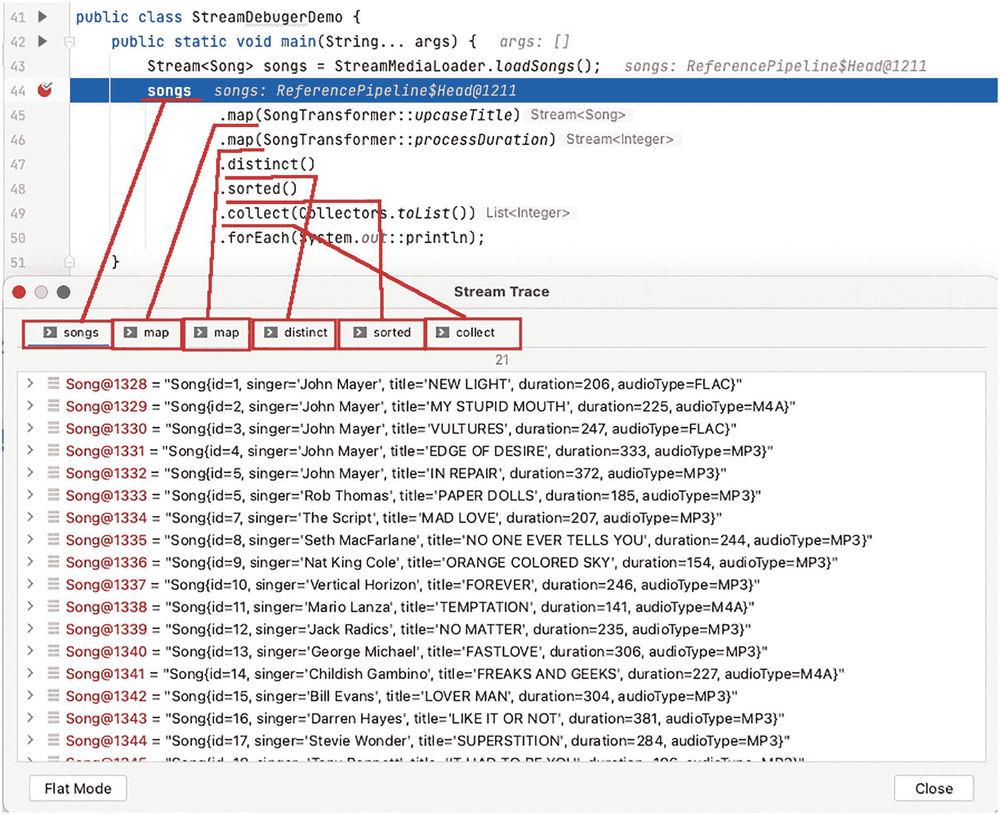
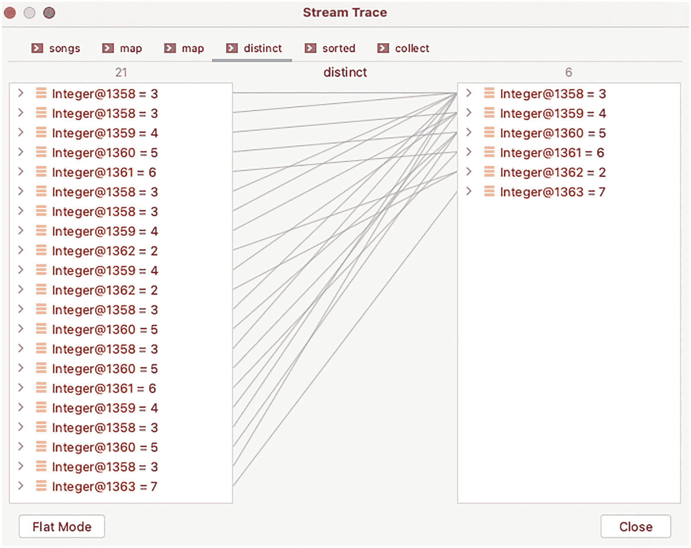

# 8.流 API

术语“流”有一个以上的含义，如 [`dictionary.com`](http://dictionary.com) 中所解释的:

1.  在河道或水道中流动的水体，如河流、小溪或小溪

2.  稳定的水流，如在河流或海洋中

3.  水或其他液体或流体的任何流动

4.  空气、气体等的气流或流动

5.  任何事物的连续不断的流动或连续

6.  主导方向；漂流

7.  *数字技术* **数据流**，作为音频广播、电影或实时视频，从一个源平稳、连续地传输到计算机、移动设备等。

当谈到编程时，与流更接近的定义是前面列表中的数字 5 和数字 7 的一部分。实际上，流是来自支持聚合操作的源的对象序列。你现在可能会说，这是一个收藏？好吧。。。不完全是。

## 流简介

考虑一个非常大的歌曲集合，我们想要分析并找到持续时间至少为 300 秒的所有歌曲。对于这些歌曲，我们希望将名称保存在一个列表中，并按照持续时间的降序对它们进行排序。假设我们已经有了列表中的歌曲，代码看起来像清单 [8-1](#PC1) :

```java
// non-relevant code omitted

List<Song> songList = loadSongs();
List<Song> resultedSongs = new ArrayList<>();

//find all songs with duration of at least 300 seconds
for (Song song: songList) {
    if (song.getDuration() >= 300) {
        resultedSongs.add(song);
    }
}

Collections.sort(resultedSongs, new Comparator<Song>(){
    public int compare(Song s1, Song s2){
        return s2.getDuration().compareTo(s1.getDuration());
    }
});

System.out.println(resultedSongs);
List<String> finalList0 = new ArrayList<>();
for (Song song: resultedSongs) {
    finalList0.add(song.getTitle()); // only the song title is required
}
System.out.println("Before Java 8: " + finalList0);

Listing 8-1Java Code Made of a Few Statements

```

这段代码的一个问题是处理大型集合的效率并不高。此外，我们一遍又一遍地遍历列表，并执行检查以获得最终结果。如果我们能够在每个元素上一个接一个地执行所有这些操作，而不重复遍历，岂不是更有效率？是的，而且从 Java 8 开始就有可能做到。

Java 8 中引入的新的**流**抽象表示可以顺序或并行处理的元素序列，并支持聚合操作。由于硬件开发的最新进展，CPU 变得更加强大和复杂，包含多个可以并行处理信息的内核。为了利用这些硬件能力，Java 中引入了 Fork Join 框架。在 Java 8 中，引入了流 API 来支持并行数据处理，而不需要定义和同步线程的锅炉代码。

*流 API* 的中央接口是`java.util.stream.BaseStream`。任何具有流功能的对象都属于扩展它的类型。流本身不存储元素；它不是一个数据结构，只是用来计算元素，并根据需要将它们提供给一个操作或一组聚合操作。

聚合操作是流 API 中的特殊方法，具有以下特征:

*   它们支持行为作为参数。大多数聚合操作都支持 lambda 表达式作为参数。

*   他们使用内部迭代。内部迭代不会按顺序遍历元素，因此可以利用并行计算。内部迭代将一个问题分解成子问题，同时解决它们，然后组合结果。

*   它们处理来自流的元素，而不是直接来自流的源头。

为序列中的元素提供服务涉及内部自动迭代。返回流的操作可以链接在一个管道中，称为**中间操作**。操作处理流中的元素，并将结果作为流返回给管道中的下一个操作。返回非流结果的操作被称为**终端操作**，通常出现在流水线的末端。在深入之前，举个简单的例子，使用 streams，清单 [8-1](#PC1) 中的代码被写成清单 [8-2](#PC2) 中所描述的那样。

```java
List<String> finalList = songList.stream()
    .filter(s -> s.getDuration() >= 300)
    .sorted(Comparator.comparing(Song::getDuration).reversed())
    .map(Song::getTitle)
    .collect(Collectors.toList());
System.out.println(finalList);

Listing 8-2Code in Listing 8-1 Rewritten with Streams

```

是的，用流编程很棒。 *Stream API* 概念允许开发人员将集合转换成流，并编写代码来并行处理数据，然后将结果转换成新的集合。

使用流是一种非常敏感的编程方式，建议在设计代码时考虑到每种可能性。`NullPointerException`是 Java 中最常见的异常之一。

在 Java 8 中，引入了类`Optional<T>`来避免这种类型的异常。`Stream<T>`实例用于存储类型`T`的无限个实例，而`Optional<T>`实例可能包含也可能不包含类型`T`的实例。因为这两个实现基本上都是其他类型的包装器，所以它们将一起讨论。

出于实际原因，`Stream`实例在本章中将被称为**流**，类似于`List`实例被称为**列表**，集合实例被称为**集合**等等。

你可能注意到术语**函数**被引入，用来指代被证明为流操作的参数的行为。这是因为使用流允许以*函数式编程*风格编写 Java 代码。本书开头提到 Java 是一种面向对象的编程语言，对象是它的核心术语。在函数式编程中，核心术语是**纯函数**，通过组合纯函数来编写代码，这允许避免共享状态，利用不可变数据，从而避免处理污染的副作用。 <sup>[1](#Fn1)</sup> 

纯函数是数学函数的软件模拟，具有以下特性:

*   纯函数为相同的参数返回相同的值。该实现不涉及任何随机值或非最终的全局变量，这些变量可能会导致为相同的参数返回不同的值。纯函数必须产生一致的结果。

*   函数的返回值只取决于传递给函数的输入参数。

*   纯函数没有副作用。(没有局部静态变量、非局部变量、可变引用参数或输入/输出流的变异)。

流、纯函数和 lambda 表达式的组合有助于编写 Java **声明性代码**。在这一章中，我们留下了典型的面向对象的**命令式编码风格**，其中算法的每一步都是一个接一个地声明的，流程由`boolean`条件控制。我们开始设计应用于流元素的纯函数链。

## 创建流

在享受乐趣和使用流优化我们的代码之前，让我们看看如何创建它们。要创建一个流，我们显然需要一个源。这个源可以是任何东西:一个集合(列表、集合或映射)、一个数组或用作输入的 I/O 资源(比如文件、数据库或任何可以转换成实例序列的东西)。

流不会修改其源，因此可以从同一个源创建多个流实例，并用于不同的操作。

集合和流之间的最大区别在于，流发出的元素由操作消耗，因此流不能被多次使用。这里的代码被 Java 编译器接受。

```java
int[] arr = { 50, 10, 250, 100};
IntStream intStream = Arrays.stream(arr);

intStream.forEach(System.out::println);
intStream.forEach(System.out::println);

```

然而，当我们第二次尝试遍历流时，会在运行时抛出一个`IllegalStateException`。

```java
Exception in thread "main" java.lang.IllegalStateException: stream has already been operated upon or closed at java.base/java.util.stream.AbstractPipeline.
sourceStageSpliterator(AbstractPipeline.java:279) at java.base/java.util.
stream.IntPipeline$Head.forEach(IntPipeline.java:617) at chapter.eigth/com.
apress.bgn.eight.StreamRecyclingDemo.main(StreamRecyclingDemo.java:44)

```

如果您需要两次处理一个流的元素，您必须再次从源重新创建它。

### 从集合创建流

在本章的介绍中，清单 [8-2](#PC2) 中的代码片段描述了一种从列表中创建流的方法。从 Java 8 开始，所有集合接口和类都增加了返回流的默认方法。在清单 [8-3](#PC5) 中，我们获取了一个整数列表，并通过调用`stream()`方法将其转换成一个流。有了流之后，我们使用`forEach(..)`方法遍历它，打印流中的值，以及执行该代码的执行线程的名称。你会问，为什么是线程名？你很快就会看到。

```java
package com.apress.bgn.eigth;

import java.util.List;

public class IntegerStreamDemo {

    public static void main(String... args) {
        List<Integer> bigList = List.of(50, 10, 250, 100 /*, ... */);

        bigList.stream()
            .forEach(i ->
                    System.out.println(Thread.currentThread().getName() + ": " + i)
        );
    }
}

Listing 8-3Creating a Stream of Integer Values from a List of Integers

```

上面的代码创建了一个整数元素流。`Stream<T>`接口公开了一组方法，每个`Stream<T>`实现为这些方法提供了一个具体的实现。最常用的是`forEach(..)`方法，它遍历流中的元素。`forEach(..)`方法需要一个`java.util.function.Consumer<T>`类型的参数。

一个**消费者**在本书中我们称之为`java.util.function.Consumer<T>`功能接口的内联实现。该接口声明了一个抽象方法，实现它的类必须为该方法提供一个具体的实现。出于同样的原因，这个接口用`@FunctionalInterface`进行了注释。该方法被命名为`accept(T t)`，并被称为**功能方法**。它将 T 类型的元素作为参数，处理它，不返回任何内容。由于这个原因，消费者函数适合于功能管道的末端。

为流中的每个元素调用此使用者方法。实现类基本上是内联声明的，只需要提到方法的主体。由于 lambda 表达式的魔力，JVM 会完成剩下的工作。没有它们，您将不得不编写类似清单 [8-4](#PC6) 中的代码。

```java
package com.apress.bgn.eigth;

import java.util.List;
import java.util.function.Consumer;

public class IntegerStreamDemo {

    public static void main(String... args) {
        List<Integer> bigList = List.of(50, 10, 250, 100 /*, ... */);

        bigList.stream().forEach(
            new Consumer<Integer>() {
                @Override
                public void accept(Integer i) {
                    System.out.println(Thread.currentThread().getName() + ": " + i);
                }
            });
    }
}

Listing 8-4Expanded Declaration of a Consumer

```

在 Java 8 中引入 lambda 表达式之前，这是您编写代码的方式。当类以这种方式实现接口时，内联，使用看起来很像使用接口类型的构造函数调用的语法；它们被称为**匿名类**，因为它们没有名字，并且它们被准确地用在声明的地方。Lambda 表达式极大地简化了这个过程，但是只针对定义一个方法的接口，这些接口被命名为 **functional interfaces** 。从 Java 8 开始，这些接口用`@FunctionalInterface`注释进行了注释。在前面的示例中，代码打印了线程名称和元素的值。运行该代码的结果如下所示:

```java
main: 50
main: 10
main: 250
main: 100
...

```

每个数字都以`main`为前缀，这意味着流中的所有整数都由同一个线程(应用程序的主线程)顺序处理。

出于实际原因，对于集合来说，当顺序流只需要遍历时，不需要调用`stream()`，因为为它们定义的`forEach(..)`方法已经很好地完成了这项工作。因此，前面的代码可以简化为:

`bigList.forEach(i ->`

`System.out.println(Thread.currentThread().getName() + ": " + i)`

`);`

打印线程的名称是因为有另一种创建流的方法:通过调用`parallelStream()`方法。唯一的区别是返回的流是并行流。这意味着流中的每个元素都在不同的线程上处理。这意味着`Consumer<T>`的实现必须是线程安全的，并且不包含涉及不打算在线程间共享的实例的代码。打印流元素值的代码不会影响流返回的元素值，也不会影响其他外部对象，因此并行化是安全的。清单 [8-5](#PC8) 描述了使用`parallelStream()`而不是`stream()`来创建流，并使用相同的`Consumer` <t>实现来打印流的元素。输出显示在</t>代码片段的底部。

```java
package com.apress.bgn.eigth;

import java.util.List;
import java.util.function.Consumer;

public class IntegerStreamDemo {

    public static void main(String... args) {
        List<Integer> bigList = List.of(50, 10, 250, 100 /*, ... */);

        bigList.parallelStream()
            .forEach(i ->
                System.out.println(Thread.currentThread().getName() + ": " + i)
        );
    }
}
// output
main: 83
ForkJoinPool.commonPool-worker-1: 23
main: 33
ForkJoinPool.commonPool-worker-1: 45
ForkJoinPool.commonPool-worker-2: 50
main: 67
...

Listing 8-5Creating a Parallel Stream of Integer Values from a List of Integers

```

您将注意到的第一件事是线程名称:我们不再有一个线程名称，但是很多线程都被命名为**forkjoinpool . common pool-worker-*** *。主线程仍然打印一些值，但是其他线程也做一些工作，打印值的顺序——或者更像是无序的——表明线程是并行运行的。这些线程有相似的名字，很明显它们都属于同一个**线程池**。在这种情况下，JVM 创建了一个线程池来包含一些线程实例，用于并行处理流中的所有元素。使用线程池的优点是线程可以被重用，因此不需要创建新的线程实例，这稍微优化了执行时间。

对于更复杂的解决方案，使用`parallelStream()`时的性能提升变得明显。对于这个简单的例子，创建一个线程池并管理线程实际上是对 CPU 和内存的浪费。因此，除非对流中每个元素执行的操作足够复杂，可以通过并行执行来提高性能，否则应避免使用`parallelStream()`。

如果您查看与每个线程关联的数字，即线程名称末尾的数字，您会发现这些数字有时会重复。这基本上意味着同一线程被重用来处理另一个流元素。

### 从数组创建流

对于前面的代码示例，我们的流的源由一个`List<T>`实例表示。相同的语法也用于`Set<T>`实例。

但是流也可以从数组中创建。看看清单 [8-6](#PC9) :

```java
package com.apress.bgn.eigth;

import java.util.Arrays;

public class ArrayStreamDemo {
    public static void main(String... args) {
        int[] arr = { 50, 10, 250, 100 /* ... */};

        Arrays.stream(arr).forEach(
                i -> System.out.println(Thread.currentThread().getName() + ": " + i)
        );
    }
}

Listing 8-6Creating a Stream of Integer Values from an Array of Integers

```

静态方法`stream(int[] array)`被添加到 Java 1.8 中的`java.util.Arrays`实用程序类中，并在前面的代码清单中用于创建原语流。

对于包含对象的数组，调用的方法是`stream(T[] array)`，其中`T`是一个泛型类型，它替换任何引用类型(也是在 Java 1.8 中添加的)。通过调用相同的`parallel()`方法，从数组生成的流可以被并行化。

数组的新颖之处在于，通过指定数组块的起始和结束索引，可以从数组的一部分创建流。清单 [8-7](#PC10) 中的代码展示了从数组的一部分创建一个流，以及使用一个简单的消费者打印结果流的元素的输出。

```java
package com.apress.bgn.eigth;

import java.util.Arrays;

public class ArrayStreamDemo {
    public static void main(String... args) {
        int[] arr = { 50, 10, 250, 100, 23, 45, 33, 55 /* ... */};

        Arrays.stream(arr, 3,6).forEach(
                i -> System.out.println(Thread.currentThread().getName() + ": " + i)
        );
    }
}
// output
main: 100
main: 23
main: 45

Listing 8-7Creating a Stream of Integer Values from an Array of Integers

```

### 创建空流

在编写 Java 代码时，一个好的做法是编写返回对象的方法，避免返回`null.`以减少抛出`NullPointerExceptions`的可能性。当方法返回流时，首选方式是返回空流。这可以通过调用由`Stream<T>`接口提供的静态`Stream.empty()`方法来完成。

清单 [8-8](#PC11) 中的代码片段描述了一个方法，该方法接受一系列`Song`实例参数，并使用它作为源返回一个流。如果列表为`null`或空，则返回一个空流。产生的流在`main(..)`方法中被遍历，没有额外的验证。如果流为空，则不会打印任何内容。

```java
package com.apress.bgn.eigth;

import com.apress.bgn.eigth.util.*;

import java.util.List;
import java.util.stream.Stream;

public class SongStreamDemo {
    public static void main(String... args) {
        System.out.println(" -- Testing 'getAsStream(..)' method with null -- ");
        getAsStream(null).forEach(System.out::println);

        System.out.println(" -- Testing 'getAsStream(..)' method with empty list --");
        getAsStream(List.of()).forEach(System.out::println);

        System.out.println(" -- Testing 'getAsStream(..)' method with a list -- ");
        getAsStream(StreamMediaLoader.loadSongsAsList()).forEach(System.out::println);
    }

    public static Stream<Song> getAsStream(List<Song> songList) {
        if(songList == null || songList.isEmpty()) {
            return Stream.empty();
        } else {
            return songList.stream();
        }
    }
}
// output
 -- Testing 'getAsStream(..)' method with null --
 -- Testing 'getAsStream(..)' method with empty list --
 -- Testing 'getAsStream(..)' method with a list --
Song{id=1, singer='John Mayer', title='New Light', duration=206, audioType=FLAC}
Song{id=2, singer='John Mayer', title='My Stupid Mouth', duration=225, audioType=M4A}
...

Listing 8-8Creating a Stream of Integer Values from an Array of Integers

```

运行前面的代码会导致前两条消息一条接一条地打印出来，中间没有任何内容，因为方法返回的流是空的。

### 创建有限的流

除了从实际来源创建流之外，还可以通过调用流实用程序方法(如`Stream.generate(..)`或`Stream.builder()`)来当场创建流。当用一组固定的已知值构建一个有限的流时，应该使用`builder()`方法。这个方法返回一个`java.util.stream.Stream.Builder<T>`的实例，这是一个内部接口，声明一个名为`add(T t)`的默认方法，需要调用这个方法来添加流的元素。要创建`Stream` <t>实例，必须最终调用它的</t> `build()`方法。`add(T t)`方法返回对`Builder<T>`实例的引用，因此它可以与该接口的任何其他方法链接。清单 [8-9](#PC12) 中的代码是如何使用`builder()`方法创建各种值的有限流的示例。

```java
package com.apress.bgn.eigth;

import com.apress.bgn.eigth.util.AudioType;
import com.apress.bgn.eigth.util.Song;

import java.util.stream.Stream;

public class FiniteStreamsDemo {
    public static void main(String... args) {
        Stream<Integer> built = Stream.<Integer>builder()
                .add(50).add(10).add(250)
                .build();

        Stream<String> lyrics = Stream.<String>builder()
                .add("In a world where people never meet,")
                .add("They fall in love looking at some screen")
                .add("And love can only be one-sided")
                .add("Bitter, burning unrequited.")
                .build();

        Stream<Song> songs = Stream.<Song>builder()
                .add (new Song("John Mayer", "New Light", 206, AudioType.FLAC))
                .add (new Song("Ben Barnes", "You find me", 420, AudioType.FLAC))
                .build();

        Stream data = Stream.builder() // compiler warns about raw use of parameterized class 'Stream'
                .add("Vultures")
                .add(3)
                .add(List.of("aa"))
                .build();

    }
}

Listing 8-9Creating Streams from Finite Sets of Values

```

由于`Builder<T>`接口是一个通用接口，因此必须指定一个类型参数，作为流中元素的类型。此外，`builder()`方法是通用的，需要在调用前将类型作为参数提供。如果没有指定类型，则使用默认的`Object`，任何类型的实例都可以添加到流中(如第四个流声明所示)。然而，编译器警告不要使用参数化类“Stream”。

要创建一个流，还有另一个名为`generate(..)`的方法。这个方法需要一个类型为`java.util.function.Supplier<T>`的参数。

一个**供应商**在本书中我们称之为`java.util.function.Supplier<T>`功能接口的内联实现。该接口需要为其名为`get()`的单一方法提供一个具体的实现。此方法应返回要添加到流中的元素。

因此，如果我们想生成一个整数流，一个合适的`get()`实现应该返回一个随机整数。清单 [8-10](#PC13) 中描述了扩展的代码。Lambda 表达式并不用于说明`generate(..)`方法接收现场创建的`Supplier<Integer>`实例作为参数。

```java
package com.apress.bgn.eigth;

import java.util.stream.Stream;

public class FiniteStreamsDemo {
    public static void main(String... args) {
        Stream<Integer> generated = Stream.generate(
        new Supplier<Integer>() {
            @Override
            public Integer get() {
                Random rand = new Random();
                return rand.nextInt(300) + 1;
            }
        }).limit(15);
    }
}

Listing 8-10Creating Stream Using a Supplier

```

`limit(15)`方法将供应商生成的元素数量限制为 15 个，否则生成的流将是无限的。清单 [8-10](#PC13) 中的代码可以通过使用清单 [8-11](#PC14) 中描述的 lambda 表达式来简化。

```java
package com.apress.bgn.eigth;

import java.util.stream.Stream;

public class FiniteStreamsDemo {
    public static void main(String... args) {
        Stream<Integer> generated = Stream.generate(
        () -> {
            Random rand = new Random();
            return rand.nextInt(300) + 1;
        }).limit(15);
    }
}

Listing 8-11Creating Stream Using a Supplier and Lambda Expressions

```

如果`Supplier<Integer>.get()`总是返回相同的数字，不管这样的流可能多么无用，前面的声明变成:

```java
Stream<Integer> generated = Stream.generate( () -> 5).limit(15);

```

如果需要对由`Stream<T>`实例发出的元素进行更多的控制，可以使用`iterate(..)`方法。这个方法有两个版本，一个是在 Java 8 中添加的，一个是在 Java 9 中添加的。使用这些方法中的任何一种都类似于让 for 语句为流生成条目。

Java 8 版本用于生成无限流。这个版本的方法接收一个名为`seed`的初始值和一个迭代步骤作为参数。

Java 9 版本用于生成有限流。这个版本的方法接收一个名为`seed`的初始值、一个决定迭代何时停止的`predicate`和一个迭代步骤作为参数。

**谓词**是函数接口`java.util.function.Predicate<T>`的内联实现，它声明了一个返回布尔值的方法`named test(T t)`。这个方法的实现应该根据一个条件来测试它的类型为`T`的单个参数，如果条件满足就返回`true`，否则返回`false`。

迭代步骤是函数接口`java.util.function.UnaryOperator<T>`的内联实现，用于表示对单个操作数的操作，该操作产生与其操作数相同类型的结果。

在下面的示例中，stream 元素从 0 开始生成，步长为 5，只要值小于 50，就会生成这些元素，如谓词所定义的。

```java
Stream<Integer> iterated = Stream.iterate(0, i -> i < 50 , i -> i + 5);

```

就像使用`for`语句一样，终止条件不是强制性的，如果没有它，您将调用 Java 8 中引入的这个方法的版本，但是在这种情况下，必须使用`limit(..)`方法来确保流是有限的。

```java
Stream<Integer> iterated = Stream.iterate(0, i -> i + 5).limit(15);

```

在 Java 9 中，除了`limit(..)`方法之外，还有另一种方法来控制流中值的数量:`takeWhile(..)`方法。该方法从原始流中获取与作为参数接收的谓词相匹配的最长元素集，从第一个元素开始。这对于有序的流来说很好，但是如果流是无序的，那么结果是匹配谓词的任何元素集，包括一个空元素。为了解释通过调用`takeWhile(..)`重新定义的不同流，必须首先讨论流的顺序概念。

表达式**遇到顺序**表示`Stream<T>`遇到数据的顺序。流的相遇顺序由源操作和中间操作定义。例如:如果将一个数组用作源，则流的相遇顺序由数组中的排序来定义。如果一个列表被用作源，那么相遇顺序就是列表的迭代顺序。如果一个集合被用作源，那么就没有相遇顺序，因为一个集合本来就是无序的。

流管道中的每个中间操作都作用于相遇顺序，其效果如下:

*   可以在输出中加入相遇顺序。例如，`sorted()`操作在无序的流上强加了一个相遇顺序。

*   遭遇战顺序保持不变。像`filter(..)`这样的操作可能会删除一些元素，但是原始顺序不会受到影响。

*   遭遇战秩序被破坏。例如，`sorted()`操作在有序流上强加了一个相遇顺序，替换了现有的顺序。

如果将元素累积到具有相遇顺序的容器中，收集器操作会保留相遇顺序。顺序流和并行流在排序方面具有相同的属性。

清单 [8-12](#PC18) 显示了`takeWhile(Predicate<? super T> predicate)`方法的两种用法。

```java
package com.apress.bgn.eight;

import java.util.stream.Stream;

public class FiniteStreamsDemo {
    public static void main(String... args) {
        // (1)
        Stream<Integer> orderedStream = List.of( 3, 6, 9, 11, 12, 13, 15).stream();
        Stream<Integer> result = orderedStream.takeWhile(s -> s % 3 == 0);
        result.forEach(s -> System.out.print(s + " "));
        // output: 3 6 9

        // (2)
        Stream<Integer> unorderedStream = Set.of(3, 6, 9, 2, 4, 8, 12, 36, 18, 42, 11, 13).stream();
        result = unorderedStream
.parallel()    // this does not affect results
.takeWhile(s -> s % 3 == 0);
        result.forEach(s -> System.out.print(s + " "));
        // output (maybe): 3 12 36
    }
}

Listing 8-12Creating Stream Using a Supplier and the takeWhile(..) Method

```

第一个代码块对整数的有序流使用`takeWhile(..)`,并返回一个元素被 3 除的流。得到的流包含元素 *3 6 9* ，因为这是匹配给定谓词的第一组元素。

如果在第二个代码块中描述的无序流(并行或不并行)上调用`takeWhile(..)`，结果将是不可预测的。结果可能是 3 12 36 或 12 36 18 42，因为结果是匹配谓词的任何元素的子集。此外，由于顺序不固定，代码块最终可能会打印出 6 3 9 或 18 42，依此类推。所以无序流上的`takeWhile(..)`的结果是**不确定的**。

`takeWhile(..)`操作是`dropWhile(..)`的“姐妹”，也是在 Java 9 中引入的。顾名思义，这与`takeWhile(..)`所做的正好相反:对于一个有序流，它在丢弃与谓词匹配的最长元素集之后，返回一个由元素组成的新流。对于无序的流，只有混乱，任何匹配谓词的元素子集都可以被丢弃，包括空流。清单 [8-13](#PC19) 显示了`dropWhile(..)`方法的两种用法。

```java
package com.apress.bgn.eigth;

import java.util.stream.Stream;

public class FiniteStreamsDemo {
    public static void main(String... args) {
        Stream.of( 3, 6, 9, 11, 12, 13, 15)
            .dropWhile(s -> s % 3 == 0 )
            .forEach(s -> System.out.print(s + " "));
        // output: 11 12 13 15

        Stream.of(3, 6, 9, 2, 4, 8, 12, 36, 18, 42, 11, 13)
            .dropWhile(s -> s % 3 == 0 )
      .parallel() // this does not affect results
            .forEach(s -> System.out.print(s + " "));
        // output (maybe): 11 9 8 6 4 2 42 13 36
    }
}

Listing 8-13Creating Stream Using a Supplier and the dropWhile(..) Method

```

如果这两个操作应用于并行流，唯一改变的是元素的打印顺序，但是结果集将包含相同的元素。

### 原语流和字符串流

当我们第一次创建原语流时，我们使用了一个`int[]`数组作为源。然而，原语流可以通过多种方式创建，因为 Stream API 包含更多带有默认方法的接口，使得用流编程变得切实可行。在图 8-1 中，你可以看到流接口的层次结构。


图 8-1

流 API 接口

看了前面的图片后，您可能会想到，`IntStream`接口可以用来创建整数的原始流。这个接口公开了许多这样做的方法，其中一些继承自`BaseStream<T,S>`。通过使用`builder()`、`generate(..)`或`iterate(..)`方法或使用`range*(..)`方法的，可以从现场指定的几个值创建一个`IntStream`实例，如清单 [8-14](#PC20) 所示。

```java
package com.apress.bgn.eigth;

import java.util.Random;
import java.util.stream.IntStream;

public class NumericStreamsDemo {
    public static void main(String... args) {
        IntStream intStream0 = IntStream.builder().add(0).add(1).add(2).add(5).build();
        IntStream intStream1 = IntStream.of(0,1,2,3,4,5);

        IntStream intStream2 = IntStream.range(0, 10);
        IntStream intStream3 = IntStream.rangeClosed(0, 10);

        Random random = new Random();
        IntStream intStream4 = random.ints(5);
    }
}

Listing 8-14Creating IntStream Instances

Using Various Methods

```

通过将间隔的开始和结束作为参数提供给`range(..)`和`rangeClosed(..)`方法，可以创建一个`IntStream`实例。它们都为流生成元素，步长为 1，只有最后一个元素包含区间的上界作为值。

此外，在 Java 1.8 中，`java.util.Random`类增加了一个名为`ints(..)`的方法，可以生成一个随机整数流。它声明了一个参数，该参数表示要生成并放入流中的元素数量，但是有一种形式的该方法没有生成无限流的参数。

为`IntStream`提到的所有方法都可以用来生成`LongStream`实例，因为等效的方法也在这个接口中定义。

对于`DoubleStream`，没有范围方法，但是有`of(..)`方法、`builder()`、`generate(..)`等等。此外，`java.util.Random`类在 Java 1.8 中用生成随机双精度值流的`doubles(..)`方法得到了丰富。它声明了一个参数，该参数表示要生成并放入流中的元素数量，但是有一种形式的该方法没有生成无限流的参数。在清单 [8-15](#PC21) 中，描述了几种创建双精度流的方法。

```java
package com.apress.bgn.eigth;

import java.util.Random;
import java.util.stream.DoubleStream;

public class NumericStreamsDemo {
    public static void main(String... args) {
        DoubleStream doubleStream0 = DoubleStream.of(1, 2, 2.3, 3.4, 4.5, 6);

        Random random = new Random();
        DoubleStream doubleStream1 = random.doubles(3);

        DoubleStream doubleStream2 = DoubleStream.iterate(2.5, d -> d = d + 0.2).limit(10);
    }
}

Listing 8-15Creating Numeric Stream Instances Using Various Methods

```

对于`char`值的流，没有特殊的接口，但是`IntStream`可以很好地使用。

```java
IntStream intStream = IntStream.of(’a’,’b’,’c’,’d’);
intStream.forEach(c -> System.out.println((char) c));

```

创建 char 值流的另一种方法是使用 String 实例作为流源。

```java
IntStream charStream = "sample".chars();
charStream.forEach(c -> System.out.println((char) c));

```

在 Java 8 中，`java.util.regex.Pattern`也用特定于流的方法来丰富；作为一个用于处理`String`实例的类，它毕竟是添加这些方法的合适位置。一个`Pattern`实例对于拆分一个现有的字符串实例并使用`splitAsStream(..)`方法将片段作为一个流返回是很有用的。

```java
Stream<String> stringStream = Pattern.compile(" ")
    .splitAsStream("live your life");

```

使用`Files.lines(..)`实用程序方法，文件的内容也可以作为字符串流返回。

```java
String inputPath = "chapter08/src/main/resources/songs.csv";
Stream<String> stringStream = Files.lines(Path.of(inputPath));

```

到目前为止，这几节已经展示了如何创建所有类型的流，下一节将向您展示如何使用它们来处理数据。

如果你觉得有必要将流实例与真实对象联系起来，以使它们有意义，我推荐如下:想象一个有限的流(就像一个从集合中创建的流),就像倾斜时从杯子中滴落的水。杯子里的水最终会用完，但当水滴落时，它形成了一条小溪。一条无限的溪流就像一条有喷泉头的河流，它不停地流动*(当然，除非严重的干旱使河流干涸)*。

### `Optional<T>`简介

`java.util.Optional<T>`实例是 Java 语言的薛定谔 <sup>[2](#Fn2)</sup> 盒。它们非常有用，因为它们可以用作方法的返回类型，以避免返回一个`null`值，并导致抛出一个可能的`NullPointerException`，或者开发人员使用该方法编写额外的代码来处理抛出异常的可能性。`Optional<T>`实例可以以类似于流的方式创建。

有一个`empty()`方法可以创建不包含任何内容的任何类型的可选值。

```java
Optional<Song> empty = Optional.empty();

```

有一个`of()`方法用于将现有对象包装到一个`Optional<T>`中。

```java
Optional<Long> value = Optional.of(5L);

```

考虑到这些类型的实例被设计成不允许使用`null`值，先前创建`Optional<T>`实例的方式阻止了我们编写类似这样的内容:

```java
Song song = null;
Optional<Song> nonNullable = Optional.of(song);

```

编译器并不介意，但是在运行时执行代码时，会抛出一个`NullPointerException`。不过，如果我们真的需要一个`Optional<T>`实例来允许`null`值，这是可能的；Java 9 中为此引入了一个名为`ofNullable(T t)`的实用方法:

```java
Song song = null;
Optional<Song> nullable = Optional.ofNullable(song);

```

现在我们有了`Optional<T>`实例，我们可以用它们做什么呢？我们使用它们。看看清单 [8-16](#PC30) 中的代码。

```java
package com.apress.bgn.eigth;

import com.apress.bgn.eigth.util.MediaLoader;
import com.apress.bgn.eigth.util.Song;

import java.util.List;

public class NonOptionalDemo {
    public static void main(String... args) {
        List<Song> songs = MediaLoader.loadSongs();
        Song song = findFirst(songs, "B.B. King");
        if(song != null && song.getSinger().equals("The Thrill Is Gone")) {
            System.out.println("Good stuff!");
        } else {
            System.out.println("not found!");
        }
    }

    public static Song findFirst(List<Song> songs, String singer) {
        for (Song song: songs) {
            if (singer.equals(song.getSinger())) {
                return song;
            }
        }
        return null;
    }
}

Listing 8-16Code Showing the Necessity of Optional<T>

```

`findFirst(..)`方法查找列表中歌手等于“B.B. King”的第一首歌曲，如果找到则返回并打印一条消息，如果没有找到则打印另一条消息。请注意前面代码清单中的列表的可空性测试和迭代。在 Java 8 中，这两者都不再必要。清单 [8-17](#PC31) 描述了清单 [8-16](#PC30) 中的代码被重新设计以使用`Optional<T>`。

```java
package com.apress.bgn.eigth;

import com.apress.bgn.eigth.util.MediaLoader;
import com.apress.bgn.eigth.util.Song;

import java.util.List;
import java.util.Optional;

public class OptionalDemo {
    public static void main(String... args) {
        List<Song> songs = MediaLoader.loadSongs();
        Optional<Song> opt = songs.stream()
                .filter(s -> "B.B. King".equals(s.getSinger()))
                .findFirst();
        opt.ifPresent(r -> System.out.println(r.getTitle()));
    }
}

Listing 8-17Code Showing Usage of Optional.ifPresent(..)

```

如果`Optional<T>`实例不为空，将打印歌曲标题；否则，将不打印任何内容，代码将从该点继续运行，不会引发异常。但是如果我们想在`Optional<T>`实例为空时打印一些东西呢？在 Java 11 中我们可以做些什么，因为引入了一个名为`isEmpty()`的方法来测试`Optional<T>`实例内容(清单 [8-18](#PC32) )。

```java
package com.apress.bgn.eigth;

import com.apress.bgn.eigth.util.MediaLoader;
import com.apress.bgn.eigth.util.Song;

import java.util.List;
import java.util.Optional;

public class OptionalDemo {
    public static void main(String... args) {
        List<Song> songs = MediaLoader.loadSongs();
        Optional<Song> opt1 = songs.stream()
                .filter(s -> "B.B. King".equals(s.getSinger()))
                .findFirst();
        if(opt1.isEmpty()) {
            System.out.println("Not found!");
        }
    }
}

Listing 8-18Code Showing Usage of Optional.isEmpty()

```

但是等等这有点。。。不对。难道我们不能有一个方法来调用一个`Optional<T>`来获得作为一个`if-else`语句的确切行为吗？从 Java 9 开始，这是可能的；当不为空时，`ifPresentOrElse(..)`方法以一个`Consumer<T>`作为参数处理`Optional<T>`实例的内容，当`Optional<T>`实例为空时，以一个`Runnable`实例作为参数执行(清单 [8-19](#PC33) )。

```java
package com.apress.bgn.eigth;

import com.apress.bgn.eigth.util.MediaLoader;
import com.apress.bgn.eigth.util.Song;

import java.util.List;
import java.util.Optional;

public class OptionalDemo {
    public static void main(String... args) {
        List<Song> songs = MediaLoader.loadSongs();
        Optional<Song> opt2 = songs.stream()
                .filter(ss -> "B.B. King".equals(ss.getSinger()))
                .findFirst();
        opt2.ifPresentOrElse(
                r -> System.out.println(r.getTitle()),
                () -> System.out.println("Not found!")) ;
    }
}

Listing 8-19Code Showing Usage of Optional.ifPresentOrElse(..)

```

如果`Optional<T>`实例不为空，可以通过调用`get()`方法提取其内容(清单 [8-20](#PC34) )。

```java
package com.apress.bgn.eigth;

import com.apress.bgn.eigth.util.MediaLoader;
import com.apress.bgn.eigth.util.Song;

import java.util.List;
import java.util.Optional;

public class OptionalDemo {
    public static void main(String... args) {
        List<Song> songs = MediaLoader.loadSongs();
        Optional<Song> opt3 = songs.stream()
                .filter(ss -> "Rob Thomas".equals(ss.getSinger()))
                .findFirst();
        System.out.println("Found Song " + opt3.get());
    }
}

Listing 8-20Code Showing Usage of Optional.get()

```

当没有找到想要的对象时，前面的代码不打印任何东西，因为`Optional<T>`是空的。但是如果我们想要打印一个默认值，我们也可以使用一个名为`orElse(..)`的方法(清单 [8-21](#PC35) )。

```java
package com.apress.bgn.eigth;

import com.apress.bgn.eigth.util.MediaLoader;
import com.apress.bgn.eigth.util.Song;

import java.util.List;
import java.util.Optional;

public class OptionalDemo {
    public static void main(String... args) {
        List<Song> songs = MediaLoader.loadSongs();
        Optional<Song> opt4 = songs.stream()
                .filter(ss -> "B.B. King".equals(ss.getSinger()))
                .findFirst();
        opt4.ifPresent(r -> System.out.println(r.getTitle()));

        Song defaultSong = new Song();
        defaultSong.setTitle("Untitled");
        Song s = opt4.orElse(defaultSong);
        System.out.println("Found: " + s.getTitle());
    }
}

Listing 8-21Code Showing Usage of Optional.orElse(..)

```

`orElse(T t)`方法接收由`Optional<T>`包装的类型的实例作为参数。它的另一个版本采用了一个返回所需类型对象的`Supplier<T>`。使用该方法的代码片段如下所示:

```java
Song fromSupplier =
     opt4.orElseGet(() -> new Song("None", "Untitled", 0, null));
System.out.println("Found: " + fromSupplier.getTitle());

```

如果我们想在`Optional<T>`为空时抛出一个特定的异常，那么也有一个方法，名为`orElseThrow(..)`(清单 [8-22](#PC37) )。

```java
package com.apress.bgn.eigth;

import com.apress.bgn.eigth.util.MediaLoader;
import com.apress.bgn.eigth.util.Song;

import java.util.List;
import java.util.Optional;

public class OptionalDemo {
    public static void main(String... args) {
        List<Song> songs = MediaLoader.loadSongs();
        Optional<Song> opt5 = songs.stream()
                .filter(st -> "B.B. King".equals(st.getSinger()))
                .findFirst();
        Song song = opt5.orElseThrow(IllegalArgumentException::new);
    }
}

Listing 8-22Code Showing Usage of Optional.orElseThrow(..)

```

正如您在前面的代码示例中可能注意到的那样，`Optional<T>`和`Stream<T>`可以结合起来编写实用的代码来解决复杂的解决方案。由于有许多方法可以应用于`Optional<T>`和`Stream<T>`实例，下一节将介绍它们在流中的应用，并随机引用`Optional<T>`。

### 如何像专业人士一样使用流

创建流之后，接下来要处理流中的数据。该处理的结果可以是另一个流，该流可以根据需要被进一步处理多次。有很多方法可以用来处理一个流并将结果作为另一个流返回。这些方法被称为**中间操作**。不返回流而是返回实际数据结构或者什么都不返回的方法被命名为**终端操作**。所有这些都在`Stream<T>`接口中定义。流的关键特征是，仅当终端操作被启动时，才使用流处理数据，并且仅在需要时使用来自源的元素。所以你可以说整个流过程实际上是懒惰的。延迟加载源元素并在需要时处理它们可以实现显著的优化。

在前面的断言之后，您可能意识到以前经常使用的从流中打印值的`forEach(..)`方法实际上是一个终端操作。但是还有相当多的其他终端操作，其中一些是大多数 commons 实现最可能需要的，将在本章剩余部分的例子中使用。

本章从一个处理`Song`实例流的例子开始，但是没有显示`Song`类。你可以在清单 [8-23](#PC38) 中看到它的字段。

```java
package com.apress.bgn.eigth;

public class Song {
    private Long id;
    private String singer;
    private String title;
    private Integer duration;
    private AudioType audioType;

    //getters and setters
    // toString
}

Listing 8-23Fields of Class Song

```

`AudioType`是一个包含音频文件类型的枚举，如清单 [8-24](#PC39) 所示。

```java
package com.apress.bgn.eigth;

public enum AudioType {
    MP3,
    FLAC,
    OGG,
    AAC,
    M4A,
    WMA,
    MP4
}

Listing 8-24AudioType Enum

```

既然下面的流示例将使用数据类型，那么也应该描述数据。在书中的例子中，数据包含在一个名为`songs.csv`的文件中。CSV 扩展名表示一个**逗号分隔的文件**，每个`Song`实例匹配文件中的一行。每行包含每个`Song`实例的所有属性值，由列分隔。值的顺序必须与构造函数参数的顺序相匹配。可以使用其他分离器；这里使用分号是出于实际原因(这是读取数据的库支持的默认设置)。文件内容如清单 [8-25](#PC40) 所示。

```java
01;John Mayer;New Light;206;FLAC
02;John Mayer;My Stupid Mouth;225;M4A
03;John Mayer;Vultures;247;FLAC
04;John Mayer;Edge of Desire;333;MP3
05;John Mayer;In Repair;372;MP3
05;Rob Thomas;Paper Dolls;185;MP3
07;The Script;Mad Love;207;MP3
08;Seth MacFarlane;No One Ever Tells You;244;MP3
09;Nat King Cole;Orange Colored Sky;154;MP3
10;Vertical Horizon;Forever;246;MP3
11;Mario Lanza;Temptation;141;M4A
12;Jack Radics;No Matter;235;MP3
13;George Michael;Fastlove;306;MP3
14;Childish Gambino;Freaks And Geeks;227;M4A
15;Bill Evans;Lover Man;304;MP3
16;Darren Hayes;Like It Or Not;381;MP3
17;Stevie Wonder;Superstition;284;MP3
18;Tony Bennett;It Had To Be You;196;MP3
19;Tarja Turunen;An Empty Dream;322;MP3
20;Lykke Li;Little bit;231;M4A
21;Ben Barnes;You find me;420;FLAC

Listing 8-25Song Entries in the sonds.csv File

```

通过使用名为 JSefa 的库中的类，文件中的每一行都将被转换成一个`Song`实例。 <sup>[3](#Fn3)</sup> 这个库不是本书的主题，但如果你感兴趣，可以使用脚注中的链接从官方网站获取更多详细信息。

### 终端功能:`forEach`和`forEachOrdered`

现在你已经准备好开始玩流了。假设 songs 流将提供前面清单中声明的所有`Song`实例，让我们首先打印流中的所有元素。清单 [8-26](#PC41) 中的代码使用一个简单的消费者在一个`Stream<Song>`上打印所有的`Song`实例。

```java
package com.apress.bgn.eigth;

import com.apress.bgn.eigth.util.Song;
import com.apress.bgn.eigth.util.StreamMediaLoader;

import java.util.stream.Stream;

public class MediaStreamTester {
    public static void main(String... args) {
        Stream<Song> songs = StreamMediaLoader.loadSongs();
        songs.forEach(song -> System.out.println(song));
    }
}

Listing 8-26Using a Stream to Print Song Instances

```

Java 8 中引入了方法引用。对于 lambda 表达式除了调用方法之外什么也不做的情况，方法引用是一种快捷方式，因此可以通过名称直接引用方法。所以这一行:

```java
songs.forEach(song -> System.out.println(song));

```

变成了:

```java
songs.forEach(System.out::println);

```

`forEach(..)`方法接收一个`Consumer<T>`实例作为参数。在前面的两个例子中，`accept()`方法的实现只包含了对`System.out.println(song),`的调用，这就是代码如此紧凑的原因，因为可以使用方法引用。但是如果这个方法的实现需要包含更多的语句，那么先前编写的紧凑代码就不可能了。

让我们先将歌手的名字大写，而不是直接打印歌曲，如清单 [8-27](#PC44) 所示。

```java
package com.apress.bgn.eigth;

import com.apress.bgn.eigth.util.Song;
import com.apress.bgn.eigth.util.StreamMediaLoader;

import java.util.function.Consumer;
import java.util.stream.Stream;

public class MediaStreamTester {
    public static void main(String... args) {
        Stream<Song> songs = StreamMediaLoader.loadSongs();
        songs.forEach(new Consumer<Song>() {
            @Override
            public void accept(Song song) {
                song.setSinger(song.getSinger().toUpperCase());
                System.out.println(song);
            }
        });
    }
}

Listing 8-27Using a Consumer Anonymous Class to Print Song Instances

```

可以用 lambda 表达式简化，但是因为方法体有两行，所以看起来还是不好。所以另一种方法是声明一个消费者字段，并使用 lambda 为每首歌曲调用它的`accept(..)`方法，如清单 [8-28](#PC45) 所示。

```java
package com.apress.bgn.eigth;

import com.apress.bgn.eigth.util.Song;
import com.apress.bgn.eigth.util.StreamMediaLoader;

import java.util.function.Consumer;
import java.util.stream.Stream;

public class MediaStreamTester {
    public static Consumer<Song> myConsumer = song -> {
        song.setSinger(song.getSinger().toUpperCase());
        System.out.println(song);
    };

    public static void main(String... args) {
        Stream<Song> songs = StreamMediaLoader.loadSongs();

        songs.forEach(song -> myConsumer.accept(song));
    }
}

Listing 8-28Using a Consumer Field to Print Song Instances

```

姐妹函数`forEachOrdered(..)`与`forEach(..)`做同样的事情，有一点不同，确保流上的元素将按照相遇顺序处理，如果这样的顺序是为流定义的，即使流是并行的。所以基本上，下面两行将以相同的顺序打印歌曲:

```java
songs.forEachOrdered (System.out::println);
songs.parallel().forEachOrdered(System.out::println);

```

### 中间运行:`filter`和终端运行:`toArray`

在下面的例子中，我们将选择所有的 MP3 歌曲，并将它们保存到一个数组中。使用`filter(..)`方法选择所有 MP3 歌曲。该方法接收一个类型为`Predicate<T>`的参数，该参数用于定义一个条件，流的元素必须通过该条件才能放入数组中，该数组是通过调用名为`toArray(..)`的终端方法得到的。

`toArray(..)`接收类型为`IntFunction<A[]>`的参数。这种类型的函数也被称为*生成器*，它接受一个整数作为参数，并生成该大小的数组。在大多数情况下，最合适的生成器是数组构造函数引用。

清单 [8-29](#PC47) 中描述了过滤 MP3 条目并将它们放入类型为`Song[]`的数组中的代码:

```java
package com.apress.bgn.eigth;

import com.apress.bgn.eigth.util.Song;
import com.apress.bgn.eigth.util.StreamMediaLoader;

import java.util.function.Consumer;
import java.util.stream.Stream;

public class MediaStreamTester {

    public static void main(String... args) {
        Stream<Song> songs = StreamMediaLoader.loadSongs();
        Song[] sarray = songs.filter(s -> s.getAudioType() == AudioType.MP3).toArray(Song[]::new);  // array constructor reference
        Arrays.stream(sarray).forEach(System.out::println);
    }
}

Listing 8-29Using a Generator Function to Collect Stream Elements Into an Array

```

### 中间运行:`map`、`flatMap`和终端运行:`collect`

在下面的例子中，我们将处理所有的歌曲，并以分钟为单位计算持续时间。为此，我们将使用`map(..)`方法为流发出的每个歌曲实例调用一个 pure 函数，返回以分钟为单位的持续时间。这将产生一个新的`Integer`值流。

它的所有元素将使用`collect(..)`方法添加到一个`List<Integer>`中。当元素被处理成一个`Collection<Integer>`实例时，这个方法累积这些元素。清单 [8-30](#PC48) 展示了正在使用的这些方法。

```java
package com.apress.bgn.eigth;

import com.apress.bgn.eigth.util.Song;
import com.apress.bgn.eigth.util.StreamMediaLoader;

import java.util.List;
import java.util.stream.Collectors;
import java.util.stream.Stream;

public class SongTransformer {
    public static int processDuration(Song song) {
        int secs = song.getDuration();
        return secs/60;
    }

    public static void main(String... args) {
        Stream<Song> songs = StreamMediaLoader.loadSongs();

        List<Integer> durationAsMinutes = songs
                .map(SongTransformer::processDuration) // method reference call
                .collect(Collectors.toList());

        durationAsMinutes.forEach(System.out::println);
    }
}

Listing 8-30Using map(..) and collect(..) Methods

```

`map(..)`方法接收一个类型为`Function<T,R>` (T 输入类型，R 结果类型)的参数，它基本上是一个应用于流中每个元素的函数的引用。我们在前面的示例中应用的函数从流中获取一个歌曲元素，获取它的持续时间，将其转换为分钟并返回它。前面清单中的代码可以重写，如清单 [8-31](#PC49) 所示，其中方法`processDuration`被声明为类型`Function<T,R>`的字段。

```java
package com.apress.bgn.eigth;

import com.apress.bgn.eigth.util.Song;
import com.apress.bgn.eigth.util.StreamMediaLoader;

import java.util.List;
import java.util.function.Function;
import java.util.stream.Collectors;
import java.util.stream.Stream;

public class SongTransformer {

   public static Function<Song, Integer> processDuration = song -> song.getDuration()/60;

    public static void main(String... args) {
        Stream<Song> songs = StreamMediaLoader.loadSongs();

        List<Integer> durationAsMinutes = songs
                .map(processDuration)
                .collect(Collectors.toList());

        durationAsMinutes.forEach(System.out::println);
    }
}

Listing 8-31Using a Field of Type Function<T,R> to Process Stream Elements

```

`Function<T,R>`的第一个泛型类型是被处理元素的类型，第二个是结果的类型。

上一节中提到的`filter(..)`方法的一个版本也是为`Optional<T>`类型定义的，可以用来避免编写复杂的`if`语句，以及`map(..)`方法。让我们假设我们有一个`Song`实例，我们想检查它是否长于 3 分钟而短于 10 分钟。我们可以使用一个`Optional<Song>`和这两个方法来做同样的事情，而不是用一个`AND`操作符连接两个条件来编写一个`if`语句，如清单 [8-32](#PC50) 所示。

```java
package com.apress.bgn.eigth;

import com.apress.bgn.eigth.util.Song;

public class SongTransformer {

    public static void main(String... args) {
        Song song0 = new Song("Ben Barnes", "You find me", 420, AudioType.FLAC);
        if(isMoreThan3MinsAndLessThenTen(song0)) {
            System.out.println("This song is just right!");
        }
    }

     public static boolean isMoreThan3MinsAndLessThenTen(Song song) {
        return Optional.ofNullable(song).map(SongTransformer::processDuration)
                .filter(d -> d >= 3)
                .filter(d -> d <= 10)
                .isPresent();
    }
}

Listing 8-32Using filter(..) and map(..) to Avoid Writing if Statements

```

就性能而言，前面的实现可能并不理想，但是如果您愿意，可以编写这样的代码。只是确保在滥用流操作之前正确阅读文档。

所以`map(..)`还是挺厉害的，但是有个小瑕疵。如果我们看一下它在`Stream.java`文件中的签名，我们会看到:

```java
<R> Stream<R> map(Function<? super T, ? extends R> mapper);

```

因此，如果应用于流中每个元素的`map(..)`函数参数返回一个包含结果的流，该结果被放入另一个包含所有结果的流中，那么`collect(...` `)`方法实际上是在一个`Stream<Stream<R>>`上调用的。`Optional<T>`也是如此；终端方法将在`<Optional<Optional<T>>`上被调用。当对象很简单时，比如这些书籍代码样本中使用的`Song`实例，`map(..)`方法工作得很好，但是如果原始流中的对象更复杂，比如`List<List<T>>`，事情可能会变得复杂。展示`flatMap(..)`效果的最简单方法是将其应用到`List<List<T>>`上。让我们看看清单 [8-33](#PC52) 中的例子。

```java
package com.apress.bgn.eigth;

import java.util.Collection;
import java.util.List;
import java.util.stream.Collectors;

public class MoreStreamsDemo {
    public static void main(String... args) {
        List<List<Integer>> testList = List.of (List.of(2,3), List.of(4,5), List.of(6,7));
        System.out.println(processList(testList));
    }

    public static List<Integer> processList( List<List<Integer>> list) {
        List<Integer> result = list
                .stream()
                .flatMap(Collection::stream)
                .collect(Collectors.toList());
        return result;
    }
}

Listing 8-33Using flatMap(..) to Unwrap Stream Elements

```

`flatMap(..)`方法接收对一个方法的引用作为参数，该方法获取一个集合并将其转换成一个流，这是创建`Stream<Stream<Integer>>`的最简单方法。`flatMap(..)`施展魔法，结果被转换成`Stream<Integer>`，元素被`collect(..)`方法收集成`List<Integer>`。去除无用流包装器的操作叫做**展平**。如果仍然不清楚发生了什么，图 [8-2](#Fig2) 应该会使事情更清楚。


图 8-2

`flatMap(..)`效果的可视化描述

在前面的代码示例中，使用`map(..)`方法没有产生预期的结果。如果把`flatMap(..)`换成`map(..)`，最终结果不是`List<Integer>`，而是`List<Stream<Integer>>`。IntelliJ 足够聪明来找出它，它提供适当的消息来帮助你选择正确的调用方法，如图 [8-3](#Fig3) 所示。


图 8-3

使用`map(..)`代替`flatMap(..)`时的 IntelliJ IDEA 错误消息

查看`flatMap(..)`方法效果的另一种方式是用`Optional<T>`编写一个更简单的例子。假设我们需要一个将`String`值转换成`Integer`值的函数。如果`String`值不是一个有效的数字，我们希望避免返回`null`。这意味着我们的函数必须接受一个`String`并返回`Optional<Integer>`。清单 [8-34](#PC53) 中显示的代码包含一个显式展平和一个用`flatMap(..)`完成的展平。

```java
package com.apress.bgn.eigth;

import java.util.Optional;
import java.util.function.Function;

public class MoreStreamsDemo {

    public static void main(String... args) {
        Optional<String> str = Optional.of("42");
        Optional<Optional<Integer>> resInt = str.map(toIntOpt);

        // explicit flattening
        Optional<String> str0 = Optional.of("42");
        Optional<Optional<Integer>> resInt0 = str0.map(toIntOpt);
        Optional<Integer> desiredRes0 = resInt0.orElse(Optional.empty());
        System.out.println("finally: " + desiredRes0.get());

        // flatMap(..) flattening
        Optional<String> str1 = Optional.of("42");
        Optional<Integer> desiredRes1 = str1.flatMap(toIntOpt);
        System.out.println("boom: " + desiredRes1.get());
    }

    // converts a String to int, returns Optional<Integer> with the result,
    //Optional.empty if it cannot be converted
    public static Function<String, Optional<Integer>> toIntOpt = str -> {
        try {
            return Optional.of(Integer.parseInt(str));
        } catch (NumberFormatException e) {
            return Optional.empty();
        }
    };
}

Listing 8-34Flattening of a Optional<Optional<T>>

```

所以，是的，`map(..)`和`flatMap(..)`之间有细微的差别，虽然在大多数情况下你会使用前者，但知道后者也存在也是很好的。

### 中间运行:`sorted`和终端运行:`findFirst`

顾名思义，`sorted()`方法与排序、元素排序有关。当在一个流上调用时，它用初始流的所有元素创建另一个流，但是按照它们的自然顺序排序。如果流中元素的类型不可比(该类型不实现`java.lang.Comparable<T>)`，则会抛出`java.lang.ClassCastException`。由于我们将使用这个方法来获得一个排序元素流，我们将使用`findFirst()`来获得流中的第一个元素。这个方法返回一个`Optional<T>`，因为流可能是空的，因此没有第一个元素。这意味着要获取值，必须调用`get()`方法。对于流可能为空的情况，可以使用`orElse(..)`或`orElseGet(..)`方法在缺少第一个元素的情况下返回默认值。清单 [8-35](#PC54) 描述了这两种情况。

```java
package com.apress.bgn.eigth;

import java.util.List;

public class MoreStreamsDemo {

    public static void main(String... args) {
        // non empty stream, result 'ever'
        List<String> pieces = List.of("some","of", "us", "we’re", "hardly", "ever", "here");
        String first0 = pieces.stream().sorted().findFirst().get();
        System.out.println("First from sorted list: " + first0);

        // empty stream, result 'none'
        pieces = List.of();
        String first1 = pieces.stream().sorted().findFirst().orElse("none");
        System.out.println("First from sorted list: " + first1);
    }

}

Listing 8-35Extracting the First Element in an Ordered Stream

```

### 中间运行:`distinct()`和终端运行:`count()`

`distinct()`方法获取一个流，并生成一个包含原始流的所有不同元素的流。因为在本书的例子中，我们耦合了中介和终端操作，所以让我们使用`count()`，它对流的元素进行计数。清单 [8-36](#PC55) 中描述了一个小例子。

```java
package com.apress.bgn.eigth;

public class MoreStreamsDemo {

    public static void main(String... args) {
        List<String> pieces = List.of("as","long", "as", "there", "is", "you", "there", "is", "me");
        long count = pieces.stream().distinct().count();
        System.out.println("Elements in the stream: " + count);
    }
}

Listing 8-36Counting Elements of a Stream, After Removing Duplicate Elements

```

运行时，代码打印流中的*元素:6 个*，因为在删除了重复的*项之后，还有*，剩下 6 个项。如果初始流是空的，`count()`方法返回 0(零)。

### 中间作业:`limit(..)`和终端作业:`min(..)`、`max(..)`

本章之前使用了`limit(..)`方法将无限流转换为有限流。当它将一个流转换成另一个流时，显然这是一个中间函数。本节介绍的终端方法模拟了两个数学函数:

*   计算流中元素的最小值:`min(..)`

*   计算流中元素的最大值:`max(..)`。

流中元素的类型必须实现`java.util.Comparator<T>`，否则无法计算最小值和最大值。清单 [8-37](#PC56) 中描述了`limit(..)`、`min(..)`和`max(..)`功能的共同使用。

```java
package com.apress.bgn.eigth;

import java.util.stream.Stream;

public class MoreStreamsDemo {

    public static void main(String... args) {
        Stream<Integer> ints0 = Stream.of(5,2,7,9,8,1,12,7,2);
        ints0.limit(4).min(Integer::compareTo)
                .ifPresent(min -> System.out.println("Min is: " + min));
        // Prints "Min is: 2"

        Stream<Integer> ints1 = Stream.of(5,2,7,9,8,1,12,7,2);
        ints1.limit(4).max(Integer::compareTo)
                .ifPresent(max -> System.out.println("Max is: " + max));
        // Prints "Max is: 9"
    }
}

Listing 8-37Computing the Maximum and Minimum Value in a Stream

```

### 终端操作:`sum()`和`reduce(..)`

让我们考虑这个场景:我们有一个有限的`Song`值流，我们想计算它们的持续时间的总和。有两种流终止符方法可以用来实现这一点:`sum(..)`方法和`reduce(..)`方法。清单 [8-38](#PC57) 中描述了这样做的代码。

```java
package com.apress.bgn.eigth;

import com.apress.bgn.eigth.util.Song;
import com.apress.bgn.eigth.util.StreamMediaLoader;
import java.util.stream.Stream;

public class MediaStreamTester {
    public static void main(String... args) {
        Stream<Song> songs = StreamMediaLoader.loadSongs();
        Integer totalDuration0 = songs
                .mapToInt(Song::getDuration)
                .sum();
        System.out.println("Total duration using sum: " + totalDuration0);

        songs = StreamMediaLoader.loadSongs();
        Integer totalDuration1 = songs
                .mapToInt(Song::getDuration)
                .reduce(0, (a, b) -> a + b);
        System.out.println("Total duration using reduce: " + totalDuration1);
    }
}

Listing 8-38Adding the Elements of a Stream

```

`reduce(..)`操作的版本有两个参数:

*   identity 参数表示归约的初始结果，如果流中没有元素，则表示默认结果。

*   累加器函数接受两个参数，运算应用到这两个参数上以获得部分结果(在本例中是这两个元素的相加)。

`reduce(..)`运算累加器是`java.util.function.BinaryOperator<T>`的一个实例，它表示对两个相同类型的操作数的运算，产生与操作数相同类型的结果。在一个`IntStream`上，就像由`mapToInt(..)`操作返回的一样，`reduce(..)`操作累加器是`java.util.function.IntBinaryOperator`的一个实例，T5 是一个定制函数，它接受两个 int 参数并返回一个 int 结果。

实际上，每次处理流中的一个元素时，累加器都会返回一个新值，在本例中，这个新值是将已处理的元素与之前的部分结果相加的结果。因此，如果进程的结果是一个集合，累加器的结果是一个集合，所以每次处理一个流元素都会创建一个新的集合。这是相当低效的，所以在涉及集合的场景中，`collect(..)`操作更合适。

### 中间操作:`peek(..)`

这个函数很特别，因为它不会以任何方式影响流结果。`peek()`函数返回一个由它所调用的流的元素组成的流，同时还对每个元素执行由它的`Consumer<T>`参数指定的操作。这意味着该函数可用于调试流操作，使用运行时打印信息的日志记录语句。

让我们来看一下我们的`Song`实例流，根据它们的持续时间过滤它们，选择持续时间为> 300 秒的所有实例，然后获取它们的标题并将其收集到一个列表中。清单 [8-39](#PC58) 中描述了这样做的代码。

```java
package com.apress.bgn.eigth;

import com.apress.bgn.eigth.util.Song;
import com.apress.bgn.eigth.util.StreamMediaLoader;
import java.util.stream.Stream;

public class MediaStreamTester {
    public static void main(String... args) {
        Stream<Song> songs = StreamMediaLoader.loadSongs();
        List<String> result = songs.filter(s -> s.getDuration() > 300)
            .map(Song::getTitle)
            .collect(Collectors.toList());
    }
}

Listing 8-39Calling a Simple map(..) on Stream Elements

```

在前面的代码中，在调用`map(..)`之前，可以引入一个`peek(..)`调用来检查被过滤的元素是否是您所期望的。在检查映射值之后，可以引入另一个`peek(..)`调用，如清单 [8-40](#PC59) 所示。

```java
package com.apress.bgn.eigth;

import com.apress.bgn.eigth.util.Song;
import com.apress.bgn.eigth.util.StreamMediaLoader;
import java.util.stream.Stream;

public class MediaStreamTester {
    public static void main(String... args) {
        Stream<Song> songs = StreamMediaLoader.loadSongs();
        List<String> result = songs.filter(s -> s.getDuration() > 300)
            .peek(e -> System.out.println("\t Filtered value: " + e))
            .map(Song::getTitle)
            .peek(e -> System.out.println("\t Mapped value: " + e))
            .collect(Collectors.toList());
    }
}

Listing 8-40Showing What peek(..) Can Do

```

### 中间运行:`skip(..)`和终端运行:`findAny()`、`anyMatch(..)`、`allMatch(..)`和`noneMatch(..)`

这些是本章将要讨论的最后一个操作，所以它们被耦合在一起，因为`skip(..)`操作可能会影响其他操作的结果。

`findAny()`返回一个包含流中某个元素的`Optimal<T>`实例，或者当流为空时返回一个空的`Optimal<T>`实例。

这个操作的行为是明确不确定的；可以自由选择流中的任何元素。当应用于无序流时，它的行为与`findFirst()`相同。所以选择使用哪一个取决于被调用的流的类型。

因为`findAny()`是不确定的，所以它的结果是不可预测的，所以将其应用于并行流与将其应用于顺序流是一样的。`findAny()`操作应用于并行`Song`流，如清单 [8-41](#PC60) 所示。

```java
package com.apress.bgn.eigth;

import com.apress.bgn.eigth.util.Song;
import com.apress.bgn.eigth.util.StreamMediaLoader;
import java.util.stream.Stream;

public class MediaStreamTester {
    public static void main(String... args) {
        Stream<Song> songs = StreamMediaLoader.loadSongs();
        Optional<Song> optSong = songs.parallel().findAny();
        optSong.ifPresent(System.out::println);
    }
}

Listing 8-41Example Using findAny() on Parallel Stream

```

`anyMatch(..)`方法接收类型为`Predicate<T>`的参数，如果流中有任何元素匹配谓词，则返回布尔值`true`，否则返回`false`。它也适用于并行流。清单 [8-42](#PC61) 中的代码返回`true`，如果我们的流中有任何歌曲的标题包含单词`Paper`。

```java
package com.apress.bgn.eigth;

import com.apress.bgn.eigth.util.Song;
import com.apress.bgn.eigth.util.StreamMediaLoader;
import java.util.stream.Stream;

public class MediaStreamTester {
    public static void main(String... args) {
        Stream<Song> songs = StreamMediaLoader.loadSongs();
        boolean b0 = songs.anyMatch(s -> s.getTitle().contains("Paper"));
        System.out.println("Are there songs with title containing ’Paper’? " + b0);
    }
}

Listing 8-42Example Using anyMatch(..)

```

前面的代码将打印出`true`，因为在那个名为`Paper Dolls`的流中有一首歌曲。但是如果我们想要改变结果，我们所要做的就是通过调用清单 [8-43](#PC62) 中描述的`skip(6)`来跳过原始流中处理的前 6 个元素。这个方法也适用于并行流。

```java
package com.apress.bgn.eigth;

import com.apress.bgn.eigth.util.Song;
import com.apress.bgn.eigth.util.StreamMediaLoader;
import java.util.stream.Stream;

public class MediaStreamTester {
    public static void main(String... args) {
        Stream<Song> songs = StreamMediaLoader.loadSongs();
        boolean b1 = songs.parallel()
            .skip(6)
            .anyMatch(s -> s.getTitle().contains("Paper"));
        System.out.println("Are there songs with title containing `Paper`? " + b1);
    }
}

Listing 8-43Example Using skip(..) and anyMatch(..)

```

如果原始流中的前六个元素没有被处理，前面的代码返回`false`。还有一个函数分析流的所有元素，检查它们是否都匹配一个谓词，这个方法被命名为`allMatch(..)`。在清单 [8-44](#PC63) 中，我们检查是否所有`Song`实例的持续时间都大于 300。该函数返回一个布尔值，如果所有的`Song`实例都匹配谓词，则该值为`true`，否则为`false`。对于本章示例中使用的数据集，预期结果是一个`false`值，因为不是所有的`Song`实例都有大于 300 的持续时间字段值。

```java
package com.apress.bgn.eigth;

import com.apress.bgn.eigth.util.Song;
import com.apress.bgn.eigth.util.StreamMediaLoader;
import java.util.stream.Stream;

public class MediaStreamTester {
    public static void main(String... args) {
        Stream<Song> songs = StreamMediaLoader.loadSongs();
        boolean b2 = songs.allMatch(s -> s.getDuration() > 300);
        System.out.println("Are all songs longer than 5 minutes? " + b2);
    }
}

Listing 8-44Showing What allMatch(..) Can Do

```

这个函数的*姐妹*是一个名为`noneMatch(..)`的函数，它做完全相反的事情:接受一个谓词作为参数并返回一个布尔值，但是如果没有一个流元素匹配作为参数提供的谓词，则值为`true`，否则为`false`。在清单 [8-45](#PC64) 中，我们使用`noneMatch(..)`检查是否没有持续时间为> 300 的`Song`实例，并且我们期望结果也是`false`。

```java
package com.apress.bgn.eigth;

import com.apress.bgn.eigth.util.Song;
import com.apress.bgn.eigth.util.StreamMediaLoader;
import java.util.stream.Stream;

public class MediaStreamTester {
    public static void main(String... args) {
        Stream<Song> songs = StreamMediaLoader.loadSongs();
        boolean b3 = songs.noneMatch(s -> s.getDuration() > 300);
        System.out.println("Are all songs shorter than 5 minutes? " + b3);
    }
}

Listing 8-45Showing What noneMatch(..) Can Do

```

## 调试流代码

如前所述,`peek(..)`方法可以用于轻度调试，更像是记录流元素在一个流方法调用和另一个流方法调用之间发生的变化。调试用流编写的代码的另一个简单方法是实现谓词、消费者和提供者，并在它们的 main 方法中添加日志记录语句。

这些简单的方法并不总是足够的，尤其是当代码是大量用户同时访问的大型应用程序的一部分时。它们实现起来可能也很乏味，因为日志记录语句必须在开发过程中添加，然后在将应用程序投入生产之前删除，以避免污染应用程序日志并(可能)降低它的速度。

IntelliJ IDEA 编辑器提供了一种更高级的调试流的方法；从 2017 年 5 月 11 日开始，该编辑器包括一个用于流调试的专门插件，名为 Java Stream Debugger。 <sup>[4](#Fn4)</sup>

如果您正在阅读这本书，并且没有使用 IntelliJ IDEA 作为编辑器来测试代码，您可以跳过这一节，为您选择的编辑器研究一个 Steam 调试器插件。这本书主要关注 Java 语言，为了方便起见，在这里增加了这一部分。

要使用 Java 流调试器，必须在定义流处理链的行上放置一个断点。在图 [8-4](#Fig4) 中，你可以看到一段代码，代表正在调试中执行的`Song`实例流的处理，在第 44 行有一个断点暂停了执行。当执行暂停时，可以通过单击红色矩形中的按钮来打开流调试器视图。


图 8-4

按钮来启动 Java 流调试器

如果您单击上图中的 debugger 按钮，将会出现一个弹出窗口，其中包含流处理的每个操作的选项卡。在图 [8-5](#Fig5) 中，你可以看到标签和它们的方法加了下划线并相互链接。



图 8-5

Java 流调试器窗口

在操作选项卡中，左侧的文本框包含原始流中的元素。右边的文本框包含结果流及其元素。本章中的下图显示了各种操作的选项卡。对于减少元素数量或改变元素顺序的操作，存在从一组元素到另一组元素的线。第一个`map(..)`方法将歌曲标题转换成大写版本。第二个`map(..)`方法以分钟为单位转换歌曲的持续时间，并返回一个整数流。

`distinct(..)`方法产生一个新的流，该流只包含前一个流中的不同元素，这个操作的效果在调试器和图 [8-6](#Fig6) 中描述得非常好。



图 8-6

IntelliJ IDEA 流调试器中的`distinct()`操作

下一个操作是`sorted()`，它将对由`distinct()`操作返回的流中的条目进行排序。在调试器和图 [8-7](#Fig7) 中也描述了元素的重新排序和将它们添加到新的流中。


图 8-7

IntelliJ IDEA 流调试器中的`sorted()`操作

在调试器中检查结果后，即使您想继续执行，这也是不可能的，因为原始流和结果流中的所有元素实际上都被调试器使用了，所以控制台中将会显示以下异常:

```java
OpenJDK 64-Bit Server VM warning: Sharing is only supported for boot loader classes because bootstrap classpath has been appended
Exception in thread "main" java.lang.IllegalStateException: stream has already been operated upon or closed
    at java.base/java.util.stream.AbstractPipeline.<init>(AbstractPipeline.java:203)
    at java.base/java.util.stream.ReferencePipeline.<init>(ReferencePipeline.java:96)
    at java.base/java.util.stream.ReferencePipeline$StatelessOp.<init>(ReferencePipeline.java:800)
    at java.base/java.util.stream.ReferencePipeline$3.<init>(ReferencePipeline.java:191)
    at java.base/java.util.stream.ReferencePipeline.map(ReferencePipeline.java:190)
    at chapter.eigth/com.apress.bgn.eigth.StreamDebugerDemo.main(StreamDebugerDemo.java:45)

```

## 摘要

读完这一章并运行提供的代码样本后，应该很明显为什么 Stream API 如此棒了。我个人最喜欢三样东西:

*   可以编写更紧凑、更简单的代码来解决问题，而不会失去可读性(可以避免 ifs 和循环)

*   只要从性能角度考虑，在没有 Java 8 之前所需的样板代码的情况下，数据的并行处理是可能的

*   可以用函数式编程风格编写代码

此外，stream API 更像是一种声明性的编程方式，因为大多数 stream 方法接受类型为`Consumer<T>`、`Predicate<T>`、`Supplier<T>`、`Function<T>`等的参数，这些参数声明应该为每个 Stream 元素做什么，但是除非 Stream 上有元素，否则不会显式调用这些方法。

使用 Java Stream API 编写代码就像设计一台 Rube Goldberg 机器。在一个事件启动整个装置之前，什么都不会发生。Rube Goldberg 机器被有意设计成以间接和过于复杂的方式执行简单的任务。根据您试图解决的问题，使用流编写的代码也可能变得复杂。最后，作为一名开发人员，你需要决定在多大程度上依赖流。

本章还讲述了如何使用`Optional<T>`实例来避免`NullPointerExceptions`和编写`if`语句。

读完这一章后，你应该对以下内容有了很好的了解:

*   如何从集合中创建顺序流和并行流

*   空流有什么用

*   关于流要记住的术语:
    *   元素序列

    *   述语

    *   消费者

    *   供应者

    *   方法参考

    *   来源

    *   聚合操作

    *   中间操作

    *   终端操作

    *   管道铺设

    *   内部自动迭代

*   如何创建和使用`Optional<T>`实例

<aside aria-label="Footnotes" class="FootnoteSection" epub:type="footnotes">Footnotes [1](#Fn1_source)

这是一篇关于函数式编程范式的非常好的文章，我很高兴地推荐您阅读它:参见 Medium，“掌握 JavaScript 面试:什么是函数式编程？， [`https://medium.com/javascript-scene/master-the-javascript-interview-what-is-functional-programming-7f218c68b3a0`](https://medium.com/javascript-scene/master-the-javascript-interview-what-is-functional-programming-7f218c68b3a0) ，2021 年 10 月 15 日访问。

  [2](#Fn2_source)

在维基百科上阅读关于薛定谔的更多信息，“薛定谔的猫”， [`https://en.wikipedia.org/wiki/Schr%C3%B6dinger%27s_cat`](https://en.wikipedia.org/wiki/Schr%25C3%25B6dinger%2527s_cat) ，2021 年 10 月 15 日访问。

  [3](#Fn3_source)

JSefa (Java 简单交换格式 api)是一个简单的库，用于将 Java 对象基于流序列化为 XML、CSV 和 FLR。详见 Jsefa，“Java 简单交换格式 API (Parent)，” [`http://jsefa.sourceforge.net/`](http://jsefa.sourceforge.net/) ，2021 年 10 月 15 日访问。

  [4](#Fn4_source)

创建和维护 IntelliJ IDEA 的公司 JetBrains 的官方插件页面可以在 JetBrains，“Java Stream Debugger”， [`https://plugins.jetbrains.com/plugin/9696-java-stream-debugger?platform=hootsuite`](https://plugins.jetbrains.com/plugin/9696-java-stream-debugger%253Fplatform%253Dhootsuite) ，2021 年 10 月 15 日访问。

 </aside>