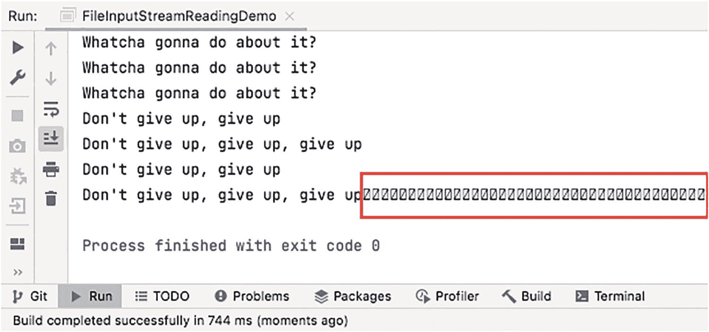
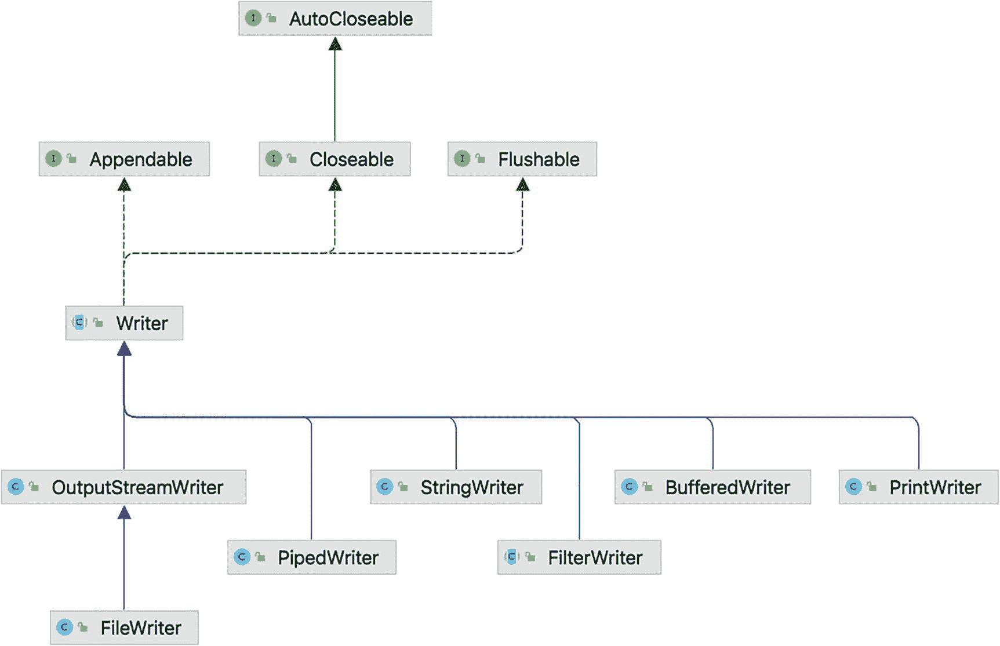
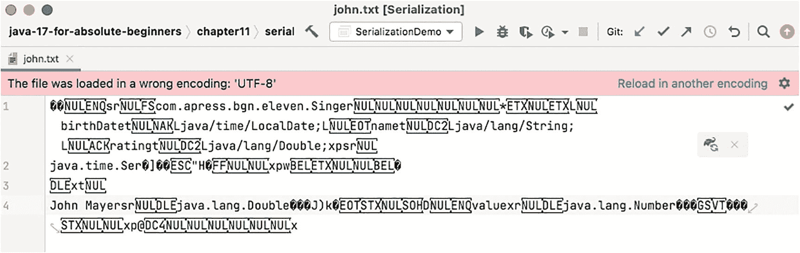

# 11.使用文件

软件最重要的功能之一是信息组织和存储，目的是使用和共享信息。信息写在纸上，存储在现实生活中有组织的柜子里，可以从那里检索。软件应用也做类似的事情。信息被写在文件中，文件被组织在目录中，最终甚至在更复杂的结构中，被命名为数据库。Java 提供了从文件和数据库读取信息的类，以及写入文件和向数据库写入信息的类。在前面的章节中已经提到了数据库，在第**章** [**9**](09.html) 中，介绍了一个使用 Derby 内存数据库的简单例子，向您展示像数据库这样的严重依赖是如何被模拟的，以允许单元测试。本章不是关于使用数据库，因为编写 Java 应用来使用数据库需要安装额外的软件。相反，这一章着重于读写文件，以及有多少种方法可以做到这一点。

## Java IO 和 NIO APIs

在开始向您展示如何读写文件之前，我们需要向您展示如何从代码中访问它们，如何检查它们是否存在，检查它们的大小并列出它们的属性，等等。Java 中用于文件处理的核心包被命名为`java.io`和`java.nio.` <sup>[1](#Fn1)</sup> 包名很好地暗示了它们包含的组件。`java.io`是 Java 输入/输出和分组组件的缩写，旨在通过数据流和序列化促进访问文件系统的输入和输出操作。`java.nio`是 Java 非阻塞输入/输出的缩写。这个包是在版本 1.4 中引入的，是一个 Java 编程语言 API 的集合，为密集的 I/O 操作提供特性。在 JDK 1.7 中增加了一个名为`java.nio.file`的包，其中包含一组实用程序类，为文件 I/O 和访问文件系统提供全面的支持。

Java NIO 和 IO 的主要区别在于 IO 是面向流的，而 NIO 是面向缓冲区的。这意味着对于旧的 Java IO API，文件是一次从一个流中读取一个或多个字节。字节不在任何地方缓存，流遍历是单向的。所以一旦溪流枯竭，就没有办法再穿越了。如果需要双向遍历流，数据必须首先存储在缓冲区中。

使用 Java NIO，数据被直接读入缓冲区，这意味着字节被缓存在 web 浏览器中，并且浏览器支持双向操作。这在处理过程中提供了更多的灵活性，但是需要额外的检查来确保缓冲区包含处理所需的所有数据。

第二个主要区别是 Java IO 操作是阻塞的。一旦调用了读取或写入文件的方法，线程就会被阻塞，直到不再有数据要读取或数据被完全写入。

Java NIO 操作是非阻塞的。线程可以经由开放通道从资源(例如，文件)请求数据，并且仅获得当前可用的数据，或者如果当前没有数据可用，则什么都不得到。线程可以先做些别的事情，然后检查数据缓冲区是否被填充，而不是等到有了一些数据才开始。

第三个区别与其说是区别，不如说是 Java NIO 额外增加的东西:**选择器**。这些组件允许一个线程监视多个输入通道，并只选择那些有可用数据的通道进行处理。相比之下，传统的 Java IO 则不能做到这一点，因为在文件操作完成之前，线程会一直阻塞。

根据您试图解决的问题，您可以使用其中的一种，但这都是从一个**文件处理程序**开始的。

## 文件处理程序

在 Java 中处理文件时最重要的类是`java.io.File class`。这个类是文件和目录路径名的抽象表示。这个类的实例被命名为**文件处理程序**，因为它们允许开发者使用这种类型的引用来处理 Java 代码中的文件和目录，而不是完整的路径名。可以使用不同的参数创建一个`File`实例。

最简单的方法是使用构造函数，它接收包含绝对文件路径名的字符串值作为参数。在清单 [11-1](#PC1) 的代码示例中，`printFileStats(..)`方法用于打印文件细节。

```java
package com.apress.bgn.eleven.io;

import org.slf4j.Logger;
import org.slf4j.LoggerFactory;

import java.io.File;

public class Main {
    private static final Logger log = LoggerFactory.getLogger(Main.class);

    public static void main(String... args) {
        // replace [workspace] with your workspace path
        var file = new File("[workspace]/java-17-for-absolute-beginners/README.adoc");
        printFileStats(file);
    }

    private static void printFileStats(File f) {
        if (f.exists()) {
            log.info("File Details:");
            log.info("Type : {}", f.isFile() ? "file" : "directory or symlink");
            log.info("Location :{}", f.getAbsolutePath());
            log.info("Parent :{}", f.getParent());
            log.info("Name : {}", f.getName());

            double kilobytes = f.length() / (double)1024;
            log.info("Size : {} ", kilobytes);

            log.info("Is Hidden : {}", f.isHidden());
            log.info("Is Readable? : {}", f.canRead());
            log.info("Is Writable? : {}", f.canWrite());
        }
    }
}

Listing 11-1Printing File Details

```

在前面的示例中，文件处理程序实例是通过提供我的电脑上的绝对文件路径名来创建的。如果要在计算机上运行前面的代码，必须提供计算机上某个文件的路径名。如果您使用的是 Windows，请记住路径名将包含“\”字符，这是 Java 中的一个特殊字符，必须通过将它加倍来进行转义。

`printFileStats(..)`方法利用了许多可以在文件处理程序上调用的方法。您可以调用的方法的完整列表更大，您可以在官方 API 文档中看到它们: [`https://docs.oracle.com/en/java/javase/17/docs/api/java.base/java/io/File.html`](https://docs.oracle.com/en/java/javase/17/docs/api/java.base/java/io/File.html) 。下面的列表解释了这些方法:

*   如果路径名指向一个文件，则`isFile()`返回`true`，如果路径名指向一个目录或一个符号链接，则返回`false`(一种特殊类型的文件，存在的唯一目的是链接到另一个文件，当您想要缩短文件的路径名时非常有用，在路径名长度限制为 256 个字符的 Windows 上非常有用)。在前面的代码示例中，该方法返回`true`，日志显示:

```java
INFO  c.a.b.e.Main - Type : file

```

如果我们想知道这个方法是否适用于一个目录，只需从路径名中删除文件名。

`File file = new File("/[workspace]/java-17-for-absolute-beginners /");`和日志打印

*   返回文件或目录的绝对路径名。创建文件处理程序时，并不总是需要绝对路径名，但是如果您稍后需要在代码中使用它或者确保正确解析了相对路径，这种方法正是您所需要的。下面这段代码通过使用相对于根项目目录(在我们的例子中是`java-17-for-absolute-beginners`目录)的路径来创建一个指向`resources`目录中的文件的文件处理程序。

```java
INFO  c.a.b.e.Main - Type : directory or symlink

```

```java
File d = new File("chapter11/read-write-file/src/main/resources/input/");

```

`getAbsolutePath()`方法返回完整的路径名，它由 log 语句打印出来，如下所示:

```java
INFO  c.a.b.e.Main - Location :/[workspace]/java-17-for-absolute-beginners/chapter11/read-write-file/src/main/resources/input

```

Java `File`类相当强大；它可用于指向另一台计算机上的共享文件。有一个特殊的构造函数用于接收类型为`java.net.URI`的参数，其中 **URI** 代表**统一资源标识符**。要测试这个构造函数，只需在您的计算机上选择一个文件，并在 web 浏览器中打开它，这样您就可以从浏览器地址栏中获得它的 URI。清单 [11-2](#PC6) 中的代码描述了使用本地 URI 实例化的`File`类。

```java
package com.apress.bgn.eleven.io;

import java.net.URI;
import java.net.URISyntaxException;
// other imports omitted

public class Main {
    public static void main(String... args) {
        try{
             // replace [workspace] with your workspace path
            var localUri = new URI("file:///[workspace]/java-17-for-absolute-beginners/README.adoc");
            var localFile =  new File (localUri);
            printFileStats(localFile);
        } catch (URISyntaxException use) {
            log.error("Malformed URI, no file there", use);
        }
    }
}

Listing 11-2Printing File Details for a File Instance Create Using an URI

```

因为 URI 可能有一个不正确的前缀或者没有准确地指向一个文件，URI 构造函数被声明抛出一个`java.net.URISyntaxException`，所以在代码中你也必须处理这个问题。在使用 URI 创建文件处理程序的情况下，`getAbsolutePath()`方法返回文件在计算机和文件所在的驱动器上的绝对路径名。

*   `getParent()`返回包含文件的目录的绝对路径，因为在层次结构上，一个文件不能有另一个文件作为父文件。

*   `getName()`返回文件名。文件名包含扩展名作为调用`"."`后的后缀，用于指示文件的类型和用途。

*   `length()`返回文件的长度，以字节为单位。此方法不适用于目录，因为目录可能包含仅限于执行程序的用户使用的文件，并且可能会引发异常。所以如果你需要一个目录的大小，你必须自己写代码。

*   `isHidden()`返回`true`是文件对当前用户不可见，否则返回`false`。在 macOs/ Linux 系统上，文件名以`"."`开头的文件是隐藏的，所以如果我们想看到那个方法返回`true`，我们必须创建一个系统配置文件的处理程序，比如`.gitconfig`。因此，在使用隐藏文件的路径名创建的文件处理程序上调用`printFileStats(..)`会产生类似于清单 [11-3](#PC7) 中的输出:

*   `canRead()`和`canWrite()`是显而易见的，因为普通用户可以保护文件。当用户对文件拥有特定权限时，这两种方法都返回 true，否则返回 false。

```java
INFO  c.a.b.e.Main - File Details:
INFO  c.a.b.e.Main - Type : file
INFO  c.a.b.e.Main - Location :/Users/[userDir]/.gitconfig
INFO  c.a.b.e.Main - Parent :/Users/[userDir]
INFO  c.a.b.e.Main - Name : .gitconfig
INFO  c.a.b.e.Main - Size : 3.865234375
INFO  c.a.b.e.Main - Is Hidden : true
INFO  c.a.b.e.Main - Is Readable? : true
INFO  c.a.b.e.Main - Is Writable? : true

Listing 11-3Printing File Details for a Hidden File

```

可以为指向目录的路径名创建文件处理程序，这意味着可以调用特定于目录的方法。对目录最常见的操作是列出它的内容。`list()`方法返回一个`String`数组，包含这个目录下的文件(和目录)的名称。Lambda 表达式使得打印目录中的项目变得非常实用。

```java
var d = new File("/[workspace]/java-17-for-absolute-beginners");
Arrays.stream(Objects.requireNonNull(d.list())).forEach(ff -> log.info("\t File Name : {}", ff));

```

文件名在大多数情况下并不真正有用；拥有一个带有文件处理程序的`File`数组会更好。这就是为什么在 1.2 版本中增加了`listFiles()`方法。

```java
Arrays.stream(Objects.requireNonNull(d.listFiles())).forEach(ff → log.info("\t File : {}", ff.getAbsolutePath()));

```

这个方法有不止一种形式，因为当用一个`FileFilter`的实例调用时，它可以用来过滤文件并只返回符合特定要求的文件或目录的文件处理程序。清单 [11-4](#PC10) 中的代码示例过滤目录下的条目，只保留名称以“章节”开头的目录。

```java
package com.apress.bgn.eleven.io;

import java.io.File;
import java.io.FileFilter;
// other imports omitted

public class Main {
    public static void main(String... args) {
         // replace [workspace] with your workspace path
        var d = new File("/[workspace]/java-17-for-absolute-beginners");
        Arrays.stream(d.listFiles(new FileFilter() {
            @Override
            public boolean accept(File childFile) {
                return childFile.isDirectory() && childFile.getName().startsWith("chapter");
            }
        })).forEach(ff -> log.info("Chapter Source : {}", ff.getName()));
    }
}

Listing 11-4Filtering Content of a Directory Using a FileFilter Instance

```

前面的代码示例是以扩展的形式编写的，目的是为了清楚地表明您应该为`accept(..)`方法提供一个具体的实现。使用 lambda 表达式，可以简化前面的代码，甚至使其不容易抛出异常。

```java
Arrays.stream(
    Objects.requireNonNull(d.listFiles(
        childFile -> childFile.isDirectory() && childFile.getName().startsWith("chapter")))
    ).forEach(ff -> log.info("Chapter Source : {}", ff.getName())
);

```

在前面的例子中，我们实现了`accept(..)`来根据文件类型和名称进行过滤，但是过滤器可以包含任何内容。当您需要的过滤器严格涉及文件名时，您可以减少使用该方法的另一个版本，它接收一个`FilenameFilter`实例作为参数。

```java
Arrays.stream(Objects.requireNonNull(d.listFiles(new FilenameFilter() {
        @Override
        public boolean accept(File dir, String name) {
            return dir.getName().startsWith("chapter");
        }
}))).forEach(ff -> log.info("\t File : {}", ff.getAbsolutePath()));

```

除了列出文件的属性，文件处理程序也可以用来创建文件。要创建一个文件，必须在创建一个具有特定路径名的文件处理程序后调用`createNewFile()`方法，如清单 [11-5](#PC13) 所示。

```java
package com.apress.bgn.eleven.io;

import java.io.IOException;
// other imports omitted

public class Main {
    public static void main(String... args) {
        var created = new File(
                "chapter11/read-write-file/src/main/resources/output/created.txt");
        if (!created.exists()) {
            try {
                created.createNewFile();
            } catch (IOException e) {
                log.error("Could not create file.", e);
            }
        }
    }
}

Listing 11-5Creating a File

```

当文件句柄与一个具体的文件或目录相关联时，`exists()`方法返回`true`，否则返回`false`。它可以用来测试我们试图创建的文件是否已经存在。如果该文件存在，则该方法无效。如果用户没有适当的权限在指定的路径名创建文件，将抛出一个`SecurityException`。在某些情况下，我们可能需要创建一个只在程序执行期间使用的文件。这意味着我们要么创建文件并显式删除它，要么创建一个临时文件。通过调用`createTempFile(prefix, suffix)`创建临时文件，它们被创建在为操作系统定义的临时目录中。prefix 参数的类型为 String，创建的文件将以其值开始命名。后缀参数也是字符串类型，它可以用来指定文件的扩展名。文件名的其余部分由操作系统生成。清单 [11-6](#PC14) 中描述了创建临时文件的代码。

```java
package com.apress.bgn.eleven.io;

import java.io.IOException;
// other imports omitted

public class Main {
    public static void main(String... args) {
        try {
            File temp = File.createTempFile("java_bgn_", ".tmp");
            log.info("File created.txt at: {}", temp.getAbsolutePath());
            temp.deleteOnExit();
        } catch (IOException e) {
            log.error("Could not create temporary file.", e);
        }
    }
}

Listing 11-6Creating a Temporary File

```

操作系统的临时目录中的文件会被操作系统定期删除，但是如果您想确保它会被删除，您可以在临时文件的文件处理程序上显式调用`deleteOnExit()`。在前面的代码示例中，打印了文件的绝对路径，以显示创建临时文件的确切位置，并且在 macOS 系统上，完整路径名看起来与此非常相似:

```java
/var/folders/gg/nm_cb2lx72q1lz7xwwdh7tnc0000gn/T/java_bgn_14652264510049064218.tmp

```

也可以使用 Java 文件处理程序重命名文件，有一个名为`rename(f)`的方法，使用文件处理程序参数调用该方法，指向文件应该具有的位置和所需名称。如果重命名成功，该方法返回`true`，否则返回 false。清单 [11-7](#PC16) 中描述了这样做的代码。

```java
package com.apress.bgn.eleven.io;

import java.io.IOException;
// other imports omitted

public class Main {
    public static void main(String... args) {
        var file = new File(
                "chapter11/read-write-file/src/main/resources/output/created.txt");
        var renamed = new File(
                "chapter11/read-write-file/src/main/resources/output/renamed.txt");
        boolean result = file.renameTo(renamed);
        log.info("Renaming succeeded? : {} ", result);
    }
}

Listing 11-7Renaming a File

```

类`File`中的大多数方法都会抛出`IOException`，因为操作文件可能会因为硬件问题或操作系统问题而失败。这种类型的异常是检查异常，使用文件处理程序的开发人员被迫捕捉和处理这种类型的异常。

需要特殊权限才能访问文件的方法抛出`SecurityException`。这个类型扩展了`RuntimeException`，所以不检查异常。当应用运行时，它们变得很明显。

既然已经介绍了使用文件处理程序的所有基础，现在是下一节的时候了。

## 路径处理程序

Java 1.7 中引入了`java.nio.file.Path`接口以及实用程序类`java.nio.file.Files`和`java.nio.file.Paths`，以提供新的、更实用的方式来处理文件。`Path`实例可用于定位文件系统中的文件，因此代表系统相关的文件路径。`Path`实例比`File`更实用，因为它们可以提供访问路径组件、组合路径和比较路径的方法。`Path`不能直接创建实例，因为接口不能被实例化，但是接口提供了静态实用方法来创建它们，类`Paths`也是如此。根据你的情况使用你想要的。

创建一个`Path`实例最简单的方法是从一个文件处理程序开始并调用`Paths.get(fileURI)`，如清单 [11-8](#PC17) 所示。

```java
package com.apress.bgn.eleven.io;

// other imports omitted
import java.io.File;
import java.nio.file.Path;
import java.nio.file.Paths;

public class PathDemo {
    private static final Logger log = LoggerFactory.getLogger(PathDemo.class);

    public static void main(String... args) {
         // replace [workspace] with your workspace path
        File file = new File(
                "/[workspace]/java-17-for-absolute-beginners/README.adoc");
        Path path = Paths.get(file.toURI());
        log.info(path.toString());
    }
}

Listing 11-8Creating a Path Instance

```

从 Java 11 开始，`Paths.get(file.toURI())`可以替换为`Path.of(file.toURI())`。创建`Path`实例的另一种方法是使用另一种形式的`Paths.get(..),`，它接收多段路径作为参数。

```java
Path composedPath = Paths.get("/[workspace]",
    "java-17-for-absolute-beginners",
    "README.adoc");
log.info(composedPath.toString());

```

之前创建的两条路径指向同一个位置，因此如果使用`compareTo(..)`方法相互比较(因为`Path`扩展了接口`Comparable<Path>`，返回的结果将是 0(零)，这意味着路径相等。

```java
log.info("Is the same path? : {} ", path.compareTo(composedPath) ==0 ? "yes" : "no");
// prints : INFO com.apress.bgn.eleven.PathDemo - Is the same path? : yes

```

在下一个代码示例中，在 path 实例上调用了一些`Path`方法。清单 [11-9](#PC20) 中描述了代码。

```java
package com.apress.bgn.eleven.io;
// import section omitted

public class PathDemo {
    private static final Logger log = LoggerFactory.getLogger(PathDemo.class);

    public static void main(String... args) {
        var path = Paths.get("/[workspace]",
                "java-17-for-absolute-beginners",
                "README.adoc");
        printPathDetails(path);
    }

    private static void printPathDetails(Path path) {
        log.info("Location :{}", path.toAbsolutePath());
        log.info("Is Absolute? : {}", path.isAbsolute());
        log.info("Parent :{}", path.getParent());
        log.info("Root :{}", path.getRoot());
        log.info("FileName : {}", path.getFileName());
        log.info("FileSystem : {}", path.getFileSystem());
        log.info("IsFileReadOnly : {}", path.getFileSystem().isReadOnly());
    }
}

Listing 11-9Inspecting Path Details

```

以下列表解释了每种方法及其结果:

*   `toAbsolutePath()`返回表示该路径绝对路径的 Path 实例。当在先前创建的 path 实例上调用时，由于它已经是绝对的，该方法将只返回调用该方法的 path 对象。同样，调用`path.isAbsolute()`将返回`true`。

*   `getParent()`返回父`Path`实例。在 path 实例上调用此方法将打印:

*   `INFO com.apress.bgn.eleven.PathDemo - Parent :/[workspace]/java-17-for-absolute-beginners`

*   `getRoot()`返回该路径的根组件作为一个`Path`实例。在 Linux 或 macOS 系统上打印`"/"`，在 Windows 上类似于`"C:\"`。

*   `getFileName()`返回由该路径表示的文件或目录的名称作为`Path`实例；基本上，路径被系统路径分隔符拆分，离根元素最远的返回。

*   `getFileSystem()`返回创建该对象的文件系统，对于 macOS，它是类型`sun.nio.fs.MacOSXFileSystem`的实例。

另一个有用的`Path`方法是`resolve(..)`。这个方法采用一个代表路径的`String`实例，并根据它被调用的路径实例来解析它。这意味着添加了路径分隔符来根据程序运行的操作系统组合两个路径，并将返回一个`Path`实例。这在清单 [11-10](#PC21) 中有所描述。

```java
package com.apress.bgn.eleven.io;
// import section omitted

public class PathDemo {
    private static final Logger log = LoggerFactory.getLogger(PathDemo.class);

    public static void main(String... args) {
         // replace [workspace] with your workspace path
        var chapterPath = Paths.get("/[workspace]",
                "java-17-for-absolute-beginners/chapter11");
        Path filePath = chapterPath.resolve(
                "read-write-file/src/main/resources/input/data.txt");
        log.info("Resolved Path :{}", filePath.toAbsolutePath());
    }
}

Listing 11-10Resolving a Path Instance

```

前面的示例代码将打印以下内容:

```java
INFO c.a.b.e.PathDemo - Resolved Path :/[workspace]/java-17-for-absolute-beginners/chapter11/read-write-file/src/main/resources/input/data.txt

```

使用`Path`实例，结合`Files`实用程序方法，编写管理文件或检索其属性的代码变得更加容易。清单 [11-11](#PC23) 中的代码示例使用了其中的一些方法来打印文件的属性，就像我们之前使用`File`处理程序一样。

```java
package com.apress.bgn.eleven.io;
// import section omitted

public class PathDemo {
    private static final Logger log = LoggerFactory.getLogger(PathDemo.class);

    public static void main(String... args) {
         try {
            var outputPath = FileSystems.getDefault()
                .getPath("/[workspace]" +
                        "java-17-for-absolute-beginners/chapter11/read-write-file/src/main/resources/output/sample");
            Path dirPath = Files.createDirectory(outputPath);
            printPathStats(dirPath);
        } catch (FileAlreadyExistsException faee) {
            log.error("Directory already exists.", faee);
        } catch (IOException e) {
            log.error("Could not create directory.", e);
        }
    }

    private static void printPathStats(Path path) {
        if (Files.exists(path)) {
            log.info("Path Details:");
            log.info("Type: {}", Files.isDirectory(path) ? "yes" : "no");
            log.info("Type: {}", Files.isRegularFile(path) ? "yes" : "no");
            log.info("Type: {}", Files.isSymbolicLink(path) ? "yes" : "no");
            log.info("Location :{}", path.toAbsolutePath());
            log.info("Parent :{}", path.getParent());
            log.info("Name : {}", path.getFileName());

            try {
                double kilobytes = Files.size(path) / (double)1024;
                log.info("Size : {} ", kilobytes);
                log.info("Is Hidden: {}", Files.isHidden(path) ? "yes" : "no");
            } catch (IOException e) {
                log.error("Could not access file.", e);
            }
            log.info("Is Readable: {}", Files.isReadable(path) ? "yes" : "no");
            log.info("Is Writable: {}", Files.isWritable(path) ? "yes" : "no");
        }
    }
}

Listing 11-11Printing a Path Details

```

如您所见，`Files`类提供了与`File`类相同的功能。这个类只包含对文件、目录或其他类型的文件进行操作的静态方法。它是在 Java 1.7 中引入的，其优点是语法更清晰。在管理文件、创建文件、重命名文件、删除文件以及读写文件时，使用`java.nio`类的功能和实用性更加明显。清单 [11-12](#PC24) 中的代码示例展示了使用 NIO 类创建、重命名和删除文件。

```java
package com.apress.bgn.eleven.io;
// import section omitted
import java.nio.FileAlreadyExistsException;

public class PathDemo {
    private static final Logger log = LoggerFactory.getLogger(PathDemo.class);

    public static void main(String... args) {
        Path filePath = chapterPath.resolve(
                "read-write-file/src/main/resources/input/data.txt");
        Path copyFilePath = Paths.get(outputPath.toAbsolutePath().toString(), "data.adoc");
        try {
            Files.copy(filePath, copyFilePath);
            log.info("Exists? : {}", Files.exists(copyFilePath)? "yes": "no");
            log.info("File copied to: {}", copyFilePath.toAbsolutePath());
        } catch (FileAlreadyExistsException faee) {
            log.error("File already exists.", faee);
        } catch (IOException e) {
            log.error("Could not copy file.", e);
        }
        Path movedFilePath = Paths.get(outputPath.toAbsolutePath().toString(), "copy-data.adoc");
        try {
            Files.move(copyFilePath, movedFilePath);
            log.info("File moved to: {}", movedFilePath.toAbsolutePath());
            Files.deleteIfExists(copyFilePath);
        } catch (FileAlreadyExistsException faee) {
            log.error("File already exists.", faee);
        }  catch (IOException e) {
            log.error("Could not move file.", e);
        }
    }
}

Listing 11-12Managing Files Using NIO Classes

```

请注意`FileAlreadyExistsException`，这是 Java 1.7 中添加的一个异常类型，它扩展了`IOException`(间接通过`FileSystemException`)，用于提供更多关于文件操作失败的情况的数据。通过`createDirectory(..)`、`createFile(..),`和`move(..).`方法得出

如果要删除的文件不存在，前面的代码示例中没有使用的`The delete(..)`方法会抛出一个`java.nio.file.NoSuchFileException`。为了避免抛出异常，在前面的代码示例中使用了`deleteIfExists(..)`。

方法的列表甚至更大，但是由于本章的篇幅有限，您可以在官方的 Javadoc API 中亲自查看。

## 读取文件

文件是硬盘上一连串的位。一个`File`处理程序不提供读取文件内容的方法，但是一组其他类可以用来这样做，但是它们都是使用文件处理程序实例创建的。根据对文件内容的实际需要，在 Java 中有多种读取文件内容的方法。有很多方法，本节将介绍最常见的方法。

### 使用`Scanner`读取文件

之前使用了`Scanner`类从命令行读取输入。`System.in`可以替换为`File`，可以使用`Scanner`方法读取文件内容，如清单 [11-13](#PC25) 所示。

```java
package com.apress.bgn.eleven.io;

import org.slf4j.Logger;
import org.slf4j.LoggerFactory;

import java.io.File;
import java.io.IOException;
import java.nio.charset.StandardCharsets;
import java.nio.file.Paths;
import java.util.Scanner;

public class ScannerDemo {
    private static final Logger log = LoggerFactory.getLogger(ScannerDemo.class);

    public static void main(String... args) {
        try {
            var scanner = new Scanner(new File("chapter11/read-write-file/src/main/resources/input/data.txt"));
            var content = "";
            while (scanner.hasNextLine()) {
                content += scanner.nextLine() + "\n";
            }
            scanner.close();
            log.info("Read with Scanner --> {}", content);
        } catch (IOException e) {
            log.error("Something went wrong! ", e);
        }
    }
}

Listing 11-13Using Scanner to Read a File

```

也可以使用一个`java.nio.file.Path`实例来代替文件:

```java
scanner = new Scanner(Paths.get(new File("chapter11/read-write-file/src/main/resources/input/data.txt").toURI()), StandardCharsets.UTF_8.name());

```

文件可以使用不同的字符集编写，在 Java 中由`java.nio.charset.Charset`实例引用。为了确保它们被正确读取，使用相同的字符集读取它们是一个很好的做法。有一个扫描器构造函数，它接收一个字符集名称作为参数。调用`StandardCharsets.UTF_8.name()`方法来提取 UTF-8 字符集的名称。

### 使用`Files`实用程序方法读取文件

清单 [11-14](#PC27) 中的第一个代码示例展示了读取文件的最简单方法。

```java
package com.apress.bgn.eleven.io;
// import section omitted

public class FilesReadDemo {
    private static final Logger log = LoggerFactory.getLogger(FilesReadDemo.class);

    public static void main(String... args) {
        try {
            var file= new File("chapter11/read-write-file/src/main/resources/input/data.txt");
            var content = new String(Files.readAllBytes(Paths.get(file.toURI())));
            log.info("Read with Files.readAllBytes --> {}", content);
        } catch (IOException e) {
            log.info("Something went wrong! ", e);
        }
    }
}

Listing 11-14The Simplest Way to Read a File

```

当文件大小可以近似时(文件大小可以估计，并且相对较小)，这种方法工作得很好，并且将其存储到一个`String`对象中不会有问题。

使用`Files.readAllBytes(..)`的优点是不需要循环，我们不必一行一行地构造`String`值，因为这个方法只是读取文件中所有可以作为参数给`String`构造函数的字节。缺点是没有使用`Charset`，所以文本值可能不是我们所期望的。有一种方法可以克服这个问题，通过调用将文件内容作为一列`String`值返回的`Files.readAllLines(..)`，并有两个表单，其中一个将`Charset`声明为参数。清单 [11-15](#PC28) 中描述了读取文件的这个版本。

```java
package com.apress.bgn.eleven.io;
// import section omitted

public class FilesReadDemo {
    private static final Logger log = LoggerFactory.getLogger(FilesReadDemo.class);

    public static void main(String... args) {
        try {
            var file= new File("chapter11/read-write-file/src/main/resources/input/data.txt");
            List<String> lyricList = Files.readAllLines(Paths.get(file.toURI()), StandardCharsets.UTF_8);
            lyricList.forEach(System.out::println);
        } catch (IOException e) {
            log.info("Something went wrong! ", e);
        }
    }
}

Listing 11-15A Simple Way to Read a File Specifying a Charset

```

但是如果我们不需要一个`List<String>`，而是需要一个`String`实例呢？在 Java 11 中为此引入了一个方法，叫做`readString(..)`。清单 [11-16](#PC29) 中显示了使用它的代码示例。

```java
package com.apress.bgn.eleven.io;
// import section omitted

public class FilesReadDemo {
    private static final Logger log = LoggerFactory.getLogger(FilesReadDemo.class);

    public static void main(String... args) {
         try {
            var content = Files.readString(Paths.get(file.toURI()), StandardCharsets.UTF_8);
            log.info("Read with Files.readString --> {}", content);
        } catch (IOException e) {
            log.info("Something went wrong! ", e);
        }
    }
}

Listing 11-16The Simplest Way to Read a File Specifying a Charset

```

### 使用`Readers`读取文件

在引入`Files`类和它的奇特方法之前，有其他读取文件的方法。奇特的方法也不是为读取大文件或只读取文件的一部分而设计的。让我们回到过去，慢慢分析事情是如何演变的。

在 Java 1.6 之前，要逐行读取文件，您必须编写一个类似清单 [11-17](#PC30) 中的装置。

```java
package com.apress.bgn.eleven.io;

import java.io.BufferedReader;
import java.io.FileReader;
// other imports omitted

public class ReadersDemo {
    private static final Logger log = LoggerFactory.getLogger(ReadersDemo.class);

    public static void main(String... args) {
        BufferedReader reader = null;
        try {
            reader = new BufferedReader(new FileReader(new File("chapter11/read-write-file/src/main/resources/input/data.txt")));
            StringBuilder sb = new StringBuilder();
            String line;
            while ((line = reader.readLine()) != null) {
                sb.append(line).append("\n");
            }
            log.info("Read with BufferedReader --> {}", sb.toString());
        } catch (Exception e) {
            log.error("File could not be read! ", e);
        } finally {
            if (reader != null) {
                try {
                    reader.close();
                } catch (IOException ioe) {
                    log.error("Something went wrong! ", ioe);
                }
            }
        }
    }
}

Listing 11-17Reading a File Line By Line, Before Java 1.6

```

哇，那是什么，对吗？在 Java 1.6 之后，语法有所简化，但是最大的变化出现在 1.7。在 Java 1.7 之前，如果您想逐行读取文件，您必须编写以下代码:

*   您必须创建一个`File`处理程序。

*   然后，您需要将文件处理程序包装到一个`FileReader`中。这种类型的实例可以完成读取的工作，但是只能读取大块的`char[]`，当您需要实际的文本时，这不是很有用。

*   需要将`FileReader`实例包装到`BufferedReader`实例中，通过读取内部缓冲区中的字符来提供该功能。它的工作方式是，当这个方法返回`null`时，调用`reader.readLine()`直到因为到达了文件的结尾而没有更多要读取的内容。

*   在读取结束时，需要显式调用`reader.close()`,否则文件可能会被锁定，直到重新启动后才可读。

在 Java 1.7 中，引入了许多变化来减少处理文件所需的样板文件。其中之一是，所有用于访问文件内容和可以保持文件锁定的类都通过声明实现`java.io.Closeable`接口来丰富，该接口将这些类型的资源标记为**可关闭的**，并且在执行结束之前，JVM 会调用一个`close()`方法来透明地释放资源。同样，在 Java 7 中，引入了`try-with-resources`语句。利用所有这些特性，前面的代码可以如清单 [11-18](#PC31) 所示编写。

```java
package com.apress.bgn.eleven.io;
// other imports omitted

public class ReadersDemo {
    private static final Logger log = LoggerFactory.getLogger(ReadersDemo.class);

    public static void main(String... args) {
           try (var br = new BufferedReader(new FileReader(new File("chapter11/read-write-file/src/main/resources/input/data.txt")))){
            StringBuilder sb = new StringBuilder();
            String line;
            while ((line = br.readLine()) != null) {
                sb.append(line).append("\n");
            }
            log.info("Read with BufferedReader --> {}", sb.toString() );
        } catch (Exception e) {
            log.info("Something went wrong! ", e);
        }
    }
}

Listing 11-18Reading a File Line By Line, Starting with Java 1.7

```

代码可以进一步简化，因为`FileReader`可以将文件的绝对路径作为参数`String`。但是不能使代码考虑编码。这在 Java 1.8 中成为可能，当时为接受`Charset`参数的`FileReader`类引入了一个构造函数。尽管如此，在前面的例子中我们有嵌套的构造函数调用，这是相当难看的。通过引入`Files.newBufferedReader(Path)`和`Files.newBufferedReader(Path, Charset)`方法，Java 8 来拯救我们了。

所以前面的代码可以写成清单 [11-19](#PC32) 所示。

```java
package com.apress.bgn.eleven.io;
// other imports omitted

public class ReadersDemo {
    private static final Logger log = LoggerFactory.getLogger(ReadersDemo.class);

    public static void main(String... args) {
       File file = new File("chapter11/read-write-file/src/main/resources/input/data.txt");
        try (var br = Files.newBufferedReader(file.toPath(), StandardCharsets.UTF_8)){
            StringBuilder sb = new StringBuilder();
            String line;
            while ((line = br.readLine()) != null) {
                sb.append(line).append("\n");
            }
            log.info("Read with BufferedReader --> {}", sb.toString() );
        } catch (Exception e) {
            log.info("Something went wrong! ", e);
        }
    }
}

Listing 11-19Reading a File Line By Line, Taking Encoding Into Consideration Starting with Java 1.8

```

如果已知文件的大小是可管理的，并且我们不感兴趣的只是记录内容，而是保存单独的行以供进一步处理，那么最简单的方法就是使用结合了 lambda 表达式的`Files.readAllLines(..)`方法。可以在混合中添加流，因此可以在现场过滤或处理这些线，如下所示:

```java
List<String> dataList = Files.readAllLines(Paths.get(file.toURI()), StandardCharsets.UTF_8)
    .stream()
    .filter(line -> line!= null && !line.isBlank())
    .map(line -> line.toUpperCase())
    .collect(Collectors.toList());

```

或者我们可以用另一种方式编写，使用也是在 Java 1.8 中引入的`Files.lines(..)`方法，并直接以流的形式获取所有内容:

```java
List<String> dataList = Files.lines(Paths.get(file.toURI()), StandardCharsets.UTF_8)
    .filter(line -> line!= null && !line.isBlank() )
    .map(line -> line.toUpperCase())
    .collect(Collectors.toList());

```

总之，回到文件阅读器。如果是扩展了`Reader`类的类组的成员，则为`BufferedReader`类。`Reader`类是一个用于读取字符流的抽象类，是`java.io`包的一部分。图 [11-1](#Fig1) 描述了显示最常用实现的简化层次结构。


图 11-1

`Reader`类层次结构(如 IntelliJ IDEA 所示)

字符流可以有不同的来源，文件是最常见的。它们提供对存储在文件中的数据的顺序访问。`BufferedReader`不支持字符编码，但是`BufferedReader`基于另一个`Reader`实例。正如您在前面的例子中注意到的，在实例化一个`BufferedReader`时，一个`FileReader`实例被用作参数，并且在 Java 1.8 中`FileReader`被修改以支持字符编码。在 Java 1.8 之前，为了从文件中读取并考虑字符编码，使用了一个`InputStreamReader`实例，如清单 [11-20](#PC35) 所示。

```java
package com.apress.bgn.eleven.io;

import java.io.FileInputStream;
import java.io.InputStreamReader;
// other imports omitted

public class ReadersDemo {
    private static final Logger log = LoggerFactory.getLogger(ReadersDemo.class);

    public static void main(String... args) {
        File file = new File("chapter11/read-write-file/src/main/resources/input/data.txt");
        try (var br = new BufferedReader(new InputStreamReader(new FileInputStream(file), StandardCharsets.UTF_8))){
            StringBuilder sb = new StringBuilder();
            String line;
            while ((line = br.readLine()) != null) {
                    sb.append(line).append("\n");
            }
            log.info("Read with BufferedReader(InputStreamReader(FileInputStream(..))) --> {}", sb.toString() );
        } catch (Exception e) {
            log.info("Something went wrong! ", e);
        }
    }
}

Listing 11-20Reading a File Line By Line, Taking Encoding Into Consideration Before Java 1.8

```

在 Java 11 中，`Reader`类用`nullReader()`方法进行了丰富，该方法返回一个不做任何事情的`Reader`实例。这是开发人员出于测试目的而要求的，只不过是一个伪阅读器实现。

### 使用`InputStream`读取文件

`Reader`系列中的类是将数据作为文本读取的高级类，但从技术上讲，文件只是一个字节序列，所以这些类本身是用于读取字节流的类系列中的类的包装器。当试图使用正确的字符编码时，以及当使用`BufferedReader`读取文本时(如前一节末尾所示)，这变得非常明显，因为作为参数给出的`InputStreamReader`实例是基于`java.io.FileInputStream`实例的，而后者是`java.io.InputStream`的子类。

这个层次的根类是`java.io.InputStream`。图 [11-2](#Fig2) 描述了显示最常用实现的简化层次结构。


图 11-2

`InputStream`类层次结构(如 IntelliJ IDEA 所示)

类`BufferedInputStream`相当于用于读取字节流的`BufferedReader`。我们之前用来从控制台读取用户数据的`System.in`就是这种类型，`Scanner`实例将来自其缓冲区的字节转换成用户可理解的数据。当我们感兴趣的数据不是使用 Unicode 惯例存储的文本，而是原始数字数据(图像、媒体文件、pdf 等二进制文件)时。)使用字节流的类更合适。只是为了向您展示它是如何完成的，我们将使用`FileInputStream`来读取`data.txt`文件的内容。代码如清单 [11-21](#PC36) 所示。

```java
package com.apress.bgn.eleven.io;

import java.io.FileInputStream;
// other imports omitted

public class FileInputStreamReadingDemo {
    private static final Logger log = LoggerFactory.getLogger(FileInputStreamReadingDemo.class);

    public static void main(String... args) {
        File file = new File("chapter11/read-write-file/src/main/resources/input/data.txt");

        try {
            FileInputStream fis = new FileInputStream(file);
            byte[] buffer = new byte[1024];
            StringBuilder sb = new StringBuilder();
            while (fis.read(buffer) != -1) {
                sb.append(new String(buffer));
                buffer = new byte[1024];
            }
            fis.close();

            log.info("Read with FileInputStream --> {}", sb.toString() );
        } catch (IOException e) {
            log.error("Something went wrong! ", e);
        }
    }
}

Listing 11-21Reading a File Using FileInputStream

```

如果您运行前面的代码，您会注意到在控制台中将会打印出预期的输出，但是您可能会注意到一些奇怪的事情:在打印出文本之后，还会打印出一组奇怪的字符。在 macOS 系统上，它们看起来如图 [11-3](#Fig3) 所示。



图 11-3

用`FileInputStream`阅读文本

你知道这些字符可能是什么吗？

没想法也没关系；我第一次使用`FileInputStream`读取文件时也没有。这些字符出现在那里是因为文件大小不是 1024 的倍数，所以`FileInputReader`最终用零填充最后一个缓冲区的剩余部分。解决这个问题的方法包括计算文件的字节大小，并确保我们相应地调整`byte[] buffer`的大小。如果你有心情写一些代码，你可以试着把它作为一个练习。既然我们已经向您展示了如何以多种方式读取文件，我们可以继续向您展示如何编写文件，因为您已经知道如何创建它们。

在 Java 11 中，`InputStream`还增加了一个方法，返回一个什么也不做的`InputStream`。它被命名为`nullInputStream()`方法，是为测试目的而设计的，只不过是一个伪`InputStream`实现`.`

到目前为止介绍的所有类都是您在 Java 中处理文件时最常遇到的。如果您需要更专业的读者，请随意阅读官方文档或使用第三方库(如 Apache Commons IO)提供的自定义实现。 <sup>[2](#Fn2)</sup>

## 写文件

用 Java 写文件和读文件非常相似，只是必须使用不同的类，因为流是单向的。用于读取数据的流也不能用于写入数据。几乎任何读取文件的类或方法都有一个用于写入文件的类或方法。事不宜迟，我们开始吧。

### 使用文件实用程序方法编写文件

从 Java 1.7 开始，使用`Files.write(Path, byte[], OpenOption...` `options)`方法可以很容易地编写较小的文件。它有两个参数:一个代表文件位置的`Path`和一个代表要写入的数据的字节数组。当需要写入的数据足够小时，这种方法是一个实用的一行程序。最后一个参数实际上是在第**章** [**4**](04.html) 中引入的 **Varargs** ，它表示打开文件的一个或多个操作。如清单 [11-22](#PC37) 所示，可以在不指定任何该类型参数的情况下使用该方法。

```java
package com.apress.bgn.eleven.io;
// other import statements omitted
import java.io.File;
import java.io.IOException;
import java.nio.file.Files;
import java.nio.file.Path;

public class FilesWritingDemo {
    private static final Logger log = LoggerFactory.getLogger(FilesWritingDemo.class);

    public static void main(String... args) {
        var file = new File("chapter11/read-write-file/src/main/resources/output/data.txt");

        byte[] data = "Some of us, we’re hardly ever here".getBytes();
        try {
            Path dataPath = Files.write(file.toPath(), data);
            log.info("String written to {}", dataPath.toAbsolutePath());
        } catch (IOException e) {
            e.printStackTrace();
        }
    }
}

Listing 11-22Writing a String to a File Starting with Java 1.7

```

如果文件已经存在，内容将被简单地覆盖。这意味着，由于没有指定参数来配置我们想要对文件做什么，默认的行为是打开文件进行写入，将其大小截断为零，并从那里开始写入，从而覆盖它。可用选项列表由`java.nio.file.StandardOpenOption`枚举中的值建模。默认行为对应的值是`TRUNCATE_EXISTING`。所以上例中的这一行:

```java
Path dataPath = Files.write(file.toPath(), data);

```

相当于

```java
import java.nio.file.StandardOpenOption
...​
Path dataPath = Files.write(file.toPath(), data, StandardOpenOption.TRUNCATE_EXISTING);

```

如果想要的行为是修改一个文件(如果它存在的话)并在末尾追加新数据，那么用作`Files.write(..)`方法的参数的选项是`APPEND`。`Path dataPath = Files.write(file.toPath(), data, StandardOpenOption.APPEND);`

此外，请注意字符串在写入之前需要如何转换为字节数组。在 Java 11 中这不再是必要的，因为最终一些 JDK 开发者认为大多数人可能会写一个简单的`String`到一个文件中，强迫他们显式地调用`getBytes()`是非常愚蠢的。结果是引入了`Files.writeString(..)`方法，其中一个还支持指定编码。在清单 [11-23](#PC40) 中可以看到一个将字符串写入文件的方法的例子。

```java
package com.apress.bgn.eleven.io;
// import statements omitted

public class FilesWritingDemo {
    private static final Logger log = LoggerFactory.getLogger(FilesWritingDemo.class);

    public static void main(String... args) {
        var file = new File("chapter11/read-write-file/src/main/resources/output/data.txt");
         try {
            Path dataPath = Files.writeString(file.toPath(),
                    "\nThe rest of us, we're born to disappear",
                    StandardCharsets.UTF_8,
                    APPEND);
            log.info("String written to {}", dataPath.toAbsolutePath());
        } catch (IOException e) {
            e.printStackTrace();
        }
    }
}

Listing 11-23Writing a String to a File Starting with Java 11

```

另一个版本的`Files.write(..)`接受一个类型为`Iterable<? extends CharSequence>`的参数，这意味着可以用它来编写一个`String`值的列表，如清单 [11-24](#PC41) 所示。

```java
package com.apress.bgn.eleven.io;
// import statements omitted

public class FilesWritingDemo {
    private static final Logger log = LoggerFactory.getLogger(FilesWritingDemo.class);

    public static void main(String... args) {
        var file = new File("chapter11/read-write-file/src/main/resources/output/data.txt");

         List<String> dataList = List.of(
                "How do I stop myself from",
                "Being just a number?");
        try {
            Path dataPath = Files.write(file.toPath(), dataList,
                    StandardCharsets.UTF_8,
                    APPEND);
            log.info("String written to {}", dataPath.toAbsolutePath());
        } catch (IOException e) {
            e.printStackTrace();
        }
    }
}

Listing 11-24Writing a List<String> to a File Using Files.write(..)

```

接下来，我们将研究如何使用`Writer`层次结构中的类来编写文件。

### 使用`Writer`写文件

类似于读取文件的`Reader`层次结构，有一个名为`Writer`的抽象类，但是在我们开始之前，让我们先介绍一下`BufferedWriter`，它是`BufferedReader`的通讯器，用于写文件，因为这是实践中使用最多的一个。这个类也有一个内部缓冲区，当调用 write 方法时，参数被存储到缓冲区，当缓冲区满了，它的内容被写入文件。通过调用`flush()`方法可以提前清空缓冲区。绝对建议在调用`close()`之前显式调用这个方法，以确保所有输出都被写入文件。清单 [11-25](#PC42) 中的代码片段描述了如何将`String`实例列表写入文件。

```java
package com.apress.bgn.eleven.io;
// other import statements omitted
import java.io.BufferedWriter;
import java.io.FileWriter;

public class FilesWritingDemo {
    private static final Logger log = LoggerFactory.getLogger(FilesWritingDemo.class);

    public static void main(String... args) {
        var file = new File("chapter11/read-write-file/src/main/resources/output/data.txt");

        var dataList = List.of ("How will I hold my head" ,
                "To keep from going under");
        BufferedWriter writer = null;
        try {
            writer = new BufferedWriter(new FileWriter(file));
            for (String entry : dataList) {
                writer.write(entry);
                writer.newLine();
            }
        } catch (IOException e) {
            log.info("Something went wrong! ", e);
        } finally {
            if(writer!= null) {
                try {
                    writer.flush();
                    writer.close();
                } catch (IOException e) {
                    log.info("Something went wrong! ", e);
                }
            }
        }
    }
}

Listing 11-25Writing a List<String> to a File \Using BufferedWriter

```

还需要另一个代码装置，因为写文件是一个敏感的操作，可能会因为许多原因而失败。前面清单中的代码是您在 Java 1.7 之前必须编写的，当时`try-with-resources`减少了样板文件，并允许减少前面的代码，如清单 [11-26](#PC43) 所示。

```java
package com.apress.bgn.eleven.io;
// other import statements omitted
import java.io.BufferedWriter;
import java.io.FileWriter;

public class FilesWritingDemo {
    private static final Logger log = LoggerFactory.getLogger(FilesWritingDemo.class);

    public static void main(String... args) {
        var file = new File("chapter11/read-write-file/src/main/resources/output/data.txt");

        var dataList = List.of ("How will I hold my head" ,
                "To keep from going under");
        try (final BufferedWriter wr = new BufferedWriter(new FileWriter(file))){
            dataList.forEach(entry -> {
                try {
                    wr.write(entry);
                    wr.newLine();
                } catch (IOException e) {
                    log.info("Something went wrong! ", e);
                }
            });
            wr.flush();
        } catch (IOException e) {
            log.info("Something went wrong! ", e);
        }
    }
}

Listing 11-26Writing a List<String> to a File Using BufferedWriter

```

注意为什么不需要调用`wr.close()`，因为在 Java 1.7 中`java.io.Closeable`接口被修改为扩展`java.lang.AutoCloseable`，它声明了在退出`try-with-resources`块时自动调用的`close()`方法的一个版本。尽管如此，代码看起来相当乏味，对不对？尤其是因为需要声明一个`BufferedWriter`并需要包装一个`FileWriter`实例。这在 Java 1.8 中得到了简化，增加了`Files`实用程序类，它包含一个名为`newBufferedWriter(Path path)`的方法，该方法返回一个`BufferedWriter`实例，因此开发人员不再需要显式地编写代码。因此清单 [11-26](#PC43) 中`try-with-resources`的初始化表达式可以替换为:

```java
final BufferedWriter wr = Files.newBufferedWriter(file.toPath())

```

此外，该方法还有一个版本采用 charset 参数:

```java
final BufferedWriter wr = Files.newBufferedWriter(file.toPath(),StandardCharsets.UTF_8)

```

在引入这种方法之前，用指定的字符集将文本写入文件需要一个`java.io.OutputStreamWriter`实例。

```java
final OutputStreamWriter wr = new OutputStreamWriter(new FileOutputStream(file), StandardCharsets.UTF_8)

```

这个方法还有一个版本，它采用类型为`OpenOption`的参数，允许您指定应该如何打开文件。

```java
final BufferedWriter wr = Files.newBufferedWriter(file.toPath(),StandardCharsets.UTF_8, StandardOpenOption.APPEND)

```

这非常有用，因为显式创建的`BufferedWriter`(没有指定文件选项)会覆盖现有文件，除非将回绕的`FileWriter`配置为将数据追加到现有文件，如下所示:

```java
final BufferedWriter wr = new BufferedWriter(new FileWriter(file, true))

```

第二个参数是一个布尔值，表示是否应该打开文件以追加文本(`true`)或不追加文本(`false`)。

既然已经介绍了使用`BufferedWriter`的基本知识，现在该见见图 [11-4](#Fig4) 中描绘的`Writer`家族中最有用的成员了。



图 11-4

`Writer`阶级阶层

`Writer`类是抽象的，所以不能直接使用；附加的 API 来自于`Writer`实现的`java.io.Appendable`接口。其他`Writer`类用于不同的目的。正如我们已经看到的，`OutputStreamWriter`是用来用一种特殊的字符编码写文本的。

`PrintWriter`用于将对象的格式化表示写入文本输出流(在前一章中，我们已经用它编写了 HTML 代码)。

`StringWriter`用于将输出收集到其内部缓冲区中，并将其写入一个`String`实例。

在 Java 11 中，`Writer`类用`nullWriter()`方法进行了丰富，该方法返回一个不做任何事情的`Writer`实例。这是开发人员出于测试目的而要求的。

### 使用`OutputStream`写文件

`Writer`系列中的类是使用字符流将数据作为文本写入的高级类，但本质上，在数据被写入之前，它被转换成字节。这显然意味着也可以使用字节流来编写文件。当试图在使用`OutputStreamWriter`编写文本时使用正确的字符编码时，这可能变得很明显，因为作为参数给出的`OutputStreamWriter`实例是基于`FileOutputStream`实例的，这是一种用于将字节流写入文件的类型。

这个层次的根类是`java.io.OutputStream`，层次中最常见的成员如图 [11-5](#Fig5) 所示。


图 11-5

`OutputStream`阶级阶层

既然已经提到了`FileOutputStream`，清单 [11-27](#PC49) 展示了如何使用它来编写一个`String`条目的列表。

```java
package com.apress.bgn.eleven.io;
// other import statements omitted
import java.io.FileNotFoundException;
import java.io.FileOutputStream;

public class OutputStreamWritingDemo {
    private static final Logger log = LoggerFactory.getLogger(OutputStreamWritingDemo.class);

    public static void main(String... args) {
        var file = new File("chapter11/read-write-file/src/main/resources/output/data.txt");

        var dataList = List.of("Down to the wire" ,
                "I wanted water but" ,
                "I'll walk through the fire" ,
                "If this is what it takes");

        try (FileOutputStream output = new FileOutputStream(file)){
            dataList.forEach(entry -> {
                try {
                    output.write(entry.getBytes());
                    output.write("\n".getBytes());
                } catch (IOException e) {
                    log.info("Something went wrong! ", e);
                }
            });
            output.flush();
        } catch (FileNotFoundException e) {
            log.info("Something went wrong! ", e);
        } catch (IOException e) {
            e.printStackTrace();
        }
    }
}

Listing 11-27Writing a List<String> to a File Using FileOutputStream

```

`OutputStream` family 类用于写入代表用户无法直接读取的原始数据的字节流，例如包含在图像、媒体、pdf 等二进制文件中的字节流。例如，清单 [11-28](#PC50) 中的代码使用`FileInputStream`读取图像并使用`FileOutputStream`写入副本来制作图像的副本。

```java
package com.apress.bgn.eleven.io;
// other import statements missing
import java.io.*;

public class DuplicateImageDemo {
    private static final Logger log = LoggerFactory.getLogger(DuplicateImageDemo.class);

    public static void main(String... args) {
        File src = new File(
                "chapter11/read-write-file/src/main/resources/input/the-beach.jpg");
        File dest = new File(
                "chapter11/read-write-file/src/main/resources/output/copy-the-beach.jpg");
        try(FileInputStream fis = new FileInputStream(src);
            FileOutputStream fos = new FileOutputStream(dest)) {
            int content;
            while ((content = fis.read()) != -1) {
                fos.write(content);
            }
        } catch (FileNotFoundException e) {
            log.error("Something bad happened.", e);
        } catch (IOException e) {
            log.error("Something bad happened.", e);
        }
    }
}

Listing 11-28Making a Copy of an Image File Using FileOutputStream

```

然而，由于 Java 1.7 中引入了`Files.copy(src.toPath(), dest.toPath())`方法，因此不再需要像这样编写代码。

在 Java 11 中，`OutputStream`增加了 nullOutputStream()方法，该方法返回一个不做任何事情的`OutputStream`实例。这是开发人员出于测试目的而要求的，也是为测试目的而设计的，只不过是一个伪输出流实现。

### 使用 NIO 管理文件

本章开头介绍了`java.nio`包与`java.io`包的对比。本书这一节用到的大多数类和方法都是`java.io`包的一部分，当数据被读写时会阻塞主线程。上一节介绍的实用程序类`java.nio.file.Paths`和`java.nio.file.Files`包含了利用`java.nio`包和`java.io`包中的类的方法。是时候向您展示如何使用`java.nio`类来操作文件了。

使用`java.nio`操作文件需要一个`java.nio.channels.FileChannel`的实例。这是一个特殊的抽象类，描述了读取、写入、映射和操作文件的通道。一个`FileChannel`实例连接到一个文件，并在文件中保存一个可以被查询和修改的位置。

要使用`FileChannel`实例从文件中读取数据，需要以下内容:

*   文件处理程序实例

*   通道基于的`FileInputStream`实例

*   一个实例

*   一个实例

由于是非阻塞的，线程可以请求通道从缓冲区读取数据，然后执行其他操作，直到数据可用。Java NIO 的缓冲区允许根据需要在缓冲区中来回移动。数据被读入缓冲区并缓存在那里，直到被处理。在`java.nio`包中有所有原语类型的缓冲实现，根据数据的用途，你可以使用其中的任何一个。清单 [11-29](#PC51) 展示了如何将数据从一个文件读入一个`ByteBuffer`。由于可以用初始大小实例化`ByteBuffer`，通过将`ByteBuffer`的字节数配置为与文件大小相同，可以一次性读取文件。

```java
package com.apress.bgn.eleven.nio;
// other import statements omitted
import java.nio.ByteBuffer;
import java.nio.channels.FileChannel;

public class ChannelDemo {
    private static final Logger log = LoggerFactory.getLogger(ChannelDemo.class);

    public static void main(String... args) {
        var sb = new StringBuilder();
        try (FileInputStream is = new FileInputStream("chapter11/read-write-file/src/main/resources/input/data.txt");
            FileChannel inChannel = is.getChannel()) {
            long fileSize = inChannel.size();
            ByteBuffer buffer = ByteBuffer.allocate((int)fileSize);
            inChannel.read(buffer);
            buffer.flip();
            while(buffer.hasRemaining()){
                sb.append((char) buffer.get());
            }
        }  catch (IOException e) {
            log.error("File could not be read! ", e);
        }
        log.info("Read with FileChannel --> {}", sb.toString());
    }
}

Listing 11-29Reading a file Using FileChannel Using a ByteBuffer

```

方法`getChannel()`返回与这个文件输入流相关联的唯一的`FileChannel`对象。前面代码示例中最重要的语句是`buffer.flip()`调用。调用这个方法*翻转缓冲区*，意味着缓冲区从写模式切换到读模式。这意味着最初通道能够在缓冲区中写入数据，因为它处于写入模式，但是在缓冲区满了之后，缓冲区切换到读取模式，因此主线程可以读取其内容。

在读取一个缓冲区的内容后，如果需要再做一次，`buffer.rewind()`方法将位置设置为零。

如果文件很大，可以多次重新初始化`ByteBuffer`，但在这种情况下，必须在通道写入新数据之前清空缓冲区，这可以通过调用`buffer.close()`来完成。此外，使用`FileInputStream`来获取通道不是正确的方法，因为它限制了从文件中读取。但是通道可以读写文件，所以推荐的方法是使用一个`java.io.RandomAccessFile`实例作为文件处理程序，如清单 [11-30](#PC52) 所示。

```java
package com.apress.bgn.eleven.nio;
// other import statements omitted
import java.io.RandomAccessFile;
import java.nio.ByteBuffer;
import java.nio.channels.FileChannel;

public class ChannelDemo {
    private static final Logger log = LoggerFactory.getLogger(ChannelDemo.class);

    public static void main(String... args) {
        var sb = new StringBuilder();
        sb = new StringBuilder();
        try (RandomAccessFile file = new RandomAccessFile("chapter11/read-write-file/src/main/resources/input/data.txt", "r");
             FileChannel inChannel = file.getChannel()) {

            ByteBuffer buffer = ByteBuffer.allocate(48);
            while(inChannel.read(buffer) > 0) {
                buffer.flip();
                for (int i = 0; i < buffer.limit(); i++) {
                    sb.append((char) buffer.get());
                }
                buffer.clear();
            }
        }  catch (IOException e) {
            log.error("File could not be read! ", e);
        }
        log.info("Read with FileChannel --> {}", sb.toString());
    }
}

Listing 11-30Reading a File Using FileChannel Using a Smaller ByteBuffer

```

制作文件的副本也很简单；它只是使用缓冲区将数据从一个通道移动到另一个通道，如清单 [11-31](#PC53) 所示。

```java
package com.apress.bgn.eleven.nio;
// other import statements omitted
import java.nio.ByteBuffer;
import java.nio.channels.FileChannel;

public class DuplicateImageDemo {
    private static final Logger log = LoggerFactory.getLogger(DuplicateImageDemo.class);

    public static void main(String... args){
        final String inDir = "chapter11/read-write-file/src/main/resources/input/";
        final String outDir = "chapter11/read-write-file/src/main/resources/output/";
        try(FileChannel source =
                    new RandomAccessFile(inDir + "the-beach.jpg", "r").getChannel();
                FileChannel dest =
                    new RandomAccessFile(outDir + "copy-the-beach.jpg", "rw").getChannel()) {
            ByteBuffer buffer = ByteBuffer.allocateDirect(48);
            while (source.read(buffer) != -1) {
                buffer.flip();
                while (buffer.hasRemaining()) {
                    dest.write(buffer);
                }
                buffer.clear();
            }
        } catch (Exception e) {
            log.error("Image could not be copied! ", e);
        }
    }
}

Listing 11-31Duplicating an Image Using FileChannel and a ByteBuffer

```

另一种方法是使用专用的`ReadableByteChannel`和`WritableByteChannel`，如清单 [11-32](#PC54) 所示。

```java
package com.apress.bgn.eleven.nio;
// other import statements omitted
import java.nio.channels.ReadableByteChannel;
import java.nio.channels.WritableByteChannel;

public class DuplicateImageDemo {
    private static final Logger log = LoggerFactory.getLogger(DuplicateImageDemo.class);

    public static void main(String... args){
        final String inDir = "chapter11/read-write-file/src/main/resources/input/";
        final String outDir = "chapter11/read-write-file/src/main/resources/output/";
        try(ReadableByteChannel source = new FileInputStream (inDir + "the-beach.jpg").getChannel();
            WritableByteChannel dest = new FileOutputStream (outDir + "2nd-copy-the-beach.jpg").getChannel()) {
            ByteBuffer buffer = ByteBuffer.allocateDirect(48);
            while (source.read(buffer) != -1) {
                buffer.flip();
                while (buffer.hasRemaining()) {
                    dest.write(buffer);
                }
                buffer.clear();
            }
        } catch (Exception e) {
            log.error("Image could not be copied! ", e);
        }
    }
}

Listing 11-32Duplicating an Image Using ReadableByteChannel
and a ByteBuffer

```

由于它们的非阻塞特性，Java 通道适合于处理由多个数据源提供的数据的应用。这种用户应用通过网络管理与多个源的连接。图 [11-6](#Fig6) 描绘了`Channel`层级中最重要的成员。


图 11-6

`channel`类/接口层次结构(如 IntelliJ IDEA 所示)

`DatagramChannel`可以通过 UDP 在网络上读写数据。`SocketChannel`可以通过 TCP 在网络上读写数据，ServerSocketChannel 允许您像 web 服务器一样监听传入的 TCP 连接。为每个传入连接创建一个 SocketChannel。

引入 NIO 组件(接口和类)是为了补充现有的 IO 功能。Java IO 一次读取或写入一个字节或字符。缓冲利用 Java 堆内存，当使用相当大的文件时，这可能会成为问题。当 NIO 发布时，有一种说法是 NI0 比纯 Java I/O 更高效，性能更好，但这完全取决于您试图构建的应用。NIO 引入了批量处理原始字节的可能性、异步操作的可能性以及堆外缓冲。缓冲区是在 JVM 的中央内存之外创建的，位于不由垃圾收集器处理的内存部分。这允许创建更大的缓冲区，因此可以读取更大的文件，而没有因为 JVM 内存不足而抛出`OutOfMemoryException`的危险。

如果您发现自己需要处理大量的数据，请务必仔细阅读 JDK NIO 文档，因为这一节只是触及了皮毛。

## 序列化和反序列化

**序列化**是将对象的状态转换为字节序列的操作的名称。在这种格式中，它可以通过网络发送或写入文件，然后还原成该对象的副本。将字节序列转换回对象的操作被称为**反序列化**。Java 序列化一直是一个有争议的话题，Java 平台首席架构师 Mark Reinhold 将其描述为 1997 年犯下的一个可怕的错误。显然，大多数 Java 漏洞都与 Java 中序列化的方式有关，有一个名为 Amber <sup>[3](#Fn3)</sup> 的项目致力于完全移除 Java 序列化，并允许开发人员以他们选择的格式选择序列化。

目前，JAVA 的情况很不稳定；在短时间内引入了相当多的变化，这是一个沉迷于向后兼容的行业无法适应的。下一节中的源代码可能不稳定，但我会尽最大努力让它们在书出版时至少是可编译的，我会维护资源库并尽可能多地回答问题。

### 字节序列化

`java.io.Serializable`接口没有方法或字段，只用于将类标记为可序列化。当对象被序列化时，标识对象类型的信息也被序列化。大多数 Java 类都是可序列化的。默认情况下，可序列化类的任何子类都被认为是可序列化的。如果任何字段不可序列化，那么将抛出类型为`NotSerializableException`的异常。开发人员编写的包含不可序列化字段的类必须实现`Serializable`接口，并为清单 [11-33](#PC55) 中所示的方法提供具体的实现。

```java
private void writeObject(java.io.ObjectOutputStream out)
    throws IOException;
private void readObject(java.io.ObjectInputStream in)
    throws IOException, ClassNotFoundException;
private void readObjectNoData()
    throws ObjectStreamException;

Listing 11-33Methods That Need to Be Emplemented to Make a Custom Class Serializable

```

这些方法不是特定 Java 接口的一部分，所以在这个上下文中实现它们只是意味着在您希望使之可序列化的类中为它们编写一个主体。在前面的清单中对它们进行分组的原因是为了描述这些方法的特征。

`writeObject(..)`方法用于写入对象的状态，以便`readObject(..)`方法可以恢复它。`readObjectNoData()`方法用于在反序列化操作由于某种原因失败时初始化对象的状态，因此尽管存在问题(例如，不完整的流、客户端应用无法识别反序列化的类等),该方法仍会提供默认状态。).如果你是一个乐观主义者，这个方法并不是必须的。

此外，当使类可序列化时，必须添加 long 类型的静态字段作为该类的唯一标识符，以确保以字节流形式发送对象的应用和接收该对象的客户端应用具有相同的加载类。如果接收字节流的应用有一个不同标识符的类，将抛出一个`java.io.InvalidClassException`。当这种情况发生时，这意味着应用没有更新，或者您甚至可能怀疑黑客的一些不法行为。该字段必须命名为`serialVersionUID`，如果开发人员没有显式添加，序列化运行时将会添加。清单 [11-34](#PC56) 中的以下代码片段描述了一个名为`Singer`的类，它包含前面代码片段中提到的序列化和反序列化方法。

```java
package com.apress.bgn.eleven;

import java.io.*;
import java.time.LocalDate;
import java.util.Objects;

public class Singer  implements Serializable {
    private static final long serialVersionUID = 42L;

    private String name;

    private Double rating;

    private LocalDate birthDate;

    public Singer() {
        /* required for deserialization */
    }

    public Singer(String name, Double rating, LocalDate birthDate) {
        this.name = name;
        this.rating = rating;
        this.birthDate = birthDate;
    }

    private void writeObject(ObjectOutputStream out) throws IOException {
        out.defaultWriteObject();
    }

    private void readObject(ObjectInputStream in) throws IOException, ClassNotFoundException {
        in.defaultReadObject();
    }

    private void readObjectNoData() throws ObjectStreamException {
        this.name = "undefined";
        this.rating = 0.0;
        this.birthDate = LocalDate.now();
    }

    @Override
    public String toString() {
        return "Singer{" +
                "name='" + name + '\'' +
                ", rating=" + rating +
                ", birthDate=" + birthDate +
                '}';
    }

    @Override
    public boolean equals(Object o) {
        if (this == o) return true;
        if (o == null || getClass() != o.getClass()) return false;
        Singer singer = (Singer) o;
        return Objects.equals(name, singer.name) &&
                Objects.equals(rating, singer.rating) &&
                Objects.equals(birthDate, singer.birthDate);
    }

    @Override
    public int hashCode() {
        return Objects.hash(name, rating, birthDate);
    }
}

Listing 11-34Serializable Singer Class

```

现在我们有了类，让我们实例化它，序列化它，保存到一个文件，然后将文件的内容反序列化到另一个对象中，我们将与初始对象进行比较。清单 [11-35](#PC57) 中描述了所有这些操作。

```java
package com.apress.bgn.eleven;

import org.slf4j.Logger;
import org.slf4j.LoggerFactory;

import java.io.*;
import java.time.LocalDate;
import java.time.Month;

public class SerializationDemo {
    private static final Logger log = LoggerFactory.getLogger(SerializationDemo.class);

    public static void main(String... args) throws ClassNotFoundException {
        LocalDate johnBd = LocalDate.of(1977, Month.OCTOBER, 16);
        Singer john = new Singer("John Mayer", 5.0, johnBd);
        File file = new File("chapter11/serialization/src/test/resources/output/john.txt");
        try (var out = new ObjectOutputStream(new FileOutputStream(file))){
            out.writeObject(john);
        } catch (IOException e) {
            log.info("Something went wrong! ", e);
        }
        try(var in = new ObjectInputStream(new FileInputStream(file))){
            Singer copyOfJohn = (Singer) in.readObject();
            log.info("Are objects equal? {}", copyOfJohn.equals(john));
            log.info("--> {}", copyOfJohn);
        } catch (IOException e) {
            log.info("Something went wrong! ", e);
        }
    }
}

Listing 11-35Serializing and Deserializing a Singer Class

```

运行前面的代码时，一切正常，分别由`ObjectOutputStream`、`ObjectInputStream`调用`writeObject(..)`和`readObject(..)`。如果您想测试它们是否被真正调用，您可以添加日志记录，或者您可以在它们内部放置断点并在调试中运行程序。如果你打开`john.txt`，你将无法理解太多。那里写的文本没有多大意义，因为它是二进制的原始数据。如果你打开文件，你可能会看到如图 [11-7](#Fig7) 所示的内容。



图 11-7

序列化的`Singer`实例

### XML 序列化

然而，Java 序列化并不一定会产生加密文件。对象可以序列化为可读格式。最常用的序列化格式之一是 XML，JDK 提供了将对象转换为 XML 以及将 XML 转换回初始对象的类。**Java Architecture for XML Binding(JAXB)**用于提供一种快速便捷的方式来绑定 XML schemas 和 Java 表示，使 Java 开发人员可以轻松地将 XML 数据和处理功能合并到 Java 应用中。将对象序列化为 XML 的操作被命名为**编组**。反序列化对象形式 XML 的操作被称为**解组**。对于一个可序列化为 XML 的类，它必须用 JAXB 特定的注释来修饰:

*   `@XmlRootElement(name = "...` `")`是放置在类级别的顶级注释，告诉 JAXB 类名将在序列化时成为 XML 元素；如果 XML 元素需要不同的名称，可以通过 name 属性来指定。

*   `@XmlElement(name = "..")`是一个方法或字段级注释，用于告诉 JAXB 字段或方法名称将在序列化时成为 XML 元素；如果 XML 元素需要不同的名称，可以通过 name 属性来指定。

*   `@XmlAttribute(name = "..")`是一个方法或字段级别的注释，用于告诉 JAXB 字段或方法名称将在序列化时成为 XML 属性；如果 XML 属性需要不同的名称，可以通过 name 属性来指定。

JAXB 已从 JDK 11 中移除，因此如果您想使用它，必须添加外部依赖项。 <sup>[4](#Fn4)</sup> 当这本书的前一个版本写出来的时候，这个库不仅仅是有点不稳定。`com.sun.xml.internal.bind.v2.ContextFactory`是`jaxb-impl`库的一部分，当时在任何公共存储库中都找不到，至少不是用 Java 11 编译的版本。这使得配置模块成为一件痛苦的事情，因为多个依赖项导出相同的包。然而，代码在当时是有效的，因为在实践中你可能碰巧在老的项目上工作，所以知道它的存在是很好的。

清单 [11-36](#PC58) 中描述了用 JAXB 使`Singer`类可序列化的代码。注意前面列出的注释是如何在类头和类公共 getters 上使用的。

```java
package com.apress.bgn.eleven.xml;

import javax.xml.bind.annotation.XmlAttribute;
import javax.xml.bind.annotation.XmlElement;
import javax.xml.bind.annotation.XmlRootElement;
import java.io.Serializable;
import java.time.LocalDate;
import java.util.Objects;

@XmlRootElement(name = "singer")
public class Singer implements Serializable {
    private static final long serialVersionUID = 42L;

    private String name;

    private Double rating;

    private LocalDate birthDate;

    public Singer() {
        /* required for deserialization */
    }

    public Singer(String name, Double rating, LocalDate birthDate) {
        this.name = name;
        this.rating = rating;
        this.birthDate = birthDate;
    }

    @XmlAttribute(name = "name")
    public String getName() {
        return name;
    }

    @XmlAttribute(name = "rating")
    public Double getRating() {
        return rating;
    }

    @XmlElement(name = "birthdate")
    public LocalDate getBirthDate() {
        return birthDate;
    }
    // other code omitted
}

Listing 11-36A Singer Class with JAXB Annotations

```

清单 [11-37](#PC59) 描述了序列化`Singer`类实例所需的代码。

```java
package com.apress.bgn.eleven.xml;
// other imports omitted
import javax.xml.bind.JAXBContext;
import javax.xml.bind.JAXBException;
import javax.xml.bind.Marshaller;
import javax.xml.bind.Unmarshaller;

public class JAXBSerializationDemo {

    private static final Logger log = LoggerFactory.getLogger(JAXBSerializationDemo.class);

    public static void main(String... args) throws ClassNotFoundException, JAXBException {
        LocalDate johnBd = LocalDate.of(1977, Month.OCTOBER, 16);
        Singer john = new Singer("John Mayer", 5.0, johnBd);

        File file = new File("chapter11/serialization/src/main/resources/output/john.xml");
        JAXBContext jaxbContext = JAXBContext.newInstance(Singer.class);

        try {
            Marshaller marshaller = jaxbContext.createMarshaller();
            marshaller.setProperty(Marshaller.JAXB_FORMATTED_OUTPUT, true);
            marshaller.marshal(john, file);
        } catch (Exception e) {
            log.info("Something went wrong! ", e);
        }

        try {
            Unmarshaller unmarshaller = jaxbContext.createUnmarshaller();
            Singer copyOfJohn = (Singer) unmarshaller.unmarshal(file);
            log.info("Are objects equal? {}", copyOfJohn.equals(john));
            log.info("--> {}", copyOfJohn.toString());
        } catch (Exception e) {
            log.info("Something went wrong! ", e);
        }
    }
}

Listing 11-37Marshalling and Unmarshalling a Singer Class with JAXB

```

在 JDK 17 中使用 JAXB 不是一个选项，因为社区库自 2018 年以来一直没有维护。在本书的这个版本中，选择使用最稳定、最通用和最新的库之一:Jackson 来引入 XML 序列化。 <sup>[5](#Fn5)</sup>

Jackson 在 Java 生态系统中以终极 Java JSON 库而闻名，但它有支持多种格式序列化的模块，其中包括 XML、JSON、CSV、TAML 和 YAML。只需查看项目页面；如果有一种新的引人注目的序列化格式出现，可能已经有一个模块了。

当使用 Jackson 序列化为 XML 时，需要记住一些事情。

*   有一组不同的注释可供使用，下面列出了最重要的注释:
    *   `@JacksonXmlRootElement(localName = "...` `")`是一个顶级注释，放置在类级别，告诉 Jackson 类名将在序列化时成为 XML 元素；如果 XML 元素需要不同的名称，可以通过`localName`属性来指定。

    *   `@JacksonXmlProperty(localName = "...` `")`是一个方法或者字段级的注释，用来告诉 Jackson 字段或者方法名在序列化的时候会变成一个 XML 元素；如果 XML 元素需要不同的名称，可以通过`localName`属性来指定。

    *   当属性被配置为 XML 属性时，使用带有`isAttribute = true`参数的`@JacksonXmlProperty(localName = "...", isAttribute = true)`。

*   为了用 Jackson 进行序列化和反序列化，使用了一个实例`com.fasterxml.jackson.dataformat.xml.XmlMapper`。

*   必须配置`XmlMapper`实例来支持特殊类型，比如新的 Java 8 Date API 类型，这是通过注册和配置`com.fasterxml.jackson.datatype.jsr310.JavaTimeModule`来完成的。

*   当使用 Java 模块时，你必须确保它们配置正确。异常并不总是容易理解的，解决它们可能需要结合 Maven 和模块配置来解决。

也就是说，让我们从清单 [11-38](#PC60) 中显示的模块配置开始。

```java
module chapter.eleven.serialization {
    requires org.slf4j;
    requires com.fasterxml.jackson.databind;
    requires com.fasterxml.jackson.dataformat.xml;
    requires com.fasterxml.jackson.datatype.jsr310;

    opens com.apress.bgn.eleven.xml to com.fasterxml.jackson.databind;
}

Listing 11-38Module Configuration for XML Serialization with Jackson

```

需要前两个`requires com.fasterxml.jackson.*`指令，以便可以使用 Jackson 注释和`XmlMapper`。Java 8 日期 API 类型的序列化需要`jsr310`。

最后一个语句`opens com.apress.bgn.eleven.xml to com.fasterxml.jackson.databind`是必要的，这样 Jackson 就可以访问包`com.apress.bgn.eleven.xml`中的类，因为使用 Jackson 注释编写的`Singer`类的版本就位于那里。清单 [11-39](#PC61) 中描述了该类。

```java
package com.apress.bgn.eleven.xml;
// other imports omitted
import com.fasterxml.jackson.dataformat.xml.annotation.JacksonXmlProperty;
import com.fasterxml.jackson.dataformat.xml.annotation.JacksonXmlRootElement;

@JacksonXmlRootElement(localName = "singer")
public class Singer implements Serializable {
    private static final long serialVersionUID = 42L;

    private String name;

    private Double rating;

    private LocalDate birthDate;

    public Singer() {
        /* required for deserialization */
    }

    public Singer(String name, Double rating, LocalDate birthDate) {
        this.name = name;
        this.rating = rating;
        this.birthDate = birthDate;
    }

    @JacksonXmlProperty(localName = "name", isAttribute = true)
    public String getName() {
        return name;
    }

    @JacksonXmlProperty(localName = "rating", isAttribute = true)
    public Double getRating() {
        return rating;
    }

    @JacksonXmlProperty(localName = "birthdate")
    public LocalDate getBirthDate() {
        return birthDate;
    }
    // other code omitted
}

Listing 11-39A Singer Class with Jackson XML Annotations

```

请注意放置注释的位置。基于在序列化`john`对象时注释的位置和它们在前面代码中的配置，预计`john.xml`文件将包含清单 [11-40](#PC62) 中描述的代码片段。

```java
<singer name="John Mayer" rating="5.0">
  <birthdate>1977-10-16</birthdate>
</singer>

Listing 11-40The john Singer Instance in XML Format

```

比二进制版本可读性更强，对吧？清单 [11-41](#PC63) 描述了将`Singer`实例保存到`john.xml`文件的代码，然后它将它加载回一个副本，然后比较这两个实例。

```java
package com.apress.bgn.eleven.xml;
// some import statements omitted
import com.fasterxml.jackson.databind.SerializationFeature;
import com.fasterxml.jackson.dataformat.xml.XmlMapper;
import com.fasterxml.jackson.datatype.jsr310.JavaTimeModule;

public class XMLSerializationDemo {

    private static final Logger log = LoggerFactory.getLogger(XMLSerializationDemo.class);

    public static void main(String... args) {
        LocalDate johnBd = LocalDate.of(1977, Month.OCTOBER, 16);
        Singer john = new Singer("John Mayer", 5.0, johnBd);

        var xmlMapper = new XmlMapper();
        xmlMapper.registerModule(new JavaTimeModule());
        xmlMapper.configure(SerializationFeature.WRITE_DATES_AS_TIMESTAMPS, false);
        xmlMapper.enable(SerializationFeature.INDENT_OUTPUT);

        try {
            String xml = xmlMapper.writeValueAsString(john);
            Files.writeString(Path.of("chapter11/serialization/src/test/resources/output/john.xml"), xml,
                    StandardCharsets.UTF_8);
        } catch (Exception e) {
            log.info("Serialization to XML failed! ", e);
        }

        try {
            Singer copyOfJohn = xmlMapper.readValue(Path.of("chapter11/serialization/src/test/resources/output/john.xml").toFile(), Singer.class);
            log.info("Are objects equal? {}", copyOfJohn.equals(john));
            log.info("--> {}", copyOfJohn);
        } catch (IOException e) {
            log.info("Deserialization of XML failed! ", e);
        }
    }
}

Listing 11-41Serializing and Deserializing a Singer Class with Jackson’s XmlMapper

```

`XmlMapper`实例可以用来序列化项目中包含 Jackson 注释的任何类。在前面的示例中，它还被配置为支持 Java 8 Date API 类型的默认序列化，并保持类型可读，方法是不使用以下两行将它们转换为数字时间戳:

```java
xmlMapper.registerModule(new JavaTimeModule());
xmlMapper.configure(SerializationFeature.WRITE_DATES_AS_TIMESTAMPS, false);

```

因为选择的格式是 XML，如果全部写在一行中，看起来会很难看，所以使用这个语句`xmlMapper.enable(SerializationFeature.INDENT_OUTPUT)`支持缩进格式。

XML 序列化多年来一直主导着开发领域，被用于大多数 web 服务和远程通信。然而，随着 XML 文件变得越来越大，它们往往变得拥挤、冗余，阅读起来也很痛苦，所以一种新的格式抢了风头:JSON。

### JSON 序列化

JSON 是一种轻量级的数据交换格式。它对于人类来说是可读的，对于机器来说是容易解析和生成的。JSON 是 JavaScript 应用和基于 REST 的应用中最受欢迎的数据格式，也是许多 NoSQL 数据库使用的内部格式。因此，我们向您展示如何使用这种格式来序列化/反序列化 Java 对象是非常合适的。将 Java 对象序列化为 JSON 的优点是，有多个库提供这样做的类，这意味着至少有一个库在 Java 9+版本中是稳定的。

JSON 格式本质上是密钥对值的集合。这些值可以是数组，也可以是密钥对本身的集合。JSON 序列化最喜欢的库也是 Jackson 库，因为它可以在 Java 对象和 JSON 对象之间来回转换，而不需要编写太多代码。本章最好的部分是相同的模块配置也可以用于 JSON。我们所需要的只是改变所使用的注释和用来进行序列化/反序列化的映射器的类型。Jackson 支持 JSON 序列化的大量注释，但是对于本书中的简单例子，我们真的不需要任何注释。Jackson `com.fasterxml.jackson.databind.json.JsonMapper`实例足够智能，可以自动检测一个类的公共可访问属性(公共字段，或者带有公共 getters 的私有字段),并在序列化/反序列化该类的实例时使用它们。

包`com.fasterxml.jackson.annotation`中的`@JsonAutoDetect`注释可以用来注释一个类。可以配置它来告诉映射器应该序列化哪些类成员。有几个选项，集中在注释体中声明的`Visibility`枚举中:

*   所有类型的访问修饰符(公共的、受保护的、私有的)都会被自动检测。

*   NON_PRIVATE 自动检测除了`private`以外的所有修改器。

*   PROTECTED_AND_PUBLIC，只有`protected`和`public`修饰符被自动检测。

*   自动检测 PUBLIC _ ONLY】修饰符。

*   NONE 禁用字段或方法的自动检测。在这种情况下，必须使用字段上的`@JsonProperty`注释来明确完成配置。

*   根据上下文(有时从父级继承)，应用默认的缺省规则。

放置在`Singer`类上的这个注释与适当的映射器和`JavaTimeModule`相结合，确保了`Singer`类的一个实例可以正确地序列化为 JSON 也是从 JSON 反序列化而来的。清单 [11-42](#PC65) 显示了`Singer`类的简单配置(即使是冗余的)。

```java
package com.apress.bgn.eleven.json;
// some import statements omitted
import com.fasterxml.jackson.annotation.JsonAutoDetect;

@JsonAutoDetect(getterVisibility = JsonAutoDetect.Visibility.PUBLIC_ONLY)
public class Singer  implements Serializable {
    private static final long serialVersionUID = 42L;
    private String name;
    private Double rating;
    private LocalDate birthDate;

    public String getName() { // auto-detected
        return name;
    }

    public Double getRating() { // auto-detected
        return rating;
    }

    public LocalDate getBirthDate() { // auto-detected
        return birthDate;
    }
    // other code omitted
}

Listing 11-42Annotating a Singer Class with Jackson @JsonAutoDetect Just to Show How It’s Done

```

为了序列化一个`Singer`实例，需要一个`JsonMapper`实例。这个类是在 Jackson 版本 2.10 中引入的。在那个版本之前，`com.fasterxml.jackson.databind. ObjectMapper`号被用于同样的目的。`ObjectMapper`旨在成为未来版本中所有映射器的根类。上一节使用的`XmlMapper`也扩展了`ObjectMapper`。`JsonMapper`是一个特定于 JSON 格式的`ObjectMapper`实现，旨在取代通用实现，清单 [11-43](#PC66) 描述了一个如何使用它来序列化/反序列化`Singer`实例的示例。

```java
package com.apress.bgn.eleven.json;
// other import statements omitted
import com.apress.bgn.eleven.xml.Singer;
import com.fasterxml.jackson.databind.SerializationFeature;
import com.fasterxml.jackson.databind.json.JsonMapper;
import com.fasterxml.jackson.datatype.jsr310.JavaTimeModule;

public class JSONSerializationDemo {
    private static final Logger log = LoggerFactory.getLogger(JSONSerializationDemo.class);

    public static void main(String... args) {
        LocalDate johnBd = LocalDate.of(1977, Month.OCTOBER, 16);
        com.apress.bgn.eleven.xml.Singer john = new Singer("John Mayer", 5.0, johnBd);

        JsonMapper jsonMapper = new JsonMapper();
        jsonMapper.registerModule(new JavaTimeModule());
        jsonMapper.enable(SerializationFeature.INDENT_OUTPUT);
        jsonMapper.configure(SerializationFeature.WRITE_DATES_AS_TIMESTAMPS, false);

        try {
            String xml = jsonMapper.writeValueAsString(john);
            Files.writeString(Path.of("chapter11/serialization/src/test/resources/output/john.json"), xml,
                    StandardCharsets.UTF_8);
        } catch (Exception e) {
            log.info("Serialization to XML failed! ", e);
        }

        try {
            Singer copyOfJohn = jsonMapper.readValue(Path.of("chapter11/serialization/src/test/resources/output/john.json").toFile(), Singer.class);
            log.info("Are objects equal? {}", copyOfJohn.equals(john));
            log.info("--> {}", copyOfJohn);
        } catch (IOException e) {
            log.info("Deserialization of XML failed! ", e);
        }
    }
}

Listing 11-43Serializing and Deserializing a Singer Class with Jackson’s JsonMapper

```

正如您所看到的，除了映射器用户的类型之外，在从 XML 进行转换时，这个代码示例中没有多少变化。杰克逊很棒，对吧？

类`Singer`中字段`birthDate`是类型`java.time.LocalDate`。注册`JavaTimeModule`允许控制如何在映射器级别序列化/反序列化这种类型的字段。另一种方法是为这种类型的数据声明一个定制的序列化器和反序列化器类，并通过用`@JsonSerialize`和`@JsonDeserialize`注释注释`birthDate`来配置它们。清单 [11-44](#PC67) 显示了在 birthdate 字段上配置的定制序列化器和反序列化器类。

```java
package com.apress.bgn.eleven.json2;
// other import statements omitted
import com.fasterxml.jackson.databind.annotation.JsonDeserialize;
import com.fasterxml.jackson.databind.annotation.JsonSerialize;

@JsonAutoDetect(getterVisibility = JsonAutoDetect.Visibility.PUBLIC_ONLY)
public class Singer  implements Serializable {
    private static final long serialVersionUID = 42L;

    private String name;

    private Double rating;

    @JsonSerialize(converter = LocalDateTimeToStringConverter.class)
    @JsonDeserialize(converter = StringToLocalDatetimeConverter.class)
    private LocalDate birthDate;
    // other code omitted
}

Listing 11-44Configuring Custom Serialization and Deserialization for java.time.LocalDate Fields

```

清单 [11-45](#PC68) 显示了两个序列化器和反序列化器类的定制实现。

```java
package com.apress.bgn.eleven.json2;

import com.fasterxml.jackson.databind.util.StdConverter;
import java.time.LocalDateTime;
import java.time.format.DateTimeFormatter;
import java.time.format.FormatStyle;

class LocalDateTimeToStringConverter extends StdConverter<LocalDateTime, String> {
    static final DateTimeFormatter DATE_FORMATTER = DateTimeFormatter.ofLocalizedDateTime(FormatStyle.LONG);
    @Override
    public String convert(LocalDateTime value) {
        return value.format(DATE_FORMATTER);
    }
}

class StringToLocalDatetimeConverter extends StdConverter<String, LocalDateTime> {
    @Override
    public LocalDateTime convert(String value) {
        return LocalDateTime.parse(value, LocalDateTimeToStringConverter.DATE_FORMATTER);
    }
}

Listing 11-45Custom Serialization and Deserialization Classes

```

关于与 Jackson 的 JSON 序列化，只能说这些。如果这个主题对你有吸引力，你可以自己多读一些。

还有一个用于将 Java 实例序列化到 YAML 的 Jackson 库，它是*在配置文件方面的*新人。该库被命名为`jackson-dataformat-yaml`。

## 媒体 API

除了文本数据，Java 还可以用来操作二进制文件，比如图像。Java Media API 包含一组图像编码器/解码器(codec)类，用于几种流行的图像存储格式:BMP、GIF(仅限解码器)、FlashPix(仅限解码器)、JPEG、PNG、PNM3、TIFF 和 WBMP。

在 Java 9 中，Java media API 也进行了转换，增加了将许多不同分辨率的图像封装成多分辨率图像的功能。Java Media API 的核心是`java.awt.Image`抽象类，它是用于表示图形图像的所有类的超类。图 [11-8](#Fig8) 中描述了代表类的最重要的图像以及它们之间的关系。


图 11-8

`Image`类层次结构(如 IntelliJ IDEA 所示)

虽然`java.awt.Image`类是这个层次结构中的根类，但使用最多的是`java.awt.BufferedImage`，它是一个具有可访问图像数据缓冲区的实现。它提供了许多方法，可以用来创建图像、设置图像大小和内容、提取图像内容并进行分析，等等。在这一节中，我们将利用这个类来读写图像。

图像文件是一个复杂的文件。除了图片本身，它还包含许多附加信息；如今最重要的是这幅画的创作地点。如果你想知道一个社交网络是如何为你发布的图片建议一个签到位置的，这里就是找到信息的地方。这可能看起来不那么重要，但是贴一张在你家拍的猫的照片会让全世界都知道你的位置。我不知道你怎么想，但对我来说这太可怕了。我曾经把我的猫舒适地坐在我写这本书的电脑上的照片贴在我的个人博客上，这意味着我基本上把我和一台相当昂贵的笔记本电脑的位置暴露给了全世界。当然，大多数人不关心我的猫，也不关心我的笔记本电脑，但一些想轻松赚钱的人可能会。因此，在一位友好而博学的读者给我发了一封私人邮件，告诉我一种叫做`EXIF`的数据，以及他是如何因为我在博客上发布的最后一张照片而知道我住在哪里之后，我调查了一下。一张照片的`EXIF`数据包含大量关于你的相机和照片拍摄地点的信息(GPS 坐标)。大多数智能手机将`EXIF`数据嵌入到相机拍摄的照片中。

在图 [11-9](#Fig9) 中，你可以看到 macOS 预览应用描述的`EXIF`信息。


图 11-9

JPG 图像上的 EXIF 信息

请注意，`EXIF`信息包含照片拍摄的确切位置、纬度和经度。`EXIF`代表可交换图像文件格式，有实用程序可以删除它，但当你在博客上发布大量图片时(像我一样)，逐一清理它们会花费太多时间。这就是 Java 的用武之地，我将与你分享我用来清理我的`EXIF`数据图片的一段代码(清单 [11-46](#PC69) )。

```java
package com.apress.bgn.eleven;
// some import statement omitted
import javax.imageio.ImageIO;
import java.awt.*;
import java.awt.image.BaseMultiResolutionImage;
import java.awt.image.BufferedImage;
import java.awt.image.MultiResolutionImage;

/**
 * Created by iuliana.cosmina on 23/07/2021
 */
public class MediaDemo {
    private static final Logger log = LoggerFactory.getLogger(MediaDemo.class);

    public static void main(String... args) {
        File src = new File("chapter11/media-handling/src/main/resources/input/the-beach.jpg");

        try {
            log.info(" --- Removing EXIF info ---");
            File destNoExif = new File("chapter11/media-handling/src/main/resources/output/the-beach.jpg");
            removeExifTag(src, destNoExif);
             } catch (Exception e) {
            log.error("Something bad happened.", e);
        }
    }

    private static void removeExifTag(final File src, final File dest) throws Exception {
        BufferedImage originalImage = ImageIO.read(src);
        ImageIO.write(originalImage, "jpg", dest);
    }
}

Listing 11-46Code Snippet to Strip EXIF Data from Images

```

删除`EXIF`数据非常容易，因为`javax.imageio.ImageIO`不会在图像文件中保存`EXIF`信息或任何其他没有链接到实际图像的信息。

在本书的前一版本中，使用了阿帕奇 Sanselan。这个实用程序库提供了能够以更好的性能剥离`EXIF`信息的类，但不幸的是，它目前没有被维护，并且不能用于模块化应用。

`removeExifTag(..)`方法作为一个参数给出，即图像的来源和一个管理新图像保存位置的`File`处理程序。要测试生成的图像是否没有`EXIF`数据，只需在图像查看器中打开它。任何显示`EXIF`的选项要么被禁用，要么不显示任何内容。在 macOS 的预览图像浏览器中，该选项是灰色的。

现在我们已经解决了这个问题，让我们调整原始图像的大小。为了调整图像的大小，我们需要从原始图像创建一个`BufferedImage`实例来获取图像的尺寸。之后，我们修改维度并使用它们作为参数来创建一个新的`BufferedImage`，它将由一个`java.awt.Graphics2D`实例填充数据，这是一个特殊类型的类，用于呈现二维形状、文本和图像。清单 [11-47](#PC70) 中描述了代码。调用该方法创建一个缩小 25%的图像、一个缩小 50%的图像和一个缩小 75%的图像。

```java
package com.apress.bgn.eleven;

import javax.imageio.ImageIO;
import java.awt.*;
import java.awt.image.BaseMultiResolutionImage;
import java.awt.image.BufferedImage;

public class MediaDemo {
    private static final Logger log = LoggerFactory.getLogger(MediaDemo.class);

    public static void main(String... args) {
        File src = new File("chapter11/media-handling/src/main/resources/input/the-beach.jpg");

        try {
            log.info(" --- Creating 25% image ---");
            File dest25 = new File("chapter11/media-handling/src/main/resources/output/the-beach_25.jpg");
            resize(dest25, src, 0.25f);

            log.info(" --- Creating 50% image ---");
            File dest50 = new File("chapter11/media-handling/src/main/resources/output/the-beach_50.jpg");
            resize(dest50, src, 0.5f);

            log.info(" --- Creating 75% image ---");
            File dest75 = new File("chapter11/media-handling/src/main/resources/output/the-beach_75.jpg");
            resize(dest75, src, 0.75f);
        } catch (Exception e) {
            log.error("Something bad happened.", e);
        }
    }

    private static void resize(final File dest, final File src, final float percent) throws IOException {
        BufferedImage originalImage = ImageIO.read(src);
        int scaledWidth = (int) (originalImage.getWidth() * percent);
        int scaledHeight = (int) (originalImage.getHeight() * percent);

        BufferedImage outputImage = new BufferedImage(scaledWidth, scaledHeight, originalImage.getType());

        Graphics2D g2d = outputImage.createGraphics();
        g2d.drawImage(originalImage, 0, 0, scaledWidth, scaledHeight, null);
        g2d.dispose();
        outputImage.flush();

        ImageIO.write(outputImage, "jpg", dest);
    }
}

Listing 11-47Code Snippet to Resize an Image

```

为了使事情变得更简单，`ImageIO`类实用程序方法在从文件中读取图像或将图像写入特定位置时非常方便。如果您想测试一下调整大小是否有效，您可以查看一下`resources`目录。输出文件已经被相应地命名，但是为了确保正确，您可以在文件查看器中仔细检查。你应该会看到类似于图 [11-10](#Fig10) 中描述的东西。


图 11-10

使用 Java 代码调整大小的图像

结果图像的质量不如原始图像高，因为压缩像素不会产生高质量，但它们确实符合我们的预期大小。

现在我们有了同一幅图像的所有版本，我们可以使用 Java 9 中引入的类`BaseMultiResolutionImage`来创建多分辨率图像。这个类的一个实例是从一组图像中创建的，所有图像都是一个图像的副本，但是分辨率不同。这就是为什么之前我们创建了不止一个图片的副本。一个`BaseMultiResolutionImage`可以用来检索基于特定屏幕分辨率的图像，它适用于设计为从多个设备访问的应用。让我们先看看代码，然后解释结果(列出 [11-48](#PC71) )。

```java
package com.apress.bgn.eleven;

import org.slf4j.Logger;
import org.slf4j.LoggerFactory;

import javax.imageio.ImageIO;
import java.awt.*;
import java.awt.image.BaseMultiResolutionImage;
import java.awt.image.BufferedImage;
import java.awt.image.MultiResolutionImage;
import java.io.File;
import java.io.IOException;

public class MediaDemo {
    private static final Logger log = LoggerFactory.getLogger(MediaDemo.class);

    public static void main(String... args) {
        File src = new File("chapter11/media-handling/src/main/resources/input/the-beach.jpg");

        try {
            // code to create images omitted, check previous Listing
            Image[] imgList = new Image[]{
                    ImageIO.read(dest25), // 500 x 243
                    ImageIO.read(dest50), // 1000 x 486
                    ImageIO.read(dest75), // 1500 x 729
                    ImageIO.read(src) // 2000 x 972
            };

            log.info(" --- Creating multi-resolution image ---");
            File destVariant = new File("chapter11/media-handling/src/main/resources/output/the-beach-variant.jpg");
            createMultiResImage(destVariant, imgList);

            BufferedImage variantImg = ImageIO.read(destVariant);
            log.info("Variant width x height :  {} x {}", variantImg.getWidth(), variantImg.getHeight());

            BufferedImage dest25Img = ImageIO.read(dest25);
            log.info("dest25Img width x height :  {} x {}", dest25Img.getWidth(), dest25Img.getHeight());
            log.info("Are identical? {}", variantImg.equals(dest25Img));
        } catch (Exception e) {
            log.error("Something bad happened.", e);
        }
    }

    private static void createMultiResImage(final File dest, final Image[] imgList) throws IOException {
        MultiResolutionImage mrImage = new BaseMultiResolutionImage(0,imgList);
        var variants = mrImage.getResolutionVariants();
        variants.forEach(i -> log.info(i.toString()));

        Image img = mrImage.getResolutionVariant(500, 200);
        log.info("Most fit to the requested size<{},{}>: <{},{}>", 500, 200, img.getWidth(null), img.getHeight(null));

        if (img instanceof BufferedImage) {
            ImageIO.write((BufferedImage) img, "jpg", dest);
        }
    }
}

Listing 11-48Code Snippet to Create a Multiresolution Image

```

从一组`Image`实例中创建`BaseMultiResolutionImage`实例。这个类是 MultiResolutionImage 接口的一个实现，它是一个可选的附加 API，由 Image 的一些实现支持，允许它们为各种渲染分辨率提供替代图像。

为了清楚地显示哪张图像将被选中，每张图像的分辨率都被放在旁边的注释中。当调用`getResolutionVariant(..)`时，将参数与相应的图像属性进行比较，即使两者都小于等于其中一个图像，也将返回该图像。在清单 [11-49](#PC72) 中，描述了`BaseMultiResolutionImage.getResolutionVariant(..)`的代码:

```java
@Override
public Image getResolutionVariant(double destImageWidth,
                                  double destImageHeight) {

    checkSize(destImageWidth, destImageHeight);

    for (Image rvImage : resolutionVariants) {
        if (destImageWidth <= rvImage.getWidth(null)
                && destImageHeight <= rvImage.getHeight(null)) {
            return rvImage;
        }
    }
    return resolutionVariants[resolutionVariants.length - 1];
}

Listing 11-49Code for Getting an Image Variant Based on Size

```

代码看起来符合它的目的。如果您调用`mrImage.getResolutionVariant(500, 200)`，您将获得分辨率为 500 x 243 的`dest25`图像。如果您调用`mrImage.getResolutionVariant(500, 300)`，您将得到分辨率为 1000 x 486 的`dest50`图像，因为`destImageHeight`参数是 300，大于 243，所以返回列表中宽度和高度大于参数的下一个图像。但是——这是一个很大的问题——只有当数组中的图像按大小排序时，这种方法才有效。如果`imgList`被修改为:

```java
Image[] imgList = new Image[]{
                ImageIO.read(src), // 2000 x 972
                ImageIO.read(dest25), // 500 x 243
                ImageIO.read(dest50), // 1000 x 486
                ImageIO.read(dest75) // 1500 x 729
        };

```

然后两个调用都返回原始图像，因为这是列表中的第一个图像，宽度大于 500，高度大于 200 和 300。

因此，如果算法效率不高，并且它依赖于用于创建多分辨率图像的数组中图像的顺序，那么可以做些什么呢？很简单:我们可以创建自己的`MultiResolutionImage`实现，扩展`BaseMultiResolutionImage`并覆盖`getResolutionVariant()`方法。因为我们知道所有的图像都是相同图像的副本，这意味着宽度和高度是成比例的。因此，可以编写一种算法，该算法将总是返回最适合所需分辨率的图像变体，而不会真正关心图像在阵列中的顺序，并且将返回最适合的图像。该实现可能看起来与清单 [11-50](#PC74) 中的非常相似。

```java
package com.apress.bgn.eleven;
// other import statements omitted
import java.awt.image.BaseMultiResolutionImage;

public class SmartMultiResolutionImage extends BaseMultiResolutionImage {

    public SmartMultiResolutionImage(int baseImageIndex, Image... resolutionVariants) {
        super(baseImageIndex, resolutionVariants);
    }

    @Override
    public Image getResolutionVariant(double destImageWidth,
                                      double destImageHeight) {

        checkSize(destImageWidth, destImageHeight);
        Map<Double, Image> result = new HashMap<>();

        for (Image rvImage : getResolutionVariants()) {
            double widthDelta = Math.abs(destImageWidth - rvImage.getWidth(null));
            double heightDelta = Math.abs(destImageHeight - rvImage.getHeight(null));
            double delta = widthDelta + heightDelta;
            result.put(delta, rvImage);
        }
        java.util.List<Double> deltaList = new ArrayList<>(result.keySet());
        deltaList.sort(Double::compare);

        return result.get(deltaList.get(0));
    }

    private static void checkSize(double width, double height) {
        if (width <= 0 || height <= 0) {
            throw new IllegalArgumentException(String.format(
                    "Width (%s) or height (%s) cannot be <= 0", width, height));
        }

        if (!Double.isFinite(width) || !Double.isFinite(height)) {
            throw new IllegalArgumentException(String.format(
                    "Width (%s) or height (%s) is not finite", width, height));
        }
    }
}

Listing 11-50Better Code for Getting an Image Variant Based on Size

```

必须复制`checkSize(..)`方法，因为它是私有的，并且在`getResolutionVariant(..)`内部使用，所以不能在超类内部调用，但是这对于具有适当行为的实现来说是一个小小的不便。有了前面的实现，我们不再需要排序后的数组，因此对`getResolutionVariant(500, 200), getResolutionVariant(500, 300)`、`getResolutionVariant(400, 300),`和`getResolutionVariant(600, 300)`的调用都返回图像`dest25`。

要使用这个新类，在清单 [11-48](#PC71) 中的这一行:

```java
MultiResolutionImage mrImage = new BaseMultiResolutionImage(0,imgList);

```

必须替换为

```java
MultiResolutionImage mrImage = new SmartMultiResolutionImage(0, imgList);

```

如果你想正确地测试它，你也可以在`imgList`数组中重新定位图像。然后运行`MediaDemo`类产生清单 [11-51](#PC77) 中描述的输出。

```java
[main] INFO MediaDemo -  --- Creating multi-resolution image ---
[main] INFO MediaDemo - BufferedImage@47c62251: type = 5 ColorModel: #pixelBits = 24 numComponents = 3 color space = java.awt.color.ICC_ColorSpace@e25b2fe transparency = 1 has alpha = false isAlphaPre = false ByteInterleavedRaster: width = 2000 height = 972 #numDataElements 3 dataOff[0] = 2
[main] INFO MediaDemo - BufferedImage@3c0ecd4b: type = 5 ColorModel: #pixelBits = 24 numComponents = 3 color space = java.awt.color.ICC_ColorSpace@e25b2fe transparency = 1 has alpha = false isAlphaPre = false ByteInterleavedRaster: width = 500 height = 243 #numDataElements 3 dataOff[0] = 2
[main] INFO MediaDemo - BufferedImage@14bf9759: type = 5 ColorModel: #pixelBits = 24 numComponents = 3 color space = java.awt.color.ICC_ColorSpace@e25b2fe transparency = 1 has alpha = false isAlphaPre = false ByteInterleavedRaster: width = 1000 height = 486 #numDataElements 3 dataOff[0] = 2
[main] INFO MediaDemo - BufferedImage@5f341870: type = 5 ColorModel: #pixelBits = 24 numComponents = 3 color space = java.awt.color.ICC_ColorSpace@e25b2fe transparency = 1 has alpha = false isAlphaPre = false ByteInterleavedRaster: width = 1500 height = 729 #numDataElements 3 dataOff[0] = 2
[main] INFO MediaDemo - Most fit to the requested size<500,200>: <500,243>
[main] INFO MediaDemo - Are identical? false

Listing 11-51Output Produced By Running the MediaDemo

```

等等什么？为什么图像不一样？它们确实有相同的分辨率，但作为对象，它们并不相同，因为绘制像素并不真的那么精确。但是如果你真的想确定，你可以打印两幅图像的宽度和高度，用图像浏览器打开它们，用肉眼你会看到它们看起来是一样的，使用这样的代码:

```java
log.info("variant width x height : {} x {}", variantImg.getWidth(),
    variantImg.getHeight());
log.info("dest25Img width x height : {} x {}", dest25Img.getWidth(),
    dest25Img.getHeight());

```

前面的代码打印了两个图像的宽度和高度，很明显这两个图像具有相同的尺寸，正如预期的那样。

```java
[main] INFO MediaDemo - variant width x height :  500 x 243
[main] INFO MediaDemo - dest25Img width x height :  500 x 243

```

无论如何，正如你已经注意到的，大多数图像类都是旧的`java.awt`的一部分，现在很少使用，而且众所周知非常慢。因此，如果您想要构建一个应用，并且需要图像处理，您可能需要寻找替代方案。其中一种方法是使用 JavaFx，这将在下一节中介绍。

## 使用 JavaFX 图像类

除了以`java.awt`包的组件为中心的 Java Media API 之外，JavaFX 还提供了另一种显示和编辑图像的方法。`javafx.scene.image`包的核心类名为`Image`，可以用来处理几种常见格式的图像:PNG、JPEG、BMP、GIF 等。JavaFX 应用使用一个`javafx.scene.image.ImageView`实例显示图像，我最喜欢这个类的一点是，图像也可以缩放显示，而不需要修改原始图像。

要创建一个`javafx.scene.image.Image`实例，我们需要的要么是一个从用户提供的位置读取图像的`FileInputStream`实例，要么是一个给定为`String`的 URL 位置。清单 [11-52](#PC80) 中的代码片段创建了一个 JavaFX 应用，该应用显示具有原始宽度和高度的图像，可以使用类`javafx.scene.image.Image`中的方法来访问该图像。

```java
package com.apress.bgn.eleven;

import javafx.application.Application;
import javafx.geometry.Rectangle2D;
import javafx.scene.Scene;
import javafx.scene.image.Image;
import javafx.scene.image.ImageView;
import javafx.scene.layout.StackPane;
import javafx.stage.Stage;

import java.io.File;
import java.io.FileInputStream;

public class JavaFxMediaDemo extends Application {

    public static void main(String... args) {
        Application.launch(args);
    }

    @Override
    public void start(Stage primaryStage) throws Exception {
        primaryStage.setTitle("JavaFX Image Demo");
        File src = new File("chapter11/media-handling/src/main/resources/cover.png");
        Image image = new Image(new FileInputStream(src));
        ImageView imageView = new ImageView(image);
        imageView.setFitHeight(image.getHeight());
        imageView.setFitWidth(image.getWidth());
        imageView.setPreserveRatio(true);
        //Creating a Group object
        StackPane root = new StackPane();
        root.getChildren().add(imageView);
        primaryStage.setScene(new Scene(root,
        image.getWidth()+10,
        image.getHeight()+10));
        primaryStage.show();
    }
}

Listing 11-52Using JavaFX to Display Images

```

不能将`Image`实例直接添加到 JavaFX 实例的`Scene`中，因为它没有扩展构成`JavaFxApplication`的所有 JavaFX 元素需要实现的`Node`抽象类。这就是为什么这个实例必须被包装在一个`javafx.scene.image.ImageView`实例中，这个实例是一个扩展`Node,`的类，它是一个用于渲染加载了`Image`类的图像的专用类。

这个类通过调用带有适当参数的`setPreserveRatio(..)`方法来调整显示图像的大小，保留或不保留原始纵横比，调用`true`来保持原始纵横比，否则调用`false`。

查看**章节** [** 10 **](10.html) 了解如何为您的系统安装 JavaFX，以便本章中的示例可以正确运行。

如你所见，在前面的代码中，我们使用由`image.getWidth()`和`image.getHeight()`返回的值来设置`ImageView`对象的大小和`Scene`实例的大小。但是让我们发挥创意，显示缩放后的图像，仍然保持纵横比，并且在使用`smooth(..)`方法缩放图像时使用更高质量的过滤算法，如下所示。

```java
...
ImageView imageView = new ImageView(image);
imageView.setFitWidth(100);
imageView.setPreserveRatio(true);
imageView.setSmooth(true);
...

```

`ImageView`类可以做的另一件事是支持一个可以用来旋转图像的`Rectangle2D`视口。

```java
...
ImageView imageView = new ImageView(image);
Rectangle2D viewportRect = new Rectangle2D(2, 2, 600, 600);
imageView.setViewport(viewportRect);
imageView.setRotate(90);
...

```

作为 node `ImageView`的一个实现，它支持点击事件，并且很容易编写一些代码来在点击时调整图像的大小。看看清单 [11-53](#PC83) 中的代码就知道了。

```java
...
    ImageView imageView = new ImageView(image);
    imageView.setFitHeight(image.getHeight());
    imageView.setFitWidth(image.getWidth());
    imageView.setPreserveRatio(true);
    root.getChildren().add(imageView);
    imageView.setPickOnBounds(true);
    imageView.setOnMouseClicked(mouseEvent -> {
        if(imageView.getFitWidth() > 100) {
            imageView.setFitWidth(100);
            imageView.setPreserveRatio(true);
            imageView.setSmooth(true);
        } else {
            imageView.setFitHeight(image.getHeight());
            imageView.setFitWidth(image.getWidth());
            imageView.setPreserveRatio(true);
        }
    });
...

Listing 11-53Using JavaFX to Resize Images on Click Events

```

在前面的代码片段中，我们通过调用`setOnMouseClicked(..)`将一个`EventHandler<? super MouseEvent>`实例附加到 imageView 上的鼠标点击事件。`EventHandler<T extends MouseEvent>`是一个函数接口，包含一个名为 handle 的方法，它的具体实现是前面代码清单中 lambda 表达式的主体。

由于 JavaFX 已从 JDK 11 中删除，所以在本节中讨论更多的图像处理类没有什么实际价值。但是如果你有兴趣学习更多关于这个主题的知识，甲骨文的这个教程应该可以胜任这个工作: [`https://docs.oracle.com/javafx/2/image_ops/jfxpub-image_ops.htm`](https://docs.oracle.com/javafx/2/image_ops/jfxpub-image_ops.htm) 。此外，作为练习，您可以尝试根据书中的代码编写自己的代码，以添加旋转图像的鼠标事件。这是我们在 Java 中可以用来玩图像的所有空间。我希望这一节对您有用，并且您将来可能有机会测试您的 Java Media API 技能——如果不是为了别的，至少是为了从您的图像中清除 EXIF 数据。

## 摘要

本章涵盖了您需要了解的大多数细节，以便能够处理各种类型的文件，如何序列化 Java 对象并将它们保存到文件中，然后通过反序列化恢复它们。在编写 Java 应用时，你很可能需要将数据保存到文件中或者从文件中读取数据，这一章提供了大量的组件来完成这些工作。这是本章的简短总结:

*   如何使用文件和路径实例

*   如何在文件和路径中使用实用程序方法

*   如何在二进制、XML 和 JSON 之间序列化/反序列化 Java 对象

*   如何使用 Java Media API 调整图像大小和修改图像

*   如何在 JavaFX 应用中使用图像

<aside aria-label="Footnotes" class="FootnoteSection" epub:type="footnotes">Footnotes [1](#Fn1_source)

参见甲骨文官方 java.io 包 Javadoc 页面， [`https://docs.oracle.com/en/java/javase/17/docs/api/java.base/java/io/package-summary.html`](https://docs.oracle.com/en/java/javase/17/docs/api/java.base/java/io/package-summary.html) `;`参见甲骨文官方 java.nio 包 Javadoc 页面， [`https://docs.oracle.com/en/java/javase/17/docs/api/java.base/java/nio/package-summary.html`](https://docs.oracle.com/en/java/javase/17/docs/api/java.base/java/nio/package-summary.html) ，均于 2021 年 10 月 15 日访问。

  [2](#Fn2_source)

参见 Apache Commons 官方页面，“Apache Commons IO”， [`https://commons.apache.org/proper/commons-io`](https://commons.apache.org/proper/commons-io) ，2021 年 10 月 15 日访问。

  [3](#Fn3_source)

在 OpenJDK， [`http://openjdk.java.net/projects/amber`](http://openjdk.java.net/projects/amber) 见琥珀计划官方页面，2021 年 10 月 15 日访问。

  [4](#Fn4_source)

它的继任者 JAXB2 现在是 JEE 的一部分；参见 Java 企业版，JAXB，“ [`https://javaee.github.io/jaxb-v2/`](https://javaee.github.io/jaxb-v2/) ，2021 年 10 月 15 日访问。

  [5](#Fn5_source)

参见 Github 官方页面，“FasterXML Jackson”， [`https://github.com/FasterXML/jackson`](https://github.com/FasterXML/jackson) ，2021 年 10 月 15 日访问。

 </aside>