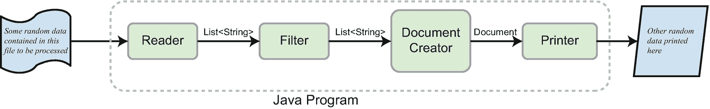
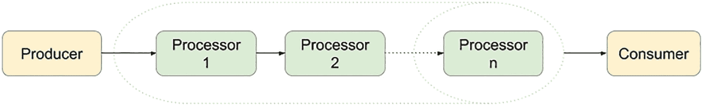
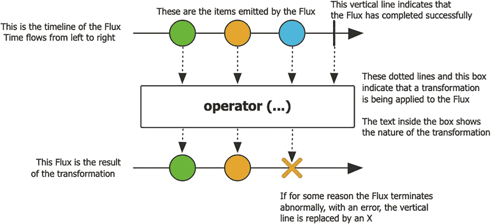

# 十二、发布-订阅框架

到目前为止，书中解释的所有编程概念都涉及到需要处理的数据。不管数据是以什么形式提供的，到目前为止我们编写的 Java 程序都是获取数据、修改数据并打印出结果，无论是控制台、文件还是其他软件组件。可以说，所有这些组件都在相互通信，并将处理过的数据从一个组件传递到另一个组件。比如图 [12-1](#Fig1) ，它抽象地描述了程序中 Java 组件之间的交互。



图 12-1

程序中 Java 组件之间的交互

每一个箭头上都标有从一个箭头传到另一个箭头的信息类型。在该图中，您可以识别信息进入程序的起点(由`Reader`读取)和终点(由`Printer`将信息打印到某个输出组件)。你可以说，`Reader`提供数据，`Filter`和`DocumentCreator`是一些内部处理器，处理数据，`Printer`是数据的消费者。

到目前为止描述的是类似于**点对点(p2p)消息模型**的东西，它描述了一个消息被发送给一个消费者的概念。p2p 模型特定于一个名为 Java 消息服务(JMS)的 Java API，它支持网络中计算机之间的正式通信，即消息传递。在本章开始的例子中，我们做了一个类比来说明 Java 程序组件之间的通信是以类似的方式工作的。通过考虑链接到消息传递风格通信模型中的所有组件，可以创建实现上图所描述的流程的解决方案设计。

有不止一种通信模型:生产者/消费者、发布/订阅和发送者/接收者，每一种都有其自身的特性， <sup>[1](#Fn1)</sup> 但是本章关注的是**发布/订阅，**因为这是反应式编程所基于的模型。

## 反应式编程和反应式宣言

**反应式编程**是一种声明式编程风格，涉及使用数据流和传播变化。反应式编程是用异步数据流编程。Reactive streams 是一项倡议，旨在为具有非阻塞背压的异步流处理提供标准。它们对于解决需要跨线程边界复杂协调的问题非常有用。操作符允许您将数据收集到所需的线程上，并确保线程安全操作，在大多数情况下，不需要过多使用`synchronized`和`volatile`构造。

在版本 8 中引入 Streams API 之后，Java 向反应式编程迈进了一步，但是反应式流直到版本 9 才可用。我们已经在几章前学习了如何使用 streams**(章** [**8**](08.html) **)** ，所以我们离目标又近了一步。现在我们所要做的就是了解如何使用反应流来进行一些反应式编程。

使用反应流并不是一个新的想法。反应宣言于 2014 年首次公开， <sup>[2](#Fn2)</sup> 它要求软件以这样的方式开发:**系统是响应性的、有弹性的、有弹性的和消息驱动的**——简而言之，它们应该是**反应性的**。

这里对这四个术语分别进行了简要说明:

*   **快速响应**:应提供快速一致的响应时间。

*   **弹性**:出现故障时应保持响应，并能够恢复。

*   **弹性**:应保持反应灵敏，能够应对各种工作负载。

*   **消息驱动**:应该使用异步消息通信，避免阻塞，必要时施加反压力。

以这种方式设计的系统应该更加灵活、松散耦合和可伸缩，但同时它们应该更容易开发、可修改和更能容忍失败。为了能够完成所有这些，系统需要一个通用的 API 来进行通信。Reactive streams 是一个为异步、非阻塞流处理提供这样一个标准 API 的倡议，它也支持背压。我们一会儿会解释**背压**的意思。让我们从反应式流处理的基础开始。

任何类型的流处理都涉及数据的生产者、数据的消费者以及它们之间处理数据的组件。显然，数据流的方向是从生产者到消费者。图 [12-2](#Fig2) 描述了到目前为止所描述的系统的抽象模式。



图 12-2

生产者/消费者系统

当生产者比消费者更快时，系统可能会陷入困境，因此必须处理无法处理的额外数据。做这件事的方法不止一种:


图 12-3

反应式生产者/消费者系统

*   多余的数据被丢弃(这是在网络硬件中完成的)。

*   生产者被阻止，因此消费者有时间赶上。

*   数据被缓冲，但是缓冲区是有限的，如果我们有一个快速的生产者和一个慢速的消费者，就有缓冲区溢出的危险。

*   应用**反压力**，这包括赋予消费者监管生产者和控制产生多少数据的权力。背压可以被看作是从消费者发送到生产者的信息，让生产者知道它必须降低其数据生产率。记住这一点，我们可以完成前一个图像中的设计，这将产生图 [12-3](#Fig3) 。

如果生产者、处理器和消费者不同步，通过阻塞直到每个都准备好处理来解决太多数据的问题是不可行的，因为这会将系统转换成同步的系统。丢弃它也不是一个选项，而且缓冲是不可预测的，所以我们留给反应式系统的只有应用**非阻塞背压**。

如果软件的例子对你来说太令人费解，想象一下下面的场景。你有一个叫吉姆的朋友。你还有一桶不同颜色的球。吉姆告诉你把所有的红球都给他。有两种方法可以做到这一点:

1.  你把所有的红球都捡起来，放到另一个桶里，然后把桶递给吉姆。这是典型的请求-完整响应模型。这是一个异步模型，如果选择红球需要很长时间，Jim 会去做其他事情，而你会进行分类，当你完成时，你只需通知他一桶红球准备好了。它是异步的，因为 Jim 不会被你阻止去整理球，而是去做其他的事情，当球准备好的时候再去拿球。

2.  你只要从你的桶里一个接一个地拿出红色的球，然后扔向吉姆。在这种情况下，这是你的数据流，或者球流。如果你找到它们并扔出去的速度比吉姆接住它们的速度快，你就有障碍。所以吉姆让你慢下来。这是他在调节球的流动，这相当于现实世界中的背压。

在版本 9 之前，用 Java 编写可以在反应式系统中聚合的应用是不可能的，所以开发人员不得不用外部库来凑合。反应式应用必须根据反应式编程的原理来设计，并使用反应式流来处理数据。反应式编程的标准 API 首先由**反应流**库描述，该库也可以用于 Java 8。在 Java 9 中，标准 API 被添加到了 JDK 中，下一版本的**反应流**包含了一组嵌套在`org.reactivestreams.FlowAdapters`类中的类，它们代表了两个 API(反应流 API 和反应流流 API)中类似组件之间的桥梁。

在图 [12-4](#Fig4) 中，你可以看到接口是由具有先前定义的角色的组件实现的。


图 12-4

反应流接口(如 IntelliJ IDEA 所示)

反应流 API 由四个非常简单的接口组成:

*   接口`Publisher<T>`公开了一个名为`void subscribe(Subscriber<? super T>)`的方法，该方法被调用来添加一个`Subscriber<T>`实例，并产生类型为`T`的元素，这些元素将被`Subscriber<T>`使用。`Publisher<T>`实现的目的是根据从其订户接收到的需求来发布值。

*   接口`Subscriber<T>`，消耗来自`Publisher<T>`的元素，并根据`Publisher<T>`实例接收的事件类型，公开定义实例具体行为所必须实现的四个方法。
    *   `void onSubscribe(Subscription)`是在订户上调用的第一个方法，这是使用`Subscription`参数将`Publisher<T>`链接到`Subscriber<T>`实例的方法；如果此方法引发异常，则不能保证以下行为。

    *   `void onNext(T)`是由`Subscription`的下一个项目调用的方法，用于接收数据；如果抛出异常，`Subscription`可能会被取消。

    *   `void onError(Throwable)`是在`Publisher<T>`或`Subscription<T>`遇到不可恢复的错误时调用的方法。

    *   void `onComplete()`是当没有更多的数据消耗时调用的方法，因此不会发生额外的`Subscriber<T>`方法调用。

*   接口`Processor<T,R> extends both Publisher<T> and Subscriber<R>`，因为它需要消费数据并产生数据以将其发送到更上游。

*   接口`Subscription`的实现链接了`Publisher<T>`和`Subscriber<T>`，可以通过调用`request(long)`来设置要生产并发送给消费者的商品数量，从而应用反压力。它还允许取消一个流，通过调用`cancel()`方法告诉`Subscriber<T>`停止接收消息。

在 JDK 中，前面列出的所有接口都在`java.util.concurrent.Flow`类中定义。这个类的名字在本质上是显而易见的，因为前面的接口用于创建流控制的组件，这些组件可以链接在一起创建一个反应式应用。除了这四个接口之外，还有一个 JDK 实现:实现`Publisher<T>`的`java.util.concurrent.SubmissionPublisher<T>`类，它是生成项目并使用该类中的方法发布项目的子类的方便基础。

`Flow`接口非常基本，可以在编写反应式应用时使用，但这需要大量的工作。目前，不同的团队有多种实现，为开发反应式应用提供了更实用的方法。使用这些接口的实现，您可以编写反应式应用，而无需编写处理数据的线程的同步逻辑。

下面的列表包含最著名的 reactive streams API 实现(还有更多的实现，因为在大数据世界中，反应式处理不再是奢侈品，而是必需品):

*   Project Reactor ( [`https://projectreactor.io`](https://projectreactor.io) )因其 Web 反应式框架而受到 Spring 的欢迎

*   阿卡流( [`https://doc.akka.io/docs/akka/current/stream/stream-flows-and-basics.html`](https://doc.akka.io/docs/akka/current/stream/stream-flows-and-basics.html) )

*   MongoDB Reactive Streams Java 驱动( [`http://mongodb.github.io/mongo-java-driver-reactivestreams`](http://mongodb.github.io/mongo-java-driver-reactivestreams) )

*   Ratpack ( [`https://ratpack.io`](https://ratpack.io)

*   RxJava （ [`http://reactivex.io`](http://reactivex.io) ）

## 使用 JDK 反应流 API

由于 JDK 为反应式编程提供的接口非常基础，实现起来非常麻烦，但是在这一部分中还是做了尝试。在这一节中，我们将尝试构建一个生成无限数量的整数值的应用。过滤这些值并选择小于 127 的值。对于 98 和 122 之间的偶数，减去 32(基本上是将小写字母转换成大写字母)。然后将它们转换成字符并打印出来。清单 [12-1](#PC1) 中描述了最基本的解决方案，没有反应流。

```java
package com.apress.bgn.twelve.dummy;

// some input statements omitted
import java.security.SecureRandom;

public class BasicIntTransformer {
    private static final Logger log = LoggerFactory.getLogger(BasicIntTransformer.class);
    private static final SecureRandom random = new SecureRandom();

    public static void main(String... args) {

        while (true){
            int rndNo = random.nextInt(130);
            if (rndNo < 127) {
                log.info("Initial value: {} ", rndNo);
                if(rndNo % 2 == 0 && rndNo >=98 && rndNo <=122) {
                    rndNo -=32;
                }
                char res = (char) rndNo;
                log.info("Result: {}", res);
            } else {
                log.debug("Number {} discarded.", rndNo);
            }
        }
    }
}

Listing 12-1Generating an Infinite Number of Integers <127

```

前面代码清单中的每一行代码都有一个目的，一个期望的结果。这种方法被称为命令式编程，因为它顺序执行一系列语句来产生所需的输出。

然而，这不是我们的目标。在本节中，我们将使用 JDK 反应式接口的实现来实现反应式解决方案，因此我们需要以下内容:

*   利用无限流生成随机整数值的发布器组件。该类应该实现`Flow.Publisher<Integer>`接口。

*   一个只选择可以转换成可见字符的整数值的处理器，比方说代码在[0，127]之间的所有字符。该类应该实现`Flow.Processor<Integer, Integer>`。

*   一种处理器，通过减去 32 来修改接收到的 98 和 122 之间的偶数元素。这个类也应该实现`Flow.Processor<Integer, Integer>`。

*   一种将整数元素转换成等价字符的处理器。这是一个特殊的类型或处理器，它将一个值映射到另一个类型的另一个值，并且应该实现`Flow.Processor<Integer, Character>`。

*   将打印从链中最后一个处理器收到的元素的订户。这个类将实现`Flow.Subscriber<Character>`接口。

让我们从声明`Publisher<T>`开始，它将环绕一个无限流以产生要消费的值。我们将通过提供一个完整的具体实现来异步提交元素，从而实现`Flow.Publisher<Integer>`接口。为了在需要时缓冲它们，需要添加大量代码。幸运的是`SubmissionPublisher<T>`类已经这样做了，所以在我们的类内部，我们将使用一个`SubmissionPublisher<Integer>`对象。清单 [12-2](#PC2) 中描述了发布者的代码。

```java
package com.apress.bgn.twelve.jdkstreams;

import java.util.Random;
import java.util.concurrent.Flow;
import java.util.concurrent.SubmissionPublisher;
import java.util.stream.IntStream;

public class IntPublisher implements Flow.Publisher<Integer> {
    private static final Random random = new Random();
    protected final IntStream intStream;

    public IntPublisher(int limit) {
        intStream = limit == 0 ? IntStream.generate(() -> random.nextInt(150)) :
                IntStream.generate(() -> random.nextInt(150)).limit(30);
    }

    private final SubmissionPublisher<Integer> submissionPublisher = new SubmissionPublisher<>();

    @Override
    public void subscribe(Flow.Subscriber<? super Integer> subscriber) {
        submissionPublisher.subscribe(subscriber);
    }

    public void start() {
        intStream.forEach(element -> {
            submissionPublisher.submit(element);
            sleep();
        });
    }

    private void sleep() {
        try {
            Thread.sleep(1000);
        } catch (InterruptedException e) {
            throw new RuntimeException("could not sleep!");
        }
    }
}

Listing 12-2Publisher Generating an Infinite Number of Integers

```

注意`IntPublisher`类的构造函数是如何接受一个参数的。如果在实例化时作为参数提供的值是 0(零)，则创建无限流。如果参数值不为 0，则创建一个有限流。如果您希望运行示例而不是强制停止执行，这将非常有用。

正如所料，我们已经为`subscribe()`方法提供了一个实现，在这种情况下，我们要做的只是将`subscriber`转发给内部的`submissionPublisher`。因为我们已经通过包装`submissionPublisher`创建了我们的 publisher，所以这是必要的，否则我们的流程将不会像预期的那样工作。此外，我们还添加了一个`start()`方法，该方法从无限`IntStream`中获取元素，并使用内部`submissionPublisher`提交它们。

`IntStream`利用一个`Random`实例在`[0,150]`区间生成整数值。选择这个时间间隔是为了让我们看到连接到发布者的第一个`Flow.Processor<T,R>`实例是如何丢弃大于 127 的值的。为了能够减缓元素提交的速度，我们添加了一个对`Thread.sleep(1000)`的调用，这基本上保证了每秒一个元素会被向上链转发。

第一个处理器的名称是`FilterCharProcessor`，它将利用一个内部的`SubmissionPublisher<Integer>`实例将它处理的元素向前发送到下一个处理器。

抛出的异常也将使用`SubmissionPublisher<Integer>`转发。处理器既充当发布者，也充当订阅者，因此对`onNext(..)`方法的实现必须包括对`subscription.request(..)`的调用，以施加反压力。从本章前面提供的图中，您可以看到处理器基本上是一个允许数据双向流动的组件，它通过实现`Publisher<T>`和`Subscriber<T>`来实现这一点。

处理器必须订阅发布者，并且当发布者`subscribe(..)`方法被调用时，将导致`onSubscribe(Flow.Subscription subscription)`方法被调用。订阅必须存储在本地，以便可以用来施加反压力。但是在接受订阅时，我们必须确保该字段尚未初始化，因为根据 reactive streams 规范，一个发布者只能有一个订阅者，否则结果是不可预测的。如果有新的订阅到达，必须取消，这是通过打电话`cancel()`完成的。清单 [12-3](#PC3) 中描述了处理器的完整代码。

```java
package com.apress.bgn.twelve.jdkstreams;

import java.util.concurrent.Flow;
import java.util.concurrent.SubmissionPublisher;
// some input statements omitted

public class FilterCharProcessor implements Flow.Processor<Integer, Integer> {
    private static final Logger log = LoggerFactory.getLogger(FilterCharProcessor.class);

    private final SubmissionPublisher<Integer> submissionPublisher = new SubmissionPublisher<>();
    private Flow.Subscription subscription;
    @Override
    public void subscribe(Flow.Subscriber<? super Integer> subscriber) {
        submissionPublisher.subscribe(subscriber);
    }
    @Override
    public void onSubscribe(Flow.Subscription subscription) {
        if (this.subscription == null) {
            this.subscription = subscription;
            // apply back pressure - request one element
            this.subscription.request(1);
        } else {
            subscription.cancel();
        }
    }
    @Override
    public void onNext(Integer element) {

        if (element >=0 && element < 127){
            submit(element);
        } else {
            log.debug("Element {} discarded.", element);
        }
        subscription.request(1);
    }
    @Override
    public void onError(Throwable throwable) {
        submissionPublisher.closeExceptionally(throwable);
    }

    @Override
    public void onComplete() {
        submissionPublisher.close();
    }
    protected void submit(Integer element){
        submissionPublisher.submit(element);
    }
}

Listing 12-3Flow.Processor<T,R> Implementation FilterCharProcessor<Integer,Integer> That Filters Integers > 127

```

这个处理器非常专用，一个处理流程通常需要不止一个。在这个场景中，我们需要几个，因为除了`onNext(..)`方法之外，实现的其余部分主要是样板代码，允许处理器在我们设计的流程中链接在一起，将这些代码包装在一个`AbstractProcessor`中会更实用，这个解决方案需要的所有处理器都可以扩展这个`AbstractProcessor`。

由于流程中的最后一个处理器需要将接收到的`Integer`值转换为`Character`，因此该实现的返回类型将保持通用。清单 [12-4](#PC4) 中描述了代码。

```java
package com.apress.bgn.twelve.jdkstreams;

import java.util.concurrent.Flow;
import java.util.concurrent.SubmissionPublisher;

public abstract class AbstractProcessor<T> implements Flow.Processor<Integer, T> {
    protected final SubmissionPublisher<T> submissionPublisher = new SubmissionPublisher<>();
    protected Flow.Subscription subscription;

    @Override
    public void subscribe(Flow.Subscriber<? super T> subscriber) {
        submissionPublisher.subscribe(subscriber);
    }

    @Override
    public void onSubscribe(Flow.Subscription subscription) {
        if (this.subscription == null) {
            this.subscription = subscription;
            // apply back pressure - ask one or more than one
            this.subscription.request(1);
        } else {
            // avoid more than one Publisher sending elements to this Subscriber
            // do not accept other subscriptions
            subscription.cancel();
        }
    }

    @Override
    public void onError(Throwable throwable) {
        submissionPublisher.closeExceptionally(throwable);
    }

    @Override
    public void onComplete() {
        submissionPublisher.close();
    }

    protected void submit(T element) {

        submissionPublisher.submit(element);
    }
}

Listing 12-4AbstractProcessor<Integer,T> Implementation

```

这也简化了`FilterCharProcessor<Integer, Integer>`和其他处理器的实现。清单 [12-5](#PC5) 中描述了`FilterCharProcessor<Integer, Integer>`的简化实现。

```java
package com.apress.bgn.twelve.jdkstreams;

import org.slf4j.Logger;
import org.slf4j.LoggerFactory;

public class FilterCharProcessor extends AbstractProcessor<Integer> {
    private static final Logger log = LoggerFactory.getLogger(FilterCharProcessor.class);

    @Override
    public void onNext(Integer element) {
        if (element >= 0 && element < 127) {
            submit(element);
        } else {
            log.debug("Element {} discarded.", element);
        }
        subscription.request(1);
    }
}

Listing 12-5FilterCharProcessor

Extending AbstractProcessor<Integer>

```

我们有一个出版商和一个处理器，那么现在呢？当然，我们把它们联系起来。清单 [12-6](#PC6) 中的点(`..)`)取代了本节中尚未建立的所有相互连接的处理器和用户。

```java
package com.apress.bgn.twelve.jdkstreams;

public class ReactiveDemo {
    public static void main(String... args) {
        IntPublisher publisher = new IntPublisher(0);
        FilterCharProcessor filterCharProcessor = new FilterCharProcessor();

        publisher.subscribe(filterCharProcessor);
        // ..
        publisher.start();
    }
}

Listing 12-6Executing a Reactive Flow

```

下一个处理器实现是通过减去 32 将较小的字母转换成较大的字母。通过扩展`AbstractProcessor<Integer, T>`也可以很容易地实现，清单 [12-7](#PC7) 中描述了该实现。

```java
package com.apress.bgn.twelve.jdkstreams;

public class TransformerProcessor extends AbstractProcessor<Integer>{
    @Override
    public void onNext(Integer element) {
        if(element % 2 == 0 && element >=98 && element <=122) {
            element -=32;
        }
        submit(element);
        subscription.request(1);
    }
}

Listing 12-7The TransformerProcessor

Implementation

```

要在流程中插入这个处理器，我们只需要实例化它，调用`filterCharProcessor.subscribe(..)`并提供这个实例作为参数。清单 [12-8](#PC8) 展示了创建我们的反应流的下一步。

```java
package com.apress.bgn.twelve.jdkstreams;

public class ReactiveDemo {
    public static void main(String... args) {
        IntPublisher publisher = new IntPublisher(0);
        FilterCharProcessor filterCharProcessor = new FilterCharProcessor();
        TransformerProcessor transformerProcessor = new TransformerProcessor();

        publisher.subscribe(filterCharProcessor);
        filterCharProcessor.subscribe(transformerProcessor);
        // ..
        publisher.start();
    }
}

Listing 12-8A TransformerProcessor

Instance Being Added to a Reactive Flow

```

下一个要实现的是我们这个解决方案需要的最终处理器，它将一个`Integer`值转换成一个`String`值。为了尽可能保持实现的声明性，将向处理器提供映射函数作为参数。代码如清单 [12-9](#PC9) 所示。

```java
package com.apress.bgn.twelve.jdkstreams;

import java.util.function.Function;

public class MappingProcessor extends AbstractProcessor<Character> {
    private final Function<Integer, Character> function;

    public MappingProcessor(Function<Integer, Character> function) {
        this.function = function;
    }
    @Override
    public void onNext(Integer element) {
        submit(function.apply(element));
        subscription.request(1);
    }
}

Listing 12-9The MappingProcessor

Implementation

```

在清单 [12-10](#PC10) 中，您可以看到一个`MappingProcessor`实例被添加到反应流中。

```java
package com.apress.bgn.twelve.jdkstreams;

public class ReactiveDemo {
    public static void main(String... args) {
       IntPublisher publisher = new IntPublisher();
        FilterCharProcessor filterCharProcessor = new FilterCharProcessor();
        TransformerProcessor transformerProcessor = new TransformerProcessor();
        MappingProcessor mappingProcessor =
                        new MappingProcessor(element -> (char) element.intValue());
        publisher.subscribe(filterCharProcessor);
        filterCharProcessor.subscribe(transformerProcessor);
        transformerProcessor.subscribe(mappingProcessor);
        //...
        publisher.start();
    }
}

Listing 12-10A MappingProcessor

Instance Being Added to a Reactive Flow

```

这个流程的最后一个组成部分是订户。订户是流中最重要的组件；在添加订阅者并创建一个`Subscription`实例之前，实际上什么都不会发生。我们的订户实现了`Flow.Subscriber<Character>,`，它的大部分与我们在`AbstractProcessor<T>`中隔离的代码相同，这看起来可能有点多余，但也使事情变得非常简单。清单 [12-11](#PC11) 描述了`Subscriber`的实现。

```java
package com.apress.bgn.twelve.jdkstreams;
// some import statements omitted
import java.util.concurrent.Flow;

public class CharPrinter implements Flow.Subscriber<Character> {
    private static final Logger log = LoggerFactory.getLogger(CharPrinter.class);
    private Flow.Subscription subscription;

    @Override
    public void onSubscribe(Flow.Subscription subscription) {
        if (this.subscription == null) {
            this.subscription = subscription;
            this.subscription.request(1);
        } else {
            subscription.cancel();
        }
    }

    @Override
    public void onNext(Character element) {
        log.info("Result: {}", element);

        subscription.request(1);
    }

    @Override
    public void onError(Throwable throwable) {

        log.error("Something went wrong.", throwable);
    }

    @Override
    public void onComplete() {
        log.info("Printing complete.");
    }
}

Listing 12-11Subscriber<Character> Implementation

```

使用这个订户类，现在可以完成如清单 [12-12](#PC12) 所示的流程。

```java
package com.apress.bgn.twelve.jdkstreams;

public class ReactiveDemo {
    public static void main(String... args) {
        IntPublisher publisher = new IntPublisher(0);
        FilterCharProcessor filterCharProcessor = new FilterCharProcessor();
        TransformerProcessor transformerProcessor = new TransformerProcessor();
        MappingProcessor mappingProcessor = new MappingProcessor(element -> (char) element.intValue());
        CharPrinter charPrinter = new CharPrinter();

        publisher.subscribe(filterCharProcessor);
        filterCharProcessor.subscribe(transformerProcessor);
        transformerProcessor.subscribe(mappingProcessor);
        mappingProcessor.subscribe(charPrinter);
        publisher.start();
    }
}

Listing 12-12Reactive Pipeline Complete Implementation

```

如果`subscribe(..)`方法能够返回调用者实例，以便我们能够链接`subscribe(..)`调用，那就太好了，但是我们使用的是提供给我们的东西。当前面的代码运行时，类似于清单 [12-13](#PC13) 中描述的日志被打印在控制台中:

```java
...
INFO  c.a.b.t.j.CharPrinter - Result: .
INFO  c.a.b.t.j.CharPrinter - Result: ,
INFO  c.a.b.t.j.CharPrinter - Result: A
DEBUG c.a.b.t.j.FilterCharProcessor - Element 147 discarded.
DEBUG c.a.b.t.j.FilterCharProcessor - Element 127 discarded.
INFO  c.a.b.t.j.CharPrinter - Result: E
INFO  c.a.b.t.j.CharPrinter - Result: Z
...

Listing 12-13Console Output of a Reactive Flow Being Executed

```

前面的例子使用一个无限的`IntStream`来生成要发布、处理和消费的元素。这导致执行程序永远运行，所以你必须手动停止它。另一个结果是`onComplete()`方法永远不会被调用。如果我们想要使用它，我们必须确保被发布的条目数量是有限的，但是用一个不同于 0(零)的值初始化`IntPublisher`。

还有一点要提的是，背压处理更多的是在概念上做的。Flow API 没有提供任何机制来通知背压或处理背压。所以`subscription.request(1)`只是确保当`onNext(..)`被调用时，元素生产率减少到 1。基于用户的微调，可以设计各种策略来处理背压，但是很难在一个非常简单的例子中显示类似的东西，这个例子不涉及两个微服务相互反应性地交互。

在 JDK 中，对反应流的支持非常少，即使在 2021 年 9 月 14 日发布的版本 17 中也是如此。预计在未来的版本中会添加更多有用的类，但显然 Oracle 专注于其他方面，如重组模块结构和决定如何更好地利用 JDK 赚钱。这就是为什么本章的最后一节介绍了一个用 Project Reactor 库完成的反应式编程的简短示例。

### 反应流技术兼容性套件

当构建使用反应式流的应用时，很多事情可能会出错。为了确保事情按预期进行， **Reactive Streams 技术兼容性工具包**项目，也称为 **TCK、** <sup>[3](#Fn3)</sup> 是编写测试非常有用的库。这个库包含一些类，可以用来根据反应流规范测试反应实现。TCK 旨在验证 JDK `java.util.concurrent.Flow`类中包含的接口，出于某种原因，创建该库的团队决定使用 TestNG 作为测试库。

在版本 1.0.3 中修改了 TCK，以验证包含在反应流 API 中的接口。

等等，什么？你可能会惊呼。

那么如何用它来验证 JDK java.util.concurrent.Flow 类中包含的接口呢？

*耐心等待年轻的学徒，一切都会在适当的时候得到解释。*

TCK 包含四个类，必须实现它们来提供它们的`Flow.Publisher<T>`、`Flow.Subscriber<T>`和`Flow.Processor<T,R>`实现，以便测试工具进行验证。这四个类别是:

*   `org.reactivestreams.tck.PublisherVerification<T>`用于测试`Publisher<T>`的实现

*   `org.reactivestreams.tck.SubscriberWhiteboxVerification<T>`用于白盒测试`Subscriber<T>`实现和`Subscription`实例

*   `org.reactivestreams.tck.SubscriberBlackboxVerification<T>`用于黑盒测试`Subscriber<T>`实现和`Subscription`实例

*   `org.reactivestreams.tck.IdentityProcessorVerification<T>`用于测试`Processor<T,R>`的实现

为了使每个测试的目的变得明显，库测试方法的名称遵循这种模式:`TYPE_spec#_DESC`其中`TYPE`是`required, optional, stochastic,`或`untested,`中的一个，表示被测试规则的重要性。`spec</emphasis></emphasis>#`中的散列符号代表规则号，第一个是 1 代表`Publisher<T>`实例，2 代表`Subscriber<T>`实例。`DESC`是对测试目的的简短说明。

让我们看看如何测试我们之前定义的`IntPublisher`。`PublisherVerification<T>`类需要实现两个测试方法:一个测试发出大量元素的工作中的`Publisher<T>`(`createPublisher(..)`方法)实例，另一个测试“失败的”`Publisher<T>`(`createFailedPublisher(..)`)实例，该实例无法初始化它需要发出元素的连接。

由`createPublisher(..)`测试的实例是通过传递一个不同于 0(零)的参数创建的，因此`IntPublisher`实例发出一组有限的元素，测试执行也是有限的。

清单 [12-14](#PC14) 中描述了`PublisherVerification<Integer>`的实现。

```java
package com.apress.bgn.twelve.jdkstreams;

import org.reactivestreams.FlowAdapters;
import org.reactivestreams.Publisher;
import org.reactivestreams.tck.PublisherVerification;
import org.reactivestreams.tck.TestEnvironment;
import java.util.concurrent.Flow;
// other import statements omitted

public class IntPublisherTest extends PublisherVerification<Integer> {
    private static final Logger log = LoggerFactory.getLogger(IntPublisherTest.class);

    public IntPublisherTest() {
        super(new TestEnvironment(300));
    }

    @Override
    public Publisher<Integer> createPublisher(final long elements) {
        return FlowAdapters.toPublisher(new IntPublisher(30) {
            @Override
            public void subscribe(Flow.Subscriber<? super Integer> subscriber) {
                intStream.forEach(subscriber::onNext);
                subscriber.onComplete();
            }
        });
    }

    @Override
    public Publisher<Integer> createFailedPublisher() {
        return FlowAdapters.toPublisher(new IntPublisher(0) {
            @Override
            public void subscribe(Flow.Subscriber<? super Integer> subscriber) {
                subscriber.onError(new RuntimeException("There be dragons! (this is a failed publisher)"));
            }
        });
    }
}

Listing 12-14TestNG Test Class for Testing a IntPublisher Instance

```

关于前面的测试类，应该提到的另一件事是，由于实现是为使用反应流 API 而设计的，所以它不能用于测试基于 JDK 的`IntPublisher`。然而，前面提到过，在版本 1.0.3 中，反应流 API 增加了一组类，用作反应流和 JDK 反应流 API 之间的桥梁。因此，`IntPublisher`必须作为一个参数提供给`FlowAdapters.toPublisher(..)`方法，该方法将它转换成一个等价的`org.reactivestreams.Publisher`，以便`IntPublisherTest`可以测试。

由于特定于您正在构建的应用的设计决策，一个`Publisher<T>`实现可能无法通过所有的测试。在我们的例子中，`IntPublisher`的实现非常简单，当运行`createPublisher(..)`方法时，在所有执行的测试中，通过的并不多，大多数都被忽略了，如图 [12-5](#Fig5) 所示。


图 12-5

TestNG 反应式发布器

测试没有通过或被忽略的原因是我们的实现没有实现那些特定测试所针对的行为(例如，`maySupportMultiSubscribe`、`maySignalLessThanRequestedAndTerminateSubscription`、`mustSignalOnMethodsSequentially`)。

我们还可以通过扩展前面提到的测试类来测试我们在上一节中定义的处理器和订阅者，但是我们将把它作为一个练习留给您，因为在这一章中我们还想介绍一件更有趣的事情。

## 使用 Project Reactor

如前所述，JDK 对反应式编程的支持非常少。发布者、处理者和订阅者应该异步运行，所有这些行为都必须由开发人员来实现，这可能有点麻烦。目前，JDK 唯一适合的是在所有其他已经存在的实现之间提供一个公共接口。它们有很多，为更专业的反应组件和实用方法提供了更多有用的类，以便更容易地创建和连接它们。作为 Spring 爱好者，我个人最喜欢的一个是 **Project Reactor** ，也是 Spring 开发团队最喜欢的一个。

Project Reactor 是第一批用于反应式编程的库之一，它的类为构建反应式应用提供了一个非阻塞的稳定基础和高效的需求管理。它适用于 Java 8，但是为 JDK9+反应流类提供了适配器类。

Project reactor 适用于微服务应用，并提供了比 JDK 更多的类，旨在使编程反应式应用更实用。Project reactor 提供了两个主要的发布器实现:`reactor.core.publisher.Mono<T>`，它是一个反应式流发布器，仅限于发布零个或一个元素，以及`reactor.core.publisher.Flux<T>`，它是一个反应式流发布器，具有基本的流操作符。

使用 Project React 的优点是我们有更多的类和方法可以使用，有静态工厂可以用来创建发布者，操作可以更容易地链接起来。

项目反应堆小组不喜欢`Processor,`这个名字，所以中间组件被命名为**操作员**。

如果你查阅官方文档，你很可能会遇到图 [12-6](#Fig6) 中的模式。 <sup>[4](#Fn4)</sup>



图 12-6

项目反应堆通量发布器实施

这是一个关于`Flux<T>` publisher 如何工作的抽象模式。`Flux<T>`发出元素，可以抛出异常，并在没有更多元素要发布时完成，与之前解释的行为相同，Project Reactor 团队只是找到了一种更漂亮的方式来绘制它。

`Mono`实现的绘图非常相似(参见 [`http://projectreactor.io/docs/core/release/api/reactor/core/publisher/Mono.html`](http://projectreactor.io/docs/core/release/api/reactor/core/publisher/Mono.html) )。

但是让我们把它放在一边，看几个代码示例。使用该类中的多个实用方法创建`Flux<T>`实例非常容易。在开始发布元素之前，让我们设计一个除了打印值之外什么也不做的普通订阅者，因为我们将需要它来确保我们的`Flux<T>`发布器工作。

要使用 Project Reactor API 编写订阅者，您有多种选择。您可以直接实现`org.reactivestreams.Subscriber<T>`，如清单 [12-15](#PC15) 所示。

```java
package com.apress.bgn.twelve.reactor;

import org.reactivestreams.Subscriber;
import org.reactivestreams.Subscription;
// other import statements omitted

public class GenericSubscriber<T> implements Subscriber<T> {
    private static final Logger log = LoggerFactory.getLogger(GenericSubscriber.class);
    private Subscription subscription;
    @Override
    public void onSubscribe(Subscription subscription) {
        if (this.subscription == null) {
            this.subscription = subscription;
            this.subscription.request(1);
        } else {
            subscription.cancel();
        }
    }
    @Override
    public void onNext(T element) {
        log.info("consumed {} ", element);
        subscription.request(1);
    }
    @Override
    public void onError(Throwable t) {
        log.error("Unexpected issue!", t);
    }
    @Override
    public void onComplete() {
        log.info("All done!");
    }
}

Listing 12-15org.reactivestreams.Subscriber<T> Implementation

```

为了避免用样板代码实现那么多方法，还可以选择实现`reactor.core.CoreSubscriber<T>`，它是订阅者的 reactor 基本接口，或者更好，通过扩展提供基本订阅者功能的`reactor.core.publisher.BaseSubscriber<T>`类。订户典型方法的行为可以通过覆盖具有相同名称但前缀为`hook`的方法来修改。在清单 [12-16](#PC16) 中，您可以看到使用 project reactor 编写订阅者是多么容易。

```java
package com.apress.bgn.twelve.reactor;

import reactor.core.publisher.BaseSubscriber;
// other import statements omitted

public class GenericSubscriber<T> extends BaseSubscriber<T> {
    private static final Logger log = LoggerFactory.getLogger(GenericSubscriber.class);

    @Override
    protected void hookOnNext(T value) {
        log.info("consumed {} ", value);
        super.hookOnNext(value);
    }

    @Override
    protected void hookOnComplete() {
        log.info("call done.");
        super.hookOnComplete();
    }
}

Listing 12-16reactor.core.publisher.BaseSubscriber<T> Extension

```

*哒哒！*现在我们有了一个 subscriber 类，所以让我们创建一个反应式发布器来服务来自无限整数流的整数，以使用这个类的一个实例。实现如清单 [12-17](#PC17) 所示。

```java
package com.apress.bgn.twelve.reactor;

import reactor.core.publisher.Flux;
import java.util.Random;
import java.util.stream.Stream;

public class ReactorDemo {

    private static final Random random = new Random();

    public static void main(String... args) {
        Flux<Integer> intFlux = Flux.fromStream(
                Stream.generate(() -> random.nextInt(150))
        );
        intFlux.subscribe(new GenericSubscriber<>());
    }
}

Listing 12-17Creating a Reactive Publisher Using Project Reactor’s Flux<T>

```

如果您运行前面的代码，您将看到所有生成的整数值都由订阅者打印出来。可以从多个来源创建一个`Flux<T>`,包括数组和其他发布者。对于特殊情况，为了避免返回空值，可以通过调用`empty()`方法创建一个空的`Flux<T>`。

```java
String[] names = {"Joy", "John", "Anemona", "Takeshi"};
Flux.fromArray(names).subscribe(new GenericSubscriber<>());

Flux<Integer> intFlux = Flux.empty();
intFlux.subscribe(new GenericSubscriber<>());

```

我认为最棒的方法叫做`just(..),`，它同时适用于通量和单声道。它接受一个或多个值，并根据被调用的类型返回一个发布者、`Flux<T>`或`Mono<T>`。

```java
Flux<String> dummyStr = Flux.just("one", "two", "three");
Flux<Integer> dummyInt = Flux.just(1,2,3);

Mono<Integer> one = Mono.just(1);
Mono<String> empty = Mono.empty();

```

您可能会发现另一个有用的方法是`concat(..)`，它允许您连接两个`Flux<T>`实例。

```java
String[] names = {"Joy", "John", "Anemona", "Takeshi"};
Flux<String> namesFlux = Flux.fromArray(names);

String[] names2 = {"Hanna", "Eugen", "Anthony", "David"};
Flux<String> names2Flux = Flux.fromArray(names2);
Flux<String> combined = Flux.concat(namesFlux, names2Flux);
combined.subscribe(new GenericSubscriber<>());

```

你可能会喜欢的另一件事是:还记得如何使用`Thread.sleep(1000)`调用来降低`IntPublisher`类的速度吗？使用`Flux<T>`,你不需要这样做，因为有两个实用方法结合起来会导致相同的行为。

```java
Flux<Integer> infiniteFlux = Flux.fromStream(
        Stream.generate(() -> random.nextInt(150))
    );

Flux<Long> delay = Flux.interval(Duration.ofSeconds(1));
Flux<Integer> delayedInfiniteFlux = infiniteFlux.zipWith(delay, (s,l) -> s);
delayedInfiniteFlux.subscribe(new GenericSubscriber<>());

```

`interval(..)`方法创建一个发布器，它发出从 0 开始的长值，并在全局计时器上以指定的时间间隔递增；它接收 Duration 类型的参数，在前面的示例中使用了秒。`zipWith(..)`方法压缩作为参数接收的`Flux<T>`实例。`zip`操作是一个特定的流操作，它翻译为两个发布者发出一个元素并使用`java.util.function.BiFunction<T, U, R>`组合这些元素。在我们的例子中，该函数只是丢弃第二个元素，并返回调用流中被第二个流生成的秒数减慢的元素。

project reactor 提供的组件的优点是，它们返回的对象类型大多与被调用的对象类型相同，这意味着它们可以很容易地被链接起来。

可以用 reactor API 编写一段与之前实现的基于 JDK 的实现等价的反应式代码，如清单 [12-18](#PC22) 所示。

```java
Flux<Integer> infiniteFlux = Flux.fromStream(
        Stream.generate(() -> random.nextInt(150))
    );

Flux<Long> delay = Flux.interval(Duration.ofSeconds(1));
Flux<Integer> delayedInfiniteFlux = infiniteFlux.zipWith(delay, (s, l) -> s);

delayedInfiniteFlux
    .filter(element -> (element >= 0 && element < 127))
    .map(item -> {
        if (item % 2 == 0 && item >= 98 && item <= 122) {
            item -= 32;
        }
        return item;
    })
.map(element -> (char) element.intValue())
.subscribe(new GenericSubscriber<>());

Listing 12-18Writing a Reactive Pipeline Using Project Reactor

```

您所记得的 Stream API 中的大多数函数都是为了在 project Reactor 中被动使用而实现的，所以如果前面的代码看起来很熟悉，这就是原因。

关于 Project Reactor API，如果你需要一个反应库，你可以首先考虑这个。你可以在 [`http://projectreactor.io/docs/core/milestone/reference/`](http://projectreactor.io/docs/core/milestone/reference/) 找到官方文档，相当不错，例子也很多。如果 Oracle 决定提供自己的丰富 API 来使用反应式流编程反应式应用，他们可能会有点太晚了。

## 摘要

反应式编程不是一个简单的话题，但它似乎是编程的未来。这本书将需要进入真正先进的主题，以显示反应式解决方案的真正力量。作为一本完全面向 Java 初学者的书，这不是一个适合它的主题。然而，读完这本书后，如果你有兴趣了解更多关于构建反应式应用的知识，Apress 在 2021 年 1 月出版的*Pro Spring MVC with web flux*<sup>[5](#Fn5)</sup>这本书有几个很棒的章节是关于用 Spring 和 Project Reactor 构建反应式应用的。

你必须记住的是，对于非反应性的实现，反应性的实现是毫无用处的。设计和使用电抗组件和非电抗组件是没有用的，因为实际上你可能会引入故障点并减慢速度。例如，如果您使用的是 Oracle 数据库，那么定义一个使用反应式流返回元素的存储库类是没有意义的，因为 Oracle 数据库不支持反应式访问。您只是添加了一个增加额外实现的反应层，因为在这种情况下没有真正的好处。但是如果您选择的数据库是 MongoDB，您可以放心地使用反应式编程，因为 MongoDB 数据库支持反应式访问。此外，如果您正在构建一个具有 ReactJS 或 angular 接口的 web 应用，那么您可以设计控制器类，以反应性地提供要由接口显示的数据。

本章的内容可以概括如下:

*   解释了反应式编程

*   解释了反应流的行为

*   涵盖了 JDK 反应流支持

*   介绍了如何使用 Reactive Streams 技术兼容性套件测试您的反应式解决方案

*   提供了用于构建反应应用的项目反应器组件的小介绍

<aside aria-label="Footnotes" class="FootnoteSection" epub:type="footnotes">Footnotes [1](#Fn1_source)

如果您对通信模型更感兴趣，您可以在 web 上搜索企业集成模式。

  [2](#Fn2_source)

参见《无功之人》，《无功宣言》， [`https://www.reactivemanifesto.org`](https://www.reactivemanifesto.org) ，2021 年 10 月 15 日访问。

  [3](#Fn3_source)

参见 GitHub 官方回购，“反应流”， [`https://github.com/reactive-streams/reactive-streams-jvm/tree/master/tck`](https://github.com/reactive-streams/reactive-streams-jvm/tree/master/tck) ，2021 年 10 月 15 日访问。

  [4](#Fn4_source)

图片来源:Project Reactor，“公共 API JavaDoc”， [`http://projectreactor.io/docs/core/release/api/reactor/core/publisher/Flux.html`](http://projectreactor.io/docs/core/release/api/reactor/core/publisher/Flux.html) ，2021 年 10 月 15 日访问。

  [5](#Fn5_source)

Marten Deinum 和 Iuliana Cosmina，*Pro Spring MVC with web flux*(New York:a press，2021)， [`https://www.apress.com/us/book/9781484256657`](https://www.apress.com/us/book/9781484256657) ，2021 年 10 月 15 日访问。

 </aside>