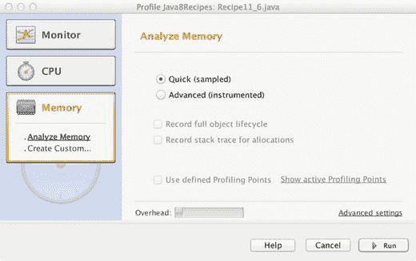

# 十一、调试和单元测试

调试是软件开发的一大部分。为了有效地进行调试，您必须能够像计算机一样“思考”并深入代码，解构导致您正在努力解决的逻辑错误的每一步。在计算机编程的初期，没有很多工具可以帮助调试。大多数情况下，调试包括查看您的代码并找出不一致的地方；然后重新提交代码再次编译。今天，每个 IDE 都提供了使用断点和检查内存变量的能力，这使得调试变得更加容易。在 ide 之外，还有其他工具可以帮助您进行项目的日常调试、构建和测试；这些工具确保您的代码不断地被测试，以发现编程时可能引入的错误。在这一章中，您将探索有助于调试、分析和测试 Java 软件的不同工具。

本章涵盖了一些调试和单元测试的基础知识。您将学习如何使用 Apache Ant 和 JUnit 从命令行或终端执行单元测试。您还将了解如何利用 NetBeans Profiler 以及其他工具来分析和监视您的应用。

## 11-1.了解异常

### 问题

您捕获并记录了一个异常，您需要确定其原因。

### 解决办法

分析异常的 printStackTrace()方法的输出:

```java
public class Recipe11_1 {
    public static void main (String[] args) {
        Recipe11_1 recipe = new Recipe11_1();
        recipe.startProcess();
    }

    private void startProcess() {
        try {
            int a = 5/0;
        }  catch (Exception e) {
            e.printStackTrace();
        }

    }
}
```

结果:

```java
java.lang.ArithmeticException: / by zero
   at org.java8recipes.chapter11.recipe11_01.Recipe11_1.start(Recipe11_1.java:18)
   at org.java8recipes.chapter11.recipe11_01.Recipe11_1.main(Recipe11_1.java:13)
```

### 它是如何工作的

在编程行话中，*栈*指的是被调用以到达程序中某一点的函数列表，通常从即时函数(System.out.println())开始到更一般的函数(public static void main)。每个程序都跟踪哪个代码被执行，以便到达代码的特定部分。栈跟踪的输出是指发生错误时内存中的栈。Java 中抛出的异常跟踪它们发生的位置，以及抛出异常时执行的代码路径。栈跟踪显示从发生异常的最具体的地方(发生异常的那一行)到出错代码的顶级调用程序(以及中间的所有内容)。然后，这些信息允许您查明执行了哪些方法调用，并可能有助于了解引发异常的原因。

在本例中，被零除异常发生在 Recipe11_1.java 的第 18 行，是由 main()方法的调用引起的(在第 13 行)。有时，当查看栈跟踪的输出时，您会看到不属于项目的方法。这是自然发生的，因为有时方法调用是在工作系统的其他部分生成的。例如，当出现异常时，在 Swing 应用中看到抽象窗口工具包(AWT)方法是很常见的(由于 EventQueue 的性质)。如果您查看更具体的函数调用(最早)，您最终将使用项目自己的代码运行，然后可以尝试确定引发异常的原因。

###### 注意

如果用“调试”信息编译程序，栈跟踪输出将包含行号信息。默认情况下，大多数 ide 在调试配置中运行时都会包含这些信息。通常，IDE 还会生成一个直接链接，将您带到有问题的代码行，从而使错误的行号变得易于访问。如果使用命令行，请使用–g 选项来编译和生成调试信息。

## 11-2.锁定类的行为

### 问题

您需要锁定您的类的行为，并希望创建将用于验证您的应用中的特定行为的单元测试。

### 解决办法

使用 JUnit 创建单元测试来验证类中的行为。要使用这个解决方案，您需要在您的类路径中包含 JUnit 依赖项。JUnit 可以从[http://www.junit.org](http://www.junit.org)下载，或者你可以简单地将 Maven 依赖项添加到你的项目中。如果您选择下载它，那么您将需要加载 junit.jar 和 hamcrest.jar。在撰写本文时，Maven 依赖关系如下，请相应地更改版本:

```java
<dependency>
  <groupId>junit</groupId>
  <artifactId>junit</artifactId>
  <version>4.12</version>
  <scope>test</scope>
</dependency>
```

当 JUnit 成为项目的一部分时，您将能够包含 org.junit 和 junit.framework 名称空间。在这个例子中，为 MathAdder 类创建了两个单元测试。MathAdder 类包含两个方法:addNumber (int，int)和 subtract number(int，int)。这两个方法返回它们传递的参数的加法(或减法)(一个简单的类)。单元测试(由@Test 注释标记)验证 MathAdder 类实际上是将两个数相加和/或相减。

```java
package org.java8recipes.chapter11;

import junit.framework.Assert;
import org.junit.Test;

public class Recipe11_2_MathAdderTest {

    @Test
    public void testAddBehavior() {
        Recipe_11_2_MathAdder adder = new Recipe_11_2_MathAdder();
        for (int i =0;i < 100;i++) {
            for (int j =0;j < 100;j++) {
                Assert.assertEquals(i+j,adder.addNumbers(i,j));

            }
        }
    }

    @Test
    public void testSubstractBehavior() {
        Recipe_11_2_MathAdder adder = new Recipe_11_2_MathAdder();
        for (int i =0;i < 100;i++) {
            for (int j =0;j < 100;j++) {
                Assert.assertEquals(i-j,adder.substractNumber(i,j));

            }
        }
    }
}
```

要执行此测试，请使用您的 IDE 来运行测试类。例如，在 NetBeans 中，您必须通过右键单击 test 类并将其移动到 NetBeans 项目中的“Test Packages”模块来重构它。一旦您将测试类移动到“Test Packages”中所需的包中，右键单击并运行文件来执行测试。

###### 注意

在撰写本文时，JUnit 5 库正在积极开发中。它是 JUnit 的下一代，包括许多新的功能，利用了较新的 JVM 语言结构，比如 lambdas。这个方法主要关注 JUnit 4，因为它是一个成熟的测试套件。有关 JUnit 5 的更多信息，请参考以下网站:[http://junit.org/junit5/](http://junit.org/junit5/)

### 它是如何工作的

单元测试对于测试你的代码以确保预期的行为发生在你的类中是有用的。在项目中包含单元测试可以减少添加或重构代码时破坏功能的可能性。当您创建单元测试时，您正在指定一个对象应该如何行为(这被称为它的*契约*)。单元测试确保预期的行为发生(他们通过验证方法的结果和使用不同的 JUnit 来做到这一点。断言方法)。

编写单元测试的第一步是创建一个新的类，描述您想要验证的行为。一个通用的单元测试命名约定是创建一个与被测试类同名的类，后缀为 Test；在这个菜谱的例子中，主类称为 Recipe11_2_MathAdder，而测试类称为 Recipe11_2_MathAdderTest。

单元测试类(MathAdderTest)将包含检查和验证类行为的方法。为此，对方法名进行了注释。*注释*是元数据的形式，开发者可以“注释”代码的指定部分，从而将信息添加到注释的代码中。程序不使用这些额外的信息，而是由编译器/构建器(或外部工具)来指导代码的编译、构建和/或测试。出于单元测试的目的，您可以通过在每个方法名之前指定 **@Test** 来注释作为单元测试一部分的方法。在每个方法中，使用 Assert.assertEquals(或任何其他 Assert 静态方法)来验证行为。

Assert.assertEquals 方法指示单元测试框架验证您正在测试的类的方法调用的预期值与其方法调用返回的实际值是否相同。在配方示例中，Assert.assertEquals 验证 MathAdder 是否正确地将两个整数相加。虽然这个类的范围很小，但是它显示了进行全功能单元测试的最低要求。

如果断言调用成功，它在单元测试框架中被报告为“通过”测试；如果 Assert 调用失败，那么单元测试框架将停止并显示一条消息，显示单元测试失败的地方。大多数现代的 ide 都有运行单元测试类的能力，只需右击名字并选择 Run/Debug(这是运行 Chapter_11_2_MathAdderTest 方法的预期方式)。

诚然，ide 可以在开发的同时运行单元测试，但它们是为了自动运行而创建的(通常由预定的构建或版本控制系统的签入来触发)，这就是方法 11-3 所说的。

## 11-3.编写单元测试脚本

### 问题

您希望自动运行单元测试，而不是手动调用它们。

### 解决办法

使用和配置 JUnit 和 Ant。为此，请按照下列步骤操作:

1.  下载 Apache Ant(位于[http://ant.apache.org/](http://ant.apache.org/))。

2.  将 Apache Ant 解压缩到一个文件夹中(例如，对于 Windows 系统为 c:\ant，对于 OS X 系统为/Development)。

3.  确保 Apache Ant 可以从命令行或终端执行。在 Windows 中，这意味着将 apache-ant/bin 文件夹添加到路径，如下所示:

    1.  转到控制面板➤系统。

    2.  单击高级系统设置。

    3.  单击环境变量。

    4.  在系统变量列表中，双击变量名路径。

    5.  在字符串的末尾，添加；C:\apache-ant-1.8.2\bin(或您解压缩 Apache Ant 的文件夹)。

    6.  单击 OK(在之前打开的每个弹出框上)接受更改。

    **注意** Apache Ant 预装在 OS X 上，因此您不必安装或配置它。要验证这一点，请打开终端窗口并键入 ant–version，以查看系统上安装的是哪个版本。

    确保定义了 JAVA_HOME 环境变量。在 Windows 中，这意味着添加一个名为 JAVA_HOME 的新环境变量。例如:

    转到控制面板➤系统。

4.  单击高级系统设置。

5.  单击环境变量。在系统变量列表中，检查是否有名为 JAVA_HOME 的变量，以及该值是否指向您的 JDK 发行版。如果 JAVA_HOME 不存在，请单击新建。将变量名设置为 JAVA_HOME，将变量值设置为 C:\Program Files\Java\jdk1.9.0 或 JDK 9 安装的根目录。

    在 OS X 上，环境变量是在。bash 概要文件，驻留在用户主目录中。要添加 JAVA_HOME，请在。bash_profile:

    ```java
    export JAVA_HOME=/Library/Java/JavaVirtualMachines/jdk1.9.0.jdk/Contents/Home
    ```

    测试您是否可以联系到 Ant，并且 Ant 可以找到您的 JDK 安装。要测试更改是否生效，请执行以下操作:

6.  打开命令窗口或终端。

7.  类型 **ant** 。

如果您收到消息“Ant 未被识别为内部或外部命令”，请重复设置 PATH 变量的第一步(第一组指令)。如果您收到消息“无法定位 tools.jar”，您需要为您的安装创建和/或更新 JAVA_HOME 路径(第二组指令)。

消息“Buildfile: build.xml 不存在！”意味着您的设置已经可以使用 Ant 构建了。恭喜你！

###### 注意

在 Microsoft Windows 或 OS X 中更改环境变量时，必须关闭以前的命令行或终端窗口，然后重新打开它们，因为更改只应用于新的命令窗口。

在项目的根目录下创建 build.xml，并将下面的基本 Ant 脚本作为 build.xml 文件的内容。这个特定的 build.xml 文件包含 Ant 将用来编译和测试这个菜谱的信息。

```java
<project default="test" name="Chapter11Project" basedir=".">
<property name="src" location="src"/>
<property name="build" location="build/"/>
<property name="src.tests" location="src/"/>
<property name="reports.tests" location="report/" />

<path id="build.path">
<fileset dir="dep">
<include name="**/*.jar" />
</fileset>
<pathelement path="build" />
</path>

<target name="build">
<mkdir dir="${build}" />
<javac srcdir="${src}" destdir="${build}">
<classpath refid="build.path" />
</javac>
</target>

<target name="test" depends="build">
<mkdir dir="${reports.tests}" />
<junit fork="yes" printsummary="yes" haltonfailure="yes">
<classpath refid="build.path" />
<formatter type="plain"/>

<batchtest fork="yes" todir="${reports.tests}">
<fileset dir="${src.tests}">
<include name="**/*Test*.java"/>
</fileset>
</batchtest>
</junit>
</target>
</project> 
```

###### 注意

要执行此配方，请打开命令行窗口或终端，导航到 Chapter [11](11.html) 文件夹，键入 ant，然后按 Enter 键。

### 它是如何工作的

Apache Ant(或简称 Ant)是一个允许您编写项目构建和单元测试脚本的程序。通过配置 Ant，您可以使用命令行构建、测试和部署您的应用。(反过来，它可以被安排由操作系统自动运行。)Ant 可以自动运行单元测试并报告这些测试的结果。这些结果可以在每次运行后进行分析，以查明行为的变化。

由于 Ant 的复杂性，它有一个很大的学习曲线，但它允许在编译、构建和编织代码方面有很大的灵活性。通过使用 Ant，有可能在如何构建项目上实现最大限度的配置。

###### 注意

访问[http://ant.apache.org/manual/index.html](http://ant.apache.org/manual/index.html)获得更深入的 Ant 教程。

build.xml 文件包含有关如何编译项目、使用哪个类路径以及运行哪些单元测试的说明。每个 build.xml 包含一个<project>标签，它封装了构建项目的步骤。在每个<project>中有目标，它们是构建过程中的“步骤”。一个<target>可以依赖于其他目标，允许您在项目中建立依赖关系(在这个菜谱的例子中，目标“test”依赖于目标“build”，这意味着要运行测试目标，Ant 将首先运行构建目标)。</target></project></project>

每个目标都包含任务。这些任务是可扩展的，并且有一组核心任务可以开箱即用。<javac>任务将编译 src 属性中指定的一组 Java 文件，并将输出写入 dest 属性。作为<javac>任务的一部分，您可以指定使用哪个类路径。在本例中，类路径是通过引用先前定义的路径(称为 build.path)来指定的。在这个配方中，类路径被定义为任何具有。jar 扩展位于 dep 文件夹中。</javac></javac>

构建目标中的另一个任务是<junit>。此任务将找到在其任务中指定的单元测试并运行它。单元测试在<batchtest>属性中定义。通过使用<fileset>属性，可以告诉 JUnit 查找名称中包含单词 Test 并以。java 扩展。一旦 JUnit 运行了每个测试，它将向控制台写出一个摘要，并向 reports.tests 文件夹写入一个关于单元测试结果的报告。</fileset></batchtest></junit>

###### 注意

您可以使用<property>标签在 build.xml 文件中定义变量。定义属性后，可以使用${propertyName}语法将其作为另一个任务的一部分进行访问。这允许您快速更改构建脚本以响应结构变化(例如，切换目标/源文件夹)。</property>

## 11-4.尽早发现漏洞

### 问题

您希望确保能够在设计时找到最大数量的 bug。

### 解决办法

使用 FindBugs 来扫描您的软件的问题。使用包含 FindBugs 的 Ant 构建文件进行报告。

以下是添加 FindBugs 报告的新 build.xml 文件:

```java
<project default="test" name="Chapter11Project" basedir=".">

<property name="src" location="src"/>
<property name="build" location="build/"/>
<property name="reports.tests" location="report/" />
<property name="classpath" location="dep/" />

<!-- Findbugs Static Analyzer Info -->
<property name="findbugs.dir" value="dep/findbugs" />
<property name="findbugs.report" value="findbugs" />

<path id="findbugs.lib" >
<fileset dir="${findbugs.dir}" includes="*.jar"/>
</path>
<taskdef name="findbugs" classpathref="findbugs.lib" classname="edu.umd.cs.findbugs.anttask.FindBugsTask"/>

<path id="build.path">
<fileset dir="dep">
<include name="**/*.jar" />
</fileset>
</path>

<target name="clean">
<delete dir="${build}" />
<delete dir="${reports.tests}" />
<delete dir="${coverage.dir}" />
<delete dir="${instrumented}" />
<mkdir dir="${build}" />
<mkdir dir="${reports.tests}" />
<mkdir dir="${coverage.dir}" />

</target>

<target name="build">
<javac srcdir="${src}" destdir="${build}" debug="${debug}">
<classpath refid="build.path" />
</javac>
</target>

<target name="test" depends="clean,build">
<junit fork="yes" printsummary="yes" haltonfailure="yes">
<classpath refid="build.path" />
<formatter type="plain"/>

<batchtest fork="yes" todir="${reports.tests}">
<fileset dir="${build}">
<include name="**/*Test*.class"/>
</fileset>
</batchtest>
<jvmarg value="-XX:-UseSplitVerifier" />
</junit>

</target>

<target name="findbugs" depends="clean">
<antcall target="build">
<param name="debug" value="true" />
</antcall>

<mkdir dir="${findbugs.report}" />
<findbugs home="${findbugs.dir}"
                output="html"
                outputFile="${findbugs.report}/index.html"
                reportLevel="low"
>
<class location="${build}/" />
<auxClasspath refid="build.path" />
<sourcePath path="${src}" />
</findbugs>
</target>
</project>
```

要运行这个食谱，下载 FindBugs([http://findbugs.sourceforge.net/downloads.html](http://findbugs.sourceforge.net/downloads.html))。解压缩到您计算机上的一个文件夹中，然后复制。/lib/ folder 到项目的/dep/findbugs 文件夹中(如果需要，创建/dep/findbugs 文件夹)。确保/dep/findbugs/findbugs.jar 和/dep/findbugs/findbugs-ant.jar 存在。

### 它是如何工作的

FindBugs 是一个*静态代码分析器(SCA)* 。它将分析你的程序的编译文件，并找出编码中常见的错误(不是语法错误，而是某些类型的逻辑错误)。例如，FindBugs 将发现的一个错误是使用==而不是 String.equals()比较两个字符串。然后将分析写成 HTML(或文本),可以用浏览器查看。从 FindBugs 中捕捉错误很容易，将它作为持续集成过程的一部分是非常有益的。

在 build.xml 的开头，您定义了 FindBugs 任务。本节指定。jar 文件定义了新任务(dep\findbugs ),并决定了完成后将报告放在哪里。

build.xml 还有一个名为“findbugs”的新目标项目。findbugs 目标编译包含调试信息的源文件(包含调试信息有助于 FindBugs 报告，因为它会在报告错误时包含行号)，然后继续分析错误的字节码。在 findbugs 任务中，指定编译的。类文件(这是<class>属性)、项目依赖项的位置(<auxclasspath>属性)，以及源代码的位置(<sourcepath>属性)。</sourcepath></auxclasspath></class>

在 findbugs 目标中，有一个<antcall>任务。<antcall>任务只是运行在<antcall>任务中指定的目标。就在<antcall>任务之前，您将调试<property>赋值为 true。这又以 debug="${debug} "的形式传递给<javac>任务。当 debug <property>设置为 true 时，<javac>任务将把调试信息包含到 Java 源文件的编译中。在编译后的文件中包含调试信息将有助于生成可读性更好的 FindBugs 报告，因为它将包含问题所在的行号。在整个 build.xml 文件中使用从 Ant 目标中分配属性的技巧，以便在遍历特定的构建目标时有选择地启用某些行为。如果您要构建常规的构建目标，构建的结果将不包含调试信息。相反，如果您要构建 findbugs 目标，因为 findbugs 目标将 debug <property>替换为 true，那么构建的结果将包含调试信息。</property></javac></property></javac></property></antcall></antcall></antcall></antcall>

###### 小费

要调用 ant 来运行默认的“目标”(如 build.xml 中所指定的)，只需键入 Ant。指定另一个。xml 文件(而不是 build.xml)，键入 ant–f name of other file . XML。要更改要运行的默认目标，请在末尾键入目标的名称(例如， **ant clean** )。要运行此示例，请键入 ant–f FindBugs build . XML FindBugs。这将要求 Ant 使用 findbugsbuild.xml 文件并运行 findbugs 目标。

## 11-5.监控应用中的垃圾收集

### 问题

您注意到您的应用似乎变慢了，并怀疑正在进行垃圾收集。

### 解决方案 1

启动 Java 程序时，将-Xloggc:GC . log-XX:+PrintGCDetails-XX:+printgcstimestamps 作为参数。这些参数允许您将垃圾收集信息记录到 gc.log 文件中，包括垃圾收集发生的时间以及详细信息(是次要的还是主要的垃圾收集，以及花费了多长时间)。

```java
Ant target that executes Recipe 11_5 with garbage logging on.

<target name="Recipe11_5" depends="build">
<java classname="org.java9recipes.chapter11.Recipe11_5" fork="true">
   <classpath refid="build.path" />
   <jvmarg value="-Xloggc:gc.log" />
   <jvmarg value="-XX:+PrintGCDetails" />
   <jvmarg value="-XX:+PrintGCTimeStamps" />
</java>
</target>
```

在这个 build.xml 文件中，Java 任务用于在启动应用之前向编译器添加垃圾收集日志记录的参数。要在整个 Ant 中运行这个示例，请键入 **ant Recipe11_5** 。

### 解决方案 2

使用 NetBeans“Profiler”工具分析程序的内存消耗等。要运行 profiler，请选择要对其执行性能分析的文件或项目，然后从 NetBeans“性能分析”菜单中选择“性能分析项目”或“性能分析文件”命令。您也可以用鼠标右键单击项目或文件，以访问上下文菜单配置文件选项。

Profiler 对话框(图 [11-1](#Fig1) )将会打开，允许您选择和配置选项。在这个解决方案中，只需选择 Run 按钮，用默认设置执行概要分析。



###### 图 11-1。NetBeans 探查器

一旦 profiler 开始运行，它将一直运行，直到您使用“控制”面板上的“停止”按钮将其停止。生成的输出应该如图 [11-2](#Fig2) 所示。


###### 图 11-2。NetBeans 探查器结果

### 它是如何工作的

在解决方案 1 中为日志垃圾收集添加标志将导致您的 Java 应用将次要和主要垃圾收集信息写入一个日志文件。这允许您及时“重建”应用发生的情况，并发现可能的内存泄漏(或者至少是其他与内存相关的问题)。这是生产系统的首选故障排除方法，因为它通常是轻量级的，可以在垃圾收集发生后进行分析。

相反，解决方案 2 涉及到使用 NetBeans IDE 附带的开源工具。该工具允许您在代码运行时对其进行分析。这是一个很好的工具，可以原位了解*您的应用中发生了什么，因为您可以看到实时 CPU 消耗、垃圾收集、创建的线程和加载的类。*

这个方法仅仅触及了 NetBeans Profiler 的皮毛。更多信息，请参见位于[https://profiler.netbeans.org/](https://profiler.netbeans.org/)的在线文档。

###### 注意

在使用 NetBeans Profiler 之前，必须校准目标 JVM。为此，请在 NetBeans 中打开“管理校准数据”对话框，并选择要校准的 JVM。通过打开配置文件菜单，然后选择高级命令，可以找到管理校准数据选项。

## 11-6.获取线程转储

### 问题

您的程序似乎什么也没做就“挂起”了，您怀疑可能出现了死锁。

### 解决办法

使用 JStack 获取线程转储，然后分析线程转储中的死锁。下面的 JStack 是来自 org . Java 9 recipes . chapter 11 . recipe 11 _ 06 类的线程转储。配方 11_6，它创建了一个死锁。Recipe11_6.java 的代码如下:

```java
public class Recipe11_6 {
    Lock firstLock = new ReentrantLock();
    Lock secondLock = new ReentrantLock();

    public static void main (String[] args) {
        Recipe11_6 recipe = new Recipe11_6();
        recipe.start();
    }

    private void start() {
        firstLock.lock();
        Thread secondThread = new Thread(() -> {
            secondLock.lock();
            firstLock.lock();
        });

        secondThread.start();
        try {
            Thread.sleep(250);
        } catch (InterruptedException e) {
            e.printStackTrace();
        }
        secondLock.lock();

        secondLock.unlock();
        firstLock.unlock();

    }

}
```

从命令行或 IDE 执行代码，然后使用操作系统实用工具(如任务管理器)检查进程 ID。从下面的命令中可以看出，示例代码正在进程 ID 为 19705 的情况下运行:

```java
**jstack -l 19705** 

Full thread dump Java HotSpot(TM) 64-Bit Server VM (25.66-b17 mixed mode):

"Attach Listener" #11 daemon prio=9 os_prio=31 tid=0x00007f95c5818000 nid=0x380b waiting on condition [0x0000000000000000]
   java.lang.Thread.State: RUNNABLE

   Locked ownable synchronizers:
        - None

"Thread-0" #10 prio=5 os_prio=31 tid=0x00007f95c41ba000 nid=0x5503 waiting on condition [0x000000012afba000]
   java.lang.Thread.State: WAITING (parking)
        at sun.misc.Unsafe.park(Native Method)
        - parking to wait for  <0x000000076ab76698> (a java.util.concurrent.locks.ReentrantLock$NonfairSync)
        at java.util.concurrent.locks.LockSupport.park(LockSupport.java:175)
        at java.util.concurrent.locks.AbstractQueuedSynchronizer.parkAndCheckInterrupt(AbstractQueuedSynchronizer.java:836)
        at java.util.concurrent.locks.AbstractQueuedSynchronizer.acquireQueued(AbstractQueuedSynchronizer.java:870)
        at java.util.concurrent.locks.AbstractQueuedSynchronizer.acquire(AbstractQueuedSynchronizer.java:1199)
        at java.util.concurrent.locks.ReentrantLock$NonfairSync.lock(ReentrantLock.java:209)
        at java.util.concurrent.locks.ReentrantLock.lock(ReentrantLock.java:285)
        at org.java9recipes.chapter11.recipe11_06.Recipe11_6.lambda$start$0(Recipe11_6.java:25)
        at org.java9recipes.chapter11.recipe11_06.Recipe11_6$$Lambda$1/1418481495.run(Unknown Source)
        at java.lang.Thread.run(Thread.java:745)

   Locked ownable synchronizers:
        - <0x000000076ab766c8> (a java.util.concurrent.locks.ReentrantLock$NonfairSync)

"Service Thread" #9 daemon prio=9 os_prio=31 tid=0x00007f95c4051000 nid=0x5103 runnable [0x0000000000000000]
   java.lang.Thread.State: RUNNABLE

   Locked ownable synchronizers:
        - None

"C1 CompilerThread3" #8 daemon prio=9 os_prio=31 tid=0x00007f95c4031800 nid=0x4f03 waiting on condition [0x0000000000000000]
   java.lang.Thread.State: RUNNABLE

   Locked ownable synchronizers:
        - None

"C2 CompilerThread2" #7 daemon prio=9 os_prio=31 tid=0x00007f95c4031000 nid=0x4d03 waiting on condition [0x0000000000000000]
   java.lang.Thread.State: RUNNABLE

   Locked ownable synchronizers:
        - None

"C2 CompilerThread1" #6 daemon prio=9 os_prio=31 tid=0x00007f95c4030000 nid=0x4b03 waiting on condition [0x0000000000000000]
   java.lang.Thread.State: RUNNABLE

   Locked ownable synchronizers:
        - None

"C2 CompilerThread0" #5 daemon prio=9 os_prio=31 tid=0x00007f95c402e800 nid=0x4903 waiting on condition [0x0000000000000000]
   java.lang.Thread.State: RUNNABLE

   Locked ownable synchronizers:
        - None

"Signal Dispatcher" #4 daemon prio=9 os_prio=31 tid=0x00007f95c401a000 nid=0x3c17 runnable [0x0000000000000000]
   java.lang.Thread.State: RUNNABLE

   Locked ownable synchronizers:
        - None

"Finalizer" #3 daemon prio=8 os_prio=31 tid=0x00007f95c283a800 nid=0x3503 in Object.wait() [0x0000000128e91000]
   java.lang.Thread.State: WAITING (on object monitor)
        at java.lang.Object.wait(Native Method)
        - waiting on <0x000000076ab070b8> (a java.lang.ref.ReferenceQueue$Lock)
        at java.lang.ref.ReferenceQueue.remove(ReferenceQueue.java:143)
        - locked <0x000000076ab070b8> (a java.lang.ref.ReferenceQueue$Lock)
        at java.lang.ref.ReferenceQueue.remove(ReferenceQueue.java:164)
        at java.lang.ref.Finalizer$FinalizerThread.run(Finalizer.java:209)

   Locked ownable synchronizers:
        - None

"Reference Handler" #2 daemon prio=10 os_prio=31 tid=0x00007f95c4003800 nid=0x3303 in Object.wait() [0x0000000128d8e000]
   java.lang.Thread.State: WAITING (on object monitor)
        at java.lang.Object.wait(Native Method)
        - waiting on <0x000000076ab06af8> (a java.lang.ref.Reference$Lock)
        at java.lang.Object.wait(Object.java:502)
        at java.lang.ref.Reference$ReferenceHandler.run(Reference.java:157)
        - locked <0x000000076ab06af8> (a java.lang.ref.Reference$Lock)

   Locked ownable synchronizers:
        - None

"main" #1 prio=5 os_prio=31 tid=0x00007f95c280d800 nid=0x1303 waiting on condition [0x000000010d286000]
   java.lang.Thread.State: WAITING (parking)
        at sun.misc.Unsafe.park(Native Method)
        - parking to wait for  <0x000000076ab766c8> (a java.util.concurrent.locks.ReentrantLock$NonfairSync)
        at java.util.concurrent.locks.LockSupport.park(LockSupport.java:175)
        at java.util.concurrent.locks.AbstractQueuedSynchronizer.parkAndCheckInterrupt(AbstractQueuedSynchronizer.java:836)
        at java.util.concurrent.locks.AbstractQueuedSynchronizer.acquireQueued(AbstractQueuedSynchronizer.java:870)
        at java.util.concurrent.locks.AbstractQueuedSynchronizer.acquire(AbstractQueuedSynchronizer.java:1199)
        at java.util.concurrent.locks.ReentrantLock$NonfairSync.lock(ReentrantLock.java:209)
        at java.util.concurrent.locks.ReentrantLock.lock(ReentrantLock.java:285)
        at org.java9recipes.chapter11.recipe11_06.Recipe11_6.start(Recipe11_6.java:34)
        at org.java9recipes.chapter11.recipe11_06.Recipe11_6.main(Recipe11_6.java:18)

   Locked ownable synchronizers:
        - <0x000000076ab76698> (a java.util.concurrent.locks.ReentrantLock$NonfairSync)

"VM Thread" os_prio=31 tid=0x00007f95c3830800 nid=0x3103 runnable

"GC task thread#0 (ParallelGC)" os_prio=31 tid=0x00007f95c3005000 nid=0x2103 runnable

"GC task thread#1 (ParallelGC)" os_prio=31 tid=0x00007f95c3005800 nid=0x2303 runnable

"GC task thread#2 (ParallelGC)" os_prio=31 tid=0x00007f95c3006000 nid=0x2503 runnable

"GC task thread#3 (ParallelGC)" os_prio=31 tid=0x00007f95c4000000 nid=0x2703 runnable

"GC task thread#4 (ParallelGC)" os_prio=31 tid=0x00007f95c4001000 nid=0x2903 runnable

"GC task thread#5 (ParallelGC)" os_prio=31 tid=0x00007f95c3007000 nid=0x2b03 runnable

"GC task thread#6 (ParallelGC)" os_prio=31 tid=0x00007f95c3007800 nid=0x2d03 runnable

"GC task thread#7 (ParallelGC)" os_prio=31 tid=0x00007f95c3807000 nid=0x2f03 runnable

"VM Periodic Task Thread" os_prio=31 tid=0x00007f95c401b000 nid=0x5303 waiting on condition

JNI global references: 308

Found one Java-level deadlock:
=============================
"Thread-0":
  waiting for ownable synchronizer 0x000000076ab76698, (a java.util.concurrent.locks.ReentrantLock$NonfairSync),
  which is held by "main"
"main":
  waiting for ownable synchronizer 0x000000076ab766c8, (a java.util.concurrent.locks.ReentrantLock$NonfairSync),
  which is held by "Thread-0"

Java stack information for the preceding threads:
===================================================
"Thread-0":
        at sun.misc.Unsafe.park(Native Method)
        - parking to wait for  <0x000000076ab76698> (a java.util.concurrent.locks.ReentrantLock$NonfairSync)
        at java.util.concurrent.locks.LockSupport.park(LockSupport.java:175)
        at java.util.concurrent.locks.AbstractQueuedSynchronizer.parkAndCheckInterrupt(AbstractQueuedSynchronizer.java:836)
        at java.util.concurrent.locks.AbstractQueuedSynchronizer.acquireQueued(AbstractQueuedSynchronizer.java:870)
        at java.util.concurrent.locks.AbstractQueuedSynchronizer.acquire(AbstractQueuedSynchronizer.java:1199)
        at java.util.concurrent.locks.ReentrantLock$NonfairSync.lock(ReentrantLock.java:209)
        at java.util.concurrent.locks.ReentrantLock.lock(ReentrantLock.java:285)
        at org.java9recipes.chapter11.recipe11_06.Recipe11_6.lambda$start$0(Recipe11_6.java:25)
        at org.java9recipes.chapter11.recipe11_06.Recipe11_6$$Lambda$1/1418481495.run(Unknown Source)
        at java.lang.Thread.run(Thread.java:745)
"main":
        at sun.misc.Unsafe.park(Native Method)
        - parking to wait for  <0x000000076ab766c8> (a java.util.concurrent.locks.ReentrantLock$NonfairSync)
        at java.util.concurrent.locks.LockSupport.park(LockSupport.java:175)
        at java.util.concurrent.locks.AbstractQueuedSynchronizer.parkAndCheckInterrupt(AbstractQueuedSynchronizer.java:836)
        at java.util.concurrent.locks.AbstractQueuedSynchronizer.acquireQueued(AbstractQueuedSynchronizer.java:870)
        at java.util.concurrent.locks.AbstractQueuedSynchronizer.acquire(AbstractQueuedSynchronizer.java:1199)
        at java.util.concurrent.locks.ReentrantLock$NonfairSync.lock(ReentrantLock.java:209)
        at java.util.concurrent.locks.ReentrantLock.lock(ReentrantLock.java:285)
        at org.java9recipes.chapter11.recipe11_06.Recipe11_6.start(Recipe11_6.java:34)
        at org.java9recipes.chapter11.recipe11_06.Recipe11_6.main(Recipe11_6.java:18)

Found 1 deadlock.
```

要使这个方法在 Windows 上正常运行，您必须将 JDK 的 bin 文件夹作为 PATH 环境变量的一部分(例如 C:\ Program Files \ Java \ JDK 1 . 9 . 0 \ bin)。如果有这个路径，可以运行 JStack、JPS 之类的工具。JStack 预装在 OS X 上，所以你应该可以开箱即用。

JStack 命令使用–L(破折号和字母 L)作为参数，它指定了一个很长的列表(它做了额外的工作来获得关于正在运行的线程的更多信息)。JStack 还需要知道目标虚拟机的 PID。列出所有正在运行的 JVM 的一个快速方法是键入 **JPS** 并按 Enter 键。这将列出正在运行的虚拟机及其 PID。图 [11-3](#Fig3) 显示了一个 JStack 在 OS X 机器上发现配方 11-6 死锁的截图。


###### 图 11-3。JStack 结果

###### 注意

在这个例子中，j.u.c.l 代表 java.util.concurrent.locks，aqs 代表 AbstractQueuedSynchronizer。

### 它是如何工作的

JStack 允许您查看当前正在运行的线程的所有栈跟踪。JStack 还会试图找到可能会让系统停滞的*死锁*(锁的循环依赖)。JStack 不会发现其他问题，例如*活锁*(当线程总是在旋转时，比如 while(true))或*饥饿*(当线程因为优先级太低或有太多线程争用资源而无法执行时)，但它会帮助您了解程序中的每个线程正在做什么。

死锁的发生是因为一个线程正在等待另一个线程拥有的资源，而第二个线程正在等待第一个线程拥有的资源。在这种情况下，两个线程都无法继续，因为两个线程都在等待对方释放各自拥有的资源。死锁不仅发生在两个线程之间，还可能涉及一串线程，因此线程 A 正在等待线程 B 正在等待线程 C 正在等待线程 D 正在等待原始线程 A。了解转储以找到罪魁祸首资源非常重要。

在这个配方的示例中，Thread-0 想要获取名为 0x000000076ab76698 的锁；它在线程转储中被描述为“等待可拥有的同步器”Thread-0 无法获取锁，因为它由主线程持有。另一方面，主线程想要获取锁 0x000000076ab766c8(注意它们是不同的；第一个锁以 98 结尾，而第二个锁以 c8 结尾，由 Thread-0 持有。这是一个教科书式的死锁定义，每个线程都在等待对方释放另一个线程拥有的锁。

除了死锁之外，查看线程转储可以让您了解您的程序实时在做什么。特别是在多线程系统中，使用线程转储将有助于澄清线程在哪里休眠，或者它在等待什么条件。

###### 注意

JStack 通常是轻量级的，足以在实时系统中运行，所以如果您需要对实时问题进行故障排除，您可以安全地使用 JStack。

## 摘要

在这一章中，我们看了一些最容易被忽视，但却是最重要的软件开发部分。为了确保交付可靠的软件，调试、单元测试和应用性能评估是必须执行的关键任务。有许多有用的实用程序可以完成这些任务，本章简要介绍了其中的一些。